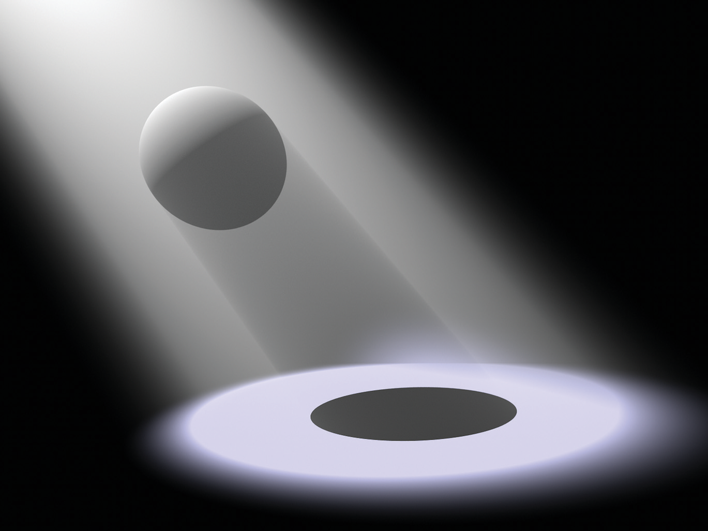

[toc]

# 1 Introduction / 系统概述

Rendering is the process of producing an image from the description of a 3D scene. Obviously, this is a very broad task, and there are many ways to approach it. Physically based techniques attempt to simulate reality; that is, they use principles of physics to model the interaction of light and matter. While a physically based approach may seem to be the most obvious way to approach rendering, it has only been widely adopted in practice over the past 10 or so years. Section 1.7 at the end of this chapter gives a brief history of physically based rendering and its recent adoption for offline rendering for movies and for interactive rendering for games.

This book describes pbrt, a physically based rendering system based on the ray-tracing algorithm. Most computer graphics books present algorithms and theory, sometimes combined with snippets of code. In contrast, this book couples the theory with a complete implementation of a fully functional rendering system. The full source code to the system is available under the BSD license. Further information, including example scenes and a collection of data for rendering can be found on the pbrt Web site, pbrt.org.

渲染是根据 3D 场景的描述生成图像的过程。显然，这是一个非常广泛的任务，有很多方法可以实现它。基于物理的技术试图模拟现实；也就是说，他们使用物理学原理来模拟光与物质的相互作用。虽然基于物理的方法似乎是处理渲染的最显而易见的方法，但它在过去 10 年左右的实践中才被广泛采用。本章末尾的1.7节 简要介绍了基于物理的渲染及其最近在电影离线渲染和游戏交互式渲染中的应用。

本书介绍了pbrt，一种基于光线追踪算法的基于物理的渲染系统。大多数计算机图形书籍都介绍了算法和理论，有时还结合了代码片段。相比之下，本书将理论与全功能渲染系统的完整实现相结合。系统的完整源代码在 BSD 许可下可用。可以在pbrt网站pbrt.org上找到更多信息，包括示例场景和用于渲染的数据集合 。

## 1.1 Literate Programming / 文学编程

While writing the TEX typesetting system, Donald Knuth developed a new programming methodology based on the simple but revolutionary idea that programs should be written more for people’s consumption than for computers’ consumption. He named this methodology literate programming. This book (including the chapter you’re reading now) is a long literate program. This means that in the course of reading this book, you will read the full implementation of the pbrt rendering system, not just a high-level description of it.

Literate programs are written in a metalanguage that mixes a document formatting language (e.g., TEX or HTML) and a programming language (e.g., C++). Two separate systems process the program: a “weaver” that transforms the literate program into a document suitable for typesetting and a “tangler” that produces source code suitable for compilation. Our literate programming system is homegrown, but it was heavily influenced by Norman Ramsey’s noweb system.

The literate programming metalanguage provides two important features. The first is the ability to mix prose with source code. This feature makes the description of the program just as important as its actual source code, encouraging careful design and documentation. Second, the language provides mechanisms for presenting the program code to the reader in an order that is entirely different from the compiler input. Thus, the program can be described in a logical manner. Each named block of code is called a fragment, and each fragment can refer to other fragments by name.

As a simple example, consider a function InitGlobals() that is responsible for initializing all of a program’s global variables:†

在编写 TEX 排版系统时，Donald Knuth 开发了一种新的编程方法，该方法基于一个简单但具有革命性的想法，即 程序应该更多地让人类便于理解而不是让计算机便于理解。他将这种方法命名为文学编程。这本书（包括你现在正在阅读的那一章）是一个很长的文学编程。这意味着在阅读本书的过程中，您将阅读pbrt渲染系统的完整实现，而不仅仅是对其的高级描述。

文学编程是用混合了文档格式语言（例如 TEX 或 HTML）和编程语言（例如 C++）的元语言编写的。两个独立的系统处理程序：一个“weaver”将文学编程转换成适合排版的文档，一个“tangler”生成适合编译的源代码。我们的文学编程系统是独立开发的，但它深受 Norman Ramsey 的noweb系统的影响。

文学编程元语言提供了两个重要的特性。首先是将散文与源代码混合的能力。此功能使程序的描述与其实际源代码一样重要，鼓励仔细设计和记录。其次，该语言提供了一种机制，用于以与编译器输入完全不同的顺序向读者呈现程序代码。因此，可以以逻辑方式描述程序。每个命名的代码块称为一个 片段，每个片段可以通过名称引用其他片段。

作为一个简单的例子，考虑一个函数InitGlobals()，它负责初始化程序的所有全局变量：

```
void InitGlobals() {
    nMarbles = 25.7;
    shoeSize = 13;
    dielectric = true;
}
```

Despite its brevity, this function is hard to understand without any context. Why, for example, can the variable nMarbles take on floating-point values? Just looking at the code, one would need to search through the entire program to see where each variable is declared and how it is used in order to understand its purpose and the meanings of its legal values. Although this structuring of the system is fine for a compiler, a human reader would much rather see the initialization code for each variable presented separately, near the code that actually declares and uses the variable.

In a literate program, one can instead write InitGlobals() like this:

尽管它很简短，但如果没有任何上下文，这个函数很难理解。例如，为什么变量nMarbles可以采用浮点值？仅查看代码，就需要搜索整个程序，看看每个变量在哪里声明，以及如何使用它，以便了解其目的及其合法值的含义。虽然系统的这种结构对于编译器来说很好，但人类读者更愿意看到，分别展示每个变量初始化代码，靠近实际声明和实际使用的地方。

在一个文学编程中，你可以这样写InitGlobals()：

```
<<Function Definitions>>= 
void InitGlobals() {
​    <<Initialize Global Variables>> 
}
```

This defines a fragment, called <<*Function Definitions*>>, that contains the definition of the InitGlobals() function. The InitGlobals() function itself refers to another fragment, <<*Initialize Global Variables*>>. Because the initialization fragment has not yet been defined, we don’t know anything about this function except that it will probably contain assignments to global variables. (However, we can peek ahead by clicking on the plus sign on the right side of it; doing so expands out all of the fragment’s final code.)

Just having the fragment name is just the right level of abstraction for now, since no variables have been declared yet. When we introduce the global variable shoeSize somewhere later in the program, we can then write

这定义了一个名为 <<*Function Definitions*>>的片段，其中包含InitGlobals()函数的定义。该 InitGlobals()函数本身引用了另一个片段 <<*Initialize Global Variables*>>。因为初始化片段还没有被定义，我们对这个函数一无所知，除了它可能包含对全局变量的赋值。（但是，我们可以通过单击它右侧的加号来向前看；这样做会展开所有片段的最终代码。译注：原版书的网页版中可以点击按钮跳转到对应代码片段，本翻译暂不支持跳转）

现在定义的片段名称目前只是一个抽象，因为还没有声明任何变量。当我们在程序后面的某个地方引入全局变量shoesSize 时，我们可以这样写

```
<<Initialize Global Variables>>= 
shoeSize = 13;
```

Here we have started to define the contents of <<*Initialize Global Variables*>>. When the literate program is tangled into source code for compilation, the literate programming system will substitute the code shoeSize = 13; inside the definition of the InitGlobals() function. The symbol after the equals sign indicates that more code will later be added to this fragment. Clicking on it brings you to where that happens.

Later in the text, we may define another global variable, dielectric, and we can append its initialization to the fragment:

这里我们开始定义<<*Initialize Global Variable*s>>的内容。当文学编程使用tangler对源代码进行编译时，文学编程系统会代入代码 shoeSize = 13;在InitGlobals() 函数的定义中，这等号后面的符号表示稍后将向此片段添加更多代码。单击它会将您带到发生这种情况的地方。

在本文的后面，我们可以定义另一个全局变量 dielectric，我们可以将其初始化附加到片段中：

```
<<Initialize Global Variables>>+= 
dielectric = true;
```

The += symbol after the fragment name shows that we have added to a previously defined fragment. Further, the symbol links back to the previous place where <<*Initialize Global Variables*>> had code added to it.

When tangled, these three fragments turn into the code

片段名称后面的+=符号表示，我们把代码加入到之前定义的片段中。此外，该符号链接回之前<<*Initialize Global Variables*>> 添加代码的位置。

用tangler编译时，这三个片段就变成了代码

```
void InitGlobals() {
    // Initialize Global Variables
    shoeSize = 13;
    dielectric = true;
}
```

In this way, we can decompose complex functions into logically distinct parts, making them much easier to understand. For example, we can write a complicated function as a series of fragments:

通过这种方式，我们可以将复杂的函数分解成逻辑上不同的部分，使它们更容易理解。例如，我们可以将一个复杂的函数写成一系列片段：

```
<<Function Definitions>>+= 
void complexFunc(int x, int y, double *values) {
    <<Check validity of arguments>>
    if (x < y) {
        <<Swap parameter values>>
    }
    <<Do precomputation before loop>>
    <<Loop through and update \mono{values} array>>
}
```

Again, the contents of each fragment are expanded inline in complexFunc() for compilation. In the document, we can introduce each fragment and its implementation in turn. This decomposition lets us present code a few lines at a time, making it easier to understand. Another advantage of this style of programming is that by separating the function into logical fragments, each with a single and well-delineated purpose, each one can then be written, verified, or read independently. In general, we will try to make each fragment less than 10 lines long.

In some sense, the literate programming system is just an enhanced macro substitution package tuned to the task of rearranging program source code. This may seem like a trivial change, but in fact literate programming is quite different from other ways of structuring software systems.

同样，每个片段的内容在complexFunc() 中内联展开以进行编译。在文档中，我们可以依次介绍每个片段及其实现。这种分解让我们一次展示几行代码，使其更容易理解。这种编程风格的另一个优点是，通过将函数分成逻辑片段，每个片段都有一个明确的目的，然后每个片段都可以独立编写、验证或读取。一般来说，我们会尽量让每个片段的长度少于 10 行。

从某种意义上说，文学编程系统只是针对重新排列程序源代码的任务而调整的增强型宏替换包。这似乎是一个微不足道的变化，但实际上，文学编程与构建软件系统的其他方式大不相同。

## 1.2 Photorealistic Rendering and the Ray-Tracing Algorithm / 真实感渲染和光线追踪算法

The goal of photorealistic rendering is to create an image of a 3D scene that is indistinguishable from a photograph of the same scene. Before we describe the rendering process, it is important to understand that in this context the word indistinguishable is imprecise because it involves a human observer, and different observers may perceive the same image differently. Although we will cover a few perceptual issues in this book, accounting for the precise characteristics of a given observer is a very difficult and largely unsolved problem. For the most part, we will be satisfied with an accurate simulation of the physics of light and its interaction with matter, relying on our understanding of display technology to present the best possible image to the viewer.

Almost all photorealistic rendering systems are based on the ray-tracing algorithm. Ray tracing is actually a very simple algorithm; it is based on following the path of a ray of light through a scene as it interacts with and bounces off objects in an environment. Although there are many ways to write a ray tracer, all such systems simulate at least the following objects and phenomena:

* Cameras: A camera model determines how and from where the scene is being viewed, including how an image of the scene is recorded on a sensor. Many rendering systems generate viewing rays starting at the camera that are then traced into the scene.

* Ray–object intersections: We must be able to tell precisely where a given ray intersects a given geometric object. In addition, we need to determine certain properties of the object at the intersection point, such as a surface normal or its material. Most ray tracers also have some facility for testing the intersection of a ray with multiple objects, typically returning the closest intersection along the ray.

* Light sources: Without lighting, there would be little point in rendering a scene. A ray tracer must model the distribution of light throughout the scene, including not only the locations of the lights themselves but also the way in which they distribute their energy throughout space.

* Visibility: In order to know whether a given light deposits energy at a point on a surface, we must know whether there is an uninterrupted path from the point to the light source. Fortunately, this question is easy to answer in a ray tracer, since we can just construct the ray from the surface to the light, find the closest ray–object intersection, and compare the intersection distance to the light distance.

* Surface scattering: Each object must provide a description of its appearance, including information about how light interacts with the object’s surface, as well as the nature of the reradiated (or scattered) light. Models for surface scattering are typically parameterized so that they can simulate a variety of appearances.

* Indirect light transport: Because light can arrive at a surface after bouncing off or passing through other surfaces, it is usually necessary to trace additional rays originating at the surface to fully capture this effect.

* Ray propagation: We need to know what happens to the light traveling along a ray as it passes through space. If we are rendering a scene in a vacuum, light energy remains constant along a ray. Although true vacuums are unusual on Earth, they are a reasonable approximation for many environments. More sophisticated models are available for tracing rays through fog, smoke, the Earth’s atmosphere, and so on.

We will briefly discuss each of these simulation tasks in this section. In the next section, we will show pbrt’s high-level interface to the underlying simulation components and follow the progress of a single ray through the main rendering loop. We will also present the implementation of a surface scattering model based on Turner Whitted’s original ray-tracing algorithm.

真实感渲染的目标是创建与同一场景的照片无法区分的 3D 场景图像。在我们描述渲染过程之前，重要的是要了解在这种情况下无法区分这个词是不精确的，因为它涉及人类观察者，不同的观察者可能会以不同的方式感知同一图像。尽管我们将在本书中讨论一些感知问题，但要说明给定观察者的精确特征是一个非常困难，且在很大程度上未解决的问题。在大多数情况下，我们会对光物理及其与物质相互作用的准确模拟感到满意，这依赖于我们对显示技术的理解，以向观看者呈现尽可能好的图像。

几乎所有的真实感渲染系统都基于光线追踪算法。光线追踪实际上是一个非常简单的算法；它基于跟随光线穿过场景的路径，光线与环境中的物体相互作用并从物体上反弹。尽管有很多方法可以编写光线追踪器，但所有这些系统都至少模拟以下对象和现象：

* 相机：相机模型决定了如何以及从何处查看场景，包括如何在传感器上记录场景图像。许多渲染系统从相机开始生成观察光线，然后追踪到场景中。

* 光线与对象相交：我们必须能够准确地分辨出给定的光线与给定的几何对象相交的位置。此外，我们还需要确定交点处对象的某些属性，例如表面法线或其材质。大多数光线追踪器还具有一些用于测试光线与多个对象的交点的工具，通常返回沿光线最近的交点。

* 光源：没有照明，渲染场景就没有意义。光线追踪器必须对整个场景中的光分布进行建模，不仅包括光本身的位置，还包括它们在整个空间中分布能量的方式。

* 可见性：为了知道给定的光是否在表面上某一点贡献了能量，我们必须知道从该点到光源是否有一条不间断的路径。幸运的是，这个问题在光线追踪器中很容易回答，因为我们可以构建从表面到光源的光线，找到最近的光线与物体的交点，然后将交点距离与光源距离进行比较。

* 表面散射： 每个对象必须提供其外观的描述，包括有关光如何与对象表面相互作用的信息，以及再辐射 reradiated（或散射 scattered）光的性质。表面散射模型通常被参数化，以便它们可以模拟各种外观。

* 间接光传输：因为光可以在反弹或穿过其他表面后到达表面，通常需要追踪源自表面的额外光线以完全捕捉这种效果。

* 光线传播： 我们需要知道光沿着光线穿过空间会发生什么。如果我们在真空中渲染场景，光能沿着光线保持恒定。尽管真正的真空在地球上并不常见，但对于许多环境来说，它们是一个合理的近似值。更复杂的模型可用于追踪穿过雾、烟、地球大气层等的光线。

我们将在本节中简要讨论这些模拟任务中的每一个。在下一节中，我们将展示pbrt与底层模拟组件的高级接口，并通过主渲染循环跟踪单个光线的进度。我们还将展示基于 Turner Whitted 的原始光线追踪算法的表面散射模型的实现。

### 1.2.1 Cameras / 相机

Nearly everyone has used a camera and is familiar with its basic functionality: you indicate your desire to record an image of the world (usually by pressing a button or tapping a screen), and the image is recorded onto a piece of film or an electronic sensor. One of the simplest devices for taking photographs is called the pinhole camera. Pinhole cameras consist of a light-tight box with a tiny hole at one end (Figure 1.1). When the hole is uncovered, light enters this hole and falls on a piece of photographic paper that is affixed to the other end of the box. Despite its simplicity, this kind of camera is still used today, frequently for artistic purposes. Very long exposure times are necessary to get enough light on the film to form an image.

几乎每个人都使用过相机并熟悉它的基本功能：您表示想要记录世界的图像（通常通过按下按钮或轻敲屏幕），然后将图像记录到胶片或电子设备上传感器。最简单的拍照设备之一叫做 针孔相机。针孔相机由一个不透光的盒子组成，一端有一个小孔（图 1.1）。当洞被揭开时，光线进入这个洞并落在贴在盒子另一端的相纸上。尽管它很简单，但这种相机今天仍在使用，经常用于艺术目的。需要很长的曝光时间才能在胶片上获得足够的光线以形成图像。


Figure 1.1: A Pinhole Camera.

图 1.1：针孔相机。

Although most cameras are substantially more complex than the pinhole camera, it is a convenient starting point for simulation. The most important function of the camera is to define the portion of the scene that will be recorded onto the film. In Figure 1.1, we can see how connecting the pinhole to the edges of the film creates a double pyramid that extends into the scene. Objects that are not inside this pyramid cannot be imaged onto the film. Because actual cameras image a more complex shape than a pyramid, we will refer to the region of space that can potentially be imaged onto the film as the viewing volume.

Another way to think about the pinhole camera is to place the film plane in front of the pinhole but at the same distance (Figure 1.2). Note that connecting the hole to the film defines exactly the same viewing volume as before. Of course, this is not a practical way to build a real camera, but for simulation purposes it is a convenient abstraction. When the film (or image) plane is in front of the pinhole, the pinhole is frequently referred to as the eye.

虽然大多数相机比针孔相机复杂得多，但它是一个方便的模拟起点。相机最重要的功能是定义将被记录到胶片上的场景部分。在图 1.1 中，我们可以看到如何将针孔与胶片边缘连接，创建一个延伸到场景中的双向锥体。不在此锥体内的物体无法在胶片上成像。由于实际相机成像的形状比锥体更复杂，因此我们将可能在胶片上成像的空间区域称为视景体(viewing volume)。

对针孔相机的另一种理解是将胶片平面放置在针孔前面但与图1.1中的胶片距离相同（图 1.2）。请注意，将针孔连接胶片后形成了与以前完全相同的视景体。当然，真实相机不是这么做的，但出于模拟目的，它是一种方便的抽象。当胶片（或图像）平面位于针孔之前时，针孔通常被称为眼睛(eye)。


Figure 1.2: When we simulate a pinhole camera, we place the film in front of the hole at the near plane, and the hole is renamed the eye.

图 1.2：当我们模拟针孔相机时，我们将胶片放置在近平面孔的前面，孔被重命名为眼睛(eye)。

Now we come to the crucial issue in rendering: at each point in the image, what color value does the camera record? If we recall the original pinhole camera, it is clear that only light rays that travel along the vector between the pinhole and a point on the film can contribute to that film location. In our simulated camera with the film plane in front of the eye, we are interested in the amount of light traveling from the image point to the eye.

Therefore, an important task of the camera simulator is to take a point on the image and generate rays along which incident light will contribute to that image location. Because a ray consists of an origin point and a direction vector, this task is particularly simple for the pinhole camera model of Figure 1.2: it uses the pinhole for the origin and the vector from the pinhole to the near plane as the ray’s direction. For more complex camera models involving multiple lenses, the calculation of the ray that corresponds to a given point on the image may be more involved. (Section 6.4 describes the implementation of such a model.)

With the process of converting image locations to rays completely encapsulated in the camera module, the rest of the rendering system can focus on evaluating the lighting along those rays, and a variety of camera models can be supported. pbrt’s camera abstraction is described in detail in Chapter 6.

现在我们来到渲染的关键问题：在图像中的每个点，相机记录什么颜色值？如果我们回忆一下最初的针孔相机，很明显只有沿着针孔和胶片上某个点之间的向量传播的光线才能对那个胶片位置做出贡献。在我们的模拟相机中，胶卷平面在眼睛前面，我们关注的是从像点到眼睛的光量。

因此，相机模拟器的一项重要任务是在图像上取一个点并生成光线(ray)，入射光将沿着这些光线到达该图像位置。因为一条光线由一个原点和一个方向向量组成，所以这个任务对于图1.2的针孔相机模型来说特别简单 ：它使用针孔作为原点，使用从针孔到近平面的向量作为光线的方向。对于涉及多个镜头的更复杂的相机模型，图像上给定点对应的光线计算可能更复杂。（第6.4节 描述了这种模型的实现。）

通过将图像位置转换为完全封装在相机模块中的光线的过程，渲染系统的其余部分可以专注于沿着这些光线计算光照，并且可以支持各种相机模型。 pbrt的相机抽象在第6章中详细描述 。

### 1.2.2 Ray–Object Intersections / 光线-对象相交

Each time the camera generates a ray, the first task of the renderer is to determine which object, if any, that ray intersects first and where the intersection occurs. This intersection point is the visible point along the ray, and we will want to simulate the interaction of light with the object at this point. To find the intersection, we must test the ray for intersection against all objects in the scene and select the one that the ray intersects first. Given a ray $r$, we first start by writing it in parametric form:

每次相机生成一条光线时，渲染器的第一个任务是确定该光线首先与哪个对象（如果有）相交以及相交发生的位置。这个交点是沿着光线的可见点，我们将要模拟光与物体在这一点上的相互作用。为了找到交点，我们必须测试光线与场景中所有对象的相交，并选择光线首先相交的那个。给定一条光线 $r$ ，我们首先以参数形式编写它： 

$$
\mathrm{r}(t)=\mathrm{o}+t \mathrm{~d}
$$

where $o$ is the ray’s origin, $d$ is its direction vector, and $t$ is a parameter whose legal range is $(0, \infty)$ . We can obtain a point along the ray by specifying its parametric $t$ value and evaluating the above equation.

It is often easy to find the intersection between the ray $r$ and a surface defined by an implicit function $F(x, y, z) = 0$. We first substitute the ray equation into the implicit equation, producing a new function whose only parameter is $t$. We then solve this function for $t$ and substitute the smallest positive root into the ray equation to find the desired point. For example, the implicit equation of a sphere centered at the origin with radius $r$ is

其中 $o$ 是光线的原点， $d$ 是它的方向向量， $t$ 是一个参数，其合法范围是 $(0, \infty)$ 。我们可以通过指定其参数值 $t$ 并计算上述方程来获得沿光线的一个点。 

通常很容易找到光线 $r$ 和由隐函数 $F(x, y, z) = 0$ 定义的表面之间的交点。我们首先将光线方程代入隐式方程，产生一个唯一参数为 $t$ 的新函数。然后我们求解这个函数的值 $t$ ，并将最小的正根代入光线方程以找到所需的点。例如，以原点为圆心， $r$ 为半径的球体的隐式方程 为 

$$
x^{2}+y^{2}+z^{2}-r^{2}=0
$$

Substituting the ray equation, we have

代入光线方程，我们有

$$
\left(\mathrm{o}_{x}+t \mathbf{d}_{x}\right)^{2}+\left(\mathrm{o}_{y}+t \mathbf{d}_{y}\right)^{2}+\left(\mathrm{o}_{z}+t \mathbf{d}_{z}\right)^{2}-r^{2}=0
$$

All of the values besides $t$ are known, giving us an easily solved quadratic equation in $t$. If there are no real roots, the ray misses the sphere; if there are roots, the smallest positive one gives the intersection point.

The intersection point alone is not enough information for the rest of the ray tracer; it needs to know certain properties of the surface at the point. First, a representation of the material at the point must be determined and passed along to later stages of the ray-tracing algorithm. Second, additional geometric information about the intersection point will also be required in order to shade the point. For example, the surface normal $n$ is always required. Although many ray tracers operate with only $n$, more sophisticated rendering systems like pbrt require even more information, such as various partial derivatives of position and surface normal with respect to the local parameterization of the surface.

Of course, most scenes are made up of multiple objects. The brute-force approach would be to test the ray against each object in turn, choosing the minimum positive $t$ value of all intersections to find the closest intersection. This approach, while correct, is very slow, even for scenes of modest complexity. A better approach is to incorporate an acceleration structure that quickly rejects whole groups of objects during the ray intersection process. This ability to quickly cull irrelevant geometry means that ray tracing frequently runs in $O(I \log N)$ time, where $I$ is the number of pixels in the image and $N$ is the number of objects in the scene. (Building the acceleration structure itself is necessarily at least $O(N)$ time, however.)

pbrt’s geometric interface and implementations of it for a variety of shapes is described in Chapter 3, and the acceleration interface and implementations are shown in Chapter 4.

除 $t$ 以外的所有值都是已知的，从而为我们提供了一个易于求解 $t$ 的二次方程。如果没有实根，光线就会错过球体；如果有根，最小的正数给出交点。 

对于光线追踪器的其余部分，仅交点是不够的；它需要知道该点表面的某些属性。首先，必须确定该点处的材质，并将其传递到光线追踪算法的后续阶段。其次，还需要关于交点的额外几何信息来给该点着色。例如，始终需要表面法线 $n$ 。尽管许多光线追踪器仅使用 $n$ ，但更复杂的渲染系统（如pbrt）需要更多信息，例如相对于表面局部参数化的位置和表面法线的偏导数。 

当然，大多数场景都是由多个对象组成的。暴力方法是依次针对每个对象测试光线，选择所有交点的最小正值 $t$ 以找到最近的交点。这种方法虽然正确，但速度非常慢，即使对于复杂度适中的场景也是如此。更好的方法是结合一个 加速结构，在光线相交过程中快速剔除整组对象。这种快速剔除不相关几何体的能力意味着光线追踪经常以 $O(I \log N)$ 速度运行，其中 $I$ 是图像中的像素数， $N$ 是场景中的对象数。 （然而，构建加速结构本身至少需要 $O(N)$ 时间。） 

pbrt的几何接口及其对各种形状的实现在第3章中描述， 加速接口和实现在第4章中展示 。

### 1.2.3 Light Distribution / 光分布

The ray–object intersection stage gives us a point to be shaded and some information about the local geometry at that point. Recall that our eventual goal is to find the amount of light leaving this point in the direction of the camera. In order to do this, we need to know how much light is arriving at this point. This involves both the geometric and radiometric distribution of light in the scene. For very simple light sources (e.g., point lights), the geometric distribution of lighting is a simple matter of knowing the position of the lights. However, point lights do not exist in the real world, and so physically based lighting is often based on area light sources. This means that the light source is associated with a geometric object that emits illumination from its surface. However, we will use point lights in this section to illustrate the components of light distribution; rigorous discussion of light measurement and distribution is the topic of Chapters 5 and 12.

We frequently would like to know the amount of light power being deposited on the differential area surrounding the intersection point (Figure 1.3). We will assume that the point light source has some power $\Phi$ associated with it and that it radiates light equally in all directions. This means that the power per area on a unit sphere surrounding the light is $\Phi/(4\pi)$.(These measurements will be explained and formalized in Section 5.4.)

光线-对象相交阶段为我们提供了一个要着色的点以及有关该点局部几何形状的一些信息。回想一下，我们的最终目标是找到沿着相机方向离开这个点的光的数量。为了做到这一点，我们需要知道此时有多少光到达。这涉及场景中光的 几何分布和辐射分布。对于非常简单的光源（例如，点光源），照明的几何分布可以转化为找到灯光位置的简单问题。但是，现实世界中并不存在点光源，因此基于物理的照明通常基于面光源。这意味着光源与从其表面发射照明的几何对象相关联。但是，我们将在本节中使用点光源来说明光分布的组成部分；光测量和分布的严格讨论将在5 和 12章进行。

我们经常想知道在交点周围的微分区域上沉积的光功率的大小（图 1.3）。我们将假设点光源的功率为 $\Phi$ ，并且它在所有方向上均等地辐射光。这意味着围绕光的单位球体上的单位面积功率为 $\Phi/(4\pi)$. （这些测量将在第5.4节中解释和形式化 。） 


Figure 1.3: Geometric construction for determining the power per area arriving at a point due to a point light source. The distance from the point to the light source is denoted by $r$.

图 1.3：用于确定点光源照射下落到某一点的单位面积功率的几何结构。点到光源的距离用 $r$ 表示。

If we consider two such spheres (Figure 1.4), it is clear that the power per area at a point on the larger sphere must be less than the power at a point on the smaller sphere because the same total power is distributed over a larger area. Specifically, the power per area arriving at a point on a sphere of radius $r$ is proportional to $1 / r^2$.

如果我们考虑两个这样的球体（图 1.4），很明显，较大球体上一点的单位面积功率必须小于较小球体上一点的功率，因为相同的总功率分布在较大面积上. 具体来说，到达半径 $r$ 球体上一点的单位面积功率与 $1 / r^2$ 成正比。 


Figure 1.4: Since the point light radiates light equally in all directions, the same total power is deposited on all spheres centered at the light.

图 1.4：由于点光源在所有方向上均等地辐射光，因此相同的总功率落到以光为中心的所有球体上。

Furthermore, it can be shown that if the tiny surface patch $dA$ is tilted by an angle $\theta$ away from the vector from the surface point to the light, the amount of power deposited on $dA$ is proportional to $\cos\theta$. Putting this all together, the differential power per area $dE$ (the differential irradiance) is

此外，可以证明，如果微小的表面 $dA$ 上的点到光的向量之间，存在一个倾斜的角度 $\theta$ ，则落在 $dA$ 上的功率量与 $\cos\theta$ 成正比 。综上所述，单位面积 $dE$ 的微分功率（微分辐照度）为

$$
\mathrm{d} E=\frac{\Phi \cos \theta}{4 \pi r^{2}}
$$

Readers already familiar with basic lighting in computer graphics will notice two familiar laws encoded in this equation: the cosine falloff of light for tilted surfaces mentioned above, and the one-over-$r$-squared falloff of light with distance.

Scenes with multiple lights are easily handled because illumination is linear: the contribution of each light can be computed separately and summed to obtain the overall contribution.

已经熟悉计算机图形学中基本照明的读者，会注意到这个方程中编码的两个熟悉的定律：上面提到的光在倾斜表面的余弦衰减，以及光随距离 $r$ 的平方衰减。 

具有多个灯光的场景很容易处理，因为照明是线性的：可以单独计算每个灯光的贡献并求和以获得整体贡献。

### 1.2.4 Visibility / 可见性

The lighting distribution described in the previous section ignores one very important component: shadows. Each light contributes illumination to the point being shaded only if the path from the point to the light’s position is unobstructed (Figure 1.5).

上一节中描述的光照分布忽略了一个非常重要的组成部分：阴影。仅当从着色点到光源位置之间的路径畅通无阻时，每个光才会为被着色的点提供照明（图 1.5）。


Figure 1.5: A light source only deposits energy on a surface if the source is not obscured as seen from the receiving point. The light source on the left illuminates the point $p$, but the light source on the right does not.

图 1.5：只有从接收点看光源没有被遮挡，光源才会在表面上沉积能量。左边的光源照亮了这个点 $p$ ，但右边的光源没有。

Fortunately, in a ray tracer it is easy to determine if the light is visible from the point being shaded. We simply construct a new ray whose origin is at the surface point and whose direction points toward the light. These special rays are called shadow rays. If we trace this ray through the environment, we can check to see whether any intersections are found between the ray’s origin and the light source by comparing the parametric $t$ value of any intersections found to the parametric $t$ value along the ray of the light source position. If there is no blocking object between the light and the surface, the light’s contribution is included.

幸运的是，在光线追踪器中很容易确定被着色点是否可以看到光。我们简单地构造一条新的光线，它的原点在表面着色点，方向指向光。这些特殊光线称为阴影光线。如果我们在环境中追踪这条光线，我们可以通过将找到的任何交点的参数值 $t$ ，与到达光源位置的参数值 $t$ 进行比较，来检查是否在光线的原点和光源之间找到了任何交点。如果灯光和表面之间没有阻挡对象，则灯光将照亮该点。 

### 1.2.5 Surface Scattering / 表面散射

We now are able to compute two pieces of information that are vital for proper shading of a point: its location and the incident lighting.† Now we need to determine how the incident lighting is scattered at the surface. Specifically, we are interested in the amount of light energy scattered back along the ray that we originally traced to find the intersection point, since that ray leads to the camera (Figure 1.6).

我们现在能够计算，对正确着色一个点的至关重要的两个信息：它的位置和入射光。现在我们需要确定入射光如何在表面散射。具体来说，我们对沿着最初找到交点的追踪光线散射回来的光能量感兴趣，因为该光线通向相机（图 1.6）。


Figure 1.6: The Geometry of Surface Scattering. Incident light arriving along direction $\omega_i$ interacts with the surface at point $p$ and is scattered back toward the camera along direction $\omega_o$. The amount of light scattered toward the camera is given by the product of the incident light energy and the BRDF.

图 1.6：表面散射的几何形状。沿方向 $\omega_i$ 到达的入射光在点 $p$ 处与表面相互作用，并沿方向 $\omega_o$ 散射回相机 。向相机散射的光量由入射光能和 BRDF 的乘积给出。

Each object in the scene provides a material, which is a description of its appearance properties at each point on the surface. This description is given by the bidirectional reflectance distribution function (BRDF). This function tells us how much energy is reflected from an incoming direction $\omega_i$ to an outgoing direction $\omega_o$. We will write the BRDF at $p$ as $f_{\mathrm{r}}\left(\mathrm{p}, \omega_{\mathrm{o}}, \omega_{\mathrm{i}}\right)$. Now, computing the amount of light $L$ scattered back toward the camera is straightforward:

场景中的每个对象都提供了一个材质，它是对其表面上每个点的外观属性的描述。该描述由双向反射分布函数(BRDF) 给出。这个函数告诉我们有多少能量从入射方向 $\omega_i$ 反射到出射方向 $\omega_o$ 。我们将 $p$ 点BRDF 写为 $f_{\mathrm{r}}\left(\mathrm{p}, \omega_{\mathrm{o}}, \omega_{\mathrm{i}}\right)$ 。现在，计算散射回相机的光量 $L$ 很简单： 

```
for each light:
    if light is not blocked:
        incident_light = light.L(point)
        amount_reflected = 
            surface.BRDF(hit_point, camera_vector, light_vector)
        L += amount_reflected * incident_light
```

Here we are using the symbol $L$ to represent the light; this represents a slightly different unit for light measurement than $dE$, which was used before. $L$ represents radiance, a unit for measuring light that we will see much of in the following.

It is easy to generalize the notion of a BRDF to transmitted light (obtaining a BTDF) or to general scattering of light arriving from either side of the surface. A function that describes general scattering is called a bidirectional scattering distribution function (BSDF). pbrt supports a variety of BSDF models; they are described in Chapter 8. More complex yet is the bidirectional scattering surface reflectance distribution function (BSSRDF), which models light that exits a surface at a different point than it enters. The BSSRDF is described in Sections 5.6.2, 11.4, and 15.5.

这里我们用符号 $L$ 来代表光；这个光测量单位与之前使用的 $dE$ 略有不同。 $L$ 表示radiance，一种用于测量光的单位，我们将在下文中看到很多。 

很容易将 BRDF 的概念推广到透射光（获得 BTDF），或从表面任一侧到达的光的一般散射。描述一般散射的函数称为双向散射分布函数(BSDF)。 pbrt支持多种 BSDF 模型；它们在第8章中描述 。更复杂的是 双向散射表面反射分布函数(BSSRDF)，它对从不同点进入表面的光进行建模。 5.6.2，11.4，和 15.5 将介绍BSSRDF。

### 1.2.6 Indirect Light Transport / 间接光传输

Turner Whitted’s original paper on ray tracing (1980) emphasized its recursive nature, which was the key that made it possible to include indirect specular reflection and transmission in rendered images. For example, if a ray from the camera hits a shiny object like a mirror, we can reflect the ray about the surface normal at the intersection point and recursively invoke the ray-tracing routine to find the light arriving at the point on the mirror, adding its contribution to the original camera ray. This same technique can be used to trace transmitted rays that intersect transparent objects. For a long time, most early ray-tracing examples showcased mirrors and glass balls (Figure 1.7) because these types of effects were difficult to capture with other rendering techniques.

Turner Whitted 关于光线追踪的原始论文 ( 1980 ) 强调了其 递归性质，这是使渲染图像中包括间接镜面反射和透射成为可能的关键。例如，如果来自相机的光线照射到像镜子一样的闪亮物体，我们可以在交点处围绕表面法线反射光线，并递归调用光线跟踪程序以找到到达镜子上的点的光线，将其贡献添加到原始相机光线中。同样的技术可用于追踪与透明物体相交的透射光线。长期以来，大多数早期的光线追踪示例都展示了镜子和玻璃球（图 1.7) 因为这些类型的效果很难用其他渲染技术捕捉到。


Figure 1.7: A Prototypical Early Ray Tracing Scene. Note the use of mirrored and glass objects, which emphasizes the algorithm’s ability to handle these kinds of surfaces. (1) Rendered using Whitted ray tracing, and (2) rendered using stochastic progressive photon mapping (SPPM), an advanced light transport algorithm that will be introduced in Section 16.2. SPPM is able to accurately simulate the focusing of light that passes through the spheres.

图 1.7：原型早期光线追踪场景。 请注意镜像和玻璃对象的使用，这强调了算法处理这些类型表面的能力。(1) 使用 Whitted 光线追踪渲染，以及 (2) 使用随机渐进光子映射(SPPM)渲染 ，这是一种将在16.2节中介绍的高级光传输算法 。SPPM 能够准确模拟穿过球体的光的聚焦。

In general, the amount of light that reaches the camera from a point on an object is given by the sum of light emitted by the object (if it is itself a light source) and the amount of reflected light. This idea is formalized by the light transport equation (also often known as the rendering equation), which says that the outgoing radiance $L_{\mathrm{o}}\left(\mathrm{p}, \omega_{\mathrm{o}}\right)$ from a point $p$ in direction $\omega_o$ is the emitted radiance at that point in that direction,$L_{\mathrm{e}}\left(\mathrm{p}, \omega_{\mathrm{o}}\right)$, plus the incident radiance from all directions on the sphere $S^2$ around $p$ scaled by the BSDF $f\left(\mathrm{p}, \omega_{\mathrm{o}}, \omega_{\mathrm{i}}\right)$ and a cosine term:

一般来说，从物体上的一点到达相机的光量由物体发出的光（如果它本身是光源）和反射光的量之和给出。这个想法由光传输方程（也通常称为 渲染方程）形式化，它表示方向 $\omega_o$ 上的点 $p$ 的出射辐射 $L_{\mathrm{o}}\left(\mathrm{p}, \omega_{\mathrm{o}}\right)$ 是该方向上该点的自发光辐射 $L_{\mathrm{e}}\left(\mathrm{p}, \omega_{\mathrm{o}}\right)$ ，加上来自 $p$ 为中心的球体 $S^2$ 所有方向上的入射辐射乘以缩放系数BSDF $f\left(\mathrm{p}, \omega_{\mathrm{o}}, \omega_{\mathrm{i}}\right)$ 和余弦项： 

$$
L_{o}\left(\mathrm{p}, \omega_{\mathrm{o}}\right)=L_{\mathrm{e}}\left(\mathrm{p}, \omega_{\mathrm{o}}\right)+\int_{\mathrm{S}^{2}} f\left(\mathrm{p}, \omega_{o}, \omega_{\mathrm{i}}\right) L_{\mathrm{i}}\left(\mathrm{p}, \omega_{\mathrm{i}}\right)\left|\cos \theta_{\mathrm{i}}\right| \mathrm{d} \omega_{\mathrm{i}}
$$

(1.1)

We will show a more complete derivation of this equation in Sections 5.6.1 and 14.4. Solving this integral analytically is not possible except for the simplest of scenes, so we must either make simplifying assumptions or use numerical integration techniques.

Whitted’s algorithm simplifies this integral by ignoring incoming light from most directions and only evaluating $L_{\mathrm{i}}\left(\mathrm{p}, \omega_{\mathrm{i}}\right)$ for directions to light sources and for the directions of perfect reflection and refraction. In other words, it turns the integral into a sum over a small number of directions.

Whitted’s method can be extended to capture more effects than just perfect mirrors and glass. For example, by tracing many recursive rays near the mirror-reflection direction and averaging their contributions, we obtain an approximation of glossy reflection. In fact, we can always recursively trace a ray whenever we hit an object. For example, we can randomly choose a reflection direction $\omega_i$ and weight the contribution of this newly spawned ray by evaluating the BRDF $f_{\mathrm{r}}\left(\mathrm{p}, \omega_{\mathrm{o}}, \omega_{\mathrm{i}}\right)$. This simple but powerful idea can lead to very realistic images because it captures all of the interreflection of light between objects. Of course, we need to know when to terminate the recursion, and choosing directions completely at random may make the rendering algorithm slow to converge to a reasonable result. These problems can be addressed, however; these issues are the topics of Chapters 13 through 16.

When we trace rays recursively in this manner, we are really associating a tree of rays with each image location (Figure 1.8), with the ray from the camera at the root of this tree. Each ray in this tree can have a weight associated with it; this allows us to model, for example, shiny surfaces that do not reflect 100% of the incoming light.

我们将在5.6.1 和 14.4节中展示这个方程的更完整的推导 。除了最简单的场景外，无法解析求解此积分，因此我们必须做出简化假设或使用数值积分技术。

Whitted 的算法通过忽略来自大多数方向的入射光，而仅计算 $L_{\mathrm{i}}\left(\mathrm{p}, \omega_{\mathrm{i}}\right)$ 到光源的方向，以及完美反射和折射的方向来简化此积分。换句话说，它将积分转化为少量方向上的总和。 

Whitted 的方法可以扩展到捕捉更多效果，而不仅仅是完美的镜子和玻璃。例如，通过跟踪镜面反射方向附近的许多递归光线并平均它们的贡献，我们获得了光泽反射的近似值。事实上， 每当我们碰到一个物体时，我们总是可以递归地追踪光线。例如，我们可以随机选择一个反射方向 $\omega_i$ ，并通过计算BRDF $f_{\mathrm{r}}\left(\mathrm{p}, \omega_{\mathrm{o}}, \omega_{\mathrm{i}}\right)$ 加权这个新产生的光线的贡献. 这个简单但强大的想法可以产生非常逼真的图像，因为它捕获了物体之间光的所有相互反射。当然，我们需要知道何时终止递归，完全随机选择方向可能会使渲染算法缓慢收敛到合理的结果。然而，这些问题是可以解决的；这些问题是第13 到 16章的主题 。

当我们以这种方式递归地追踪光线时，我们实际上是将 一棵光线树与每个图像位置（图 1.8）相关联，而来自相机的光线位于这棵树的根部。这棵树中的每条光线都可以有一个与之相关的 权重；例如，这允许我们对不能 100% 反射入射光的闪亮表面进行建模。


Figure 1.8: Recursive ray tracing associates an entire tree of rays with each image location.

图 1.8：递归光线追踪将整个光线树与每个图像位置相关联。

### 1.2.7 Ray Propagation / 光线传播

The discussion so far has assumed that rays are traveling through a vacuum. For example, when describing the distribution of light from a point source, we assumed that the light’s power was distributed equally on the surface of a sphere centered at the light without decreasing along the way. The presence of participating media such as smoke, fog, or dust can invalidate this assumption. These effects are important to simulate: even if we are not making a rendering of a smoke-filled room, almost all outdoor scenes are affected substantially by participating media. For example, Earth’s atmosphere causes objects that are farther away to appear less saturated (Figure 1.9).

到目前为止的讨论都假设光线在真空中传播。例如，在描述来自点光源的光分布时，我们假设光的功率均匀分布在以光为中心的球体表面上，并且沿途不会减小。烟雾、雾或灰尘等参与介质的存在可能使这一假设无效。这些效果对于模拟很重要：即使我们不渲染充满烟雾的房间，几乎所有户外场景都会受到参与介质的重大影响。例如，地球的大气层会使距离较远的物体看起来不太饱和（图 1.9）。


Figure 1.9: Earth’s Atmosphere Decreases Saturation with Distance. (1) The scene is rendered without simulating this phenomenon, while (2) includes an atmospheric model. This sort of atmospheric attenuation is an important depth cue when viewing real scenes and adds a sense of scale to the second rendering.

图 1.9：地球大气随着距离的增加而降低饱和度。(1) 场景是在没有模拟这种现象的情况下渲染的，而 (2) 包括一个大气模型。在查看真实场景时，这种大气衰减提供了重要的深度信息，并为第2张渲染图增加了距离感。

There are two ways in which a participating medium can affect the light propagating along a ray. First, the medium can extinguish (or attenuate) light, either by absorbing it or by scattering it in a different direction. We can capture this effect by computing the transmittance $T$ between the ray origin and the intersection point. The transmittance tells us how much of the light scattered at the intersection point makes it back to the ray origin.

A participating medium can also add to the light along a ray. This can happen either if the medium emits light (as with a flame) or if the medium scatters light from other directions back along the ray (Figure 1.10). We can find this quantity by numerically evaluating the volume light transport equation, in the same way we evaluated the light transport equation to find the amount of light reflected from a surface. We will leave the description of participating media and volume rendering until Chapters 11 and 15. For now, it will suffice to say that we can compute the effect of participating media and incorporate its effect into the amount of light carried by the ray.

参与介质可以通过两种方式影响沿光线传播的光。首先，介质可以通过吸收或向不同方向散射光来熄灭（或 衰减）光。我们可以通过计算光线原点和交点之间的透射率 $T$ 来捕捉这种效果 。透射率告诉我们在交点处散射的光有多少回到光线原点。 

参与介质也可以沿着光线添加到光中。如果介质发射光（如火焰）或介质从其他方向沿光线散射光（图 1.10），就会发生这种情况。就像我们计算光传输方程来计算从表面反射的光量一样，我们可以通过数值计算体积光传输方程来找到这个量。我们将暂时忽略参与介质和体积渲染，直到 11 和 15章。现在，只需说我们可以计算参与介质的效果，并将其效果合并到光线携带的光量中就足够了。



Figure 1.10: A Spotlight Shining on a Sphere through Fog. Notice that the shape of the spotlight’s lighting distribution and the sphere’s shadow are clearly visible due to the additional scattering in the participating medium.

图 1.10：聚光灯透过雾照在球体上。 请注意，由于参与介质中的额外散射，聚光灯的照明分布形状和球体阴影清晰可见。

## 1.3 pbrt: System Overview / pbrt: 系统概述

pbrt is structured using standard object-oriented techniques: abstract base classes are defined for important entities (e.g., a Shape abstract base class defines the interface that all geometric shapes must implement, the Light abstract base class acts similarly for lights, etc.). The majority of the system is implemented purely in terms of the interfaces provided by these abstract base classes; for example, the code that checks for occluding objects between a light source and a point being shaded calls the Shape intersection methods and doesn’t need to consider the particular types of shapes that are present in the scene. This approach makes it easy to extend the system, as adding a new shape only requires implementing a class that implements the Shape interface and linking it into the system.

pbrt is written using a total of 10 key abstract base classes, summarized in Table 1.1. Adding a new implementation of one of these types to the system is straightforward; the implementation must inherit from the appropriate base class, be compiled and linked into the executable, and the object creation routines in Appendix B must be modified to create instances of the object as needed as the scene description file is parsed. Section A.4 discusses extending the system in this manner in more detail.

pbrt是使用标准的面向对象技术构建的：抽象基类是为重要实体定义的（例如， Shape抽象基类定义了所有几何形状必须实现的接口，Light抽象基类对灯光的进行抽象，等等）。大部分系统完全是根据这些抽象基类提供的接口实现的；例如，检查光源和正在着色的点之间是否存在遮挡对象的代码调用Shape相交方法，不需要考虑场景中存在的特定类型的形状。这种方法可以轻松扩展系统，因为添加新形状只需要编写一个实现Shape接口的类，并将其链接到系统中。

pbrt是使用总共 10 个关键抽象基类编写的，总结在表 1.1 中。向系统添加这些类型之一的新实现很简单；实现必须从适当的基类继承，编译并链接到可执行文件中，并且必须修改附录 B 中的对象创建代码，以便在解析场景描述文件时根据需要创建对象的实例。A.4节 更详细地讨论了以这种方式扩展系统。

Table 1.1: Main Interface Types. Most of pbrt is implemented in terms of 10 key abstract base classes, listed here. Implementations of each of these can easily be added to the system to extend its functionality.

表 1.1：主要接口类型。大多数pbrt是根据 10 个关键抽象基类实现的，这里列出。每一个的实现都可以很容易地添加到系统中以扩展其功能。

| Base class | Directory     | Section |
| ---------- | ------------- | ------- |
| Shape      | shapes/       | 3.1     |
| Aggregate  | accelerators/ | 4.2     |
| Camera     | cameras/      | 6.1     |
| Sampler    | samplers/     | 7.2     |
| Filter     | filters/      | 7.8     |
| Material   | materials/    | 9.2     |
| Texture    | textures/     | 10.3    |
| Medium     | media/        | 11.3    |
| Light      | lights/       | 12.2    |
| Integrator | integrators/  | 1.3.3   |

The pbrt source code distribution is available from pbrt.org. (A large collection of example scenes is also available as a separate download.) All of the code for the pbrt core is in the src/core directory, and the main() function is contained in the short file main/pbrt.cpp. Various implementations of instances of the abstract base classes are in separate directories: src/shapes has implementations of the Shape base class, src/materials has implementations of Material, and so forth.

Throughout this section are a number of images rendered with extended versions of pbrt. Of them, Figures 1.11 through 1.14 are notable: not only are they visually impressive but also each of them was created by a student in a rendering course where the final class project was to extend pbrt with new functionality in order to render an interesting image. These images are among the best from those courses.

PBRT源代码可以从pbrt.org下载。（大量的示例场景也可以单独下载。）pbrt核心的所有代码都在src/core目录中，main()函数包含在短文件main/pbrt.cpp 中。抽象基类实例的各种实现位于不同的目录中： src/shapes包含Shape基类的实现， src/materials包含Material 的实现，等等。

在本节中，有许多用扩展版本的pbrt渲染的图像。其中，图 1.11到 1.14值得注意：它们不仅在视觉上令人印象深刻，而且每个图都是由一名学生在渲染课程中创建的，该课程的最终课程项目是使用新功能扩展pbrt以渲染有趣的图像。这些图像是这些课程中最好的。


Figure 1.11: Guillaume Poncin and Pramod Sharma extended pbrt in numerous ways, implementing a number of complex rendering algorithms, to make this prize-winning image for Stanford’s cs348b rendering competition. The trees are modeled procedurally with L-systems, a glow image processing filter increases the apparent realism of the lights on the tree, snow was modeled procedurally with metaballs, and a subsurface scattering algorithm gave the snow its realistic appearance by accounting for the effect of light that travels beneath the snow for some distance before leaving it.

图 1.11：Guillaume Poncin 和 Pramod Sharma以多种方式扩展了pbrt，实现了许多复杂的渲染算法，为斯坦福大学的 cs348b 渲染竞赛制作了这张获奖图像。树木使用 L 系统程序化建模，发光图像处理过滤器增加了树上灯光的表观真实感，雪使用metaballs程序化建模，次表面散射算法通过考虑到光在雪下传播一段距离后离开的影响，使雪具有真实感。


Figure 1.12: Abe Davis, David Jacobs, and Jongmin Baek rendered this amazing image of an ice cave to take the grand prize in the 2009 Stanford CS348b rendering competition. They first implemented a simulation of the physical process of glaciation, the process where snow falls, melts, and refreezes over the course of many years, forming stratified layers of ice. They then simulated erosion of the ice due to melted water runoff before generating a geometric model of the ice. Scattering of light inside the volume was simulated with volumetric photon mapping; the blue color of the ice is entirely due to modeling the wavelength-dependent absorption of light in the ice volume.

图 1.12： Abe Davis、David Jacobs 和 Jongmin Baek 渲染了这张令人惊叹的冰洞图像，并在 2009 年斯坦福 CS348b 渲染竞赛中获得了大奖。他们首先对冰川作用的物理过程进行了模拟，在多年的过程中，雪落下、融化和重新冻结，形成分层的冰层。然后，在生成冰的几何模型之前，他们模拟了由于融化的水径流对冰的侵蚀。体积内的光散射是用体积光子映射模拟的；冰的蓝色完全是由于模拟了冰体积中与波长相关的光吸收。


Figure 1.13: Lingfeng Yang implemented a bidirectional texture function to simulate the appearance of cloth, adding an analytic self-shadowing model, to render this image that took first prize in the 2009 Stanford CS348b rendering competition.

图 1.13： Lingfeng Yang 实现了一个双向纹理功能来模拟布料的外观，添加一个解析自阴影模型，来渲染这张在 2009 年斯坦福 CS348b 渲染比赛中获得一等奖的图像。

### 1.3.1 Phases of Execution / 执行阶段

pbrt can be conceptually divided into two phases of execution. First, it parses the scene description file provided by the user. The scene description is a text file that specifies the geometric shapes that make up the scene, their material properties, the lights that illuminate them, where the virtual camera is positioned in the scene, and parameters to all of the individual algorithms used throughout the system. Each statement in the input file has a direct mapping to one of the routines in Appendix A; these routines comprise the procedural interface for describing a scene. The scene file format is documented on the pbrt Web site, pbrt.org.

The end results of the parsing phase are an instance of the Scene class and an instance of the Integrator class. The Scene contains a representation of the contents of the scene (geometric objects, lights, etc.), and the Integrator implements an algorithm to render it. The integrator is so-named because its main task is to evaluate the integral from Equation (1.1).

Once the scene has been specified, the second phase of execution begins, and the main rendering loop executes. This phase is where pbrt usually spends the majority of its running time, and most of this book describes code that executes during this phase. The rendering loop is performed by executing an implementation of the Integrator::Render() method, which is the focus of Section 1.3.4.

This chapter will describe a particular Integrator subclass named SamplerIntegrator, whose Render() method determines the light arriving at a virtual film plane for a large number of rays that model the process of image formation. After the contributions of all of these film samples have been computed, the final image is written to a file. The scene description data in memory are deallocated, and the system then resumes processing statements from the scene description file until no more remain, allowing the user to specify another scene to be rendered, if desired.

pbrt在概念上可以分为两个执行阶段。首先，它解析用户提供的场景描述文件。场景描述是一个文本文件，它指定构成场景的几何形状、它们的材质属性、照亮它们的灯光、虚拟相机在场景中的位置以及整个系统中使用的所有单独算法的参数. 输入文件中的每个语句都直接映射到附录A 中的一段代码 ；这些代码包括用于描述场景的程序接口。场景文件格式记录在pbrt网站pbrt.org 上。

解析阶段的最终结果是Scene 类的一个实例和Integrator类的一个实例。Scene 包含场景内容的表示（几何物体，光源等），Integrator实现一种算法来渲染它。之所以命名为积分器(Integrator)，是因为它的主要任务是根据方程 ( 1.1 )计算积分。

一旦指定了场景，第二个执行阶段就开始了，主渲染循环开始执行。这个阶段通常是pbrt花费大部分运行时间的地方，本书的大部分内容都在描述这个阶段执行的代码。渲染循环是通过执行Integrator::Render()方法的实现来执行的，这是第1.3.4节的重点 。

本章将描述一个名为SamplerIntegrator的特定Integrator子类 ，其Render() 方法通过大量光线来模拟到达虚拟胶片平面的光，进而模拟成像过程。在计算了所有这些胶片采样的贡献后，将最终图像写入文件。内存中的场景描述数据被释放，然后系统从场景描述文件中恢复处理语句，直到不再有剩余，如果需要，允许用户指定要渲染的另一个场景。


Figure 1.14: Jared Jacobs and Michael Turitzin added an implementation of Kajiya and Kay’s texel-based fur rendering algorithm (Kajiya and Kay 1989) to pbrt and rendered this image, where both the fur on the dog and the shag carpet are rendered with the texel fur algorithm.

图 1.14：Jared Jacobs 和 Michael Turitzin 添加了 Kajiya 和 Kay 的基于纹素的毛发渲染算法（Kajiya 和 Kay 1989）的实现来对这个图像进行pbrt和渲染，其中狗身上的毛皮和粗毛地毯都用纹素毛皮算法渲染。

Figures 1.15 and 1.16 were rendered with LuxRender, a GPL-licensed rendering system originally based on the pbrt source code from the first edition of the book. (See www.luxrender.net for more information about LuxRender.)

图 1.15和 1.16是用LuxRender渲染的，LuxRender是一个 GPL 许可的渲染系统，最初基于本书第一版的pbrt源代码。（有关LuxRender 的更多信息，请参见 www.luxrender.net。）


Figure 1.15: This contemporary indoor scene was modeled and rendered by Florent Boyer. The image was rendered using LuxRender, a GPL-licensed physically-based rendering system originally based on pbrt’s source code. Modeling and texturing were done using Blender.

图 1.15： 这个当代室内场景由 Florent Boyer 建模和渲染。该图像是使用LuxRender渲染的 ，这是一个 GPL 许可的基于物理的渲染系统，最初基于pbrt的源代码。建模和纹理是使用 Blender 完成的。


Figure 1.16: Martin Lubich modeled this scene of the Austrian Imperial Crown and rendered it using LuxRender, an open source fork of the pbrt codebase. The scene was modeled in Blender and consists of approximately 1.8 million vertices. It is illuminated by six area light sources with emission spectra based on measured data from a real-world light source and was rendered with 1280 samples per pixel in 73 hours of computation on a quad-core CPU. See Martin’s Web site, www.loramel.net, for more information, including downloadable Blender scene files.

图 1.16： Martin Lubich 对奥地利皇家皇冠的这个场景进行建模，并使用LuxRender 进行渲染，它是pbrt代码库的开源分支 。该场景在 Blender 中建模，由大约 180 万个顶点组成。它由六个面光源照明，发射光谱基于真实世界光源的测量数据，在四核CPU上计算73小时，每像素1280个采样。有关更多信息，包括可下载的 Blender 场景文件，请访问 Martin 的网站www.loramel.net。

### 1.3.2 Scene Representation / 场景表示

pbrt’s main() function can be found in the file main/pbrt.cpp. This function is quite simple; it first loops over the provided command-line arguments in argv, initializing values in the Options structure and storing the filenames provided in the arguments. Running pbrt with –help as a command-line argument prints all of the options that can be specified on the command line. The fragment that parses the command-line arguments, <<*Process command-line arguments*>>, is straightforward and therefore not included in the book here.

The options structure is then passed to the pbrtInit() function, which does systemwide initialization. The main() function then parses the given scene description(s), leading to the creation of a Scene and an Integrator. After all rendering is done, pbrtCleanup() does final cleanup before the system exits.

The pbrtInit() and pbrtCleanup() functions appear in a mini-index in the page margin, along with the number of the page where they are actually defined. The mini-indices have pointers to the definitions of almost all of the functions, classes, methods, and member variables used or referred to on each page.

pbrt的main()函数可以在文件 main/pbrt.cpp 中找到。这个功能很简单；它首先遍历argv中提供的命令行参数，初始化Options结构中的值，并存储参数中提供的文件名。使用–help作为命令行参数运行pbrt，会打印所有可以在命令行上指定的选项。解析命令行参数的片段 <<*Process command-line arguments*>>很简单，因此不包含在本书中。

然后将选项结构传递给pbrtInit()函数，该函数执行系统范围的初始化。然后main()函数解析给定的场景描述，导致创建 Scene和Integrator。在所有渲染完成后， pbrtCleanup()在系统退出之前进行最后的清理。

pbrtInit()和pbrtCleanup()函数出现在页边的 微型索引 中，包含它们实际上定义和页码。微型索引可以指向几乎所有在每个页面上使用或引用的函数、类、方法和成员变量的定义的指针。（译注：此翻译暂不支持跳转）

```
<<Main program>>= 
int main(int argc, char *argv[]) {
    Options options;
    std::vector<std::string> filenames;
    <<Process command-line arguments>> 
    pbrtInit(options);
    <<Process scene description>> 
    pbrtCleanup();
    return 0;
}
```

If pbrt is run with no input filenames provided, then the scene description is read from standard input. Otherwise it loops through the provided filenames, processing each file in turn.

如果pbrt在没有提供输入文件名的情况下运行，那么场景描述将从标准输入中读取。否则，它会遍历提供的文件名，依次处理每个文件。

```
<<Process scene description>>= 
if (filenames.size() == 0) {
    <<Parse scene from standard input>> 
} else {
    <<Parse scene from input files>> 
}
```

The ParseFile() function parses a scene description file, either from standard input or from a file on disk; it returns false if it was unable to open the file. The mechanics of parsing scene description files will not be described in this book; the parser implementation can be found in the lex and yacc files core/pbrtlex.ll and core/pbrtparse.y, respectively. Readers who want to understand the parsing subsystem but are not familiar with these tools may wish to consult Levine, Mason, and Brown (1992).

ParseFile()函数负责解析场景描述文件，或者从标准输入或从圆盘上的文件; 如果无法打开文件，则返回 false。本书不会描述解析场景描述文件的机制；解析器实现可以分别在lex和yacc文件 core/pbrtlex.ll和 core/pbrtparse.y 中找到。想要了解解析子系统但不熟悉这些工具的读者不妨参考 Levine、Mason 和 Brown ( 1992 )。

We use the common UNIX idiom that a file named “-” represents standard input:

我们使用常见的 UNIX 习惯用法，即名为“ - ”的文件代表标准输入：

```
<<Parse scene from standard input>>= 
ParseFile("-");
```

If a particular input file can’t be opened, the Error() routine reports this information to the user. Error() uses the same format string semantics as printf().

如果无法打开特定的输入文件，Error()代码会将此信息报告给用户。 Error()使用与printf()相同的格式字符串语义。

```
<<Parse scene from input files>>= 
for (const std::string &f : filenames)
    if (!ParseFile(f))
        Error("Couldn't open scene file \"%s\"", f.c_str());
```

As the scene file is parsed, objects are created that represent the lights and geometric primitives in the scene. These are all stored in the Scene object, which is created by the RenderOptions::MakeScene() method in Section A.3.7 in Appendix B. The Scene class is declared in core/scene.h and defined in core/scene.cpp.

在解析场景文件时，会创建表示场景中的灯光和几何图元的对象。这些都存储在 Scene对象，这是由 RenderOptions::MakeScene()所创建，在附录B中的 A.3.7。Scene类在core/scene.h声明，并在core/scene.cpp 中实现。

```
<<Scene Declarations>>= 
class Scene {
public:
    <<Scene Public Methods>> 
    <<Scene Public Data>> 
private:
    <<Scene Private Data>> 
};
<<Scene Public Methods>>= 
Scene(std::shared_ptr<Primitive> aggregate,
      const std::vector<std::shared_ptr<Light>> &lights)
    : lights(lights), aggregate(aggregate) {
    <<Scene Constructor Implementation>> 
}
```

Each light source in the scene is represented by a Light object, which specifies the shape of a light and the distribution of energy that it emits. The Scene stores all of the lights using a vector of shared_ptr instances from the C++ standard library. pbrt uses shared pointers to track how many times objects are referenced by other instances. When the last instance holding a reference (the Scene in this case) is destroyed, the reference count reaches zero and the Light can be safely freed, which happens automatically at that point.

While some renderers support separate light lists per geometric object, allowing a light to illuminate only some of the objects in the scene, this idea does not map well to the physically based rendering approach taken in pbrt, so pbrt only supports a single global per-scene list. Many parts of the system need access to the lights, so the Scene makes them available as a public member variable.

场景中的每个光源都由一个Light对象表示，该对象指定了光的形状和它发出的能量分布。Scene使用C ++标准库的vector存储了所有光的 shared_ptr 实例。pbrt使用共享指针来跟踪对象被其他实例引用的次数。当持有引用的最后一个实例（在本例中为Scene）被销毁时，引用计数将达到零，并且可以安全地释放Light，这会在那时自动发生。

虽然一些渲染器支持每个几何对象单独的灯光列表，允许灯光只照亮场景中的一些对象，但这个想法不能很好地映射到pbrt中采用的基于物理的渲染方法，因此pbrt只支持单个全局per-scene列表。系统的许多部分都需要访问灯光，因此Scene将它们作为公共成员变量提供。

```
<<Scene Public Data>>= 
std::vector<std::shared_ptr<Light>> lights;
```

Each geometric object in the scene is represented by a Primitive, which combines two objects: a Shape that specifies its geometry, and a Material that describes its appearance (e.g., the object’s color, whether it has a dull or glossy finish). All of the geometric primitives are collected into a single aggregate Primitive in the Scene member variable Scene::aggregate. This aggregate is a special kind of primitive that itself holds references to many other primitives. Because it implements the Primitive interface it appears no different from a single primitive to the rest of the system. The aggregate implementation stores all the scene’s primitives in an acceleration data structure that reduces the number of unnecessary ray intersection tests with primitives that are far away from a given ray.

场景中的每个几何对象都由一个Primitive表示，它结合了两个对象：一个Shape指定了它的几何体，一个Material描述了它的外观（例如，对象的颜色，无论是暗色还是光泽饰面）。所有几何图元都被收集到Scene 成员变量Scene::aggregate的单个聚合Primitive中。这种聚合是一种特殊的primitive，它本身持有对许多其他primitive的引用。因为它实现了Primitive接口，它看起来与系统其余部分的单个primitive没有区别。聚合实现将所有场景的primitives存储在一个加速数据结构中，该结构减少了与远离光线的primitives进行不必要相交测试的次数。

```
<<Scene Private Data>>= 
std::shared_ptr<Primitive> aggregate;
```

The constructor caches the bounding box of the scene geometry in the worldBound member variable.

构造函数将场景几何体的包围盒缓存在 worldBound成员变量中。

```
<<Scene Constructor Implementation>>= 
worldBound = aggregate->WorldBound();
<<Scene Private Data>>+= 
Bounds3f worldBound;
```

The bound is made available via the WorldBound() method.

边界通过WorldBound()方法访问。

```
<<Scene Public Methods>>+= 
const Bounds3f &WorldBound() const { return worldBound; }
```

Some Light implementations find it useful to do some additional initialization after the scene has been defined but before rendering begins. The Scene constructor calls their Preprocess() methods to allow them to do so.

一些Light在定义场景之后但在渲染开始之前进行一些额外的初始化很有用。Scene构造函数调用的Preprocess() 方法来允许他们这样做。

```
<<Scene Constructor Implementation>>+= 
for (const auto &light : lights)
    light->Preprocess(*this);
```

The Scene class provides two methods related to ray–primitive intersection. Its Intersect() method traces the given ray into the scene and returns a Boolean value indicating whether the ray intersected any of the primitives. If so, it fills in the provided SurfaceInteraction structure with information about the closest intersection point along the ray. The SurfaceInteraction structure is defined in Section 4.1.

Scene类提供了两个ray primitive相交的方法。它的Intersect()方法跟踪进入场景给定ray并返回一个布尔值，指示ray是否与任何primitives相交。如果是，它会使用有关沿ray的最近交点的信息填充提供的 SurfaceInteraction结构。该SurfaceInteraction结构在节定义 4.1。

```
<<Scene Method Definitions>>= 
bool Scene::Intersect(const Ray &ray, SurfaceInteraction *isect) const {
    return aggregate->Intersect(ray, isect);
}
```

A closely related method is Scene::IntersectP(), which checks for the existence of intersections along the ray but does not return any information about those intersections. Because this routine doesn’t need to search for the closest intersection or compute any additional information about intersections, it is generally more efficient than Scene::Intersect(). This routine is used for shadow rays.

一个密切相关的方法是Scene::IntersectP()，它检查沿ray是否存在交点，但不返回有关这些交点的任何信息。因为这个代码不需要搜索最近的交点或计算关于交点的任何附加信息，所以它通常比Scene::Intersect()更有效 。此代码用于阴影光线。

```
<<Scene Method Definitions>>+=  
bool Scene::IntersectP(const Ray &ray) const {
    return aggregate->IntersectP(ray);
}
```

### 1.3.3 Integrator Interface and SamplerIntegrator / Integrator 接口和 SamplerIntegrator

Rendering an image of the scene is handled by an instance of a class that implements the Integrator interface. Integrator is an abstract base class that defines the Render() method that must be provided by all integrators. In this section, we will define one Integrator implementation, the SamplerIntegrator. The basic integrator interfaces are defined in core/integrator.h, and some utility functions used by integrators are in core/integrator.cpp. The implementations of the various integrators are in the integrators directory.

渲染场景图像由实现Integrator接口的类的实例处理。 Integrator是一个抽象基类，它定义了所有integrators都必须提供的Render()方法。在本节中，我们将定义一个Integrator实现，即 SamplerIntegrator。基本的integrator接口在core/integrator.h中定义， integrators使用的一些工具函数在core/integrator.cpp 中。各种integrators的实现位于integrators目录中。

```
<<Integrator Declarations>>= 
class Integrator {
public:
    <<Integrator Interface>> 
};
```

The method that Integrators must provide is Render(); it is passed a reference to the Scene to use to compute an image of the scene or more generally, a set of measurements of the scene lighting. This interface is intentionally kept very general to permit a wide range of implementations—for example, one could implement an Integrator that takes measurements only at a sparse set of positions distributed through the scene rather than generating a regular 2D image.

Integrator必须提供 的方法是Render()；它传递了一个对Scene的引用，用于计算Scene的图像，或更一般地场景照明的一组测量值。该接口有意保持非常通用，以允许广泛的实现——例如，可以实现一个Integrator，该Integrator仅在分布在场景中的一组稀疏位置处进行测量，而不是生成常规的 2D 图像。

```
<<Integrator Interface>>= 
virtual void Render(const Scene &scene) = 0;
```

In this chapter, we’ll focus on SamplerIntegrator, which is an Integrator subclass, and the WhittedIntegrator, which implements the SamplerIntegrator interface. (Implementations of other SamplerIntegrators will be introduced in Chapters 14 and 15; the integrators in Chapter 16 inherit directly from Integrator.) The name of the SamplerIntegrator derives from the fact that its rendering process is driven by a stream of samples from a Sampler; each such sample identifies a point on the image at which the integrator should compute the arriving light to form the image.

在本章中，我们将重点介绍SamplerIntegrator，它是一个 Integrator子类，以及WhittedIntegrator，它实现了SamplerIntegrator接口。（其他实现 SamplerIntegrator将在 14和 15 章引入;在第 16章的integrators直接继承自 Integrator的。）SamplerIntegrator名字来源基于一个事实，它的呈现过程是由来自Sampler的采样流驱动的; 每个这样的采样识别图像上的一个点，integrator应在该点计算到达的光以形成图像。

```
<<SamplerIntegrator Declarations>>= 
class SamplerIntegrator : public Integrator {
public:
    <<SamplerIntegrator Public Methods>> 
protected:
    <<SamplerIntegrator Protected Data>> 
private:
    <<SamplerIntegrator Private Data>> 
};
```

The SamplerIntegrator stores a pointer to a Sampler. The role of the sampler is subtle, but its implementation can substantially affect the quality of the images that the system generates. First, the sampler is responsible for choosing the points on the image plane from which rays are traced. Second, it is responsible for supplying the sample positions used by integrators for estimating the value of the light transport integral, Equation (1.1). For example, some integrators need to choose random points on light sources to compute illumination from area lights. Generating a good distribution of these samples is an important part of the rendering process that can substantially affect overall efficiency; this topic is the main focus of Chapter 7.

SamplerIntegrator存储Sampler的指针。sampler的作用很微妙，但它的实现会极大地影响系统生成的图像的质量。首先，sampler负责选择图像平面上哪些点被光线追踪。其次，它负责提供integrators用于估计光传输积分值的采样位置，方程 ( 1.1 )。例如，一些integrators需要在光源上选择随机点来计算区域光的照度。生成这些采样的良好分布是渲染过程的重要组成部分，它会显著影响整体效率；这个话题是第7章的重点 .

```
<<SamplerIntegrator Private Data>>= 
std::shared_ptr<Sampler> sampler;
```

The Camera object controls the viewing and lens parameters such as position, orientation, focus, and field of view. A Film member variable inside the Camera class handles image storage. The Camera classes are described in Chapter 6, and Film is described in Section 7.9. The Film is responsible for writing the final image to a file and possibly displaying it on the screen as it is being computed.

Camera对象控制观察和镜头参数，如位置、方向、焦距和视野。Camera 内部成员变量 Film类处理图像存储。Camera类将在第 6章介绍，Film类将在7.9章介绍。 Film负责将最终图像写入一个文件，并可能在计算时在屏幕上显示它。

```
<<SamplerIntegrator Protected Data>>= 
std::shared_ptr<const Camera> camera;
```

The SamplerIntegrator constructor stores pointers to these objects in member variables. The SamplerIntegrator is created in the RenderOptions::MakeIntegrator() method, which is in turn called by pbrtWorldEnd(), which is called by the input file parser when it is done parsing a scene description from an input file and is ready to render the scene.

SamplerIntegrator构造函数将指向这些对象的指针存储在成员变量中。SamplerIntegrator由 RenderOptions::MakeIntegrator()方法创建，该方法依次由pbrtWorldEnd()调用，当完成从输入文件解析场景描述并准备渲染场景时，输入文件解析器将调用它。

```
<<SamplerIntegrator Public Methods>>= 
SamplerIntegrator(std::shared_ptr<const Camera> camera,
        std::shared_ptr<Sampler> sampler)
    : camera(camera), sampler(sampler) { }
```

SamplerIntegrator implementations may optionally implement the Preprocess() method. It is called after the Scene has been fully initialized and gives the integrator a chance to do scene-dependent computation, such as allocating additional data structures that are dependent on the number of lights in the scene, or precomputing a rough representation of the distribution of radiance in the scene. Implementations that don’t need to do anything along these lines can leave this method unimplemented.

SamplerIntegrator实现可以选择实现 Preprocess()方法。它在Scene完全初始化后被调用，并为integrator提供了进行场景相关计算的机会，例如根据场景中灯光的数量分配额外的数据结构，或者预先计算场景中辐射分布的粗略表示。不需要在这些方面做任何事情可以不实现此函数。

```
<<SamplerIntegrator Public Methods>>+=  
virtual void Preprocess(const Scene &scene, Sampler &sampler) { }
```

### 1.3.4 The Main Rendering Loop / 主渲染循环

After the Scene and the Integrator have been allocated and initialized, the Integrator::Render() method is invoked, starting the second phase of pbrt’s execution: the main rendering loop. In the SamplerIntegrator’s implementation of this method, at each of a series of positions on the image plane, the method uses the Camera and the Sampler to generate a ray into the scene and then uses the Li() method to determine the amount of light arriving at the image plane along that ray. This value is passed to the Film, which records the light’s contribution. Figure 1.17 summarizes the main classes used in this method and the flow of data among them.

在Scene和Integrator被分配和初始化之后，Integrator::Render()方法被调用，开始pbrt执行的第二阶段：主渲染循环。在 SamplerIntegrator对该方法的实现中，在图像平面上每一个位置，该方法使用Camera和 Sampler生成进入场景的ray，然后使用 Li()方法确定沿着该光线到达图像平面的光量。这个值被传递给Film，它记录了光的贡献。图 1.17总结了此方法中使用的主要类以及它们之间的数据流。


Figure 1.17: Class Relationships for the Main Rendering Loop in the SamplerIntegrator::Render() Method in core/integrator.cpp. The Sampler provides a sequence of sample values, one for each image sample to be taken. The Camera turns a sample into a corresponding ray from the film plane, and the Li() method implementation computes the radiance along that ray arriving at the film. The sample and its radiance are given to the Film, which stores their contribution in an image. This process repeats until the Sampler has provided as many samples as are necessary to generate the final image.

图1.17:core/integrator.cpp中sampleIntegrator::Render()方法中主展示了主渲染循环的类关系。Sampler提供了一系列的采样值，每个采样值对应一个待采集的图像采样。Camera将采样从胶片平面转换为相应的光线，Li()方法实现计算沿着到达胶片的光线的辐亮度。采样和它的亮度传递给胶片，胶片将它们的贡献存储在图像中。此过程重复进行，直到采样器提供了生成最终图像所需的尽可能多的采样。

```
<<SamplerIntegrator Method Definitions>>= 
void SamplerIntegrator::Render(const Scene &scene) {
    Preprocess(scene, *sampler);
    <<Render image tiles in parallel>> 
    <<Save final image after rendering>> 
}
```

So that rendering can proceed in parallel on systems with multiple processing cores, the image is decomposed into small tiles of pixels. Each tile can be processed independently and in parallel. The ParallelFor() function, which is described in more detail in Section A.6, implements a parallel for loop, where multiple iterations may run in parallel. A C++ lambda expression provides the loop body. Here, a variant of ParallelFor() that loops over a 2D domain is used to iterate over the image tiles.

为了使渲染可以在具有多个处理核心的系统上并行进行，图像被分解为小块(tile)像素。每个tile可以独立和并行处理。ParallelFor（）函数在第A.6节中有更详细的描述，它实现了一个parallel for循环，其中多个遍历可以并行运行。C++ lambda 表达式提供循环体。此处，使用ParallelFor() 的一个变体循环遍历 2D 域来遍历图像tile

```
<<Render image tiles in parallel>>= 
<<Compute number of tiles, nTiles, to use for parallel rendering>> 
ParallelFor2D(
    [&](Point2i tile) {
        <<Render section of image corresponding to tile>> 
    }, nTiles);
```

There are two factors to trade off in deciding how large to make the image tiles: load-balancing and per-tile overhead. On one hand, we’d like to have significantly more tiles than there are processors in the system: consider a four-core computer with only four tiles. In general, it’s likely that some of the tiles will take less processing time than others; the ones that are responsible for parts of the image where the scene is relatively simple will usually take less processing time than parts of the image where the scene is relatively complex. Therefore, if the number of tiles was equal to the number of processors, some processors would finish before others and sit idle while waiting for the processor that had the longest running tile. Figure 1.18 illustrates this issue; it shows the distribution of execution time for the tiles used to render the shiny sphere scene in Figure 1.7. The longest running one took 151 times longer than the shortest one.

在决定图像tile的大小时，有两个因素需要权衡：负载平衡和每个tile的开销。一方面，我们希望拥有比系统中处理器多得多的tile：考虑一台只有四个tile的四核计算机。一般来说，一些tile的处理时间可能比其他tile要短；与场景相对复杂的图像部分相比，负责场景相对简单的图像部分的处理通常需要较少的处理时间。因此，如果tile的数量等于处理器的数量，则某些处理器将在其他处理器之前完成并处于空闲状态，等待具有最长运行时间的tile的处理器。图1.18说明了这个问题；它显示了图1.7中用于渲染闪亮球体场景的分块的执行时间分布。跑得最长的比跑得最短的长151倍。


Figure 1.18: Histogram of Time Spent Rendering Each Tile for the Scene in Figure 1.7. The horizontal axis measures time in seconds. Note the wide variation in execution time, illustrating that different parts of the image required substantially different amounts of computation.

图 1.18：为图1.7 中的场景渲染每个tile所花费的时间直方图 。水平轴以秒为单位测量时间。注意执行时间的巨大变化，说明图像的不同部分需要的计算量大不相同。

On the other hand, having tiles that are too small is also inefficient. There is a small fixed overhead for a processing core to determine which loop iteration it should run next; the more tiles there are, the more times this overhead must be paid.

For simplicity, pbrt always uses $16 \times 16$ tiles; this granularity works well for almost all images, except for very low-resolution ones. We implicitly assume that the small image case isn’t particularly important to render at maximum efficiency. The Film’s GetSampleBounds() method returns the extent of pixels over which samples must be generated for the image being rendered. The addition of tileSize - 1 in the computation of nTiles results in a number of tiles that is rounded to the next higher integer when the sample bounds along an axis are not exactly divisible by $16$. This means that the lambda function invoked by ParallelFor() must be able to deal with partial tiles containing some unused pixels.

另一方面，使用太小的tile也是低效的。处理核心有一个小的固定开销来确定它接下来应该运行哪个循环遍历；tile越多，必须支付的开销就越多。

为简单起见，pbrt总是使用 $16 \times 16$ tiles；这种粒度适用于几乎所有图像，除了非常低分辨率的图像。我们隐式地假设低分辨率图像的情况对于最大效率渲染不是特别重要。Film类的 GetSampleBounds() 方法返回必须为渲染的图像生成采样的像素范围。当沿着一个轴的采样边界不能被 $16$ 整除时，在nTiles的计算中tileSize-1会导致许多分片被舍入到下一个更高的整数。这意味着ParallelFor()调用的lambda函数必须能够处理部分tile中包含的一些未使用像素。

```
<<Compute number of tiles, nTiles, to use for parallel rendering>>= 
Bounds2i sampleBounds = camera->film->GetSampleBounds();
Vector2i sampleExtent = sampleBounds.Diagonal();
const int tileSize = 16;
Point2i nTiles((sampleExtent.x + tileSize - 1) / tileSize,
               (sampleExtent.y + tileSize - 1) / tileSize);
```

When the parallel for loop implementation that is defined in Appendix A.6.4 decides to run a loop iteration on a particular processor, the lambda will be called with the tile’s coordinates. It starts by doing a little bit of setup work, determining which part of the film plane it is responsible for and allocating space for some temporary data before using the Sampler to generate image samples, the Camera to determine corresponding rays leaving the film plane, and the Li() method to compute radiance along those rays arriving at the film.

当附录A.6.4中定义的并行for循环实现决定在特定处理器上运行循环遍历时，将使用tile的坐标调用lambda。它首先做一些设置工作，确定它负责胶片平面的哪个部分，并为一些临时数据分配空间，然后使用采样器生成图像采样，相机确定离开胶片平面的相应光线，以及Li()方法来计算到达胶片的光线的辐亮度。

```
<<Render section of image corresponding to tile>>= 
<<Allocate MemoryArena for tile>> 
<<Get sampler instance for tile>> 
<<Compute sample bounds for tile>> 
<<Get FilmTile for tile>> 
<<Loop over pixels in tile to render them>> 
<<Merge image tile into Film>> 
```

Implementations of the Li() method will generally need to temporarily allocate small amounts of memory for each radiance computation. The large number of resulting allocations can easily overwhelm the system’s regular memory allocation routines (e.g., malloc() or new), which must maintain and synchronize elaborate internal data structures to track sets of free memory regions among processors. A naive implementation could potentially spend a fairly large fraction of its computation time in the memory allocator.

To address this issue, we will pass an instance of the MemoryArena class to the Li() method. MemoryArena instances manage pools of memory to enable higher performance allocation than what is possible with the standard library routines.

The arena’s memory pool is always released in its entirety, which removes the need for complex internal data structures. Instances of this class can only be used by a single thread—concurrent access without additional synchronization is not permitted. We create a unique MemoryArena for each loop iteration that can be used directly, which also ensures that the arena is only accessed by a single thread.

Li()方法的实现通常需要为每个辐射计算临时分配少量内存。大量的结果分配很容易压垮系统的常规内存分配代码（例如，malloc()或new），它们必须维护和同步复杂的内部数据结构以跟踪处理器之间的空闲内存区域集。一个简单的实现可能会在内存分配器中花费相当大部分的计算时间。

为了解决这个问题，我们将把MemoryArena类的一个实例传递给Li()方法。MemoryArena实例管理内存池以实现比标准库代码更高的性能分配。

arena的内存池总是全部释放，这就消除了对复杂内部数据结构的需求。此类的实例只能由单线程使用，不允许没有进行额外同步的并发访问。我们为每个循环遍历创建一个唯一的MemoryArena，它可以直接使用，这也确保了arena只能由单个线程访问。

```
<<Allocate MemoryArena for tile>>= 
MemoryArena arena;
```

Most Sampler implementations find it useful to maintain some state, such as the coordinates of the current pixel being sampled. This means that multiple processing threads cannot use a single Sampler concurrently. Therefore, Samplers provide a Clone() method to create a new instance of a given Sampler; it takes a seed that is used by some implementations to seed a pseudo-random number generator so that the same sequence of pseudo-random numbers isn’t generated in every tile. (Note that not all Samplers use pseudo-random numbers; those that don’t just ignore the seed.)

大多数Sampler实现发现维护某些状态很有用，例如正在采样的当前像素的坐标。这意味着多个处理线程不能同时使用同一个Sampler 。因此，Sampler提供了一个Clone()方法来创建给定Sampler的新实例；需要为某些使用随机数的实现提供种子，防止在每个tile中生成相同的伪随机数序列。（请注意，并非所有Sampler 都使用伪随机数；不需要随机数的会忽略种子。）

```
<<Get sampler instance for tile>>= 
int seed = tile.y * nTiles.x + tile.x;
std::unique_ptr<Sampler> tileSampler = sampler->Clone(seed);
```

Next, the extent of pixels to be sampled in this loop iteration is computed based on the tile indices. Two issues must be accounted for in this computation: first, the overall pixel bounds to be sampled may not be equal to the full image resolution. For example, the user may have specified a “crop window” of just a subset of pixels to sample. Second, if the image resolution isn’t an exact multiple of 16, then the tiles on the right and bottom images won’t be a full $16 \times 16$.

接下来，将根据tile索引计算在此循环遍历中要采样的像素范围。在这个计算中必须考虑两个问题：首先，要采样的整体像素边界可能不等于完整的图像分辨率。例如，用户可能已经指定了一个仅包含像素子集的“裁剪窗口”以进行采样。其次，如果图像分辨率不是 16 的精确倍数，则右侧和底部图像上的图块将不会是完整的 $16 \times 16$. 

```
<<Compute sample bounds for tile>>= 
int x0 = sampleBounds.pMin.x + tile.x * tileSize;
int x1 = std::min(x0 + tileSize, sampleBounds.pMax.x);
int y0 = sampleBounds.pMin.y + tile.y * tileSize;
int y1 = std::min(y0 + tileSize, sampleBounds.pMax.y);
Bounds2i tileBounds(Point2i(x0, y0), Point2i(x1, y1));
```

Finally, a FilmTile is acquired from the Film. This class provides a small buffer of memory to store pixel values for the current tile. Its storage is private to the loop iteration, so pixel values can be updated without worrying about other threads concurrently modifying the same pixels. The tile is merged into the film’s storage once the work for rendering it is done; serializing concurrent updates to the image is handled then.

最后，从Film获取一个FilmTile。这个类提供了一个小的内存缓冲区来存储当前tile的像素值。它的存储是循环遍历私有的，因此可以更新像素值而不必担心其他线程同时修改相同的像素。一旦渲染工作完成，tile就会合并到film的存储中；然后处理对图像的序列化并发更新。

```
<<Get FilmTile for tile>>= 
std::unique_ptr<FilmTile> filmTile =
    camera->film->GetFilmTile(tileBounds);
```

Rendering can now proceed. The implementation loops over all of the pixels in the tile using a range-based for loop that automatically uses iterators provided by the Bounds2 class. The cloned Sampler is notified that it should start generating samples for the current pixel, and samples are processed in turn until StartNextSample() returns false. (As we’ll see in Chapter 7, taking multiple samples per pixel can greatly improve final image quality.)

现在可以继续渲染。该实现使用基于范围的for循环遍历tile中的所有像素，该循环自动使用Bounds2类提供的迭代器。克隆的Sampler会收到通知，它应该开始为当前像素生成采样，然后依次处理采样，直到StartNextSample()返回false。（正如我们将在第7章中看到的， 每个像素取多个采样可以大大提高最终图像质量。）

```
<<Loop over pixels in tile to render them>>= 
for (Point2i pixel : tileBounds) {
    tileSampler->StartPixel(pixel);
    do {
        <<Initialize CameraSample for current sample>> 
        <<Generate camera ray for current sample>> 
        <<Evaluate radiance along camera ray>> 
        <<Add camera ray’s contribution to image>> 
        <<Free MemoryArena memory from computing image sample value>> 
    } while (tileSampler->StartNextSample());
}
```

The CameraSample structure records the position on the film for which the camera should generate the corresponding ray. It also stores time and lens position sample values, which are used when rendering scenes with moving objects and for camera models that simulate non-pinhole apertures, respectively.

CameraSample结构记录胶片上相机应产生相应光线的位置。它还存储时间和镜头位置采样值，分别用于渲染带有移动对象的场景和模拟非针孔光圈的相机模型。

```
<<Initialize CameraSample for current sample>>= 
CameraSample cameraSample = tileSampler->GetCameraSample(pixel);
```

The Camera interface provides two methods to generate rays: Camera::GenerateRay(), which returns the ray for a given image sample position, and Camera::GenerateRayDifferential(), which returns a ray differential, which incorporates information about the rays that the Camera would generate for samples that are one pixel away on the image plane in both the $x$ and $y$ directions. Ray differentials are used to get better results from some of the texture functions defined in Chapter 10, making it possible to compute how quickly a texture varies with respect to the pixel spacing, a key component of texture antialiasing.

After the ray differential has been returned, the ScaleDifferentials() method scales the differential rays to account for the actual spacing between samples on the film plane for the case where multiple samples are taken per pixel.

The camera also returns a floating-point weight associated with the ray. For simple camera models, each ray is weighted equally, but camera models that more accurately model the process of image formation by lens systems may generate some rays that contribute more than others. Such a camera model might simulate the effect of less light arriving at the edges of the film plane than at the center, an effect called vignetting. The returned weight will be used later to scale the ray’s contribution to the image.

Camera接口提供了两种生成光线的方法：Camera::GenerateRay()，返回给定图像采样位置的光线；Camera::GenerateRayDifferential()返回光线微分，包含相机将生成图像平面方向 $x$ 上和 $y$ 上相距一个像素的采样信息。光线微分用于从第10章中定义的一些纹理函数中获得更好的结果，从而可以计算纹理相对于像素间距的变化速度，像素间距是纹理反走样的关键组成部分。

在返回光线微分后， ScaleDifferentials()方法将缩放微分光线，以考虑每个像素采集多个采样的情况下胶片平面上采样之间的实际间距。

相机还返回与光线关联的浮点权重。对于简单的相机模型，每条光线的权重是相等的，但是更精确地模拟镜头系统成像过程的相机模型可能会生成一些比其他光线贡献更大的光线。这种相机模型可以模拟到达胶片边缘的光线比到达胶片中心的光线少的效果，这种效果称为渐晕。返回的权重稍后将用于缩放光线对图像的贡献。

```
<<Generate camera ray for current sample>>= 
RayDifferential ray;
Float rayWeight = camera->GenerateRayDifferential(cameraSample, &ray);
ray.ScaleDifferentials(1 / std::sqrt(tileSampler->samplesPerPixel));
```

Note the capitalized floating-point type Float: depending on the compilation flags of pbrt, this is an alias for either float or double. More detail on this design choice is provided in Section A.1.

Given a ray, the next task is to determine the radiance arriving at the image plane along that ray. The Li() method takes care of this task.

注意大写的浮点类型Float：根据pbrt的编译标志，这是float或 double的别名。有关此设计选择的更多详细信息，请参见第A.1节 。

给定一条光线，下一个任务是确定沿该光线到达图像平面的辐射。Li()处理这个任务。

```
<<Evaluate radiance along camera ray>>= 
Spectrum L(0.f);
if (rayWeight > 0)
    L = Li(ray, scene, *tileSampler, arena);
<<Issue warning if unexpected radiance value is returned>> 
```

Li() is a pure virtual method that returns the incident radiance at the origin of a given ray; each subclass of SamplerIntegrator must provide an implementation of this method. The parameters to Li() are the following:

-   ray: the ray along which the incident radiance should be evaluated.
-   scene: the Scene being rendered. The implementation will query the scene for information about the lights and geometry, and so on.
-   sampler: a sample generator used to solve the light transport equation via Monte Carlo integration.
-   arena: a MemoryArena for efficient temporary memory allocation by the integrator. The integrator should assume that any memory it allocates with the arena will be freed shortly after the Li() method returns and thus should not use the arena to allocate any memory that must persist for longer than is needed for the current ray.
-   depth: the number of ray bounces from the camera that have occurred up until the current call to Li().

The method returns a Spectrum that represents the incident radiance at the origin of the ray:

Li()是一个纯虚方法，它返回给定光线原点的入射辐射；SamplerIntegrator 的每个子类 都必须提供此方法的实现。Li()的参数如下：

-   ray : 应该计算入射辐射的光线。

-   场景：正在渲染的场景。该实现将查询场景以获取有关灯光和几何体等的信息。

-   采样器：用于通过Monte Carlo积分求解光传输方程的采样生成器。

-   arena：MemoryArena用于integrator的高效临时内存分配。integrator应该假设它分配给 arena 的任何内存都将在Li()方法返回后不久被释放 ，因此不应使用 arena 分配任何必须持续比当前光线所需时间更长的内存。

-   depth：在当前调用Li()之前发生的从相机反弹的光线数量。

该方法返回一个光谱，表示光线原点的入射辐射：

```
<<SamplerIntegrator Public Methods>>+= 
virtual Spectrum Li(const RayDifferential &ray, const Scene &scene,
    Sampler &sampler, MemoryArena &arena, int depth = 0) const = 0;
```

A common side effect of bugs in the rendering process is that impossible radiance values are computed. For example, division by zero results in radiance values equal either to the IEEE floating-point infinity or “not a number” value. The renderer looks for this possibility, as well as for spectra with negative contributions, and prints an error message when it encounters them. Here we won’t include the fragment that does this, <<*Issue warning if unexpected radiance value is returned*>>. See the implementation in core/integrator.cpp if you’re interested in its details.

After the radiance arriving at the ray’s origin is known, the image can be updated: the FilmTile::AddSample() method updates the pixels in the tile’s image given the results from a sample. The details of how sample values are recorded in the film are explained in Sections 7.8 and 7.9.

渲染过程中错误的一个常见副作用是计算了不可能的辐射值。例如，除以零导致辐射值等于 IEEE 浮点无穷大或“非数字”值。渲染器会寻找这种可能性，以及具有负贡献的光谱，并在遇到它们时打印错误消息。这里我们不会包含执行此操作的片段，<<*Issue warning if unexpected radiance value is returned*>>。如果您对其详细信息感兴趣，请参阅core/integrator.cpp 中的实现。

在到达光线原点的辐射已知后，可以更新图像：FilmTile::AddSample()方法根据采样的结果更新tile图像中的像素。7.8 和 7.9节解释了如何在胶片中记录采样值的详细信息 。

```
<<Add camera ray’s contribution to image>>= 
filmTile->AddSample(cameraSample.pFilm, L, rayWeight);
```

After processing a sample, all of the allocated memory in the MemoryArena is freed together when MemoryArena::Reset() is called. (See Section 9.1.1 for an explanation of how the MemoryArena is used to allocate memory to represent BSDFs at intersection points.)

在处理一个采样之后，当调用MemoryArena::Reset()时，MemoryArena中所有分配的内存一起被释放。（有关如何使用MemoryArena分配内存以表示交点处的 BSDF的说明，请参见第9.1.1节 。）

```
<<Free MemoryArena memory from computing image sample value>>= 
arena.Reset();
```

Once radiance values for all of the samples in a tile have been computed, the FilmTile is handed off to the Film’s MergeFilmTile() method, which handles adding the tile’s pixel contributions to the final image. Note that the std::move() function is used to transfer ownership of the unique_ptr to MergeFilmTile().

一旦计算了tile中所有采样的辐射值，FilmTile将移交给Film的 MergeFilmTile()方法，该方法处理将tile的像素贡献添加到最终图像。请注意，std::move() 函数用于将unique_ptr 的所有权转移 到MergeFilmTile()。

```
<<Merge image tile into Film>>= 
camera->film->MergeFilmTile(std::move(filmTile));
```

After all of the loop iterations have finished, the SamplerIntegrator’s Render() method calls the Film’s WriteImage() method to write the image out to a file.

在所有循环遍历完成后， SamplerIntegrator的Render()方法调用Film的 WriteImage()方法将图像写入文件。

```
<<Save final image after rendering>>= 
camera->film->WriteImage();
```

### 1.3.5 An Integrator for Whitted Ray Tracing / 1.3.5 Whitted 光线追踪的积分器

Chapters 14 and 15 include the implementations of many different integrators, based on a variety of algorithms with differing levels of accuracy. Here we will present an integrator based on Whitted’s ray-tracing algorithm. This integrator accurately computes reflected and transmitted light from specular surfaces like glass, mirrors, and water, although it doesn’t account for other types of indirect lighting effects like light bouncing off a wall and illuminating a room. The WhittedIntegrator class can be found in the integrators/whitted.h and integrators/whitted.cpp files in the pbrt distribution.

第14章和第15章介绍了许多不同积分器的实现，这些积分器基于各种不同精度的算法。在这里，我们将展示一个基于 Whitted 光线追踪算法的积分器。该积分器准确地计算了来自镜面（如玻璃、镜子和水）的反射光和透射光，尽管它没有考虑其他类型的间接照明效果，例如从墙壁上反射的光和照亮房间的光。该 WhittedIntegrator类可以在integrators/whited.h和integrators/whited.cpp文件中找到。

```
<<WhittedIntegrator Declarations>>= 
class WhittedIntegrator : public SamplerIntegrator {
public:
    <<WhittedIntegrator Public Methods>> 
private:
    <<WhittedIntegrator Private Data>> 
};
<<WhittedIntegrator Public Methods>>= 
WhittedIntegrator(int maxDepth, std::shared_ptr<const Camera> camera,
        std::shared_ptr<Sampler> sampler)
    : SamplerIntegrator(camera, sampler), maxDepth(maxDepth) { }
```

The Whitted integrator works by recursively evaluating radiance along reflected and refracted ray directions. It stops the recursion at a predetermined maximum depth, WhittedIntegrator::maxDepth. By default, the maximum recursion depth is five. Without this termination criterion, the recursion might never terminate (imagine, e.g., a hall-of-mirrors scene). This member variable is initialized in the WhittedIntegrator constructor based on parameters set in the scene description file.

Whitted 积分器的工作原理是递归计算沿反射和折射光线方向的辐射。它在预定的最大深度WhittedIntegrator::maxDepth停止递归。默认情况下，最大递归深度为 5。如果没有这个终止标准，递归可能永远不会终止（想象一下，例如，一个镜厅场景）。该成员变量在WhittedIntegrator构造函数中根据场景描述文件中设置的参数进行初始化 。

```
<<WhittedIntegrator Private Data>>= 
const int maxDepth;
```

As a SamplerIntegrator implementation, the WhittedIntegrator must provide an implementation of the Li() method, which returns the radiance arriving at the origin of the given ray. Figure 1.19 summarizes the data flow among the main classes used during integration at surfaces.

作为SamplerIntegrator 的实现，WhittedIntegrator 必须提供Li()方法的实现，该方法返回到达给定光线原点的辐射。图 1.19总结了表面积分使用的主要类之间的数据流。


Figure 1.19: Class Relationships for Surface Integration. The main rendering loop in the SamplerIntegrator computes a camera ray and passes it to the Li() method, which returns the radiance along that ray arriving at the ray’s origin. After finding the closest intersection, it computes the material properties at the intersection point, representing them in the form of a BSDF. It then uses the Lights in the Scene to determine the illumination there. Together, these give the information needed to compute the radiance reflected back along the ray at the intersection point.

图 1.19：表面积分的类关系。SamplerIntegrator 中的主渲染循环计算相机光线并将其传递给Li()方法，该方法返回沿到达光线原点的光线的辐射率。找到最近的交点后，它计算交点处的材质属性，以 BSDF 的形式表示它们。然后它使用场景中的灯光来确定那里的照明。这些一起提供了计算沿交点处的光线反射回来的辐射率所需的信息。

```
<<WhittedIntegrator Method Definitions>>= 
Spectrum WhittedIntegrator::Li(const RayDifferential &ray,
        const Scene &scene, Sampler &sampler, MemoryArena &arena,
        int depth) const {
    Spectrum L(0.);
    <<Find closest ray intersection or return background radiance>> 
    <<Compute emitted and reflected light at ray intersection point>> 
    return L;
}
```

The first step is to find the first intersection of the ray with the shapes in the scene. The Scene::Intersect() method takes a ray and returns a Boolean value indicating whether it intersected a shape. For rays where an intersection was found, it initializes the provided SurfaceInteraction with geometric information about the intersection.

If no intersection was found, radiance may be carried along the ray due to light sources that don’t have associated geometry. One example of such a light is the InfiniteAreaLight, which can represent illumination from the sky. The Light::Le() method allows such lights to return their radiance along a given ray.

第一步是找到光线与场景中shapes的第一个交点。Scene::Intersect()方法接收一个光线，并返回一个布尔值表示是否与形状相交。对于找到交点的光线，它使用有关交点的几何信息初始化提供的 SurfaceInteraction。

如果没有找到交点，由于没有相关几何体的光源，辐射可能会沿着光线传播。这种光的一个例子是InfiniteAreaLight，它可以表示来自天空的照明。Light::Le()方法允许这些灯光沿着给定的光线返回它们的辐射。

```
<<Find closest ray intersection or return background radiance>>= 
SurfaceInteraction isect;
if (!scene.Intersect(ray, &isect)) {
    for (const auto &light : scene.lights)
        L += light->Le(ray);
    return L;
}
```

Otherwise a valid intersection has been found. The integrator must determine how light is scattered by the surface of the shape at the intersection point, determine how much illumination is arriving from light sources at the point, and apply an approximation to Equation (1.1) to compute how much light is leaving the surface in the viewing direction. Because this integrator ignores the effect of participating media like smoke or fog, the radiance leaving the intersection point is the same as the radiance arriving at the ray’s origin.

否则，将找到一个有效的交点。积分器必须确定光如何在交点处被形状的表面散射，确定从该点的光源到达的照明量，并对等式 ( 1.1 )应用近似值，计算出表面在观察方向上的距离。由于该积分器忽略了烟雾或雾等参与介质的影响，因此离开交点的辐射与到达光线原点的辐射相同。

```
<<Compute emitted and reflected light at ray intersection point>>= 
<<Initialize common variables for Whitted integrator>> 
<<Compute scattering functions for surface interaction>> 
<<Compute emitted light if ray hit an area light source>> 
<<Add contribution of each light source>> 
if (depth + 1 < maxDepth) {
    <<Trace rays for specular reflection and refraction>> 
}
```

Figure 1.20 shows a few quantities that will be used frequently in the fragments to come. n is the surface normal at the intersection point and the normalized direction from the hit point back to the ray origin is stored in wo; Cameras are responsible for normalizing the direction component of generated rays, so there’s no need to renormalize it here. Normalized directions are denoted by the $\omega$ symbol in this book, and in pbrt’s code we will use wo to represent $\omega_o$, the outgoing direction of scattered light.

图 1.20显示了一些将在接下来的片段中经常使用的量。n是交点处的表面法线，从命中点回到光线原点的归一化方向存储在wo 中；Camera负责对生成的光线的方向分量进行归一化，因此无需在此处重新归一化。归一化方向在本书中用符号 $\omega$ 表示，在pbrt的代码中我们将用 $\omega_o$ 来表示散射光的出射方向。 


Figure 1.20: Geometric Setting for the Whitted Integrator.$p$ is the ray intersection point and $n$ is its surface normal. The direction in which we’d like to compute reflected radiance is $\omega_o$; it is the vector pointing in the opposite direction of the incident ray.

图 1.20：Whitted 积分器的几何设置。 $p$ 是光线的交点， $n$ 是它的表面法线。我们想要计算反射辐射的方向是 $\omega_o$; 它是指向入射光线相反方向的向量。 

```
<<Initialize common variables for Whitted integrator>>= 
Normal3f n = isect.shading.n;
Vector3f wo = isect.wo;
```

If an intersection was found, it’s necessary to determine how the surface’s material scatters light. The ComputeScatteringFunctions() method handles this task, evaluating texture functions to determine surface properties and then initializing a representation of the BSDF (and possibly BSSRDF) at the point. This method generally needs to allocate memory for the objects that constitute this representation; because this memory only needs to be available for the current ray, the MemoryArena is provided for it to use for its allocations.

如果发现了交点，则有必要确定表面的材质如何散射光。ComputeScatteringFunctions()方法处理此任务，计算纹理函数来确定表面特性和然后初始化在该点的BSDF（以及可能BSSRDF）的表示。这种方法一般需要为构成这种表示的对象分配内存；因为这个内存只需要对当前光线可用，所以提供了MemoryArena供它用于其分配。

```
<<Compute scattering functions for surface interaction>>= 
isect.ComputeScatteringFunctions(ray, arena);
```

In case the ray happened to hit geometry that is emissive (such as an area light source), the integrator accounts for any emitted radiance by calling the SurfaceInteraction::Le() method. This gives the first term of the light transport equation, Equation (1.1). If the object is not emissive, this method returns a black spectrum.

如果光线碰巧击中了自发光的几何体（例如面光源），则积分器会通过调用SurfaceInteraction::Le()方法来计算任何发出的辐射 。这给出了光传输方程的第一项，方程 ( 1.1 )。如果对象不发光，则此方法返回黑色光谱。

```
<<Compute emitted light if ray hit an area light source>>= 
L += isect.Le(wo);
```

For each light, the integrator calls the Light::Sample_Li() method to compute the radiance from that light falling on the surface at the point being shaded. This method also returns the direction vector from the point being shaded to the light source, which is stored in the variable wi (denoting an incident direction $\omega_i$).

The spectrum returned by this method does not account for the possibility that some other shape may block light from the light and prevent it from reaching the point being shaded. Instead, it returns a VisibilityTester object that can be used to determine if any primitives block the surface point from the light source. This test is done by tracing a shadow ray between the point being shaded and the light to verify that the path is clear. pbrt’s code is organized in this way so that it can avoid tracing the shadow ray unless necessary: this way it can first make sure that the light falling on the surface would be scattered in the direction $\omega_o$ if the light isn’t blocked. For example, if the surface is not transmissive, then light arriving at the back side of the surface doesn’t contribute to reflection.

The Sample_Li() method also returns the probability density for the light to have sampled the direction wi in the pdf variable. This value is used for Monte Carlo integration with complex area light sources where light is arriving at the point from many directions even though just one direction is sampled here; for simple lights like point lights, the value of pdf is one. The details of how this probability density is computed and used in rendering is the topic of Chapters 13 and 14; in the end, the light’s contribution must be divided by pdf, so this is done by the implementation here.

If the arriving radiance is nonzero and the BSDF indicates that some of the incident light from the direction $\omega_i$ is in fact scattered to the outgoing direction $\omega_o$, then the integrator multiplies the radiance value $L_i$ by the value of the BSDF $f$ and the cosine term. The cosine term is computed using the AbsDot() function, which returns the absolute value of the dot product between two vectors. If the vectors are normalized, as both wi and n are here, this is equal to the absolute value of the cosine of the angle between them (Section 2.2.1).

This product represents the light’s contribution to the light transport equation integral, Equation (1.1), and it is added to the total reflected radiance $L$. After all lights have been considered, the integrator has computed the total contribution of direct lighting—light that arrives at the surface directly from emissive objects (as opposed to light that has reflected off other objects in the scene before arriving at the point).

对于每个光，积分器调用Light::Sample_Li()方法来计算该光落在被着色点的表面上的辐射。此方法还返回从被着色的点到光源的方向向量，该向量存储在变量wi （表示入射方向 $\omega_i$ ）中。

这种方法返回的光谱，没有考虑到某些其他形状可能会阻挡光线，并阻止它到达被遮蔽的点的可能性。相反，它返回一个 VisibilityTester对象，该对象可用于确定是否有任何图元阻挡了光源的表面点。该测试是通过在被着色的点和灯光之间追踪阴影光线，来验证路径是否畅通来完成的。 pbrt的代码是这样组织的，这样它就可以避免在没有必要的情况下跟踪阴影光线：它可以首先确保落在表面上的光在没有被阻挡的情况下，会向 $\omega_o$ 方向散射。例如，如果表面不透光，则到达表面背面的光不会引起反射。

Sample_Li()方法还返回对pdf变量中的方向wi进行采样的灯光的概率密度。该值用于与复杂面光源的Monte Carlo积分，其中光从多个方向到达该点，即使此处仅采样一个方向；对于像点光源这样的简单光源，pdf 的值为 1。如何计算概率密度并在渲染中使用的细节是第13章和第14章的主题; 最后，光的贡献必须除以 pdf，所以这是通过这里的实现来完成的。

如果到达的辐射度不为零，并且 BSDF 表明来自 $\omega_i$ 方向的一些入射光实际上散射到了出射方向 $\omega_o$ ，则积分器将辐射度值 $L_i$ 乘以 BSDF 的值 $f$ 和余弦项。余弦项是使用AbsDot()函数计算的，该函数返回两个向量之间的点积的绝对值。如果向量被归一化，这等于wi和n之间夹角的余弦的绝对值（第2.2.1节 ）。 

该乘积表示光对光传输方程积分的贡献，方程 ( 1.1 )，并将其添加到总反射辐射率。在考虑了所有灯光之后，积分器计算了直接照明的总贡献 ——直接从自发光物体到达表面的光（与到达该点之前从场景中的其他物体反射的光相反）。

```
<<Add contribution of each light source>>= 
for (const auto &light : scene.lights) {
    Vector3f wi;
    Float pdf;
    VisibilityTester visibility;
    Spectrum Li = light->Sample_Li(isect, sampler.Get2D(), &wi,
                                   &pdf, &visibility);
    if (Li.IsBlack() || pdf == 0) continue;
    Spectrum f = isect.bsdf->f(wo, wi);
    if (!f.IsBlack() && visibility.Unoccluded(scene))
        L += f * Li * AbsDot(wi, n) / pdf;
}
```

This integrator also handles light scattered by perfectly specular surfaces like mirrors or glass. It is fairly simple to use properties of mirrors to find the reflected directions (Figure 1.21) and to use Snell’s law to find the transmitted directions (Section 8.2). The integrator can then recursively follow the appropriate ray in the new direction and add its contribution to the reflected radiance at the point originally seen from the camera. The computation of the effect of specular reflection and transmission is handled in separate utility methods so these functions can easily be reused by other SamplerIntegrator implementations.

这种积分器还处理由镜面或玻璃等完美镜面反射表面散射的光。使用镜子的属性来找到反射方向（图1.21）和使用斯涅尔定律来找到透射方向（第8.2节 ）是相当简单的 。积分器可以递归地沿新方向跟踪适当的光线，并在最初从相机看到的点处将其贡献添加到反射的辐亮度中。镜面反射和透射效果的计算在单独的工具方法中处理，因此这些函数可以很容易地被其他SamplerIntegrator实现重用。


Figure 1.21: Reflected rays due to perfect specular reflection make the same angle with the surface normal as the incident ray.

图1.21：完美镜面反射产生的反射光线与入射光线的表面法线形成相同的角度。

```
<<Trace rays for specular reflection and refraction>>= 
L += SpecularReflect(ray, isect, scene, sampler, arena, depth);
L += SpecularTransmit(ray, isect, scene, sampler, arena, depth);
<<SamplerIntegrator Method Definitions>>+= 
Spectrum SamplerIntegrator::SpecularReflect(const RayDifferential &ray,
        const SurfaceInteraction &isect, const Scene &scene,
        Sampler &sampler, MemoryArena &arena, int depth) const {
    <<Compute specular reflection direction wi and BSDF value>> 
    <<Return contribution of specular reflection>> 
}
```

In the SpecularReflect() and SpecularTransmit() methods, the BSDF::Sample_f() method returns an incident ray direction for a given outgoing direction and a given mode of light scattering. This method is one of the foundations of the Monte Carlo light transport algorithms that will be the subject of the last few chapters of this book. Here, we will use it to find only outgoing directions corresponding to perfect specular reflection or refraction, using flags to indicate to BSDF::Sample_f() that other types of reflection should be ignored. Although BSDF::Sample_f() can sample random directions leaving the surface for probabilistic integration algorithms, the randomness is constrained to be consistent with the BSDF’s scattering properties. In the case of perfect specular reflection or refraction, only one direction is possible, so there is no randomness at all.

The calls to BSDF::Sample_f() in these functions initialize wi with the chosen direction and return the BSDF’s value for the directions $(\omega_o, \omega_i)$. If the value of the BSDF is nonzero, the integrator uses the SamplerIntegrator::Li() method to get the incoming radiance along $\omega_i$, which in this case will in turn resolve to the WhittedIntegrator::Li() method.

在SpecularReflect()和SpecularTransmit() 方法中，BSDF::Sample_f()方法返回给定出射方向和给定光散射模式的入射光线方向。这种方法是Monte Carlo光传输算法的基础之一，这将是本书最后几章的主题。在这里，我们将使用它来仅找到与完美镜面反射或折射相对应的出射方向，使用标志向BSDF::Sample_f()指示应忽略其他类型的反射。虽然BSDF::Sample_f()可以为概率积分算法采样离开表面的随机方向，随机性被限制为与BSDF的散射特性一致。在完美的镜面反射或折射的情况下，只有一个方向是可能的，所以完全没有随机性。

在这些函数中对BSDF::Sample_f()的调用使用所选方向初始化 wi并返回 BSDF 的方向值 $(\omega_o, \omega_i)$ 。如果 BSDF 的值不为零，则积分器使用SamplerIntegrator::Li()方法获取沿 $\omega_i$ 的传入辐射，在这种情况下，它将依次解析为WhittedIntegrator::Li()方法。 

```
<<Compute specular reflection direction wi and BSDF value>>= 
Vector3f wo = isect.wo, wi;
Float pdf;
BxDFType type = BxDFType(BSDF_REFLECTION | BSDF_SPECULAR);
Spectrum f = isect.bsdf->Sample_f(wo, &wi, sampler.Get2D(), &pdf, type);
```

In order to use ray differentials to antialias textures that are seen in reflections or refractions, it is necessary to know how reflection and transmission affect the screen-space footprint of rays. The fragments that compute the ray differentials for these rays are defined later, in Section 10.1.3. Given the fully initialized ray differential, a recursive call to Li() provides incident radiance, which is scaled by the value of the BSDF, the cosine term, and divided by the PDF, as per Equation (1.1).

为了将光线微分用于在反射或折射中看到的纹理走样，有必要了解反射和透射如何影响光线的屏幕空间足迹。计算这些光线的光线微分的片段将在后面的10.1.3节中定义 。给定完全初始化的光线微分，对Li()的递归调用提供入射辐射，该辐射由 BSDF 的值、余弦项并除以 PDF缩放而成，如公式 ( 1.1 ) 所示。

```
<<Return contribution of specular reflection>>= 
const Normal3f &ns = isect.shading.n;
if (pdf > 0 && !f.IsBlack() && AbsDot(wi, ns) != 0) {
    <<Compute ray differential rd for specular reflection>> 
    return f * Li(rd, scene, sampler, arena, depth + 1) * AbsDot(wi, ns) /
           pdf;
}
else
    return Spectrum(0.f);
```

The SpecularTransmit() method is essentially the same as SpecularReflect() but just requests the BSDF_TRANSMISSION specular component of the BSDF, if any, rather than the BSDF_REFLECTION component used by SpecularReflect(). We therefore won’t include its implementation in the text of the book here.

SpecularTransmit()方法本质上与SpecularReflect()相同，但只是请求BSDF的BSDF_TRANSMISSION镜面组件（如果有），而不是SpecularReflect()使用的BSDF_REFLECTION组件 。因此，我们不会在本书的文本中包含它的实现。

## 1.4 Parallelization of pbrt / pbrt的并行化

It’s now nearly impossible to buy a new laptop or desktop computer with only one processing core. (The same even holds for mobile phones, for that matter.) The computer systems of today and of the future will increasingly feature multiple processing cores, both on CPUs and on highly parallel throughput processors like GPUs. At the same time, the computational capabilities of their cores are only improving slowly; as such, significant increases in performance over time are now only available to programs that can run in parallel, with many separate threads of execution performing computation simultaneously on multiple cores.

Writing a parallel program is more difficult than writing a serial program. When two computations that the programmer believes are independent are executing simultaneously but then interact unexpectedly, the program may crash or generate unexpected results. However, such a bug may not manifest itself again if the program is run again, perhaps due to those particular computations not running simultaneously during the next run. Fortunately, increasingly good tools to help developers find these sorts of interactions are increasingly available.

For a parallel program to scale well to many processors, it needs to be able to provide a substantial amount of independent computation: any computation dependent on results of prior computation can’t be run concurrently with the computation it depends on. Fortunately, most rendering algorithms based on ray tracing have abundant parallelism; for the SamplerIntegrator, each image sample is independent of all of the other ones, and many millions of samples may be used for high-quality images.

One of the biggest challenges with parallel ray tracing is the impact of non-parallel phases of computation. For example, it’s not as easy to effectively parallelize the construction of many acceleration structures while the scene is being constructed as it is to parallelize rendering. While this may seem like a minor issue, Amdahl’s law, which describes the speedup of a workload that has both serial and parallel phases, points to the challenge. Given $n$ cores performing computation and a workload where the fraction $s$ of its overall computation is inherently serial, then the maximum speedup possible is

现在几乎不可能买一台只有一个处理核心的笔记本电脑或台式电脑(就这一点而言，手机也是如此。）当今和未来的计算机系统将越来越多地采用多个处理核心，无论是在CPU上还是在像GPU这样的高并行吞吐量处理器上。同时，它们单核心的计算能力只是在缓慢地提高；因此，随着时间的推移，性能的显著提高现在只适用于可以并行运行的程序，许多独立的执行线程在多个内核上同时执行计算。

编写并行程序比编写串行程序更困难。当程序员认为独立的两个计算同时执行但随后意外交互时，程序可能会崩溃或产生意外结果。然而，如果程序再次运行，这样的错误可能不会再次出现，这可能是由于那些特定的计算在下一次运行期间没有同时运行。幸运的是，越来越多的工具可以帮助开发人员找到这些类型的交互。

为了让并行程序能够很好地扩展到许多处理器，它需要能够提供大量的独立计算：任何依赖于先前计算结果的计算都不能与其依赖的计算同时运行。幸运的是，大多数基于光线追踪的渲染算法具有丰富的并行性；对于SamplerIntegrator，每个图像采样都独立于所有其他采样，并且数百万个采样可能用于高质量图像。

并行光线跟踪的最大挑战之一是非并行计算阶段的影响。例如，在构建场景时，有效地并行化许多加速结构的构建并不像并行化渲染那样容易。虽然这似乎是个小问题，但阿姆达尔定律（Amdahl'slaw）指出了挑战所在，该定律描述了同时具有串行和并行阶段的工作负载的加速。给定执行计算的 $n$ 核和其总计算部分 $s$ 固有串行的工作负载，则可能的最大加速比为

$$
\frac{1}{s+\frac{1}{n}(1-s)}
$$

Thus, even with an infinite number of cores, the maximum speedup is $1/s$. If, for example, a seemingly innocuous $5\%$ of the run time is spent in a serial phase of parsing the scene file and building acceleration structures, the maximum speedup possible is $1/0.05=20\times$, no matter how quickly the parallel phase executes.

因此，即使有无限数量的内核，最大加速比为 $1/s$ 。例如，如果在解析场景文件和构建加速结构的串行阶段花费了 $5\%$ 看似无关紧要的运行时间，则无论并行阶段执行得有多快，可能的最大加速为 $1/0.05=20\times$ 。 

### 1.4.1 Data Races and Coordination / 数据竞争和协调

In pbrt, we assume that the computation is running on processors that provide coherent shared memory. The main idea of coherent shared memory is that all threads can read and write to a common set of memory locations and that changes to memory made by one thread will eventually be seen by other threads. These properties greatly simplify the implementation of the system as there’s no need to explicitly communicate data between cores. (Coherent shared memory is generally available on today’s CPUs and is likely to continue to be on future CPUs. On the other hand, if one is running a computation across multiple computers in a cluster, coherent shared memory is generally not available.)

Although coherent shared memory relieves the need for separate threads to explicitly communicate data with each other, they still need to coordinate their access to shared data; a danger of coherent shared memory is data races. If two threads modify the same memory location without coordination between the two of them, the program will almost certainly compute incorrect results or even crash. Consider the example of two processors simultaneously running the following innocuous-looking code, where globalCounter starts with a value of two:

在pbrt中，我们假设计算是在提供一致共享内存的处理器上运行的。一致共享内存的主要思想是所有线程都可以读取和写入一组公共内存位置，并且一个线程对内存所做的更改最终会被其他线程看到。这些属性极大地简化了系统的实现，因为不需要在内核之间显式地传递数据。（相干共享内存通常在今天的 CPU 上可用，并且很可能继续在未来的 CPU 上使用。另一方面，如果一台计算机在群集中的多台计算机上运行计算，则通常不提供一致的共享内存。）

尽管一致的共享内存减轻了单独线程之间明确通信数据的需要，但它们仍然需要协调 对共享数据的访问；一致共享内存的一个危险是 数据竞争。如果两个线程在没有相互协调的情况下修改相同的内存位置，则程序几乎肯定会计算出错误的结果甚至崩溃。考虑两个处理器同时运行以下看似无害的代码的示例，其中globalCounter初值为 2：

```
extern int globalCounter;
if (--globalCounter == 0)
    printf("done!\n");
```

Because the two threads don’t coordinate their reading and writing of globalCounter, it is possible that “done” will be printed zero, one, or even two times! The assembly instructions generated by the compiler are likely to correspond to steps something like the following:

因为两个线程不协调他们对globalCounter的读写 ，所以“完成”可能会打印零次、一次甚至两次！编译器生成的汇编指令可能对应如下步骤：

```
extern int globalCounter;
int temp = globalCounter;
temp = temp - 1;
globalCounter = temp;
if (globalCounter == 0)
    printf("done!\n");
```

Now, consider different ways this code could be executed on two processors. For example, the second processor could start executing slightly after the first one, but the first one could go idle for a few cycles after executing the first few instructions:

现在，考虑可以在两个处理器上执行此代码的不同方式。例如，第二个处理器可能会在第一个处理器之后开始执行，但第一个处理器可能会在执行前几条指令后空闲几个周期：

```
Thread A                        Thread B
int temp = globalCounter;
temp = temp - 1;                (idle)
globalCounter = temp;
                                int temp = globalCounter;
// (idle)                       temp = temp - 1;
                                globalCounter = temp;
if (globalCounter == 0)         if (globalCounter == 0)
    printf("done!\n");             printf("done!\n");
```

(Many unpredictable events can cause these sorts of execution bubbles, ranging from the OS interrupting the thread to cache misses.) In this ordering, both threads read the value of zero from globalCounter, and both execute the printf() call. In this case, the error is not fatal, but if instead the system was freeing resources in the if block, then it would attempt to free the same resources twice, which would very likely cause a crash. Consider now this potential execution order:

在此顺序中，两个线程都从globalCounter读取零值 ，并且都执行printf()调用。在这种情况下，错误不是致命的，但如果系统在if 块中释放资源，那么它会尝试两次释放相同的资源，这很可能会导致崩溃。现在考虑这个潜在的执行顺序：

```
Thread A                        Thread B
int temp = globalCounter;       int temp = globalCounter;
temp = temp - 1;                temp = temp - 1;
globalCounter = temp;           // (idle)
// (idle)                       globalCounter = temp;
if (globalCounter == 0)         if (globalCounter == 0)
    printf("done!\n");             printf("done!\n");
```

In this case, globalCounter ends up with a value of one, and neither thread executes the if block. These examples illustrate the principle that when multiple threads of execution are accessing shared modified data, they must somehow synchronize their access.

Two main mechanisms are available today for doing this type of synchronization: mutual exclusion and atomic operations. Mutual exclusion is implemented with std::mutex objects in pbrt. A std::mutex can be used to protect access to some resource, ensuring that only one thread can access it at a time. Consider the following updated version of the previous computation; here a std::lock_guard object acquires a lock on the mutex and releases it when it goes out of scope at the final brace.

在这种情况下，globalCounter的值为 1，并且两个线程都不会执行if块。这些例子说明了这样一个原理：当多个执行线程访问共享的修改数据时，它们必须以某种方式同步它们的访问。

现在有两种主要的机制可以用来实现这种类型的同步：互斥和原子操作。互斥是用pbrt中的std::mutex对象实现的。std::mutex可以用来保护对某些资源的访问，确保一次只有一个线程可以访问它。考虑以下先前计算的更新版本；这里，std::lock_guard对象获取互斥锁，当它在最后一个大括号处超出范围时释放它。

```
extern int globalCounter;
extern std::mutex globalCounterMutex;
{ std::lock_guard<std::mutex> lock(globalCounterMutex);
  int temp = globalCounter;
  temp = temp - 1;
  globalCounter = temp;
  if (globalCounter == 0)
      printf("done!\n");
}
```

If two threads are executing this code and try to acquire the mutex at the same time, then the mutex will allow only one of them to proceed, stalling the other one in the std::lock_guard constructor. Only when the first thread has finished the computation and its std::lock_guard goes out of scope, releasing the lock on the mutex, is the second thread able to acquire the mutex itself and continue the computation.

如果两个线程正在执行此代码并尝试同时获取互斥锁，则互斥锁将只允许其中一个线程继续执行，从而在std::lock_guard构造函数中停止另一个线程。只有当第一个线程完成计算并且其std::lock_guard 超出范围，释放互斥锁上的锁时，第二个线程才能获取互斥锁并继续计算。

```
Thread A                                 Thread B
{ std::lock_guard<std::mutex> lock(     { std::lock_guard<std::mutex> lock(
        globalCounterMutex);                    globalCounterMutex);   
  int temp = globalCounter;                 // (stalled by mutex)
  //  …
} // (mutex released)
                                            // (mutex acquired)                   
                                            int temp = globalCounter;
                                            //  …
                                         } // (mutex released)
```

With correct mutual exclusion here, the printf() will only be executed once, no matter what the ordering of execution between the two threads is.

Atomic memory operations (or atomics) are the other option for correctly performing this type of memory update with multiple threads. Atomics are machine instructions that guarantee that their respective memory updates will be performed in a single transaction. (Atomic in this case refers to the notion that the memory updates are indivisible.) The implementations of atomic operations in pbrt are from the C++11 standard library and are further discussed in Appendix A.6.2. Using atomics, the computation above could be written to use the std::atomic<*int*> type, which has overloaded add, subtract, increment, and decrement operations, as below:

在这里正确互斥后，printf()将只执行一次，无论两个线程之间的执行顺序是什么。

原子内存操作（或atomic）是使用多线程正确执行此类内存更新的另一种选择。原子是机器指令，保证它们各自的内存更新将在单个事务中执行。（在这种情况下，原子是指内存更新是不可分割的。）pbrt中原子操作的实现来自 C++11 标准库，并在附录A.6.2中进一步讨论 。使用原子，上面的计算可以写成使用std::atomic<*int*>类型，它重载了加、减、递增和递减操作，如下所示：

```
extern std::atomic<int> globalCounter;
if (--globalCounter == 0)
    printf("done!\n");
```

The std::atomic – operator subtracts 1 from the given variable, globalCounter, and returns the new value of the variable. Using an atomic operation ensures that if two threads simultaneously try to update the variable then not only will the final value of the variable be the expected value but each thread will be returned the value of the variable after its update alone. In this example, then, globalCounter will end up with a value of zero, as expected, with one thread guaranteed to have the value one returned from the atomic subtraction and the other thread guaranteed to have zero returned.

An additional option, transactional memory, is just starting to become available in CPUs as of this writing. With transactional memory, a set of memory writes are bundled as a transaction; if no other threads access those memory locations while the transaction is executing, then all of the writes are committed in a single atomic operation. Otherwise, it is rolled back and none of the writes reach memory, and thus the computation has had no effect; the transaction must then be tried again. Transactional memory helps bridge the fine-grained operation of atomics and the higher overhead of mutexes. However, because it isn’t yet widely available, transactional memory isn’t currently used in pbrt.

Section A.6 in Appendix A has more information about parallel programming, with additional details on performance issues and pitfalls, as well as the various routines used in the parallel implementation of pbrt.

atomic–运算符从给定变量globalCounter中减去1，并返回变量的新值。使用原子操作可以确保如果两个线程同时尝试更新变量，那么不仅变量的最终值是期望值，而且每个线程在单独更新变量后都将返回该变量的值。在本例中，globalCounter将以0结束，正如预期的那样，一个线程保证从原子减法返回值1，另一个线程保证返回0。

在撰写本文时，另一个选项，事务性内存，刚刚开始在 CPU 中可用。对于事务性内存，一组内存写入被捆绑为一个事务；如果在事务执行时没有其他线程访问这些内存位置，则所有写入都在单个原子操作中提交。否则，它被回滚，没有任何写入到达内存，因此计算没有效果；然后必须再次尝试事务。事务内存有助于弥合原子的细粒度操作和互斥锁的更高开销。但是，由于它尚未广泛使用，因此pbrt目前未使用事务内存。

附录A中的A.6节提供了更多关于并行编程的信息，其中还提供了性能问题和陷阱的更多细节，以及pbrt并行实现中使用的各种代码。

### 1.4.2 Conventions in pbrt / pbrt 中的约定

In pbrt (as is the case for most ray tracers) the vast majority of data at render time is read only (e.g., the scene description and texture maps). Almost all of the parsing of the scene file and creation of the scene representation in memory is done with a single thread of execution, so there are no synchronization issues during that phase of execution. During rendering, concurrent read access to all of the read-only data by multiple threads works with no problems; we only need to be concerned with situations where data in memory is being modified.

When adding new code to pbrt, it’s important to make sure to not inadvertently add code that modifies shared data without proper synchronization. This is usually straightforward; for example, when adding a new Shape implementation, the Shape will normally only perform read accesses to its member variables after it has been created. Sometimes, however, shared data may be inadvertently introduced. Consider the following code idiom, often seen in single-threaded code:

在pbrt 中（大多数光线追踪器就是这种情况），渲染时的绝大多数数据都是只读的（例如，场景描述和纹理）。几乎所有场景文件的解析和内存中场景表示的创建都是通过单个执行线程完成的，因此在该执行阶段不存在同步问题。 在渲染期间，多个线程对所有只读数据的并发读取访问没有问题；我们只需要关心内存中的数据被修改的情况。

将新代码添加到pbrt 时，确保不会无意中添加修改共享数据的代码而没有正确同步，这一点很重要。这通常很简单；例如，当添加一个新的Shape实现时，Shape通常只会在创建后对其成员变量执行读取访问。然而，有时可能会无意中引入共享数据。考虑下面的代码习惯用法，经常在单线程代码中看到：

```
static bool firstCall = true;
if (firstCall) {
    // additional initialization …
    firstCall = false;
}
```

This code is unsafe with multiple threads of execution, as multiple threads may see the value of firstCall as true and all execute the initialization code. Writing this safely requires either atomic operations or mutexes. (This particular idiom can also be implemented safely using the std::call_once() function.)

此代码在多线程执行时是不安全的，因为多个线程可能会将 firstCall的值视为true并且都执行初始化代码。安全地编写它需要原子操作或互斥锁。（这个特殊的习惯用法也可以使用std::call_once()函数安全地实现 。）

### 1.4.3 Thread Safety Expectations in pbrt / pbrt 中的线程安全期望

Many class methods in pbrt are required to be safe for multiple concurrent threads of execution. Particular instances of these methods must either be safe naturally due to not updating shared global data or due to using mutexes or atomic operations to safely perform any updates that are needed.

As a general rule, the low-level classes and structures in the system are not thread-safe. For example, the Point3f class, which stores three float values to represent a point in 3D space, is not safe for multiple threads to call methods that modify it at the same time. (Multiple threads can use Point3fs as read-only data simultaneously, of course.) The run-time overhead to make Point3f thread-safe would have a substantial effect on performance with little benefit in return.

The same is true for classes like Vector3f, Normal3f, Spectrum, Transform, Quaternion, and SurfaceInteraction. These classes are usually either created at scene construction time and then used as read-only data or allocated on the stack during rendering and used only by a single thread.

The utility classes MemoryArena (used for high-performance temporary memory allocation) and RNG (pseudo-random number generation) are also not safe for use by multiple threads; these classes store state that is modified when their methods are called, and the overhead from protecting modification to their state with mutual exclusion would be excessive relative to the amount of computation they perform. Consequently, in code like the SamplerIntegrator::Render() method above, the implementation allocates per-thread instances of these classes on the stack.

With two exceptions, implementations of the higher level abstract base classes listed in Table 1.1 are all expected to be safe for multiple threads to use simultaneously. With a little care, it is usually straightforward to implement specific instances of these base classes so they don’t modify any shared state in their methods.

The first exceptions are the SamplerIntegrator and Light Preprocess() methods. These are called by the system during scene construction, and implementations of them generally modify shared state in their implementations—for example, by building data structures that represent the distribution of illumination in the scene. Therefore, it’s helpful to allow the implementer to assume that only a single thread will call into these methods. (This is a separate issue from the consideration that implementations of these methods that are computationally intensive may use ParallelFor() to parallelize their computation.)

The second exception is the Sampler; its methods are also not expected to be thread safe. This is another instance where this requirement would impose an excessive performance and scalability impact; many threads simultaneously trying to get samples from a single Sampler would limit the system’s overall performance. Therefore, as described in Section 1.3.4, a unique Sampler is created for each image tile using Sampler::Clone(); this sampler can then be used for just the one tile, without any mutual exclusion overhead.

All stand-alone functions in pbrt are thread-safe (as long as multiple threads don’t pass pointers to the same data to them).

pbrt中的许多类方法对于多个并发执行线程是安全的。这些方法的特定实例必须是安全的，因为不更新共享的全局数据，或者使用互斥锁或原子操作来安全地执行所需的任何更新。

作为一般规则，系统中的低级类和结构不是线程安全的。例如，Point3f类存储三个浮点值以表示 3D 空间中的一个点，对于多个线程同时调用修改它的方法是不安全的。（当然，多个线程可以同时使用Point3fs 作为只读数据。）使Point3f线程安全的运行时开销将对性能产生重大影响，但收益很少。

对于Vector3f、Normal3f、 Spectrum、Transform、 Quaternion和SurfaceInteraction等类也是如此。这些类通常在场景构建时创建，然后用作只读数据，或者在渲染期间在堆栈上分配并仅由单个线程使用。

工具类MemoryArena（用于高性能临时内存分配）和RNG（伪随机数生成）对于多线程使用也不安全；这些类存储的状态在调用它们的方法时被修改，并且相对于它们执行的计算量而言，通过互斥来保护对它们的状态的修改的开销将是过大的。因此，在类似上述sampleIntegrator::Render()方法的代码中，实现在堆栈上为这些类的每个线程分配实例。

表1.1中列出的更高级别抽象基类的实现对于多个线程同时使用都是安全的，除了两个例外。稍加注意，实现这些基类的特定实例通常很简单，因此它们不会修改其方法中的任何共享状态。

第一个例外是SamplerIntegrator和Light Preprocess()方法。这些在场景构建期间由系统调用，它们的实现通常会修改其实现中的共享状态——例如，通过构建表示场景中光照分布的数据结构。因此，允许实现者假设只有一个线程会调用这些方法是有帮助的。（这是一个独立的问题，考虑到这些计算密集型方法的实现可能使用ParallelFor()来并行化它们的计算。）

第二个例外是Sampler；它的方法也不是线程安全的。这是此要求会对性能和可伸缩性产生过度影响的另一个实例；许多线程同时尝试从单个采样器获取采样，这将限制系统的整体性能。因此，如第1.3.4节所述， 使用Sampler::Clone()为每个图像块创建一个唯一的Sampler；然后这个采样器可以只用于一个tile，没有任何互斥开销。

pbrt中的所有独立函数都是线程安全的（只要多个线程不将指向相同数据的指针传递给它们）。

## 1.5 How to Proceed through This Book / 如何继续阅读本书

We wrote this book assuming it will be read in roughly front-to-back order. Generally, we tried to minimize the number of forward references to ideas and interfaces that haven’t yet been introduced, but we do assume that the reader is acquainted with the previous content at any particular point in the text. However, some sections go into depth about advanced topics that some readers may wish to skip over (particularly on first reading); each advanced section is identified by an asterisk in its title.

Because of the modular nature of the system, the main requirement is that the reader be familiar with the low-level classes like Point3f, Ray, and Spectrum; the interfaces defined by the abstract base classes listed in Table 1.1; and the rendering loop in SamplerIntegrator::Render(). Given that knowledge, for example, the reader who doesn’t care about precisely how a camera model based on a perspective projection matrix maps CameraSamples to rays can skip over the implementation of that camera and can just remember that the Camera::GenerateRayDifferential() method somehow turns a CameraSample into a RayDifferential.

The rest of this book is divided into four main parts of a few chapters each. First, Chapters 2 through 4 define the main geometric functionality in the system. Chapter 2 has the low-level classes like Point3f, Ray, and Bounds3f. Chapter 3 defines the Shape interface, gives implementations of a number of shapes, and shows how to perform ray-shape intersection tests. Chapter 4 has the implementations of the acceleration structures for speeding up ray tracing by skipping tests with primitives that a ray can be shown to definitely not intersect.

The second part covers the image formation process. First, Chapter 5 introduces the physical units used to measure light and the Spectrum class that represents wavelength-varying distributions (i.e., color). Chapter 6 defines the Camera interface and has a few different camera implementations. The Sampler classes that place samples on the image plane are the topic of Chapter 7, and the overall process of turning radiance values on the film into images suitable for display is explained in Section 7.9.

The third part of the book is about light and how it scatters from surfaces and participating media. Chapter 8 includes a set of building-block classes that define a variety of types of reflection from surfaces. Materials, described in Chapter 9, use these reflection functions to implement a number of different surface materials, such as plastic, glass, and metal. Chapter 10 introduces texture, which describes variation in material properties (color, roughness, etc.) over surfaces, and Chapter 11 has the abstractions that describe how light is scattered and absorbed in participating media. Finally, Chapter 12 has the interface for light sources and a number of light source implementations.

The last part brings all of the ideas from the rest of the book together to implement a number of interesting light transport algorithms. Chapter 13 introduces the theory of Monte Carlo integration, a statistical technique for estimating the value of complex integrals, and describes low-level routines for applying Monte Carlo to illumination and light scattering. The integrators in Chapters 14, 15, and 16 use Monte Carlo integration to compute more accurate approximations of the light transport equation than the WhittedIntegrator, using techniques like path tracing, bidirectional path tracing, Metropolis light transport, and photon mapping.

Chapter 17, the last chapter of the book, provides a brief retrospective and discussion of system design decisions along with a number of suggestions for more far-reaching projects than those in the exercises. Appendices describe utility functions and details of how the scene description is created as the input file is parsed.

我们写这本书时假设它会按大致从前到后的顺序阅读。通常，我们试图尽量减少对尚未介绍的想法和接口的前向引用的数量，但我们确实假设读者熟悉文本中任何特定点的先前内容。然而，有些章节深入探讨了一些读者可能希望跳过的高级主题（特别是在第一次阅读时）；每个高级部分都在其标题中用星号标识。

由于系统的模块化特性，主要要求读者熟悉Point3f、 Ray和Spectrum等低级类；由表1.1 中列出的抽象基类定义的接口 ；以及SamplerIntegrator::Render() 中的渲染循环 。例如，鉴于这些知识，不关心基于透视投影矩阵的相机模型如何将CameraSample映射到光线的读者，可以跳过该相机的实现，并且只记得 Camera::GenerateRayDifferential( )方法以某种方式将 CameraSample转换为RayDifferential.

本书的其余部分分为四个主要部分，每个部分有几章。首先，第2章到第 4章  定义了系统中的主要几何功能。第2章 有像Point3f、 Ray和Bounds3f这样的低级类。第3章 定义了Shape 接口，给出了许多形状的实现，并展示了如何执行光线形状相交测试。第4章 介绍了加速结构的实现，这些结构通过跳过带有可显示光线绝对不相交的primitives的测试来加速光线追踪。

第二部分是图像形成过程。首先，第5章介绍了用于测量光的物理单位和表示波长变化分布（即颜色）的光谱类别。第6章定义了Camera接口，并有几个不同的Camera实现。将samples放置在图像平面上的Sample类是第7章的主题，第7.9节解释了将film上的辐射值转换为适合显示的图像的整个过程。

书的第三部分是关于光和它如何从表面和参与介质散射。第8章包括一组构建块类，这些类定义了表面的各种反射类型。第9章介绍的Material使用这些反射函数来实现许多不同的表面材质，如塑料、玻璃和金属。第10章介绍了Texture，它描述了表面上材质特性（颜色、粗糙度等）的变化，第11章有描述光如何在参与介质中散射和吸收的抽象。最后，第12章提供了光源接口和一些光源实现。

最后一部分汇集了本书其余部分的所有思想，实现了一些有趣的光传输算法。第13章介绍了Monte Carlo积分的理论，这是一种估计复积分值的统计技术，并描述了将Monte Carlo应用于照明和光散射的低级程序。第14章、第15章和第16章中的积分器使用Monte Carlo积分来计算比WhittedIntegrator更精确的光传输方程近似值，使用路径跟踪、双向路径跟踪、Metropolis光传输和光子映射等技术。

第17章是本书的最后一章，简要回顾和讨论了系统设计决策，并提出了一些建议，这些建议比练习中的建议更具深远意义。附录描述了工具函数以及在解析输入文件时如何创建场景描述的详细信息。

### 1.5.1 The Exercises / 练习

At the end of each chapter you will find exercises related to the material covered in that chapter. Each exercise is marked as one of three levels of difficulty:

① An exercise that should take only an hour or two
② A reading and/or implementation task that would be suitable for a course assignment and should take between 10 and 20 hours of work
③ A suggested final project for a course that will likely take 40 hours or more to complete

在每章的末尾，您会找到与该章所涵盖的材质相关的练习。每个练习都被标记为三个难度级别之一：

① 只需要一两个小时的练习
② 适合课程作业的阅读和/或实施任务，需要10到20小时的工作时间
③ 课程的建议期末专题，可能需要40小时或更长时间才能完成

## 1.6 Using and Understanding the Code / 使用和理解代码

We wrote pbrt in C++ but focused on readability for non-C++ experts by limiting usage of esoteric features of the language. Staying close to the core language features also helps with the system’s portability. In particular, we avoid multiple inheritance, run-time exception handling, and excessive use of C++11 and C++14 features. We also use only a small subset of C++’s extensive standard library.

We will occasionally omit short sections of pbrt’s source code from the book. For example, when there are a number of cases to be handled, all with nearly identical code, we will present one case and note that the code for the remaining cases has been omitted from the text. Of course, all the omitted code can be found in the pbrt source code distribution.

我们用 C++编写pbrt，但通过限制使用语言的深奥特性来为非C++专家提供可读性。接近核心语言特性也有助于系统的可移植性。特别是，我们避免了多重继承、运行时异常处理以及过度使用 C++11 和 C++14 特性。我们还仅使用 C++ 广泛标准库的一小部分。

我们偶尔会从书中省略pbrt源代码的一小段。例如，当需要处理多个案例时，所有案例的代码几乎相同，我们将展示一个案例，并注意文本中省略了其余案例的代码。当然，所有省略的代码都可以在pbrt源代码中找到。

### 1.6.1 Pointer or Reference? / 指针还是引用？

C++ provides two different mechanisms for passing the address of a data structure to a function or method: pointers and references. If a function argument is not intended as an output variable, either can be used to save the expense of passing the entire structure on the stack. By convention, pbrt uses pointers when the argument will be completely changed by the function or method, references when some of its internal state will be changed but it won’t be fully re-initialized, and const references when it won’t be changed at all. One important exception to this rule is that we will always use a pointer when we want to be able to pass nullptr to indicate that a parameter is not available or should not be used.

C++ 提供了两种不同的机制来将数据结构的地址传递给函数或方法：指针和引用。如果函数参数不打算作为输出变量，则可以使用任一方法来节省在堆栈上传递整个结构的开销。按照惯例，当函数或方法将完全更改参数时使用指针，当函数或方法的某些内部状态将更改但不会完全重新初始化时使用引用，当参数根本不会更改时使用const引用。此规则的一个重要例外是，当我们希望能够传递nullptr来指示参数不可用或不应使用时，我们将始终使用指针。

### 1.6.2 Abstraction versus Efficiency / 抽象与效率

One of the primary tensions when designing interfaces for software systems is making a reasonable trade-off between abstraction and efficiency. For example, many programmers religiously make all data in all classes private and provide methods to obtain or modify the values of the data items. For simple classes (e.g., Vector3f), we believe that approach needlessly hides a basic property of the implementation—that the class holds three floating-point coordinates—that we can reasonably expect to never change. Of course, using no information hiding and exposing all details of all classes’ internals leads to a code maintenance nightmare. Yet, we believe that there is nothing wrong with judiciously exposing basic design decisions throughout the system. For example, the fact that a Ray is represented with a point, a vector, and values that give its extent, time, and recursion depth is a decision that doesn’t need to be hidden behind a layer of abstraction. Code elsewhere is shorter and easier to understand when details like these are exposed.

An important thing to keep in mind when writing a software system and making these sorts of trade-offs is the expected final size of the system. The core of pbrt (excluding the implementations of specific shapes, lights, and so forth), where all of the basic interfaces, abstractions, and policy decisions are defined, is under 20,000 lines of code. Adding additional functionality to the system will generally only increase the amount of code in the implementations of the various abstract base classes. pbrt is never going to grow to be a million lines of code; this fact can and should be reflected in the amount of information hiding used in the system. It would be a waste of programmer time (and likely a source of run-time inefficiency) to design the interfaces to accommodate a system of that level of complexity.

为软件系统设计接口时的主要压力之一是在抽象和效率之间做出合理的权衡。例如，许多程序员虔诚地将所有类中的所有数据 设为私有，并提供获取或修改数据项值的方法。对于简单的类（例如Vector3f），我们认为这种方法不必要地隐藏了实现的一个基本属性，即类拥有三个我们可以合理预期永远不会改变的浮点坐标。当然，不使用任何信息隐藏和暴露所有类内部的所有细节会导致代码维护的噩梦。然而，我们认为明智地公开整个系统的基本设计决策并没有错。例如，一条光线用一个点、一个向量和给出其范围、时间和递归深度的值来表示，这是一个不需要隐藏在抽象层后面的决定。当这些细节暴露出来时，其他地方的代码更短也更容易理解。

在编写软件系统并进行这些权衡时要记住的一件重要事情是系统的预期最终大小。pbrt的核心（不包括特定形状、灯光等的实现），其中定义了所有基本接口、抽象和策略决策，不到 20,000 行代码。向系统添加附加功能通常只会增加各种抽象基类的实现中的代码量。 pbrt永远不会增长到一百万行代码；这一事实可以而且应该反映在系统中使用的信息隐藏量中。设计接口以适应这种复杂程度的系统将是浪费程序员时间（并且可能是运行时效率低下的根源）。

### 1.6.3 Code Optimization / 代码优化

We tried to make pbrt efficient through the use of well-chosen algorithms rather than through local micro-optimizations, so that the system can be more easily understood. However, we applied some local optimizations to the parts of pbrt that account for the most execution time, as long as doing so didn’t make the code too hard to understand. There are two main local optimization principles used throughout the code:

* On current CPU architectures, the slowest mathematical operations are divides, square roots, and trigonometric functions. Addition, subtraction, and multiplication are generally 10 to 50 times faster than those operations. Reducing the number of slow mathematical operations can help performance substantially; for example, instead of repeatedly dividing by some value , we will often precompute the reciprocal $1 / v$ and multiply by that instead.

* The speed of CPUs continues to grow more quickly than the speed at which data can be loaded from main memory into the CPU. This means that waiting for values to be fetched from memory can be a major performance limitation. Organizing algorithms and data structures in ways that give good performance from memory caches can speed up program execution much more than reducing the total number of instructions executed. Section A.4 in Appendix A discusses general principles for memory-efficient programming; these ideas are mostly applied in the ray intersection acceleration structures of Chapter 4 and the image map representation in Section 10.4.3, although they influence many of the design decisions throughout the system.

我们试图通过使用精心挑选的算法而不是通过局部微优化来使pbrt高效，以便更容易理解系统。但是，我们对pbrt 中占用最多执行时间的部分应用了一些局部优化，只要这样做不会使代码太难理解。整个代码使用了两个主要的局部优化原则：

* 在当前的 CPU 架构中，最慢的数学运算是除法、平方根和三角函数。加法、减法和乘法通常比这些运算快 10 到 50 倍。减少慢速数学运算的数量可以显著提高性能；例如，我们通常会预先计算倒数 $1 / v$ 并乘以这个值，而不是重复除以某个值。 

* CPU 的速度比数据从主内存加载到 CPU 的速度持续增长得更快。这意味着等待从内存中获取值可能是一个主要的性能限制。将算法和数据结构组织在内存缓存中以提供良好性能的方式，可以大大加快程序的执行速度，而不是减少执行的指令总数。 附录 A 中的A.4节 讨论了内存高效编程的一般原则；这些想法主要应用于第4章的光线相交加速结构 和第10.4.3节中的图像映射表示 ，尽管它们影响了整个系统的许多设计决策。

### 1.6.4 The Book Web site / 图书网站

We created a companion Web site for this book, located at pbrt.org. The Web site includes the system’s source code, documentation, images rendered with pbrt, example scenes, errata, and links to a bug reporting system. We encourage you to visit the Web site and subscribe to the pbrt mailing list.

我们为本书创建了一个配套网站，位于 pbrt.org。该网站包括系统的源代码、文档、用pbrt呈现的图像、示例场景、勘误表以及指向错误报告系统的链接。我们鼓励您访问该网站并订阅pbrt邮件列表。

### 1.6.5 Extending the System / 扩展系统

One of our goals in writing this book and building the pbrt system was to make it easier for developers and researchers to experiment with new (or old!) ideas in rendering. One of the great joys in computer graphics is writing new software that makes a new image; even small changes to the system can be fun to experiment with. The exercises throughout the book suggest many changes to make to the system, ranging from small tweaks to major open-ended research projects. Section A.4 in Appendix B has more information about the mechanics of adding new implementations of the abstract base classes listed in Table 1.1.

我们编写本书和构建pbrt系统的目标之一是让开发人员和研究人员更容易在渲染中试验新的（或旧的！）想法。计算机图形学的一大乐趣就是编写制作新图像的新软件。即使是对系统的微小更改也可以很有趣地进行试验。整本书中的练习建议对系统进行许多修改，从小的调整到大的开放式研究项目。附录 B 中的A.4节 提供了有关添加表1.1 中列出的抽象基类的新实现的机制的更多信息 。

### 1.6.6 Bugs

Although we made every effort to make pbrt as correct as possible through extensive testing, it is inevitable that some bugs are still present.

If you believe you have found a bug in the system, please do the following:

* Reproduce the bug with an unmodified copy of the latest version of pbrt.

* Check the online discussion forum and the bug-tracking system at pbrt.org. Your issue may be a known bug, or it may be a commonly misunderstood feature.

* Try to find the simplest possible test case that demonstrates the bug. Many bugs can be demonstrated by scene description files that are just a few lines long, and debugging is much easier with a simple scene than a complex one.

* Submit a detailed bug report using our online bug-tracking system. Make sure that you include the scene file that demonstrates the bug and a detailed description of why you think pbrt is not behaving correctly with the scene. If you can provide a patch to the code that fixes the bug, all the better!

We will periodically release updated versions of pbrt with bug fixes and minor enhancements. (Be aware that we often let bug reports accumulate for a few months before going through them; don’t take this as an indication that we don’t value them!) However, we will not make major changes to the pbrt source code so that it doesn’t diverge from the system described here in the book.

虽然我们通过大量的测试尽一切努力使pbrt尽可能正确，但不可避免地仍然存在一些错误。

如果您认为您在系统中发现了错误，请执行以下操作：

* 使用最新版本的未修改的pbrt重现该错误。

* 检查在线讨论论坛和pbrt.org 上的错误跟踪系统 。您的问题可能是一个已知错误，也可能是一个普遍被误解的功能。

* 尝试找到演示错误的最简单的测试用例。许多错误可以通过只有几行长的场景描述文件来演示，并且使用简单的场景进行调试要比使用复杂的场景容易得多。

* 使用我们的在线错误跟踪系统提交详细的错误报告。确保包含演示错误的场景文件以及您认为pbrt在场景中运行不正确的原因的详细描述。如果您可以为修复该错误的代码提供补丁，那就更好了！

我们将定期发布更新版本的pbrt，其中包含错误修复和小幅增强。（请注意，我们经常让错误报告积累几个月后再进行检查；不要把这当作我们不重视他们的表现！）但是，我们不会对pbrt源代码进行重大更改， 因此它不会偏离本书中描述的系统。

## 1.7 A Brief History of Physically Based Rendering / 基于物理的渲染简史

Through the early years of computer graphics in the 1970s, the most important problems to solve were fundamental issues like visibility algorithms and geometric representations. When a megabyte of RAM was a rare and expensive luxury and when a computer capable of a million floating-point operations per second cost hundreds of thousands of dollars, the complexity of what was possible in computer graphics was correspondingly limited, and any attempt to accurately simulate physics for rendering was infeasible.

As computers have become more capable and less expensive, it became possible to consider more computationally demanding approaches to rendering, which in turn has made physically based approaches viable. This progression is neatly explained by Blinn’s law: “as technology advances, rendering time remains constant.”

Jim Blinn’s simple statement captures an important constraint: given a certain number of images that must be rendered (be it a handful for a research paper or over a hundred thousand for a feature film), it’s only possible to take so much processing time for each one. One has a certain amount of computation available and one has some amount of time available before rendering must be finished, so the maximum computation per image is necessarily limited.

Blinn’s law also expresses the observation that there remains a gap between the images people would like to be able to render and the images that they can render: as computers have become faster, content creators have continued to use increased computational capability to render more complex scenes with more sophisticated rendering algorithms, rather than rendering the same scenes as before, just more quickly. Rendering continues to consume all of the computational capabilities made available to it.

在 1970 年代早期的计算机图形学中，最需要解决的问题是可见性算法和几何表示等基本问题。当 1 兆字节的 RAM 是一种稀有且昂贵的奢侈品，当一台每秒能够进行 100 万次浮点运算的计算机花费数十万美元时，计算机图形中可能实现的复杂性相应地受到限制，任何试图准确模拟物理渲染是不可行的。

随着计算机变得更强大且更便宜，可以考虑对计算要求更高的渲染方法，这反过来又使基于物理的方法变得可行。Blinn定律巧妙地解释了这种进展：“随着技术的进步，渲染时间保持不变。”

吉姆·布林 (Jim Blinn) 的简单陈述捕捉到了一个重要的限制：给定必须渲染的特定数量的图像（无论是研究论文的少量图像还是故事片的超过十万张），每张图像都可能花费如此多的处理时间。一个有一定数量的计算可用，一个有一定数量的时间可用，然后渲染必须完成，因此每个图像的最大计算量必然是有限的。

Blinn定律还表达了一种观察结果，即人们希望能够渲染的图像与他们可以渲染的图像之间仍然存在差距：随着计算机变得更快，内容创建者继续使用增加的计算能力来渲染更复杂的场景使用更复杂的渲染算法，而不是像以前那样渲染相同的场景，只是更快。渲染继续消耗所有可用的计算能力。

### 1.7.1 Research / 研究

Physically based approaches to rendering started to be seriously considered by graphics researchers in the 1980s. Whitted’s paper (1980) introduced the idea of using ray tracing for global lighting effects, opening the door to accurately simulating the distribution of light in scenes. The rendered images his approach produced were markedly different from any that had been seen before, which spurred excitement about this approach.

Another notable early advancement in physically based rendering was Cook and Torrance’s reflection model (1981, 1982), which introduced microfacet reflection models to graphics. Among other contributions, they showed that accurately modeling microfacet reflection made it possible to render metal surfaces accurately; metal was not well rendered by earlier approaches.

Shortly afterward, Goral et al. (1984) made connections between the thermal transfer literature and rendering, showing how to incorporate global diffuse lighting effects using a physically based approximation of light transport. This method was based on finite-element methods, where areas of surfaces in the scene exchanged energy with each other. This approach came to be referred to as “radiosity,” after a related physical unit. Following work by Cohen and Greenberg (1985) and Nishita and Nakamae (1985) introduced important improvements. Once again, a physically based approach led to images with lighting effects that hadn’t previously been seen in rendered images, which led to many researchers pursuing improvements in this area.

While the radiosity approach was strongly based on physical units and conservation of energy, in time it became clear that it didn’t lead to viable rendering algorithms: the asymptotic computational complexity was a difficult-to-manage $O\left(n^{2}\right)$, and it was necessary to be able to re-tessellate geometric models along shadow boundaries for good results; researchers had difficulty developing robust and efficient tessellation algorithms for this purpose and radiosity’s adoption in practice was limited.

During the radiosity years, a small group of researchers pursued physically based approaches to rendering that were based on ray tracing and Monte Carlo integration. At the time, many looked at their work with skepticism; objectionable noise in images due to variance from Monte Carlo integration seemed unavoidable, while radiosity-based methods quickly gave visually pleasing results, at least on relatively simple scenes.

20 世纪 80 年代，图形研究人员开始认真考虑基于物理的渲染方法。Whitted 的论文 ( 1980 ) 介绍了将光线追踪用于全局照明效果的想法，为准确模拟场景中的光线分布打开了大门。他的方法产生的渲染图像与以前见过的任何图像都明显不同，这激发了人们对这种方法的兴奋。

基于物理的渲染的另一个显著早期进步是 Cook 和 Torrance 的反射模型（1981 年，1982 年），它将微表面反射模型引入图形。在其他贡献中，他们展示了精确地模拟微表面反射可以精确地渲染金属表面。早期的方法不能很好地呈现金属。

不久之后，Goral 等人( 1984 ) 在热传递文献和渲染之间建立了联系，展示了如何使用基于物理的光传输近似来合并全局漫反射照明效果。该方法基于有限元方法，其中场景中的表面区域彼此交换能量。在一个相关的物理单位之后，这种方法被称为“光能传递”。在 Cohen 和 Greenberg ( 1985 ) 以及 Nishita 和 Nakamae ( 1985 ) 的工作之后，引入了重要的改进。再一次，基于物理的方法导致图像具有以前在渲染图像中没有看到的照明效果，这导致许多研究人员在该领域寻求改进。

虽然光能传递方法强烈地基于物理单位和能量守恒，但随着时间的推移，很明显它并没有导致可行的渲染算法：渐进的计算复杂度是一个难以管理的 $O\left(n^{2}\right)$ 问题，并且必须能够沿着阴影边界重新镶嵌几何模型以获得良好的效果；研究人员很难为此目的开发强大而有效的表面细分算法，并且辐射度在实践中的采用是有限的。 

在光能传递年代，一小部分研究人员追求基于物理的渲染方法，这些方法基于光线追踪和Monte Carlo积分。当时，许多人以怀疑的态度看待他们的工作。由于 Monte Carlo 积分的误差，图像中令人讨厌的噪声似乎是不可避免的，而基于光能传递的方法很快就给出了视觉上令人愉悦的结果，至少在相对简单的场景中是这样。

In 1984, Cook, Porter, and Carpenter introduced distributed ray tracing, which generalized Whitted’s algorithm to compute motion blur and defocus blur from cameras, blurry reflection from glossy surfaces, and illumination from area light sources (Cook et al. 1984), showing that ray tracing was capable of generating a host of important lighting effects.

Shortly afterward, Kajiya (1986) introduced path tracing; he set out a rigorous formulation of the rendering problem (the light transport integral equation) and showed how to apply Monte Carlo integration to solve it. This work required immense amounts of computation: to render a $256 \times 256$ pixel image of two spheres with path tracing required 7 hours of computation on an IBM 4341 computer, which cost roughly $280,000 when it was first released (Farmer 1981). With von Herzen, Kajiya also introduced the volume-rendering equation to graphics (Kajiya and von Herzen 1984); this equation rigorously describes the scattering of light in participating media.

Both Cook et al.’s and Kajiya’s work once again led to images unlike any that had been seen before, demonstrating the value of physically based methods. In subsequent years, important work on Monte Carlo for realistic image synthesis was described in papers by Arvo and Kirk (1990) and Kirk and Arvo (1991). Shirley’s Ph.D. dissertation (1990) and follow-on work by Shirley et al. (1996) were important contributions to Monte Carlo–based efforts. Hall’s book, Illumination and Color in Computer Generated Imagery, (1989) is one of the first books to present rendering in a physically based framework, and Andrew Glassner’s Principles of Digital Image Synthesis rigorously laid out foundations of the field (1995). Ward’s Radiance rendering system was an early open source physically based rendering system, focused on lighting design (Ward 1994), and Slusallek’s Vision renderer was designed to bridge the gap between physically based approaches and the then widely used RenderMan interface, which wasn’t physically based (Slusallek 1996).

Following Torrance and Cook’s work, much of the research in the Program of Computer Graphics at Cornell University investigated physically based approaches. The motivations for this work were summarized by Greenberg et al. (1997), who made a strong argument for a physically accurate rendering based on measurements of the material properties of real-world objects and on deep understanding of the human visual system.

A crucial step forward for physically based rendering was Veach’s work, described in detail in his dissertation (Veach 1997). Veach advanced key theoretical foundations of Monte Carlo rendering while also developing new algorithms like multiple importance sampling, bidirectional path tracing, and Metropolis light transport that greatly improved its efficiency. Using Blinn’s law as a guide, we believe that these significant improvements in efficiency were critical to practical adoption of these approaches.

Around this time, as computers became faster and more parallel, a number of researchers started pursuing real-time ray tracing; Wald, Slusallek, and Benthin wrote an influential paper that described a highly optimized ray tracer that was much more efficient than previous ray tracers (Wald et al. 2001b). Many subsequent papers introduced increasingly more efficient ray-tracing algorithms. Though most of this work wasn’t physically based, the results led to great progress in ray-tracing acceleration structures and performance of the geometric components of ray tracing. Because physically based rendering generally makes substantial use of ray tracing, this work has in turn had the same helpful effect as faster computers have, making it possible to render more complex scenes with physical approaches.

At this point, we’ll end our summary of the key steps in the research progress of physically based rendering; much more has been done. The “Further Reading” sections in all of the subsequent chapters of this book cover this work in detail.

1984 年，Cook、Porter 和 Carpenter 引入了分布式光线追踪，将 Whitted 算法推广到计算来自相机的运动模糊和散焦模糊、来自光滑表面的模糊反射以及来自面光源的照明（Cook 等人， 1984 年），表明光线追踪能够产生许多重要的照明效果。

不久之后，Kajiya ( 1986 ) 引入了路径追踪；他提出了渲染问题（光传输积分方程）的严格公式，并展示了如何应用Monte Carlo积分来解决它。这项工作需要大量的计算：在 IBM 4341 计算机上渲染具有路径跟踪的两个球体的 像素图像需要 7 小时的计算，首次发布时成本约为 280,000 美元（Farmer 1981）。与 von Herzen 一起，Kajiya 还将体积渲染方程引入了图形（Kajiya 和 von Herzen 1984）；这个方程严格地描述了光在参与介质中的散射。 

Cook 等人和 Kajiya 的工作再次产生了前所未有的图像，证明了基于物理方法的价值。在随后的几年中，Arvo 和 Kirk（1990 年）以及 Kirk 和 Arvo（1991 年）的论文中描述了关于Monte Carlo用于逼真图像合成的重要工作。Shirley的博士学位 论文 ( 1990 ) 和 Shirley 等人的后续工作。( 1996 ) 是对基于Monte Carlo的努力的重要贡献。Hall 的书Illumination and Color in Computer Generated Imagery（1989 年）是第一批在基于物理的框架中呈现渲染的书之一，以及 Andrew Glassner 的Principles of Digital Image Synthesis严格奠定了该领域的基础（1995 年）。Ward 的Radiance 渲染系统是早期基于物理的开源渲染系统，专注于照明设计（Ward 1994 年），Slusallek 的Vision渲染器旨在弥合基于物理的方法与当时广泛使用的 RenderMan 接口之间的差距，后者不是基于物理的（Slusallek 1996）。

在 Torrance 和 Cook 的工作之后，康奈尔大学计算机图形学计划中的大部分研究调查了基于物理的方法。Greenberg 等人总结了这项工作的动机。( 1997 )，他们提出了一个强有力的论点，即基于对现实世界物体的材质特性的测量和对人类视觉系统的深刻理解，进行物理上精确的渲染。

基于物理的渲染向前迈出的关键一步是 Veach 的工作，在他的论文 (Veach 1997 )中有详细描述 。Veach 提出了Monte Carlo渲染的关键理论基础，同时还开发了新算法，如多重重要性采样、双向路径跟踪和 Metropolis 光传输，大大提高了其效率。以 Blinn 定律为指导，我们相信这些显著的效率改进对于实际采用这些方法至关重要。

大约在这个时候，随着计算机变得更快、更并行，许多研究人员开始追求实时光线追踪；Wald、Slusallek 和 Benthin 撰写了一篇有影响力的论文，描述了一种高度优化的光线追踪器，它比以前的光线追踪器高效得多（Wald 等人， 2001b）。随后的许多论文介绍了越来越高效的光线追踪算法。尽管这项工作的大部分都不是基于物理的，但结果导致光线追踪加速结构和光线追踪几何组件的性能取得了巨大进步。由于基于物理的渲染通常会大量使用光线追踪，因此这项工作反过来又具有与速度更快的计算机相同的有用效果，使得使用物理方法渲染更复杂的场景成为可能。

至此，我们对基于物理渲染研究进展的关键步骤的总结就结束了；已经做了很多工作。本书所有后续章节中的“进一步阅读”部分详细介绍了这项工作。

### 1.7.2 Production / 产品

With more capable computers in the 1980s, computer graphics could start to be used for animation and film production. Early examples include Jim Blinn’s rendering of the Voyager 2 Flyby of Saturn in 1981 and visual effects in the movies Star Trek II: The Wrath of Khan (1982), Tron (1982), and The Last Starfighter (1984).

In early production use of computer-generated imagery, rasterization-based rendering (notably, the Reyes algorithm (Cook et al. 1987)) was the only viable option. One reason was that not enough computation was available for complex reflection models or for the global lighting effects that physically based ray tracing could provide. More significantly, rasterization had the important advantage that it didn’t require that the entire scene representation fit into main memory.

When RAM was much less plentiful, almost any interesting scene was too large to fit into main memory. Rasterization-based algorithms made it possible to render scenes while having only a small subset of the full scene representation in memory at any time. Global lighting effects are difficult to achieve if the whole scene can’t fit into main memory; for many years, with limited computer systems, content creators effectively decided that geometric and texture complexity was more important to visual realism than lighting complexity (and in turn physical accuracy).

Many practitioners at this time also believed that physically based approaches were undesirable for production: one of the great things about computer graphics is that one can cheat reality with impunity to achieve a desired artistic effect. For example, lighting designers on regular movies often struggle to place light sources so that they aren’t visible to the camera or spend a lot of effort placing a light to illuminate an actor without shining too much light on the background. Computer graphics offers the opportunity to, for example, implement a light source model that shines twice as much light on a character as on a background object, in a fairly straightforward manner. For many years, this capability seemed much more useful than physical accuracy.

Visual effects practitioners who had the specific need to match rendered imagery to filmed real-world environments pioneered capturing real-world lighting and shading effects and were early adopters of physically based approaches in the late 1990s and early 2000s. (See Snow (2010) for a history of ILM’s early work in this area, for example.)

随着 1980 年代计算机功能更强大，计算机图形可以开始用于动画和电影制作。早期的例子包括Jim Blinn的《旅行者2号飞越土星》(Voyager 2 Flyby of Saturn 1981)的渲染，以及电影《星际迷航II：可汗之怒》（Star Trek II: The Wrath of Khan 1982）、《特隆》（Tron 1982）和《最后的星际战斗机》（The Last Starfighter 1984）中的视觉效果。

在计算机生成图像的早期生产使用中，基于光栅化的渲染（特别是 Reyes 算法（Cook 等人， 1987 年））是唯一可行的选择。原因之一是对于复杂的反射模型或基于物理的光线追踪可以提供的全局照明效果，没有足够的计算可用。更重要的是，光栅化有一个重要的优势，它不需要整个场景加载到主内存。

当 RAM 不那么充足时，几乎所有有趣的场景都太大而无法放入主内存。基于光栅化的算法使得渲染场景成为可能，同时内存中任何时候都只有完整场景表示的一小部分。如果整个场景无法放入主内存，则难以实现全局照明效果；多年来，由于计算机系统有限，内容创作者普遍地认为几何和纹理复杂性对于视觉真实感比照明复杂性（以及物理准确性）更重要。

当时的许多从业者还认为，基于物理的方法不适合制作：计算机图形学的一大优点是人们可以肆无忌惮地欺骗现实以达到理想的艺术效果。例如，普通电影中的灯光设计师通常很难将光源放置在摄像机不可见的地方，或者花费大量精力放置灯光来照亮演员，而不会在背景上照射太多光线。例如，计算机图形提供了实现一个光源模型的机会，该模型以一种相当直接的方式在角色上发出两倍于背景对象的光。多年来，这种能力似乎比物理精度更有用。

具有将渲染图像与拍摄的真实世界环境相匹配的特定需求的视觉效果从业者率先捕捉真实世界的照明和阴影效果，并且是 1990 年代末和 2000 年代初基于物理方法的早期采用者。（例如，有关ILM 在该领域的早期工作的历史，请参见 Snow ( 2010 )。）

During this time, Blue Sky Studios adopted a physically based pipeline early in their history (Ohmer 1997). The photorealism of an advertisement they made for a Braun shaver in 1992 caught the attention of many, and their short film, Bunny, shown in 1998, was an early example of Monte Carlo global illumination used in production. Its visual look was substantially different from those of films and shorts rendered with Reyes and was widely noted. Subsequent feature films from Blue Sky also followed this approach. Unfortunately, Blue Sky never published significant technical details of their approach, limiting their wider influence.

During the early 2000s, the mental ray ray-tracing system was used by a number of studios, mostly for visual effects. It was a very efficient ray tracer with sophisticated global illumination algorithm implementations. The main focus of its developers was computer-aided design and product design applications, so it lacked features like the ability to handle extremely complex scenes and the enormous numbers of texture maps that film production demanded.

After Bunny, another watershed moment came in 2001, when Marcos Fajardo came to the SIGGRAPH with an early version of his Arnold renderer. He showed images in the Monte Carlo image synthesis course that not only had complex geometry, textures, and global illumination but also were rendered in tens of minutes. While these scenes weren’t of the complexity of those used in film production at the time, his results showed many the creative opportunities from global illumination in complex scenes.

Fajardo brought Arnold to Sony Pictures Imageworks, where work started to transform it to a production-capable physically based rendering system. Work on efficient motion blur, programmable shading, support for massively complex scenes and deferred loading of scene geometry, and support for texture caching, where only a small subset of the texture in the scene is kept in memory, were all important areas to be addressed. Arnold was first used on the movie Monster House and is now generally available as a product.

In the mid-2000s, Pixar’s RenderMan renderer started to support hybrid rasterization and ray-tracing algorithms and included a number of innovative algorithms for computing global illumination solutions in complex scenes. RenderMan was recently rewritten to be a physically based ray tracer, following the general system architecture of pbrt (Christensen 2015).

在此期间，Blue Sky Studios 在其历史早期采用了基于物理的管道（Ohmer 1997）。他们在 1992 年为 Braun 剃须刀制作的广告的真实感引起了许多人的注意，他们在 1998 年放映的短片Bunny是制作中使用的 Monte Carlo 全局照明的早期例子。它的视觉效果与雷耶斯渲染的电影和短片的视觉效果大不相同，并受到广泛关注。蓝天的后续故事片也遵循了这种方法。不幸的是，Blue Sky 从未公布过他们方法的重要技术细节，这限制了他们更广泛的影响。

在 2000 年代初期，许多工作室使用了mental ray光线追踪系统，主要用于视觉效果。这是一个非常高效的光线追踪器，具有复杂的全局照明算法实现。其开发人员的主要重点是计算机辅助设计和产品设计应用程序，因此它缺乏处理极其复杂场景的能力和电影制作所需的大量纹理等功能。

在Bunny之后，另一个分水岭时刻出现在 2001 年，当时 Marcos Fajardo 带着他的Arnold 渲染器的早期版本来到了 SIGGRAPH 。他在Monte Carlo图像合成课程中展示的图像不仅具有复杂的几何形状、纹理和全局照明，而且在数十分钟内完成渲染。虽然这些场景并不像当时电影制作中使用的场景那样复杂，但他的结果显示了复杂场景中全局照明的许多创造性机会。

Fajardo 将Arnold带到了 Sony Pictures Imageworks，在那里工作开始将其转变为具有生产能力的基于物理的渲染系统。致力于高效的运动模糊、可编程着色、支持大规模复杂场景和延迟加载场景几何体，以及支持纹理缓存（场景中只有一小部分纹理保存在内存中）都是需要解决的重要领域. Arnold最早出现在电影《怪物屋》中，现在作为产品普遍可用。

在 2000 年代中期，皮克斯的RenderMan渲染器开始支持混合光栅化和光线追踪算法，并包含了许多用于计算复杂场景中全局照明解决方案的创新算法。 RenderMan最近被重写为基于物理的光线追踪器，遵循pbrt的通用系统架构（Christensen 2015）。

One of the main reasons that physically based Monte Carlo approaches to rendering have been successful in production is that they end up improving the productivity of artists. Some of the important factors have been:

- The algorithms involved have essentially just a single quality knob: how many samples to take per pixel; this is extremely helpful for artists. Ray-tracing algorithms are also suited to both progressive refinement and quickly computing rough previews by taking just a few samples per pixel; rasterization-based renderers don’t have equivalent capabilities.
- Adopting physically based reflection models has made it easier to design surface materials. Earlier, when reflection models that didn’t necessarily conserve energy were used, an object might be placed in a single lighting environment while its surface reflection parameters were adjusted. The object might look great in that environment, but it would often appear completely wrong when moved to another lighting environment because surfaces were actually reflecting too little or too much energy: surface properties had been set to unreasonable values.
- The quality of shadows computed with ray tracing is much better than it is with rasterization. Eliminating the need to tweak shadow map resolutions, biases, and other parameters has eliminated an unpleasant task of lighting artists. Further, physically based methods bring with them bounce lighting and other soft-lighting effects from the method itself, rather than as an artistically tuned manual process.

As of this writing, physically based rendering is used widely for producing computer-generated imagery for movies; Figures 1.22 and 1.23 show images from two recent movies that used physically based approaches.

基于物理的Monte Carlo渲染方法在制作中取得成功的主要原因之一是它们最终提高了艺术家的生产力。一些重要的因素是：

- 所涉及的算法本质上只有一个质量旋钮：每个像素需要多少采样；这对艺术家非常有帮助。光线追踪算法也适用于渐进式细化和通过每个像素仅取几个采样来快速计算粗略预览；基于光栅化的渲染器没有等效的功能。
- 采用基于物理的反射模型使得设计表面材质变得更加容易。早些时候，当使用不一定节能的反射模型时，对象可能会被放置在单一光照环境中，同时调整其表面反射参数。该对象在该环境中可能看起来很棒，但是当移动到另一个照明环境时，它通常会显得完全错误，因为表面实际上反射的能量太少或太多：表面属性已设置为不合理的值。
- 使用光线追踪计算的阴影质量比使用光栅化要好得多。消除了调整阴影纹理分辨率、偏差和其他参数的需要，消除了照明艺术家的一项令人不快的任务。此外，基于物理的方法带来了来自方法本身的反射光和其他柔光效果，而不是作为艺术调整的手动过程。


在撰写本文时，基于物理的渲染被广泛用于为电影制作计算机生成的图像。图 1.22 和 1.23显示了最近使用基于物理方法的两部电影的图像。


Figure 1.22: Gravity (2013) featured spectacular computer-generated imagery of a realistic space environment with volumetric scattering and large numbers of anisotropic metal surfaces. The image was generated using Arnold, a physically based rendering system that accounts for global illumination. Image courtesy of Warner Bros. and Framestore.

图 1.22：Gravity (2013) 展示了具有体积散射和大量各向异性金属表面的逼真空间环境的壮观计算机生成图像。该图像是使用 Arnold 生成的，Arnold 是一种基于物理的渲染系统，可考虑全局照明。图片由华纳兄弟和 Framestore 提供。


Figure 1.23: This image from The Hobbit: The Battle of the Five Armies (2014) was also rendered using a physically based rendering system; the characters feature heterogeneous subsurface scattering and vast amounts of geometric detail. Image by Weta Digital, courtesy of Warner Bros. and Metro-Goldwyn-Mayer.

图 1.23：《霍比特人：五军之战》（2014）中的 这张图片也是使用基于物理的渲染系统渲染的；这些角色具有异质次表面散射和大量几何细节。图片由 Weta Digital 提供，由 Warner Bros. 和 Metro-Goldwyn-Mayer 提供。

## Further Reading / 进一步阅读

In a seminal early paper, Arthur Appel (1968) first described the basic idea of ray tracing to solve the hidden surface problem and to compute shadows in polygonal scenes. Goldstein and Nagel (1971) later showed how ray tracing could be used to render scenes with quadric surfaces. Kay and Greenberg (1979) described a ray-tracing approach to rendering transparency, and Whitted’s seminal CACM article described the general recursive ray-tracing algorithm that is implemented in this chapter, accurately simulating reflection and refraction from specular surfaces and shadows from point light sources (Whitted 1980). Heckbert (1987) was the first to explore realistic rendering of dessert.

Notable early books on physically based rendering and image synthesis include Cohen and Wallace’s Radiosity and Realistic Image Synthesis (1993), Sillion and Puech’s Radiosity and Global Illumination (1994), and Ashdown’s Radiosity: A Programmer’s Perspective (1994), all of which primarily describe the finite-element radiosity method.

In a paper on ray-tracing system design, Kirk and Arvo (1988) suggested many principles that have now become classic in renderer design. Their renderer was implemented as a core kernel that encapsulated the basic rendering algorithms and interacted with primitives and shading routines via a carefully constructed object-oriented interface. This approach made it easy to extend the system with new primitives and acceleration methods. pbrt’s design is based on these ideas.

Another good reference on ray-tracer design is Introduction to Ray Tracing (Glassner 1989a), which describes the state of the art in ray tracing at that time and has a chapter by Heckbert that sketches the design of a basic ray tracer. More recently, Shirley and Morley’s Realistic Ray Tracing (2003) gives an easy-to-understand introduction to ray tracing and includes the complete source code to a basic ray tracer. Suffern’s book (2007) also provides a gentle introduction to ray tracing.

Researchers at Cornell University have developed a rendering testbed over many years; its design and overall structure were described by Trumbore, Lytle, and Greenberg (1993). Its predecessor was described by Hall and Greenberg (1983). This system is a loosely coupled set of modules and libraries, each designed to handle a single task (ray–object intersection acceleration, image storage, etc.) and written in a way that makes it easy to combine appropriate modules to investigate and develop new rendering algorithms. This testbed has been quite successful, serving as the foundation for much of the rendering research done at Cornell.

Radiance was the first widely available open source renderer based fundamentally on physical quantities. It was designed to perform accurate lighting simulation for architectural design. Ward described its design and history in a paper and a book (Ward 1994; Larson and Shakespeare 1998). Radiance is designed in the UNIX style, as a set of interacting programs, each handling a different part of the rendering process. This general type of rendering architecture was first described by Duff (1985).

Glassner’s (1993) Spectrum rendering architecture also focuses on physically based rendering, approached through a signal-processing-based formulation of the problem. It is an extensible system built with a plug-in architecture; pbrt’s approach of using parameter/value lists for initializing implementations of the main abstract interfaces is similar to Spectrum’s. One notable feature of Spectrum is that all parameters that describe the scene can be functions of time.

Slusallek and Seidel (1995, 1996; Slusallek 1996) described the Vision rendering system, which is also physically based and designed to support a wide variety of light transport algorithms. In particular, it had the ambitious goal of supporting both Monte Carlo and finite-element-based light transport algorithms.

Many papers have been written that describe the design and implementation of other rendering systems, including renderers for entertainment and artistic applications. The Reyes architecture, which forms the basis for Pixar’s RenderMan renderer, was first described by Cook et al. (1987), and a number of improvements to the original algorithm have been summarized by Apodaca and Gritz (2000). Gritz and Hahn (1996) described the BMRT ray tracer. The renderer in the Maya modeling and animation system was described by Sung et al. (1998), and some of the internal structure of the mental ray renderer is described in Driemeyer and Herken’s book on its API (Driemeyer and Herken 2002). The design of the high-performance Manta interactive ray tracer is described by Bigler et al. (2006).

The source code to pbrt is licensed under the BSD License; this has made it possible for other developers to use pbrt code as a basis for their efforts. LuxRender, available from www.luxrender.net, is a physically based renderer built using pbrt as a starting point; it offers a number of additional features and has a rich set of scene export plugins for modeling systems.

Ray Tracing News, an electronic newsletter compiled by Eric Haines dates to 1987 and is occasionally still published. It’s a very good resource for general ray-tracing information and has particularly useful discussions about intersection acceleration approaches, implementation issues, and tricks of the trade. More recently, the forums at ompf2.com have been frequented by many experienced ray-tracer developers.

The object-oriented approach used to structure pbrt makes the system easy to understand but is not the only way to structure rendering systems. An important counterpoint to the object-oriented approach is data-oriented design (DoD), a way of programming that has notably been advocated by a number of game developers (for whom performance is critical). The key tenet behind DoD is that many principles of traditional object-oriented design are incompatible with high-performance software systems as they lead to cache-inefficient layout of data in memory. Instead, its proponents argue for driving system design first from considerations of the layout of data in memory and how those data are transformed by the program. See, for example, Mike Acton’s keynote at the C++ Conference (Acton 2014).

在一篇开创性的早期论文中，Arthur Appel ( 1968 ) 首先描述了光线追踪的基本思想，以解决隐藏表面问题和计算多边形场景中的阴影。Goldstein 和 Nagel ( 1971 ) 后来展示了如何使用光线追踪来渲染具有二次表面的场景。Kay 和 Greenberg ( 1979 ) 描述了渲染透明度的光线追踪方法，Whitted 的开创性CACM文章描述了本章中实现的通用递归光线追踪算法，准确模拟镜面反射和点光源阴影的反射和折射（惠特 1980 年）。赫克伯特 (1987)是第一个探索甜点逼真渲染的人。

关于基于物理的渲染和图像合成的早期着名书籍包括 Cohen 和 Wallace 的Radiosity and Realistic Image Synthesis ( 1993 )、Sillion 和 Puech 的 Radiosity and Global Illumination ( 1994 ) 和 Ashdown 的Radiosity: A Programmer's Perspective ( 1994 )，所有这些主要描述有限元光能传递方法。

在一篇关于光线追踪系统设计的论文中，Kirk 和 Arvo ( 1988 ) 提出了许多现在已经成为渲染器设计经典的原则。他们的渲染器被实现为一个核心内核，它封装了基本的渲染算法，并通过一个精心构建的面向对象的接口与图元和着色代码进行交互。这种方法使得使用新的primitives和加速方法扩展系统变得容易。 pbrt的设计就是基于这些想法。

关于光线追踪器设计的另一个很好的参考是Introduction to Ray Tracing（Glassner 1989a），它描述了当时光线追踪的最新技术，并且有一章 Heckbert 描述了基本光线追踪器的设计。最近，Shirley 和 Morley 的Realistic Ray Tracing ( 2003 ) 对光线追踪进行了简单易懂的介绍，并包含了基本光线追踪器的完整源代码。Suffern 的书（2007 年）也提供了对光线追踪的温和介绍。

康奈尔大学的研究人员多年来开发了一个渲染测试平台；Trumbore、Lytle 和 Greenberg ( 1993 )描述了它的设计和整体结构。它的前身是由 Hall 和 Greenberg ( 1983 )描述的。该系统是一组松散耦合的模块和库，每个模块和库都设计用于处理单个任务（光线-对象相交加速、图像存储等），并以一种易于组合适当模块来研究和开发新的方法的方式编写渲染算法。这个测试平台非常成功，为康奈尔大学所做的大部分渲染研究奠定了基础。

Radiance是第一个广泛使用的基于物理量的开源渲染器。它旨在为建筑设计执行精确的照明模拟。沃德在一篇论文和一本书中描述了它的设计和历史（沃德 1994 年；拉森和莎士比亚 1998 年）。 Radiance以 UNIX 风格设计，作为一组交互程序，每个程序处理渲染过程的不同部分。这种一般类型的渲染架构首先由 Duff ( 1985 )描述。

Glassner ( 1993 ) 的光谱渲染架构也侧重于基于物理的渲染，通过基于信号处理的问题表述进行处理。它是一个以插件架构构建的可扩展系统；pbrt使用参数/值列表来初始化主要抽象接口的实现的方法类似于Spectrum的方法。Spectrum 的一个显著特点 是所有描述场景的参数都可以是时间的函数。

Slusallek 和 Seidel（1995 年，1996 年；Slusallek 1996 年）描述了视觉渲染系统，该系统也是基于物理的，旨在支持各种光传输算法。特别是，它的雄心勃勃的目标是支持 Monte Carlo 和基于有限元的光传输算法。

许多论文描述了其他渲染系统的设计和实现，包括用于娱乐和艺术应用的渲染器。Reyes架构是Pixar RenderMan 渲染器的基础，最早由Cook等人描述。( 1987 )，Apodaca 和 Gritz ( 2000 )总结了对原始算法的许多改进。Gritz 和 Hahn ( 1996 ) 描述了BMRT光线追踪器。Maya 建模和动画系统中的渲染器由 Sung 等人描述。( 1998 )，并且在 Driemeyer 和 Herken 关于其 API 的书中描述了mental ray渲染器的一些内部结构(Driemeyer 和 Herken 2002）。Bigler 等人描述了高性能Manta交互式光线追踪器的设计。（2006 年）。

pbrt的源代码是在 BSD 许可下许可的；这使得其他开发人员可以使用pbrt代码作为他们工作的基础。 LuxRender可从 www.luxrender.net 获得，它是一个基于物理的渲染器，使用pbrt作为起点构建；它提供了许多附加功能，并具有一组丰富的用于建模系统的场景导出插件。

Ray Tracing News是由 Eric Haines 编辑的电子通讯，可追溯到 1987 年，偶尔仍会出版。它是一般光线跟踪信息的非常好的资源，并且对交点加速方法、实现问题和交易技巧进行了特别有用的讨论。最近，ompf2.com 上的论坛 经常被许多有经验的光线追踪器开发人员光顾。

用于构建pbrt的面向对象方法使系统易于理解，但并不是构建渲染系统的唯一方法。面向对象方法的一个重要对立面是面向 数据的设计(DoD)，这是许多游戏开发人员（对他们来说性能至关重要）特别提倡的一种编程方式。DoD 背后的关键原则是传统面向对象设计的许多原则与高性能软件系统不兼容，因为它们导致内存中数据的缓存低效布局。相反，它的支持者主张首先从内存中数据的布局以及程序如何转换这些数据的考虑来驱动系统设计。例如，请参阅 Mike Acton 在 C++ 大会上的主题演讲 (Acton 2014 年）。

## References / 参考

1. Acton, M. Data-oriented design and C++. http://www.slideshare.net/cellperformance/data-oriented-design-and-c.
2. Apodaca, A. A., and L. Gritz. 2000. *Advanced RenderMan: Creating CGI for Motion Pictures.* San Francisco: Morgan Kaufmann.
3. Appel, A. 1968. Some techniques for shading machine renderings of solids. In *AFIPS 1968 Spring Joint Computer Conference,* *32,* 37–45.
4. Arvo, J., and D. Kirk. 1990. Particle transport and image synthesis. *Computer Graphics (SIGGRAPH ’90 Proceedings)* *24* (4), 63–66.
5. Ashdown, I. 1994. *Radiosity: A Programmer’s Perspective*. New York: John Wiley & Sons.
6. Bigler, J., A. Stephens, and S. Parker. 2006. Design for parallel interactive ray tracing systems. *IEEE Symposium on Interactive Ray Tracing,* 187–95.
7. Christensen, P. The path-tracing revolution in the movie industry. *SIGGRAPH 2015 Course*.
8. Cohen, M., and D. P. Greenberg. The hemi-cube: a radiosity solution for complex environments. *SIGGRAPH Computer Graphics* *19* (3), 31–40.
9. Cohen, M., and J. Wallace. 1993. *Radiosity and Realistic Image Synthesis*. San Diego: Academic Press Professional.
10. Cook, R. L., and K. E. Torrance. 1981. A reflectance model for computer graphics. *Computer Graphics (SIGGRAPH ’81 Proceedings),* *15,* 307–16.
11. Cook, R. L., and K. E. Torrance. 1982. A reflectance model for computer graphics. *ACM Transactions on Graphics* *1* (1), 7–24.
12. Cook, R. L., L. Carpenter, and E. Catmull. 1987. The Reyes image rendering architecture. *Computer Graphics (Proceedings of SIGGRAPH ’87),* 95–102.
13. Cook, R. L., T. Porter, and L. Carpenter. 1984. Distributed ray tracing. *Computer Graphics (SIGGRAPH ’84 Proceedings),* *18,* 137–45.
14. Driemeyer, T., and R. Herken. 2002. *Programming mental ray*. Wien: Springer-Verlag.
15. Duff, T. 1985. Compositing 3-D rendered images. *Computer Graphics (Proceedings of SIGGRAPH ’85),* *19,* 41–44.
16. Farmer, D. F. Comparing the 4341 and M80/40. *Computerworld* *15* (6).
17. Glassner, A. (Ed.) 1989a. *An Introduction to Ray Tracing*. San Diego: Academic Press.
18. Glassner, A. 1993. Spectrum: an architecture for image synthesis, research, education, and practice. *Developing Large-Scale Graphics Software Toolkits, SIGGRAPH ’93 Course Notes,* *3,* 1-14–1-43.
19. Glassner, A. 1995. *Principles of Digital Image Synthesis*. San Francisco: Morgan Kaufmann.
20. Goldstein, R. A., and R. Nagel. 1971. 3-D visual simulation. *Simulation* *16* (1), 25–31.
21. Goral, C. M., K. E. Torrance, D. P. Greenberg, and B. Battaile. Modeling the interaction of light between diffuse surfaces. In *Proceedings of the 11th Annual Conference on Computer Graphics and Interactive Techniques (SIGGRAPH ’84)*, 213–22.
22. Greenberg, D. P., K. E. Torrance, P. S. Shirley, J. R. Arvo, J. A. Ferwerda, S. Pattanaik, E. P. F. Lafortune, B. Walter, S.-C. Foo, and B. Trumbore. 1997. A framework for realistic image synthesis. In *Proceedings of SIGGRAPH ’97,* Computer Graphics Proceedings, Annual Conference Series, 477–94.
23. Gritz, L., and J. K. Hahn. 1996. BMRT: a global illumination implementation of the RenderMan standard. *Journal of Graphics Tools* *1* (3), 29–47.
24. Hall, R. 1989. *Illumination and Color in Computer Generated Imagery*. New York: Springer-Verlag.
25. Hall, R. A., and D. P. Greenberg. 1983. A testbed for realistic image synthesis. *IEEE Computer Graphics and Applications* *3* (8), 10–20.
26. Heckbert, P. S. 1987. Ray tracing JELL-O brand gelatin. *Computer Graphics (SIGGRAPH ’87 Proceedings),* *21* (4), 73–74.
27. Kajiya, J. T. 1986. The rendering equation. In *Computer Graphics (SIGGRAPH ’86 Proceedings),* *20,* 143–50.
28. Kajiya, J. T., and B. P. Von Herzen. 1984. Ray tracing volume densities. In *Computer Graphics (Proceedings of SIGGRAPH ’84),* Volume 18, 165–74.
29. Kay, D. S., and D. P. Greenberg. 1979. Transparency for computer synthesized images. In *Computer Graphics (SIGGRAPH ’79 Proceedings),* Volume 13, 158–64.
30. Kirk, D. B., and J. Arvo. 1991. Unbiased sampling techniques for image synthesis. *Computer Graphics (SIGGRAPH ’91 Proceedings),* Volume 25, 153–56.
31. Kirk, D., and J. Arvo. 1988. The ray tracing kernel. In *Proceedings of Ausgraph ’88,* 75–82.
32. Larson, G. W., and R. A. Shakespeare. 1998. *Rendering with Radiance: The Art and Science of Lighting Visualization*. San Francisco: Morgan Kaufmann.
33. Levine, J. R., T. Mason, and D. Brown. 1992. *lex & yacc*. Sebastopol, California: O’Reilly & Associates.
34. Nishita, T., and E. Nakamae. Continuous tone representation of three-dimensional objects taking account of shadows and interreflection. *SIGGRAPH Computer Graphics* *19* (3), 23–30.
35. Ohmer, S. Ray Tracers: Blue Sky Studios. *Animation World Network*, http://www.awn.com/animationworld/ray-tracers-blue-sky-studios.
36. Shirley, P. 1990. Physically based lighting calculations for computer graphics. Ph.D. thesis, Department of Computer Science, University of Illinois, Urbana–Champaign.
37. Shirley, P., and R. K. Morley. 2003. *Realistic Ray Tracing*. Natick, Massachusetts: A. K. Peters.
38. Shirley, P., C. Y. Wang, and K. Zimmerman. 1996. Monte Carlo techniques for direct lighting calculations. *ACM Transactions on Graphics* *15* (1), 1–36.
39. Sillion, F., and C. Puech. 1994. *Radiosity and Global Illumination*. San Francisco: Morgan Kaufmann.
40. Slusallek, P. 1996. Vision—an architecture for physically-based rendering. Ph.D. thesis, University of Erlangen.
41. Slusallek, P., and H.-P. Seidel. 1995. Vision—an architecture for global illumination calculations. *IEEE Transactions on Visualization and Computer Graphics* *1* (1), 77–96.
42. Slusallek, P., and H.-P. Seidel. 1996. Towards an open rendering kernel for image synthesis. In *Eurographics Rendering Workshop 1996,* 51–60.
43. Snow, J. Terminators and Iron Men: image-based lighting and physical shading at ILM. *SIGGRAPH 2010 Course: Physically-Based Shading Models in Film and Game Production*.
44. Suffern, K. 2007. *Ray Tracing from the Ground Up*. Natick, Massachusetts: A. K. Peters.
45. Sung, K., J. Craighead, C. Wang, S. Bakshi, A. Pearce, and A. Woo. 1998. Design and implementation of the Maya renderer. In *Pacific Graphics ’98*.
46. Trumbore, B., W. Lytle, and D. P. Greenberg. 1993. A testbed for image synthesis. In *Developing Large-Scale Graphics Software Toolkits,* SIGGRAPH ’93 Course Notes, Volume 3, 4-7–4-19.
47. Veach, E. 1997. Robust Monte Carlo methods for light transport simulation. Ph.D. thesis, Stanford University.
48. Wald, I., P. Slusallek, and C. Benthin. 2001b. Interactive distributed ray tracing of highly complex models. In *Rendering Techniques 2001: 12th Eurographics Workshop on Rendering,* 277–88.
49. Ward, G. J. 1994. The Radiance lighting simulation and rendering system. In *Proceedings of SIGGRAPH ’94,* 459–72.
50. Whitted, T. 1980. An improved illumination model for shaded display. *Communications of the ACM* *23* (6), 343–49.

## Exercise / 练习

1.  A good way to gain an understanding of pbrt is to follow the process of computing the radiance value for a single ray in a debugger. Build a version of pbrt with debugging symbols and set up your debugger to run pbrt with the killeroo-simple.pbrt scene from the scenes directory. Set breakpoints in the SamplerIntegrator::Render() method and trace through the process of how a ray is generated, how its radiance value is computed, and how its contribution is added to the image. The first time you do this, you may want to specify that only a single thread of execution should be used by providing nthreads 1 as command-line arguments to pbrt; doing so ensures that all computation is done in the main processing thread, which may make it easier to understand what is going on, depending on how easy your debugger makes it to step through the program when it is running multiple threads. As you gain more understanding about the details of the system later in the book, repeat this process and trace through particular parts of the system more carefully.

[]()

1. 了解pbrt的一个好方法是在调试器中跟踪计算单条光线的辐射值的过程。使用调试符号构建pbrt版本，并设置调试器以使用scenes目录中的killoo-simple.pbrt场景 运行pbrt。在SamplerIntegrator::Render()方法中设置断点， 并跟踪光线如何生成、其辐射值如何计算以及如何将其贡献添加到图像的过程。第一次执行此操作时，您可能希望通过提供nthreads 1作为pbrt 的命令行参数来指定只应使用单个执行线程; 这样做可确保所有计算都在主处理线程中完成，这可能会使您更容易理解正在发生的事情，具体取决于您的调试器在运行多个线程时使其单步执行程序的难易程度。随着您对本书后面的系统细节有了更多的了解，请重复此过程并更仔细地跟踪系统的特定部分。

