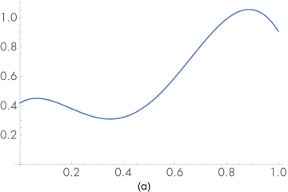
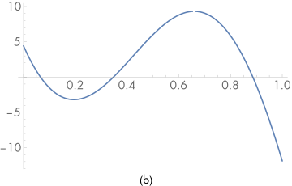

[toc]

# 2 Geometry and Transformations / 几何与变换

Almost all nontrivial graphics programs are built on a foundation of geometric classes. These classes represent mathematical constructs like points, vectors, and rays. Because these classes are ubiquitous throughout the system, good abstractions and efficient implementations are critical. This chapter presents the interface to and implementation of pbrt’s geometric foundation. Note that these are not the classes that represent the actual scene geometry (triangles, spheres, etc.); those classes are the topic of Chapter 3.

The geometric classes in this chapter are defined in the files core/geometry.h and core/geometry.cpp in the pbrt distribution, and the implementations of transformation matrices (Section 2.7) are in the files core/transform.h and core/transform.cpp.

几乎所有非平凡的图形程序都建立在几何类的基础上。这些类表示点、向量和光线等数学结构。因为这些类在整个系统中无处不在，所以良好的抽象和高效的实现是至关重要的。本章介绍了pbrt几何基础的接口和实现。请注意，这些不是代表实际场景几何体（三角形、球体等）的类；这些类是第3章的主题 。

本章中的几何类在文件core/geometry.h 和 core/geometry.cpp中定义，变换矩阵的实现（第2.7节 ）在文件 core/transform.h 和 core/transform.cpp中.

## 2.1 Coordinate Systems / 坐标系

As is typical in computer graphics, pbrt represents three-dimensional points, vectors, and normal vectors with three coordinate values: $x$, $y$, and $z$. These values are meaningless without a coordinate system that defines the origin of the space and gives three linearly independent vectors that define the $x$, $y$, and $z$ axes of the space. Together, the origin and three vectors are called the frame that defines the coordinate system. Given an arbitrary point or direction in 3D, its $(x, y, z)$ coordinate values depend on its relationship to the frame. Figure 2.1 shows an example that illustrates this idea in 2D.

像典型的计算机图形一样，PBRT用三个坐标的值表示三维点，向量和法向量： $x$, $y$, 和 $z$ 。如果没有定义空间原点的坐标系，并给出定义空间的 $x$ 、 $y$ 和 $z$ 轴的三个线性独立向量，这些值将毫无意义。原点和三个向量一起称为 定义坐标系的框架。给定 3D 中的任意点或方向，其坐标值取决于其与框架的关系。图 2.1显示了一个示例，它在 2D 中说明了这个想法。 


Figure 2.1: In 2D, the $(x, y)$ coordinates of a point $p$ are defined by the relationship of the point to a particular 2D coordinate system. Here, two coordinate systems are shown; the point might have coordinates $(8, 8)$ with respect to the coordinate system with its coordinate axes drawn in solid lines but have coordinates $(2, -4)$ with respect to the coordinate system with dashed axes. In either case, the 2D point $p$ is at the same absolute position in space.

图2.1：在2D中， $p$ 点的 $(x，y)$ 坐标由该点与特定2D坐标系的关系定义。这里显示了两个坐标系；该点可能有坐标 $(8，8)$ 相对于坐标系以实线绘制，但有坐标 $(2, -4)$ 相对于坐标系以虚线绘制。在这两种情况下，2D点 $p$ 在空间中处于相同的绝对位置。

In the general $n$-dimensional case, a frame’s origin $p_o$ and its $n$ linearly independent basis vectors define an $n$-dimensional affine space. All vectors $v$ in the space can be expressed as a linear combination of the basis vectors. Given a vector $v$ and the basis vectors $v_i$, there is a unique set of scalar values $s_i$ such that

在一般的 $n$ 维情况下，框架的原点 $p_o$ 和它的 $n$ 线性独立基向量定义了一个 $n$ 维仿射空间。空间中的所有向量 $v$ 都可以表示为基向量的线性组合。给定向量 $v$ 和基向量 $v_i$ ，有一组唯一的标量值 $s_i$ ，满足公式

$$
\mathbf{v}=s_{1} \mathbf{v}_{1}+\cdots+s_{n} \mathbf{v}_{n}
$$

The scalars $s_i$ are the representation of $v$ with respect to the basis $\left\{\mathbf{v}_{1}, \mathbf{v}_{2}, \ldots, \mathbf{v}_{n}\right\}$ and are the coordinate values that we store with the vector. Similarly, for all points $p$, there are unique scalars $s_i$ such that the point can be expressed in terms of the origin $p_o$ and the basis vectors

标量 $s_i$ 是 $v$ 相对于基 $\left\{\mathbf{v}_{1}, \mathbf{v}_{2}, \ldots, \mathbf{v}_{n}\right\}$ 的表示，是与向量一起存储的坐标值。类似地，对于所有点 $p$ ，都有唯一的标量 $s_i$ ，使得该点可以用原点 $p_o$ 和基向量表示

$$
\mathrm{p}=\mathrm{p}_{0}+s_{1} \mathbf{v}_{1}+\cdots+s_{n} \mathbf{v}_{n}
$$

Thus, although points and vectors are both represented by $x$, $y$, and $z$ coordinates in 3D, they are distinct mathematical entities and are not freely interchangeable.

This definition of points and vectors in terms of coordinate systems reveals a paradox: to define a frame we need a point and a set of vectors, but we can only meaningfully talk about points and vectors with respect to a particular frame. Therefore, in three dimensions we need a standard frame with origin $(0, 0, 0)$ and basis vectors $(1, 0, 0)$, $(0, 1, 0)$, and $(0, 0, 1)$. All other frames will be defined with respect to this canonical coordinate system, which we call world space.

因此，尽管点和向量在3D中都由 $x$ 、 $y$ 和 $z$ 坐标表示，但它们是不同的数学实体，不能自由互换。

这种用坐标系来定义点和向量的方法揭示了一个悖论：要定义一个框架，我们需要一个点和一组向量，但我们只能有意义地讨论关于特定框架的点和向量。因此，在三维中，我们需要一个具有原点 $(0, 0, 0)$ 和基向量 $(1, 0, 0)$ ， $(0, 1, 0)$ 和 $(0, 0, 1)$ 的标准框架。所有其他的框架将被定义为相对这个规范坐标系，我们称之为世界空间。

## 2.1.1 Coordinate System Handedness / 坐标系旋向性

There are two different ways that the three coordinate axes can be arranged, as shown in Figure 2.2. Given perpendicular $x$ and $y$ coordinate axes, the $z$ axis can point in one of two directions. These two choices are called left-handed and right-handed. The choice between the two is arbitrary but has a number of implications for how some of the geometric operations throughout the system are implemented. pbrt uses a left-handed coordinate system.

三个坐标轴有两种不同的排列方式，如图2.2所示。给定垂直的 $x$ 和 $y$ 坐标轴， $z$ 轴可以指向两个方向之一。这两种选择被称为左手和右手。两者之间的选择是任意的，但是对于整个系统中的一些几何操作是如何实现的有很多含义。pbrt使用左手坐标系。


Figure 2.2: (left) In a left-handed coordinate system, the $z$ axis points into the page when the $x$ and $y$ axes are oriented with $x$ pointing to the right and $y$ pointing up. (right) In a right-handed system, the $z$ axis points out of the page.

图2.2：（左）在左手坐标系中， $z$ 轴指向页面，此时 $x$ 和 $y$ 轴的方向为 $x$ 指向右侧， $y$ 指向上方。(右）在右手系统中， $z$ 轴指向页面外。

## 2.2 Vectors / 向量

pbrt provides both 2D and 3D vector classes. Both are parameterized by the type of the underlying vector element, thus making it easy to instantiate vectors of both integer and floating-point types.

pbrt提供 2D 和 3D 向量类。两者都由基础向量元素的类型参数化，因此可以轻松实例化整数和浮点类型的向量。

```
<<Vector Declarations>>= 
template <typename T> class Vector2 {
public:
    <<Vector2 Public Methods>> 
    <<Vector2 Public Data>> 
};

<<Vector Declarations>>+=  
template <typename T> class Vector3 {
public:
    <<Vector3 Public Methods>> 
    <<Vector3 Public Data>> 
};
```

In the following, we will generally only include implementations of Vector3 methods; all have Vector2 parallels that have straightforward implementation differences.

A vector is represented with a tuple of components that gives its representation in terms of the $x$, $y$, $z$ (in 3D) axes of the space it is defined in. The individual components of a 3D vector $v$ will be written $v_x$, $v_y$, and $v_z$.

在下面，我们通常只包括Vector3方法的实现；与Vector2有差异的部分Vector2会同步实现。

向量由一个元组表示，该元组以定义向量的空间的 $x$ 、 $y$ 、 $z$（在3D中）轴表示向量。三维向量 $v$ 的各个分量将写入 $v_x$ 、 $v_y$ 和 $v_z$ 。

```
<<Vector2 Public Data>>= 
T x, y;

<<Vector3 Public Data>>= 
T x, y, z;
```

An alternate implementation would be to have a single template class that is also parameterized with an integer number of dimensions and to represent the coordinates with an array of that many T values. While this approach would reduce the total amount of code, individual components of the vector couldn’t be accessed as v.x and so forth. We believe that in this case, a bit more code in the vector implementations is worthwhile in return for more transparent access to elements.

However, some routines do find it useful to be able to easily loop over the components of vectors; the vector classes also provide a C++ operator to index into the components so that, given a vector v, v[0] == v.x and so forth.

另一种实现是编写一个模板类，该类也使用整数维数进行参数化，并使用包含许多T值的数组来表示坐标。虽然这种方法会减少代码总量，但向量的各个元素不能使用v.x等访问。我们认为，在这种情况下，向量实现中的更多代码是值得的，以换取对元素的更透明访问。

然而，一些代码发现能够轻松地遍历向量的元素很有用；向量类还提供了一个 C++ 运算符来索引元素，以便给定向量v，v[0] == v.x等等。

```
<<Vector3 Public Methods>>= 
T operator[](int i) const { 
    Assert(i >= 0 && i <= 2);
    if (i == 0) return x;
    if (i == 1) return y;
    return z;
}

T &operator[](int i) { 
    Assert(i >= 0 && i <= 2);
    if (i == 0) return x;
    if (i == 1) return y;
    return z;
}
```

For convenience, a number of widely used types of vectors are given a typedef, so that they have more concise names in code elsewhere.

为方便起见，许多广泛使用的向量类型都被赋予了 typedef，以便它们在其他地方的代码中具有更简洁的名称。

```
<<Vector Declarations>>+= 
typedef Vector2<Float> Vector2f;
typedef Vector2<int>   Vector2i;
typedef Vector3<Float> Vector3f;
typedef Vector3<int>   Vector3i;
```

Readers who have been exposed to object-oriented design may question our decision to make the vector element data publicly accessible. Typically, data members are only accessible inside their class, and external code that wishes to access or modify the contents of a class must do so through a well-defined API of selector and mutator functions. Although we generally agree with this design principle (though see the discussion of data-oriented design in the “Further Reading” section of Chapter 1), it is not appropriate here. The purpose of selector and mutator functions is to hide the class’s internal implementation details. In the case of vectors, hiding this basic part of their design gains nothing and adds bulk to code that uses them.

By default, the $(x, y, z)$ values are set to zero, although the user of the class can optionally supply values for each of the components. If the user does supply values, we check that none of them has the floating-point “not a number” (NaN) value using the Assert() macro. When compiled in optimized mode, this macro disappears from the compiled code, saving the expense of verifying this case. NaNs almost certainly indicate a bug in the system; if a NaN is generated by some computation, we’d like to catch it as soon as possible in order to make isolating its source easier. (See Section 3.9.1 for more discussion of NaN values.)

接触过面向对象设计的读者可能会质疑我们将向量元素数据公开访问的决定。通常，数据成员只能在其类内部访问，而希望访问或修改类内容的外部代码必须通过定义良好的selector和mutator函数API来访问或修改。虽然我们普遍同意这个设计原则（参见第1章“进一步阅读”部分对面向数据设计的讨论 ），但在这里并不合适。selector 和 mutator 函数的目的是隐藏类的内部实现细节。在向量的情况下，隐藏其设计的这一基本部分没有任何好处，并且会增加使用它们的代码的量。

默认情况下， $(x, y, z)$ 值设置为零，尽管类的用户可以选择为每个元素提供值。如果用户确实提供了值，我们会使用Assert()宏检查它们中没有被设置为“非数字”(NaN) 值。在优化模式下编译时，该宏从编译代码中消失，从而节省了验证这种情况的费用。NaN 几乎可以肯定表示系统中存在错误；如果某个计算生成了 NaN，我们希望尽快捕获它，以便更容易地隔离其来源。（有关NaN 值的更多讨论，请参阅第3.9.1节 。） 

```
<<Vector3 Public Methods>>+=  
Vector3() { x = y = z = 0; }
Vector3(T x, T y, T z)
    : x(x), y(y), z(z) {
    Assert(!HasNaNs());
}
```

The code to check for NaNs just calls the std::isnan() function on each of the $x$, $y$, and $z$ components.

检查NaN的代码只是分别对 $x$, $y$ 和 $z$ 调用std::isnan()函数。 

```
<<Vector3 Public Methods>>+=  
bool HasNaNs() const {
    return std::isnan(x) || std::isnan(y) || std::isnan(z);
}
```

Addition and subtraction of vectors are done component-wise. The usual geometric interpretation of vector addition and subtraction is shown in Figures 2.3 and 2.4.

向量的加法和减法是按元素完成的。向量加法和减法的常用几何解释如图 2.3和 2.4 所示。


Figure 2.3: (left) Vector addition: $(v + w)$. (right) Notice that the sum $(v + w)$ forms the diagonal of the parallelogram formed by $v$ and $w$, which shows the commutativity of vector addition: $v + w = w + v$.

图2.3：（左）向量加法： $(v + w)$ 。(右）注意，和 $(v + w)$ 形成了由 $v$ 和 $w$ 构成的平行四边形的对角线，这表示向量加法的交换性： $v + w = w + v$ 。


Figure 2.4: (left) Vector subtraction. (right) If we consider the parallelogram formed by two vectors, the diagonals are given by $w - v$ (dashed line) and $- v - w$ (not shown).

图2.4：（左）向量减法。(右）如果我们考虑由两个向量组成的平行四边形，对角线由 $w - v$（虚线）和 $- v - w$（未显示）给出。

```
<<Vector3 Public Methods>>+=  
Vector3<T> operator+(const Vector3<T> &v) const {
    return Vector3(x + v.x, y + v.y, z + v.z);
}

Vector3<T>& operator+=(const Vector3<T> &v) {
    x += v.x; y += v.y; z += v.z;
    return *this;
}
```

The code for subtracting two vectors is similar and therefore not shown here.

A vector can be multiplied component-wise by a scalar, thereby changing its length. Three functions are needed in order to cover all of the different ways that this operation may be written in source code (i.e., v*s, s*v, and v *= s):

两个向量相减的代码类似，因此这里没有显示。

向量可以按分量乘以标量，从而改变其长度。为了涵盖在源代码中编写此操作的所有不同方式（即v*s、s*v和v*=s），需要三个函数：

```
<<Vector3 Public Methods>>+=  
Vector3<T> operator*(T s) const { return Vector3<T>(s*x, s*y, s*z); }
Vector3<T> &operator*=(T s) {
    x *= s; y *= s; z *= s;
    return *this;
}

<<Geometry Inline Functions>>= 
template <typename T> inline Vector3<T>
operator*(T s, const Vector3<T> &v) { return v * s; }
```

Similarly, a vector can be divided component-wise by a scalar. The code for scalar division is similar to scalar multiplication, although division of a scalar by a vector is not well defined and so is not permitted.

In the implementation of these methods, we use a single division to compute the scalar’s reciprocal and then perform three component-wise multiplications. This is a useful trick for avoiding division operations, which are generally much slower than multiplies on modern CPUs.

We use the Assert() macro to make sure that the provided divisor is not zero; this should never happen and would indicate a bug elsewhere in the system.

类似地，一个向量可以被一个标量按分量除。标量除法的代码类似于标量乘法，尽管标量除以向量没有明确定义，因此是不允许的。

在这些方法的实现中，我们使用一个除法来计算标量的倒数，然后执行三个分量乘法。这是避免除法运算的有用技巧，现代 CPU 上除法运算通常比乘法慢得多。

我们使用Assert()宏来确保提供的除数不为零；这应该永远不会发生，这将表明系统中其他地方存在错误。

```
<<Vector3 Public Methods>>+=  
Vector3<T> operator/(T f) const {
    Assert(f != 0);
    Float inv = (Float)1 / f;
    return Vector3<T>(x * inv, y * inv, z * inv);
}

Vector3<T> &operator/=(T f) {
    Assert(f != 0);
    Float inv = (Float)1 / f;
    x *= inv; y *= inv; z *= inv;
    return *this;
}
```

The Vector3 class also provides a unary negation operator that returns a new vector pointing in the opposite direction of the original one:

Vector3类还提供一元求反运算符，该运算符返回指向原始向量相反方向的新向量：

```
<<Vector3 Public Methods>>+=  
Vector3<T> operator-() const { return Vector3<T>(-x, -y, -z); }
```

Finally, Abs() returns a vector with the absolute value operation applied to its components.

最后，Abs()返回一个向量，其中的绝对值操作应用于其元素。

```
<<Geometry Inline Functions>>+=  
template <typename T> Vector3<T> Abs(const Vector3<T> &v) {
    return Vector3<T>(std::abs(v.x), std::abs(v.y), std::abs(v.z));
}
```

### 2.2.1 Dot and Cross Product / 点积和叉积

Two useful operations on vectors are the dot product (also known as the scalar or inner product) and the cross product. For two vectors $v$ and $w$, their dot product $(v \cdot w)$ is defined as:

两个有用的向量运算是点积（也称为scalar或内积）和叉积。对于两个向量 $v$ 和 $w$ ，它们的点积 $(v \cdot w)$ 定义为：

$$
\mathbf{v}_{x} \mathbf{w}_{x}+\mathbf{v}_{y} \mathbf{w}_{y}+\mathbf{v}_{z} \mathbf{w}_{z}
$$

```
<<Geometry Inline Functions>>+=  
template <typename T> inline T
Dot(const Vector3<T> &v1, const Vector3<T> &v2) {
    return v1.x * v2.x + v1.y * v2.y + v1.z * v2.z;
}
```

The dot product has a simple relationship to the angle between the two vectors:

点积与两个向量之间的角度有简单的关系：

$$
(\mathbf{v} \cdot \mathbf{w})=\|\mathbf{v}\|\|\mathbf{w}\| \cos \theta
$$

(2.1)

where $\theta$ is the angle between $v$ and $w$, and $\|\mathbf{v}\|$ denotes the length of the vector $v$. It follows from this that $(v \cdot w)$ is zero if and only if $v$ and $w$ are perpendicular, provided that neither $v$ nor $w$ is degenerate—equal to $(0, 0, 0)$. A set of two or more mutually perpendicular vectors is said to be orthogonal. An orthogonal set of unit vectors is called orthonormal.

It immediately follows from Equation (2.1) that if $v$ and $w$ are unit vectors, their dot product is the cosine of the angle between them. As the cosine of the angle between two vectors often needs to be computed for rendering, we will frequently make use of this property. A few basic properties directly follow from the definition. For example, if $u$, $v$, and $w$ are vectors and $s$ is a scalar value, then:

其中， $\theta$ 是 $v$ 和 $w$ 之间的角度，而 $\|\mathbf{v}\|$ 表示向量 $v$ 的长度。由此可知，当且仅当 $v$ 和 $w$ 垂直时 $(v \cdot w)$ 的值是零，前提是 $v$ 和 $w$ 都不退化为 $(0, 0, 0)$ 。一组两个或两个以上相互垂直的向量称为正交的，一组正交的单位向量称为正交向量。

从方程 (2.1) 可以立即得出，如果 $v$ 和 $w$ 是单位向量，它们的点积就是它们之间夹角的余弦。由于渲染时经常需要计算两个向量之间夹角的余弦值，因此我们会经常使用这个属性。一些基本属性直接来自定义。例如，如果 $u$ 、 $v$ 和 $w$ 是向量，而 $s$ 是标量值，则：

$$
\begin{aligned}
(\mathbf{u} \cdot \mathbf{v}) &=(\mathbf{v} \cdot \mathbf{u}) \\
(s \mathbf{u} \cdot \mathbf{v}) &=s(\mathbf{u} \cdot \mathbf{v}) \\
(\mathbf{u} \cdot(\mathbf{v}+\mathbf{w})) &=(\mathbf{u} \cdot \mathbf{v})+(\mathbf{u} \cdot \mathbf{w})
\end{aligned}
$$

We will frequently need to compute the absolute value of the dot product as well. The AbsDot() function does this for us so that a separate call to std::abs() isn’t necessary.

我们经常需要计算点积的绝对值。AbsDot()函数为我们执行此操作，因此不需要单独调用std::abs()。

```
<<Geometry Inline Functions>>+=  
template <typename T>
inline T AbsDot(const Vector3<T> &v1, const Vector3<T> &v2) {
    return std::abs(Dot(v1, v2));
}
```

The cross product is another useful operation for 3D vectors. Given two vectors in 3D, the cross product $v x w$ is a vector that is perpendicular to both of them. Given orthogonal vectors $v$ and $w$, then $v \times w$ is defined to be a vector such that $(\mathbf{v}, \mathbf{w}, \mathbf{v} \times \mathbf{w})$ form an orthogonal coordinate system.

The cross product is defined as:

叉积是三维向量的另一种有用的运算。给定三维中的两个向量，叉积 $v \times w$ 是一个垂直于这两个向量的向量。给定正交向量 $v$ 和 $w$ ，那么 $v \times w$ 被定义为一个向量，使得 $(\mathbf{v}, \mathbf{w}, \mathbf{v} \times \mathbf{w})$ 形成一个正交坐标系。

叉积定义为：

$$
\begin{array}{l}
(\mathbf{v} \times \mathbf{w})_{x}=\mathbf{v}_{y} \mathbf{w}_{z}-\mathbf{v}_{z} \mathbf{w}_{y} \\
(\mathbf{v} \times \mathbf{w})_{y}=\mathbf{v}_{z} \mathbf{w}_{x}-\mathbf{v}_{\mathscr{t}} \mathbf{w}_{z} \\
(\mathbf{v} \times \mathbf{w})_{z}=\mathbf{v}_{x} \mathbf{w}_{y}-\mathbf{v}_{y} \mathbf{w}_{x}
\end{array}
$$

A way to remember this is to compute the determinant of the matrix:

where $i$, $j$, and $k$ represent the axes $(1, 0, 0)$, $(0, 1, 0)$, and $(0, 0, 1)$, respectively. Note that this equation is merely a memory aid and not a rigorous mathematical construction, since the matrix entries are a mix of scalars and vectors.

In the implementation here, the vector elements are converted to double-precision (regardless of the type of Float) before the subtractions in the Cross() function. Using extra precision for 32-bit floating-point values here protects against error from catastrophic cancellation, a type of floating-point error that can happen when subtracting two values that are very close together. This isn’t a theoretical concern: this change was necessary to fix bugs that came up from this issue previously. See Section 3.9 for more information on floating-point rounding error.

记住这个公式的一种方法是计算矩阵的行列式：

其中， $i$ 、 $j$ 和 $k$ 分别表示轴 $(1, 0, 0)$, $(0, 1, 0)$, 和 $(0, 0, 1)$ 。注意，这个方程只是一个记忆辅助工具，而不是一个严格的数学构造，因为矩阵项是标量和向量的混合。

在此处的实现中，向量元素在Cross() 函数中的减法运算之前被转换为双精度（无论Float的类型如何）。此处对 32 位浮点值使用额外精度可防止发生灾难性的消去错误，这是一种在减去两个非常接近的值时可能发生的浮点错误。这不是理论上的问题：此更改对于修复之前由此问题引起的错误是必要的。有关浮点舍入误差的更多信息，请参见第3.9节。

```
<<Geometry Inline Functions>>+=  
template <typename T> inline Vector3<T>
Cross(const Vector3<T> &v1, const Vector3<T> &v2) {
    double v1x = v1.x, v1y = v1.y, v1z = v1.z;
    double v2x = v2.x, v2y = v2.y, v2z = v2.z;
    return Vector3<T>((v1y * v2z) - (v1z * v2y),
                      (v1z * v2x) - (v1x * v2z),
                      (v1x * v2y) - (v1y * v2x));
}
```

From the definition of the cross product, we can derive

根据叉积的定义，我们可以推导出

$$
\|\mathbf{v} \times \mathbf{w}\|=\|\mathbf{v}\|\|\mathbf{w}\||\sin \theta|
$$

(2.2)

where $\theta$ is the angle between $v$ and $w$. An important implication of this is that the cross product of two perpendicular unit vectors is itself a unit vector. Note also that the result of the cross product is a degenerate vector if $v$ and $w$ are parallel.

This definition also shows a convenient way to compute the area of a parallelogram (Figure 2.5). If the two edges of the parallelogram are given by vectors $v_1$ and $v_2$, and it has height $h$, the area is given by $\left\|\mathbf{v}_{\mathbf{1}}\right\| h$. Since $h=\sin \theta\left\|\mathbf{v}_{2}\right\|$, we can use Equation (2.2) to see that the area is $\left\|\mathbf{v}_{\mathbf{1}} \times \mathbf{v}_{2}\right\|$.

其中， $\theta$ 是 $v$ 和 $w$ 之间的角度。这一点的一个重要含义是，两个垂直单位向量的叉积本身就是单位向量。另外，如果 $v$ 和 $w$ 平行，叉积的结果是退化向量。

这个定义还显示了一种计算平行四边形面积的简便方法（图2.5）。如果平行四边形的两个边由向量 $v_1$ 和 $v_2$ 给出，并且它的高度为 $h$ ，则面积由 $\left\|\mathbf{v}_{\mathbf{1}}\right\| h$ 给出。由于 $h=\sin \theta\left\|\mathbf{v}_{2}\right\|$ ，因此我们可以使用公式（2.2）来得到面积是 $\left\|\mathbf{v}_{\mathbf{1}} \times \mathbf{v}_{2}\right\|$ 。


Figure 2.5: The area of a parallelogram with edges given by vectors $v_1$ and $v_2$ is equal to $\left\|\mathbf{v}_{\mathbf{1}}\right\| h$. From Equation (2.2), the length of the cross product of $v_1$ and $v_2$ is equal to the product of the two vector lengths times the sine of the angle between them—the parallelogram area.

图2.5：由向量 $v_1$ 和 $v_2$ 给出边的平行四边形的面积等于 $\left\|\mathbf{v}_{\mathbf{1}}\right\| h$ 。从方程（2.2）中， $v_1$ 和 $v_2$ 的叉积的长度等于两个向量长度乘以它们之间的夹角正弦的乘积，即平行四边形面积。

### 2.2.2 Normalization / 归一化

It is often necessary to normalize a vector—that is, to compute a new vector pointing in the same direction but with unit length. A normalized vector is often called a unit vector. The notation used in this book for normalized vectors is that $\hat v$ is the normalized version of $v$. To normalize a vector, it’s first useful to be able to compute its length.

通常需要对向量进行归一化，即计算指向相同方向但具有单位长度的新向量。归一化向量通常称为单位向量。本书中用于归一化向量的符号 $\hat v$ 是 $v$ 的归一化版本。要对向量进行归一化，首先要能够计算其长度。

```
<<Vector3 Public Methods>>+= 
Float LengthSquared() const { return x * x + y * y + z * z; }
Float Length() const { return std::sqrt(LengthSquared()); }
```

Normalize() normalizes a vector. It divides each component by the length of the vector, $\left\|\mathbf{v}\right\|$. It returns a new vector; it does not normalize the vector in place:

Normalize()对向量进行归一化。它将每个分量除以向量的长度， $\left\|\mathbf{v}\right\|$ 。它返回一个新的向量；它不会改变原向量： 

```
<<Geometry Inline Functions>>+=  
template <typename T> inline Vector3<T>
Normalize(const Vector3<T> &v) { return v / v.Length(); }
```

### 2.2.3 Miscellaneous Operations / 杂项操作

A few additional operations are useful when working with vectors. The MinComponent() and MaxComponent() methods return the smallest and largest coordinate value, respectively.

在处理向量时，一些额外的操作很有用。MinComponent()和MaxComponent()方法分别返回最小和最大坐标值。

```
<<Geometry Inline Functions>>+=  
template <typename T> T
MinComponent(const Vector3<T> &v) {
    return std::min(v.x, std::min(v.y, v.z));
}

template <typename T> T
MaxComponent(const Vector3<T> &v) {
    return std::max(v.x, std::max(v.y, v.z));
}
```

Related, MaxDimension() returns the index of the component with the largest value.

相关地，MaxDimension()返回具有最大值的元素的索引。

```
<<Geometry Inline Functions>>+=  
template <typename T> int
MaxDimension(const Vector3<T> &v) {
    return (v.x > v.y) ? ((v.x > v.z) ? 0 : 2) : 
           ((v.y > v.z) ? 1 : 2);
}
```

Component-wise minimum and maximum operations are also available.

元素方面的最小和最大操作也可用。

```
<<Geometry Inline Functions>>+=  
template <typename T> Vector3<T>
Min(const Vector3<T> &p1, const Vector3<T> &p2) {
    return Vector3<T>(std::min(p1.x, p2.x), std::min(p1.y, p2.y), 
                      std::min(p1.z, p2.z));
}

template <typename T> Vector3<T>
Max(const Vector3<T> &p1, const Vector3<T> &p2) {
    return Vector3<T>(std::max(p1.x, p2.x), std::max(p1.y, p2.y), 
                      std::max(p1.z, p2.z));
}
```

Finally, Permute() permutes the coordinate values according to the index values provided.

最后，Permute()根据提供的索引值排列坐标值。

```
<<Geometry Inline Functions>>+=  
template <typename T> Vector3<T>
Permute(const Vector3<T> &v, int x, int y, int z) {
    return Vector3<T>(v[x], v[y], v[z]);
}
```

### 2.2.4 Coordinate System from a Vector / 来自向量的坐标系

We will frequently want to construct a local coordinate system given only a single 3D vector. Because the cross product of two vectors is orthogonal to both, we can apply the cross product two times to get a set of three orthogonal vectors for the coordinate system. Note that the two vectors generated by this technique are unique only up to a rotation about the given vector.

The implementation of this function assumes that the vector passed in, v1, has already been normalized. It first constructs a perpendicular vector by zeroing one of the components of the original vector, swapping the remaining two, and negating one of them. Inspection of the two cases should make clear that v2 will be normalized and that the dot product $(v_1 \cdot v_2)$ must be equal to zero. Given these two perpendicular vectors, a single cross product gives the third, which by definition will be perpendicular to the first two.

我们经常想构建一个仅给定一个 3D 向量的局部坐标系。因为两个向量的叉积与两者都正交，所以我们可以应用两次叉积来得到坐标系的一组三个正交向量。请注意，此技术生成的两个向量仅在给出向量旋转方向后才是唯一的。

此函数的实现假设传入的向量 v1已经归一化。它首先通过将原始向量的一个分量置零、交换其余两个分量并取反其中一个来构造一个垂直向量。检查这两种情况应该清楚v2将被归一化并且点积 $(v_1 \cdot v_2)$ 必须等于 0。给定这两个垂直向量，然后叉积得出第三个，根据定义，它将垂直于前两个向量。

```
<<Geometry Inline Functions>>+=  
template <typename T> inline void
CoordinateSystem(const Vector3<T> &v1, Vector3<T> *v2, Vector3<T> *v3) {
    if (std::abs(v1.x) > std::abs(v1.y))
        *v2 = Vector3<T>(-v1.z, 0, v1.x) /
              std::sqrt(v1.x * v1.x + v1.z * v1.z);
    else
        *v2 = Vector3<T>(0, v1.z, -v1.y) /
              std::sqrt(v1.y * v1.y + v1.z * v1.z);
    *v3 = Cross(v1, *v2);
}
```

## 2.3 Points / 点

A point is a zero-dimensional location in 2D or 3D space. The Point2 and Point3 classes in pbrt represent points in the obvious way: using $x$, $y$, $z$ (in 3D) coordinates with respect to a coordinate system. Although the same representation is used for vectors, the fact that a point represents a position whereas a vector represents a direction leads to a number of important differences in how they are treated. Points are denoted in text by $p$.

In this section, we’ll continue the approach of only including implementations of the 3D point methods in the Point3 class here.

点是二维或三维空间中的零维位置。pbrt中的Point2和Point3类以明显的方式表示点：使用 $x$ 、 $y$ 、 $z$（在3D中）代表坐标系的坐标。尽管向量使用相同的表示法，但点表示位置而向量表示方向这一事实导致了它们在处理方式上的一些重要差异。点在文本中用 $p$ 表示。

在本节中，我们将继续在Point3类中实现3D point的方法。

```
<<Point Declarations>>= 
template <typename T> class Point2 {
public:
    <<Point2 Public Methods>> 
    <<Point2 Public Data>> 
};

<<Point Declarations>>+=  
template <typename T> class Point3 {
public:
    <<Point3 Public Methods>> 
    <<Point3 Public Data>> 
};
```

As with vectors, it’s helpful to have shorter type names for commonly used point types.

与向量一样，为常用的点类型使用较短的类型名称会很有帮助。

```
<<Point Declarations>>+= 
typedef Point2<Float> Point2f;
typedef Point2<int>   Point2i;
typedef Point3<Float> Point3f;
typedef Point3<int>   Point3i;

<<Point2 Public Data>>= 
T x, y;

<<Point3 Public Data>>= 
T x, y, z;
```

Also like vectors, a Point3 constructor takes parameters to set the x, y, and z coordinate values.

与向量一样，Point3构造函数采用参数来设置x、y和z坐标值。

```
<<Point3 Public Methods>>= 
Point3() { x = y = z = 0; }
Point3(T x, T y, T z) : x(x), y(y), z(z) {
    Assert(!HasNaNs());
}
```

It can be useful to convert a Point3 to a Point2 by dropping the $z$ coordinate. The constructor that does this conversion has the explicit qualifier so that this conversion can’t happen without an explicit cast, lest it happen unintentionally.

通过删除坐标 $z$ 将Point3转换为Point2会很有用。执行此转换的构造函数具有显式限定符，因此在没有显式强制转换的情况下无法进行此转换，以免发生意外。

```
<<Point2 Public Methods>>= 
explicit Point2(const Point3<T> &p) : x(p.x), y(p.y) {
    Assert(!HasNaNs());
}
```

It’s also useful to be able to convert a point with one element type (e.g., a Point3f) to a point of another one (e.g., Point3i) as well as to be able to convert a point to a vector with a different underlying element type. The following constructor and conversion operator provide these conversions. Both also require an explicit cast, to make it clear in source code when they are being used.

能够将具有一种元素类型（例如，Point3f）的点转换为另一种元素类型（例如，Point3i）的点，以及能够将点转换为具有不同基础元素类型的向量也是很有用的。以下构造函数和转换运算符提供这些转换。两者都需要显式转换，以便在使用它们时在源代码中清楚地显示出来。

```
<<Point3 Public Methods>>+=  
template <typename U> explicit Point3(const Point3<U> &p)
    : x((T)p.x), y((T)p.y), z((T)p.z) { 
    Assert(!HasNaNs());
}

template <typename U> explicit operator Vector3<U>() const {
    return Vector3<U>(x, y, z);
}
```

There are certain Point3 methods that either return or take a Vector3. For instance, one can add a vector to a point, offsetting it in the given direction to obtain a new point.

有某些Point3方法可以返回或接收 Vector3。例如，可以向一个点添加一个向量，在给定方向上偏移它以获得一个新点。

```
<<Point3 Public Methods>>+=  
Point3<T> operator+(const Vector3<T> &v) const {
    return Point3<T>(x + v.x, y + v.y, z + v.z);
}

Point3<T> &operator+=(const Vector3<T> &v) {
    x += v.x; y += v.y; z += v.z;
    return *this;
}
```

Alternately, one can subtract one point from another, obtaining the vector between them, as shown in Figure 2.6.

或者，可以用一个点减去另一个点，得到它们之间的向量，如图2.6所示 。


Figure 2.6: Obtaining the Vector between Two Points. The vector $\mathbf{v}=\mathrm{p}^{\prime}-\mathrm{p}$ is given by the component-wise subtraction of the points $p\prime$ and $p$.

图 2.6：获取两点之间的向量。向量 由点 $p\prime$ 和 $p$ 的逐元素相减得出 。

```
<<Point3 Public Methods>>+=  
Vector3<T> operator-(const Point3<T> &p) const {
    return Vector3<T>(x - p.x, y - p.y, z - p.z);
}
```

Subtracting a vector from a point gives a new point.

从一个点减去一个向量给出一个新点。

```
<<Point3 Public Methods>>+= 
Point3<T> operator-(const Vector3<T> &v) const {
    return Point3<T>(x - v.x, y - v.y, z - v.z);
}

Point3<T> &operator-=(const Vector3<T> &v) {
    x -= v.x; y -= v.y; z -= v.z;
    return *this;
}
```

The distance between two points can be computed by subtracting them to compute the vector between them and then finding the length of that vector:

两点之间的距离,可以通过相减来计算它们之间的向量，然后计算该向量的长度：

```
<<Geometry Inline Functions>>+=  
template <typename T> inline Float
Distance(const Point3<T> &p1, const Point3<T> &p2) {
    return (p1 - p2).Length();
}

template <typename T> inline Float
DistanceSquared(const Point3<T> &p1, const Point3<T> &p2) {
    return (p1 - p2).LengthSquared();
}
```

Although in general it doesn’t make sense mathematically to weight points by a scalar or add two points together, the point classes still allow these operations in order to be able to compute weighted sums of points, which is mathematically meaningful as long as the weights used all sum to one. The code for scalar multiplication and addition with points is identical to the corresponding code for vectors, so it is not shown here.

On a related note, it’s useful to be able to linearly interpolate between two points. Lerp() returns p0 at t==0, p1 at t==1, and linearly interpolates between them at other values of t. For t<0 or t>1, Lerp() extrapolates.

虽然一般来说，用一个标量对点进行加权或将两个点相加在数学上没有意义，但point类仍然允许这些操作，以便能够计算点的加权总和，这在数学上是有意义的，只要权重和为一。带有点的标量乘法和加法的代码与对应的向量代码相同，因此此处未显示。

在相关说明中，能够在两点之间进行线性插值很有用。Lerp()在t == 0时返回P0，在 t == 1时返回P1，在其它的t值返回他们之间的线性插值。对于t<0或t>1，Lerp()会向外扩展。

```
<<Geometry Inline Functions>>+=  
template <typename T> Point3<T>
Lerp(Float t, const Point3<T> &p0, const Point3<T> &p1) {
    return (1 - t) * p0 + t * p1;
}
```

The Min() and Max() functions return points representing the component-wise minimums and maximums of the two given points.

Min()和Max()函数返回表示两个给定点的逐个分量最小值和最大值的点。

```
<<Geometry Inline Functions>>+=  
template <typename T> Point3<T>
Min(const Point3<T> &p1, const Point3<T> &p2) {
    return Point3<T>(std::min(p1.x, p2.x), std::min(p1.y, p2.y), 
                     std::min(p1.z, p2.z));
}
template <typename T> Point3<T>
Max(const Point3<T> &p1, const Point3<T> &p2) {
    return Point3<T>(std::max(p1.x, p2.x), std::max(p1.y, p2.y), 
                     std::max(p1.z, p2.z));
}
```

Floor(), Ceil(), and Abs() apply the corresponding operation component-wise to the given point.

Floor(), Ceil(), 和 Abs()将相应的操作逐个应用于给定点。

```
<<Geometry Inline Functions>>+=  
template <typename T> Point3<T> Floor(const Point3<T> &p) {
    return Point3<T>(std::floor(p.x), std::floor(p.y), std::floor(p.z));
}
template <typename T> Point3<T> Ceil(const Point3<T> &p) {
    return Point3<T>(std::ceil(p.x), std::ceil(p.y), std::ceil(p.z));
}
template <typename T> Point3<T> Abs(const Point3<T> &p) {
    return Point3<T>(std::abs(p.x), std::abs(p.y), std::abs(p.z));
}
```

And finally, Permute() permutes the coordinate values according to the provided permutation.

最后，Permute()根据提供的顺序来重新排列坐标值。

```
<<Geometry Inline Functions>>+=  
template <typename T> Point3<T>
Permute(const Point3<T> &p, int x, int y, int z) {
    return Point3<T>(p[x], p[y], p[z]);
}
```

## 2.4 Normals / 法线

A surface normal (or just normal) is a vector that is perpendicular to a surface at a particular position. It can be defined as the cross product of any two nonparallel vectors that are tangent to the surface at a point. Although normals are superficially similar to vectors, it is important to distinguish between the two of them: because normals are defined in terms of their relationship to a particular surface, they behave differently than vectors in some situations, particularly when applying transformations. This difference is discussed in Section 2.8.

表面法线（或只是法线）是垂直于表面在特定位置的向量。它可以定义为在一点与表面相切的任意两个非平行向量的叉积。尽管法线在表面上与向量相似，但区分这两者很重要：因为法线是根据它们与特定表面的关系定义的，因此在某些情况下，它们的行为与向量不同，尤其是在应用变换时。这种差异在第2.8节中讨论 。

```
<<Normal Declarations>>= 
template <typename T> class Normal3 {
public:
    <<Normal3 Public Methods>> 
    <<Normal3 Public Data>> 
};
<<Normal Declarations>>+= 
typedef Normal3<Float> Normal3f;
```

The implementations of Normal3s and Vector3s are very similar. Like vectors, normals are represented by three components x, y, and z; they can be added and subtracted to compute new normals; and they can be scaled and normalized. However, a normal cannot be added to a point, and one cannot take the cross product of two normals. Note that, in an unfortunate turn of terminology, normals are not necessarily normalized.

Normal3 provides an extra constructor that initializes a Normal3 from a Vector3. Because Normal3s and Vector3s are different in subtle ways, we want to make sure that this conversion doesn’t happen when we don’t intend it to, so the C++ explicit keyword is again used here. Vector3 also provides a constructor that converts the other way. Thus, given the declarations Vector3f v; and Normal3f n;, then the assignment n = v is illegal, so it is necessary to explicitly convert the vector, as in n = Normal3f(v).

实现Normal3s和的Vector3s为非常相似。与向量一样，法线由三个分量x、y和 z 表示；可以加和减以计算新的法线；它们可以被缩放和归一化. 但是，法线不能加到一个点上，也不能取两个法线的叉积。需要注意的是，不要把术语搞混了，法线没有必要归一化。

Normal3提供了一个额外的构造函数，用于从Vector3初始化 Normal3。因为Normal3s 和Vector3s 在微妙的方面有所不同，我们希望确保这种转换不会在我们不希望发生的情况下发生，所以这里再次使用C++ 的显式关键字。 Vector3还提供了一个以另一种方式转换的构造函数。因此，给定声明Vector3f v; 和Normal3f n; ，则赋值 n = v是非法的，因此有必要显式转换向量，如 n = Normal3f(v)。

```
<<Normal3 Public Methods>>= 
explicit Normal3<T>(const Vector3<T> &v) : x(v.x), y(v.y), z(v.z) {
    Assert(!v.HasNaNs());
}
<<Geometry Inline Functions>>+=  
template <typename T> inline
Vector3<T>::Vector3(const Normal3<T> &n) : x(n.x), y(n.y), z(n.z) {
    Assert(!n.HasNaNs());
}
```

The Dot() and AbsDot() functions are also overloaded to compute dot products between the various possible combinations of normals and vectors. This code won’t be included in the text here. We also won’t include implementations of all of the various other Normal3 methods here, since they are similar to those for vectors.

One new operation to implement comes from the fact it’s often necessary to flip a surface normal so that it lies in the same hemisphere as a given vector—for example, the surface normal that lies in the same hemisphere as an outgoing ray is frequently needed. The Faceforward() utility function encapsulates this small computation. (pbrt also provides variants of this function for the other three combinations of Vector3s and Normal3s as parameters.) Be careful when using the other instances, though: when using the version that takes two Vector3s, for example, ensure that the first parameter is the one that should be returned (possibly flipped) and the second is the one to test against. Reversing the two parameters will give unexpected results.

Dot()和AbsDot()函数也重载计算法线和向量的各种可能的组合之间的点积。此代码不会包含在此处的文本中。我们也不会在这里包含所有其他各种Normal3方法的实现，因为它们类似于向量的实现。

一个要实现的新操作来自这样一个事实，即经常需要翻转表面法线，使其与给定向量位于同一半球——例如，经常需要与出射光线位于同一半球的表面法线。Faceforward()工具函数封装这个小计算。（pbrt还为以Vector3s 和Normal3s作为参数的其他三种组合提供了此函数的变体 。）但是，在使用其他实例时要小心：例如，使用带有两个Vector3的版本时，确保第一个参数是应该返回（可能翻转）的参数，第二个是要测试的参数。交换这两个参数会产生意想不到的结果。

```
<<Geometry Inline Functions>>+=  
template <typename T> inline Normal3<T>
Faceforward(const Normal3<T> &n, const Vector3<T> &v) {
    return (Dot(n, v) < 0.f) ? -n : n;
}
```

## 2.5 Rays / 光线

A ray is a semi-infinite line specified by its origin and direction. pbrt represents a Ray with a Point3f for the origin and a Vector3f for the direction. We only need rays with floating-point origins and directions, so Ray isn’t a template class parameterized by an arbitrary type, as points, vectors, and normals were. A ray is denoted by $r$; it has origin $o$ and direction $d$, as shown in Figure 2.7.

光线是由它的原点和方向指定的半无限线。 pbrt使用原点Point3f，方向Vector3f表示一条光线。我们只需要具有浮点数原点和方向的光线，因此Ray 不是由任意类型参数化的模板类，如点、向量和法线。一条光线表示为 $r$；它有原点 $o$ 和方向 $d$ ，如图2.7所示 。 


Figure 2.7: A ray is a semi-infinite line defined by its origin $o$ and its direction vector $d$.

图 2.7：一条光线是一条半无限长的直线，由它的原点 $o$ 和它的方向向量 $d$ 定义。

```
<<Ray Declarations>>= 
class Ray {
public:
    <<Ray Public Methods>> 
    <<Ray Public Data>> 
};
```

Because we will be referring to these variables often throughout the code, the origin and direction members of a Ray are succinctly named o and d. Note that we again make the data publicly available for convenience.

因为我们将在整个代码中经常引用这些变量，所以Ray的 origin 和 direction 成员 被简洁地命名为 o和 d。请注意，为了方便起见，我们再次公开数据。

```
<<Ray Public Data>>= 
Point3f o;
Vector3f d;
```

The parametric form of a ray expresses it as a function of a scalar value $t$, giving the set of points that the ray passes through:

光线的参数形式将其表示为标量值 $t$ 的函数，给出光线通过的点集： 

$$
\mathrm{r}(t)=o+t \mathbf{d} \quad 0 \leq t<\infty
$$

(2.3)

The Ray also includes a member variable that limits the ray to a segment along its infinite extent. This field, tMax, allows us to restrict the ray to a segment of points $\left[\mathrm{o}, \mathrm{r}\left(t_{\max }\right)\right)$.

Notice that this field is declared as mutable, meaning that it can be changed even if the Ray that contains it is const—thus, when a ray is passed to a method that takes a const Ray &, that method is not allowed to modify its origin or direction but can modify its extent. This convention fits one of the most common uses of rays in the system, as parameters to ray–object intersection testing routines, which will record the offsets to the closest intersection in tMax.

光线还包括一个成员变量，该变量将光线限制为沿其无限范围的线段。此字段tMax允许我们将光线限制为点 $\left[\mathrm{o}, \mathrm{r}\left(t_{\max }\right)\right)$ 。

请注意，该字段被声明为mutable，这意味着即使包含它的Ray是const也可以更改它 ——因此，当一条光线传递给采用 const Ray & 的方法时，该方法不允许修改其原点或方向，但可以修改其范围。该约定适合系统中最常见的光线用途之一，作为光线-对象相交测试代码的参数，最近相交点的偏移量将记录到tMax中。

```
<<Ray Public Data>>+=  
mutable Float tMax;
```

Each ray has a time value associated with it. In scenes with animated objects, the rendering system constructs a representation of the scene at the appropriate time for each ray.

每条光线都有一个与之关联的时间值。在具有动画对象的场景中，渲染系统在适当的时间为每条光线构建场景的表示。

```
<<Ray Public Data>>+=  
Float time;
```

Finally, each ray records the medium containing its origin. The Medium class, introduced in Section 11.3, encapsulates the (potentially spatially varying) properties of media such as a foggy atmosphere, smoke, or scattering liquids like milk or shampoo. Associating this information with rays makes it possible for other parts of the system to account correctly for the effect of rays passing from one medium to another.

最后，每条光线都记录了包含其原点的介质。 在第11.3节中介绍的Medium类 封装了介质的（可能在空间上变化的）属性，例如雾气、烟雾或散射液体（如牛奶或洗发水）。将此信息与光线相关联，可以让系统的其他部分正确考虑光线从一种介质传递到另一种介质的影响。

```
<<Ray Public Data>>+= 
const Medium *medium;
```

Constructing Rays is straightforward. The default constructor relies on the Point3f and Vector3f constructors to set the origin and direction to $(0, 0, 0)$. Alternately, a particular point and direction can be provided. If an origin and direction are provided, the constructor allows a value to be given for tMax, the ray’s time and medium.

构造Ray很简单。默认构造函数依赖于Point3f和Vector3f构造函数将原点和方向设置为 $(0, 0, 0)$ 。或者，可以提供特定的点和方向。如果提供了原点和方向，则构造函数允许为tMax、光线的时间和介质提供一个值。 

```
<<Ray Public Methods>>= 
Ray() : tMax(Infinity), time(0.f), medium(nullptr) { }
Ray(const Point3f &o, const Vector3f &d, Float tMax = Infinity,
    Float time = 0.f, const Medium *medium = nullptr)
    : o(o), d(d), tMax(tMax), time(time), medium(medium) { }
```

Because position along a ray can be thought of as a function of a single parameter $t$, the Ray class overloads the function application operator for rays. This way, when we need to find the point at a particular position along a ray, we can write code like:

因为沿光线的位置可以被认为是单个参数 $t$ 的函数，所以Ray类重载了光线的函数应用运算符。这样，当我们需要沿着光线找到特定位置的点时，我们可以编写如下代码：

```
    Ray r(Point3f(0, 0, 0), Vector3f(1, 2, 3));
    Point3f p = r(1.7);
```

```
<<Ray Public Methods>>+= 
Point3f operator()(Float t) const { return o + d * t; }
```

### 2.5.1 Ray Differentials / 光线微分

In order to be able to perform better antialiasing with the texture functions defined in Chapter 10, pbrt can keep track of some additional information with rays. In Section 10.1, this information will be used to compute values that are used by the Texture class to estimate the projected area on the image plane of a small part of the scene. From this, the Texture can compute the texture’s average value over that area, leading to a higher-quality final image.

RayDifferential is a subclass of Ray that contains additional information about two auxiliary rays. These extra rays represent camera rays offset by one sample in the $x$ and $y$ direction from the main ray on the film plane. By determining the area that these three rays project to on an object being shaded, the Texture can estimate an area to average over for proper antialiasing.

Because the RayDifferential class inherits from Ray, geometric interfaces in the system can be written to take const Ray & parameters, so that either a Ray or RayDifferential can be passed to them. Only the routines that need to account for antialiasing and texturing require RayDifferential parameters.

为了能够使用第10章中定义的纹理函数执行更好的反走样 ，pbrt可以跟踪光线的一些附加信息。在第10.1节中 ，此信息将用于计算Texture类使用的值，以估计场景的一小部分在图像平面上的投影面积。据此，Texture可以计算该区域的纹理平均值，从而生成更高质量的最终图像。

RayDifferential是Ray的子类，包含有关两条辅助光线的附加信息。这些额外光线表示相机光线在 $x$ 和 $y$ 方向，与胶片平面上的主光线偏移一个采样。通过确定这三条光线投射到被着色对象上的区域，纹理可以估计一个区域，以进行适当的反走样平均。

由于RayDifferential类继承自Ray，系统中的几何接口可以编写为采用const Ray & 参数，因此可以将Ray或RayDifferential传递给它们。只有需要考虑反走样和纹理的代码需要RayDifferential参数。

```
<<Ray Declarations>>+= 
class RayDifferential : public Ray {
public:
    <<RayDifferential Public Methods>> 
    <<RayDifferential Public Data>> 
};
```

The RayDifferential constructors mirror the Ray’s constructors.

RayDifferential构造函数镜像自Ray的构造函数。


```
<<RayDifferential Public Methods>>= 
RayDifferential() { hasDifferentials = false; }
RayDifferential(const Point3f &o, const Vector3f &d,
        Float tMax = Infinity, Float time = 0.f,
        const Medium *medium = nullptr)
    : Ray(o, d, tMax, time, medium) {
    hasDifferentials = false; 
}
<<RayDifferential Public Data>>= 
bool hasDifferentials;
Point3f rxOrigin, ryOrigin;
Vector3f rxDirection, ryDirection;
```

There is a constructor to create RayDifferentials from Rays. The constructor sets hasDifferentials to false initially because the neighboring rays, if any, are not known.

有一个构造函数可以从Rays创建RayDifferentials。构造函数最初将hasDifferentials设置为false，因为相邻的光线（如果有）是未知的。

```
<<RayDifferential Public Methods>>+=  
RayDifferential(const Ray &ray) : Ray(ray) {
    hasDifferentials = false; 
}
```

Camera implementations in pbrt compute differentials for rays leaving the camera under the assumption that camera rays are spaced one pixel apart. Integrators such as the SamplerIntegrator can generate multiple camera rays per pixel, in which case the actual distance between samples is lower. The fragment <<*Generate camera ray for current sample*>> encountered in Chapter 1 called the ScaleDifferentials() method defined below to update differential rays for an estimated sample spacing of s.

pbrt 中的相机实现，假设相机光线间隔一个像素的情况下，计算离开相机的光线微分。诸如SamplerIntegrator 之类的积分器可以为每个像素生成多条相机光线，在这种情况下，采样之间的实际距离较小。第1章中遇到的片段 <<*Generate camera ray for current sample*>> 调用了下面定义的ScaleDifferentials()方法，以更新估计采样间距s的微分光线。

```
<<RayDifferential Public Methods>>+= 
void ScaleDifferentials(Float s) {
    rxOrigin = o + (rxOrigin - o) * s;
    ryOrigin = o + (ryOrigin - o) * s;
    rxDirection = d + (rxDirection - d) * s;
    ryDirection = d + (ryDirection - d) * s;
}
```

## 2.6 Bounding Boxes / 包围盒

Many parts of the system operate on axis-aligned regions of space. For example, multi-threading in pbrt is implemented by subdividing the image into rectangular tiles that can be processed independently, and the bounding volume hierarchy in Section 4.3 uses 3D boxes to bound geometric primitives in the scene. The Bounds2 and Bounds3 template classes are used to represent the extent of these sorts of regions. Both are parameterized by a type T that is used to represent the coordinates of its extents.

系统的许多部分在空间的轴对齐区域上运行。例如，pbrt 中的多线程是通过将图像细分为可以独立处理的矩形tiles来实现的，4.3节中的包围体积层次结构(bvh)使用3D盒来绑定场景中的几何图元。Bounds2和Bounds3模板类被用来表示这类区域的范围。两者都由用于表示其范围坐标的类型T进行参数化。

```
<<Bounds Declarations>>= 
template <typename T> class Bounds2 {
public:
    <<Bounds2 Public Methods>> 
    <<Bounds2 Public Data>> 
};

<<Bounds Declarations>>+=  
template <typename T> class Bounds3 {
public:
    <<Bounds3 Public Methods>> 
    <<Bounds3 Public Data>> 
};

<<Bounds Declarations>>+= 
typedef Bounds2<Float> Bounds2f;
typedef Bounds2<int>   Bounds2i;
typedef Bounds3<Float> Bounds3f;
typedef Bounds3<int>   Bounds3i;
```

There are a few possible representations for these sorts of bounding boxes; pbrt uses axis-aligned bounding boxes (AABBs), where the box edges are mutually perpendicular and aligned with the coordinate system axes. Another possible choice is oriented bounding boxes (OBBs), where the box edges on different sides are still perpendicular to each other but not necessarily coordinate-system aligned. A 3D AABB can be described by one of its vertices and three lengths, each representing the distance spanned along the $x$, $y$, and $z$ coordinate axes. Alternatively, two opposite vertices of the box can describe it. We chose the two-point representation for pbrt’s Bounds2 and Bounds3 classes; they store the positions of the vertex with minimum coordinate values and of the one with maximum coordinate values. A 2D illustration of a bounding box and its representation is shown in Figure 2.8.

这些类型的包围盒有几种可能的表示； pbrt使用轴对齐的包围盒(AABBs)，其中盒边相互垂直并与坐标系轴对齐。另一种可能的选择是定向包围盒(OBBs)，其中不同边上的盒边缘仍然相互垂直，但不一定与坐标系对齐。3D AABB可以由它的一个顶点和三个长度来描述，每个长度表示沿 $x$ 、 $y$ 和 $z$ 坐标轴的距离。或者，盒的两个相对顶点可以描述它。我们为pbrt的Bounds2和Bounds3类选择了两点表示法；它们存储具有最小坐标值的顶点和具有最大坐标值的顶点的位置。图2.8显示了包围盒及其表示的 2D 图示 。


Figure 2.8: An Axis-Aligned Bounding Box. The Bounds2 and Bounds3 classes store only the coordinates of the minimum and maximum points of the box; the other box corners are implicit in this representation.

图 2.8：轴对齐的包围盒。Bounds2和 Bounds3类只存储盒的最低和最高点的坐标; 其他盒的角在此表示中是隐含的。

The default constructors create an empty box by setting the extent to an invalid configuration, which violates the invariant that pMin.x <= pMax.x (and similarly for the other dimensions). By initializing two corner points with the largest and smallest representable number, any operations involving an empty box (e.g., Union()) will yield the correct result.

默认构造函数通过将范围设置为无效值来创建一个空盒，这违反了pMin.x <= pMax.x这个不变量（对于其他维度也是如此）。通过用最大和最小可表示数初始化两个角点，任何涉及空盒的操作（例如， Union()）都将产生正确的结果。

```
<<Bounds3 Public Methods>>= 
Bounds3() {
    T minNum = std::numeric_limits<T>::lowest();
    T maxNum = std::numeric_limits<T>::max();
    pMin = Point3<T>(maxNum, maxNum, maxNum);
    pMax = Point3<T>(minNum, minNum, minNum);
}

<<Bounds3 Public Data>>= 
Point3<T> pMin, pMax;
```

It is also useful to be able to initialize a Bounds3 to enclose a single point:

能够初始化Bounds3以包含单个点也很有用：

```
<<Bounds3 Public Methods>>+=  
Bounds3(const Point3<T> &p) : pMin(p), pMax(p) { }
```

If the caller passes two corner points (p1 and p2) to define the box, the constructor needs to find their component-wise minimum and maximum values since p1 and p2 are not necessarily chosen so that p1.x <= p2.x, and so on.

如果调用者通过两个角点（p1和p2）来定义盒，则构造函数需要找到它们的逐元素的最小值和最大值，因为初始p1和p2不一定满足p1.x<=p2.x，y、z以此类推。

```
<<Bounds3 Public Methods>>+=  
Bounds3(const Point3<T> &p1, const Point3<T> &p2)
    : pMin(std::min(p1.x, p2.x), std::min(p1.y, p2.y),
           std::min(p1.z, p2.z)),
      pMax(std::max(p1.x, p2.x), std::max(p1.y, p2.y),
           std::max(p1.z, p2.z)) {
}
```

In some cases, it’s also useful to use array indexing to select between the two points at the corners of the box. The implementations of these methods select between pMin and pMax based on the value of i.

在某些情况下，使用数组索引在盒角的两个点之间进行选择也很有用。这些方法的实现基于i的值在pMin和pMax之间进行选择。

```
<<Bounds3 Public Methods>>+=  
const Point3<T> &operator[](int i) const;
Point3<T> &operator[](int i);
```

The Corner() method returns the coordinates of one of the eight corners of the bounding box.

Corner()方法返回的包围盒的八个角之一的坐标。

```
<<Bounds3 Public Methods>>+=  
Point3<T> Corner(int corner) const {
    return Point3<T>((*this)[(corner & 1)].x,
                     (*this)[(corner & 2) ? 1 : 0].y,
                     (*this)[(corner & 4) ? 1 : 0].z);
}
```

Given a bounding box and a point, the Union() function returns a new bounding box that encompasses that point as well as the original box.

给定一个包围盒和一个点，Union()函数返回一个新的包围盒，该包围盒包含该点以及原始盒。

```
<<Geometry Inline Functions>>+=  
template <typename T> Bounds3 <T>
Union(const Bounds3<T> &b, const Point3<T> &p) {
    return Bounds3<T>(Point3<T>(std::min(b.pMin.x, p.x),
                                std::min(b.pMin.y, p.y),
                                std::min(b.pMin.z, p.z)),
                      Point3<T>(std::max(b.pMax.x, p.x),
                                std::max(b.pMax.y, p.y),
                                std::max(b.pMax.z, p.z)));
}
```

It is similarly possible to construct a new box that bounds the space encompassed by two other bounding boxes. The definition of this function is similar to the earlier Union() method that takes a Point3f; the difference is that the pMin and pMax of the second box are used for the std::min() and std::max() tests, respectively.

类似地，可以构造一个新盒来界定由其他两个包围盒所包围的空间。这个函数的定义类似于早期的Union()方法，它接受一个Point3f；不同之处在于第二个盒的pMin和pMax分别用于std::min()和std::max()测试。

```
<<Geometry Inline Functions>>+=  
template <typename T> Bounds3<T>
Union(const Bounds3<T> &b1, const Bounds3<T> &b2) {
    return Bounds3<T>(Point3<T>(std::min(b1.pMin.x, b2.pMin.x),
                                std::min(b1.pMin.y, b2.pMin.y),
                                std::min(b1.pMin.z, b2.pMin.z)),
                      Point3<T>(std::max(b1.pMax.x, b2.pMax.x),
                                std::max(b1.pMax.y, b2.pMax.y),
                                std::max(b1.pMax.z, b2.pMax.z)));
}
```

The intersection of two bounding boxes can be found by computing the maximum of their two respective minimum coordinates and the minimum of their maximum coordinates. (See Figure 2.9.)

可以通过计算两个包围盒各自最小坐标的最大值和最大坐标的最小值来找到两个包围盒的交集。（见图 2.9。）


Figure 2.9: Intersection of Two Bounding Boxes. Given two bounding boxes with pMin and pMax points denoted by open circles, the bounding box of their area of intersection (shaded region) has a minimum point (lower left filled circle) with coordinates given by the maximum of the coordinates of the minimum points of the two boxes in each dimension. Similarly, its maximum point (upper right filled circle) is given by the minimums of the boxes’ maximum coordinates.

图 2.9：两个包围盒的交集。 给定两个包围盒，其pMin和pMax点由空心圆表示，它们相交区域（阴影区域）的包围盒有一个最小点（左下方实心圆），其坐标由最小点的坐标最大值给出每个维度的两个盒子。类似地，它的最大点（右上角的实心圆）由框最大坐标的最小值给出。

```
<<Geometry Inline Functions>>+=  
template <typename T> Bounds3<T>
Intersect(const Bounds3<T> &b1, const Bounds3<T> &b2) {
    return Bounds3<T>(Point3<T>(std::max(b1.pMin.x, b2.pMin.x),
                                std::max(b1.pMin.y, b2.pMin.y),
                                std::max(b1.pMin.z, b2.pMin.z)),
                      Point3<T>(std::min(b1.pMax.x, b2.pMax.x),
                                std::min(b1.pMax.y, b2.pMax.y),
                                std::min(b1.pMax.z, b2.pMax.z)));
}
```

We are able to determine if two bounding boxes overlap by seeing if their extents overlap in all of $x$, $y$, and $z$:

我们可以通过查看两个包围盒的范围是否在所有 $x$ 、 $y$ 和 $z$ 中重叠来确定它们是否重叠：

```
<<Geometry Inline Functions>>+=  
template <typename T>
bool Overlaps(const Bounds3<T> &b1, const Bounds3<T> &b2) {
    bool x = (b1.pMax.x >= b2.pMin.x) && (b1.pMin.x <= b2.pMax.x);
    bool y = (b1.pMax.y >= b2.pMin.y) && (b1.pMin.y <= b2.pMax.y);
    bool z = (b1.pMax.z >= b2.pMin.z) && (b1.pMin.z <= b2.pMax.z);
    return (x && y && z);
}
```

Three 1D containment tests determine if a given point is inside the bounding box:

三个一维包含测试确定给定点是否在包围盒内：

```
<<Geometry Inline Functions>>+=  
template <typename T>
bool Inside(const Point3<T> &p, const Bounds3<T> &b) {
    return (p.x >= b.pMin.x && p.x <= b.pMax.x &&
            p.y >= b.pMin.y && p.y <= b.pMax.y &&
            p.z >= b.pMin.z && p.z <= b.pMax.z);
}
```

The InsideExclusive() variant of Inside() doesn’t consider points on the upper boundary to be inside the bounds. It is mostly useful with integer-typed bounds.

Inside()的InsideExclusive()变体不认为上边界上的点在包围盒内。它主要用于整数类型的包围盒。

```
<<Geometry Inline Functions>>+=  
template <typename T>
bool InsideExclusive(const Point3<T> &p, const Bounds3<T> &b) {
    return (p.x >= b.pMin.x && p.x < b.pMax.x &&
            p.y >= b.pMin.y && p.y < b.pMax.y &&
            p.z >= b.pMin.z && p.z < b.pMax.z);
}
```

The Expand() function pads the bounding box by a constant factor in all dimensions.

Expand() 函数的作用是：在所有维度中，用一个常量因子填充包围盒。

```
<<Geometry Inline Functions>>+=  
template <typename T, typename U> inline Bounds3<T>
Expand(const Bounds3<T> &b, U delta) {
    return Bounds3<T>(b.pMin - Vector3<T>(delta, delta, delta),
                      b.pMax + Vector3<T>(delta, delta, delta));
}
```

Diagonal() returns the vector along the box diagonal from the minimum point to the maximum point.

Diagonal()返回沿盒对角线从最小值点到最大值点的向量。

```
<<Bounds3 Public Methods>>+=  
Vector3<T> Diagonal() const { return pMax - pMin; }
```

Methods for computing the surface area of the six faces of the box and the volume inside of it are also frequently useful.

计算盒子六个面的表面积及其内部体积的方法也经常有用。

```
<<Bounds3 Public Methods>>+=  
T SurfaceArea() const {
    Vector3<T> d = Diagonal();
    return 2 * (d.x * d.y + d.x * d.z + d.y * d.z);
}

<<Bounds3 Public Methods>>+=  
T Volume() const {
    Vector3<T> d = Diagonal();
    return d.x * d.y * d.z;
}
```

The Bounds3::MaximumExtent() method returns the index of which of the three axes is longest. This is useful, for example, when deciding which axis to subdivide when building some of the ray-intersection acceleration structures.

Bounds3::MaximumExtent()方法返回三个轴中最长轴的索引。这非常有用，例如，在构建某些光线相交加速结构，决定细分哪个轴时。

```
<<Bounds3 Public Methods>>+=  
int MaximumExtent() const {
    Vector3<T> d = Diagonal();
    if (d.x > d.y && d.x > d.z)
        return 0;
    else if (d.y > d.z)
        return 1;
    else
        return 2;
}
```

The Lerp() method linearly interpolates between the corners of the box by the given amount in each dimension.

Lerp()方法按每个维度在盒子的角之间进行给定量的线性插值。

```
<<Bounds3 Public Methods>>+=  
Point3<T> Lerp(const Point3f &t) const {
    return Point3<T>(::Lerp(t.x, pMin.x, pMax.x),
                     ::Lerp(t.y, pMin.y, pMax.y),
                     ::Lerp(t.z, pMin.z, pMax.z));
}
```

Offset() returns the continuous position of a point relative to the corners of the box, where a point at the minimum corner has offset $(0, 0, 0)$, a point at the maximum corner has offset $(1, 1, 1)$, and so forth.

Offset() 返回点相对于盒子角点的连续位置，其中最小角点具有偏移 $(0, 0, 0)$ ，最大角点具有偏移 $(1, 1, 1)$ ，依此类推。

```
<<Bounds3 Public Methods>>+=  
Vector3<T> Offset(const Point3<T> &p) const {
    Vector3<T> o = p - pMin;
    if (pMax.x > pMin.x) o.x /= pMax.x - pMin.x;
    if (pMax.y > pMin.y) o.y /= pMax.y - pMin.y;
    if (pMax.z > pMin.z) o.z /= pMax.z - pMin.z;
    return o;
}
```

Bounds3 also provides a method that returns the center and radius of a sphere that bounds the bounding box. In general, this may give a far looser fit than a sphere that bounded the original contents of the Bounds3 directly, although it is a useful method to have available.

Bounds3还提供了一种方法，该方法返回包围盒的球体的圆心和半径。通常，这可能比直接给出物体的包围球半径更大，但这是一种有用的方法。

```
<<Bounds3 Public Methods>>+= 
void BoundingSphere(Point3<T> *center, Float *radius) const {
    *center = (pMin + pMax) / 2;
    *radius = Inside(*center, *this) ? Distance(*center, pMax) : 0;
}
```

Finally, for integer bounds, there is an iterator class that fulfills the requirements of a C++ forward iterator (i.e., it can only be advanced). The details are slightly tedious and not particularly interesting, so the code isn’t included in the book. Having this definition makes it possible to write code using range-based for loops to iterate over integer coordinates in a bounding box:

最后，对于整数边界，有一个迭代器类可以满足 C++ 前向迭代器的要求（即，它只能是前进的）。细节略显乏味，也不是特别有趣，所以书中没有包含代码。有了这个定义，就可以使用基于范围的for循环编写代码来遍历包围盒中的整数坐标：

```
    Bounds2i b = ...;
    for (Point2i p : b) {
       //  …
    }
```

As implemented, the iteration goes up to but doesn’t visit points equal to the maximum extent in each dimension.

在实现时，遍历会前进但不访问每个维度中最大范围的点。

## 2.7 Transformations / 变换

In general, a transformation $T$ is a mapping from points to points and from vectors to vectors:

通常，变换 $T$ 是从点到点以及从向量到向量的映射：

$$
\mathrm{p}^{\prime}=\mathbf{T}(\mathrm{p}) \quad \mathbf{v}^{\prime}=\mathbf{T}(\mathbf{v})
$$

The transformation $T$ may be an arbitrary procedure. However, we will consider a subset of all possible transformations in this chapter. In particular, they will be

* Linear: If $T$ is an arbitrary linear transformation and $s$ is an arbitrary scalar, then $\mathbf{T}(s \mathbf{v})=s \mathbf{T}(\mathbf{v})$ and $\mathbf{T}\left(\mathbf{v}_{1}+\mathbf{v}_{2}\right)=\mathbf{T}\left(\mathbf{v}_{1}\right)+\mathbf{T}\left(\mathbf{v}_{2}\right)$. These two properties can greatly simplify reasoning about transformations.

* Continuous: Roughly speaking, $T$ maps the neighborhoods around $p$ and $v$ to neighborhoods around $p \prime$ and $v \prime$.

* One-to-one and invertible: For each $p$, $T$ maps $p$ to a single unique $p \prime$. Furthermore, there exists an inverse transform $T^{-1}$ that maps $p \prime$ back to $p$.

变换 $T$ 可能是一个任意过程。但是，我们将在本章中考虑所有可能变换的子集。特别是如下几项：

* 线性：如果 $T$ 是任意线性变换， $s$ 是任意标量，则 $\mathbf{T}(s \mathbf{v})=s \mathbf{T}(\mathbf{v})$ 和 $\mathbf{T}\left(\mathbf{v}_{1}+\mathbf{v}_{2}\right)=\mathbf{T}\left(\mathbf{v}_{1}\right)+\mathbf{T}\left(\mathbf{v}_{2}\right)$ 。这两个属性可以大大简化关于变换的推理。

* 连续：粗略地说， $T$ 将 $p$ 和 $v$ 附近的邻居映射到 $p\prime$ 和 $v\prime$ 附近的邻居。

* 一对一且可逆：对于每个 $p$ ， $T$ 将 $p$ 映射到一个唯一的 $p \prime$ 。此外，还存在一个将 $p \prime$ 映射回 $p$ 的逆变换 $T^{-1}$ 。

We will often want to take a point, vector, or normal defined with respect to one coordinate frame and find its coordinate values with respect to another frame. Using basic properties of linear algebra, a $4 \times 4$ matrix can be shown to express the linear transformation of a point or vector from one frame to another. Furthermore, such a $4 \times 4$ matrix suffices to express all linear transformations of points and vectors within a fixed frame, such as translation in space or rotation around a point. Therefore, there are two different (and incompatible!) ways that a matrix can be interpreted:

* Transformation of the frame: Given a point, the matrix could express how to compute a new point in the same frame that represents the transformation of the original point (e.g., by translating it in some direction).
  
* Transformation from one frame to another: A matrix can express the coordinates of a point or vector in a new frame in terms of the coordinates in the original frame.
Most uses of transformations in pbrt are for transforming points from one frame to another.

In general, transformations make it possible to work in the most convenient coordinate space. For example, we can write routines that define a virtual camera, assuming that the camera is located at the origin, looks down the $z$ axis, and has the $y$ axis pointing up and the $x$ axis pointing right. These assumptions greatly simplify the camera implementation. Then, to place the camera at any point in the scene looking in any direction, we just construct a transformation that maps points in the scene’s coordinate system to the camera’s coordinate system. (See Section 6.1.1 for more information about camera coordinate spaces in pbrt.)

### 2.7.1 Homogeneous Coordinates / 齐次坐标

Given a frame defined by $\left(\mathrm{p}_{0}, \mathbf{v}_{1}, \mathbf{v}_{2}, \mathbf{v}_{3}\right)$, there is ambiguity between the representation of a point $(p_x, p_y, p_z)$ and a vector $(v_x, v_y, v_z)$ with the same (x, y, z) coordinates. Using the representations of points and vectors introduced at the start of the chapter, we can write the point as the inner product $\left[\begin{array}{llll}\boldsymbol{s}_{1} & s_{2} & s_{3} & 1\end{array}\right]\left[\mathbf{v}_{\mathbf{1}} \mathbf{v}_{\mathbf{2}} \mathbf{v}_{\mathbf{3}} \mathbf{p}_{0}\right]^{T}$ and the vector as the inner product $\left[s_{1}^{\prime} s_{2}^{\prime} s_{3}^{\prime} 0\right]\left[\mathbf{v}_{1} \mathbf{v}_{2} \mathbf{v}_{3} \mathrm{p}_{0}\right]^{T}$ . These four-vectors of three $s_i$ values and a zero or one are called the homogeneous representations of the point and the vector. The fourth coordinate of the homogeneous representation is sometimes called the weight. For a point, its value can be any scalar other than zero: the homogeneous points $[1, 3, -2, 1]$ and $[-2, -6, 4, -2]$ describe the same Cartesian point $(1, 3, -2)$. Converting homogeneous points into ordinary points entails dividing the first three components by the weight:

给定由 $\left(\mathrm{p}_{0}, \mathbf{v}_{1}, \mathbf{v}_{2}, \mathbf{v}_{3}\right)$ 定义的框架，点 $(p_x, p_y, p_z)$ 和具有相同 (x, y, z) 坐标的向量 $(v_x, v_y, v_z)$ 的表示存在歧义。使用本章开头介绍的点和向量的表示，我们可以将点写为内积 $\left[{s}_{1} s_{2} s_{3} 1\right]\left[\mathbf{v}_{\mathbf{1}} \mathbf{v}_{\mathbf{2}} \mathbf{v}_ {\mathbf{3}} \mathbf{p}_{0}\right]^{T}$ 和向量写为内积 $\left[s_{1}^{\prime} s_{2}^{ \prime} s_{3}^{\prime} 0\right]\left[\mathbf{v}_{1} \mathbf{v}_{2} \mathbf{v}_{3} \mathrm{p }_{0}\right]^{T}$ 。这三个 $s_i$ 值和一个0或1的四向量称为点和向量的齐次表示。齐次表示的第四个坐标有时称为权重。对于一个点，它的值可以是除零以外的任何标量：齐次点 $[1, 3, -2, 1]$ 和 $[-2, -6, 4, -2]$ 描述了同一个笛卡尔点 $(1, 3, -2)$ 。将齐次点转换为普通点需要将前三个分量除以权重：

$$
(x, y, z, w) \rightarrow\left(\frac{x}{w}, \frac{y}{w}, \frac{z}{w}\right)
$$

We will use these facts to see how a transformation matrix can describe how points and vectors in one frame can be mapped to another frame. Consider a matrix $M$ that describes the transformation from one coordinate system to another:

我们将使用这些事实来了解，变换矩阵如何描述一个框架中的点和向量，如何映射到另一框架。考虑一个描述从一个坐标系到另一个坐标系的变换的矩阵 $M$：

$$
\mathbf{M}=\left(\begin{array}{cccc}
m_{0,0} & m_{0,1} & m_{0,2} & m_{0,3} \\
m_{1,0} & m_{1,1} & m_{1,2} & m_{1,3} \\
m_{2,0} & m_{2,1} & m_{2,2} & m_{2,3} \\
m_{3,0} & m_{3,1} & m_{3,2} & m_{3,3}
\end{array}\right)
$$

(In this book, we define matrix element indices starting from zero, so that equations and source code correspond more directly.) Then if the transformation represented by $M$ is applied to the $x$ axis vector $(1, 0, 0)$, we have

（在本书中，我们从零开始定义矩阵元素索引，以便方程和源代码更直接地对应。）然后如果将 $M$ 表示的变换应用于 $x$ 轴向量 $(1, 0, 0)$ ，我们有 

$$
\mathbf{M x}=\mathbf{M}\left[\begin{array}{lll}
1 & 0 & 0 & 0
\end{array}\right]^{T}=\left[\begin{array}{lll}
m_{0,0} & m_{1,0} & m_{2,0} & m_{3,0}
\end{array}\right]^{T}
$$

Thus, directly reading the columns of the matrix shows how the basis vectors and the origin of the current coordinate system are transformed by the matrix:

因此，直接读取矩阵的列显示了，基向量和当前坐标系的原点是如何被矩阵变换的：

$$
\begin{array}{l}
\mathbf{M y}=\left[m_{0,1} m_{1,1} m_{2,1} m_{3,1}\right]^{T} \\
\mathbf{M z}=\left[m_{0,2} m_{1,2} m_{2,2} m_{3,2}\right]^{T} \\
\mathbf{M p}=\left[m_{0,3} m_{1,3} m_{2,3} m_{3,3}\right]^{T}
\end{array}
$$

In general, by characterizing how the basis is transformed, we know how any point or vector specified in terms of that basis is transformed. Because points and vectors in the current coordinate system are expressed in terms of the current coordinate system’s frame, applying the transformation to them directly is equivalent to applying the transformation to the current coordinate system’s basis and finding their coordinates in terms of the transformed basis.

We will not use homogeneous coordinates explicitly in our code; there is no Homogeneous class in pbrt. However, the various transformation routines in the next section will implicitly convert points, vectors, and normals to homogeneous form, transform the homogeneous points, and then convert them back before returning the result. This isolates the details of homogeneous coordinates in one place (namely, the implementation of transformations).

一般来说，通过描述基是如何变换的，我们就知道用基表示的任何点或向量是如何变换的。因为当前坐标系中的点和向量是以当前坐标系的框架表示的，直接对它们进行变换就相当于对当前坐标系的基进行变换，并根据变换后的基求出它们的坐标。

我们不会在代码中明确使用齐次坐标；pbrt 中没有 Homogeneous类。但是，下一节中的各种变换代码会将点、向量和法线隐式转换为齐次形式，变换齐次点，然后在返回结果之前将它们转换回来。这将齐次坐标的细节隔离在一个地方（即变换的实现）。

```
<<Transform Declarations>>= 
class Transform {
public:
    <<Transform Public Methods>> 
private:
    <<Transform Private Data>> 
};
```

A transformation is represented by the elements of the matrix m, a Matrix4x4 object. The low-level Matrix4x4 class is defined in Section A.5.3. The matrix m is stored in row-major form, so element m[i][j] corresponds to $m_{i,j}$, where $i$ is the row number and $j$ is the column number. For convenience, the Transform also stores the inverse of the matrix m in the Transform::mInv member; for pbrt’s needs, it is better to have the inverse easily available than to repeatedly compute it as needed.

This representation of transformations is relatively memory hungry: assuming 4 bytes of storage for a Float value, a Transform requires 128 bytes of storage. Used naïvely, this approach can be wasteful; if a scene has millions of shapes but only a few thousand unique transformations, there’s no reason to redundantly store the same transform many times in memory. Therefore, Shapes in pbrt store a pointer to a Transform, and the scene specification code defined in Section A.3.5 uses a TransformCache to ensure that all shapes that share the same transformation point to a single instance of that transformation in memory.

This decision to share transformations implies a loss of flexibility, however: the elements of a Transform shouldn’t be modified after it is created if the Transform is shared by multiple objects in the scene (and those objects don’t expect it to be changing.) This limitation isn’t a problem in practice, since the transformations in a scene are typically created when pbrt parses the scene description file and don’t need to change later at rendering time.

一个变换由矩阵m的元素表示 ，一个Matrix4x4对象。第A.5.3节定义了低级Matrix4x4 类 。矩阵m以行为主形式存储，因此元素m[i][j]对应于 $m_{i,j}$ ，其中 $i$ 是行号， $j$ 是列号。为方便起见，Transform还将矩阵m的逆存储在Transform::mInv成员中；对于pbrt的需要，最好让逆容易获得，而不是根据需要重复计算它。 

这种变换表示相对需要内存：假设Float值有4 个字节的存储空间，一个变换需要 128 个字节的存储空间。天真地使用这种方法可能会很浪费；如果一个场景有数百万个形状但只有几千个独特的变换，则没有理由在内存中多次重复存储相同的变换。因此，pbrt中的Shapes存储指向变换的指针，而a.3.5节中定义的场景规范代码，使用TransformCache来确保所有形状，共享指向内存中同一实例的相同变换。

但是，共享变换的决定意味着灵活性的丧失：如果场景中的多个对象共享变换（这些对象不希望变换发生更改），则在创建变换后不应修改变换的元素。这种限制在实践中不是问题，因为场景中的变换通常是在pbrt解析场景描述文件时创建的，不需要稍后在渲染时更改。

```
<<Transform Private Data>>= 
Matrix4x4 m, mInv;
```

### 2.7.2 Basic Operations / 基本操作

When a new Transform is created, it defaults to the identity transformation—the transformation that maps each point and each vector to itself. This transformation is represented by the identity matrix:

当一个新的变换被创建时，它默认为恒等变换——将每个点和每个向量映射到自身的变换。这种变换由单位矩阵表示 ：

$$
\mathbf{I}=\left(\begin{array}{llll}
1 & 0 & 0 & 0 \\
0 & 1 & 0 & 0 \\
0 & 0 & 1 & 0 \\
0 & 0 & 0 & 1
\end{array}\right)
$$

The implementation here relies on the default Matrix4x4 constructor to fill in the identity matrix for m and mInv.

这里的实现依赖于默认的Matrix4x4构造函数来填充m和mInv的单位矩阵。

```
<<Transform Public Methods>>= 
Transform() { }
```

A Transform can also be created from a given matrix. In this case, the given matrix must be explicitly inverted.

也可以从给定的矩阵创建变换。在这种情况下，给定的矩阵必须显式求逆。

```
<<Transform Public Methods>>+=  
Transform(const Float mat[4][4]) {
    m = Matrix4x4(mat[0][0], mat[0][1], mat[0][2], mat[0][3],
                  mat[1][0], mat[1][1], mat[1][2], mat[1][3],
                  mat[2][0], mat[2][1], mat[2][2], mat[2][3],
                  mat[3][0], mat[3][1], mat[3][2], mat[3][3]);
    mInv = Inverse(m);
}

<<Transform Public Methods>>+=  
Transform(const Matrix4x4 &m) : m(m), mInv(Inverse(m)) { }
```

The most commonly used constructor takes a reference to the transformation matrix along with an explicitly provided inverse. This is a superior approach to computing the inverse in the constructor because many geometric transformations have very simple inverses and we can avoid the expense and potential loss of numeric precision from computing a general $4 \times 4$ matrix inverse. Of course, this places the burden on the caller to make sure that the supplied inverse is correct.

最常用的构造函数引用变换矩阵以及显式提供的逆矩阵。这是在构造函数中计算逆的一种很好的方法，因为许多几何变换都有非常简单的逆，我们可以避免计算一般 $4 \times 4$ 矩阵逆的代价和数字精度的潜在损失。当然，这会给调用者带来负担，以确保提供的逆是正确的。

```
<<Transform Public Methods>>+=  
Transform(const Matrix4x4 &m, const Matrix4x4 &mInv) 
   : m(m), mInv(mInv) {
}
```

The Transform representing the inverse of a Transform can be returned by just swapping the roles of mInv and m.

只需交换mInv和m的角色，就可以返回逆变换。

```
<<Transform Public Methods>>+=  
friend Transform Inverse(const Transform &t) {
    return Transform(t.mInv, t.m);
}
```

Transposing the two matrices in the transform to compute a new transform can also be useful.

对变换中的两个矩阵进行转置以计算新变换也很有用。

```
<<Transform Public Methods>>+=  
friend Transform Transpose(const Transform &t) {
    return Transform(Transpose(t.m), Transpose(t.mInv));
}
```

We provide Transform equality (and inequality) testing methods; their implementation is straightforward and not included here. Transform also provides an IsIdentity() method that checks to see if the transformation is the identity.

我们提供Transform等式（和不等式）测试方法；它们的实现很简单，这里不包括在内。 Transform还提供了一个 IsIdentity() 检查变换是否是恒等式的方法。

### 2.7.3 Translations / 变换

One of the simplest transformations is the translation transformation, $\mathbf{T}(\Delta x, \Delta y, \Delta z)$. When applied to a point $p$, it translates $p$’s coordinates by $\Delta x$, $\Delta y$, and $\Delta z$, as shown in Figure 2.10. As an example, $\mathbf{T}(2,2,1)(x, y, z)=(x+2, y+2, z+1)$.

最简单的变换之一是平移变换， $\mathbf{T}(\Delta x, \Delta y, \Delta z)$ 。当应用于点 $p$ 时，它将 $p$ 的坐标平移 $\Delta x$ 、 $\Delta y$ 和 $\Delta z$ ，如图2.10所示。例如， $\mathbf{T}(2,2,1)(x, y, z)=(x+2, y+2, z+1)$ 。


Figure 2.10: Translation in 2D. Adding offsets $\Delta x$ and $\Delta y$ to a point’s coordinates correspondingly changes its position in space.

图2.10：2D平移。将偏移量 $\Delta x$ 和 $\Delta y$ 加到点的坐标会相应地更改其在空间中的位置。

Translation has some simple properties:

平移有一些简单的属性：

$$
\begin{aligned}
\mathbf{T}(0,0,0) &=\mathbf{I} \\
\mathbf{T}\left(x_{1}, y_{1}, z_{1}\right) \mathbf{T}\left(x_{2}, y_{2}, z_{2}\right) &=\mathbf{T}\left(x_{1}+x_{2}, y_{1}+y_{2}, z_{1}+z_{2}\right) \\
\mathbf{T}\left(x_{1}, y_{1}, z_{1}\right) \mathbf{T}\left(x_{2}, y_{2}, z_{2}\right) &=\mathbf{T}\left(x_{2}, y_{2}, z_{2}\right) \mathbf{T}\left(x_{1}, y_{1}, z_{1}\right) \\
\mathbf{T}^{-1}(x, y, z) &=\mathbf{T}(-x,-y,-z)
\end{aligned}
$$

Translation only affects points, leaving vectors unchanged. In matrix form, the translation transformation is

平移只影响点，保持向量不变。在矩阵形式中，平移变换是

$$
\mathbf{T}(\Delta x, \Delta y, \Delta z)=\left(\begin{array}{cccc}
1 & 0 & 0 & \Delta x \\
0 & 1 & 0 & \Delta y \\
0 & 0 & 1 & \Delta z \\
0 & 0 & 0 & 1
\end{array}\right)
$$

When we consider the operation of a translation matrix on a point, we see the value of homogeneous coordinates. Consider the product of the matrix for $\mathbf{T}(\Delta x, \Delta y, \Delta z)$ with a point $p$ in homogeneous coordinates $[x y z 1]^{T}$:

当我们考虑平移矩阵对一个点的运算时，我们会看到齐次坐标的值。考虑 $\mathbf{T}(\Delta x, \Delta y, \Delta z)$ 的矩阵与齐次坐标 $[x y z 1]^{T}$ 中的点 $p$ 的乘积：

$$
\left(\begin{array}{cccc}
1 & 0 & 0 & \Delta x \\
0 & 1 & 0 & \Delta y \\
0 & 0 & 1 & \Delta z \\
0 & 0 & 0 & 1
\end{array}\right)\left(\begin{array}{l}
x \\
y \\
z \\
1
\end{array}\right)=\left(\begin{array}{c}
x+\Delta x \\
y+\Delta y \\
z+\Delta z \\
1
\end{array}\right)
$$

As expected, we have computed a new point with its coordinates offset by $(\Delta x, \Delta y, \Delta z)$. However, if we apply $T$ to a vector $v$, we have

正如预期的那样，我们计算了一个新点，其坐标偏移了 $(\Delta x, \Delta y, \Delta z)$ 。然而，如果我们将 $T$ 应用于向量 $v$ ，我们就得到了

$$
\left(\begin{array}{cccc}
1 & 0 & 0 & \Delta x \\
0 & 1 & 0 & \Delta y \\
0 & 0 & 1 & \Delta z \\
0 & 0 & 0 & 1
\end{array}\right)\left(\begin{array}{l}
x \\
y \\
z \\
0
\end{array}\right)=\left(\begin{array}{l}
x \\
y \\
z \\
0
\end{array}\right)
$$

The result is the same vector $v$. This makes sense because vectors represent directions, so translation leaves them unchanged.

We will define a routine that creates a new Transform matrix to represent a given translation—it is a straightforward application of the translation matrix equation. This routine fully initializes the Transform that is returned, also initializing the matrix that represents the inverse of the translation.

结果是相同的向量 $v$ 。这是有意义的，因为向量表示方向，所以平移时保持方向不变。

我们将定义一段代码，来创建一个新的变换矩阵来表示给定的平移——这是平移矩阵方程的一个直接应用。此代码完全初始化返回的变换，同时初始化表示平移的逆矩阵。

```
<<Transform Method Definitions>>= 
Transform Translate(const Vector3f &delta) {
    Matrix4x4 m(1, 0, 0, delta.x,
                0, 1, 0, delta.y,
                0, 0, 1, delta.z, 
                0, 0, 0,       1);
    Matrix4x4 minv(1, 0, 0, -delta.x,
                   0, 1, 0, -delta.y,
                   0, 0, 1, -delta.z, 
                   0, 0, 0,        1);
    return Transform(m, minv);
}
```

### 2.7.4 Scaling / 缩放

Another basic transformation is the scale transformation, $\mathbf{S}\left(s_{x}, s_{y}, s_{z}\right)$. It has the effect of taking a point or vector and multiplying its components by scale factors in $x$, $y$, and $z$: $\mathbf{S}(2,2,1)(x, y, z)=(2 x, 2 y, z)$. It has the following basic properties:

另一种基本变换是缩放变换， $\mathbf{S}\left(s_{x}, s_{y}, s_{z}\right)$ 。它的作用是：取一个点或向量，并将其分量乘以缩放因子 $x$ 、 $y$ 和 $z$： $\mathbf{S}(2,2,1)(x, y, z)=(2 x, 2 y, z)$ 。它具有以下基本特性：

$$
\begin{aligned}
\mathbf{S}(1,1,1) &=\mathbf{I} \\
\mathbf{S}\left(x_{1}, y_{1}, z_{1}\right) \mathbf{S}\left(x_{2}, y_{2}, z_{2}\right) &=\mathbf{S}\left(x_{1} x_{2}, y_{1} y_{2}, z_{1} z_{2}\right) \\
\mathbf{S}^{-1}(x, y, z) &=\mathbf{S}\left(\frac{1}{x}, \frac{1}{y}, \frac{1}{z}\right)
\end{aligned}
$$

We can differentiate between uniform scaling, where all three scale factors have the same value, and nonuniform scaling, where they may have different values. The general scale matrix is

我们可以区分均匀缩放和非均匀缩放，前者三个缩放因子的值相同，后者可能有不同的值。一般缩放矩阵为

$$
\mathbf{S}(x, y, z)=\left(\begin{array}{cccc}
x & 0 & 0 & 0 \\
0 & y & 0 & 0 \\
0 & 0 & z & 0 \\
0 & 0 & 0 & 1
\end{array}\right)
$$

```
<<Transform Method Definitions>>+=  
Transform Scale(Float x, Float y, Float z) {
    Matrix4x4 m(x, 0, 0, 0,
                0, y, 0, 0,
                0, 0, z, 0,
                0, 0, 0, 1);
    Matrix4x4 minv(1/x,   0,   0, 0,
                   0,   1/y,   0, 0,
                   0,     0, 1/z, 0,
                   0,     0,   0, 1);
    return Transform(m, minv);
}
```

It’s useful to be able to test if a transformation has a scaling term in it; an easy way to do this is to transform the three coordinate axes and see if any of their lengths are appreciably different from one.

能够测试一个变换中是否有缩放项是很有用的；一个简单的方法是变换三个坐标轴，看看它们的长度是否有明显的不同。

```
<<Transform Public Methods>>+=  
bool HasScale() const {
    Float la2 = (*this)(Vector3f(1, 0, 0)).LengthSquared();
    Float lb2 = (*this)(Vector3f(0, 1, 0)).LengthSquared();
    Float lc2 = (*this)(Vector3f(0, 0, 1)).LengthSquared();
#define NOT_ONE(x) ((x) < .999f || (x) > 1.001f)
    return (NOT_ONE(la2) || NOT_ONE(lb2) || NOT_ONE(lc2));
#undef NOT_ONE
}
```

### 2.7.5 $x$, $y$, and $z$ Axis Rotations / $x$, $y$, 和 $z$ 轴旋转

Another useful type of transformation is the rotation transformation, $R$. In general, we can define an arbitrary axis from the origin in any direction and then rotate around that axis by a given angle. The most common rotations of this type are around the $x$, $y$, and $z$ coordinate axes. We will write these rotations as $\mathbf{R}_{x}(\theta)$, $\mathbf{R}_{y}(\theta)$, and so on. The rotation around an arbitrary axis $(x, y, z)$ is denoted by $\mathbf{R}_{(x, y, z)}(\theta)$.

Rotations also have some basic properties:

另一种有用的变换是旋转变换， $R$ 。一般来说，我们可以从原点定义一个任意方向的轴，然后围绕该轴旋转一个给定的角度。这种类型最常见的旋转是围绕 $x$ 、 $y$ 和 $z$ 坐标轴。我们将把这些旋转写成 $\mathbf{R}_{x}(\theta)$, $\mathbf{R}_{y}(\theta)$ ，依此类推。围绕任意轴 $(x, y, z)$ 的旋转用 $\mathbf{R}_{(x, y, z)}(\theta)$ 表示。

旋转还有一些基本特性：

$$
\begin{aligned}
\mathbf{R}_{a}(0) &=\mathbf{I} \\
\mathbf{R}_{a}\left(\theta_{1}\right) \mathbf{R}_{a}\left(\theta_{2}\right) &=\mathbf{R}_{a}\left(\theta_{1}+\theta_{2}\right) \\
\mathbf{R}_{a}\left(\theta_{1}\right) \mathbf{R}_{a}\left(\theta_{2}\right) &=\mathbf{R}_{a}\left(\theta_{2}\right) \mathbf{R}_{a}\left(\theta_{1}\right) \\
\mathbf{R}_{a}^{-1}(\theta) &=\mathbf{R}_{a}(-\theta)=\mathbf{R}_{a}^{T}(\theta)
\end{aligned}
$$

where $R^T$ is the matrix transpose of $R$. This last property, that the inverse of $R$ is equal to its transpose, stems from the fact that $R$ is an orthogonal matrix; its first three columns (or rows) are all normalized and orthogonal to each other. Fortunately, the transpose is much easier to compute than a full matrix inverse.

For a left-handed coordinate system, the matrix for clockwise rotation around the $x$ axis is

其中， $R^T$ 是 $R$ 的转置矩阵。最后一个性质， $R$ 的逆等于它的转置，这是因为 $R$ 是一个正交矩阵；它的前三列（或行）都是归一化的，并且相互正交。幸运的是，转置比逆矩阵更容易计算。

对于左手坐标系，绕 $x$ 轴顺时针旋转的矩阵为

$$
\mathbf{R}_{x}(\theta)=\left(\begin{array}{cccc}
1 & 0 & 0 & 0 \\
0 & \cos \theta & -\sin \theta & 0 \\
0 & \sin \theta & \cos \theta & 0 \\
0 & 0 & 0 & 1
\end{array}\right)
$$

Figure 2.11 gives an intuition for how this matrix works.

图2.11给出了该矩阵如何工作的直观感受。


Figure 2.11: Clockwise rotation by an angle $\theta$ about the $x$ axis leaves the $x$ coordinate unchanged. The $y$ and $z$ axes are mapped to the vectors given by the dashed lines; $y$ and $z$ coordinates move accordingly.

It’s easy to see that the matrix leaves the $x$ axis unchanged:

图 2.11：绕 $x$ 轴顺时针旋转一个角度 $\theta$ ， $x$ 坐标不变。 $y$ 和 $z$ 轴被映射到由虚线给出的向量;$y$ 和 $z$ 坐标相应移动。

很容易看出矩阵 $x$ 轴保持不变：

$$
\mathbf{R}_{x}(\theta)\left[\begin{array}{lll}
1 & 0 & 0
\end{array}\right]^{T}=\left[\begin{array}{lll}
1 & 0 & 0
\end{array}\right]^{T}
$$

It maps the $y$ axis $(0, 1, 0)$ to $(0, \cos \theta, \sin \theta)$ and the $z$ axis to $(0, -\sin \theta, \cos \theta)$. The $y$ and $z$ axes remain in the same plane, perpendicular to the $x$ axis, but are rotated by the given angle. An arbitrary point in space is similarly rotated about the $x$ axis by this transformation while staying in the same $yz$ plane as it was originally.

The implementation of the RotateX() function is straightforward.

它将 $y$ 轴 $(0, 1, 0)$ 映射到 $(0, \cos \theta, \sin \theta)$ ，将 $z$ 轴映射到 $(0, -\sin \theta, \cos \theta)$ 。 $y$ 和 $z$ 轴保持在同一平面上，与 $x$ 轴垂直，但按给定角度旋转。空间中的任意点通过此变换类似地绕 $x$ 轴旋转，同时保持在原来的 $yz$ 平面上。

RotateX()函数的实现非常简单。

```
<<Transform Method Definitions>>+=  
Transform RotateX(Float theta) {
    Float sinTheta = std::sin(Radians(theta));
    Float cosTheta = std::cos(Radians(theta));
    Matrix4x4 m(1,        0,         0, 0, 
                0, cosTheta, -sinTheta, 0,
                0, sinTheta,  cosTheta, 0,
                0,        0,         0, 1);
    return Transform(m, Transpose(m));
}
```

Similarly, for clockwise rotation around $y$ and $z$, we have

类似地，对于围绕 $y$ 和 $z$ 的顺时针旋转，我们有

$$
\mathbf{R}_{y}(\theta)=\left(\begin{array}{cccc}
\cos \theta & 0 & \sin \theta & 0 \\
0 & 1 & 0 & 0 \\
-\sin \theta & 0 & \cos \theta & 0 \\
0 & 0 & 0 & 1
\end{array}\right) \quad \mathbf{R}_{z}(\theta)=\left(\begin{array}{cccc}
\cos \theta & -\sin \theta & 0 & 0 \\
\sin \theta & \cos \theta & 0 & 0 \\
0 & 0 & 1 & 0 \\
0 & 0 & 0 & 1
\end{array}\right)
$$

The implementations of RotateY() and RotateZ() follow directly and are not included here.

RotateY()和RotateZ()的实现直接遵循上述代码，不包括在这里。

### 2.7.6 Rotation around an Arbitrary Axis / 绕任意轴旋转

We also provide a routine to compute the transformation that represents rotation around an arbitrary axis. The usual derivation of this matrix is based on computing rotations that map the given axis to a fixed axis (e.g., $z$), performing the rotation there, and then rotating the fixed axis back to the original axis. A more elegant derivation can be constructed with vector algebra.

Consider a normalized direction vector $a$ that gives the axis to rotate around by angle $\theta$, and a vector $v$ to be rotated (Figure 2.12).

我们还提供了一段代码来计算表示绕任意轴旋转的变换。该矩阵的通常推导基于计算将给定轴映射到固定轴（例如， $z$ ）的旋转，在那里执行旋转，然后将固定轴旋转回原始轴。一个更优雅的推导可以用向量代数来构造。

例如一个归一化方向向量 $a$ ，围绕 $\theta$ 角和向量 $v$ 给出的轴旋转（图2.12）。


Figure 2.12: A vector $v$ can be rotated around an arbitrary axis $a$ by constructing a coordinate system $(p, v_1, v_2)$ in the plane perpendicular to the axis that passes through $v$’s end point and rotating the vectors $v_1$ and $v_2$ about $p$. Applying this rotation to the axes of the coordinate system $(1, 0, 0)$, $(0, 1, 0)$, and $(0, 0, 1)$ gives the general rotation matrix for this rotation.

First, we can compute the vector $v_c$ along the axis $a$ that is in the plane through the end point of $v$ and is parallel to $a$. Assuming $v$ and $a$ form an angle $\alpha$, we have

图2.12：向量 $v$ 可以绕任意轴 $a$ 旋转，方法是在垂直于穿过 $v$ 端点的轴的平面上构建坐标系 $(p, v_1, v_2)$ ，并将向量 $v_1$ 和 $v_2$ 旋转大约 $p$ 。将此旋转应用于坐标系 $(1, 0, 0)$, $(0, 1, 0)$ 和 $(0, 0, 1)$ 的轴，将给出此旋转的通用旋转矩阵。

首先，我们可以计算沿轴 $a$ 的向量 $v_c$ ，该轴位于穿过 $v$ 端点的平面内，并与 $a$ 平行。假设 $v$ 和 $a$ 形成一个角度 $\alpha$ ，我们有

$$
\mathbf{v}_{\mathbf{c}}=\mathbf{a}\|\mathbf{v}\| \cos \alpha=\mathbf{a}(\mathbf{v} \cdot \mathbf{a})
$$

We now compute a pair of basis vectors $v_1$ and $v_2$ in this plane. Trivially, one of them is

我们现在在这个平面上计算一对基向量 $v_1$ 和 $v_2$ 。简单的说，其中之一就是

$$
\mathbf{v}_{\mathbf{1}}=\mathbf{v}-\mathbf{v}_{\mathbf{c}}
$$

and the other can be computed with a cross product

另一个可以用叉积计算

$$
\mathbf{v}_{2}=\left(\mathbf{v}_{1} \times \mathbf{a}\right)
$$

Because $a$ is normalized, $v_1$ and $v_2$ have the same length, equal to the length of the vector between $v$ and $v_c$. To now compute the rotation by an angle $\theta$ about $v_c$ in the plane of rotation, the rotation formulas earlier give us

因为 $a$ 是归一化的，所以 $v_1$ 和 $v_2$ 具有相同的长度，等于 $v$ 和 $v_c$ 之间向量的长度。现在要计算旋转平面中关于 $v_c$ 的旋转角度 $\theta$ ，由前面的旋转公式可得

$$
\mathbf{v}^{\prime}=\mathbf{v}_{\mathbf{c}}+\mathbf{v}_{\mathbf{1}} \cos \theta+\mathbf{v}_{\mathbf{2}} \sin \theta
$$

To convert this to a rotation matrix, we apply this formula to the basis vectors $(1, 0, 0)$, $(0, 1, 0)$, and $(0, 0, 1)$ to get the values of the rows of the matrix. The result of all this is encapsulated in the following function. As with the other rotation matrices, the inverse is equal to the transpose.

要将其变换为旋转矩阵，我们将此公式应用于基向量 $(1, 0, 0)$ 、 $(0, 1, 0)$ 和 $(0, 0, 1)$ 以获取值矩阵的行。所有这些的结果都封装在以下函数中。与其他旋转矩阵一样，逆等于转置。

```
<<Transform Method Definitions>>+=  
Transform Rotate(Float theta, const Vector3f &axis) {
    Vector3f a = Normalize(axis);
    Float sinTheta = std::sin(Radians(theta));
    Float cosTheta = std::cos(Radians(theta));
    Matrix4x4 m;
    <<Compute rotation of first basis vector>> 
    <<Compute rotations of second and third basis vectors>> 
    return Transform(m, Transpose(m));
}

<<Compute rotation of first basis vector>>= 
m.m[0][0] = a.x * a.x + (1 - a.x * a.x) * cosTheta;
m.m[0][1] = a.x * a.y * (1 - cosTheta) - a.z * sinTheta;
m.m[0][2] = a.x * a.z * (1 - cosTheta) + a.y * sinTheta;
m.m[0][3] = 0;
```

The code for the other two basis vectors follows similarly and isn’t included here.

其他两个基向量的代码类似，此处不包含。

### 2.7.7 The Look-At Transformation / Look-At 变换

The look-at transformation is particularly useful for placing a camera in the scene. The caller specifies the desired position of the camera, a point the camera is looking at, and an “up” vector that orients the camera along the viewing direction implied by the first two parameters. All of these values are given in world space coordinates. The look-at construction then gives a transformation between camera space and world space (Figure 2.13).

Look-At变换对于在场景中放置相机特别有用。调用者指定所需的相机位置、相机所注视的点，以及“向上”向量，该向量使相机沿前两个参数所暗示的观察方向定向。所有这些值都是在世界空间坐标中给出的。然后，look-at结构给出了相机空间和世界空间之间的变换（图2.13）。


Figure 2.13: Given a camera position, the position being looked at from the camera, and an “up” direction, the look-at transformation describes a transformation from a left-handed viewing coordinate system where the camera is at the origin looking down the $+z$ axis, and the $+y$ axis is along the up direction.

In order to find the entries of the look-at transformation matrix, we use principles described earlier in this section: the columns of a transformation matrix give the effect of the transformation on the basis of a coordinate system.

图 2.13：给定相机位置、相机观察的位置和“向上”方向，Look-At变换描述了从左手观察坐标系的变换，其中相机位于原点，向下看 $+z$ 轴， $+y$ 轴沿向上方向。

为了找到look-at变换矩阵的条目，我们使用本节前面描述的原则：变换矩阵的列基于坐标系给出变换的效果。

```
<<Transform Method Definitions>>+=  
Transform LookAt(const Point3f &pos, const Point3f &look,
        const Vector3f &up) {
    Matrix4x4 cameraToWorld;
    <<Initialize fourth column of viewing matrix>> 
    <<Initialize first three columns of viewing matrix>> 
    return Transform(Inverse(cameraToWorld), cameraToWorld);
}
```

The easiest column is the fourth one, which gives the point that the camera space origin, $\left[\begin{array}{lll}00 & 0 & 1\end{array}\right]^{T}$, maps to in world space. This is clearly just the camera position, supplied by the user.

最简单的列是第四列，它给出了相机空间原点 $\left[\begin{array}{lll}0 & 0 & 0 & 1\end{array}\right]^{T}$ 映射到世界空间的点。这显然只是由用户提供的相机位置。


```
<<Initialize fourth column of viewing matrix>>= 
cameraToWorld.m[0][3] = pos.x;
cameraToWorld.m[1][3] = pos.y;
cameraToWorld.m[2][3] = pos.z;
cameraToWorld.m[3][3] = 1;
```

The other three columns aren’t much more difficult. First, LookAt() computes the normalized direction vector from the camera location to the look-at point; this gives the vector coordinates that the $z$ axis should map to and, thus, the third column of the matrix. (In a left-handed coordinate system, camera space is defined with the viewing direction down the $+z$ axis.) The first column, giving the world space direction that the $+x$ axis in camera space maps to, is found by taking the cross product of the user-supplied “up” vector with the recently computed viewing direction vector. Finally, the “up” vector is recomputed by taking the cross product of the viewing direction vector with the transformed $x$ axis vector, thus ensuring that the $y$ and $z$ axes are perpendicular and we have an orthonormal viewing coordinate system.

其他三列并不困难。首先，LookAt() 计算从相机位置到观察点的归一化方向向量；这给出了 $z$ 轴应该映射到的矩阵第三列的向量坐标。 （在左手坐标系中，相机空间定义为沿 $+z$ 轴向下的观察方向。）第一列，通过使用用户提供的“向上”向量的叉积，与最近计算的观察方向向量，找到相机空间中的 $+x$ 轴映射到的世界空间方向。最后，通过取观察方向向量与变换后的 $x$ 轴向量的叉积，来重新计算“向上”向量，从而确保 $y$ 和 $z$ 轴是垂直的，然后我们就有一个正交的观察坐标系.

```
<<Initialize first three columns of viewing matrix>>= 
Vector3f dir = Normalize(look - pos);
Vector3f right = Normalize(Cross(Normalize(up), dir));
Vector3f newUp = Cross(dir, right);
cameraToWorld.m[0][0] = right.x;
cameraToWorld.m[1][0] = right.y;
cameraToWorld.m[2][0] = right.z;
cameraToWorld.m[3][0] = 0.;
cameraToWorld.m[0][1] = newUp.x;
cameraToWorld.m[1][1] = newUp.y;
cameraToWorld.m[2][1] = newUp.z;
cameraToWorld.m[3][1] = 0.;
cameraToWorld.m[0][2] = dir.x;
cameraToWorld.m[1][2] = dir.y;
cameraToWorld.m[2][2] = dir.z;
cameraToWorld.m[3][2] = 0.;
```

## 2.8 Applying Transformations / 应用变换

We can now define routines that perform the appropriate matrix multiplications to transform points and vectors. We will overload the function application operator to describe these transformations; this lets us write code like:

我们现在可以定义执行适当矩阵乘法的代码来变换点和向量。我们将重载函数应用运算符来描述这些变换；这样我们就可以编写如下代码：

```
    Point3f p = ...;
    Transform T = ...;
    Point3f pNew = T(p);
```

### 2.8.1 Points / 点

The point transformation routine takes a point $(x, y, z)$ and implicitly represents it as the homogeneous column vector $[x & y & z & 1]^{T}$. It then transforms the point by premultiplying this vector with the transformation matrix. Finally, it divides by $\omega$ to convert back to a nonhomogeneous point representation. For efficiency, this method skips the division by the homogeneous weight, $\omega$, when $\omega = 1$, which is common for most of the transformations that will be used in pbrt—only the projective transformations defined in Chapter 6 will require this division.

点变换代码采用点 $(x, y, z)$ 并将其隐式表示为齐次列向量 $[x & y & z & 1]^{T}$ 。然后它通过将该向量与变换矩阵预乘来变换点。最后，它除以 $\omega$ 以转换回非齐次点表示。为了提高效率，当 $\omega = 1$ 时，这种方法跳过了除以齐次权重 $\omega$ 的过程，这对于 pbrt 中将使用的大多数变换是常见的——只有第 6 章中定义的投影变换才会需要这种除法。

```
<<Transform Inline Functions>>= 
template <typename T> inline Point3<T>
Transform::operator()(const Point3<T> &p) const {
    T x = p.x, y = p.y, z = p.z;
    T xp = m.m[0][0]*x + m.m[0][1]*y + m.m[0][2]*z + m.m[0][3];
    T yp = m.m[1][0]*x + m.m[1][1]*y + m.m[1][2]*z + m.m[1][3];
    T zp = m.m[2][0]*x + m.m[2][1]*y + m.m[2][2]*z + m.m[2][3];
    T wp = m.m[3][0]*x + m.m[3][1]*y + m.m[3][2]*z + m.m[3][3];
    if (wp == 1) return Point3<T>(xp, yp, zp);
    else         return Point3<T>(xp, yp, zp) / wp;
}
```

### 2.8.2 Vectors / 向量

The transformations of vectors can be computed in a similar fashion. However, the multiplication of the matrix and the column vector is simplified since the implicit homogeneous $\omega$ coordinate is zero.

可以以类似的方式计算向量的变换。然而，矩阵和列向量的乘法被简化了，因为隐式齐次 $\omega$ 坐标为零。

```
<<Transform Inline Functions>>+=  
template <typename T> inline Vector3<T>
Transform::operator()(const Vector3<T> &v) const {
    T x = v.x, y = v.y, z = v.z;
    return Vector3<T>(m.m[0][0]*x + m.m[0][1]*y + m.m[0][2]*z,
                      m.m[1][0]*x + m.m[1][1]*y + m.m[1][2]*z,
                      m.m[2][0]*x + m.m[2][1]*y + m.m[2][2]*z);
}
```

### 2.8.3 Normals / 法线

Normals do not transform in the same way that vectors do, as shown in Figure 2.14.

法线的变换方式与向量的变换方式不同，如图 2.14 所示。


Figure 2.14: Transforming Surface Normals. (a) Original circle, with the normal at a point indicated by an arrow. (b) When scaling the circle to be half as tall in the $y$ direction, simply treating the normal as a direction and scaling it in the same manner gives a normal that is no longer perpendicular to the surface. (c) A properly transformed normal.

Although tangent vectors transform in the straightforward way, normals require special treatment. Because the normal vector $n$ and any tangent vector $t$ on the surface are orthogonal by construction, we know that

图 2.14：变换表面法线。 (a) 原始圆，法线位于箭头指示的点。 (b) 当在 $y$ 方向将圆缩放为一半高时，只需将法线视为一个方向并以相同的方式缩放它，即可得到不再垂直于表面的法线。 (c) 正确变换的法线。

尽管切线向量以简单的方式进行变换，但法线需要特殊处理。因为法向量 $n$ 和表面上的任何切向量 $t$ 在构造上都是正交的，我们知道

$$
\mathbf{n} \cdot \mathbf{t}=\mathbf{n}^{T} \mathbf{t}=0
$$

When we transform a point on the surface by some matrix $M$, the new tangent vector $t \prime$ at the transformed point is $Mt$. The transformed normal $n \prime$ should be equal to $Sn$ for some $4 \times 4$ matrix $S$. To maintain the orthogonality requirement, we must have

当我们通过某个矩阵 $M$ 变换表面上的一个点时，变换点处的新切向量 $t \prime$ 是 $Mt$ 。对于某些 $4 \times 4$ 矩阵 $S$ ，变换后的法线 $n \prime$ 应该等于 $Sn$ 。为了保持正交性要求，我们必须有

$$
\begin{aligned}
0 &=\left(\mathbf{n}^{\prime}\right)^{T} \mathbf{t}^{\prime} \\
&=(\mathbf{S} \mathbf{n})^{T} \mathbf{M} \mathbf{t} \\
&=(\mathbf{n})^{T} \mathbf{S}^{T} \mathbf{M t} .
\end{aligned}
$$

This condition holds if $\mathbf{S}^{T} \mathbf{M}=\mathbf{I}$, the identity matrix. Therefore, $\mathbf{S}^{T}=\mathbf{M}^{-1}$, and so $\mathbf{S}=\left(\mathbf{M}^{-1}\right)^{T}$ and we see that normals must be transformed by the inverse transpose of the transformation matrix. This detail is one of the main reasons why Transforms maintain their inverses.

Note that this method does not explicitly compute the transpose of the inverse when transforming normals. It just indexes into the inverse matrix in a different order (compare to the code for transforming Vector3fs).

如果 $\mathbf{S}^{T} \mathbf{M}=\mathbf{I}$ 是单位矩阵，则此条件成立。因此， $\mathbf{S}^{T}=\mathbf{M}^{-1}$ ，所以 $\mathbf{S}=\left(\mathbf{M}^{-1}\right) ^{T}$ 并且我们看到法线必须通过变换矩阵的逆转置进行变换。这个细节是变换保持其逆的主要原因之一。

请注意，此方法在变换法线时不会显式计算逆的转置。它只是以不同的顺序索引到逆矩阵（与变换 Vector3fs 的代码相比）。

```
<<Transform Inline Functions>>+=  
template <typename T> inline Normal3<T>
Transform::operator()(const Normal3<T> &n) const {
    T x = n.x, y = n.y, z = n.z;
    return Normal3<T>(mInv.m[0][0]*x + mInv.m[1][0]*y + mInv.m[2][0]*z,
                      mInv.m[0][1]*x + mInv.m[1][1]*y + mInv.m[2][1]*z,
                      mInv.m[0][2]*x + mInv.m[1][2]*y + mInv.m[2][2]*z);
}
```

### 2.8.4 Rays / 光线

Transforming rays is conceptually straightforward: it’s a matter of transforming the constituent origin and direction and copying the other data members. (pbrt also provides a similar method for transforming RayDifferentials.)

The approach used in pbrt to manage floating-point round-off error introduces some subtleties that require a small adjustment to the transformed ray origin. The <<*Offset ray origin to edge of error bounds*>> fragment handles these details; it is defined in Section 3.9.4, where round-off error and pbrt’s mechanisms for dealing with it are discussed.

变换光线在概念上很简单：它是变换组成原点和方向，并复制其他数据成员的问题。 （pbrt 也提供了一个类似的方法来变换 RayDifferentials。）

pbrt 中用于管理浮点舍入误差的方法引入了一些微妙之处，需要对变换后的光线原点进行小幅调整。 <<*Offset ray origin to edge of error bounds*>> 片段处理这些细节；它在第 3.9.4 节中定义，其中讨论了舍入误差和 pbrt 处理它的机制。

```
<<Transform Inline Functions>>+=  
inline Ray Transform::operator()(const Ray &r) const { 
    Vector3f oError;
    Point3f o = (*this)(r.o, &oError);
    Vector3f d = (*this)(r.d);
    <<Offset ray origin to edge of error bounds and compute tMax>> 
    return Ray(o, d, tMax, r.time, r.medium);
}
```

### 2.8.5 Bounding Boxes / 包围盒

The easiest way to transform an axis-aligned bounding box is to transform all eight of its corner vertices and then compute a new bounding box that encompasses those points. The implementation of this approach is shown below; one of the exercises for this chapter is to implement a technique to do this computation more efficiently.

变换轴对齐包围盒的最简单方法是变换其所有八个角顶点，然后计算包含这些点的新包围盒。这种方法的实现如下所示；本章的一个练习是实现一种更有效地计算。

```
<<Transform Method Definitions>>+=  
Bounds3f Transform::operator()(const Bounds3f &b) const {
    const Transform &M = *this;
    Bounds3f ret(M(Point3f(b.pMin.x, b.pMin.y, b.pMin.z)));    
    ret = Union(ret, M(Point3f(b.pMax.x, b.pMin.y, b.pMin.z)));
    ret = Union(ret, M(Point3f(b.pMin.x, b.pMax.y, b.pMin.z)));
    ret = Union(ret, M(Point3f(b.pMin.x, b.pMin.y, b.pMax.z)));
    ret = Union(ret, M(Point3f(b.pMin.x, b.pMax.y, b.pMax.z)));
    ret = Union(ret, M(Point3f(b.pMax.x, b.pMax.y, b.pMin.z)));
    ret = Union(ret, M(Point3f(b.pMax.x, b.pMin.y, b.pMax.z)));
    ret = Union(ret, M(Point3f(b.pMax.x, b.pMax.y, b.pMax.z)));
    return ret;
}
```

### 2.8.6 Composition of Transformations / 变换的组合

Having defined how the matrices representing individual types of transformations are constructed, we can now consider an aggregate transformation resulting from a series of individual transformations. Finally, we will see the real value of representing transformations with matrices.

Consider a series of transformations $ABC$. We’d like to compute a new transformation $T$ such that applying $T$ gives the same result as applying each of $A$, $B$, and $C$ in reverse order; that is, $\mathbf{A}(\mathbf{B}(\mathbf{C}(\mathrm{p})))=\mathbf{T}(\mathrm{p})$. Such a transformation $T$ can be computed by multiplying the matrices of the transformations $A$, $B$, and $C$ together. In pbrt, we can write:

定义了各种变换类型的矩阵的构造方式后，我们现在可以考虑由一系列单独变换产生的组合变换。最后，我们将看到用矩阵表示变换的真正价值。

考虑一系列变换 $ABC$ 。我们想计算一个新的变换 $T$ ，使得应用 $T$ 得到与以相反顺序应用 $A$ 、 $B$ 和 $C$ 中的每一个相同的结果；即 $\mathbf{A}(\mathbf{B}(\mathbf{C}(\mathrm{p})))=\mathbf{T}(\mathrm{p})$ 。这样的变换 $T$ 可以通过将变换 $A$ 、 $B$ 和 $C$ 的矩阵相乘来计算。在 pbrt 中，我们可以这样写：

```
Transform T = A * B * C;
```

Then we can apply T to Point3fs p as usual, Point3f pp = T(p), instead of applying each transformation in turn: Point3f pp = A(B(C(p))).

We use the C++ * operator to compute the new transformation that results from postmultiplying a transformation with another transformation t2. In matrix multiplication, the $(i, j)$th element of the resulting matrix is the inner product of the $i$th row of the first matrix with the $j$th column of the second.

The inverse of the resulting transformation is equal to the product of t2.mInv * mInv. This is a result of the matrix identity

然后我们可以像往常一样将 T 应用于 Point3fs p，Point3f pp = T(p)，而不是依次应用每个变换：Point3f pp = A(B(C(p)))。

我们使用 C++ * 运算符来计算将一个变换与另一个变换 t2 后乘所产生的新变换。在矩阵乘法中，结果矩阵的第 $(i, j)$ 个元素是第一个矩阵的第 $i$ 行与第二个矩阵的第 $j$ 列的内积。

结果变换的逆等于 t2.mInv * mInv 的乘积。这是矩阵恒等式的结果

$$
(\mathbf{A B})^{-1}=\mathbf{B}^{-1} \mathbf{A}^{-1}
$$

```
<<Transform Method Definitions>>+=  
Transform Transform::operator*(const Transform &t2) const {
    return Transform(Matrix4x4::Mul(m, t2.m),
                     Matrix4x4::Mul(t2.mInv, mInv));
}
```

### 2.8.7 Transformations and Coordinate System Handedness / 变换和坐标系旋向性

Certain types of transformations change a left-handed coordinate system into a right-handed one, or vice versa. Some routines will need to know if the handedness of the source coordinate system is different from that of the destination. In particular, routines that want to ensure that a surface normal always points “outside” of a surface might need to flip the normal’s direction after transformation if the handedness changes.

Fortunately, it is easy to tell if handedness is changed by a transformation: it happens only when the determinant of the transformation’s upper-left $3 \times 3$ submatrix is negative.

某些类型的变换将左手坐标系更改为右手坐标系，反之亦然。某些代码需要知道源坐标系的旋向性是否与目标坐标系的旋向性不同。特别是，如果旋向性发生变化，想要确保表面法线始终指向表面“外部”的代码，可能需要在变换后翻转法线方向。

幸运的是，很容易判断偏旋向性是否因变换而改变：只有当变换的左上 $3 \times 3$ 子矩阵的行列式为负时才会发生这种情况。

```
<<Transform Method Definitions>>+=  
bool Transform::SwapsHandedness() const {
    Float det = 
        m.m[0][0] * (m.m[1][1] * m.m[2][2] - m.m[1][2] * m.m[2][1]) -
        m.m[0][1] * (m.m[1][0] * m.m[2][2] - m.m[1][2] * m.m[2][0]) +
        m.m[0][2] * (m.m[1][0] * m.m[2][1] - m.m[1][1] * m.m[2][0]);
    return det < 0;
}
```

## 2.9 Animating Transformations / 动画变换


Figure 2.15: Spinning Spheres. Three spheres, reflected in a mirror, spinning at different rates using the transformation animation code implemented in this section. Note that the reflections of the spheres are blurry as well as the spheres themselves.

图 2.15：旋转球体。三个球体，反射在镜子中，使用本节中实现的动画变换代码以不同的速率旋转。请注意，球体的反射以及球体本身都是模糊的。

pbrt supports keyframe matrix animation for cameras and geometric primitives in the scene. Rather than just supplying a single transformation to place the corresponding object in the scene, the user may supply a number of keyframe transformations, each one associated with a particular point in time. This makes it possible for the camera to move and for objects in the scene to be moving during the time the simulated camera’s shutter is open. Figure 2.15 shows three spheres animated using keyframe matrix animation in pbrt.

In general, the problem of interpolating between keyframe matrices is under-defined. As one example, if we have a rotation about the $x$ axis of 181 degrees followed by another of 181 degrees, does this represent a small rotation of 2 degrees or a large rotation of $-358$ degrees? For another example, consider two matrices where one is the identity and the other is a 180-degree rotation about the $z$ axis. There are an infinite number of ways to go from one orientation to the other.

Keyframe matrix interpolation is an important problem in computer animation, where a number of different approaches have been developed. Fortunately, the problem of matrix interpolation in a renderer is generally less challenging than it is for animation systems for two reasons.

First, in a renderer like pbrt, we generally have a keyframe matrix at the camera shutter open time and another at the shutter close time; we only need to interpolate between the two of them across the time of a single image. In animation systems, the matrices are generally available at a lower time frequency, so that there are many frames between pairs of keyframe matrices; as such, there’s more opportunity to notice shortcomings in the interpolation.

Second, in a physically based renderer, the longer the period of time over which we need to interpolate the pair of matrices, the longer the virtual camera shutter is open and the more motion blur there will be in the final image; the increased amount of motion blur often hides sins of the interpolation.

The most straightforward approach to interpolate transformations defined by keyframe matrices—directly interpolating the individual components of the matrices—is not a good one, as it will generally lead to unexpected and undesirable results. For example, if the transformations apply different rotations, then even if we have a rigid-body motion, the intermediate matrices may scale the object, which is clearly undesirable. (If the matrices have a full 180-degree rotation between them, the object may be scaled down to nothing at the middle of the interpolation!)

Figure 2.16 shows a sphere that rotates 90 degrees over the course of the frame; direct interpolation of matrix elements gives a less accurate result than the approach implemented in this section.

pbrt 支持场景中相机和几何图元的关键帧矩阵动画。用户可以提供多个关键帧变换，而不是仅提供单个变换来将相应对象放置在场景中，每个关键帧变换都与特定时间点相关联。这使得在模拟相机的快门打开期间，相机可以移动并且场景中的物体也可以移动。图 2.15 显示了在 pbrt 中使用关键帧矩阵动画制作的三个球体。

一般来说，关键帧矩阵之间的插值问题是不明确的。举个例子，如果我们围绕 $x$ 轴旋转 181 度，然后再旋转 181 度，这代表 2 度的小旋转还是 $-358$ 度的大旋转？再举一个例子，考虑两个矩阵，其中一个是单位矩阵，另一个是围绕 $z$ 轴旋转 180 度。从一个方向到另一个方向有无数种方法。

关键帧矩阵插值是计算机动画中的一个重要问题，已经开发了许多不同的方法。幸运的是，渲染器中的矩阵插值问题通常没有动画系统的挑战性，原因有两个。

首先，在像 pbrt 这样的渲染器中，我们通常在相机快门打开时间有一个关键帧矩阵，在快门关闭时间有一个关键帧矩阵；我们只需要在单个图像的时间内在它们两者之间进行插值。在动画系统中，矩阵通常在较低的时间频率下可用，因此关键帧矩阵对之间有很多帧；因此，有更多机会注意到插值中的缺点。

其次，在基于物理的渲染器中，我们需要插值的矩阵对的时间越长，虚拟相机快门打开的时间就越长，最终图像中的运动模糊就越多；增加的运动模糊量通常隐藏了插值的缺点。

对关键帧矩阵定义的变换进行插值的最直接方法——直接对矩阵的各个分量进行插值——并不是一个好的方法，因为它通常会导致意外和不受欢迎的结果。例如，如果变换应用不同的旋转，那么即使我们有刚体运动，中间矩阵也可能缩放对象，这显然是不可取的。 （如果矩阵之间有完整的 180 度旋转，则对象可能会在插值中间缩小到零！）

图 2.16 显示了一个在框架过程中旋转 90 度的球体；矩阵元素的直接插值给出的结果不如本节中实现的方法准确。


Figure 2.16: The Effect of Incorrect Interpolation of Transformations. (1) A sphere with a grid of lines as a texture, not rotating. (2) A sphere rotating 90 degrees during the course of the frame, using the technique for interpolating transformations implemented in this section. (3) A sphere rotating 90 degrees using direct interpolation of matrix components to interpolate transformations. In that case, the animated sphere incorrectly grows larger and the lines toward the outside of the sphere, which should remain sharp, incorrectly become blurry.

The approach used for transformation interpolation in pbrt is based on matrix decomposition—given an arbitrary transformation matrix $M$, we decompose it into a concatenation of scale ($S$), rotation ($R$), and translation ($T$) transformations,

图 2.16：不正确的变换插值的影响。 (1) 以线条网格为纹理的球体，不旋转。 (2) 在帧过程中旋转 90 度的球体，使用本节中实现的插值变换技术。 (3) 一个旋转 90 度的球体，使用矩阵分量的直接插值来插值变换。在这种情况下，动画球体错误地变大，指向球体外部的线条本应保持清晰，但错误地变得模糊。

pbrt 中用于变换插值的方法基于矩阵分解——给定任意变换矩阵 $M$ ，我们将其分解为缩放 ($S$)、旋转 ($R$) 和平移 ($T$) 的串联变换，

$$
\mathbf{M}=\mathbf{S R T}
$$

where each of those components is independently interpolated and then the composite interpolated matrix is found by multiplying the three interpolated matrices together.

Interpolation of translation and scale can be performed easily and accurately with linear interpolation of the components of their matrices; interpolating rotations is more difficult. Before describing the matrix decomposition implementation in pbrt, we will first introduce quaternions, an elegant representation of rotations that leads to effective methods for interpolating them.

其中每个分量都是独立插值的，然后通过将三个插值矩阵相乘得到复合插值矩阵。

通过矩阵分量的线性插值，可以轻松准确地执行平移和缩放的插值；旋转插值更困难。在描述 pbrt 中的矩阵分解实现之前，我们将首先介绍四元数，这是一种优雅的旋转表示，可以提供有效的插值方法。

### 2.9.1 Quaternions / 四元数

Quaternions were originally invented by Sir William Rowan Hamilton in 1843 as a generalization of complex numbers. He determined that just as in two dimensions $(x, y)$, where complex numbers could be defined as a sum of a real and an imaginary part $x + yi$, with $i^2 = -1$, a generalization could be made to four dimensions, giving quaternions.

A quaternion is a four-tuple,

四元数最初是由William Rowan Hamilton爵士于 1843 年发明的，作为复数的推广。他确定，就像在二维 $(x, y)$ 中一样，复数可以定义为实部和虚部 $x + yi$ 的和，其中 $i^2 = -1$ ，可以推广到四维，给出四元数。

四元数是一个四元组，

$$
\mathbf{q}=(x, y, z, w)=w+x i+y j+z k
$$

(2.4)

where $i$, $j$, and $k$ are defined $\mathrm{i}^{2}=\mathrm{j}^{2}=\mathrm{k}^{2}=\mathrm{ij} \mathrm{k}=-1$ so that . Other important relationships between the components are that $ij = k$ and $ji = -k$. This implies that quaternion multiplication is generally not commutative.

A quaternion can be represented as a quadruple $\mathbf{q}=\left(\mathbf{q}_{x}, \mathbf{q}_{y}, \mathbf{q}_{z}, \mathbf{q}_{w}\right)$ or as $\mathbf{q}=\left(\mathbf{q}_{x y z}, \mathbf{q}_{w}\right)$, where $q_{xyz}$ is an imaginary 3-vector and $q_w$ is the real part. We will use both representations interchangeably in this section.

An expression for the product of two arbitrary quaternions can be found by expanding their definition in terms of real and imaginary components:

其中 $i$ 、 $j$ 和 $k$ 定义为 $\mathrm{i}^{2}=\mathrm{j}^{2}=\mathrm{k}^{2}=\mathrm{ij } \mathrm{k}=-1$ .元素之间的其他重要关系是 $ij = k$ 和 $ji = -k$ 。这意味着四元数乘法通常不是可交换的。

四元数可以表示为四元组 $\mathbf{q}=\left(\mathbf{q}_{x}, \mathbf{q}_{y}, \mathbf{q}_{z}, \mathbf {q}_{w}\right)$ 或 $\mathbf{q}=\left(\mathbf{q}_{xyz}, \mathbf{q}_{w}\right)$ ，其中 $q_ {xyz}$ 是一个3维虚部， $q_w$ 是实部。我们将在本节中交替使用这两种表示。

两个任意四元数的乘积表达式可以通过将它们的定义扩展为实部和虚部来找到：

$$
\mathbf{q q}^{\prime}=\left(\mathbf{q}_{w}+\mathbf{q}_{x} \mathrm{i}+\mathbf{q}_{y} \mathrm{j}+\mathbf{q}_{z} \mathrm{k}\right)\left(\mathbf{q}_{w}^{\prime}+\mathbf{q}_{x}^{\prime} \mathrm{i}+\mathbf{q}_{y}^{\prime} \mathrm{j}+\mathbf{q}_{z}^{\prime} \mathrm{k}\right)
$$

Collecting terms and using identities among the components like those listed above (e.g., $i ^ 2 = -1$), the result can be expressed concisely using vector cross and dot products:

使用上面列出的元素之间的恒等式（例如， $i ^ 2 = -1$ ），可以使用向量叉积和点积简洁地表示结果：

$$
\begin{aligned}
\left(\mathbf{q q}^{\prime}\right)_{x y z} &=\mathbf{q}_{x y z} \times \mathbf{q}_{x y z}^{\prime}+\mathbf{q}_{w} \mathbf{q}_{x y z}^{\prime}+\mathbf{q}_{w}^{\prime} \mathbf{q}_{x y z} \\
\left(\mathbf{q} \mathbf{q}^{\prime}\right)_{w} &=\mathbf{q}_{w} \mathbf{q}_{w}^{\prime}-\left(\mathbf{q}_{x y z} \cdot \mathbf{q}_{x y z}^{\prime}\right)
\end{aligned}
$$

(2.5)

There is a useful relationship between unit quaternions (quaternions whose components satisfy $x^{2}+y^{2}+z^{2}+w^{2}=1$ )) and the space of rotations in $R^3$: specifically, a rotation of angle $2\theta$ about a unit axis $\hat{\mathbf{v}}$ can be mapped to a unit quaternion $(\hat{\mathbf{v}} \sin \theta, \cos \theta)$, in which case the following quaternion product is equivalent to applying the rotation to a point $p$ expressed in homogeneous coordinate form:

单位四元数（分量满足 $x^{2}+y^{2}+z^{2}+w^{2}=1$ ）与 $R^3$ 表示的旋转空间之间存在有用的关系：具体来说，角度 $2\theta$ 绕单位轴 $\hat{\mathbf{v}}$ 的旋转可以映射到单位四元数 $(\hat{\mathbf{v}} \sin \theta, \cos \theta)$ ，在这种情况下，以下四元数乘积等效于将旋转应用于以齐次坐标形式表示的点 $p$：

$$
\mathrm{p}^{\prime}=\mathbf{q p q}^{-1}
$$

Furthermore, the product of several rotation quaternions produces another quaternion that is equivalent to applying the rotations in sequence.

The implementation of the Quaternion class in pbrt is in the files core/quaternion.h and core/quaternion.cpp. The default constructor initializes a unit quaternion.

此外，几个旋转四元数的乘积产生另一个四元数，相当于依次应用旋转。

pbrt 中 Quaternion 类的实现在文件 core/quaternion.h 和 core/quaternion.cpp 中。默认构造函数初始化一个单位四元数。

```
<<Quaternion Public Methods>>= 
Quaternion() : v(0, 0, 0), w(1) { }
```

We use a Vector3f to represent the $xyz$ components of the quaternion; doing so lets us make use of various methods of Vector3f in the implementation of some of the methods below.

我们使用一个 Vector3f 来表示四元数的 $xyz$ 分量；这样做可以让我们利用 Vector3f 的各种方法来实现下面的一些方法。

```
<<Quaternion Public Data>>= 
Vector3f v;
Float w;
```

Addition and subtraction of quaternions is performed component-wise. This follows directly from the definition in Equation (2.4). For example,

四元数的加法和减法是按分量执行的。这直接来自等式 (2.4) 中的定义。例如，

$$
\begin{aligned}
\mathbf{q}+\mathbf{q}^{\prime} &=w+x \mathbf{i}+y \mathrm{j}+z \mathrm{k}+w^{\prime}+x^{\prime} \mathrm{i}+y^{\prime} \mathrm{j}+z^{\prime} \mathrm{k} \\
&=\left(w+w^{\prime}\right)+\left(x+x^{\prime}\right) \mathrm{i}+\left(y+y^{\prime}\right) \mathrm{j}+\left(z+z^{\prime}\right) \mathrm{k}
\end{aligned}
$$

Other arithmetic methods (subtraction, multiplication, and division by a scalar) are defined and implemented similarly and won’t be included here.

其他算术方法（标量的减法、乘法和除法）的定义和实现方式类似，此处不再赘述。

```
<<Quaternion Public Methods>>+=  
Quaternion &operator+=(const Quaternion &q) {
    v += q.v;
    w += q.w;
    return *this;
}
```

The inner product of two quaternions is implemented by its Dot() method, and a quaternion can be normalized by dividing by its length.

两个四元数的内积是通过它的Dot()方法实现的，一个四元数除以它的长度可以归一化。

```
<<Quaternion Inline Functions>>= 
inline Float Dot(const Quaternion &q1, const Quaternion &q2) {
    return Dot(q1.v, q2.v) + q1.w * q2.w;
}

<<Quaternion Inline Functions>>+= 
inline Quaternion Normalize(const Quaternion &q) {
    return q / std::sqrt(Dot(q, q));
}
```

It’s useful to be able to compute the transformation matrix that represents the same rotation as a quaternion. In particular, after interpolating rotations with quaternions in the AnimatedTransform class, we’ll need to convert the interpolated rotation back to a transformation matrix to compute the final composite interpolated transformation.

To derive the rotation matrix for a quaternion, recall that the transformation of a point by a quaternion is given by $\mathrm{p}^{\prime}=\mathbf{q p q}^{-1}$. We want a matrix $M$ that performs the same transformation, so that $\mathrm{p}^{\prime}=\mathbf{M p}$. If we expand out the quaternion multiplication $\mathrm{qpq}^{-1}$ using Equation (2.5), simplify with the quaternion basis identities, collect terms, and represent the result in a matrix, we can determine that the following $3 \times 3$ matrix represents the same transformation:

能够计算表示与四元数相同的旋转变换矩阵很有用。特别是，在 AnimatedTransform 类中用四元数插值旋转后，我们需要将插值旋转，转换回变换矩阵以计算最终的复合插值变换。

要推导出四元数的旋转矩阵，请记住四元数对点的变换由 $\mathrm{p}^{\prime}=\mathbf{q p q}^{-1}$ 给出。我们想要一个执行相同变换的矩阵 $M$ ，因此 $\mathrm{p}^{\prime}=\mathbf{M p}$ 。如果我们使用方程（2.5）展开四元数乘法 $\mathrm{qpq}^{-1}$ ，用四元数基恒等式简化，合并项，并将结果表示在矩阵中，我们可以确定以下 $3 \times 3$ 矩阵表示相同的变换：

$$
\mathbf{M}=\left(\begin{array}{ccc}
1-2\left(\mathbf{q}_{y}^{2}+\mathbf{q}_{z}^{2}\right) & 2\left(\mathbf{q}_{x} \mathbf{q}_{y}+\mathbf{q}_{z} \mathbf{q}_{w}\right) & 2\left(\mathbf{q}_{x} \mathbf{q}_{z}-\mathbf{q}_{y} \mathbf{q}_{w}\right) \\
2\left(\mathbf{q}_{x} \mathbf{q}_{y}-\mathbf{q}_{z} \mathbf{q}_{w}\right) & 1-2\left(\mathbf{q}_{x}^{2}+\mathbf{q}_{z}^{2}\right) & 2\left(\mathbf{q}_{y} \mathbf{q}_{z}+\mathbf{q}_{x} \mathbf{q}_{w}\right) \\
2\left(\mathbf{q}_{x} \mathbf{q}_{z}+\mathbf{q}_{y} \mathbf{q}_{w}\right) & 2\left(\mathbf{q}_{y} \mathbf{q}_{z}-\mathbf{q}_{x} \mathbf{q}_{w}\right) & 1-2\left(\mathbf{q}_{x}^{2}+\mathbf{q}_{y}^{2}\right)
\end{array}\right)
$$

(2.6)

This computation is implemented in the method Quaternion::ToTransform(). We won’t include its implementation here since it’s a direct implementation of Equation (2.6).

此计算在方法 Quaternion::ToTransform() 中实现。我们不会在这里包括它的实现，因为它是方程（2.6）的直接实现。

```
<<Quaternion Public Methods>>+=  
Transform ToTransform() const;
```

Note that we could alternatively use the fact that a unit quaternion represents a rotation $\left(\mathbf{q}_{x y z} \sin (\theta / 2), \cos (\theta / 2)\right)$ of angle $\theta$ around the unit axis $\widehat{\mathbf{q}}_{x y z}$ to compute a rotation matrix. First we would compute the angle of rotation $\theta$ as $\theta=2 \arccos \mathbf{q}_{w}$, and then we’d use the previously defined Rotate() function, passing it the axis $\widehat{\mathbf{q}}_{x y z}$ and the rotation angle $\theta$. However, this alternative would be substantially less efficient, requiring multiple calls to trigonometric functions, while the approach implemented here only uses floating-point addition, subtraction, and multiplication.

It is also useful to be able to create a quaternion from a rotation matrix. For this purpose, Quaternion provides a constructor that takes a Transform. The appropriate quaternion can be computed by making use of relationships between elements of the rotation matrix in Equation (2.6) and quaternion components. For example, if we subtract the transpose of this matrix from itself, then the (0, 1) component of the resulting matrix has the value $-4 \mathbf{q}_{w} \mathbf{q}_{z}$. Thus, given a particular instance of a rotation matrix with known values, it’s possible to use a number of relationships like this between the matrix values and the quaternion components to generate a system of equations that can be solved for the quaternion components.

We won’t include the details of the derivation or the actual implementation here in the text; for more information about how to derive this technique, including handling numerical robustness, see Shoemake (1991).

注意，我们也可以使用单位四元数表示旋转 $\left(\mathbf{q}_{x y z} \sin (\theta / 2), \cos (\theta / 2)\right)$ 的角度 $\theta$ ，围绕单位轴 $\widehat{\mathbf{q}}_{x y z}$ 来计算旋转矩阵。首先计算旋转角度 $\theta$ ， $\theta=2 \arccos \mathbf{q}_{w}$ ，然后使用前面定义的Rotate()函数，将轴 $\widehat{\mathbf{q}}_{x y z}$ 和旋转角度 $\theta$ 传递给它。然而，这种方法的效率要低得多，需要多次调用三角函数，而这里实现的方法只使用浮点加法、减法和乘法。

能够从旋转矩阵创建四元数也很有用。为此，四元数提供了一个接受 Transform 的构造函数。适当的四元数可以通过利用方程（2.6）中旋转矩阵的元素与四元数分量之间的关系来计算。例如，如果我们从自身减去这个矩阵的转置，那么结果矩阵的 (0, 1) 分量的值为 $-4 \mathbf{q}_{w} \mathbf{q}_{z} $.因此，给定具有已知值的旋转矩阵的特定实例，可以使用矩阵值和四元数分量之间的许多类似关系来生成可以求解四元数分量的方程组。

我们不会在文中包含推导或实际实现的细节；有关如何推导出此技术的更多信息，包括处理数值健壮性，请参阅 Shoemake (1991)。

```
<<Quaternion Public Methods>>+= 
Quaternion(const Transform &t);
```

### 2.9.2 Quaternion Interpolation / 四元数插值

The last quaternion function we will define, Slerp(), interpolates between two quaternions using spherical linear interpolation. Spherical linear interpolation gives constant speed motion along great circle arcs on the surface of a sphere and consequently has two desirable properties for interpolating rotations:

* The interpolated rotation path exhibits torque minimization: the path to get between two rotations is the shortest possible path in rotation space.
  
* The interpolation has constant angular velocity: the relationship between change in the animation parameter $t$ and the change in the resulting rotation is constant over the course of interpolation (in other words, the speed of interpolation is constant across the interpolation range).
  
See the “Further Reading” section at the end of the chapter for references that discuss more thoroughly what characteristics a good interpolated rotation should have.

Spherical linear interpolation for quaternions was originally presented by Shoemake (1985) as follows, where two quaternions $q_1$ and $q_2$ are given and $t \in[0,1]$ is the parameter value to interpolate between them:

我们将定义的最后一个四元数函数 Slerp()， 在两个四元数之间使用球面线性插值进行插值。球面线性插值可沿球体表面的大圆弧提供恒速运动，因此具有两个理想的旋转插值特性：

* 插值旋转路径表现出扭矩最小化：两次旋转之间的路径是旋转空间中可能的最短路径。
  
* 插值具有恒定的角速度：动画参数 $t$ 的变化与产生的旋转变化之间的关系，在插值过程中是恒定的（换句话说，插值速度在整个插值范围内是恒定的）。
  
请参阅本章末尾的“进一步阅读”部分，以获取更深入地讨论良好插值旋转应具有哪些特征的参考资料。

四元数的球面线性插值最初由 Shoemake (1985) 提出，如下所示，其中给出了两个四元数 $q_1$ 和 $q_2$ ， $t \in[0,1]$ 是在它们之间进行插值的参数值：

$$
\operatorname{slerp}\left(\mathbf{q}_{1}, \mathbf{q}_{2}, t\right)=\frac{\mathbf{q}_{1} \sin ((1-t) \theta)+\mathbf{q}_{2} \sin (t \theta)}{\sin \theta}
$$

An intuitive way to understand Slerp() was presented by Blow (2004). As context, given the quaternions to interpolate between, $q_1$ and $q_2$, denote by $\theta$ the angle between them. Then, given a parameter value $t \in[0,1]$, we’d like to find the intermediate quaternion $q \prime$ that makes angle $\theta^{\prime}=\theta t$ between it and $q_1$, along the path from $q_1$ to $q_2$.

Blow (2004) 提出了一种直观的方式来理解 Slerp()。作为上下文，给定要在 $q_1$ 和 $q_2$ 之间插入的四元数，用 $\theta$ 表示它们之间的角度。然后，给定一个参数值 $t \in[0,1]$ ，我们想找到中间四元数 $q \prime$ ，它使得角 $\theta^{\prime}=\theta t$ 在它和 $q_1$ 之间，沿着从 $q_1$ 到 $q_2$ 的路径。


Figure 2.17: To understand quaternion spherical linear interpolation, consider in 2D two vectors on the unit sphere, $v_0$ and $v_1$, with angle $\theta$ between them. We’d like to be able to compute the interpolated vector at some angle $\theta \prime$ between the two of them. To do so, we can find a vector that’s orthogonal to $v_0$, $\mathbf{V} \perp$ and then apply the trigonometric identity $\mathbf{v}^{\prime}=\mathbf{v}_{\mathbf{0}} \cos \theta^{\prime}+\mathbf{v}_{\perp} \sin \theta^{\prime}$.

图 2.17：要理解四元数球面线性插值，请考虑单位球面上的二维向量 $v_0$ 和 $v_1$ ，它们之间的夹角为 $\theta$ 。我们希望能够计算两者之间某个角度 $\theta \prime$ 的插值向量。为此，我们可以找到一个与 $v_0$ 、 $\mathbf{V} \perp$ 正交的向量，然后应用三角恒等式 $\mathbf{v}^{\prime}=\mathbf{v}_{\mathbf{0}} \cos \theta^{\prime}+\mathbf{v}_{\perp} \sin \theta^{\prime}$ 。

An easy way to compute $q \prime$ is to first compute an orthogonal coordinate system in the space of quaternions where one axis is $q_1$ and the other is a quaternion orthogonal to $q_1$ such that the two axes form a basis that spans $q_1$ and $q_2$. Given such a coordinate system, we can compute rotations with respect to $q_1$. (See Figure 2.17, which illustrates the concept in the 2D setting.) An orthogonal vector $q_\perp$ can be found by projecting $q_2$ onto $q_1$ and then subtracting the orthogonal projection from $q_2$; the remainder is guaranteed to be orthogonal to $q_1$:

计算 $q \prime$ 的一种简单方法是首先计算四元数空间中的正交坐标系，其中一个轴是 $q_1$ ，另一个轴是与 $q_1$ 正交的四元数，这样两个轴形成一个跨越 $q_1$ 和 $q_2$ 的基。给定这样的坐标系，我们可以计算关于 $q_1$ 的旋转。 （参见图 2.17，它说明了 2D 设置中的概念。）通过将 $q_2$ 投影到 $q_1$ 上，然后从 $q_2$ 中减去正交投影，可以找到正交向量 $q_\perp$；余数保证与 $q_1$ 正交：

$$
\mathbf{q}_{\perp}=\mathbf{q}_{2}-\left(\mathbf{q}_{1} \cdot \mathbf{q}_{2}\right) \mathbf{q}_{1}
$$

(2.7)

Given the coordinate system and a normalized $q_\perp$, quaternions along the animation path are given by

给定坐标系和归一化的 $q_\perp$ ，动画路径上的四元数由下式给出

$$
\mathbf{q}^{\prime}=\mathbf{q}_{1} \cos (\theta t)+\widehat{\mathbf{q}_{\perp}} \sin (\theta t)
$$

(2.8)

The implementation of the Slerp() function checks to see if the two quaternions are nearly parallel, in which case it uses regular linear interpolation of quaternion components in order to avoid numerical instability. Otherwise, it computes an orthogonal quaternion qperp using Equation (2.7) and then computes the interpolated quaternion with Equation (2.8).

Slerp() 函数的实现检查两个四元数是否接近平行，在这种情况下，它使用四元数分量的规则线性插值以避免数值不稳定。否则，它使用方程 (2.7) 计算正交四元数 qperp，然后使用方程 (2.8) 计算插值四元数。

```
<<Quaternion Method Definitions>>= 
Quaternion Slerp(Float t, const Quaternion &q1,
                 const Quaternion &q2) {
    Float cosTheta = Dot(q1, q2);
    if (cosTheta > .9995f)
        return Normalize((1 - t) * q1 + t * q2);
    else {
        Float theta = std::acos(Clamp(cosTheta, -1, 1));
        Float thetap = theta * t;
        Quaternion qperp = Normalize(q2 - q1 * cosTheta);
        return q1 * std::cos(thetap) + qperp * std::sin(thetap);
    }
}
```

### 2.9.3 AnimatedTransform Implementation / 动画变换实现

Given the foundations of the quaternion infrastructure, we can now implement the AnimatedTransform class, which implements keyframe transformation interpolation in pbrt. Its constructor takes two transformations and the time values they are associated with.

As mentioned earlier, AnimatedTransform decomposes the given composite transformation matrices into scaling, rotation, and translation components. The decomposition is performed by the AnimatedTransform::Decompose() method.

鉴于有了四元数基础结构的基础，我们现在可以实现 AnimatedTransform 类，该类在 pbrt 中实现关键帧变换插值。它的构造函数需要两个变换和它们关联的时间值。

如前所述，AnimatedTransform 将给定的复合变换矩阵分解为缩放、旋转和平移分量。分解由 AnimatedTransform::Decompose() 方法执行。

```
<<AnimatedTransform Method Definitions>>= 
AnimatedTransform::AnimatedTransform(const Transform *startTransform,
        Float startTime, const Transform *endTransform, Float endTime)
    : startTransform(startTransform), endTransform(endTransform),
      startTime(startTime), endTime(endTime),
      actuallyAnimated(*startTransform != *endTransform) {
    Decompose(startTransform->m, &T[0], &R[0], &S[0]);
    Decompose(endTransform->m, &T[1], &R[1], &S[1]);
    <<Flip R[1] if needed to select shortest path>> 
    hasRotation = Dot(R[0], R[1]) < 0.9995f;
    <<Compute terms of motion derivative function>> 
}

<<AnimatedTransform Private Data>>= 
const Transform *startTransform, *endTransform;
const Float startTime, endTime;
const bool actuallyAnimated;
Vector3f T[2];
Quaternion R[2];
Matrix4x4 S[2];
bool hasRotation;
```

Given the composite matrix for a transformation, information has been lost about any individual transformations that were composed to compute it. For example, given the matrix for the product of a translation and then a scale, an equal matrix could also be computed by first scaling and then translating (by different amounts). Thus, we need to choose a canonical sequence of transformations for the decomposition. For our needs here, the specific choice made isn’t significant. (It would be more important in an animation system that was decomposing composite transformations in order to make them editable by changing individual components, for example.)

We will handle only affine transformations here, which is what is needed for animating cameras and geometric primitives in a rendering system; perspective transformations aren’t generally relevant to animation of objects like these.

The transformation decomposition we will use is the following:

给定变换的复合矩阵，为计算它而组合的任何单个变换的信息已经丢失。例如，给定平移和缩放的乘积矩阵，也可以通过先缩放然后平移（按不同的量）来计算相等的矩阵。因此，我们需要为分解选择一个规范的变换序列。对于我们这里的需求，做出的具体选择并不重要。 （例如，在动画系统中，能够分解复合变换，以便通过更改单个元素使其可编辑的，这将更为重要。）

在这里我们将只处理仿射变换，这是在渲染系统中为相机和几何图元设置动画所需要的；透视变换通常与此类对象的动画无关。

我们将使用的变换分解如下：

$$
\mathbf{M}=\mathbf{T R S}
$$

(2.9)

where $M$ is the given transformation, $T$ is a translation, $R$ is a rotation, and $S$ is a scale. $S$ is actually a generalized scale (Shoemake and Duff call it stretch) that represents a scale in some coordinate system, just not necessarily the current one. In any case, it can still be correctly interpolated with linear interpolation of its components. The Decompose() method computes the decomposition given a Matrix4x4.

其中 $M$ 是给定的变换， $T$ 是平移， $R$ 是旋转， $S$ 是缩放。 $S$ 实际上是广义缩放（Shoemake 和 Duff 称之为拉伸），它代表某个坐标系中的缩放，不一定是当前坐标系。在任何情况下，它仍然可以通过其元素的线性插值来正确插值。 Decompose() 方法计算给定 Matrix4x4 的分解。

```
<<AnimatedTransform Method Definitions>>+=  
void AnimatedTransform::Decompose(const Matrix4x4 &m, Vector3f *T,
        Quaternion *Rquat, Matrix4x4 *S) {
    <<Extract translation T from transformation matrix>> 
    <<Compute new transformation matrix M without translation>> 
    <<Extract rotation R from transformation matrix>> 
    <<Compute scale S using rotation and original matrix>> 
}
```

Extracting the translation $T$ is easy; it can be found directly from the appropriate elements of the $4 \times 4$ transformation matrix.

提取变换 $T$ 很容易；它可以直接从 $4 \times 4$ 变换矩阵的适当元素中找到。

```
<<Extract translation T from transformation matrix>>= 
T->x = m.m[0][3];
T->y = m.m[1][3];
T->z = m.m[2][3];
```

Since we are assuming an affine transformation (no projective components), after we remove the translation, what is left is the upper $3 \times 3$ matrix that represents scaling and rotation together. This matrix is copied into a new matrix M for further processing.

由于我们假设一个仿射变换（没有投影分量），在我们移除平移之后，剩下的是上面的 $3 \times 3$ 矩阵，它同时表示缩放和旋转。这个矩阵被复制到一个新的矩阵 M 中以供进一步处理。

```
<<Compute new transformation matrix M without translation>>= 
Matrix4x4 M = m;
for (int i = 0; i < 3; ++i)
    M.m[i][3] = M.m[3][i] = 0.f;
M.m[3][3] = 1.f;
```

Next we’d like to extract the pure rotation component of $M$. We’ll use a technique called polar decomposition to do this. It can be shown that the polar decomposition of a matrix $M$ into rotation $R$ and scale $S$ can be computed by successively averaging $M$ with its inverse transpose

接下来我们要提取 $M$ 的纯旋转分量。我们将使用一种称为极坐标分解的技术来做到这一点。可以证明，矩阵 $M$ 到旋转 $R$ 和缩放 $S$ 的极坐标分解可以通过连续平均 $M$ 及其逆转置来计算

$$
\mathbf{M}_{i+1}=\frac{1}{2}\left(\mathbf{M}_{i}+\left(\mathbf{M}_{i}^{T}\right)^{-1}\right)
$$

(2.10)

until convergence, at which point $\mathbf{M}_{i}=\mathbf{R}$. (It’s easy to see that if $M$ is a pure rotation, then averaging it with its inverse transpose will leave it unchanged, since its inverse is equal to its transpose. The “Further Reading” section has more references that discuss why this series converges to the rotation component of the original transformation.) Shoemake and Duff (1992) proved that the resulting matrix is the closest orthogonal matrix to $M$—a desirable property.

To compute this series, we iteratively apply Equation (2.10) until either the difference between successive terms is small or a fixed number of iterations have been performed. In practice, this series generally converges quickly.

直到收敛，此时 $\mathbf{M}_{i}=\mathbf{R}$ 。 （很容易看出，如果 $M$ 是一个纯旋转，那么用它的逆转置求平均将使其保持不变，因为它的逆等于它的转置。“进一步阅读”部分有更多的参考资料来讨论为什么这个级数收敛到原始变换的旋转分量。） Shoemake 和 Duff (1992) 证明结果矩阵是最接近 $M$ 的正交矩阵——这是一个理想的属性。

为了计算这个级数，我们遍历地应用方程（2.10），直到连续项之间的差异很小或者已经执行了固定数量的遍历。在实践中，这个级数通常很快收敛。

```
<<Extract rotation R from transformation matrix>>= 
Float norm;
int count = 0;
Matrix4x4 R = M;
do {
    <<Compute next matrix Rnext in series>> 
    <<Compute norm of difference between R and Rnext>> 
    R = Rnext;
} while (++count < 100 && norm > .0001);
*Rquat = Quaternion(R);

<<Compute next matrix Rnext in series>>= 
Matrix4x4 Rnext;
Matrix4x4 Rit = Inverse(Transpose(R));
for (int i = 0; i < 4; ++i)
    for (int j = 0; j < 4; ++j)
        Rnext.m[i][j] = 0.5f * (R.m[i][j] + Rit.m[i][j]);

<<Compute norm of difference between R and Rnext>>= 
norm = 0;
for (int i = 0; i < 3; ++i) {
    Float n = std::abs(R.m[i][0] - Rnext.m[i][0]) + 
              std::abs(R.m[i][1] - Rnext.m[i][1]) + 
              std::abs(R.m[i][2] - Rnext.m[i][2]);
    norm = std::max(norm, n);
}
```

Once we’ve extracted the rotation from $M$, the scale is all that’s left. We would like to find the matrix $S$ that satisfies $M = RS$. Now that we know both $R$ and $M$, we just solve for $\mathbf{S}=\mathbf{R}^{-1} \mathbf{M}$.

一旦我们从 $M$ 中提取了旋转，剩下的就是缩放。我们想找到满足 $M = RS$ 的矩阵 $S$ 。现在我们知道 $R$ 和 $M$ ，我们只需求解 $\mathbf{S}=\mathbf{R}^{-1} \mathbf{M}$ 。

```
<<Compute scale S using rotation and original matrix>>= 
*S = Matrix4x4::Mul(Inverse(R), M);
```

For every rotation matrix, there are two unit quaternions that correspond to the matrix that only differ in sign. If the dot product of the two rotations that we have extracted is negative, then a slerp between them won’t take the shortest path between the two corresponding rotations. Negating one of them (here the second was chosen arbitrarily) causes the shorter path to be taken instead.

对于每个旋转矩阵，有两个单位四元数对应于仅符号不同的矩阵。如果我们提取的两个旋转的点积为负，则它们之间的 slerp 将不会采用两个相应旋转之间的最短路径。取反其中一个（这里第二个是任意选择的）会导致采用更短的路径。

```
<<Flip R[1] if needed to select shortest path>>= 
if (Dot(R[0], R[1]) < 0)
    R[1] = -R[1];
```

The Interpolate() method computes the interpolated transformation matrix at a given time. The matrix is found by interpolating the previously extracted translation, rotation, and scale and then multiplying them together to get a composite matrix that represents the effect of the three transformations together.

Interpolate() 方法计算给定时间的插值变换矩阵。该矩阵是通过对之前提取的平移、旋转和缩放进行插值，然后将它们相乘得到一个复合矩阵，该矩阵表示三种变换一起的效果。

```
<<AnimatedTransform Method Definitions>>+=  
void AnimatedTransform::Interpolate(Float time, Transform *t) const {
    <<Handle boundary conditions for matrix interpolation>> 
    Float dt = (time - startTime) / (endTime - startTime);
    <<Interpolate translation at dt>> 
    <<Interpolate rotation at dt>> 
    <<Interpolate scale at dt>> 
    <<Compute interpolated matrix as product of interpolated components>> 
}
```

If the given time value is outside the time range of the two transformations stored in the AnimatedTransform, then the transformation at the start time or end time is returned, as appropriate. The AnimatedTransform constructor also checks whether the two Transforms stored are the same; if so, then no interpolation is necessary either. All of the classes in pbrt that support animation always store an AnimatedTransform for their transformation, rather than storing either a Transform or AnimatedTransform as appropriate. This simplifies their implementations, though it does make it worthwhile to check for this case here and not unnecessarily do the work to interpolate between two equal transformations.

如果给定的时间值在 AnimatedTransform 中存储的两个变换的时间范围之外，视情况返回开始时间或结束时间的变换。 AnimatedTransform 构造函数还会检查存储的两个 Transform 是否相同；如果是这样，那么也不需要插值。 pbrt 中所有支持动画的类总是为它们的变换存储一个 AnimatedTransform，而不是根据需要存储一个 Transform 或 AnimatedTransform。这简化了它们的实现，尽管它确实值得在这里检查这种情况，而不是在两个相等的变换之间做不必要的插值工作。

```
<<Handle boundary conditions for matrix interpolation>>= 
if (!actuallyAnimated || time <= startTime) { 
    *t = *startTransform;
    return; 
}
if (time >= endTime) { 
    *t = *endTransform;
    return; 
}
```

The dt variable stores the offset in the range from startTime to endTime; it is zero at startTime and one at endTime. Given dt, interpolation of the translation is trivial.

dt 变量存储了 startTime 到 endTime 范围内的偏移量；它在 startTime 时为零，在 endTime 时为 1。给定 dt，变换的插值是微不足道的。

```
<<Interpolate translation at dt>>= 
Vector3f trans = (1 - dt) * T[0] + dt * T[1];
```

The rotation is interpolated between the start and end rotations using the Slerp() routine (Section 2.9.2).

使用 Slerp() 代码（第 2.9.2 节）在开始和结束旋转之间插入旋转。

```
<<Interpolate rotation at dt>>= 
Quaternion rotate = Slerp(dt, R[0], R[1]);
```

Finally, the interpolated scale matrix is computed by interpolating the individual elements of the start and end scale matrices. Because the Matrix4x4 constructor sets the matrix to the identity matrix, we don’t need to initialize any of the other elements of scale.

最后，通过对开始和结束缩放矩阵的各个元素进行插值来计算插值缩放矩阵。因为 Matrix4x4 构造函数将矩阵设置为单位矩阵，所以我们不需要初始化任何其他缩放元素。

```
<<Interpolate scale at dt>>= 
Matrix4x4 scale;
for (int i = 0; i < 3; ++i)
    for (int j = 0; j < 3; ++j)
        scale.m[i][j] = Lerp(dt, S[0].m[i][j], S[1].m[i][j]);
```

Given the three interpolated parts, the product of their three transformation matrices gives us the final result.

给定三个插值部分，它们三个变换矩阵的乘积为我们提供了最终结果。

```
<<Compute interpolated matrix as product of interpolated components>>= 
*t = Translate(trans) * rotate.ToTransform() * Transform(scale);
```

AnimatedTransform also provides a number of methods that apply interpolated transformations directly, using the provided time for Point3fs and Vector3fs and Ray::time for Rays. These methods are more efficient than calling AnimatedTransform::Interpolate() and then using the returned matrix when there is no actual animation since a copy of the transformation matrix doesn’t need to be made in that case.

AnimatedTransform 还提供了许多直接应用插值变换的方法，使用为 Point3fs 和 Vector3fs 提供的时间以及为光线使用 Ray::time。这些方法比调用 AnimatedTransform::Interpolate()更有效，然后在没有实际动画时使用返回的矩阵，因为在这种情况下不需要制作变换矩阵的副本。

```
<<AnimatedTransform Public Methods>>= 
Ray operator()(const Ray &r) const;
RayDifferential operator()(const RayDifferential &r) const;
Point3f operator()(Float time, const Point3f &p) const;
Vector3f operator()(Float time, const Vector3f &v) const;
```

### 2.9.4 Bounding Moving Bounding Boxes / 边界移动包围盒

Given a Bounds3f that is transformed by an animated transformation, it’s useful to be able to compute a bounding box that encompasses all of its motion over the animation time period. For example, if we can bound the motion of an animated geometric primitive, then we can intersect rays with this bound to determine if the ray might intersect the object before incurring the cost of interpolating the primitive’s bound to the ray’s time to check that intersection. The AnimatedTransform::MotionBounds() method performs this computation, taking a bounding box and returning the bounding box of its motion over the AnimatedTransform’s time range.

There are two easy cases: first, if the keyframe matrices are equal, then we can arbitrarily apply only the starting transformation to compute the full bounds. Second, if the transformation only includes scaling and/or translation, then the bounding box that encompasses the bounding box’s transformed positions at both the start time and the end time bounds all of its motion. To see why this is so, consider the position of a transformed point $p$ as a function of time; we’ll denote this function of two matrices, a point, and a time by $a\left(\mathbf{M}_{\mathbf{0}}, \mathbf{M}_{\mathbf{1}}, \mathrm{p}, t\right)$.

Since in this case the rotation component of the decomposition is the identity, then with our matrix decomposition we have

给定通过动画变换的Bounds3f，计算包含动画时间段内所有运动的包围盒非常有用。例如，如果可以确定动画几何图元的运动边界，则可以将光线与该边界相交，以确定光线是否可能与对象相交，然后再将图元的边界用光线的时间插值以检查相交。AnimatedTransform::MotionBounds()方法执行此计算，获取一个包围盒并返回其在AnimatedTransform的时间范围内的运动的包围盒。

有两种简单的情况：首先，如果关键帧矩阵相等，那么我们可以任意应用仅起始变换来计算完整边界。其次，如果变换仅包括缩放和/或平移，则在开始时间和结束时间，包含包围盒变换位置的包围盒将限制其所有运动。要了解为什么会这样，请考虑作为时间函数的变换点 $p$ 的位置；我们将用 $a\left(\mathbf{M}_{\mathbf{0}}, \mathbf{M}_{\mathbf{1}}, \mathrm{p}, t\right)$ 表示这个由两个矩阵、一个点和一个时间组成的函数。

由于在这种情况下分解的旋转分量是恒等式，那么对于我们的矩阵分解，我们有

$$
a\left(\mathbf{M}_{\mathbf{0}}, \mathbf{M}_{\mathbf{1}}, \mathrm{p}, t\right)=\mathbf{T}(t) \mathbf{S}(t) \mathrm{p}
$$

where the translation and scale are both written as functions of time. Assuming for simplicity that $S(t)$ is a regular scale, we can find expressions for the components of $a\left(\mathbf{M}_{\mathbf{0}}, \mathbf{M}_{\mathbf{1}}, \mathbf{p}, t\right)$. For example, for the $x$ component, we have:

其中变换和缩放都写成时间的函数。为简单起见，假设 $S(t)$ 是普通缩放，我们可以找到元素的表达式 $a\left(\mathbf{M}_{\mathbf{0}}, \mathbf{M}_{\mathbf{1}}, \mathbf{p}, t\right)$ 。例如，对于 $x$ 元素，我们有：

$$
\begin{aligned}
a\left(\mathbf{M}_{0}, \mathbf{M}_{1}, \mathrm{p}, t\right)_{x} &=\left[(1-t) s_{0,0}+t s_{0,0}^{\prime}\right] \mathrm{p}_{x}+(1-t) d_{0,3}+t d_{0,3}^{\prime} \\
&=\left[s_{0,0} \mathrm{p}_{x}+d_{0,3}\right]+\left[-s_{0,0} \mathrm{p}_{x}+s_{0,0}^{\prime} \mathrm{p}_{x}-d_{0,3}+d_{0,3}^{\prime}\right] t
\end{aligned}
$$

where $s_{0,0}$ is the corresponding element of the scale matrix for $M_0$, $s\prime_{0,0}$ is the same scale matrix element for $M_1$, and the translation matrix elements are similarly denoted by d. (We chose d for “delta” here since $t$ is already claimed for time.) As a linear function of $t$, the extrema of this function are at the start and end times. The other coordinates and the case for a generalized scale follow similarly.

其中 $s_{0,0}$ 是 $M_0$ 对应的缩放矩阵元素， $s\prime_{0,0}$ 是 $M_1$ 的相同缩放矩阵元素，平移矩阵元素类似由 d 表示。 （我们在这里选择 d 表示“delta”，因为 $t$ 已经声明了时间。）作为 $t$ 的线性函数，该函数的极值位于开始时间和结束时间。其他坐标和广义缩放的情况类似。

```
<<AnimatedTransform Method Definitions>>+=  
Bounds3f AnimatedTransform::MotionBounds(const Bounds3f &b) const {
    if (!actuallyAnimated)
        return (*startTransform)(b);
    if (hasRotation == false)
        return Union((*startTransform)(b), (*endTransform)(b));
    <<Return motion bounds accounting for animated rotation>> 
}
```

For the general case with animated rotations, the motion function may have extrema at points in the middle of the time range. We know of no simple way to find these points. Many renderers address this issue by sampling a large number of times in the time range, computing the interpolated transformation at each one, and taking the union of all of the corresponding transformed bounding boxes. Here, we will develop a more well-grounded method that lets us robustly compute these motion bounds.

We use a slightly simpler conservative bound that entails computing the motion of the eight corners of the bounding box individually and finding the union of those bounds.

对于动画旋转的一般情况，运动函数可能在时间范围中间的点处具有极值。我们知道没有简单的方法可以找到这些点。许多渲染器通过在时间范围内进行大量采样、计算每一次的插值变换并取所有相应变换的包围盒的并集​​来解决这个问题。在这里，我们将开发一种更有根据的方法，让我们能够健壮地计算这些运动边界。

我们使用稍微简单的保守边界，它需要单独计算包围盒的八个角的运动并找到这些边界的并集。

```
<<Return motion bounds accounting for animated rotation>>= 
Bounds3f bounds;
for (int corner = 0; corner < 8; ++corner)
    bounds = Union(bounds, BoundPointMotion(b.Corner(corner)));
return bounds;
```

For each bounding box corner $p$, we need to find the extrema of $a$ over the animation time range. Recall from calculus that the extrema of a continuous function over some domain are either at the boundary points of the domain or at points where the function’s first derivative is zero. Thus, the overall bound is given by the union of the positions at the start and end of motion as well as the position at any extrema.

Figure 2.18 shows a plot of one coordinate of the motion function and its derivative for an interesting motion path of a point. Note that the maximum value of the function over the time range is reached at a point where the derivative has a zero.

对于每个包围盒角 $p$ ，我们需要在动画时间范围内找到 $a$ 的极值。回想一下微积分，某个域上的连续函数的极值要么位于域的边界点，要么位于函数一阶导数为零的点。因此，整体边界由运动开始和结束的位置以及任何极值的位置的并集给出。

图2.18显示了一个点的有趣运动路径的运动函数及其导数的一个坐标图。请注意，函数在时间范围内的最大值在导数为零的点处达到。




 
Figure 2.18: (a) Motion of the $x$ coordinate of a point $p$ as a function of time, as determined by two keyframe matrices. (b) The derivative of the motion function, Equation (2.12). Note that extrema of the motion function in the given time range correspond to zeros of the derivative.

To bound the motion of a single point, we start our derivation by following the approach used for the no-rotation case, expanding out the three $T$, $R$, and $S$ components of Equation (2.9) as functions of time and finding their product. We have:

图 2.18：(a) 点 $p$ 的 $x$ 坐标随时间的运动，由两个关键帧矩阵确定。 (b) 运动函数的导数，方程（2.12）。请注意，给定时间范围内的运动函数的极值对应于导数的零点。

为了限制一个点的运动，我们按照无旋转情况下使用的方法开始推导，将方程（2.9）的三个 $T$ 、 $R$ 和 $S$ 分量展开为时间的函数，并找到它们的乘积。我们有：

$$
a\left(\mathbf{M}_{\mathbf{0}}, \mathbf{M}_{\mathbf{1}}, \mathbf{p}, t\right)=\mathbf{T}(t) \mathbf{R}(t) \mathbf{S}(t) \mathrm{p}
$$

(2.11)

The result is quite complex when expanded out, mostly due to the slerp and the conversion of the resulting quaternion to a matrix; a computer algebra system is a requirement for working with this function.

The derivative $\partial a\left(\mathbf{M}_{\mathbf{0}}, \mathbf{M}_{\mathbf{1}}, \mathrm{p}, t\right) / \partial t$ is also quite complex—in its full algebraic glory, over 2,000 operations are required to evaluate its value for a given pair of decomposed matrices, point and time. However, given specific transformation matrices and a specific point, $a$ is simplified substantially; we’ll denote the specialized function of $t$ alone as $a_{\mathbf{M}, \mathrm{p}}(t)$. Evaluating its derivative requires roughly 10 floating-point operations, a sine, and a cosine to evaluate for each coordinate:

展开时的结果相当复杂，主要是由于 slerp 和生成的四元数到矩阵的转换；使用此功能需要计算机代数系统。

导数 $\partial a\left(\mathbf{M}_{\mathbf{0}}, \mathbf{M}_{\mathbf{1}}, \mathrm{p}, t\right) / \partial t$ 也相当复杂——在其完整的代数计算中，对于给定的一对分解矩阵、点和时间，需要2000多次运算来计算其值。但是，给定特定的变换矩阵和特定的点， $a$ 被大大简化了；我们将 $t$ 单独的专用函数表示为 $a_{\mathbf{M}, \mathrm{p}}(t)$ 。求其导数需要大约10个浮点运算，一个正弦和一个余弦来计算每个坐标：

$$
\frac{\mathrm{d} a_{\mathrm{M}, \mathrm{p}}(t)}{\mathrm{d} t}=c_{1}+\left(c_{2}+c_{3} t\right) \cos (2 \theta t)+\left(c_{4}+c_{5} t\right) \sin (2 \theta t)
$$

(2.12)

where $\theta$ is the arc cosine of the dot product of the two quaternions and where the five coefficients $c_i$ are 3-vectors that depend on the two matrices and the position $p$. This specialization works out well, since we will need to evaluate the function at many time values for a given point.

We now have two tasks: first, given a pair of keyframe matrices and a point $p$, we first need to be able to efficiently compute the values of the coefficients $c_i$. Then, given the relatively simple function defined by $c_i$ and $\theta$, we need to find the zeros of Equation (2.12), which may represent the times at which motion extrema occur.

For the first task, we will first factor out the contributions to the coefficients that depend on the keyframe matrices from those that depend on the point $p$, under the assumption that bounding boxes for multiple points’ motion will be computed for each pair of keyframe matrices (as is the case here). The result is fortunately quite simple—the $c_i$ vectors are linear functions of the point’s $x$, $y$, and $z$ components.

其中 $\theta$ 是两个四元数的点积的反余弦，其中五个系数 $c_i$ 是取决于两个矩阵和位置 $p$ 的 vector3 向量。这种专业化效果很好，因为我们需要给定点的多个时间值计算函数。

我们现在有两个任务：首先，给定一对关键帧矩阵和一个点 $p$ ，我们首先需要能够有效地计算系数 $c_i$ 的值。然后，给定由 $c_i$ 和 $\theta$ 定义的相对简单的函数，我们需要找到方程（2.12）的零点，它可能代表运动极值发生的时间。

对于第一个任务，我们将首先从依赖于点 $p$ 的系数中，提取出依赖于关键帧矩阵的系数的贡献，前提是将为每对关键帧矩阵计算多个点运动的包围盒（就像这里的情况）。幸运的是，结果非常简单——$c_i$ 向量是点的 $x$ 、 $y$ 和 $z$ 分量的线性函数。

$$
c_{i}(\mathrm{p})=k_{i, \mathrm{c}}+k_{i, x} \mathrm{p}_{x}+k_{i, y} \mathrm{p}_{y}+k_{i, z} \mathrm{p}_{z}
$$

Thus, given the $k_i$ coefficients and a particular point $p$ we want to bound the motion of, we can efficiently compute the coefficients $c_i$ of the derivative function in Equation (2.12). The DerivativeTerm structure encapsulates these coefficients and this computation.

因此，给定 $k_i$ 系数和我们想要限制其运动的特定点 $p$ ，我们可以有效地计算方程（2.12）中导函数的系数 $c_i$ 。 DerivativeTerm 结构封装了这些系数和这个计算。

```
<<AnimatedTransform Private Data>>+=  
struct DerivativeTerm {
    DerivativeTerm(Float c, Float x, Float y, Float z)
        : kc(c), kx(x), ky(y), kz(z) { }
    Float kc, kx, ky, kz;
    Float Eval(const Point3f &p) const {
        return kc + kx * p.x + ky * p.y + kz * p.z;
    }
  };
```

The attributes c1-c5 store derivative information corresponding to the five terms in Equation (2.12). The three array elements correspond to the three dimensions of space.

属性 c1-c5 存储对应于方程（2.12）中的五项的导数信息。三个数组元素对应空间的三个维度。

```
<<AnimatedTransform Private Data>>+= 
DerivativeTerm c1[3], c2[3], c3[3], c4[3], c5[3];
```

The fragment <<*Compute terms of motion derivative function*>> in the AnimatedTransform constructor, not included here, initializes these terms, via automatically generated code. Given that it requires a few thousand floating-point operations, doing this work once and amortizing over the multiple bounding box corners is helpful. The $k_i$ coefficients are more easily computed if we assume a canonical time range $[0,1]$; later, we’ll have to remap the $t$ values of zeros of the motion function to the actual shutter time range.

Given the coefficients $k_i$ based on the keyframe matrices, BoundPointMotion() computes a robust bound of the motion of p.

AnimatedTransform 构造函数中的片段 <<*Compute terms of motion derivative function*>>（此处未包含）通过自动生成的代码初始化这些项。鉴于它需要几千次浮点运算，做一次这项工作并在多个包围盒角上摊销是有帮助的。如果我们假设规范时间范围 $[0,1]$ ，则 $k_i$ 系数更容易计算；稍后，我们必须将运动函数零点的 $t$ 值重新映射到实际的快门时间范围。

给定基于关键帧矩阵的系数 $k_i$ ，BoundPointMotion() 计算 p 运动的健壮边界。

```
<<AnimatedTransform Method Definitions>>+= 
Bounds3f AnimatedTransform::BoundPointMotion(const Point3f &p) const {
    Bounds3f bounds((*startTransform)(p), (*endTransform)(p));
    Float cosTheta = Dot(R[0], R[1]);
    Float theta = std::acos(Clamp(cosTheta, -1, 1));
    for (int c = 0; c < 3; ++c) {
        <<Find any motion derivative zeros for the component c>> 
        <<Expand bounding box for any motion derivative zeros found>> 
    }
    return bounds;
}
```

The IntervalFindZeros() function, to be introduced shortly, numerically finds zeros of Equation (2.12). Up to four are possible.

即将介绍的 IntervalFindZeros() 函数在数值上找到方程 (2.12) 的零点。最多四个是可能的。

```
<<Find any motion derivative zeros for the component c>>= 
Float zeros[4];
int nZeros = 0;
IntervalFindZeros(c1[c].Eval(p), c2[c].Eval(p), c3[c].Eval(p),
                  c4[c].Eval(p), c5[c].Eval(p), theta,
                  Interval(0., 1.), zeros, &nZeros);
```

The zeros are found over $t \in[0,1]$, so we need to interpolate within the time range before calling the method to transform the point at the corresponding time. Note also that the extremum is only at one of the $x$, $y$, and $z$ dimensions, and so the bounds only need to be updated in that one dimension. For convenience, here we just use the Union() function, which considers all dimensions, even though two could be ignored.

零是在 $t \in[0,1]$ 上找到的，所以我们需要在时间范围内进行插值，然后再调用相应时间点的变换方法。另请注意，极值仅位于 $x$ 、 $y$ 和 $z$ 维度之一，因此只需在该维度中更新边界。为方便起见，这里我们只使用 Union() 函数，该函数考虑所有维度，即使可以忽略两个维度。

```
<<Expand bounding box for any motion derivative zeros found>>= 
for (int i = 0; i < nZeros; ++i) {
    Point3f pz = (*this)(Lerp(zeros[i], startTime, endTime), p);
    bounds = Union(bounds, pz);
}
```

Finding zeros of the motion derivative function, Equation (2.12), can’t be done algebraically; numerical methods are necessary. Fortunately, the function is well behaved—it’s fairly smooth and has a limited number of zeros. (Recall the plot in Figure 2.18, which was an unusually complex representative.)

While we could use a bisection-based search or Newton’s method, we’d risk missing zeros when the function only briefly crosses the axis. Therefore, we’ll use interval arithmetic, an extension of arithmetic that gives insight about the behavior of functions over ranges of values, which makes it possible to robustly find zeros of functions.

To understand the basic idea of interval arithmetic, consider, for example, the function $f(x)=2x$. If we have an interval of values $[a, b] \subset \mathbf{R}$, then we can see that over the interval, the range of $f$ is the interval $[2a,2b]$. In other words $f([a, b]) \subset[2 a, 2 b]$.

More generally, all of the basic operations of arithmetic have interval extensions that describe how they operate on intervals. For example, given two intervals $[a,b]$ and $[c,d]$,

方程（2.12）的运动导数函数的零点不能用代数方法求；数值方法是必要的。幸运的是，该函数表现良好——它相当平滑并且具有有限数量的零。 （回想一下图 2.18 中的图，这是一个异常复杂的代表。）

虽然我们可以使用基于二分法的搜索或牛顿法，但当函数只是短暂地穿过轴时，我们可能会丢失零。因此，我们将使用区间算术，这是算术的扩展，可以深入了解函数在值范围内的行为，从而可以健壮地找到函数的零点。

要理解区间算术的基本思想，请考虑例如函数 $f(x)=2x$ 。如果我们有一个区间 $[a, b] \subset \mathbf{R}$ ，那么我们可以看到，在这个区间上， $f$ 的范围就是区间 $[2a,2b]$ 。换句话说， $f([a, b]) \subset[2 a, 2 b]$ 。

更一般地说，算术的所有基本运算都有区间扩展，描述了它们如何在区间上操作。例如，给定两个区间 $[a,b]$ 和 $[c,d]$ ，

$$
[a, b]+[c, d] \subset[a+c, b+d]
$$

In other words, if we add together two values where one is in the range $[a,b]$ and the second is in $[c,d]$, then the result must be in the range $[a+c,b+d]$.

Interval arithmetic has the important property that the intervals that it gives are conservative. In particular, if $f([a, b]) \subset[c, d]$ and if $c>0$, then we know for sure that no value in $[a,b]$ causes $f$ to be negative. In the following, we will show how to compute Equation (2.12) over intervals and will take advantage of the conservative bounds of computed intervals to efficiently find small intervals with zero crossings where regular root finding methods can be reliably used.

First we will define an Interval class that represents intervals of real numbers.

换句话说，如果我们将两个值相加，其中一个在 $[a,b]$ 范围内，第二个在 $[c,d]$ 范围内，则结果必须在 $[a+c, b+d]$ 。

区间算术的一个重要特性是它给出的区间是保守的。特别地，如果 $f([a, b]) \subset[c, d]$ 并且如果 $c>0$ ，那么我们肯定知道 $[a,b]$ 中没有任何值会导致 $f$ 为负。在下文中，我们将展示如何在区间上计算方程（2.12），并将利用计算区间的保守界来有效地寻找具有零相交的小区间，其中可以可靠地使用常规的寻根方法。

首先，我们将定义一个表示实数区间的 Interval 类。

```
<<Interval Definitions>>= 
class Interval {
public:
  <<Interval Public Methods>> 
  Float low, high;
};
```

An interval can be initialized with a single value, representing a single point on the real number line, or with two values that specify an interval with non-zero width.

一个区间可以用单个值初始化，代表实数轴上的一个点，或者用两个值来指定一个非零宽度的区间。

```
<<Interval Public Methods>>= 
Interval(Float v) : low(v), high(v) { }
Interval(Float v0, Float v1)
    : low(std::min(v0, v1)), high(std::max(v0, v1)) { }
```

The class also provides overloads for the basic arithmetic operations. Note that for subtraction, the high value of the second interval is subtracted from the low value of the first.

该类还提供基本算术运算的重载。请注意，对于减法，从第一个区间的低值中减去第二个区间的高值。

```
<<Interval Public Methods>>+=  
Interval operator+(const Interval &i) const {
    return Interval(low + i.low, high + i.high);
}
Interval operator-(const Interval &i) const {
    return Interval(low - i.high, high - i.low);
}
```

For multiplication, which sides of each interval determine the minimum and maximum values of the result interval depend on the signs of the respective values. Multiplying the various possibilities and taking the overall minimum and maximum is easier than working through which ones to use and multiplying these.

对于乘法，每个区间的哪边决定结果区间的最小值和最大值取决于各个值的符号。把各种可能性相乘，取总的最小值和最大值，比用哪种可能性相乘要容易得多。

```
<<Interval Public Methods>>+= 
Interval operator*(const Interval &i) const {
    return Interval(std::min(std::min(low * i.low,  high * i.low),
                             std::min(low * i.high, high * i.high)),
                    std::max(std::max(low * i.low,  high * i.low),
                             std::max(low * i.high, high * i.high)));
}
```

We have also implemented Sin() and Cos() functions for Intervals. The implementations assume that the given interval is in $[0,2 \pi]$, which is the case for our use of these functions. Here we only include the implementation of Sin(); Cos() is quite similar in basic structure.

我们还为区间实现了 Sin() 和 Cos() 函数。实现假设给定的区间在 $[0,2 \pi]$ 中，这是我们使用这些函数的情况。这里我们只包括 Sin() 的实现； Cos() 在基本结构上非常相似。

```
<<Interval Definitions>>+=  
inline Interval Sin(const Interval &i) {
    Float sinLow = std::sin(i.low), sinHigh = std::sin(i.high);
    if (sinLow > sinHigh)
        std::swap(sinLow, sinHigh);
    if (i.low < Pi / 2 && i.high > Pi / 2)
        sinHigh = 1.;
    if (i.low < (3.f / 2.f) * Pi && i.high > (3.f / 2.f) * Pi)
        sinLow = -1.;
    return Interval(sinLow, sinHigh);
}
```

Given the interval machinery, we can now implement the IntervalFindZeros() function, which finds the $t$ values of any zero crossings of Equation (2.12) over the given interval tInterval.

给定区间机制，我们现在可以实现 IntervalFindZeros() 函数，该函数在给定的区间 tInterval 内找到方程 (2.12) 的任何零交点的 $t$ 值。

```
<<Interval Definitions>>+= 
void IntervalFindZeros(Float c1, Float c2, Float c3, Float c4,
        Float c5, Float theta, Interval tInterval, Float *zeros,
        int *zeroCount, int depth = 8) {
    <<Evaluate motion derivative in interval form, return if no zeros>> 
    if (depth > 0) {
        <<Split tInterval and check both resulting intervals>> 
    } else {
        <<Use Newton’s method to refine zero>> 
    }
}
```

The function starts by computing the interval range over tInterval. If the range doesn’t span zero, then there are no zeros of the function over tInterval and the function can return.

该函数首先计算 tInterval 上的区间范围。如果范围不跨越零，则在 tInterval 上没有函数的零，函数可以返回。

```
<<Evaluate motion derivative in interval form, return if no zeros>>= 
Interval range = Interval(c1) +
    (Interval(c2) + Interval(c3) * tInterval) *
        Cos(Interval(2 * theta) * tInterval) +
    (Interval(c4) + Interval(c5) * tInterval) *
        Sin(Interval(2 * theta) * tInterval);
if (range.low > 0. || range.high < 0. || range.low == range.high)
    return;
```

If the interval range does span zero, then there may be one or more zeros in the interval tInterval, but it’s also possible that there actually aren’t any, since the interval bounds are conservative but not as tight as possible. The function splits tInterval into two parts and recursively checks the two sub-intervals. Reducing the size of the interval domain generally reduces the extent of the interval range, which may allow us to determine that there are no zeros in one or both of the new intervals.

如果区间范围确实跨越零，那么区间 tInterval 中可能有一个或多个零，但也有可能实际上没有，因为区间边界是保守的，但不是尽可能紧。该函数将 tInterval 拆分为两部分，并递归检查这两个子区间。减小区间域的大小通常会减小区间的范围，这可以让我们确定在一个或两个新区间中没有零。

```
<<Split tInterval and check both resulting intervals>>= 
Float mid = (tInterval.low + tInterval.high) * 0.5f;
IntervalFindZeros(c1, c2, c3, c4, c5, theta,
    Interval(tInterval.low, mid), zeros, zeroCount, depth - 1);
IntervalFindZeros(c1, c2, c3, c4, c5, theta,
    Interval(mid, tInterval.high), zeros, zeroCount, depth - 1);
```

Once we have a narrow interval where the interval value of the motion derivative function spans zero, the implementation switches to a few iterations of Newton’s method to find the zero, starting at the midpoint of the interval. Newton’s method requires the derivative of the function; since we’re finding zeros of the motion derivative function, this is the second derivative of Equation (2.11):

一旦我们有一个狭窄的区间，其中运动导数函数的区间值跨越零，实现就会切换到牛顿方法，从区间的中点开始，通过几次遍历以找到零。牛顿法需要对函数求导；由于我们正在寻找运动导数函数的零点，这是方程（2.11）的二阶导数：

$$
\frac{\mathrm{d}^{2} a_{\mathrm{M}, \mathrm{p}}(t)_{x}}{\mathrm{~d} t^{2}}=\left(c_{3, x}+2 \theta\left(c_{4, x}+c_{5, x} t\right)\right) \cos (2 \theta t)+\left(c_{5, x}-2 \theta\left(c_{2, x}+c_{3, x} t\right)\right) \sin (2 \theta t)
$$

```
<<Use Newton’s method to refine zero>>= 
Float tNewton = (tInterval.low + tInterval.high) * 0.5f;
for (int i = 0; i < 4; ++i) {
    Float fNewton = c1 +
        (c2 + c3 * tNewton) * std::cos(2.f * theta * tNewton) +
        (c4 + c5 * tNewton) * std::sin(2.f * theta * tNewton);
    Float fPrimeNewton =
        (c3 + 2 * (c4 + c5 * tNewton) * theta) *
            std::cos(2.f * tNewton * theta) +
        (c5 - 2 * (c2 + c3 * tNewton) * theta) *
            std::sin(2.f * tNewton * theta);
    if (fNewton == 0 || fPrimeNewton == 0)
        break;
    tNewton = tNewton - fNewton / fPrimeNewton;
}
zeros[*zeroCount] = tNewton;
(*zeroCount)++;
```

Note that if there were multiple zeros of the function in tInterval when Newton’s method is used, then we will only find one of them here. However, because the interval is quite small at this point, the impact of this error should be minimal. In any case, we haven’t found this issue to be a problem in practice.

注意，如果使用牛顿法时tInterval中的函数有多个零，那么我们这里只会找到其中一个。但是，由于此时的间隔非常小，因此此错误的影响应该很小。在任何情况下，我们都没有发现这个问题在实践中是一个问题。

## 2.10 Interactions / 交互

The last abstraction in this chapter, SurfaceInteraction, represents local information at a point on a 2D surface. For example, the ray–shape intersection routines in Chapter 3 return information about the local differential geometry at intersection points in a SurfaceInteraction. Later, the texturing code in Chapter 10 computes material properties given a point on a surface represented by a SurfaceInteraction. The closely related MediumInteraction class is used to represent points where light scatters in participating media like smoke or clouds; it will be defined in Section 11.3 after additional preliminaries have been introduced. The implementations of these classes are in the files core/interaction.h and core/interaction.cpp.

Both SurfaceInteraction and MediumInteraction inherit from a generic Interaction class, which provides some common member variables and methods. Some parts of the system (notably the light source implementations) operate with respect to Interactions, as the differences between surface and medium interactions don’t matter to them.

本章的最后一个抽象，SurfaceInteraction，表示二维表面上某个点的局部信息。例如，第3章中的光线形状相交代码，返回有关表面交互中相交点处的局部微分几何的信息。稍后，第 10 章中的纹理代码会计算给定表面上由 SurfaceInteraction 表示的点的材质属性。密切相关的 MediumInteraction 类用于表示光在烟雾或云等参与介质中散射的点；在引入额外的预备知识后，它将在第 11.3 节中定义。这些类的实现在文件 core/interaction.h 和 core/interaction.cpp 中。

SurfaceInteraction 和 MediumInteraction 都继承自一个通用的 Interaction 类，该类提供了一些常用的成员变量和方法。系统的某些部分（特别是光源实现）与交互相关，因为表面和介质交互之间的差异对它们无关紧要。

```
<<Interaction Declarations>>= 
struct Interaction {
    <<Interaction Public Methods>> 
    <<Interaction Public Data>> 
};
```

A number of Interaction constructors are available; depending on what sort of interaction is being constructed and what sort of information about it is relevant, corresponding sets of parameters are accepted. This one is the most general of them.

可以使用多个交互构造函数；根据所构造的交互类型以及与之相关的信息类型，可以接受相应的参数集。这是其中最普遍的一个。

```
<<Interaction Public Methods>>= 
Interaction(const Point3f &p, const Normal3f &n, const Vector3f &pError,
        const Vector3f &wo, Float time,
        const MediumInterface &mediumInterface)
    : p(p), time(time), pError(pError), wo(wo), n(n),
      mediumInterface(mediumInterface) { }
```

All interactions must have a point $p$ and time associated with them.

所有交互都必须有一个点 $p$ 和与之相关的时间。

```
<<Interaction Public Data>>= 
Point3f p;
Float time;
```

For interactions where the point $p$ was computed by ray intersection, some floating-point error is generally present in the p value. pError gives a conservative bound on this error; it’s $(0, 0, 0)$ for points in participating media. See Section 3.9 for more on pbrt’s approach to managing floating-point error and in particular Section 3.9.4 for how this bound is computed for various shapes.

对于通过光线相交计算出的点 $p$ ，p 值中通常存在一些浮点误差。 pError 给出了这个误差的保守界限；参与介质的积分为 $(0, 0, 0)$ 。有关 pbrt 管理浮点错误的方法的更多信息，请参阅第 3.9 节，尤其是第 3.9.4 节，了解如何为各种形状计算此界限。

```
<<Interaction Public Data>>+=  
Vector3f pError;
```

For interactions that lie along a ray (either from a ray–shape intersection or from a ray passing through participating media), the negative ray direction is stored in wo, which corresponds to $\omega_o$, the notation we use for the outgoing direction when computing lighting at points. For other types of interaction points where the notion of an outgoing direction doesn’t apply (e.g., those found by randomly sampling points on the surface of shapes), wo has the value $(0, 0, 0)$.

对于沿着光线的相交（来自光线形状的交点或来自穿过参与介质的光线），负光线方向存储在 wo 中，它对应于 $\omega_o$ ，这是我们在计算点处照明时用于输出方向的符号。对于传出方向的概念不适用的其他类型的交互点（例如，通过形状表面上的随机采样点发现的那些），wo 的值为 $(0, 0, 0)$ 。

```
<<Interaction Public Data>>+=  
Vector3f wo;
```

For interactions on surfaces, n stores the surface normal at the point.

对于表面上的交互，n 存储该点的表面法线。

```
<<Interaction Public Data>>+=  
Normal3f n;

<<Interaction Public Methods>>+=  
bool IsSurfaceInteraction() const {
    return n != Normal3f();
}
```

Interactions also need to record the scattering media at their point (if any); this is handled by an instance of the MediumInterface class, which is defined in Section 11.3.1.

交互还需要记录它们所在点的散射介质（如果有）；这是由 MediumInterface 类的一个实例处理的，它在第 11.3.1 节中定义。

```
<<Interaction Public Data>>+= 
MediumInterface mediumInterface;
```

### 2.10.1 Surface Interaction / 表面交互

The geometry of a particular point on a surface (often a position found by intersecting a ray against the surface) is represented by a SurfaceInteraction. Having this abstraction lets most of the system work with points on surfaces without needing to consider the particular type of geometric shape the points lie on; the SurfaceInteraction abstraction supplies enough information about the surface point to allow the shading and geometric operations in the rest of pbrt to be implemented generically.

表面上特定点的几何形状（通常是通过与表面相交的光线找到的位置）由 SurfaceInteraction 表示。有了这种抽象，大部分系统就可以处理表面上的点，而无需考虑点所在的特定几何形状类型； SurfaceInteraction 抽象提供了关于表面点的足够信息，以允许在 pbrt 的其余部分中通用地实现着色和几何操作。

```
<<SurfaceInteraction Declarations>>= 
class SurfaceInteraction : public Interaction {
public:
    <<SurfaceInteraction Public Methods>> 
    <<SurfaceInteraction Public Data>> 
};
```

In addition to the point p and surface normal n from the Interaction base class, the SurfaceInteraction also stores $(u, v)$ coordinates from the parameterization of the surface and the parametric partial derivatives of the point $\partial \mathrm{p} / \partial u$ and $\partial \mathrm{p} / \partial v$. See Figure 2.19 for a depiction of these values. It’s also useful to have a pointer to the Shape that the point lies on (the Shape class will be introduced in the next chapter) as well as the partial derivatives of the surface normal.

除了来自 Interaction 基类的点 p 和表面法线 n 之外，SurfaceInteraction 还存储来自表面参数化的 $(u, v)$ 坐标和点 $\partial \mathrm{p} / \partial u$ 和 $\partial \mathrm{p} / \partial v$ 的参数偏导数。有关这些值的描述，请参见图 2.19。拥有指向点所在的 Shape 的指针（下一章将介绍 Shape 类）以及表面法线的偏导数也很有用。

```
<<SurfaceInteraction Public Data>>= 
Point2f uv;
Vector3f dpdu, dpdv;
Normal3f dndu, dndv;
const Shape *shape = nullptr;
```


Figure 2.19: The Local Differential Geometry around a Point $p$. The parametric partial derivatives of the surface, $\partial \mathrm{p} / \partial u$ and $\partial \mathrm{p} / \partial v$, lie in the tangent plane but are not necessarily orthogonal. The surface normal $n$ is given by the cross product of $\partial \mathrm{p} / \partial u$ and $\partial \mathrm{p} / \partial v$. The vectors $\partial \mathrm{n} / \partial u$ and $\partial \mathrm{n} / \partial v$ (not shown here) record the differential change in surface normal as we move $u$ and $v$ along the surface.

This representation implicitly assumes that shapes have a parametric description—that for some range of $(u, v)$ values, points on the surface are given by some function $f$ such that $p = f(u, v)$. Although this isn’t true for all shapes, all of the shapes that pbrt supports do have at least a local parametric description, so we will stick with the parametric representation since this assumption is helpful elsewhere (e.g., for antialiasing of textures in Chapter 10).

The SurfaceInteraction constructor takes parameters that set all of these values. It computes the normal as the cross product of the partial derivatives.

图 2.19：点 $p$ 周围的局部微分几何。表面的参数偏导数 $\partial \mathrm{p} / \partial u$ 和 $\partial \mathrm{p} / \partial v$ 位于切平面内，但不一定正交。表面法线 $n$ 由 $\partial \mathrm{p} / \partial u$ 和 $\partial \mathrm{p} / \partial v$ 的叉积给出。向量 $\partial \mathrm{n} / \partial u$ 和 $\partial \mathrm{n} / \partial v$（此处未显示）记录沿表面移动 $u$ 和 $v$ 时表面法线的微分变化。

这种表示隐含地假设形状具有参数描述——对于某些范围的 $(u, v)$ 值，表面上的点由某个函数 $f$ 给出，使得 $p = f(u, v)$ 。虽然这并非对所有形状都适用，但 pbrt 支持的所有形状都至少有一个局部参数描述，所以我们将坚持参数表示，因为这个假设在其他地方很有用（例如，第 10 章中的纹理反走样） ）。

SurfaceInteraction 构造函数采用设置所有这些值的参数。它将法线计算为偏导数的叉积。

```
<<SurfaceInteraction Method Definitions>>= 
SurfaceInteraction::SurfaceInteraction(const Point3f &p,
        const Vector3f &pError, const Point2f &uv, const Vector3f &wo,
        const Vector3f &dpdu, const Vector3f &dpdv,
        const Normal3f &dndu, const Normal3f &dndv,
        Float time, const Shape *shape)
    : Interaction(p, Normal3f(Normalize(Cross(dpdu, dpdv))), pError, wo,
                  time, nullptr),
      uv(uv), dpdu(dpdu), dpdv(dpdv), dndu(dndu), dndv(dndv),
      shape(shape) {
    <<Initialize shading geometry from true geometry>> 
    <<Adjust normal based on orientation and handedness>> 
}
```

SurfaceInteraction stores a second instance of a surface normal and the various partial derivatives to represent possibly perturbed values of these quantities as can be generated by bump mapping or interpolated per-vertex normals with triangles. Some parts of the system use this shading geometry, while others need to work with the original quantities.

SurfaceInteraction 存储表面法线的第二个实例和各种偏导数，以表示这些量的可能扰动值，这些值可以通过凹凸纹理或带有三角形的逐顶点法线插值生成。系统的某些部分使用此着色几何体，而其他部分则需要使用原始数值。

```
<<SurfaceInteraction Public Data>>+=  
struct {
    Normal3f n;
    Vector3f dpdu, dpdv;
    Normal3f dndu, dndv;
} shading;
```

The shading geometry values are initialized in the constructor to match the original surface geometry. If shading geometry is present, it generally isn’t computed until some time after the SurfaceInteraction constructor runs. The SetShadingGeometry() method, to be defined shortly, updates the shading geometry.

着色几何值在构造函数中初始化，以匹配原始表面几何。如果存在着色几何体，则通常在 SurfaceInteraction 构造函数运行后的一段时间才会计算它。即将定义的 SetShadingGeometry() 方法更新着色几何。

```
<<Initialize shading geometry from true geometry>>= 
shading.n = n;
shading.dpdu = dpdu;
shading.dpdv = dpdv;
shading.dndu = dndu;
shading.dndv = dndv;
```

The surface normal has special meaning to pbrt, which assumes that, for closed shapes, the normal is oriented such that it points to the outside of the shape. For geometry used as an area light source, light is emitted from only the side of the surface that the normal points toward; the other side is black. Because normals have this special meaning, pbrt provides a mechanism for the user to reverse the orientation of the normal, flipping it to point in the opposite direction. The ReverseOrientation directive in pbrt’s input file flips the normal to point in the opposite, non-default direction. Therefore, it is necessary to check if the given Shape has the corresponding flag set and, if so, switch the normal’s direction here.

However, one other factor plays into the orientation of the normal and must be accounted for here as well. If the Shape’s transformation matrix has switched the handedness of the object coordinate system from pbrt’s default left-handed coordinate system to a right-handed one, we need to switch the orientation of the normal as well. To see why this is so, consider a scale matrix $\mathbf{S}(1,1,-1)$. We would naturally expect this scale to switch the direction of the normal, although because we have computed the normal by $\mathbf{n}=\partial \mathrm{p} / \partial u \times \partial \mathrm{p} / \partial v$,

表面法线对 pbrt 具有特殊意义，它假定对于闭合形状，法线的方向指向形状的外部。对于用作面光源的几何体，光仅从法线指向的表面一侧发出；另一边是黑色的。因为法线有这个特殊的意义，pbrt 为用户提供了一种机制来反转法线的方向，翻转它指向相反的方向。 pbrt 输入文件中的 ReverseOrientation 指令将法线翻转到相反的非默认方向。因此，有必要检查给定的 Shape 是否设置了相应的标志，如果是，则在此处切换法线的方向。

但是，还有一个其他因素会影响法线的方向，在这里也必须加以考虑。如果 Shape 的变换矩阵已经将对象坐标系的旋向性从 pbrt 的默认左手坐标系切换到右手坐标系，我们也需要切换法线的方向。要了解为什么会这样，请考虑一个缩放矩阵 $\mathbf{S}(1,1,-1)$ 。我们自然会期望这个缩放会切换法线的方向，尽管因为我们已经通过 $\mathbf{n}=\partial \mathrm{p} / \partial u \times \partial \mathrm{p} / \partial v$ 计算了法线，

$$
\begin{aligned}
\mathbf{S}(1,1,-1) \frac{\partial \mathrm{p}}{\partial u} \times \mathbf{S}(1,1,-1) \frac{\partial \mathrm{p}}{\partial v} &=\mathbf{S}(-1,-1,1) \frac{\partial p}{\partial u} \times \frac{\partial p}{\partial v} \\
&=\mathbf{S}(-1,-1,1) \mathbf{n} \\
& \neq \mathbf{S}(1,1,-1) \mathbf{n}
\end{aligned}
$$

Therefore, it is also necessary to flip the normal’s direction if the transformation switches the handedness of the coordinate system, since the flip won’t be accounted for by the computation of the normal’s direction using the cross product.

The normal’s direction is swapped if one but not both of these two conditions is met; if both were met, their effect would cancel out. The exclusive-OR operation tests this condition.

因此，如果变换切换坐标系的旋向性，也需要翻转法线方向，因为使用叉积计算法线方向不会考虑翻转。

如果满足这两个条件之一但不满足这两个条件，则法线的方向被交换；如果两者同时满足，它们的效果就会抵消。异或运算测试这种情况。

```
<<Adjust normal based on orientation and handedness>>= 
if (shape && (shape->reverseOrientation ^
              shape->transformSwapsHandedness)) {
    n *= -1;
    shading.n *= -1;
}
```

When a shading coordinate frame is computed, the SurfaceInteraction is updated via its SetShadingGeometry() method.

当计算着色坐标系时，SurfaceInteraction 通过其 SetShadingGeometry() 方法更新。

```
<<SurfaceInteraction Method Definitions>>+=  
void SurfaceInteraction::SetShadingGeometry(const Vector3f &dpdus,
        const Vector3f &dpdvs, const Normal3f &dndus,
        const Normal3f &dndvs, bool orientationIsAuthoritative) {
    <<Compute shading.n for SurfaceInteraction>> 
    <<Initialize shading partial derivative values>> 
}
```

After performing the same cross product (and possibly flipping the orientation of the normal) as before to compute an initial shading normal, the implementation then flips either the shading normal or the true geometric normal if needed so that the two normals lie in the same hemisphere. Since the shading normal generally represents a relatively small perturbation of the geometric normal, the two of them should always be in the same hemisphere. Depending on the context, either the geometric normal or the shading normal may more authoritatively point toward the correct “outside” of the surface, so the caller passes a Boolean value that determines which should be flipped if needed.

在执行与之前相同的叉积（并可能翻转法线的方向）以计算初始着色法线后，如果需要，实现然后翻转着色法线或真正的几何法线，以便两个法线位于同一半球.由于着色法线通常代表几何法线的相对较小的扰动，因此它们两者应始终位于同一半球。根据上下文，几何法线或阴影法线可能更权威地指向表面的正确“外部”，因此调用者传递一个布尔值，以确定如果需要应该翻转哪个。

```
<<Compute shading.n for SurfaceInteraction>>= 
shading.n = Normalize((Normal3f)Cross(dpdus, dpdvs));
if (shape && (shape->reverseOrientation ^
              shape->transformSwapsHandedness))
    shading.n = -shading.n;
if (orientationIsAuthoritative)
    n = Faceforward(n, shading.n);
else
    shading.n = Faceforward(shading.n, n);

<<Initialize shading partial derivative values>>= 
shading.dpdu = dpdus;
shading.dpdv = dpdvs;
shading.dndu = dndus;
shading.dndv = dndvs;
```

We’ll add a method to Transform to transform SurfaceInteractions. Most members are either transformed directly or copied, as appropriate, but given the approach that pbrt uses for bounding floating-point error in computed intersection points, transforming the p and pError member variables requires special care. The fragment that handles this, <<*Transform p and pError in SurfaceInteraction*>> is defined in Section 3.9, when floating-point rounding error is discussed.

我们将向 Transform 添加一个方法来变换 SurfaceInteractions。大多数成员被直接变换或复制，视情况而定，但考虑到 pbrt 用于限制计算交点中的浮点误差的方法，变换 p 和 pError 成员变量需要特别小心。当讨论浮点舍入误差时，处理这个的片段 <<*Transform p and pError in SurfaceInteraction*>> 在第 3.9 节中定义。

```
<<Transform Method Definitions>>+=  
SurfaceInteraction
Transform::operator()(const SurfaceInteraction &si) const {
    SurfaceInteraction ret;
    <<Transform p and pError in SurfaceInteraction>> 
    <<Transform remaining members of SurfaceInteraction>> 
    return ret; 
}
```

## Further Reading / 进一步阅读

DeRose, Goldman, and their collaborators have argued for an elegant “coordinate-free” approach to describing vector geometry for graphics, where the fact that positions and directions happen to be represented by $(x, y, z)$ coordinates with respect to a particular coordinate system is deemphasized and where points and vectors themselves record which coordinate system they are expressed in terms of (Goldman 1985; DeRose 1989; Mann et al. 1997). This makes it possible for a software layer to ensure that common errors like adding a vector in one coordinate system to a point in another coordinate system are transparently handled by transforming them to a common coordinate system first. We have not followed this approach in pbrt, although the principles behind this approach are well worth understanding and keeping in mind when working with coordinate systems in computer graphics.

Schneider and Eberly’s Geometric Tools for Computer Graphics is influenced by the coordinate-free approach and covers the topics of this chapter in much greater depth (Schneider and Eberly 2003). It is also full of useful geometric algorithms for graphics. A classic and more traditional introduction to the topics of this chapter is Mathematical Elements for Computer Graphics by Rogers and Adams (1990). Note that their book uses a row-vector representation of points and vectors, however, which means that our matrices would be transposed when expressed in their framework, and that they multiply points and vectors by matrices to transform them $(pM)$, rather than multiplying matrices by points as we do $Mp$. Homogeneous coordinates were only briefly mentioned in this chapter, although they are the basis of projective geometry, where they are the foundation of many elegant algorithms. Stolfi’s book is an excellent introduction to this topic (Stolfi 1991).

There are many good books on linear algebra and vector geometry. We have found Lang (1986) and Buck (1978) to be good references on these respective topics. See also Akenine-Möller et al.’s Real-Time Rendering book (2008) for a solid graphics-based introduction to linear algebra.

The subtleties of how normal vectors are transformed were first widely understood in the graphics community after articles by Wallis (1990) and Turkowski (1990b).

Shoemake (1985) introduced quaternions to graphics and showed their utility for animating rotations. Using polar matrix decomposition for animating transformations was described by Shoemake and Duff (1992); Higham (1986) developed the algorithm for extracting the rotation from a composite rotation and scale matrix by successively adding the matrix to its inverse transpose. Shoemake’s chapters in Graphics Gems (1991, 1994, 1994) respectively give more details on the derivation of the conversion from matrices to quaternions and the implementation of polar matrix decomposition.

We followed Blow’s derivation of spherical linear interpolation (2004) in our exposition in this chapter. Bloom et al. (2004) discuss desirable properties of interpolation of rotations for animation in computer graphics and which approaches deliver which of these properties. See Eberly (2011) for a more efficient implementation of a Slerp() function, based on approximating the trigonometric functions involved with polynomials. For more sophisticated approaches to rotation interpolation, see Ramamoorthi and Barr (1997) and Buss and Fillmore (2001). A technique to efficiently compute a matrix to rotate one vector to another was presented by Akenine-Möller and Hughes (1999).

Interval arithmetic is a tool that’s often useful in rendering; see Moore’s book (1966) for a well-written introduction.

DeRose、Goldman 和他们的合作者主张采用一种优雅的“无坐标”方法来描述图形的向量几何，其中位置和方向恰好由相对于坐标系的 $(x, y, z)$ 坐标表示。一个特定的坐标系不再被强调，点和向量本身记录了它们用哪个坐标系表示（Goldman 1985；DeRose 1989；Mann et al. 1997）。这使得软件层可以通过首先将它们变换到公共坐标系来避免常见的透明处理错误，例如将一个坐标系中的向量添加到另一个坐标系中的点。我们没有在 pbrt 中遵循这种方法，尽管在使用计算机图形中的坐标系时，这种方法背后的原理非常值得理解和牢记。

Schneider 和 Eberly 的计算机图形几何工具受到无坐标方法的影响，并且更深入地涵盖了本章的主题（Schneider 和 Eberly 2003）。它还充满了有用的图形几何算法。一个经典的和更传统的介绍本章的主题是 Rogers 和 Adams (1990) 的计算机图形的数学元素。请注意，他们的书使用点和向量的行向量表示，然而，这意味着我们的矩阵在他们的框架中表示时将被转置，并且他们将点和向量乘以矩阵来变换它们 $(pM)$ ，而不是像我们这样将矩阵乘以点 $Mp$ 。尽管齐次坐标是射影几何的基础，也是许多优雅算法的基础，但本章只简要提到了齐次坐标。 Stolfi 的书很好地介绍了这个主题（Stolfi 1991）。

有很多关于线性代数和向量几何的好书。我们发现 Lang (1986) 和 Buck (1978) 是关于这些主题的很好的参考。另请参阅 Akenine-Möller 等人的 Real-Time Rendering book (2008)，以了解基于图形的线性代数介绍。

在 Wallis (1990) 和 Turkowski (1990b) 发表文章后，图形界首次广泛了解法向量如何变换的微妙之处。

Shoemake (1985) 将四元数引入图形，并展示了它们用于动画旋转的效用。 Shoemake 和 Duff (1992) 描述了使用极性矩阵分解进行动画变换； Higham (1986) 开发了一种算法，用于从复合旋转和缩放矩阵中提取旋转，方法是将矩阵连续添加到其逆转置中。 Shoemake 在 Graphics Gems (1991, 1994, 1994) 中的章节分别详细介绍了从矩阵到四元数的变换以及极矩阵分解的实现。

在本章的说明中，我们遵循了 Blow 对球面线性插值 (2004) 的推导。Bloom等人 (2004) 讨论了计算机图形中动画旋转插值的理想属性，以及哪些方法提供了哪些特性。请参阅 Eberly (2011)，了解基于近似多项式所涉及的三角函数的 Slerp() 函数的更有效实现。有关更复杂的旋转插值方法，请参见 Ramamoorthi 和 Barr (1997) 以及 Buss 和 Fillmore (2001)。 Akenine-Möller 和 Hughes (1999) 提出了一种有效计算矩阵以将一个向量旋转到另一个向量的技术。

区间算术是一种在渲染中经常有用的工具；请参阅 Moore 的书 (1966) 以了解写得很好的介绍。

## References / 参考

1. Akenine-Möller, T., and J. Hughes. 1999. Efficiently building a matrix to rotate one vector to another. *Journal of Graphics Tools* *4* (4), 1–4.
2. Akenine-Möller, T., E. Haines, and N. Hoffman. 2008. *Real-Time Rendering*. Natick, MA: A. K. Peters.
3. Arvo, J. 1990. Transforming axis-aligned bounding boxes. In A. S. Glassner (Ed.), *Graphics Gems I,* 548–50. San Diego: Academic Press.
4. Bloom, C., J. Blow, and C. Muratori. 2004. Errors and omissions in Marc Alexa’s “Linear combination of transformations.” *www.cbloom.com/3d/techdocs/lcot_errors.pdf*
5. Blow, J. 2004. Understandling slerp, then not using it. *Game Developer Magazine*. Also available from [number-none.com/product/Understanding Slerp, Then Not Using It](http://number-none.com/product/Understanding Slerp, Then Not Using It)
6. Buck, R. C. 1978. *Advanced Calculus*. New York: McGraw-Hill.
7. Buss, S., and J. Fillmore. 2001. Spherical averages and applications to spherical splines and interpolation. *ACM Transactions on Graphics* *20* (2), 95–126.
8. DeRose, T. D. 1989. *A Coordinate-Free Approach to Geometric Programming*. *Math for SIGGRAPH, SIGGRAPH Course Notes #23.* Also available as Technical Report No. 89-09-16, Department of Computer Science and Engineering, University of Washington, Seattle.
9. Eberly, D. A fast and accurate algorithm for computing SLERP. *Journal of Graphics, GPU, and Game Tools* *15* (3), 161–76.
10. Goldman, R. 1985. Illicit expressions in vector algebra. *ACM Transactions on Graphics* *4* (3), 223–43.
11. Higham, N. 1986. Computing the polar decomposition—with applications. *SIAM Journal of Scientific and Statistical Computing* *7* (4), 1160–74.
12. Lang, S. 1986. *An Introduction to Linear Algebra*. New York: Springer-Verlag.
13. Mann, S., N. Litke, and T. DeRose. 1997. A coordinate free geometry ADT. Research Report CS-97-15, Computer Science Department, University of Waterloo.
14. Moore, R. E. 1966. *Interval Analysis*. Englewood Cliffs, New Jersey: Prentice Hall.
15. Ramamoorthi, R., and A. Barr. 1997. Fast construction of accurate quaternion splines. In *Proceedings of SIGGRAPH ’97,* Computer Graphics Proceedings, Annual Conference Series, Los Angeles, 287–92.
16. Rogers, D. F., and J. A. Adams. 1990. *Mathematical Elements for Computer Graphics*. New York: McGraw-Hill.
17. Schneider, P. J., and D. H. Eberly. 2003. *Geometric Tools for Computer Graphics*. San Francisco: Morgan Kaufmann.
18. Shoemake, K. 1985. Animating rotation with quaternion curves, *Computer Graphics (SIGGRAPH ’85 Proceedings),* Volume 19, 245–54.
19. Shoemake, K. 1991. Quaternions and 4x4 matrices. In J. Arvo (Ed.), *Graphics Gems II,* 351–54. San Diego: Academic Press.
20. Shoemake, K. 1994a. Polar matrix decomposition. In P. Heckbert (Ed.), *Graphics Gems IV,* 207–21. San Diego: Academic Press.
21. Shoemake, K. 1994b. Euler angle conversion. In P. Heckbert (Ed.), *Graphics Gems IV,* 222–29. San Diego: Academic Press.
22. Shoemake, K., and T. Duff. 1992. Matrix animation and polar decomposition. In *Proceedings of Graphics Interface 1992*, 258–64.
23. Stolfi, J. 1991. *Oriented Projective Geometry*. San Diego: Academic Press.
24. Turkowski, K. 1990b. Properties of surface-normal transformations. In A. S. Glassner (Ed.), *Graphics Gems I,* 539–47. San Diego: Academic Press.
25. Wallis, B. 1990. Forms, vectors, and transforms. In A. S. Glassner (Ed.), *Graphics Gems I,* 533–38. San Diego: Academic Press.

## Exercises / 练习

1. Find a more efficient way to transform axis-aligned bounding boxes by taking advantage of the symmetries of the problem: because the eight corner points are linear combinations of three axis-aligned basis vectors and a single corner point, their transformed bounding box can be found much more efficiently than by the method we presented (Arvo 1990).

2. Instead of boxes, tighter bounds around objects could be computed by using the intersections of many nonorthogonal slabs. Extend the bounding box representation in pbrt to allow the user to specify a bound comprised of arbitrary slabs.


3. Change pbrt so that it transforms Normal3fs just like Vector3fs, and create a scene that gives a clearly incorrect image due to this bug. (Don’t forget to eliminate this change from your copy of the source code when you’re done!)

4. If only the translation components of a transformation are time varying, for example, then the AnimatedTransform implementation does unnecessary computation in interpolating between two rotations that are the same. Modify the AnimatedTransform implementation so that it avoids this work in cases where the full generality of its current implementation isn’t necessary. How much of a performance difference do you observe for scenes where your optimizations are applicable?

[]()

1. 利用问题的对称性找到一种更有效的方式来变换轴对齐的包围盒：因为八个角点是三个轴对齐的基向量和一个角点的线性组合，所以它们变换的包围盒可以比我们介绍的方法（Arvo 1990）更有效。

2. 可以使用许多非正交夹面的交点来计算对象周围更紧密的边界，而不是盒。扩展 pbrt 中的包围盒表示，以允许用户指定由任意夹面组成的边界。

3. 更改 pbrt 使其像 Vector3fs 一样变换 Normal3fs，并创建一个由于此错误而给出明显不正确图像的场景。 （不要忘记在完成后从源代码副本中消除此更改！）

4. 例如，如果只有变换的平移分量随时间变化，则 AnimatedTransform 实现会在两个相同的旋转之间进行插值时进行不必要的计算。修改 AnimatedTransform 实现，以便在不需要当前实现的完全通用性的情况下避免这项工作。对于您的优化适用的场景，您观察到的性能差异有多大？


