[toc]

# 3 Shapes / 形状

In this chapter, we will present pbrt’s abstraction for geometric primitives such as spheres and triangles. Careful abstraction of geometric shapes in a ray tracer is a key component of a clean system design, and shapes are the ideal candidate for an object-oriented approach. All geometric primitives implement a common interface, and the rest of the renderer can use this interface without needing any details about the underlying shape. This makes it possible to separate the geometric and shading subsystems of pbrt.

pbrt hides details about primitives behind a two-level abstraction. The Shape class provides access to the raw geometric properties of the primitive, such as its surface area and bounding box, and provides a ray intersection routine. The Primitive class encapsulates additional nongeometric information about the primitive, such as its material properties. The rest of the renderer then deals only with the abstract Primitive interface. This chapter will focus on the geometry-only Shape class; the Primitive interface is a key topic of Chapter 4.

在本章中，我们将展示 pbrt 对几何图元（如球体和三角形）的抽象。光线追踪器中对几何形状的仔细抽象，是干净系统设计的关键组成部分，形状是面向对象方法的理想候选者。所有几何图元都实现了一个通用接口，渲染器的其余部分可以使用这个接口，而无需任何有关底层形状的详细信息。这使得分离 pbrt 的几何和着色子系统成为可能。

pbrt 在两级抽象之后隐藏了有关图元的详细信息。 Shape 类提供对图元原始几何属性（例如其表面积和包围盒）的访问，并提供光线相交代码。 Primitive 类封装了有关图元的其他非几何信息，例如其材质属性。然后渲染器的其余部分只处理抽象的 Primitive 接口。本章将重点介绍几何形状的 Shape 类； Primitive 接口是第 4 章的一个关键主题。

## 3.1 Basic Shape Interface / 基本形状接口

The interface for Shapes is defined in the source file core/shape.h, and definitions of common Shape methods can be found in core/shape.cpp. The Shape base class defines the general Shape interface. It also exposes a few public data members that are useful for all Shape implementations.

Shapes的接口定义在源文件core/shape.h中，常用Shape方法的定义可以在core/shape.cpp中找到。 Shape 基类定义了通用的 Shape 接口。它还公开了一些对所有 Shape 实现有用的公共数据成员。

```
<<Shape Declarations>>= 
class Shape {
public:
    <<Shape Interface>> 
    <<Shape Public Data>> 
};
```

All shapes are defined in object coordinate space; for example, all spheres are defined in a coordinate system where the center of the sphere is at the origin. In order to place a sphere at another position in the scene, a transformation that describes the mapping from object space to world space must be provided. The Shape class stores both this transformation and its inverse.

Shapes also take a Boolean parameter, reverseOrientation, that indicates whether their surface normal directions should be reversed from the default. This capability is useful because the orientation of the surface normal is used to determine which side of a shape is “outside.” For example, shapes that emit illumination are emissive only on the side the surface normal lies on. The value of this parameter is managed via the ReverseOrientation statement in pbrt input files.

Shapes also store the return value of the Transform::SwapsHandedness() call for their object-to-world transformation. This value is needed by the SurfaceInteraction constructor that is called each time a ray intersection is found, so the Shape constructor computes it once and stores it.

所有形状都定义在对象坐标空间中；例如，所有球体都在以球体中心为原点的坐标系中定义。为了将球体放置在场景中的另一个位置，必须提供描述从对象空间到世界空间的映射的变换。 Shape 类存储此变换及其逆变换。

形状还采用布尔参数 reverseOrientation，指示它们的表面法线方向是否应与默认值相反。此功能很有用，因为表面法线的方向用于确定形状的哪一侧是“外部”。例如，发射照明的形状仅在表面法线所在的一侧发射。此参数的值通过 pbrt 输入文件中的 ReverseOrientation 语句进行管理。

形状还存储 Transform::SwapsHandedness() 调用的返回值，以进行对象到世界的变换。每次找到光线交点时，SurfaceInteraction 构造函数都需要此值，因此 Shape 构造函数计算一次并存储它。

```
<<Shape Method Definitions>>= 
Shape::Shape(const Transform *ObjectToWorld,
        const Transform *WorldToObject, bool reverseOrientation)
    : ObjectToWorld(ObjectToWorld), WorldToObject(WorldToObject),
      reverseOrientation(reverseOrientation),
      transformSwapsHandedness(ObjectToWorld->SwapsHandedness()) {
}
```

An important detail is that shapes store pointers to their transformations rather than Transform objects directly. Recall from Section 2.7 that Transform objects are represented by a total of 32 floats, requiring 128 bytes of memory; because multiple shapes in the scene will frequently have the same transformation applied to them, pbrt keeps a pool of Transforms so that they can be re-used and passes pointers to the shared Transforms to the shapes. As such, the Shape destructor does not delete its Transform pointers, leaving the Transform management code to manage that memory instead.

一个重要的细节是形状存储指向其变换的指针，而不是直接存储 Transform 对象。回忆一下 2.7 节，Transform 对象由总共 32 个浮点数表示，需要 128 字节的内存；因为场景中的多个形状经常会应用相同的变换，所以 pbrt 保留了一个变换池，以便它们可以被重用，并将指向共享变换的指针传递给这些形状。因此，Shape 析构函数不会删除其 Transform 指针，而是让 Transform 管理代码来管理该内存。

```
<<Shape Public Data>>= 
const Transform *ObjectToWorld, *WorldToObject;
const bool reverseOrientation;
const bool transformSwapsHandedness;
```

### 3.1.1 Bounding / 边界

The scenes that pbrt will render will often contain objects that are computationally expensive to process. For many operations, it is often useful to have a 3D bounding volume that encloses an object. For example, if a ray does not pass through a particular bounding volume, pbrt can avoid processing all of the objects inside of it for that ray.

Axis-aligned bounding boxes are a convenient bounding volume, as they require only six floating-point values to store and fit many shapes well. Furthermore, it’s fairly inexpensive to test for the intersection of a ray with an axis-aligned bounding box. Each Shape implementation must therefore be capable of bounding itself with an axis-aligned bounding box represented by a Bounds3f. There are two different bounding methods. The first, ObjectBound(), returns a bounding box in the shape’s object space.

pbrt将要渲染的场景通常包含处理计算成本高昂的对象。对于许多操作，拥有一个包围对象的 3D 包围体通常很有用。例如，如果一条光线没有通过特定的包围体，pbrt 可以避免为该光线处理它内部的所有对象。

轴对齐的包围盒是一个方便的包围体，因为它们只需要6个浮点值就可以很好地存储和拟合许多形状。此外，测试光线与轴对齐包围盒的相交是相当便宜的。因此，每个 Shape 实现都必须能够使用由 Bounds3f 表示的轴对齐包围盒来约束自身。有两种不同的边界表示方法。第一个 ObjectBound() 返回形状对象空间中的包围盒。

```
<<Shape Interface>>= 
virtual Bounds3f ObjectBound() const = 0;
```

The second bounding method, WorldBound(), returns a bounding box in world space. pbrt provides a default implementation of this method that transforms the object space bound to world space. Shapes that can easily compute a tighter world space bound should override this method, however. An example of such a shape is a triangle (Figure 3.1).

第二种边界方法 WorldBound() 返回世界空间中的包围盒。 pbrt 提供了此方法的默认实现，用于将对象边界从对象空间变换到世界空间。但是，需要计算更紧密世界空间边界的形状应该覆盖此方法。这种形状的一个例子是三角形（图 3.1）。


Figure 3.1: (a) A world space bounding box of a triangle is computed by transforming its object space bounding box to world space and then finding the bounding box that encloses the resulting bounding box; a sloppy bound may result. (b) However, if the triangle’s vertices are first transformed from object space to world space and then bounded, the fit of the bounding box can be much better.

图 3.1：(a) 三角形的世界空间包围盒，是通过将其对象空间包围盒变换为世界空间，然后找到覆盖目标包围盒的包围盒来计算的；可能会找到粗略的边界。 (b) 但是，如果三角形的顶点先从对象空间变换到世界空间，然后再计算边界，则包围盒的拟合会好得多。

```
<<Shape Method Definitions>>+=  
Bounds3f Shape::WorldBound() const {
    return (*ObjectToWorld)(ObjectBound());
}
```

### 3.1.2 Ray–Bounds Intersections / 光线边界相交

Given the use of Bounds3f instances to bound shapes, we will add a Bounds3 method, Bounds3::IntersectP(), that checks for a ray–box intersection and returns the two parametric $t$ values of the intersection, if any.

One way to think of bounding boxes is as the intersection of three slabs, where a slab is the region of space between two parallel planes. To intersect a ray against a box, we intersect the ray against each of the box’s three slabs in turn. Because the slabs are aligned with the three coordinate axes, a number of optimizations can be made in the ray–slab tests.

The basic ray-bounding box intersection algorithm works as follows: we start with a parametric interval that covers that range of positions $t$ along the ray where we’re interested in finding intersections; typically, this is $(0, \infty)$. We will then successively compute the two parametric $t$ positions where the ray intersects each axis-aligned slab. We compute the set intersection of the per-slab intersection interval with the current intersection interval, returning failure if we find that the resulting interval is degenerate. If, after checking all three slabs, the interval is nondegenerate, we have the parametric range of the ray that is inside the box. Figure 3.2 illustrates this process, and Figure 3.3 shows the basic geometry of a ray intersecting a slab.

鉴于使用 Bounds3f 实例来绑定形状，我们将添加 Bounds3 方法 Bounds3::IntersectP()，该方法检查光线-盒交点并返回交点的两个参数 $t$ 值（如果有）。

将包围盒视为3个夹面（slab）（译注：slab means block consisting of a thick piece of something，即由两个平行平面构成的区域，此处翻译为夹面）的相交的一种方式，其中夹面是两个平行平面之间的空间区域。为了使光线与盒子相交，我们依次将光线与盒子的3个夹面中的每一个相交。由于夹面与3个坐标轴对齐，因此可以在光线-夹面测试中进行许多优化。

基本的光线包围盒相交算法的工作原理如下：我们从一个参数区间开始，该区间覆盖沿光线的位置范围 $t$ ，我们对找到相交点很感兴趣；通常，这是 $(0, \infty)$ 。然后我们将连续计算光线与每个轴对齐夹面相交的两个参数 $t$ 位置。我们计算每夹面相交间隔与当前相交间隔之间的集合相交，如果我们发现结果间隔是退化的，则返回失败。如果在检查所有3个夹面之后，间隔是非退化的，我们就有了盒子内光线的参数范围。图 3.2 说明了这个过程，图 3.3 显示了光线与夹面相交的基本几何形状。


Figure 3.2: Intersecting a Ray with an Axis-Aligned Bounding Box. We compute intersection points with each slab in turn, progressively narrowing the parametric interval. Here, in 2D, the intersection of the $x$ and $y$ extents along the ray (blue segment) gives the extent where the ray is inside the box.

图 3.2：光线与轴对齐包围盒相交。我们依次计算与每个夹面的交点，逐渐缩小参数区间。此处，在 2D 中，沿光线（蓝色段）的 $x$ 和 $y$ 范围的相交给出了光线在盒内的范围。


Figure 3.3: Intersecting a Ray with an Axis-Aligned Slab. The two planes shown here are described by $x = c$ for constant values $c$. The normal of each plane is $(1, 0, 0)$. Unless the ray is parallel to the planes, it will intersect the slab twice, at parametric positions $t_{near}$ and $t_{far}$.

If the Bounds3::IntersectP() method returns true, the intersection’s parametric range is returned in the optional arguments hitt0 and hitt1. Intersections outside of the (0, Ray::tMax) range of the ray are ignored. If the ray’s origin is inside the box, $0$ is returned for hitt0.

图 3.3：光线与轴对齐夹面相交。对于常量值 $c$ ，此处显示的两个平面由 $x = c$ 描述。每个平面的法线是 $(1, 0, 0)$ 。除非光线与平面平行，否则它将在参数位置 $t_{near}$ 和 $t_{far}$ 处与夹面相交两次。

如果 Bounds3::IntersectP() 方法返回 true，则在可选参数 hitt0 和 hitt1 中返回交点的参数范围。光线的 (0, Ray::tMax) 范围之外的交点将被忽略。如果光线的原点在盒子内，则为 hitt0 返回 $0$ 。

```
<<Geometry Inline Functions>>+=  
template <typename T>
inline bool Bounds3<T>::IntersectP(const Ray &ray, Float *hitt0,
        Float *hitt1) const {
    Float t0 = 0, t1 = ray.tMax;
    for (int i = 0; i < 3; ++i) {
        <<Update interval for ith bounding box slab>> 
    }
    if (hitt0) *hitt0 = t0;
    if (hitt1) *hitt1 = t1;
    return true;
}
```

For each pair of planes, this routine needs to compute two ray–plane intersections. For example, the slab described by two planes perpendicular to the $x$ axis can be described by planes through points $(x_0, 0, 0)$ and $(x_1, 0, 0)$, each with normal $(1, 0, 0)$. Consider the first $t$ value for a plane intersection, $t_0$. The parametric $t$ value for the intersection between a ray with origin $o$ and direction $d$ and a plane $a x+b y+c z+d=0$ can be found by substituting the ray equation into the plane equation:

对于每对平面，此代码需要计算两个光线-平面相交。例如，由垂直于 $x$ 轴的两个平面所描述的夹面可以由通过点 $(x_0, 0, 0)$ 和 $(x_1, 0, 0)$ 的平面来描述，每个平面都有法线 $(1, 0, 0)$ 。考虑平面交点的第一个 $t$ 值 $t_0$ 。通过将光线方程代入平面，可以找到原点为 $o$ 和方向为 $d$ 的光线，与平面 $a x+b y+c z+d=0$ 的交点的参数 $t$ 值方程：

$$
\begin{aligned}
0 &=a\left(\mathrm{o}_{x}+t \mathbf{d}_{x}\right)+b\left(\mathrm{o}_{y}+t \mathbf{d}_{y}\right)+c\left(\mathrm{o}_{z}+t \mathbf{d}_{z}\right)+d \\
&=(a, b, c) \cdot o+t(a, b, c) \cdot \mathbf{d}+d
\end{aligned}
$$

Solving for $t$ gives

求解 $t$ 给出

$$
t=\frac{-d-((a, b, c) \cdot \mathrm{o})}{((a, b, c) \cdot \mathbf{d})}
$$

Because the $y$ and $z$ components of the plane’s normal are zero, $b$ and $c$ are zero, and $a$ is one. The plane’s $d$ coefficient is $-x_0$. We can use this information and the definition of the dot product to simplify the calculation substantially:

因为平面法线的 $y$ 和 $z$ 分量为零，所以 $b$ 和 $c$ 为零，而 $a$ 为1。平面的 $d$ 系数为 $-x_0$ 。我们可以使用这些信息和点积的定义来大大简化计算：

$$
t_{0}=\frac{x_{0}-\mathrm{O}_{x}}{\mathbf{d}_{x}}
$$

The code to compute the $t$ values of the slab intersections starts by computing the reciprocal of the corresponding component of the ray direction so that it can multiply by this factor instead of performing multiple divisions. Note that, although it divides by this component, it is not necessary to verify that it is nonzero. If it is zero, then invRayDir will hold an infinite value, either $-\infin$ or $\infin$, and the rest of the algorithm still works correctly.

计算夹面交点的 $t$ 值的代码，首先计算光线方向的相应分量的倒数，以便它可以乘以这个因子而不是执行多次除法。请注意，尽管它除以该分量，但无需验证它是否为非零。如果它为零，则 invRayDir 将持有一个无限值， $-\infin$ 或 $\infin$ ，并且算法的其余部分仍然可以正常工作。

```
<<Update interval for ith bounding box slab>>= 
Float invRayDir = 1 / ray.d[i];
Float tNear = (pMin[i] - ray.o[i]) * invRayDir;
Float tFar  = (pMax[i] - ray.o[i]) * invRayDir;

<<Update parametric interval from slab intersection  values>> 
```

The two distances are reordered so that tNear holds the closer intersection and tFar the farther one. This gives a parametric range [tNear, tFar], which is used to compute the set intersection with the current range $[t0, t1]$ to compute a new range. If this new range is empty (i.e., $t 0>t 1)$), then the code can immediately return failure.

There is another floating-point-related subtlety here: in the case where the ray origin is in the plane of one of the bounding box slabs and the ray lies in the plane of the slab, it is possible that tNear or tFar will be computed by an expression of the form $0 / 0$, which results in an IEEE floating-point “not a number” (NaN) value. Like infinity values, NaNs have well-specified semantics: for example, any logical comparison involving a NaN always evaluates to false. Therefore, the code that updates the values of t0 and t1 is carefully written so that if tNear or tFar is NaN, then t0 or t1 won’t ever take on a NaN value but will always remain unchanged.

这两个距离被重新排序，以便 tNear 保存较近的交点，而 tFar 保存较远的交点。这给出了一个参数范围 [tNear, tFar]，用于计算与当前范围 $[t0, t1]$ 的集合相交以计算新范围。如果这个新范围为空（即 $t 0>t 1)$ ），则代码可以立即返回失败。

这里还有另一个与浮点相关的微妙之处：如果光线原点位于包围盒夹面之一的平面内，而光线位于夹面平面内，则tNear 或 tFar可能会计算形如 $0 / 0$ 形式的表达式，产生一个 IEEE 浮点“非数字”(NaN) 值。与无穷大值一样，NaN 具有明确指定的语义：例如，任何涉及 NaN 的逻辑比较总是计算为假。因此，更新 t0 和 t1 值的代码应被仔细编写，以便如果 tNear 或 tFar 为 NaN时，t0 或 t1 保持原值而不会被写入 NaN 值。

```
<<Update parametric interval from slab intersection  values>>= 
if (tNear > tFar) std::swap(tNear, tFar);
<<Update tFar to ensure robust ray–bounds intersection>> 
t0 = tNear > t0 ? tNear : t0;
t1 = tFar  < t1 ? tFar  : t1;
if (t0 > t1) return false;
```

Bounds3 also provides a specialized IntersectP() method that takes the reciprocal of the ray’s direction as an additional parameter, so that the three reciprocals don’t need to be computed each time IntersectP() is called.

This version also takes precomputed values that indicate whether each direction component is negative, which makes it possible to eliminate the comparisons of the computed tNear and tFar values in the original routine and just directly compute the respective near and far values. Because the comparisons that order these values from low to high in the original code are dependent on computed values, they can be inefficient for processors to execute, since the computation of their values must be completely finished before the comparison can be made.

This routine returns true if the ray segment is entirely inside the bounding box, even if the intersections are not within the ray’s $(0, tMax)$ range.

Bounds3 还提供了一个专门的 IntersectP() 方法，该方法将光线方向的倒数作为附加参数，这样每次调用 IntersectP() 时都不需要计算3个倒数。

此版本还采用预先计算的值来指示每个方向分量是否为负，这样可以消除原始代码中 tNear 和 tFar 值的计算和比较，而直接计算相应的近和远值。因为在原始代码中将这些值从低到高排序的比较依赖于计算值，所以处理器执行它们的效率可能很低，因为在进行比较之前必须完全完成计算它们的值。

如果光线段完全在包围盒内，即使交点不在光线的 $(0, tMax)$ 范围内，此代码也会返回 true。

```
<<Geometry Inline Functions>>+=  
template <typename T>
inline bool Bounds3<T>::IntersectP(const Ray &ray, const Vector3f &invDir,
        const int dirIsNeg[3]) const {
    const Bounds3f &bounds = *this;
    <<Check for ray intersection against  and  slabs>> 
    <<Check for ray intersection against  slab>> 
    return (tMin < ray.tMax) && (tMax > 0); 
}
```

If the ray direction vector is negative, the “near” parametric intersection will be found with the slab with the larger of the two bounding values, and the far intersection will be found with the slab with the smaller of them. The implementation can use this observation to compute the near and far parametric values in each direction directly.

如果光线方向向量为负，则“近”参数相交将与具有两个边界值中较大值的夹面找到，而远交将与两个边界值中较小的夹面找到。该实现可以使用此观察，直接计算每个方向上的近距和远距参数值。

```
<<Check for ray intersection against  and  slabs>>= 
Float tMin =  (bounds[  dirIsNeg[0]].x - ray.o.x) * invDir.x;
Float tMax =  (bounds[1-dirIsNeg[0]].x - ray.o.x) * invDir.x;
Float tyMin = (bounds[  dirIsNeg[1]].y - ray.o.y) * invDir.y;
Float tyMax = (bounds[1-dirIsNeg[1]].y - ray.o.y) * invDir.y;

<<Update tMax and tyMax to ensure robust bounds intersection>>  
if (tMin > tyMax || tyMin > tMax) 
    return false;
if (tyMin > tMin) tMin = tyMin; 
if (tyMax < tMax) tMax = tyMax;
```

The fragment <<*Check for ray intersection against  slab*>> is analogous and isn’t included here.

This intersection test is at the heart of traversing the BVHAccel acceleration structure, which is introduced in Section 4.3. Because so many ray–bounding box intersection tests are performed while traversing the BVH tree, we found that this optimized method provided approximately a 15% performance improvement in overall rendering time compared to using the Bounds3::IntersectP() variant that didn’t take the precomputed direction reciprocals and signs.

片段 <<*Check for ray cross cross againstslab*>> 是类似的，不包括在这里。

此相交测试是遍历 BVHAccel 加速结构的核心，在第 4.3 节中介绍。由于在遍历 BVH 树时执行了如此多的光线包围盒相交测试，我们发现与使用不预先计算方向倒数和符号的 Bounds3::IntersectP() 变体相比，这种优化方法在整体渲染时间方面提供了大约 15% 的性能提升。

### 3.1.3 Intersection Tests / 相交测试

Shape implementations must provide an implementation of one (and possibly two) methods that test for ray intersections with their shape. The first, Shape::Intersect(), returns geometric information about a single ray–shape intersection corresponding to the first intersection, if any, in the (0, tMax) parametric range along the ray.

形状实现必须提供一种（也可能是两种）方法的实现，这些方法测试光线与其形状的相交。第一种，Shape::Intersect()，返回与第一个交点对应的单个光线-形状交点的几何信息，如果有的话，在沿光线的 (0, tMax) 参数范围内。

```
<<Shape Interface>>+=  
virtual bool Intersect(const Ray &ray, Float *tHit,
    SurfaceInteraction *isect, bool testAlphaTexture = true) const = 0;
```

There are a few important things to keep in mind when reading (and writing) intersection routines:

* The Ray structure contains a Ray::tMax member that defines the endpoint of the ray. Intersection routines must ignore any intersections that occur after this point.

* If an intersection is found, its parametric distance along the ray should be stored in the tHit pointer that is passed into the intersection routine. If there are multiple intersections along the ray, the closest one should be reported.

* Information about an intersection is stored in the SurfaceInteraction structure, which completely captures the local geometric properties of a surface. This class is used heavily throughout pbrt, and it serves to cleanly isolate the geometric portion of the ray tracer from the shading and illumination portions. The SurfaceInteraction class was defined in Section 2.10.

* The rays passed into intersection routines are in world space, so shapes are responsible for transforming them to object space if needed for intersection tests. The intersection information returned should be in world space.

Some shape implementations support cutting away some of their surfaces using a texture; the testAlphaTexture parameter indicates whether those that do should perform this operation for the current intersection test. The second intersection test method, Shape::IntersectP(), is a predicate function that determines whether or not an intersection occurs, without returning any details about the intersection itself. The Shape class provides a default implementation of the IntersectP() method that calls the Shape::Intersect() method and just ignores the additional information computed about intersection points. As this can be fairly wasteful, almost all shape implementations in pbrt provide a more efficient implementation for IntersectP() that determines whether an intersection exists without computing all of its details.

在读取（和写入）相交代码时，需要记住一些重要的事情：

* Ray 结构包含一个 Ray::tMax 成员，它定义了光线的端点。相交代码必须忽略在此点之后发生的任何相交。

* 如果找到交点，则其沿光线的参数距离，应存储在传入相交代码的 tHit 指针中。如果沿光线有多个交点，则应报告最近的一个。

* 一个交点的信息存储在SurfaceInteraction结构中，它完整地捕捉了一个表面的局部几何特性。这个类在 pbrt 中大量使用，它用于将光线追踪器的几何部分与着色和照明部分干净地隔离。 SurfaceInteraction 类在第 2.10 节中定义。

* 传递到相交代码的光线在世界空间中，因此如果需要进行相交测试，形状负责将它们变换到对象空间。返回的相交信息应该在世界空间中。

一些形状实现支持使用纹理切掉一些表面； testAlphaTexture 参数指示是否应该为当前的相交测试执行此操作。第2个相交测试方法 Shape::IntersectP() 是一个判断函数，用于确定是否发生相交，而不返回有关相交本身的任何详细信息。 Shape 类提供了 IntersectP() 方法的默认实现，该方法调用 Shape::Intersect() 方法并忽略计算出的关于交点的附加信息。由于这可能相当浪费，pbrt 中的几乎所有形状实现都为 IntersectP() 提供了更有效的实现，该实现无需计算其所有细节即可确定相交是否存在。

```
<<Shape Interface>>+=  
virtual bool IntersectP(const Ray &ray,
        bool testAlphaTexture = true) const {
    Float tHit = ray.tMax;
    SurfaceInteraction isect;
    return Intersect(ray, &tHit, &isect, testAlphaTexture);
}
```

### 3.1.4 Surface Area / 表面积

In order to properly use Shapes as area lights, it is necessary to be able to compute the surface area of a shape in object space.

为了正确使用形状作为区域光，必须能够计算物体空间中形状的表面积。

```
<<Shape Interface>>+=  
virtual Float Area() const = 0;
```

### 3.1.5 Sidedness / 双面

Many rendering systems, particularly those based on scan line or $z$-buffer algorithms, support the concept of shapes being “one-sided”—the shape is visible if seen from the front but disappears when viewed from behind. In particular, if a geometric object is closed and always viewed from the outside, then the back-facing parts of it can be discarded without changing the resulting image. This optimization can substantially improve the speed of these types of hidden surface removal algorithms. The potential for improved performance is reduced when using this technique with ray tracing, however, since it is often necessary to perform the ray–object intersection before determining the surface normal to do the back-facing test. Furthermore, this feature can lead to a physically inconsistent scene description if one-sided objects are not in fact closed. For example, a surface might block light when a shadow ray is traced from a light source to a point on another surface, but not if the shadow ray is traced in the other direction. For all of these reasons, pbrt doesn’t support this feature.

许多渲染系统，特别是那些基于扫描线或 $z$-buffer 算法的渲染系统，支持形状是“单面”的概念——如果从前面看，形状是可见的，但从后面看时会消失。特别是，如果一个几何对象是封闭的并且总是从外面看，那么它的背面部分可以被丢弃而不改变结果图像。这种优化可以显着提高这些类型的隐藏表面去除算法的速度。然而，当将此技术与光线追踪结合使用时，提高性能的潜力会降低，因为在确定表面法线以进行背面测试之前，通常需要执行光线-对象相交。此外，如果单面对象实际上并未关闭，则此功能会导致物理上不一致的场景描述。例如，当阴影光线从光源追踪到另一个表面上的点时，表面可能会阻挡光线，但如果阴影光线在另一个方向上追踪，则不会阻挡光线。由于所有这些原因，pbrt 不支持此功能。

## 3.2 Spheres / 球体

Spheres are a special case of a general type of surface called quadrics—surfaces described by quadratic polynomials in $x$, $y$, and $z$. They are the simplest type of curved surface that is useful to a ray tracer and are a good starting point for general ray intersection routines. pbrt supports six types of quadrics: spheres, cones, disks (a special case of a cone), cylinders, hyperboloids, and paraboloids.

Many surfaces can be described in one of two main ways: in implicit form and in parametric form. An implicit function describes a 3D surface as

球体是称为二次表面的一般表面类型的一种特殊情况——由 $x$ 、 $y$ 和 $z$ 中的二次多项式描述的表面。它们是对光线追踪器有用的，最简单的表面类型，并且是一般光线相交代码的良好起点。 pbrt 支持六种类型的二次表面：球体、圆锥体、圆盘（圆锥体的特例）、圆柱体、双表面和抛物面。

许多表面可以用两种主要方式之一来描述：隐式形式和参数形式。隐式函数将 3D 表面描述为

$$
f(x, y, z)=0
$$

The set of all points ($x$, $y$, $z$) that fulfill this condition defines the surface. For a unit sphere at the origin, the familiar implicit equation is $x^{2}+y^{2}+z^{2}-1=0 .$. Only the set of points one unit from the origin satisfies this constraint, giving the unit sphere’s surface.

Many surfaces can also be described parametrically using a function to map 2D points to 3D points on the surface. For example, a sphere of radius $r$ can be described as a function of 2D spherical coordinates $(\theta, \phi)$, where $\theta$ ranges from $0$ to $\pi$ and $\phi$ ranges from $0$ to $2\pi$ (Figure 3.4):

满足此条件的所有点（ $x$ 、 $y$ 、 $z$ ）的集合定义了表面。对于原点处的单位球体，熟悉的隐式方程是 $x^{2}+y^{2}+z^{2}-1=0$ 。只有距离原点一个单位的点集满足这个约束，给出了单位球体的表面。

许多表面也可以使用将 2D 点映射到表面上的 3D 点的函数来参数化描述。例如，半径为 $r$ 的球体可以描述为二维球坐标 $(\theta, \phi)$ 的函数，其中 $\theta$ 的范围从 $0$ 到 $\pi$ 和 $\phi$ 范围从 $0$ 到 $2\pi$（图 3.4）：

$$
\begin{array}{l}
x=r \sin \theta \cos \phi \\
y=r \sin \theta \sin \phi \\
z=r \cos \theta
\end{array}
$$


Figure 3.4: Basic Setting for the Sphere Shape. It has a radius of $r$ and is centered at the object space origin. A partial sphere may be described by specifying a maximum $\phi$ value.

We can transform this function $f(\theta, \phi)$ into a function $f(u, v)$ over $[0,1]^2$ and also generalize it slightly to allow partial spheres that only sweep out $\theta \in\left[\theta_{\operatorname{min}}, \theta_{\max}\right]$ and $\phi \in\left[0, \phi_{\max }\right]$ with the substitution

图 3.4：球体形状的基本设置。它的半径为 $r$ 并以对象空间原点为中心。部分球体可以通过指定最大 $\phi$ 值来描述。

我们可以将这个函数 $f(\theta, \phi)$ 变换为 $[0,1]^2$ 上的函数 $f(u, v)$ ，并且稍微推广它以允许部分球体代入 $\theta \in\left[\theta_{\operatorname{min}}, \theta_{\max}\right]$ 和 $\phi \in\left[0, \phi_{\max }\right]$ 扫出（译注：sweep，可以理解为一个平面绕着某个轴旋转后生成形状的过程）。

$$
\begin{array}{l}
\phi=u \phi_{\max } \\
\theta=\theta_{\min }+v\left(\theta_{\max }-\theta_{\min }\right)
\end{array}
$$

This form is particularly useful for texture mapping, where it can be directly used to map a texture defined over $[0, 1]^2$ to the sphere. Figure 3.5 shows an image of two spheres; a grid image map has been used to show the $(u, v)$ parameterization.

这种形式对于纹理映射特别有用，它可以直接用于将定义在 $[0, 1]^2$ 上的纹理映射到球体。图 3.5 显示了两个球体的图像；网格图像映射已用于显示 $(u, v)$ 参数化。

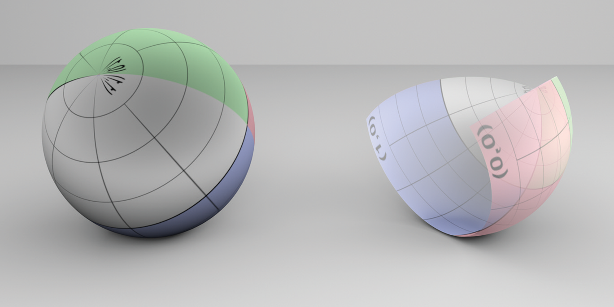

Figure 3.5: Two Spheres. On the left is a complete sphere, and on the right is a partial sphere (with $z_{max} < r$ and $\phi_{max} < 2\pi$). Note that the texture map used shows the $u, v$ parameterization of the shape; the singularity at one of the poles is visible in the complete sphere.

As we describe the implementation of the sphere shape, we will make use of both the implicit and parametric descriptions of the shape, depending on which is a more natural way to approach the particular problem we’re facing.

The Sphere class represents a sphere that is centered at the origin in object space. Its implementation is in the files shapes/sphere.h and shapes/sphere.cpp.

图 3.5：两个球体。左边是一个完整的球体，右边是一个部分球体（ $z_{max} < r$ 和 $\phi_{max} < 2\pi$ ）。请注意，使用的纹理贴图显示了形状的 $u, v$ 参数化；其中一个极点的奇点在整个球体中都是可见的。

当我们描述球体形状的实现时，我们将使用形状的隐式和参数化描述，这取决于哪种方法是解决我们面临的特定问题的更自然的方法。

Sphere 类表示以对象空间中的原点为中心的球体。它的实现在文件shapes/sphere.h 和shapes/sphere.cpp 中。

```
<<Sphere Declarations>>= 
class Sphere : public Shape {
public:
    <<Sphere Public Methods>> 
private:
    <<Sphere Private Data>> 
};
```

To place a sphere elsewhere in the scene, the user must apply an appropriate transformation when specifying the sphere in the input file. It takes both the object-to-world and world-to-object transformations as parameters to the constructor, passing them along to the parent Shape constructor.

The radius of the sphere can have an arbitrary positive value, and the sphere’s extent can be truncated in two different ways. First, minimum and maximum $z$ values may be set; the parts of the sphere below and above these planes, respectively, are cut off. Second, considering the parameterization of the sphere in spherical coordinates, a maximum $\phi$ value can be set. The sphere sweeps out $\phi$ values from 0 to the given  such that the section of the sphere with spherical $\phi$ values above $\phi_{max}$ is also removed.

要将球体放置在场景中的其他位置，用户必须在输入文件中指定球体时应用适当的变换。它将对象到世界和世界到对象的变换都作为构造函数的参数，将它们传递给父 Shape 构造函数。

球体的半径可以有任意的正值，球体的范围可以用两种不同的方式截断。首先，可以设置最小和最大 $z$ 值；球体在这些平面下方和上方的部分分别被切除。其次，考虑球坐标中球体的参数化，可以设置最大 $\phi$ 值。球体从 0 到给定的 $\phi$ 值扫出，这样球体的球面 $\phi$ 值高于 $\phi_{max}$ 的部分也被删除。

```
<<Sphere Public Methods>>= 
Sphere(const Transform *ObjectToWorld, const Transform *WorldToObject,
       bool reverseOrientation, Float radius, Float zMin, Float zMax,
       Float phiMax)
    : Shape(ObjectToWorld, WorldToObject, reverseOrientation),
      radius(radius), zMin(Clamp(std::min(zMin, zMax), -radius, radius)),
      zMax(Clamp(std::max(zMin, zMax), -radius, radius)),
      thetaMin(std::acos(Clamp(zMin / radius, -1, 1))),
      thetaMax(std::acos(Clamp(zMax / radius, -1, 1))),
      phiMax(Radians(Clamp(phiMax, 0, 360))) { }

<<Sphere Private Data>>= 
const Float radius;
const Float zMin, zMax;
const Float thetaMin, thetaMax, phiMax;
```

### 3.2.1 Bounding / 边界

Computing an object space bounding box for a sphere is straightforward. The implementation here uses the values of $z_{min}$ and $z_{max}$ provided by the user to tighten up the bound when less than an entire sphere is being rendered. However, it doesn’t do the extra work to compute a tighter bounding box when $phi_{max}$ is less than $3\pi/2$. This improvement is left as an exercise.

计算球体的对象空间包围盒很简单。此处的实现使用用户提供的 $z_{min}$ 和 $z_{max}$ 的值在渲染小于整个球体时收缩边界。然而，当 $phi_{max}$ 小于 $3\pi/2$ 时，它不会做额外的工作来计算更紧密的包围盒。这种改进留作练习。

```
<<Sphere Method Definitions>>= 
Bounds3f Sphere::ObjectBound() const {
    return Bounds3f(Point3f(-radius, -radius, zMin),
                    Point3f( radius,  radius, zMax));
}
```

### 3.2.2 Intersection Tests / 相交测试

The task of deriving a ray–sphere intersection test is simplified by the fact that the sphere is centered at the origin. However, if the sphere has been transformed to another position in world space, then it is necessary to transform rays to object space before intersecting them with the sphere, using the world-to-object transformation. Given a ray in object space, the intersection computation can be performed in object space instead.

The following fragment shows the entire intersection method:

球体以原点为中心这一事实简化了推导光线-球体相交测试的任务。但是，如果球体已经被变换到世界空间中的另一个位置，那么在与球体相交之前，需要使用世界到对象变换，将光线变换到对象空间。给定对象空间中的一条光线，相交计算可以在对象空间中执行。

以下片段显示了整个相交方法：

```
<<Sphere Method Definitions>>+=  
bool Sphere::Intersect(const Ray &r, Float *tHit,
        SurfaceInteraction *isect, bool testAlphaTexture) const {
    Float phi;
    Point3f pHit;
    <<Transform Ray to object space>> 
    <<Compute quadratic sphere coefficients>> 
    <<Solve quadratic equation for t values>> 
    <<Compute sphere hit position and >> 
    <<Test sphere intersection against clipping parameters>> 
    <<Find parametric representation of sphere hit>> 
    <<Compute error bounds for sphere intersection>> 
    <<Initialize SurfaceInteraction from parametric information>> 
    <<Update tHit for quadric intersection>> 
    return true;
}
```

First, the given world space ray is transformed to the sphere’s object space. The remainder of the intersection test will take place in that coordinate system. The oErr and dErr variables respectively bound the floating-point round-off error in the transformed ray’s origin and direction that was introduced by applying the transformation. (See Section 3.9 for more information about floating-point arithmetic and its implications for accurate ray intersection calculations.)

首先，给定的世界空间光线被变换到球体的对象空间。其余的相交测试将在该坐标系中进行。 oErr 和 dErr 变量分别限制了通过应用变换引入的变换光线原点和方向的浮点舍入误差。 （有关浮点运算及其对精确光线相交计算的影响的更多信息，请参见第 3.9 节。）

```
<<Transform Ray to object space>>= 
Vector3f oErr, dErr;
Ray ray = (*WorldToObject)(r, &oErr, &dErr);
```

If a sphere is centered at the origin with radius $r$, its implicit representation is

如果球体以原点为中心，半径为 $r$ ，则其隐式表示为

$$
x^{2}+y^{2}+z^{2}-r^{2}=0 .
$$

By substituting the parametric representation of the ray from Equation (2.3) into the implicit sphere equation, we have

通过将方程（2.3）中光线的参数表示代入隐式球面方程，我们有

$$
\left(\mathrm{o}_{x}+t \mathbf{d}_{x}\right)^{2}+\left(\mathrm{o}_{y}+t \mathbf{d}_{y}\right)^{2}+\left(\mathrm{o}_{z}+t \mathbf{d}_{z}\right)^{2}=r^{2}
$$

Note that all elements of this equation besides $t$ are known values. The $t$ values where the equation holds give the parametric positions along the ray where the implicit sphere equation holds and thus the points along the ray where it intersects the sphere. We can expand this equation and gather the coefficients for a general quadratic equation in $t$,

请注意，此等式中除 $t$ 之外的所有元素都是已知值。方程成立的 $t$ 值给出了沿光线的参数位置，其中隐式球方程成立，因此点沿光线与球相交。我们可以展开这个方程并在 $t$ 中收集一般二次方程的系数，

$$
a t^{2}+b t+c=0
$$

where

$$
\begin{array}{l}
a=\mathbf{d}_{x}^{2}+\mathbf{d}_{y}^{2}+\mathbf{d}_{z}^{2} \\
b=2\left(\mathbf{d}_{x} \mathrm{o}_{x}+\mathbf{d}_{y} \mathrm{o}_{y}+\mathbf{d}_{z} \mathrm{o}_{z}\right) \\
c=\mathrm{o}_{x}^{2}+\mathrm{o}_{y}^{2}+\mathrm{o}_{z}^{2}-r^{2}
\end{array}
$$

This result directly translates to this fragment of source code. Note that in this code, instances of the EFloat class, not Floats, are used to represent floating-point values. EFloat tracks accumulated floating-point rounding error; its use is discussed in Section 3.9. For now, it can just be read as being equivalent to Float.

这个结果直接转化为这个源代码片段。请注意，在此代码中，EFloat 类的实例，而不是 Floats，用于表示浮点值。 EFloat 跟踪累积的浮点舍入误差；它的使用在第 3.9 节中讨论。现在，它可以被理解为等同于 Float。

```
<<Compute quadratic sphere coefficients>>= 
<<Initialize EFloat ray coordinate values>> 
EFloat a = dx * dx + dy * dy + dz * dz;
EFloat b = 2 * (dx * ox + dy * oy + dz * oz);
EFloat c = ox * ox + oy * oy + oz * oz - EFloat(radius) * EFloat(radius);
```

The ray origin and direction values used in the intersection test are initialized with the floating-point error bounds from transforming the ray to object space.

相交测试中使用的光线原点和方向值，使用将光线变换到对象空间的浮点误差界限进行初始化。

```
<<Initialize EFloat ray coordinate values>>= 
EFloat ox(ray.o.x, oErr.x), oy(ray.o.y, oErr.y), oz(ray.o.z, oErr.z);
EFloat dx(ray.d.x, dErr.x), dy(ray.d.y, dErr.y), dz(ray.d.z, dErr.z);
```

There are two possible solutions to the quadratic equation, giving zero, one, or two nonimaginary $t$ values where the ray intersects the sphere.

二次方程有两种可能的解，在光线与球体相交处给出零、一个或两个非虚数 $t$ 值。

```
<<Solve quadratic equation for t values>>= 
EFloat t0, t1;
if (!Quadratic(a, b, c, &t0, &t1))
    return false;
<<Check quadric shape t0 and t1 for nearest intersection>> 
```

The Quadratic() utility function solves a quadratic equation, returning false if there are no real solutions and returning true and setting t0 and t1 appropriately if there are solutions. It is defined later in Section 3.9.4, where we discuss how to implement it robustly using floating-point arithmetic.

The computed parametric distances t0 and t1 track uncertainty due to errors in the original ray parameters and errors accrued in Quadratic(); the lower and upper range of the uncertainty interval can be queried using the methods EFloat::LowerBound() and EFloat::UpperBound().

The fragment <<*Check quadric shape t0 and t1 for nearest intersection*>> takes the two intersection $t$ values and determines which, if any, is the closest valid intersection. For an intersection to be valid, its $t$ value must be greater than zero and less than ray.tMax. The following code uses the error intervals provided by the EFloat class and only accepts intersections that are unequivocally in the range $(0, tMax)$.

Since $t_0$ is guaranteed to be less than or equal to $t_1$ (and $0$ is less than tMax), then if $t_0$ is greater than tMax or $t_1$ is less than $0$, it is certain that both intersections are out of the range of interest. Otherwise, $t_0$ is the tentative hit $t$ value. It may be less than $0$, however, in which case we ignore it and try $t_1$. If that is also out of range, we have no valid intersection. If there is an intersection, then tShapeHit is initialized to hold the parametric $t$ value for the intersection.

Quadratic() 工具函数求解二次方程，如果没有实数解，则返回 false，如果有解，则返回 true， 并适当设置 t0 和 t1。它在 3.9.4 节稍后定义，我们将讨论如何使用浮点算法健壮地实现它。

由于原始光线参数中的错误和 Quadratic() 中累积的错误，计算出的参数距离 t0 和 t1 跟踪不确定性；可以使用方法 EFloat::LowerBound() 和 EFloat::UpperBound() 查询不确定区间的下限和上限。

片段 <<*Check quadric shape t0 and t1 for Nearest Cross*>> 采用两个交点 $t$ 值并确定哪个（如果有）是最近的有效交点。要使交点有效，其 $t$ 值必须大于0且小于 ray.tMax。以下代码使用 EFloat 类提供的错误区间，并且只接受明确在 $(0, tMax)$ 范围内的交点。

由于 $t_0$ 保证小于或等于 $t_1$（并且 $0$ 小于 tMax），那么如果 $t_0$ 大于 tMax 或 $t_1$ 小于 $0$ ，则可以肯定两者交点超出了兴趣范围。否则， $t_0$ 是暂定命中 $t$ 值。然而，它可能小于 $0$ ，在这种情况下，我们忽略它并尝试 $t_1$ 。如果这也超出范围，我们就没有有效的相交。如果存在相交，则 tShapeHit 被初始化以保存该相交的参数 $t$ 值。

```
<<Check quadric shape t0 and t1 for nearest intersection>>= 
if (t0.UpperBound() > ray.tMax || t1.LowerBound() <= 0)
    return false;
EFloat tShapeHit = t0;
if (tShapeHit.LowerBound() <= 0) {
    tShapeHit = t1;
    if (tShapeHit.UpperBound() > ray.tMax)
        return false;
}
```

Given the parametric distance along the ray to the intersection with a full sphere, the intersection point pHit can be computed as that offset along the ray.

It is next necessary to handle partial spheres with clipped $z$ or $\phi$ ranges—intersections that are in clipped areas must be ignored. The implementation starts by computing the $\phi$ value for the hit point. Using the parametric representation of the sphere,

给定沿光线到与完整球体相交的参数距离，可以将交点 pHit 计算为沿光线的偏移量。

接下来需要处理带有剪裁 $z$ 或 $\phi$ 范围的部分球体——剪裁区域中的交点必须被忽略。该实现首先计算命中点的 $\phi$ 值。使用球体的参数表示，

$$
\frac{y}{x}=\frac{r \sin \theta \sin \phi}{r \sin \theta \cos \phi}=\tan \phi
$$

so $\phi=\arctan y / x$. It is necessary to remap the result of the standard library’s std::atan() function to a value between $0$ and $\pi$, to match the sphere’s original definition.

所以 $\phi=\arctan y / x$ 。有必要将标准库的 std::atan() 函数的结果重新映射到 $0$ 和 $\pi$ 之间的值，以匹配球体的原始定义。

```
<<Compute sphere hit position and >>= 
pHit = ray((Float)tShapeHit);
<<Refine sphere intersection point>> 
if (pHit.x == 0 && pHit.y == 0) pHit.x = 1e-5f * radius;
phi = std::atan2(pHit.y, pHit.x);
if (phi < 0) phi += 2 * Pi;
```

Due to floating-point precision limitations, this computed intersection point pHit may lie a bit to one side of the actual sphere surface; the <<*Refine sphere intersection point*>> fragment, which is defined in Section 3.9.4, improves the precision of this value.

The hit point can now be tested against the specified minima and maxima for $z$ and $\phi$. One subtlety is that it’s important to skip the $z$ tests if the $z$ range includes the entire sphere; the computed pHit.z value may be slightly out of the $z$ range due to floating-point round-off, so we should only perform this test when the user expects the sphere to be partially incomplete. If the $t_0$ intersection wasn’t actually valid, the routine tries again with $t_1$.

由于浮点精度的限制，这个计算出的交点 pHit 可能会位于实际球体表面的一侧；在第 3.9.4 节中定义的 <<*Refine sphere intersection point*>> 片段提高了该值的精度。

现在可以针对 $z$ 和 $\phi$ 的指定最小值和最大值测试命中点。一个微妙之处在于，如果 $z$ 范围包括整个球体，则跳过 $z$ 测试很重要；由于浮点四舍五入，计算出的 pHit.z 值可能略微超出 $z$ 范围，因此我们应该仅在用户预期球体部分不完整时执行此测试。如果 $t_0$ 相交实际上无效，则代码会再次尝试使用 $t_1$ 。

```
<<Test sphere intersection against clipping parameters>>= 
if ((zMin > -radius && pHit.z < zMin) ||
    (zMax <  radius && pHit.z > zMax) || phi > phiMax) {
    if (tShapeHit == t1) return false;
    if (t1.UpperBound() > ray.tMax) return false;
    tShapeHit = t1;
    <<Compute sphere hit position and >> 
    if ((zMin > -radius && pHit.z < zMin) ||
        (zMax <  radius && pHit.z > zMax) || phi > phiMax)
        return false;
}
```

At this point in the routine, it is certain that the ray hits the sphere. The method next computes $u$ and $v$ values by scaling the previously computed $\phi$ value for the hit to lie between 0 and 1 and by computing a $\theta$ value between 0 and 1 for the hit point, based on the range of $\theta$ values for the given sphere. Then it finds the parametric partial derivatives of position $\partial \mathrm{p} / \partial u$ and $\partial \mathrm{p} / \partial v$ and surface normal $\partial \mathrm{n} / \partial u$ and $\partial \mathrm{n} / \partial v$.

在代码中的这一点上，可以肯定的是光线击中了球体。该方法接下来计算 $u$ 和 $v$ 值，方法是将先前计算的 $\phi$ 值缩放到 0 和 1 之间，并计算 0 和 1 之间的 $\theta$ 值作为命中点，基于在给定球体的 $\theta$ 值范围内。然后它找到位置 $\partial \mathrm{p} / \partial u$ 和 $\partial \mathrm{p} / \partial v$ ，和表面法线 $\partial \mathrm{n} / \partial u$ 和 $\partial \mathrm{n} / \partial v$ 的参数偏导数。

```
<<Find parametric representation of sphere hit>>= 
Float u = phi / phiMax;
Float theta = std::acos(Clamp(pHit.z / radius, -1, 1));
Float v = (theta - thetaMin) / (thetaMax - thetaMin);
<<Compute sphere  and >> 
<<Compute sphere  and >> 
```

Computing the partial derivatives of a point on the sphere is a short exercise in algebra. Here we will show how the $x$ component of $\partial \mathrm{p} / \partial u$, $\partial \mathrm{p_x} / \partial u$, is calculated; the other components are found similarly. Using the parametric definition of the sphere, we have

计算球面上一点的偏导数是代数中的一个简短练习。这里我们将展示如何计算 $\partial \mathrm{p} / \partial u$ 的 $x$ 分量， $\partial \mathrm{p_x} / \partial u$；其他组件类似。使用球体的参数定义，我们有

$$
\begin{aligned}
x &=r \sin \theta \cos \phi \\
\frac{\partial p_{x}}{\partial u} &=\frac{\partial}{\partial u}(r \sin \theta \cos \phi) \\
&=r \sin \theta \frac{\partial}{\partial u}(\cos \phi) \\
&=r \sin \theta\left(-\phi_{\max } \sin \phi\right) .
\end{aligned}
$$

Using a substitution based on the parametric definition of the sphere’s $y$ coordinate, this simplifies to

使用基于球体 $y$ 坐标的参数定义的替换，这简化为

$$
\frac{\partial \mathrm{p}_{x}}{\partial u}=-\phi_{\max } y
$$

Similarly,

类似的，

$$
\frac{\partial p_{y}}{\partial u}=\phi_{\max } x
$$

and

和

$$
\frac{\partial \mathrm{p}_{z}}{\partial u}=0
$$

A similar process gives $\partial \mathrm{p} / \partial v$. The complete result is

类似的过程给出了 $\partial \mathrm{p} / \partial v$ 。完整的结果是

$$
\begin{aligned}
\frac{\partial \mathrm{p}}{\partial u} &=\left(-\phi_{\max } y, \phi_{\max } x, 0\right) \\
\frac{\partial \mathrm{p}}{\partial v} &=\left(\theta_{\max }-\theta_{\min }\right)(z \cos \phi, z \sin \phi,-r \sin \theta)
\end{aligned}
$$

```
// 译注，代码块中无法显示数学公式

<<Compute sphere $\partial \mathrm{p} / \partial u$ and $\partial \mathrm{p} / \partial v$>>= 
Float zRadius = std::sqrt(pHit.x * pHit.x + pHit.y * pHit.y);
Float invZRadius = 1 / zRadius;
Float cosPhi = pHit.x * invZRadius;
Float sinPhi = pHit.y * invZRadius;
Vector3f dpdu(-phiMax * pHit.y, phiMax * pHit.x, 0);
Vector3f dpdv = (thetaMax - thetaMin) *
    Vector3f(pHit.z * cosPhi, pHit.z * sinPhi,
             -radius * std::sin(theta));
```

### 3.2.3 Partial Derivatives of Normal Vectors / 法向量的偏导数

It is also useful to determine how the normal changes as we move along the surface in the $u$ and $v$ directions. For example, the antialiasing techniques in Chapter 10 are dependent on this information to antialias textures on objects that are seen reflected in curved surfaces. The differential changes in normal $\partial \mathrm{n} / \partial u$ and $\partial \mathrm{n} / \partial v$ are given by the Weingarten equations from differential geometry:

当我们在 $u$ 和 $v$ 方向上沿着表面移动时，确定法线如何变化也很有用。例如，第 10 章中的抗锯齿技术依赖于这些信息，以在曲面中反射的对象的纹理进行抗锯齿。正常 $\partial \mathrm{n} / \partial u$ 和 $\partial \mathrm{n} / \partial v$ 的微分变化由微分几何的 Weingarten 方程给出：

$$
\begin{array}{l}
\frac{\partial \mathbf{n}}{\partial u}=\frac{f F-e G}{E G-F^{2}} \frac{\partial \mathrm{p}}{\partial u}+\frac{e F-f E}{E G-F^{2}} \frac{\partial \mathrm{p}}{\partial v} \\
\frac{\partial \mathbf{n}}{\partial v}=\frac{g F-f G}{E G-F^{2}} \frac{\partial \mathrm{p}}{\partial u}+\frac{f F-g E}{E G-F^{2}} \frac{\partial \mathrm{p}}{\partial v},
\end{array}
$$

where $E$, $F$, and $G$ are coefficients of the first fundamental form and are given by

其中 $E$ 、 $F$ 和 $G$ 是第一基本形式的系数，由下式给出

$$
\begin{array}{l}
E=\left|\frac{\partial p}{\partial u}\right|^{2} \\
F=\left(\frac{\partial p}{\partial u} \cdot \frac{\partial p}{\partial v}\right) \\
G=\left|\frac{\partial p}{\partial v}\right|^{2}
\end{array}
$$

These are easily computed with the $\partial \mathrm{n} / \partial u$ and $\partial \mathrm{n} / \partial v$ values found earlier. The e, f, and g are coefficients of the second fundamental form,

这些很容易用之前找到的 $\partial \mathrm{n} / \partial u$ 和 $\partial \mathrm{n} / \partial v$ 值计算出来。 e、f 和 g 是第二基本形式的系数，

$$
\begin{array}{l}
e=\left(\mathbf{n} \cdot \frac{\partial^{2} \mathrm{p}}{\partial u^{2}}\right) \\
f=\left(\mathbf{n} \cdot \frac{\partial^{2} \mathrm{p}}{\partial u \partial v}\right) \\
g=\left(\mathbf{n} \cdot \frac{\partial^{2} \mathrm{p}}{\partial v^{2}}\right)
\end{array}
$$

The two fundamental forms capture elementary metric properties of a surface, including notions of distance, angle, and curvature; see a differential geometry textbook such as Gray (1993) for details. To find $e$, $f$, and $g$, it is necessary to compute the second-order partial derivatives $\partial^{2} \mathrm{p} / \partial u^{2}$ and so on.

For spheres, a little more algebra gives the second derivatives:

这两种基本形式捕获了表面的基本度量属性，包括距离、角度和曲率的概念；有关详细信息，请参阅微分几何教科书，例如 Gray (1993)。要找到 $e$ 、 $f$ 和 $g$ ，需要计算二阶偏导数 $\partial^{2} \mathrm{p} / \partial u^{2}$ 等等.

对于球体，多一点代数给出二阶导数：

$$
\begin{aligned}
\frac{\partial^{2} \mathrm{p}}{\partial u^{2}} &=-\phi_{\max }^{2}(x, y, 0) \\
\frac{\partial^{2} \mathrm{p}}{\partial u \partial v} &=\left(\theta_{\max }-\theta_{\min }\right) z \phi_{\max }(-\sin \phi, \cos \phi, 0) \\
\frac{\partial^{2} \mathrm{p}}{\partial v^{2}} &=-\left(\theta_{\max }-\theta_{\min }\right)^{2}(x, y, z)
\end{aligned}
$$

```
<<Compute sphere $\partial \mathrm{n} / \partial u$ and $\partial \mathrm{n} / \partial v$>>= 
Vector3f d2Pduu = -phiMax * phiMax * Vector3f(pHit.x, pHit.y, 0);
Vector3f d2Pduv = (thetaMax - thetaMin) * pHit.z * phiMax *
                  Vector3f(-sinPhi, cosPhi, 0.);
Vector3f d2Pdvv = -(thetaMax - thetaMin) * (thetaMax - thetaMin) *
                  Vector3f(pHit.x, pHit.y, pHit.z);
<<Compute coefficients for fundamental forms>> 
<<Compute $\partial \mathrm{n} / \partial u$ and $\partial \mathrm{n} / \partial v$ from fundamental form coefficients>> 

<<Compute coefficients for fundamental forms>>= 
Float E = Dot(dpdu, dpdu);
Float F = Dot(dpdu, dpdv);
Float G = Dot(dpdv, dpdv);
Vector3f N = Normalize(Cross(dpdu, dpdv));
Float e = Dot(N, d2Pduu);
Float f = Dot(N, d2Pduv);
Float g = Dot(N, d2Pdvv);

<<Compute $\partial \mathrm{n} / \partial u$ and $\partial \mathrm{n} / \partial v$ from fundamental form coefficients>>= 
Float invEGF2 = 1 / (E * G - F * F);
Normal3f dndu = Normal3f((f * F - e * G) * invEGF2 * dpdu + 
                         (e * F - f * E) * invEGF2 * dpdv);
Normal3f dndv = Normal3f((g * F - f * G) * invEGF2 * dpdu + 
                         (f * F - g * E) * invEGF2 * dpdv);
```

### 3.2.4 SurfaceInteraction Initialization / 表面交互初始化

Having computed the surface parameterization and all the relevant partial derivatives, the SurfaceInteraction structure can be initialized with the geometric information for this intersection. The pError value passed to the SurfaceInteraction constructor bounds the rounding error in the computed pHit point. It is initialized in the fragment <<*Compute error bounds for sphere intersection*>>, which is defined later, in Section 3.9.4.

在计算了表面参数化和所有相关的偏导数之后，SurfaceInteraction 结构可以用该交点的几何信息进行初始化。传递给 SurfaceInteraction 构造函数的 pError 值限制了计算出的 pHit 点中的舍入误差。它在片段 <<*Compute error bounds for sphere intersection*>> 中初始化，稍后在第 3.9.4 节中定义。

```
<<Initialize SurfaceInteraction from parametric information>>= 
*isect = (*ObjectToWorld)(
    SurfaceInteraction(pHit, pError, Point2f(u, v), -ray.d, dpdu, dpdv,
                       dndu, dndv, ray.time, this));
```

Since there is an intersection, the tHit parameter to the Intersect() method is updated with the parametric hit distance along the ray, which was stored in tShapeHit. Updating *tHit allows subsequent intersection tests to terminate early if the potential hit would be farther away than the existing intersection.

由于存在交点，Intersect() 方法的 tHit 参数将使用沿光线的参数命中距离进行更新，该参数存储在 tShapeHit 中。如果潜在命中比现有交点更远，则更新 *tHit 允许后续交点测试提前终止。

```
<<Update tHit for quadric intersection>>= 
*tHit = (Float)tShapeHit;
```

A natural question to ask at this point is, “What effect does the world-to-object transformation have on the correct parametric distance to return?” Indeed, the intersection method has found a parametric distance to the intersection for the object space ray, which may have been translated, rotated, scaled, or worse when it was transformed from world space. However, it can be shown that the parametric distance to an intersection in object space is exactly the same as it would have been if the ray was left in world space and the intersection had been done there and, thus, tHit can be set directly. Note that if the object space ray’s direction had been normalized after the transformation, then this would no longer be the case and a correction factor related to the unnormalized ray’s length would be needed. This is another motivation for not normalizing the object space ray’s direction vector after transformation.

The Sphere::IntersectP() routine is almost identical to Sphere::Intersect(), but it does not initialize the SurfaceInteraction structure. Because the Intersect() and IntersectP() methods are always so closely related, in the following we will not show implementations of IntersectP() for the remaining shapes.

此时要问的一个自然问题是，“世界到对象的变换对返回的正确参数距离有什么影响？”事实上，相交方法已经为物体空间光线找到了到交点的参数距离，当它从世界空间变换时，它可能已经被平移、旋转、缩放或更糟。但是，可以证明到对象空间中的交点的参数距离，与如果光线留在世界空间中并且交点已经在那里完成的情况完全相同，因此可以直接设置 tHit。请注意，如果对象空间光线的方向在变换后已归一化，则情况将不再如此，并且需要与未归一化光线的长度相关的校正因子。这是变换后不归一化对象空间光线方向向量的另一个动机。

Sphere::IntersectP() 代码几乎与 Sphere::Intersect() 相同，但它不初始化 SurfaceInteraction 结构。因为 Intersect() 和 IntersectP() 方法总是如此密切相关，所以在下面我们不会展示其余形状的 IntersectP() 的实现。

```
<<Sphere Method Definitions>>+=  
bool Sphere::IntersectP(const Ray &r, bool testAlphaTexture) const {
    Float phi;
    Point3f pHit;
    <<Transform Ray to object space>> 
    <<Compute quadratic sphere coefficients>> 
    <<Solve quadratic equation for t values>> 
    <<Compute sphere hit position and >> 
    <<Test sphere intersection against clipping parameters>> 
    return true;
}
```

### 3.2.5 Surface Area / 表面积

To compute the surface area of quadrics, we use a standard formula from integral calculus. If a curve $y = f(x)$ from $x = a$ to $x = b$ is revolved around the $x$ axis, the surface area of the resulting swept surface is

为了计算二次曲面的表面积，我们使用积分的标准公式。如果一条从 $x = a$ 到 $x = b$ 的曲线 $y = f(x)$ 围绕 $x$ 轴旋转，则所得扫出表面的表面积为

$$
2 \pi \int_{a}^{b} f(x) \sqrt{1+\left(f^{\prime}(x)\right)^{2}} \mathrm{~d} x
$$

where $f^{\prime}(x) \mathrm{d}$ denotes the derivative $\mathrm{d} f / \mathrm{d} x$. Since most of our surfaces of revolution are only partially swept around the axis, we will instead use the formula

其中 $f^{\prime}(x) \mathrm{d}$ 表示导数 $\mathrm{d} f / \mathrm{d} x$ 。由于我们的大部分旋转表面仅部分绕轴扫出，因此我们将使用公式

$$
\phi_{\max } \int_{a}^{b} f(x) \sqrt{1+\left(f^{\prime}(x)\right)^{2}} \mathrm{~d} x
$$

The sphere is a surface of revolution of a circular arc. The function that defines the profile curve along the $z$ axis of the sphere is

球体是圆弧的旋转面。定义沿球体 $z$ 轴的轮廓曲线的函数是

$$
f(z)=\sqrt{r^{2}-z^{2}}
$$

and its derivative is

它的导数是

$$
f^{\prime}(z)=-\frac{z}{\sqrt{r^{2}-z^{2}}}
$$

Recall that the sphere is clipped at $z_{min}$ and $z_{max}$. The surface area is therefore

回想一下，球体在 $z_{min}$ 和 $z_{max}$ 处被裁剪。因此表面积为

$$
\begin{aligned}
A &=\phi_{\max } \int_{z_{\min }}^{z_{\max }} \sqrt{r^{2}-z^{2}} \sqrt{1+\frac{z^{2}}{r^{2}-z^{2}}} \mathrm{~d} z \\
&=\phi_{\max } \int_{z_{\min }}^{z_{\max }} \sqrt{r^{2}-z^{2}+z^{2}} \mathrm{~d} z \\
&=\phi_{\max } \int_{z_{\min }}^{z_{\max }} r \mathrm{~d} z \\
&=\phi_{\max } r\left(z_{\max }-z_{\min }\right)
\end{aligned}
$$

For the full sphere $\phi_{\max }=2 \pi$, $z_{\min }=-r$, and $z_{\max }=r$, so we have the standard formula $A=4 \pi r^{2}$, confirming that the formula makes sense.

对于全球体 $\phi_{\max }=2 \pi$, $z_{\min }=-r$, 和 $z_{\max }=r$ ，所以我们有标准公式 $A=4 \pi r^{2}$ ，确认公式有意义。

```
<<Sphere Method Definitions>>+=  
Float Sphere::Area() const {
    return phiMax * radius * (zMax - zMin);
}
```

## 3.3 Cylinders / 圆柱体

Another useful quadric is the cylinder; pbrt provides cylinder Shapes that are centered around the $z$ axis. The implementation is in the files shapes/cylinder.h and shapes/cylinder.cpp. The user supplies a minimum and maximum $z$ value for the cylinder, as well as a radius and maximum $\phi$ sweep value (Figure 3.6).

另一个有用的二次曲面是圆柱体； pbrt 提供以 $z$ 轴为中心的圆柱形状。实现在文件shapes/cylinder.h 和shapes/cylinder.cpp 中。用户提供圆柱的最小和最大 $z$ 值，以及半径和最大扫角 $\phi$（图 3.6）。


Figure 3.6: Basic Setting for the Cylinder Shape. It has a radius of $r$ and covers a range along the $z$ axis. A partial cylinder may be swept by specifying a maximum $\phi$ value.

图 3.6：圆柱形状的基本设置。它的半径为 $r$ ，覆盖了沿 $z$ 轴的范围。可以通过指定最大 $\phi$ 值来扫出部分圆柱体。

```
<<Cylinder Declarations>>= 
class Cylinder : public Shape {
public:
    <<Cylinder Public Methods>> 
protected:
    <<Cylinder Private Data>> 
};
```

In parametric form, a cylinder is described by the following equations:

在参数形式中，圆柱体由以下等式描述：

$$
\begin{aligned}
\phi &=u \phi_{\max } \\
x &=r \cos \phi \\
y &=r \sin \phi \\
z &=z_{\min }+v\left(z_{\max }-z_{\min }\right) .
\end{aligned}
$$

Figure 3.7 shows a rendered image of two cylinders. Like the sphere image, the left cylinder is a complete cylinder, while the right one is a partial cylinder because it has a $\phi_{max}$ value less than $2\pi$.

图 3.7 显示了两个圆柱体的渲染图像。与球体图像一样，左侧圆柱体是完整圆柱体，而右侧圆柱体是部分圆柱体，因为它的 $\phi_{max}$ 值小于 $2\pi$ 。

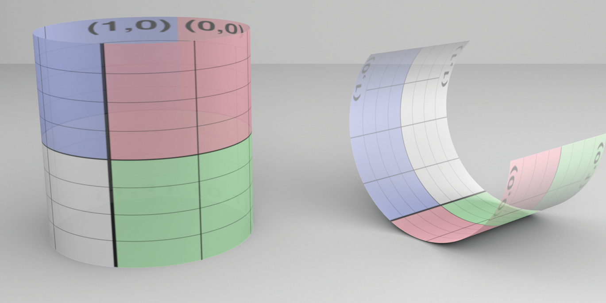

Figure 3.7: Two Cylinders. A complete cylinder is on the left, and a partial cylinder is on the right.

图 3.7：两个圆柱体。左边是一个完整的圆柱体，右边是一个部分圆柱体。

```
<<Cylinder Public Methods>>= 
Cylinder(const Transform *ObjectToWorld, const Transform *WorldToObject,
         bool reverseOrientation, Float radius, Float zMin, Float zMax,
         Float phiMax)
    : Shape(ObjectToWorld, WorldToObject, reverseOrientation),
      radius(radius), zMin(std::min(zMin, zMax)),
      zMax(std::max(zMin, zMax)),
      phiMax(Radians(Clamp(phiMax, 0, 360))) { }

<<Cylinder Private Data>>= 
const Float radius, zMin, zMax, phiMax;
```

### 3.3.1 Bounding / 边界

As was done with the sphere, the cylinder bounding method computes a conservative bounding box using the $z$ range but without taking into account the maximum $\phi$.

与球体一样，圆柱边界方法使用 $z$ 范围计算保守包围盒，但不考虑最大 $\phi$ 。

```
<<Cylinder Method Definitions>>= 
Bounds3f Cylinder::ObjectBound() const {
    return Bounds3f(Point3f(-radius, -radius, zMin),
                    Point3f( radius,  radius, zMax));
}
```

### 3.3.2 Intersection Tests / 相交测试

The ray–cylinder intersection formula can be found by substituting the ray equation into the cylinder’s implicit equation, similarly to the sphere case. The implicit equation for an infinitely long cylinder centered on the $z$ axis with radius $r$ is

光线-圆柱相交公式可以通过将光线方程代入圆柱的隐式方程得到，类似于球体的情况。以 $z$ 轴为中心，半径为 $r$ 的无限长圆柱的隐式方程为

$$
x^{2}+y^{2}-r^{2}=0
$$

Substituting the ray equation, Equation (2.3), we have

代入光线方程，方程（2.3），我们有

$$
\left(\mathrm{o}_{x}+t \mathbf{d}_{x}\right)^{2}+\left(\mathrm{o}_{y}+t \mathbf{d}_{y}\right)^{2}=r^{2} .
$$

When we expand this and find the coefficients of the quadratic equation $a t^{2}+b t+c$, we have

当我们展开它并找到二次方程 $a t^{2}+b t+c$ 的系数时，我们有

$$
\begin{array}{l}
a=\mathbf{d}_{x}^{2}+\mathbf{d}_{y}^{2} \\
b=2\left(\mathbf{d}_{x} \mathrm{o}_{x}+\mathbf{d}_{y} \mathrm{O}_{y}\right) \\
c=\mathrm{o}_{x}^{2}+\mathrm{o}_{y}^{2}-r^{2}
\end{array}
$$

```
<<Compute quadratic cylinder coefficients>>= 
<<Initialize EFloat ray coordinate values>> 
EFloat a = dx * dx + dy * dy;
EFloat b = 2 * (dx * ox + dy * oy);
EFloat c = ox * ox + oy * oy - EFloat(radius) * EFloat(radius);
```

The solution process for the quadratic equation is similar for all quadric shapes, so some fragments from the Sphere intersection method will be reused in the following.

二次方程的求解过程对于所有二次形状都是相似的，因此下面将重复使用球体相交方法中的一些片段。

```
<<Cylinder Method Definitions>>+=  
bool Cylinder::Intersect(const Ray &r, Float *tHit,
        SurfaceInteraction *isect, bool testAlphaTexture) const {
    Float phi;
    Point3f pHit;
    <<Transform Ray to object space>> 
    <<Compute quadratic cylinder coefficients>> 
    <<Solve quadratic equation for t values>> 
    <<Compute cylinder hit point and >> 
    <<Test cylinder intersection against clipping parameters>> 
    <<Find parametric representation of cylinder hit>> 
    <<Compute error bounds for cylinder intersection>> 
    <<Initialize SurfaceInteraction from parametric information>>  
    <<Update tHit for quadric intersection>>  
    return true;
}
```

As with spheres, the implementation here refines the computed intersection point to ameliorate the effect of accumulated rounding error in the point computed by evaluating the ray equation; see Section 3.9.4. We can then invert the parametric description of the cylinder to compute $\phi$ from $x$ and $y$; it turns out that the result is the same as for the sphere.

与球体一样，这里的实现细化了计算的交点，以改善光线方程计算的点中累积舍入误差的影响；见第 3.9.4 节。然后我们可以反转圆柱体的参数描述，以从 $x$ 和 $y$ 计算 $\phi$；事实证明，结果与球体相同。

```
<<Compute cylinder hit point and >>= 
pHit = ray((Float)tShapeHit);
<<Refine cylinder intersection point>> 
phi = std::atan2(pHit.y, pHit.x);
if (phi < 0) phi += 2 * Pi;
```

The next part of the intersection method makes sure that the hit is in the specified $z$ range and that the angle $\phi$ is acceptable. If not, it rejects the hit and checks $t_1$ if it has not already been tried—this resembles the conditional logic in Sphere::Intersect().

相交方法的下一部分确保命中在指定的 $z$ 范围内，并且角度 $\phi$ 是可以接受的。如果没有，它拒绝命中并检查 $t_1$ 。如果它尚未被尝试过——这类似于 Sphere::Intersect() 中的条件逻辑。

```
<<Test cylinder intersection against clipping parameters>>= 
if (pHit.z < zMin || pHit.z > zMax || phi > phiMax) {
    if (tShapeHit == t1) return false;
    tShapeHit = t1;
    if (t1.UpperBound() > ray.tMax) return false;
    <<Compute cylinder hit point and $\phi$>> 
    if (pHit.z < zMin || pHit.z > zMax || phi > phiMax)
        return false;
}
```

Again the $u$ value is computed by scaling $\phi$ to lie between 0 and 1. Straightforward inversion of the parametric equation for the cylinder’s $z$ value gives the $v$ parametric coordinate.

同样，通过将 $\phi$ 缩放到 0 和 1 之间来计算 $u$ 值。直接反转圆柱体 $z$ 值的参数方程给出了 $v$ 参数坐标。

```
<<Find parametric representation of cylinder hit>>= 
Float u = phi / phiMax;
Float v = (pHit.z - zMin) / (zMax - zMin);
<<Compute cylinder $\partial \mathrm{p} / \partial u$ and $\partial \mathrm{p} / \partial v$>> 
<<Compute cylinder $\partial \mathrm{n} / \partial u$ and $\partial \mathrm{n} / \partial v$>> 
```

The partial derivatives for a cylinder are quite easy to derive:

圆柱体的偏导数很容易推导出：

$$
\begin{array}{l}
\frac{\partial p}{\partial u}=\left(-\phi_{\max } y, \phi_{\max } x, 0\right) \\
\frac{\partial p}{\partial v}=\left(0,0, z_{\max }-z_{\min }\right)
\end{array}
$$

```
<<Compute cylinder $\partial \mathrm{p} / \partial u$ and $\partial \mathrm{p} / \partial v$>>= 
Vector3f dpdu(-phiMax * pHit.y, phiMax * pHit.x, 0);
Vector3f dpdv(0, 0, zMax - zMin);
```

We again use the Weingarten equations to compute the parametric partial derivatives of the cylinder normal. The relevant partial derivatives are

我们再次使用 Weingarten 方程来计算圆柱法线的参数偏导数。相关的偏导数是

$$
\begin{aligned}
\frac{\partial^{2} \mathrm{p}}{\partial u^{2}} &=-\phi_{\max }^{2}(x, y, 0) \\
\frac{\partial^{2} \mathrm{p}}{\partial u \partial v} &=(0,0,0) \\
\frac{\partial^{2} \mathrm{p}}{\partial v^{2}} &=(0,0,0)
\end{aligned}
$$

```
<<Compute cylinder $\partial \mathrm{n} / \partial u$ and $\partial \mathrm{n} / \partial v$>>= 
Vector3f d2Pduu = -phiMax * phiMax * Vector3f(pHit.x, pHit.y, 0);
Vector3f d2Pduv(0, 0, 0), d2Pdvv(0, 0, 0);
<<Compute coefficients for fundamental forms>> 
<<Compute $\partial \mathrm{n} / \partial u$ and $\partial \mathrm{n} / \partial v$ from fundamental form coefficients>> 
```

### 3.3.3 Surface Area / 表面积

A cylinder is just a rolled-up rectangle. If you unroll the rectangle, its height is $z_{\max }-z_{\min }$, and its width is $r \phi_{\max }$:

圆柱体只是一个卷起的矩形。如果展开矩形，则其高度为 $z_{\max }-z_{\min }$ ，宽度为 $r \phi_{\max }$：

```
<<Cylinder Method Definitions>>+=  
Float Cylinder::Area() const {
    return (zMax - zMin) * radius * phiMax;
}
```

## 3.4 Disks / 圆盘

The disk is an interesting quadric since it has a particularly straightforward intersection routine that avoids solving the quadratic equation. In pbrt, a Disk is a circular disk of radius $r$ at height $h$ along the $z$ axis. It is implemented in the files shapes/disk.h and shapes/disk.cpp.

圆盘是一个有趣的二次曲面，因为它有一个特别简单的相交程序，可以避免求解二次方程。在 pbrt 中，一个圆盘是一个半径为 $r$ ，高度为 $h$ ，沿 $z$ 轴的圆盘。它在文件shapes/disk.h 和shapes/disk.cpp 中实现。

```
<<Disk Declarations>>= 
class Disk : public Shape {
public:
    <<Disk Public Methods>> 
private:
    <<Disk Private Data>> 
};
```

In order to describe partial disks, the user may specify a maximum $\phi$ value beyond which the disk is cut off (Figure 3.8). The disk can also be generalized to an annulus by specifying an inner radius, $r_i$. In parametric form, it is described by

为了描述部分圆盘，用户可以指定一个最大 $\phi$ 值，超过该值，圆盘将被切断（图 3.8）。也可以通过指定内半径 $r_i$ 将圆盘推广到环面。在参数形式中，它被描述为

$$
\begin{aligned}
\phi &=u \phi_{\max } \\
x &=\left((1-v) r+v r_{i}\right) \cos \phi \\
y &=\left((1-v) r+v r_{i}\right) \sin \phi \\
z &=h
\end{aligned}
$$


Figure 3.8: Basic Setting for the Disk Shape. The disk has radius $r$ and is located at height $h$ along the $z$ axis. A partial disk may be swept by specifying a maximum $\phi$ value and an inner radius $r_i$.

Figure 3.9 is a rendered image of two disks.

图 3.8：圆盘形状的基本设置。圆盘的半径为 $r$ ，位于沿 $z$ 轴的高度 $h$ 处。可以通过指定最大 $\phi$ 值和内半径 $r_i$ 来扫出部分圆盘。

图 3.9 是两个圆盘的渲染图像。

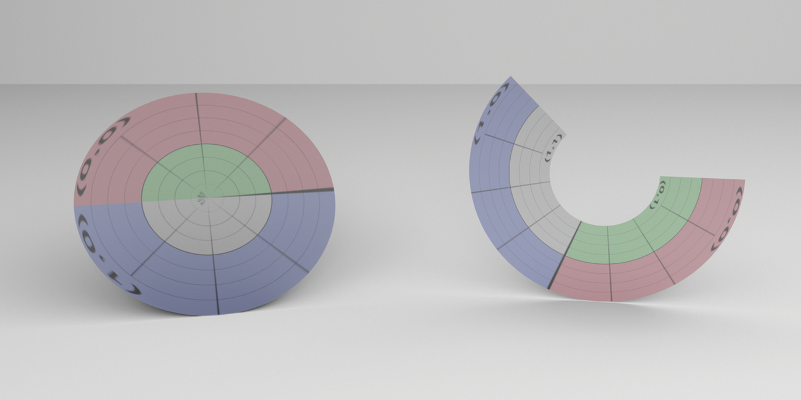

Figure 3.9: Two Disks. A complete disk is on the left, and a partial disk is on the right.

图 3.9：两个圆盘。左侧是完整的圆盘，右侧是部分圆盘。

```
<<Disk Public Methods>>= 
Disk(const Transform *ObjectToWorld, const Transform *WorldToObject,
     bool reverseOrientation, Float height, Float radius,
     Float innerRadius, Float phiMax)
    : Shape(ObjectToWorld, WorldToObject, reverseOrientation),
      height(height), radius(radius), innerRadius(innerRadius),
      phiMax(Radians(Clamp(phiMax, 0, 360))) { }

<<Disk Private Data>>= 
const Float height, radius, innerRadius, phiMax;
```

### 3.4.1 Bounding / 边界

The bounding method is quite straightforward; it computes a bounding box centered at the height of the disk along $z$, with extent of radius in both the $x$ and $y$ directions.

边界方法非常简单；它沿 $z$ 计算以圆盘高度为中心的包围盒，半径范围在 $x$ 和 $y$ 方向。

```
<<Disk Method Definitions>>= 
Bounds3f Disk::ObjectBound() const {
    return Bounds3f(Point3f(-radius, -radius, height),
                    Point3f( radius,  radius, height));
}
```

### 3.4.2 Intersection Tests / 相交测试

Intersecting a ray with a disk is also easy. The intersection of the ray with the $z = h$ plane that the disk lies in is found and the intersection point is checked to see if it lies inside the disk.

将光线与圆盘相交也很容易。找到光线与圆盘所在的 $z = h$ 平面的交点，并检查交点以查看它是否位于圆盘内部。

```
<<Disk Method Definitions>>+=  
bool Disk::Intersect(const Ray &r, Float *tHit,
        SurfaceInteraction *isect, bool testAlphaTexture) const {
    <<Transform Ray to object space>>  
    <<Compute plane intersection for disk>> 
    <<See if hit point is inside disk radii and >> 
    <<Find parametric representation of disk hit>> 
    <<Refine disk intersection point>> 
    <<Compute error bounds for disk intersection>> 
    <<Initialize SurfaceInteraction from parametric information>>  
    <<Update tHit for quadric intersection>>  
    return true;
}
```

The first step is to compute the parametric $t$ value where the ray intersects the plane that the disk lies in. We want to find $t$ such that the $z$ component of the ray’s position is equal to the height of the disk. Thus,

第一步是计算光线与圆盘所在平面相交处的参数 $t$ 值。我们想要找到 $t$ ，使得光线位置的 $z$ 分量等于圆盘的高度因此，

$$
h=\mathrm{o}_{z}+t \mathbf{d}_{z}
$$

and

和

$$
t=\frac{h-\mathrm{o}_{z}}{\mathbf{d}_{z}}
$$

The intersection method computes a $t$ value and checks to see if it is inside the legal range of values $(0, tMax)$. If not, the routine can return false.

```
<<Compute plane intersection for disk>>= 
<<Reject disk intersections for rays parallel to the disk’s plane>>  
Float tShapeHit = (height - ray.o.z) / ray.d.z;
if (tShapeHit <= 0 || tShapeHit >= ray.tMax)
    return false;
```

If the ray is parallel to the disk’s plane (i.e., the $z$ component of its direction is zero), no intersection is reported. The case where a ray is both parallel to the disk’s plane and lies within the plane is somewhat ambiguous, but it’s most reasonable to define intersecting a disk edge-on as “no intersection.” This case must be handled explicitly so that NaN floating-point values aren’t generated by the following code.

相交方法计算 $t$ 值并检查它是否在值 $(0, tMax)$ 的合法范围内。如果不是，代码可以返回 false。

```
<<Reject disk intersections for rays parallel to the disk’s plane>>= 
if (ray.d.z == 0)
    return false;
```

Now the intersection method can compute the point pHit where the ray intersects the plane. Once the plane intersection is known, false is returned if the distance from the hit to the center of the disk is more than Disk::radius or less than Disk::innerRadius. This process can be optimized by actually computing the squared distance to the center, taking advantage of the fact that the $x$ and $y$ coordinates of the center point $(0, 0, height)$ are zero, and the $z$ coordinate of pHit is equal to height.

现在，相交方法可以计算光线与平面相交的点 pHit。一旦已知平面相交，如果从命中到圆盘中心的距离大于 Disk::radius 或小于 Disk::innerRadius，则返回 false。这个过程可以通过实际计算到中心的平方距离来优化，利用中心点 $(0, 0, height)$ 的 $x$ 和 $y$ 坐标为零，而 $z $pHit 的坐标等于高度。

```
<<See if hit point is inside disk radii and $\phi_{max}$>>= 
Point3f pHit = ray(tShapeHit);
Float dist2 = pHit.x * pHit.x + pHit.y * pHit.y;
if (dist2 > radius * radius || dist2 < innerRadius * innerRadius)
    return false;
<<Test disk $\phi$ value against $\phi_{max}$>> 
```

If the distance check passes, a final test makes sure that the $\phi$ value of the hit point is between zero and $\phi_{max}$, specified by the caller. Inverting the disk’s parameterization gives the same expression for $\phi$ as the other quadric shapes.

如果距离检查通过，最终测试将确保击中点的 $\phi$ 值介于零和 $\phi_{max}$ 之间，由调用者指定。反转圆盘的参数化可以得到与其他二次曲面相同的 $\phi$ 表达式。

```
<<Test disk $\phi$ value against $\phi_{max}$>>= 
Float phi = std::atan2(pHit.y, pHit.x);
if (phi < 0) phi += 2 * Pi;
if (phi > phiMax)
    return false;
```

If we’ve gotten this far, there is an intersection with the disk. The parameter u is scaled to reflect the partial disk specified by $\phi_{max}$, and v is computed by inverting the parametric equation. The equations for the partial derivatives at the hit point can be derived with a process similar to that used for the previous quadrics. Because the normal of a disk is the same everywhere, the partial derivatives $\partial \mathbf{n} / \partial u$ and $\partial \mathbf{n} / \partial v$ are both trivially $(0, 0, 0)$.

如果我们已经走了这么远，那就是与圆盘的交点。参数 u 被缩放以反映由 $\phi_{max}$ 指定的部分圆盘，并且 v 是通过反转参数方程来计算的。碰撞点处的偏导数方程，可以通过与前面二次方程相似的过程推导出来。因为圆盘的法线处处相同，偏导数 $\partial \mathbf{n} / \partial u$ 和 $\partial \mathbf{n} / \partial v$ 都是普通的 $(0, 0, 0)$ 。

```
<<Find parametric representation of disk hit>>= 
Float u = phi / phiMax;
Float rHit = std::sqrt(dist2);
Float oneMinusV = ((rHit - innerRadius) /
                   (radius - innerRadius));
Float v = 1 - oneMinusV;
Vector3f dpdu(-phiMax * pHit.y, phiMax * pHit.x, 0);
Vector3f dpdv = Vector3f(pHit.x, pHit.y, 0.) * (innerRadius - radius) /
                rHit;
Normal3f dndu(0, 0, 0), dndv(0, 0, 0);
```

### 3.4.3 Surface Area / 表面积

Disks have trivially computed surface area, since they’re just portions of an annulus:

圆盘计算表面积很简单，因为它们只是环的一部分：

$$
A=\frac{\phi_{\max }}{2}\left(r^{2}-r_{\mathrm{i}}^{2}\right)
$$

```
<<Disk Method Definitions>>+=  
Float Disk::Area() const { 
    return phiMax * 0.5 * (radius * radius - innerRadius * innerRadius);
}
```

## 3.5 Other Quadrics / 其他二次曲面

pbrt supports three more quadrics: cones, paraboloids, and hyperboloids. They are implemented in the source files shapes/cone.h, shapes/cone.cpp, shapes/paraboloid.h, shapes/paraboloid.cpp, shapes/hyperboloid.h, and shapes/hyperboloid.cpp. We won’t include their full implementations here, since the techniques used to derive their quadratic intersection coefficients, parametric coordinates, and partial derivatives should now be familiar. However, we will briefly summarize the implicit and parametric forms of these shapes. A rendered image of the three of them is in Figure 3.10.

pbrt 支持另外3个二次曲面：圆锥、抛物面和双曲面。它们在源文件 shape/cone.h、shapes/cone.cpp、shapes/paraboloid.h、shapes/paraboloid.cpp、shapes/hyperboloid.h 和 shape/hyperboloid.cpp 中实现。我们不会在这里包含它们的完整实现，因为现在应该熟悉用于推导它们的二次相交系数、参数坐标和偏导数的技术。但是，我们将简要总结这些形状的隐函数和参数形式。他们3个的渲染图像如图 3.10 所示。

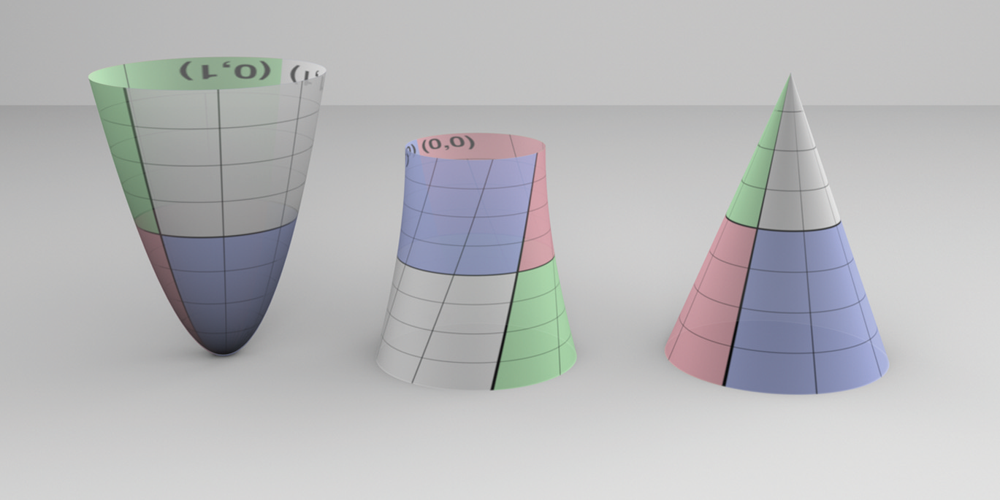

Figure 3.10: The Remaining Quadric Shapes. From left to right: the paraboloid, the hyperboloid, and the cone.

图 3.10：其他二次曲线形状。从左到右：抛物面、双曲面和圆锥。

### 3.5.1 Cones / 圆锥

The implicit equation of a cone centered on the $z$ axis with radius $r$ and height $h$ is

以 $z$ 轴为中心，半径为 $r$ ，高度为 $h$ 的圆锥的隐式方程为

$$
\left(\frac{h x}{r}\right)^{2}+\left(\frac{h y}{r}\right)^{2}-(z-h)^{2}=0
$$

Cones are also described parametrically:

圆锥也被参数化描述：

$$
\begin{array}{l}
\phi=u \phi_{\max } \\
x=r(1-v) \cos \phi \\
y=r(1-v) \sin \phi \\
z=v h
\end{array}
$$

The partial derivatives at a point on a cone are

圆锥上一点的偏导数为

$$
\begin{array}{l}
\frac{\partial \mathrm{p}}{\partial u}=\left(-\phi_{\max } y, \phi_{\max } x, 0\right) \\
\frac{\partial \mathrm{p}}{\partial v}=\left(-\frac{x}{1-v},-\frac{y}{1-v}, h\right),
\end{array}
$$

and the second partial derivatives are

二阶偏导数为

$$
\begin{aligned}
\frac{\partial^{2} \mathrm{p}}{\partial u^{2}} &=-\phi_{\max }^{2}(x, y, 0) \\
\frac{\partial^{2} \mathrm{p}}{\partial u \partial v} &=\frac{\phi_{\max }}{1-v}(y,-x, 0) \\
\frac{\partial^{2} \mathrm{p}}{\partial v^{2}} &=(0,0,0)
\end{aligned}
$$

### 3.5.2 Paraboloids / 抛物面

The implicit equation of a paraboloid centered on the $z$ axis with radius $r$ and height $h$ is

以 $z$ 轴为中心，半径为 $r$ ，高度为 $h$ 的抛物面的隐式方程为

$$
\frac{h x^{2}}{r^{2}}+\frac{h y^{2}}{r^{2}}-z=0
$$

and its parametric form is

其参数形式为

$$
\begin{array}{l}
\phi=u \phi_{\max } \\
z=v\left(z_{\max }-z_{\min }\right) \\
r=r_{\max } \sqrt{\frac{z}{z_{\max }}} \\
x=r \cos \phi \\
y=r \sin \phi .
\end{array}
$$

The partial derivatives are

偏导数是

$$
\begin{array}{l}
\frac{\partial p}{\partial u}=\left(-\phi_{\max } y, \phi_{\max } x, 0\right) \\
\frac{\partial p}{\partial v}=\left(z_{\max }-z_{\min }\right)\left(\frac{x}{2 z}, \frac{y}{2 z}, 1\right),
\end{array}
$$

and

和

$$
\begin{aligned}
\frac{\partial^{2} \mathrm{p}}{\partial u^{2}} &=-\phi_{\max }^{2}(x, y, 0) \\
\frac{\partial^{2} \mathrm{p}}{\partial u \partial v} &=\phi_{\max }\left(z_{\max }-z_{\min }\right)\left(-\frac{y}{2 z}, \frac{x}{2 z}, 0\right) \\
\frac{\partial^{2} \mathrm{p}}{\partial v^{2}} &=-\left(z_{\max }-z_{\min }\right)^{2}\left(\frac{x}{4 z^{2}}, \frac{y}{4 z^{2}}, 0\right) .
\end{aligned}
$$

### 3.5.3 Hyperboloids / 双曲面

Finally, the implicit form of the hyperboloid is

最后，双曲面的隐式形式是

$$
x^{2}+y^{2}-z^{2}=-1 \text { , }
$$

and the parametric form is

参数形式是

$$
\begin{aligned}
\phi &=u \phi_{\max } \\
x_{r} &=(1-v) x_{1}+v x_{2} \\
y_{r} &=(1-v) y_{1}+v y_{2} \\
x &=x_{r} \cos \phi-y_{r} \sin \phi \\
y &=x_{r} \sin \phi+y_{r} \cos \phi \\
z &=(1-v) z_{1}+v z_{2}
\end{aligned}
$$

The partial derivatives are

偏导数是

$$
\begin{aligned}
\frac{\partial \mathrm{p}}{\partial u} &=\left(-\phi_{\max } y, \phi_{\max } x, 0\right) \\
\frac{\partial \mathrm{p}}{\partial v} &=\left(\left(x_{2}-x_{1}\right) \cos \phi-\left(y_{2}-y_{1}\right) \sin \phi,\left(x_{2}-x_{1}\right) \sin \phi+\left(y_{2}-y_{1}\right) \cos \phi, z_{2}-z_{1}\right)
\end{aligned}
$$

and

和

$$
\begin{aligned}
\frac{\partial^{2} \mathrm{p}}{\partial u^{2}} &=-\phi_{\max }^{2}(x, y, 0) \\
\frac{\partial^{2} \mathrm{p}}{\partial u \partial v} &=\phi_{\max }\left(-\frac{\partial \mathrm{p}_{y}}{\partial v}, \frac{\partial \mathrm{p}_{x}}{\partial v}, 0\right) \\
\frac{\partial^{2} \mathrm{p}}{\partial v^{2}} &=(0,0,0)
\end{aligned}
$$

## 3.6 Triangle Meshes / 三角形网格

The triangle is one of the most commonly used shapes in computer graphics; complex scenes may be modeled using millions of triangles to achieve great detail. (Figure 3.11 shows an image of a complex triangle mesh of over four million triangles.)

三角形是计算机图形学中最常用的形状之一；可以使用数百万个三角形对复杂场景进行建模以实现出色的细节。 （图 3.11 显示了超过四百万个三角形的复杂三角形网格的图像。）

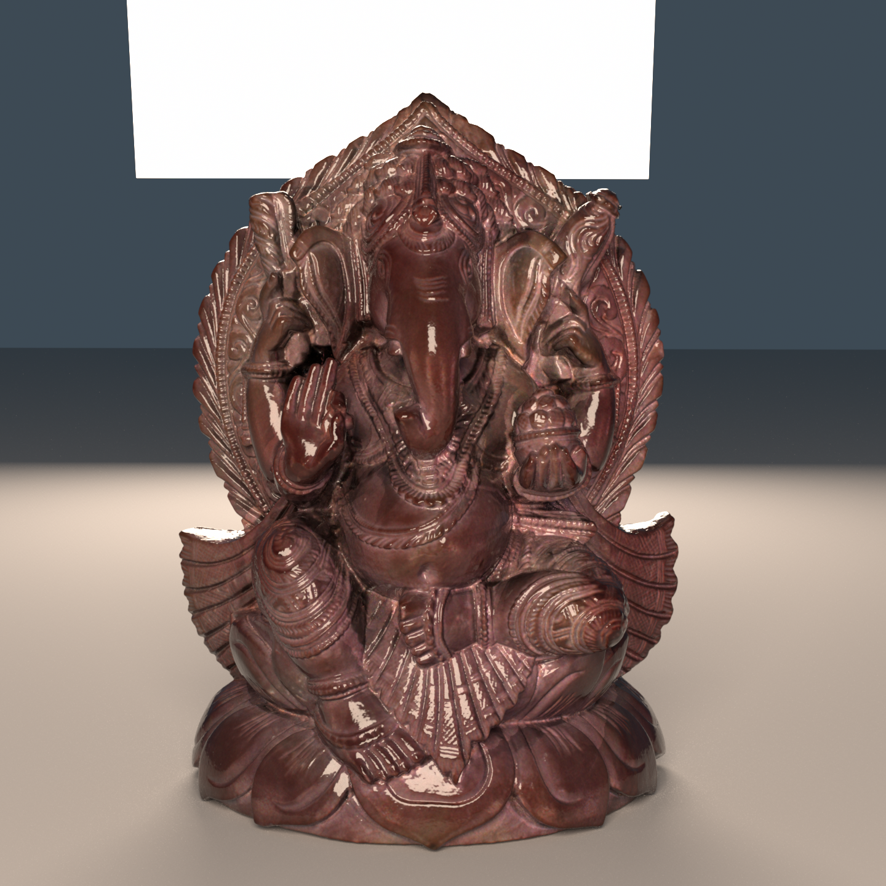

Figure 3.11: Ganesha Model. This triangle mesh contains over four million individual triangles. It was created from a real statue using a 3D scanner that uses structured light to determine shapes of objects. While a natural representation would be to have a Triangle shape implementation where each triangle stored the positions of its three vertices, a more memory-efficient representation is to separately store entire triangle meshes with an array of vertex positions where each individual triangle just stores three offsets into this array for its three vertices.

To see why this is the case, consider the celebrated Euler-Poincaré formula, which relates the number of vertices $V$, edges $E$, and faces $F$ on closed discrete meshes as

图 3.11：象头神模型。这个三角形网格包含超过四百万个单独的三角形。它是使用 3D 扫描仪从真实雕像中创建的，该扫描仪使用结构光来确定物体的形状。虽然每个三角形存储其3个顶点的位置，是表示三角形形状的一种自然实现，但更节省内存的表示是单独存储具有顶点位置数组的整个三角形网格，其中每个单独的三角形只存储顶点数组的偏移量。

要了解为什么会这样，请考虑著名的欧拉-庞加莱公式，该公式将封闭离散网格上的顶点 $V$ 、边 $E$ 和面 $F$ 的数量关联为

$$
V-E+F=2(1-g)
$$

where $g \in \mathbf{N}$ is the genus of the mesh. The genus is usually a small number and can be interpreted as the number of “handles” in the mesh (analogous to a handle of a teacup). On a triangle mesh, the number of edges and vertices is furthermore related by the identity

其中 $g \in \mathbf{N}$ 是网格的genus。genus通常是一个很小的数字，可以解释为网格中“handles”的数量（类似于茶杯的手柄）。在三角形网格上，边和顶点的数量还与恒等式有关

$$
E=\frac{3}{2} F
$$

This can be seen by dividing each edge into two parts associated with the two adjacent triangles. There are $3F$ such half-edges, and all co-located pairs constitute the $E$ mesh edges. For large closed triangle meshes, the overall effect of the genus usually becomes negligible and we can combine the previous two equations (with $g = 0$) to obtain

可以通过将每条边分成与两个相邻三角形相关联的两个部分来看到。存在 $3F$ 这样的半边，所有位于同一位置的对构成 $E$ 网格边。对于大的封闭三角形网格，genus的整体影响通常可以忽略不计，我们可以结合前两个方程（ $g = 0$ ）得到

$$
F \approx 2 V
$$

In other words, there are approximately twice as many faces as vertices. Since each face references three vertices, every vertex is (on average) referenced a total of six times. Thus, when vertices are shared, the total amortized storage required per triangle will be 12 bytes of memory for the offsets (at 4 bytes for three 32-bit integer offsets) plus half of the storage for one vertex—6 bytes, assuming three 4-byte floats are used to store the vertex position—for a total of 18 bytes per triangle. This is much better than the 36 bytes per triangle that storing the three positions directly would require. The relative storage savings are even better when there are per-vertex surface normals or texture coordinates in a mesh.

pbrt uses the TriangleMesh structure to store the shared information about a triangle mesh.

换句话说，面的数量大约是顶点的两倍。由于每个面都引用了3个顶点，因此每个顶点（平均而言）总共被引用了六次。因此，当共享顶点时，每个三角形所需的总摊销存储空间将为偏移量的 12 字节内存（3个 32 位整数偏移量为 4 字节），加上一个顶点的一半存储量 - 6字节，假设3个 4字节 浮点数用于存储顶点位置——每个三角形总共 18 个字节。这比直接存储3个位置所需的每个三角形 36 个字节要好得多。当网格中有每个顶点的表面法线或纹理坐标时，相对存储节省甚至更好。

pbrt 使用 TriangleMesh 结构来存储有关三角形网格的共享信息。

```
<<Triangle Declarations>>= 
struct TriangleMesh {
    <<TriangleMesh Public Methods>> 
    <<TriangleMesh Data>> 
};
```

The arguments to the TriangleMesh constructor are as follows:

* ObjectToWorld: The object-to-world transformation for the mesh.
  
* nTriangles: The total number of triangles in the mesh.

* vertexIndices: A pointer to an array of vertex indices. For the ith triangle, its three vertex positions are P[vertexIndices[3*i]], P[vertexIndices[3*i+1]], and P[vertexIndices[3*i+2]].

* nVertices: The total number of vertices in the mesh.

* P: An array of nVertices vertex positions.

* S: An optional array of tangent vectors, one per vertex in the mesh. These are used to compute shading tangents.

* N: An optional array of normal vectors, one per vertex in the mesh. If present, these are interpolated across triangle faces to compute shading normals.

* UV: An optional array of parametric $(u, v)$ values, one for each vertex.

* alphaMask: An optional alpha mask texture, which can be used to cut away parts of triangle surfaces.

TriangleMesh 构造函数的参数如下：

* ObjectToWorld：网格对象到世界的变换。
  
* nTriangles：网格中的三角形总数。

* vertexIndices：指向顶点索引数组的指针。对于第 i 个三角形，它的3个顶点位置是 P[vertexIndices[3*i]]、P[vertexIndices[3*i+1]] 和 P[vertexIndices[3*i+2]]。

* nVertices：网格中的顶点总数。

* P：nVertices 顶点位置数组。

* S：一个可选的切向量数组，网格中的每个顶点一个。这些用于计算着色切线。

* N：一个可选的法向量数组，网格中的每个顶点一个。如果存在，则将它们插入三角形面以计算着色法线。

* UV：参数 $(u, v)$ 值的可选数组，每个顶点一个。

* alphaMask：一个可选的 alpha 遮罩纹理，可用于切掉三角形表面的部分。

Triangles have a dual role among the shapes in pbrt: not only are they frequently directly specified in scene description files, but other shapes often tessellate themselves into triangle meshes. For example, subdivision surfaces end up creating a mesh of triangles to approximate the smooth limit surface. Ray intersections are performed against these triangles, rather than directly against the subdivision surface (Section 3.8.2).

Due to this second role, it’s important that code that creates triangle meshes be able to specify the parameterization of the triangles. If a triangle was created by evaluating the position of a parametric surface at three particular $(u, v)$ coordinate values, for example, those $(u, v)$ values should be interpolated to compute the $(u, v)$ value at ray intersection points inside the triangle. Explicitly specified $(u, v)$ values are also useful for texture mapping, where an external program that created a triangle mesh may want to assign $(u, v)$ coordinates to the mesh so that a texture map assigns color to the mesh surface in the desired way.

The TriangleMesh constructor copies the relevant information and stores it in member variables. In particular, it makes its own copies of vertexIndices, P, N, S, and UV, allowing the caller to retain ownership of the data being passed in.

三角形在 pbrt 中的形状中具有双重作用：它们不仅经常在场景描述文件中直接指定，而且其他形状也经常将自己细分为三角形网格。例如，细分曲面最终会创建一个三角形网格来近似平滑的极限曲面。光线相交是针对这些三角形执行的，而不是直接针对细分曲面（第 3.8.2 节）。

由于第2个角色，创建三角形网格的代码能够指定三角形的参数化非常重要。例如，如果通过计算参数曲面在3个特定 $(u, v)$ 坐标值处的位置来创建三角形，则应插入这些 $(u, v)$ 值以计算 $(u, v) $ 三角形内光线交点处的值。显式指定的 $(u, v)$ 值对于纹理贴图也很有用，在这种情况下，创建三角形网格的外部程序可能希望将 $(u, v)$ 坐标分配给网格，以便纹理贴图以所需的方式将颜色指定给网格表面。

TriangleMesh 构造函数复制相关信息并存储在成员变量中。特别是，它制作自己的 vertexIndices、P、N、S 和 UV 副本，允许调用者保留传入数据的所有权。

```
<<Triangle Method Definitions>>= 
TriangleMesh::TriangleMesh(const Transform &ObjectToWorld,
        int nTriangles, const int *vertexIndices, int nVertices,
        const Point3f *P, const Vector3f *S, const Normal3f *N,
        const Point2f *UV,
        const std::shared_ptr<Texture<Float>> &alphaMask)
    : nTriangles(nTriangles), nVertices(nVertices), 
      vertexIndices(vertexIndices, vertexIndices + 3 * nTriangles),
      alphaMask(alphaMask) {
    <<Transform mesh vertices to world space>> 
    <<Copy UV, N, and S vertex data, if present>> 
}

<<TriangleMesh Data>>= 
const int nTriangles, nVertices;
std::vector<int> vertexIndices;
std::unique_ptr<Point3f[]> p;
std::unique_ptr<Normal3f[]> n;
std::unique_ptr<Vector3f[]> s;
std::unique_ptr<Point2f[]> uv;
std::shared_ptr<Texture<Float>> alphaMask;
```

Unlike the other shapes that leave the shape description in object space and then transform incoming rays from world space to object space, triangle meshes transform the shape into world space and thus save the work of transforming incoming rays into object space and the work of transforming the intersection’s geometric representation out to world space. This is a good idea because this operation can be performed once at start-up, avoiding transforming rays many times during rendering. Using this approach with quadrics is more complicated, although possible—see Exercise 3.9.7 at the end of the chapter for more information.

与将形状描述留在对象空间，然后将入射光线从世界空间变换到对象空间的其他形状不同，三角形网格将形状变换到世界空间，从而省去了将入射光线变换到对象空间，以及将入射光线变换到对象空间的工作。交点的几何表示到世界空间。这是一个好主意，因为这个操作可以在启动时执行一次，避免在渲染过程中多次变换光线。尽管可能，但将这种方法与二次曲面结合使用会更加复杂——有关更多信息，请参见本章末尾的练习 3.9.7。

```
<<Transform mesh vertices to world space>>= 
p.reset(new Point3f[nVertices]);
for (int i = 0; i < nVertices; ++i)
    p[i] = ObjectToWorld(P[i]);
```

The fragment <<*Copy uv, N, and S vertex data, if present*>> just allocates the appropriate amount of space and copies the appropriate values. Normals and tangent vectors, if present, are also transformed to world space. This fragment’s implementation isn’t included here.

片段 <<*Copy uv, N, and S vertex data, if present*>> 只分配适当的空间量并复制适当的值。法线和切线向量（如果存在）也会变换到世界空间。此处不包含此片段的实现。

### 3.6.1 Triangle / 三角形

The Triangle class actually implements the Shape interface. It represents a single triangle.

Triangle 类实际上实现了 Shape 接口。它代表一个三角形。

```
<<Triangle Declarations>>+= 
class Triangle : public Shape {
public:
    <<Triangle Public Methods>> 
private:
    <<Triangle Private Methods>> 
    <<Triangle Private Data>> 
};
```

Triangle doesn’t store much data—just a pointer to the parent TriangleMesh that it came from and a pointer to its three vertex indices in the mesh.

Triangle 不存储太多数据——只是一个指向它来自的父 TriangleMesh 的指针和一个指向它在网格中的3个顶点索引的指针。

```
<<Triangle Public Methods>>= 
Triangle(const Transform *ObjectToWorld, const Transform *WorldToObject,
         bool reverseOrientation,
         const std::shared_ptr<TriangleMesh> &mesh, int triNumber)
    : Shape(ObjectToWorld, WorldToObject, reverseOrientation),
      mesh(mesh) {
    v = &mesh->vertexIndices[3 * triNumber];
}
```

Note that the implementation stores a pointer to the first vertex index, instead of storing three pointers to the vertices themselves. This reduces the amount of storage required for each Triangle at a cost of another level of indirection.

请注意，该实现存储了指向第一个顶点索引的指针，而不是存储指向顶点本身的3个指针。这以另一个间接级别为代价减少了每个三角形所需的存储量。

```
<<Triangle Private Data>>= 
std::shared_ptr<TriangleMesh> mesh;
const int *v;
```

Because a number of other shape representations in pbrt convert themselves into triangle meshes, the utility function CreateTriangleMesh() takes care of creating an underlying TriangleMesh as well as a Triangle for each triangle in the mesh. It returns a vector of triangle shapes.

由于 pbrt 中的许多其他形状表示将自身转换为三角形网格，因此工具函数 CreateTriangleMesh() 负责为网格中的每个三角形创建底层 TriangleMesh 和 Triangle。它返回一个三角形形状的向量。

```
<<Triangle Method Definitions>>+=  
std::vector<std::shared_ptr<Shape>> CreateTriangleMesh(
        const Transform *ObjectToWorld, const Transform *WorldToObject,
        bool reverseOrientation, int nTriangles,
        const int *vertexIndices, int nVertices, const Point3f *p,
        const Vector3f *s, const Normal3f *n, const Point2f *uv,
        const std::shared_ptr<Texture<Float>> &alphaMask) {
    std::shared_ptr<TriangleMesh> mesh = std::make_shared<TriangleMesh>(
        *ObjectToWorld, nTriangles, vertexIndices, nVertices, p, s, n, uv,
        alphaMask);
    std::vector<std::shared_ptr<Shape>> tris;
    for (int i = 0; i < nTriangles; ++i)
        tris.push_back(std::make_shared<Triangle>(ObjectToWorld,
            WorldToObject, reverseOrientation, mesh, i));
    return tris;
}
```

The object space bound of a triangle is easily found by computing a bounding box that encompasses its three vertices. Because the vertex positions p are transformed to world space in the constructor, the implementation here has to transform them back to object space before computing their bound.

通过计算包含其3个顶点的包围盒，可以轻松找到三角形的对象空间边界。因为顶点位置 p 在构造函数中被变换到世界空间，这里的实现必须在计算它们的边界之前将它们变换回对象空间。

```
<<Triangle Method Definitions>>+=  
Bounds3f Triangle::ObjectBound() const {
    <<Get triangle vertices in p0, p1, and p2>> 
    return Union(Bounds3f((*WorldToObject)(p0), (*WorldToObject)(p1)),
                 (*WorldToObject)(p2));
}

<<Get triangle vertices in p0, p1, and p2>>= 
const Point3f &p0 = mesh->p[v[0]];
const Point3f &p1 = mesh->p[v[1]];
const Point3f &p2 = mesh->p[v[2]];
```

The Triangle shape is one of the shapes that can compute a better world space bound than can be found by transforming its object space bounding box to world space. Its world space bound can be directly computed from the world space vertices.

三角形是一种可以计算更好的世界空间边界的形状，而不是通过将其对象空间包围盒变换为世界空间来找到的。它的世界空间边界可以直接从世界空间顶点计算。

```
<<Triangle Method Definitions>>+=  
Bounds3f Triangle::WorldBound() const {
    <<Get triangle vertices in p0, p1, and p2>> 
    return Union(Bounds3f(p0, p1), p2); 
}
```

### 3.6.2 Triangle Intersection / 三角形相交

The structure of the triangle shape’s Intersect() method follows the form of earlier intersection test methods: a geometric test is applied to determine if there is an intersection and, if so, further information is computed about the intersection to return in the given SurfaceInteraction.

三角形的 Intersect() 方法的结构遵循早期相交测试方法的形式：应用几何测试来确定是否存在相交，如果有，则计算有关相交的更多信息以在给定的 SurfaceInteraction 中返回。

```
<<Triangle Method Definitions>>+=  
bool Triangle::Intersect(const Ray &ray, Float *tHit,
        SurfaceInteraction *isect, bool testAlphaTexture) const {
    <<Get triangle vertices in p0, p1, and p2>> 
    <<Perform ray–triangle intersection test>> 
    <<Compute triangle partial derivatives>> 
    <<Compute error bounds for triangle intersection>> 
    <<Interpolate  parametric coordinates and hit point>> 
    <<Test intersection against alpha texture, if present>> 
    <<Fill in SurfaceInteraction from triangle hit>> 
    *tHit = t;
    return true;
}
```

pbrt’s ray–triangle intersection test is based on first computing an affine transformation that transforms the ray such that its origin is at $(0, 0, 0)$ in the transformed coordinate system and such that its direction is along the $+z$ axis. Triangle vertices are also transformed into this coordinate system before the intersection test is performed. In the following, we’ll see that applying this coordinate system transformation simplifies the intersection test logic since, for example, the $x$ and $y$ coordinates of any intersection point must be zero. Later, in Section 3.9.3, we’ll see that this transformation makes it possible to have a watertight ray–triangle intersection algorithm, such that intersections with tricky rays like those that hit the triangle right on the edge are never incorrectly reported as misses.

pbrt 的光线-三角形相交测试基于首先计算仿射变换，该变换将光线变换为使其原点位于变换坐标系中的 $(0, 0, 0)$ ， 并且其方向沿 $+z$ 轴。在执行相交测试之前，三角形顶点也被变换到这个坐标系中。在下文中，我们将看到应用此坐标系变换简化了相交测试逻辑，例如，任何交点的 $x$ 和 $y$ 坐标都必须为零。稍后，在第 3.9.3 节中，我们将看到这种变换使具有密封性的光线-三角形相交算法成为可能，这样与棘手光线的相交（例如在边上击中三角形的那些光线）永远不会被错误地报告为未命中.

```
<<Perform ray–triangle intersection test>>= 
<<Transform triangle vertices to ray coordinate space>> 
<<Compute edge function coefficients e0, e1, and e2>> 
<<Fall back to double-precision test at triangle edges>> 
<<Perform triangle edge and determinant tests>> 
<<Compute scaled hit distance to triangle and test against ray  range>> 
<<Compute barycentric coordinates and  value for triangle intersection>> 
<<Ensure that computed triangle  is conservatively greater than zero>> 
```

There are three steps to computing the transformation from world space to the ray–triangle intersection coordinate space: a translation $T$, a coordinate permutation $P$, and a shear $S$. Rather than computing explicit transformation matrices for each of these and then computing an aggregate transformation matrix $M = SPT$ to transform vertices to the coordinate space, the following implementation applies each step of the transformation directly, which ends up being a more efficient approach.

计算从世界空间到光线-三角形相交坐标空间的变换需要3个步骤：平移 $T$ 、坐标置换 $P$ 和剪切 $S$ 。下面的实现不是为其中的每一个计算显式变换矩阵，然后计算聚合变换矩阵 $M = SPT$ ，以将顶点变换到坐标空间，而是直接应用变换的每个步骤，最终成为一种更有效的方法。

```
<<Transform triangle vertices to ray coordinate space>>= 
<<Translate vertices based on ray origin>> 
<<Permute components of triangle vertices and ray direction>> 
<<Apply shear transformation to translated vertex positions>> 
```

The translation that places the ray origin at the origin of the coordinate system is:

将光线原点置于坐标系原点的平移是：

$$
\mathbf{T}=\left(\begin{array}{cccc}
1 & 0 & 0 & -\mathrm{o}_{x} \\
0 & 1 & 0 & -\mathrm{o}_{y} \\
0 & 0 & 1 & -\mathrm{o}_{z} \\
0 & 0 & 0 & 1
\end{array}\right)
$$

This transformation doesn’t need to be explicitly applied to the ray origin, but we will apply it to the three triangle vertices.

这个变换不需要显式地应用于光线原点，但我们将它应用于3个三角形顶点。

```
<<Translate vertices based on ray origin>>= 
Point3f p0t = p0 - Vector3f(ray.o);
Point3f p1t = p1 - Vector3f(ray.o);
Point3f p2t = p2 - Vector3f(ray.o);
```

Next, the three dimensions of the space are permuted so that the $z$ dimension is the one where the absolute value of the ray’s direction is largest. The $x$ and $y$ dimensions are arbitrarily assigned to the other two dimensions. This step ensures that if, for example, the original ray’s $z$ direction is zero, then a dimension with non-zero magnitude is mapped to $+z$.

For example, if the ray’s direction had the largest magnitude in $x$, the permutation would be:

接下来，对空间的3个维度进行置换，使得 $z$ 维度是光线方向绝对值最大的维度。 $x$ 和 $y$ 维度被任意分配给其他两个维度。这一步确保，例如，如果原始光线的 $z$ 方向为零，则将具有非零幅度的维度映射到 $+z$ 。

例如，如果光线的方向在 $x$ 中具有最大的量级，则排列将为：

$$
\mathbf{P}=\left(\begin{array}{llll}
0 & 1 & 0 & 0 \\
0 & 0 & 1 & 0 \\
1 & 0 & 0 & 0 \\
0 & 0 & 0 & 1
\end{array}\right)
$$

As before, it’s easiest to just permute the dimensions of the ray direction and the translated triangle vertices directly.

和以前一样，最简单的方法是直接置换光线方向和平移三角形顶点的尺寸。

```
<<Permute components of triangle vertices and ray direction>>= 
int kz = MaxDimension(Abs(ray.d));
int kx = kz + 1; if (kx == 3) kx = 0;
int ky = kx + 1; if (ky == 3) ky = 0;
Vector3f d = Permute(ray.d, kx, ky, kz);
p0t = Permute(p0t, kx, ky, kz);
p1t = Permute(p1t, kx, ky, kz);
p2t = Permute(p2t, kx, ky, kz);
```

Finally, a shear transformation aligns the ray direction with the $+z$ axis:

最后，剪切变换将光线方向与 $+z$ 轴对齐：

$$
\mathbf{S}=\left(\begin{array}{cccc}
1 & 0 & -\mathbf{d}_{x} / \mathbf{d}_{z} & 0 \\
0 & 1 & -\mathbf{d}_{y} / \mathbf{d}_{z} & 0 \\
0 & 0 & 1 / \mathbf{d}_{z} & 0 \\
0 & 0 & 0 & 1
\end{array}\right)
$$

To see how this transformation works, consider its operation on the ray direction vector $\left[\mathbf{d}_{x} \mathbf{d}_{y} \mathbf{d}_{z} 0\right]^{T}$.

For now, only the $x$ and $y$ dimensions are sheared; we can wait and shear the $z$ dimension only if the ray actually intersects the triangle.

要了解这种变换是如何工作的，请考虑它对光线方向向量 $\left[\mathbf{d}_{x} \mathbf{d}_{y} \mathbf{d}_{z} 0\right] 的操作^{T}$ 。

目前，只有 $x$ 和 $y$ 维度被剪切；只有当光线实际上与三角形相交时，我们才能等待并剪切 $z$ 维度。

```
<<Apply shear transformation to translated vertex positions>>= 
Float Sx = -d.x / d.z;
Float Sy = -d.y / d.z;
Float Sz = 1.f / d.z;
p0t.x += Sx * p0t.z;
p0t.y += Sy * p0t.z;
p1t.x += Sx * p1t.z;
p1t.y += Sy * p1t.z;
p2t.x += Sx * p2t.z;
p2t.y += Sy * p2t.z;
```

Note that the calculations for the coordinate permutation and the shear coefficients only depend on the given ray; they are independent of the triangle. In a high-performance ray tracer, we might want to compute these values once and store them in the Ray class, rather than recomputing them for each triangle the ray is intersected with.

With the triangle vertices transformed to this coordinate system, our task now is to find if the ray starting from the origin and traveling along the $+z$ axis intersects the transformed triangle. Because of the way the coordinate system was constructed, this problem is equivalent to the 2D problem of determining if the $x$, $y$ coordinates $(0, 0)$ are inside the $xy$ projection of the triangle (Figure 3.12).

请注意，坐标排列和剪切系数的计算仅取决于给定的光线；它们独立于三角形。在高性能光线追踪器中，我们可能希望计算一次这些值并将它们存储在 Ray 类中，而不是为与光线相交的每个三角形重新计算它们。

将三角形顶点变换为该坐标系后，我们现在的任务是找出从原点开始，并沿 $+z$ 轴行进的光线是否与变换后的三角形相交。由于坐标系的构建方式，这个问题等价于确定 $x$ 、 $y$ 坐标 $(0, 0)$ 是否在三角形的 $xy$ 投影内的二维问题（图 3.12 ）。


Figure 3.12: In the ray–triangle intersection coordinate system, the ray starts at the origin and goes along the $+z$ axis. The intersection test can be performed by considering only the $xy$ projection of the ray and the triangle vertices, which in turn reduces to determining if the 2D point $(0, 0)$ is within the triangle.

图 3.12：在光线-三角形相交坐标系中，光线从原点开始并沿着 $+z$ 轴。可以通过仅考虑光线和三角形顶点的 $xy$ 投影来执行相交测试，这反过来又可以简化为确定 2D 点 $(0, 0)$ 是否在三角形内。

To understand how the intersection algorithm works, first recall from Figure 2.5 that the length of the cross product of two vectors gives the area of the parallelogram that they define. In 2D, with vectors $a$ and $b$, the area is

要理解相交算法的工作原理，首先回忆一下图 2.5，两个向量的叉积的长度给出了它们定义的平行四边形的面积。在 2D 中，使用向量 $a$ 和 $b$ ，面积为

$$
\mathbf{a}_{x} \mathbf{b}_{y}-\mathbf{b}_{x} \mathbf{a}_{y}
$$

Half of this area is the area of the triangle that they define. Thus, we can see that in 2D, the area of a triangle with vertices $p_0$, $p_1$, and $p_2$ is

这个面积的一半是他们定义的三角形的面积。因此，我们可以看到，在 2D 中，顶点为 $p_0$ 、 $p_1$ 和 $p_2$ 的三角形的面积为

$$
\frac{1}{2}\left(\left(\mathrm{p}_{1 x}-\mathrm{p}_{0 x}\right)\left(\mathrm{p}_{2 y}-\mathrm{p}_{0 y}\right)-\left(\mathrm{p}_{2 x}-\mathrm{p}_{0_{x}}\right)\left(\mathrm{p}_{1 y}-\mathrm{p}_{0 y}\right)\right)
$$

Figure 3.13 visualizes this geometrically.

图 3.13 以几何方式将其可视化。


Figure 3.13: The area of a triangle with two edges given by vectors $v_{1}$ and $v_{2}$ is one-half of the area of the parallelogram shown here. The parallelogram area is given by the length of the cross product of $\mathbf{v}_{1}$ and $\mathbf{v}_{2}$

图 3.13：由向量 $v_{1}$ 和 $v_{2}$ 给出的具有两条边的三角形的面积，是此处所示平行四边形面积的二分之一。平行四边形面积由 $\mathbf{v}_{1}$ 和 $\mathbf{v}_{2}$ 的叉积的长度给出

We'll use this expression of triangle area to define a signed edge function: given two triangle vertices $\mathrm{p}_{0}$ and $\mathrm{p}_{1}$, then we can define the directed edge function $e$ as the function that gives twice the area of the triangle given by $\mathrm{p}_{0}, \mathrm{p}_{1}$, and a given third point $\mathrm{p}$ :

我们将使用三角形面积的这个表达式来定义一个有符号边函数：给定两个三角形顶点 $\mathrm{p}_{0}$ 和 $\mathrm{p}_{1}$ ，那么我们可以定义有向边函数 $e$ 作为给出由 $\mathrm{p}_{0}、\mathrm{p}_{1}$ 和给定的第3个点 $\mathrm{p}$ 给出的三角形面积的两倍的函数 :

$$
e(\mathrm{p})=\left(\mathrm{p}_{1 x}-\mathrm{p}_{0 x}\right)\left(\mathrm{p}_{y}-\mathrm{p}_{0 y}\right)-\left(\mathrm{p}_{x}-\mathrm{p}_{0_{x}}\right)\left(\mathrm{p}_{1 y}-\mathrm{p}_{0 y}\right)
$$

(3.1)

(See Figure 3.14.)

（见图 3.14。）


Figure 3.14: The edge function $e(\mathrm{p})$ characterizes points with respect to an oriented line between two points $\mathrm{p}_{0}$ and $\mathrm{p}_{1}$. The value of the edge function is positive for points $\mathrm{p}$ to the right of the line, zero for points on the line, and negative for points to the left of the line. The ray-triangle intersection algorithm uses an edge function that is twice the signed area of the triangle formed by the three points.

图 3.14：边函数 $e(\mathrm{p})$ 根据两点 $\mathrm{p}_{0}$ 和 $\mathrm{p}_{1}$ 之间的定向线来表示点。边函数的值为直线右侧的点 $\mathrm{p}$ 为正，直线上的点为零，直线左侧的点为负。光线三角形相交算法使用的边函数是3个点形成的三角形的有符号面积的两倍。

The edge function gives a positive value for points to the left of the line, and negative value for points to the right. Thus, if a point has edge function values of the same sign for all three edges of a triangle, it must be on the same side of all three edges and thus must be inside the triangle.

Thanks to the coordinate system transformation, the point we're testing $\mathrm{p}$ is $(0,0)$. This simplifies the edge function expressions. For example, for the edge $e_{0}$ from $\mathrm{p}_{1}$ to $\mathrm{p}_{2}$, we have:

边函数为线左侧的点提供正值，为线右侧的点提供负值。因此，如果一个点对于三角形的所有3个边都具有相同符号的边函数值，则它必须在所有3个边的同一侧，因此必须在三角形内。

由于坐标系变换，我们测试 $\mathrm{p}$ 的点是 $(0,0)$ 。这简化了边函数表达式。例如，对于从 $\mathrm{p}_{1}$ 到 $\mathrm{p}_{2}$ 的边 $e_{0}$ ，我们有：

$$
\begin{aligned}
e_{0}(\mathrm{p}) &=\left(\mathrm{p}_{2 x}-\mathrm{p}_{1 x}\right)\left(\mathrm{p}_{y}-\mathrm{p}_{1 y}\right)-\left(\mathrm{p}_{x}-\mathrm{p}_{1 x}\right)\left(\mathrm{p}_{2 y}-\mathrm{p}_{1 y}\right) \\
&=\left(\mathrm{p}_{2 x}-\mathrm{p}_{1 x}\right)\left(-\mathrm{p}_{1 y}\right)-\left(-\mathrm{p}_{1_{x}}\right)\left(\mathrm{p}_{2 y}-\mathrm{p}_{1 y}\right) \\
&=\mathrm{p}_{1 x} \mathrm{p}_{2 y}-\mathrm{p}_{2 x} \mathrm{p}_{1 y}
\end{aligned}
$$

(3.2)

In the following, we’ll use the indexing scheme that the edge function $e_i$ corresponds to the directed edge from vertex $\mathrm{p}(i+1) \bmod 3$ and $\mathrm{P}(i+2) \bmod 3$.

在下文中，我们将使用边函数 $e_i$ 对应于来自顶点 $\mathrm{p}(i+1) \bmod 3$ 和 $\mathrm{P}(i+ 2) \bmod 3$ 。

```
<<Compute edge function coefficients e0, e1, and e2>>= 
Float e0 = p1t.x * p2t.y - p1t.y * p2t.x;
Float e1 = p2t.x * p0t.y - p2t.y * p0t.x;
Float e2 = p0t.x * p1t.y - p0t.y * p1t.x;
```

In the rare case that any of the edge function values is exactly zero, it’s not possible to be sure if the ray hits the triangle or not, and the edge equations are reevaluated using double-precision floating-point arithmetic. (Section 3.9.3 discusses the need for this step in more detail.) The fragment that implements this computation, <<*Fall back to double-precision test at triangle edges*>>, is just a reimplementation of <<*Compute edge function coefficients e0, e1, and e2*>> using doubles and so isn’t included here.

Given the values of the three edge functions, we have our first two opportunities to determine that there is no intersection. First, if the signs of the edge function values differ, then the point $(0, 0)$ is not on the same side of all three edges and therefore is outside the triangle. Second, if the sum of the three edge function values is zero, then the ray is approaching the triangle edge-on, and we report no intersection. (For a closed triangle mesh, the ray will hit a neighboring triangle instead.)

在任何边函数值恰好为零的罕见情况下，无法确定光线是否击中三角形，并且边方程使用双精度浮点算法重新计算。 （第 3.9.3 节更详细地讨论了此步骤的必要性。）实现此计算的片段 <<*Fall back to double-precision test at triangle edge*>>，<<*Compute edge function coefficients e0, e1, and e2*>> 只是使用双精度数的重新实现，因此不包括在此处。

给定3个边函数的值，我们有前两个机会来确定不存在交点。首先，如果边函数值的符号不同，则点 $(0, 0)$ 不在所有3个边的同一侧，因此在三角形之外。其次，如果3个边函数值的总和为零，那么光线正在接近三角形的边上，我们报告没有相交。 （对于闭合三角形网格，光线将改为击中相邻三角形。）

```
<<Perform triangle edge and determinant tests>>= 
if ((e0 < 0 || e1 < 0 || e2 < 0) && (e0 > 0 || e1 > 0 || e2 > 0))
    return false;
Float det = e0 + e1 + e2;
if (det == 0)
    return false;
```

Because the ray starts at the origin, has unit length, and is along the $+z$ axis, the $z$ coordinate value of the intersection point is equal to the intersection's parametric $t$ value. To compute this $z$ value, we first need to go ahead and apply the shear transformation to the $z$ coordinates of the triangle vertices. Given these $z$ values, the barycentric coordinates of the intersection point in the triangle can be used to interpolate them across the triangle. They are given by dividing each edge function value by the sum of edge function values:

因为光线从原点开始，具有单位长度，并且沿着 $+z$ 轴，所以交点的 $z$ 坐标值等于交点的参数 $t$ 值。要计算这个 $z$ 值，我们首先需要继续将剪切变换应用于三角形顶点的 $z$ 坐标。给定这些 $z$ 值，三角形中交点的重心坐标可用于将它们插入整个三角形。它们是通过将每个边函数值除以边函数值的总和来给出的：

$$
b_{i}=\frac{e_{i}}{e_{0}+e_{1}+e_{2}}
$$

Thus, the $b_i$ sum to one.

The interpolated $z$ value is given by

因此， $b_i$ 总和为 1。

插入的 $z$ 值由下式给出

$$
z=b_{0} z_{0}+b_{1} z_{1}+b_{2} z_{2}
$$

where $z_i$ are the coordinates of the three vertices in the ray–triangle intersection coordinate system.

In order to save the cost of the floating-point division to compute $b_{i}$ in cases where the final $t$ value is out of the range of valid $t$ values, the implementation here first computes $t$ by interpolating $z_{i}$ with $e_{i}$ (in other words, not yet performing the division by $d=e_{0}+e_{1}+e_{2}$ ). If the sign of $d$ and the sign of the interpolated $t$ value are different, then the final $t$ value will certainly be negative and thus not a valid intersection.

Along similar lines, the check $t < t_{max}$ can be equivalent performed in two ways:

其中 $z_i$ 是光线-三角形相交坐标系中3个顶点的坐标。

为了在最终 $t$ 值超出有效 $t$ 值范围的情况下节省浮点除法计算 $b_{i}$ 的成本，这里的实现首先通过以下方式计算 $t$ 用 $e_{i}$ 插入 $z_{i}$ （换句话说，还没有执行除以 $d=e_{0}+e_{1}+e_{2}$ ）。如果 $d$ 的符号和插入的 $t$ 值的符号不同，那么最终的 $t$ 值肯定是负数，因此不是有效的交点。

类似地，检查 $t < t_{max}$ 可以通过两种方式等效执行：

$$
\begin{array}{l}
\sum_{i} e_{i} z_{i}<t_{\max }\left(e_{0}+e_{1}+e_{2}\right) \quad \text { If } e_{0}+e_{1}+e_{2}>0 \\
\sum_{i} e_{i} z_{i}>t_{\max }\left(e_{0}+e_{1}+e_{2}\right) \quad \text { otherwise. }
\end{array}
$$

```
<<Compute scaled hit distance to triangle and test against ray  range>>= 
p0t.z *= Sz;
p1t.z *= Sz;
p2t.z *= Sz;
Float tScaled = e0 * p0t.z + e1 * p1t.z + e2 * p2t.z;
if (det < 0 && (tScaled >= 0 || tScaled < ray.tMax * det))
    return false;
else if (det > 0 && (tScaled <= 0 || tScaled > ray.tMax * det))
    return false;
```

We now know that there is a valid intersection and will go ahead and pay the cost of the floating-point division to compute actual barycentric coordinates as well as the actual $t$ value for the intersection.

我们现在知道有一个有效的交点，将继续支付浮点除法的成本来计算实际的重心坐标以及交点的实际值 $t$ 。

```
<<Compute barycentric coordinates and  value for triangle intersection>>= 
Float invDet = 1 / det;
Float b0 = e0 * invDet;
Float b1 = e1 * invDet;
Float b2 = e2 * invDet;
Float t = tScaled * invDet;
```

In order to generate consistent tangent vectors over triangle meshes, it is necessary to compute the partial derivatives $\partial \mathrm{p} / \partial u$ and $\partial \mathrm{p} / \partial v$ using the parametric $(u, v)$ values at the triangle vertices, if provided. Although the partial derivatives are the same at all points on the triangle, the implementation here recomputes them each time an intersection is found. Although this results in redundant computation, the storage savings for large triangle meshes can be significant.

A triangle can be described by the set of points

为了在三角形网格上生成一致的切向量，需要使用三角形顶点处的值 $(u, v)$ （如果提供）作为参数计算偏导数 $\partial \mathrm{p} / \partial u$ 和 $\partial \mathrm{p} / \partial v$ 。尽管三角形上所有点的偏导数都相同，但每次找到交点时，这里的实现都会重新计算它们。尽管这会导致冗余计算，但大型三角形网格的存储节省可能是显著的。

一个三角形可以用一组点来描述

$$
\mathrm{p}_{\mathrm{o}}+u \frac{\partial \mathrm{p}}{\partial u}+v \frac{\partial \mathrm{p}}{\partial v}
$$

for some $\mathrm{p}_{0}$, where $u$ and $v$ range over the parametric coordinates of the triangle. We also know the three vertex positions $\mathrm{p}_{\mathrm{i}}, i=0,1,2$, and the texture coordinates $\left(u_{i}, v_{i}\right)$ at each vertex. From this it follows that the partial derivatives of $\mathrm{p}$ must satisfy

对于某些 $\mathrm{p}_{0}$ ，其中 $u$ 和 $v$ 的范围是三角形的参数坐标。我们还知道3个顶点各自的位置 $\mathrm{p}_{\mathrm{i}}, i=0,1,2$ ，以及纹理坐标 $\left(u_{i}, v_{i}\right )$ 。由此得出 $\mathrm{p}$ 的偏导数必须满足

$$
\mathrm{p}_{\mathrm{i}}=\mathrm{p}_{\mathrm{o}}+u_{i} \frac{\partial \mathrm{p}}{\partial u}+v_{i} \frac{\partial \mathrm{p}}{\partial v}
$$

In other words, there is a unique affine mapping from the $2 \mathrm{D}(u, v)$ space to points on the triangle (such a mapping exists even though the triangle is specified in 3D space because the triangle is planar). To compute expressions for $\partial \mathrm{p} / \partial u$ and $\partial \mathrm{p} / \partial v$, we start by computing the differences $\mathrm{p}_{0}-\mathrm{p}_{2}$ and $\mathrm{p}_{1}-\mathrm{p}_{2}$, giving the matrix equation

换句话说，从 $2 \mathrm{D}(u, v)$ 空间到三角形上的点存在唯一的仿射映射（即使三角形是在 3D 空间中指定的，这种映射也存在，因为三角形是平面的）。为了计算 $\partial \mathrm{p} / \partial u$ 和 $\partial \mathrm{p} / \partial v$ 的表达式，我们首先计算差异 $\mathrm{p}_{0}-\mathrm{p}_{2}$ 和 $\mathrm{p}_{1}-\mathrm{p}_{2}$ ，给出矩阵方程

$$
\left(\begin{array}{ll}
u_{0}-u_{2} & v_{0}-v_{2} \\
u_{1}-u_{2} & v_{1}-v_{2}
\end{array}\right)\left(\begin{array}{l}
\partial \mathrm{p} / \partial u \\
\partial \mathrm{p} / \partial v
\end{array}\right)=\left(\begin{array}{l}
\mathrm{p}_{0}-\mathrm{p}_{2} \\
\mathrm{p}_{1}-\mathrm{p}_{2}
\end{array}\right)
$$

Thus,

因此，

$$
\left(\begin{array}{l}
\partial \mathrm{p} / \partial u \\
\partial \mathrm{p} / \partial v
\end{array}\right)=\left(\begin{array}{ll}
u_{0}-u_{2} & v_{0}-v_{2} \\
u_{1}-u_{2} & v_{1}-v_{2}
\end{array}\right)^{-1}\left(\begin{array}{l}
\mathrm{p}_{0}-\mathrm{p}_{2} \\
\mathrm{p}_{1}-\mathrm{p}_{2}
\end{array}\right)
$$

Inverting a $2 \times 2$ matrix is straightforward. The inverse of the $(u, v)$ differences matrix is

反转 $2 \times 2$ 矩阵很简单。 $(u, v)$ 微分矩阵的逆矩阵是

$$
\frac{1}{\left(u_{0}-u_{2}\right)\left(v_{1}-v_{2}\right)-\left(v_{0}-v_{2}\right)\left(u_{1}-u_{2}\right)}\left(\begin{array}{cc}
v_{1}-v_{2} & -\left(v_{0}-v_{2}\right) \\
-\left(u_{1}-u_{2}\right) & u_{0}-u_{2}
\end{array}\right)
$$

```
<<Compute triangle partial derivatives>>= 
Vector3f dpdu, dpdv;
Point2f uv[3];
GetUVs(uv);
<<Compute deltas for triangle partial derivatives>> 
Float determinant = duv02[0] * duv12[1] - duv02[1] * duv12[0];
if (determinant == 0) {
    <<Handle zero determinant for triangle partial derivative matrix>> 
} else {
    Float invdet = 1 / determinant;
    dpdu = ( duv12[1] * dp02 - duv02[1] * dp12) * invdet;
    dpdv = (-duv12[0] * dp02 + duv02[0] * dp12) * invdet;
}

<<Compute deltas for triangle partial derivatives>>= 
Vector2f duv02 = uv[0] - uv[2], duv12 = uv[1] - uv[2];
Vector3f dp02 = p0 - p2, dp12 = p1 - p2;
```

Finally, it is necessary to handle the case when the matrix is singular and therefore cannot be inverted. Note that this only happens when the user-supplied per-vertex parameterization values are degenerate. In this case, the Triangle just chooses an arbitrary coordinate system about the triangle’s surface normal, making sure that it is orthonormal:

最后，需要处理矩阵是奇异的，因此不能求逆的情况。请注意，这仅在用户提供的每个顶点参数化值退化时发生。在这种情况下，三角形只是选择一个关于三角形表面法线的任意坐标系，确保它是正交的：

```
<<Handle zero determinant for triangle partial derivative matrix>>= 
CoordinateSystem(Normalize(Cross(p2 - p0, p1 - p0)), &dpdu, &dpdv);
```

To compute the intersection point and the $(u, v)$ parametric coordinates at the hit point, the barycentric interpolation formula is applied to the vertex positions and the $(u, v)$ coordinates at the vertices. As we'll see in Section 3.9.4, this gives a more precise result for the intersection point than evaluating the parametric ray equation using $\mathrm{t}$.

为了计算交点和碰撞点处的 $(u, v)$ 参数坐标，重心插值公式应用于顶点位置和顶点处的 $(u, v)$ 坐标。正如我们将在 3.9.4 节中看到的那样，与使用 $\mathrm{t}$ 计算参数光线方程相比，这为交点提供了更精确的结果。

```
<<Interpolate $(u, v)$ parametric coordinates and hit point>>= 
Point3f pHit = b0 * p0 + b1 * p1 + b2 * p2;
Point2f uvHit = b0 * uv[0] + b1 * uv[1] + b2 * uv[2];
```

The utility routine GetUVs ( ) returns the $(u, v)$ coordinates for the three vertices of the triangle, either from the Iriangle, if it has them, or returning default values if explicit $(u, v)$ coordinates were not specified with the mesh.

工具代码 GetUVs ( ) 返回三角形3个顶点的 $(u, v)$ 坐标，或者来自 Iriangle（如果有的话），或者如果明确的 $(u, v)$ 坐标没有返回默认值用网格指定。

```
<<Triangle Private Methods>>= 
void GetUVs(Point2f uv[3]) const {
    if (mesh->uv) {
        uv[0] = mesh->uv[v[0]];
        uv[1] = mesh->uv[v[1]];
        uv[2] = mesh->uv[v[2]];
    } else {
        uv[0] = Point2f(0, 0);
        uv[1] = Point2f(1, 0);
        uv[2] = Point2f(1, 1);
    }
}
```

Before a successful intersection is reported, the intersection point is tested against an alpha mask texture, if one has been assigned to the shape. This texture can be thought of as a 1D function over the triangle’s surface, where at any point where its value is zero, the intersection is ignored, effectively treating that point on the triangle as not being present. (Chapter 10 defines the texture interface and implementations in more detail.) Alpha masks can be helpful for representing objects like leaves: a leaf can be modeled as a single triangle, with an alpha mask “cutting out” the edges so that a leaf shape remains. This functionality is less often useful for other shapes, so pbrt only supports it for triangles.

在报告成功相交之前，如果已将一个 alpha 蒙版纹理分配给形状，则会根据 alpha 蒙版纹理测试交点。这个纹理可以被认为是三角形表面上的一个一维函数，在它的值为零的任何点，交点都被忽略，有效地将三角形上的那个点视为不存在。 （第 10 章更详细地定义了纹理接口和实现。）Alpha 遮罩有助于表示像叶子这样的对象：叶子可以建模为单个三角形，用 Alpha 遮罩“切出”边，使叶子形状保留。此功能对其他形状不太有用，因此 pbrt 仅支持三角形。

```
<<Test intersection against alpha texture, if present>>= 
if (testAlphaTexture && mesh->alphaMask) {
    SurfaceInteraction isectLocal(pHit, Vector3f(0,0,0), uvHit,
        Vector3f(0,0,0), dpdu, dpdv, Normal3f(0,0,0), Normal3f(0,0,0),
        ray.time, this);
    if (mesh->alphaMask->Evaluate(isectLocal) == 0)
        return false;
}
```

Now we certainly have a valid intersection and can update the values pointed to by the pointers passed to the intersection routine. Unlike other shapes’ implementations, the code that initializes the SurfaceInteraction structure here doesn’t need to transform the partial derivatives to world space, since the triangle’s vertices were already transformed to world space. Like the disk, the partial derivatives of the triangle’s normal are also both $(0, 0, 0)$, since it is flat.

现在我们当然有一个有效的交点，并且可以更新传递给交点代码的指针所指向的值。与其他形状的实现不同，这里初始化 SurfaceInteraction 结构的代码不需要将偏导数变换到世界空间，因为三角形的顶点已经变换到世界空间。和圆盘一样，三角形法线的偏导数也是 $(0, 0, 0)$ ，因为它是平的。

```
<<Fill in SurfaceInteraction from triangle hit>>= 
*isect = SurfaceInteraction(pHit, pError, uvHit, -ray.d, dpdu, dpdv,
    Normal3f(0, 0, 0), Normal3f(0, 0, 0), ray.time, this);
<<Override surface normal in isect for triangle>> 
if (mesh->n || mesh->s) {
    <<Initialize Triangle shading geometry>> 
}

<<Ensure correct orientation of the geometric normal>> 
```

The SurfaceInteraction constructor initializes the geometric normal n as the normalized cross product of dpdu and dpdv. This works well for most shapes, but in the case of triangle meshes it is preferable to rely on an initialization that does not depend on the underlying texture coordinates: it is fairly common to encounter meshes with bad parameterizations that do not preserve the orientation of the mesh, in which case the geometric normal would have an incorrect orientation.

We therefore initialize the geometric normal using the normalized cross product of the edge vectors dp02 and dp12, which results in the same normal up to a potential sign difference that depends on the exact order of triangle vertices (also known as the triangle’s winding order). 3D modeling packages generally try to ensure that triangles in a mesh have consistent winding orders, which makes this approach more robust.

SurfaceInteraction 构造函数将几何法线 n 初始化为 dpdu 和 dpdv 的归一化叉积。这适用于大多数形状，但在三角形网格的情况下，最好依赖于不靠底层纹理坐标的初始化：经常遇到参数化不良的网格，这些网格不保留方向，在这种情况下几何法线的方向不正确。

因此，我们使用边向量 dp02 和 dp12 的归一化叉积来初始化几何法线，这会导致相同的法线达到取决于三角形顶点的确切顺序（也称为三角形的缠绕顺序）的潜在符号差。 3D 建模包通常会尝试确保网格中的三角形具有一致的缠绕顺序，这使得这种方法更加健壮。

```
<<Override surface normal in isect for triangle>>= 
isect->n = isect->shading.n = Normal3f(Normalize(Cross(dp02, dp12)));
```

When interpolated normals are available, then we consider those to be the most authoritative source of orientation information. In this case, we flip the orientation of isect->n if the angle between it and the interpolated normal is greater than 90 degrees.

当插值法线可用时，我们将其视为最权威的方向信息来源。在这种情况下，如果 isect->n 与插值法线之间的角度大于 90 度，我们将翻转 isect->n 的方向。

```
<<Ensure correct orientation of the geometric normal>>= 
if (mesh->n)
    isect->n = Faceforward(isect->n, isect->shading.n);
else if (reverseOrientation ^ transformSwapsHandedness)
    isect->n = isect->shading.n = -isect->n;
```

### 3.6.3 Shading Geometry / 几何体着色

With Triangles, the user can provide normal vectors and tangent vectors at the vertices of the mesh that are interpolated to give normals and tangents at points on the faces of triangles. Shading geometry with interpolated normals can make otherwise faceted triangle meshes appear to be smoother than they geometrically are. If either shading normals or shading tangents have been provided, they are used to initialize the shading geometry in the SurfaceInteraction.

对于三角形，用户可以在网格顶点处提供法向量和切线向量，这些向量被插值以在三角形面上的点处提供法向量和切线。具有插值法线的着色几何体，可以使其他多面三角形网格看起来比几何形状更平滑。如果提供了着色法线或着色切线，它们将用于初始化 SurfaceInteraction 中的着色几何体。

```
<<Initialize Triangle shading geometry>>= 
<<Compute shading normal ns for triangle>> 
<<Compute shading tangent ss for triangle>> 
<<Compute shading bitangent ts for triangle and adjust ss>> 
<<Compute  and  for triangle shading geometry>> 
isect->SetShadingGeometry(ss, ts, dndu, dndv, true);
```

Given the barycentric coordinates of the intersection point, it’s straightforward to compute the shading normal by interpolating among the appropriate vertex normals, if present.

给定交点的重心坐标，通过在适当的顶点法线（如果存在）之间进行插值来计算着色法线很简单。

```
<<Compute shading normal ns for triangle>>= 
Normal3f ns;
if (mesh->n) ns = Normalize(b0 * mesh->n[v[0]] +
                            b1 * mesh->n[v[1]] + 
                            b2 * mesh->n[v[2]]);
else
    ns = isect->n;
```

The shading tangent is computed similarly.

```
<<Compute shading tangent ss for triangle>>= 
Vector3f ss;
if (mesh->s) ss = Normalize(b0 * mesh->s[v[0]] +
                            b1 * mesh->s[v[1]] + 
                            b2 * mesh->s[v[2]]);
else
    ss = Normalize(isect->dpdu);
```

The bitangent vector ts is found using the cross product of $\mathrm{ns}$ and ss, giving a vector orthogonal to the two of them. Next, ss is overwritten with the cross product of ts and $n s$; this ensures that the cross product of ss and ts gives ns. Thus, if per-vertex $\mathbf{n}$ and $\mathbf{s}$ values are provided and if the interpolated $\mathbf{n}$ and $\mathbf{s}$ values aren't perfectly orthogonal, $\mathbf{n}$ will be preserved and $\mathbf{s}$ will be modified so that the coordinate system is orthogonal.

双切向量 ts 是使用 $\mathrm{ns}$ 和 ss 的叉积找到的，给出一个与它们两个正交的向量。接下来，ss 被 ts 和 $n s$ 的叉积覆盖；这确保了 ss 和 ts 的叉积给出了 ns。因此，如果提供每个顶点的 $\mathbf{n}$ 和 $\mathbf{s}$ 值，并且 $\mathbf{n}$ 和 $\mathbf{s}$ 插值不是完全正交的， $\mathbf{n}$ 将被保留， $\mathbf{s}$ 将被修改，以便坐标系是正交的。

```
<<Compute shading bitangent ts for triangle and adjust ss>>= 
Vector3f ts = Cross(ns, ss);
if (ts.LengthSquared() > 0.f) {
    ts = Normalize(ts);
    ss = Cross(ts, ns);
}
else
    CoordinateSystem((Vector3f)ns, &ss, &ts);
```

The code to compute the partial derivatives $\partial \mathbf{n} / \partial u$ and $\partial \mathbf{n} / \partial v$ of the shading normal is almost identical to the code to compute the partial derivatives $\partial \mathrm{p} / \partial u$ and $\partial \mathrm{p} / \partial v$. Therefore, it has been elided from the text here.

计算阴影法线的偏导数 $\partial \mathbf{n} / \partial u$ 和 $\partial \mathbf{n} / \partial v$ 的代码几乎与计算偏导数 $\partial \mathrm{p} / \partial u$ 和 $\partial \mathrm{p} / \partial v$ 的代码相同。因此，此处已从文本中删除。

### 3.6.4 Surface Area / 表面积

Using the fact that the area of a parallelogram is given by the length of the cross product of the two vectors along its sides, the Area() method computes the triangle area as half the area of the parallelogram formed by two of its edge vectors (Figure 3.13).

利用平行四边形的面积由两个向量沿其边的叉积的长度给出的事实，Area() 方法将三角形面积计算为由其两个边向量形成的平行四边形面积的一半（图 3.13)。

```
<<Triangle Method Definitions>>+=  
Float Triangle::Area() const {
    <<Get triangle vertices in p0, p1, and p2>> 
    return 0.5 * Cross(p1 - p0, p2 - p0).Length();
}
```

## 3.7 Curves / 曲线

While triangles can be used to represent thin shapes for modeling fine geometry like hair, fur, or fields of grass, it's worthwhile to have a specialized Shape in order to more efficiently render these sorts of objects, since many individual instances of them are often present. The Curve shape, introduced in this section, represents thin geometry modeled with cubic Bézier splines, which are defined by four control points, $\mathrm{p}_{0}$, $\mathrm{p}_{1}, \mathrm{p}_{2}$, and $\mathrm{p}_{3}$. The Bézier spline passes through the first and last control points; intermediate points are given by the polynomial

虽然三角形可用于表示细小的形状，以便为头发、毛皮或草地等精细几何体建模，但为了更有效地渲染这些类型的对象，拥有专门的形状是值得的，因为它们的许多单独实例经常存在。本节介绍的曲线形状表示用三次贝塞尔曲线建模的薄几何体，由4个控制点 $\mathrm{p}_{0}$ 、 $\mathrm{p}_{1}、\mathrm{p}_{2}$ 和 $\mathrm{p}_{3}$ 定义。贝塞尔曲线穿过第一个和最后一个控制点；中间点由多项式给出

$$
\mathrm{p}(u)=(1-u)^{3} \mathrm{p}_{0}+3(1-u)^{2} u \mathrm{p}_{1}+3(1-u) u^{2} \mathrm{p}_{2}+u^{3} \mathrm{p}_{3}
$$

(3.3)

(See Figure 3.15.) Given a curve specified in another cubic basis, such as a Hermite spline, it’s easy enough to convert to Bézier basis, so the implementation here leaves that burden on the user. This functionality could be easily added if it was frequently needed.

（参见图 3.15。）给定以另一个三次基指定的曲线，例如 Hermite 曲线，很容易转换为 Bézier 基，因此这里的实现将这个负担留给了用户。如果经常需要，可以轻松添加此功能。

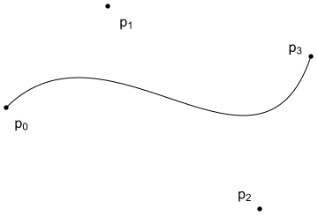

Figure 3.15: A cubic Bézier curve is defined by four control points, $\mathrm{p}_{i}$. The curve $\mathrm{p}(u)$, defined in Equation (3.3), passes through the first and last control points at $u=0$ and $u=1$, respectively.

图 3.15：三次贝塞尔曲线由4个控制点 $\mathrm{p}_{i}$ 定义。方程（3.3）中定义的曲线 $\mathrm{p}(u)$ 分别通过 $u=0$ 和 $u=1$ 处的第一个和最后一个控制点。

The Curve shape is defined by a 1D Bézier curve along with a width that is linearly interpolated from starting and ending widths along its extent. Together, these define a flat 2D surface (Figure 3.16). It’s possible to directly intersect rays with this representation without tessellating it, which in turn makes it possible to efficiently render smooth curves without using too much storage.

曲线形状由一维贝塞尔曲线，以及沿从起始宽度和结束宽度线性插值的宽度扩展。这些一起定义了一个平面 2D 表面（图 3.16）。可以直接将光线与此表示相交，而无需对其进行细分，从而可以在不使用太多存储的情况下有效地渲染平滑曲线。

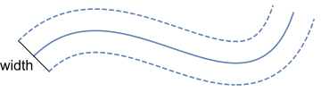

Figure 3.16: Basic Geometry of the Curve Shape. A 1D Bézier curve is offset by half of the specified width in both the directions orthogonal to the curve at each point along it. The resulting area represents the curve’s surface.

图 3.16：曲线形状的基本几何图形。一维贝塞尔曲线在沿其每个点的与曲线正交的两个方向上偏移指定宽度的一半。结果面积代表曲线的表面。

Figure 3.17 shows a bunny model with fur modeled with over one million Curves.

图 3.17 显示了一个兔子模型，它的毛发用超过 100 万条曲线建模。


Figure 3.17: Furry Bunny. Bunny model with over one million Curve shapes used to model fur. Here, we’ve used unrealistically long curves to better show off the Curve’s capabilities.

图 3.17：毛茸茸的兔子。具有超过一百万个曲线形状的兔子模型，用于建模毛皮。在这里，我们使用了不切实际的长曲线来更好地展示 Curve 的功能。

```
<<Curve Declarations>>= 
class Curve : public Shape {
public:
    <<Curve Public Methods>> 
private:
    <<Curve Private Methods>> 
    <<Curve Private Data>> 
};
```

There are three types of curves that the Curve shape can represent, shown in Figure 3.18.

* Flat: Curves with this representation are always oriented to face the ray being intersected with them; they are useful for modeling fine swept cylindrical shapes like hair or fur.

* Cylinder: For curves that span a few pixels on the screen (like spaghetti seen from not too far away), the Curve shape can compute a shading normal that makes the curve appear to actually be a cylinder.

* Ribbon: This variant is useful for modeling shapes that don’t actually have a cylindrical cross section (such as a blade of grass).

曲线形状可以表示三种类型的曲线，如图 3.18 所示。

* 平面：具有这种表示的曲线始终面向与它们相交的光线；它们可用于建模纤细的圆柱形状，如头发或毛皮。

* 圆柱体：对于跨越屏幕上几个像素的曲线（如从不太远的地方看到的意大利面条），曲线形状可以计算一个着色法线，使曲线看起来实际上是一个圆柱体。

* Ribbon：此变体对于建模实际上没有圆柱形横截面的形状（例如草叶）很有用。

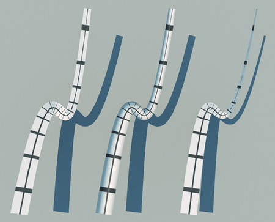

Figure 3.18: The Three Types of Curves That the Curve Shape Can Represent. On the left is a flat curve that is always oriented to be perpendicular to a ray approaching it. The middle is a variant of this curve where the shading normal is set so that the curve appears to be cylindrical. On the right is a ribbon, which has a fixed orientation at its starting and ending points; intermediate orientations are smoothly interpolated between them.

图 3.18：曲线形状可以表示的三种曲线。左边是一条平坦的曲线，它的方向总是垂直于接近它的光线。中间是这条曲线的一个变体，其中设置了着色法线，使曲线看起来是圆柱形的。右边是一个ribbon，它的起点和终点都有固定的方向；中间方向在它们之间平滑地插入。

The CurveType enumerant records which of them a given Curve instance models.

The flat and cylinder curve variants are intended to be used as convenient approximations of deformed cylinders. It should be noted that intersections found with respect to them do not correspond to a physically realizable 3D shape, which can potentially lead to minor inconsistencies when taking a scene with true cylinders as a reference.

CurveType 枚举记录了给定 Curve 实例模型。

平面和圆柱曲线变体旨在用作方便近似变形圆柱。应该注意的是，与它们相关的交点并不对应于物理上可实现的 3D 形状，当以真实圆柱体作为参考时，这可能导致轻微的不一致。

```
<<CurveType Declarations>>= 
enum class CurveType { Flat, Cylinder, Ribbon };
```

Given a curve specified in a pbrt scene description file, it can be worthwhile to split it into a few segments, each covering part of the $u$ parametric range of the curve. (One reason for doing so is that axis-aligned bounding boxes don't tightly bound wiggly curves, but subdividing Bézier splines makes them less wiggly-the variation diminishing property of polynomial splines.) Therefore, the Curve constructor takes both a parametric range of $u$ values, $\left[u_{\min }, u_{\max }\right]$, as well as a pointer to a CurveCommon structure, which stores the control points and other information about the curve that is shared across curve segments. In this way, the memory footprint for individual curve segments is minimized, which makes it easier to keep many of them in memory.

给定在 pbrt 场景描述文件中指定的曲线，将其分成几段是值得的，每个段都覆盖曲线 $u$ 参数范围的一部分。 （这样做的一个原因是轴对齐的包围盒不紧密包裹摆动曲线，但细分贝塞尔曲线使它们不那么摆动——多项式曲线的变化递减特性。）因此，曲线构造函数采用两个参数范围 $u$ 值、 $\left[u_{\min }, u_{\max }\right]$ ，以及指向 CurveCommon 结构的指针，该结构存储控制点和其他曲线段共享的曲线信息。通过这种方式，单个曲线段的内存占用被最小化，从而更容易将其中的许多曲线段保留在内存中。

```
<<Curve Public Methods>>= 
Curve(const Transform *ObjectToWorld, const Transform *WorldToObject,
      bool reverseOrientation, const std::shared_ptr<CurveCommon> &common,
      Float uMin, Float uMax)
    : Shape(ObjectToWorld, WorldToObject, reverseOrientation),
      common(common), uMin(uMin), uMax(uMax) { }

<<Curve Private Data>>= 
const std::shared_ptr<CurveCommon> common;
const Float uMin, uMax;
```

The CurveCommon constructor mostly just initializes member variables with values passed into it for the control points, the curve width, etc. The control points provided to it should be in the curve’s object space.

For Ribbon curves, CurveCommon stores a surface normal to orient the curve at each endpoint. The constructor precomputes the angle between the two normal vectors and one over the sine of this angle; these values will be useful when computing the orientation of the curve at arbitrary points along its extent.

CurveCommon 构造函数大多只是使用传递给它的控制点、曲线宽度等值来初始化成员变量。提供给它的控制点应该在曲线的对象空间中。

对于 Ribbon 曲线，CurveCommon 存储曲面法线以在每个端点定位曲线。构造函数预先计算两个法向量之间的角度和这个角度的正弦值；在计算曲线沿其范围任意点的方向时，这些值将非常有用。

```
<<Curve Method Definitions>>= 
CurveCommon::CurveCommon(const Point3f c[4], Float width0, Float width1,
        CurveType type, const Normal3f *norm)
    : type(type), cpObj{c[0], c[1], c[2], c[3]},
      width{width0, width1} {
    if (norm) {
        n[0] = Normalize(norm[0]);
        n[1] = Normalize(norm[1]);
        normalAngle = std::acos(Clamp(Dot(n[0], n[1]), 0, 1));
        invSinNormalAngle = 1 / std::sin(normalAngle);
    }
}

<<CurveCommon Declarations>>= 
struct CurveCommon {
    const CurveType type;
    const Point3f cpObj[4];
    const Float width[2];
    Normal3f n[2];
    Float normalAngle, invSinNormalAngle;
};
```

Bounding boxes of Curves can be computed by taking advantage of the convex hull property, a property of Bézier curves that says that they must lie within the convex hull of their control points. Therefore, the bounding box of the control points gives a conservative bound of the underlying curve. The ObjectBound() method first computes a bounding box of the control points of the 1D Bézier segment to bound the spline along the center of the curve. These bounds are then expanded by half the maximum width the curve takes on over its parametric extent to get the 3D bounds of the Shape that the Curve represents.

曲线的包围盒可以通过利用凸包属性来计算，这是贝塞尔曲线的一个属性，表明它们必须位于其控制点的凸包内。因此，控制点的包围盒给出了底层曲线的保守边界。 ObjectBound() 方法首先计算 1D Bézier 线段控制点的包围盒，以沿曲线中心限制曲线。然后将这些边界扩大曲线，宽度为在其参数范围内所采用的最大宽度的一半，以获得曲线所代表的形状的 3D 边界。

```
<<Curve Method Definitions>>+=  
Bounds3f Curve::ObjectBound() const {
    <<Compute object-space control points for curve segment, cpObj>> 
    Bounds3f b = Union(Bounds3f(cpObj[0], cpObj[1]),
                       Bounds3f(cpObj[2], cpObj[3]));
    Float width[2] = { Lerp(uMin, common->width[0], common->width[1]),
                       Lerp(uMax, common->width[0], common->width[1]) };
    return Expand(b, std::max(width[0], width[1]) * 0.5f);
}
```

The CurveCommon class stores the control points for the full curve, but Curve instances generally need the four control points that represent the Bézier curve for its $u$ extent. These control points are computed using a technique called blossoming. The blossom $p\left(u_{0}, u_{1}, u_{2}\right)$ of a cubic Bézier spline is defined by three stages of linear interpolation, starting with the original control points:

CurveCommon 类存储完整曲线的控制点，但 Curve 实例通常需要4个控制点来表示其 $u$ 范围的贝塞尔曲线。这些控制点是使用一种称为blossoming的技术来计算的。三次贝塞尔曲线的blossoming $p\left(u_{0}, u_{1}, u_{2}\right)$ 由3个阶段的线性插值定义，从原始控制点开始：

$$
\begin{array}{rl}
\mathrm{a}_{i} & =\left(1-u_{0}\right) \mathrm{p}_{i}+u_{0} \mathrm{p}_{i+1} & i \in[0,1,2] \\
\mathrm{b}_{j} & =\left(1-u_{1}\right) \mathrm{a}_{j}+u_{1} \mathrm{a}_{j+1} & j \in[0,1] \\
\mathrm{c} & =\left(1-u_{2}\right) \mathrm{b}_{0}+u_{2} \mathrm{~b}_{1}
\end{array}
$$

(3.4)

The blossom $p(u, u, u)$ gives the curve's value at position $u$. (To verify this for yourself, expand Equation (3.4) using $u_{i}=u$, simplify, and compare to Equation (3.3).)

BlossomBezier() implements this computation.

blossom $p(u, u, u)$ 给出了位置 $u$ 处的曲线值。 （为了自己验证这一点，使用 $u_{i}=u$ 扩展方程（3.4），简化并与方程（3.3）进行比较。）

BlossomBezier() 实现了这个计算。

```
<<Curve Utility Functions>>= 
static Point3f BlossomBezier(const Point3f p[4], Float u0, Float u1,
        Float u2) {
    Point3f a[3] = { Lerp(u0, p[0], p[1]),
                     Lerp(u0, p[1], p[2]),
                     Lerp(u0, p[2], p[3]) };
    Point3f b[2] = { Lerp(u1, a[0], a[1]), Lerp(u1, a[1], a[2]) };
    return Lerp(u2, b[0], b[1]);
}
```

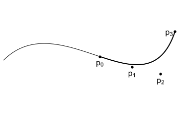

Figure 3.19: Blossoming to Find Control Points for a Segment of a Bézier Curve. The four blossoms in Equation (3.5) give the control points for the curve from $u_{min}$ to $u_{max}$. Blossoming provides an elegant method to compute the Bézier control points of the curve that represent a subset of the overall curve.

The four control points for the curve segment over the range $u_{\min }$ to $u_{\max }$ are given by the blossoms:

图 3.19：Blossoming 寻找 Bézier 曲线段的控制点。方程（3.5）中的4个blossoms给出了从 $u_{min}$ 到 $u_{max}$ 曲线的控制点。 Blossoming 提供了一种优雅的方法来计算代表整个曲线子集的贝塞尔控制点。

曲线段在 $u_{\min }$ 到 $u_{\max }$ 范围内的4个控制点由blossoms给出：

$$
\begin{array}{l}
\mathrm{p}_{0}=\mathrm{p}\left(u_{\min }, u_{\min }, u_{\min }\right) \\
\mathrm{p}_{1}=\mathrm{p}\left(u_{\min }, u_{\min }, u_{\max }\right) \\
\mathrm{p}_{2}=\mathrm{p}\left(u_{\min }, u_{\max }, u_{\max }\right) \\
\mathrm{p}_{3}=\mathrm{p}\left(u_{\max }, u_{\max }, u_{\max }\right)
\end{array}
$$

(3.5)

(Figure 3.19).

（图 3.19）。

Given this machinery, it’s straightforward to compute the four control points for the curve segment that a Curve is responsible for.

鉴于这种机制，计算 Curve 负责的曲线段的4个控制点很简单。

```
<<Compute object-space control points for curve segment, cpObj>>= 
Point3f cpObj[4];
cpObj[0] = BlossomBezier(common->cpObj, uMin, uMin, uMin);
cpObj[1] = BlossomBezier(common->cpObj, uMin, uMin, uMax);
cpObj[2] = BlossomBezier(common->cpObj, uMin, uMax, uMax);
cpObj[3] = BlossomBezier(common->cpObj, uMax, uMax, uMax);
```

The Curve intersection algorithm is based on discarding curve segments as soon as it can be determined that the ray definitely doesn’t intersect them and otherwise recursively splitting the curve in half to create two smaller segments that are then tested. Eventually, the curve is linearly approximated for an efficient intersection test. After some preparation, the recursiveIntersect() call starts this process with the full segment that the Curve represents.

曲线相交算法基于一旦确定光线肯定不会与它们相交就丢弃曲线段，否则递归地将曲线分成两半以创建两个较小的段，然后进行测试。最终，该曲线被线性近似以进行有效的相交测试。经过一些准备后，recursiveIntersect() 调用使用 Curve 表示的完整段开始此过程。

```
<<Curve Method Definitions>>+=  
bool Curve::Intersect(const Ray &r, Float *tHit,
        SurfaceInteraction *isect, bool testAlphaTexture) const {
    <<Transform Ray to object space>> 
    <<Compute object-space control points for curve segment, cpObj>> 
    <<Project curve control points to plane perpendicular to ray>> 
    <<Compute refinement depth for curve, maxDepth>> 
    return recursiveIntersect(ray, tHit, isect, cp, Inverse(objectToRay),
                              uMin, uMax, maxDepth);
}
```

Like the ray–triangle intersection algorithm from Section 3.6.2, the ray–curve intersection test is based on transforming the curve to a coordinate system with the ray’s origin at the origin of the coordinate system and the ray’s direction aligned to be along the $+z$ axis. Performing this transformation at the start greatly reduces the number of operations that must be performed for intersection tests.

For the Curve shape, we’ll need an explicit representation of the transformation, so the LookAt() function is used to generate it here. The origin is the ray’s origin, the “look at” point is a point offset from the origin along the ray’s direction, and the “up” direction is an arbitrary direction orthogonal to the ray direction.

与第 3.6.2 节中的光线-三角形相交算法一样，光线-曲线相交测试基于将曲线变换为一个坐标系，其中光线的原点位于坐标系的原点，并且光线的方向沿 $ +z$ 轴。在开始时执行此变换大大减少了必须为相交测试执行的操作数量。

对于曲线形状，我们需要变换的显式表示，因此这里使用 LookAt() 函数来生成它。原点是光线的原点，“look at”点是沿光线方向偏离原点的点，“向上”方向是与光线方向正交的任意方向。

```
<<Project curve control points to plane perpendicular to ray>>= 
Vector3f dx, dy;
CoordinateSystem(ray.d, &dx, &dy);
Transform objectToRay = LookAt(ray.o, ray.o + ray.d, dx);
Point3f cp[4] = { objectToRay(cpObj[0]), objectToRay(cpObj[1]),
                  objectToRay(cpObj[2]), objectToRay(cpObj[3]) };
```

The maximum number of times to subdivide the curve is computed so that the maximum distance from the eventual linearized curve at the finest refinement level is bounded to be less than a small fixed distance. We won’t go into the details of this computation, which is implemented in the fragment <<*Compute refinement depth for curve, maxDepth*>>.

The recursiveIntersect() method then tests whether the given ray intersects the given curve segment over the given parametric range $[u0, u1]$.

计算细分曲线的最大次数，以便在最精细的细化级别上，与最终线性化曲线的最大距离之间的差距，小于一个小小的固定距离。我们不会深入讨论这个计算的细节，它是在片段<<*Compute refinement depth for curve, maxDepth*>>中实现的。

然后 recursiveIntersect() 方法测试给定的光线是否在给定的参数范围 $[u0, u1]$ 上与给定的曲线段相交。

```
<<Curve Method Definitions>>+= 
bool Curve::recursiveIntersect(const Ray &ray, Float *tHit,
        SurfaceInteraction *isect, const Point3f cp[4],
        const Transform &rayToObject, Float u0, Float u1,
        int depth) const {
    <<Try to cull curve segment versus ray>> 
    if (depth > 0) {
        <<Split curve segment into sub-segments and test for intersection>> 
    } else {
        <<Intersect ray with curve segment>> 
    }
}
```

The method starts by checking to see if the ray intersects the curve segment’s bounding box; if it doesn’t, no intersection is possible and it can return immediately.

该方法首先检查光线是否与曲线段的包围盒相交；如果没有，则不可能有交点，它可以立即返回。

```
<<Try to cull curve segment versus ray>>= 
<<Compute bounding box of curve segment, curveBounds>> 
<<Compute bounding box of ray, rayBounds>> 
if (Overlaps(curveBounds, rayBounds) == false)
    return false;
```

Along the lines of the implementation in Curve::ObjectBound(), a conservative bounding box for the segment can be found by taking the bounds of the curve’s control points and expanding by half of the maximum width of the curve over the $u$ range being considered.

沿着 Curve::ObjectBound() 中的实现，可以通过获取曲线控制点的边界，并在 $u$ 范围内扩展曲线最大宽度的一半，来找到该段的保守包围盒。

```
<<Compute bounding box of curve segment, curveBounds>>= 
Bounds3f curveBounds =
    Union(Bounds3f(cp[0], cp[1]), Bounds3f(cp[2], cp[3]));
Float maxWidth = std::max(Lerp(u0, common->width[0], common->width[1]),
                          Lerp(u1, common->width[0], common->width[1]));
curveBounds = Expand(curveBounds, 0.5 * maxWidth);
```

Because the ray's origin is at $(0,0,0)$ and its direction is aligned with the $+z$ axis in the intersection space, its bounding box only includes the origin in $x$ and $y$ (Figure 3.20); its $z$ extent is given by the $z$ range that its parametric extent covers.

因为光线的原点在 $(0,0,0)$ 处，并且它的方向与相交空间中的 $+z$ 轴对齐，所以它的包围盒只包含 $x$ 和 $y$ 中的原点（图 3.20 );它的 $z$ 范围由其参数范围涵盖的 $z$ 范围给出。

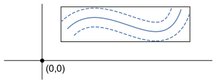

Figure 3.20: Ray-Curve Bounds Test. In the ray coordinate system, the ray's origin is at $(0,0,0)$ and its direction is aligned with the $+z$ axis. Therefore, if the $2 \mathrm{D}$ point $(x, y)=(0,0)$ is outside the $x y$ bounding box of the curve segment, then it's impossible that the ray intersects the curve.

图 3.20：光线曲线边界测试。在光线坐标系中，光线的原点在 $(0,0,0)$ 处，其方向与 $+z$ 轴对齐。因此，如果 $2 \mathrm{D}$ 点 $(x, y)=(0,0)$ 在曲线段的 $x y$ 包围盒之外，则光线不可能与曲线相交。

```
<<Compute bounding box of ray, rayBounds>>= 
Float rayLength = ray.d.Length();
Float zMax = rayLength * ray.tMax;
Bounds3f rayBounds(Point3f(0, 0, 0), Point3f(0, 0, zMax));
```

If the ray does intersect the curve’s bounding box and the recursive splitting hasn’t bottomed out, then the curve is split in half along the parametric $u$ range. SubdivideBezier() computes seven control points: the first four correspond to the control points for the first half of the split curve, and the last four (starting with the last control point of the first half) correspond to the control points for the second half. Two calls to recursiveIntersect() test the two sub-segments.

如果光线确实与曲线的包围盒相交并且递归分割没有触底，那么曲线沿着参数 $u$ 范围被分割成两半。 SubdivideBezier() 计算7个控制点：前4个对应分割曲线前半部分的控制点，后4个（从前半部分最后一个控制点开始）对应后半部分的控制点。两次调用 recursiveIntersect() 测试两个子段。

```
<<Split curve segment into sub-segments and test for intersection>>= 
Float uMid = 0.5f * (u0 + u1);
Point3f cpSplit[7];
SubdivideBezier(cp, cpSplit);
return (recursiveIntersect(ray, tHit, isect, &cpSplit[0], rayToObject,
                           u0, uMid, depth - 1) ||
        recursiveIntersect(ray, tHit, isect, &cpSplit[3], rayToObject,
                           uMid, u1, depth - 1));
```

While we could use the BlossomBezier () function to compute the control points of the subdivided curves, they can be more efficiently computed by taking advantage of the fact that we're always splitting the curve exactly in the middle of its parametric extent. This computation is implemented in the SubdivideBezier() function; the seven control points it computes correspond to using $(0,0,0)$, $(0,0,1 / 2), \quad(0,1 / 2,1 / 2), \quad(1 / 2,1 / 2,1 / 2), \quad(1 / 2,1 / 2,1), \quad(1 / 2,1,1)$, and $(1,1,1)$ as blossoms in Equation (3.4).

虽然我们可以使用 BlossomBezier () 函数来计算细分曲线的控制点，但通过利用我们总是在其参数范围的中间精确分割曲线这一事实，可以更有效地计算它们。这个计算是在 SubdivideBezier() 函数中实现的；它计算的7个控制点对应于使用 $(0,0,0)$, $(0,0,1 / 2), \quad(0,1 / 2,1 / 2), \quad(1 / 2) ,1 / 2,1 / 2)、\quad(1 / 2,1 / 2,1)、\quad(1 / 2,1,1)$ 和 $(1,1,1)$ 作为blossoms方程（3.4）。

```
<<Curve Utility Functions>>+=  
inline void SubdivideBezier(const Point3f cp[4], Point3f cpSplit[7]) {
    cpSplit[0] = cp[0];
    cpSplit[1] = (cp[0] + cp[1]) / 2;
    cpSplit[2] = (cp[0] + 2 * cp[1] + cp[2]) / 4;
    cpSplit[3] = (cp[0] + 3 * cp[1] + 3 * cp[2] + cp[3]) / 8;
    cpSplit[4] = (cp[1] + 2 * cp[2] + cp[3]) / 4;
    cpSplit[5] = (cp[2] + cp[3]) / 2;
    cpSplit[6] = cp[3];
}
```

After a number of subdivisions, an intersection test is performed. Parts of this test are made more efficient by using a linear approximation of the curve; the variation diminishing property allows us to make this approximation without introducing too much error.

在多次细分后，执行相交测试。通过使用曲线的线性近似，该测试的某些部分变得更加有效；变化递减特性允许我们在不引入太多误差的情况下进行这种近似。

```
<<Intersect ray with curve segment>>= 
<<Test ray against segment endpoint boundaries>> 
<<Compute line  that gives minimum distance to sample point>> 
<<Compute  coordinate of curve intersection point and hitWidth>> 
<<Test intersection point against curve width>> 
<<Compute  coordinate of curve intersection point>> 
<<Compute hit t and partial derivatives for curve intersection>> 
return true;
```

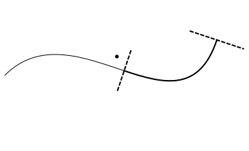

Figure 3.21: Curve Segment Boundaries. The intersection test for a segment of a larger curve computes edge functions for the lines that are perpendicular to the segment endpoints (dashed lines). If a potential intersection point (solid dot) is on the other side of the edge than the segment, it is rejected; another curve segment (if present on that side) should account for this intersection instead.

图 3.21：曲线段边界。较大曲线段的相交测试计算垂直于段端点（虚线）的线的边函数。如果潜在的交点（实心点）在边的另一侧而不是线段，则拒绝；另一条曲线段（如果存在于该侧）应考虑该交点。

It’s important that the intersection test only accept intersections that are on the Curve’s surface for the $u$ segment currently under consideration. Therefore, the first step of the intersection test is to compute edge functions for lines perpendicular to the curve starting point and ending point and to classify the potential intersection point against them (Figure 3.21).

重要的是，相交测试仅接受当前正在考虑的 $u$ 段的曲线表面上的相交。因此，相交测试的第一步是计算垂直于曲线起点和终点的直线的边函数，并根据它们对潜在的交点进行分类（图 3.21）。

```
<<Test ray against segment endpoint boundaries>>= 
<<Test sample point against tangent perpendicular at curve start>> 
<<Test sample point against tangent perpendicular at curve end>> 
```

Projecting the curve control points into the ray coordinate system makes this test more efficient for two reasons. First, because the ray's direction is oriented with the $+z$ axis, the problem is reduced to a 2D test in $x$ and $y$. Second, because the ray origin is at the origin of the coordinate system, the point we need to classify is $(0,0)$, which simplifies evaluating the edge function, just like the ray-triangle intersection test.

Edge functions were introduced for ray-triangle intersection tests in Equation (3.1); see also Figure 3.14. To define the edge function, we need any two points on the line perpendicular to the curve going through starting point. The first control point, $\mathrm{p}_{0}$, is a fine choice for the first point. For the second one, we'll compute the vector perpendicular to the curve's tangent and add that offset to the control point.

Differentiation of Equation (3.3) shows that the tangent to the curve at the first control point $\mathrm{p}_{0}$ is $3\left(\mathrm{p}_{1}-\mathrm{p}_{0}\right)$. The scaling factor doesn't matter here, so we'll use $\mathbf{t}=\mathrm{p}_{1}-\mathrm{p}_{0}$ here. Computing the vector perpendicular to the tangent is easy in $2 \mathrm{D}$ : it's just necessary to swap the $x$ and $y$ coordinates and negate one of them. (To see why this works, consider the dot product $(x, y) \cdot(y,-x)=x y+-y x=0 .$ Because the cosine of the angle between the two vectors is zero, they must be perpendicular.) Thus, the second point on the edge is

出于两个原因，将曲线控制点投影到光线坐标系中可以使该测试更加高效。首先，因为光线的方向是用 $+z$ 轴定向的，所以问题被简化为 $x$ 和 $y$ 中的 2D 测试。其次，因为光线原点在坐标系的原点，所以我们需要分类的点是 $(0,0)$ ，这样就简化了边函数的求值，就像光线-三角形相交测试一样。

在方程（3.1）中引入了边函数用于光线三角形相交测试；另请参见图 3.14。为了定义边函数，我们需要垂直于通过起点的曲线的直线上的任意两点。第一个控制点 $\mathrm{p}_{0}$ 是第一点的不错选择。对于第2个，我们将计算垂直于曲线切线的向量并将该偏移量添加到控制点。

方程（3.3）的微分表明，曲线在第一个控制点 $\mathrm{p}_{0}$ 处的切线为 $3\left(\mathrm{p}_{1}-\mathrm{p}_ {0}\right)$ 。缩放系数在这里无关紧要，因此我们将在这里使用 $\mathbf{t}=\mathrm{p}_{1}-\mathrm{p}_{0}$ 。在 $2 \mathrm{D}$ 中计算垂直于切线的向量很容易：只需要交换 $x$ 和 $y$ 坐标并取反其中之一即可。 （要了解为什么会这样，请考虑点积 $(x, y) \cdot(y,-x)=x y+-yx=0 .$ 因为两个向量之间夹角的余弦为零，所以它们必须是垂直。）因此，边上的第2个点是

$$
\mathrm{p}_{0}+\left(\mathrm{p}_{1_{y}}-\mathrm{p}_{0_{y}},-\left(\mathrm{p}_{1 x}-\mathrm{p}_{0 x}\right)\right)=\mathrm{p}_{0}+\left(\mathrm{p}_{1 y}-\mathrm{p}_{0_{y}}, \mathrm{p}_{0 x}-\mathrm{p}_{1 x}\right)
$$

Substituting these two points into the definition of the edge function, Equation (3.1), and simplifying gives

将这两点代入边函数的定义，方程（3.1），化简得到

$$
e(\mathrm{p})=\left(\mathrm{p}_{1 y}-\mathrm{p}_{0 y}\right)\left(\mathrm{p}_{y}-\mathrm{p}_{0 y}\right)-\left(\mathrm{p}_{x}-\mathrm{p}_{0 x}\right)\left(\mathrm{p}_{0 x}-\mathrm{p}_{1_{x}}\right)
$$

Finally, substituting $\mathrm{p}=(0,0)$ gives the final expression to test:

最后，代入 $\mathrm{p}=(0,0)$ 给出要测试的最终表达式：

$$
e((0,0))=\left(\mathrm{p}_{1 y}-\mathrm{p}_{0 y}\right)\left(-\mathrm{p}_{0 y}\right)+\mathrm{p}_{0 x}\left(\mathrm{p}_{0 x}-\mathrm{p}_{1 x}\right)
$$

```
<<Test sample point against tangent perpendicular at curve start>>= 
Float edge = (cp[1].y - cp[0].y) * -cp[0].y +
             cp[0].x * (cp[0].x - cp[1].x);
if (edge < 0)
    return false;
```

The <<*Test sample point against tangent perpendicular at curve end*>> fragment, not included here, does the corresponding test at the end of the curve.

The next part of the test is to determine the $u$ value along the curve segment where the point $(0,0)$ is closest to the curve. This will be the intersection point, if it's no farther than the curve's width away from the center at that point. Determining this distance for a cubic Bézier curve is not efficient, so instead this intersection approach approximates the curve with a linear segment to compute this $u$ value.

<<*Test sample point against tangent perpendicular at curve end*>> 片段（此处未包含）在曲线末端进行相应的测试。

测试的下一部分是确定沿曲线段的 $(0,0)$ 点最接近曲线的 $u$ 值。这将是交点，如果它离该点的中心不超过曲线的宽度。确定三次贝塞尔曲线的这个距离效率不高，因此这种相交方法用线性段近似曲线来计算这个 $u$ 值。

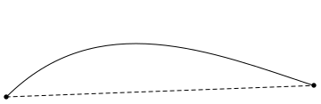

Figure 3.22: Approximation of a Cubic Bézier Curve with a Linear Segment. For this part of the ray–curve intersection test, we approximate the Bézier with a linear segment (dashed line) passing through its starting and ending points. (In practice, after being subdivided, the curve will be already nearly linear, so the error is less than this figure suggests.)

We'll linearly approximate the Bézier curve with a line segment from its starting point $\mathrm{p}_{0}$ to its end point $\mathrm{p}_{3}$ that is parameterized by $w$. In this case, the position is $\mathrm{p}_{0}$ at $w=0$ and $\mathrm{p}_{3}$ at $w=1$ (Figure 3.22). Our task now is to compute the value of $w$ along the line corresponding to the point on the line $\mathrm{p}^{\prime}$ that is closest to the point $\mathrm{p}$. The key insight to apply is that at $\mathrm{p}^{\prime}$, the vector from the corresponding point on the line to $\mathrm{p}$ will be perpendicular to the line (Figure 3.23(a)).

图 3.22：具有线性段的三次贝塞尔曲线的近似值。对于光线-曲线相交测试的这一部分，我们用穿过其起点和终点的线性线段（虚线）来近似贝塞尔曲线。 （实际上，经过细分后，曲线将已经接近线性，因此误差小于该数字所暗示的。）

我们将使用从起点 $\mathrm{p}_{0}$ 到终点 $\mathrm{p}_{3}$ 的线段线性逼近贝塞尔曲线，该线段由 $w$ 参数化。在这种情况下，位置是 $\mathrm{p}_{0}$ 在 $w=0$ 和 $\mathrm{p}_{3}$ 在 $w=1$（图 3.22）。我们现在的任务是沿着线 $\mathrm{p}^{\prime}$ 上与点 $\mathrm{p}$ 最接近的点对应的线计算 $w$ 的值。应用的关键点是在 $\mathrm{p}^{\prime}$ 处，从直线上的对应点到 $\mathrm{p}$ 的向量将垂直于该直线（图 3.23（a） ）。


Figure 3.23: (a) Given an infinite line and a point $\mathrm{p}$, then the vector from the point to the closest point on the line, $\mathrm{p}^{\prime}$, is perpendicular to the line. (b) Because this vector is perpendicular, we can compute the distance from the first point of the line to the point of closest approach, $\mathrm{p}^{\prime}$ as $d=\left\|\mathrm{p}-\mathrm{p}_{0}\right\| \cos \theta$.

Equation (2.1) gives us a relationship between the dot product of two vectors, their lengths, and the cosine of the angle between them. In particular, it shows us how to compute the cosine of the angle between the vector from $\mathrm{p}_{0}$ to $\mathrm{p}$ and the vector from $\mathrm{p}_{0}$ to $\mathrm{p}_{3}$ :

图 3.23：(a) 给定一条无限长的直线和一个点 $\mathrm{p}$ ，那么从该点到直线上最近点 $\mathrm{p}^{\prime}$ 的向量与直线垂直。 (b) 因为这个向量是垂直的，我们可以计算从直线的第一个点到最近点的距离 $\mathrm{p}^{\prime}$ 等于 $d=\left\|\mathrm {p}-\mathrm{p}_{0}\right\| \cos \theta$ 。

方程（2.1）给出了两个向量的点积、它们的长度和它们之间夹角的余弦之间的关系。特别是，它向我们展示了如何计算从 $\mathrm{p}_{0}$ 到 $\mathrm{p}$ 的向量，与 $\mathrm{p}_{0}$ 到 $\mathrm{p}_{3}$ 的向量之间的夹角的余弦：

$$
\cos \theta=\frac{\left(\mathrm{p}-\mathrm{p}_{0}\right) \cdot\left(\mathrm{p}_{3}-\mathrm{p}_{0}\right)}{\left\|\mathrm{p}-\mathrm{p}_{0}\right\|\left\|\mathrm{p}_{3}-\mathrm{p}_{0}\right\|}
$$

Because the vector from $\mathrm{p}^{\prime}$ to $\mathrm{p}$ is perpendicular to the line (Figure $3.23(\mathrm{~b})$ ), then we can compute the distance along the line from $\mathrm{p}_{0}$ to $\mathrm{p}^{\prime}$ as

因为从 $\mathrm{p}^{\prime}$ 到 $\mathrm{p}$ 的向量垂直于直线（图 $3.23(\mathrm{~b})$ ），那么我们可以计算沿从 $\mathrm{p}_{0}$ 到 $\mathrm{p}^{\prime}$ 的长度

$$
d=\left\|\mathrm{p}-\mathrm{p}_{0}\right\| \cos \theta=\frac{\left(\mathrm{p}-\mathrm{p}_{0}\right) \cdot\left(\mathrm{p}_{3}-\mathrm{p}_{0}\right)}{\left\|\mathrm{p}_{3}-\mathrm{p}_{0}\right\|}
$$

Finally, the parametric offset $w$ along the line is the ratio of $d$ to the line's length,

最后，沿线的参数偏移 $w$ 是 $d$ 与线长度的比值，

$$
w=\frac{d}{\left\|\mathrm{p}_{3}-\mathrm{p}_{0}\right\|}=\frac{\left(\mathrm{p}-\mathrm{p}_{0}\right) \cdot\left(\mathrm{p}_{3}-\mathrm{p}_{0}\right)}{\left\|\mathrm{p}_{3}-\mathrm{p}_{0}\right\|^{2}}
$$

The computation of the value of $w$ is in turn slightly simplified from the fact that $\mathrm{p}=(0,0)$ in the intersection coordinate system.

$w$ 值的计算又从相交坐标系中 $\mathrm{p}=(0,0)$ 的事实稍微简化了。

```
<<Compute line  that gives minimum distance to sample point>>= 
Vector2f segmentDirection = Point2f(cp[3]) - Point2f(cp[0]);
Float denom = segmentDirection.LengthSquared();
if (denom == 0)
    return false;
Float w = Dot(-Vector2f(cp[0]), segmentDirection) / denom;
```

The parametric $u$ coordinate of the (presumed) closest point on the Bézier curve to the candidate intersection point is computed by linearly interpolating along the $u$ range of the segment. Given this $u$ value, the width of the curve at that point can be computed.

贝塞尔曲线上（假定）与候选交点最近的点的参数 $u$ 坐标，是通过沿线段的 $u$ 范围线性插值来计算的。给定这个 $u$ 值，可以计算该点的曲线宽度。

```
<<Compute  coordinate of curve intersection point and hitWidth>>= 
Float u = Clamp(Lerp(w, u0, u1), u0, u1);
Float hitWidth = Lerp(u, common->width[0], common->width[1]);
Normal3f nHit;
if (common->type == CurveType::Ribbon) {
    <<Scale hitWidth based on ribbon orientation>> 
}
```

For Ribbon curves, the curve is not always oriented to face the ray. Rather, its orientation is interpolated between two surface normals given at each endpoint. Here, spherical linear interpolation is used to interpolate the normal at $u$ (recall Section 2.9.2). The curve’s width is then scaled by the cosine of the angle between the normalized ray direction and the ribbon’s orientation so that it reflects the visible width of the curve from the given direction.

对于 Ribbon 曲线，曲线并不总是面向光线。相反，它的方向是在每个端点给出的两个表面法线之间插值的。这里，球面线性插值用于在 $u$ 处插值法线（回忆第 2.9.2 节）。然后曲线的宽度由归一化光线方向和ribbon方向之间的角度的余弦缩放，以便它从给定方向反映曲线的可见宽度。

```
<<Scale hitWidth based on ribbon orientation>>= 
Float sin0 = std::sin((1 - u) * common->normalAngle) *
    common->invSinNormalAngle;
Float sin1 = std::sin(u * common->normalAngle) *
    common->invSinNormalAngle;
nHit = sin0 * common->n[0] + sin1 * common->n[1];
hitWidth *= AbsDot(nHit, ray.d) / rayLength;
```

To finally classify the potential intersection as a hit or miss, the Bézier curve must still be evaluated at $u$ using the EvalBezier () function. (Because the control points cp represent the curve segment currently under consideration, it's important to use $w$ rather than $u$ in the function call, however, since $w$ is in the range $[0,1] .$ ) The derivative of the curve at this point will be useful shortly, so it's recorded now.

We'd like to test whether the distance from $\mathrm{p}$ to this point on the curve $\mathrm{pc}$ is less than half the curve's width. Because $\mathrm{p}=(0,0)$, we can equivalently test whether the distance from $\mathrm{pc}$ to the origin is less than half the width or, equivalently, whether the squared distance is less than one quarter the width squared. If this test passes, the last thing to check is if the intersection point is in the ray's parametric $t$ range.

为了最终将潜在的交点分类为命中或未命中，仍必须使用 EvalBezier () 函数在 $u$ 处计算 Bézier 曲线。 （因为控制点 cp 代表当前正在考虑的曲线段，所以在函数调用中使用 $w$ 而不是 $u$ 很重要，但是，因为 $w$ 在 $[0,1] .$ 范围内）曲线在这一点的导数很快就会有用，所以现在记录下来。

我们想测试 $\mathrm{p}$ 到曲线 $\mathrm{pc}$ 上这一点的距离是否小于曲线宽度的一半。因为 $\mathrm{p}=(0,0)$ ，我们可以等价地测试 $\mathrm{pc}$ 到原点的距离是否小于宽度的一半，或者等价地，距离的平方是否小于四分之一的宽度平方。如果此测试通过，最后要检查的是交点是否在光线的参数 $t$ 范围内。

```
<<Test intersection point against curve width>>= 
Vector3f dpcdw;
Point3f pc = EvalBezier(cp, Clamp(w, 0, 1), &dpcdw);
Float ptCurveDist2 = pc.x * pc.x + pc.y * pc.y;
if (ptCurveDist2 > hitWidth * hitWidth * .25)
    return false;
if (pc.z < 0 || pc.z > zMax)
    return false;
```

EvalBezier () computes the blossom $p(u, u, u)$ to evaluate a point on a Bézier spline. It optionally also returns the derivative of the curve at the point.

EvalBezier () 计算blossom $p(u, u, u)$ 以计算 Bézier 曲线上的一个点。它还可以选择返回曲线在该点处的导数。

```
<<Curve Utility Functions>>+= 
static Point3f EvalBezier(const Point3f cp[4], Float u,
        Vector3f *deriv = nullptr) {
    Point3f cp1[3] = { Lerp(u, cp[0], cp[1]), Lerp(u, cp[1], cp[2]),
                       Lerp(u, cp[2], cp[3]) };
    Point3f cp2[2] = { Lerp(u, cp1[0], cp1[1]), Lerp(u, cp1[1], cp1[2]) };
    if (deriv)
        *deriv = (Float)3 * (cp2[1] - cp2[0]);
    return Lerp(u, cp2[0], cp2[1]);
}
```

If the earlier tests have all passed, we have found a valid intersection, and the $v$ coordinate of the intersection point can now be computed. The curve's $v$ coordinate ranges from 0 to 1 , taking on the value $0.5$ at the center of the curve; here, we classify the intersection point, $(0,0)$, with respect to an edge function going through the point on the curve pc and a point along its derivative to determine which side of the center the intersection point is on and in turn how to compute $v$.

如果前面的测试都通过了，我们就找到了一个有效的交点，现在可以计算交点的 $v$ 坐标。曲线的 $v$ 坐标范围为 0 到 1 ，在曲线中心取值 $0.5$；在这里，我们根据通过曲线 pc 上的点和沿其导数的点的边函数，对交点 $(0,0)$ 进行分类，以确定交点位于中心的哪一侧，已经进一步如何计算 $v$ 。

```
<<Compute  coordinate of curve intersection point>>= 
Float ptCurveDist = std::sqrt(ptCurveDist2);
Float edgeFunc = dpcdw.x * -pc.y + pc.x * dpcdw.y;
Float v = (edgeFunc > 0) ? 0.5f + ptCurveDist / hitWidth :
                           0.5f - ptCurveDist / hitWidth;
```

Finally, the partial derivatives are computed, and the SurfaceInteraction for the intersection can be initialized.

最后，计算偏导数，并且可以初始化交点的 SurfaceInteraction。

```
<<Compute hit t and partial derivatives for curve intersection>>= 
if (tHit != nullptr) {
    *tHit = pc.z / rayLength;
    <<Compute error bounds for curve intersection>> 
    <<Compute  and  for curve intersection>> 
    *isect = (*ObjectToWorld)(SurfaceInteraction(
        ray(pc.z), pError, Point2f(u, v), -ray.d, dpdu, dpdv,
        Normal3f(0, 0, 0), Normal3f(0, 0, 0), ray.time, this));
}
```

The partial derivative $\partial \mathrm{p} / \partial u$ comes directly from the derivative of the underlying Bézier curve. The second partial derivative, $\partial \mathrm{p} / \partial v$, is computed in different ways based on the type of the curve. For ribbons, we have $\partial \mathrm{p} / \partial u$ and the surface normal, and so $\partial \mathrm{p} / \partial v$ must be the vector such that $\partial \mathrm{p} / \partial u \times \partial \mathrm{p} / \partial v=\mathbf{n}$ and has length equal to the curve's width.

偏导数 $\partial \mathrm{p} / \partial u$ 直接来自基础贝塞尔曲线的导数。二阶偏导数 $\partial \mathrm{p} / \partial v$ 根据曲线的类型以不同的方式计算。对于ribbon，我们有 $\partial \mathrm{p} / \partial u$ 和表面法线，所以 $\partial \mathrm{p} / \partial v$ 必须是向量使得 $\partial \mathrm{ p} / \partial u \times \partial \mathrm{p} / \partial v=\mathbf{n}$ 并且长度等于曲线的宽度。

```
<<Compute  and  for curve intersection>>= 
Vector3f dpdu, dpdv;
EvalBezier(common->cpObj, u, &dpdu);
if (common->type == CurveType::Ribbon)
    dpdv = Normalize(Cross(nHit, dpdu)) * hitWidth;
else {
    <<Compute curve  for flat and cylinder curves>> 
}
```

For flat and cylinder curves, we transform $\partial \mathrm{p} / \partial u$ to the intersection coordinate system. For flat curves, we know that $\partial \mathrm{p} / \partial v$ lies in the $x y$ plane, is perpendicular to $\partial \mathrm{p} / \partial u$, and has length equal to hitWidth. We can find the 2D perpendicular vector using the same approach as was used earlier for the perpendicular curve segment boundary edges.

对于平面和圆柱曲线，我们将 $\partial \mathrm{p} / \partial u$ 变换为相交坐标系。对于平坦曲线，我们知道 $\partial \mathrm{p} / \partial v$ 位于 $xy$ 平面内，垂直于 $\partial \mathrm{p} / \partial u$ ，并且长度等于命中宽度。我们可以使用与之前用于垂直曲线段边界边相同的方法来找到 2D 垂直向量。

```
<<Compute curve  for flat and cylinder curves>>= 
Vector3f dpduPlane = (Inverse(rayToObject))(dpdu);
Vector3f dpdvPlane = Normalize(Vector3f(-dpduPlane.y, dpduPlane.x, 0)) *
                     hitWidth;
if (common->type == CurveType::Cylinder) {
    <<Rotate dpdvPlane to give cylindrical appearance>> 
}
dpdv = rayToObject(dpdvPlane);
```

The $\partial \mathrm{p} / \partial v$ vector for cylinder curves is rotated around the dpduPlane axis so that its appearance resembles a cylindrical cross-section.

圆柱曲线的 $\partial \mathrm{p} / \partial v$ 向量围绕 dpduPlane 轴旋转，使其外观类似于圆柱横截面。

```
<<Rotate dpdvPlane to give cylindrical appearance>>= 
Float theta = Lerp(v, -90., 90.);
Transform rot = Rotate(-theta, dpduPlane);
dpdvPlane = rot(dpdvPlane);
```

The Curve::Area() method, not included here, first approximates the curve length by the length of its control hull. It then multiplies this length by the average curve width over its extent to approximate the overall surface area.

Curve::Area() 方法（此处未包含）首先通过其控制船体的长度来近似曲线长度。然后将该长度乘以其范围内的平均曲线宽度来近似总表面积。

## 3.8 Subdivision Surfaces / 细分曲面

The last shape representation that we’ll define in this chapter implements subdivision surfaces, a representation that is particularly well suited to describing complex smooth shapes. The subdivision surface for a particular mesh is defined by repeatedly subdividing the faces of the mesh into smaller faces and then finding the new vertex locations using weighted combinations of the old vertex positions.

For appropriately chosen subdivision rules, this process converges to give a smooth limit surface as the number of subdivision steps goes to infinity. In practice, just a few levels of subdivision typically suffice to give a good approximation of the limit surface. Figure 3.24 shows a simple example of a subdivision, where a tetrahedron has been subdivided zero, one, two, and six times.

我们将在本章中定义的最后一个形状表示实现了细分曲面，这种表示特别适合描述复杂的平滑形状。特定网格的细分曲面是通过将网格的面重复细分为更小的面，然后使用旧顶点位置的加权组合来找到新顶点位置来定义的。

For appropriately chosen subdivision rules, this process converges to give a smooth limit surface as the number of subdivision steps goes to infinity.

在实践中，仅仅几个级别的细分通常就足以给出一个很好的极限表面近似值。图 3.24 显示了一个简单的细分示例，其中一个四面体被细分了 0、1、2 和 6 次。

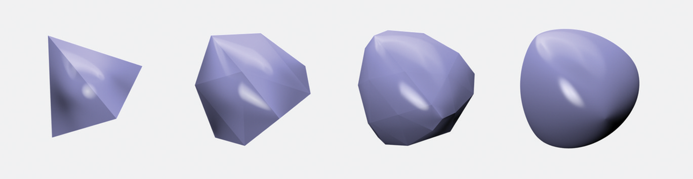

Figure 3.24: Subdivision of a Tetrahedron. From left to right, zero, one, two, and six subdivision steps have been used. (At zero levels, the vertices are just moved to lie on the limit surface.) As more subdivision is done, the mesh approaches the limit surface, the smooth surface described by the original mesh. Notice how the specular highlights become progressively more accurate and the silhouette edges appear smoother as more levels of subdivision are performed.

Figure 3.25 shows the effect of applying subdivision to the Killeroo model; on the top is the original control mesh, and below is the subdivision surface that the control mesh represents.

图 3.24：四面体的细分。从左到右，使用了0、1、2和6细分步骤。 （在0层，顶点只是移动到位于极限表面上。）随着更多细分的完成，网格接近极限表面，原始网格描述的平滑表面。请注意镜面高光如何逐渐变得更加准确，并且随着执行更多级别的细分，轮廓边缘显得更加平滑。

图3.25展示了对Killeroo模型应用细分的效果；上面是原始控制网格，下面是控制网格所代表的细分曲面。

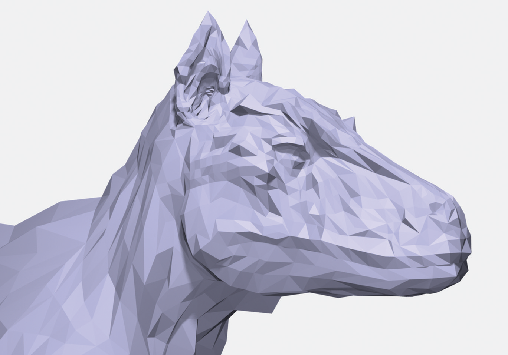

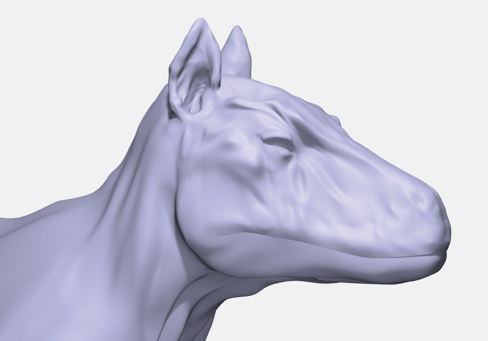

Figure 3.25: Subdivision Applied to the Killeroo Model. (1) The control mesh describes (2) the resulting subdivision surface. Subdivision is well suited to modeling shapes like this one, since it’s easy to add detail locally by refining the control mesh, and there are no limitations on the topology of the final surface. (Model courtesy of headus/Rezard.)

图 3.25：应用于 Killeroo 模型的细分。 (1) 控制网格描述 (2) 生成的细分曲面。细分非常适合建模这样的形状，因为通过细化控制网格很容易在局部添加细节，并且对最终曲面的拓扑没有限制。 （模型由 headus/Rezard 提供。）

Although originally developed in the 1970s, subdivision surfaces have seen widespread use in recent years thanks to some important advantages over polygonal and spline-based representations of surfaces. The advantages of subdivision include the following:

* Subdivision surfaces are smooth, as opposed to polygon meshes, which appear faceted when viewed close up, regardless of how finely they are modeled.

* Much of the existing infrastructure in modeling systems can be retargeted to subdivision. The classic toolbox of techniques for modeling polygon meshes can be applied to modeling subdivision control meshes.

* Subdivision surfaces are well suited to describing objects with complex topology, since they start with a control mesh of arbitrary (manifold) topology. Parametric surface models generally don’t handle complex topology well.

* Subdivision methods are often generalizations of spline-based surface representations, so spline surfaces can often just be run through general subdivision surface renderers.

* It is easy to add detail to a localized region of a subdivision surface simply by adding faces to appropriate parts of the control mesh. This is much harder with spline representations.

尽管最初是在 1970 年代开发的，但由于与基于多边形和基于曲线的曲面表示相比具有一些重要优势，细分曲面近年来得到了广泛应用。细分的优点包括：

* 细分曲面是光滑的，与多边形网格相反，多边形网格在近距离观察时会出现棱角(faceted)，无论它们的建模有多精细。

* 建模系统中的大部分现有基础功能都可以重新定位到细分。多边形网格建模技术的经典工具箱可以应用于建模细分控制网格。

* 细分曲面非常适合描述具有复杂拓扑结构的对象，因为它们从任意（流形）拓扑结构的控制网格开始。参数化曲面模型通常不能很好地处理复杂的拓扑。

* 细分方法通常是基于曲线的曲面表示的概括，因此曲线曲面通常可以通过通用细分曲面渲染器运行。

* 只需将面添加到控制网格的适当部分，即可轻松地向细分曲面的局部区域添加细节。这对于曲线表示要困难得多。


Figure 3.26: Basic Refinement Process for Loop Subdivision. (left) The control mesh before subdivision. (right) The new mesh after one subdivision step. Each triangular face of the mesh has been subdivided into four new faces by splitting each of the edges and connecting the new vertices with new edges.

图 3.26：循环细分的基本细化过程。 （左）细分前的控制网格。 （右）经过一个细分步骤后的新网格。通过分割每条边并将新顶点与新边连接起来，网格的每个三角形面都被细分为4个新面。

Here, we will describe an implementation of Loop subdivision surfaces. The Loop subdivision rules are based on triangular faces in the control mesh; faces with more than three vertices are triangulated at the start. At each subdivision step, all faces split into four child faces (Figure 3.26). New vertices are added along all of the edges of the original mesh, with positions computed using weighted averages of nearby vertices. Furthermore, the position of each original vertex is updated with a weighted average of its position and its new neighbors’ positions. The implementation here uses weights based on improvements to Loop’s method developed by Hoppe et al. (1994). We will not include discussion here about how these weights are derived. They must be chosen carefully to ensure that the limit surface actually has particular desirable smoothness properties, although subtle mathematics is necessary to prove that they indeed do this.

Rather than being implemented as a Shape in pbrt, subdivision surfaces are generated by a function, LoopSubdivide(), that applies the subdivision rules to a mesh represented by a collection of vertices and vertex indices and returns a vector of Triangles that represent the final subdivided mesh.

在这里，我们将描述循环细分曲面的实现。 循环细分规则基于控制网格中的三角形面；具有3个以上顶点的面在开始时进行三角化。在每个细分步骤中，所有面都分成4个子面（图 3.26）。沿着原始网格的所有边添加新顶点，并使用附近顶点的加权平均值计算位置。此外，每个原始顶点的位置都使用其位置及其新邻居位置的加权平均值进行更新。这里的实现使用基于改进的权重，由 Hoppe 等人开发的 Loop 方法(1994)。我们不会在这里讨论这些权重是如何得出的。必须仔细选择它们以确保极限表面实际上具有特别理想的平滑特性，尽管需要微妙的数学来证明它们确实做到了这一点。

细分曲面不是在 pbrt 中实现为 Shape，而是由函数 LoopSubdivide() 生成，该函数将细分规则应用于由顶点和顶点索引集合表示的网格，并返回表示最终细分的三角形向量。

```
<<LoopSubdiv Function Definitions>>= 
std::vector<std::shared_ptr<Shape>> LoopSubdivide(
        const Transform *ObjectToWorld, const Transform *WorldToObject,
        bool reverseOrientation, int nLevels, int nIndices,
        const int *vertexIndices, int nVertices, const Point3f *p) {
    std::vector<SDVertex *> vertices;
    std::vector<SDFace *> faces;
    <<Allocate LoopSubdiv vertices and faces>> 
    <<Set face to vertex pointers>> 
    <<Set neighbor pointers in faces>> 
    <<Finish vertex initialization>> 
    <<Refine subdivision mesh into triangles>> 
}
```

### 3.8.1 Mesh Representation / 网格表示

The parameters to LoopSubdivide() specify a triangle mesh in exactly the same format used in the TriangleMesh constructor (Section 3.6): each face is described by three integer vertex indices, giving offsets into the vertex array p for the face’s three vertices. We will need to process this data to determine which faces are adjacent to each other, which faces are adjacent to which vertices, and so on, in order to implement the subdivision algorithm.

We will shortly define SDVertex and SDFace structures, which hold data for vertices and faces in the subdivision mesh. LoopSubdivide() starts by allocating one instance of the SDVertex class for each vertex in the mesh and an SDFace for each face. For now, these are mostly uninitialized.

LoopSubdivide() 的参数以与 TriangleMesh 构造函数（第 3.6 节）中使用的格式完全相同的格式指定三角形网格：每个面由3个整数顶点索引描述，为面的3个顶点提供到顶点数组 p 的偏移量。我们需要处理这些数据以确定哪些面彼此相邻，哪些面与哪些顶点相邻，等等，以实现细分算法。

我们将很快定义 SDVertex 和 SDFace 结构，它们保存细分网格中顶点和面的数据。 LoopSubdivide() 首先为网格中的每个顶点分配一个 SDVertex 类的实例，并为每个面分配一个 SDFace。目前，这些大多是未初始化的。

```
<<Allocate LoopSubdiv vertices and faces>>= 
std::unique_ptr<SDVertex[]> verts(new SDVertex[nVertices]);
for (int i = 0; i < nVertices; ++i) {
    verts[i] = SDVertex(p[i]);
    vertices.push_back(&verts[i]);
}
int nFaces = nIndices / 3;
std::unique_ptr<SDFace[]> fs(new SDFace[nFaces]);
for (int i = 0; i < nFaces; ++i)
    faces.push_back(&fs[i]);
```

The Loop subdivision scheme, like most other subdivision schemes, assumes that the control mesh is manifold—no more than two faces share any given edge. Such a mesh may be closed or open: a closed mesh has no boundary, and all faces have adjacent faces across each of their edges. An open mesh has some faces that do not have all three neighbors. The implementation here supports both closed and open meshes.

In the interior of a triangle mesh, most vertices are adjacent to six faces and have six neighbor vertices directly connected to them with edges. On the boundaries of an open mesh, most vertices are adjacent to three faces and four vertices. The number of vertices directly adjacent to a vertex is called the vertex’s valence. Interior vertices with valence other than six, or boundary vertices with valence other than four, are called extraordinary vertices; otherwise, they are called regular. Loop subdivision surfaces are smooth everywhere except at their extraordinary vertices.

Each SDVertex stores its position p, a Boolean that indicates whether it is a regular or extraordinary vertex, and a Boolean that records if it lies on the boundary of the mesh. It also holds a pointer to an arbitrary face adjacent to it; this pointer gives a starting point for finding all of the adjacent faces. Finally, there is a pointer to store the corresponding SDVertex for the next level of subdivision, if any.

循环细分方案与大多数其他细分方案一样，假设控制网格是流形的——共享任何给定边的面不超过两个。这样的网格可以是封闭的也可以是开放的：封闭的网格没有边界，并且所有的面在它们的每条边上都有相邻的面。开放网格有一些面没有所有3个相邻面。这里的实现同时支持封闭和开放网格。

在三角形网格的内部，大多数顶点与6个面相邻，并且有6个相邻顶点通过边直接连接到它们。在开放网格的边界上，大多数顶点与3个面和4个顶点相邻。与顶点直接相邻的顶点数称为顶点的价数。价数不为6的内部顶点，或价数不为4的边界顶点，称为奇异点；否则，它们被称为常规。除奇异顶点外，循环细分曲面在任何地方都是光滑的。

每个 SDVertex 存储它的位置 p，一个布尔值指示它是常规顶点还是奇异顶点，以及一个布尔值记录它是否位于网格的边界上。它还持有一个指向与之相邻的任意面的指针；该指针提供了查找所有相邻面的起点。最后，有一个指针存储下一级细分对应的 SDVertex，如果有的话。

```
<<LoopSubdiv Local Structures>>= 
struct SDVertex {
    <<SDVertex Constructor>> 
    <<SDVertex Methods>> 
    Point3f p;
    SDFace *startFace = nullptr;
    SDVertex *child = nullptr;
    bool regular = false, boundary = false;
};

<<SDVertex Constructor>>= 
SDVertex(const Point3f &p = Point3f(0, 0, 0)) : p(p) { }
```

The SDFace structure is where most of the topological information about the mesh is maintained. Because all faces are triangular, faces always store pointers to their three vertices and pointers to the adjacent faces across its three edges. The corresponding face neighbor pointers will be nullptr if the face is on the boundary of an open mesh.

The face neighbor pointers are indexed such that if we label the edge from v[i] to v[(i+1)%3] as the ith edge, then the neighbor face across that edge is stored in f[i] (Figure 3.27). This labeling convention is important to keep in mind. Later when we are updating the topology of a newly subdivided mesh, we will make extensive use of it to navigate around the mesh. Similarly to the SDVertex class, the SDFace also stores pointers to child faces at the next level of subdivision.

SDFace 结构是维护有关网格的大部分拓扑信息的地方。因为所有面都是三角形的，面总是存储指向它们3个顶点的指针和指向跨越其3个边的相邻面的指针。如果面位于开放网格的边界上，则相应的面邻居指针将为 nullptr。

面邻居指针被索引，如果我们将从 v[i] 到 v[(i+1)%3] 的边标记为第 i 条边，那么跨越该边的邻居面将存储在 f[i] 中（图3.27)。记住这个标签约定很重要。稍后当我们更新新细分网格的拓扑时，我们将广泛使用它来导航网格。与 SDVertex 类类似，SDFace 也存储指向下一级细分的子面的指针。


Figure 3.27: Each triangular face stores three pointers to SDVertex objects v[i] and three pointers to neighboring faces f[i]. Neighboring faces are indexed using the convention that the ith edge is the edge from v[i] to v[(i+1)%3], and the neighbor across the ith edge is in f[i].

图 3.27：每个三角形面存储3个指向 SDVertex 对象 v[i] 的指针和3个指向相邻面 f[i] 的指针。使用约定对相邻面进行索引，即第 i 条边是从 v[i] 到 v[(i+1)%3] 的边，而第 i 条边上的邻居在 f[i] 中。

```
<<LoopSubdiv Local Structures>>+=  
struct SDFace {
    <<SDFace Constructor>> 
    <<SDFace Methods>> 
    SDVertex *v[3];
    SDFace *f[3];
    SDFace *children[4];
};
```

The SDFace constructor is straightforward—it simply sets these various pointers to nullptr—so it is not shown here.

In order to simplify navigation of the SDFace data structure, we’ll provide macros that make it easy to determine the vertex and face indices before or after a particular index. These macros add appropriate offsets and compute the result modulo three to handle cycling around.

SDFace 构造函数很简单——它只是将这些不同的指针设置为 nullptr——所以这里没有显示。

为了简化 SDFace 数据结构的导航，我们将提供宏来轻松确定特定索引之前或之后的顶点和面索引。这些宏添加适当的偏移量并计算结果取3的模以处理循环。

```
<<LoopSubdiv Macros>>= 
#define NEXT(i) (((i) + 1) % 3)
#define PREV(i) (((i) + 2) % 3)
```

In addition to requiring a manifold mesh, the subdivision code expects that the control mesh specified by the user will be consistently ordered-each directed edge in the mesh can be present only once. An edge that is shared by two faces should be specified in a different direction by each face. Consider two vertices, $\mathrm{v}_{0}$ and $\mathrm{v}_{1}$, with an edge between them. We expect that one of the triangular faces that has this edge will specify its three vertices so that $\mathrm{v}_{0}$ is before $\mathrm{v}_{1}$, and that the other face will specify its vertices so that $\mathrm{v}_{1}$ is before $\mathrm{v}_{0}$ (Figure 3.28). A Möbius strip is one example of a surface that cannot be consistently ordered, but such surfaces come up rarely in rendering so in practice this restriction is not a problem. Poorly formed mesh data from other programs that don't create consistently ordered meshes can be troublesome, however.

除了需要流形网格之外，细分代码还期望用户指定的控制网格将一致排序——网格中的每个有向边只能出现一次。两个面共享的边应由每个面指定为不同的方向。考虑两个顶点 $\mathrm{v}_{0}$ 和 $\mathrm{v}_{1}$ ，它们之间有一条边。我们期望具有这条边的三角形面之一将指定它的3个顶点，以便 $\mathrm{v}_{0}$ 在 $\mathrm{v}_{1}$ 之前，而另一个面将指定它的顶点，使得 $\mathrm{v}_{1}$ 在 $\mathrm{v}_{0}$ 之前（图 3.28）。莫比乌斯带是无法一致排序的曲面的一个示例，但此类曲面在渲染中很少出现，因此在实践中此限制不是问题。但是，来自其他程序的格式不良的网格数据（这些程序不能创建一致有序的网格）可能会很麻烦。


Figure 3.28: All of the faces in the input mesh must be specified so that each shared edge is given no more than once in each direction. Here, the edge from $v_{0}$ to $\mathrm{v}_{1}$ is traversed from $\mathrm{v}_{0}$ to $\mathrm{v}_{1}$ by one face and from $\mathrm{v}_{1}$ to $\mathrm{v}_{0}$ by the other. Another way to think of this is in terms of face orientation: all faces' vertices should be given consistently in either clockwise or counterclockwise order, as seen from outside the mesh.

Given this assumption about the input data, the LoopSubdivide() can now initialize the mesh’s topological data structures. It first loops over all of the faces and sets their v pointers to point to their three vertices. It also sets each vertex’s SDVertex::startFace pointer to point to one of the vertex’s neighboring faces. It doesn’t matter which of its adjacent faces is used, so the implementation just keeps resetting it each time it comes across another face that the vertex is incident to, thus ensuring that all vertices have a non-nullptr face pointer by the time the loop is complete.

图 3.28：必须指定输入网格中的所有面，以便每个共享边在每个方向上不超过一次。这里，从 $v_{0}$ 到 $\mathrm{v}_{1}$ 的边从 $\mathrm{v}_{0}$ 到 $\mathrm{v}_{1}$ 遍历一个面，从 $\mathrm{v}_{1}$ 到 $\mathrm{v}_{0}$ 遍历另一个面。另一种思考方式是根据面方向：从网格外部看，所有面的顶点都应以顺时针或逆时针顺序一致地给出。

鉴于对输入数据的这种假设，LoopSubdivide() 现在可以初始化网格的拓扑数据结构。它首先遍历所有面，并将它们的 v 指针设置为指向它们的3个顶点。它还设置每个顶点的 SDVertex::startFace 指针指向顶点的相邻面之一。使用它的哪个相邻面无关紧要，因此实现只是在每次遇到顶点所涉及的另一个面时不断重置它，从而确保所有顶点在循环完成。

```
<<Set face to vertex pointers>>= 
const int *vp = vertexIndices;
for (int i = 0; i < nFaces; ++i, vp += 3) {
    SDFace *f = faces[i];
    for (int j = 0; j < 3; ++j) {
        SDVertex *v = vertices[vp[j]];
        f->v[j] = v;
        v->startFace = f;
    }
}
```

Now it is necessary to set each face’s f pointer to point to its neighboring faces. This is a bit trickier, since face adjacency information isn’t directly specified in the data passed to LoopSubdivide(). The implementation here loops over the faces and creates an SDEdge object for each of their three edges. When it comes to another face that shares the same edge, it can update both faces’ neighbor pointers.

现在需要将每个面的 f 指针设置为指向其相邻面。这有点棘手，因为在传递给 LoopSubdivide() 的数据中没有直接指定面邻接信息。此处的实现在面上循环并为它们的3个边中的每一个创建一个 SDEdge 对象。当涉及到共享相同边的另一个面时，它可以更新两个面的邻居指针。

```
<<LoopSubdiv Local Structures>>+= 
struct SDEdge {
    <<SDEdge Constructor>> 
    <<SDEdge Comparison Function>> 
    SDVertex *v[2];
    SDFace *f[2];
    int f0edgeNum;
};
```

The SDEdge constructor takes pointers to the two vertices at each end of the edge. It orders them so that $v[0]$ holds the one that is first in memory. This code may seem strange, but it is simply relying on the fact that pointers in C++ are effectively numbers that can be manipulated like integers and that the ordering of vertices on an edge is arbitrary. Sorting the two vertices based on the addresses of their pointers guarantees that the edge $\left(\mathrm{v}_{\mathrm{a}}, \mathrm{v}_{\mathrm{b}}\right)$ is correctly recognized as the same as the edge $\left(\mathrm{v}_{\mathrm{b}}, \mathrm{v}_{\mathrm{a}}\right)$, regardless of what order the vertices are provided in.

SDEdge 构造函数获取指向边两端的两个顶点的指针。它对它们进行排序，以便 $v[0]$ 保存内存中的第一个。这段代码可能看起来很奇怪，但它只是依赖于这样一个事实，即 C++ 中的指针实际上是可以像整数一样操作的数字，并且边上顶点的顺序是任意的。根据指针地址对两个顶点进行排序保证了边 $\left(\mathrm{v}_{\mathrm{a}}, \mathrm{v}_{\mathrm{b}}\right)$ 被正确识别为与边 $\left(\mathrm{v}_{\mathrm{b}}, \mathrm{v}_{\mathrm{a}}\right)$ 相同，无论提供怎样顺序的顶点.

```
<<SDEdge Constructor>>= 
SDEdge(SDVertex *v0 = nullptr, SDVertex *v1 = nullptr) {
    v[0] = std::min(v0, v1);
    v[1] = std::max(v0, v1);
    f[0] = f[1] = nullptr;
    f0edgeNum = -1;
}
```

The class also defines an ordering operation for SDEdge objects so that they can be stored in other data structures that rely on ordering being well defined.

该类还定义了SDEdge对象的排序操作，以便它们可以存储在依赖于良好定义的排序的其他数据结构中。

```
<<SDEdge Comparison Function>>= 
bool operator<(const SDEdge &e2) const {
    if (v[0] == e2.v[0]) return v[1] < e2.v[1];
    return v[0] < e2.v[0];
}
```

Now the LoopSubdivide() function can get to work, looping over the edges in all of the faces and updating the neighbor pointers as it goes. It uses a set to store the edges that have only one adjacent face so far. The set makes it possible to search for a particular edge in $O(\log n)$ time.

现在 LoopSubdivide() 函数可以开始工作，在所有面的边上循环并随着它更新邻居指针。它使用set来存储到目前为止只有一个相邻面的边。该set使得在 $O(\log n)$ 时间内搜索特定边成为可能。

```
<<Set neighbor pointers in faces>>= 
std::set<SDEdge> edges;
for (int i = 0; i < nFaces; ++i) {
    SDFace *f = faces[i];
    for (int edgeNum = 0; edgeNum < 3; ++edgeNum) {
        <<Update neighbor pointer for edgeNum>> 
    }
}
```

For each edge in each face, the loop body creates an edge object and sees if the same edge has been seen previously. If so, it initializes both faces’ neighbor pointers across the edge. If not, it adds the edge to the set of edges. The indices of the two vertices at the ends of the edge, v0 and v1, are equal to the edge index and the edge index plus one.

对于每个面中的每条边，循环体都会创建一个边对象，并查看之前是否见过相同的边。如果是这样，它会在边上初始化两个面的邻居指针。如果不是，它将边添加到边set中。边末端的两个顶点的索引 v0 和 v1 等于边索引和边索引加一。

```
<<Update neighbor pointer for edgeNum>>= 
int v0 = edgeNum, v1 = NEXT(edgeNum);
SDEdge e(f->v[v0], f->v[v1]);
if (edges.find(e) == edges.end()) {
    <<Handle new edge>> 
} else {
    <<Handle previously seen edge>> 
}
```

Given an edge that hasn’t been encountered before, the current face’s pointer is stored in the edge object’s f[0] member. Because the input mesh is assumed to be manifold, there can be at most one other face that shares this edge. When such a face is discovered, it can be used to initialize the neighboring face field. Storing the edge number of this edge in the current face allows the neighboring face to initialize its corresponding edge neighbor pointer.

给定一条之前没有遇到过的边，当前面的指针存储在边对象的 f[0] 成员中。因为假设输入网格是流形的，所以最多可以有一个其他面共享这条边。当发现这样的面时，可以使用它来初始化相邻面字段。将这条边的边号存储在当前面中，允许相邻面初始化其对应的边邻居指针。

```
<<Handle new edge>>= 
e.f[0] = f;
e.f0edgeNum = edgeNum;
edges.insert(e);
```

When the second face on an edge is found, the neighbor pointers for each of the two faces are set. The edge is then removed from the edge set, since no edge can be shared by more than two faces.

当找到一条边上的第2个面时，为这两个面中的每一个设置相邻指针。然后从边set中移除边，因为没有边可以被两个以上的面共享。

```
<<Handle previously seen edge>>= 
e = *edges.find(e);
e.f[0]->f[e.f0edgeNum] = f;
f->f[edgeNum] = e.f[0];
edges.erase(e);
```

Now that all faces have proper neighbor pointers, the boundary and regular flags in each of the vertices can be set. In order to determine if a vertex is a boundary vertex, we’ll define an ordering of faces around a vertex (Figure 3.29). For a vertex v[i] on a face f, we define the vertex’s next face as the face across the edge from v[i] to v[NEXT(i)] and the previous face as the face across the edge from v[PREV(i)] to v[i].

现在所有面都有适当的邻居指针，可以设置每个顶点的边界和规则标志。为了确定顶点是否是边界顶点，我们将定义围绕顶点的面的排序（图 3.29）。对于面 f 上的顶点 v[i]，我们将顶点的下一个面定义为从 v[i] 到 v[NEXT(i)] 穿过边的面，将前一个面定义为从 v[ PREV(i)] 到 v[i]穿过边的面。


Figure 3.29: Given a vertex v[i] and a face that it is incident to, f, we define the next face as the face adjacent to f across the edge from v[i] to v[NEXT(i)]. The previous face is defined analogously.

By successively going to the next face around v, we can iterate over the faces adjacent to it. If we eventually return to the face we started at, then we are at an interior vertex; if we come to an edge with a nullptr neighbor pointer, then we’re at a boundary vertex (Figure 3.30). Once the initialization routine has determined if this is a boundary vertex, it computes the valence of the vertex and sets the regular flag if the valence is 6 for an interior vertex or 4 for a boundary vertex; otherwise, it is an extraordinary vertex.

图 3.29：给定一个顶点 v[i] 和一个与它相关的面 f，我们将下一个面定义为从 v[i] 到 v[NEXT(i)] 的边上与 f 相邻的面。前一个面的定义类似。

通过依次转到 v 周围的下一个面，我们可以遍历与其相邻的面。如果我们最终返回到我们开始的面，那么我们就在一个内部顶点；如果我们到达一个带有 nullptr 邻居指针的边，那么我们就在一个边界顶点处（图 3.30）。一旦初始化代码确定这是否是边界顶点，它就会计算顶点的价，如果内部顶点的价为 6 或边界顶点的价为 4，则设置常规标志；否则，它是一个奇异点。


Figure 3.30: We can determine if a vertex is a boundary vertex by starting from the adjacent face startFace and following next face pointers around the vertex. If we come to a face that has no next neighbor face, then the vertex is on a boundary. If we return to startFace, it’s an interior vertex.

图 3.30：我们可以通过从相邻的面 startFace 开始并跟随围绕顶点的下一个面指针来确定顶点是否是边界顶点。如果我们遇到一个没有下一个相邻面的面，那么顶点就在边界上。如果我们回到 startFace，它是一个内部顶点。

```
<<Finish vertex initialization>>= 
for (int i = 0; i < nVertices; ++i) {
    SDVertex *v = vertices[i];
    SDFace *f = v->startFace;
    do {
        f = f->nextFace(v);
    } while (f && f != v->startFace);
    v->boundary = (f == nullptr);
    if (!v->boundary && v->valence() == 6)
        v->regular = true;
    else if (v->boundary && v->valence() == 4)
        v->regular = true;
    else
        v->regular = false;
}
```

Because the valence of a vertex is frequently needed, we provide the method SDVertex::valence().

因为经常需要顶点的价，所以我们提供了方法 SDVertex::valence()。

```
<<LoopSubdiv Inline Functions>>= 
inline int SDVertex::valence() {
    SDFace *f = startFace;
    if (!boundary) {
        <<Compute valence of interior vertex>> 
    } else {
        <<Compute valence of boundary vertex>>  
    }
}
```

To compute the valence of a nonboundary vertex, this method counts the number of the adjacent faces starting by following each face’s neighbor pointers around the vertex until it reaches the starting face. The valence is equal to the number of faces visited.

为了计算非边界顶点的价数，此方法从每个面的顶点周围的邻居指针开始计算相邻面的数量，直到它到达起始面。价等于访问的面数。

```
<<Compute valence of interior vertex>>= 
int nf = 1;
while ((f = f->nextFace(this)) != startFace)
    ++nf;
return nf;
```

For boundary vertices we can use the same approach, although in this case, the valence is one more than the number of adjacent faces. The loop over adjacent faces is slightly more complicated here: it follows pointers to the next face around the vertex until it reaches the boundary, counting the number of faces seen. It then starts again at startFace and follows previous face pointers until it encounters the boundary in the other direction.

对于边界顶点，我们可以使用相同的方法，尽管在这种情况下，价比相邻面的数量多 1。相邻面的循环在这里稍微复杂一些：它跟随指向围绕顶点的下一个面的指针，直到它到达边界，计算看到的面的数量。然后它再次从 startFace 开始并跟随先前的面指针，直到遇到另一个方向的边界。

```
<<Compute valence of boundary vertex>>= 
int nf = 1;
while ((f = f->nextFace(this)) != nullptr)
    ++nf;
f = startFace;
while ((f = f->prevFace(this)) != nullptr)
    ++nf;
return nf + 1;
```

SDFace::vnum() is a utility function that finds the index of a given vertex pointer. It is a fatal error to pass a pointer to a vertex that isn’t part of the current face—this case would represent a bug elsewhere in the subdivision code.

SDFace::vnum() 是一个工具函数，用于查找给定顶点指针的索引。传递一个指向不属于当前面的顶点的指针是一个致命错误——这种情况将代表细分代码中其他地方的错误。

```
<<SDFace Methods>>= 
int vnum(SDVertex *vert) const {
    for (int i = 0; i < 3; ++i)
        if (v[i] == vert) return i;
    Severe("Basic logic error in SDFace::vnum()");
    return -1;
}
```

Since the next face for a vertex v[i] on a face f is over the ith edge (recall the mapping of edge neighbor pointers from Figure 3.27), we can find the appropriate face neighbor pointer easily given the index i for the vertex, which the vnum() utility function provides. The previous face is across the edge from PREV(i) to i, so the method returns f[PREV(i)] for the previous face.

由于面 f 上顶点 v[i] 的下一个面在第 i 条边上（回忆图 3.27 中边邻居指针的映射），我们可以很容易地找到合适的面邻居指针，给定顶点的索引 i， vnum() 工具函数提供的。前一个面是从 PREV(i) 到 i 的边，因此该方法为前一个面返回 f[PREV(i)]。

```
<<SDFace Methods>>+=  
SDFace *nextFace(SDVertex *vert) {
    return f[vnum(vert)];
}
<<SDFace Methods>>+=  
SDFace *prevFace(SDVertex *vert) {
    return f[PREV(vnum(vert))];
}
```

It is also useful to be able to get the next and previous vertices around a face starting at any vertex. The SDFace::nextVert() and SDFace::prevVert() methods do just that (Figure 3.31).

能够从任何顶点开始获取面周围的下一个和上一个顶点也很有用。 SDFace::nextVert() 和 SDFace::prevVert() 方法就是这样做的（图 3.31）。


Figure 3.31: Given a vertex v on a face f, the method f->prevVert(v) returns the previous vertex around the face from v, and f->nextVert(v) returns the next vertex, where “next” and “previous” are defined by the original ordering of vertices when this face was defined.

图 3.31：给定一个面 f 上的顶点 v，方法 f->prevVert(v) 从 v 返回该面周围的前一个顶点，而 f->nextVert(v) 返回下一个顶点，其中“next”和“previous”由定义此面时顶点的原始顺序定义。

```
<<SDFace Methods>>+=  
SDVertex *nextVert(SDVertex *vert) {
    return v[NEXT(vnum(vert))];
}

<<SDFace Methods>>+=  
SDVertex *prevVert(SDVertex *vert) {
    return v[PREV(vnum(vert))];
}
```

### 3.8.2 Subdivision / 细分

Now we can show how subdivision proceeds with the modified Loop rules. The implementation here applies subdivision a fixed number of times to generate a triangle mesh for rendering; Exercise 3.9.7 at the end of the chapter discusses adaptive subdivision, where each original face is subdivided enough times so that the result looks smooth from a particular viewpoint rather than just using a fixed number of levels of subdivision, which may over-subdivide some areas while simultaneously under-subdividing others.

The <<*Refine subdivision mesh into triangles*>> fragment repeatedly applies the subdivision rules to the mesh, each time generating a new mesh to be used as the input to the next step. After each subdivision step, the f and v arrays are updated to point to the faces and vertices from the level of subdivision just computed. When it’s done subdividing, a triangle mesh representation of the surface is returned.

An instance of the MemoryArena class is used to allocate temporary storage through this process. This class, defined in Section A.4.3, provides a custom memory allocation method that quickly allocates memory, automatically freeing the memory when it goes out of scope.

现在我们可以展示如何使用修改后的循环规则进行细分。这里的实现应用了固定次数的细分来生成三角形网格进行渲染；本章末尾的练习 3.9.7 讨论了自适应细分，其中每个原始面都被细分了足够多的次数，以便结果从特定的角度看起来很平滑，而不是仅使用固定数量的细分级别，这可能会过度细分某些区域，同时其他区域进行细分不足。

<<*Refine subdivision mesh into triangles*>> 片段重复将细分规则应用于网格，每次生成一个新网格用作下一步的输入。在每个细分步骤之后，f 和 v 数组被更新以指向刚刚计算的细分级别的面和顶点。完成细分后，将返回表面的三角形网格表示。

MemoryArena 类的一个实例用于通过此过程分配临时存储。此类在 A.4.3 节中定义，提供了一种自定义内存分配方法，可以快速分配内存，超出范围时自动释放内存。

```
<<Refine subdivision mesh into triangles>>= 
std::vector<SDFace *> f = faces;
std::vector<SDVertex *> v = vertices;
MemoryArena arena;
for (int i = 0; i < nLevels; ++i) {
    <<Update f and v for next level of subdivision>> 
}
<<Push vertices to limit surface>> 
<<Compute vertex tangents on limit surface>> 
<<Create triangle mesh from subdivision mesh>> 
```

The main loop of a subdivision step proceeds as follows: it creates vectors to store the vertices and faces at the current level of subdivision and then proceeds to compute new vertex positions and update the topological representation for the refined mesh. Figure 3.32 shows the basic refinement rules for faces in the mesh. Each face is split into four child faces, such that the ith child face is next to the ith vertex of the input face and the final face is in the center. Three new vertices are then computed along the split edges of the original face.

细分步骤的主循环如下进行：它创建向量来存储当前细分级别的顶点和面，然后继续计算新的顶点位置并更新细化网格的拓扑表示。图 3.32 显示了网格中面的基本细化规则。每个面被分成4个子面，这样第 i 个子面就在输入面的第 i 个顶点旁边，最后一个面在中心。然后沿着原始面的分割边计算3个新顶点。


Figure 3.32: Basic Subdivision of a Single Triangular Face. Four child faces are created, ordered such that the ith child face is adjacent to the ith vertex of the original face and the fourth child face is in the center of the subdivided face. Three edge vertices need to be computed; they are numbered so that the ith edge vertex is along the ith edge of the original face.

图 3.32：单个三角形面的基本细分。创建4个子面，按顺序排列，使得第 i 个子面与原始面的第 i 个顶点相邻，而第4个子面位于细分面的中心。需要计算3个边顶点；它们被编号，以便第 i 个边顶点沿着原始面的第 i 个边。

```
<<Update f and v for next level of subdivision>>= 
std::vector<SDFace *> newFaces;
std::vector<SDVertex *> newVertices;
<<Allocate next level of children in mesh tree>> 
<<Update vertex positions and create new edge vertices>> 
<<Update new mesh topology>> 
<<Prepare for next level of subdivision>> 
```

First, storage is allocated for the updated values of the vertices already present in the input mesh. The method also allocates storage for the child faces. It doesn’t yet do any initialization of the new vertices and faces other than setting the regular and boundary flags for the vertices since subdivision leaves boundary vertices on the boundary and interior vertices in the interior and it doesn’t change the valence of vertices in the mesh.

首先，为输入网格中已经存在的顶点的更新值分配存储空间。该方法还为子面分配存储空间。除了为顶点设置常规和边界标志之外，它还没有对新顶点和面进行任何初始化，因为细分会在边界上留下边界顶点，在内部留下内部顶点，并且它不会改变顶点的价网格。

```
<<Allocate next level of children in mesh tree>>= 
for (SDVertex *vertex : v) {
    vertex->child = arena.Alloc<SDVertex>();
    vertex->child->regular = vertex->regular;
    vertex->child->boundary = vertex->boundary;
    newVertices.push_back(vertex->child);
}
for (SDFace *face : f) {
    for (int k = 0; k < 4; ++k) {
        face->children[k] = arena.Alloc<SDFace>();
        newFaces.push_back(face->children[k]);
    }
}
```

#### Computing New Vertex Positions / 计算新的顶点位置

Before worrying about initializing the topology of the subdivided mesh, the refinement method computes positions for all of the vertices in the mesh. First, it considers the problem of computing updated positions for all of the vertices that were already present in the mesh; these vertices are called even vertices. It then computes the new vertices on the split edges. These are called odd vertices.

在担心初始化细分网格的拓扑之前，细化方法计算网格中所有顶点的位置。首先，它考虑了计算网格中已经存在的所有顶点的更新位置的问题；这些顶点称为偶数顶点。然后计算分割边上的新顶点。这些被称为奇数顶点。

```
<<Update vertex positions and create new edge vertices>>= 
<<Update vertex positions for even vertices>> 
<<Compute new odd edge vertices>> 
```

Different techniques are used to compute the updated positions for each of the different types of even vertices—regular and extraordinary, boundary and interior. This gives four cases to handle.

使用不同的技术来计算每种不同类型偶数顶点的更新位置——规则顶点和奇异顶点、边界顶点和内部顶点。这给出了四种情况需要处理。

```
<<Update vertex positions for even vertices>>= 
for (SDVertex *vertex : v) {
    if (!vertex->boundary) {
        <<Apply one-ring rule for even vertex>> 
    } else {
        <<Apply boundary rule for even vertex>> 
    }
}
```

For both types of interior vertices, we take the set of vertices adjacent to each vertex (called the one-ring around it, reflecting the fact that it's a ring of neighbors) and weight each of the neighbor vertices by a weight $\beta$ (Figure 3.33). The vertex we are updating, in the center, is weighted by $1-n \beta$, where $n$ is the valence of the vertex. Thus, the new position $\mathrm{v}^{\prime}$ for a vertex $\mathrm{v}$ is

对于这两种类型的内部顶点，我们取与每个顶点相邻的一组顶点（称为围绕它的一个环，反映它是一个邻居环的事实）并通过权重 $\beta$ 对每个邻居顶点加权（图 3.33）。我们正在更新的顶点，在中心，由 $1-n \beta$ 加权，其中 $n$ 是顶点的价。因此，顶点 $\mathrm{v}$ 的新位置 $\mathrm{v}^{\prime}$ 是

$$
\mathrm{v}^{\prime}=(1-n \beta) \mathrm{v}+\sum_{i=1}^{N} \beta \mathrm{v}_{i}
$$

This formulation ensures that the sum of weights is one, which guarantees the convex hull property of Loop subdivision surfaces, which ensures that the final mesh is in the convex hull of the control mesh. The position of the vertex being updated is only affected by vertices that are nearby; this is known as local support. Loop subdivision is particularly efficient because its subdivision rules all have this property.

该公式确保权重之和为一，从而保证 Loop 细分曲面的凸包属性，从而确保最终网格在控制网格的凸包中。被更新的顶点的位置只受附近顶点的影响；这称为本地支持。循环细分特别有效，因为它的细分规则都具有这个属性。


Figure 3.33: The new position $\mathrm{v}^{\prime}$ for a vertex $\mathrm{v}$ is computed by weighting the adjacent vertices $\mathrm{v}_{i}$ by a weight $\beta$ and weighting $\mathrm{v}$ by $(1-n \beta)$, where $n$ is the valence of $\mathrm{v}$. The adjacent vertices $\mathrm{v}_{i}$ are collectively referred to as the one-ring around v.

The specific weight $\beta$ used for this step is a key component of the subdivision method and must be chosen carefully in order to ensure smoothness of the limit surface, among other desirable properties.  The beta() function that follows computes a $\beta$ value based on the vertex's valence that ensures smoothness. For regular interior vertices, beta ( ) returns $1 / 16$. Since this is a common case, the implementation uses $1 / 16$ directly instead of calling beta() every time.

图 3.33：顶点 $\mathrm{v}$ 的新位置 $\mathrm{v}^{\prime}$ 是通过对相邻顶点 $\mathrm{v}_{i}$ 加权计算得出的 $\beta$ 并通过 $(1-n \beta)$ 对 $\mathrm{v}$ 进行加权，其中 $n$ 是 $\mathrm{v}$ 的价。相邻的顶点 $\mathrm{v}_{i}$ 统称为围绕 v 的单环。

用于此步骤的特定权重 $\beta$ 是细分方法的关键组成部分，必须仔细选择，以确保限制表面的平滑度以及其他所需属性。后面的 beta() 函数根据顶点的价计算 $\beta$ 值，以确保平滑。对于常规内部顶点，beta ( ) 返回 $1 / 16$ 。由于这是一个常见的情况，实现直接使用 $1 / 16$ 而不是每次都调用 beta()。

```
<<Apply one-ring rule for even vertex>>= 
if (vertex->regular)
    vertex->child->p = weightOneRing(vertex, 1.f / 16.f);
else
    vertex->child->p = weightOneRing(vertex, beta(vertex->valence()));

<<LoopSubdiv Inline Functions>>+=  
inline Float beta(int valence) {
    if (valence == 3) return 3.f / 16.f;
    else return 3.f / (8.f * valence);
}
```

The weightOneRing() function loops over the one-ring of adjacent vertices and applies the given weight to compute a new vertex position. It uses the SDVertex::oneRing() method, defined in the following, which returns the positions of the vertices around the vertex vert.

weightOneRing() 函数在相邻顶点的一个环上循环，并应用给定的权重来计算新的顶点位置。它使用 SDVertex::oneRing() 方法，定义如下，它返回顶点周围顶点的位置。

```
<<LoopSubdiv Function Definitions>>+=  
static Point3f weightOneRing(SDVertex *vert, Float beta) {
    <<Put vert one-ring in pRing>> 
    Point3f p = (1 - valence * beta) * vert->p;
    for (int i = 0; i < valence; ++i)
        p += beta * pRing[i];
    return p;
}
```

Because a variable number of vertices are in the one-rings, we use the ALLOCA() macro to efficiently allocate space to store their positions.

因为单环中的顶点数量是可变的，所以我们使用 ALLOCA() 宏来有效地分配空间来存储它们的位置。

```
<<Put vert one-ring in pRing>>= 
int valence = vert->valence();
Point3f *pRing = ALLOCA(Point3f, valence);
vert->oneRing(pRing);
```

The oneRing() method assumes that the pointer passed in points to an area of memory large enough to hold the one-ring around the vertex.

oneRing() 方法假定传入的指针指向一个足够大的内存区域，以容纳围绕顶点的单环。

```
<<LoopSubdiv Function Definitions>>+=  
void SDVertex::oneRing(Point3f *p) {
    if (!boundary) {
        <<Get one-ring vertices for interior vertex>> 
    } else {
        <<Get one-ring vertices for boundary vertex>> 
    }
}
```

It’s relatively easy to get the one-ring around an interior vertex by looping over the faces adjacent to the vertex and for each face retaining the vertex after the center vertex. (Brief sketching with pencil and paper should convince you that this process returns all of the vertices in the one-ring.)

通过在顶点相邻的面上循环，为每个面保留中心顶点之后的顶点，相对容易地获得围绕内部顶点的单环。 （用铅笔和纸的简短草图应该使您相信此过程会返回单环中的所有顶点。）

```
<<Get one-ring vertices for interior vertex>>= 
SDFace *face = startFace;
do {
    *p++ = face->nextVert(this)->p;
    face = face->nextFace(this);
} while (face != startFace);
```

The one-ring around a boundary vertex is a bit trickier. The implementation here carefully stores the one-ring in the given Point3f array so that the first and last entries in the array are the two adjacent vertices along the boundary. This ordering is important because the adjacent boundary vertices will often be weighted differently from the adjacent vertices that are in the interior of the mesh. Doing so requires that we first loop around neighbor faces until we reach a face on the boundary and then loop around the other way, storing vertices one by one.

边界顶点周围的单环有点棘手。此处的实现小心地将单环存储在给定的 Point3f 数组中，以便数组中的第一个和最后一个条目是沿边界的两个相邻顶点。这种排序很重要，因为相邻边界顶点的权重通常与网格内部的相邻顶点不同。这样做需要我们首先循环相邻的面，直到我们到达边界上的一个面，然后以另一种方式循环，一个接一个地存储顶点。

```
<<Get one-ring vertices for boundary vertex>>= 
SDFace *face = startFace, *f2;
while ((f2 = face->nextFace(this)) != nullptr)
    face = f2;
*p++ = face->nextVert(this)->p;
do {
    *p++ = face->prevVert(this)->p;
    face = face->prevFace(this);
} while (face != nullptr);
```

For vertices on the boundary, the new vertex's position is based only on the two neighboring boundary vertices (Figure 3.34). Not depending on interior vertices ensures that two abutting surfaces that share the same vertices on the boundary will have abutting limit surfaces. The weightBoundary() utility function applies the given weighting on the two neighbor vertices $\mathrm{v}_{1}$ and $\mathrm{v}_{2}$ to compute the new position $\mathrm{v}^{\prime}$ as

对于边界上的顶点，新顶点的位置仅基于两个相邻的边界顶点（图 3.34）。不依赖于内部顶点，可确保在边界上共享相同顶点的两个邻接曲面将具有邻接极限曲面。 weightBoundary() 工具函数将给定的权重应用于两个相邻顶点 $\mathrm{v}_{1}$ 和 $\mathrm{v}_{2}$ 以计算新位置 $\mathrm{v}^ {\prime}$ 

$$
\mathrm{v}^{\prime}=(1-2 \beta) \mathrm{v}+\beta \mathrm{v}_{1}+\beta \mathrm{v}_{2}
$$

The same weight of $1 / 8$ is used for both regular and extraordinary vertices.

相同的权重 $1 / 8$ 用于常规顶点和奇异顶点。


Figure 3.34: Subdivision on a Boundary Edge. The new position for the vertex in the center is computed by weighting it and its two neighbor vertices by the weights shown.

图3.34：边界边上的细分。顶点在中心的新位置，是通过对它和它的两个相邻顶点按所示的权重进行加权来计算的。

```
<<Apply boundary rule for even vertex>>= 
vertex->child->p = weightBoundary(vertex, 1.f / 8.f);
```

The weightBoundary() utility function applies the given weights at a boundary vertex. Because the SDVertex::oneRing() function orders the boundary vertex’s one-ring such that the first and last entries are the boundary neighbors, the implementation here is particularly straightforward.

weightBoundary() 工具函数在边界顶点处应用给定的权重。因为 SDVertex::oneRing() 函数对边界顶点的单环进行排序，使得第一个和最后一个条目是边界邻居，所以这里的实现特别简单。

```
<<LoopSubdiv Function Definitions>>+= 
static Point3f weightBoundary(SDVertex *vert, Float beta) {
    <<Put vert one-ring in pRing>> 
    Point3f p = (1 - 2 * beta) * vert->p;
    p += beta * pRing[0];
    p += beta * pRing[valence - 1];
    return p;
}
```

Now the refinement method computes the positions of the odd vertices—the new vertices along the split edges of the mesh. It loops over each edge of each face in the mesh, computing the new vertex that splits the edge (Figure 3.35). For interior edges, the new vertex is found by weighting the two vertices at the ends of the edge and the two vertices across from the edge on the adjacent faces. It loops through all three edges of each face, and each time it comes to an edge that hasn’t been seen before it computes and stores the new odd vertex for the edge in the edgeVerts associative array.

现在细化方法计算奇数顶点的位置——沿着网格分割边的新顶点。它在网格中每个面的每条边上循环，计算分割边的新顶点（图 3.35）。对于内部边，通过对边两端的两个顶点，和相邻面上的边对面的两个顶点加权来找到新顶点。它循环遍历每个面的所有3个边，每次遇到一条在它计算之前从未见过的边时，它会在 edgeVerts 关联数组中存储该边的新奇数顶点。


Figure 3.35: Subdivision Rule for Edge Split. The position of the new odd vertex, marked with an open circle, is found by weighting the two vertices at the ends of the edge and the two vertices opposite it on the adjacent triangles. (a) The weights for an interior vertex; (b) the weights for a boundary vertex.

图 3.35：边分割的细分规则。用空心圆标记的新奇数顶点的位置，是通过对边末端的两个顶点，和相邻三角形上与其相对的两个顶点加权来找到的。 (a) 内部顶点的权重； (b) 边界顶点的权重。

```
<<Compute new odd edge vertices>>= 
std::map<SDEdge, SDVertex *> edgeVerts;
for (SDFace *face : f) {
    for (int k = 0; k < 3; ++k) {
        <<Compute odd vertex on kth edge>> 
    }
}
```

As was done when setting the face neighbor pointers in the original mesh, an SDEdge object is created for the edge and checked to see if it is in the set of edges that have already been visited. If it isn’t, the new vertex on this edge is computed and added to the map, which is an associative array structure that performs efficient lookups.

正如在原始网格中设置面邻居指针时所做的那样，为边创建一个 SDEdge 对象并检查它是否在已经访问过的边set中。如果不是，则计算这条边上的新顶点，并将其添加到map中，这是一个执行高效查找的关联数组结构。

```
<<Compute odd vertex on kth edge>>= 
SDEdge edge(face->v[k], face->v[NEXT(k)]);
SDVertex *vert = edgeVerts[edge];
if (!vert) {
    <<Create and initialize new odd vertex>> 
    <<Apply edge rules to compute new vertex position>> 
    edgeVerts[edge] = vert;
}
```

In Loop subdivision, the new vertices added by subdivision are always regular. (This means that the proportion of extraordinary vertices with respect to regular vertices will decrease with each level of subdivision.) Therefore, the regular member of the new vertex can immediately be set to true. The boundary member can also be easily initialized, by checking to see if there is a neighbor face across the edge that is being split. Finally, the new vertex’s startFace pointer can also be set here. For any odd vertex on the edge of a face, the center child (child face number three) is guaranteed to be adjacent to the new vertex.

在循环细分中，细分添加的新顶点始终是规则的。 （这意味着奇异顶点相对于规则顶点的比例会随着每级细分而减少。）因此，可以立即将新顶点的规则成员设置为true。边界成员也可以很容易地初始化，方法是检查是否有一个跨越正在分割的边的相邻面。最后，新顶点的 startFace 指针也可以在这里设置。对于面边上的任何奇数顶点，中心子节点（第3个子面）保证与新顶点相邻。

```
<<Create and initialize new odd vertex>>= 
vert = arena.Alloc<SDVertex>();
newVertices.push_back(vert);
vert->regular = true;
vert->boundary = (face->f[k] == nullptr);
vert->startFace = face->children[3];
```

For odd boundary vertices, the new vertex is just the average of the two adjacent vertices. For odd interior vertices, the two vertices at the ends of the edge are given weight $3 / 8$, and the two vertices opposite the edge are given weight $1 / 8$ (Figure 3.35). These last two vertices can be found using the SDFace : :otherVert ( ) utility function, which returns the vertex opposite a given edge of a face.

对于奇数边界顶点，新顶点只是两个相邻顶点的平均值。对于奇数内部顶点，边两端的两个顶点的权重为 $3/8$ ，与边相对的两个顶点的权重为 $1/8$（图 3.35）。可以使用 SDFace ::otherVert ( ) 工具函数找到最后两个顶点，该函数返回与面的给定边相对的顶点。

```
<<Apply edge rules to compute new vertex position>>= 
if (vert->boundary) {
    vert->p =  0.5f * edge.v[0]->p;
    vert->p += 0.5f * edge.v[1]->p;
} else {
    vert->p =  3.f/8.f * edge.v[0]->p;
    vert->p += 3.f/8.f * edge.v[1]->p;
    vert->p += 1.f/8.f * face->otherVert(edge.v[0], edge.v[1])->p;
    vert->p += 1.f/8.f *
        face->f[k]->otherVert(edge.v[0], edge.v[1])->p;
}
```

The SDFace::otherVert() method is self-explanatory:

SDFace::otherVert() 方法是不言自明的：

```
<<SDFace Methods>>+= 
SDVertex *otherVert(SDVertex *v0, SDVertex *v1) {
    for (int i = 0; i < 3; ++i)
        if (v[i] != v0 && v[i] != v1)
            return v[i];
    Severe("Basic logic error in SDVertex::otherVert()");
    return nullptr;
}
```

#### Updating Mesh Topology / 更新网格拓扑

In order to keep the details of the topology update as straightforward as possible, the numbering scheme for the subdivided faces and their vertices has been chosen carefully (Figure 3.36). Review the figure carefully; the conventions shown are key to the next few pages.

为了使拓扑更新的细节尽可能简单明了，已仔细选择了细分面及其顶点的编号方案（图 3.36）。仔细查看图；显示的约定是接下来几页的关键。


Figure 3.36: Each face is split into four child faces, such that the ith child is adjacent to the ith vertex of the original face, and such that the ith child face’s ith vertex is the child of the ith vertex of the original face. The vertices of the center child are oriented such that the ith vertex is the odd vertex along the ith edge of the parent face.

图 3.36：每张面被分成4个子面，这样第 i 个子面与原始面的第 i 个顶点相邻，并且第 i 个子面的第 i 个顶点是原始面第 i 个顶点的子面。中心子节点的顶点被定向为使得第 i 个顶点是沿着父面的第 i 个边的奇数顶点。

There are four main tasks required to update the topological pointers of the refined mesh:

* The odd vertices’ SDVertex::startFace pointers need to store a pointer to one of their adjacent faces.
  
* Similarly, the even vertices’ SDVertex::startFace pointers must be set.
  
* The new faces’ neighbor f[i] pointers need to be set to point to the neighboring faces.
  
* The new faces’ v[i] pointers need to point to the appropriate vertices.

更新细化网格的拓扑指针需要4个主要任务：

* 奇数顶点的 SDVertex::startFace 指针需要存储指向它们相邻面之一的指针。
  
* 同样，偶数顶点的 SDVertex::startFace 指针必须设置。
  
* 新面的邻居 f[i] 指针需要设置为指向相邻面。
  
* 新面的 v[i] 指针需要指向合适的顶点。

The startFace pointers of the odd vertices were already initialized when they were first created. We’ll handle the other three tasks in order here.

奇数顶点的 startFace 指针在第一次创建时就已经初始化了。我们将在这里按顺序处理其他3个任务。

```
<<Update new mesh topology>>= 
<<Update even vertex face pointers>> 
<<Update face neighbor pointers>> 
<<Update face vertex pointers>> 
```

If a vertex is the ith vertex of its startFace, then it is guaranteed that it will be adjacent to the ith child face of startFace. Therefore, it is just necessary to loop through all the parent vertices in the mesh, and for each one find its vertex index in its startFace. This index can then be used to find the child face adjacent to the new even vertex.

如果一个顶点是它的startFace的第i个顶点，那么就保证它与startFace的第i个子面相邻。因此，只需要遍历网格中的所有父顶点，并为每个父顶点在其 startFace 中找到其顶点索引。然后可以使用该索引来查找与新偶数顶点相邻的子面。

```
<<Update even vertex face pointers>>= 
for (SDVertex *vertex : v) {
    int vertNum = vertex->startFace->vnum(vertex);
    vertex->child->startFace = 
        vertex->startFace->children[vertNum];
}
```

Next, the face neighbor pointers for the newly created faces are updated. We break this into two steps: one to update neighbors among children of the same parent, and one to do neighbors across children of different parents. This involves some tricky pointer manipulation.

接下来，更新新创建的面的面邻居指针。我们将其分为两步：一是更新同一父母的孩子之间的邻居，另一步是更新不同父母的孩子之间的邻居。这涉及一些棘手的指针操作。

```
<<Update face neighbor pointers>>= 
for (SDFace *face : f) {
    for (int j = 0; j < 3; ++j) {
        <<Update children f pointers for siblings>> 
        <<Update children f pointers for neighbor children>> 
    }
}
```

For the first step, recall that the interior child face is always stored in children [3] . Furthermore, the $\mathrm{k}+1$ st child face (for $\mathrm{k}=0,1,2$ ) is across the kth edge of the interior face, and the interior face is across the $\mathrm{k}+1$ st edge of the $\mathrm{kth}$ face.

对于第一步，请记住内部子面始终存储在children [3] 中。此外， $\mathrm{k}+1$ st 子面（对于 $\mathrm{k}=0,1,2$ ）跨过内部面的第 k 条边，而内部面跨过 $\mathrm{kth}$ 面的 $\mathrm{k}+1$ st 边。

```
<<Update children f pointers for siblings>>= 
face->children[3]->f[j] = face->children[NEXT(j)];
face->children[j]->f[NEXT(j)] = face->children[3];
```

We’ll now update the children’s face neighbor pointers that point to children of other parents. Only the first three children need to be addressed here; the interior child’s neighbor pointers have already been fully initialized. Inspection of Figure 3.36 reveals that the kth and PREV(k)th edges of the ith child need to be set. To set the kth edge of the kth child, we first find the kth edge of the parent face, then the neighbor parent f2 across that edge. If f2 exists (meaning we aren’t on a boundary), the neighbor parent index for the vertex v[k] is found. That index is equal to the index of the neighbor child we are searching for. This process is then repeated to find the child across the PREV(k)th edge.

我们现在将更新指向其他父母的孩子的孩子的面邻居指针。这里只需要处理前3个孩子；内部孩子的邻居指针已经完全初始化。检查图 3.36 表明需要设置第 i 个孩子的第 k 条和 PREV(k) 条边。要设置第 k 个孩子的第 k 条边，我们首先找到父面的第 k 条边，然后找到跨越该边的邻居父 f2。如果 f2 存在（意味着我们不在边界上），则找到顶点 v[k] 的邻居父索引。该索引等于我们正在搜索的邻居孩子的索引。然后重复此过程以在第 PREV(k) 条边上找到子节点。

```
<<Update children f pointers for neighbor children>>= 
SDFace *f2 = face->f[j];
face->children[j]->f[j] =
    f2 ? f2->children[f2->vnum(face->v[j])] : nullptr;
f2 = face->f[PREV(j)];
face->children[j]->f[PREV(j)] = 
    f2 ? f2->children[f2->vnum(face->v[j])] : nullptr;
```

Finally, we handle the fourth step in the topological updates: setting the children faces’ vertex pointers.

最后，我们处理拓扑更新的第四步：设置子面的顶点指针。

```
<<Update face vertex pointers>>= 
for (SDFace *face : f) {
    for (int j = 0; j < 3; ++j) {
        <<Update child vertex pointer to new even vertex>> 
        <<Update child vertex pointer to new odd vertex>> 
    }
}
```

For the kth child face (for $\mathrm{k}=0,1,2$ ), the kth vertex corresponds to the even vertex that is adjacent to the child face. For the noninterior child faces, there is one even vertex and two odd vertices; for the interior child face, there are three odd vertices. This vertex can be found by following the child pointer of the parent vertex, available from the parent face.

对于第 k 个子面（对于 $\mathrm{k}=0,1,2$ ），第 k 个顶点对应于与子面相邻的偶数顶点。对于非内部子面，有一个偶数顶点和两个奇数顶点；对于内部子面，有3个奇数顶点。这个顶点可以通过跟随父顶点的子指针找到，可以从父面获得。

```
<<Update child vertex pointer to new even vertex>>= 
face->children[j]->v[j] = face->v[j]->child;
```

To update the rest of the vertex pointers, the edgeVerts associative array is reused to find the odd vertex for each split edge of the parent face. Three child faces have that vertex as an incident vertex. The vertex indices for the three faces are easily found, again based on the numbering scheme established in Figure 3.36.

为了更新其余的顶点指针，edgeVerts 关联数组被重用来为父面的每个分割边找到奇数顶点。3个子面将该顶点作为事件顶点。3个面的顶点索引很容易找到，同样基于图 3.36 中建立的编号方案。

```
<<Update child vertex pointer to new odd vertex>>= 
SDVertex *vert = edgeVerts[SDEdge(face->v[j], face->v[NEXT(j)])];
face->children[j]->v[NEXT(j)] = vert;
face->children[NEXT(j)]->v[j] = vert;
face->children[3]->v[j] = vert;
```

After the geometric and topological work has been done for a subdivision step, the newly created vertices and faces are moved into the v and f arrays:

在为细分步骤完成几何和拓扑工作后，新创建的顶点和面被移动到 v 和 f 数组中：

```
<<Prepare for next level of subdivision>>= 
f = newFaces;
v = newVertices;
```

#### To the Limit Surface and Output / 极限曲面和输出

One of the remarkable properties of subdivision surfaces is that there are special subdivision rules that give the positions that the vertices of the mesh would have if we continued subdividing forever. We apply these rules here to initialize an array of limit surface positions, pLimit. Note that it’s important to temporarily store the limit surface positions somewhere other than in the vertices while the computation is taking place. Because the limit surface position of each vertex depends on the original positions of its surrounding vertices, the original positions of all vertices must remain unchanged until the computation is complete.

The limit rule for a boundary vertex weights the two neighbor vertices by $1 / 5$ and the center vertex by $3 / 5$. The rule for interior vertices is based on a function loopGamma ( ), which computes appropriate vertex weights based on the valence of the vertex.

细分曲面的显着特性之一是，如果我们永远继续细分，则有特殊的细分规则可以给出网格顶点将具有的位置。我们在这里应用这些规则来初始化一组极限表面位置 pLimit。请注意，在进行计算时，将极限表面位置临时存储在顶点以外的其他位置很重要。由于每个顶点的极限面位置取决于其周围顶点的原始位置，因此所有顶点的原始位置必须保持不变，直到计算完成。

边界顶点的限​​制规则将两个相邻顶点的权重为 $1 / 5$ ，将中心顶点的权重为 $3 / 5$ 。内部顶点的规则基于函数 loopGamma ( )，它根据顶点的价计算适当的顶点权重。

```
<<Push vertices to limit surface>>= 
std::unique_ptr<Point3f[]> pLimit(new Point3f[v.size()]);
for (size_t i = 0; i < v.size(); ++i) {
    if (v[i]->boundary)
        pLimit[i] =  weightBoundary(v[i], 1.f / 5.f);
    else
        pLimit[i] =  weightOneRing(v[i], loopGamma(v[i]->valence()));
}
for (size_t i = 0; i < v.size(); ++i)
    v[i]->p = pLimit[i];

<<LoopSubdiv Inline Functions>>+= 
inline Float loopGamma(int valence) {
    return 1.f / (valence + 3.f / (8.f * beta(valence)));
}
```

In order to generate a smooth-looking triangle mesh with per-vertex surface normals, a pair of nonparallel tangent vectors to the limit surface is computed at each vertex. As with the limit rule for positions, this is an analytic computation that gives the precise tangents on the actual limit surface.

为了生成具有每个顶点表面法线的平滑三角形网格，在每个顶点计算一对与极限表面不平行的切向量。与位置的限制规则一样，这是一种解析计算，可给出实际限制表面上的精确切线。

```
<<Compute vertex tangents on limit surface>>= 
std::vector<Normal3f> Ns;
Ns.reserve(v.size());
std::vector<Point3f> pRing(16, Point3f());
for (SDVertex *vertex : v) {
    Vector3f S(0,0,0), T(0,0,0);
    int valence = vertex->valence();
    if (valence > (int)pRing.size())
        pRing.resize(valence);
    vertex->oneRing(&pRing[0]);
    if (!vertex->boundary) {
        <<Compute tangents of interior face>> 
    } else {
        <<Compute tangents of boundary face>> 
    }
    Ns.push_back(Normal3f(Cross(S, T)));
}
```

Figure 3.37 shows the setting for computing tangents in the mesh interior. The center vertex is given a weight of zero, and the neighbors are given weights $w_{i}$.

图 3.37 显示了计算网格内部切线的设置。中心顶点的权重为零，邻居的权重为 $w_{i}$ 。


Figure 3.37: To compute tangents for interior vertices, the one-ring vertices are weighted with weights $w_{i}$. The center vertex, where the tangent is being computed, always has a weight of 0.

To compute the first tangent vector $\mathbf{s}$, the weights are

图 3.37：为了计算内部顶点的切线，单环顶点用权重 $w_{i}$ 加权。计算切线的中心顶点的权重始终为 0。

要计算第一个切向量 $\mathbf{s}$ ，权重为

$$
w_{i}=\cos \left(\frac{2 \pi i}{n}\right)
$$

where $n$ is the valence of the vertex. The second tangent $\mathbf{t}$ is computed with weights

其中 $n$ 是顶点的价数。第2个切线 $\mathbf{t}$ 是用权重计算的

$$
w_{i}=\sin \left(\frac{2 \pi i}{n}\right)
$$

```
<<Compute tangents of interior face>>= 
for (int j = 0; j < valence; ++j) {
    S += std::cos(2 * Pi * j / valence) * Vector3f(pRing[j]);
    T += std::sin(2 * Pi * j / valence) * Vector3f(pRing[j]);
}
```

Tangents on boundary vertices are a bit trickier. Figure 3.38 shows the ordering of vertices in the one-ring expected in the following discussion.

边界顶点上的切线有点棘手。图 3.38 显示了以下讨论中预期的单环中顶点的顺序。


Figure 3.38: Tangents at boundary vertices are also computed as weighted averages of the adjacent vertices. However, some of the boundary tangent rules incorporate the value of the center vertex.

The first tangent, known as the across tangent, is given by the vector between the two neighboring boundary vertices:

图 3.38：边界顶点处的切线也计算为相邻顶点的加权平均值。但是，某些边界切线规则包含中心顶点的值。

第一条切线，称为相交切线，由两个相邻边界顶点之间的向量给出：

$$
\mathbf{s}=\mathrm{v}_{n-1}-\mathrm{v}_{0}
$$

The second tangent, known as the transverse tangent, is computed based on the vertex's valence. The center vertex is given a weight $w_{\mathrm{c}}$ and the one-ring vertices are given weights specified by a vector $\left(w_{0}, w_{1}, \ldots, w_{n-1}\right)$. The transverse tangent rules we will use are

第2个切线，称为横向切线，是基于顶点的价数计算的。中心顶点的权重为 $w_{\mathrm{c}}$ ，单环顶点的权重由向量 $\left(w_{0}, w_{1}, \ldots, w_{n -1}\right)$ 给出。我们将使用的横向切线规则是

$$
\begin{array}{lcl}
\text { Valence } & w_{\mathrm{c}} & w_{i} \\
2 & -2 & (1,1) \\
\hline 3 & -1 & (0,1,0) \\
\hline \text { 4 (regular) } & -2 & (-1,2,2,-1)
\end{array}
$$

For valences of 5 and higher, $w_{\mathrm{c}}=0$ and

对于 5 和更高的价数， $w_{\mathrm{c}}=0$ 和

$$
\begin{array}{l}
w_{0}=w_{n-1}=\sin \theta \\
w_{i}=(2 \cos \theta-2) \sin (\theta i)
\end{array}
$$

where

$$
\theta=\frac{\pi}{n-1}
$$

Although we will not prove it here, these weights sum to zero for all values of $i$. This guarantees that the weighted sum is in fact a tangent vector.

尽管我们不会在这里证明它，但对于 $i$ 的所有值，这些权重总和为零。这保证了加权和实际上是一个切向量。

```
<<Compute tangents of boundary face>>= 
S = pRing[valence - 1] - pRing[0];
if (valence == 2)
    T = Vector3f(pRing[0] + pRing[1] - 2 * vertex->p);
else if (valence == 3)
    T = pRing[1] - vertex->p;
else if (valence == 4) // regular
    T = Vector3f(-1 * pRing[0] +  2 * pRing[1] + 2 * pRing[2] + 
                 -1 * pRing[3] + -2 * vertex->p);
else {
    Float theta = Pi / float(valence - 1);
    T = Vector3f(std::sin(theta) * (pRing[0] + pRing[valence - 1]));
    for (int k = 1; k < valence - 1; ++k) {
        Float wt = (2 * std::cos(theta) - 2) * std::sin((k) * theta);
        T += Vector3f(wt * pRing[k]);
    }
    T = -T;
}
```

Finally, the fragment <<*Create triangle mesh from subdivision mesh*>> initializes a vector of Triangles corresponding to the triangulation of the limit surface. We won’t include it here, since it’s just a straightforward transformation of the subdivided mesh into an indexed triangle mesh.

最后，片段 <<*Create triangle mesh from subdivision mesh*>> 初始化与限制表面的三角剖分相对应的 Triangles 向量。我们不会在这里包含它，因为它只是将细分网格直接变换为索引三角形网格。

## 3.9 Managing Rounding Error / 管理舍入误差

Thus far, we’ve been discussing ray–shape intersection algorithms purely with respect to idealized arithmetic operations based on the real numbers. This approach has gotten us far, although the fact that computers can only represent finite quantities and therefore can’t actually represent all of the real numbers is important. In place of real numbers, computers use floating-point numbers, which have fixed storage requirements. However, error may be introduced each time a floating-point operation is performed, since the result may not be representable in the designated amount of memory.

The accumulation of this error has a few implications for the accuracy of intersection tests. First, it’s possible that it will cause valid intersections to be missed completely—for example, if a computed intersection’s $t$ value is negative even though the precise value is positive. Furthermore, computed ray–shape intersection points may be above or below the actual surface of the shape. This leads to a problem: when new rays are traced starting from computed intersection points for shadow rays and reflection rays, if the ray origin is below the actual surface, we may find an incorrect re-intersection with the surface. Conversely, if the origin is too far above the surface, shadows and reflections may appear detached. (See Figure 3.39.)

到目前为止，我们一直在纯粹根据基于实数的理想化算术运算来讨论光线形状相交算法。这种方法已经让我们走得很远，尽管计算机只能表示有限的数量，因此实际上不能表示所有实数这一事实很重要。计算机使用具有固定存储要求的浮点数代替实数。但是，每次执行浮点运算时都可能引入错误，因为结果可能无法在指定的内存量中表示。

此误差的累积对相交测试的准确性有一些影响。首先，它可能会导致完全错过有效的交点——例如，即使精确值为正，计算出的交点的 $t$ 值也可能为负。此外，计算出的光线-形状交点可能在形状的实际表面之上或之下。这会导致一个问题：当从阴影光线和反射光线的计算交点开始追踪新光线时，如果光线原点低于实际表面，我们可能会发现与表面不正确的重新相交。相反，如果原点离表面太远，阴影和反射可能会显得分离。 （见图 3.39。）


Figure 3.39: Geometric Settings for Rounding-Error Issues That Can Cause Visible Errors in Images. The incident ray on the left intersects the surface. On the left, the computed intersection point (black circle) is slightly below the surface and a too-low “epsilon” offsetting the origin of the shadow ray leads to an incorrect self-intersection, as the shadow ray origin (white circle) is still below the surface; thus the light is incorrectly determined to be occluded. On the right a too-high “epsilon” causes a valid intersection to be missed as the ray’s origin is past the occluding surface.

Typical practice to address this issue in ray tracing is to offset spawned rays by a fixed "ray epsilon" value, ignoring any intersections along the ray $\mathrm{p}+t \mathbf{d}$ closer than some $t_{\min }$ value. Figure $3.40$ shows why this approach requires fairly high $t_{\min }$ values to work effectively: if the spawned ray is fairly oblique to the surface, incorrect ray intersections may occur quite some distance from the ray origin. Unfortunately, large $t_{\mathrm{min}}$ values cause ray origins to be relatively far from the original intersection points, which in turn can cause valid nearby intersections to be missed, leading to loss of fine detail in shadows and reflections.

图 3.39：可能导致图像可见错误的舍入误差问题的几何设置。左侧的入射光线与表面相交。在左侧，计算出的交点（黑色圆圈）略低于表面，偏移阴影光线原点的“epsilon”太低会导致不正确的自相交，因为阴影光线原点（白色圆圈）是仍然在表面之下；因此，光线被错误地确定为被遮挡。在右侧，过高的“epsilon”会导致错过有效的交点，因为光线的原点经过了遮挡面。

在光线追踪中解决这个问题的典型做法是，通过一个固定的“光线 epsilon”值来抵消产生的光线，忽略光线 $\mathrm{p}+t\mathbf{d}$ 上比某个 $t{\min}$ 值更近的任何交点。图 $3.40$ 显示了为什么这种方法需要相当高的 $t_{\min }$ 值才能有效工作：如果产生的光线与表面相当倾斜，则可能会在距光线原点相当远的地方发生不正确的光线相交。不幸的是，较大的 $t_{\mathrm{min}}$ 值会导致光线原点与原始交点相对较远，进而可能导致错过附近有效的交点，从而导致阴影和反射中的精细细节丢失。


Figure 3.40: If the computed intersection point (filled circle) is below the surface and the spawned ray is oblique, incorrect re-intersections may occur some distance from the ray origin (open circle). If a minimum $t$ value along the ray is used to discard nearby intersections, a relatively large $t_{\min }$ is needed to handle oblique rays well.

图 3.40：如果计算出的交点（实心圆）在表面下方并且产生的光线是倾斜的，则在距光线原点（空心圆）一定距离处，可能会发生不正确的重新相交。如果使用沿光线的最小 $t$ 值来丢弃附近的交点，则需要相对较大的 $t_{\min }$ 来很好地处理倾斜光线。

In this section, we’ll introduce the ideas underlying floating-point arithmetic and describe techniques for analyzing the error in floating-point computations. We’ll then apply these methods to the ray–shape algorithms introduced earlier in this chapter and show how to compute ray intersection points with bounded error. This will allow us to conservatively position ray origins so that incorrect self-intersections are never found, while keeping ray origins extremely close to the actual intersection point so that incorrect misses are minimized. In turn, no additional “ray epsilon” values are needed.

在本节中，我们将介绍浮点运算的基本思想，并描述分析浮点计算误差的技术。然后，我们会将这些方法应用于本章前面介绍的光线形状算法，并展示如何计算具有有界误差的光线交点。这将允许我们保守地定位光线原点，以便永远不会发现不正确的自相交，同时使光线原点非常接近实际的交点，从而最大限度地减少不正确的未命中。反过来，不需要额外的“光线 epsilon”值。

### 3.9.1 Floating-Point Arithmetic / 浮点运算

Computation must be performed on a finite representation of numbers that fits in a finite amount of memory; the infinite set of real numbers just can't be represented on a computer. One such finite representation is fixed point, where given a 16-bit integer, for example, one might map it to positive real numbers by dividing by $256 .$ This would allow us to represent the range $[0,65535 / 256]=[0,255+255 / 256]$ with equal spacing of $1 / 256$ between values. Fixed-point numbers can be implemented efficiently using integer arithmetic operations (a property that made them popular on early PCs that didn't support floating-point computation), but they suffer from a number of shortcomings; among them, the maximum number they can represent is limited, and they aren't able to accurately represent very small numbers near zero.

An alternative representation for real numbers on computers is floating-point numbers. These are based on representing numbers with a sign, a significand, and an exponent: essentially, the same representation as scientific notation but with a fixed number of digits devoted to significand and exponent. (In the following, we will assume base-2 digits exclusively.) This representation makes it possible to represent and perform computations on numbers with a wide range of magnitudes while using a fixed amount of storage.

Programmers using floating-point arithmetic are generally aware that floating point is imprecise; this understanding sometimes leads to a belief that floating-point arithmetic is unpredictable. In this section we’ll see that floating-point arithmetic has a carefully designed foundation that in turn makes it possible to compute conservative bounds on the error introduced in a particular computation. For ray-tracing calculations, this error is often surprisingly small.

Modern CPUs and GPUs nearly ubiquitously implement a model of floating-point arithmetic based on a standard promulgated by the Institute of Electrical and Electronics Engineers (1985, 2008). (Henceforth when we refer to floats, we will specifically be referring to 32-bit floating-point numbers as specified by IEEE 754.) The IEEE 754 technical standard specifies the format of floating-point numbers in memory as well as specific rules for precision and rounding of floating-point computations; it is these rules that make it possible to reason rigorously about the error present in a given floating-point value.

必须在有限内存中的有限数字表示上进行计算；无限的实数集无法在计算机上表示。一种这样的有限表示是定点，例如，给定一个 16 位整数，可以通过除以 $256$ 将其映射为正实数。这将允许我们表示范围 $[0,65535 / 256]= [0,255+255 / 256]$ ，值之间的等间距为 $1 / 256$ 。定点数可以使用整数算术运算有效地实现（这一特性使它们在不支持浮点计算的早期 PC 上很流行），但它们有许多缺点；其中，它们能表示的最大数是有限的，它们不能准确地表示接近于零的很小的数。

计算机上实数的另一种表示是浮点数。这些基于用符号、有效位和指数表示数字：本质上，与科学记数法相同，但有固定数量的数字专门用于有效位和指数。 （在下文中，我们将只假设基数为 2 的数字。）这种表示方式可以在使用固定数量的存储空间的情况下表示和执行范围广泛的数字的计算。

使用浮点运算的程序员一般都知道浮点是不精确的；这种理解有时会让人相信浮点运算是不可预测的。在本节中，我们将看到浮点运算有一个精心设计的基础，这反过来又使计算特定计算中引入的误差的保守界限成为可能。对于光线追踪计算，这个误差通常小得惊人。

现代 CPU 和 GPU 几乎无处不在地实现基于电气和电子工程师协会 (1985, 2008) 颁布的标准的浮点算法模型。 （以后提到浮点数时，特指 IEEE 754 规定的 32 位浮点数。）IEEE 754 技术标准规定了内存中浮点数的格式以及精度的具体规则和四舍五入浮点计算；正是这些规则使得对给定浮点值中存在的错误进行严格推理成为可能。

#### Floating-Point Representation / 浮点表示

The IEEE standard specifies that 32 -bit floats are represented with a sign bit, 8 bits for the exponent, and 23 bits for the significand. With 8 bits, the exponent $e$ ranges from 0 to 255 ; the actual exponent used, $e_{\mathrm{b}}$, is computed by biasing $e$ :

IEEE 标准规定 32 位浮点数用1位表示符号，8 位表示指数，23 位表示有效位。 8 位，指数 $e$ 范围从 0 到 255 ；使用的实际指数 $e_{\mathrm{b}}$ 是通过偏置 $e$ 计算的：

$$
e_{\mathrm{b}}=e-127
$$

The significand actually has 24 bits of precision when a normalized floating-point value is stored. When a number expressed with significand and exponent is normalized, there are no leading zeros in the significand. In binary, this means that the leading digit of the significand must be one; in turn, there's no need to store this value explicitly. Thus, the implicit leading one digit with the 23 digits encoding the fractional part of the significand gives a total of 24 bits of precision.

Given a sign $s=\pm 1$, significand $m$, and exponent $e$, the corresponding floating-point value is

当存储归一化的浮点值时，有效位实际上有 24 位精度。当用有效位和指数表示的数字被归一化时，有效位中没有前导零。在二进制中，这意味着有效位的前导数字必须是 1；反过来，无需显式存储此值。因此，隐式前导一位数字和 23 位数字编码有效位的小数部分，总共提供 24 位精度。

给定一个符号 $s=\pm 1$ 、有效位 $m$ 和指数 $e$ ，对应的浮点值为

$$
s \times 1 . m \times 2^{e-127}
$$

For example, with a normalized significand, the floating-point number $6.5$ is written as $1.101_{2} \times 2^{2}$, where the 2 subscript denotes a base-2 value. (If non-whole binary numbers aren't immediately intuitive, note that the first number to the right of the radix point contributes $2^{-1}=1 / 2$, and so forth. ) Thus, we have

例如，对于归一化有效位，浮点数 $6.5$ 写为 $1.101_{2} \times 2^{2}$ ，其中 2 下标表示基数为 2 的值。 （如果非整数二进制数不是很直观，请注意小数点右侧的第一个数字贡献 $2^{-1}=1 / 2$ ，依此类推。）因此，我们有

$$
\left(1 \times 2^{0}+1 \times 2^{-1}+0 \times 2^{-2}+1 \times 2^{-3}\right) \times 2^{2}=1.625 \times 2^{2}=6.5
$$

$e_{\mathrm{b}}=2$, so $e=129=10000001_{2}$ and $m=10100000000000000000000_{2}$

Floats are laid out in memory with the sign bit at the most significant bit of the 32 -bit value (with negative signs encoded with a one bit), then the exponent, and the significand. Thus, for the value $6.5$ the binary inmemory representation of the value is

浮点数在内存中布局，符号位位于 32 位值的最高有效位（负号用一位编码），然后是指数和有效位。因此，对于 $6.5$ 值，该值的二进制内存表示为

$$
01000000110100000000000000000000=40 \mathrm{~d} 00000_{16}
$$

Similarly the floating-point value $1.0$ has $m=0 \ldots 0_{2}$ and $e_{\mathrm{b}}=0$, so $e=127=01111111_{2}$ and its binary representation is:

类似地，浮点值 $1.0$ 有 $m=0 \ldots 0_{2}$ 和 $e_{\mathrm{b}}=0$ ，所以 $e=127=01111111_{2}$ 和它的二进制表示是：

$$
0111111100000000000000000000000=3 \mathrm{f} 800000_{16}
$$

This hexadecimal number is a value worth remembering, as it often comes up in memory dumps when debugging.

An implication of this representation is that the spacing between representable floats between two adjacent powers of two is uniform throughout the range. (It corresponds to increments of the significand bits by one.) In a range $\left[2^{e}, 2^{e+1}\right)$, the spacing is

这个十六进制数是一个值得记住的值，因为它经常出现在调试时的内存dumps中。

这种表示的含义是，两个相邻的 2 次幂之间的可表示浮点数之间的间距，在整个范围内是一致的。 （它对应于有效位位增加一。）在 $\left[2^{e}, 2^{e+1}\right)$ 范围内，间距为

$$
2^{e-23}
$$

(3.6)

Thus, for floating-point numbers between 1 and $2, e=0$, and the spacing between floating-point values is $2^{-23} \approx 1.19209 \ldots \times 10^{-7}$. This spacing is also referred to as the magnitude of a unit in last place ("ulp"); note that the magnitude of an ulp is determined by the floating-point value that it is with respect to-ulps are relatively larger at numbers with bigger magnitudes than they are at numbers with smaller magnitudes.

As we've described the representation so far, it's impossible to exactly represent zero as a floating-point number. This is obviously an unacceptable state of affairs, so the minimum exponent $e=0$, or $e_{\mathrm{b}}=-127$ is set aside for special treatment. With this exponent, the floating-point value is interpreted as not having the implicit leading one bit in the significand, which means that a significand of all zero bits results in

因此，对于 1 到 $2$ 之间的浮点数， $e=0$ ，并且浮点值之间的间距为 $2^{-23} \approx 1.19209 \ldots \times 10^{-7}$ 。这个间距也被称为最后一个单位的大小（“ulp”）；请注意，ulp 的大小由浮点值决定，相对于 ulp 在大小较大的数字上，比在较小的数字上相对较大。

正如我们到目前为止所描述的那样，不可能将零准确地表示为浮点数。这显然是一种不可接受的情况，因此将最小指数 $e=0$ 或 $e_{\mathrm{b}}=-127$ 留出进行特殊处理。有了这个指数，浮点值被解释为在有效位中没有隐含的前导一位，这意味着所有零位的有效位导致

$$
s \times 0.0 \cdots 0_{2} \times 2^{-127}=0
$$

Eliminating the leading one significand bit also makes it possible to represent denormalized numbers: if the leading one was always present, then the smallest 32 -bit float would be

消除前导一有效位还可以表示非规范化数字：如果前导数字始终存在，则最小的 32 位浮点数将是

$$
1.0 \cdots 0_{2} \times 2^{-127} \approx 5.8774718 \times 10^{-39}
$$

Without the leading one bit, the minimum value is

没有前导一位，最小值为

$$
0.00 \cdots 1_{2} \times 2^{-126}=2^{-126} \times 2^{-23} \approx 1.4012985 \times 10^{-45}
$$

Providing some capability to represent these small values can make it possible to avoid needing to round very small values to zero.

Note that there is both a "positive" and "negative" zero value with this representation. This detail is mostly transparent to the programmer. For example, the standard guarantees that the comparison $-0.0==0.0$ evaluates to true, even though the in-memory representations of these two values are different.

The maximum exponent, $e=255$, is also reserved for special treatment. Therefore, the largest regular floating-point value that can be represented has $e=254$ (or $e_{\mathrm{b}}=127$ ) and is approximately

提供一些表示这些小值的能力，可以避免需要将非常小的值舍入为零。

请注意，此表示同时存在“正”和“负”零值。这个细节对程序员来说大多是透明的。例如，标准保证比较 $-0.0==0.0$ 的计算结果为真，即使这两个值的内存表示不同。

最大指数 $e=255$ 也保留用于特殊处理。因此，可以表示的最大常规浮点值具有 $e=254$（或 $e_{\mathrm{b}}=127$ ）并且大约是

$$
3.402823 \ldots \times 10^{38}
$$

With $e=255$, if the significand bits are all zero, the value corresponds to positive or negative infinity, according to the sign bit. Infinite values result when performing computations like $1 / 0$ in floating point, for example. Arithmetic operations with infinity result in infinity. For comparisons, positive infinity is larger than any non-infinite value and similarly for negative infinity.

The MaxFloat and Infinity constants are initialized to be the largest representable and “infinity” floating-point values, respectively. We make them available in separate constants so that code that uses these values doesn’t need to use the wordy C++ standard library calls to get their values.

$e=255$ ，如果有效位位都为零，则根据符号位，该值对应于正无穷大或负无穷大。例如，在浮点中执行 $1 / 0$ 等计算时会产生无限值。无穷大的算术运算导致无穷大。对于比较，正无穷大于任何非无穷值，负无穷也类似。

MaxFloat 和 Infinity 常量分别被初始化为最大的可表示浮点值和“无穷大”浮点值。我们在单独的常量中提供它们，以便使用这些值的代码不需要使用冗长的 C++ 标准库调用来获取它们的值。

```
<<Global Constants>>= 
static constexpr Float MaxFloat = std::numeric_limits<Float>::max();
static constexpr Float Infinity = std::numeric_limits<Float>::infinity();
```

With $e_{\mathrm{b}}=255$, non-zero significand bits correspond to special NaN values, which result from operations like taking the square root of a negative number or trying to compute $0 / 0$. NaNs propagate through computations: any arithmetic operation where one of the operands is a NaN itself always returns NaN. Thus, if a NaN emerges from a long chain of computations, we know that something went awry somewhere along the way. In debug builds, pbrt has many Assert () statements that check for NaN values, as we almost never expect them to come up in the regular course of events. Any comparison with a NaN value returns false; thus, checking for $!(x==x)$ serves to check if a value is not a number. For clarity, we use the C++ standard library function std::isnan() to check for not-a-number values.

$e_{\mathrm{b}}=255$ 时，非零有效位对应于特殊的 NaN 值，这些值是由取负数的平方根或尝试计算 $0 / 0$ 等操作产生的。 NaN 通过计算传播：其中一个操作数是 NaN 本身的算术运算总是返回 NaN。因此，如果从一长串计算中出现 NaN，我们就知道在此过程中某处出了问题。在调试版本中，pbrt 有许多 Assert() 语句来检查 NaN 值，因为我们几乎从没想过它们会在常规事件过程中出现。任何与 NaN 值的比较都返回 false；因此，检查 $!(x==x)$ 用于检查值是否不是数字。为清楚起见，我们使用 C++ 标准库函数 std::isnan() 来检查非数字值。

#### Utility Routines / 工具代码

For certain low-level operations, it can be useful to be able to interpret a floating-point value in terms of its constituent bits and to convert the bits representing a floating-point value to an actual float or double.

One natural approach to this would be to take a pointer to a value to be converted and cast it to a pointer to the other type:

对于某些低级操作，能够根据其组成位来解释浮点值，并将表示浮点值的位转换为实际的浮点数或双精度数是很有用的。

一种自然的方法是，将指向要转换的值的指针，转换为指向其他类型的指针：

```
float f = ...;
uint32_t bits = *((uint32_t *)&f);
```

However, modern versions of C++ specify that it’s illegal to cast a pointer of one type, float, to a different type, uint32_t. (This restriction allows the compiler to optimize more aggressively in its analysis of whether two pointers may point to the same memory location, which can inhibit storing values in registers.)

Another common approach is to use a union with elements of both types, assigning to one type and reading from the other:

但是，现代版本的 C++ 指定将一种类型的指针 float 转换为另一种类型 uint32_t 是非法的。 （此限制允许编译器在分析两个指针是否可能指向同一个内存位置时进行更积极的优化，这会禁止在寄存器中存储值。）

另一种常见的方法是对两种类型的元素使用联合，分配给一种类型并从另一种类型读取：

```
union FloatBits {
    float f;
    uint32_t ui;
};
FloatBits fb;
fb.f = ...;
uint32_t bits = fb.ui;
```

This, too, is illegal: the C++ standard says that reading an element of a union different from the one last one assigned to is undefined behavior.

These conversions can be properly made using memcpy() to copy from a pointer to the source type to a pointer to the destination type:

这也是非法的：C++ 标准规定读取与最后一个分配不同的联合元素是未定义的行为。

可以使用 memcpy() 正确进行这些转换，以从指向源类型的指针复制到指向目标类型的指针：

```
<<Global Inline Functions>>= 
inline uint32_t FloatToBits(float f) {
    uint32_t ui;
    memcpy(&ui, &f, sizeof(float));
    return ui;
}

<<Global Inline Functions>>+=  
inline float BitsToFloat(uint32_t ui) {
    float f;
    memcpy(&f, &ui, sizeof(uint32_t));
    return f;
}
```

While a call to the memcpy() function may seem gratuitously expensive to avoid these issues, in practice good compilers turn this into a no-op and just reinterpret the contents of the register or memory as the other type. (Versions of these functions that convert between double and uint64_t are also available in pbrt but are similar and are therefore not included here.)

These conversions can be used to implement functions that bump a floating-point value up or down to the next greater or next smaller representable floating-point value. They are useful for some conservative rounding operations that we’ll need in code to follow. Thanks to the specifics of the in-memory representation of floats, these operations are quite efficient.

虽然为了避免这些问题而调用 memcpy() 函数似乎非常昂贵，但在实践中，好的编译器会将其转换为无操作，并且只是将寄存器或内存的内容重新解释为其他类型。 （在 double 和 uint64_t 之间转换的这些函数的版本也可在 pbrt 中使用，但它们相似，因此不包括在此处。）

这些转换可用于实现将浮点值向上或向下，提升到下一个更大或更小可表示的浮点值的函数。它们对于我们在代码中需要遵循的一些保守的舍入操作很有用。由于浮点数在内存中表示的特殊性，这些操作非常有效。

```
<<Global Inline Functions>>+=  
inline float NextFloatUp(float v) {
    <<Handle infinity and negative zero for NextFloatUp()>> 
    <<Advance v to next higher float>> 
}
```

There are two important special cases: if $\mathrm{v}$ is positive infinity, then this function just returns $\mathrm{v}$ unchanged. Negative zero is skipped forward to positive zero before continuing on to the code that advances the significand. This step must be handled explicitly, since the bit patterns for $-0.0$ and $0.0$ aren't adjacent.

有两个重要的特殊情况：如果 $\mathrm{v}$ 是正无穷大，那么这个函数只返回 $\mathrm{v}$ 不变。在继续执行推进有效位的代码之前，负零向前跳到正零。这一步必须明确处理，因为 $-0.0$ 和 $0.0$ 的位模式不相邻。

```
<<Handle infinity and negative zero for NextFloatUp()>>= 
if (std::isinf(v) && v > 0.)
    return v;
if (v == -0.f)
    v = 0.f;
```

Conceptually, given a floating-point value, we would like to increase the significand by one, where if the result overflows, the significand is reset to zero and the exponent is increased by one. Fortuitously, adding one to the in-memory integer representation of a float achieves this: because the exponent lies at the high bits above the significand, adding one to the low bit of the significand will cause a one to be carried all the way up into the exponent if the significand is all ones and otherwise will advance to the next higher significand for the current exponent. Note also that when the highest representable finite floating-point value’s bit representation is incremented, the bit pattern for positive floating-point infinity is the result.

For negative values, subtracting one from the bit representation similarly advances to the next value.

从概念上讲，给定一个浮点值，我们希望将有效位加一，如果结果溢出，则有效位重置为零，指数加一。幸运的是，在内存中的浮点数整数表示中加 1 实现了这一点：因为指数位于有效位上方的高位，如果有效位为“全1”，则向有效位的低位加1将导致一个1一直带到指数中，否则将前进到当前指数的下一个更高有效位。另请注意，当可表示的最高有限浮点值的位表示递增时，正浮点无穷大的位模式就是结果。

对于负值，从位表示中减去1类似地前进到下一个值。

```
<<Advance v to next higher float>>= 
uint32_t ui = FloatToBits(v);
if (v >= 0) ++ui;
else        --ui;
return BitsToFloat(ui);
```

The NextFloatDown() function, not included here, follows the same logic but effectively in reverse. pbrt also provides versions of these functions for doubles.

NextFloatDown() 函数（此处未包含）遵循相同的逻辑，但实际上相反。 pbrt 还为doubles提供了这些函数的版本。

#### Arithmetic Operations / 算术运算

IEEE 754 provides important guarantees about the properties of floating-point arithmetic: specifically, it guarantees that addition, subtraction, multiplication, division, and square root give the same results given the same inputs and that these results are the floating-point number that is closest to the result of the underlying computation if it had been performed in infinite-precision arithmetic. It is remarkable that this is possible on finite-precision digital computers at all; one of the achievements in IEEE 754 was the demonstration that this level of accuracy is possible and can be implemented fairly efficiently in hardware.

Using circled operators to denote floating-point arithmetic operations and $sqrt$ for floating-point square root, these precision guarantees can be written as:

IEEE 754 为浮点算术的属性提供了重要保证：特别是，它保证加法、减法、乘法、除法和平方根在给定相同输入的情况下给出相同的结果，并且如果它是在无限精度算术中执行的，则这些结果的浮点数最接近底层计算的结果。值得注意的是，这完全可以在有限精度的数字计算机上实现。 IEEE 754 的一项成就是证明这种精度水平是可能的，并且可以在硬件中相当有效地实现。

使用带圆圈的运算符表示浮点算术运算，使用 $sqrt$ 表示浮点平方根，这些精度保证可以写为：

$$
\begin{aligned}
a \oplus b &=\operatorname{round}(a+b) \\
a \ominus b &=\operatorname{round}(a-b) \\
a \otimes b &=\operatorname{round}(a * b) \\
a \oslash b &=\operatorname{round}(a / b) \\
\operatorname{sqrt}(\mathrm{a}) &=\operatorname{round}(\sqrt{a})
\end{aligned}
$$

(3.7)

where $round(x)$ indicates the result of rounding a real number to the closest floating-point value.

This bound on the rounding error can also be represented with an interval of real numbers: for example, for addition, we can say that the rounded result is within an interval

其中 $round(x)$ 表示将实数四舍五入到最接近的浮点值的结果。

这个舍入误差的界限也可以用一个实数区间来表示：例如，对于加法，我们可以说舍入后的结果在一个区间内

$$
\begin{aligned}
a \oplus b &=\operatorname{round}(a+b) \in(a+b)(1 \pm \epsilon) \\
&=[(a+b)(1-\epsilon),(a+b)(1+\epsilon)]
\end{aligned}
$$

(3.8)

for some $\epsilon$. The amount of error introduced from this rounding can be no more than half the floating-point spacing at $a+b$ -if it was more than half the floating-point spacing, then it would be possible to round to a different floating-point number with less error (Figure 3.41).

对于一些 $\epsilon$ 。此舍入引入的误差量不能超过 $a+b$ 处浮点间距的一半 - 如果超过浮点间距的一半，则可以舍入到误差较小的不同浮点数（图 3.41）。


Figure 3.41: The IEEE standard specifies that floating-point calculations must be implemented as if the calculation was performed with infinite-precision real numbers and then rounded to the nearest representable float. Here, an infinite precision result in the real numbers is denoted by a filled dot, with the representable floats around it denoted by ticks on a number line. We can see that the error introduced by rounding to the nearest float, $\delta$, can be no more than half the spacing between floats.

For 32 -bit floats, we can bound the floating-point spacing at $a+b$ from above using Equation (3.6) (i.e., an ulp at that value) by $(a+b) 2^{-23}$, so half the spacing is bounded from above by $(a+b) 2^{-24}$ and so $|\epsilon| \leq 2^{-24}$. This bound is the machine epsilon. $^{\dagger}$ For 32 -bit floats, $\epsilon_{\mathrm{m}}=2^{-24} \approx 5.960464 \ldots \times 10^{-8}$.

图 3.41：IEEE 标准规定必须执行浮点计算，就像使用无限精度实数执行计算然后四舍五入到最接近的可表示浮点数一样。在这里，实数中的无限精度结果由实心点表示，其周围可表示的浮点数由数轴上的刻度表示。我们可以看到，四舍五入到最近的浮点数 $\delta$ 引入的误差不能超过浮点数间距的一半。

对于 32 位浮点数，我们可以使用公式 (3.6)（即该值处的 ulp）将浮点间距从上面的 $a+b$ 限制为 $(a+b) 2^{-23}$ ，所以一半的间距是从上方开始的 $(a+b) 2^{-24}$ 等 $|\epsilon| \leq 2^{-24}$ 。这个界限是机器 epsilon。 $^{\dagger}$ 对于 32 位浮点数， $\epsilon_{\mathrm{m}}=2^{-24} \approx 5.960464 \ldots \times 10^{-8}$ 。

```
<<Global Constants>>+=  
static constexpr Float MachineEpsilon =
       std::numeric_limits<Float>::epsilon() * 0.5;
```

Thus, we have

因此，我们有

$$
\begin{aligned}
a \oplus b &=\operatorname{round}(a+b) \in(a+b)\left(1 \pm \epsilon_{\mathrm{m}}\right) \\
&=\left[(a+b)\left(1-\epsilon_{\mathrm{m}}\right),(a+b)\left(1+\epsilon_{\mathrm{m}}\right)\right]
\end{aligned}
$$

Analogous relations hold for the other arithmetic operators and the square root operator.

A number of useful properties follow directly from Equation (3.7). For a floating-point number $x$,

* $1 \otimes x=x$.

* $x \oslash x=1$

* $x \oplus 0=x$

* $x \ominus x=0$

* $2 \otimes x$ and $x \oslash 2$ are exact; no rounding is performed to compute the final result. More generally, any multiplication by or division by a power of two gives an exact result (assuming there's no overflow or underflow). 

* $x \oslash 2^{i}=x \otimes 2^{-i}$ for all integer $i$, assuming $2^{i}$ doesn't overflow.

类似的关系适用于其他算术运算符和平方根运算符。

许多有用的属性直接来自等式（3.7）。对于浮点数 $x$ ，

* $1 \otimes x=x$.

* $x \oslash x=1$

* $x \oplus 0=x$

* $x \ominus x=0$

* $2 \otimes x$ 和 $x \oslash 2$ 是精确的；不进行四舍五入来计算最终结果。更一般地，任何乘以或除以 2 的幂都会给出准确的结果（假设没有上溢或下溢）。

* $x \oslash 2^{i}=x \otimes 2^{-i}$ 对于所有整数 $i$ ，假设 $2^{i}$ 不会溢出。

All of these properties follow from the principle that the result must be the nearest floating-point value to the actual result; when the result can be represented exactly, the exact result must be computed.

所有这些属性都遵循这样一个原则，即结果必须是最接近实际结果的浮点值；当结果可以精确表示时，必须计算精确结果。

#### Error Propagation / 错误传播

Using the guarantees of IEEE floating-point arithmetic, it is possible to develop methods to analyze and bound the error in a given floating-point computation. For more details on this topic, see the excellent book by Higham (2002), as well as Wilkinson’s earlier classic (1994).

Two measurements of error are useful in this effort: absolute and relative. If we perform some floatingpoint computation and get a rounded result $\tilde{a}$, we say that the magnitude of the difference between $\tilde{a}$ and the result of doing that computation in the real numbers is the absolute error, $\delta_{\mathrm{a}}$ :

使用 IEEE 浮点运算的保证，可以开发方法来分析和限制给定浮点计算中的错误。有关此主题的更多详细信息，请参阅 Higham (2002) 的优秀著作以及 Wilkinson 的早期经典著作 (1994)。

在这项工作中，两种误差测量是有用的：绝对和相对。如果我们执行一些浮点计算并得到一个四舍五入的结果 $\tilde{a}$ ，我们说 $\tilde{a}$ 与在实数中进行该计算的结果之间的差异幅度是绝对误差, $\delta_{\mathrm{a}}$ :

$$
\delta_{\mathrm{a}}=|\tilde{a}-a|
$$

Relative error, $\delta_{\mathrm{r}}$, is the ratio of the absolute error to the precise result:

相对误差 $\delta_{\mathrm{r}}$ 是绝对误差与精确结果的比值：

$$
\delta_{\mathrm{r}}=\left|\frac{\tilde{a}-a}{a}\right|=\left|\frac{\delta_{\mathrm{a}}}{a}\right|
$$

(3.9)

as long as $a \neq 0$. Using the definition of relative error, we can thus write the computed value $\tilde{a}$ as a perturbation of the exact result $a$ :

只要 $a \neq 0$ 。使用相对误差的定义，我们可以将计算值 $\tilde{a}$ 写成精确结果 $a$ 的扰动：

$$
\tilde{a}=a \pm \delta_{\mathrm{a}}=a\left(1 \pm \delta_{\mathrm{r}}\right)
$$

As a first application of these ideas, consider computing the sum of four numbers, $a, b, c$, and $d$, represented as floats. If we compute this sum as $r=(((a+b)+c)+d)$, Equation (3.8) gives us

作为这些想法的第一个应用，考虑计算4个数字的总和， $a、b、c$ 和 $d$ ，表示为浮点数。如果我们将这个总和计算为 $r=(((a+b)+c)+d)$ ，方程（3.8）给出了

$$
\begin{aligned}
(((a \oplus b) \oplus c) \oplus d) & \in\left(\left(\left((a+b)\left(1 \pm \epsilon_{\mathrm{m}}\right)\right)+c\right)\left(1 \pm \epsilon_{\mathrm{m}}\right)+d\right)\left(1 \pm \epsilon_{\mathrm{m}}\right) \\
&=(a+b)\left(1 \pm \epsilon_{\mathrm{m}}\right)^{3}+c\left(1 \pm \epsilon_{\mathrm{m}}\right)^{2}+d\left(1 \pm \epsilon_{\mathrm{m}}\right)
\end{aligned}
$$

Because $\epsilon_{\mathrm{m}}$ is small, higher order powers of $\epsilon_{\mathrm{m}}$ can be bounded by an additional $\epsilon_{\mathrm{m}}$ term, and so we can bound the $\left(1 \pm \epsilon_{\mathrm{m}}\right)^{n}$ terms with

因为 $\epsilon_{\mathrm{m}}$ 很小， $\epsilon_{\mathrm{m}}$ 的高阶幂可以由一个额外的 $\epsilon_{\mathrm{m}}$ 项来限制，这样我们可以将 $\left(1 \pm \epsilon_{\mathrm{m}}\right)^{n}$ 项与

$$
\left(1 \pm \epsilon_{\mathrm{m}}\right)^{n} \leq\left(1 \pm(n+1) \epsilon_{\mathrm{m}}\right)
$$

(As a practical matter, $\left(1 \pm n \epsilon_{\mathrm{m}}\right)$ almost bounds these terms, since higher powers of $\epsilon_{\mathrm{m}}$ get very small very quickly, but the above is a fully conservative bound.)

This bound lets us simplify the result of the addition to:

（实际上， $\left(1 \pm n \epsilon_{\mathrm{m}}\right)$ 几乎限制了这些项，因为 $\epsilon_{\mathrm{m}}$ 的更高幂很快变得非常小，但以上是一个完全保守的界限。）

这个界限让我们简化了加法的结果：

$$
\begin{aligned}
(a+b)\left(1 \pm 4 \epsilon_{\mathrm{m}}\right)+c\left(1 \pm 3 \epsilon_{\mathrm{m}}\right)+d\left(1 \pm 2 \epsilon_{\mathrm{m}}\right)=\\
a+b+c+d+\left[\pm 4 \epsilon_{\mathrm{m}}(a+b) \pm 3 \epsilon_{\mathrm{m}} c \pm 2 \epsilon_{\mathrm{m}} d\right]
\end{aligned}
$$

The term in square brackets gives the absolute error: its magnitude is bounded by

方括号中的项给出了绝对误差：其大小为

$$
4 \epsilon_{\mathrm{m}}|a+b|+3 \epsilon_{\mathrm{m}}|c|+2 \epsilon_{\mathrm{m}}|d|
$$

(3.10)

Thus, if we add four floating-point numbers together with the above parenthesization, we can be certain that the difference between the final rounded result and the result we would get if we added them with infinite-precision real numbers is bounded by Equation (3.10); this error bound is easily computed given specific values of $a, b, c$, and $d$.

This is a fairly interesting result; we see that the magnitude of $a+b$ makes a relatively large contribution to the error bound, especially compared to $d$. (This result gives a sense for why, if adding a large number of floating-point numbers together, sorting them from small to large magnitudes generally gives a result with a lower final error than an arbitrary ordering.)

Our analysis here has implicitly assumed that the compiler would generate instructions according to the expression used to define the sum. Compilers are required to follow the form of the given floating-point expressions in order to not break carefully crafted computations that may have been designed to minimize round-off error. Here again is a case where certain transformations that would be valid on expressions with integers can not be safely applied when floats are involved.

What happens if we change the expression to the algebraically equivalent float $r=(a+b)+(c+$d)? This corresponds to the floating-point computation

因此，如果我们将4个浮点数与上面的括号相加，我们可以确定，最终的四舍五入结果与用无限精度实数相加得到的结果之间的差值是由方程（3.10）限定的；给定 $a、b、c$ 和 $d$ 的特定值，可以轻松计算此误差界限。

这是一个相当有趣的结果；我们看到 $a+b$ 的大小对误差界限的贡献相对较大，尤其是与 $d$ 相比。 （这个结果说明了为什么如果将大量浮点数加在一起，将它们从小到大排序通常会得到比任意排序的最终误差更少。）

我们这里的分析隐含地假设编译器将根据用于定义和的表达式生成指令。编译器需要遵循给定浮点表达式的形式，以免破坏精心设计的计算，这些计算可能旨在最小化舍入误差。这又是一种情况，当涉及浮点数时，不能安全地对具有整数的表达式应用某些有效的变换。

如果我们将表达式更改为代数等价的 float $r=(a+b)+(c+$d) 会发生什么？这对应于浮点计算

$$
((a \oplus b) \oplus(c \oplus d))
$$

If we apply the same process of applying Equation (3.8), expanding out terms, converting higher-order $\left(1 \pm \epsilon_{\mathrm{m}}\right)^{n}$ terms to $\left(1 \pm(n+1) \epsilon_{\mathrm{m}}\right)$, we get absolute error bounds of

如果我们应用方程（3.8）的相同过程，展开项，将高阶 $\left(1 \pm \epsilon_{\mathrm{m}}\right)^{n}$ 项转换为 $\left (1 \pm(n+1) \epsilon_{\mathrm{m}}\right)$ ，我们得到了

$$
3 \epsilon_{\mathrm{m}}|a+b|+3 \epsilon_{\mathrm{m}}|c+d|
$$

which are lower than the first formulation if $|a+b|$ is relatively large, but possibly higher if $|d|$ is relatively large.

This approach to computing error is known as forward error analysis; given inputs to a computation, we can apply a fairly mechanical process that provides conservative bounds on the error in the result. The derived bounds in the result may overstate the actual error—in practice, the signs of the error terms are often mixed, so that there is cancellation when they are added. An alternative approach is backward error analysis, which treats the computed result as exact and provides bounds on perturbations on the inputs that give the same result. This approach can be more useful when analyzing the stability of a numerical algorithm but is less applicable to deriving conservative error bounds on the geometric computations we’re interested in here.

The conservative bounding of $\left(1 \pm \epsilon_{\mathrm{m}}\right)^{n}$ by $\left(1 \pm(n+1) \epsilon_{\mathrm{m}}\right)$ is somewhat unsatisfying since it adds a whole $\epsilon_{\mathrm{m}}$ term purely to conservatively bound the sum of various higher powers of $\epsilon_{\mathrm{m}} .$ Higham (2002, Section 3.1) gives an approach to more tightly bound products of $\left(1 \pm \epsilon_{\mathrm{m}}\right)$ error terms. If we have $\left(1 \pm \epsilon_{\mathrm{m}}\right)^{n}$, it can be shown that this value is bounded by $1+\theta_{n}$, where

如果 $|a+b|$ 相对较大，则低于第一个公式，但如果 $|d|$ 相对较大，则可能更高。

这种计算误差的方法称为前向误差分析；给定计算的输入，我们可以应用一个相当机械的过程，为结果中的误差提供保守的界限。结果中的派生界限可能夸大了实际误差——实际上，误差项的符号经常是混合的，因此在添加它们时会抵消。另一种方法是后向误差分析，它将计算结果视为准确的，并提供对给出相同结果的输入扰动的界限。这种方法在分析数值算法的稳定性时更有用，但不适用于我们在这里关注的几何计算的保守误差界限。

$\left(1 \pm \epsilon_{\mathrm{m}}\right)^{n}$ 的保守边界由 $\left(1 \pm(n+1) \epsilon_{\mathrm{m}} \right)$ 有点不令人满意，因为它添加了一个完整的 $\epsilon_{\mathrm{m}}$ 项，纯粹是为了保守地限制 $\epsilon_{\mathrm{m}}$ 的各种更高次幂的总和。 Higham ​( 2002, Section 3.1) 给出了一种更紧密结合的 $\left(1 \pm \epsilon_{\mathrm{m}}\right)$ 误差项乘积的方法。如果我们有 $\left(1 \pm \epsilon_{\mathrm{m}}\right)^{n}$ ，可以证明这个值受 $1+\theta_{n}$ 的限制，其中

$$
\left|\theta_{n}\right| \leq \frac{n \epsilon_{\mathrm{m}}}{1-n \epsilon_{\mathrm{m}}}
$$

(3.11)

as long as $n \epsilon_{\mathrm{m}}<1$ (which will certainly be the case for the calculations we're considering). Note that the denominator of this expression will be just less than one for reasonable $n$ values, so it just barely increases $n \epsilon_{\mathrm{m}}$ to achieve a conservative bound.

We will denote this bound by $\gamma_{n}$ :

只要 $n \epsilon_{\mathrm{m}}<1$（我们正在考虑的计算肯定会是这种情况）。请注意，对于合理的 $n$ 值，此表达式的分母将仅小于 1，因此它只是勉强增加 $n \epsilon_{\mathrm{m}}$ 以达到保守界限。

我们将用 $\gamma_{n}$ 表示这个界限：

$$
\gamma_{n}=\frac{n \epsilon_{\mathrm{m}}}{1-n \epsilon_{\mathrm{m}}}
$$

The function that computes its value is declared as constexpr so that any invocations with compile-time constants will generally be replaced with the corresponding floating-point return value.

计算其值的函数被声明为 constexpr，因此任何带有编译时常量的调用通常都会被相应的浮点返回值替换。

```
<<Global Inline Functions>>+=  
inline constexpr Float gamma(int n) {
    return (n * MachineEpsilon) / (1 - n * MachineEpsilon);
}
```

Using the $\gamma$ notation, our bound on the error of the sum of the four values is

使用 $\gamma$ 表示法，我们对4个值之和的误差的界限是

$$
|a+b| \gamma_{3}+|c| \gamma_{2}+|d| \gamma_{1} \text { . }
$$

An advantage of this approach is that quotients of $\left(1 \pm \epsilon_{\mathrm{m}}\right)^{n}$ terms can also be bounded with the $\gamma$ function. Given

这种方法的一个优点是 $\left(1 \pm \epsilon_{\mathrm{m}}\right)^{n}$ 项的商也可以与 $\gamma$ 函数有界。给定的

$$
\frac{\left(1 \pm \epsilon_{\mathrm{m}}\right)^{m}}{\left(1 \pm \epsilon_{\mathrm{m}}\right)^{n}}
$$

the interval is bounded by $\left(1 \pm \gamma_{m+n}\right)$. Thus, $\gamma$ can be used to collect $\epsilon_{\mathrm{m}}$ terms from both sides of an equality over to one side by dividing them through; this will be useful in some of the following derivations. (Note that because $\left(1 \pm \epsilon_{\mathrm{m}}\right)$ terms represent intervals, canceling them would be incorrect:

区间以 $\left(1 \pm \gamma_{m+n}\right)$ 为界。因此， $\gamma$ 可用于将等式两边的 $\epsilon_{\mathrm{m}}$ 项通过将它们分开来收集到一侧；这将在以下一些推导中有用。 （请注意，因为 $\left(1 \pm \epsilon_{\mathrm{m}}\right)$ 项代表间隔，消去它们将是不正确的：

$$
\frac{\left(1 \pm \epsilon_{\mathrm{m}}\right)^{m}}{\left(1 \pm \epsilon_{\mathrm{m}}\right)^{n}} \neq\left(1 \pm \epsilon_{\mathrm{m}}\right)^{m-n}
$$

the $\gamma_{m+n}$ bounds must be used instead.)

Given inputs to some computation that themselves carry some amount of error, it's instructive to see how this error is carried through various elementary arithmetic operations. Given two values, $a\left(1 \pm \gamma_{i}\right)$ and $b\left(1 \pm \gamma_{j}\right)$ that each carry accumulated error from earlier operations, consider their product. Using the definition of $\otimes$, the result is in the interval:

必须改用 $\gamma_{m+n}$ 边界。）

给定一些计算的输入，这些计算本身带有一定量的错误，看看这个错误是如何通过各种基本算术运算进行的，这是很有启发性的。给定两个值 $a\left(1 \pm \gamma_{i}\right)$ 和 $b\left(1 \pm \gamma_{j}\right)$ ，每个值都携带来自早期操作的累积误差，考虑它们乘积。使用 $\otimes$ 的定义，结果在区间内：

$$
a\left(1 \pm \gamma_{i}\right) \otimes b\left(1 \pm \gamma_{j}\right) \in a b\left(1 \pm \gamma_{i+j+1}\right)
$$

where we've used the relationship $\left(1 \pm \gamma_{i}\right)\left(1 \pm \gamma_{j}\right) \in\left(1 \pm \gamma_{i+j}\right)$, which follows directly from Equation (3.11).

The relative error in this result is bounded by:

我们使用的关系 $\left(1 \pm \gamma_{i}\right)\left(1 \pm \gamma_{j}\right) \in\left(1 \pm \gamma_{i+j }\right)$ ，它直接来自方程（3.11）。

该结果的相对误差为：

$$
\left|\frac{a b \gamma_{i+j+1}}{a b}\right|=\gamma_{i+j+1}
$$

and so the final error is thus just roughly $(i+j+1) / 2$ ulps at the value of the product-about as good as we might hope for given the error going into the multiplication. (The situation for division is similarly good.)

Unfortunately, with addition and subtraction, it's possible for the relative error to increase substantially. Using the same definitions of the values being operated on, consider

因此，最终的误差大约为乘积值的 $(i+j+1) / 2$ ulps - 考虑到乘法中的误差，与我们希望的一样好。 （分割的情况同样好。）

不幸的是，通过加法和减法，相对误差可能会大幅增加。使用被操作的值的相同定义，考虑

$$
a\left(1 \pm \gamma_{i}\right) \oplus b\left(1 \pm \gamma_{j}\right)
$$

which is in the interval $a\left(1 \pm \gamma_{i+1}\right)+b\left(1 \pm \gamma_{j+1}\right)$, and so the absolute error is bounded by $|a| \gamma_{i+1}+|b| \gamma_{j+1}$

If the signs of $a$ and $b$ are the same, then the absolute error is bounded by $|a+b| \gamma_{i+j+1}$ and the relative error is around $(i+j+1) / 2$ ulps around the computed value.

However, if the signs of $a$ and $b$ differ (or, equivalently, they are the same but subtraction is performed), then the relative error can be quite high. Consider the case where $a \approx-b$ : the relative error is

它在区间 $a\left(1 \pm \gamma_{i+1}\right)+b\left(1 \pm \gamma_{j+1}\right)$ 中，所以绝对误差是有界的通过 $|a| \gamma_{i+1}+|b| \gamma_{j+1}$

如果 $a$ 和 $b$ 的符号相同，则绝对误差限制在 $|a+b|\gamma_{i+j+1}$ ， 并且相对误差在计算值 $(i+j+1) / 2$ ulps 左右。

但是，如果 $a$ 和 $b$ 的符号不同（或者，等效地，它们相同但执行了减法），则相对误差可能非常高。考虑 $a \approx-b$ 的情况：相对误差是

$$
\frac{|a| \gamma_{i+1}+|b| \gamma_{j+1}}{a+b} \approx \frac{2|a| \gamma_{i+j+1}}{a+b}
$$

The numerator's magnitude is proportional to the original value $|a|$ yet is divided by a very small number, and thus the relative error is quite high. This substantial increase in relative error is called catastrophic cancellation. Equivalently, we can have a sense of the issue from the fact that the absolute error is in terms of the magnitude of $|a|$, though it's now in relation to a value much smaller than $a$.

分子的大小与原始值 $|a|$ 成正比，但除以很小的数字，因此相对误差相当高。这种相对误差的大幅增加称为灾难性抵消。等效地，我们可以从绝对误差是根据 $|a|$ 的大小这一事实来理解这个问题，尽管它现在与一个远小于 $a$ 的值有关。

#### Running Error Analysis / 运行误差分析

In addition to working out error bounds algebraically, we can also have the computer do this work for us as some computation is being performed. This approach is known as running error analysis. The idea behind it is simple: each time a floating-point operation is performed, we also compute terms that compute intervals based on Equation (3.7) to compute a running bound on the error that has been accumulated so far. While this approach can have higher run-time overhead than deriving expressions that give an error bound directly, it can be convenient when derivations become unwieldy.

pbrt provides a simple EFloat class, which mostly acts like a regular float but uses operator overloading to provide all of the regular arithmetic operations on floats while computing these error bounds.

Similar to the Interval class from Chapter 2, EFloat keeps track of an interval that describes the uncertainty of a value of interest. In contrast to Interval, EFloat’s intervals arise due to errors in intermediate floating-point arithmetic rather than uncertainty of the input parameters.

除了以代数方式计算误差范围外，我们还可以让计算机在执行某些计算时为我们完成这项工作。这种方法称为运行错误分析。其背后的想法很简单：每次执行浮点运算时，我们还计算基于方程（3.7）计算区间的项，以计算迄今为止累积的误差的运行界限。虽然这种方法可能比直接给出错误界限的派生表达式具有更高的运行时开销，但当派生变得笨拙时它会很方便。

pbrt 提供了一个简单的 EFloat 类，它的作用主要类似于常规浮点数，但使用运算符重载来提供所有常规算术运算，同时计算这些错误界限。

与第 2 章中的 Interval 类类似，EFloat 跟踪描述感兴趣值不确定性的间隔。与 Interval 相比，EFloat 的间隔是由于中间浮点运算中的错误，而不是输入参数的不确定性引起的。

```
<<EFloat Public Methods>>= 
EFloat() { }
EFloat(float v, float err = 0.f) : v(v), err(err) { 
    <<Store high-precision reference value in EFloat>> 
}
```

EFloat maintains a computed value v and the absolute error bound, err.

EFloat 维护一个计算值 v 和绝对误差界限，err。

```
<<EFloat Private Data>>= 
float v;
float err;
```

In debug builds, EFloat also maintains a highly precise version of v that can be used as a reference value to compute an accurate approximation of the relative error. In optimized builds, we’d generally rather not pay the overhead for computing this additional value.

在调试版本中，EFloat 还维护一个高度精确的 v 版本，可以用作参考值来计算相对误差的精确近似值。在优化的构建中，我们通常宁愿不支付计算这个附加值的开销。

```
<<Store high-precision reference value in EFloat>>= 
#ifndef NDEBUG
ld = v;
#endif // NDEBUG

<<EFloat Private Data>>+= 
#ifndef NDEBUG
long double ld;
#endif // NDEBUG
```

The implementation of the addition operation for this class is essentially an implementation of the relevant definitions. We have:

这个类的加法运算的实现，本质上就是相关定义的实现。我们有：

$$
\begin{aligned}
\left(a \pm \delta_{a}\right) \oplus\left(b \pm \delta_{b}\right) &=\left(\left(a \pm \delta_{a}\right)+\left(b \pm \delta_{b}\right)\right)\left(1 \pm \gamma_{1}\right) \\
&=a+b+\left[\pm \delta_{a} \pm \delta_{b} \pm(a+b) \gamma_{1} \pm \gamma_{1} \delta_{a} \pm \gamma_{1} \delta_{b}\right]
\end{aligned}
$$

And so the absolute error (in brackets) is bounded by

因此绝对误差（括号中）的界限为

$$
\delta_{a}+\delta_{b}+\gamma_{1}\left(|a+b|+\delta_{a}+\delta_{b}\right)
$$

```
<<EFloat Public Methods>>+=  
EFloat operator+(EFloat f) const {
    EFloat r;
    r.v = v + f.v;
#ifndef NDEBUG
    r.ld = ld + f.ld;
#endif  // DEBUG
    r.err = err + f.err +
        gamma(1) * (std::abs(v + f.v) + err + f.err);
    return r;
}
```

The implementations for the other arithmetic operations for EFloat are analogous.

Note that this implementation neglects the issue that the computation of errors will itself be affected by rounding error. If this was a concern, we could switch the floating-point rounding mode so that it always rounded the error bounds up to positive infinity, but this tends to be a fairly expensive operation since it causes a full pipeline flush on current processors. Here, we use the default rounding mode; in the following, the error bounds are expanded by one ulp when they are used to account for this issue.

The float value in an EFloat is available via a type conversion operator; it has an explicit qualifier to require the caller to have an explicit (float) cast to extract the floating-point value. The requirement to use an explicit cast reduces the risk of an unintended round trip from EFloat to Float and back, thus losing the accumulated error bounds.

EFloat 的其他算术运算的实现是类似的。

请注意，此实现忽略了误差计算本身会受到舍入误差影响的问题。如果这是一个问题，我们可以切换浮点舍入模式，以便它始终将错误边界舍入到正无穷大，但这往往是一项相当昂贵的操作，因为它会导致当前处理器上的完整管道刷新。在这里，我们使用默认的舍入模式；在下文中，当它们用于解决此问题时，错误范围扩大了一个 ulp。

EFloat 中的浮点值可通过类型转换运算符获得；它有一个显式限定符，要求调用者进行显式（浮点）转换以提取浮点值。使用显式强制转换的要求，降低了从 EFloat 到 Float 并返回的意外往返的风险，从而失去了累积的错误界限。

```
<<EFloat Public Methods>>+=  
explicit operator float() const { return v; }
```

If a series of computations is performed using EFloat rather than float-typed variables, then at any point in the computation, the GetAbsoluteError() method can be called to find a bound on the absolute error of the computed value.

如果使用 EFloat 而不是浮点型变量执行一系列计算，则在计算的任何时候，都可以调用 GetAbsoluteError() 方法来找到计算值绝对误差的界限。

```
<<EFloat Public Methods>>+=  
float GetAbsoluteError() const { return err; }
```

The bounds of the error interval are available via the UpperBound() and LowerBound() methods. Their implementations use NextFloatUp() and NextFloatDown() to expand the returned values by one ulp, respectively, ensuring that the interval is conservative.

误差区间的边界可通过 UpperBound() 和 LowerBound() 方法获得。他们的实现分别使用 NextFloatUp() 和 NextFloatDown() 将返回值扩展 1 ulp，确保间隔是保守的。

```
<<EFloat Public Methods>>+=  
float UpperBound() const { return NextFloatUp(v + err); }
float LowerBound() const { return NextFloatDown(v - err); }
```

In debug builds, methods are available to get both the relative error as well as the precise value maintained in ld.

在调试版本中，可以使用方法来获取相对误差以及 ld 中维护的精确值。

```
<<EFloat Public Methods>>+= 
#ifndef NDEBUG
float GetRelativeError() const { return std::abs((ld - v)/ld); }
long double PreciseValue() const { return ld; }
#endif
```

pbrt also provides a variant of the Quadratic() function that operates on coefficients that may have error and returns error bounds with the t0 and t1 values. The implementation is the same as the regular Quadratic() function, just using EFloat.

pbrt 还提供了 Quadratic() 函数的一个变体，该函数对可能有误差的系数进行运算，并返回带有 t0 和 t1 值的误差界限。实现与常规 Quadratic() 函数相同，只是使用 EFloat。

```
<<EFloat Inline Functions>>= 
inline bool Quadratic(EFloat A, EFloat B, EFloat C,
                      EFloat *t0, EFloat *t1);
```

With the floating-point error fundamentals in place, we’ll now focus on using these tools to provide robust intersection operations.

有了浮点误差基础知识，我们现在将专注于使用这些工具来提供强大的相交运算。

### 3.9.2 Conservative Ray–Bounds Intersections / 保守的光线边界相交

Floating-point round-off error can cause the ray-bounding box intersection test to miss cases where a ray actually does intersect the box. While it's acceptable to have occasional false positives from ray-box intersection tests, we'd like to never miss an actual intersection-getting this right is important for the correctness of the BVHAccel acceleration data structure in Section $4.3$ so that valid ray-shape intersections aren't missed. The ray-bounding box test introduced in Section $3.1 .2$ is based on computing a series of rayslab intersections to find the parametric $t_{\min }$ along the ray where the ray enters the bounding box and the $t_{\max }$ where it exits. If $t_{\min }<t_{\max }$, the ray passes through the box; otherwise it misses it. With floatingpoint arithmetic, there may be error in the computed $t$ values-if the computed $t_{\min }$ value is greater than $t_{\max }$ purely due to round-off error, the intersection test will incorrectly return a false result.

Recall that the computation to find the $t$ value for a ray intersection with a plane perpendicular to the $x$ axis at a point $x$ is $t=\left(x-\mathrm{o}_{x}\right) / \mathbf{d}_{x}$. Expressed as a floating-point computation and applying Equation (3.7), we have

浮点舍入误差会导致光线包围盒相交测试，遗漏光线实际与盒相交的情况。虽然从光线盒相交测试中偶尔出现误报是可以接受的，但我们希望永远不会错过实际的相交 - 获得正确的这一点对于第 4.3 节中 BVHAccel 加速数据结构的正确性很重要，以便有效的光线形状不会错过交点。第 $3.1 .2$ 节中介绍的光线包围盒测试基于计算一系列raylab 交点，以沿着光线进入包围盒的光线找到参数 $t_{\min }$ 和 $t_{\max }$ 退出的地方。如果 $t_{\min }<t_{\max }$ ，则光线穿过盒子；否则它会错过它。使用浮点运算，计算出的 $t$ 值可能存在错误——如果计算出的 $t_{\min }$ 值大于 $t_{\max }$ 纯粹是由于舍入误差，相交测试将不正确返回一个错误的结果。

回想一下，对于在点 $x$ 处与 $x$ 轴垂直的平面求光线相交的 $t$ 值的计算是 $t=\left(x-\mathrm{o}_{x}\right) / \mathbf{d}_{x}$ 。浮点计算并应用等式（3.7），我们得到

$$
t=\left(x \ominus \mathrm{o}_{x}\right) \otimes\left(1 \oslash \mathbf{d}_{x}\right) \in \frac{x-\mathrm{o}_{x}}{\mathbf{d}_{x}}(1 \pm \epsilon)^{3}
$$

and so

和

$$
t\left(1 \pm \gamma_{3}\right)=\frac{x-\mathrm{o}_{x}}{\mathbf{d}_{x}}
$$

The difference between the computed result $t$ and the precise result is bounded by $\gamma_{3}|t|$.

If we consider the intervals around the computed $t$ values that bound the fully precise value of $t$, then the case we're concerned with is when the intervals overlap; if they don't, then the comparison of computed values will give the correct result (Figure 3.42). If the intervals do overlap, it's impossible to know the actual ordering of the $t$ values. In this case, increasing $t_{\max }$ by twice the error bound, $2 \gamma_{3} t_{\max }$, before performing the comparison ensures that we conservatively return true in this case.

计算结果 $t$ 与精确结果之间的差异以 $\gamma_{3}|t|$ 为界。

如果我们考虑计算出的 $t$ 值周围的区间来限制 $t$ 的完全精确值，那么我们关心的情况是区间重叠时；如果不是，则计算值的比较将给出正确的结果（图 3.42）。如果间隔确实重叠，则不可能知道 $t$ 值的实际顺序。在这种情况下，在执行比较之前将 $t_{\max }$ 增加两倍的误差界限 $2 \gamma_{3} t_{\max }$ 确保我们在这种情况下保守地返回 true。


Figure 3.42: If the error bounds of the computed $t_{\min }$ and $t_{\max }$ values overlap, the comparison $t_{\min }<t_{\max }$ may not actually indicate if a ray hit a bounding box. It's better to conservatively return true in this case than to miss an actual intersection. Extending $t_{\max }$ by twice its error bound ensures that the comparison is conservative.

We can now define the fragment for the ray–bounding box test in Section 3.1.2 that makes this adjustment.

图 3.42：如果计算出的 $t_{\min }$ 和 $t_{\max }$ 值的误差范围重叠，则比较 $t_{\min }<t_{\max }$ 可能实际上并不能表明一条光线击中包围盒。在这种情况下，保守地返回 true 比错过实际的交点要好。将 $t_{\max }$ 扩展两倍其误差界限确保比较是保守的。

我们现在可以定义第 3.1.2 节中进行此调整的光线包围盒测试的片段。

```
<<Update tFar to ensure robust ray–bounds intersection>>= 
tFar *= 1 + 2 * gamma(3);
```

The fragments for the Bounds3::IntersectP() method, <<*Update tMax and tyMax to ensure robust bounds intersection*>> and <<*Update tzMax to ensure robust bounds intersection*>>, are similar and therefore not included here.

Bounds3::IntersectP() 方法的片段、<<*Update tMax and tyMax to ensure robust bounds intersection*>> 和 <<*Update tzMax to ensure robust bounds intersection*>> 是相似的，因此不包括在此处。

### 3.9.3 Robust Triangle Intersections / 健壮的三角形相交

The details of the ray–triangle intersection algorithm in Section 3.6.2 were carefully designed to avoid cases where rays could incorrectly pass through an edge or vertex shared by two adjacent triangles without generating an intersection. Fittingly, an intersection algorithm with this guarantee is referred to as being watertight.

Recall that the algorithm is based on transforming triangle vertices into a coordinate system with the ray’s origin at its origin and the ray’s direction aligned along the $+z$ axis. Although round-off error may be introduced by transforming the vertex positions to this coordinate system, this error doesn’t affect the watertightness of the intersection test, since the same transformation is applied to all triangles. (Further, this error is quite small, so it doesn’t significantly impact the accuracy of the computed intersection points.)

Given vertices in this coordinate system, the three edge functions defined in Equation (3.1) are evaluated at the point $(0,0)$; the corresponding expressions, Equation (3.2), are quite straightforward. The key to the robustness of the algorithm is that with floating-point arithmetic, the edge function evaluations are guaranteed to have the correct sign. In general, we have

第 3.6.2 节中光线-三角形相交算法的细节经过精心设计，以避免光线错误地穿过两个相邻三角形共享的边或顶点，而不会产生相交的情况。恰如其分地，具有这种保证的相交算法被称为是密封的。

回想一下，该算法基于将三角形顶点变换为一个坐标系，其中光线的原点位于原点，光线的方向沿 $+z$ 轴对齐。尽管将顶点位置变换到该坐标系可能会引入舍入误差，但该误差不会影响相交测试的密封性，因为相同的变换适用于所有三角形。 （此外，此误差非常小，因此不会显着影响计算交点的准确性。）

给定该坐标系中的顶点，方程（3.1）中定义的3个边函数在点 $(0,0)$ 处求值；相应的表达式，方程（3.2）非常简单。算法健壮性的关键在于，使用浮点运算边函数的计算值保证具有正确的符号。一般来说，我们有

$$
(a \otimes b) \ominus(c \otimes d)
$$

(3.12)

First, note that if $a b=c d$, then Equation (3.12) evaluates to exactly zero, even in floating point. We therefore just need to show that if $a b>c d$, then $(a \otimes b) \ominus(c \otimes d)$ is never negative. If $a b>c d$, then $(a \otimes b)$ must be greater than or equal to $(c \otimes d)$. In turn, their difference must be greater than or equal to zero. (These properties both follow from the fact that floating-point arithmetic operations are all rounded to the nearest representable floating-point value.)

If the value of the edge function is zero, then it’s impossible to tell whether it is exactly zero or whether a small positive or negative value has rounded to zero. In this case, the fragment <<*Fall back to double-precision test at triangle edges*>> reevaluates the edge function with double precision; it can be shown that doubling the precision suffices to accurately distinguish these cases, given 32-bit floats as input.

The overhead caused by this additional precaution is minimal: in a benchmark with 88 million ray intersection tests, the double-precision fallback had to be used in less than 0.0000023% of the cases.

首先，请注意，如果 $a b=c d$ ，则公式 (3.12) 的计算结果恰好为零，即使是浮点数也是如此。因此，我们只需要证明如果 $a b>c d$ ，则 $(a \otimes b) \ominus(c \otimes d)$ 永远不会为负。如果 $a b>c d$ ，则 $(a \otimes b)$ 必须大于或等于 $(c \otimes d)$ 。反过来，它们的差值必须大于或等于零。 （这些属性都源于一个事实，即浮点算术运算都四舍五入到最接近的可表示浮点值。）

如果边函数的值为零，则无法判断它是否正好为零，或者一个小的正值或负值是否已四舍五入为零。在这种情况下，片段 <<*Fall back to double-precision test at triangle edge*>> 以双精度重新计算边函数；可以证明，给定 32 位浮点数作为输入，将精度加倍足以准确区分这些情况。

这种额外预防措施造成的开销很小：在具有 8800 万次光线相交测试的基准测试中，不到 0.0000023% 的情况下使用双精度回退。

### 3.9.4 Bounding Intersection Point Error / 边界交点误差

We’ll now apply this machinery for analyzing rounding error to derive conservative bounds on the absolute error in computed ray-shape intersection points, which allows us to construct bounding boxes that are guaranteed to include an intersection point on the actual surface (Figure 3.43). These bounding boxes provide the basis of the algorithm for generating spawned ray origins that will be introduced in Section 3.9.5.

我们现在将应用这种机制来分析舍入误差，以推导出计算出的光线形状交点中绝对误差的保守界限，这使我们能够构建保证在实际表面上包含交点的包围盒（图 3.43） .这些包围盒提供了将在第 3.9.5 节中介绍的生成生成光线原点的算法的基础。


Figure 3.43: Shape intersection algorithms in pbrt compute an intersection point, shown here in the 2D setting with a filled circle. The absolute error in this point is bounded by $\delta_{x}$ and $\delta_{y}$, giving a small box around the point. Because these bounds are conservative, we know that the actual intersection point on the surface (open circle) must lie somewhere within the box.

It's useful to start by looking at the sources of error in conventional approaches to computing intersection points. It is common practice in ray tracing to compute $3 \mathrm{D}$ intersection points by first solving the parametric ray equation o $+t \mathbf{d}$ for a value $t_{\text {hit }}$ where a ray intersects a surface and then computing the hit point $\mathrm{p}$ with $\mathrm{p}=\mathrm{o}+t_{\mathrm{hit}} \mathbf{d}$. If $t_{\mathrm{hit}}$ carries some error $\delta_{t}$, then we can bound the error in the computed intersection point. Considering the $x$ coordinate, for example, we have

图 3.43：pbrt 中的形状相交算法计算一个交点，此处显示为带有实心圆的 2D 设置。该点的绝对误差以 $\delta_{x}$ 和 $\delta_{y}$ 为界，在该点周围给出一个小盒。因为这些边界是保守的，我们知道表面上的实际交点（空心圆）必须位于盒子内的某个地方。

首先查看传统方法中错误计算交点的来源很有用。光线追踪中的常见做法是首先求解参数化光线方程 o $+t \mathbf{d}$ 的值 $t_{\text {hit }}$ 来计算 $3 \mathrm{D}$ 交点，其中 a光线与表面相交，然后用 $\mathrm{p}=\mathrm{o}+t_{\mathrm{hit}} \mathbf{d}$ 计算击中点 $\mathrm{p}$ 。如果 $t_{\mathrm{hit}}$ 带有一些误差 $\delta_{t}$ ，那么我们可以将误差限制在计算出的交点中。例如，考虑到 $x$ 坐标，我们有

$$
\begin{aligned}
x &=\mathrm{o}_{x} \oplus\left(t_{\mathrm{hit}} \pm \delta_{t}\right) \otimes \mathbf{d}_{x} \\
& \in \mathrm{o}_{x} \oplus\left(t_{\mathrm{hit}} \pm \delta_{t}\right) \mathbf{d}_{x}\left(1 \pm \gamma_{1}\right) \\
& \subset \mathrm{o}_{x}\left(1 \pm \gamma_{1}\right)+\left(t_{\mathrm{hit}} \pm \delta_{t}\right) \mathbf{d}_{x}\left(1 \pm \gamma_{2}\right) \\
&=\mathrm{o}_{x}+t_{\mathrm{hit}} \mathbf{d}_{x}+\left[\pm \mathrm{o}_{x} \gamma_{1} \pm \delta_{t} \mathbf{d}_{x} \pm t_{\mathrm{hit}} \mathbf{d}_{x} \gamma_{2} \pm \delta_{t} \mathbf{d}_{x} \gamma_{2}\right]
\end{aligned}
$$

The error term (in square brackets) is bounded by

误差项（方括号中）的界限为

$$
\gamma_{1}\left|\mathrm{o}_{x}\right|+\delta_{t}\left(1+\gamma_{2}\right)\left|\mathbf{d}_{x}\right|+\gamma_{2}\left|t_{\mathrm{hit}} \mathbf{d}_{x}\right|
$$

(3.13)

There are two things to see from Equation (3.13): first, the magnitudes of the terms that contribute to the error in the computed intersection point $\left(\mathrm{o}_{x}, \mathbf{d}_{x}\right.$, and $t_{\mathrm{hit}} \mathbf{d}_{x}$ ) may be quite different from the magnitude of the intersection point. Thus, there is a danger of catastrophic cancellation in the intersection point's computed value. Second, ray intersection algorithms generally perform tens of floating-point operations to compute $t$ values, which in turn means that we can expect $\delta_{t}$ to be at least of magnitude $\gamma_{n} t$, with $n$ in the tens (and possibly much more, due to catastrophic cancellation). Each of these terms may be significant with respect to the magnitude of the computed point $x$.

Together, these factors can lead to relatively large error in the computed intersection point. We’ll develop better approaches shortly.

从方程（3.13）中可以看出两件事：首先，计算交点 $\left(\mathrm{o}_{x}, \mathbf{d}_{ x}\right.$ 和 $t_{\mathrm{hit}} \mathbf{d}_{x}$ ) 可能与交点的大小有很大不同。因此，交点的计算值存在灾难性消除的危险。其次，光线相交算法通常执行数十次浮点运算来计算 $t$ 值，这反过来意味着我们可以预期 $\delta_{t}$ 至少为 $\gamma_{n} t$ 量级，其中 $n$ 在十位（由于灾难性的消除，可能会更多）。这些项中的每一项对于计算点 $x$ 的大小都可能是重要的。

总之，这些因素会导致计算出的交点出现相对较大的误差。我们很快就会开发出更好的方法。

#### Reprojection: Quadrics / 重投影：二次曲线

We'd like to reliably compute intersection points on surfaces with just a few ulps of error rather than the hundreds of ulps of error that intersection points computed with the parametric ray equation may have. Previously, Woo et al. (1996) suggested using the first intersection point computed as a starting point for a second ray-plane intersection, for ray-polygon intersections. From the bounds in Equation (3.13), we can see why the second intersection point will be much closer to the surface than the first: the $t_{\text {hit }}$ value along the second ray will be quite close to zero, so that the magnitude of the absolute error in $t_{\text {hit }}$ will be quite small, and thus using this value in the parametric ray equation will give a point quite close to the surface (Figure 3.44). Further, the ray origin will have similar magnitude to the intersection point, so the $\gamma_{1} \mid \mathrm{O}_{x}$ term won't introduce much additional error.

我们希望可靠地计算表面上的交点，只有几 ulp 的误差，而不是使用参数光线方程计算可能有数百 ulp 的误差的交点。此前，Woo 等人 (1996) 建议使用计算的第1个交点作为第2个光线平面交点的起点，用于光线多边形相交。从方程（3.13）中的边界，我们可以看出为什么第2个交点比第1个更接近表面：沿着第2条光线的 $t_{\text {hit }}$ 值将非常接近于零，因此 $t_{\text {hit }}$ 中的绝对误差幅度将非常小，因此在参数光线方程中使用该值将给出一个非常接近表面的点（图 3.44）。此外，光线原点将具有与交点相似的幅度，因此 $\gamma_{1} \mid \mathrm{O}_{x}$ 项不会引入太多额外的误差。


Figure 3.44: Re-intersection to Improve the Accuracy of the Computed Intersection Point. Given a ray and a surface, an initial intersection point has been computed with the ray equation (filled circle). This point may be fairly inaccurate due to rounding error but can be used as the origin for a second ray–shape intersection. The intersection point computed from this second intersection (open circle) is much closer to the surface, though it may be shifted from the true intersection point due to error in the first computed intersection.

Although the second intersection point computed with this approach is much closer to the plane of the surface, it still suffers from error by being offset due to error in the first computed intersection. The farther away the ray origin from the intersection point (and thus, the larger the absolute error in $t_{hit}$), the larger this error will be. In spite of this error, the approach has merit: we’re generally better off with a computed intersection point that is quite close to the actual surface, even if offset from the most accurate possible intersection point, than we are with a point that is some distance above or below the surface (and likely also far from the most accurate intersection point).

Rather than doing a full re-intersection computation, which may not only be computationally costly but also will still have error in the computed $t$ value, an effective approach is to refine computed intersection points by reprojecting them to the surface. The error bounds for these reprojected points are often remarkably small.

It should be noted that these reprojection error bounds don't capture tangential errors that were present in the original intersection p-the main focus here is to detect errors that might cause the reprojected point $\mathrm{p}^{\prime}$ to fall below the surface.

Consider a ray-sphere intersection: given a computed intersection point (e.g., from the ray equation) $\mathrm{p}$ with a sphere at the origin with radius $r$, we can reproject the point onto the surface of the sphere by scaling it with the ratio of the sphere's radius to the computed point's distance to the origin, computing a new point $\mathrm{p}^{\prime}=\left(x^{\prime}, y^{\prime}, z^{\prime}\right)$ with

图 3.44：重新相交以提高计算交点的准确性。给定一条光线和一个表面，已使用光线方程（实心圆）计算出初始交点。由于舍入误差，该点可能相当不准确，但可以用作第2个光线形状相交的原点。从第2个交点（空心圆）计算出的交点离表面更近，但由于第一个计算交点的误差，它可能会偏离真正的交点。

虽然用这种方法计算的第2个交点更接近表面的平面，但由于第一个计算的交点中的错误，它仍然会因偏移而受到错误的影响。光线原点离交点越远（因此， $t_{hit}$ 中的绝对误差越大），该误差就越大。尽管有这个错误，这种方法还是有优点的：与计算出的与实际表面非常接近的交点，即使偏离了最准确的可能交点，也比我们使用表面上方或下方的一定距离的点要好（也可能远离最准确的交点）。

一个有效的方法是通过将计算的交点重新投影到表面，来细化计算的交点，而不是进行完整的重新相交计算，这可能不仅计算成本高，而且计算出的 $t$ 值仍然存在错误。这些重投影点的误差界限通常非常小。

应该注意的是，这些重投影误差界限没有捕获原始交点 p 中存在的切向误差 - 这里的主要重点是，检测可能导致重投影点 $\mathrm{p}^{\prime}$ 错误下降到表面以下。

考虑一个光线球交点：给定一个计算出的交点（例如，来自光线方程）$\mathrm{p}$ 与一个在原点且半径为 $r$ 的球体，我们可以将该点重新投影到球体的表面上，通过用球体的半径与计算点到原点的距离的比率对其进行缩放，计算一个新点 $\mathrm{p}^{\prime}=\left(x^{\prime}, y^{\prime }, z^{\prime}\right)$ 与

$$
x^{\prime}=x \frac{r}{\sqrt{x^{2}+y^{2}+z^{2}}}
$$

and so forth. The floating-point computation is

等等。浮点计算是

$$
\begin{aligned}
x^{\prime} &=x \otimes r \oslash \operatorname{sqrt}((\mathrm{x} \otimes \mathrm{x}) \oplus(\mathrm{y} \otimes \mathrm{y}) \oplus(\mathrm{z} \otimes \mathrm{z})) \\
& \in \frac{x r\left(1 \pm \epsilon_{\mathrm{m}}\right)^{2}}{\sqrt{x^{2}\left(1 \pm \epsilon_{\mathrm{m}}\right)^{3}+y^{2}\left(1 \pm \epsilon_{\mathrm{m}}\right)^{3}+z^{2}\left(1 \pm \epsilon_{\mathrm{m}}\right)^{2}}\left(1 \pm \epsilon_{\mathrm{m}}\right)} \\
& \subset \frac{x r\left(1 \pm \gamma_{2}\right)}{\sqrt{x^{2}\left(1 \pm \gamma_{3}\right)+y^{2}\left(1 \pm \gamma_{3}\right)+z^{2}\left(1 \pm \gamma_{2}\right)}\left(1 \pm \gamma_{1}\right)}
\end{aligned}
$$

Because $x^{2}, y^{2}$, and $z^{2}$ are all positive, the terms in the square root can share the same $\gamma$ term, and we have

因为 $x^{2}、y^{2}$ 和 $z^{2}$ 都是正数，所以平方根中的项可以共享相同的 $\gamma$ 项，我们有

$$
\begin{aligned}
x^{\prime} & \in \frac{x r\left(1 \pm \gamma_{2}\right)}{\sqrt{\left(x^{2}+y^{2}+z^{2}\right)\left(1 \pm \gamma_{4}\right)}\left(1 \pm \gamma_{1}\right)} \\
&=\frac{x r\left(1 \pm \gamma_{2}\right)}{\sqrt{\left(x^{2}+y^{2}+z^{2}\right)} \sqrt{\left(1 \pm \gamma_{4}\right)}\left(1 \pm \gamma_{1}\right)} \\
& \subset \frac{x r}{\sqrt{\left(x^{2}+y^{2}+z^{2}\right)}}\left(1 \pm \gamma_{5}\right) \\
&=x^{\prime}\left(1 \pm \gamma_{5}\right)
\end{aligned}
$$

(3.14)

Thus, the absolute error of the reprojected $x$ coordinate is bounded by $\gamma_{5}\left|x^{\prime}\right|$ (and similarly for $y^{\prime}$ and $z^{\prime}$ ) and is thus no more than $2.5$ ulps in each dimension from a point on the surface of the sphere.

Here is the fragment that reprojects the intersection point for the Sphere shape.

因此，重新投影的 $x$ 坐标的绝对误差以 $\gamma_{5}\left|x^{\prime}\right|$ 为界（对于 $y^{\prime}$ 和 $z^ {\prime}$ )， 并且因此从球体表面上的一个点在每个维度上不超过 $2.5$ ulps。

这是重新投影球体形状的交点的片段。

```
<<Refine sphere intersection point>>= 
pHit *= radius / Distance(pHit, Point3f(0, 0, 0));
```

The error bounds follow from Equation (3.14).

误差界限遵循等式（3.14）。

```
<<Compute error bounds for sphere intersection>>= 
Vector3f pError = gamma(5) * Abs((Vector3f)pHit);
```

Reprojection algorithms and error bounds for other quadrics can be defined similarly: for example, for a cylinder along the $z$ axis, only the $x$ and $y$ coordinates need to be reprojected, and the error bounds in $x$ and $y$ turn out to be only $\gamma_{3}$ times their magnitudes.

其他二次曲面的重投影算法和误差界限可以类似定义：例如，对于沿 $z$ 轴的圆柱，只需重投影 $x$ 和 $y$ 坐标， $x$ 和 $y$ 中的误差界限仅为其大小的 $\gamma{3}$ 倍。

```
<<Refine cylinder intersection point>>= 
Float hitRad = std::sqrt(pHit.x * pHit.x + pHit.y * pHit.y);
pHit.x *= radius / hitRad;
pHit.y *= radius / hitRad;

<<Compute error bounds for cylinder intersection>>= 
Vector3f pError = gamma(3) * Abs(Vector3f(pHit.x, pHit.y, 0));
```

The disk shape is particularly easy; we just need to set the $z$ coordinate of the point to lie on the plane of the disk.

圆盘形状特别容易；我们只需要将点的 $z$ 坐标设置为位于圆盘平面上。

```
<<Refine disk intersection point>>= 
pHit.z = height;
```

In turn, we have a point with zero error; it lies exactly on the surface on the disk.

反过来，我们有一个零误差点；它正好位于圆盘的表面上。

```
<<Compute error bounds for disk intersection>>= 
Vector3f pError(0, 0, 0);
```

#### Parametric Evaluation: Triangles / 参数计算：三角形

Another effective approach to computing precise intersection points is to use the parametric representation of a shape to compute accurate intersection points. For example, the triangle intersection algorithm in Section $3.6 .2$ computes three edge function values $e_{0}, e_{1}$, and $e_{2}$ and reports an intersection if all three have the same sign. Their values can be used to find the barycentric coordinates

计算精确交点的另一种有效方法是，使用形状的参数表示来计算精确的交点。例如， $3.6 .2$ 节中的三角形相交算法计算3个边函数值 $e_{0}、e_{1}$ 和 $e_{2}$ ，如果所有3个具有相同的符号，则报告相交。它们的值可用于找到重心坐标

$$
b_{i}=\frac{e_{i}}{e_{0}+e_{1}+e_{2}}
$$

Attributes $v_{i}$ at the triangle vertices (including the vertex positions) can be interpolated across the face of the triangle by

三角形顶点（包括顶点位置）处的属性 $v_{i}$ 可以通过以下方式在三角形的面上进行插值

$$
v^{\prime}=b_{0} v_{0}+b_{1} v_{1}+b_{2} v_{2}
$$

We can show that interpolating the positions of the vertices in this manner gives a point very close to the surface of the triangle. First consider precomputing the reciprocal of the sum of $e_{i}$ :

我们可以证明，以这种方式对顶点位置进行插值可以得到一个非常接近三角形表面的点。首先考虑预先计算 $e_{i}$ 和的倒数：

$$
\begin{aligned}
d &=1 \oslash\left(e_{0} \oplus e_{1} \oplus e_{2}\right) \\
& \in \frac{1}{\left(e_{0}+e_{1}\right)\left(1 \pm \epsilon_{\mathrm{m}}\right)^{2}+e_{2}\left(1 \pm \epsilon_{\mathrm{m}}\right)}\left(1 \pm \epsilon_{\mathrm{m}}\right)
\end{aligned}
$$

Because all $e_{i}$ have the same sign if there is an intersection, we can collect the $e_{i}$ terms and conservatively bound $d$ :

因为如果存在交点，所有 $e_{i}$ 具有相同的符号，我们可以收集 $e_{i}$ 项并保守地绑定 $d$ ：

$$
\begin{aligned}
d & \in \frac{1}{\left(e_{0}+e_{1}+e_{2}\right)\left(1 \pm \epsilon_{\mathrm{m}}\right)^{2}}\left(1 \pm \epsilon_{\mathrm{m}}\right) \\
& \subset \frac{1}{e_{0}+e_{1}+e_{2}}\left(1 \pm \gamma_{3}\right)
\end{aligned}
$$

If we now consider interpolation of the $x$ coordinate of the position in the triangle corresponding to the edge function values, we have

如果我们现在考虑对三角形中与边函数值对应的位置的 $x$ 坐标进行插值，我们有

$$
\begin{aligned}
x^{\prime} &=\left(\left(e_{0} \otimes x_{0}\right) \oplus\left(e_{1} \otimes x_{1}\right) \oplus\left(e_{2} \otimes x_{2}\right)\right) \otimes d \\
& \in\left(e_{0} x_{0}\left(1 \pm \epsilon_{\mathrm{m}}\right)^{3}+e_{1} x_{1}\left(1 \pm \epsilon_{\mathrm{m}}\right)^{3}+e_{2} x_{2}\left(1 \pm \epsilon_{\mathrm{m}}\right)^{2}\right) d\left(1 \pm \epsilon_{\mathrm{m}}\right) \\
& \subset\left(e_{0} x_{0}\left(1 \pm \gamma_{4}\right)+e_{1} x_{1}\left(1 \pm \gamma_{4}\right)+e_{2} x_{2}\left(1 \pm \gamma_{3}\right)\right) d
\end{aligned}
$$

Using the bounds on $d$,

使用 $d$ 的边界，

$$
\begin{aligned}
x & \in \frac{e_{0} x_{0}\left(1 \pm \gamma_{7}\right)+e_{1} x_{1}\left(1 \pm \gamma_{7}\right)+e_{2} x_{2}\left(1 \pm \gamma_{6}\right)}{e_{0}+e_{1}+e_{2}} \\
&=b_{0} x_{0}\left(1 \pm \gamma_{7}\right)+b_{1} x_{1}\left(1 \pm \gamma_{7}\right)+b_{2} x_{2}\left(1 \pm \gamma_{6}\right)
\end{aligned}
$$

Thus, we can finally see that the absolute error in the computed $x^{\prime}$ value is in the interval

因此，我们最终可以看到计算出的 $x^{\prime}$ 值的绝对误差在区间

$$
\pm b_{0} x_{0} \gamma_{7} \pm b_{1} x_{1} \gamma_{7} \pm b_{2} x_{2} \gamma_{7}
$$

which is bounded by

这是由

$$
\gamma_{7}\left(\left|b_{0} x_{0}\right|+\left|b_{1} x_{1}\right|+\left|b_{2} x_{2}\right|\right)
$$

(3.15)

(Note that the $b_{2} x_{2}$ term could have a $\gamma_{6}$ factor instead of $\gamma_{7}$, but the difference between the two is very small so we choose a slightly simpler final expression.) Equivalent bounds hold for $y^{\prime}$ and $z^{\prime}$.

Equation (3.15) lets us bound the error in the interpolated point computed in Triangle::Intersect().

（注意 $b_{2} x_{2}$ 项可以有 $\gamma_{6}$ 因子而不是 $\gamma_{7}$ ，但是两者之间的差异非常小，所以我们选择一个稍微更简单的最终表达式。）等价的边界适用于 $y^{\prime}$ 和 $z^{\prime}$ 。

等式（3.15）让我们限制在 Triangle::Intersect() 中计算的插值点的误差。

```
<<Compute error bounds for triangle intersection>>= 
Float xAbsSum = (std::abs(b0 * p0.x) + std::abs(b1 * p1.x) +
                 std::abs(b2 * p2.x));
Float yAbsSum = (std::abs(b0 * p0.y) + std::abs(b1 * p1.y) +
                 std::abs(b2 * p2.y));
Float zAbsSum = (std::abs(b0 * p0.z) + std::abs(b1 * p1.z) +
                 std::abs(b2 * p2.z));
Vector3f pError = gamma(7) * Vector3f(xAbsSum, yAbsSum, zAbsSum);
```

#### Other Shapes / 其他形状

For shapes where we may not want to derive reprojection methods and tight error bounds, running error analysis can be quite useful: we implement all of the intersection calculations using EFloat instead of Float, compute a $t_{hit}$ value, and use the parametric ray equation to compute a hit point. We can then find conservative bounds on the error in the computed intersection point via the EFloat GetAbsoluteError() method.

对于我们可能不想推导出重投影方法和严格误差界限的形状，运行误差分析可能非常有用：我们使用 EFloat 而不是 Float 实现所有相交计算，计算 $t_{hit}$ 值，并使用用于计算命中点的参数光线方程。然后，我们可以通过 EFloat GetAbsoluteError() 方法在计算出的交点中找到误差的保守界限。

```
<<Compute error bounds for intersection computed with ray equation>>= 
EFloat px = ox + tShapeHit * dx;
EFloat py = oy + tShapeHit * dy;
EFloat pz = oz + tShapeHit * dz;
Vector3f pError = Vector3f(px.GetAbsoluteError(), py.GetAbsoluteError(),
                           pz.GetAbsoluteError());
```

This approach is used for cones, paraboloids, and hyperboloids in pbrt.

这种方法用于 pbrt 中的锥体、抛物面和双曲面。

```
<<Compute error bounds for cone intersection>>= 
<<Compute error bounds for intersection computed with ray equation>> 
```

Because the Curve shape orients itself to face incident rays, rays leaving it must be offset by twice the curve’s width in order to not incorrectly re-intersect it when it’s reoriented to face them.

因为曲线形状将自身定向为面向入射光线，离开它的光线必须偏移曲线宽度的两倍，以便在重新定向以面向它们时不会错误地重新相交。

```
<<Compute error bounds for curve intersection>>= 
Vector3f pError(2 * hitWidth, 2 * hitWidth, 2 * hitWidth);
```

#### Effect of transformations / 变换的效果

The last detail to attend to in order to bound the error in computed intersection points is the effect of transformations, which introduce additional rounding error when they are applied to computed intersection points.

The quadric Shapes in pbrt transform world space rays into object space before performing ray–shape intersections and then transform computed intersection points back to world space. Both of these transformation steps introduce rounding error that needs to be accounted for in order to maintain robust world space bounds around intersection points.

If possible, it’s best to try to avoid coordinate-system transformations of rays and intersection points. For example, it’s better to transform triangle vertices to world space and intersect world space rays with them than to transform rays to object space and then transform intersection points to world space. Transformations are still useful—for example, for the quadrics and for object instancing, so we’ll show how to bound the error that they introduce.

We'll start by considering the error introduced by transforming a point $(x, y, z)$ that is exact-i.e., without any accumulated error. Given a $4 \times 4$ non-projective transformation matrix with elements denoted by $m_{i, j}$ the transformed coordinate $x^{\prime}$ is

为了限制计算交点中的误差，需要注意的最后一个细节是变换的影响，当它们应用于计算交点时会引入额外的舍入误差。

pbrt 中的二次曲面在执行光线形状相交之前，将世界空间光线变换为对象空间，然后将计算出的交点变换回世界空间。这两个变换变换步骤都会引入舍入误差，为了在交点周围保持健壮的世界空间边界，需要考虑该误差。

如果可能，最好避免光线和交点的坐标系变换。例如，将三角形顶点变换到世界空间并与其世界空间光线相交，要好于将光线变换到对象空间然后将相交点变换到世界空间。变换仍然很有用，例如，对于二次曲面和对象实例，所以我们将展示如何限制它们引入的错误。

我们将首先考虑通过变换点 $(x, y, z)$ 引入的误差，该点是精确的，即没有任何累积误差。给定一个 $4 \times 4$ 非投影变换矩阵，其元素由 $m_{i, j}$ 表示，变换后的坐标 $x^{\prime}$ 是

$$
\begin{aligned}
x^{\prime} &=\left(\left(m_{0,0} \otimes x\right) \oplus\left(m_{0,1} \otimes y\right)\right) \oplus\left(\left(m_{0,2} \otimes z\right) \oplus m_{0,3}\right) \\
& \in m_{0,0} x\left(1 \pm \epsilon_{\mathrm{m}}\right)^{3}+m_{0,1} y\left(1 \pm \epsilon_{\mathrm{m}}\right)^{3}+m_{0,2} z\left(1 \pm \epsilon_{\mathrm{m}}\right)^{3}+m_{0,3}\left(1 \pm \epsilon_{\mathrm{m}}\right)^{2} \\
& \subset\left(m_{0,0} x+m_{0,1} y+m_{0,2} z+m_{0,3}\right)+\gamma_{3}\left(\pm m_{0,0} x \pm m_{0,1} y \pm m_{0,2} z \pm m_{0,3}\right) \\
& \subset\left(m_{0,0} x+m_{0,1} y+m_{0,2} z+m_{0,3}\right) \pm \gamma_{3}\left(\left|m_{0,0} x\right|+\left|m_{0,1} y\right|+\left|m_{0,2} z\right|+\left|m_{0,3}\right|\right)
\end{aligned}
$$

Thus, the absolute error in the result is bounded by

因此，结果中的绝对误差为

$$
\gamma_{3}\left(\left|m_{0,0} x\right|+\left|m_{0,1} y\right|+\left|m_{0,2} z\right|+\left|m_{0,3}\right|\right)
$$

(3.16)

Similar bounds follow for the transformed $y^{\prime}$ and $z^{\prime}$ coordinates.

We’ll use this result to add a method to the Transform class that also returns the absolute error in the transformed point due to applying the transformation.

变换后的 $y^{\prime}$ 和 $z^{\prime}$ 坐标也有类似的边界。

我们将使用此结果向 Transform 类添加一个方法，该方法还返回由于应用变换而导致的变换点的绝对误差。

```
<<Transform Inline Functions>>+= 
template <typename T> inline Point3<T>
Transform::operator()(const Point3<T> &p, Vector3<T> *pError) const {
    T x = p.x, y = p.y, z = p.z;
    <<Compute transformed coordinates from point pt>> 
    <<Compute absolute error for transformed point>> 
    if (wp == 1) return Point3<T>(xp, yp, zp);
    else         return Point3<T>(xp, yp, zp) / wp;

}
```

The fragment <<*Compute transformed coordinates from point pt*>> isn’t included here; it implements the same matrix/point multiplication as in Section 2.8.

Note that the code that computes error bounds is buggy if the matrix is projective and the homogeneous  coordinate of the projected point is not one; this nit currently isn’t a problem for pbrt’s usage of this method.

片段 <<*Compute Transformed Coordinate from point pt*>> 不包括在这里；它实现了与 2.8 节中相同的矩阵/点乘法。

请注意，如果矩阵是投影的，并且投影点的齐次坐标不是1，则计算误差界限的代码是错误的；目前对于 pbrt 使用这种方法不是问题。

```
<<Compute absolute error for transformed point>>= 
T xAbsSum = (std::abs(m.m[0][0] * x) + std::abs(m.m[0][1] * y) +
             std::abs(m.m[0][2] * z) + std::abs(m.m[0][3]));
T yAbsSum = (std::abs(m.m[1][0] * x) + std::abs(m.m[1][1] * y) +
             std::abs(m.m[1][2] * z) + std::abs(m.m[1][3]));
T zAbsSum = (std::abs(m.m[2][0] * x) + std::abs(m.m[2][1] * y) +
             std::abs(m.m[2][2] * z) + std::abs(m.m[2][3]));
*pError = gamma(3) * Vector3<T>(xAbsSum, yAbsSum, zAbsSum);
```

The result in Equation (3.16) assumes that the point being transformed is exact. If the point itself has error bounded by $\delta_{x}, \delta_{y}$, and $\delta_{z}$, then the transformed $x$ coordinate is given by:

方程 (3.16) 中的结果假设被变换的点是精确的。如果点本身具有以 $\delta_{x}、\delta_{y}$ 和 $\delta_{z}$ 为界的误差，则变换后的 $x$ 坐标由下式给出：

$$
x^{\prime}=\left(m_{0,0} \otimes\left(x \pm \delta_{x}\right) \oplus m_{0,1} \otimes\left(y \pm \delta_{y}\right)\right) \oplus\left(m_{0,2} \otimes\left(z \pm \delta_{z}\right) \oplus m_{0,3}\right)
$$

Applying the definition of floating-point addition and multiplication's error bounds, we have:

应用浮点加法和乘法的误差界限的定义，我们有：

$$
\begin{array}{c}
x^{\prime}=m_{0,0}\left(x \pm \delta_{x}\right)\left(1 \pm \epsilon_{\mathrm{m}}\right)^{3}+m_{0,1}\left(y \pm \delta_{y}\right)\left(1 \pm \epsilon_{\mathrm{m}}\right)^{3}+ \\
m_{0,2}\left(z \pm \delta_{z}\right)\left(1 \pm \epsilon_{\mathrm{m}}\right)^{3}+m_{0,3}\left(1 \pm \epsilon_{\mathrm{m}}\right)^{2}
\end{array}
$$

Transforming to use $\gamma$, we can find the absolute error term to be bounded by

变换为使用 $\gamma$ ，我们可以找到被限制的绝对误差项

$$
\begin{aligned}
\left(\gamma_{3}+1\right)\left(\left|m_{0,0}\right| \delta_{x}\right.&\left.+\left|m_{0,1}\right| \delta_{y}+\left|m_{0,2}\right| \delta_{z}\right)+\\
& \gamma_{3}\left(\left|m_{0,0} x\right|+\left|m_{0,1} y\right|+\left|m_{0,2} z\right|+\left|m_{0,3}\right|\right)
\end{aligned}
$$

(3.17)

The Transform class also provides an operator() that takes a point and its own absolute error and returns the absolute error in the result, applying Equation (3.17). The definition is straightforward, so isn’t included in the text here.

Transform 类还提供了一个 operator()，它接受一个点和它自己的绝对误差，并应用公式（3.17）返回结果中的绝对误差。定义很简单，所以不包括在此处的文本中。

```
<<Transform Public Methods>>+=  
template <typename T> inline Point3<T>
operator()(const Point3<T> &p, const Vector3<T> &pError,
           Vector3<T> *pTransError) const;
```

The Transform class also provides methods to transform vectors and rays, returning the resulting error. The vector error bound derivations (and thence, implementations) are very similar to those for points, and so also aren’t included here.

Transform 类还提供了变换向量和光线的方法，返回结果错误。向量误差边界的推导（以及实现）与点的推导非常相似，因此也不包括在此处。

```
<<Transform Public Methods>>+= 
template <typename T> inline Vector3<T>
operator()(const Vector3<T> &v, Vector3<T> *vTransError) const;
template <typename T> inline Vector3<T>
operator()(const Vector3<T> &v, const Vector3<T> &vError,
           Vector3<T> *vTransError) const;
```

This method is used to transform the intersection point and its error bounds in the Transform::operator() method for SurfaceInteractions.

此方法用于在 SurfaceInteractions 的 Transform::operator() 方法中变换交点及其误差范围。

```
<<Transform p and pError in SurfaceInteraction>>= 
ret.p = (*this)(si.p, si.pError, &ret.pError);
```

### 3.9.5 Robust Spawned Ray Origins / 健壮的光线原点产生

Computed intersection points and their error bounds give us a small 3D box that bounds a region of space. We know that the precise intersection point must be somewhere inside this box and that thus the surface must pass through the box (at least enough to present the point where the intersection is). (Recall Figure 3.43.) Having these boxes makes it possible to position the origins of rays leaving the surface so that they are always on the right side of the surface so that they don’t incorrectly reintersect it. When tracing spawned rays leaving the intersection point $p$, we offset their origins enough to ensure that they are past the boundary of the error box and thus won’t incorrectly re-intersect the surface.

计算出的交点和它们的误差范围给了我们一个小的 3D 盒，它限定了一个空间区域。我们知道精确的交点必须在这个盒子里面的某个地方，因此表面必须穿过这个盒子（至少足以显示交点所在的点）。 （回想一下图 3.43。）有了这些盒就可以定位离开表面的光线的原点，使它们始终位于表面的右侧，这样它们就不会错误地重新与它相交。当追踪离开交点 $p$ 的产生光线时，我们偏移它们的原点足以确保它们超过错误盒的边界，因此不会错误地重新与表面相交。


Figure 3.45: Given a computed intersection point (filled circle) with surface normal (arrow) and error bounds (rectangle), we compute two planes offset along the normal that are offset just far enough so that they don’t intersect the error bounds. The points on these planes along the normal from the computed intersection point give us the origins for spawned rays (open circles); one of the two is selected based on the ray direction so that the spawned ray won’t pass through the error bounding box. By construction, such rays can’t incorrectly re-intersect the actual surface (thick line).

In order to ensure that the spawned ray origin is definitely on the right side of the surface, we move far enough along the normal so that the plane perpendicular to the normal is outside the error bounding box. To see how to do this, consider a computed intersection point at the origin, where the plane equation for the plane going through the intersection point is just

图 3.45：给定一个计算出的交点（实心圆）与表面法线（箭头）和误差范围（矩形），我们计算两个平面沿法线的偏移量，它们的偏移量刚好足以使它们不与误差范围相交。从计算出的交点沿法线的这些平面上的点，为我们提供了生成光线的原点（空心圆）；根据光线方向选择两者之一，以便生成的光线不会通过错误包围盒。通过构造，这样的光线不能错误地重新与实际表面（粗线）相交。

为了确保产生的光线原点肯定在表面的右侧，我们沿着法线移动足够远，使垂直于法线的平面在误差包围盒之外。要了解如何执行此操作，请考虑在原点处计算出的交点，其中通过交点的平面的平面方程为

$$
f(x, y, z)=\mathbf{n}_{x} x+\mathbf{n}_{y} y+\mathbf{n}_{z} z
$$

the plane is implicitly defined by $f(x, y, z)=0$, and the normal is $\left(\mathbf{n}_{x}, \mathbf{n}_{y}, \mathbf{n}_{z}\right)$.

For a point not on the plane, the value of the plane equation $f(x, y, z)$ gives the offset along the normal that gives a plane that goes through the point. We'd like to find the maximum value of $f(x, y, z)$ for the eight corners of the error bounding box; if we offset the plane plus and minus this offset, we have two planes that don't intersect the error box that should be (locally) on opposite sides of the surface, at least at the computed intersection point offset along the normal (Figure 3.45).

If the eight corners of the error bounding box are given by $\left(\pm \delta_{x}, \pm \delta_{y}, \pm \delta_{z}\right)$, then the maximum value of $f(x, y, z)$ is easily computed:

平面由 $f(x, y, z)=0$ 隐式定义，法线为 $\left(\mathbf{n}_{x}, \mathbf{n}_{y}, \mathbf{ n}_{z}\right)$ 。

对于不在平面上的点，平面方程 $f(x, y, z)$ 的值给出了沿法线的偏移量，该法线给出了通过该点的平面。我们想为误差包围盒的8个角找到 $f(x, y, z)$ 的最大值；如果我们偏移平面加上和减去这个偏移，我们有两个平面不与误差盒相交，该误差盒应该（局部）在表面的相对两侧，至少在计算出的沿法线的交点偏移处（图 3.45） ）。

如果误差包围盒的8个角由 $\left(\pm \delta_{x}, \pm \delta_{y}, \pm \delta_{z}\right)$ 给出，则最大值 $f(x, y, z)$ 很容易计算：

$$
d=\left|\mathbf{n}_{x}\right| \delta_{x}+\left|\mathbf{n}_{y}\right| \delta_{y}+\left|\mathbf{n}_{z}\right| \delta_{z}
$$

Computing spawned ray origins by offsetting along the surface normal in this way has a few advantages: assuming that the surface is locally planar (a reasonable assumption, especially at the very small scale of the intersection point error bounds), moving along the normal allows us to get from one side of the surface to the other while moving the shortest distance. In general, minimizing the distance that ray origins are offset is desirable for maintaining shadow and reflection detail.

以这种方式通过沿表面法线偏移来计算产生的光线原点有几个优点：假设表面是局部平面的（一个合理的假设，特别是在交点误差界限的非常小的尺度上），沿着法线移动允许我们在移动最短距离的同时，从表面的一侧到达另一侧。通常，最小化光线原点偏移的距离对于保持阴影和反射细节是可取的。

```
<<Geometry Inline Functions>>+=  
inline Point3f OffsetRayOrigin(const Point3f &p, const Vector3f &pError,
                               const Normal3f &n, const Vector3f &w) {
    Float d = Dot(Abs(n), pError);
    Vector3f offset = d * Vector3f(n);
    if (Dot(w, n) < 0)
        offset = -offset;
    Point3f po = p + offset;
    <<Round offset point po away from p>> 
    return po;
}
```


Figure 3.46: The rounded value of the offset point p+offset computed in OffsetRayOrigin() may end up in the interior of the error box rather than on its boundary, which in turn introduces the risk of incorrect self-intersections if the rounded point is on the wrong side of the surface. Advancing each coordinate of the computed point one floating-point value away from p ensures that it is outside of the error box.

We also must handle round-off error when computing the offset point: when offset is added to p, the result will in general need to be rounded to the nearest floating-point value. In turn, it may be rounded down toward p such that the resulting point is in the interior of the error box rather than in its boundary (Figure 3.46). Therefore, the offset point is rounded away from p here to ensure that it’s not inside the box.

Alternatively, the floating-point rounding mode could have been set to round toward plus or minus infinity (based on the sign of the value). Changing the rounding mode is generally fairly expensive, so we just shift the floating-point value by one ulp here. This will sometimes cause a value already outside of the error box to go slightly farther outside it, but because the floating-point spacing is so small, this isn’t a problem in practice.

图 3.46：在 OffsetRayOrigin() 中计算的偏移点 p+offset 的舍入值，可能最终在错误盒的内部而不是在其边界上，如果舍入点为在表面的错误一侧。将计算点的每个坐标与 p 相距一个浮点值可确保它在误差盒之外。

在计算偏移点时，我们还必须处理舍入错误：当偏移量与 p 相加时，结果通常需要舍入到最接近的浮点值。反过来，它可能会朝 p 向下舍入，使得结果点位于误差盒的内部而不是其边界（图 3.46）。因此，偏移点在此处远离 p 进行舍入，以确保它不在盒内。

或者，浮点舍入模式可以设置为向正无穷大或负无穷大舍入（基于值的符号）。改变舍入模式通常是相当昂贵的，所以我们在这里只将浮点值移动一个 ulp。这有时会导致已经在错误盒之外的值稍微超出它，但由于浮点间距太小，这在实践中不是问题。

```
<<Round offset point po away from p>>= 
for (int i = 0; i < 3; ++i) {
    if (offset[i] > 0)      po[i] = NextFloatUp(po[i]);
    else if (offset[i] < 0) po[i] = NextFloatDown(po[i]);
}
```

Given the OffsetRayOrigin() function, we can now implement the Interaction methods that generate rays leaving intersection points.

给定 OffsetRayOrigin() 函数，我们现在可以实现生成离开交点的光线的交互方法。

```
<<Interaction Public Methods>>+=  
Ray SpawnRay(const Vector3f &d) const {
    Point3f o = OffsetRayOrigin(p, pError, n, d);
    return Ray(o, d, Infinity, time, GetMedium(d));
}
```

The approach we’ve developed so far addresses the effect of floating-point error at the origins of rays leaving surfaces; there is a related issue for shadow rays to area light sources: we’d like to find any intersections with shapes that are very close to the light source and actually occlude it, while avoiding reporting incorrect intersections with the surface of the light source. Unfortunately, our implementation doesn’t address this issue, so we set the tMax value of shadow rays to be just under one so that they stop before the surface of light sources.

到目前为止，我们开发的方法解决了离开表面的光线原点处浮点误差的影响；阴影光线到面光源存在一个相关问题：我们希望找到形状非常接近光源并实际遮挡它的任何交点，同时避免报告与光源表面的不正确交点。不幸的是，我们的实现并没有解决这个问题，所以我们将阴影光线的 tMax 值设置为刚好低于 1，这样它们就会停在光源表面之前。

```
<<Interaction Public Methods>>+=  
Ray SpawnRayTo(const Point3f &p2) const {
    Point3f origin = OffsetRayOrigin(p, pError, n, p2 - p);
    Vector3f d = p2 - origin;
    return Ray(origin, d, 1 - ShadowEpsilon, time, GetMedium(d));
}

<<Global Constants>>+=  
const Float ShadowEpsilon = 0.0001f;
```

The other variant of SpawnRayTo(), which takes an Interaction, is analogous.

One last issue must be dealt with in order to maintain robust spawned ray origins: error introduced when performing transformations. Given a ray in one coordinate system where its origin was carefully computed to be on the appropriate side of some surface, transforming that ray to another coordinate system may introduce error in the transformed origin such that the origin is no longer on the correct side of the surface it was spawned from.

Therefore, whenever a ray is transformed by the Ray variant of Transform::operator() (which was implemented in Section 2.8.4), its origin is advanced to the edge of the bounds on the error that was introduced by the transformation. This ensures that the origin conservatively remains on the correct side of the surface it was spawned from, if any.

另一个接受相交的变体 SpawnRayTo() 与此类似。

必须解决最后一个问题，以保持健壮的光线原点生成：执行变换时引入的错误。给定一个坐标系中的一条光线，它的原点被仔细计算为在某个表面的适当一侧，将该光线变换到另一个坐标系，可能会在变换后的原点中引入误差，使得原点不再位于表面的正确一侧。它是从表面产生的。

因此，每当一条光线通过 Transform::operator() 的 Ray 变体（在第 2.8.4 节中实现）进行变换时，它的原点就会前进到由变换引入的误差的边界的边。这确保原点保守地保留在它产生的表面的正确一侧（如果有的话）。

```
<<Offset ray origin to edge of error bounds and compute tMax>>= 
Float lengthSquared = d.LengthSquared();
Float tMax = r.tMax;
if (lengthSquared > 0) {
    Float dt = Dot(Abs(d), oError) / lengthSquared;
    o += d * dt;
    tMax -= dt;
}
```

### 3.9.6 Avoiding Intersections Behind Ray Origins / 避免光线原点后面的交点

Bounding the error in computed intersection points allows us to compute ray origins that are guaranteed to be on the right side of the surface so that a ray with infinite precision wouldn't incorrectly intersect the surface it's leaving. However, a second source of rounding error must also be addressed: the error in parametric $t$ values computed for ray-shape intersections. Rounding error can lead to an intersection algorithm computing a value $t>0$ for the intersection point even though the $t$ value for the actual intersection is negative (and thus should be ignored).

It's possible to show that some intersection test algorithms always return a $t$ value with the correct sign; this is the best case, as no further computation is needed to bound the actual error in the computed $t$ value. For example, consider the ray-axis-aligned slab computation: $t=\left(x \ominus \mathrm{o}_{x}\right) \oslash \mathbf{d}_{x} .$ IEEE guarantees that if $a>b$, then $a \ominus b \geq 0$ (and if $a<b$, then $a \ominus b \leq 0$ ). To see why this is so, note that if $a>b$, then the real number $a-b$ must be greater than zero. When rounded to a floating-point number, the result must be either zero or a positive float; there's no a way a negative floating-point number could be the closest floating-point number. Second, floating-point division returns the correct sign; these together guarantee that the sign of the computed $t$ value is correct. (Or that $t=0$, but this case is fine, since our test for an intersection is carefully chosen to be $t>0$.)

For shape intersection routines that use EFloat, the computed $t$ value in the end has an error bound associated with it, and no further computation is necessary to perform this test. See the definition of the fragment <<*Check quadric shape t0 and t1 for nearest intersection*>> in Section 3.2.2.

限制计算交点中的误差允许我们计算保证在表面右侧的光线原点，以便具有无限精度的光线不会错误地与其离开的表面相交。然而，还必须解决舍入误差的第2个来源：为光线形状相交计算的参数 $t$ 值的误差。即使实际交点的 $t$ 值为负（因此应忽略），舍入误差也会导致相交算法计算出交点的值 $t>0$ 。

可以证明某些相交测试算法总是返回带有正确符号的 $t$ 值；这是最好的情况，因为不需要进一步计算来限制计算出的 $t$ 值中的实际误差。例如，考虑光线轴对齐的夹面计算： $t=\left(x \ominus \mathrm{o}_{x}\right) \oslash \mathbf{d}_{x}$ 。IEEE 保证如果 $a>b$ ，则 $a \ominus b \geq 0$ （如果 $a<b$ ，则 $a \ominus b \leq 0$ ）。要了解为什么会这样，请注意如果 $a>b$ ，则实数 $a-b$ 必须大于0。当四舍五入为浮点数时，结果必须为0或正浮点数；负浮点数不可能是最接近的浮点数。其次，浮点除法返回正确的符号；这些共同保证了计算出的 $t$ 值的符号是正确的。 （或者 $t=0$ ，但这种情况很好，因为我们对交点的测试是精心选择的 $t>0$ 。）

对于使用 EFloat 的形状相交代码，最终计算出的 $t$ 值具有与之关联的误差界限，并且不需要进一步计算来执行此测试。请参阅第 3.2.2 节中片段 <<*Check quadric shape t0 and t1 for nearest intersection>> 的定义。

#### triangles / 三角形

EFloat introduces computational overhead that we'd prefer to avoid for more commonly used shapes where efficient intersection code is more important. For these shapes, we can derive efficient-to-evaluate conservative bounds on the error in computed $t$ values. The ray-triangle intersection algorithm in Section $3.6 .2$ computes a final $t$ value by computing three edge function values $e_{i}$ and using them to compute a barycentric-weighted sum of transformed vertex $z$ coordinates, $z_{i}$ :

EFloat 引入了计算开销，对于更常用的形状，我们希望避免这种开销，因为高效的相交代码更重要。对于这些形状，我们可以推导出有效计算计算 $t$ 值误差的保守界限。第 3.6.2 节中的光线三角形相交算法，通过计算3个边函数值 $e_{i}$ ，并使用它们来计算变换顶点 $z$ 坐标的重心加权和，来计算最终的 $t$ 值 $z_{i}$ :

$$
t=\frac{e_{0} z_{0}+e_{1} z_{1}+e_{2} z_{2}}{e_{0}+e_{1}+e_{2}}
$$

(3.18)

By successively bounding the error in these terms and then in the final $t$ value, we can conservatively check that it is positive.

通过在这些项中连续限制误差，然后在最终的 $t$ 值中，我们可以保守地检查它是否为正。

```
<<Ensure that computed triangle  is conservatively greater than zero>>= 
<<Compute  term for triangle  error bounds>> 
<<Compute  and  terms for triangle  error bounds>> 
<<Compute  term for triangle  error bounds>> 
<<Compute  term for triangle  error bounds and check t>> 
```

Given a ray $r$ with origin o, direction $\mathbf{d}$, and a triangle vertex $\mathrm{p}$, the projected $z$ coordinate is

给定原点为 o、方向为 $\mathbf{d}$ 和三角形顶点 $\mathrm{p}$ 的光线 $r$ ，投影的 $z$ 坐标为

$$
z=\left(1 \oslash \mathbf{d}_{z}\right) \otimes\left(\mathrm{p}_{z} \ominus \mathrm{o}_{z}\right)
$$

Applying the usual approach, we can find that the maximum error in $z_{i}$ for each of three vertices of the triangle $\mathrm{p}_{i}$ is bounded by $\gamma_{3}\left|z_{i}\right|$, and we can thus find a conservative upper bound for the error in any of the $z$ positions by taking the maximum of these errors:

应用通常的方法，我们可以发现三角形 $\mathrm{p}_{i}$ 的3个顶点中的每一个的 $z_{i}$ 中的最大误差以 $\gamma_{3}\left|z_{i}\right|$ 为界，因此我们可以通过取这些误差的最大值，来找到任何 $z$ 位置的误差的保守上限：

$$
\delta_{z}=\gamma_{3} \max _{i}\left|z_{i}\right|
$$

```
<<Compute  term for triangle  error bounds>>= 
Float maxZt = MaxComponent(Abs(Vector3f(p0t.z, p1t.z, p2t.z)));
Float deltaZ = gamma(3) * maxZt;
```

$$
\begin{array}{l}
e_{0}=\left(x_{1} \otimes y_{2}\right) \ominus\left(y_{1} \otimes x_{2}\right) \\
e_{1}=\left(x_{2} \otimes y_{0}\right) \ominus\left(y_{2} \otimes x_{0}\right) \\
e_{2}=\left(x_{0} \otimes y_{1}\right) \ominus\left(y_{0} \otimes x_{1}\right) .
\end{array}
$$

Bounds for the error in the transformed positions $x_{i}$ and $y_{i}$ are

变换后的位置 $x_{i}$ 和 $y_{i}$ 的误差范围为

$$
\begin{array}{l}
\delta_{x}=\gamma_{5}\left(\max _{i}\left|x_{i}\right|+\max _{i}\left|z_{i}\right|\right) \\
\delta_{y}=\gamma_{5}\left(\max _{i}\left|y_{i}\right|+\max _{i}\left|z_{i}\right|\right)
\end{array}
$$

```
<<Compute  and  terms for triangle  error bounds>>= 
Float maxXt = MaxComponent(Abs(Vector3f(p0t.x, p1t.x, p2t.x)));
Float maxYt = MaxComponent(Abs(Vector3f(p0t.y, p1t.y, p2t.y)));
Float deltaX = gamma(5) * (maxXt + maxZt);
Float deltaY = gamma(5) * (maxYt + maxZt);
```

Taking the maximum error over all three of the vertices, the $x_{i} \otimes y_{j}$ products in the edge functions are bounded by

取所有3个顶点的最大误差，边函数中的 $x_{i} \otimes y_{j}$ 乘积为

$$
\left(\max _{i}\left|x_{i}\right|+\delta_{x}\right)\left(\max _{i}\left|y_{i}\right|+\delta_{y}\right)\left(1 \pm \epsilon_{\mathrm{m}}\right)
$$

which have an absolute error bound of

其绝对误差界为

$$
\delta_{x y}=\gamma_{1} \max _{i}\left|x_{i}\right| \max _{i}\left|y_{i}\right|+\delta_{y} \max _{i}\left|x_{i}\right|+\delta_{x} \max _{i}\left|y_{i}\right|+\cdots
$$

Dropping the (negligible) higher order terms of products of $\gamma$ and $\delta$ terms, the error bound on the difference of two $x$ and $y$ terms for the edge function is

去掉 $\gamma$ 和 $\delta$ 乘积的（可忽略的）高阶项，边函数的两个 $x$ 和 $y$ 项的差值的误差界为

$$
\delta_{e}=2\left(\gamma_{2} \max _{i}\left|x_{i}\right| \max _{i}\left|y_{i}\right|+\delta_{y} \max _{i}\left|x_{i}\right|+\delta_{x} \max _{i}\left|y_{i}\right|\right)
$$

```
<<Compute  term for triangle  error bounds>>= 
Float deltaE = 2 * (gamma(2) * maxXt * maxYt + deltaY * maxXt +
                    deltaX * maxYt);
```

Again bounding error by taking the maximum of error over all of the $e_{i}$ terms, the error bound for the computed value of the numerator of $t$ in Equation (3.18) is

再次通过取所有 $e_{i}$ 项的最大误差来限制误差，方程（3.18）中 $t$ 分子的计算值的误差界限是

$$
\delta_{t}=3\left(\gamma_{3} \max _{i}\left|e_{i}\right| \max _{i}\left|z_{i}\right|+\delta_{e} \max _{i}\left|z_{i}\right|+\delta_{z} \max _{i}\left|e_{i}\right|\right)
$$

A computed $t$ value (before normalization by the sum of $e_{i}$ ) must be greater than this value for it to be accepted as a valid intersection that definitely has a positive $t$ value.

计算出的 $t$ 值（在通过 $e_{i}$ 的总和进行归一化之前）必须大于该值才能被接受为有效的交点，并且肯定具有正 $t$ 值。

```
<<Compute  term for triangle  error bounds and check t>>= 
Float maxE = MaxComponent(Abs(Vector3f(e0, e1, e2)));
Float deltaT = 3 * (gamma(3) * maxE * maxZt + deltaE * maxZt +
                    deltaZ * maxE) * std::abs(invDet);
if (t <= deltaT)
    return false;
```

Although it may seem that we have made a number of choices to compute looser bounds than we could, in the interests of efficiency, in practice the bounds on error in $t$ are extremely small. For a regular scene that fills a bounding box roughly $\pm 10$ in each dimension, our $t$ error bounds near ray origins are generally around $10^{-7}$.

虽然看起来我们已经做出了许多选择，来计算比我们所能做的更宽松的边界，但为了效率，实际上， $t$ 中的误差边界非常小。对于在每个维度上填充大约 $\pm 10$ 的包围盒的常规场景，我们在光线原点附近的 $t$ 误差范围通常在 $10^{-7}$ 左右。

### 3.9.7 Discussion / 讨论

Minimizing and bounding numerical error in other geometric computations (e.g., partial derivatives of surface positions, interpolated texture coordinates, etc.) are much less important than they are for the positions of ray intersections. In a similar vein, the computations involving color and light in physically based rendering generally don’t present trouble with respect to round-off error; they involve sums of products of positive numbers (usually with reasonably close magnitudes); hence catastrophic cancellation is not a commonly encountered issue. Furthermore, these sums are of few enough terms that accumulated error is small: the variance that is inherent in the Monte Carlo algorithms used for them dwarfs any floating-point error in computing them.

Interestingly enough, we saw an increase of roughly 20% in overall ray-tracing execution time after replacing the previous version of pbrt’s old ad hoc method to avoid incorrect self-intersections with the method described in this section. (In comparison, rendering with double-precision floating point causes an increase in rendering time of roughly 30%.) Profiling showed that very little of the additional time was due to the additional computation to find error bounds; this is not surprising, as the incremental computation our method requires is limited—most of the error bounds are just scaled sums of absolute values of terms that have already been computed.

The majority of this slowdown is actually due to an increase in ray–object intersection tests. The reason for this increase in intersection tests was first identified by Wächter (2008, p. 30); when ray origins are very close to shape surfaces, more nodes of intersection acceleration hierarchies must be visited when tracing spawned rays than if overly loose offsets are used. Thus, more intersection tests are performed near the ray origin. While this reduction in performance is unfortunate, it is actually a direct result of the greater accuracy of the method; it is the price to be paid for more accurate resolution of valid nearby intersections.

最小化和限制其他几何计算中的数值误差（例如，表面位置的偏导数、纹理坐标插值等），远不如它们对光线相交位置的重要。同样，在基于物理的渲染中涉及颜色和光线的计算通常不会出现舍入误差方面的问题；它们涉及正数的乘积之和（通常具有相当接近的数量级）；因此，灾难性消除不是常见的问题。此外，这些和的项很少，累积误差很小：用于它们的Monte Carlo算法中固有的方差，使计算它们时的任何浮点误差相形见绌。

有趣的是，在使用本节中描述的方法替换之前版本的 pbrt 旧的 ad hoc 方法，以避免不正确的自相交后，我们看到整体光线跟踪执行时间增加了大约 20%。 （相比之下，使用双精度浮点进行渲染会导致渲染时间增加大约 30%。）分析表明，增加的时间很少是由于为找到错误界限而进行的额外计算；这并不奇怪，因为我们的方法需要的增量计算是有限的——大多数误差界限只是已经计算的项的绝对值的缩放和。

实际上这种放缓大部分是由于光线-对象相交测试的增加。 Wächter (2008, p. 30) 首先确定了相交测试数量增加的原因；当光线原点非常接近形状表面时，与使用过度松散的偏移相比，在跟踪生成的光线时必须访问更多的相交加速层次结构节点。因此，在光线原点附近执行更多的相交测试。虽然这种性能下降令人遗憾，但它实际上是该方法精度更高的直接结果。这是为更准确地解析附近的有效交点而付出的代价。

## Further Reading / 进一步阅读

An Introduction to Ray Tracing has an extensive survey of algorithms for ray–shape intersection (Glassner 1989a). Goldstein and Nagel (1971) discussed ray–quadric intersections, and Heckbert (1984) discussed the mathematics of quadrics for graphics applications in detail, with many citations to literature in mathematics and other fields. Hanrahan (1983) described a system that automates the process of deriving a ray intersection routine for surfaces defined by implicit polynomials; his system emits C source code to perform the intersection test and normal computation for a surface described by a given equation. Mitchell (1990) showed that interval arithmetic could be applied to develop algorithms for robustly computing intersections with implicit surfaces that cannot be described by polynomials and are thus more difficult to accurately compute intersections for; more recent work in this area was done by Knoll et al. (2009). See Moore’s book (1966) for an introduction to interval arithmetic.

Other notable early papers related to ray–shape intersection include Kajiya’s (1983) work on computing intersections with surfaces of revolution and procedurally generated fractal terrains. Fournier et al.’s (1982) paper on rendering procedural stochastic models and Hart et al.’s (1989) paper on finding intersections with fractals illustrate the broad range of shape representations that can be used with ray-tracing algorithms.

Kajiya (1982) developed the first algorithm for computing intersections with parametric patches. Subsequent work on more efficient techniques for direct ray intersection with patches includes papers by Stürzlinger (1998), Martin et al. (2000), and Roth et al. (2001). Benthin et al. (2004) presented more recent results and include additional references to previous work. Ramsey et al. (2004) describe an efficient algorithm for computing intersections with bilinear patches, and Ogaki and Tokuyoshi (2011) introduce a technique for directly intersecting smooth surfaces generated from triangle meshes with per-vertex normals.

光线追踪简介对光线形状相交的算法进行了广泛的综述（Glassner 1989a）。 Goldstein 和 Nagel (1971) 讨论了光线与二次曲面的交点，Heckbert (1984) 详细讨论了图形应用中二次曲面的数学，并引用了许多数学和其他领域的文献。 Hanrahan (1983) 描述了一个系统，该系统自动为隐式多项式定义的表面推导光线相交代码；他的系统给出 C 源代码，以对给定方程描述的表面执行相交测试和法线计算。 Mitchell (1990) 表明，区间算法可以应用于健壮计算隐式曲面相交的算法开发，这些曲面不能用多项式来描述，因此更难精确地计算曲面相交； Knoll 等人最近完成了这方面的工作。 (2009)。有关区间算术的介绍，请参见 Moore 的书 (1966)。

其他与光线形状相交相关的早期著名论文包括 Kajiya (1983) 的工作，该论文涉及计算与旋转表面和程序生成的分形地形的相交。 Fournier 等人（1982 年）关于呈现程序随机模型的论文，和 Hart 等人（1989 年）关于寻找分形交点的论文，说明了可用于光线跟踪算法的各种形状表示。

Kajiya (1982) 开发了第一个用参数面片计算交点的算法。随后Stürzlinger（1998年）、Martin等人（2000年）和Roth等人（2001年）的论文对更有效的直接光线与面片相交技术进行了研究。Benthin等人(2004) 介绍了最近的研究结果，并对以前的工作作了补充。Ramsey等人 (2004) 描述了一种计算双线性面片相交的有效算法，Ogaki 和 Tokuyoshi (2011) 介绍了一种由具有逐顶点法线的三角形网格生成的光滑曲面直接相交的技术。

An excellent introduction to differential geometry was written by Gray (1993); Section 14.3 of his book presents the Weingarten equations.

The ray–triangle intersection test in Section 3.6 was developed by Woop et al. (2013). See Möller and Trumbore (1997) for another widely used ray–triangle intersection algorithm. A ray–quadrilateral intersection routine was developed by Lagae and Dutré (2005). Shevtsov et al. (2007a) described a highly optimized ray–triangle intersection routine for modern CPU architectures and included a number of references to other recent approaches. An interesting approach for developing a fast ray–triangle intersection routine was introduced by Kensler and Shirley (2006): they implemented a program that performed a search across the space of mathematically equivalent ray–triangle tests, automatically generating software implementations of variations and then benchmarking them. In the end, they found a more efficient ray–triangle routine than had been in use previously.

Phong and Crow (1975) first introduced the idea of interpolating per-vertex shading normals to give the appearance of smooth surfaces from polygonal meshes.

The layout of triangle meshes in memory can have a measurable impact on performance in many situations. In general, if triangles that are close together in 3D space are close together in memory, cache hit rates will be higher, and overall system performance will benefit. See Yoon et al. (2005) and Yoon and Lindstrom (2006) for algorithms for creating cache-friendly mesh layouts in memory.

The curve intersection algorithm in Section 3.7 is based on the approach developed by Nakamaru and Ohno (2002). Earlier methods for computing ray intersections with generalized cylinders are also applicable to rendering curves, though they are much less efficient (Bronsvoort and Klok 1985; de Voogt et al. 2000). The book by Farin (2001) provides an excellent general introduction to splines, and the blossoming approach used in Section 3.7 was introduced by Ramshaw (1987).

Gray (1993) 写了一篇关于微分几何的优秀介绍；他的书的 14.3 节介绍了 Weingarten 方程。

3.6 节中的光线-三角形相交测试是由 Woop 等人开发的。 (2013)。请参阅 Möller 和 Trumbore (1997) 了解另一种广泛使用的光线-三角形相交算法。 Lagae 和 Dutré (2005) 开发了一个光线-四边形相交程序。Shevtsov等人 (2007a) 描述了用于现代 CPU 架构的高度优化的光线-三角形相交代码，并包括对其他最新方法的许多参考。 Kensler 和 Shirley (2006) 介绍了一种开发快速光线三角形相交代码的有趣方法：他们实现了一个程序，该程序在数学上等效的光线三角形测试空间中执行搜索，自动生成变体的软件实现，然后进行基准测试他们。最后，他们发现了一种比以前使用的更有效的光线三角形代码。

Phong 和 Crow (1975) 首次引入了对每个顶点着色法线进行插值，以从多边形网格中获得平滑表面外观的想法。

在许多情况下，内存中三角形网格的布局会对性能产生可测量的影响。一般来说，如果在 3D 空间中靠得很近的三角形在内存中靠得很近，缓存命中率会更高，整体系统性能也会受益。见 Yoon 等人（2005 年）。以及 Yoon 和 Lindstrom（2006 年）关于在内存中创建缓存友好网格布局的算法。

3.7 节中的曲线相交算法基于 Nakamaru 和 Ohno (2002) 开发的方法。较早的计算光线与广义圆柱体相交的方法也适用于渲染曲线，尽管它们的效率要低得多（Bronsvoort 和 Klok 1985；de Voogt 等人 2000）。 Farin (2001) 的书对曲线进行了很好的一般介绍，第 3.7 节中使用的blossoming方法是 Ramshaw (1987) 介绍的。

One challenge with rendering thin geometry like hair and fur is that thin geometry may require many pixel samples to be accurately resolved, which in turn increases rendering time. van Swaaij (2006) described a system that precomputed voxel grids to represent hair and fur, storing aggregate information about multiple hairs in a small region of space for more efficient rendering. More recently, Qin et al. (2014) described an approach based on cone tracing for rendering fur, where narrow cones are traced instead of rays. In turn, all of the curves that intersect a cone can be considered in computing the cone’s contribution, allowing high-quality rendering with a small number of cones per pixel.

Subdivision surfaces were invented by Doo and Sabin (1978) and Catmull and Clark (1978). The Loop subdivision method was originally developed by Charles Loop (1987), although the implementation in pbrt uses the improved rules for subdivision and tangents along boundary edges developed by Hoppe et al. (1994). There has been extensive subsequent work in subdivision surfaces. The SIGGRAPH course notes give a good summary of the state of the art in the year 2000 and also have extensive references (Zorin et al. 2000). See also Warren’s book on the topic (Warren 2002). Müller et al. (2003) described an approach that refines a subdivision surface on demand for the rays to be tested for intersection with it. (See also Benthin et al. (2007) for a related approach.)

An exciting development in subdivision surfaces is the ability to evaluate them at arbitrary points on the surface (Stam 1998). Subdivision surface implementations like the one in this chapter are often relatively inefficient, spending as much time dereferencing pointers as they do applying subdivision rules. Stam’s approach avoids these inefficiencies. Bolz and Schröder (2002) suggest an improved implementation approach that precomputes a number of quantities that make it possible to compute the final mesh much more efficiently. More recently, Patney et al. (2009) have demonstrated a very efficient approach for tessellating subdivision surfaces on data-parallel throughput processors.

渲染头发和毛发等薄几何体的一个挑战是，薄几何体可能需要准确解析许多像素样本，这反过来会增加渲染时间。 van Swaaij (2006) 描述了一个系统，该系统预先计算体素网格来表示头发和毛发，在一个小空间区域中存储有关多根头发的聚合信息，以便更有效地渲染。最近，Qin等人(2014) 描述了一种基于锥体追踪渲染毛发的方法，其中追踪窄锥体而不是光线。反过来，在计算锥体的贡献时，可以考虑与锥体相交的所有曲线，从而允许以每个像素的少量锥体进行高质量渲染。

细分曲面是由 Doo 和 Sabin (1978) 以及 Catmull 和 Clark (1978) 发明的。 Loop 细分方法最初是由 Charles Loop (1987) 开发的，尽管 pbrt 中的实现使用了 Hoppe 等人开发的沿边界边的细分和切线的改进规则 (1994)。在细分曲面方面进行了广泛的后续工作。 SIGGRAPH 课程笔记很好地总结了 2000 年的最新技术，并且还提供了大量参考资料（Zorin 等，2000）。另见Warren关于该主题的书（沃伦 2002）。Müller等人 (2003) 描述了一种根据需要细化细分曲面的方法，以便测试与它相交的光线。 （另请参阅 Benthin 等人（2007 年）了解相关方法。）

细分曲面的一个令人兴奋的发展是能够在曲面上的任意点计算它们（Stam 1998）。本章中的细分曲面实现通常效率相对较低，解引用指针的时间与应用细分规则的时间一样多。 Stam 的方法避免了这些低效率。 Bolz 和 Schröder (2002) 提出了一种改进的实现方法，它预先计算了许多量，从而可以更有效地计算最终网格。最近，Patney 等人 (2009) 展示了一种非常有效的方法，用于在数据并行处理器上细分细分曲面。

Higham’s (2002) book on floating-point computation is excellent; it also develops the $\gamma_n$ notation that we have used in Section 3.9. Other good references to this topic are Wilkinson (1994) and Goldberg (1991). While we have derived floating-point error bounds manually, see the Gappa system by Daumas and Melquiond (2010) for a tool that automatically derives forward error bounds of floating-point computations.

The incorrect self-intersection problem has been a known problem for ray-tracing practitioners for quite some time (Haines 1989; Amanatides and Mitchell 1990). In addition to offsetting rays by an “epsilon” at their origin, approaches that have been suggested include ignoring intersections with the object that was previously intersected, “root polishing” (Haines 1989; Woo et al. 1996), where the computed intersection point is refined to become more numerically accurate; and using higher precision floating-point representations (e.g., double instead of float).

Kalra and Barr (1989) and Dammertz and Keller (2006) developed algorithms for numerically robust intersections based on recursively subdividing object bounding boxes, discarding boxes that don’t encompass the object’s surface, and discarding boxes missed by the ray. Both of these approaches are much less efficient than traditional ray–object intersection algorithms as well as the techniques introduced in Section 3.9.

Salesin et al. (1989) introduced techniques to derive robust primitive operations for computational geometry that accounted for floating-point round-off error, and Ize showed how to perform numerically robust ray-bounding box intersections (Ize 2013); his approach is implemented in Section 3.9.2. (With a more careful derivation, he shows that a scale factor of $2\gamma_2$ can actually be used to increase tMax, rather than the $2\gamma_3$ we have derived here.) Wächter (2008) discussed self-intersection issues in his thesis; he suggested recomputing the intersection point starting from the initial intersection (root polishing) and offsetting spawned rays along the normal by a fixed small fraction of the intersection point’s magnitude. The approach implemented in this chapter uses his approach of offsetting ray origins along the normal but is based on conservative bounds on the offsets based on the numerical error present in computed intersection points. (As it turns out, our bounds are generally tighter than Wächter’s offsets while also being provably conservative.)

Higham (2002) 关于浮点计算的书非常好；它还开发了我们在 3.9 节中使用的 $\gamma_n$ 符号。 对此主题Wilkinson (1994) 和 Goldberg (1991) 也是很好的参考资料。虽然我们手动推导了浮点误差界限，但请参阅 Daumas 和 Melquiond (2010) 的 Gappa 系统以获取自动推导浮点计算的前向误差界限的工具。

很长一段时间以来，不正确的自相交问题对于光线追踪从业者来说一直是一个问题（Haines 1989；Amanatides 和 Mitchell 1990）。除了在原点通过“epsilon”抵消光线之外，其他推荐方法包括忽略与先前相交的对象的相交，即“根部抛光”（Haines 1989；Woo 等人，1996），其中计算的交点被细化，以获得更精确的数值；并使用更高精度的浮点表示（例如，double 而不是 float）。

Kalra 和 Barr (1989) 以及 Dammertz 和 Keller (2006) 开发了基于递归细分对象包围盒、丢弃不包含对象表面的盒，以及丢弃光线遗漏的盒的数值健壮相交算法。这两种方法的效率都远低于传统的光线-对象相交算法以及第 3.9 节中介绍的技术。

Salesin等(1989) 介绍了为计算几何推导出健壮图元操作的技术，该操作考虑了浮点舍入误差，并且 Ize 展示了如何执行数值上健壮的光线包围盒相交 (Ize 2013)；他的方法在第 3.9.2 节中实现。 （通过更仔细的推导，他表明 $2\gamma_2$ 的缩放系数实际上可以用来增加 tMax，而不是我们在这里推导出的 $2\gamma_3$ 。）Wächter (2008) 在他的论文中讨论了自交问题。他建议从初始交点（根部抛光）开始重新计算交点，并将生成的光线沿法线偏移固定的一小部分交点幅度。本章中实现的方法使用他沿法线偏移光线原点的方法，但基于偏移量的保守边界，基于计算的交点中存在的数值误差。 （事实证明，我们的界限通常比 Wächter 的抵消更严格，同时也被证明是保守的。）

## References / 参考

1. Akenine-Möller, T., and J. Hughes. 1999. Efficiently building a matrix to rotate one vector to another. *Journal of Graphics Tools* *4* (4), 1–4.
2. Akenine-Möller, T., E. Haines, and N. Hoffman. 2008. *Real-Time Rendering*. Natick, MA: A. K. Peters.
3. Arvo, J. 1990. Transforming axis-aligned bounding boxes. In A. S. Glassner (Ed.), *Graphics Gems I,* 548–50. San Diego: Academic Press.
4. Bloom, C., J. Blow, and C. Muratori. 2004. Errors and omissions in Marc Alexa’s “Linear combination of transformations.” *www.cbloom.com/3d/techdocs/lcot_errors.pdf*
5. Blow, J. 2004. Understandling slerp, then not using it. *Game Developer Magazine*. Also available from [number-none.com/product/Understanding Slerp, Then Not Using It](http://number-none.com/product/Understanding Slerp, Then Not Using It)
6. Buck, R. C. 1978. *Advanced Calculus*. New York: McGraw-Hill.
7. Buss, S., and J. Fillmore. 2001. Spherical averages and applications to spherical splines and interpolation. *ACM Transactions on Graphics* *20* (2), 95–126.
8. DeRose, T. D. 1989. *A Coordinate-Free Approach to Geometric Programming*. *Math for SIGGRAPH, SIGGRAPH Course Notes #23.* Also available as Technical Report No. 89-09-16, Department of Computer Science and Engineering, University of Washington, Seattle.
9. Eberly, D. A fast and accurate algorithm for computing SLERP. *Journal of Graphics, GPU, and Game Tools* *15* (3), 161–76.
10. Goldman, R. 1985. Illicit expressions in vector algebra. *ACM Transactions on Graphics* *4* (3), 223–43.
11. Higham, N. 1986. Computing the polar decomposition—with applications. *SIAM Journal of Scientific and Statistical Computing* *7* (4), 1160–74.
12. Lang, S. 1986. *An Introduction to Linear Algebra*. New York: Springer-Verlag.
13. Mann, S., N. Litke, and T. DeRose. 1997. A coordinate free geometry ADT. Research Report CS-97-15, Computer Science Department, University of Waterloo.
14. Moore, R. E. 1966. *Interval Analysis*. Englewood Cliffs, New Jersey: Prentice Hall.
15. Ramamoorthi, R., and A. Barr. 1997. Fast construction of accurate quaternion splines. In *Proceedings of SIGGRAPH ’97,* Computer Graphics Proceedings, Annual Conference Series, Los Angeles, 287–92.
16. Rogers, D. F., and J. A. Adams. 1990. *Mathematical Elements for Computer Graphics*. New York: McGraw-Hill.
17. Schneider, P. J., and D. H. Eberly. 2003. *Geometric Tools for Computer Graphics*. San Francisco: Morgan Kaufmann.
18. Shoemake, K. 1985. Animating rotation with quaternion curves, *Computer Graphics (SIGGRAPH ’85 Proceedings),* Volume 19, 245–54.
19. Shoemake, K. 1991. Quaternions and 4x4 matrices. In J. Arvo (Ed.), *Graphics Gems II,* 351–54. San Diego: Academic Press.
20. Shoemake, K. 1994a. Polar matrix decomposition. In P. Heckbert (Ed.), *Graphics Gems IV,* 207–21. San Diego: Academic Press.
21. Shoemake, K. 1994b. Euler angle conversion. In P. Heckbert (Ed.), *Graphics Gems IV,* 222–29. San Diego: Academic Press.
22. Shoemake, K., and T. Duff. 1992. Matrix animation and polar decomposition. In *Proceedings of Graphics Interface 1992*, 258–64.
23. Stolfi, J. 1991. *Oriented Projective Geometry*. San Diego: Academic Press.
24. Turkowski, K. 1990b. Properties of surface-normal transformations. In A. S. Glassner (Ed.), *Graphics Gems I,* 539–47. San Diego: Academic Press.
25. Wallis, B. 1990. Forms, vectors, and transforms. In A. S. Glassner (Ed.), *Graphics Gems I,* 533–38. San Diego: Academic Press.

## Exercises / 练习

1. One nice property of mesh-based shapes like triangle meshes and subdivision surfaces is that the shape's vertices can be transformed into world space, so that it isn't necessary to transform rays into object space before performing ray intersection tests. Interestingly enough, it is possible to do the same thing for ray-quadric intersections. The implicit forms of the quadrics in this chapter were all of the form
$$
A x^{2}+B x y+C x z+D y^{2}+E y z+F z^{2}+G=0,
$$

where some of the constants $A \ldots G$ were zero. More generally, we can define quadric surfaces by the equation

$$
A x^{2}+B y^{2}+C z^{2}+2 D x y+2 E y z+2 F x z+2 G x+2 H y+2 I z+J=0
$$

where most of the parameters $A \ldots J$ don't directly correspond to the earlier $A \ldots G$. In this form, the quadric can be represented by a $4 \times 4$ symmetric matrix $\mathbf{Q}$:

$$
\left[\begin{array}{llll}
x & y & z & 1
\end{array}\right]\left(\begin{array}{cccc}
A & D & F & G \\
D & B & E & H \\
F & E & C & I \\
G & H & I & J
\end{array}\right)\left[\begin{array}{l}
x \\
y \\
z \\
1
\end{array}\right]=\mathrm{p}^{T} \mathbf{Q} \mathrm{p}=0
$$

Given this representation, first show that the matrix $\mathbf{Q}^{\prime}$ representing a quadric transformed by the matrix $\mathbf{M}$ is

$$
\mathbf{Q}^{\prime}=\left(\mathbf{M}^{T}\right)^{-1} \mathbf{Q} \mathbf{M}^{-\mathbf{1}} \text { . }
$$

To do so, show that for any point $p$ where $\mathrm{p}^{T} \mathbf{Q} \mathrm{p}=0$, if we apply a transformation $\mathbf{M}$ to $\mathrm{p}$ and compute $\mathrm{p}^{\prime}=\mathbf{M p}$, we'd like to find $\mathbf{Q}^{\prime}$ so that $\left(\mathrm{p}^{\prime}\right)^{T} \mathbf{Q}^{\prime} \mathrm{p}^{\prime}=0$. Next, substitute the ray equation into the earlier more general quadric equation to compute coefficients for the quadratic equation $a t^{2}+b t+c=0$ in terms of entries of the matrix $\mathbf{Q}$ to pass to the Quadratic () function. Now implement this approach in pbrt and use it instead of the original quadric intersection routines. Note that you will still need to transform the resulting world space hit points into object space to test against $\theta_{\max }$, if it is not $2 \pi$, and so on. How does performance compare to the original scheme?

2. Improve the object space bounding box routines for the quadrics to properly account for $\phi_{\max }<3 \pi / 2$, and compute tighter bounding boxes when possible. How much does this improve performance when rendering scenes with partial quadric shapes?

3. There is room to optimize the implementations of the various quadric primitives in pbrt in a number of ways. For example, for complete spheres some of the tests in the intersection routine related to partial spheres are unnecessary. Furthermore, some of the quadrics have calls to trigonometric functions that could be turned into simpler expressions using insight about the geometry of the particular primitives. Investigate ways to speed up these methods. How much does doing so improve the overall run time of pbrt when rendering scenes with quadrics?

4. Currently pbrt recomputes the partial derivatives $\partial \mathrm{p} / \partial u$ and $\partial \mathrm{p} / \partial v$ for triangles every time they are needed, even though they are constant for each triangle. Precompute these vectors and analyze the speed/storage trade-off, especially for large triangle meshes. How do the depth complexity of the scene and the size of triangles in the image affect this trade-off?

5. Implement a general polygon primitive that supports an arbitrary number of vertices and convex or concave polygons as a new Shape in pbrt. You can assume that a valid polygon has been provided and that all of the vertices of the polygon lie on the same plane, although you might want to issue a warning when this is not the case. An efficient technique for computing ray–polygon intersections is to find the plane equation for the polygon from its normal and a point on the plane. Then compute the intersection of the ray with that plane and project the intersection point and the polygon vertices to 2D. Then apply a 2D point-in-polygon test to determine if the point is inside the polygon. An easy way to do this is to effectively do a 2D ray-tracing computation, intersect the ray with each of the edge segments, and count how many it goes through. If it goes through an odd number of them, the point is inside the polygon and there is an intersection. See Figure 3.47 for an illustration of this idea. You may find it helpful to read the article by Haines (1994) that surveys a number of approaches for efficient point-in-polygon tests. Some of the techniques described there may be helpful for optimizing this test. Furthermore, Section 13.3.3 of Schneider and Eberly (2003) discusses strategies for getting all the corner cases right: for example, when the 2D ray is aligned precisely with an edge or passes through a vertex of the polygon.


Figure 3.47: A ray–polygon intersection test can be performed by finding the point where the ray intersects the polygon’s plane, projecting the hit point and polygon vertices onto an axis-aligned plane, and doing a 2D point-in-polygon test there.

6. Constructive solid geometry (CSG) is a classic solid modeling technique, where complex shapes are built up by considering the union, intersection, and differences of more primitive shapes. For example, a sphere could be used to create pits in a cylinder if a shape was modeled as the difference of a cylinder and set of spheres that partially overlapped it. See Hoffmann (1989) for further information about CSG. Add support for CSG to pbrt and render images that demonstrate interesting shapes that can be rendered using CSG. You may want to read Roth (1982), which first described how ray tracing could be used to render models described by CSG, as well as Amanatides and Mitchell (1990), which discusses precision-related issues for CSG ray tracing.

7. Procedurally described parametric surfaces: Write a Shape that takes a general mathematical expression of the form $f(u, v) \rightarrow(x, y, z)$ that describes a parametric surface as a function of $(u, v)$. Evaluate the given function at a grid of $(u, v)$ positions, and create a triangle mesh that approximates the given surface.

8. Adaptive curve refinement: adjust the number of levels of recursive refinement used for intersection with Curve shapes based on the on-screen area that they cover. One approach is to take advantage of the RayDifferential class, which represents the image space area that a given ray represents. (However, currently, only Rays—not RayDifferentials—are passed to the Shape::Intersect() method, so you’d need to modify other parts of the system to make ray differentials available.) Alternatively, you could modify the Camera to provide information about the projected length of vectors between points in world space on the image plane and make the camera available during Curve creation.

9. Almost all methods for subdivision surfaces are based on either refining a mesh of triangles or a mesh of quadrilaterals. If a rendering system only supports one type of mesh, meshes of the other type are typically tessellated to make faces of the expected type in a preprocessing step. However, doing this can introduce artifacts in the final subdivision surface. Read Stam and Loop’s paper on a hybrid subdivision scheme that supports meshes with both quadrilateral and triangular faces (Stam and Loop 2003), and implement their method. Demonstrate cases where the subdivision surface that your implementation creates does not have artifacts that are present in the output from pbrt’s current subdivision implementation.

10. The smoothness of subdivision surfaces isn’t always desirable. Sometimes it is useful to be able to flag some edges of a subdivision control mesh as “creases” and apply different subdivision rules there to preserve a sharp edge. Extend the subdivision surface implementation in this chapter so that some edges can be denoted as creases, and use the boundary subdivision rules to compute the positions of vertices along those edges. Render images showing the difference this makes.

11. Adaptive subdivision: a weakness of the subdivision surface implementation in Section 3.8 is that each face is always refined a fixed number of times: this may mean that some faces are underrefined, leading to visible faceting in the triangle mesh, and some faces are overrefined, leading to excessive memory use and rendering time. With adaptive subdivision, individual faces are no longer subdivided once a particular error threshold has been reached. An easy error threshold to implement computes the face normals of each face and its directly adjacent faces. If they are sufficiently close to each other (e.g., as tested via dot products), then the limit surface for that face will be reasonably flat and further refinement will likely make little difference to the final surface. Alternatively, you might want to approximate the area that a subdivided face covers on the image plane and continue subdividing until this area becomes sufficiently small. This approximation could be done using ray differentials; see Section 10.1.1 for an explanation of how to relate the ray differential to the screen space footprint. The trickiest part of this exercise is that some faces that don’t need subdivision due to the flatness test will still need to be subdivided in order to provide vertices so that neighboring faces that do need to subdivide can get their vertex one-rings. In particular, adjacent faces can differ by no more than one level of subdivision. You may find it useful to read recent papers by Patney et al. (2009) and Fisher et al. (2009) for discussion of how to avoid cracks in adaptively subdivided meshes.

12. Ray-tracing point-sampled geometry: extending methods for rendering complex models represented as a collection of point samples (Levoy and Whitted 1985; Pfister et al. 2000; Rusinkiewicz and Levoy 2000), Schaufler and Jensen (2000) have described a method for intersecting rays with collections of oriented point samples in space. They probabilistically determined that an intersection has occurred when a ray approaches a sufficient local density of point samples and computes a surface normal with a weighted average of the nearby samples. Read their paper and extend pbrt to support a point-sampled geometry shape. Do any of pbrt’s basic interfaces need to be extended or generalized to support a shape like this?

13. Deformation motion blur: the TransformedPrimitive in Section 4.1.2 of Chapter 4 supports animated shapes via transformations of primitives that vary over time. However, this type of animation isn’t general enough to represent a triangle mesh where each vertex has a position given at the start time and another one at the end time. (For example, this type of animation description can be used to describe a running character model where different parts of the body are moving in different ways.) Implement a more general Triangle shape that supports specifying vertex positions at the start and end of frame and interpolates between them based on the ray time passed to the intersection methods. Be sure to update the bounding routines appropriately. Triangle meshes with very large amounts of motion may exhibit poor performance due to triangles sweeping out very large bounding boxes and thus many ray–triangle intersections being performed that don’t hit the triangle. Can you come up with approaches that could be used to reduce the impact of this problem?

14. Implicit functions: just as implicit definitions of the quadric shapes are a useful starting point for deriving ray-intersection algorithms, more complex implicit functions can also be used to define interesting shapes. In particular, difficult-to-model organic shapes, water drops, and so on can be well represented by implicit surfaces. Blinn (1982a) introduced the idea of directly rendering implicit surfaces, and Wyvill and Wyvill (1989) gave a basis function for implicit surfaces with a number of advantages compared to Blinn’s. Implement a method for finding ray intersections with general implicit surfaces and add it to pbrt. You may wish to read papers by Kalra and Barr (1989) and Hart (1996) for methods for ray tracing them. Mitchell’s algorithm for robust ray intersections with implicit surfaces using interval arithmetic gives another effective method for finding these intersections (Mitchell 1990), and more recently Knoll et al. (2009) described refinements to this idea. You may find an approach along these lines easier to implement than the others. See Moore’s book on interval arithmetic as needed for reference (Moore 1966).

15. L-systems: a very successful technique for procedurally modeling plants was introduced to graphics by Alvy Ray Smith (1984), who applied Lindenmayer systems (L-systems) to model branching plant structures. Prusinkiewicz and collaborators have generalized this approach to encompass a much wider variety of types of plants and effects that determine their appearance (Prusinkiewicz 1986; Prusinkiewicz et al. 1994; Deussen et al. 1998; Prusinkiewicz et al. 2001). L-systems describe the branching structure of these types of shapes via a grammar. The grammar can be evaluated to form expressions that describe a topological representation of a plant, which can then be translated into a geometric representation. Add an L-system primitive to pbrt that takes a grammar as input and evaluates it to create the shape it describes.

16. Given an arbitrary point $(x, y, z)$, what bound on the error from applying a scale transformation of $(2,1,4)$ is given by Equation (3.16)? How much error is actually introduced?
    
17. The quadric shapes all use the EFloat class for their intersection tests in order to be able to bound the error in the computed $t$ value so that intersections behind the ray origin aren't incorrectly reported as actual intersections. First, measure the performance difference when using regular Floats for one or more quadrics when rendering a scene that includes those shapes. Next, manually derive conservative error bounds for $t$ values computed by those shapes as was done for triangles in Section 3.9.6. Implement your method. You may find it useful to use the EFloat class to empirically test your derivation's correctness. Measure the performance difference with your implementation.

18. One detail thwarts the watertightness of the current Triangle shape implementation: the translation and shearing of triangle vertices introduces round-off error, which must be accounted for in the extent of triangles' bounding boxes; see Section $3.3$ of Woop et al. (2013) for discussion (and a solution). Modify pbrt to incorporate a solution to this shortcoming. Can you find scenes where small image errors are eliminated thanks to your fix?

19. Rendering in camera space: because floating-point arithmetic provides more precision near the origin than farther away from it, transforming the scene to a coordinate system with the camera at the origin can reduce the impact of error due to insufficient floating-point precision. (For example, consider the difference between rendering a scene in world space with the camera at $(100000,100000,100000)$, looking at a unit sphere two units away versus a scene with the camera at the origin, also looking at a sphere two units away: many more bits of precision are available to represent intersection points in the latter case.) Modify pbrt to primarily perform rendering computations in camera space, rather than world space, as it does currently. You'll need to modify the Camera implementations to return camera-space rays and modify shapes to transform incoming rays from camera space to object space. You'll want to transform the vertices of TriangleMeshes all the way to camera space. Measure the performance of your implementation versus an unmodified version of pbrt and render a variety of scenes with both systems. (In particular, make sure you test some scenes that have the camera far from the world space origin.) What sort of image differences do you see?

[]()

1. 三角形网格和细分曲面等基于网格的形状的一个很好的特性是，形状的顶点可以变换到世界空间，因此在执行光线相交测试之前，不需要将光线变换到对象空间。有趣的是，可以对光线二次相交点做同样的事情。本章中二次曲线的隐式形式都是

$$
A x^{2}+B x y+C x z+D y^{2}+E y z+F z^{2}+G=0,
$$

其中一些常数 $A \ldots G$ 为零。更一般地，我们可以通过等式定义二次曲面

$$
A x^{2}+B y^{2}+C z^{2}+2 D x y+2 E y z+2 F x z+2 G x+2 H y+2 I z+J=0
$$

其中大部分参数 $A \ldots J$ 并不直接对应于较早的 $A \ldots G$ 。在这种形式中，二次方程可以表示为 $4 \times 4$ 对称矩阵 $\mathbf{Q}$:

$$
\left[\begin{array}{llll}
x & y & z & 1
\end{array}\right]\left(\begin{array}{cccc}
A & D & F & G \\
D & B & E & H \\
F & E & C & I \\
G & H & I & J
\end{array}\right)\left[\begin{array}{l}
x \\
y \\
z \\
1
\end{array}\right]=\mathrm{p}^{T} \mathbf{Q} \mathrm{p}=0
$$

给定这个表示，首先证明矩阵 $\mathbf{Q}^{\prime}$ 表示由矩阵 $\mathbf{M}$ 变换的二次曲面是

$$
\mathbf{Q}^{\prime}=\left(\mathbf{M}^{T}\right)^{-1} \mathbf{Q} \mathbf{M}^{-\mathbf{1}} \text { . }
$$

为此，证明对于任何点 $p$ 其中 $\mathrm{p}^{T} \mathbf{Q} \mathrm{p}=0$ ，如果我们应用变换 $\mathbf{M}$ 到 $\mathrm{p}$ ， 并计算 $\mathrm{p}^{\prime}=\mathbf{M p}$ ，我们想找到 $\mathbf{Q}^{\prime}$ 使得 $ \left(\mathrm{p}^{\prime}\right)^{T} \mathbf{Q}^{\prime} \mathrm{p}^{\prime}=0$ 。接下来，将光线方程代入更早的更一般的二次方程，以计算二次方程 $at^{2}+b t+c=0$ 的系数，根据矩阵 $\mathbf{Q}$ 的条目传递到 Quadratic() 函数。现在在 pbrt 中实现这种方法，并使用它代替原始的二次相交代码。请注意，您仍然需要将生成的世界空间命中点变换为对象空间，以针对 $\theta_{\max }$ 进行测试，如果它不是 $2 \pi$ ，依此类推。性能与原始方案相比如何？

2. 改进二次曲面的对象空间包围盒代码，以正确考虑 $\phi_{\max }<3 \pi / 2$ ，并在可能的情况下计算更紧密的包围盒。在渲染具有部分二次曲面形状的场景时，这会在多大程度上提高性能？

3. 有空间以多种方式优化 pbrt 中各种二次图元的实现。例如，对于完整的球体，一些与部分球体相关的相交代码中的测试是不必要的。此外，一些二次方程调用了三角函数，可以针对特定图元的几何形状进行思考，将其转换为更简单的表达式。研究加速这些函数的方法。使用二次曲面渲染场景时，这样做对 pbrt 的整体运行时间有多大改善？

4. 目前 pbrt 每次需要时都会重新计算三角形的偏导数 $\partial \mathrm{p} / \partial u$ 和 $\partial \mathrm{p} / \partial v$ ，即使它们对于每个三角形都是常数。预先计算这些向量，并分析速度/存储如何权衡，尤其是对于大三角形网格。场景的深度复杂度和图像中三角形的大小如何影响这种权衡？

5. 在pbrt中实现一个新的通用多边形图元Shape，它支持任意数量顶点和凸/凹多边形。您可以假设已经提供了一个有效的多边形，并且多边形的所有顶点都位于同一平面上，但如果不是这种情况，您可能希望发出警告。计算光线与多边形相交的一种有效技术，是从多边形的法线和平面上的一个点找到多边形的平面方程。然后计算光线与该平面的交点，并将交点和多边形顶点投影到 2D。然后应用 2D point-in-polygon测试以确定该点是否在多边形内。一个简单的方法是有效地进行 2D 光线追踪计算，将光线与每个边段相交，并计算它通过了多少。如果它穿过奇数个，则该点在多边形内并且存在交点。有关此想法的说明，请参见图 3.47。您可能会发现阅读 Haines (1994) 的文章很有帮助，该文章调查了许多有效的多边形点测试方法。那里描述的一些技术可能有助于优化此测试。此外，Schneider 和 Eberly (2003) 的第 13.3.3 节讨论了使所有极端情况正确的策略：例如，当 2D 光线与边精确对齐或穿过多边形的顶点时。


图 3.47：可以通过找到光线与多边形平面相交的点，将命中点和多边形顶点投影到轴对齐平面上，并在那里进行 2D point-in-polygon测试来执行光线与多边形相交测试。

6. 构造立体几何（CSG）是一种经典的立体建模技术，它通过图元形状的并、交和差异来构建复杂的形状。例如，通过圆柱体和一组与圆柱体部分重叠的球体进行建模，则球体可在圆柱体中创建凹坑。有关 CSG 的更多信息，请参见 Hoffmann (1989)。向 pbrt 添加对 CSG 的支持，并展示可以使用 CSG 渲染的有趣形状的图像。您可能需要阅读 Roth (1982)，它首先描述了如何使用光线追踪来渲染 CSG 描述的模型，以及 Amanatides 和 Mitchell (1990)，它讨论了 CSG 光线追踪的精度相关问题。

7. 程序化描述的参数曲面：写出一个 Shape，它采用 $f(u, v) \rightarrow(x, y, z)$ 形式的一般数学表达式，将参数曲面描述为 $(u, v)$ 的函数。在 $(u, v)$ 位置的网格上计算给定函数，并创建一个近似给定表面的三角形网格。

8. 自适应曲线细化：根据曲线形状覆盖的屏幕区域，调整用于与曲线形状相交的递归细化级别数。一种方法是利用 RayDifferential 类，该类表示给定光线表示的图像空间区域。 （但是，目前，只有光线——而不是光线微分——传递给 Shape::Intersect() 方法，因此您需要修改系统的其他部分以使光线微分可用。）或者，您可以将相机修改为，提供有关图像平面上世界空间中点之间矢量投影长度的信息，并使相机在曲线创建期间可用。

9. 几乎所有细分曲面的方法都基于细化三角形网格或四边形网格。如果渲染系统仅支持一种类型的网格，则通常会细分另一种类型的网格以在预处理步骤中制作预期类型的​​面。但是，这样做可能会在最终细分曲面中引入伪像。阅读 Stam 和 Loop 关于支持四边形和三角形面网格的混合细分方案的论文（Stam 和 Loop 2003），并实现他们的方法。演示您的实现创建的细分表面，不会出现像 pbrt 当前细分实现中的伪像情况。

10. 细分曲面的平滑度并不总是理想的。有时，能够将细分控制网格的某些边标记为“折痕”，并在那里应用不同的细分规则以保留锐利边很有用。扩展本章中的细分曲面实现，以便某些边可以表示为折痕，并使用边界细分规则计算沿这些边的顶点位置。渲染图像显示这产生的差异。

11. 自适应细分：3.8节中细分曲面实现的一个弱点是，每个面总是被细化固定的次数：这可能意味着有些面是未细化的，导致三角形网格中的可见棱角，而有些面是过度优化，导致过多的内存使用和渲染时间。使用自适应细分，一旦达到特定的误差阈值，就不再细分单个面。阈值有一个容易的错误实现，计算每个面及其直接相邻面的面法线。如果它们彼此足够接近（例如，通过点积测试），那么该面的极限表面将相当平坦，进一步细化可能对最终表面几乎没有影响。或者，您可能希望近似细分面在图像平面上覆盖的区域，并继续细分，直到该区域变得足够小。这种近似可以使用光线微分来完成；请参阅第 10.1.1 节以了解如何将光线微分与屏幕空间覆盖区相关联。这个练习中最棘手的部分是，一些由于平坦度测试标记的不需要细分的面，仍然需要细分以提供顶点，以便确实需要细分的相邻面可以获得其顶点单环。特别是，相邻面的差异不超过一级细分。您可能会发现阅读 Patney 等人最近的论文很有用。 (2009) 和 Fisher 等人 (2009) 讨论如何避免自适应细分网格中的裂缝。

12. 光线追踪点采样几何：用于渲染点样本集合的复杂模型的扩展方法（Levoy 和 Whitted 1985；Pfister 等人 2000；Rusinkiewicz 和 Levoy 2000），Schaufler 和 Jensen（2000）描述了一个用于将光线与空间中定向点样本集合相交的方法。他们从概率上确定，当光线接近足够的局部密度点样本时发生了相交，并使用附近样本的加权平均值计算表面法线。阅读他们的论文并扩展 pbrt 以支持点采样几何形状。 pbrt 的任何基本接口都需要扩展或通用化以支持这样的形状吗？

13. 变形运动模糊：第 4 章第 4.1.2 节中的 TransformedPrimitive 通过随时间变化的图元变换来支持动画形状。然而，这种类型的动画不足以表示一个三角形网格，其中每个顶点在开始时间都有一个位置，在结束时间有另一个位置。 （例如，这种类型的动画描述可用于描述一个正在运行的角色模型，其中身体的不同部分以不同的方式移动。）实现一个更通用的三角形形状，支持指定帧开始和结束处的顶点位置，和根据传递给相交方法的光线时间在它们之间进行插值。确保适当地更新边界代码。具有非常大运动量的三角形网格可能会表现出较差的性能，因为三角形扫过非常大的包围盒，因此执行了许多未命中三角形的光线-三角形相交。你能想出可以用来减少这个问题影响的方法吗？

14. 隐式函数：正如二次曲面的隐式定义是推导光线相交算法的有用起点，更复杂的隐式函数也可用于定义有趣的形状。特别是，难以建模的有机形状、水滴等可以用隐式曲面很好地表示。 Blinn (1982a) 引入了直接渲染隐式曲面的想法，Wyvill 和 Wyvill (1989) 给出了隐式曲面的基函数，与 Blinn 相比，它具有许多优点。实现一种寻找光线与一般隐式曲面相交的方法，并将其添加到 pbrt。您可能希望阅读 Kalra 和 Barr (1989) 以及 Hart (1996) 的论文，了解光线追踪它们的方法。 Mitchell 使用区间算术与隐式表面相交的健壮光线算法，提供了另一种找到这些交点的有效方法（Mitchell 1990），最近 Knoll 等(2009) 描述了对这个想法的改进。您可能会发现沿着这些路线的方法比其他方法更容易实现。如需参考，请参阅 Moore 关于区间算术的书（Moore 1966）。

15. L 系统：Alvy Ray Smith (1984) 将一种非常成功的植物程序建模技术引入到图形学中，他应用 Lindenmayer 系统（L 系统）来模拟分枝植物结构。 Prusinkiewicz 及其合作者已将这种方法推广到涵盖更广泛的植物类型和决定其外观的影响（Prusinkiewicz 1986；Prusinkiewicz 等人 1994；Deussen 等人 1998；Prusinkiewicz 等人 2001）。 L 系统通过语法描述这些类型形状的分支结构。可以对语法进行求值，形成描述植物拓扑表示的表达式，然后可以将其转换为几何表示。向 pbrt 添加一个 L 系统图元，该图元将语法作为输入并对其进行求值以创建它所描述的形状。

16. 给定一个任意点 $(x, y, z)$ ，方程 (3.16) 给出了应用 $(2,1,4)$ 的缩放变换的误差范围？实际引入了多少错误？
    
17. 二次曲面形状都使用EFloat类进行相交测试，以便能够限制计算的 $t$ 值中的错误，从而不会将光线原点后面的相交错误地报告为实际相交。首先，在渲染包含这些形状的场景时，测量对一个或多个二次曲面使用常规浮点数时的性能差异。接下来，手动推导出由这些形状计算的 $t$ 值的保守误差界限，如第 3.9.6 节中对三角形所做的那样。实现你的方法。您可能会发现使用 EFloat 类凭经验测试推导的正确性很有用。衡量您的实现的性能差异。

18. 一个细节阻碍了当前三角形形状实现的密封性：三角形顶点的平移和剪切引入了舍入误差，必须在三角形包围盒的范围内考虑；参见 Woop 等人的 $3.3$ 部分。 (2013) 进行讨论（和解决方案）。修改 pbrt 以包含针对此缺点的解决方案。由于您的修复，您能找到消除小图像错误的场景吗？

19. 在相机空间渲染：由于浮点算法在原点附近提供的精度高于远离原点的精度，因此将场景变换为原点处相机的坐标系，可以减少由于浮点精度不足而产生的误差影响。 （例如，考虑使用相机在 $(100000,100000,100000)$ 处渲染世界空间中的场景，相机观察两个单位外的单位球体与相机位于原点的场景之间的差异，同时观察一个球体距离两个单位：在后一种情况下，可以使用更多的精度来表示交点。）修改 pbrt 以主要在相机空间而不是世界空间中执行渲染计算，就像它目前所做的那样。您需要修改相机实现以返回相机空间光线并修改形状以将传入光线从相机空间变换到对象空间。您需要将 TriangleMeshes 的顶点一直变换到相机空间。对比您的实现与未修改的 pbrt 之间的性能差异，并使用两个系统渲染各种场景。 （特别是，确保您测试一些相机远离世界空间原点的场景。）您看到什么样的图像差异？

