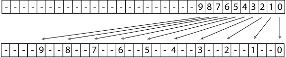

[toc]

# 4 Primitives and Intersection Acceleration / 图元和相交加速

The classes described in the last chapter focus exclusively on representing geometric properties of 3D objects. Although the Shape class provides a convenient abstraction for geometric operations such as intersection and bounding, it doesn’t contain enough information to fully describe an object in a scene. For example, it is necessary to bind material properties to each shape in order to specify its appearance. To accomplish these goals, this chapter introduces the Primitive abstract base class and provides a number of implementations.

Shapes to be rendered directly are represented by the GeometricPrimitive class. This class combines a Shape with a description of its appearance properties. So that the geometric and shading portions of pbrt can be cleanly separated, these appearance properties are encapsulated in the Material class, which is described in Chapter 9.

The TransformedPrimitive class handles two more general uses of Shapes in the scene: shapes with animated transformation matrices and object instancing, which can greatly reduce the memory requirements for scenes that contain many instances of the same geometry at different locations (such as the one in Figure 4.1). Implementing each of these features essentially requires injecting an additional transformation matrix between the Shape’s notion of world space and the actual scene world space. Therefore, both are handled by a single class.

上一章中描述的类只专注于表示 3D 对象的几何属性。尽管 Shape 类为诸如相交和边界之类的几何操作提供了方便的抽象，但它没有包含足够的信息来完整描述场景中的对象。例如，必须将材质属性绑定到每个形状以指定其外观。为了实现这些目标，本章介绍了 Primitive 抽象基类并提供了许多实现。

要直接渲染的形状由 GeometricPrimitive 类表示。此类将 Shape 与其外观属性的描述结合在一起。为了使 pbrt 的几何和阴影部分可以干净地分离，这些外观属性被封装在 Material 类中，这在第 9 章中进行了描述。

TransformedPrimitive 类处理场景中形状的两种更通用的用途：具有动画变换矩阵和对象实例化的形状，这可以大大减少在场景不同位置包含许多相同几何体实例的内存需求（例如图4.1)。实现这些特性，本质上都需要在 Shape 的世界空间概念和实际场景世界空间之间，注入一个额外的变换矩阵。因此，两者都由一个类处理。


Figure 4.1: This outdoor scene makes heavy use of instancing as a mechanism for compressing the scene’s description. There are only 24 million unique triangles in the scene, although, thanks to object reuse through instancing, the total geometric complexity is 3.1 billion triangles. (Scene courtesy of Laubwerk.)

图 4.1：这个室外场景大量使用实例作为压缩场景描述的机制。场景中只有 2400 万个独立的三角形，但由于通过实例化进行对象重用，总几何复杂度为 31 亿个三角形。（场景由 Laubwerk 提供。）

This chapter also introduces the Aggregate class, which represents a container that can hold many Primitives. pbrt uses this class as a base for acceleration structures-data structures that help reduce the otherwise $O(n)$ complexity of testing a ray for intersection with all $n$ objects in a scene. Most rays will intersect only a few primitives and miss the others by a large distance. If an intersection acceleration algorithm can reject whole groups of primitives at once, there will be a substantial performance improvement compared to simply testing each ray against each primitive in turn. One benefit from reusing the Primitive interface for these acceleration structures is that it makes it easy to support hybrid approaches where an accelerator of one type holds accelerators of other types.

This chapter describes the implementation of two accelerators, one, BVHAccel, based on building a hierarchy of bounding boxes around objects in the scene, and the second, KdTreeAccel, based on adaptive recursive spatial subdivision. While many other acceleration structures have been proposed, almost all ray tracers today use one of these two. The “Further Reading” section at the end of this chapter has extensive references to other possibilities.

本章还介绍了 Aggregate 类，它表示一个可以容纳许多 Primitives 的容器。 pbrt 使用此类作为加速结构数据结构的基础，这有助于降低测试光线与场景中所有 $n$ 对象相交的复杂性。大多数光线只会与少数图元相交，并且会在很远的距离内错过其他图元。如果相交加速算法可以一次拒绝整组图元，与简单地依次针对每个图元测试每条光线相比，性能将得到显著提高。为这些加速结构重用 Primitive 接口的一个好处是，它可以轻松支持混合方法，其中一种类型的加速器包含其他类型的加速器。

本章描述了两个加速器的实现，一个是 BVHAccel，基于围绕场景中的对象构建包围盒的层次结构，第二个是 KdTreeAccel，基于自适应递归空间细分。虽然已经提出了许多其他加速结构，但今天几乎所有的光线追踪器都使用这两种结构之一。本章末尾的“进一步阅读”部分对其他可能性进行了大量参考。

## 4.1 Primitive Interface and Geometric Primitives / 图元接口和几何图元

The abstract Primitive base class is the bridge between the geometry processing and shading subsystems of pbrt.

抽象的 Primitive 基类是 pbrt 的几何处理和着色子系统之间的桥梁。

```
<<Primitive Declarations>>= 
class Primitive {
public:
    <<Primitive Interface>> 
};
```

There are a number of geometric routines in the Primitive interface, all of which are similar to a corresponding Shape method. The first, Primitive::WorldBound(), returns a box that encloses the primitive’s geometry in world space. There are many uses for such a bound; one of the most important is to place the Primitive in the acceleration data structures.

Primitive 接口中有许多几何代码，所有这些都类似于相应的 Shape 方法。第一个，Primitive::WorldBound()，返回一个盒，该盒在世界空间中包含图元的几何体。这种边界有很多用途；最重要的一项是将 Primitive 放在加速数据结构中。

```
<<Primitive Interface>>= 
virtual Bounds3f WorldBound() const = 0;
```

The next two methods provide ray intersection tests. One difference between the two base classes is that Shape::Intersect() returns the parametric distance along the ray to the intersection in a Float * output variable, while Primitive::Intersect() is responsible for updating Ray::tMax with this value if an intersection is found.

接下来的两种方法提供光线相交测试。两个基类之间的一个区别是 Shape::Intersect() 在 Float * 输出变量中返回沿着光线到交点的参数距离，而 Primitive::Intersect() 负责如果找到交点，用这个值更新 Ray::tMax。

```
<<Primitive Interface>>+=  
virtual bool Intersect(const Ray &r, SurfaceInteraction *) const = 0;
virtual bool IntersectP(const Ray &r) const = 0;
```

Upon finding an intersection, the Primitive’s Intersect() method is also responsible for initializing additional SurfaceInteraction member variables, including a pointer to the Primitive that the ray hit.

找到交点后，Primitive 的 Intersect() 方法还负责初始化额外的 SurfaceInteraction 成员变量，包括指向光线击中的 Primitive 的指针。

```
<<SurfaceInteraction Public Data>>+=  
const Primitive *primitive = nullptr;
```

Primitive objects have a few methods related to non-geometric properties as well. The first, Primitive::GetAreaLight(), returns a pointer to the AreaLight that describes the primitive’s emission distribution, if the primitive is itself a light source. If the primitive is not emissive, this method should return nullptr.

图元对象也有一些与非几何属性相关的方法。第一个，Primitive::GetAreaLight()，返回一个指向 AreaLight 的指针，如果图元本身是一个光源，它描述了图元的发射分布。如果图元不是自发光的，则此方法应返回 nullptr。

```
<<Primitive Interface>>+=  
virtual const AreaLight *GetAreaLight() const = 0;
```

GetMaterial() returns a pointer to the material instance assigned to the primitive. If nullptr is returned, ray intersections with the primitive should be ignored; the primitive only serves to delineate a volume of space for participating media. This method is also used to check if two rays have intersected the same object by comparing their Material pointers.

GetMaterial() 返回一个指向分配给图元的材质实例的指针。如果返回 nullptr，则光线与图元的相交应忽略；图元仅用于为参与介质描绘空间体积。此方法还用于通过比较它们的材质指针，来检查两条光线是否与同一对象相交。

```
<<Primitive Interface>>+=  
virtual const Material *GetMaterial() const = 0;
```

The third material-related method, ComputeScatteringFunctions(), initializes representations of the light-scattering properties of the material at the intersection point on the surface. The BSDF object (introduced in Section 9.1) describes local light-scattering properties at the intersection point. If applicable, this method also initializes a BSSRDF, which describes subsurface scattering inside the primitive—light that enters the surface at points far from where it exits. While subsurface light transport has little effect on the appearance of objects like metal, cloth, or plastic, it is the dominant light-scattering mechanism for biological materials like skin, thick liquids like milk, etc. The BSSRDF is supported by an extension of the path tracing algorithm discussed in Section 15.

In addition to a MemoryArena to allocate memory for the BSDF and/or BSSRDF, this method takes a TransportMode enumerant that indicates whether the ray path that found this intersection point started from the camera or from a light source; as will be discussed further in Section 16.1, this detail has important implications for how some parts of material models are evaluated. The allowMultipleLobes parameter controls a detail of how some types of BRDFs are represented; it is discussed further in Section 9.2. Section 9.1.1 discusses the use of the MemoryArena for BSDF memory allocation in more detail.

第三个与材质相关的方法 ComputeScatteringFunctions()，初始化材质在表面交点处的光散射特性的表现。 BSDF 对象（在第 9.1 节中介绍）描述了交点处的局部光散射特性。如果适用，此方法还会初始化一个 BSSRDF，它描述图元内部的次表面散射 - 光从远离其进入表面的点离开。虽然次表面光传输对金属、布料或塑料等物体的外观影响不大，但它是生物材质（如皮肤、牛奶等粘稠液体等）的主要光散射机制。 BSSRDF 在第 15 节路径跟踪算法中讨论。

除了为 BSDF 和/或 BSSRDF 分配内存的 MemoryArena 之外，此方法还采用 TransportMode 枚举，指示找到此交点的光线路径是从相机还是从光源开始；正如将在 16.1 节中进一步讨论的那样，这个细节对于如何计算材质模型的某些部分具有重要意义。allowMultipleLobes 参数控制如何表示某些类型的 BRDF 的详细信息；它在第 9.2 节中进一步讨论。第 9.1.1 节更详细地讨论了使用 MemoryArena 进行 BSDF 内存分配。

```
<<Primitive Interface>>+= 
virtual void ComputeScatteringFunctions(SurfaceInteraction *isect,
    MemoryArena &arena, TransportMode mode,
    bool allowMultipleLobes) const = 0;
```

The BSDF and BSSRDF pointers for the point are stored in the SurfaceInteraction passed to ComputeScatteringFunctions().

该点的 BSDF 和 BSSRDF 指针存储在 SurfaceInteraction 中，传递给 ComputeScatteringFunctions() 。

```
<<SurfaceInteraction Public Data>>+=  
BSDF *bsdf = nullptr;
BSSRDF *bssrdf = nullptr;
```

### 4.1.1 Geometric Primitives / 几何图元

The GeometricPrimitive class represents a single shape (e.g., a sphere) in the scene. One GeometricPrimitive is allocated for each shape in the scene description provided by the user. This class is implemented in the files core/primitive.h and core/primitive.cpp.

GeometricPrimitive 类表示场景中的单个形状（例如，球体）。为用户提供的场景描述中的每个形状分配一个 GeometricPrimitive。此类在文件 core/primitive.h 和 core/primitive.cpp 中实现。

```
<<GeometricPrimitive Declarations>>= 
class GeometricPrimitive : public Primitive {
public:
    <<GeometricPrimitive Public Methods>> 
private:
    <<GeometricPrimitive Private Data>> 
};
```

Each GeometricPrimitive holds a reference to a Shape and its Material. In addition, because primitives in pbrt may be area light sources, it stores a pointer to an AreaLight object that describes its emission characteristics (this pointer is set to nullptr if the primitive does not emit light). Finally, the MediumInterface attribute encodes information about the participating media on the inside and outside of the primitive.

每个 GeometricPrimitive 都有一个对 Shape 及其材质的引用。此外，由于 pbrt 中的图元可能是面光源，因此它存储了一个指向 AreaLight 对象的指针，该对象描述了其发射特性（如果图元不发光，则该指针设置为 nullptr）。最后，MediumInterface 属性对有关图元内部和外部参与介质的信息进行编码。

```
<<GeometricPrimitive Private Data>>= 
std::shared_ptr<Shape> shape;
std::shared_ptr<Material> material;
std::shared_ptr<AreaLight> areaLight;
MediumInterface mediumInterface;
```

The GeometricPrimitive constructor just initializes these variables from the parameters passed to it. It’s straightforward, so we don’t include it here.

Most of the methods of the Primitive interface related to geometric processing are simply forwarded to the corresponding Shape method. For example, GeometricPrimitive::Intersect() calls the Shape::Intersect() method of its enclosed Shape to do the actual intersection test and initialize a SurfaceInteraction to describe the intersection, if any. It also uses the returned parametric hit distance to update the Ray::tMax member. The advantage of storing the distance to the closest hit in Ray::tMax is that this makes it easy to avoid performing intersection tests with any primitives that lie farther along the ray than any already-found intersections.

GeometricPrimitive 构造函数只是根据传递给它的参数初始化这些变量。这很简单，所以我们不包括在这里。

Primitive 接口中与几何处理相关的大部分方法，都只是简单的转发给对应的Shape 方法。例如， GeometricPrimitive::Intersect() 调用其内部 Shape 的 Shape::Intersect() 方法来进行实际的相交测试，并初始化 SurfaceInteraction 来描述交点（如果有）。它还使用返回的参数命中距离来更新 Ray::tMax 成员。在 Ray::tMax 中存储到最近命中点的距离的优点在于，可以轻松避免沿光线越过任何已找到的交点，与更远的图元执行相交测试。

```
<<GeometricPrimitive Method Definitions>>= 
bool GeometricPrimitive::Intersect(const Ray &r,
        SurfaceInteraction *isect) const {
    Float tHit;
    if (!shape->Intersect(r, &tHit, isect))
        return false;
    r.tMax = tHit;
    isect->primitive = this;
    <<Initialize SurfaceInteraction::mediumInterface after Shape intersection>> 
    return true;
}
```

We won’t include the implementations of the GeometricPrimitive’s WorldBound() or IntersectP() methods here; they just forward these requests on to the Shape in a similar manner. Similarly, GetAreaLight() just returns the GeometricPrimitive::areaLight member.

Finally, the ComputeScatteringFunctions() method just forwards the request on to the Material.

我们不会在这里包含 GeometricPrimitive 的 WorldBound() 或 IntersectP() 方法的实现；他们只是以类似的方式将这些请求转发给 Shape。同样，GetAreaLight() 只返回 GeometricPrimitive::areaLight 成员。

最后，ComputeScatteringFunctions() 方法只是将请求转发到材质。

```
<<GeometricPrimitive Method Definitions>>+= 
void GeometricPrimitive::ComputeScatteringFunctions(
        SurfaceInteraction *isect, MemoryArena &arena, TransportMode mode,
        bool allowMultipleLobes) const {
    if (material)
        material->ComputeScatteringFunctions(isect, arena, mode,
            allowMultipleLobes);
}
```

### 4.1.2 TransformedPrimitive: Object Instancing and Animated Primitives / TransformedPrimitive：对象实例化和动画图元

TransformedPrimitive holds a single Primitive and also includes an AnimatedTransform that is injected in between the underlying primitive and its representation in the scene. This extra transformation enables two useful features: object instancing and primitives with animated transformations.

Object instancing is a classic technique in rendering that reuses transformed copies of a single collection of geometry at multiple positions in a scene. For example, in a model of a concert hall with thousands of identical seats, the scene description can be compressed substantially if all of the seats refer to a shared geometric representation of a single seat. The ecosystem scene in Figure 4.1 has 23,241 individual plants of various types, although only 31 unique plant models. Because each plant model is instanced multiple times with a different transformation for each instance, the complete scene has a total of 3.1 billion triangles, although only 24 million triangles are stored in memory, thanks to primitive reuse through object instancing. pbrt uses just over 7 GB of memory when rendering this scene with object instancing (1.7 GB for BVHs, 2.3 GB for triangle meshes, and 3 GB for texture maps), but would need upward of 516 GB to render it without instancing.

Animated transformations enable rigid-body animation of primitives in the scene via the AnimatedTransform class. See Figure 2.15 for an image that exhibits motion blur due to animated transformations.

Recall that the Shapes of Chapter 3 themselves had object-to-world transformations applied to them to place them in the scene. If a shape is held by a TransformedPrimitive, then the shape’s notion of world space isn’t the actual scene world space—only after the TransformedPrimitive’s transformation is also applied is the shape actually in world space. For the applications here, it makes sense for the shape to not be at all aware of the additional transformations being applied. For animated shapes, it’s simpler to isolate all of the handling of animated transformations to a single class here, rather than require all Shapes to support AnimatedTransforms. Similarly, for instanced primitives, letting Shapes know all of the instance transforms is of limited utility: we wouldn’t want the TriangleMesh to make a copy of its vertex positions for each instance transformation and transform them all the way to world space, since this would negate the memory savings of object instancing.

TransformedPrimitive 包含一个 Primitive，并且还包括一个 AnimatedTransform，它被注入到基础图元及其在场景中的表示之间。这种额外的变换启用了两个有用的功能：对象实例化和具有动画变换的图元。

对象实例化是一种经典的渲染技术，它在场景中的多个位置重用单个几何体集合的变换副本。例如，在具有数千个相同座位的音乐厅模型中，如果所有座位都参考单个座位的共享几何表示，则场景描述可能会被大幅压缩。图 4.1 中的生态系统场景有 23,241 种不同类型的植物，尽管只有 31 种独特的植物模型。由于每个植物模型都被多次实例化，每个实例都有不同的变换，整个场景总共有 31 亿个三角形，尽管内存中只存储了 2400 万个三角形，这要归功于通过对象实例化进行的图元重用。在使用对象实例化渲染此场景时，pbrt 仅使用超过 7 GB 的内存（BVH 为 1.7 GB，三角形网格为 2.3 GB，纹理为 3 GB），但在不进行实例化的情况下渲染它需要 516 GB 以上的内存。

动画变换通过 AnimatedTransform 类启用场景中图元的刚体动画。请参见图 2.15 了解由于动画变换而表现出运动模糊的图像。

回想一下，第 3 章的 Shapes 本身应用了对象到世界的变换，以将它们放置在场景中。如果一个形状由 TransformedPrimitive 持有，那么这个形状的世界空间概念就不是实际场景的世界空间——只有在 TransformedPrimitive 的变换也被应用之后才是实际在世界空间中的形状。对于这里的应用程序，形状完全不知道正在应用的附加变换是有意义的。对于动画形状，在此处将动画变换的所有处理隔离到单个类中会更简单，而不是要求所有形状都支持 AnimatedTransforms。类似地，对于实例化图元，让 Shapes 知道所有实例变换的效用有限：我们不希望 TriangleMesh 为每个实例变换复制其顶点位置，并将它们一直变换到世界空间，因为这将抵消对象实例化的内存节省。

```
<<TransformedPrimitive Declarations>>= 
class TransformedPrimitive : public Primitive {
public:
    <<TransformedPrimitive Public Methods>> 
private:
    <<TransformedPrimitive Private Data>> 
};
```

The TransformedPrimitive constructor takes a reference to the Primitive that represents the model, and the transformation that places it in the scene. If the geometry is described by multiple Primitives, the calling code is responsible for placing them in an Aggregate implementation so that only a single Primitive needs to be stored here. For the code that creates aggregates as needed, see the pbrtObjectInstance() function in Section A.3.6 of Appendix B for the case of primitive instances, and see the pbrtShape() function in Section A.3.5 for animated shapes.

TransformedPrimitive 构造函数使用引用来存储代表模型的 Primitive， 及将其放置在场景中的变换。如果几何体由多个 Primitives 描述，则调用代码负责将它们放置在 Aggregate 实现中，以便只需要在此处存储单个 Primitive。有关根据需要创建聚合的代码，请参阅附录 B 第 A.3.6 节中的 pbrtObjectInstance() 函数，以了解图元实例化的情况，并参阅第 A.3.5 节中的 pbrtShape() 函数了解动画形状。

```
<<TransformedPrimitive Public Methods>>= 
TransformedPrimitive(std::shared_ptr<Primitive> &primitive,
        const AnimatedTransform &PrimitiveToWorld)
    : primitive(primitive), PrimitiveToWorld(PrimitiveToWorld) { }
<<TransformedPrimitive Private Data>>= 
std::shared_ptr<Primitive> primitive;
const AnimatedTransform PrimitiveToWorld;
```

The key task of the TransformedPrimitive is to bridge the Primitive interface that it implements and the Primitive that it holds a pointer to, accounting for the effects of the additional transformation that it holds. The TransformedPrimitive’s PrimitiveToWorld transformation defines the transformation from the coordinate system of this particular instance of the geometry to world space. If the primitive member has its own transformation, that should be interpreted as the transformation from object space to the TransformedPrimitive’s coordinate system. The complete transformation to world space requires both of these transformations together.

As such, the TransformedPrimitive::Intersect() method transforms the given ray to the primitive’s coordinate system and passes the transformed ray to its Intersect() routine. If a hit is found, the tMax value from the transformed ray needs to be copied into the ray r originally passed to the Intersect() routine.

TransformedPrimitive 的关键任务是桥接它实现的 Primitive 接口和它持有的 Primitive 指针，并考虑到它持有的附加变换的影响。 TransformedPrimitive的PrimitiveToWorld变换定义了，从这个特定几何体实例的坐标系到世界空间的变换。如果图元成员有自己的变换，则应将其解释为从对象空间到 TransformedPrimitive 坐标系的变换。到世界空间的完全变换，需要同时进行这两种变换。

因此，TransformedPrimitive::Intersect() 方法将给定的光线变换到图元的坐标系，并将变换后的光线传递到其 Intersect() 代码。如果找到命中，则需要将变换后的光线的 tMax 值，复制到最初传递给 Intersect() 代码的光线 r 中。

```
<<TransformedPrimitive Method Definitions>>= 
bool TransformedPrimitive::Intersect(const Ray &r, 
        SurfaceInteraction *isect) const {
    <<Compute ray after transformation by PrimitiveToWorld>> 
    if (!primitive->Intersect(ray, isect))
        return false;
    r.tMax = ray.tMax;
    <<Transform instance’s intersection data to world space>> 
    return true;
}
```

To transform the ray, we need to interpolate the transformation based on the ray’s time. Although we want to transform the ray r from world space to primitive space, here we actually interpolate PrimitiveToWorld and then invert the resulting Transform to get the transformation. This surprising approach is necessary because of how the polar decomposition-based transformation interpolation algorithm in Section 2.9.3 works: interpolating PrimitiveToWorld to some time and inverting it doesn’t necessarily give the same result as interpolating its inverse, the animated world to primitive transformation, directly. Because Primitive::WorldBound() uses PrimitiveToWorld to compute the primitive’s bounding box, we must also interpolate PrimitiveToWorld here for consistency.

要变换光线，我们需要根据光线的时间对变换进行插值。虽然我们想将光线 r 从世界空间变换到图元空间，但这里我们实际上是对 PrimitiveToWorld 进行插值，然后将得到的 Transform 取反得到变换。这种令人惊讶的方法是必要的，因为第 2.9.3 节中的基于极坐标分解的变换插值算法也是这样工作的：将PrimitiveToWorld用某个时间插值，并反转它不一定会得到与直接插值其逆（世界到图元的动画变换）相同的结果。因为 Primitive::WorldBound() 使用 PrimitiveToWorld 来计算图元的包围盒，我们还必须在此处插值 PrimitiveToWorld 以保持一致性。

```
<<Compute ray after transformation by PrimitiveToWorld>>= 
Transform InterpolatedPrimToWorld;
PrimitiveToWorld.Interpolate(r.time, &InterpolatedPrimToWorld);
Ray ray = Inverse(InterpolatedPrimToWorld)(r);
```

Finally, the SurfaceInteraction at the intersection point needs to be transformed to world space; the primitive’s intersection member will already have transformed the SurfaceInteraction to its notion of world space, so here we only need to apply the effect of the additional transformation held here.

最后，交点处的SurfaceInteraction需要变换到世界空间；图元的相交成员已经将 SurfaceInteraction 变换为它的世界空间概念，所以这里我们只需要应用这里保存的附加变换的效果。

```
<<Transform instance’s intersection data to world space>>= 
if (!InterpolatedPrimToWorld.IsIdentity())
    *isect = InterpolatedPrimToWorld(*isect);
```

The rest of the geometric Primitive methods are forwarded on to the shared instance, with the results similarly transformed as needed by the TransformedPrimitive’s transformation.

其余的几何 Primitive 方法被转发到共享实例，结果根据 TransformedPrimitive 的变换的需要进行类似的变换。

```
<<TransformedPrimitive Public Methods>>+= 
Bounds3f WorldBound() const { 
    return PrimitiveToWorld.MotionBounds(primitive->WorldBound());
}
```

The TransformedPrimitive GetAreaLight(), GetMaterial(), and ComputeScattering Functions() methods should never be called. The corresponding methods of the primitive that the ray actually hit should always be called instead. Therefore, any attempt to call the TransformedPrimitive implementations of these methods (not shown here) results in a run-time error.

永远不应调用 TransformedPrimitive GetAreaLight()、GetMaterial() 和 ComputeScattering Functions() 方法。应该始终调用光线实际击中的图元的相应方法。因此，任何调用这些方法（此处未显示）的 TransformedPrimitive 实现的尝试都会导致运行时错误。

## 4.2 Aggregates / 聚合体

Acceleration structures are one of the components at the heart of any ray tracer. Without algorithms to reduce the number of unnecessary ray intersection tests, tracing a single ray through a scene would take time linear in the number of primitives in the scene, since the ray would need to be tested against each primitive in turn to find the closest intersection. However, doing so is extremely wasteful in most scenes, since the ray passes nowhere near the vast majority of primitives. The goals of acceleration structures are to allow the quick, simultaneous rejection of groups of primitives and to order the search process so that nearby intersections are likely to be found first so that farther away ones can potentially be ignored.

Because ray–object intersections can account for the bulk of execution time in ray tracers, there has been a substantial amount of research into algorithms for ray intersection acceleration. We will not try to explore all of this work here but refer the interested reader to references in the “Further Reading” section at the end of this chapter and in particular Arvo and Kirk’s chapter in An Introduction to Ray Tracing (Glassner 1989a), which has a useful taxonomy for classifying different approaches to ray-tracing acceleration.

Broadly speaking, there are two main approaches to this problem: spatial subdivision and object subdivision. Spatial subdivision algorithms decompose 3D space into regions (e.g., by superimposing a grid of axis-aligned boxes on the scene) and record which primitives overlap which regions. In some algorithms, the regions may also be adaptively subdivided based on the number of primitives that overlap them. When a ray intersection needs to be found, the sequence of these regions that the ray passes through is computed and only the primitives in the overlapping regions are tested for intersection.

加速结构是任何光线追踪器的核心组件之一。如果没有算法来减少不必要的光线相交测试的数量，那么在场景中跟踪单条光线将花费与场景中图元数量成线性关系的时间，因为需要依次针对每个图元测试光线以找到最近的交点。然而，在大多数场景中这样做是非常浪费的，因为光线远未通过绝大多数图元。加速结构的目标是允许快速、同时拒绝图元组，并对搜索过程进行排序，以便可能首先找到附近的交点，从而可能忽略较远的交点。

由于光线与对象相交可以占光线追踪器的大部分执行时间，因此对光线相交加速算法进行了大量研究。我们不会尝试在这里探索所有这些工作，而是让感兴趣的读者参考本章末尾“进一步阅读”部分中的参考资料，特别是 Arvo 和 Kirk 在光线追踪介绍 (Glassner 1989a) 中的章节，其中有一个有用的分类法来对光线追踪加速的不同方法进行分类。

从广义上讲，这个问题有两种主要的方法：空间细分和对象细分。空间细分算法将 3D 空间分解为区域（例如，通过在场景上叠加轴对齐盒的网格）并记录哪些图元与哪些区域重叠。在某些算法中，还可以根据重叠区域的图元数量对区域进行自适应细分。当需要找到光线相交时，计算光线穿过的这些区域的顺序，并且只测试重叠区域中的图元是否相交。

In contrast, object subdivision is based on progressively breaking the objects in the scene down into smaller sets of constituent objects. For example, a model of a room might be broken down into four walls, a ceiling, and a chair. If a ray doesn’t intersect the room’s bounding volume, then all of its primitives can be culled. Otherwise, the ray is tested against each of them. If it hits the chair’s bounding volume, for example, then it might be tested against each of its legs, the seat, and the back. Otherwise, the chair is culled.

Both of these approaches have been quite successful at solving the general problem of ray intersection computational requirements; there’s no fundamental reason to prefer one over the other. The KdTreeAccel in this chapter is based on the spatial subdivision approach, and the BVHAccel is based on object subdivision.

The Aggregate class provides an interface for grouping multiple Primitive objects together. Because Aggregates themselves implement the Primitive interface, no special support is required elsewhere in pbrt for intersection acceleration. Integrators can be written as if there was just a single Primitive in the scene, checking for intersections without needing to be concerned about how they’re actually found. Furthermore, by implementing acceleration in this way, it is easy to experiment with new acceleration techniques by simply adding a new Aggregate primitive to pbrt.

相比之下，对象细分是基于逐渐将场景中的对象分解为更小的组成对象集。例如，一个房间模型可能被分解为四堵墙、一个天花板和一把椅子。如果光线不与房间的包围体相交，则可以剔除其所有图元。否则，光线会针对它们中的每一个进行测试。例如，如果它碰到椅子的包围体，那么它可能会针对它的每条腿、座椅和靠背进行测试。否则，椅子被剔除。

这两种方法在解决光线相交计算要求的一般问题方面都非常成功；没有根本的理由更喜欢一个。本章中的 KdTreeAccel 是基于空间细分的方法，而 BVHAccel 是基于对象细分的。

Aggregate 类提供了一个用于将多个 Primitive 对象分组在一起的接口。因为聚合本身实现了 Primitive 接口，所以在 pbrt 的其他地方不需要特殊的支持来实现交点加速。积分器可以像场景中只有一个 Primitive 一样编写，检查交点，而无需关心它们实际是如何找到的。此外，通过以这种方式实现加速，只需向 pbrt 添加一个新的 Aggregate 图元，就可以轻松地试验新的加速技术。

```
<<Aggregate Declarations>>= 
class Aggregate : public Primitive {
public:
    <<Aggregate Public Methods>> 
};
```

Like TransformedPrimitives do, the implementation of the Aggregate intersection methods leave the SurfaceInteraction::primitive pointer set to the primitive that the ray actually hit, not the aggregate that holds the primitive. Because pbrt uses this pointer to obtain information about the primitive being hit (its reflection and emission properties), the GetAreaLight(), GetMaterial(), and ComputeScatteringFunctions() methods of Aggregates should never be called, so the implementations of those methods (not shown here) issue a run-time error.

与 TransformedPrimitives 一样，Aggregate 相交方法的实现，将 SurfaceInteraction::primitive 指针设置为光线实际击中的图元，而不是保存图元的聚合。因为 pbrt 使用这个指针来获取被击中的图元的信息（它的反射和发射属性），聚合的 GetAreaLight()、GetMaterial() 和 ComputeScatteringFunctions() 方法不应该被调用，所以这些方法的实现（不是此处显示）发出运行时错误。

## 4.3 Bounding Volume Hierarchies / 包围体层次结构

Bounding volume hierarchies (BVHs) are an approach for ray intersection acceleration based on primitive subdivision, where the primitives are partitioned into a hierarchy of disjoint sets. (In contrast, spatial subdivision generally partitions space into a hierarchy of disjoint sets.) Figure 4.2 shows a bounding volume hierarchy for a simple scene. Primitives are stored in the leaves, and each node stores a bounding box of the primitives in the nodes beneath it. Thus, as a ray traverses through the tree, any time it doesn’t intersect a node’s bounds, the subtree beneath that node can be skipped.

包围体层次结构 (BVH) 是一种基于图元细分的光线相交加速方法，其中图元被划分为不相相交的层次结构。 （相比之下，空间细分通常将空间划分为不相相交的层次结构。）图 4.2 显示了一个简单场景的包围体层次结构。图元存储在叶子中，每个节点在其下方的节点中存储图元的包围盒。因此，当光线穿过树时，只要它不与节点的边界相交，就可以跳过该节点下的子树。


Figure 4.2: Bounding Volume Hierarchy for a Simple Scene. (a) A small collection of primitives, with bounding boxes shown by dashed lines. The primitives are aggregated based on proximity; here, the sphere and the equilateral triangle are bounded by another bounding box before being bounded by a bounding box that encompasses the entire scene (both shown in solid lines). (b) The corresponding bounding volume hierarchy. The root node holds the bounds of the entire scene. Here, it has two children, one storing a bounding box that encompasses the sphere and equilateral triangle (that in turn has those primitives as its children) and the other storing the bounding box that holds the skinny triangle.

图 4.2：简单场景的包围体层次结构。 (a) 一小部分图元，包围盒用虚线表示。图元是基于邻近度聚合的；此处，球体和等边三角形由另一个包围盒包围，然后由包含整个场景的包围盒包围（均以实线显示）。 (b) 相应的包围体层次结构。根节点包含整个场景的边界。在这里，它有两个孩子，一个存储包含球体和等边三角形的包围盒（反过来，这些图元作为它的孩子），另一个存储包含瘦三角形的包围盒。

One property of primitive subdivision is that each primitive appears in the hierarchy only once. In contrast, a primitive may overlap multiple spatial regions with spatial subdivision and thus may be tested for intersection multiple times as the ray passes through them. Another implication of this property is that the amount of memory needed to represent the primitive subdivision hierarchy is bounded. For a binary BVH that stores a single primitive in each leaf, the total number of nodes is $2 n-1$, where $n$ is the number of primitives. There will be $n$ leaf nodes and $n-1$ interior nodes. If leaves store multiple primitives, fewer nodes are needed.

BVHs are more efficient to build than kd-trees, which generally deliver slightly faster ray intersection tests than BVHs but take substantially longer to build. On the other hand, BVHs are generally more numerically robust and less prone to missed intersections due to round-off errors than kd-trees are.

The BVH accelerator, BVHAccel, is defined in accelerators/bvh.h and accelerators/bvh.cpp. In addition to the primitives to be stored and the maximum number of primitives that can be in any leaf node, its constructor takes an enumerant value that describes which of four algorithms to use when partitioning primitives to build the tree. The default, SAH, indicates that an algorithm based on the “surface area heuristic,” discussed in Section 4.3.2, should be used. An alternative, HLBVH, which is discussed in Section 4.3.3, can be constructed more efficiently (and more easily parallelized), but it doesn’t build trees that are as effective as SAH. The remaining two approaches use even less computation to build the tree but create fairly low-quality trees.

图元细分的一个特性是每个图元在层次结构中只出现一次。相比之下，一个图元可以通过空间细分与多个空间区域重叠，因此可以在光线穿过它们时多次测试相交。此属性的另一个含义是表示图元细分层次结构所需的内存量是有界的。对于在每个叶子中存储单个图元的二进制 BVH，节点总数为 $2 n-1$ ，其中 $n$ 是图元的数量。将有 $n$ 个叶子节点和 $n-1$ 个内部节点。如果叶子存储多个图元，则需要更少的节点。

BVHs 比 kd-trees 更有效地构造，kd-trees 通常比 BVHs 提供稍快的光线相交测试，但构造时间要长得多。另一方面，与 kd-tree相比，BVH 通常在数值上更稳健，并且由于舍入误差而更不容易错过交点。

BVH 加速器 BVHAccel 在accelerators/bvh.h 和accelerators/bvh.cpp 中定义。除了要存储的图元和可以在任何叶子节点中的最大图元数之外，其构造函数还采用一个枚举值，该值描述了在对图元进行分区以构造树时要使用的四种算法中的哪一种。默认值 SAH 表示应该使用基于“表面积启发式”的算法，在第 4.3.2 节中讨论过。 4.3.3 节中讨论的替代方法 HLBVH 可以更有效地构造（并且更容易并行化），但它无法构造与 SAH 一样有效的树。其余两种方法使用更少的计算来构造树，但创建的树质量相当低。

```
<<BVHAccel Public Types>>= 
enum class SplitMethod { SAH, HLBVH, Middle, EqualCounts };
<<BVHAccel Method Definitions>>= 
BVHAccel::BVHAccel(const std::vector<std::shared_ptr<Primitive>> &p,
         int maxPrimsInNode, SplitMethod splitMethod)
     : maxPrimsInNode(std::min(255, maxPrimsInNode)), primitives(p),
       splitMethod(splitMethod) {
    if (primitives.size() == 0)
        return;
    <<Build BVH from primitives>> 
}

<<BVHAccel Private Data>>= 
const int maxPrimsInNode;
const SplitMethod splitMethod;
std::vector<std::shared_ptr<Primitive>> primitives;
```

### 4.3.1 BVH Construction / BVH构造

There are three stages to BVH construction in the implementation here. First, bounding information about each primitive is computed and stored in an array that will be used during tree construction. Next, the tree is built using the algorithm choice encoded in splitMethod. The result is a binary tree where each interior node holds pointers to its children and each leaf node holds references to one or more primitives. Finally, this tree is converted to a more compact (and thus more efficient) pointerless representation for use during rendering. (The implementation is more straightforward with this approach, versus computing the pointerless representation directly during tree construction, which is also possible.)

此处的实施中 BVH 的构造分为三个阶段。首先，计算每个图元的边界信息并将其存储在一个数组中，该数组将在树构造期间使用。接下来，使用在 splitMethod 中编码的算法选择构造树。结果是一棵二叉树，其中每个内部节点都持有指向其子节点的指针，每个叶子节点都持有对一个或多个图元的引用。最后，这棵树被转换为更紧凑（因此更有效）的无指针表示，以在渲染期间使用。 （与在树构造期间直接计算无指针表示相比，这种方法的实现更直接，这也是可能的。）

```
<<Build BVH from primitives>>= 
<<Initialize primitiveInfo array for primitives>> 
<<Build BVH tree for primitives using primitiveInfo>> 
<<Compute representation of depth-first traversal of BVH tree>> 
```

For each primitive to be stored in the BVH, we store the centroid of its bounding box, its complete bounding box, and its index in the primitives array in an instance of the BVHPrimitiveInfo structure.

对于要存储在 BVH 中的每个图元，我们将其包围盒的质心、完整的包围盒及其在 BVHPrimitiveInfo 结构实例中的图元数组中的索引存储。

```
<<Initialize primitiveInfo array for primitives>>= 
std::vector<BVHPrimitiveInfo> primitiveInfo(primitives.size());
for (size_t i = 0; i < primitives.size(); ++i)
    primitiveInfo[i] = { i, primitives[i]->WorldBound() };
<<BVHAccel Local Declarations>>= 
struct BVHPrimitiveInfo {
    BVHPrimitiveInfo(size_t primitiveNumber, const Bounds3f &bounds)
        : primitiveNumber(primitiveNumber), bounds(bounds),
          centroid(.5f * bounds.pMin + .5f * bounds.pMax) { }
    size_t primitiveNumber;
    Bounds3f bounds;
    Point3f centroid;
};
```

Hierarchy construction can now begin. If the HLBVH construction algorithm has been selected, HLBVHBuild() is called to build the tree. The other three construction algorithms are all handled by recursiveBuild(). The initial calls to these functions are passed all of the primitives to be stored in the tree. They return a pointer to the root of the tree, which is represented with the BVHBuildNode structure. Tree nodes should be allocated with the provided MemoryArena, and the total number created should be stored in *totalNodes.

One important side effect of the tree construction process is that a new array of pointers to primitives is returned via the orderedPrims parameter; this array stores the primitives ordered so that the primitives in leaf nodes occupy contiguous ranges in the array. It is swapped with the original primitives array after tree construction.

现在可以开始层次结构的构造。如果选择了 HLBVH 构造算法，则调用 HLBVHBuild() 来构造树。其他三种构造算法均由 recursiveBuild() 处理。对这些函数的初始调用传递了所有要存储在树中的图元。它们返回一个指向树根的指针，用 BVHBuildNode 结构表示。应使用提供的 MemoryArena 分配树节点，并将创建的总数存储在 *totalNodes 中。

树构造过程的一个重要副作用是，通过orderedPrims 参数返回了一个新的指向图元的指针数组；这个数组存储有序的图元，以便叶子节点中的图元占据数组中的连续范围。树构造后，它与原始图元数组交换。

```
<<Build BVH tree for primitives using primitiveInfo>>= 
MemoryArena arena(1024 * 1024);
int totalNodes = 0;
std::vector<std::shared_ptr<Primitive>> orderedPrims;
BVHBuildNode *root;
if (splitMethod == SplitMethod::HLBVH)
    root = HLBVHBuild(arena, primitiveInfo, &totalNodes, orderedPrims);
else
    root = recursiveBuild(arena, primitiveInfo, 0, primitives.size(),
                          &totalNodes, orderedPrims);
primitives.swap(orderedPrims);
```

Each BVHBuildNode represents a node of the BVH. All nodes store a Bounds3f, which represents the bounds of all of the children beneath the node. Each interior node stores pointers to its two children in children. Interior nodes also record the coordinate axis along which primitives were partitioned for distribution to their two children; this information is used to improve the performance of the traversal algorithm. Leaf nodes need to record which primitive or primitives are stored in them; the elements of the BVHAccel::primitives array from the offset firstPrimOffset up to but not including $firstPrimOffset + nPrimitives$ are the primitives in the leaf. (Hence the need for reordering the primitives array, so that this representation can be used, rather than, for example, storing a variable-sized array of primitive indices at each leaf node.)

每个 BVHBuildNode 代表 BVH 的一个节点。所有节点都存储一个 Bounds3f，它表示节点下所有子节点的边界。每个内部节点将指向它的两个子节点的指针存储在子节点中。内部节点还记录坐标轴，图元沿该坐标轴进行分区以分配给它们的两个子节点；该信息用于提高遍历算法的性能。叶子节点需要记录其中存储了哪些图元或图元们； BVHAccel::primitives 数组中偏移量 $[firstPrimOffset, firstPrimOffset + nPrimitives)$ 的元素是叶中的图元。 （因此需要重新排序图元数组，以便可以使用这种表示，而不是在每个叶子节点存储可变大小的图元索引数组。）

```
<<BVHAccel Local Declarations>>+=  
struct BVHBuildNode {
    <<BVHBuildNode Public Methods>> 
    Bounds3f bounds;
    BVHBuildNode *children[2];
    int splitAxis, firstPrimOffset, nPrimitives;
};
```

We’ll distinguish between leaf and interior nodes by whether their children pointers have the value nullptr or not, respectively.

我们将分别通过它们的子节点指针是否具有 nullptr 值来区分叶子节点和内部节点。

```
<<BVHBuildNode Public Methods>>= 
void InitLeaf(int first, int n, const Bounds3f &b) {
    firstPrimOffset = first;
    nPrimitives = n;
    bounds = b;
    children[0] = children[1] = nullptr;
}
```

The InitInterior() method requires that the two children nodes already have been created, so that their pointers can be passed in. This requirement makes it easy to compute the bounds of the interior node, since the children bounds are immediately available.

InitInterior() 方法要求已经创建了两个子节点，以便可以传入它们的指针。此要求使得计算内部节点的边界变得容易，因为子边界立即可用。

```
<<BVHBuildNode Public Methods>>+= 
void InitInterior(int axis, BVHBuildNode *c0, BVHBuildNode *c1) {
    children[0] = c0;
    children[1] = c1;
    bounds = Union(c0->bounds, c1->bounds);
    splitAxis = axis;
    nPrimitives = 0;
}
```

In addition to a MemoryArena used for allocating nodes and the array of BVHPrimitiveInfo structures, recursiveBuild() takes as parameters the range [start, end). It is responsible for returning a BVH for the subset of primitives represented by the range from primitiveInfo[start] up to and including primitiveInfo[end-1]. If this range covers only a single primitive, then the recursion has bottomed out and a leaf node is created. Otherwise, this method partitions the elements of the array in that range using one of the partitioning algorithms and reorders the array elements in the range accordingly, so that the ranges from [start,mid) and [mid, end) represent the partitioned subsets. If the partitioning is successful, these two primitive sets are in turn passed to recursive calls that will themselves return pointers to nodes for the two children of the current node.

totalNodes tracks the total number of BVH nodes that have been created; this number is used so that exactly the right number of the more compact LinearBVHNodes can be allocated later. Finally, the orderedPrims array is used to store primitive references as primitives are stored in leaf nodes of the tree. This array is initially empty; when a leaf node is created, recursiveBuild() adds the primitives that overlap it to the end of the array, making it possible for leaf nodes to just store an offset into this array and a primitive count to represent the set of primitives that overlap it. Recall that when tree construction is finished, BVHAccel::primitives is replaced with the ordered primitives array created here.

除了用于分配节点的 MemoryArena 和 BVHPrimitiveInfo 结构数组之外，recursiveBuild() 将范围 [start, end) 作为参数。它负责为由primitiveInfo[start] 到 primitiveInfo[end-1] 的范围表示的图元子集返回BVH。如果此范围仅涵盖单个图元，则递归已触底并创建叶子节点。否则，此方法使用分区算法之一对该范围内的数组元素进行分区，并相应地对范围内的数组元素重新排序，以便从 [start,mid) 和 [mid, end) 开始的范围代表分区的子集。如果分区成功，这两个图元集将依次传递给递归调用，递归调用本身将返回指向当前节点的两个子节点的节点指针。

totalNodes 跟踪已创建的 BVH 节点总数；使用这个数字是为了稍后可以分配更紧凑的 LinearBVHNodes 的正确数量。最后，orderedPrims 数组用于存储图元引用，因为图元存储在树的叶子节点中。这个数组最初是空的；创建叶子节点时，recursiveBuild() 将与其重叠的图元添加到数组的末尾，从而使叶子节点可以仅将偏移量存储到该数组中，并使用图元计数来表示与其重叠的图元集。回想一下，当树构造完成时， BVHAccel::primitives 被替换为此处创建的有序图元数组。

```
<<BVHAccel Method Definitions>>+=  
BVHBuildNode *BVHAccel::recursiveBuild(MemoryArena &arena,
        std::vector<BVHPrimitiveInfo> &primitiveInfo, int start,
        int end, int *totalNodes,
        std::vector<std::shared_ptr<Primitive>> &orderedPrims) {
    BVHBuildNode *node = arena.Alloc<BVHBuildNode>();
    (*totalNodes)++;
    <<Compute bounds of all primitives in BVH node>> 
    int nPrimitives = end - start;
    if (nPrimitives == 1) {
        <<Create leaf BVHBuildNode>> 
    } else {
        <<Compute bound of primitive centroids, choose split dimension dim>> 
        <<Partition primitives into two sets and build children>> 
    }
    return node;
}

<<Compute bounds of all primitives in BVH node>>= 
Bounds3f bounds;
for (int i = start; i < end; ++i)
    bounds = Union(bounds, primitiveInfo[i].bounds);
```

At leaf nodes, the primitives overlapping the leaf are appended to the orderedPrims array and a leaf node object is initialized.

在叶子节点处，与叶重叠的图元被附加到orderedPrims 数组，并初始化叶子节点对象。

```
<<Create leaf BVHBuildNode>>= 
int firstPrimOffset = orderedPrims.size();
for (int i = start; i < end; ++i) {
    int primNum = primitiveInfo[i].primitiveNumber;
    orderedPrims.push_back(primitives[primNum]);
}
node->InitLeaf(firstPrimOffset, nPrimitives, bounds);
return node;
```

For interior nodes, the collection of primitives must be partitioned between the two children subtrees. Given $n$ primitives, there are in general $2^{(n-1)} -2$ possible ways to partition them into two nonempty groups. In practice when building BVHs, one generally considers partitions along a coordinate axis, meaning that there are about $3 n$ candidate partitions. (Along each axis, each primitive may be put into the first partition or the second partition.)

Here, we choose just one of the three coordinate axes to use in partitioning the primitives. We select the axis associated with the largest extent when projecting the bounding box centroid for the current set of primitives. (An alternative would be to try all three axes and select the one that gave the best result, but in practice this approach works well.) This approach gives good partitions in many scenes; Figure 4.3 illustrates the strategy.

对于内部节点，必须在两个子树之间划分图元集合。给定 $n$ 图元，通常有 $2^{(n-1)} -2$ 可能的方法将它们分成两个非空组。实际上，在构造 BVH 时，通常会考虑沿坐标轴的分区，这意味着大约有 $3 n$ 个候选分区。 （沿每个轴，每个图元可以放入第一个分区或第二个分区。）

在这里，我们只选择三个坐标轴中的一个用于划分图元。在为当前图元集投影包围盒质心时，我们选择与最大范围关联的轴。 （另一种方法是尝试所有三个轴并选择产生最佳结果的轴，但实际上这种方法效果很好。）这种方法在许多场景中都提供了良好的分区；图 4.3 说明了该策略。


Figure 4.3: Choosing the Axis along Which to Partition Primitives. The BVHAccel chooses an axis along which to partition the primitives based on which axis has the largest range of the centroids of the primitives’ bounding boxes. Here, in two dimensions, their extent is largest along the $y$ axis (filled points on the axes), so the primitives will be partitioned in $y$.

图 4.3：选择沿其划分图元的轴。 BVHAccel 选择一个轴，根据哪个轴具有最大范围的图元包围盒的质心，沿该轴对图元进行分区。在这里二维空间中，它们的范围沿 $y$ 轴（轴上的填充点）最大，因此图元将在 $y$ 中进行分区。

The general goal in partitioning here is to select a partition of primitives that doesn’t have too much overlap of the bounding boxes of the two resulting primitive sets—if there is substantial overlap then it will more frequently be necessary to traverse both children subtrees when traversing the tree, requiring more computation than if it had been possible to more effectively prune away collections of primitives. This idea of finding effective primitive partitions will be made more rigorous shortly, in the discussion of the surface area heuristic.

这里分区的一般目标是选择一个图元的分区，它的两个结果图元集的包围盒没有太多重叠——如果有大量重叠，那么在以下情况下遍历树时，将更频繁地需要遍历两个子树，需要更多的计算，而不是更有效地修剪图元集合。在讨论表面积启发式方法时，这种寻找有效图元分区的想法很快就会变得更加严格。

```
<<Compute bound of primitive centroids, choose split dimension dim>>= 
Bounds3f centroidBounds;
for (int i = start; i < end; ++i)
    centroidBounds = Union(centroidBounds, primitiveInfo[i].centroid);
int dim = centroidBounds.MaximumExtent();
```

If all of the centroid points are at the same position (i.e., the centroid bounds have zero volume), then recursion stops and a leaf node is created with the primitives; none of the splitting methods here is effective in that (unusual) case. The primitives are otherwise partitioned using the chosen method and passed to two recursive calls to recursiveBuild().

如果所有质心点都在同一位置（即质心边界的体积为零），则递归停止并使用图元创建叶子节点；在那种（不寻常的）情况下，这里的任何分割方法都不是有效的。图元以其他方式使用所选方法进行分区，并传递给对 recursiveBuild() 的两次递归调用。

```
<<Partition primitives into two sets and build children>>= 
int mid = (start + end) / 2;
if (centroidBounds.pMax[dim] == centroidBounds.pMin[dim]) {
    <<Create leaf BVHBuildNode>> 
} else {
    <<Partition primitives based on splitMethod>> 
    node->InitInterior(dim,
                       recursiveBuild(arena, primitiveInfo, start, mid,
                                      totalNodes, orderedPrims),
                       recursiveBuild(arena, primitiveInfo, mid, end,
                                      totalNodes, orderedPrims));
}
```

We won’t include the code fragment <<*Partition primitives based on splitMethod*>> here; it just uses the value of BVHAccel::splitMethod to determine which primitive partitioning scheme to use. These three schemes will be described in the following few pages.

A simple splitMethod is Middle, which first computes the midpoint of the primitives’ centroids along the splitting axis. This method is implemented in the fragment <<*Partition primitives through node’s midpoint*>>. The primitives are classified into the two sets, depending on whether their centroids are above or below the midpoint. This partitioning is easily done with the std::partition() C++ standard library function, which takes a range of elements in an array and a comparison function and orders the elements in the array so that all of the elements that return true for the given predicate function appear in the range before those that return false for it. std::partition() returns a pointer to the first element that had a false value for the predicate, which is converted into an offset into the primitiveInfo array so that we can pass it to the recursive call. Figure 4.4 illustrates this approach, including cases where it does and does not work well.

If the primitives all have large overlapping bounding boxes, this splitting method may fail to separate the primitives into two groups. In that case, execution falls through to the SplitMethod::EqualCounts approach to try again.

我们不会在此处包含代码片段 <<*Partition primitives based on splitMethod*>> ；它只是使用 BVHAccel::splitMethod 的值来确定要使用的图元分区方案。这三种方案将在以下几页中进行描述。

一个简单的 splitMethod 是 Middle，它首先计算图元质心沿分割轴的中点。该方法在片段 <<*Partition primitives through node’s midpoint*>> 中实现。图元被分为两组，这取决于它们的质心是在中点之上还是之下。使用 std::partition() C++ 标准库函数可以轻松完成此分区，该函数采用数组中的一系列元素和一个比较函数，并对数组中的元素进行排序，以便范围内指定判断函数返回的true元素，都出现在返回的false元素之前。 std::partition() 返回一个指针，该指针指向判断为false的第一个元素，该指针被转换为一个primitiveInfo 数组的偏移量，以便我们可以将它传递给递归调用。图 4.4 说明了这种方法，包括它运行良好和运行不佳的情况。

如果图元都有大的重叠包围盒，这种分割方法可能无法将图元分成两组。在这种情况下，执行会通过 SplitMethod::EqualCounts 方法重试。

```
<<Partition primitives through node’s midpoint>>= 
Float pmid = (centroidBounds.pMin[dim] + centroidBounds.pMax[dim]) / 2;
BVHPrimitiveInfo *midPtr =
    std::partition(&primitiveInfo[start], &primitiveInfo[end-1]+1,
        [dim, pmid](const BVHPrimitiveInfo &pi) {
            return pi.centroid[dim] < pmid;
        });
mid = midPtr - &primitiveInfo[0];
if (mid != start && mid != end)
    break;
```

When splitMethod is SplitMethod::EqualCounts, the <<*Partition primitives into equally sized subsets*>> fragment runs. It partitions the primitives into two equal-sized subsets such that the first half of the $n$ of them are the $n / 2$ with smallest centroid coordinate values along the chosen axis, and the second half are the ones with the largest centroid coordinate values. While this approach can sometimes work well, the case in Figure 4.4(b) is one where this method also fares poorly.

当 splitMethod 是 SplitMethod::EqualCounts 时，<<*Partition primitives into equally sized subsets*>> 片段运行。它将图元分成两个大小相等的子集，使得它们的 $n$ 的前半部分是沿所选轴具有最小质心坐标值的 $n / 2$ ，后半部分是具有最大质心的那些坐标值。虽然这种方法有时效果很好，但图 4.4(b) 中的情况也是这种方法效果不佳的情况。


Figure 4.4: Splitting Primitives Based on the Midpoint of Centroids on an Axis. (a) For some distributions of primitives, such as the one shown here, splitting based on the midpoint of the centroids along the chosen axis (thick blue line) works well. (The bounding boxes of the two resulting primitive groups are shown with dashed lines.) (b) For distributions like this one, the midpoint is a suboptimal choice; the two resulting bounding boxes overlap substantially. (c) If the same group of primitives from (b) is instead split along the line shown here, the resulting bounding boxes are smaller and don’t overlap at all, leading to better performance when rendering.

图 4.4：基于轴上质心的中点分割图元。 (a) 对于某些图元分布，例如此处所示的分布，基于质心沿所选轴（粗蓝线）的中点进行分割效果很好。 （两个结果图元组的包围盒用虚线表示。） (b) 对于这种分布，中点是次优选择；生成的两个包围盒大量重叠。 (c) 如果 (b) 中的同一组图元改为沿此处所示的线分割，则生成的包围盒更小且根本不重叠，从而在渲染时获得更好的性能。

This scheme is also easily implemented with a standard library call, std: :nth_element () . It takes a start, middle, and ending pointer as well as a comparison function. It orders the array so that the element at the middle pointer is the one that would be there if the array was fully sorted, and such that all of the elements before the middle one compare to less than the middle element and all of the elements after it compare to greater than it. This ordering can be done in $O(n)$ time, with $n$ the number of elements, which is more efficient than the $O(n \log n)$ of completely sorting the array.

该方案也可以通过标准库调用 std::nth_element () 轻松实现。它需要一个开始、中间和结束指针，以及一个比较函数。它对数组进行排序，以便中间指针处的元素是数组完全排序时所在的元素，并且中间指针之前的所有元素都小于中间元素，之后的所有元素都大于它。这种排序可以在 $O(n)$ 时间内完成， $n$ 是元素的数量，这比对数组完全排序的 $O(n \log n)$ 效率更高。

```
<<Partition primitives into equally sized subsets>>= 
mid = (start + end) / 2;
std::nth_element(&primitiveInfo[start], &primitiveInfo[mid], 
                 &primitiveInfo[end-1]+1,
    [dim](const BVHPrimitiveInfo &a, const BVHPrimitiveInfo &b) { 
        return a.centroid[dim] < b.centroid[dim];
    });
```

### 4.3.2 The Surface Area Heuristic / 表面积启发式

The two primitive partitioning approaches above can work well for some distributions of primitives, but they often choose partitions that perform poorly in practice, leading to more nodes of the tree being visited by rays and hence unnecessarily inefficient ray–primitive intersection computations at rendering time. Most of the best current algorithms for building acceleration structures for ray-tracing are based on the “surface area heuristic” (SAH), which provides a well-grounded cost model for answering questions like “which of a number of partitions of primitives will lead to a better BVH for ray–primitive intersection tests?,” or “which of a number of possible positions to split space in a spatial subdivision scheme will lead to a better acceleration structure?”

The SAH model estimates the computational expense of performing ray intersection tests, including the time spent traversing nodes of the tree and the time spent on ray–primitive intersection tests for a particular partitioning of primitives. Algorithms for building acceleration structures can then follow the goal of minimizing total cost. Typically, a greedy algorithm is used that minimizes the cost for each single node of the hierarchy being built individually.

The ideas behind the SAH cost model are straightforward: at any point in building an adaptive acceleration structure (primitive subdivision or spatial subdivision), we could just create a leaf node for the current region and geometry. In that case, any ray that passes through this region will be tested against all of the overlapping primitives and will incur a cost of

上述两种图元划分方法可以很好地适用于图元的某些分布，但它们通常选择在实践中表现较差的分区，导致光线访问树的更多节点，从而在渲染时不必要地降低了光线-图元相交计算的效率。当前大多数用于构造光线追踪加速结构的最佳算法都基于“表面积启发式”（SAH），它提供了一个有充分根据的成本模型来回答诸如，“多个图元分区中，哪一个将导致到更好的 BVH 进行光线-图元相交测试？”，或“在空间细分方案中分割空间的众多可能位置，哪一个将导致更好的加速结构？”

SAH 模型估计了执行光线相交测试的计算开销，包括遍历树节点所花费的时间，和用于特定图元分区的光线-图元相交测试所花费的时间。用于构造加速结构的算法可以遵循最小化总成本的目标。通常，使用贪心算法来最小化单独构建的层次结构中每个节点的成本。

SAH 成本模型背后的想法很简单：在构造自适应加速结构（图元细分或空间细分）的任何时候，我们都可以为当前区域和几何创建一个叶子节点。在这种情况下，任何穿过该区域的光线都将针对所有重叠图元进行测试，并将产生

$$
\sum_{i=1}^{N} t_{\text {isect }}(i)
$$

where $N$ is the number of primitives and $t_{\text {isect }}(i)$ is the time to compute a ray-object intersection with the $i$ th primitive.

The other option is to split the region. In that case, rays will incur the cost

其中 $N$ 是图元的数量， $t_{\text {isect }}(i)$ 是计算与第 $i$ 个图元的光线对象相交的时间。

另一种选择是分割区域。在这种情况下，光线将产生成本

$$
c(A, B)=t_{\text {trav }}+p_{A} \sum_{i=1}^{N_{A}} t_{\text {isect }}\left(a_{i}\right)+p_{B} \sum_{i=1}^{N_{B}} t_{\text {isect }}\left(b_{i}\right)
$$

where $t_{\text {trav }}$ is the time it takes to traverse the interior node and determine which of the children the ray passes through, $p_{A}$ and $p_{B}$ are the probabilities that the ray passes through each of the child nodes (assuming binary subdivision), $a_{i}$ and $b_{i}$ are the indices of primitives in the two children nodes, and $N_{A}$ and $N_{B}$ are the number of primitives that overlap the regions of the two child nodes, respectively. The choice of how primitives are partitioned affects both the values of the two probabilities as well as the set of primitives on each side of the split.

In pbrt, we will make the simplifying assumption that $t_{\text {isect }}(i)$ is the same for all of the primitives; this assumption is probably not too far from reality, and any error that it introduces doesn't seem to affect the performance of accelerators very much. Another possibility would be to add a method to Primitive that returned an estimate of the number of CPU cycles its intersection test requires.

The probabilities $p_{A}$ and $p_{B}$ can be computed using ideas from geometric probability. It can be shown that for a convex volume $A$ contained in another convex volume $B$, the conditional probability that a uniformly distributed random ray passing through $B$ will also pass through $A$ is the ratio of their surface areas, $s_{A}$ and $s_{B}$ :

其中 $t_{\text {trav }}$ 是遍历内部节点并确定光线穿过哪些子节点所需的时间， $p_{A}$ 和 $p_{B}$ 是光线穿过每个子节点（假设二元细分）， $a_{i}$ 和 $b_{i}$ 是两个子节点中图元的索引， $N_{A}$ 和 $N_{B }$ 分别是重叠两个子节点区域的图元数。图元如何分区的选择会影响两个概率的值以及分割每一侧的图元集。

在 pbrt 中，我们将简化假设 $t_{\text {isect }}(i)$ 对于所有图元都是相同的；这个假设可能与现实相差不远，它引入的任何错误似乎都不会对加速器的性能产生太大影响。另一种可能性是向 Primitive 添加一个方法，该方法返回其相交测试所需的 CPU 周期数的估计值。

概率 $p_{A}$ 和 $p_{B}$ 可以使用几何概率的思想来计算。可以证明，对于包含在另一个凸体积 $B$ 中的凸体积 $A$ ，均匀分布的随机光线通过 $B$ 也将通过 $A$ 的条件概率是它们的表面积之比， $s_{A}$ 和 $s_{B}$ ：

$$
p(A \mid B)=\frac{s_{A}}{s_{B}}
$$

Because we are interested in the cost for rays passing through the node, we can use this result directly. Thus, if we are considering refining a region of space $A$ such that there are two new subregions with bounds $B$ and $C$ (Figure 4.5), the probability that a ray passing through $A$ will also pass through either of the subregions is easily computed.

因为我们对穿过节点的光线的成本感兴趣，所以我们可以直接使用这个结果。因此，如果我们考虑细化一个空间 $A$ 的区域，使得有两个新的子区域，边界为 $B$ 和 $C$（图 4.5），那么很容易计算穿过 $A$ 的光线，也将通过其中任一的概率子区域的数量。


Figure 4.5: If a node of the bounding hierarchy with surface area $s_{A}$ is split into two children with surface areas $s_{B}$ and $s_{C}$, the probabilities that a ray passing through $A$ also passes through $B$ and $C$ are given by $s_{B} / s_{A}$ and $s_{C} / s_{A}$, respectively.

图 4.5：如果边界层级的一个表面积为 $s_{A}$ 的节点，被分割为两个表面积为 $s_{B}$ 和 $s_{C}$ 的子节点，则光线通过 $A$ 也通过 $B$ 和 $C$ 的概率，由 $s_{B} / s_{A}$ 和 $s_{C} / s_{A}$ 给出。

When splitMethod has the value SplitMethod::SAH, the SAH is used for building the BVH; a partition of the primitives along the chosen axis that gives a minimal SAH cost estimate is found by considering a number of candidate partitions. (This is the default SplitMethod, and it creates the most efficient trees for rendering.) However, once it has refined down to a small handful of primitives, the implementation switches over to partitioning into equally sized subsets. The incremental computational cost for applying the SAH at this point isn’t worthwhile.

当 splitMethod 的值为 SplitMethod::SAH 时，SAH 用于构造 BVH；通过考虑多个候选分区，可以找到沿所选轴的图元分区，该分区给出了最小的 SAH 成本估计。 （这是默认的 SplitMethod，它为渲染创建了最有效的树。）但是，一旦它细化到少数图元，实现就会切换到划分为相同大小的子集。此时应用 SAH 的增量计算成本是不值得的。

```
<<Partition primitives using approximate SAH>>= 
if (nPrimitives <= 4) {
    <<Partition primitives into equally sized subsets>> 
} else {
    <<Allocate BucketInfo for SAH partition buckets>> 
    <<Initialize BucketInfo for SAH partition buckets>> 
    <<Compute costs for splitting after each bucket>> 
    <<Find bucket to split at that minimizes SAH metric>> 
    <<Either create leaf or split primitives at selected SAH bucket>> 
}
```

Rather than exhaustively considering all $2n$ possible partitions along the axis, computing the SAH for each to select the best, the implementation here instead divides the range along the axis into a small number of buckets of equal extent. It then only considers partitions at bucket boundaries. This approach is more efficient than considering all partitions while usually still producing partitions that are nearly as effective. This idea is illustrated in Figure 4.6.

这里的实现没有穷尽地考虑沿轴的所有 $2n$ 可能分区，而是计算每个分区的SAH以选择最佳分区，将沿轴的范围划分为少量相等范围的桶。然后它只考虑桶边界的分区。这种方法比考虑所有分区更有效，同时通常仍然产生几乎同样有效的分区。这个想法如图 4.6 所示。


Figure 4.6: Choosing a Splitting Plane with the Surface Area Heuristic for BVHs. The projected extent of primitive bounds centroids is projected onto the chosen split axis. Each primitive is placed in a bucket along the axis based on the centroid of its bounds. The implementation then estimates the cost for splitting the primitives along the planes along each of the bucket boundaries (solid blue lines); whichever one gives the minimum cost per the surface area heuristic is selected.

图 4.6：为 BVH 选择具有表面积启发式的分割平面。图元边界质心的投影范围被投影到选定的分割轴上。每个图元都根据其边界的质心沿轴放置在一个桶中。然后，该实现会估计沿每个桶边界（蓝色实线）的平面分割图元的成本；选择给出每个表面积启发式最小成本的任何一个。

```
<<Allocate BucketInfo for SAH partition buckets>>= 
constexpr int nBuckets = 12;
struct BucketInfo {
    int count = 0;
    Bounds3f bounds;
};
BucketInfo buckets[nBuckets];
```

For each primitive in the range, we determine the bucket that its centroid lies in and update the bucket’s bounds to include the primitive’s bounds.

对于范围内的每个图元，我们确定其质心所在的桶并更新桶的边界以包括图元的边界。

```
<<Initialize BucketInfo for SAH partition buckets>>= 
for (int i = start; i < end; ++i) {
    int b = nBuckets * 
        centroidBounds.Offset(primitiveInfo[i].centroid)[dim];
    if (b == nBuckets) b = nBuckets - 1;
    buckets[b].count++;
    buckets[b].bounds = Union(buckets[b].bounds, primitiveInfo[i].bounds);
}
```

For each bucket, we now have a count of the number of primitives and the bounds of all of their respective bounding boxes. We want to use the SAH to estimate the cost of splitting at each of the bucket boundaries. The fragment below loops over all of the buckets and initializes the cost[i] array to store the estimated SAH cost for splitting after the ith bucket. (It doesn’t consider a split after the last bucket, which by definition wouldn’t split the primitives.)

We arbitrarily set the estimated intersection cost to 1, and then set the estimated traversal cost to $1 / 8$. (One of the two of them can always be set to 1 since it is the relative, rather than absolute, magnitudes of the estimated traversal and intersection costs that determine their effect.) While the absolute amount of computation for node traversal-a ray-bounding box intersection-is only slightly less than the amount of computation needed to intersect a ray with a shape, ray-primitive intersection tests in pbrt go through two virtual function calls, which add significant overhead, so we estimate their cost here as eight times more than the ray-box intersection.

This computation has $O\left(n^{2}\right)$ complexity in the number of buckets, though a linear-time implementation based on a forward scan over the buckets and a backward scan over the buckets that incrementally compute and store bounds and counts is possible. For the small $n$ here, the performance impact is generally acceptable, though for a more highly optimized renderer addressing this inefficiency may be worthwhile.

对于每个桶，我们现在有一个图元数量和所有它们各自的包围盒的边界的计数。我们想使用 SAH 来估计在每个桶边界处分割的成本。下面的片段循环遍历所有桶并初始化 cost[i] 数组，以存储估计的 SAH 成本，以便在第 i 个桶之后进行分割。 （它不考虑在最后一个桶之后进行分割，根据定义，它不会分割图元。）

我们任意将估计的相交成本设置为1，然后将估计的遍历成本设置为 $1/8$ 。 （它们中的一个总是可以设置为 1，因为它是相对的，而不是绝对的，确定其影响的估计遍历和相交成本的大小。）而节点遍历的绝对计算量 - 一条光线-包围盒相交——仅略小于将光线与形状相交所需的计算量，pbrt 中的光线图元相交测试通过两个虚函数调用，这会增加大量开销，因此我们在这里估计它们的成本是光线盒相交8倍以上。

这个计算在桶的数量上有 $O\left(n^{2}\right)$ 复杂度，虽然线性时间实现基于对桶的前向扫描和对桶的反向扫描，增量计算和存储边界和计数是可能的。对于这里的小 $n$ ，性能影响通常是可以接受的，但对于更高度优化的渲染器，解决这种低效率可能是值得的。

```
<<Compute costs for splitting after each bucket>>= 
Float cost[nBuckets - 1];
for (int i = 0; i < nBuckets - 1; ++i) {
    Bounds3f b0, b1;
    int count0 = 0, count1 = 0;
    for (int j = 0; j <= i; ++j) {
        b0 = Union(b0, buckets[j].bounds);
        count0 += buckets[j].count;
    }
    for (int j = i+1; j < nBuckets; ++j) {
        b1 = Union(b1, buckets[j].bounds);
        count1 += buckets[j].count;
    }
    cost[i] = .125f + (count0 * b0.SurfaceArea() +
                       count1 * b1.SurfaceArea()) / bounds.SurfaceArea();
}
```

Given all of the costs, a linear scan through the cost array finds the partition with minimum cost.

给定所有成本，通过成本数组的线性扫描找到成本最低的分区。

```
<<Find bucket to split at that minimizes SAH metric>>= 
Float minCost = cost[0];
int minCostSplitBucket = 0;
for (int i = 1; i < nBuckets - 1; ++i) {
    if (cost[i] < minCost) {
        minCost = cost[i];
        minCostSplitBucket = i;
    }
}
```

If the chosen bucket boundary for partitioning has a lower estimated cost than building a node with the existing primitives or if more than the maximum number of primitives allowed in a node is present, the std::partition() function is used to do the work of reordering nodes in the primitiveInfo array. Recall from its usage earlier that this function ensures that all elements of the array that return true from the given predicate appear before those that return false and that it returns a pointer to the first element where the predicate returns false. Because we arbitrarily set the estimated intersection cost to 1 previously, the estimated cost for just creating a leaf node is equal to the number of primitives, nPrimitives.

如果为分区选择的桶边界的估计成本，低于使用现有图元构造节点的估计成本，或者如果存在超过节点中允许的最大图元数，则使用 std::partition() 函数来完成对primitiveInfo 数组中的节点重新排序的工作。回想一下之前的用法，该函数确保数组中所有从给定判断返回 true 的元素，出现在那些返回 false 的元素之前，并且它返回一个指向该判断返回 false 的第一个元素的指针。因为我们之前任意将估计的相交成本设置为 1，所以仅创建叶子节点的估计成本等于图元的数量 nPrimitives。

```
<<Either create leaf or split primitives at selected SAH bucket>>= 
Float leafCost = nPrimitives;
if (nPrimitives > maxPrimsInNode || minCost < leafCost) {
    BVHPrimitiveInfo *pmid = std::partition(&primitiveInfo[start],
        &primitiveInfo[end-1]+1, 
        [=](const BVHPrimitiveInfo &pi) {
            int b = nBuckets * centroidBounds.Offset(pi.centroid)[dim];
            if (b == nBuckets) b = nBuckets - 1;
            return b <= minCostSplitBucket;
        });
    mid = pmid - &primitiveInfo[0];
} else {
    <<Create leaf BVHBuildNode>> 
}
```

### 4.3.3 Linear Bounding Volume Hierarchies / 线性包围体层次结构

While building bounding volume hierarchies using the surface area heuristic gives very good results, that approach does have two disadvantages: first, many passes are taken over the scene primitives to compute the SAH costs at all of the levels of the tree. Second, top-down BVH construction is difficult to parallelize well: the most obvious parallelization approach—performing parallel construction of independent subtrees—suffers from limited independent work until the top few levels of the tree have been built, which in turn inhibits parallel scalability. (This second issue is particularly an issue on GPUs, which perform poorly if massive parallelism isn’t available.)

Linear bounding volume hierarchies (LBVHs) were developed to address these issues. With LBVHs, the tree is built with a small number of lightweight passes over the primitives; tree construction time is linear in the number of primitives. Further, the algorithm quickly partitions the primitives into clusters that can be processed independently. This processing can be fairly easily parallelized and is well suited to GPU implementation.

虽然使用表面积启发式构造包围体层次结构给出了非常好的结果，但该方法确实有两个缺点：首先，对场景图元进行多次传递以计算树的所有级别的 SAH 成本。其次，自上而下的 BVH 构造很难很好地并行化：最明显的并行化方法——执行独立子树的并行构造——在树的前几层已经构建好之前，独立的工作是有限的，这反过来又抑制了并行可扩展性。 （第二个问题在 GPU 上尤为突出，如果大规模并行不可用，GPU 的性能就会很差。）

开发了线性包围体层次结构 (LBVH) 来解决这些问题。使用 LBVH，树是通过对图元进行少量轻量级传递来构造的；树的构造时间与图元的数量呈线性关系。此外，该算法快速将图元划分为可以独立处理的群。这种处理可以很容易地并行化，并且非常适合 GPU 实现。

The key idea behind LBVHs is to turn BVH construction into a sorting problem. Because there's no single ordering function for sorting multi-dimensional data, LBVHs are based on Morton codes, which map nearby points in $n$ dimensions to nearby points along the $1 \mathrm{D}$ line, where there is an obvious ordering function. After the primitives have been sorted, spatially nearby clusters of primitives are in contiguous segments of the sorted array.

Morton codes are based on a simple transformation: given $n$ -dimensional integer coordinate values, their Morton-coded representation is found by interleaving the bits of the coordinates in base 2 . For example, consider a 2D coordinate $(x, y)$ where the bits of $x$ and $y$ are denoted by $x_{i}$ and $y_{i}$. The corresponding Morton-coded value is

LBVH 背后的关键思想是将 BVH 构造转化为排序问题。因为没有单一的排序函数来对多维数据进行排序，LBVHs 是基于 Morton 码的，它将 $n$ 维的附近点映射到 $1 \mathrm{D}$ 线上的附近点，这里有一个明显的排序函数。在对图元进行排序之后，空间上邻近的图元群位于已排序数组的连续段中。

Morton码基于一个简单的变换：给定 $n$ 维整数坐标值，通过将基2中的坐标位交错排列，可以找到它们的Morton编码表示。例如，考虑一个二维坐标 $(x, y)$ ，其中 $x$ 和 $y$ 的位表示为 $x_{i}$ 和 $y_{i}$ 。相应的Morton编码值为

$$
\cdots y_{3} x_{3} y_{2} x_{2} y_{1} x_{1} y_{0} x_{0}
$$

Figure 4.7 shows a plot of the 2D points in Morton order—note that they are visited along a path that follows a reversed “z” shape. (The Morton path is sometimes called “z-order” for this reason.) We can see that points with coordinates that are close together in 2D are generally close together along the Morton curve.

图 4.7 显示了 Morton 顺序的 2D 点图 - 请注意，它们沿着一条反向“z”形路径访问。（出于这个原因，Morton路径有时被称为“z 阶”。）我们可以看到，在 2D 中坐标靠得很近的点通常沿着Morton曲线靠得很近。


Figure 4.7: The Order That Points Are Visited along the Morton Curve. Coordinate values along the $x$ and $y$ axes are shown in binary. If we connect the integer coordinate points in the order of their Morton indices, we see that the Morton curve visits the points along a hierarchical "z"-shaped path.

图 4.7：沿Morton曲线访问点的顺序。沿 $x$ 和 $y$ 轴的坐标值以二进制形式显示。如果我们按照 Morton 指数的顺序连接整数坐标点，我们会看到 Morton 曲线沿着分层的“z”形路径访问这些点。

A Morton-encoded value also encodes useful information about the position of the point that it represents. Consider the case of 4-bit coordinate values in 2D: the $x$ and $y$ coordinates are integers in $[0,15]$ and the Morton code has 8 bits: $y_{3} x_{3} y_{2} x_{2} y_{1} x_{1} y_{0} x_{0}$. Many interesting properties follow from the encoding; a few examples include:

- For a Morton-encoded 8 -bit value where the high bit $y_{3}$ is set, then we know that the high bit of its underlying $y$ coordinate is set and thus $y \geq 8$ (Figure 4.8(a)).
  
- The next bit value, $x_{3}$, splits the $x$ axis in the middle (Figure 4.8(b)). If $y_{3}$ is set and $x_{3}$ is off, for example, then the corresponding point must lie in the shaded area of Figure 4.8(c). In general, points with a number of matching high bits lie in a power-of-two sized and aligned region of space determined by the matching bit values.

- The value of $y_{2}$ splits the $y$ axis into four regions (Figure 4.8(d)).

Morton 编码的值还编码了有关它所表示的点的位置的有用信息。考虑 2D 中 4 位坐标值的情况： $x$ 和 $y$ 坐标是 $[0,15]$ 中的整数，Morton码有 8 位： $y_{3} x_{3} y_{ 2} x_{2} y_{1} x_{1} y_{0} x_{0}$ 。许多有趣的属性来自编码；一些例子包括：

- 对于设置了高位 $y_{3}$ 的 Morton 编码的 8 位值，那么我们知道其底层 $y$ 坐标的高位已设置，因此 $y \geq 8$（图 4.8 （一种））。

- 下一个位值 $x_{3}$ 在中间分割 $x$ 轴（图 4.8(b)）。例如，如果设置了 $y_{3}$ 而 $x_{3}$ 关闭，则相应的点必须位于图 4.8(c) 的阴影区域内。通常，具有多个匹配高位的点，位于由匹配位值确定的 2 的幂大小且对齐的空间区域中。

- $y_{2}$ 的值将 $y$ 轴分成四个区域（图 4.8(d)）。


Figure 4.8: Implications of the Morton Encoding. The values of various bits in the Morton value indicate the region of space that the corresponding coordinate lies in. (a) In 2D, the high bit of the Morton-coded value of a point's coordinates define a splitting plane along the middle of the $y$ axis. If the high bit is set, the point is above the plane. (b) Similarly, the second-highest bit of the Morton value splits the $x$ axis in the middle. (c) If the high $y$ bit is 1 and the high $x$ bit is 0 , then the point must lie in the shaded region. (d) The second-from-highest $y$ bit splits the $y$ axis into four regions.

图 4.8：Morton编码的含义。 Morton 值中各个位的值表示相应坐标所在的空间区域。 (a) 在 2D 中，点坐标的 Morton 编码值的高位定义了沿 $y$ 轴中间的分割平面。如果设置了高位，则该点位于平面上方。 (b) 同样，Morton 值的第二高位在中间分割 $x$ 轴。 (c) 如果 $y$ 高位为 1 且 $x$ 高位为 0，则该点必须位于阴影区域内。 (d) 倒数第二个 $y$ 位将 $y$ 轴分成四个区域。

Another way to interpret these bit-based properties is in terms of Morton-coded values. For example, Figure 4.8(a) corresponds to the index being in the range $[8,15]$, and Figure 4.8(c) corresponds to $[8,11]$. Thus, given a set of sorted Morton indices, we could find the range of points corresponding to an area like Figure 4.8(c) by performing a binary search to find each endpoint in the array.

LBVHs are BVHs built by partitioning primitives using splitting planes that are at the midpoint of each region of space (i.e., equivalent to the SplitMethod::Middle path defined earlier). Partitioning is extremely efficient, as it’s based on properties of the Morton encoding described above.

Just reimplementing Middle in a different manner isn’t particularly interesting, so in the implementation here, we’ll build a hierarchical linear bounding volume hierarchy (HLBVH). With this approach, Morton-curve-based clustering is used to first build trees for the lower levels of the hierarchy (referred to as “treelets” in the following) and the top levels of the tree are then created using the surface area heuristic. The HLBVHBuild() method implements this approach and returns the root node of the resulting tree.

解释这些基于位的属性的另一种方法是根据 Morton 编码的值。例如，图 4.8(a) 对应于 $[8,15]$ 范围内的索引，图 4.8(c) 对应于 $[8,11]$ 。因此，给定一组已排序的 Morton 索引，我们可以通过执行二分搜索来查找数组中的每个端点，从而找到对应于图 4.8(c) 区域的点的范围。

LBVH 是通过使用位于每个空间区域中点的分割平面，对图元进行分区而构造的 BVH（即，等效于之前定义的 SplitMethod::Middle 路径）。分区非常有效，因为它基于上述 Morton 编码的属性。

只是以不同的方式重新实现 Middle 并不是特别有趣，因此在此处的实现中，我们将构造一个分层线性包围体层次结构 (HLBVH)。使用这种方法，首先使用基于 Morton 曲线的群为层次结构的较低级别（以下称为“子树”）构造树，然后使用表面积启发式创建树的顶层。 HLBVHBuild() 方法实现了这种方法并返回结果树的根节点。

```
<<BVHAccel Method Definitions>>+=  
BVHBuildNode *BVHAccel::HLBVHBuild(MemoryArena &arena, 
        const std::vector<BVHPrimitiveInfo> &primitiveInfo,
        int *totalNodes,
        std::vector<std::shared_ptr<Primitive>> &orderedPrims) const {
    <<Compute bounding box of all primitive centroids>> 
    <<Compute Morton indices of primitives>> 
    <<Radix sort primitive Morton indices>> 
    <<Create LBVH treelets at bottom of BVH>> 
    <<Create and return SAH BVH from LBVH treelets>> 
}
```

The BVH is built using only the centroids of primitive bounding boxes to sort them—it doesn’t account for the actual spatial extent of each primitive. This simplification is critical to the performance that HLBVHs offer, but it also means that for scenes with primitives that span a wide range of sizes, the tree that is built won’t account for this variation as an SAH-based tree would.

Because the Morton encoding operates on integer coordinates, we first need to bound the centroids of all of the primitives so that we can quantize centroid positions with respect to the overall bounds.

BVH 仅使用图元包围盒的质心对它们进行排序来构造——它没有考虑每个图元的实际空间范围。这种简化对于 HLBVH 提供的性能至关重要，但这也意味着对于具有跨越广泛大小范围的图元的场景，构造的树不会像基于 SAH 的树那样考虑这种变化。

因为 Morton 编码在整数坐标上操作，我们首先需要限制所有图元的质心，以便我们可以相对于整体边界量化质心位置。

```
<<Compute bounding box of all primitive centroids>>= 
Bounds3f bounds;
for (const BVHPrimitiveInfo &pi : primitiveInfo)
    bounds = Union(bounds, pi.centroid);
```

Given the overall bounds, we can now compute the Morton code for each primitive. This is a fairly lightweight calculation, but given that there may be millions of primitives, it’s worth parallelizing. Note that a loop chunk size of 512 is passed to ParallelFor() below; this causes worker threads to be given groups of 512 primitives to process rather than one at a time as would otherwise be the default. Because the amount of work performed per primitive to compute the Morton code is relatively small, this granularity better amortizes the overhead of distributing tasks to the worker threads.

给定整体边界，我们现在可以计算每个图元的 Morton 代码。这是一个相当轻量级的计算，但考虑到可能有数百万个图元，值得并行化。请注意，512 的循环块大小被传递给下面的 ParallelFor()；这会导致工作线程被赋予 512 个图元组来处理，而不是一次一个，否则将是默认值。由于每个图元为计算 Morton 代码而执行的工作量相对较小，因此这种粒度更好地分摊了将任务分配给工作线程的开销。

```
<<Compute Morton indices of primitives>>= 
std::vector<MortonPrimitive> mortonPrims(primitiveInfo.size());
ParallelFor(
    [&](int i) {
        <<Initialize mortonPrims[i] for ith primitive>> 
    }, primitiveInfo.size(), 512);
```

A MortonPrimitive instance is created for each primitive; it stores the index of the primitive in the primitiveInfo array as well as its Morton code.

为每个图元创建一个 MortonPrimitive 实例；它在primitiveInfo 数组中存储图元的索引以及它的Morton 代码。

```
<<BVHAccel Local Declarations>>+=  
struct MortonPrimitive {
    int primitiveIndex;
    uint32_t mortonCode;
};
```

We use 10 bits for each of the $x, y$, and $z$ dimensions, giving a total of 30 bits for the Morton code. This granularity allows the values to fit into a single 32 -bit variable. Floating-point centroid offsets inside the bounding box are in $[0,1]$, so we scale them by $2^{10}$ to get integer coordinates that fit in 10 bits. (For the edge case of offsets exactly equal to 1, an out-of-range quantized value of 1024 may result; this case is handled in the forthcoming Leftshift3() function.)

我们为 $x、y$ 和 $z$ 维度中的每一个使用 10 位，为 Morton 代码提供总共 30 位。这种粒度允许值适合单个 32 位变量。包围盒内的浮点质心偏移量在 $[0,1]$ 中，因此我们将它们缩放 $2^{10}$ 以获得适合 10 位的整数坐标。 （对于恰好等于 1 的偏移量的边缘情况，可能会导致超出范围的量化值 1024；这种情况在即将推出的 Leftshift3() 函数中处理。）

```
<<Initialize mortonPrims[i] for ith primitive>>= 
constexpr int mortonBits = 10;
constexpr int mortonScale = 1 << mortonBits;
mortonPrims[i].primitiveIndex = primitiveInfo[i].primitiveNumber;
Vector3f centroidOffset = bounds.Offset(primitiveInfo[i].centroid);
mortonPrims[i].mortonCode = EncodeMorton3(centroidOffset * mortonScale);
```

To compute 3D Morton codes, first we'll define a helper function: Leftshift3() takes a 32 -bit value and returns the result of shifting the $i$ th bit to be at the $3 i$ th bit, leaving zeros in other bits. Figure $4.9$ illustrates this operation.

要计算 3D Morton 代码，首先我们将定义一个辅助函数：Leftshift3() 取一个 32 位值并返回将第 $i$ 位移到第 $3 i$ 位的结果，在其他位置留下零位。图 $4.9$ 说明了这个操作。



Figure 4.9: Bit Shifts to Compute 3D Morton Codes. The LeftShift3() function takes a 32 -bit integer value and for the bottom 10 bits, shifts the $i$ th bit to be in position $3 i$ -in other words, shifts it $2 i$ places to the left. All other bits are set to zero.

图 4.9：计算 3D Morton 代码的位移位。 LeftShift3() 函数接受一个 32 位整数值，对于底部的 10 位，将第 $i$ 位移动到位置 $3 i$ - 换句话说，将其向左移动 $2 i$ 位。所有其他位都设置为零。

The most obvious approach to implement this operation, shifting each bit value individually, isn’t the most efficient. (It would require a total of 9 shifts, along with logical ORs to compute the final value.) Instead, we can decompose each bit’s shift into multiple shifts of power-of-two size that together shift the bit’s value to its final position. Then, all of the bits that need to be shifted a given power-of-two number of places can be shifted together. The LeftShift3() function implements this computation, and Figure 4.10 shows how it works.

实现此操作的最明显方法，即单独移动每个位值，并不是最有效的。 （它总共需要 9 次移位，以及计算最终值的逻辑 OR。）相反，我们可以将每个位的移位分解为多个 2 的幂大小的移位，这些移位一起将位的值移动到其最终位置。然后，所有需要移位给定的 2 次幂位置的所有位都可以一起移位。 LeftShift3() 函数实现了这个计算，图 4.10 展示了它是如何工作的。


Figure 4.10: Power-of-Two Decomposition of Morton Bit Shifts. The bit shifts to compute the Morton code for each 3D coordinate are performed in a series of shifts of power-of-two size. First, bits 8 and 9 are shifted 16 places to the left. This places bit 8 in its final position. Next bits 4 through 7 are shifted 8 places. After shifts of 4 and 2 places (with appropriate masking so that each bit is shifted the right number of places in the end), all bits are in the proper position. This computation is implemented by the LeftShift3() function.

图 4.10：Morton位移位的二次幂分解。用于计算每个 3D 坐标的 Morton 代码的位移是在一系列 2 的幂大小的位移中执行的。首先，第 8 位和第 9 位向左移动 16 位。这会将位 8 置于其最终位置。接下来的第 4 位到第 7 位移位 8 位。移位 4 位和 2 位后（使用适当的掩码，使每一位最后移位正确的位数），所有位都处于正确的位置。此计算由 LeftShift3() 函数实现。

```
<<BVHAccel Utility Functions>>= 
inline uint32_t LeftShift3(uint32_t x) {
    if (x == (1 << 10)) --x;
    x = (x | (x << 16)) & 0b00000011000000000000000011111111;
    x = (x | (x <<  8)) & 0b00000011000000001111000000001111;
    x = (x | (x <<  4)) & 0b00000011000011000011000011000011;
    x = (x | (x <<  2)) & 0b00001001001001001001001001001001;
    return x;
}
```

EncodeMorton3() takes a 3D coordinate value where each component is a floating-point value between 0 and $2^{10}$. It converts these values to integers and then computes the Morton code by expanding the three 10 bit quantized values so that their $i$ th bits are at position $3 i$, then shifting the $y$ bits over one more, the $z$ bits over two more, and ORing together the result (Figure 4.11).

EncodeMorton3() 采用 3D 坐标值，其中每个分量都是 0 到 $2^{10}$ 之间的浮点值。它将这些值转换为整数，然后通过扩展三个 10 位量化值来计算Morton码，使它们的第 $i$ 位位于 $3 i$ 位置，然后将 $y$ 位再移一个，即 $z$ 位超过两个，然后将结果进行 OR 运算（图 4.11）。


Figure 4.11: Final Interleaving of Coordinate Values. Given interleaved values for $x, y$, and $z$ computed by LeftShift3 (), the final Morton-encoded value is computed by shifting $y$ and $z$ one and two places, respectively, and then ORing together the results.

图 4.11：坐标值的最终交织。给定由 LeftShift3() 计算的 $x、y$ 和 $z$ 的交错值，最终的 Morton 编码值是通过将 $y$ 和 $z$ 分别移动一位和两位，然后将结果进行或运算来计算的.

```
<<BVHAccel Utility Functions>>+=  
inline uint32_t EncodeMorton3(const Vector3f &v) {
    return (LeftShift3(v.z) << 2) | (LeftShift3(v.y) << 1) |
            LeftShift3(v.x);
}
```

Once the Morton indices have been computed, we’ll sort the mortonPrims by Morton index value using a radix sort. We have found that for BVH construction, our radix sort implementation is noticeably faster than using std::sort() from our system’s standard library (which is a mixture of a quicksort and an insertion sort).

一旦计算了 Morton 指数，我们将使用基数排序按 Morton 指数值对 mortonPrims 进行排序。我们发现，对于 BVH 构造，我们的基数排序实现明显比使用系统标准库（它是快速排序和插入排序的混合）中的 std::sort() 快。

```
<<Radix sort primitive Morton indices>>= 
RadixSort(&mortonPrims);
```

Recall that a radix sort differs from most sorting algorithms in that it isn’t based on comparing pairs of values but rather is based on bucketing items based on some key. Radix sort can be used to sort integer values by sorting them one digit at a time, going from the rightmost digit to the leftmost. Especially with binary values, it’s worth sorting multiple digits at a time; doing so reduces the total number of passes taken over the data. In the implementation here, bitsPerPass sets the number of bits processed per pass; with the value 6, we have 5 passes to sort the 30 bits.

回想一下，基数排序与大多数排序算法的不同之处在于它不是基于比较值对，而是基于分桶项目，而桶是基于某个键值。基数排序可用于对整数值进行排序，方法是一次对它们进行一位排序，从最右边的数字到最左边的数字。特别是对于二进制值，一次对多个数字进行排序是值得的；这样做会减少对数据进行的总通过次数。在这里的实现中，bitsPerPass 设置了每次处理的位数；对于值 6，我们有 5 次遍历来对 30 位进行排序。

```
<<BVHAccel Utility Functions>>+= 
static void RadixSort(std::vector<MortonPrimitive> *v) {
    std::vector<MortonPrimitive> tempVector(v->size());
    constexpr int bitsPerPass = 6;
    constexpr int nBits = 30;
    constexpr int nPasses = nBits / bitsPerPass;
    for (int pass = 0; pass < nPasses; ++pass) {
        <<Perform one pass of radix sort, sorting bitsPerPass bits>> 
    }
    <<Copy final result from tempVector, if needed>> 
}
```

The current pass will sort bitsPerPass bits, starting at lowBit.

当前传递将对 bitsPerPass 位进行排序，从 lowBit 开始。

```
<<Perform one pass of radix sort, sorting bitsPerPass bits>>= 
int lowBit = pass * bitsPerPass;
<<Set in and out vector pointers for radix sort pass>> 
<<Count number of zero bits in array for current radix sort bit>> 
<<Compute starting index in output array for each bucket>> 
<<Store sorted values in output array>> 
```

The in and out references correspond to the vector to be sorted and the vector to store the sorted values in, respectively. Each pass through the loop alternates between the input vector *v and the temporary vector for each of them.

in 和 out 引用分别对应于要排序的向量和存储排序值的向量。每次通过循环在输入向量 *v 和它们中的每一个的临时向量之间交替。

```
<<Set in and out vector pointers for radix sort pass>>= 
std::vector<MortonPrimitive> &in  = (pass & 1) ? tempVector : *v;
std::vector<MortonPrimitive> &out = (pass & 1) ? *v : tempVector;
```

If we're sorting $n$ bits per pass, then there are $2^{n}$ buckets that each value may land in. We first count how many values will land in each bucket; this will let us determine where to store sorted values in the output array. To compute the bucket index for the current value, the implementation shifts the index so that the bit at index lowBit is at bit 0 and then masks off the low bitsPerPass bits.

如果我们每次对 $n$ 位进行排序，那么每个值可能会落入 $2^{n}$ 个桶中。我们首先计算每个桶中将落入的值；这将让我们确定在输出数组中存储排序值的位置。为了计算当前值的桶索引，实现移位索引，以便索引 lowBit 处的位位于位 0，然后屏蔽低位比特 PerPass 位。

```
<<Count number of zero bits in array for current radix sort bit>>= 
constexpr int nBuckets = 1 << bitsPerPass;
int bucketCount[nBuckets] = { 0 };
constexpr int bitMask = (1 << bitsPerPass) - 1;
for (const MortonPrimitive &mp : in) {
    int bucket = (mp.mortonCode >> lowBit) & bitMask;
    ++bucketCount[bucket];
}
```

Given the count of how many values land in each bucket, we can compute the offset in the output array where each bucket’s values start; this is just the sum of how many values land in the preceding buckets.

给定每个桶中有多少值的计数，我们可以计算输出数组中每个桶的值开始的偏移量；这只是前面存储桶中有多少值的总和。

```
<<Compute starting index in output array for each bucket>>= 
int outIndex[nBuckets];
outIndex[0] = 0;
for (int i = 1; i < nBuckets; ++i)
    outIndex[i] = outIndex[i - 1] + bucketCount[i - 1];
```

Now that we know where to start storing values for each bucket, we can take another pass over the primitives to recompute the bucket that each one lands in and to store their MortonPrimitives in the output array. This completes the sorting pass for the current group of bits.

现在我们知道从哪里开始为每个存储桶存储值，我们可以再次遍历图元，以重新计算每个桶中的值，并将它们的 MortonPrimitives 存储在输出数组中。这完成了当前位组的排序过程。

```
<<Store sorted values in output array>>= 
for (const MortonPrimitive &mp : in) {
    int bucket = (mp.mortonCode >> lowBit) & bitMask;
    out[outIndex[bucket]++] = mp;
}
```

When sorting is done, if an odd number of radix sort passes were performed, then the final sorted values need to be copied from the temporary vector to the output vector that was originally passed to RadixSort().

排序完成后，如果执行了奇数次基数排序，则需要将最终排序的值从临时向量复制到最初传递给 RadixSort() 的输出向量。

```
<<Copy final result from tempVector, if needed>>= 
if (nPasses & 1)
    std::swap(*v, tempVector);
```

Given the sorted array of primitives, we’ll find clusters of primitives with nearby centroids and then create an LBVH over the primitives in each cluster. This step is a good one to parallelize as there are generally many clusters and each cluster can be processed independently.

给定已排序的图元数组，我们将找到质心附近的图元群，然后在每个群中的图元上创建 LBVH。这一步是一个很好的并行化步骤，因为通常有很多群，每个群都可以独立处理。

```
<<Create LBVH treelets at bottom of BVH>>= 
<<Find intervals of primitives for each treelet>> 
<<Create LBVHs for treelets in parallel>> 
```

Each primitive cluster is represented by an LBVHTreelet. It encodes the index in the mortonPrims array of the first primitive in the cluster as well as the number of following primitives. (See Figure 4.12.)

每个图元群由一个 LBVHTreelet 表示。它对群中第一个图元的 mortonPrims 数组中的索引以及后续图元的数量进行编码。 （见图 4.12。）

```
<<BVHAccel Local Declarations>>+=  
struct LBVHTreelet {
   int startIndex, nPrimitives;
   BVHBuildNode *buildNodes;
};
```


Figure 4.12: Primitive Clusters for LBVH Treelets. Primitive centroids are clustered in a uniform grid over their bounds. An LBVH is created for each cluster of primitives within a cell that are in contiguous sections of the sorted Morton index values.

图 4.12：LBVH 子树的图元群。图元质心聚集在其边界上的统一网格中。为单元内的每个图元群创建一个 LBVH，这些图元位于排序的 Morton 索引值的连续部分中。

Recall from Figure 4.8 that a set of points with Morton codes that match in their high bit values lie in a power-of-two aligned and sized subset of the original volume. Because we have already sorted the mortonPrims array by Morton-coded value, primitives with matching high bit values are already together in contiguous sections of the array.

Here we'll find sets of primitives that have the same values for the high 12 bits of their 30 -bit Morton codes. Clusters are found by taking a linear pass through the mortonPrims array and finding the offsets where any of the high 12 bits changes. This corresponds to clustering primitives in a regular grid of $2^{12}=4096$ total grid cells with $2^{4}=16$ cells in each dimension. In practice, many of the grid cells will be empty, though we'll still expect to find many independent clusters here.

回忆一下图 4.8，一组具有高位值匹配的 Morton 代码的点位于原始体积的 2 的幂对齐和大小的子集中。因为我们已经按照 Morton 编码的值对 mortonPrims 数组进行了排序，具有匹配高位值的图元已经在数组的连续部分中。

在这里，我们将找到其 30 位 Morton 代码的高 12 位具有相同值的图元群。通过线性遍历 mortonPrims 数组并找到任何高 12 位发生变化的偏移量，可以找到群。这对应于在 $2^{12}=4096$ 总网格单元格的规则网格中聚集图元，每个维度中具有 $2^{4}=16$ 个单元格。在实践中，许多网格单元将是空的，尽管我们仍然希望在这里找到许多独立的群。

```
<<Find intervals of primitives for each treelet>>= 
std::vector<LBVHTreelet> treeletsToBuild;
for (int start = 0, end = 1; end <= (int)mortonPrims.size(); ++end) {
    uint32_t mask = 0b00111111111111000000000000000000;
    if (end == (int)mortonPrims.size() ||
        ((mortonPrims[start].mortonCode & mask) !=
         (mortonPrims[end].mortonCode & mask))) {
        <<Add entry to treeletsToBuild for this treelet>>  
        start = end;
    }
}
```

When a cluster of primitives has been found for a treelet, BVHBuildNodes are immediately allocated for it. (Recall that the number of nodes in a BVH is bounded by twice the number of leaf nodes, which in turn is bounded by the number of primitives). It’s simpler to pre-allocate this memory now in a serial phase of execution than during parallel construction of LBVHs.

One important detail here is the false value passed to MemoryArena::Alloc(); it indicates that the constructors of the underlying objects being allocated should not be executed. To our surprise, running the BVHBuildNode constructors introduced significant overhead and meaningfully reduced overall HLBVH construction performance. Because all of the members of BVHBuildNode will be initialized in code to follow, the initialization performed by the constructor is unnecessary here in any case.

当为子树找到一群图元时，会立即为其分配 BVHBuildNode。 （回想一下，BVH 中的节点数量受叶子节点数量的两倍限制，而叶子节点数量又受图元数量的限制）。现在在串行执行阶段预分配此内存比在并行构造 LBVH 期间更简单。

这里的一个重要细节是传递给 MemoryArena::Alloc(); 的 false 值。它表示不应执行正在分配的底层对象的构造函数。令我们惊讶的是，运行 BVHBuildNode 构造函数引入了大量开销并显著降低了整体 HLBVH 构造性能。因为 BVHBuildNode 的所有成员都会在后面的代码中进行初始化，所以这里无论如何都不需要构造函数执行的初始化。

```
<<Add entry to treeletsToBuild for this treelet>>= 
int nPrimitives = end - start;
int maxBVHNodes = 2 * nPrimitives - 1;
BVHBuildNode *nodes = arena.Alloc<BVHBuildNode>(maxBVHNodes, false);
treeletsToBuild.push_back({start, nPrimitives, nodes});
```

Once the primitives for each treelet have been identified, we can create LBVHs for them in parallel. When construction is finished, the buildNodes pointer for each LBVHTreelet will point to the root of the corresponding LBVH.

There are two places where the worker threads building LBVHs must coordinate with each other. First, the total number of nodes in all of the LBVHs needs to be computed and returned via the totalNodes pointer passed to HLBVHBuild(). Second, when leaf nodes are created for the LBVHs, a contiguous segment of the orderedPrims array is needed to record the indices of the primitives in the leaf node. Our implementation uses atomic variables for both—atomicTotal to track the number of nodes and orderedPrimsOffset for the index of the next available entry in orderedPrims.

一旦确定了每个子树的图元，我们就可以并行地为它们创建 LBVH。构造完成后，每个 LBVHTreelet 的 buildNodes 指针将指向相应 LBVH 的根。

构造 LBVH 的工作线程必须在两个地方相互协调。首先，需要计算所有 LBVH 中的节点总数，并通过传递给 HLBVHBuild() 的 totalNodes 指针返回。其次，当为 LBVH 创建叶子节点时，需要orderedPrims 数组的一个连续段来记录叶子节点中图元的索引。我们的实现使用原子变量——atomicTotal 来跟踪节点数和orderedPrimsOffset 用于orderedPrims 中下一个可用条目的索引。

```
<<Create LBVHs for treelets in parallel>>= 
std::atomic<int> atomicTotal(0), orderedPrimsOffset(0);
orderedPrims.resize(primitives.size());
ParallelFor(
    [&](int i) {
        <<Generate ith LBVH treelet>>  
    }, treeletsToBuild.size());
*totalNodes = atomicTotal;
```

The work of building the treelet is performed by emitLBVH(), which takes primitives with centroids in some region of space and successively partitions them with splitting planes that divide the current region of space into two halves along the center of the region along one of the three axes.

Note that instead of taking a pointer to the atomic variable atomicTotal to count the number of nodes created, emitLBVH() updates a non-atomic local variable. The fragment here then only updates atomicTotal once per treelet when each treelet is done. This approach gives measurably better performance than the alternative—having the worker threads frequently modify atomicTotal over the course of their execution. (See the discussion of the overhead of multi-core memory coherence models in Appendix A.6.1.)

构造子树的工作是由emitLBVH()执行的，它在某个空间区域中获取具有质心的图元，并用分割平面将它们连续分割，分割平面沿着三个轴中的一个，将区域中心内当前空间区域分为两半。

请注意，emitLBVH() 不是使用指向原子变量 atomicTotal 的指针来计算创建的节点数，而是更新非原子局部变量。当每个子树完成时，这里的片段只对每个子树更新一次atomicTotal。这种方法的性能明显优于替代方法——让工作线程在执行过程中频繁修改 atomicTotal。（参见附录 A.6.1 中对多核内存一致性模型开销的讨论。）

```
<<Generate ith LBVH treelet>>= 
int nodesCreated = 0;
const int firstBitIndex = 29 - 12;
LBVHTreelet &tr = treeletsToBuild[i];
tr.buildNodes = 
    emitLBVH(tr.buildNodes, primitiveInfo, &mortonPrims[tr.startIndex],
             tr.nPrimitives, &nodesCreated, orderedPrims,
             &orderedPrimsOffset, firstBitIndex);
atomicTotal += nodesCreated;
```

Thanks to the Morton encoding, the current region of space doesn't need to be explicitly represented in emitLBVH( ): the sorted MortonPrims passed in have some number of matching high bits, which in turn corresponds to a spatial bound. For each of the remaining bits in the Morton codes, this function tries to split the primitives along the plane corresponding to the bit bitIndex (recall Figure 4.8(d)) and then calls itself recursively. The index of the next bit to try splitting with is passed as the last argument to the function: initially it's $29-12$, since 29 is the index of the 30 th bit with zero-based indexing, and we previously used the high 12 bits of the Morton-coded value to cluster the primitives; thus, we know that those bits must all match for the cluster.

多亏了 Morton 编码，当前空间区域不需要在 emitLBVH( ) 中明确表示：传入的排序 MortonPrims 具有一定数量的匹配高位，这又对应于空间边界。对于 Morton 代码中剩余的每个位，该函数尝试沿与位 bitIndex 对应的平面分割图元（回想一下图 4.8(d)），然后递归调用自身。尝试分割的下一位的索引作为最后一个参数传递给函数：最初它是 $29-12$ ，因为 29 是第 30 位的索引，从零开始索引，我们之前使用了高位 12用于对图元进行群的 Morton 编码值的位；因此，我们知道这些位必须全部匹配群。

```
<<BVHAccel Method Definitions>>+=  
BVHBuildNode *BVHAccel::emitLBVH(BVHBuildNode *&buildNodes,
        const std::vector<BVHPrimitiveInfo> &primitiveInfo,
        MortonPrimitive *mortonPrims, int nPrimitives, int *totalNodes,
        std::vector<std::shared_ptr<Primitive>> &orderedPrims,
        std::atomic<int> *orderedPrimsOffset, int bitIndex) const {
    if (bitIndex == -1 || nPrimitives < maxPrimsInNode) {
        <<Create and return leaf node of LBVH treelet>> 
    } else {
        int mask = 1 << bitIndex;
        <<Advance to next subtree level if there’s no LBVH split for this bit>> 
        <<Find LBVH split point for this dimension>> 
        <<Create and return interior LBVH node>> 
    }
}
```

After emitLBVH() has partitioned the primitives with the final low bit, no more splitting is possible and a leaf node is created. Alternatively, it also stops and makes a leaf node if it’s down to a small number of primitives.

Recall that orderedPrimsOffset is the offset to the next available element in the orderedPrims array. Here, the call to fetch_add() atomically adds the value of nPrimitives to orderedPrimsOffset and returns its old value before the addition. Because these operations are atomic, multiple LBVH construction threads can concurrently carve out space in the orderedPrims array without data races. Given space in the array, leaf construction is similar to the approach implemented earlier in <<*Create leaf BVHBuildNode*>>.

在emitLBVH() 用最后一个低位对图元进行分区后，就不能再进行分割，并创建一个叶子节点。或者，如果它减少到少量图元，它也会停止并创建一个叶子节点。

回想一下orderedPrimsOffset 是orderedPrims 数组中下一个可用元素的偏移量。在这里，对 fetch_add() 的调用原子地将 nPrimitives 的值添​​加到orderedPrimsOffset 并在添加之前返回其旧值。因为这些操作是原子的，多个 LBVH 构造线程可以同时在orderedPrims 数组中开辟空间，而不会出现数据竞争。给定数组中的空间，叶构造类似于之前在 <<*Create Leaf BVHBuildNode*>> 中实现的方法。

```
<<Create and return leaf node of LBVH treelet>>= 
(*totalNodes)++;
BVHBuildNode *node = buildNodes++;
Bounds3f bounds;
int firstPrimOffset = orderedPrimsOffset->fetch_add(nPrimitives);
for (int i = 0; i < nPrimitives; ++i) {
    int primitiveIndex = mortonPrims[i].primitiveIndex;
    orderedPrims[firstPrimOffset + i] = primitives[primitiveIndex];
    bounds = Union(bounds, primitiveInfo[primitiveIndex].bounds);
}
node->InitLeaf(firstPrimOffset, nPrimitives, bounds);
return node;
```

It may be the case that all of the primitives lie on the same side of the splitting plane; since the primitives are sorted by their Morton index, this case can be efficiently checked by seeing if the first and last primitive in the range both have the same bit value for this plane. In this case, emitLBVH() proceeds to the next bit without unnecessarily creating a node.

可能所有的图元都位于分割平面的同一侧；由于图元按其 Morton 索引排序，因此可以通过查看范围中的第一个和最后一个图元是否对该平面具有相同的位值来有效检查这种情况。在这种情况下，emitLBVH() 继续到下一位，而不会不必要地创建节点。

```
<<Advance to next subtree level if there’s no LBVH split for this bit>>= 
if ((mortonPrims[0].mortonCode & mask) ==
    (mortonPrims[nPrimitives - 1].mortonCode & mask))
    return emitLBVH(buildNodes, primitiveInfo, mortonPrims, nPrimitives,
                    totalNodes, orderedPrims, orderedPrimsOffset,
                    bitIndex - 1);
```

If there are primitives on both sides of the splitting plane, then a binary search efficiently finds the dividing point where the bitIndexth bit goes from 0 to 1 in the current set of primitives.

如果分割平面的两侧都有图元，那么二分查找有效地找到当前图元集中第 bitIndexth 位从 0 到 1 的分割点。

```
<<Find LBVH split point for this dimension>>= 
int searchStart = 0, searchEnd = nPrimitives - 1;
while (searchStart + 1 != searchEnd) {
    int mid = (searchStart + searchEnd) / 2;
    if ((mortonPrims[searchStart].mortonCode & mask) ==
        (mortonPrims[mid].mortonCode & mask))
        searchStart = mid;
    else
        searchEnd = mid;
}
int splitOffset = searchEnd;
```

Given the split offset, the method can now claim a node to use as an interior node and recursively build LBVHs for both partitioned sets of primitives. Note a further efficiency benefit from Morton encoding: entries in the mortonPrims array don’t need to be copied or reordered for the partition: because they are all sorted by their Morton code value and because it is processing bits from high to low, the two spans of primitives are already on the correct sides of the partition plane.

给定分割偏移量，该方法现在可以声明一个节点用作内部节点，并为两个分区的图元集递归构造 LBVH。请注意 Morton 编码的进一步效率优势：不需要为分区复制或重新排序 mortonPrims 数组中的条目：因为它们都按其 Morton 代码值排序，并且因为它从高到低处理位，所以两个图元的跨度已经在分区平面的正确边上。

```
<<Create and return interior LBVH node>>= 
(*totalNodes)++;
BVHBuildNode *node = buildNodes++;
BVHBuildNode *lbvh[2] = {
    emitLBVH(buildNodes, primitiveInfo, mortonPrims, splitOffset,
             totalNodes, orderedPrims, orderedPrimsOffset, bitIndex - 1),
    emitLBVH(buildNodes, primitiveInfo, &mortonPrims[splitOffset],
             nPrimitives - splitOffset, totalNodes, orderedPrims,
             orderedPrimsOffset, bitIndex - 1)
};
int axis = bitIndex % 3;
node->InitInterior(axis, lbvh[0], lbvh[1]);
return node;
```

Once all of the LBVH treelets have been created, buildUpperSAH() creates a BVH of all the treelets. Since there are generally tens or hundreds of them (and in any case, no more than 4096), this step takes very little time.

一旦创建了所有 LBVH 子树，buildUpperSAH() 将创建所有子树的 BVH。由于通常有数十或数百个（无论如何，不​​超过 4096 个），因此此步骤花费的时间很少。

```
<<Create and return SAH BVH from LBVH treelets>>= 
std::vector<BVHBuildNode *> finishedTreelets;
for (LBVHTreelet &treelet : treeletsToBuild)
    finishedTreelets.push_back(treelet.buildNodes);
return buildUpperSAH(arena, finishedTreelets, 0,
                     finishedTreelets.size(), totalNodes);
```

The implementation of this method isn’t included here, as it follows the same approach as fully SAH-based BVH construction, just over treelet root nodes rather than scene primitives.

此处不包括此方法的实现，因为它遵循与完全基于 SAH 的 BVH 构造相同的方法，只是通过子树根节点而不是场景图元。

```
<<BVHAccel Private Methods>>= 
BVHBuildNode *buildUpperSAH(MemoryArena &arena,
    std::vector<BVHBuildNode *> &treeletRoots, int start, int end,
    int *totalNodes) const;
```

### 4.3.4 Compact BVH For Traversal / 用于遍历的紧凑型 BVH

Once the BVH tree is built, the last step is to convert it into a compact representation—doing so improves cache, memory, and thus overall system performance. The final BVH is stored in a linear array in memory. The nodes of the original tree are laid out in depth-first order, which means that the first child of each interior node is immediately after the node in memory. In this case, only the offset to the second child of each interior node must be stored explicitly. See Figure 4.13 for an illustration of the relationship between tree topology and node order in memory.

一旦构造了 BVH 树，最后一步就是将其转换为紧凑的表示——这样做可以提高缓存、内存，从而提高整体系统性能。最终的 BVH 存储在内存中的线性阵列中。原始树的节点按深度优先顺序排列，这意味着每个内部节点的第一个子节点紧跟在内存中的节点之后。在这种情况下，只有每个内部节点的第二个子节点的偏移量必须显式存储。图 4.13 显示了树形拓扑和内存中节点顺序之间的关系。


Figure 4.13: Linear Layout of a BVH in Memory. The nodes of the BVH (left) are stored in memory in depth-first order (right). Therefore, for any interior node of the tree (A and B in this example), the first child is found immediately after the parent node in memory. The second child is found via an offset pointer, represented here with lines with arrows. Leaf nodes of the tree (D, E, and C) have no children.

图 4.13：内存中 BVH 的线性布局。 BVH 的节点（左）以深度优先的顺序（右）存储在内存中。因此，对于树的任何内部节点（本例中的 A 和 B），在内存中紧跟在父节点之后找到第一个子节点。第二个孩子是通过偏移指针找到的，这里用带箭头的线表示。树的叶子节点（D、E 和 C）没有子节点。

The LinearBVHNode structure stores the information needed to traverse the BVH. In addition to the bounding box for each node, for leaf nodes it stores the offset and primitive count for the primitives in the node. For interior nodes, it stores the offset to the second child as well as which of the coordinate axes the primitives were partitioned along when the hierarchy was built; this information is used in the traversal routine below to try to visit nodes in front-to-back order along the ray.

LinearBVHNode 结构存储遍历 BVH 所需的信息。除了每个节点的包围盒之外，对于叶子节点，它还存储节点中图元的偏移量和图元计数。对于内部节点，它存储到第二个子节点的偏移量，以及构造层次结构时图元沿哪个坐标轴进行分区；此信息在下面的遍历代码中使用，以尝试沿光线以从前到后的顺序访问节点。

```
<<BVHAccel Local Declarations>>+= 
struct LinearBVHNode {
    Bounds3f bounds;
    union {
        int primitivesOffset;    // leaf
        int secondChildOffset;   // interior
    };
    uint16_t nPrimitives;  // 0 -> interior node
    uint8_t axis;          // interior node: xyz
    uint8_t pad[1];        // ensure 32 byte total size
};
```

This structure is padded to ensure that it’s 32 bytes large. Doing so ensures that, if the nodes are allocated such that the first node is cache-line aligned, then none of the subsequent nodes will straddle cache lines (as long as the cache line size is at least 32 bytes, which is the case on modern CPU architectures).

The built tree is transformed to the LinearBVHNode representation by the flattenBVHTree() method, which performs a depth-first traversal and stores the nodes in memory in linear order.

填充此结构以确保其大小为 32 字节。这样做可以确保，如果节点的分配使得第一个节点与缓存行对齐，则后续节点都不会跨越缓存行（在现代 CPU 架构只要缓存行大小至少为 32 字节）。

构造的树通过 flattenBVHTree() 方法转换为 LinearBVHNode 表示，该方法执行深度优先遍历并将节点以线性顺序存储在内存中。

```
<<Compute representation of depth-first traversal of BVH tree>>= 
nodes = AllocAligned<LinearBVHNode>(totalNodes);
int offset = 0;
flattenBVHTree(root, &offset);
```

The pointer to the array of LinearBVHNodes is stored as a BVHAccel member variable so that it can be freed in the BVHAccel destructor.

指向 LinearBVHNode 数组的指针存储为 BVHAccel 成员变量，以便可以在 BVHAccel 析构函数中释放它。

```
<<BVHAccel Private Data>>+= 
LinearBVHNode *nodes = nullptr;
```

Flattening the tree to the linear representation is straightforward; the *offset parameter tracks the current offset into the BVHAccel::nodes array. Note that the current node is added to the array before the recursive calls to process its children (if the node is an interior node).

将树展平为线性表示很简单； *offset 参数跟踪 BVHAccel::nodes 数组中的当前偏移量。请注意，当前节点在递归调用以处理其子节点之前添加到数组中（如果节点是内部节点）。

```
<<BVHAccel Method Definitions>>+=  
int BVHAccel::flattenBVHTree(BVHBuildNode *node, int *offset) {
    LinearBVHNode *linearNode = &nodes[*offset];
    linearNode->bounds = node->bounds;
    int myOffset = (*offset)++;
    if (node->nPrimitives > 0) {
        linearNode->primitivesOffset = node->firstPrimOffset;
        linearNode->nPrimitives = node->nPrimitives;
    } else {
        <<Create interior flattened BVH node>> 
    }
    return myOffset;
}
```

At interior nodes, recursive calls are made to flatten the two subtrees. The first one ends up immediately after the current node in the array, as desired, and the offset of the second one, returned by its recursive flattenBVHTree() call, is stored in this node’s secondChildOffset member.

在内部节点，进行递归调用以展平两个子树。根据需要，第一个在数组中的当前节点之后立即结束，第二个的偏移量由其递归 flattenBVHTree() 调用返回，存储在此节点的 secondChildOffset 成员中。

```
<<Create interior flattened BVH node>>= 
linearNode->axis = node->splitAxis;
linearNode->nPrimitives = 0;
flattenBVHTree(node->children[0], offset);
linearNode->secondChildOffset =
    flattenBVHTree(node->children[1], offset);
```

### 4.3.5 Traversal / 遍历

The BVH traversal code is quite simple—there are no recursive function calls and only a tiny amount of data to maintain about the current state of the traversal. The Intersect() method starts by precomputing a few values related to the ray that will be used repeatedly.

BVH 遍历代码非常简单——没有递归函数调用，只有少量数据需要维护当前的遍历状态。 Intersect() 方法首先预先计算一些与将重复使用的光线相关的值。

```
<<BVHAccel Method Definitions>>+= 
bool BVHAccel::Intersect(const Ray &ray,
        SurfaceInteraction *isect) const {
    bool hit = false;
    Vector3f invDir(1 / ray.d.x, 1 / ray.d.y, 1 / ray.d.z);
    int dirIsNeg[3] = { invDir.x < 0, invDir.y < 0, invDir.z < 0 };
    <<Follow ray through BVH nodes to find primitive intersections>> 
    return hit;
}
```

Each time the while loop in Intersect() starts an iteration, currentNodeIndex holds the offset into the nodes array of the node to be visited. It starts with a value of 0, representing the root of the tree. The nodes that still need to be visited are stored in the nodesToVisit[] array, which acts as a stack; toVisitOffset holds the offset to the next free element in the stack.

每次 Intersect() 中的 while 循环开始遍历时，currentNodeIndex 都会将偏移量保存到要访问的节点的节点数组中。它从值 0 开始，代表树的根。仍然需要访问的节点存储在nodesToVisit[]数组中，该数组充当堆栈； toVisitOffset 保存到堆栈中下一个空闲元素的偏移量。

```
<<Follow ray through BVH nodes to find primitive intersections>>= 
int toVisitOffset = 0, currentNodeIndex = 0;
int nodesToVisit[64];
while (true) {
    const LinearBVHNode *node = &nodes[currentNodeIndex];
    <<Check ray against BVH node>> 
}
```

At each node, we check to see if the ray intersects the node’s bounding box (or starts inside of it). We visit the node if so, testing for intersection with its primitives if it’s a leaf node or processing its children if it’s an interior node. If no intersection is found, then the offset of the next node to be visited is retrieved from nodesToVisit[] (or traversal is complete if the stack is empty).

在每个节点，我们检查光线是否与节点的包围盒相交（或从它内部开始）。如果是，我们访问节点，如果它是叶子节点，则测试与其图元的相交，如果它是内部节点，则处理其子节点。如果没有找到交点，则从nodesToVisit[]中检索下一个要访问的节点的偏移量（如果堆栈为空，则遍历完成）。

```
<<Check ray against BVH node>>= 
if (node->bounds.IntersectP(ray, invDir, dirIsNeg)) {
    if (node->nPrimitives > 0) {
        <<Intersect ray with primitives in leaf BVH node>> 
    } else {
        <<Put far BVH node on nodesToVisit stack, advance to near node>> 
    }
} else {
    if (toVisitOffset == 0) break;
    currentNodeIndex = nodesToVisit[--toVisitOffset];
}
```

If the current node is a leaf, then the ray must be tested for intersection with the primitives inside it. The next node to visit is then found from the nodesToVisit stack; even if an intersection is found in the current node, the remaining nodes must be visited, in case one of them yields a closer intersection. However, if an intersection is found, the ray’s tMax value will be updated to the intersection distance; this makes it possible to efficiently discard any remaining nodes that are farther away than the intersection.

如果当前节点是叶子，则必须测试光线与其中的图元是否相交。然后从nodesToVisit堆栈中找到下一个要访问的节点；即使在当前节点中找到了一个交点，也必须访问剩余的节点，以防其中一个产生更近的交点。但是，如果找到交点，则光线的 tMax 值将更新为交点距离；这使得可以有效地丢弃比交点更远的任何剩余节点。

```
<<Intersect ray with primitives in leaf BVH node>>= 
for (int i = 0; i < node->nPrimitives; ++i)
    if (primitives[node->primitivesOffset + i]->Intersect(ray, isect))
        hit = true;
if (toVisitOffset == 0) break;
currentNodeIndex = nodesToVisit[--toVisitOffset];
```

For an interior node that the ray hits, it is necessary to visit both of its children. As described above, it’s desirable to visit the first child that the ray passes through before visiting the second one, in case there is a primitive that the ray intersects in the first one, so that the ray’s tMax value can be updated, thus reducing the ray’s extent and thus the number of node bounding boxes it intersects.

An efficient way to perform a front-to-back traversal without incurring the expense of intersecting the ray with both child nodes and comparing the distances is to use the sign of the ray’s direction vector for the coordinate axis along which primitives were partitioned for the current node: if the sign is negative, we should visit the second child before the first child, since the primitives that went into the second child’s subtree were on the upper side of the partition point. (And conversely for a positive-signed direction.) Doing this is straightforward: the offset for the node to be visited first is copied to currentNodeIndex, and the offset for the other node is added to the nodesToVisit stack. (Recall that the first child is immediately after the current node due to the depth-first layout of nodes in memory.)

对于光线击中的内部节点，必须访问它的两个子节点。如上所述，希望在访问第二个之前访问光线经过的第一个孩子，以防光线与第一个相交的图元，以便更新光线的 tMax 值，从而减少光线的范围以及它相交的节点包围盒​​的数量。

执行从前到后遍历的有效方法，而不会产生将光线与两个子节点相交并比较距离的费用，使用光线方向向量的符号作为坐标轴，图元沿该坐标轴为当前分区。节点：如果符号为负，我们应该在第一个孩子之前访问第二个孩子，因为进入第二个孩子的子树的图元在分区点的上侧。 （相反对于正符号方向。）这样做很简单：首先访问的节点的偏移量被复制到 currentNodeIndex，另一个节点的偏移量被添加到 nodesToVisit 堆栈。 （回想一下，由于内存中节点的深度优先布局，第一个子节点紧跟在当前节点之后。）

```
<<Put far BVH node on nodesToVisit stack, advance to near node>>= 
if (dirIsNeg[node->axis]) {
   nodesToVisit[toVisitOffset++] = currentNodeIndex + 1;
   currentNodeIndex = node->secondChildOffset;
} else {
   nodesToVisit[toVisitOffset++] = node->secondChildOffset;
   currentNodeIndex = currentNodeIndex + 1;
}
```

The BVHAccel::IntersectP() method is essentially the same as the regular intersection method, with the two differences that Primitive’s IntersectP() methods are called rather than Intersect(), and traversal stops immediately when any intersection is found.

BVHAccel::IntersectP() 方法与常规的相交方法本质上是一样的，两个不同点是调用 Primitive 的 IntersectP() 方法而不是 Intersect()，并且在找到任何相交时立即停止遍历。

## 4.4 Kd-Tree Accelerator / Kd树加速器

Binary space partitioning (BSP) trees adaptively subdivide space with planes. A BSP tree starts with a bounding box that encompasses the entire scene. If the number of primitives in the box is greater than some threshold, the box is split in half by a plane. Primitives are then associated with whichever half they overlap, and primitives that lie in both halves are associated with both of them. (This is in contrast to BVHs, where each primitive is assigned to only one of the two subgroups after a split.)

The splitting process continues recursively either until each leaf region in the resulting tree contains a sufficiently small number of primitives or until a maximum depth is reached. Because the splitting planes can be placed at arbitrary positions inside the overall bound and because different parts of 3D space can be refined to different degrees, BSP trees can easily handle uneven distributions of geometry.

Two variations of BSP trees are kd-trees and octrees. A kd-tree simply restricts the splitting plane to be perpendicular to one of the coordinate axes; this makes both traversal and construction of the tree more efficient, at the cost of some flexibility in how space is subdivided. The octree uses three axis-perpendicular planes to simultaneously split the box into eight regions at each step (typically by splitting down the center of the extent in each direction). In this section, we will implement a kd-tree for ray intersection acceleration in the KdTreeAccel class. Source code for this class can be found in the files accelerators/kdtreeaccel.h and accelerators/kdtreeaccel.cpp.

二元空间分区 (BSP) 树自适应地用平面细分空间。 BSP 树以包含整个场景的包围盒开始。如果盒子中的图元数量大于某个阈值，则盒子被一个平面分成两半。然后图元与它们重叠的任何一半相关联，位于两半的图元与它们两个都相关联。 （这与 BVH 形成对比，在 BVH 中，每个图元在分割后仅分配给两个子组中的一个。）

分割过程递归地继续，直到结果树中的每个叶区域包含足够少的图元或直到达到最大深度。因为分割平面可以放置在整体边界内的任意位置，并且因为 3D 空间的不同部分可以被细化到不同的程度，所以 BSP 树可以轻松处理几何的不均匀分布。

BSP 树的两种变体是 kd-tree和八叉树。 kd-tree 只是将分割平面限制为垂直于坐标轴之一；这使得树的遍历和构建更加高效，但代价是空间如何细分的一些灵活性。八叉树使用三个轴垂直平面在每个步骤中同时将框分割为八个区域（通常通过在每个方向上分割范围的中心）。在本节中，我们将在 KdTreeAccel 类中实现一个用于光线相交加速的 kd-tree。这个类的源代码可以在文件accelerators/kdtreeaccel.h 和accelerators/kdtreeaccel.cpp 中找到。

```
<<KdTreeAccel Declarations>>= 
class KdTreeAccel : public Aggregate {
public:
    <<KdTreeAccel Public Methods>> 
private:
    <<KdTreeAccel Private Methods>> 
    <<KdTreeAccel Private Data>> 
};
```

In addition to the primitives to be stored, the KdTreeAccel constructor takes a few parameters that are used to guide the decisions that will be made as the tree is built; these parameters are stored in member variables (isectCost, traversalCost, maxPrims, maxDepth, and emptyBonus) for later use. See Figure 4.14 for an overview of how the tree is built.

除了要存储的图元之外，KdTreeAccel 构造函数还采用一些参数，用于指导在构建树时做出的决策；这些参数存储在成员变量（isectCost、traversalCost、maxPrims、maxDepth 和 emptyBonus）中以备后用。有关如何构建树的概述，请参见图 4.14。


Figure 4.14: The kd-tree is built by recursively splitting the bounding box of the scene geometry along one of the coordinate axes. Here, the first split is along the $x$ axis; it is placed so that the triangle is precisely alone in the right region and the rest of the primitives end up on the left. The left region is then refined a few more times with axis-aligned splitting planes. The details of the refinement criteria—which axis is used to split space at each step, at which position along the axis the plane is placed, and at what point refinement terminates—can all substantially affect the performance of the tree in practice.

图 4.14：kd-tree是通过沿着坐标轴之一递归分割场景几何体的包围盒来构建的。在这里，第一个分割是沿着 $x$ 轴；它的放置使得三角形恰好位于右侧区域中，而其余图元则位于左侧。然后使用轴对齐的分割平面将左侧区域再细化几次。细化标准的细节——在每一步使用哪个轴来分割空间，平面沿轴的哪个位置放置，以及细化在什么点终止——都可以在实践中显著影响树的性能。

```
<<KdTreeAccel Method Definitions>>= 
KdTreeAccel::KdTreeAccel(
        const std::vector<std::shared_ptr<Primitive>> &p,
        int isectCost, int traversalCost, Float emptyBonus,
        int maxPrims, int maxDepth)
    : isectCost(isectCost), traversalCost(traversalCost),
      maxPrims(maxPrims), emptyBonus(emptyBonus), primitives(p) {
    <<Build kd-tree for accelerator>> 
}

<<KdTreeAccel Private Data>>= 
const int isectCost, traversalCost, maxPrims;
const Float emptyBonus;
std::vector<std::shared_ptr<Primitive>> primitives;
```

### 4.4.1 Tree Representation / 树表示

The kd-tree is a binary tree, where each interior node always has both children and where leaves of the tree store the primitives that overlap them. Each interior node must provide access to three pieces of information:

- Split axis: which of the $x$, $y$, or $z$ axes was split at this node

- Split position: the position of the splitting plane along the axis

- Children: information about how to reach the two child nodes beneath it

kd-tree 是一棵二叉树，其中每个内部节点总是有两个子节点，并且树的叶子存储与它们重叠的图元。每个内部节点必须提供对三部分信息的访问：

- 分割轴：在此节点分割了 $x$ 、 $y$ 或 $z$ 轴中的哪一个

- 分割位置：分割平面沿轴的位置

- Children：有关如何到达其下方的两个子节点的信息

Each leaf node needs to record only which primitives overlap it.

It is worth going through a bit of trouble to ensure that all interior nodes and many leaf nodes use just 8 bytes of memory (assuming 4-byte Floats) because doing so ensures that eight nodes will fit into a 64-byte cache line. Because there are often many nodes in the tree and because many nodes are generally accessed for each ray, minimizing the size of the node representation substantially improves cache performance. Our initial implementation used a 16-byte node representation; when we reduced the size to 8 bytes we obtained nearly a 20% speed increase.

Both leaves and interior nodes are represented by the following KdAccelNode structure. The comments after each union member indicate whether a particular field is used for interior nodes, leaf nodes, or both.

每个叶子节点只需要记录哪些图元与其重叠。

为了确保所有内部节点和许多叶子节点仅使用 8 字节内存（假设为 4 字节浮点数），值得费一番功夫，因为这样做可确保 8 个节点适合 64 字节缓存线。因为树中通常有很多节点，并且因为每条光线通常会访问很多节点，所以最小化节点表示的大小可以显著提高缓存性能。我们最初的实现使用了 16 字节的节点表示；当我们将大小减少到 8 字节时，我们获得了近 20% 的速度提升。

叶子节点和内部节点都由以下 KdAccelNode 结构表示。每个union成员之后的注释，指示特定字段是用于内部节点、叶子节点还是两者兼而有之。

```
<<KdTreeAccel Local Declarations>>= 
struct KdAccelNode {
    <<KdAccelNode Methods>> 
    union {
        Float split;                  // Interior
        int onePrimitive;             // Leaf
        int primitiveIndicesOffset;   // Leaf
    };
    union {
        int flags;         // Both
        int nPrims;        // Leaf
        int aboveChild;    // Interior
    };
};
```

The two low-order bits of the KdAccelNode::flags variable are used to differentiate between interior nodes with $x$, $y$, and $z$ splits (where these bits hold the values 0, 1, and 2, respectively) and leaf nodes (where these bits hold the value 3). It is relatively easy to store leaf nodes in 8 bytes: since the low 2 bits of KdAccelNode::flags are used to indicate that this is a leaf, the upper 30 bits of KdAccelNode::nPrims are available to record how many primitives overlap it. Then, if just a single primitive overlaps a KdAccelNode leaf, an integer index into the KdTreeAccel::primitives array identifies the Primitive. If more than one primitive overlaps, then their indices are stored in a segment of KdTreeAccel::primitiveIndices. The offset to the first index for the leaf is stored in KdAccelNode::primitiveIndicesOffset and the indices for the rest directly follow.

KdAccelNode::flags 变量的两个低位用于区分具有 $x$ 、 $y$ 和 $z$ 分割的内部节点（其中这些位分别保存值 0、1 和 2）和叶子节点（这些位保存值 3）。以 8 字节存储叶子节点相对容易：由于 KdAccelNode::flags 的低 2 位用于指示这是叶子节点，因此 KdAccelNode::nPrims 的高 30 位可用于记录有多少图元与其重叠。然后，如果只有一个图元与 KdAccelNode 叶重叠，则 KdTreeAccel::primitives 数组中的整数索引标识图元。如果多个图元重叠，则它们的索引存储在 KdTreeAccel::primitiveIndices 的一段中。叶的第一个索引的偏移量存储在 KdAccelNode::primitiveIndicesOffset 中，其余的索引直接跟随。

```
<<KdTreeAccel Private Data>>+=  
std::vector<int> primitiveIndices;
```

Leaf nodes are easy to initialize, though we have to be careful with the details since both flags and nPrims share the same storage; we need to be careful to not clobber data for one of them while initializing the other. Furthermore, the number of primitives must be shifted two bits to the left before being stored so that the low two bits of KdAccelNode::flags can both be set to 1 to indicate that this is a leaf node.

叶子节点很容易初始化，但我们必须小心细节，因为标志和 nPrims 共享相同的存储；我们需要注意不要在初始化另一个时破坏其中一个的数据。此外，图元的数量必须在存储之前向左移动两位，以便 KdAccelNode::flags 的低两位都可以设置为 1 以指示这是一个叶子节点。

```
<<KdTreeAccel Method Definitions>>+=  
void KdAccelNode::InitLeaf(int *primNums, int np,
        std::vector<int> *primitiveIndices) {
    flags = 3;
    nPrims |= (np << 2);
    <<Store primitive ids for leaf node>> 
}
```

For leaf nodes with zero or one overlapping primitives, no additional memory allocation is necessary thanks to the KdAccelNode::onePrimitive field. For the case where multiple primitives overlap, storage is allocated in the primitiveIndices array.

对于具有0个或1个重叠图元的叶子节点，由于 KdAccelNode::onePrimitive 字段，不需要额外的内存分配。对于多个图元重叠的情况，在primitiveIndices 数组中分配存储。

```
<<Store primitive ids for leaf node>>= 
if (np == 0)
    onePrimitive = 0;
else if (np == 1)
    onePrimitive = primNums[0];
else {
    primitiveIndicesOffset = primitiveIndices->size();
    for (int i = 0; i < np; ++i)
        primitiveIndices->push_back(primNums[i]);
}
```

Getting interior nodes down to 8 bytes is also reasonably straightforward. A Float (which is 32 bits in size when Floats are defined to be floats) stores the position along the chosen split axis where the node splits space, and, as explained earlier, the lowest 2 bits of KdAccelNode::flags are used to record which axis the node was split along. All that is left is to store enough information to find the two children of the node as we’re traversing the tree.

Rather than storing two pointers or offsets, we lay the nodes out in a way that lets us only store one child pointer: all of the nodes are allocated in a single contiguous block of memory, and the child of an interior node that is responsible for space below the splitting plane is always stored in the array position immediately after its parent (this layout also improves cache performance, by keeping at least one child close to its parent in memory). The other child, representing space above the splitting plane, will end up somewhere else in the array; a single integer offset, KdAccelNode::aboveChild, stores its position in the nodes array. This representation is similar to the one used for BVH nodes in Section 4.3.4.

Given all those conventions, the code to initialize an interior node is straightforward. As in the InitLeaf() method, it’s important to assign the value to flags before setting aboveChild and to compute the logical OR of the shifted aboveChild value so as not to clobber the bits stored in flags.

将内部节点减少到 8 个字节也相当简单。一个 Float（当 Floats 被定义为浮点数时，大小为 32 位）存储节点沿所选分割轴分割空间的位置，并且如前所述，KdAccelNode::flags 的最低 2 位用于记录节点沿哪个轴分割。剩下的就是存储足够的信息以在我们遍历树时找到节点的两个子节点。

我们不是存储两个指针或偏移量，而是以一种只存储一个子指针的方式布置节点：所有节点都分配在一个连续的内存块中，内部节点的子节点始终存储在其父级之后的数组位置，负责分割平面下方的空间（这种布局还提高了缓存性能，通过在内存中至少保持一个靠近其父级的子级）。另一个孩子，代表分割平面上方的空间，将在数组中的其他地方结束；单个整数偏移量 KdAccelNode::aboveChild 将其位置存储在节点数组中。这种表示类似于第 4.3.4 节中用于 BVH 节点的表示。

鉴于所有这些约定，初始化内部节点的代码很简单。与 InitLeaf() 方法一样，重要的是在设置 aboveChild 之前将值分配给标志，并计算移位的 aboveChild 值的逻辑或，以免破坏存储在标志中的位。

```
<<KdAccelNode Methods>>= 
void InitInterior(int axis, int ac, Float s) {
    split = s;
    flags = axis;
    aboveChild |= (ac << 2);
}
```

Finally, we’ll provide a few methods to extract various values from the node, so that callers don’t have to be aware of the details of its representation in memory.

最后，我们将提供一些方法来从节点中提取各种值，这样调用者就不必知道它在内存中表示的细节。

```
<<KdAccelNode Methods>>+= 
Float SplitPos() const { return split; }
int nPrimitives() const { return nPrims >> 2; }
int SplitAxis() const { return flags & 3; }
bool IsLeaf() const { return (flags & 3) == 3; }
int AboveChild() const { return aboveChild >> 2; }
```

### 4.4.2 Tree Construction / 树结构

The kd-tree is built with a recursive top-down algorithm. At each step, we have an axis-aligned region of space and a set of primitives that overlap that region. Either the region is split into two subregions and turned into an interior node or a leaf node is created with the overlapping primitives, terminating the recursion.

As mentioned in the discussion of KdAccelNodes, all tree nodes are stored in a contiguous array. KdTreeAccel::nextFreeNode records the next node in this array that is available, and KdTreeAccel::nAllocedNodes records the total number that have been allocated. By setting both of them to 0 and not allocating any nodes at start-up, the implementation here ensures that an allocation will be done immediately when the first node of the tree is initialized.

It is also necessary to determine a maximum tree depth if one wasn’t given to the constructor. Although the tree construction process will normally terminate naturally at a reasonable depth, it is important to cap the maximum depth so that the amount of memory used for the tree cannot grow without bound in pathological cases. We have found that the value $8+1.3 \log (N)$ gives a reasonable maximum depth for a variety of scenes.

kd-tree 是用递归自顶向下算法构建的。在每一步，我们都有一个轴对齐的空间区域和一组与该区域重叠的图元。要么将区域分成两个子区域并变成内部节点，要么使用重叠的图元创建叶子节点，从而终止递归。

正如在 KdAccelNodes 的讨论中提到的，所有树节点都存储在一个连续的数组中。 KdTreeAccel::nextFreeNode 记录该数组中下一个可用的节点，KdTreeAccel::nAllocedNodes 记录已分配的总数。通过将它们都设置为 0 并且在启动时不分配任何节点，这里的实现确保在初始化树的第一个节点时立即完成分配。

如果未将最大树深度提供给构造函数，则还需要确定最大树深度。虽然树的构建过程通常会在合理的深度自然终止，但重要的是限制最大深度，以限制在bug情况下用于树的内存量不能无限制地增长。我们发现值 $8+1.3 \log (N)$ 为各种场景提供了合理的最大深度。

```
<<Build kd-tree for accelerator>>= 
nextFreeNode = nAllocedNodes = 0;
if (maxDepth <= 0)
    maxDepth = std::round(8 + 1.3f * Log2Int(primitives.size()));
<<Compute bounds for kd-tree construction>> 
<<Allocate working memory for kd-tree construction>> 
<<Initialize primNums for kd-tree construction>> 
<<Start recursive construction of kd-tree>> 
<<KdTreeAccel Private Data>>+=  
KdAccelNode *nodes;
int nAllocedNodes, nextFreeNode;
```

Because the construction routine will be repeatedly using the bounding boxes of the primitives along the way, they are stored in a vector before tree construction starts so that the potentially slow Primitive::WorldBound() methods don’t need to be called repeatedly.

由于构建代码将在此过程中重复使用图元的包围盒，因此它们在树构建开始之前存储在向量中，因此不需要重复调​​用可能很慢的 Primitive::WorldBound() 方法。

```
<<Compute bounds for kd-tree construction>>= 
std::vector<Bounds3f> primBounds;
for (const std::shared_ptr<Primitive> &prim : primitives) {
    Bounds3f b = prim->WorldBound();
    bounds = Union(bounds, b);
    primBounds.push_back(b);
}

<<KdTreeAccel Private Data>>+= 
Bounds3f bounds;
```

One of the parameters to the tree construction routine is an array of primitive indices indicating which primitives overlap the current node. Because all primitives overlap the root node (when the recursion begins) we start with an array initialized with values from zero through primitives.size()-1.

树构造代码的参数之一是图元索引数组，指示哪些图元索引与当前节点重叠。因为所有图元都与根节点重叠（当递归开始时），我们从一个数组开始，该数组初始化为从0到primitives.size()-1 的值。

```
<<Initialize primNums for kd-tree construction>>= 
std::unique_ptr<int[]> primNums(new int[primitives.size()]);
for (size_t i = 0; i < primitives.size(); ++i)
    primNums[i] = i;
```

KdTreeAccel::buildTree() is called for each tree node. It is responsible for deciding if the node should be an interior node or leaf and updating the data structures appropriately. The last three parameters, edges, prims0, and prims1, are pointers to data that is allocated in the <<*Allocate working memory for kd-tree construction*>> fragment, which will be defined and documented in a few pages.

为每个树节点调用 KdTreeAccel::buildTree()。它负责决定节点是内部节点还是叶子节点并适当地更新数据结构。最后三个参数，edges、prims0 和 prims1，是指向在 <<*Allocate working memory for kd-tree building*>> 片段中分配的数据的指针，该片段将在几页中定义和记录。

```
<<Start recursive construction of kd-tree>>= 
buildTree(0, bounds, primBounds, primNums.get(), primitives.size(), 
          maxDepth, edges, prims0.get(), prims1.get());
```

The main parameters to KdTreeAccel::buildTree() are the offset into the array of KdAccelNodes to use for the node that it creates, nodeNum; the bounding box that gives the region of space that the node covers, nodeBounds; and the indices of primitives that overlap it, primNums. The remainder of the parameters will be described later, closer to where they are used.

KdTreeAccel::buildTree() 的主要参数是 KdAccelNodes 数组的偏移量，用于它创建的节点，nodeNum；给出节点覆盖的空间区域的包围盒，nodeBounds；以及与它重叠的图元的索引，primNums。其余参数将在稍后描述，更接近于使用它们的地方。

```
<<KdTreeAccel Method Definitions>>+=  
void KdTreeAccel::buildTree(int nodeNum, const Bounds3f &nodeBounds,
        const std::vector<Bounds3f> &allPrimBounds, int *primNums,
        int nPrimitives, int depth,
        const std::unique_ptr<BoundEdge[]> edges[3], 
        int *prims0, int *prims1, int badRefines) {
    <<Get next free node from nodes array>> 
    <<Initialize leaf node if termination criteria met>> 
    <<Initialize interior node and continue recursion>> 
}
```

If all of the allocated nodes have been used up, node memory is reallocated with twice as many entries and the old values are copied. The first time KdTreeAccel::buildTree() is called, KdTreeAccel::nAllocedNodes is 0 and an initial block of tree nodes is allocated.

如果所有分配的节点都已用完，节点内存将重新分配两倍的条目并复制旧值。第一次调用 KdTreeAccel::buildTree() 时，KdTreeAccel::nAllocedNodes 为 0，并且分配了初始的树节点块。

```
<<Get next free node from nodes array>>= 
if (nextFreeNode == nAllocedNodes) {
    int nNewAllocNodes = std::max(2 * nAllocedNodes, 512);
    KdAccelNode *n = AllocAligned<KdAccelNode>(nNewAllocNodes);
    if (nAllocedNodes > 0) {
        memcpy(n, nodes, nAllocedNodes * sizeof(KdAccelNode));
        FreeAligned(nodes);
    }
    nodes = n;
    nAllocedNodes = nNewAllocNodes;
}
++nextFreeNode;
```

A leaf node is created (stopping the recursion) either if there are a sufficiently small number of primitives in the region or if the maximum depth has been reached. The depth parameter starts out as the tree’s maximum depth and is decremented at each level.

如果该区域中的图元数量足够少或已达到最大深度，则会创建叶子节点（停止递归）。深度参数从树的最大深度开始，并在每个级别递减。

```
<<Initialize leaf node if termination criteria met>>= 
if (nPrimitives <= maxPrims || depth == 0) {
    nodes[nodeNum].InitLeaf(primNums, nPrimitives, &primitiveIndices);
    return;
}
```

If this is an internal node, it is necessary to choose a splitting plane, classify the primitives with respect to that plane, and recurse.

如果这是一个内部节点，则需要选择一个分割平面，根据该平面对图元进行分类，然后递归。

```
<<Initialize interior node and continue recursion>>= 
<<Choose split axis position for interior node>> 
<<Create leaf if no good splits were found>> 
<<Classify primitives with respect to split>> 
<<Recursively initialize children nodes>> 
```

Our implementation chooses a split using the SAH introduced in Section 4.3.2. The SAH is applicable to kd-trees as well as BVHs; here, the estimated cost is computed for a series of candidate splitting planes in the node, and the split that gives the lowest cost is chosen.

In the implementation here, the intersection cost $t_{\text {isect }}$ and the traversal cost $t_{\text {trav }}$ can be set by the user; their default values are 80 and 1 , respectively. Ultimately, it is the ratio of these two values that determines the behavior of the tree-building algorithm. The greater ratio between these values compared to the values used for BVH construction reflects the fact that visiting a kd-tree node is less expensive than visiting a BVH node.

One modification to the SAH used for BVH trees is that for kd-trees it is worth giving a slight preference to choosing splits where one of the children has no primitives overlapping it, since rays passing through these regions can immediately advance to the next kd-tree node without any ray-primitive intersection tests. Thus, the revised costs for unsplit and split regions are, respectively,

我们的实现选择使用第 4.3.2 节中介绍的 SAH 进行分割。 SAH 适用于 kd-tree以及 BVH；在这里，为节点中的一系列候选分割平面计算估计成本，并选择给出最低成本的分割。

在这里的实现中，相交成本 $t_{\text {isect }}$ 和遍历成本 $t_{\text {trav }}$ 可以由用户设置；它们的默认值分别是 80 和 1 。最终，这两个值的比率决定了树构建算法的行为。与用于 BVH 构造的值相比，这些值之间更大的比率反映了访问 kd-tree 节点比访问 BVH 节点成本更低的事实。

对用于 BVH 树的 SAH 的一个修改是，对于 kd-tree，值得稍微优先选择分割一个没有图元重叠的孩子，因为穿过这些区域的光线可以立即前进到下一个 kd-tree节点，而没有任何光线图元相交测试。因此，未分割和分割区域的修订成本分别为

$$
t_{\text {isect }} N \quad \text { and } \quad t_{\text {trav }}+\left(1-b_{\mathrm{e}}\right)\left(p_{B} N_{B} t_{\text {isect }}+p_{A} N_{A} t_{\text {isect }}\right)
$$

where $b_{\mathrm{e}}$ is a "bonus" value that is zero unless one of the two regions is completely empty, in which case it takes on a value between 0 and 1 .

Given a way to compute the probabilities for the cost model, the only problem to address is how to generate candidate splitting positions and how to efficiently compute the cost for each candidate. It can be shown that the minimum cost with this model will be attained at a split that is coincident with one of the faces of one of the primitive’s bounding boxes—there’s no need to consider splits at intermediate positions. (To convince yourself of this, consider the behavior of the cost function between the edges of the faces.) Here, we will consider all bounding box faces inside the region for one or more of the three coordinate axes.

The cost for checking all of these candidates thus can be kept relatively low with a carefully structured algorithm. To compute these costs, we will sweep across the projections of the bounding boxes onto each axis and keep track of which gives the lowest cost (Figure 4.15). Each bounding box has two edges on each axis, each of which is represented by an instance of the BoundEdge structure. This structure records the position of the edge along the axis, whether it represents the start or end of a bounding box (going from low to high along the axis), and which primitive it is associated with.

其中 $b_{\mathrm{e}}$ 是一个“奖励”值，它为零，除非两个区域之一完全为空，在这种情况下，它采用 0 和 1 之间的值。

给定一种计算成本模型概率的方法，唯一需要解决的问题是如何生成候选分割位置，以及如何有效地计算每个候选的成本。可以证明，该模型的最低成本，将在与图元包围盒之一的面重合的分割处获得——无需考虑在中间位置的分割。 （为了让自己相信这一点，请考虑面边缘之间的成本函数的行为。）在这里，我们将考虑三个坐标轴中一个或多个的区域内的所有包围盒面。

因此，通过精心构建的算法，可以将检查所有这些候选的成本保持在相对较低的水平。为了计算这些成本，我们将扫过包围盒在每个轴上的投影，并跟踪哪个成本最低（图 4.15）。每个包围盒在每个轴上都有两条边，每条边由 BoundEdge 结构的一个实例表示。这个结构记录了边沿轴的位置，它是代表包围盒的开始还是结束（沿轴从低到高），以及它与哪个图元相关联。


Figure 4.15: Given an axis along which we'd like to consider possible splits, the primitives' bounding boxes are projected onto the axis, which leads to an efficient algorithm to track how many primitives would be on each side of a particular splitting plane. Here, for example, a split at $a_{1}$ would leave $A$ completely below the splitting plane, $B$ straddling it, and $C$ completely above it. Each point on the axis, $a_{0}, a_{1}, b_{0}, b_{1}, c_{0}$, and $c_{1}$, is represented by an instance of the BoundEdge structure.

图 4.15：给定一个轴，我们想沿着它考虑可能的分割，图元的包围盒被投影到轴上，这导致了一种有效的算法来跟踪特定分割平面的每一侧有多少图元。例如，在这里，在 $a_{1}$ 处的分割将使 $A$ 完全低于分割平面， $B$ 跨在分割平面上，而 $C$ 完全位于分割平面上方。轴上的每个点 $a_{0}、a_{1}、b_{0}、b_{1}、c_{0}$ 和 $c_{1}$ ，由 BoundEdge 结构的一个实例表示.

```
<<KdTreeAccel Local Declarations>>+=  
enum class EdgeType { Start, End };
<<KdTreeAccel Local Declarations>>+= 
struct BoundEdge {
    <<BoundEdge Public Methods>> 
    Float t;
    int primNum;
    EdgeType type;
};

<<BoundEdge Public Methods>>= 
BoundEdge(Float t, int primNum, bool starting)
    : t(t), primNum(primNum) {
    type = starting ? EdgeType::Start : EdgeType::End; 
}
```

At most, 2 * primitives.size() BoundEdges are needed for computing costs for any tree node, so the memory for the edges for all three axes is allocated once and then reused for each node that is created.

最多需要 2 *primitives.size() BoundEdges 来计算任何树节点的成本，因此所有三个轴的边的内存分配一次，然后为每个创建的节点重复使用。

```
<<Allocate working memory for kd-tree construction>>= 
std::unique_ptr<BoundEdge[]> edges[3];
for (int i = 0; i < 3; ++i)
    edges[i].reset(new BoundEdge[2 * primitives.size()]);
```

After determining the estimated cost for creating a leaf, KdTreeAccel::buildTree() chooses an axis to try to split along and computes the cost function for each candidate split. bestAxis and bestOffset record the axis and bounding box edge index that have given the lowest cost so far, bestCost. invTotalSA is initialized to the reciprocal of the node’s surface area; its value will be used when computing the probabilities of rays passing through each of the candidate children nodes.

在确定创建叶子的估计成本后，KdTreeAccel::buildTree() 选择一个轴来尝试分割并计算每个候选分割的成本函数。 bestAxis 和 bestOffset 记录了迄今为止成本最低的轴和包围盒边缘索引，bestCost。 invTotalSA 被初始化为节点表面积的倒数；在计算光线穿过每个候选子节点的概率时将使用它的值。

```
<<Choose split axis position for interior node>>= 
int bestAxis = -1, bestOffset = -1;
Float bestCost = Infinity;
Float oldCost = isectCost * Float(nPrimitives);
Float totalSA = nodeBounds.SurfaceArea();
Float invTotalSA = 1 / totalSA;
Vector3f d = nodeBounds.pMax - nodeBounds.pMin;
<<Choose which axis to split along>> 
int retries = 0;
retrySplit:

<<Initialize edges for axis>> 
<<Compute cost of all splits for axis to find best>> 
```

This method first tries to find a split along the axis with the largest spatial extent; if successful, this choice helps to give regions of space that tend toward being square in shape. This is an intuitively sensible approach. Later, if it was unsuccessful in finding a good split along this axis, it will go back and try the others in turn.

该方法首先尝试沿轴找到空间范围最大的分割点；如果成功，此选择有助于提供趋于方形的空间区域。这是一种直觉上明智的方法。之后，如果沿着这个轴没有找到一个好的分割点，它会回去依次尝试其他的分割点。

```
<<Choose which axis to split along>>= 
int axis = nodeBounds.MaximumExtent();
```

First the edges array for the axis is initialized using the bounding boxes of the overlapping primitives. The array is then sorted from low to high along the axis so that it can sweep over the box edges from first to last.

首先，使用重叠图元的包围盒初始化轴的边数组。然后将数组沿轴从低到高排序，以便它可以从头到尾扫过盒边缘。

```
<<Initialize edges for axis>>= 
for (int i = 0; i < nPrimitives; ++i) {
    int pn = primNums[i];
    const Bounds3f &bounds = allPrimBounds[pn];
    edges[axis][2 * i] =     BoundEdge(bounds.pMin[axis], pn, true);
    edges[axis][2 * i + 1] = BoundEdge(bounds.pMax[axis], pn, false);
}

<<Sort edges for axis>> 
```

The C++ standard library routine sort() requires that the structure being sorted define an ordering; this is done using the BoundEdge::t values. However, one subtlety is that if the BoundEdge::t values match, it is necessary to try to break the tie by comparing the node’s types; this is necessary since sort() depends on the fact that the only time a < b and b < a are both false is when a == b.

C++ 标准库代码 sort() 要求被排序的结构定义一个排序；这是使用 BoundEdge::t 值完成的。然而，一个微妙之处在于，如果 BoundEdge::t 值匹配，则有必要尝试通过比较节点的类型来打破相等的情况；这是必要的，因为 sort() 取决于这样一个事实，即 a < b 和 b < a 都为假的唯一可能是 a == b。

```
<<Sort edges for axis>>= 
std::sort(&edges[axis][0], &edges[axis][2*nPrimitives],
    [](const BoundEdge &e0, const BoundEdge &e1) -> bool {
        if (e0.t == e1.t)
            return (int)e0.type < (int)e1.type;
        else return e0.t < e1.t; 
    });
```

Given the sorted array of edges, we’d like to quickly compute the cost function for a split at each one of them. The probabilities for a ray passing through each child node are easily computed using their surface areas, and the number of primitives on each side of the split is tracked by the variables nBelow and nAbove. We would like to keep their values updated such that if we chose to split at edgeT for a particular pass through the loop, nBelow will give the number of primitives that would end up below the splitting plane and nAbove would give the number above it.

At the first edge, all primitives must be above that edge by definition, so nAbove is initialized to nPrimitives and nBelow is set to 0. When the loop is considering a split at the end of a bounding box’s extent, nAbove needs to be decremented, since that box, which must have previously been above the splitting plane, will no longer be above it if splitting is done at the point. Similarly, after calculating the split cost, if the split candidate was at the start of a bounding box’s extent, then the box will be on the below side for all subsequent splits. The tests at the start and end of the loop body update the primitive counts for these two cases.

给定已排序的边数组，我们想快速计算每个边的分割的成本函数。光线穿过每个子节点的概率可以使用它们的表面积轻松计算，并且分割每一侧的图元数量由变量 nBelow 和 nAbove 跟踪。我们希望保持它们的值更新，这样如果我们选择在 edgeT 处为特定的循环进行分割，nBelow 将给出最终低于分割平面的图元数量，而 nAbove 将给出高于它的数量。

在第一条边上，根据定义，所有图元都必须在该边之上，因此 nAbove 被初始化为 nPrimitives 并且 nBelow 设置为 0。当循环考虑在包围盒范围的末尾进行分割时，nAbove 需要递减，因为如果在该点进行分割，那么之前必须位于分割平面上方的那个盒子将不再位于其上方。类似地，在计算分割成本后，如果分割候选位于包围盒范围的开头，那么对于所有后续分割，该盒将位于下方。循环体开始和结束时的测试更新这两种情况的图元计数。

```
<<Compute cost of all splits for axis to find best>>= 
int nBelow = 0, nAbove = nPrimitives;
for (int i = 0; i < 2 * nPrimitives; ++i) {
    if (edges[axis][i].type == EdgeType::End) --nAbove;
    Float edgeT = edges[axis][i].t;
    if (edgeT > nodeBounds.pMin[axis] &&
        edgeT < nodeBounds.pMax[axis]) {
        <<Compute cost for split at ith edge>> 
    }
    if (edges[axis][i].type == EdgeType::Start) ++nBelow;
}
```

belowSA and aboveSA hold the surface areas of the two candidate child bounds; they are easily computed by adding up the areas of the six faces.

belowSA 和 aboveSA 保存两个候选子边界的表面积；它们很容易通过将六个面的面积相加来计算。

```
<<Compute child surface areas for split at edgeT>>= 
int otherAxis0 = (axis + 1) % 3, otherAxis1 = (axis + 2) % 3;
Float belowSA = 2 * (d[otherAxis0] * d[otherAxis1] +
                     (edgeT - nodeBounds.pMin[axis]) * 
                     (d[otherAxis0] + d[otherAxis1]));
Float aboveSA = 2 * (d[otherAxis0] * d[otherAxis1] +
                     (nodeBounds.pMax[axis] - edgeT) * 
                     (d[otherAxis0] + d[otherAxis1]));
```

Given all of this information, the cost for a particular split can be computed.

鉴于所有这些信息，可以计算特定分割的成本。

```
<<Compute cost for split at ith edge>>= 
<<Compute child surface areas for split at edgeT>> 
Float pBelow = belowSA * invTotalSA; 
Float pAbove = aboveSA * invTotalSA;
Float eb = (nAbove == 0 || nBelow == 0) ? emptyBonus : 0;
Float cost = traversalCost + 
             isectCost * (1 - eb) * (pBelow * nBelow + pAbove * nAbove);
<<Update best split if this is lowest cost so far>> 
```

If the cost computed for this candidate split is the best one so far, the details of the split are recorded.

如果为此候选分割计算的成本是迄今为止最好的，则记录分割的详细信息。

```
<<Update best split if this is lowest cost so far>>= 
if (cost < bestCost)  {
    bestCost = cost;
    bestAxis = axis;
    bestOffset = i;
}
```

It may happen that there are no possible splits found in the previous tests (Figure 4.16 illustrates a case where this may happen). In this case, there isn’t a single candidate position at which to split the node along the current axis. At this point, splitting is tried for the other two axes in turn. If neither of them can find a split (when retries is equal to 2), then there is no useful way to refine the node, since both children will still have the same number of overlapping primitives. When this condition occurs, all that can be done is to give up and make a leaf node.

可能会发生在之前的测试中没有发现可能的分割（图 4.16 说明了可能发生这种情况的情况）。在这种情况下，没有一个候选位置可以沿着当前轴分割节点。此时，依次尝试对其他两个轴进行分割。如果它们都找不到分割（当重试次数等于 2 时），则没有有用的方法来细化节点，因为两个子节点仍将具有相同数量的重叠图元。当这种情况发生时，所能做的就是放弃并创建一个叶子节点。


Figure 4.16: If multiple bounding boxes (dotted lines) overlap a kd-tree node (solid lines) as shown here, there is no possible split position that can result in fewer than all of the primitives being on both sides of it.

图 4.16：如果多个包围盒（虚线）与 kd-tree节点（实线）重叠，如此处所示，则不可能出现分割位置，导致其两侧的图元少于所有图元。

It is also possible that the best split will have a cost that is still higher than the cost for not splitting the node at all. If it is substantially worse and there aren’t too many primitives, a leaf node is made immediately. Otherwise, badRefines keeps track of how many bad splits have been made so far above the current node of the tree. It’s worth allowing a few slightly poor refinements since later splits may be able to find better ones given a smaller subset of primitives to consider.

也有可能最佳分割的成本仍然高于根本不分割节点的成本。如果情况更糟并且没有太多图元，则立即创建叶子节点。否则，badRefines 会跟踪到目前为止，在树的当前节点之上已经进行了多少次错误分割。值得允许一些稍差的改进，因为如果考虑较小的图元子集，以后的分割可能会找到更好的。

```
<<Create leaf if no good splits were found>>= 
if (bestAxis == -1 && retries < 2) {
    ++retries;
    axis = (axis + 1) % 3;
    goto retrySplit;
}
if (bestCost > oldCost) ++badRefines;
if ((bestCost > 4 * oldCost && nPrimitives < 16) || 
    bestAxis == -1 || badRefines == 3) {
    nodes[nodeNum].InitLeaf(primNums, nPrimitives, &primitiveIndices);
    return; 
}
```

Having chosen a split position, the bounding box edges can be used to classify the primitives as being above, below, or on both sides of the split in the same way as was done to keep track of nBelow and nAbove in the earlier code. Note that the bestOffset entry in the arrays is skipped in the loops below; this is necessary so that the primitive whose bounding box edge was used for the split isn’t incorrectly categorized as being on both sides of the split.

选择分割位置后，包围盒边缘可用于将图元分类为在分割的上方、下方或两侧，其方式与在早期代码中跟踪 nBelow 和 nAbove 的方式相同。请注意，数组中的 bestOffset 条目在下面的循环中被跳过；这是必要的，以便其包围盒边缘用于分割的图元不会被错误地归类为在分割的两侧。

```
<<Classify primitives with respect to split>>= 
int n0 = 0, n1 = 0;
for (int i = 0; i < bestOffset; ++i)
    if (edges[bestAxis][i].type == EdgeType::Start)
        prims0[n0++] = edges[bestAxis][i].primNum;
for (int i = bestOffset + 1; i < 2 * nPrimitives; ++i)
    if (edges[bestAxis][i].type == EdgeType::End)
        prims1[n1++] = edges[bestAxis][i].primNum;
```

Recall that the node number of the “below” child of this node in the kd-tree nodes array is the current node number plus one. After the recursion has returned from that side of the tree, the nextFreeNode offset is used for the “above” child. The only other important detail here is that the prims0 memory is passed directly for reuse by both children, while the prims1 pointer is advanced forward first. This is necessary since the current invocation of KdTreeAccel::buildTree() depends on its prims1 values being preserved over the first recursive call to KdTreeAccel::buildTree() in the following, since it must be passed as a parameter to the second call. However, there is no corresponding need to preserve the edges values or to preserve prims0 beyond its immediate use in the first recursive call.

回想一下，kd-tree 节点数组中这个节点的“下面”子节点的节点号是当前节点号加1。在递归从树的那一侧返回后，nextFreeNode 偏移量用于“上方”子节点。这里唯一的另一个重要细节是 prims0 内存直接传递给两个孩子重用，而 prims1 指针首先向前推进。这是必要的，因为 KdTreeAccel::buildTree() 的当前调用，取决于下面对 KdTreeAccel::buildTree() 的第一次递归调用中，其 prims1 值在被保留，因为它必须作为参数传递给第二次调用。但是，除了在第一次递归调用中立即使用edges或prims0之外，不需要相应地保留edges或prims0。

```
<<Recursively initialize children nodes>>= 
Float tSplit = edges[bestAxis][bestOffset].t;
Bounds3f bounds0 = nodeBounds, bounds1 = nodeBounds;
bounds0.pMax[bestAxis] = bounds1.pMin[bestAxis] = tSplit;
buildTree(nodeNum + 1, bounds0, allPrimBounds, prims0, n0,
          depth - 1, edges, prims0, prims1 + nPrimitives, badRefines);
int aboveChild = nextFreeNode;
nodes[nodeNum].InitInterior(bestAxis, aboveChild, tSplit);
buildTree(aboveChild, bounds1, allPrimBounds, prims1, n1, 
          depth - 1, edges, prims0, prims1 + nPrimitives, badRefines);
```

Thus, much more space is needed for the prims1 array of integers for storing the worst-case possible number of overlapping primitive numbers than for the prims0 array, which only needs to handle the primitives at a single level at a time.

因此，与 prims0 数组相比，prims1 整数数组需要更多的空间来存储最坏情况下可能重叠的图元，因为 prims0 数组一次只需要处理一个级别的图元。

```
<<Allocate working memory for kd-tree construction>>+= 
std::unique_ptr<int[]> prims0(new int[primitives.size()]);
std::unique_ptr<int[]> prims1(new int[(maxDepth+1) * primitives.size()]);
```

### 4.4.3 Traversal / 遍历

Figure 4.17 shows the basic process of ray traversal through the tree. Intersecting the ray with the tree’s overall bounds gives initial tMin and tMax values, marked with points in the figure. As with the BVHAccel in this chapter, if the ray misses the overall primitive bounds, this method can immediately return false. Otherwise, it starts to descend into the tree, starting at the root. At each interior node, it determines which of the two children the ray enters first and processes both children in order. Traversal ends either when the ray exits the tree or when the closest intersection is found.

图 4.17 显示了光线遍历树的基本过程。将光线与树的整体边界相交给出初始 tMin 和 tMax 值，在图中用点标记。与本章中的 BVHAccel 一样，如果光线错过了整体图元边界，则此方法可以立即返回 false。否则，它开始下降到树中，从根开始。在每个内部节点，它确定光线首先进入两个子节点中的哪一个，并按顺序处理两个子节点。当光线离开树或找到最近的交点时，遍历结束。


Figure 4.17: Traversal of a Ray through the kd-Tree. (a) The ray is intersected with the bounds of the tree, giving an initial parametric $\left[t_{\min }, t_{\max }\right]$ range to consider. (b) Because this range is nonempty, it is necessary to consider the two children of the root node here. The ray first enters the child on the right, labeled "near,"where it has a parametric range $\left[t_{\min }, t_{\text {split }}\right]$. If the near node is a leaf with primitives in it, ray-primitive intersection tests are performed; otherwise, its children nodes are processed. (c) If no hit is found in the node, or if a hit is found beyond $\left[t_{\min }, t_{\text {split }}\right]$, then the far node, on the left, is processed. (d) This sequence continues-processing tree nodes in a depth-first, front-toback traversal-until the closest intersection is found or the ray exits the tree.

图 4.17：光线通过 kd-tree的遍历。 (a) 光线与树的边界相交，给出一个初始参数 $\left[t_{\min }, t_{\max }\right]$ 范围来考虑。 (b) 因为这个范围是非空的，所以这里需要考虑根节点的两个孩子。光线首先进入右侧的子节点，标记为“near”，其参数范围为 $\left[t_{\min }, t_{\text {split }}\right]$ 。如果近节点是一个包含图元的叶子，则执行光线-图元相交测试；否则，处理其子节点。 (c) 如果在节点中没有找到命中，或者如果在 $\left[t_{\min }, t_{\text {split }}\right]$ 之外找到了命中，那么在左边的远节点，进行处理。 (d) 该序列以深度优先、前后遍历的方式继续处理树节点，直到找到最近的交点或光线离开树。

```
<<KdTreeAccel Method Definitions>>+= 
bool KdTreeAccel::Intersect(const Ray &ray,
        SurfaceInteraction *isect) const {
    <<Compute initial parametric range of ray inside kd-tree extent>> 
    <<Prepare to traverse kd-tree for ray>> 
    <<Traverse kd-tree nodes in order for ray>> 
}
```

The algorithm starts by finding the overall parametric range $\left[t_{\min }, t_{\max }\right]$ of the ray’s overlap with the tree, exiting immediately if there is no overlap.

该算法首先找到光线与树重叠的整体参数范围 $\left[t_{\min }, t_{\max }\right]$ ，如果没有重叠，则立即退出。

```
<<Compute initial parametric range of ray inside kd-tree extent>>= 
Float tMin, tMax;
if (!bounds.IntersectP(ray, &tMin, &tMax)) 
    return false;
```

The array of KdToDo structures is used to record the nodes yet to be processed for the ray; it is ordered so that the last active entry in the array is the next node that should be considered. The maximum number of entries needed in this array is the maximum depth of the kd-tree; the array size used in the following should be more than enough in practice.

KdToDo结构数组用于记录光线尚未处理的节点；它被排序，以便数组中的最后一个活动条目应该考虑的下一个节点。这个数组中需要的最大条目数是kd-tree的最大深度；下面使用的数组大小在实践中应该绰绰有余。

```
<<Prepare to traverse kd-tree for ray>>= 
Vector3f invDir(1 / ray.d.x, 1 / ray.d.y, 1 / ray.d.z);
constexpr int maxTodo = 64;
KdToDo todo[maxTodo];
int todoPos = 0;
<<KdTreeAccel Declarations>>+= 
struct KdToDo {
    const KdAccelNode *node;
    Float tMin, tMax;
};
```

The traversal continues through the nodes, processing a single leaf or interior node each time through the loop. The values tMin and tMax will always hold the parametric range for the ray’s overlap with the current node.

遍历继续通过节点，每次通过循环处理单个叶子节点或内部节点。值 tMin 和 tMax 将始终保持光线与当前节点重叠的参数范围。

```
<<Traverse kd-tree nodes in order for ray>>= 
bool hit = false;
const KdAccelNode *node = &nodes[0];
while (node != nullptr) {
    <<Bail out if we found a hit closer than the current node>> 
    if (!node->IsLeaf()) {
        <<Process kd-tree interior node>> 
    } else {
        <<Check for intersections inside leaf node>> 
        <<Grab next node to process from todo list>> 
    }
}
return hit;
```

An intersection may have been previously found in a primitive that overlaps multiple nodes. If the intersection was outside the current node when first detected, it is necessary to keep traversing the tree until we come to a node where tMin is beyond the intersection. Only then is it certain that there is no closer intersection with some other primitive.

先前可能在与多个节点重叠的图元中发现了交点。如果第一次检测时交点在当前节点之外，则有必要继续遍历树，直到到达 tMin 超出交点的节点。只有这样才能确定与其他一些图元没有更紧密的交点。

```
<<Bail out if we found a hit closer than the current node>>= 
if (ray.tMax < tMin) break;
```

For interior tree nodes the first thing to do is to intersect the ray with the node’s splitting plane; given the intersection point, we can determine if one or both of the children nodes need to be processed and in what order the ray passes through them.

对于内部树节点，首先要做的是将光线与节点的分割平面相交；给定交点，我们可以确定是否需要处理一个或两个子节点，以及光线通过它们的顺序。

```
<<Process kd-tree interior node>>= 
<<Compute parametric distance along ray to split plane>> 
<<Get node children pointers for ray>> 
<<Advance to next child node, possibly enqueue other child>> 
```

The parametric distance to the split plane is computed in the same manner as was done in computing the intersection of a ray and an axis-aligned plane for the ray–bounding box test. We use the precomputed invDir value to save a divide each time through the loop.

到分割平面的参数距离的计算方式，与计算光线和轴对齐平面的交点时所做的相同，用于光线包围盒测试。我们使用预先计算的 invDir 值在每次循环中保存一个除法。

```
<<Compute parametric distance along ray to split plane>>= 
int axis = node->SplitAxis();
Float tPlane = (node->SplitPos() - ray.o[axis]) * invDir[axis];
```

Now it is necessary to determine the order in which the ray encounters the children nodes so that the tree is traversed in front-to-back order along the ray. Figure 4.18 shows the geometry of this computation. The position of the ray’s origin with respect to the splitting plane is enough to distinguish between the two cases, ignoring for now the case where the ray doesn’t actually pass through one of the two nodes. The rare case when the ray’s origin lies on the splitting plane requires careful handling in this case, as its direction needs to be used instead to discriminate between the two cases.

现在需要确定光线遇到子节点的顺序，以便沿着光线以从前到后的顺序遍历树。图 4.18 显示了此计算的几何结构。光线原点相对于分割平面的位置足以区分这两种情况，暂时忽略光线实际上没有穿过两个节点之一的情况。在这种情况下，光线原点位于分割平面上的罕见情况需要小心处理，因为需要使用其方向来区分这两种情况。


Figure 4.18: The position of the origin of the ray with respect to the splitting plane can be used to determine which of the node’s children should be processed first. If the origin of a ray like $r_1$ is on the “below” side of the splitting plane, we should process the below child before the above child, and vice versa.

图 4.18：光线原点相对于分割平面的位置可用于确定，应首先处理节点的哪个子节点。如果像 $r_1$ 这样的光线的原点在分割平面的“下方”，我们应该在处理上面的子元素之前处理下面的子元素，反之亦然。

```
<<Get node children pointers for ray>>= 
const KdAccelNode *firstChild, *secondChild;
int belowFirst = (ray.o[axis] <  node->SplitPos()) ||
                 (ray.o[axis] == node->SplitPos() && ray.d[axis] <= 0);
if (belowFirst) {
    firstChild = node + 1;
    secondChild = &nodes[node->AboveChild()];
} else {
    firstChild = &nodes[node->AboveChild()];
    secondChild = node + 1;
}
```

It may not be necessary to process both children of this node. Figure 4.19 shows some configurations where the ray only passes through one of the children. The ray will never miss both children, since otherwise the current interior node should never have been visited.

可能不需要处理此节点的两个子节点。图 4.19 显示了一些配置，其中光线仅通过其中一个孩子。光线永远不会错过两个孩子，否则当前的内部节点应该永远不会被访问。


Figure 4.19: Two cases where both children of a node don't need to be processed because the ray doesn't overlap them. (a) The top ray intersects the splitting plane beyond the ray's $t_{\text {max }}$ position and thus doesn't enter the far child. The bottom ray is facing away from the splitting plane, indicated by a negative $t_{\text {split }}$ value. (b) The ray intersects the plane before the ray's $t_{\min }$ value, indicating that the near child doesn't need processing.

图 4.19：节点的两个子节点都不需要处理的两种情况，因为光线不与它们重叠。 (a) 顶部光线在光线的 $t_{\text {max }}$ 位置之外与分割平面相交，因此不会进入远子节点。底部光线背对分割平面，由负值 $t_{\text {split }}$ 表示。 (b) 光线在光线的 $t_{\min }$ 值之前与平面相交，表示近子不需要处理。

The first if test in the following code corresponds to Figure 4.19(a): only the near node needs to be processed if it can be shown that the ray doesn't overlap the far node because it faces away from it or doesn't overlap it because $t_{\text {split }}>t_{\max } .$ Figure $4.19(\mathrm{~b})$ shows the similar case tested in the second if test: the near node may not need processing if the ray doesn't overlap it. Otherwise, the else clause handles the case of both children needing processing; the near node will be processed next, and the far node goes on the todo list.

下面代码中的第一个if测试对应于图4.19(a)：如果可以证明光线不与远节点重叠，因为它背对远节点或不重叠，则只需要处理近节点，这是因为 $t_{\text {split }}>t_{\max }$ 。 图 $4.19(\mathrm{~b})$ 显示了在第二个 if 测试中测试的类似情况：如果光线不重叠它，近节点可能不需要处理。否则，else 子句处理两个孩子都需要处理的情况；接下来将处理近节点，远节点进入待办事项列表。

```
<<Advance to next child node, possibly enqueue other child>>= 
if (tPlane > tMax || tPlane <= 0)
    node = firstChild;
else if (tPlane < tMin)
    node = secondChild;
else {
    <<Enqueue secondChild in todo list>> 
    node = firstChild;
    tMax = tPlane;
}

<<Enqueue secondChild in todo list>>= 
todo[todoPos].node = secondChild;
todo[todoPos].tMin = tPlane;
todo[todoPos].tMax = tMax;
++todoPos;
```

If the current node is a leaf, intersection tests are performed against the primitives in the leaf.

如果当前节点是叶子，则对叶子中的图元执行相交测试。

```
<<Check for intersections inside leaf node>>= 
int nPrimitives = node->nPrimitives();
if (nPrimitives == 1) {
    const std::shared_ptr<Primitive> &p = primitives[node->onePrimitive];
    <<Check one primitive inside leaf node>> 
} else {
    for (int i = 0; i < nPrimitives; ++i) {
        int index = primitiveIndices[node->primitiveIndicesOffset + i];
        const std::shared_ptr<Primitive> &p = primitives[index];
        <<Check one primitive inside leaf node>> 
    }
}
```

Processing an individual primitive is just a matter of passing the intersection request on to the primitive.

处理单个图元只是将交点请求传递给图元的问题。

```
<<Check one primitive inside leaf node>>= 
if (p->Intersect(ray, isect)) 
    hit = true;
```

After doing the intersection tests at the leaf node, the next node to process is loaded from the todo array. If no more nodes remain, then the ray has passed through the tree without hitting anything.

在叶子节点进行相交测试后，下一个要处理的节点从 todo 数组中加载。如果没有更多的节点剩余，那么光线已经穿过树而没有碰到任何东西。

```
<<Grab next node to process from todo list>>= 
if (todoPos > 0) {
    --todoPos;
    node = todo[todoPos].node;
    tMin = todo[todoPos].tMin;
    tMax = todo[todoPos].tMax;
}
else
    break;
```

Like the BVHAccel, the KdTreeAccel has a specialized intersection method for shadow rays that is not shown here. It is similar to the Intersect() method but calls the Primitive::IntersectP() method and returns true as soon as it finds any intersection without worrying about finding the closest one.

与 BVHAccel 一样，KdTreeAccel 也有专门的阴影光线相交方法，此处未显示。它类似于 Intersect() 方法，但调用 Primitive::IntersectP() 方法并在找到任何交点后立即返回 true，而无需担心找到最接近的交点。

```
<<KdTreeAccel Public Methods>>= 
bool IntersectP(const Ray &ray) const;
```

## Further Reading / 进一步阅读

After the introduction of the ray-tracing algorithm, an enormous amount of research was done to try to find effective ways to speed it up, primarily by developing improved ray-tracing acceleration structures. Arvo and Kirk’s chapter in An Introduction to Ray Tracing (Glassner 1989a) summarizes the state of the art as of 1989 and still provides an excellent taxonomy for categorizing different approaches to ray intersection acceleration.

Kirk and Arvo (1988) introduced the unifying principle of meta-hierarchies. They showed that by implementing acceleration data structures to conform to the same interface as is used for primitives in the scene, it’s easy to mix and match different intersection acceleration schemes. pbrt follows this model since the Aggregate inherits from the Primitive base class.

引入光线追踪算法后，进行了大量研究以试图找到有效的加速方法，主要是通过开发改进的光线追踪加速结构。 Arvo 和 Kirk 在 An Introduction to Ray Tracing (Glassner 1989a) 中的一章总结了 1989 年的最新技术，并为分类不同的光线相交加速度方法提供了一个优秀的分类方法。

Kirk 和 Arvo (1988) 介绍了元层次结构的统一原则。他们表明，通过实现加速数据结构以符合场景中用于图元的相同接口，可以轻松混合和匹配不同的相交加速方案。 pbrt 遵循此模型，因为 Aggregate 继承自 Primitive 基类。

### Grids / 网格

Fujimoto, Tanaka, and Iwata (1986) introduced uniform grids, a spatial subdivision approach where the scene bounds are decomposed into equally sized grid cells. More efficient grid traversal methods were described by Amanatides and Woo (1987) and Cleary and Wyvill (1988). Snyder and Barr (1987) described a number of key improvements to this approach and showed the use of grids for rendering extremely complex scenes. Hierarchical grids, where grid cells with many primitives in them are themselves refined into grids, were introduced by Jevans and Wyvill (1989). More complex techniques for hierarchical grids were developed by Cazals, Drettakis, and Puech (1995) and Klimaszewski and Sederberg (1997).

Ize et al. (2006) developed an efficient algorithm for parallel construction of grids. One of their interesting findings was that grid construction performance quickly became limited by available memory bandwidth as the number of processing cores used increased.

Choosing an optimal grid resolution is important for getting good performance from grids. A good paper on this topic is by Ize et al. (2007), who provided a solid foundation for fully automatically selecting the resolution and for deciding when to refine into subgrids when using hierarchical grids. They derived theoretical results using a number of simplifying assumptions and then showed the applicability of the results to rendering real-world scenes. Their paper also includes a good selection of pointers to previous work in this area.

Fujimoto、Tanaka 和 Iwata (1986) 引入了均匀网格，这是一种空间细分方法，其中场景边界被分解为大小相等的网格单元。 Amanatides 和 Woo (1987) 以及 Cleary 和 Wyvill (1988) 描述了更有效的网格遍历方法。 Snyder 和 Barr (1987) 描述了这种方法的许多关键改进，并展示了使用网格来渲染极其复杂的场景。 Jevans 和 Wyvill (1989) 引入了分层网格，其中包含许多图元的网格单元本身被细化为网格。 Cazals、Drettakis 和 Puech（1995）以及 Klimaszewski 和 Sederberg（1997）开发了更复杂的分层网格技术。

Ize等人(2006) 开发了一种并行构建网格的有效算法。他们的一项有趣发现是，随着使用的处理核心数量的增加，网格构建性能很快受到可用内存带宽的限制。

选择最佳网格分辨率对于从网格获得良好性能很重要。关于这个主题的一篇很好的论文是由 Ize 等人撰写的(2007)。他为全自动选择分辨率，和在使用分层网格时决定何时细化成子网格提供了坚实的基础。他们使用许多简化的假设得出了理论结果，然后展示了结果对渲染现实世界场景的适用性。他们的论文还很好的介绍了该领域以前的工作。

Lagae and Dutré (2008a) described an innovative representation for uniform grids based on hashing that has the desirable properties that not only does each primitive have a single index into a grid cell but also each cell has only a single primitive index. They show that this representation has very low memory usage and is still quite efficient.

Hunt and Mark (2008a) showed that building grids in perspective space, where the center of projection is the camera or a light source, can make tracing rays from the camera or light substantially more efficient. Although this approach requires multiple acceleration structures, the performance benefits from multiple specialized structures for different classes of rays can be substantial. Their approach is also notable in that it is in some ways a middle ground between rasterization and ray tracing.

Lagae 和 Dutré (2008a) 描述了基于散列的统一网格的创新表示，该表示具有理想的特性，即每个图元不仅在网格单元中具有单个索引，而且每个单元只有一个图元索引。他们表明这种表示具有非常低的内存使用率并且仍然非常有效。

Hunt 和 Mark (2008a) 表明，在透视空间中构建网格，其中投影中心是相机或光源，可以显著提高追踪来自相机或光的光线的效率。虽然这种方法需要多个加速结构，但针对不同类别的光线，多个专用结构的性能优势可能是巨大的。他们的方法也值得注意，因为它在某些方面是光栅化和光线追踪之间的中间地带。

### Bounding Volume Hierarchies / 包围体层次结构

Clark (1976) first suggested using bounding volumes to cull collections of objects for standard visible-surface determination algorithms. Building on this work, Rubin and Whitted (1980) developed the first hierarchical data structures for scene representation for fast ray tracing, although their method depended on the user to define the hierarchy. Kay and Kajiya (1986) implemented one of the first practical object subdivision approaches based on bounding objects with collections of slabs. Goldsmith and Salmon (1987) described the first algorithm for automatically computing bounding volume hierarchies. Although their algorithm was based on estimating the probability of a ray intersecting a bounding volume based on the volume’s surface area, it was much less effective than modern SAH BVH approaches.

The BVHAccel implementation in this chapter is based on the construction algorithm described by Wald (2007) and Günther et al. (2007). The bounding box test is the one introduced by Williams et al. (2005). An even more efficient bounding box test that does additional precomputation in exchange for higher performance when the same ray is tested for intersection against many bounding boxes was developed by Eisemann et al. (2007); we leave implementing their method for an exercise.

The BVH traversal algorithm used in pbrt was concurrently developed by a number of researchers; see the notes by Boulos and Haines (2006) for more details and background. Another option for tree traversal is that of Kay and Kajiya (1986); they maintained a heap of nodes ordered by ray distance. On GPUs, which have relatively limited amounts of on-chip memory, maintaining a stack of to-be-visited nodes for each ray may have a prohibitive memory cost. Foley and Sugerman (2005) introduced a “stackless” kd-tree traversal algorithm that periodically backtracks and searches starting from the tree root to find the next node to visit rather than storing all nodes to visit explicitly. Laine (2010) made a number of improvements to this approach, reducing the frequency of retraversals from the tree root and applying the approach to BVHs.

Clark (1976) 首先建议使用包围体来剔除标准可见表面确定算法的对象集合。在这项工作的基础上，Rubin 和 Whitted (1980) 开发了第一个用于快速光线追踪场景表示的分层数据结构，尽管他们的方法依赖于用户来定义层次结构。 Kay 和 Kajiya (1986) 实现了第一个实用的对象细分方法，该方法基于使用夹面集合包围对象。 Goldsmith 和 Salmon (1987) 描述了第一个自动计算包围体层次结构的算法。尽管他们的算法基于根据体积的表面积估计光线与包围体相交的概率，但它的效果远不如现代 SAH BVH 方法。

本章中的 BVHAccel 实现基于 Wald (2007) 和 Günther 等人描述的构造算法(2007)。包围盒测试是由Williams等人（2005）提出的。 Eisemann 等人开发了一种更有效的包围盒测试，当测试同一条光线与许多包围盒的相交时，它会进行额外的预计算以换取更高的性能(2007)。我们将实现他们的方法留给练习。

pbrt中使用的BVH遍历算法是由多位研究者共同开发的；有关更多详细信息和背景，请参阅 Boulos 和 Haines (2006) 的笔记。树遍历的另一个选择是 Kay 和 Kajiya (1986)；他们维护了一堆按光线距离排序的节点。在相对有限内存的 GPU 上，为每条光线维护一堆待访问节点可能会导致高昂的内存成本。 Foley 和 Sugerman (2005) 引入了一种“无堆栈”kd-tree遍历算法，该算法从树根开始定期回溯和搜索以找到下一个要访问的节点，而不是显式存储所有要访问的节点。 Laine (2010) 对该方法进行了许多改进，减少了从树根开始的回溯频率并将该方法应用于 BVH。

A number of researchers have developed techniques for improving the quality of BVHs after construction. Yoon et al. (2007) and Kensler (2008) presented algorithms that make local adjustments to the BVH, and Kopta et al. (2012) reused BVHs over multiple frames of an animation, maintaining their quality by updating the parts that bound moving objects. See also Bittner et al. (2013), Karras and Aila (2013), and Bittner et al. (2014) for recent work in this area.

Most current methods for building BVHs are based on top-down construction of the tree, first creating the root node and then partitioning the primitives into children and continuing recursively. An alternative approach was demonstrated by Walter et al. (2008), who showed that bottom-up construction, where the leaves are created first and then agglomerated into parent nodes, is a viable option. Gu et al. (2013b) developed a much more efficient implementation of this approach and showed its suitability for parallel implementation.

One shortcoming of BVHs is that even a small number of relatively large primitives that have overlapping bounding boxes can substantially reduce the efficiency of the BVH: many of the nodes of the tree will be overlapping, solely due to the overlapping bounding boxes of geometry down at the leaves. Ernst and Greiner (2007) proposed “split clipping” as a solution; the restriction that each primitive only appears once in the tree is lifted, and the bounding boxes of large input primitives are subdivided into a set of tighter sub-bounds that are then used for tree construction. Dammertz and Keller (2008a) observed that the problematic primitives are the ones with a large amount of empty space in their bounding box relative to their surface area, so they subdivided the most egregious triangles and reported substantial performance improvements. Stich et al. (2009) developed an approach that splits primitives during BVH construction, making it possible to only split primitives when an SAH cost reduction was found. See also Popov et al.’s paper (2009) on a theoretically optimum BVH partitioning algorithm and its relationship to previous approaches, and Karras and Aila (2013) for improved criteria for deciding when to split triangles. Woop et al. (2014) developed an approach to building BVHs for long, thin geometry like hair and fur; because this sort of geometry is quite thin with respect to the volume of its bounding boxes, it normally has poor performance with most acceleration structures.

许多研究人员已经开发出技术来提高 BVH 构建后的质量。Yoon等人 (2007) 和 Kensler (2008) 提出了对 BVH 进行局部调整的算法，Kopta 等人(2012) 在动画的多个帧上重用 BVH，通过更新部分移动对象的边界来保持其质量。另见 Bittner 等人(2013)、Karras 和 Aila (2013) 以及 Bittner 等人（2014）最近在该领域的工作。

当前构建 BVH 的大多数方法都是基于树的自顶向下构建，首先创建根节点，然后将图元划分为子节点并继续递归。 Walter 等人展示了另一种方法(2008)，他展示了自下而上的构造，即首先创建叶子然后聚集到父节点中，是一个可行的选择。Gu等人(2013b) 开发了这种方法的更有效的实现，并展示了它对并行实现的适用性。

BVH 的一个缺点是，即使是少数具有重叠包围盒的相对较大的图元也会大大降低 BVH 的效率：树的许多节点将重叠，完全是由于底部叶子的几何图形的包围盒重叠导致。 Ernst 和 Greiner (2007) 提出了“分割裁剪”作为解决方案；每个图元在树中只出现一次的限制被取消，大型输入图元的包围盒被细分为一组更紧密的子包围盒，然后用于树的构建。 Dammertz 和 Keller (2008a) 观察到有问题的图元是在其包围盒中相对于其表面积具有大量空白空间的图元，因此他们细分了惊人的三角形并报告了显著的性能改进。Stich等人 (2009) 开发了一种在 BVH 构建过程中分割图元的方法，使得只有在发现 SAH 成本降低时才分割图元成为可能。另请参阅 Popov 等人的论文 (2009) 关于理论上最佳的 BVH 分割算法及其与先前方法的关系，以及 Karras 和 Aila (2013) 以了解决定何时分割三角形的改进标准。Woop等人 (2014) 开发了一种为头发和毛皮等细长几何体构建 BVH 的方法；由于这种几何体相对于其包围盒的体积而言非常薄，因此对于大多数加速结构，它的性能通常很差。

The memory requirements for BVHs can be significant. In our implementation, each node is 32 bytes. With up to 2 BVH tree nodes needed per primitive in the scene, the total overhead may be as high as 64 bytes per primitive. Cline et al. (2006) suggested a more compact representation for BVH nodes, at some expense of efficiency. First, they quantized the bounding box stored in each node using 8 or 16 bytes to encode its position with respect to the node's parent's bounding box. Second, they used implicit indexing, where the node $i$ 's children are at positions $2 i$ and $2 i+1$ in the node array (assuming a $2 \times$ branching factor). They showed substantial memory savings, with moderate performance impact. Bauszat et al. (2010) developed another space-efficient BVH representation. See also Segovia and Ernst (2010), who developed compact representations of both BVH nodes and triangle meshes.

Yoon and Manocha (2006) described algorithms for cache-efficient layout of BVHs and kd-trees and demonstrated performance improvements from using them. See also Ericson’s book (2004) for extensive discussion of this topic.

The linear BVH was introduced by Lauterbach et al. (2009). Pantaleoni and Luebke (2010) developed the HLBVH generalization, using the SAH at the upper levels of the tree. They also noted that the upper bits of the Morton coded values can be used to efficiently find clusters of primitives—both of these ideas are used in our HLBVH implementation. Garanzha et al. (2011) introduced further improvements to the HLBVH, most of them targeting GPU implementations.

Other than the HLBVH path, the BVH construction implementations in the BVHAccel here haven’t been parallelized. See Wald (2012) for an approach for high-performance parallel BVH construction using the SAH throughout.

BVH 的内存要求可能很高。在我们的实现中，每个节点是 32 个字节。由于场景中每个图元需要多达 2 个 BVH 树节点，因此每个图元的总开销可能高达 64 字节。Cline等人 (2006) 提出了一种更紧凑的 BVH 节点表示，但会牺牲一些效率。首先，他们使用 8 或 16 个字节对存储在每个节点中的包围盒进行量化，以编码其相对于节点父包围盒的位置。其次，他们使用了隐式索引，其中节点 $i$ 的子节点位于节点数组中的 $2 i$ 和 $2 i+1$ 位置（假设有 $2 \times$ 分支因子）。这样有显著的内存节省，对性能的影响中等。Bauszat等人 (2010) 开发了另一种空间高效的 BVH 表示。另请参见 Segovia 和 Ernst (2010)，他们开发了 BVH 节点和三角形网格的紧凑表示。

Yoon 和 Manocha (2006) 描述了 BVH 和 kd-tree的缓存高效布局算法，并展示了使用它们的性能改进。有关该主题的广泛讨论，另请参阅 Ericson 的书 (2004)。

线性 BVH 是由 Lauterbach 等人引入的(2009)。 Pantaleoni 和 Luebke (2010) 开发了 HLBVH 泛化，在树的上层使用 SAH。他们还指出，Morton 编码值的高位可用于有效地找到图元群——这两种想法都用于我们的 HLBVH 实现。Garanzha等人 (2011) 引入了对 HLBVH 的进一步改进，其中大部分针对 GPU 实现。

除了 HLBVH 路径，此处 BVHAccel 中的 BVH 构造实现尚未并行化。请参阅 Wald (2012)，了解一种自始至终使用 SAH 的高性能并行 BVH 构造方法。

### kd-trees

Glassner (1984) introduced the use of octrees for ray intersection acceleration. Use of the kd-tree for ray tracing was first described by Kaplan (1985). Kaplan’s tree construction algorithm always split nodes down their middle; MacDonald and Booth (1990) introduced the SAH approach, estimating ray–node traversal probabilities using relative surface areas. Naylor (1993) has also written on general issues of constructing good kd-trees. Havran and Bittner (2002) revisited many of these issues and introduced useful improvements. Adding a bonus factor to the SAH for tree nodes that are completely empty, as is done in our implementation, was suggested by Hurley et al. (2002). See Havran’s Ph.D. thesis (2000) for an excellent overview of high-performance kd-construction and traversal algorithms.

Jansen (1986) first developed the efficient ray traversal algorithm for kd-trees. Arvo (1988) also investigated this problem and discussed it in a note in Ray Tracing News. Sung and Shirley (1992) described a ray traversal algorithm’s implementation for a BSP-tree accelerator; our KdTreeAccel traversal code is loosely based on theirs.

The asymptotic complexity of the kd-tree construction algorithm in pbrt is $O\left(n \log ^{2} n\right)$. Wald and Havran (2006) showed that it's possible to build kd-trees in $O(n \log n)$ time with some additional implementation complexity; they reported a 2 to $3 \times$ speedup in construction time for typical scenes.

The best kd-trees for ray tracing are built using “perfect splits,” where the primitive being inserted into the tree is clipped to the bounds of the current node at each step. This eliminates the issue that, for example, an object’s bounding box may intersect a node’s bounding box and thus be stored in it, even though the object itself doesn’t intersect the node’s bounding box. This approach was introduced by Havran and Bittner (2002) and discussed further by Hurley et al. (2002) and Wald and Havran (2006). See also Soupikov et al. (2008). Even with perfect splits, large primitives may still be stored in many kd-tree leaves; Choi et al. (2013) suggest storing some primitives in interior nodes to address this issue.

kd-tree construction tends to be much slower than BVH construction (especially if “perfect splits” are used), so parallel construction algorithms are of particular interest. Recent work in this area includes that of Shevtsov et al. (2007b) and Choi et al. (2010), who presented efficient parallel kd-tree construction algorithms with good scalability to multiple processors.

Glassner (1984) 介绍了使用八叉树进行光线相交加速。 Kaplan (1985) 首次描述了使用 kd-tree进行光线追踪。 Kaplan 的树构建算法总是将节点从中间分割； MacDonald 和 Booth (1990) 引入了 SAH 方法，使用相对表面积来估计光线-节点遍历概率。 Naylor (1993) 也写过关于构建好的 kd-tree的一般问题。 Havran 和 Bittner (2002) 重新审视了其中的许多问题并引入了有用的改进。 Hurley 等人建议在我们的实现中为完全空的树节点添加奖励因子到 SAH (2002)。见Havran的博士论文 (2000) 对高性能 kd 构造和遍历算法的出色概述。

Jansen (1986) 首先为 kd-tree开发了高效的光线遍历算法。 Arvo (1988) 也研究了这个问题，并在 Ray Tracing News 的一篇笔记中进行了讨论。 Sung 和 Shirley (1992) 描述了 BSP 树加速器的光线遍历算法实现；我们的 KdTreeAccel 遍历代码少量地借鉴了他们。

pbrt中kd-tree构建算法的渐近复杂度为 $O\left(n \log ^{2} n\right)$ 。 Wald 和 Havran (2006) 表明，可以在 $O(n \log n)$ 时间内构建 kd-tree，但具有一些额外的实现复杂性；他们报告说，典型场景的构建时间加快了 2 到 3 倍。

光线追踪的最佳 kd-tree是使用“完美分割”构建的，其中插入到树中的图元在每一步都被裁剪到当前节点的边界。这消除了例如对象的包围盒可能与节点的包围盒相交并因此存储在其中的问题，即使对象本身不与节点的包围盒相交。这种方法由 Havran 和 Bittner (2002) 引入，并由 Hurley 等人进一步讨论。 (2002) 和 Wald 和 Havran (2006)。另见 Soupikov 等人 (2008)。即使有完美的分割，大的图元仍然可能存储在许多 kd-tree的叶子中；崔等人 (2013) 建议在内部节点中存储一些图元来解决这个问题。

kd-tree 构造往往比 BVH 构造慢得多（尤其是在使用“完美分割”的情况下），因此并行构造算法特别令人感兴趣。最近在该领域的工作包括 Shevtsov 等人(2007b) 和 Choi 等人 (2010)的工作，他提出了高效的并行 kd-tree构造算法，对多处理器具有良好的可扩展性。

### The Surface Area Heuristic / 表面积启发式

A number of researchers have investigated improvements to the SAH since its introduction to ray tracing by MacDonald and Booth (1990). Fabianowski et al. (2009) derived a version that replaces the assumption that rays are uniformly distributed throughout space with the assumption that ray origins are uniformly distributed inside the scene’s bounding box. Hunt and Mark (2008b) introduced a new SAH that accounts for the fact that rays generally aren’t uniformly distributed but rather that many of them originate from a single point or a set of nearby points (cameras and light sources, respectively). Hunt (2008) showed how the SAH should be modified when the “mailboxing” optimization is being used, and Vinkler et al. (2012) used assumptions about the visibility of primitives to adjust their SAH cost. Ize and Hansen (2011) derived a “ray termination surface area heuristic” (RTSAH), which they use to adjust BVH traversal order for shadow rays in order to more quickly find intersections with occluders. See also Moulin et al. (2015), who adapted the SAH to account for shadow rays being occluded during kd-tree traversal.

Evaluating the SAH can be costly, particularly when many different splits or primitive partitions are being considered. One solution to this problem is to only compute it at a subset of the candidate points—for example, along the lines of the bucketing approach used in the BVHAccel in pbrt. Hurley et al. (2002) suggested this approach for building kd-trees, and Popov et al. (2006) discusses it in detail. Shevtsov et al. (2007b) introduced the improvement of binning the full extents of triangles, not just their centroids.

自从 MacDonald 和 Booth (1990) 引入光线追踪以来，许多研究人员已经研究了对 SAH 的改进。Fabianowski等人 (2009) 推导出了一个版本，该版本将光线在整个空间均匀分布的假设，替换为光线源在场景包围盒内均匀分布的假设。 Hunt 和 Mark (2008b) 引入了一个新的 SAH，它解释了这样一个事实，即光线通常不是均匀分布的，而是其中许多来自单个点或一组附近的点（分别是相机和光源）。 Hunt (2008) 展示了在使用“邮箱”优化时应该如何修改 SAH，Vinkler 等人 (2012) 使用关于图元可见性的假设来调整其 SAH 成本。 Ize 和 Hansen (2011) 推导出了“光线终止表面积启发式”（RTSAH），他们用它来调整阴影光线的 BVH 遍历顺序，以便更快地找到与遮挡物的交点。另见 Moulin 等人 (2015)，他调整了 SAH 以解释在 kd-tree遍历期间被遮挡的阴影光线。

计算 SAH 的成本可能很高，尤其是在考虑许多不同的分割或图元分区时。该问题的一种解决方案是仅在候选点的子集上计算它——例如，沿着 pbrt 中 BVHAccel 中使用的分桶方法的路线。Hurley等人 (2002) 提出了这种构建 kd-tree的方法，Popov 等人 (2006) 详细讨论了它。Shevtsov等人 (2007b) 介绍了对三角形的全部范围进行丢弃的改进，而不仅仅是它们的质心。

Hunt et al. (2006) noted that if you only have to evaluate the SAH at one point, for example, you don’t need to sort the primitives but only need to do a linear scan over them to compute primitive counts and bounding boxes at the point. They showed that approximating the SAH with a piecewise quadratic based on evaluating it at a number of individual positions and using that to choose a good split leads to effective trees. A similar approximation was used by Popov et al. (2006).

While the SAH has led to very effective kd-trees and BVHs, it has become clear that it isn’t perfect: a number of researchers have noted that it’s not unusual to encounter cases where a kd-tree or BVH with a higher SAH-estimated cost gives better performance than one with lower estimated cost. Aila et al. (2013) survey some of these results and propose two additional heuristics that help address them; one accounts for the fact that most rays start on surfaces—ray origins aren’t actually randomly distributed throughout the scene, and another accounts for SIMD divergence when multiple rays traverse the hierarchy together. While these new heuristics are effective at explaining why a given tree delivers the performance that it does, it’s not yet clear how to incorporate them into tree construction algorithms.

Hunt等人 (2006) 指出，如果您只需要在一个点计算 SAH，例如，您不需要对图元进行排序，而只需要对它们进行线性扫描以计算该点的图元计数和包围盒。他们表明，基于在多个单独位置计算 SAH 并使用它来选择一个好的分割，用分段二次函数逼近 SAH 会产生有效的树。 Popov 等人使用了类似的近似值(2006)。

虽然 SAH 导致了非常有效的 kd-tree和 BVH，但很明显它并不完美：许多研究人员指出，遇到具有较高 SAH 的 kd-tree或 BVH 的情况并不罕见-估计成本比具有较低估计成本的性能更好。Aila等人 (2013) 调查了其中的一些结果，并提出了两个有助于解决这些问题的额外启发式方法；一个解释了大多数光线从表面开始的事实——光线原点实际上并不是随机分布在整个场景中，另一个解释了当多条光线一起穿过层次结构时的 SIMD 发散。虽然这些新的启发式方法可以有效地解释为什么给定的树提供它所具有的性能，但尚不清楚如何将它们合并到树构造算法中。

### Other Topics in Acceleration Structures / 加速结构中的其他主题

Weghorst, Hooper, and Greenberg (1984) discussed the trade-offs of using various shapes for bounding volumes and suggested projecting objects to the screen and using a $z$-buffer rendering to accelerate finding intersections for camera rays.

A number of researchers have investigated the applicability of general BSP trees, where the splitting planes aren’t necessarily axis aligned, as they are with kd-trees. Kammaje and Mora (2007) built BSP trees using a preselected set of candidate splitting planes. Budge et al. (2008) developed a number of improvements to their approach, though their results only approached kd-tree performance in practice due to a slower construction stage and slower traversal than kd-trees. Ize et al. (2008) showed a BSP implementation that renders scenes faster than modern kd-trees but at the cost of extremely long construction times.

There are many techniques for traversing a collection of rays through the acceleration structure together, rather than just one at a time. This approach (“packet tracing”) is an important component of high-performance ray tracing; it’s discussed in more depth in Section 17.2.2.

Weghorst、Hooper 和 Greenberg (1984) 讨论了使用各种形状作为包围体的权衡，并建议将对象投影到屏幕并使用 $z$ 缓冲区渲染来加速寻找相机光线的交点。

许多研究人员研究了一般 BSP 树的适用性，其中分割平面不一定轴对齐，就像 kd-tree一样。 Kammaje 和 Mora (2007) 使用一组预选的候选分割平面构建了 BSP 树。Budge等人 (2008) 对他们的方法进行了许多改进，尽管由于比 kd-trees 更慢的构建阶段和更慢的遍历，他们的结果在实际中仅接近 kd-tree 的性能。Ize等人 (2008) 展示了一个 BSP 实现，它比现代 kd-tree更快地渲染场景，但代价是构建时间极长。

有许多技术可以一起穿过加速结构的光线集合，而不仅仅是一次一个。这种方法（“数据包追踪”）是高性能光线追踪的重要组成部分；第 17.2.2 节对其进行了更深入的讨论。

Animated primitives present two challenges to ray tracers: first, renderers that try to reuse acceleration structures over multiple frames of an animation must update the acceleration structures if objects are moving. Wald et al. (2007) showed how to incrementally update BVHs in this case, and Garanzha (2009) suggested creating clusters of nearby primitives and then building BVHs of those clusters (thus lightening the load on the BVH construction algorithm). A second problem is that for primitives that are moving quickly, the bounding boxes of their full motion over the frame time may be quite large, leading to many unnecessary ray–primitive intersection tests. Notable work on this issue includes Glassner (1988), who generalized ray tracing (and an octree for acceleration) to four dimensions, adding time. More recently, Grünschloß et al. (2011) developed improvements to BVHs for moving primitives. See also Wald et al.’s (2007b) survey paper on ray tracing animated scenes.

An innovative approach to acceleration structures was suggested by Arvo and Kirk (1987), who introduced a 5D data structure that subdivided based on both 3D spatial and 2D ray directions. Another interesting approach for scenes described with triangle meshes was developed by Lagae and Dutré (2008b): they computed a constrained tetrahedralization, where all triangle faces of the model are represented in the tetrahedralization. Rays are then stepped through tetrahedra until they intersect a triangle from the scene description. This approach is still a few times slower than the state-of-the-art in kd-trees and BVHs but is an interesting new way to think about the problem.

动画图元对光线追踪器提出了两个挑战：首先，如果对象正在移动，尝试在动画的多个帧上重用加速结构的渲染器必须更新加速结构。Wald等人 (2007) 展示了如何在这种情况下增量更新 BVH，Garanzha (2009) 建议创建附近图元的群，然后构建这些群的 BVH（从而减轻 BVH 构建算法的负载）。第二个问题是，对于快速移动的图元，它们在帧时间内完全运动的包围盒可能非常大，从而导致许多不必要的光线 - 图元相交测试。关于这个问题的著名工作包括 Glassner (1988)，他将光线追踪（和用于加速的八叉树）推广到四个维度，增加了时间。最近，Grünschloß 等人 (2011) 开发了用于移动图元的 BVH 改进。另请参见 Wald 等人 (2007b) 关于光线追踪动画场景的调查论文。

Arvo 和 Kirk (1987) 提出了一种创新的加速结构方法，他们引入了基于 3D 空间和 2D 光线方向细分的 5D 数据结构。 Lagae 和 Dutré (2008b) 开发了另一种用三角形网格描述场景的有趣方法：他们计算了约束四面体化，其中模型的所有三角形面都在四面体化中表示。然后光线穿过四面体，直到它们与场景描述中的三角形相交。这种方法仍然比 kd-tree和 BVH 中的最新方法慢几倍，但它是一种有趣的思考问题的新方法。

There is an interesting middle ground between kd-trees and BVHs, where the tree node holds a splitting plane for each child rather than just a single splitting plane. For example, this refinement makes it possible to do object subdivision in a kd-tree-like acceleration structure, putting each primitive in just one subtree and allowing the subtrees to overlap, while still preserving many of the benefits of efficient kd-tree traversal. Ooi et al. (1987) first introduced this refinement to kd-trees for storing spatial data, naming it the “spatial kd-tree” (skd-tree). Skd-trees have recently been applied to ray tracing by a number of researchers, including Zachmann (2002), Woop et al. (2006), Wächter and Keller (2006), Havran et al. (2006), and Zuniga and Uhlmann (2006).

When spatial subdivision approaches like grids or kd-trees are used, primitives may overlap multiple nodes of the structure and a ray may be tested for intersection with the same primitive multiple times as it passes through the structure. Arnaldi, Priol, and Bouatouch (1987) and Amanatides and Woo (1987) developed the “mailboxing” technique to address this issue: each ray is given a unique integer identifier, and each primitive records the id of the last ray that was tested against it. If the ids match, then the intersection test is unnecessary and can be skipped.

While effective, this approach doesn’t work well with a multi-threaded ray tracer. To address this issue, Benthin (2006) suggested storing a small per-ray hash table to record ids of recently intersected primitives. Shevtsov et al. (2007a) maintained a small array of the last $n$ intersected primitive ids and searched it linearly before performing intersection tests. Although some primitives may still be checked multiple times with both of these approaches, they usually eliminate most redundant tests.

kd-trees 和 BVHs 之间有一个有趣的中间地带，其中树节点为每个子节点持有一个分割平面，而不仅仅是一个分割平面。例如，这种改进使得在类似 kd-tree的加速结构中进行对象细分成为可能，将每个图元放在一个子树中并允许子树重叠，同时仍然保留了高效 kd-tree遍历的许多好处。 Ooi 等人(1987) 首次将这种改进引入用于存储空间数据的 kd-tree，并将其命名为“空间 kd-tree”（skd-tree）。最近，许多研究人员将 Skd-tree应用于光线追踪，包括 Zachmann (2002)、Woop 等人 (2006)、Wächter 和 Keller (2006)、Havran 等人 (2006) 和 Zuniga 和 Uhlmann (2006)。

当使用像网格或 kd-tree这样的空间细分方法时，图元可能会与结构的多个节点重叠，并且光线可能会在穿过结构时多次测试与同一图元的交点。 Arnaldi、Priol 和 Bouatouch (1987) 以及 Amanatides 和 Woo (1987) 开发了“邮箱”技术来解决这个问题：每条光线都被赋予一个唯一的整数标识符，每个图元都记录了最后一条光线的 id。如果 ids 匹配，那么交集测试是不必要的，可以跳过。

虽然有效，但这种方法不适用于多线程光线追踪器。为了解决这个问题，Benthin (2006) 建议存储一个小的 per-ray 哈希表来记录最近相交的图元的 id。Shevtsov等人 (2007a) 维护了最后一个 $n$ 相交图元 ID 的小数组，并在执行相交测试之前对其进行线性搜索。尽管使用这两种方法可能仍会多次检查某些图元，但它们通常会消除大多数冗余测试。

## References

1. Aila, T., T. Karras, and S. Laine. On quality metrics of bounding volume hierarchies. In *Proceedings of High Performance Graphics 2013*, 101–07.
2. Akenine-Möller, T. 2001. Fast 3D triangle-box overlap testing. *Journal of Graphics Tools* *6* (1), 29–33.
3. Amanatides, J., and A. Woo. 1987. A fast voxel traversal algorithm for ray tracing. In *Proceedings of Eurographics ’87,* 3–10.
4. Arnaldi, B., T. Priol, and K. Bouatouch. 1987. A new space subdivision method for ray tracing CSG modeled scenes. *The Visual Computer* *3* (2), 98–108.
5. Arvo, J. 1988. Linear-time voxel walking for octrees. *Ray Tracing News 12* (1).
6. Arvo, J., and D. Kirk. 1987. Fast ray tracing by ray classification. *Computer Graphics (SIGGRAPH ’87 Proceedings)* *21* (4), 55–64.
7. Bauszat, P., M. Eisemann, and M. Magnor. The minimal bounding volume hierarchy. *Vision, Modeling, and Visualization (2010)*.
8. Benthin, C. Realtime ray tracing on current CPU architectures. Ph.D. thesis, Saarland University.
9. Bittner, J., M. Hapala, and V. Havran. Fast insertion-based optimization of bounding volume hierarchies. *Computer Graphics Forum* *32* (1), 85–100.
10. Bittner, J., M. Hapala, and V. Havran. Incremental BVH construction for ray tracing. *Computers & Graphics* *47*, 135–44.
11. Boulos, S., and E. Haines. 2006. Ray–box sorting. *Ray Tracing News* *19* (1), [www.realtimerendering.com/resources/RTNews/html/rtnv19n1.html](http://www.realtimerendering.com/resources/RTNews/html/rtnv19n1.html).
12. Budge, B., D. Coming, D. Norpchen, and K. Joy. 2008. Accelerated building and ray tracing of restricted BSP trees. In *IEEE Symposium on Interactive Ray Tracing,* 167–74.
13. Cazals, F., G. Drettakis, and C. Puech. 1995. Filtering, clustering and hierarchy construction: a new solution for ray-tracing complex scenes. *Computer Graphics Forum* *14* (3), 371–82.
14. Choi, B., B. Chang, and I. Ihm. Improving memory space efficiency of kd-tree for real-time ray tracing. *Computer Graphics Forum* *32* (7), 335–44.
15. Choi, B., R. Komuravelli, V. Lu, H. Sung, R. L. Bocchino, S. V. Adve, and J. C. Hart. Parallel SAH k-D tree construction. In *Proceedings of High Performance Graphics 2010*, 77–86.
16. Clark, J. H. 1976. Hierarchical geometric models for visible surface algorithms. *Communications of the ACM* *19* (10), 547–54.
17. Cleary, J. G., and G. Wyvill. 1988. Analysis of an algorithm for fast ray tracing using uniform space subdivision. *The Visual Computer* *4* (2), 65–83.
18. Cline, D., P. Egbert, J. Talbot, and D. Cardon. Two stage importance sampling for direct lighting. *Rendering Techniques 2006: 17th Eurographics Workshop on Rendering,* 103–14.
19. Dammertz, H., and A. Keller. 2008a. The edge volume heuristic—robust triangle subdivision for improved BVH performance, In *IEEE Symposium on Interactive Ray Tracing*, 155–58.
20. Eisemann, M., M. Magnor, T. Grosch, and S. Müller. 2007. Fast ray/axis-aligned bounding box overlap tests using ray slopes. *Journal of Graphics, GPU, and Game Tools* *12* (4), 35–46.
21. Ericson, C. 2004. *Real-Time Collision Detection*. Morgan Kaufmann Series in Interactive 3D Technology. San Francisco: Morgan Kaufmann.
22. Ernst, M., and G. Greiner. 2007. Early split clipping for bounding volume hierarchies. *IEEE Symposium on Interactive Ray Tracing*, 73–78.
23. Fabianowski, B., C. Fowler, and J. Dingliana. 2009. A cost metric for scene-interior ray origins. In *Short Paper Proceedings of the 30th Annual Conference of the European Association for Computer Graphics (Eurographics 2009),* 49–50.
24. Foley, T., and J. Sugerman. KD-tree acceleration structures for a GPU raytracer. In *Proceedings of the ACM SIGGRAPH/EUROGRAPHICS Conference on Graphics Hardware*, 15–22.
25. Fujimoto, A., T. Tanaka, and K. Iwata. 1986. Arts: accelerated ray-tracing system. *IEEE Computer Graphics and Applications* *6* (4), 16–26.
26. Günther, J., S. Popov, H. P. Seidel, and P. Slusallek. 2007. Realtime ray tracing on GPU with BVH-based packet traversal. In *IEEE Symposium on Interactive Ray Tracing,* 113–18.
27. Garanzha, K. The use of precomputed triangle clusters for accelerated ray tracing in dynamic scenes. *Computer Graphics Forum (Proceedings of the 2009 Eurographics Symposium on Rendering)* *28* (4), 1199–1206.
28. Garanzha, K., J. Pantaleoni, D. McAllister. Simpler and faster HLBVH with work queues. In *Proceedings of High Performance Graphics 2011*, 59–64.
29. Glassner, A. Spacetime ray tracing for animation. *IEEE Computer Graphics & Applications* *8* (2), 60–70.
30. Glassner, A. (Ed.) 1989a. *An Introduction to Ray Tracing*. San Diego: Academic Press.
31. Glassner, A. 1984. Space subdivision for fast ray tracing. *IEEE Computer Graphics and Applications* *4* (10), 15–22.
32. Goldsmith, J., and J. Salmon. 1987. Automatic creation of object hierarchies for ray tracing. *IEEE Computer Graphics and Applications* *7* (5), 14–20.
33. Grünschloß, L., M. Stich, S. Nawaz, and A. Keller. MSBVH: an efficient acceleration data structure for ray traced motion blur. In *Proceedings of High Performance Graphics 2011*, 65–70.
34. Gu, Y., Y. He, K. Fatahalian, and G. Blelloch. Efficient BVH construction via approximate agglomerative clustering. *Proceesings of High Performance Graphics 2013*, 81–88.
35. Havran, V. Heuristic ray shooting algorithms. Ph.D. thesis, Czech Technical University.
36. Havran, V., and J. Bittner. 2002. On improving kd-trees for ray shooting. In *Proceedings of WSCG 2002 Conference,* 209–17.
37. Havran, V., R. Herzog, and H.-P. Seidel. 2006. On the fast construction of spatial hierarchies for ray tracing. In *IEEE Symposium on Interactive Ray Tracing,* 71–80.
38. Hunt, W. 2008. Corrections to the surface area metric with respect to mail-boxing. In *IEEE Symposium on Interactive Ray Tracing,* 77–80.
39. Hunt, W., and B. Mark. 2008a. Ray-specialized acceleration structures for ray tracing. In *IEEE Symposium on Interactive Ray Tracing,* 3–10.
40. Hunt, W., and B. Mark. 2008b. Adaptive acceleration structures in perspective space. In *IEEE Symposium on Interactive Ray Tracing,* 117–17.
41. Hunt, W., W. Mark, and G. Stoll. 2006. Fast kd-tree construction with an adaptive error-bounded heuristic. In *IEEE Symposium on Interactive Ray Tracing,* 81–88.
42. Hurley, J., A. Kapustin, A. Reshetov, and A. Soupikov. 2002. Fast ray tracing for modern general purpose CPU. In *Proceedings of GraphiCon 2002*.
43. Ize, T., and C. Hansen. RTSAH traversal order for occlusion rays. *Computer Graphics Forum (Proceedings of Eurographics 2011)* *30* (2), 295–305.
44. Ize, T., I. Wald, and S. Parker. 2008. Ray tracing with the BSP tree. In *IEEE Symposium on Interactive Ray Tracing,* 159–66.
45. Ize, T., I. Wald, C. Robertson, and S. G. Parker. An evaluation of parallel grid construction for ray tracing dynamic scenes. *IEEE Symposium on Interactive Ray Tracing*, 47–55.
46. Ize, T., P. Shirley, and S. Parker. 2007. Grid creation strategies for efficient ray tracing. In *IEEE Symposium on Interactive Ray Tracing,* 27–32.
47. Jansen, F. W. 1986. Data structures for ray tracing. In L. R. A. Kessener, F. J. Peters, and M. L. P. Lierop (Eds.), *Data Structures for Raster Graphics, Workshop Proceedings,* 57–73. New York: Springer-Verlag.
48. Jevans, D., and B. Wyvill. 1989. Adaptive voxel subdivision for ray tracing. In *Proceedings of Graphics Interface 1989*, 164–72.
49. Kammaje, R., and B. Mora. 2007. A study of restricted BSP trees for ray tracing. In *IEEE Symposium on Interactive Ray Tracing,* 55–62.
50. Kaplan, M. R. 1985. The uses of spatial coherence in ray tracing. In *ACM SIGGRAPH Course Notes 11*.
51. Karras, T., and T. Aila. Fast parallel construction of high-quality bounding volume hierarchies. In *Proceedings of High Performance Graphics 2013*, 89–99.
52. Kay, T., and J. Kajiya. 1986. Ray tracing complex scenes. In *Computer Graphics (SIGGRAPH ’86 Proceedings),* Volume 20, 269–78.
53. Kensler, A. 2008. Tree rotations for improving bounding volume hierarchies. In *IEEE Symposium on Interactive Ray Tracing,* 73–76.
54. Kirk, D., and J. Arvo. 1988. The ray tracing kernel. In *Proceedings of Ausgraph ’88,* 75–82.
55. Klimaszewski, K. S., and T. W. Sederberg. 1997. Faster ray tracing using adaptive grids. *IEEE Computer Graphics and Applications* *17* (1), 42–51.
56. Kopta, D., T. Ize, J. Spjut, E. Brunvand, A. Davis, and A. Kensler. Fast, effective BVH updates for animated scenes. In *Proceedings of the ACM SIGGRAPH Symposium on Interactive 3D Graphics and Games*, 197–204.
57. Lacewell, D., B. Burley, S. Boulos, and P. Shirley. 2008. Raytracing prefiltered occlusion for aggregate geometry. In *IEEE Symposium on Interactive Ray Tracing,* 19–26.
58. Lagae, A., and P. Dutré. 2008a. Compact, fast, and robust grids for ray tracing. In *Computer Graphics Forum (Proceedings of the 2008 Eurographics Symposium on Rendering)* *27* (4), 1235–1244.
59. Lagae, A., and P. Dutré. 2008b. Accelerating ray tracing using constrained tetrahedralizations. In *Computer Graphics Forum (Proceedings of the 2008 Eurographics Symposium on Rendering)* *27* (4), 1303–12.
60. Laine, S. Restart trail for stackless BVH traversal. In *Proceedings of High Performance Graphics 2010*, 107–11.
61. Lauterbach, C., M. Garland, S. Sengupta, D. Luebke, and D. Manocha. 2009. Fast BVH construction on GPUs. *Computer Graphics Forum (Eurographics 2009 Conference Proceedings)* *28* (2), 422–30.
62. MacDonald, J. D., and K. S. Booth. 1990. Heuristics for ray tracing using space subdivision. *The Visual Computer* *6* (3), 153–66.
63. Moulin, M., N. Billen, P. Dutré. Efficient visibility heuristics for kd-trees using the RTSAH. *Eurographics Symposium on Rendering–Experimental Ideas & Implementations*.
64. Naylor, B. 1993. Constructing good partition trees. In *Proceedings of Graphics Interface 1993*, 181–91.
65. Ooi, B. C., K. McDonell, and R. Sacks-Davis. 1987. Spatial kd-tree: a data structure for geographic databases. In *Proceedings of the IEEE COMPSAC Conference*.
66. Pantaleoni, J., and D. Luebke. HLBVH: hierarchical LBVH construction for real-time ray tracing of dynamic geometry. In *Proceedings of the Conference on High Performance Graphics 2010*, 87–95.
67. Popov, S., J. Gunther, H. P. Seidel, and P. Slusallek. 2006. Experinces with streaming construction of SAH kd-trees. In *IEEE Symposium on Interactive Ray Tracing,* 89–94.
68. Popov, S., R. Dimov, I. Georgiev, and P. Slusallek. Object partitioning considered harmful: space subdivision for BVHs. In *Proceedings of High Performance Graphics 2009,* 15–22.
69. Rubin, S. M., and T. Whitted. 1980. A 3-dimensional representation for fast rendering of complex scenes. *Computer Graphics* *14* (3), 110–16.
70. Segovia, B., and M. Ernst. Memory efficient ray tracing with hierarchical mesh quantization. In *Proceedings of Graphics Interface 2010*, 153–60.
71. Shevtsov, M., A. Soupikov, and A. Kapustin. 2007a. Ray–triangle intersection algorithm for modern CPU architectures. In *Proceedings of GraphiCon 2007,* 33–39.
72. Shevtsov, M., A. Soupikov, and A. Kapustin. 2007b. Highly parallel fast kd-tree construction for interactive ray tracing of dynamic scenes. In *Computer Graphics Forum (Proceedings of Eurographics 2007)* *26* (3), 395–404.
73. Snyder, J. M., and A. H. Barr. 1987. Ray tracing complex models containing surface tessellations. *Computer Graphics (SIGGRAPH ’87 Proceedings),* Volume 21, 119–28.
74. Soupikov, A., M. Shevtsov, and A. Kapustin. 2008. Improving kd-tree quality at a reasonable construction cost. In *IEEE Symposium on Interactive Ray Tracing,* 67–72.
75. Stich, M., H. Friedrich, and A. Dietrich. Spatial splits in bounding volume hierarchies. In *Proceedings of High Performance Graphics 2009,* 7–14.
76. Sung, K., and P. Shirley. 1992. Ray tracing with the BSP tree. In D. Kirk (Ed.), *Graphics Gems III,* 271–274. San Diego: Academic Press.
77. Vinkler, M., V. Havran, and J. Sochora. Visibility driven BVH build up algorithm for ray tracing. *Computers & Graphics* *36* (4), 283–96.
78. Wächter, C. A., and A. Keller. Instant ray tracing: the bounding interval hierarchy. In *Rendering Techniques 2006: 17th Eurographics Workshop on Rendering,* 139–49.
79. Wald, I. Fast construction of SAH BVHs on the Intel Many Integrated Core (MIC) architecture. *IEEE Transactions on Visualization and Computer Graphics* *18* (1), 47–57.
80. Wald, I. 2007. On fast construction of SAH-based bounding volume hierarchies. In *IEEE Symposium on Interactive Ray Tracing,* 33–40.
81. Wald, I., and V. Havran. 2006. On building fast kd-trees for ray tracing and on doing that in . In *IEEE Symposium on Interactive Ray Tracing,* 61–69.
82. Wald, I., S. Boulos, and P. Shirley. 2007a. Ray tracing deformable scenes using dynamic bounding volume hierarchies. *ACM Transactions on Graphics* *26* (1).
83. Wald, I., W. Mark, J. Günther, S. Boulos, T. Ize, W. Hunt, S. Parker, and P. Shirley. State of the art in ray tracing animated scenes. In *Eurographics 2007 State of the Art Reports*.
84. Walter, B., K. Bala, M. Kilkarni, and K. Pingali. 2008. Fast agglomerative clustering for rendering. In *IEEE Symposium on Interactive Ray Tracing,* 81–86.
85. Weghorst, H., G. Hooper, and D. P. Greenberg. 1984. Improved computational methods for ray tracing. *ACM Transactions on Graphics* *3* (1), 52–69.
86. Williams, A., S. Barrus, R. K. Morley, and P. Shirley. 2005. An efficient and robust ray–box intersection algorithm. *Journal of Graphics, GPU, and Game Tools* *10* (4), 49–54.
87. Woop, S., C. Benthin, I. Wald, G. S. Johnson, and E. Tabellion. Exploiting local orientation similarity for efficient ray traversal of hair and fur. In *Proceedings of High Performance Graphics 2014*, 41–49.
88. Woop, S., G. Marmitt, and P. Slusallek. 2006. B-kd trees for hardware accelerated ray tracing of dynamic scenes. In *Graphics Hardware 2006: Eurographics Symposium Proceedings,* Vienna, Austria, 67–76.
89. Yoon, S.-E., and D. Manocha. 2006. Cache-efficient layouts of bounding volume hierarchies. In *Computer Graphics Forum: Proceedings of Eurographics 2006* *25* (3), 507–16.
90. Yoon, S.-E., S. Curtis, and D. Manocha. Ray tracing dynamic scenes using selective restructuring. In *Proceedings of the Eurographics Symposium on Rendering*, 73–84.
91. Zachmann, G. 2002. Minimal hierarchical collision detection. In *Proceedings of the ACM Symposium on Virtual Reality Software and Technology,* 121–28.
92. Zuniga, M., and J. Uhlmann. 2006. Ray queries with wide object isolation and the S-tree. *Journal of Graphics, GPU, and Game Tools* *11* (3), 27–45.

## Exercises / 练习

1. What kinds of scenes are worst-case scenarios for the two acceleration structures in pbrt? (Consider specific geometric configurations that the approaches will respectively be unable to handle well.) Construct scenes with these characteristics, and measure the performance of pbrt as you add more primitives. How does the worst case for one behave when rendered with the other?

2. Implement a hierarchical grid accelerator where you refine cells that have an excessive number of primitives overlapping them to instead hold a finer subgrid to store its geometry. (See, for example, Jevans and Wyvill (1989) for one approach to this problem and Ize et al. (2007) for effective methods for deciding when refinement is worthwhile.) Compare both accelerator construction performance and rendering performance to a non-hierarchical grid as well as to the accelerators in this chapter.

3. Implement smarter overlap tests for building accelerators. Using objects’ bounding boxes to determine which sides of a kd-tree split they overlap can hurt performance by causing unnecessary intersection tests. Therefore, add a bool Shape::Overlaps(const Bounds3f &) const method to the shape interface that takes a world space bounding box and determines if the shape truly overlaps the given bound. A default implementation could get the world bound from the shape and use that for the test, and specialized versions could be written for frequently used shapes. Implement this method for Spheres and Triangles, and modify KdTreeAccel to call it. You may find it helpful to read Akenine-Möller’s paper (2001) on fast triangle-box overlap testing. Measure the change in pbrt’s overall performance caused by this change, separately accounting for increased time spent building the acceleration structure and reduction in ray–object intersection time due to fewer intersections. For a variety of scenes, determine how many fewer intersection tests are performed thanks to this improvement.

4. Implement “split clipping” in pbrt’s BVH implementation. Read the papers by Ernst and Greiner (2007), Dammertz and Keller (2008a), Stich et al. (2009), and Karras and Aila (2013), and implement one of their approaches to subdivide primitives with large bounding boxes relative to their surface area into multiple subprimitives for tree construction. (Doing so will probably require modification to the Shape interface; you will probably want to design a new interface that allows some shapes to indicate that they are unable to subdivide themselves, so that you only need to implement this method for triangles, for example.) Measure the improvement for rendering actual scenes; a compelling way to gather this data is to do the experiment that Dammertz and Keller did, where a scene is rotated around an axis over progressive frames of an animation. Typically, many triangles that are originally axis aligned will have very loose bounding boxes as they rotate more, leading to a substantial performance degradation if split clipping isn’t used.

5. The 30-bit Morton codes used for the HLBVH construction algorithm in the BVHAccel may be insufficient for large scenes (note that they can only represent  steps in each dimension.) Modify the BVHAccel to use 64-bit integers with 63-bit Morton codes for HLBVHs. Compare the performance of your approach to the original one with a variety of scenes. Are there scenes where performance is substantially improved? Are there any where there is a loss of performance?

6. Investigate alternative SAH cost functions for building BVHs or kd-trees. How much can a poor cost function hurt its performance? How much improvement can be had compared to the current one? (See the discussion in the “Further Reading” section for ideas about how the SAH may be improved.)

7. Construction time for the BVHAccel and particularly the KdTreeAccel can be a meaningful portion of overall rendering time yet, other than HLBVHs, the implementations in this chapter do not parallelize building the acceleration structures. Investigate techniques for parallel construction of accelerators such as described by Wald (2007) and Shevtsov et al. (2007b), and implement one of them in pbrt. How much of a speedup do you achieve in accelerator construction? How does the speedup scale with additional processors? Measure how much of a speedup your changes translate to for overall rendering. For what types of scenes does your implementation have the greatest impact?

8. The idea of using spatial data structures for ray intersection acceleration can be generalized to include spatial data structures that themselves hold other spatial data structures rather than just primitives. Not only could we have a grid that has subgrids inside the grid cells that have many primitives in them, but we could also have the scene organized into a hierarchical bounding volume where the leaf nodes are grids that hold smaller collections of spatially nearby primitives. Such hybrid techniques can bring the best of a variety of spatial data structure-based ray intersection acceleration methods. In pbrt, because both geometric primitives and intersection accelerators inherit from the Primitive base class and thus provide the same interface, it’s easy to mix and match in this way. Modify pbrt to build hybrid acceleration structures—for example, using a BVH to coarsely sort the scene geometry and then uniform grids at the leaves of the tree to manage dense, spatially local collections of geometry. Measure the running time and memory use for rendering schemes with this method compared to the current accelerators.

9. Eisemann et al. (2007) described an even more efficient ray–box intersection test than is used in the BVHAccel. It does more computation at the start for each ray but makes up for this work with fewer computations to do tests for individual bounding boxes. Implement their method in pbrt, and measure the change in rendering time for a variety of scenes. Are there simple scenes where the additional upfront work doesn’t pay off? How does the improvement for highly complex scenes compare to the improvement for simpler scenes?

10. Read the paper by Segovia and Ernst (2010) on memory-efficient BVHs, and implement their approach in pbrt. How does memory usage with their approach compare to that for the BVHAccel? Compare rendering performance with your approach to pbrt’s current performance. Discuss how your results compare to the results reported in their paper.

11. Modify pbrt to use the “mailboxing” optimization in the KdTreeAccel to avoid repeated intersections with primitives that overlap multiple kd-tree nodes. Given that pbrt is multi-threaded, you will probably do best to consider either the hashed mailboxing approach suggested by Benthin (2006) or the inverse mailboxing algorithm of Shevtsov et al. (2007a). Measure the performance change compared to the current implementation for a variety of scenes. How does the change in running time relate to changes in reported statistics about the number of ray–primitive intersection tests?

12. It is often possible to introduce some approximation into the computation of shadows from very complex geometry (consider, e.g., the branches and leaves of a tree casting a shadow). Lacewell et al. (2008) suggested augmenting the acceleration structure with a prefiltered directionally varying representation of occlusion for regions of space. As shadow rays pass through these regions, an approximate visibility probability can be returned rather than a binary result, and the cost of tree traversal and object intersection tests is reduced. Implement such an approach in pbrt, and compare its performance to the current implementation. Do you see any changes in rendered images?

[]()

1. pbrt中两种加速结构的最坏情况是什么场景？ （考虑这些方法各自无法很好处理的特定几何配置。）构建具有这些特征的场景，并在添加更多图元时测量 pbrt 的性能。当与另一个一起渲染时，其中一个最坏的情况如何表现？

2. 实现分层网格加速器，您可以在其中细化具有大量图元重叠的单元格，以保存更精细的子网格来存储其几何图形。 （例如，Jevans 和 Wyvill (1989) 提供了解决此问题的一种方法，Ize 等人 (2007) 提供了确定何时需要细化的有效方法。）将加速器构造性能和渲染性能，与非层次网格以及本章中的加速器进行比较。

3. 为构建加速器实现更智能的重叠测试。使用对象的包围盒来确定它们重叠的 kd-tree 分割的哪一侧，会导致不必要的相交测试，从而影响性能。因此，向形状接口添加 bool Shape::Overlaps(const Bounds3f &) const 方法，该方法采用世界空间包围盒，并确定形状是否真正与给定边界重叠。默认实现可以从形状中获取世界范围并将其用于测试，并且可以为经常使用的形状编写专门的版本。为Spheres和Triangles实现这个方法，并修改KdTreeAccel来调用它。您可能会发现阅读 Akenine-Möller 关于快速三角盒重叠测试的论文 (2001) 很有帮助。测量由这种变化引起的 pbrt 整体性能的变化，分别考虑构建加速结构所花费的时间增加，和由于交点减少而减少的光线-对象相交时间。对于各种场景，请确定由于此改进而执行的相交测试次数减少了多少。

4. 在 pbrt 的 BVH 实现中实现“分割裁剪”。阅读 Ernst 和 Greiner (2007)、Dammertz 和 Keller (2008a)、Stich 等人的论文（2009 年）。以及 Karras 和 Aila（2013 年），并实现了他们的一种方法，将具有相对于表面积大的包围盒的图元，细分为多个子图元以构建树。 （这样做可能需要修改 Shape 接口；您可能希望设计一个新接口，例如，允许某些形状表明它们无法自我细分，因此您只需要为三角形实现此方法。)衡量渲染实际场景的改进；一种令人信服的收集这些数据的方法是进行 Dammertz 和 Keller 所做的实验，其中场景在动画的渐进帧上围绕轴旋转。通常，许多最初轴对齐的三角形，在大量旋转之后将具有非常松散的包围盒，如果不使用分割裁剪，则会导致性能显著下降。

5. BVHAccel中HLBVH构建算法使用的30位Morton码，对于大场景可能不够用（注意只能表示每个维度的步长。）修改BVHAccel使用64位整数和63位Morton HLBVH 的代码。将您的方法与具有各种场景的原始方法的性能进行比较。是否存在性能大幅提升的场景？有没有性能损失的地方？

6. 研究用于构建 BVH 或 kd-tree的替代 SAH 成本函数。一个糟糕的成本函数对其性能有多大影响？与目前的相比，能有多少改进？ （有关如何改进 SAH 的想法，请参阅“进一步阅读”部分中的讨论。）

7. BVHAccel 尤其是 KdTreeAccel 的构建时间可能是整个渲染时间的重要部分，但除了 HLBVH 之外，本章中的实现不会并行构建加速结构。研究并行构建加速器的技术，如 Wald (2007) 和 Shevtsov 等人所述。 (2007b)，并在 pbrt 中实现其中之一。您在加速器构建中实现了多少加速？使用附加处理器时加速如何扩展？测量您的更改为整体渲染带来的加速程度。您的实现对哪些类型的场景影响最大？

8. 使用空间数据结构进行光线相交加速的想法，可以推广到包括空间数据结构，这些空间数据结构本身包含其他空间数据结构，而不仅仅是图元。我们不仅可以有一个网格，在网格单元内有子网格，其中包含许多图元，而且我们还可以将场景组织成分层包围体，其中叶子节点是包含空间邻近图元的较小集合的网格。这种混合技术可以带来各种基于空间数据结构的光线相交加速方法的最佳效果。在 pbrt 中，因为几何图元和相交加速器都继承自 Primitive 基类，因此提供相同的接口，所以很容易以这种方式混合和匹配。修改 pbrt 以构建混合加速结构——例如，使用 BVH 对场景几何体进行粗略排序，然后在树的叶子上使用统一网格来管理密集的空间局部几何体集合。与当前的加速器相比，使用此方法测量渲染方案的运行时间和内存使用情况。

9.  Eisemann等人(2007) 描述了一种比 BVHAccel 中使用的更有效的光线盒相交测试。它在开始时对每条光线进行更多的计算，但对单个包围盒进行测试时，用更少的计算来弥补这项工作。在 pbrt 中实现他们的方法，并测量各种场景的渲染时间变化。是否存在额外的前期工作而没有回报的简单场景？高度复杂场景的改进与简单场景的改进相比如何？

10. 阅读 Segovia 和 Ernst (2010) 关于内存高效 BVH 的论文，并在 pbrt 中实现他们的方法。与 BVHAccel 相比，他们的方法的内存使用情况如何？将渲染性能与您对 pbrt 当前性能的方法进行比较。讨论您的结果与他们论文中报告的结果相比如何。

11. 修改pbrt使用KdTreeAccel中的“mailboxing”优化，避免与重叠多个kd-tree节点的primitives重复相交。鉴于 pbrt 是多线程的，您可能最好考虑 Benthin (2006) 建议的散列邮箱方法或 Shevtsov 等人的逆邮箱算法(2007a)。测量各种场景的与当前实现相比的性能变化。运行时间的变化，与有关光线-图元相交测试数量的报告统计数据的变化有何关系？

12. 通常可以在计算非常复杂的几何体的阴影时引入一些近似值（例如，考虑树的枝叶投射阴影）。Lacewell等人(2008) 建议使用预过滤的方向变化，表示空间区域的遮挡来增强加速结构。当阴影光线穿过这些区域时，可以返回一个近似的可见概率，而不是二进制结果，并且降低了树遍历和对象相交测试的成本。在 pbrt 中实现这种方法，并将其性能与当前实现进行比较。你看到渲染图像有什么变化吗？

