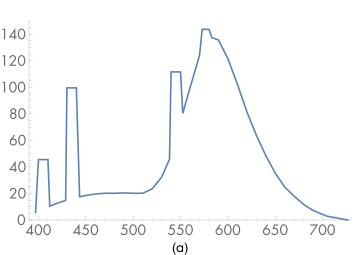
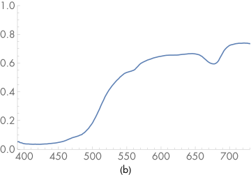
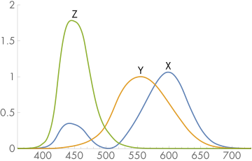
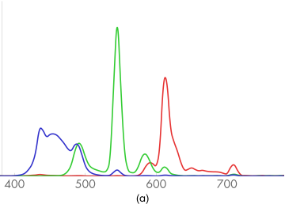
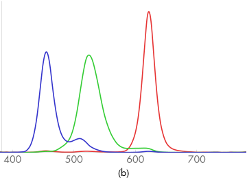
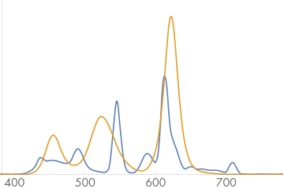
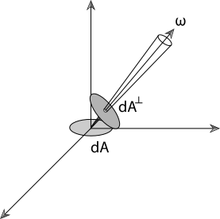
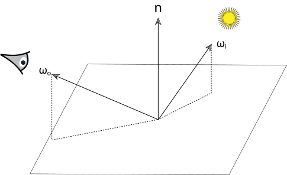
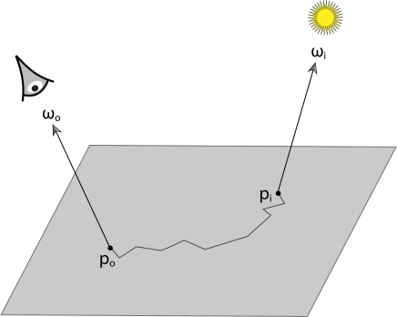

[toc]

# 5 Color and Radiometry / 颜色和辐射度量学

In order to precisely describe how light is represented and sampled to compute images, we must first establish some background in radiometry-the study of the propagation of electromagnetic radiation in an environment. Of particular interest in rendering are the wavelengths $(\lambda)$ of electromagnetic radiation between approximately $380 \mathrm{~nm}$ and $780 \mathrm{~nm}$, which account for light visible to humans. The lower wavelengths $(\lambda \approx 400 \mathrm{~nm})$ are the bluish colors, the middle wavelengths $(\lambda \approx 550 \mathrm{~nm})$ are the greens, and the upper wavelengths $(\lambda \approx 650 \mathrm{~nm})$ are the reds.

In this chapter, we will introduce four key quantities that describe electromagnetic radiation: flux, intensity, irradiance, and radiance. These radiometric quantities are each described by their spectral power distribution (SPD)—a distribution function of wavelength that describes the amount of light at each wavelength. The Spectrum class, which is defined in Section 5.1, is used to represent SPDs in pbrt.

为了精确描述光是如何表示和采样以计算图像的，我们必须首先建立辐射度量学的一些背景——研究电磁辐射在环境中的传播。渲染中特别感兴趣的是波长 $(\lambda)$ 在大约 $380 \mathrm{~nm}$ 和 $780 \mathrm{~nm}$ 之间的电磁辐射，这是人类可见的光。较低波长 $(\lambda \approx 400 \mathrm{~nm})$ 是蓝色，中间波长 $(\lambda \approx 550 \mathrm{~nm})$ 是绿色，高波长 $(\lambda \approx 650 \mathrm{~nm})$ 是红色。

在本章中，我们将介绍四个描述电磁辐射的关键量：通量、强度、辐照度和辐射度。这些辐射量分别由它们的光谱功率分布 (SPD) 来描述——一种描述每个波长的光量的波长分布函数。 5.1 节中定义的 Spectrum 类用于表示 pbrt 中的 SPD。

## 5.1 Spectral Representation / 光谱表示

The SPDs of real-world objects can be quite complicated; Figure 5.1 shows graphs of the spectral distribution of emission from a fluorescent light and the spectral distribution of the reflectance of lemon skin. A renderer doing computations with SPDs needs a compact, efficient, and accurate way to represent functions like these. In practice, some trade-off needs to be made between these qualities.

现实世界对象的 SPD 可能非常复杂；图 5.1 显示了荧光灯发射的光谱分布图和柠檬皮反射率的光谱分布图。使用 SPD 进行计算的渲染器需要一种紧凑、高效且准确的方式来表示此类函数。在实践中，需要在这些品质之间进行一些权衡。





Figure 5.1: (a) Spectral power distributions of a fluorescent light and (b) the reflectance of lemon skin. Wavelengths around 400 nm are bluish colors, greens and yellows are in the middle range of wavelengths, and reds have wavelengths around 700 nm. The fluorescent light’s SPD is even spikier than shown here, where the SPDs have been binned into 10-nm ranges; it actually emits much of its illumination at single discrete frequencies.

图 5.1：（a）荧光灯的光谱功率分布和（b）柠檬皮的反射率。 400 nm 左右的波长为蓝色，绿色和黄色处于波长的中间范围，红色的波长在 700 nm 左右。荧光灯的 SPD 甚至比此处显示的还要尖，其中 SPD 已分入 10 纳米范围；它实际上以单个离散频率发出大部分照明。

A general framework for investigating these issues can be developed based on the problem of finding good basis functions to represent SPDs. The idea behind basis functions is to map the infinite-dimensional space of possible SPD functions to a low-dimensional space of coefficients $c_{i} \in \mathbf{R}$. For example, a trivial basis function is the constant function $B(\lambda)=1$. An arbitrary SPD would be represented in this basis by a single coefficient $c$ equal to its average value, so that its approximation would be $c B(\lambda)=c$. This is obviously a poor approximation, since most SPDs are much more complex than this single basis function is capable of representing accurately.

Many different basis functions have been investigated for spectral representation in computer graphics; the “Further Reading” section cites a number of papers and further resources on this topic. Different sets of basis functions can offer substantially different trade-offs in the complexity of the key operations like converting an arbitrary SPD into a set of coefficients (projecting it into the basis), computing the coefficients for the SPD given by the product of two SPDs expressed in the basis, and so on. In this chapter, we’ll introduce two representations that can be used for spectra in pbrt: RGBSpectrum, which follows the typical computer graphics practice of representing SPDs with coefficients representing a mixture of red, green, and blue colors, and SampledSpectrum, which represents the SPD as a set of point samples over a range of wavelengths.

可以基于找到表示 SPD 的良好基函数的问题，来开发用于调查这些问题的通用框架。基函数背后的想法是将可能的 SPD 函数的无限维空间映射到系数 $c_{i} \in \mathbf{R}$ 的低维空间。例如，平凡基函数是常数函数 $B(\lambda)=1$ 。在此基础上，任意 SPD 将由等于其平均值的单个系数 $c$ 表示，因此其近似值将是 $c B(λ)=c$ 。这显然是一个糟糕的近似值，因为大多数 SPD 比这个单一基函数能够准确表示的复杂得多。

许多不同的基函数已经被研究用于计算机图形学中的光谱表示； “进一步阅读”部分引用了许多关于该主题的论文和更多资源。不同的基函数集可以在关键操作的复杂性方面提供完全不同的权衡，例如将任意 SPD 转换为一组系数（将其投影到基中），计算由基中表示的两个SPD的乘积给出的SPD的系数，等等。在本章中，我们将介绍两种可用于 pbrt 中光谱的表示：RGBSpectrum，它遵循典型的计算机图形实践，用代表红、绿、蓝混合色的系数来表示 SPD，以及 SampledSpectrum，它将SPD表示为一组波长范围内的点采样。

## 5.1.1 The Spectrum Type / 光谱类型

Throughout pbrt, we have been careful to implement all computations involving SPDs in terms of the Spectrum type, using a specific set of built-in operators (addition, multiplication, etc.). The Spectrum type hides the details of the particular spectral representation used, so that changing this detail of the system only requires changing the Spectrum implementation; other code can remain unchanged. The implementations of the Spectrum type are in the files core/spectrum.h and core/spectrum.cpp.

The selection of which spectrum representation is used for the Spectrum type in pbrt is done with a typedef in the file core/pbrt.h. By default, pbrt uses the more efficient but less accurate RGB representation.

在整个 pbrt 中，我们一直小心翼翼地使用一组特定的内置运算符（加法、乘法等）根据 Spectrum 类型实现所有涉及 SPD 的计算。 Spectrum 类型隐藏了所使用的特定光谱表示的细节，因此改变系统的这个细节只需要改变 Spectrum 实现；其他代码可以保持不变。 Spectrum 类型的实现在文件 core/spectrum.h 和 core/spectrum.cpp 中。

选择哪种光谱表示用于 pbrt 中的光谱类型是通过文件 core/pbrt.h 中的 typedef 完成的。默认情况下， pbrt 使用效率更高但精度较低的 RGB 表示。

```
<<Global Forward Declarations>>= 
typedef RGBSpectrum Spectrum;
// typedef SampledSpectrum Spectrum;
```

We have not written the system such that the selection of which Spectrum implementation to use could be resolved at run time; to switch to a different representation, the entire system must be recompiled. One advantage to this design is that many of the various Spectrum methods can be implemented as short functions that can be inlined by the compiler, rather than being left as stand-alone functions that have to be invoked through the relatively slow virtual method call mechanism. Inlining frequently used short functions like these can give a substantial improvement in performance. A second advantage is that structures in the system that hold instances of the Spectrum type can hold them directly rather than needing to allocate them dynamically based on the spectral representation chosen at run time.

我们还没有编写系统，以便可以在运行时解决选择使用哪个 Spectrum 实现的问题；要切换到不同的表示，必须重新编译整个系统。这种设计的一个优点是，许多不同的 Spectrum 方法可以实现为可由编译器内联的短函数，而不是作为必须通过相对较慢的虚方法调用机制调用的独立函数。内联这些常用的短函数可以显著提高性能。第二个优点是系统中保存 Spectrum 类型实例的结构可以直接保存它们，而不需要根据运行时选择的光谱表示动态分配它们。

### 5.1.2 CoefficientSpectrum Implementation / 系数光谱实现

Both of the representations implemented in this chapter are based on storing a fixed number of samples of the SPD. Therefore, we’ll start by defining the CoefficientSpectrum template class, which represents a spectrum as a particular number of samples given as the nSpectrumSamples template parameter. Both RGBSpectrum and SampledSpectrum are partially implemented by inheriting from CoefficientSpectrum.

本章中实现的两种表示都基于存储固定数量的 SPD 采样。因此，我们将首先定义 CoefficientSpectrum 模板类，它将光谱表示为特定数量的采样，作为 nSpectrumSamples 模板参数给出。 RGBSpectrum 和 SampledSpectrum 都是通过继承 CoefficientSpectrum 部分实现的。

```
<<Spectrum Declarations>>= 
template <int nSpectrumSamples> class CoefficientSpectrum {
public:
    <<CoefficientSpectrum Public Methods>> 
    <<CoefficientSpectrum Public Data>> 
protected:
    <<CoefficientSpectrum Protected Data>> 
};
```

One CoefficientSpectrum constructor is provided; it initializes a spectrum with a constant value across all wavelengths.

提供了一个 CoefficientSpectrum 构造函数；它在所有波长上初始化一个具有恒定值的光谱。

```
<<CoefficientSpectrum Public Methods>>= 
CoefficientSpectrum(Float v = 0.f) { 
    for (int i = 0; i < nSpectrumSamples; ++i)
        c[i] = v;
}
<<CoefficientSpectrum Protected Data>>= 
Float c[nSpectrumSamples];
```

A variety of arithmetic operations on Spectrum objects are needed; the implementations in CoefficientSpectrum are all straightforward. First, we define operations to add pairs of spectral distributions. For the sampled representation, it’s easy to show that each sample value for the sum of two SPDs is equal to the sum of the corresponding sample values.

需要对 Spectrum 对象进行各种算术运算； CoefficientSpectrum 中的实现都很简单。首先，我们定义添加光谱分布对的操作。对于采样表示，很容易证明两个 SPD 各自采样值总和等于相应采样值的总和。

```
<<CoefficientSpectrum Public Methods>>+=  
CoefficientSpectrum &operator+=(const CoefficientSpectrum &s2) {
    for (int i = 0; i < nSpectrumSamples; ++i)
        c[i] += s2.c[i];
    return *this;
}

<<CoefficientSpectrum Public Methods>>+=  
CoefficientSpectrum operator+(const CoefficientSpectrum &s2) const {
    CoefficientSpectrum ret = *this;
    for (int i = 0; i < nSpectrumSamples; ++i)
        ret.c[i] += s2.c[i];
    return ret;
}
```

Similarly, subtraction, multiplication, division, and unary negation are defined component-wise. These methods are very similar to the ones already shown, so we won’t include them here. pbrt also provides equality and inequality tests, also not included here.

It is often useful to know if a spectrum represents an SPD with value zero everywhere. If, for example, a surface has zero reflectance, the light transport routines can avoid the computational cost of casting reflection rays that have contributions that would eventually be multiplied by zeros and thus do not need to be traced.

类似地，减法、乘法、除法和一元取反是按组件定义的。这些方法与已经显示的方法非常相似，因此我们不会在此处包含它们。 pbrt 还提供等式和不等式测试，这里也不包括在内。

了解光谱是否代表处处为零的 SPD 通常很有用。例如，如果一个表面的反射率为零，则光传输代码可以避免计算反射光线的成本，这些反射光线的贡献最终会乘以零，因此不需要跟踪。

```
<<CoefficientSpectrum Public Methods>>+=  
bool IsBlack() const {
    for (int i = 0; i < nSpectrumSamples; ++i)
        if (c[i] != 0.) return false;
    return true;
}
```

The Spectrum implementation (and thus the CoefficientSpectrum implementation) must also provide implementations of a number of slightly more esoteric methods, including those that take the square root of an SPD or raise the function it represents to a given power. These are needed for some of the computations performed by the Fresnel classes in Chapter 8, for example. The implementation of Sqrt() takes the square root of each component to give the square root of the SPD. The implementations of Pow() and Exp() are analogous and won’t be included here.

Spectrum 实现（以及 CoefficientSpectrum 实现）还必须提供一些稍微更深奥的方法的实现，包括那些取 SPD 的平方根或将其表示的函数提升到给定幂的方法。例如，第 8 章中的 Fresnel 类执行的一些计算需要这些。 Sqrt() 的实现采用每个组件的平方根来给出 SPD 的平方根。 Pow() 和 Exp() 的实现是类似的，这里不再赘述。

```
<<CoefficientSpectrum Public Methods>>+=  
friend CoefficientSpectrum Sqrt(const CoefficientSpectrum &s) { 
    CoefficientSpectrum ret;
    for (int i = 0; i < nSpectrumSamples; ++i)
        ret.c[i] = std::sqrt(s.c[i]);
    return ret;
}
```

It’s frequently useful to be able to linearly interpolate between two SPDs with a parameter .

能够使用参数在两个 SPD 之间进行线性插值通常很有用。

```
<<Spectrum Inline Functions>>= 
inline Spectrum Lerp(Float t, const Spectrum &s1, const Spectrum &s2) {
    return (1 - t) * s1 + t * s2;
}
```

Some portions of the image processing pipeline will want to clamp a spectrum to ensure that the function it represents is within some allowable range.

图像处理管道的某些部分需要clamp光谱以确保它所代表的函数在某个允许范围内。

```
<<CoefficientSpectrum Public Methods>>+=  
CoefficientSpectrum Clamp(Float low = 0, Float high = Infinity) const {
    CoefficientSpectrum ret;
    for (int i = 0; i < nSpectrumSamples; ++i)
        ret.c[i] = ::Clamp(c[i], low, high);
    return ret;
}
```

Finally, we provide a debugging routine to check if any of the sample values of the SPD is the not-a-number (NaN floating-point value). This situation can happen due to an accidental division by 0; Assert()s throughout the system use this method to catch this case close to where it happens.

最后，我们提供了一个调试代码来检查 SPD 的任何采样值是否为非数字（NaN 浮点值）。这种情况可能是由于意外除以 0 而发生的；整个系统中的 Assert() 都使用此方法来捕获接近发生这种情况的位置。

```
<<CoefficientSpectrum Public Methods>>+=  
bool HasNaNs() const {
    for (int i = 0; i < nSpectrumSamples; ++i)
        if (std::isnan(c[i])) return true;
    return false;
}
```

Most of the spectral computations in pbrt can be implemented using the basic operations we have defined so far. However, in some cases it’s necessary to be able to iterate over a set of spectral samples that represent an SPD—for example to perform a spectral sample-based table lookup or to evaluate a piecewise function over wavelengths. Classes that need this functionality in pbrt include the TabulatedBSSRDF class, which is used for subsurface scattering, and the HomogeneousMedium and GridDensityMedium classes.

For these uses, CoefficientSpectrum provides a public constant, nSamples, that gives the number of samples used to represent the SPD and an operator[] method to access individual sample values.

pbrt 中的大部分光谱计算都可以使用我们迄今为止定义的基本操作来实现。但是，在某些情况下，必须能够遍历表示 SPD 的一组光谱采样，例如执行基于光谱采样的表查找或计算波长上的分段函数。 pbrt 中需要此功能的类包括用于次表面散射的 TabulatedBSSRDF 类，以及 HomogeneousMedium 和 GridDensityMedium 类。

对于这些用途，CoefficientSpectrum 提供了一个公共常量 nSamples，它给出了用于表示 SPD 的采样数和一个用于访问单个采样值的 operator[] 方法。

```
<<CoefficientSpectrum Public Data>>= 
static const int nSamples = nSpectrumSamples;
<<CoefficientSpectrum Public Methods>>+= 
Float &operator[](int i) {
    return c[i];
}
```

Note that the presence of this sample accessor imposes the implicit assumption that the spectral representation is a set of coefficients that linearly scale a fixed set of basis functions. If, for example, a Spectrum implementation instead represented SPDs as a sum of Gaussians where the coefficients $c_{i}$ alternatingly scaled the Gaussians and set their width,

请注意，此采样访问器的存在依赖了一个隐式假设，即光谱表示是一组系数，这些系数线性地缩放一组固定的基函数。例如，如果 Spectrum 实现将 SPD 表示为高斯数总和，其中系数 $c_{i}$ 交替缩放高斯数并设置其宽度，

$$
S(\lambda)=\sum_{i}^{N} c_{2 i} \mathrm{e}^{-c_{2 i+1}}
$$

then the code that currently uses this accessor would need to be modified, perhaps to instead operate on a version of the SPD that had been converted to a set of linear coefficients. While this crack in the Spectrum abstraction is not ideal, it simplifies other parts of the current system and isn’t too hard to clean up if one adds spectral representations, where this assumption isn’t correct.

那么当前使用此访问器的代码将需要修改，也许改为对已转换为一组线性系数的 SPD 版本进行操作。虽然 Spectrum 抽象中的这种crack并不理想，但它简化了当前系统的其他部分，并且如果添加了光谱表示，则清理起来并不难，但这种假设并不正确。

## 5.2 The SampledSpectrum Class / 采样光谱类

SampledSpectrum uses the Coefficientspectrum infrastructure to represent an SPD with uniformly spaced samples between a starting and an ending wavelength. The wavelength range covers from $400 \mathrm{~nm}$ to $700 \mathrm{~nm}$ -the range of the visual spectrum where the human visual system is most sensitive. The number of samples, 60, is generally more than enough to accurately represent complex SPDs for rendering. (See the "Further Reading" section for background on sampling rate requirements for SPDs.) Thus, the first sample represents the wavelength range $[400,405)$, the second represents $[405,410)$, and so forth. These values can easily be changed here as needed.

SampledSpectrum 使用 Coefficientspectrum 基类来表示 SPD，在开始和结束波长之间具有均匀间隔的采样。波长范围从 $400 \mathrm{~nm}$ 到 $700 \mathrm{~nm}$ - 人类视觉系统最敏感的视觉光谱范围。采样数量 60 通常足以准确表示用于渲染的复杂 SPD。 （有关 SPD 采样率要求的背景信息，请参阅“进一步阅读”部分。）因此，第一个采样代表波长范围 $[400,405)$ ，第二个代表 $[405,410)$ ，依此类推。这些值可以根据需要在此处轻松更改。

```
<<Spectrum Utility Declarations>>= 
static const int sampledLambdaStart = 400;
static const int sampledLambdaEnd = 700;
static const int nSpectralSamples = 60;

<<Spectrum Declarations>>+=  
class SampledSpectrum : public CoefficientSpectrum<nSpectralSamples> {
public:
    <<SampledSpectrum Public Methods>> 
private:
    <<SampledSpectrum Private Data>> 
};
```

By inheriting from the CoefficientSpectrum class, SampledSpectrum automatically has all of the basic spectrum arithmetic operations defined earlier. The main methods left to define for it are those that initialize it from spectral data and convert the SPD it represents to other spectral representations (such as RGB). The constructor for initializing it with a constant SPD is straightforward.

通过继承 CoefficientSpectrum 类，SampledSpectrum 自动拥有之前定义的所有基本光谱算术运算。剩下要为其定义的主要方法，是光谱数据对其进行初始化，并将其表示的 SPD 转换为其他光谱表示（例如 RGB）的方法。使用常量 SPD 初始化它的构造函数很简单。

```
<<SampledSpectrum Public Methods>>= 
SampledSpectrum(Float v = 0.f) : CoefficientSpectrum(v) { }
```

We will often be provided spectral data as a set of $\left(\lambda_{i}, v_{i}\right)$ samples, where the $i$ th sample has some value $v_{i}$ at wavelength $\lambda_{i}$. In general, the samples may have an irregular spacing and there may be more or fewer of them than the SampledSpectrum stores. (See the directory scenes/spds in the pbrt distribution for a variety of SPDs for use with pbrt, many of them with irregular sample spacing.)

The FromSampled() method takes arrays of SPD sample values v at given wavelengths lambda and uses them to define a piecewise linear function to represent the SPD. For each SPD sample in the SampledSpectrum, it uses the AverageSpectrumSamples() utility function, defined below, to compute the average of the piecewise linear function over the range of wavelengths that each SPD sample is responsible for.

我们通常会以一组 $\left(\lambda_{i}, v_{i}\right)$ 采样的形式提供光谱数据，其中第 $i$ 个采样在波长 $\lambda_{i}$ 处具有一些值 $v_{i}$ 。通常，采样可能具有不规则的间距，并且可能比 SampledSpectrum 存储的数量更多或更少。 （请参阅 pbrt 发行版中的目录scenes/spds，了解与 pbrt 一起使用的各种 SPD，其中许多具有不规则的采样间距。）

FromSampled() 方法采用给定波长 lambda 的 SPD 采样值数组 v ，并使用它们定义分段线性函数来表示 SPD。对于 SampledSpectrum 中的每个 SPD 采样，它使用下面定义的 AverageSpectrumSamples() 工具函数来计算每个 SPD 采样负责的波长范围内的分段线性函数的平均值。

```
<<SampledSpectrum Public Methods>>+=  
static SampledSpectrum FromSampled(const Float *lambda,
                                   const Float *v, int n) {
    <<Sort samples if unordered, use sorted for returned spectrum>> 
    SampledSpectrum r;
    for (int i = 0; i < nSpectralSamples; ++i) {
        <<Compute average value of given SPD over th sample’s range>> 
    }
    return r;
}
```

The AveragespectrumSamples( ) function requires that the $\left(\lambda_{i}, v_{i}\right)$ values be sorted by wavelength. The SpectrumSamplesSorted() function checks that they are; if not, SortSpectrumSamples() sorts them. Note that we allocate new storage for the sorted samples and do not modify the values passed in by the caller; in general, doing so would likely be unexpected behavior for a user of this function (who shouldn't need to worry about these requirements of its specific implementation). We won't include the implementations of either of these two functions here, as they are straightforward.

AveragespectrumSamples( ) 函数要求 $\left(\lambda_{i}, v_{i}\right)$ 值按波长排序。 SpectrumSamplesSorted() 函数检查它们是否存在；如果没有，SortSpectrumSamples() 会对它们进行排序。请注意，我们为排序后的采样分配了新的存储空间，并且不会修改调用者传入的值；通常，对于此功能的用户而言，这样做可能是意外行为（他们无需担心其特定实现的这些要求）。我们不会在这里包含这两个函数中任何一个的实现，因为它们很简单。

```
<<Sort samples if unordered, use sorted for returned spectrum>>= 
if (!SpectrumSamplesSorted(lambda, v, n)) {
    std::vector<Float> slambda(&lambda[0], &lambda[n]);
    std::vector<Float> sv(&v[0], &v[n]);
    SortSpectrumSamples(&slambda[0], &sv[0], n);
    return FromSampled(&slambda[0], &sv[0], n);
}
```

In order to compute the value for the $i$th spectral sample, we compute the range of wavelengths that it’s responsible for—lambda0 to lambda1—and use the AverageSpectrumSamples() function to compute the average value of the given piecewise linear SPD over that range. This is a 1D instance of sampling and reconstruction, a topic that will be discussed in more detail in Chapter 7.

为了计算第 $i$ 个光谱采样的值，我们计算它负责的波长范围——lambda0 到 lambda1——并使用 AverageSpectrumSamples() 函数计算给定分段线性SPD在该范围内的平均值。这是采样和重建的一维实例，这个主题将在第 7 章中更详细地讨论。

```
<<Compute average value of given SPD over ith sample’s range>>= 
Float lambda0 = Lerp(Float(i) / Float(nSpectralSamples), 
                     sampledLambdaStart, sampledLambdaEnd);
Float lambda1 = Lerp(Float(i + 1) / Float(nSpectralSamples), 
                     sampledLambdaStart, sampledLambdaEnd);
r.c[i] = AverageSpectrumSamples(lambda, v, n, lambda0, lambda1);
```

Figure 5.2 shows the basic approach taken by AverageSpectrumSamples(): it iterates over each of the linear segments between samples that are partially or fully within the range of wavelengths, lambdaStart to lambdaEnd. For each such segment, it computes the average value over its range, scales the average by the wavelength range the segment covers, and accumulates a sum of these values. The final average value is this sum divided by the total wavelength range.

图 5.2 显示了 AverageSpectrumSamples() 采用的基本方法：它遍历部分或完全在波长范围 lambdaStart 到 lambdaEnd 内的采样之间的每个线性段。对于每个这样的段，它计算其范围内的平均值，按段覆盖的波长范围缩放平均值，并累加这些值的总和。最终平均值是该总和除以总波长范围。


Figure 5.2: When resampling an irregularly defined SPD, we need to compute the average value of the piecewise linear function defined by the SPD samples. Here, we want to average the value from 500 nm to 600 nm—the shaded region under the plot. The AverageSpectrumSamples() function does this by computing the areas of each of the regions denoted by dashed lines in this figure.

图 5.2：在对不规则定义的 SPD 进行重采样时，我们需要计算由 SPD 采样定义的分段线性函数的平均值。在这里，我们想要平均 500 nm 到 600 nm 之间的值 - 图下方的阴影区域。 AverageSpectrumSamples() 函数通过计算图中虚线表示的每个区域的面积来实现这一点。

```
<<Spectrum Method Definitions>>= 
Float AverageSpectrumSamples(const Float *lambda, const Float *vals,
        int n, Float lambdaStart, Float lambdaEnd) {
    <<Handle cases with out-of-bounds range or single sample only>> 
    Float sum = 0;  
    <<Add contributions of constant segments before/after samples>> 
    <<Advance to first relevant wavelength segment>> 
    <<Loop over wavelength sample segments and add contributions>> 
    return sum / (lambdaEnd - lambdaStart);
}
```

The function starts by checking for and handling the edge cases where the range of wavelengths to average over is outside the range of provided wavelengths or the case where there is only a single sample, in which case the average value is trivially computed. We assume that the SPD has a constant value (the values at the two respective endpoints) outside of the provided sample range; if this isn’t a reasonable assumption for a particular set of data, the data provided should have explicit values of (for example) 0 at the endpoints.

该函数首先检查和处理边缘情况，其中要平均的波长范围在提供的波长范围之外，或者只有一个采样的情况，在这种情况下，平均值是微不足道的。我们假设 SPD 在提供的采样范围之外具有常量值（两个相应端点处的值）；如果这对于一组特定的数据来说不是一个合理的假设，则提供的数据应该在端点具有（例如）显式值0。

```
<<Handle cases with out-of-bounds range or single sample only>>= 
if (lambdaEnd   <= lambda[0])     return vals[0];
if (lambdaStart >= lambda[n - 1]) return vals[n - 1];
if (n == 1) return vals[0];
```

Having handled these cases, the next step is to check to see if part of the range to average over goes beyond the first and/or last sample value. If so, we accumulate the contribution of the constant segment(s), scaled by the out-of-bounds wavelength range.

处理完这些情况后，下一步是检查平均范围的一部分是否超出第一个和/或最后一个采样值。如果是这样，我们累积常量段的贡献，按越界波长范围缩放。

```
<<Add contributions of constant segments before/after samples>>= 
if (lambdaStart < lambda[0])
    sum += vals[0] * (lambda[0] - lambdaStart);
if (lambdaEnd > lambda[n-1])
    sum += vals[n - 1] * (lambdaEnd - lambda[n - 1]);
```

And now we advance to the first index i where the starting wavelength of the interpolation range overlaps the segment from $\lambda_{i}$ to $\lambda_{i+1}$. A more efficient implementation would use a binary search rather than a linear search here. However, this code is currently only called at scene initialization time, so the lack of these optimizations doesn't currently impact rendering performance.

现在我们前进到第一个索引 i，其中插值范围的起始波长与从 $\lambda_{i}$ 到 $\lambda_{i+1}$ 的段重叠。在这里使用二进制搜索而不是线性搜索是更有效的实现。 但是，此代码目前仅在场景初始化时调用，因此缺少这些优化目前不会影响渲染性能。

```
<<Advance to first relevant wavelength segment>>= 
int i = 0;
while (lambdaStart > lambda[i + 1]) ++i;
```

The loop below iterates over each of the linear segments that the averaging range overlaps. For each one, it computes the average value over the wavelength range segLambdaStart to segLambdaEnd by averaging the values of the function at those two points. The values in turn are computed by interp(), a lambda function that linearly interpolates between the two endpoints at the given wavelength.

The std::min() and std::max() calls below compute the wavelength range to average over within the segment; note that they naturally handle the cases where lambdaStart, lambdaEnd, or both of them are within the current segment.

下面的循环遍历平均范围重叠的每个线性段。对于每一个，它通过对这两个点的函数值求平均值来计算波长范围 segLambdaStart 到 segLambdaEnd 上的平均值。这些值依次由 interp() 计算，这是一个 lambda 函数，可在给定波长的两个端点之间进行线性插值。

下面的 std::min() 和 std::max() 调用计算在段内平均的波长范围；请注意，它们自然会处理 lambdaStart、lambdaEnd 或两者都在当前段内的情况。

```
<<Loop over wavelength sample segments and add contributions>>= 
auto interp = [lambda, vals](Float w, int i) {
    return Lerp((w - lambda[i]) / (lambda[i + 1] - lambda[i]),
                vals[i], vals[i + 1]);
};

for (; i+1 < n && lambdaEnd >= lambda[i]; ++i) {
    Float segLambdaStart = std::max(lambdaStart, lambda[i]);
    Float segLambdaEnd =   std::min(lambdaEnd,   lambda[i + 1]);
    sum += 0.5 * (interp(segLambdaStart, i) + interp(segLambdaEnd, i)) *
        (segLambdaEnd - segLambdaStart);
}
```

### 5.2.1 XYZ Color

A remarkable property of the human visual system makes it possible to represent colors for human perception with just three floating-point numbers. The tristimulus theory of color perception says that all visible SPDs can be accurately represented for human observers with three values, $x_{\lambda}, y_{\lambda}$, and $z_{\lambda} .$ Given an emissive SPD $S(\lambda)$, these values are computed by integrating its product with the spectral matching curves $X(\lambda), Y(\lambda)$, and $Z(\lambda)$

人类视觉系统的一个显著特性，使得仅用三个浮点数来表示人类感知的颜色成为可能。颜色感知的三原色理论说，对于人类观察者来说，所有可见的 SPD 都可以准确地表示为三个值， $x_{\lambda}、y_{\lambda}$ 和 $z_{\lambda}$ 。给定一个发射 SPD $ S(\lambda)$ ，这些值是通过将其乘积与光谱匹配曲线 $X(\lambda)、Y(\lambda)$ 和 $Z(\lambda)$ 积分来计算的

$$
\begin{aligned}
x_{\lambda} &=\int_{\lambda} S(\lambda) X(\lambda) \mathrm{d} \lambda \\
y_{\lambda} &=\int_{\lambda} S(\lambda) Y(\lambda) \mathrm{d} \lambda \\
z_{\lambda} &=\int_{\lambda} S(\lambda) Z(\lambda) \mathrm{d} \lambda
\end{aligned}
$$

(5.1)

These curves were determined by the Commission Internationale de l'Éclairage (CIE) standards body after a series of experiments with human test subjects and are graphed in Figure $5.3$. It is believed that these matching curves are generally similar to the responses of the three types of color-sensitive cones in the human retina. Remarkably, SPDs with substantially different distributions may have very similar $x_{\lambda}, y_{\lambda}$, and $z_{\lambda}$ values. To the human observer, such SPDs actually appear the same visually. Pairs of such spectra are called metamers.

这些曲线是由国际照明委员会 (CIE) 标准机构在对人体测试对象进行一系列实验后确定的，如图 5.3 所示。相这些匹配曲线被认为大体上类似于人类视网膜中三种颜色敏感的视锥细胞的反应。值得注意的是，具有显著不同分布的 SPD 可能具有非常相似的 $x_{\lambda}、y_{\lambda}$ 和 $z_{\lambda}$ 值。对于人类观察者来说，这种 SPD 实际上在视觉上看起来是一样的。成对的这种光谱称为同色异谱。



Figure 5.3: Computing the XYZ Values for an Arbitrary SPD. The SPD is multiplied by each of the three matching curves and integrated over their non-zero extent to compute the values $x_{\lambda}, y_{\lambda}$, and $z_{\lambda}$, using Equation (5.1).

图 5.3：计算任意 SPD 的 XYZ 值。 SPD 乘以三个匹配曲线中的每一个，并在它们的非零范围内积分以计算值 $x_{\lambda}、y_{\lambda}$ 和 $z_{\lambda}$ ，使用公式 (5.1 ）。

This brings us to a subtle point about representations of spectral power distributions. Most color spaces attempt to model colors that are visible to humans and therefore use only three coefficients, exploiting the tristimulus theory of color perception. Although XYZ works well to represent a given SPD to be displayed for a human observer, it is not a particularly good set of basis functions for spectral computation. For example, although XYZ values would work well to describe the perceived color of lemon skin or a fluorescent light individually (recall Figure 5.1), the product of their respective XYZ values is likely to give a noticeably different XYZ color, than the XYZ value computed by multiplying more accurate representations of their SPDs and then computing the XYZ value.

pbrt provides the values of the standard $X(\lambda), Y(\lambda)$, and $Z(\lambda)$ response curves sampled at 1-nm increments from $360 \mathrm{~nm}$ to $830 \mathrm{~nm}$. The wavelengths of the $i$ th sample in the arrays below are given by the $i$ th element of CIE_lambda; having the wavelengths of the samples explicitly represented in this way makes it easy to pass the XYZ samples into functions like AveragespectrumSamples () that take such an array of wavelengths as a parameter.

这给我们带来了一个关于光谱功率分布表示的微妙点。大多数色彩空间试图模拟人类可见的颜色，因此仅使用三个系数，利用色彩感知的三原色理论。尽管 XYZ 可以很好地表示要向人类观察者显示的给定 SPD，但它并不是一组用于光谱计算的特别好的基函数。例如，虽然 XYZ 值可以很好地单独描述柠檬皮或荧光灯的感知颜色（回想一下图 5.1），但是比起乘以更准确的 SPD 表示然后计算 XYZ 值，它们各自的 XYZ 值的乘积可能会给出明显不同的 XYZ 颜色。

pbrt 提供标准 $X(\lambda)、Y(\lambda)$ 和 $Z(\lambda)$ 响应曲线的值，这些响应曲线以 1-nm 增量采样，从 $360 \mathrm{~nm}$ 到 $830 \mathrm {~nm}$ 。以下数组中第 $i$ 个采样的波长由 CIE_lambda 的第 $i$ 个元素给出；以这种方式明确表示采样的波长可以很容易地将 XYZ 采样传递到像 AveragespectrumSamples () 这样的函数中，这些函数将这样的波长数组作为参数。

```
<<Spectral Data Declarations>>= 
static const int nCIESamples = 471;
extern const Float CIE_X[nCIESamples];
extern const Float CIE_Y[nCIESamples];
extern const Float CIE_Z[nCIESamples];
extern const Float CIE_lambda[nCIESamples];
```

SampledSpectrum uses these samples to compute the XYZ matching curves in its spectral representation (i.e., themselves as SampledSpectrums).

SampledSpectrum 使用这些采样来计算其光谱表示中的 XYZ 匹配曲线（即，它们本身作为 SampledSpectrum）。

```
<<SampledSpectrum Private Data>>= 
static SampledSpectrum X, Y, Z;
```

The SampledSpectrum XYZ matching curves are computed in the SampledSpectrum::Init() method, which is called at system startup time by the pbrtInit() function defined in Section A.2.

SampledSpectrum XYZ 匹配曲线在 SampledSpectrum::Init() 方法中计算，该方法在系统启动时由 A.2 节中定义的 pbrtInit() 函数调用。

```
<<SampledSpectrum Public Methods>>+=  
static void Init() {
    <<Compute XYZ matching functions for SampledSpectrum>> 
    <<Compute RGB to spectrum functions for SampledSpectrum>> 
}

<<General pbrt Initialization>>= 
SampledSpectrum::Init();
```

Given the wavelength range and number of samples for SampledSpectrum, computing the values of the matching functions for each sample is just a matter of computing the sample’s wavelength range and using the AverageSpectrumSamples() routine.

给定 SampledSpectrum 的波长范围和采样数量，计算每个采样的匹配函数值只是计算采样的波长范围和使用 AverageSpectrumSamples() 代码的问题。

```
<<Compute XYZ matching functions for SampledSpectrum>>= 
for (int i = 0; i < nSpectralSamples; ++i) {
    Float wl0 = Lerp(Float(i) / Float(nSpectralSamples), 
                     sampledLambdaStart, sampledLambdaEnd);
    Float wl1 = Lerp(Float(i + 1) / Float(nSpectralSamples), 
                     sampledLambdaStart, sampledLambdaEnd);
    X.c[i] = AverageSpectrumSamples(CIE_lambda, CIE_X, nCIESamples,
                                    wl0, wl1);
    Y.c[i] = AverageSpectrumSamples(CIE_lambda, CIE_Y, nCIESamples,
                                    wl0, wl1);
    Z.c[i] = AverageSpectrumSamples(CIE_lambda, CIE_Z, nCIESamples,
                                    wl0, wl1);
}
```

All Spectrum implementations in pbrt must provide a method that converts their SPD to $\left(x_{\lambda}, y_{\lambda}, z_{\lambda}\right)$ coefficients. This method is called, for example, in the process of updating pixels in the image. When a Spectrum representing the light carried along a ray from the camera is provided to the Film, the Film converts the SPD into XYZ coefficients as a first step in the process of finally turning them into RGB values used for storage and/or display.

To compute XYZ coefficients, SampledSpectrum computes the integrals from Equation (5.1) with a Riemann sum:

pbrt 中的所有 Spectrum 实现都必须提供将它们的 SPD 转换为 $\left(x_{\lambda}, y_{\lambda}, z_{\lambda}\right)$ 系数的方法。例如，在更新图像中的像素的过程中会调用此方法。当沿着来自相机的光线携带的光的光谱被提供给胶片时，胶片将 SPD 转换为 XYZ 系数，作为最终将它们转换为用于存储和/或显示的 RGB 值的过程的第一步。

为了计算 XYZ 系数，SampledSpectrum 使用黎曼和计算方程 (5.1) 的积分：

$$
x_{\lambda} \approx \frac{\lambda_{\text {end }}-\lambda_{\text {start }}}{N} \sum_{i=0}^{N-1} X_{i} c_{i}
$$

and so forth.

等等。

```
<<SampledSpectrum Public Methods>>+=  
void ToXYZ(Float xyz[3]) const {
    xyz[0] = xyz[1] = xyz[2] = 0.f;
    for (int i = 0; i < nSpectralSamples; ++i) {
        xyz[0] += X.c[i] * c[i];
        xyz[1] += Y.c[i] * c[i];
        xyz[2] += Z.c[i] * c[i];
    }
    Float scale = Float(sampledLambdaEnd - sampledLambdaStart) /
                  Float(CIE_Y_integral * nSpectralSamples);
    xyz[0] *= scale;
    xyz[1] *= scale;
    xyz[2] *= scale;
}
```

The $y$ coefficient of XYZ color is closely related to luminance, which measures the perceived brightness of a color. Luminance is described in more detail in Section 5.4.3. We provide a method to compute $y$ alone in a separate method as often only the luminance of a spectrum is desired. (For example, some of the light transport algorithms in Chapters 14, 15, and 16 use luminance as a measure of the relative importance of light-carrying paths through the scene.)

XYZ 颜色的 $y$ 系数与亮度密切相关，亮度衡量颜色的感知亮度。亮度在第 5.4.3 节中有更详细的描述。我们提供了一种在单独的方法中单独计算 $y$ 的方法，因为通常只需要光谱的亮度。（例如，第 14、15 和 16 章中的一些光传输算法使用亮度来衡量穿过场景的光传输路径的相对重要性。）

```
<<SampledSpectrum Public Methods>>+=  
Float y() const { 
    Float yy = 0.f;
    for (int i = 0; i < nSpectralSamples; ++i)
        yy += Y.c[i] * c[i];
    return yy * Float(sampledLambdaEnd - sampledLambdaStart) /
        Float(nSpectralSamples);
}
```

### 5.2.2 RGB Color

When we display an RGB color on a display, the spectrum that is actually displayed is basically determined by the weighted sum of three spectral response curves, one for each of red, green, and blue, as emitted by the display’s phosphors, LED or LCD elements, or plasma cells. Figure 5.4 plots the red, green, and blue distributions emitted by a LED display and a LCD display; note that they are remarkably different.

当我们在显示器上显示RGB颜色时，实际显示的光谱基本上由三条光谱响应曲线的加权和决定，红、绿、蓝各一条，由显示器的荧光粉、LED或LCD元件或等离子单元发出。图5.4绘制了LED显示屏和LCD显示屏发出的红色、绿色和蓝色分布；请注意，它们是非常不同的。





Figure 5.4: Red, Green, and Blue Emission Curves for an LCD Display and an LED Display. The first plot shows the curves for an LCD display, and the second shows them for an LED. These two displays have quite different emission profiles. (Data courtesy of X-Rite, Inc.)

图 5.4：LCD 显示器和 LED 显示器的红色、绿色和蓝色发射曲线。第一张图显示了 LCD 显示器的曲线，第二张图显示了 LED 的曲线。这两种显示器具有完全不同的发射曲线。 （数据由爱色丽公司提供）

Figure $5.5$ in turn shows the SPDs that result from displaying the RGB color $(0.6,0.3,0.2)$ on those displays. Not surprisingly, the resulting SPDs are quite different as well. This example illustrates that using RGB values provided by the user to describe a particular color is actually only meaningful given knowledge of the characteristics of the display they were using when they selected the RGB values.

图 $5.5$ 依次显示了在这些显示器上显示 RGB 颜色 $(0.6,0.3,0.2)$ 所产生的 SPD。毫不奇怪，由此产生的 SPD 也大不相同。此示例说明，使用用户提供的 RGB 值来描述特定颜色，实际上只有在了解他们选择 RGB 值时所使用的显示器特性的情况下才有意义。



Figure 5.5: SPDs from Displaying the RGB Color $(0.6,0.3,0.2)$ on LED and LCD Displays. The resulting emitted SPDs are remarkably different, even given the same RGB values, due to the different emission curves illustrated in Figure 5.4 .

图 5.5：在 LED 和 LCD 显示器上显示 RGB 颜色 $(0.6,0.3,0.2)$ 的 SPD。由于图 5.4 中所示的不同发射曲线，即使给定相同的 RGB 值，所产生的发射 SPD 也明显不同。

Given an $\left(x_{\lambda}, y_{\lambda}, z_{\lambda}\right)$ representation of an SPD, we can convert it to corresponding RGB coefficients, given the choice of a particular set of SPDs that define red, green, and blue for a display of interest. Given the spectral response curves $R(\lambda), G(\lambda)$, and $B(\lambda)$, for a particular display, RGB coefficients can be computed by integrating the response curves with the SPD $S(\lambda)$ and using the tristimulus theory of color perception:

给定 SPD 的 $\left(x_{\lambda}, y_{\lambda}, z_{\lambda}\right)$ 表示，我们可以将其转换为相应的 RGB 系数，只要选择一组特定的SPD来定义指定的红色、绿色和蓝色。给定特定显示器的光谱响应曲线 $R(\lambda)、G(\lambda)$ 和 $B(\lambda)$ ，可通过将响应曲线与SPD $S（\lambda）$ 积分，并使用颜色感知的三原色理论来计算RGB系数：

$$
\begin{aligned}
r &=\int R(\lambda) S(\lambda) \mathrm{d} \lambda=\int R(\lambda)\left(x_{\lambda} X(\lambda)+y_{\lambda} Y(\lambda)+z_{\lambda} Z(\lambda)\right) \mathrm{d} \lambda \\
&=x_{\lambda} \int R(\lambda) X(\lambda) \mathrm{d} \lambda+y_{\lambda} \int R(\lambda) Y(\lambda) \mathrm{d} \lambda+z_{\lambda} \int R(\lambda) Z(\lambda) \mathrm{d} \lambda
\end{aligned}
$$

The integrals of the products of $R(\lambda) X(\lambda)$ and so forth can be precomputed for given response curves, making it possible to express the full conversion as a matrix:

可以为给定的响应曲线预先计算 $R(\lambda) X(\lambda)$ 等乘积的积分，从而可以将完整转换表示为矩阵：

$$
\left[\begin{array}{l}
r \\
g \\
b
\end{array}\right]=\left(\begin{array}{ccc}
\int R(\lambda) X(\lambda) \mathrm{d} \lambda & \int R(\lambda) Y(\lambda) \mathrm{d} \lambda & \int R(\lambda) Z(\lambda) \mathrm{d} \lambda \\
\int G(\lambda) X(\lambda) \mathrm{d} \lambda & \int G(\lambda) Y(\lambda) \mathrm{d} \lambda & \int G(\lambda) Z(\lambda) \mathrm{d} \lambda \\
\int B(\lambda) X(\lambda) \mathrm{d} \lambda & \int B(\lambda) Y(\lambda) \mathrm{d} \lambda & \int B(\lambda) Z(\lambda) \mathrm{d} \lambda
\end{array}\right)\left[\begin{array}{l}
x_{\lambda} \\
y_{\lambda} \\
z_{\lambda}
\end{array}\right]
$$

The conversion routines implemented in pbrt are based on a standard set of these RGB spectra that has been defined for high-definition television.

在 pbrt 中实现的转换代码基于为高清电视定义的这些 RGB 光谱的标准集。

```
<<Spectrum Utility Declarations>>+=  
inline void XYZToRGB(const Float xyz[3], Float rgb[3]) {
    rgb[0] =  3.240479f*xyz[0] - 1.537150f*xyz[1] - 0.498535f*xyz[2];
    rgb[1] = -0.969256f*xyz[0] + 1.875991f*xyz[1] + 0.041556f*xyz[2];
    rgb[2] =  0.055648f*xyz[0] - 0.204043f*xyz[1] + 1.057311f*xyz[2];
}
```

The inverse of this matrix gives coefficients to convert given RGB values expressed with respect to a particular set of RGB response curves to $\left(x_{\lambda}, y_{\lambda}, z_{\lambda}\right)$ coefficients.

该矩阵的逆给出了将给定 RGB 值相对于一组特定的 RGB 响应曲线表示的系数转换为 $\left(x_{\lambda}, y_{\lambda}, z_{\lambda}\right)$ 系数.

```
<<Spectrum Utility Declarations>>+=  
inline void RGBToXYZ(const Float rgb[3], Float xyz[3]) {
    xyz[0] = 0.412453f*rgb[0] + 0.357580f*rgb[1] + 0.180423f*rgb[2];
    xyz[1] = 0.212671f*rgb[0] + 0.715160f*rgb[1] + 0.072169f*rgb[2];
    xyz[2] = 0.019334f*rgb[0] + 0.119193f*rgb[1] + 0.950227f*rgb[2];
}
```

Given these functions, a SampledSpectrum can convert to RGB coefficients by first converting to XYZ and then using the XYZToRGB() utility function.

鉴于这些函数，SampledSpectrum 可以通过首先转换为 XYZ，然后使用 XYZToRGB() 工具函数来转换为 RGB 系数。

```
<<SampledSpectrum Public Methods>>+=  
void ToRGB(Float rgb[3]) const { 
    Float xyz[3];
    ToXYZ(xyz);
    XYZToRGB(xyz, rgb);
}
```

An RGBSpectrum can also be created easily, using the ToRGBSpectrum() method.

还可以使用 ToRGBSpectrum() 方法轻松创建 RGBSpectrum。

```
<<SampledSpectrum Public Methods>>+=  
RGBSpectrum ToRGBSpectrum() const;
```

Going the other way and converting from RGB or XYZ values to a SPD isn't as easy: the problem is highly under-constrained. Recall that an infinite number of different SPDs have the same $\left(x_{\lambda}, y_{\lambda}, z_{\lambda}\right)$ (and thus RGB) coefficients. Thus, given an RGB or $\left(x_{\lambda}, y_{\lambda}, z_{\lambda}\right)$ value, there are an infinite number of possible SPDs that could be chosen for it. There are a number of desirable criteria that we'd like a conversion function to have:

- If all of the RGB coefficients have the same value, the resulting SPD should be constant.

- In general, it's desirable that the computed SPD be smooth. Most real-world objects have relatively smooth spectra. (The main source of spiky spectra is light sources, especially fluorescents. Fortunately, actual spectral data are more commonly available for illuminants than they are for reflectances.)

反过来说，从 RGB 或 XYZ 值转换为 SPD 并不容易：问题是限制不足。回想一下，无数不同的 SPD 具有相同的 $\left(x_{\lambda}, y_{\lambda}, z_{\lambda}\right)$（以及 RGB）系数。因此，给定 RGB 或 $\left(x_{\lambda}, y_{\lambda}, z_{\lambda}\right)$ 值，可以为其选择无限数量的可能 SPD。我们希望转换函数具有许多理想的标准：

- 如果所有 RGB 系数都具有相同的值，则生成的 SPD 应该是常数。

- 一般来说，计算的 SPD 最好是平滑的。大多数现实世界的物体具有相对平滑的光谱。 （尖刺光谱的主要来源是光源，尤其是荧光灯。幸运的是，与反射率相比，光源的实际光谱数据更常见。）

The smoothness goal is one of the reasons why constructing an SPD as a weighted sum of a display's $R(\lambda)$, $G(\lambda)$, and $B(\lambda)$ SPDs is not a good solution: as shown in Figure $5.4$, those functions are generally irregular and spiky, and a weighted sum of them will thus not be a very smooth SPD. Although the result will be a metamer of the given RGB values, it's likely not an accurate representation of the SPD of the actual object.

Here we implement a method for converting RGBs to SPDs suggested by Smits (1999) that tries to achieve the goals above. This approach is based on the observation that a good start is to compute individual SPDs for red, green, and blue that are smooth and such that computing the weighted sum of them with the given RGB coefficients and then converting back to RGB give a result that is close to the original RGB coefficients. He found such spectra through a numerical optimization procedure.

Smits observed that two additional improvements could be made to this basic approach. First, rather than representing constant spectra by the sums of the computed red, green, and blue SPDs, the sum of which isn’t exactly constant, it’s better to represent constant spectra with constant SPDs. Second, mixtures of colors like yellow (a mixture of red and green) that are a mixture of two of the primaries are better represented by their own precomputed smooth SPDs rather than the sum of SPDs for the two corresponding primaries.

The following arrays store SPDs that meet these criteria, with their samples’ wavelengths in RGB2SpectLambda[] (these data were generated by Karl vom Berge).

平滑度目标的原因之一，是将 SPD 构建为显示器的 $R(\lambda)$ 、 $G(\lambda)$ 和 $B(\lambda)$ SPD 的加权和不是一个好的解决方案：如图 $5.4$ 所示，这些函数通常是不规则和尖刺的，因此它们的加权和不会是非常平滑的 SPD。尽管结果将是给定 RGB 值的同色异谱，但它可能不是实际对象 SPD 的准确表示。

在这里，我们实现了 Smits (1999) 建议的将 RGB 转换为 SPD 的方法，该方法试图实现上述目标。这种方法基于以下观察：一个好的开始是计算平滑的红色、绿色和蓝色的单个 SPD，这样就可以使用给定的 RGB 系数计算它们的加权和，然后再转换回 RGB 得出的结果是接近原始 RGB 系数。他通过数值优化程序找到了这样的光谱。

Smits 观察到，可以对这种基本方法进行两项额外的改进。首先，与其用计算出的红色、绿色和蓝色 SPD 的总和表示常量光谱，它们的总和并不完全常量，不如用常量 SPD 表示常量光谱。其次，作为两种原色混合的黄色（红色和绿色的混合）等颜色的混合更能用它们自己预先计算的平滑 SPD 来表示，而不是用两个相应原色的 SPD 之和来表示。

以下数组存储符合这些标准的 SPD，其采样波长为 RGB2SpectLambda[]（这些数据由 Karl vom Berge 生成）。

```
<<Spectral Data Declarations>>+=  
static const int nRGB2SpectSamples = 32;
extern const Float RGB2SpectLambda[nRGB2SpectSamples];
extern const Float RGBRefl2SpectWhite[nRGB2SpectSamples];
extern const Float RGBRefl2SpectCyan[nRGB2SpectSamples];
extern const Float RGBRefl2SpectMagenta[nRGB2SpectSamples];
extern const Float RGBRefl2SpectYellow[nRGB2SpectSamples];
extern const Float RGBRefl2SpectRed[nRGB2SpectSamples];
extern const Float RGBRefl2SpectGreen[nRGB2SpectSamples];
extern const Float RGBRefl2SpectBlue[nRGB2SpectSamples];
```

If a given RGB color describes illumination from a light source, better results are achieved if the conversion tables are computed using the spectral power distribution of a representative illumination source to define “white” rather than using a constant spectrum as they are for the tables above that are used for reflectances. The RGBIllum2Spect arrays use the D65 spectral power distribution, which has been standardized by the CIE to represent midday sunlight. (The D65 illuminant will be discussed more in Section 12.1.2.)

如果给定的 RGB 颜色描述来自光源的照明，则如果使用代表性照明源的光谱功率分布来计算转换表以定义“白色”，而不是像上表那样使用常量光谱，则可以获得更好的结果用于反射。 RGBIllum2Spect 数组使用 D65 光谱功率分布，已被 CIE 标准化以表示正午阳光。 （D65 光源将在第 12.1.2 节中详细讨论。）

```
<<Spectral Data Declarations>>+= 
extern const Float RGBIllum2SpectWhite[nRGB2SpectSamples];
extern const Float RGBIllum2SpectCyan[nRGB2SpectSamples];
extern const Float RGBIllum2SpectMagenta[nRGB2SpectSamples];
extern const Float RGBIllum2SpectYellow[nRGB2SpectSamples];
extern const Float RGBIllum2SpectRed[nRGB2SpectSamples];
extern const Float RGBIllum2SpectGreen[nRGB2SpectSamples];
extern const Float RGBIllum2SpectBlue[nRGB2SpectSamples];
```

The fragment <<*Compute RGB to spectrum functions for SampledSpectrum*>>, which is called from SampledSpectrum::Init(), isn’t included here; it initializes the following SampledSpectrum values by resampling the RGBRefl2Spect and RGBIllum2Spect distributions using the AverageSpectrumSamples() function.

从 SampledSpectrum::Init() 调用的片段 <<*Compute RGB to spectrum functions for SampledSpectrum*>> 的光谱函数不包括在此处；它通过使用 AverageSpectrumSamples() 函数重新采样 RGBRefl2Spect 和 RGBIllum2Spect 分布来初始化以下 SampledSpectrum 值。

```
<<SampledSpectrum Private Data>>+=  
static SampledSpectrum rgbRefl2SpectWhite, rgbRefl2SpectCyan;
static SampledSpectrum rgbRefl2SpectMagenta, rgbRefl2SpectYellow;
static SampledSpectrum rgbRefl2SpectRed, rgbRefl2SpectGreen;
static SampledSpectrum rgbRefl2SpectBlue;

<<SampledSpectrum Private Data>>+= 
static SampledSpectrum rgbIllum2SpectWhite, rgbIllum2SpectCyan;
static SampledSpectrum rgbIllum2SpectMagenta, rgbIllum2SpectYellow;
static SampledSpectrum rgbIllum2SpectRed, rgbIllum2SpectGreen;
static SampledSpectrum rgbIllum2SpectBlue;
```

The SampledSpectrum::FromRGB() method converts from the given RGB values to a full SPD. In addition to the RGB values, it takes an enumeration value that denotes whether the RGB value represents surface reflectance or an illuminant; the corresponding rgbIllum2Spect or rgbRefl2Spect values are used for the conversion.

SampledSpectrum::FromRGB() 方法将给定的 RGB 值转换为完整的 SPD。除了 RGB 值，它还需要一个枚举值，表示 RGB 值是代表表面反射率还是光源；相应的 rgbIllum2Spect 或 rgbRefl2Spect 值用于转换。

```
<<Spectrum Utility Declarations>>+= 
enum class SpectrumType { Reflectance, Illuminant };
<<Spectrum Method Definitions>>+=  
SampledSpectrum SampledSpectrum::FromRGB(const Float rgb[3],
                                         SpectrumType type) {
    SampledSpectrum r;
    if (type == SpectrumType::Reflectance) {
        <<Convert reflectance spectrum to RGB>> 
    } else {
        <<Convert illuminant spectrum to RGB>> 
    }
    return r.Clamp();
}
```

Here we’ll show the conversion process for reflectances. The computation for illuminants is the same, just using the different conversion values. First, the implementation determines whether the red, green, or blue channel is the smallest.

在这里，我们将展示反射率的转换过程。光源的计算是相同的，只是使用不同的转换值。首先，实现确定红色、绿色或蓝色通道是最小的。

```
<<Convert reflectance spectrum to RGB>>= 
if (rgb[0] <= rgb[1] && rgb[0] <= rgb[2]) {
    <<Compute reflectance SampledSpectrum with rgb[0] as minimum>> 
} else if (rgb[1] <= rgb[0] && rgb[1] <= rgb[2]) {
    <<Compute reflectance SampledSpectrum with rgb[1] as minimum>> 
} else {
    <<Compute reflectance SampledSpectrum with rgb[2] as minimum>> 
}
```

Here is the code for the case of a red component being the smallest. (The cases for green and blue are analogous and not included in the book here.) If red is the smallest, we know that green and blue have greater values than red. As such, we can start to convert the final SPD to return by assigning to it the value of the red component times the white spectrum in rgbRefl2Spectwhite. Having done this, the remaining RGB value left to process is $(0, g-r, b-r)$. The code in turn determines which of the remaining two components is the smallest. This value, times the cyan (green and blue) spectrum, is added to the result and we're left with either $(0, g-b, 0)$ or $(0,0, b-g)$. Based on whether the green or blue channel is nonzero, the green or blue SPD is scaled by the remainder and the conversion is complete.

这是红色组件最小的情况下的代码。（绿色和蓝色的情况是类似的，这里不包括在书中。）如果红色是最小的，我们知道绿色和蓝色比红色具有更大的值。因此，我们可以通过将 rgbRefl2Spectwhite 中红色分量乘以白色光谱的值，将最终的SPD转换为返回值。完成此操作后，剩下的要处理的 RGB 值是 $(0, g-r, b-r)$ 。代码依次确定其余两个组件中的哪一个最小。这个值乘以青色（绿色和蓝色）光谱，被添加到结果中，我们剩下的是 $(0, g-b, 0)$ 或 $(0,0, b-g)$ 。根据绿色或蓝色通道是否非零，绿色或蓝色 SPD 按余数缩放，转换完成。

```
<<Compute reflectance SampledSpectrum with rgb[0] as minimum>>= 
r += rgb[0] * rgbRefl2SpectWhite;
if (rgb[1] <= rgb[2]) {
    r += (rgb[1] - rgb[0]) * rgbRefl2SpectCyan;
    r += (rgb[2] - rgb[1]) * rgbRefl2SpectBlue;
} else {
    r += (rgb[2] - rgb[0]) * rgbRefl2SpectCyan;
    r += (rgb[1] - rgb[2]) * rgbRefl2SpectGreen;
}
```

Given the method to convert from RGB, converting from XYZ color is easy. We first convert from XYZ to RGB and then use the FromRGB() method.

参考 RGB 转换的方法，从 XYZ 颜色转换很容易。我们首先将 XYZ 转换为 RGB，然后使用 FromRGB() 方法。

```
<<SampledSpectrum Public Methods>>+= 
static SampledSpectrum FromXYZ(const Float xyz[3],
        SpectrumType type = SpectrumType::Reflectance) {
    Float rgb[3];
    XYZToRGB(xyz, rgb);
    return FromRGB(rgb, type);
}
```

Finally, we provide a constructor that converts from an instance of the RGBSpectrum class, again using the infrastructure above.

最后，我们提供了一个构造函数，该构造函数从 RGBSpectrum 类的实例进行转换，再次使用上面的基础结构。

```
<<Spectrum Method Definitions>>+=  
SampledSpectrum::SampledSpectrum(const RGBSpectrum &r, SpectrumType t) {
    Float rgb[3];
    r.ToRGB(rgb);
    *this = SampledSpectrum::FromRGB(rgb, t);
}
```

## 5.3 RGBSpectrum Implementation / RGBSpectrum 实现

The RGBSpectrum implementation here represents SPDs with a weighted sum of red, green, and blue components. Recall that this representation is ill defined: given two different computer displays, having them display the same RGB value won’t cause them to emit the same SPD. Thus, in order for a set of RGB values to specify an actual SPD, we must know the monitor primaries that they are defined in terms of; this information is generally not provided along with RGB values.

The RGB representation is nevertheless convenient: almost all 3D modeling and design tools use RGB colors, and most 3D content is specified in terms of RGB. Furthermore, it’s computationally and storage efficient, requiring just three floating-point values to represent. Our implementation of RGBSpectrum inherits from CoefficientSpectrum, specifying three components to store. Thus, all of the arithmetic operations defined earlier are automatically available for the RGBSpectrum.

此处的 RGBSpectrum 实现表示具有红色、绿色和蓝色分量的加权总和的 SPD。回想一下，这种表示定义不明确：给定两个不同的计算机显示器，让它们显示相同的 RGB 值不会导致它们发出相同的 SPD。因此，为了让一组 RGB 值指定一个实际的 SPD，我们必须知道它们所定义的监视器原色；此信息通常不与 RGB 值一起提供。

尽管如此，RGB 表示还是很方便的：几乎所有 3D 建模和设计工具都使用 RGB 颜色，并且大多数 3D 内容都是根据 RGB 指定的。此外，它的计算和存储效率很高，只需要三个浮点值来表示。我们的 RGBSpectrum 实现继承自 CoefficientSpectrum，指定要存储的三个元素。因此，之前定义的所有算术运算都可自动用于 RGBSpectrum。

```
<<Spectrum Declarations>>+= 
class RGBSpectrum : public CoefficientSpectrum<3> {
public:
    <<RGBSpectrum Public Methods>> 
};

<<RGBSpectrum Public Methods>>= 
RGBSpectrum(Float v = 0.f) : CoefficientSpectrum<3>(v) { }
RGBSpectrum(const CoefficientSpectrum<3> &v) 
    : CoefficientSpectrum<3>(v) { }
```

Beyond the basic arithmetic operators, the RGBSpectrum needs to provide methods to convert to and from XYZ and RGB representations. For the RGBSpectrum these are trivial. Note that FromRGB() takes a SpectrumType parameter like the SampledSpectrum instance of this method. Although it’s unused here, the FromRGB() methods of these two classes must have matching signatures so that the rest of the system can call them consistently regardless of which spectral representation is being used.

除了基本的算术运算符之外，RGBSpectrum 还需要提供与 XYZ 和 RGB 表示相互转换的方法。对于 RGBSpectrum，这些都是微不足道的。请注意， FromRGB() 使用 SpectrumType 参数，例如此方法的 SampledSpectrum 实例。尽管此处未使用，但这两个类的 FromRGB() 方法必须具有匹配的签名，以便系统的其余部分可以一致地调用它们，而不管使用的是哪种光谱表示。

```
<<RGBSpectrum Public Methods>>+=  
static RGBSpectrum FromRGB(const Float rgb[3],
        SpectrumType type = SpectrumType::Reflectance) {
    RGBSpectrum s;
    s.c[0] = rgb[0];
    s.c[1] = rgb[1];
    s.c[2] = rgb[2];
    return s;
}
```

Similarly, spectrum representations must be able to convert themselves to RGB values. For the RGBSpectrum, the implementation can sidestep the question of what particular RGB primaries are used to represent the spectral distribution and just return the RGB coefficients directly, assuming that the primaries are the same as the ones already being used to represent the color.

同样，光谱表示必须能够将自身转换为 RGB 值。对于 RGBSpectrum，该实现可以回避使用哪些特定 RGB 原色来表示光谱分布的问题，并直接返回 RGB 系数，假设原色与已用于表示颜色的原色相同。

```
<<RGBSpectrum Public Methods>>+=  
void ToRGB(Float *rgb) const {
    rgb[0] = c[0];
    rgb[1] = c[1];
    rgb[2] = c[2];
}
```

All spectrum representations must also be able to convert themselves to an RGBSpectrum object. This is again trivial here.

所有光谱表示还必须能够将自身转换为 RGBSpectrum 对象。这在这里又是微不足道的。

```
<<RGBSpectrum Public Methods>>+=  
const RGBSpectrum &ToRGBSpectrum() const {
    return *this;
}
```

The implementations of the RGBSpectrum::ToXYZ(), RGBSpectrum::FromXYZ(), and RGBSpectrum::y() methods are based on the RGBToXYZ() and XYZToRGB() functions defined above and are not included here.

To create an RGB spectrum from an arbitrary sampled SPD, FromSampled() converts the spectrum to XYZ and then to RGB. It evaluates the piecewise linear sampled spectrum at 1-nm steps, using the InterpolateSpectrumSamples() utility function, at each of the wavelengths where there is a value for the CIE matching functions. It then uses this value to compute the Riemann sum to approximate the XYZ integrals.

RGBSpectrum::ToXYZ()、RGBSpectrum::FromXYZ() 和 RGBSpectrum::y() 方法的实现基于上面定义的 RGBToXYZ() 和 XYZToRGB() 函数，此处不包括在内。

为了从任意采样的 SPD 创建 RGB 光谱，FromSampled() 将光谱转换为 XYZ，然后再转换为 RGB。它使用 InterpolateSpectrumSamples() 工具函数，在每个有 CIE 匹配函数值的波长处以 1 nm 步长计算分段线性采样光谱。然后使用该值计算黎曼和以近似 XYZ 积分。

```
<<RGBSpectrum Public Methods>>+= 
static RGBSpectrum FromSampled(const Float *lambda, const Float *v,
                               int n) {
    <<Sort samples if unordered, use sorted for returned spectrum>> 
    Float xyz[3] = { 0, 0, 0 };
    for (int i = 0; i < nCIESamples; ++i) {
        Float val = InterpolateSpectrumSamples(lambda, v, n,
                                               CIE_lambda[i]);
        xyz[0] += val * CIE_X[i];
        xyz[1] += val * CIE_Y[i];
        xyz[2] += val * CIE_Z[i];
    }
    Float scale = Float(CIE_lambda[nCIESamples-1] - CIE_lambda[0]) /
        Float(CIE_Y_integral * nCIESamples);
    xyz[0] *= scale;
    xyz[1] *= scale;
    xyz[2] *= scale;
    return FromXYZ(xyz);    
}
```

Interpolatespectrumsamples( ) takes a possibly irregularly sampled set of wavelengths and SPD values $\left(\lambda_{i}, v_{i}\right)$ and returns the value of the SPD at the given wavelength $\lambda$, linearly interpolating between the two sample values that bracket $\lambda$. The FindInterval() function defined in Appendix A performs a binary search through the sorted wavelength array lambda to find the interval containing l.

Interpolatespectrumsamples( ) 采用一组可能不规则采样的波长和 SPD 值 $\left(\lambda_{i}, v_{i}\right)$ 并返回给定波长 $\lambda$ 处的 SPD 值，线性插值在括号 $\lambda$ 的两个采样值之间。附录 A 中定义的 FindInterval() 函数对已排序的波长数组 lambda 执行二分搜索，以找到包含 l 的区间。

```
<<Spectrum Method Definitions>>+=  
Float InterpolateSpectrumSamples(const Float *lambda, const Float *vals,
                                 int n, Float l) {
    if (l <= lambda[0])     return vals[0];
    if (l >= lambda[n - 1]) return vals[n - 1];
    int offset = FindInterval(n,
        [&](int index) { return lambda[index] <= l; });
    Float t = (l - lambda[offset]) / (lambda[offset+1] - lambda[offset]);
    return Lerp(t, vals[offset], vals[offset + 1]);
}
```

## 5.4 Radiometry / 辐射度量学

Radiometry provides a set of ideas and mathematical tools to describe light propagation and reflection. It forms the basis of the derivation of the rendering algorithms that will be used throughout the rest of this book. Interestingly enough, radiometry wasn’t originally derived from first principles using the physics of light but was built on an abstraction of light based on particles flowing through space. As such, effects like polarization of light do not naturally fit into this framework, although connections have since been made between radiometry and Maxwell’s equations, giving radiometry a solid basis in physics.

Radiative transfer is the phenomenological study of the transfer of radiant energy. It is based on radiometric principles and operates at the geometric optics level, where macroscopic properties of light suffice to describe how light interacts with objects much larger than the light’s wavelength. It is not uncommon to incorporate phenomena from wave optics models of light, but these results need to be expressed in the language of radiative transfer’s basic abstractions. (Preisendorfer (1965) has connected radiative transfer theory to Maxwell’s classical equations describing electromagnetic fields. His framework both demonstrates their equivalence and makes it easier to apply results from one worldview to the other. More recent work was done in this area by Fante (1981).)

In this manner, it is possible to describe interactions of light with objects of approximately the same size as the wavelength of the light, and thereby model effects like dispersion and interference. At an even finer level of detail, quantum mechanics is needed to describe light’s interaction with atoms. Fortunately, direct simulation of quantum mechanical principles is unnecessary for solving rendering problems in computer graphics, so the intractability of such an approach is avoided.

辐射度量学提供了一组用于描述光传播和反射的想法和数学工具。它构成了本书其余部分将使用的渲染算法推导的基础。有趣的是，辐射度量学最初并不是从使用光的物理学的第一原理推导出来的，而是建立在基于流经空间的粒子的光的抽象之上的。因此，光的偏振等效应自然不适合这个框架，尽管辐射度量学和麦克斯韦方程之间已经建立了联系，为辐射度量学奠定了坚实的物理学基础。

辐射传递是对辐射能传递的现象学研究。它基于辐射度量学原理并在几何光学级别运行，其中光的宏观特性足以描述光如何与比光波长大得多的物体相互作用。结合光的波动光学模型中的现象并不少见，但这些结果需要用辐射传输的基本抽象语言来表达。 （Preisendorfer (1965) 将辐射传递理论与描述电磁场的麦克斯韦经典方程联系起来。他的框架既证明了它们的等效性，又使将一种世界观的结果应用到另一种世界观的结果更容易。Fante (1981) 在这方面完成了最近的工作））

通过这种方式，可以描述光和与光波长大小大致相同的物体的相互作用，从而模拟色散和干涉等效应。在更精细的细节水平上，需要量子力学来描述光与原子的相互作用。幸运的是，量子力学原理的直接模拟对于解决计算机图形学中的渲染问题是不必要的，因此避免了这种方法的难处理性。

In pbrt, we will assume that geometric optics is an adequate model for the description of light and light scattering. This leads to a few basic assumptions about the behavior of light that will be used implicitly throughout the system:

- Linearity: The combined effect of two inputs to an optical system is always equal to the sum of the effects of each of the inputs individually.

- Energy conservation: When light scatters from a surface or from participating media, the scattering events can never produce more energy than they started with.

- No polarization: We will ignore polarization of the electromagnetic field; therefore, the only relevant property of light is its distribution by wavelength (or, equivalently, frequency).

- No fluorescence or phosphorescence: The behavior of light at one wavelength is completely independent of light’s behavior at other wavelengths or times. As with polarization, it is not too difficult to include these effects, but they would add relatively little practical value to the system.

- Steady state: Light in the environment is assumed to have reached equilibrium, so its radiance distribution isn’t changing over time. This happens nearly instantaneously with light in realistic scenes, so it is not a limitation in practice. Note that phosphorescence also violates the steady-state assumption.

- The most significant loss from adopting a geometric optics model is that diffraction and interference effects cannot easily be accounted for. As noted by Preisendorfer (1965), this is a hard problem to fix because, for example, the total flux over two areas isn’t necessarily equal to the sum of the power received over each individual area in the presence of those effects (p. 24).

在 pbrt 中，我们将假设几何光学是描述光和光散射的合适模型。这导致了一些关于光行为的基本假设，这些假设将在整个系统中隐式使用：

- 线性：光学系统的两个输入的组合效果始终等于每个输入单独效果的总和。

- 能量守恒：当光从表面或参与介质散射时，散射事件永远不会产生比开始时更多的能量。

- 无极化：我们将忽略电磁场的极化；因此，光的唯一相关属性是其按波长（或等效地，频率）的分布。

- 无荧光（fluorescence, light emitted during absorption of radiation of some other (invisible) wavelength，吸收其他（不可见）波长的辐射时发出的光）或磷光（phosphorescence, a fluorescence that persists after the bombarding radiation has ceased，轰击辐射停止后持续存在的荧光）：一个波长的光行为完全独立于其他波长或时间的光行为。与极化一样，包含这些影响并不太困难，但它们对系统的实用价值相对较小。

- 稳态：假设环境中的光已达到平衡，因此其辐射分布不会随时间变化。在现实场景中，这几乎是在光线下瞬间发生的，因此在实践中并不受限制。请注意，磷光也违反了稳态假设。

- 采用几何光学模型的最大损失是衍射和干涉效应不容易被考虑在内。正如 Preisendorfer (1965) 所指出的，这是一个很难解决的问题，因为例如，两个区域的总通量不一定等于在存在这些效应的情况下，每个单独区域接收到的功率之和 (p . 24）。

### 5.4.1 Basic Quantities / 基本量

There are four radiometric quantities that are central to rendering: flux, irradiance / radiant exitance, intensity, and radiance. They can each be derived from energy (measured in joules) by successively taking limits over time, area, and directions. All of these radiometric quantities are in general wavelength dependent. For the remainder of this chapter, we will not make this dependence explicit, but this property is important to keep in mind.

有四个辐射量是渲染的核心：通量、辐照度/辐射出射度、强度和辐射度。它们都可以通过在时间、面积和方向上依次取极限，来从能量（以焦耳为单位）中导出。所有这些辐射量一般都依赖于波长。在本章的其余部分，我们不会明确说明这种依赖关系，但要牢记此属性很重要。

#### Energy / 能量

Our starting point is energy, which is measured in joules (J). Sources of illumination emit photons, each of which is at a particular wavelength and carries a particular amount of energy. All of the basic radiometric quantities are effectively different ways of measuring photons. A photon at wavelength $\lambda$ carries energy

我们的起点是能量，以焦耳 (J) 为单位。照明源发射光子，每个光子都处于特定波长，并携带特定数量的能量。所有基本的辐射量都是测量光子的有效方法。波长为 $\lambda$ 的光子携带能量为

$$
Q=\frac{h c}{\lambda}
$$

where $c$ is the speed of light, $299,472,458 \mathrm{~m} / \mathrm{s}$, and $h$ is Planck's constant, $h \approx 6.626 \times 10^{-34} \mathrm{~m}^{2} \mathrm{~kg} / \mathrm{s}$.

其中 $c$ 是光速， $299,472,458 \mathrm{~m} / \mathrm{s}$ ， $h$ 是普朗克常数， $h \approx 6.626 \times 10^{-34} \mathrm{~ m}^{2} \mathrm{~kg} / \mathrm{s}$ 。

#### Flux / 通量

Energy measures work over some period of time, though under the steady-state assumption generally used in rendering, we’re mostly interested in measuring light at an instant. Radiant flux, also known as power, is the total amount of energy passing through a surface or region of space per unit time. Radiant flux can be found by taking the limit of differential energy per differential time:

能量测量会在一段时间内起作用，但在渲染中通常使用的稳态假设下，我们最关注的是在瞬间测量光。辐射通量，也称为功率，是单位时间内通过表面或空间区域的总能量。辐射通量可以通过对每个微分时间的微分能量的极限求得：

$$
\Phi=\lim _{\Delta t \rightarrow 0} \frac{\Delta Q}{\Delta t}=\frac{\mathrm{d} Q}{\mathrm{~d} t}
$$

Its units are joules/second (J/s), or more commonly, watts (W).

For example, given a light that emitted $Q=200,000 \mathrm{~J}$ over the course of an hour, if the same amount of energy was emitted at all times over the hour, we can find that the light source's flux was

它的单位是焦耳/秒 (J/s)，或更常见的是瓦特 (W)。

例如，给定一小时内发射 $Q=200,000 \mathrm{~J}$ 的光，如果在一小时内始终发射相同数量的能量，我们可以发现光源的通量为

$$
\Phi=200,000 \mathrm{~J} / 3600 \mathrm{~s} \approx 55.6 \mathrm{~W}
$$

Conversely, given flux as a function of time, we can integrate over a range of times to compute the total energy:

相反，给定作为时间函数的通量，我们可以对一系列时间进行积分以计算总能量：

$$
Q=\int_{t_{0}}^{t_{1}} \Phi(t) \mathrm{d} t
$$

Note that our notation here is slightly informal: among other issues, because photons are actually discrete quanta, it’s not really meaningful to take limits that go to zero for differential time. For the purposes of rendering, where the number of photons is enormous with respect to the measurements we’re interested in, this detail isn’t problematic in practice.

Total emission from light sources is generally described in terms of flux. Figure 5.6 shows flux from a point light source measured by the total amount of energy passing through imaginary spheres around the light. Note that the total amount of flux measured on either of the two spheres in Figure 5.6 is the same—although less energy is passing through any local part of the large sphere than the small sphere, the greater area of the large sphere means that the total flux is the same.

请注意，我们这里的符号有点不正式：除其他问题外，因为光子实际上是离散量子，所以将微分时间的极限设为零并没有真正意义。出于渲染的目的，相对于我们关注的测量，光子的数量是巨大的，这个细节在实践中没有问题。

光源的总发射通常用通量来描述。图5.6显示了通过光周围假想球体的总能量，测量的点光源的光通量。请注意，在图 5.6 中的两个球体中的任何一个上，测量的总通量是相同的——尽管通过大球体的任何局部部分的能量比小球体少，但大球体的面积更大，意味着总通量是一样的。


Figure 5.6: Radiant flux, $\Phi$, measures energy passing through a surface or region of space. Here, flux from a point light source is measured at spheres that surround the light.

图 5.6：辐射通量 $\Phi$ 测量通过表面或空间区域的能量。在这里，点光源的通量是在围绕光的球体上测量的。

#### Irradiance and Radiant Exitance / 辐照度和辐射出射

Any measurement of flux requires an area over which photons per time is being measured. Given a finite area $A$, we can define the average density of power over the area by $E=\Phi / A$. This quantity is either irradiance (E), the area density of flux arriving at a surface, or radiant exitance (M), the area density of flux leaving a surface. These measurements have units of $\mathrm{W} / \mathrm{m}^{2}$. (The term irradiance is sometimes also used to refer to flux leaving a surface, but for clarity we'll use different terms for the two cases.)

For the point light source example in Figure 5.6, irradiance at a point on the outer sphere is less than the irradiance at a point on the inner sphere, since the surface area of the outer sphere is larger. In particular, if the point source is illuminating the same amount of illumination in all directions, then for a sphere in this configuration that has radius $r$,

任何通量测量都需要一个区域，在该区域上测量单位时间的光子。给定一个有限区域 $A$ ，我们可以通过 $E=\Phi / A$ 定义该区域的平均功率密度。这个量要么是辐照度 (E)，即到达表面的通量的面积密度，要么是辐射出射度 (M)，即离开表面的通量的面积密度。这些测量的单位为 $\mathrm{W} / \mathrm{m}^{2}$ 。 （术语辐照度有时也用于指离开表面的通量，但为了清楚起见，我们将对这两种情况使用不同的术语。）

对于图 5.6 中的点光源示例，外球体上一点的辐照度小于内球体上一点的辐照度，因为外球体的表面积更大。特别是，如果点光源在所有方向上照射相同数量的照明，那么对于此配置中具有半径 $r$ 的球体，

$$
E=\frac{\Phi}{4 \pi r^{2}}
$$

This fact explains why the amount of energy received from a light at a point falls off with the squared distance from the light.

More generally, we can define irradiance and radiant exitance by taking the limit of differential power per differential area at a point $\mathrm{p}$ :

这个事实解释了为什么在一个点从光接收到的能量，会随着到光的平方距离而下降。

更一般地，我们可以通过在点 $\mathrm{p}$ 处取每个微分区域的微分功率的极限，来定义辐照度和辐射出射度：

$$
E(\mathrm{p})=\lim _{\Delta A \rightarrow 0} \frac{\Delta \Phi(\mathrm{p})}{\Delta A}=\frac{\mathrm{d} \Phi(\mathrm{p})}{\mathrm{d} A}
$$

We can also integrate irradiance over an area to find power:

我们还可以整合一个区域的辐照度来计算功率：

$$
\Phi=\int_{A} E(\mathrm{p}) \mathrm{d} A
$$

The irradiance equation can also help us understand the origin of Lambert's law, which says that the amount of light energy arriving at a surface is proportional to the cosine of the angle between the light direction and the surface normal (Figure 5.7). Consider a light source with area $A$ and flux $\Phi$ that is illuminating a surface. If the light is shining directly down on the surface (as on the left side of the figure), then the area on the surface receiving light $A_{1}$ is equal to $A$. Irradiance at any point inside $A_{1}$ is then

辐照度方程还可以帮助我们理解Lambert定律的起源，它说到达表面的光能量，与光的方向和表面法线之间的夹角的余弦成正比（图 5.7）。考虑一个面积为 $A$ 和通量为 $\Phi$ 的光源照亮一个表面。如果光线直接照在表面上（如图左侧所示），则表面上接收光 $A_{1}$ 的面积等于 $A$ 。 $A_{1}$ 内任意点的辐照度为

$$
E_{1}=\frac{\Phi}{A}
$$

However, if the light is at an angle to the surface, the area on the surface receiving light is larger. If $A$ is small, then the area receiving flux, $A_{2}$, is roughly $A / \cos \theta$. For points inside $A_{2}$, the irradiance is therefore

但是，如果光线与表面成一定角度，则表面上接收光的面积更大。如果 $A$ 很小，则接收通量的区域 $A_{2}$ 大约为 $A / \cos \theta$ 。对于 $A_{2}$ 内的点，因此辐照度为

$$
E_{2}=\frac{\Phi \cos \theta}{A}
$$


Figure 5.7: Lambert’s Law. Irradiance arriving at a surface varies according to the cosine of the angle of incidence of illumination, since illumination is over a larger area at larger incident angles.

图 5.7：Lambert定律。到达表面的辐照度根据照明入射角的余弦变化，因为照明以较大的入射角覆盖更大的区域。

#### Solid Angle and Intensity / 立体角和强度

In order to define intensity, we first need to define the notion of a solid angle. Solid angles are just the extension of $2 \mathrm{D}$ angles in a plane to an angle on a sphere. The planar angle is the total angle subtended by some object with respect to some position (Figure 5.8). Consider the unit circle around the point $\mathrm{p}$; if we project the shaded object onto that circle, some length of the circle $s$ will be covered by its projection. The arc length of $s$ (which is the same as the angle $\theta$ ) is the angle subtended by the object. Planar angles are measured in radians.

为了定义强度，我们首先需要定义立体角的概念。立体角只是平面中的 $2 \mathrm{D}$ 角度到球体上的角度的延伸。平面角是某个物体相对于某个位置所对的总角度（图 5.8）。考虑点 $\mathrm{p}$ 周围的单位圆；如果我们将阴影对象投影到该圆上，圆 $s$ 的某个长度将被其投影覆盖。 $s$ 的弧长（与角 $\theta$ 相同）是物体对角。平面角以弧度为单位测量。


Figure 5.8: Planar Angle. The planar angle of an object as seen from a point $\mathrm{p}$ is equal to the angle it subtends as seen from p or, equivalently, as the length of the arc $s$ on the unit sphere.

图 5.8：平面角。从点 $\mathrm{p}$ 看到的物体的平面角等于它从 p 看到的对角，或者等效地，等于单位球面上的弧 $s$ 的长度。

The solid angle extends the 2D unit circle to a 3D unit sphere (Figure 5.9). The total area $s$ is the solid angle subtended by the object. Solid angles are measured in steradians (sr). The entire sphere subtends a solid angle of $4 \pi \mathrm{sr}$, and a hemisphere subtends $2 \pi \mathrm{sr}$.

立体角将 2D 单位圆扩展为 3D 单位球体（图 5.9）。总面积 $s$ 是物体所对的立体角。立体角以球面度 (sr) 测量。整个球面对着 $4 \pi \mathrm{sr}$ 的立体角，半球对着 $2 \pi \mathrm{sr}$ 。


Figure 5.9: Solid Angle. The solid angle $s$ subtended by an object $c$ in three dimensions is computed by projecting $c$ onto the unit sphere and measuring the area of its projection.

图 5.9：立体角。通过将 $c$ 投影到单位球体上，并测量其投影面积来计算物体 $c$ 在三个维度上所对的立体角 $s$ 。

The set of points on the unit sphere centered at a point $\mathrm{p}$ can be used to describe the vectors anchored at $\mathrm{p}$. We will usually use the symbol $\omega$ to indicate these directions, and we will use the convention that $\omega$ is a normalized vector.

Consider now an infinitesimal light source emitting photons. If we center this light source within the unit sphere, we can compute the angular density of emitted power. Intensity, denoted by I, is this quantity; it has units $\mathrm{W} / \mathrm{sr}$. Over the entire sphere of directions, we have

以点 $\mathrm{p}$ 为中心的单位球面上的一组点，可用于描述指向 $\mathrm{p}$ 处的向量。我们通常会使用符号 $\omega$ 来表示这些方向，并且我们约定 $\omega$ 是归一化向量。

现在考虑发射光子的无穷小光源。如果我们将这个光源置于单位球体的中心，我们就可以计算出发射功率的角密度。强度，用 I 表示，就是这个量；它有单位 $\mathrm{W} / \mathrm{sr}$ 。在整个方向范围内，我们有

$$
I=\frac{\Phi}{4 \pi}
$$

but more generally we're interested in taking the limit of a differential cone of directions:

但更一般地说，我们对取方向的微分锥的极限感兴趣：

$$
I=\lim _{\Delta \omega \rightarrow 0} \frac{\Delta \Phi}{\Delta \omega}=\frac{\mathrm{d} \Phi}{\mathrm{d} \omega}
$$

As usual, we can go back to power by integrating intensity: given intensity as a function of direction $I(\omega)$, we can integrate over a finite set of directions $\Omega$ to recover the power:

像往常一样，我们可以通过强度积分回到能量：给定强度作为方向 $I(\omega)$ 的函数，我们可以在有限的一组方向 $\Omega$ 上积分以恢复能量：

$$
\Phi=\int_{\Omega} I(\omega) \mathrm{d} \omega
$$

Intensity describes the directional distribution of light, but it is only meaningful for point light sources.

强度描述了光的方向分布，但它只对点光源有意义。

#### Radiance / 辐射度

The final, and most important, radiometric quantity is radiance, $L$. Irradiance and radiant exitance give us differential power per differential area at a point $\mathrm{p}$, but they don't distinguish the directional distribution of power. Radiance takes this last step and measures irradiance or radiant exitance with respect to solid angles. It is defined by

最后也是最重要的辐射量是辐射度， $L$ 。辐照度和辐射出射度为我们提供了点 $\mathrm{p}$ 处每个微分区域的微分功率，但它们不区分功率的方向分布。 辐射度执行最后一步，并测量相对于立体角的辐照度或辐射出射度。它定义为

$$
L(\mathrm{p}, \omega)=\lim _{\Delta \omega \rightarrow 0} \frac{\Delta E_{\omega}(\mathrm{p})}{\Delta \omega}=\frac{\mathrm{d} E_{\omega}(\mathrm{p})}{\mathrm{d} \omega}
$$

where we have used $E_{\omega}$ to denote irradiance at the surface that is perpendicular to the direction $\omega$. In other words, radiance is not measured with respect to the irradiance incident at the surface p lies on. In effect, this change of measurement area serves to eliminate the $\cos \theta$ term from Lambert's law in the definition of radiance.

Radiance is the flux density per unit area, per unit solid angle. In terms of flux, it is defined by

其中我们使用 $E_{\omega}$ 表示垂直于 $\omega$ 方向的表面的辐照度。换句话说，辐射度不是根据入射在 p 表面的辐照度来测量的。实际上，测量区域的这种变化有助于消除辐射定义中Lambert定律中的 $\cos\theta$ 项。

辐射度是每单位面积、每单位立体角的通量密度。用通量描述，它被定义为

$$
L=\frac{\mathrm{d} \Phi}{\mathrm{d} \omega \mathrm{d} A^{\perp}}
$$

(5.2)

where $\mathrm{d} A^{\perp}$ is the projected area of $\mathrm{d} A$ on a hypothetical surface perpendicular to $\omega$ (Figure 5.10). Thus, it is the limit of the measurement of incident light at the surface as a cone of incident directions of interest $\mathrm{d} \omega$ becomes very small and as the local area of interest on the surface $\mathrm{d} A$ also becomes very small.

其中 $\mathrm{d} A^{\perp}$ 是 $\mathrm{d} A$ 在垂直于 $\omega$ 的假设表面上的投影面积（图 5.10）。因此，当关注的入射方向锥 $\mathrm{d} \omega$ 变得非常小，同时表面上关注的局部区域 $\mathrm{d } A$ 也变得非常小。



Figure 5.10: Radiance $L$ is defined as flux per unit solid angle $\mathrm{d} \omega$ per unit projected area $\mathrm{d} A^{\perp}$.

图 5.10：辐射度 $L$ 定义为每单位立体角 $\mathrm{d} \omega$ 每单位投影面积 $\mathrm{d} A^{\perp}$ 的通量。

Of all of these radiometric quantities, radiance will be the one used most frequently throughout the rest of the book. An intuitive reason for this is that in some sense it’s the most fundamental of all the radiometric quantities; if radiance is given, then all of the other values can be computed in terms of integrals of radiance over areas and directions. Another nice property of radiance is that it remains constant along rays through empty space. It is thus a natural quantity to compute with ray tracing.

在所有这些辐射量中，辐射度将是本书其余部分中最常使用的量。一个直观的原因是，从某种意义上说，它是所有辐射量中最基本的；如果给定了辐射度，则所有其他值都可以根据区域和方向上的辐射度积分来计算。辐射度的另一个很好的特性是它沿着穿过空白空间的光线保持恒定。因此，它是使用光线追踪计算的自然量。

### 5.4.2 Incident and Exitant Radiance Functions / 入射和出射辐射函数

When light interacts with surfaces in the scene, the radiance function $L$ is generally not continuous across the surface boundaries. In the most extreme case of a fully opaque surface (e.g., a mirror), the radiance function slightly above and slightly below a surface could be completely unrelated.

It therefore makes sense to take one-sided limits at the discontinuity to distinguish between the radiance function just above and below

当光线与场景中的表面相互作用时，辐射函数 $L$ 通常跨表面边界不连续。在最极端的完全不透明表面（例如镜子）的情况下，略高于表面和略低于表面的辐射函数可能完全无关。

因此，在不连续点处采取单面限制，来区分正上方和下方的辐射函数是有意义的

$$
\begin{array}{l}
L^{+}(\mathrm{p}, \omega)=\lim _{t \rightarrow 0^{+}} L\left(\mathrm{p}+t \mathbf{n}_{\mathrm{p}}, \omega\right) \\
L^{-}(\mathrm{p}, \omega)=\lim _{t \rightarrow 0^{-}} L\left(\mathrm{p}+t \mathbf{n}_{\mathrm{p}}, \omega\right)
\end{array}
$$

(5.3)

where $\mathbf{n}_{\mathrm{p}}$ is the surface normal at $\mathrm{p}$. However, keeping track of one-sided limits throughout the text is unnecessarily cumbersome.

We prefer to solve this ambiguity by making a distinction between radiance arriving at the point (e.g., due to illumination from a light source) and radiance leaving that point (e.g., due to reflection from a surface).

Consider a point $\mathrm{p}$ on the surface of an object. There is some distribution of radiance arriving at the point that can be described mathematically by a function of position and direction. This function is denoted by $L_{i}(\mathrm{p}, \omega)$ (Figure 5.11). The function that describes the outgoing reflected radiance from the surface at that point is denoted by $L_{o}(\mathrm{p}, \omega)$. Note that in both cases the direction vector $\omega$ is oriented to point away from $\mathrm{p}$, but be aware that some authors use a notation where $\omega$ is reversed for $L_{\mathrm{i}}$ terms so that it points toward $\mathrm{p}$

其中 $\mathbf{n}_{\mathrm{p}}$ 是 $\mathrm{p}$ 处的表面法线。然而，在整个文本中跟踪单面的限制是不必要的麻烦。

我们更愿意通过区分到达该点的辐射（例如，由于光源的照明）和离开该点的辐射（例如，由于表面反射）来解决这种歧义。

考虑物体表面上的一个点 $\mathrm{p}$ 。到达该点的辐射有一些分布，可以通过位置和方向的函数进行数学描述。这个函数用 $L_{i}(\mathrm{p}, \omega)$ 表示（图 5.11）。描述该点表面出射反射辐射的函数用 $L_{o}(\mathrm{p}, \omega)$ 表示。请注意，在这两种情况下，方向向量 $\omega$ 的方向都指向远离 $\mathrm{p}$ 的方向，但请注意，有些作者使用另一种符号表示，其中 $L_{\mathrm{i }}$ 的 $\omega$ 项取反，使其指向 $\mathrm{p}$


Figure 5.11: (a) The incident radiance function $L_{\mathrm{i}}(\mathrm{p}, \omega)$ describes the distribution of radiance arriving at a point as a function of position and direction. (b) The exitant radiance function $L_{o}(\mathrm{p}, \omega)$ gives the distribution of radiance leaving the point. Note that for both functions, $\omega$ is oriented to point away from the surface, and, thus, for example, $L_{i}(\mathrm{p},-\omega)$ gives the radiance arriving on the other side of the surface than the one where $\omega$ lies.

图 5.11：(a) 入射辐射函数 $L_{\mathrm{i}}(\mathrm{p}, \omega)$ 描述了作为位置和方向函数的到达点的辐射分布。 (b) 出射辐射函数 $L_{o}(\mathrm{p}, \omega)$ 给出离开该点的辐射分布。请注意，对于这两个函数， $\omega$ 都指向远离表面的方向，因此，例如， $L_{i}(\mathrm{p},-\omega)$ 给出到达表面另一侧的辐射，而不是 $\omega$ 所在的那一侧。

There is a simple relation between these more intuitive incident and exitant radiance functions and the one-sided limits from Equation (5.3):

这些更直观的入射和出射辐射函数与方程 (5.3) 的单边限制之间存在简单的关系：

$$
\begin{array}{l}
L_{\mathrm{i}}(\mathrm{p}, \omega)=\left\{\begin{array}{ll}
L^{+}(\mathrm{p},-\omega), & \omega \cdot \mathbf{n}_{\mathrm{p}}>0 \\
L^{-}(\mathrm{p},-\omega), & \omega \cdot \mathbf{n}_{\mathrm{p}}<0
\end{array}\right.\\
L_{o}(\mathrm{p}, \omega)=\left\{\begin{array}{ll}
L^{+}(\mathrm{p}, \omega), & \omega \cdot \mathbf{n}_{\mathrm{p}}>0 \\
L^{-}(\mathrm{p}, \omega), & \omega \cdot \mathrm{n}_{\mathrm{p}}<0
\end{array}\right.
\end{array}
$$

Throughout the book, we will use the idea of incident and exitant radiance functions to resolve ambiguity in the radiance function at boundaries.

Another property to keep in mind is that at a point in space where there is no surface (i.e. in free space), $L$ is continuous, so $L^{+}=L^{-}$, which means

在整本书中，我们将使用入射和出射辐射函数的概念来解决边界处辐射函数的歧义。

要记住的另一个属性是，在空间中没有表面的点（即在自由空间中）， $L$ 是连续的，所以 $L^{+}=L^{-}$ ，这意味着

$$
L_{o}(\mathrm{p}, \omega)=L_{\mathrm{i}}(\mathrm{p},-\omega)=L(\mathrm{p}, \omega)
$$

In other words, $L_{i}$ and $L_{o}$ only differ by a direction reversal.

换句话说， $L_{i}$ 和 $L_{o}$ 仅在方向反转上有所不同。

### 5.4.3 Luminance and Photometry / 亮度和光度学

All of the radiometric measurements like flux, radiance, and so forth have corresponding photometric measurements. Photometry is the study of visible electromagnetic radiation in terms of its perception by the human visual system. Each spectral radiometric quantity can be converted to its corresponding photometric quantity by integrating against the spectral response curve $V(\lambda)$, which describes the relative sensitivity of the human eye to various wavelengths.

Luminance measures how bright a spectral power distribution appears to a human observer. For example, luminance accounts for the fact that an SPD with a particular amount of energy in the green wavelengths will appear brighter to a human than an SPD with the same amount of energy in blue.

We will denote luminance by $Y$; it related to spectral radiance $L(\lambda)$ by

所有辐射度量学，如通量、辐射度等，都有相应的光度测量。光度学是根据人类视觉系统感知可见电磁辐射的研究。通过对光谱响应曲线 $V(λ)$ 进行积分，可以将每个光谱辐射量转换为其相应的光度量，该曲线描述了人眼对各种波长的相对灵敏度。

亮度测量光谱功率分布在人类观察者眼中的亮度。例如，亮度解释了这样一个事实，即在人类看来，绿色波长中具有特定能量的 SPD 比蓝色能量相同数量的 SPD 更亮。

我们将用 $Y$ 表示亮度；它与光谱辐射 $L(\lambda)$ 相关

$$
Y=\int_{\lambda} L(\lambda) V(\lambda) \mathrm{d} \lambda
$$

Luminance and the spectral response curve $V(\lambda)$ are closely related to the XYZ representation of color (Section 5.2.1). The CIE $Y(\lambda)$ tristimulus curve was chosen to be proportional to $V(\lambda)$ so that

亮度和光谱响应曲线 $V(\lambda)$ 与颜色的 XYZ 表示密切相关（第 5.2.1 节）。选择 CIE $Y(\lambda)$ 三色曲线与 $V(\lambda)$ 成正比，因此

$$
Y=683 \int_{\lambda} L(\lambda) Y(\lambda) \mathrm{d} \lambda
$$

The units of luminance are candelas per meter squared $\left(\mathrm{cd} / \mathrm{m}^{2}\right)$, where the candela is the photometric equivalent of radiant intensity. Some representative luminance values are given in Table 5.1.

亮度单位是candelas每平方米 $\left(\mathrm{cd} / \mathrm{m}^{2}\right)$ ，其中candela是辐射强度的光度等效值。一些代表性的亮度值在表 5.1 中给出。

Table 5.1: Representative Luminance Values for a Number of Lighting Conditions.

表 5.1：多种照明条件的代表性亮度值。

$$
\begin{array}{ll}
\text { Condition } & \text { Luminance }\left(\mathrm{cd} / \mathrm{m}^{2}, \text { or nits }\right) \\
\hline \text { Sun at horizon } & 600,000 \\
\hline 60 \text { -watt lightbulb } & 120,000 \\
\hline \text { Clear sky } & 8,000 \\
\hline \text { Typical office } & 100-1,000 \\
\hline \text { Typical computer display } & 1-100 \\
\hline \text { Street lighting } & 1-10 \\
\hline \text { Cloudy moonlight } & 0.25 \\
\hline
\end{array}
$$

All of the other radiometric quantities that we have introduced in this chapter have photometric equivalents; they are summarized in Table 5.2.

我们在本章中介绍的所有其他辐射量都有光度等价物；它们总结在表 5.2 中。

Table 5.2: Radiometric Measurements and Their Photometric Analogs.

表 5.2：辐射度量学及其光度模拟。

$$
\begin{array}{llll}
\text { Radiometric } & \text { Unit } & \text { Photometric } & \text { Unit } \\
\hline \text { Radiant energy } & \text { joule (Q) } & \text { Luminous energy } & \text { talbot (T) } \\
\text { Radiant flux } & \text { watt }(\mathrm{W}) & \text { Luminous flux } & \text { lumen }(\operatorname{lm}) \\
\text { Intensity } & \text { W/sr } & \text { Luminous intensity } & \operatorname{lm} / \mathrm{sr}=\text { candela (cd) } \\
\text { Irradiance } & \mathrm{W} / \mathrm{m}^{2} & \text { Illuminance } & \operatorname{lm} / \mathrm{m}^{2}=\operatorname{lux}(\mathrm{lx}) \\
\hline \text { Radiance } & \mathrm{W} /\left(\mathrm{m}^{2} \mathrm{sr}\right) & \text { Luminance } & \operatorname{lm} /\left(\mathrm{m}^{2} \mathrm{sr}\right)=\mathrm{cd} / \mathrm{m}^{2}=\mathrm{nit}
\end{array}
$$

## 5.5 Working with Radiometric Integrals / 使用辐射积分

One of the most frequent tasks in rendering is the evaluation of integrals of radiometric quantities. In this section, we will present some tricks that can make this task easier. To illustrate the use of these techniques, we will use the computation of irradiance at a point as an example. Irradiance at a point $\mathrm{p}$ with surface normal $\mathbf{n}$ due to radiance over a set of directions $\Omega$ is

渲染中最常见的任务之一是计算辐射量的积分。在本节中，我们将介绍一些可以简化此任务的技巧。为了说明这些技术的使用，我们将使用计算某一点的辐照度作为示例。表面法线为 $\mathbf{n}$ ，点 $\mathrm{p}$ 处的辐照度是一组方向 $\Omega$ 上的辐射度

$$
E(\mathrm{p}, \mathbf{n})=\int_{\Omega} L_{\mathrm{i}}(\mathrm{p}, \omega)|\cos \theta| \mathrm{d} \omega
$$

(5.4)

where $L_{\mathrm{i}}(\mathrm{p}, \omega)$ is the incident radiance function (Figure 5.12) and the $\cos \theta$ term in this integral is due to the $\mathrm{d} A^{\perp}$ term in the definition of radiance. $\theta$ is measured as the angle between $\omega$ and the surface normal $\mathbf{n}$. Irradiance is usually computed over the hemisphere $\mathrm{H}^{2}(\mathbf{n})$ of directions about a given surface normal $\mathbf{n}$.

其中 $L_{\mathrm{i}}(\mathrm{p}, \omega)$ 是入射辐射函数（图 5.12），该积分中的 $\cos \theta$ 项是由于 $\mathrm{ d} A^{\perp}$ 辐射定义中的术语。 $\theta$ 被测量为 $\omega$ 和表面法线 $\mathbf{n}$ 之间的角度。辐照度通常计算在半球 $\mathrm{H}^{2}(\mathbf{n})$ 关于给定表面法线 $\mathbf{n}$ 的方向。


Figure 5.12: Irradiance at a point $p$ is given by the integral of radiance times the cosine of the incident direction over the entire upper hemisphere above the point.

图 5.12：点 $p$ 处的辐照度，由辐照度的积分乘以该点上方整个上半球入射方向余弦给出。

### 5.5.1 Integrals over Projected Solid Angle / 投影立体角上的积分

The various cosine terms in the integrals for radiometric quantities can often distract from what is being expressed in the integral. This problem can be avoided using projected solid angle rather than solid angle to measure areas subtended by objects being integrated over. The projected solid angle subtended by an object is determined by projecting the object onto the unit sphere, as was done for the solid angle, but then projecting the resulting shape down onto the unit disk that is perpendicular to the surface normal (Figure 5.13). Integrals over hemispheres of directions with respect to cosine-weighted solid angle can be rewritten as integrals over projected solid angle.

辐射量积分中的各种余弦项通常会分散积分中所表达的内容。对被积分对象所对的区域使用投影立体角，而不是立体角来测量可以避免这个问题。物体对着的投影立体角，是通过将物体投影到单位球面上来确定的，就像立体角所做的那样，然后将所得形状向下投影到垂直于表面法线的单位圆盘上（图 5.13）。相对于余弦加权立体角的方向半球上的积分，可以重写为投影立体角上的积分。


Figure 5.13: The projected solid angle subtended by an object is the cosine-weighted solid angle that it subtends. It can be computed by finding the object’s solid angle, projecting it down to the plane perpendicular to the surface normal, and measuring its area there. Thus, the projected solid angle depends on the surface normal where it is being measured, since the normal orients the plane of projection.

图 5.13：物体所对的投影立体角是它所对的余弦加权立体角。它可以通过找到对象的立体角，将其向下投影到垂直于表面法线的平面，并在那里测量其面积来计算。因此，投影立体角取决于被测量的表面法线，因为法线指向投影平面。

The projected solid angle measure is related to the solid angle measure by

投影立体角测量与立体角测量相关

$$
\mathrm{d} \omega^{\perp}=|\cos \theta| \mathrm{d} \omega
$$

so the irradiance-from-radiance integral over the hemisphere can be written more simply as

所以半球上的辐照度积分可以更简单地写为

$$
E(\mathrm{p}, \mathbf{n})=\int_{\mathrm{H}^{2}(\mathbf{n})} L_{\mathrm{i}}(\mathrm{p}, \omega) \mathrm{d} \omega^{\perp}
$$

For the rest of this book, we will write integrals over directions in terms of solid angle, rather than projected solid angle. In other sources, however, projected solid angle may be used, and so it is always important to be aware of the integrand's actual measure.

Just as we found irradiance in terms of incident radiance, we can also compute the total flux emitted from some object over the hemisphere surrounding the normal by integrating over the object's surface area $A$ :

在本书的其余部分，我们将根据立体角而不是投影立体角来编写方向上的积分。然而，在其他来源中，可以使用投影立体角，因此了解被积函数的实际测量值始终很重要。

正如我们根据入射辐射率发现辐照度一样，我们也可以通过在物体的表面积 $A$ 上积分，来计算从某个物体发射到法线周围半球的总通量：

$$
\begin{aligned}
\Phi &=\int_{A} \int_{\mathrm{H}^{2}(\mathbf{n})} L_{\mathrm{o}}(\mathrm{p}, \omega) \cos \theta \mathrm{d} \omega \mathrm{d} A \\
&=\int_{A} \int_{\mathrm{H}^{2}(\mathbf{n})} L_{\mathrm{o}}(\mathrm{p}, \omega) \mathrm{d} \omega^{\perp} \mathrm{d} A
\end{aligned}
$$

### 5.5.2 Integrals over Spherical Coordinates / 球坐标上的积分

It is often convenient to transform integrals over solid angle into integrals over spherical coordinates $(\theta, \phi)$. Recall that an $(x, y, z)$ direction vector can also be written in terms of spherical angles (Figure 5.14):

将立体角上的积分转换为球坐标 $(\theta, \phi)$ 上的积分通常很方便。回想一下， $(x, y, z)$ 方向向量也可以写成球面角（图 5.14）：

$$
\begin{array}{l}
x=\sin \theta \cos \phi \\
y=\sin \theta \sin \phi \\
z=\cos \theta
\end{array}
$$


Figure 5.14: A direction vector can be written in terms of spherical coordinates $(\theta, \phi)$ if the $x, y$, and $z$ basis vectors are given as well. The spherical angle formulae make it easy to convert between the two representations.

图 5.14：如果同时给出了 $x、y$ 和 $z$ 基向量，则方向向量可以用球坐标 $(\theta, \phi)$ 表示。球面角公式可以很容易地在两种表示之间进行转换。

In order to convert an integral over a solid angle to an integral over $(\theta, \phi)$, we need to be able to express the relationship between the differential area of a set of directions $\mathrm{d} \omega$ and the differential area of a $(\theta, \phi)$ pair (Figure 5.15). The differential area $\mathrm{d} \omega$ is the product of the differential lengths of its sides, $\sin \theta \mathrm{d} \phi$ and $\mathrm{d} \theta$. Therefore,

为了将立体角上的积分转换为 $(\theta, \phi)$ 上的积分，我们需要能够表达一组方向 $\mathrm{d} \omega $ 的微分面积和 $(\theta, \phi)$ 对的微分面积之间的关系（图 5.15）。微分面积 $\mathrm{d} \omega$ 是其边的微分长度 $\sin \theta \mathrm{d} \phi$ 和 $\mathrm{d} \theta$ 的乘积。所以，

$$
\mathrm{d} \omega=\sin \theta \mathrm{d} \theta \mathrm{d} \phi
$$

(5.5)


Figure 5.15: The differential area $\mathrm{d} \omega$ subtended by a differential solid angle is the product of the differential lengths of the two edges $\sin \theta \mathrm{d} \phi$ and $\mathrm{d} \theta$. The resulting relationship, $\mathrm{d} \omega=\sin \theta \mathrm{d} \theta \mathrm{d} \phi$, is the key to converting between integrals over solid angles and integrals over spherical angles.

图 5.15：微分立体角所对的微分面积 $\mathrm{d} \omega$ ，是两条边 $\sin \theta \mathrm{d} \phi$ 和 $d\theta$ 的微分长度的乘积。由此产生的关系 $\mathrm{d} \omega=\sin \theta \mathrm{d} \theta \mathrm{d} \phi$ ，是在立体角积分和球面角积分之间转换的关键。

We can thus see that the irradiance integral over the hemisphere, Equation (5.4) with $\Omega=\mathrm{H}^{2}(\mathbf{n})$, can equivalently be written as

因此我们可以看到半球上的辐照度积分，方程（5.4）与 $\Omega=\mathrm{H}^{2}(\mathbf{n})$ ，可以等价地写为

$$
E(\mathrm{p}, \mathbf{n})=\int_{0}^{2 \pi} \int_{0}^{\pi / 2} L_{\mathrm{i}}(\mathrm{p}, \theta, \phi) \cos \theta \sin \theta \mathrm{d} \theta \mathrm{d} \phi
$$

If the radiance is the same from all directions, the equation simplifies to $E=\pi L_{\mathrm{i}}$.

For convenience, we'll define two functions that convert $\theta$ and $\phi$ values into $(x, y, z)$ direction vectors. The first function applies the earlier equations directly. Notice that these functions are passed the sine and cosine of $\theta$, rather than $\theta$ itself. This is because the sine and cosine of $\theta$ are often already available to the caller. This is not normally the case for $\phi$, however, so $\phi$ is passed in as is.

如果所有方向的辐射都相同，则方程简化为 $E=\pi L_{\mathrm{i}}$ 。

为方便起见，我们将定义两个函数，将 $\theta$ 和 $\phi$ 值转换为 $(x, y, z)$ 方向向量。第一个函数直接应用前面的方程。请注意，这些函数传递的是 $\theta$ 的正弦和余弦，而不是 $\theta$ 本身。这是因为 $\theta$ 的正弦和余弦通常已经可供调用者使用。然而， $\phi$ 通常不是这种情况，因此 $\phi$ 按原样传入。

```
<<Geometry Inline Functions>>+=  
inline Vector3f SphericalDirection(Float sinTheta, 
        Float cosTheta, Float phi) {
    return Vector3f(sinTheta * std::cos(phi), 
                    sinTheta * std::sin(phi),
                    cosTheta);
}
```

The second function takes three basis vectors representing the $x, y$, and $z$ axes and returns the appropriate direction vector with respect to the coordinate frame defined by them:

第二个函数采用三个表示 $x、y$ 和 $z$ 轴的基向量，并返回相对于它们定义的坐标系的适当方向向量：

```
<<Geometry Inline Functions>>+=  
inline Vector3f SphericalDirection(Float sinTheta, Float cosTheta, 
        Float phi, const Vector3f &x, const Vector3f &y,
        const Vector3f &z) {
    return sinTheta * std::cos(phi) * x +
           sinTheta * std::sin(phi) * y + cosTheta * z;
}
```

The conversion of a direction $(x, y, z)$ to spherical angles can be found by

方向 $(x, y, z)$ 到球面角的转换可以通过

$$
\begin{aligned}
\theta &=\arccos z \\
\phi &=\arctan \frac{y}{x}
\end{aligned}
$$

The corresponding functions follow. Note that SphericalTheta() assumes that the vector $\mathrm{v}$ has been normalized before being passed in; the clamp is purely to avoid errors from std::acos() if $|\mathrm{v} . \mathrm{z}|$ is slightly greater than 1 due to floating-point round-off error.

相应的功能如下。请注意，SphericalTheta() 假设向量 $\mathrm{v}$ 在传入之前已经被归一化；clamp纯粹是为了避免由于浮点舍入误差导致 $|\mathrm{v} . \mathrm{z}|$ 略大于 1，而导致 std::acos() 产生错误。

```
<<Geometry Inline Functions>>+=  
inline Float SphericalTheta(const Vector3f &v) {
    return std::acos(Clamp(v.z, -1, 1));
}

<<Geometry Inline Functions>>+= 
inline Float SphericalPhi(const Vector3f &v) {
    Float p = std::atan2(v.y, v.x);
    return (p < 0) ? (p + 2 * Pi) : p;
}
```

### 5.5.3 Integrals over Area / 面积积分

One last transformation of integrals that can simplify computation is to turn integrals over directions into integrals over area. Consider the irradiance integral in Equation (5.4) again, and imagine there is a quadrilateral with constant outgoing radiance and we’d like to compute the resulting irradiance at a point $p$. Computing this value as an integral over directions is not straightforward, since given a particular direction it is nontrivial to determine if the quadrilateral is visible in that direction. It’s much easier to compute the irradiance as an integral over the area of the quadrilateral.

Differential area is related to differential solid angle (as viewed from a point $p$) by

最后一种可以简化计算的积分变换，是将方向积分转换为面积积分。再次考虑方程（5.4）中的辐照度积分，假设有一个四边形具有恒定的出射辐照度，我们想计算点 $p$ 处的辐照度。将此值计算为方向上的积分并不简单，因为给定特定方向，确定四边形在该方向上是否可见并非易事。将辐照度计算为四边形面积上的积分要容易得多。

微分面积与微分立体角（从点 $p$ 看）相关

$$
\mathrm{d} \omega=\frac{\mathrm{d} A \cos \theta}{r^{2}}
$$

(5.6)

where $\theta$ is the angle between the surface normal of $\mathrm{d} A$ and the vector to $\mathrm{p}$, and $r$ is the distance from $\mathrm{p}$ to $\mathrm{d} A$ (Figure 5.16). We will not derive this result here, but it can be understood intuitively: if $\mathrm{d} A$ is at distance 1 from $\mathrm{p}$ and is aligned exactly so that it is perpendicular to $\mathrm{d} \omega$, then $\mathrm{d} \omega=\mathrm{d} A, \theta=0$, and Equation (5.6) holds. As $\mathrm{d} A$ moves farther away from $\mathrm{p}$, or as it rotates so that it's not aligned with the direction of $\mathrm{d} \omega$, the $r^{2}$ and $\cos \theta$ terms compensate accordingly to reduce $\mathrm{d} \omega$.

其中 $\theta$ 是 $\mathrm{d} A$ 的表面法线与到 $\mathrm{p}$ 的向量之间的夹角， $r$ 是 $\mathrm{p}$ 到 $\mathrm{d} A$ 的距离（图 5.16）。我们不会在这里推导出这个结果，但可以直观地理解：如果 $\mathrm{d} A$ 与 $\mathrm{p}$ 的距离为 1 并且精确对齐，使其法线垂直于 $\mathrm{ d} \omega$ ，则 $\mathrm{d} \omega=\mathrm{d} A，\theta=0$ ，方程（5.6）成立。随着 $\mathrm{d} A$ 远离 $\mathrm{p}$ ，或者当它旋转到与 $\mathrm{d} \omega$ 的方向不对齐时， $r^{2 }$ 和 $\cos \theta$ 项相应地进行补偿以减少 $\mathrm{d} \omega$ 。


Figure 5.16: The differential solid angle subtended by a differential area $\mathrm{d} A$ is equal to $\mathrm{d} A \cos \theta / r^{2}$, where $\theta$ is the angle between $\mathrm{d}A$'s surface normal and the vector to the point $\mathrm{p}$, and $r$ is the distance from $\mathrm{p}$ to $\mathrm{d} A$.
Therefore, we can write the irradiance integral for the quadrilateral source as

图 5.16：微分面积 $\mathrm{d} A$ 所对的微分立体角等于 $\mathrm{d} A \cos \theta / r^{2}$ ，其中 $\theta$ 是 $\mathrm{d}A$ 的表面法线和到点 $\mathrm{p}$ 的向量之间的角度， $r$ 是 $\mathrm{p}$ 到 $\mathrm{d} A$ 的距离。

因此，我们可以将四边形光源的辐照度积分写为

$$
E(\mathrm{p}, \mathbf{n})=\int_{A} L \cos \theta_{\mathrm{i}} \frac{\cos \theta_{\mathrm{o}} \mathrm{d} A}{r^{2}}
$$

where $L$ is the emitted radiance from the surface of the quadrilateral, $\theta_{i}$ is the angle between the surface normal at $\mathrm{p}$ and the direction from $\mathrm{p}$ to the point $\mathrm{p}^{\prime}$ on the light, and $\theta_{\mathrm{o}}$ is the angle between the surface normal at $\mathrm{p}^{\prime}$ on the light and the direction from $\mathrm{p}^{\prime}$ to $\mathrm{p}$ (Figure 5.17).

其中 $L$ 是四边形表面发射的辐射亮度， $\theta_{i}$ 是 $\mathrm{p}$ 处的表面法线与 $\mathrm{p}$ 到灯光上 $\mathrm{p}^{\prime}$ 点的方向之间的角度， $\theta_{\mathrm{o}}$ 是灯光上 $\mathrm{p}^{\prime}$ 点的表面法线和从 $\mathrm{p}^{\prime}$ 到 $\mathrm{p}$ 的方向之间的角度（图 5.17）。


Figure 5.17: To compute irradiance at a point $p$ from a quadrilateral source, it’s easier to integrate over the surface area of the source than to integrate over the irregular set of directions that it subtends. The relationship between solid angles and areas given by Equation (5.6) lets us go back and forth between the two approaches.

图 5.17：要计算来自四边形光源的 $p$ 点的辐照度，在光源的表面积上积分比在它所对的一组不规则方向上积分更容易。等式（5.6）给出的立体角和面积之间的关系让我们在两种方法之间来回切换。

## 5.6 Surface Reflection / 表面反射

When light is incident on a surface, the surface scatters the light, reflecting some of it back into the environment. There are two main effects that need to be described to model this reflection: the spectral distribution of the reflected light and its directional distribution. For example, the skin of a lemon mostly absorbs light in the blue wavelengths but reflects most of the light in the red and green wavelengths (recall the lemon skin reflectance SPD in Figure 5.1). Therefore, when it is illuminated with white light, its color is yellow. The skin has pretty much the same color no matter what direction it’s being observed from, although for some directions a highlight—a brighter area that is more white than yellow—is visible. In contrast, the light reflected from a point in a mirror depends almost entirely on the viewing direction. At a fixed point on the mirror, as the viewing angle changes, the object that is reflected in the mirror changes accordingly.

Reflection from translucent surfaces is more complex; a variety of materials ranging from skin and leaves to wax and liquids exhibit subsurface light transport, where light that enters the surface at one point exits it some distance away. (Consider, for example, how shining a flashlight in one’s mouth makes one’s cheeks light up, as light that enters the inside of the cheeks passes through the skin and exits the face.)

There are two abstractions for describing these mechanisms for light reflection: the BRDF and the BSSRDF, described in Sections 5.6.1 and 5.6.2, respectively. The BRDF describes surface reflection at a point neglecting the effect of subsurface light transport; for materials where this transport mechanism doesn’t have a significant effect, this simplification introduces little error and makes the implementation of rendering algorithms much more efficient. The BSSRDF generalizes the BRDF and describes the more general setting of light reflection from translucent materials.

当光入射到表面上时，表面会散射光，将其中的一部分反射回环境中。为了模拟这种反射，需要描述两个主要效应：反射光的光谱分布及其方向分布。例如，柠檬皮主要吸收蓝色波长的光，但反射大部分红色和绿色波长的光（回忆图 5.1 中的柠檬皮反射 SPD）。因此，当它用白光照射时，它的颜色是黄色的。无论从哪个方向观察，皮的颜色都几乎相同，但在某些方向上，可以看到高光区——一个比黄色更白的更亮的区域。相比之下，从镜子中一点反射的光几乎完全取决于观察方向。在镜子上的某个固定点，随着视角的变化，镜子中反射的物体也随之变化。

半透明表面的反射更为复杂；从皮肤和树叶到蜡和液体的各种材质都表现出次表面光传输，即从某一点进入表面的光在一定距离外离开。 （例如，考虑到手电筒在一个人的嘴里照射如何使一个人的脸颊发光，因为进入脸颊内部的光线穿过皮肤并离开脸部。）

描述这些光反射机制有两个抽象：BRDF 和 BSSRDF，分别在第 5.6.1 和 5.6.2 节中描述。 BRDF 描述了忽略次表面光传输影响的点处的表面反射；材质对于这种传输机制没有显著影响，这种简化引入的错误很少，并使渲染算法的实现更加高效。 BSSRDF 扩展了 BRDF，描述了半透明材质的光反射的更一般设置。

### 5.6.1 The BRDF

The bidirectional reflectance distribution function (BRDF) gives a formalism for describing reflection from a surface. Consider the setting in Figure 5.18: we'd like to know how much radiance is leaving the surface in the direction $\omega_{o}$ toward the viewer, $L_{o}\left(\mathrm{p}, \omega_{o}\right)$, as a result of incident radiance along the direction $\omega_{\mathrm{i}}, L_{\mathrm{i}}\left(\mathrm{p}, \omega_{\mathrm{i}}\right)$

双向反射分布函数 (BRDF) 给出了描述表面反射的形式。考虑图 5.18 中的设置：我们想知道沿 $\omega_{\mathrm{i}}$ 方向的入射辐射度 $L_{\mathrm{i}}\left(\mathrm{p}, \omega_{\mathrm{i}}\right)$ ，有多少辐射度 $L_{o}\left(\mathrm{p}, \omega_{o}\right)$ 离开表面，进入观察者视野 $\omega_{o}$ 方向



Figure 5.18: The BRDF. The bidirectional reflectance distribution function is a 4D function over pairs of directions $\omega_{\mathrm{i}}$ and $\omega_{\mathrm{o}}$ that describes how much incident light along $\omega_{\mathrm{i}}$ is scattered from the surface in the direction $\omega_{\mathrm{o}}$.

图 5.18：BRDF。双向反射率分布函数是一对方向 $\omega_{\mathrm{i}}$ 和 $\omega_{\mathrm{o}}$ 上的 4D 函数，它描述了沿 $\omega_{\mathrm{i}}$ 的入射光量从表面沿 $\omega_{\mathrm{o}}$ 方向散射。

If the direction $\omega_{\text {i }}$ is considered as a differential cone of directions, the differential irradiance at $\mathrm{p}$ is

如果方向 $\omega_{\text {i }}$ 被认为是方向的微分锥，则 $\mathrm{p}$ 处的微分辐照度为

$$
\mathrm{d} E\left(\mathrm{p}, \omega_{\mathrm{i}}\right)=L_{\mathrm{i}}\left(\mathrm{p}, \omega_{\mathrm{i}}\right) \cos \theta_{\mathrm{i}} \mathrm{d} \omega_{\mathrm{i}}
$$

(5.7)

A differential amount of radiance will be reflected in the direction $\omega_{\mathrm{o}}$ due to this irradiance. Because of the linearity assumption from geometric optics, the reflected differential radiance is proportional to the irradiance

由于这种辐照度，不同的辐射量将反映在 $\omega_{\mathrm{o}}$ 方向上。由于几何光学的线性假设，反射的微分辐射与辐照度成正比

$$
\mathrm{d} L_{\mathrm{o}}\left(\mathrm{p}, \omega_{o}\right) \propto \mathrm{d} E\left(\mathrm{p}, \omega_{\mathrm{i}}\right)
$$

The constant of proportionality defines the surface's BRDF for the particular pair of directions $\omega_{\mathrm{i}}$ and $\omega_{\mathrm{o}}$ :

比例常数定义了特定方向对 $\omega_{\mathrm{i}}$ 和 $\omega_{\mathrm{o}}$ 的表面 BRDF：

$$
f_{\mathrm{r}}\left(\mathrm{p}, \omega_{o}, \omega_{\mathrm{i}}\right)=\frac{\mathrm{d} L_{\mathrm{o}}\left(\mathrm{p}, \omega_{\mathrm{o}}\right)}{\mathrm{d} E\left(\mathrm{p}, \omega_{\mathrm{i}}\right)}=\frac{\mathrm{d} L_{\mathrm{o}}\left(\mathrm{p}, \omega_{\mathrm{o}}\right)}{L_{\mathrm{i}}\left(\mathrm{p}, \omega_{\mathrm{i}}\right) \cos \theta_{\mathrm{i}} \mathrm{d} \omega_{\mathrm{i}}}
$$

(5.8)

Physically based BRDFs have two important qualities:

1. Reciprocity: For all pairs of directions $\omega_{\mathrm{i}}$ and $\omega_{\mathrm{o}}, f_{\mathrm{r}}\left(\mathrm{p}, \omega_{\mathrm{i}}, \omega_{\mathrm{o}}\right)=f_{\mathrm{r}}\left(\mathrm{p}, \omega_{o}, \omega_{\mathrm{i}}\right)$
   
2. Energy conservation: The total energy of light reflected is less than or equal to the energy of incident light. For all directions $\omega_{o}$,

基于物理的 BRDF 有两个重要的品质：

1. 交换性：对于所有的方向对 $\omega_{\mathrm{i}}$ 和 $\omega_{\mathrm{o}}, f_{\mathrm{r}}\left(\mathrm{p}, \omega_{\mathrm{i}}, \omega_{\mathrm{o}}\right)=f_{\mathrm{r}}\left(\mathrm{p}, \omega_{o}, \omega_{\mathrm{i}}\right)$
   
2. 能量守恒：反射光的总能量小于或等于入射光的能量。对于所有方向 $\omega_{o}$ ，

$$
\int_{\mathrm{H}^{2}(\mathbf{n})} f_{\mathrm{r}}\left(\mathrm{p}, \omega_{o}, \omega^{\prime}\right) \cos \theta^{\prime} \mathrm{d} \omega^{\prime} \leq 1
$$

The surface's bidirectional transmittance distribution function (BTDF), which describes the distribution of transmitted light, can be defined in a manner similar to that for the BRDF. The BTDF is generally denoted by $f_{\mathrm{t}}\left(\mathrm{p}, \omega_{o}, \omega_{\mathrm{i}}\right)$, where $\omega_{\mathrm{i}}$ and $\omega_{\mathrm{o}}$ are in opposite hemispheres around $\mathrm{p}$. Remarkably, the BTDF does not obey reciprocity as defined above; we will discuss this issue in detail in Sections 8.2 and 16.1.3.

For convenience in equations, we will denote the BRDF and BTDF when considered together as $f\left(\mathrm{p}, \omega_{o}, \omega_{\mathrm{i}}\right) ;$ we will call this the bidirectional scattering distribution function (BSDF). Chapter 8 is entirely devoted to describing a variety of BSDFs that are useful for rendering.

Using the definition of the BSDF, we have

表面的双向透射分布函数 (BTDF) 描述了透射光的分布，可以用类似于 BRDF 的方式定义。 BTDF 通常表示为 $f_{\mathrm{t}}\left(\mathrm{p}, \omega_{o}, \omega_{\mathrm{i}}\right)$ ，其中 $\omega_{\mathrm{i}}$ 和 $\omega_{\mathrm{o}}$ 位于 $\mathrm{p}$ 周围的相对半球。值得注意的是，BTDF 不遵守上述定义的交换性；我们将在 8.2 和 16.1.3 节中详细讨论这个问题。

为了方程的方便，我们将把 BRDF 和 BTDF 一起考虑为 $f\left(\mathrm{p}, \omega_{o}, \omega_{\mathrm{i}}\right) ;$ 我们将调用这是双向散射分布函数 (BSDF)。第 8 章完全致力于描述各种对渲染有用的 BSDF。

使用 BSDF 的定义，我们有

$$
\mathrm{d} L_{\mathrm{o}}\left(\mathrm{p}, \omega_{\mathrm{o}}\right)=f\left(\mathrm{p}, \omega_{o}, \omega_{\mathrm{i}}\right) L_{\mathrm{i}}\left(\mathrm{p}, \omega_{\mathrm{i}}\right)\left|\cos \theta_{\mathrm{i}}\right| \mathrm{d} \omega_{\mathrm{i}}
$$

Here an absolute value has been added to the $\cos \theta_{i}$ term. This is done because surface normals in pbrt are not reoriented to lie on the same side of the surface as $\omega_{\mathrm{i}}$ (many other rendering systems do this, although we find it more useful to leave them in their natural orientation as given by the shape). Doing so makes it easier to consistently apply conventions like "the surface normal is assumed to point outside the surface" elsewhere in the system. Thus, applying the absolute value to $\cos \theta$ terms like these ensures that the desired quantity is actually calculated. We can integrate this equation over the sphere of incident directions around $\mathrm{p}$ to compute the outgoing radiance in direction $\omega_{\mathrm{o}}$ due to the incident illumination at $\mathrm{p}$ from all directions:

这里在 $\cos \theta_{i}$ 项中添加了一个绝对值。这样做是因为 pbrt 中的表面法线，没有重新定向到与 $\omega_{\mathrm{i}}$ 位于表面的同一侧（许多其他渲染系统都这样做，尽管我们发现将它们保留在形状给定的自然方向上更有用）。这样做可以更容易地在系统的其他地方一致地应用约定，如“假定表面法线指向表面之外”。因此，将绝对值应用于这些 $\cos\theta$ 项可确保实际计算出所需的数量。我们可以在 $\mathrm{p}$ 周围的入射方向球面上积分这个方程，以计算 $\omega_{\mathrm{o}}$ 方向的出射辐射，这是由于 $\mathrm{p}$ 处的入射光从各个方向产生：

$$
L_{\mathrm{o}}\left(\mathrm{p}, \omega_{\mathrm{o}}\right)=\int_{\mathrm{S}^{2}} f\left(\mathrm{p}, \omega_{\mathrm{o}}, \omega_{\mathrm{i}}\right) L_{\mathrm{i}}\left(\mathrm{p}, \omega_{\mathrm{i}}\right)\left|\cos \theta_{\mathrm{i}}\right| \mathrm{d} \omega_{\mathrm{i}}
$$

(5.9)

This is a fundamental equation in rendering; it describes how an incident distribution of light at a point is transformed into an outgoing distribution, based on the scattering properties of the surface. It is often called the scattering equation when the sphere $\mathrm{S}^{2}$ is the domain (as it is here), or the reflection equation when just the upper hemisphere $\mathrm{H}^{2}(\mathbf{n})$ is being integrated over. One of the key tasks of the integration routines in Chapters 14 and 16 is to evaluate this integral at points on surfaces in the scene.

这是渲染中的一个基本方程；它描述了如何根据表面的散射特性，将光在某个点的入射分布转换为出射分布。当球体 $\mathrm{S}^{2}$ 是域（就像这里一样）时，它通常被称为散射方程，或者当只是上半球 $\mathrm{H}^{2} (\mathbf{n})$ 积分。第 14 章和第 16 章中积分代码的关键任务之一，是在场景中的表面上的点处计算积分。

### 5.6.2 The BSSRDF

The bidirectional scattering surface reflectance distribution function (BSSRDF) is the formalism that describes scattering from materials that exhibit a significant amount of subsurface light transport. It is a distribution function $S\left(\mathrm{p}_{o}, \omega_{o}, \mathrm{p}_{\mathrm{i}}, \omega_{\mathrm{i}}\right)$ that describes the ratio of exitant differential radiance at point $\mathrm{p}_{\mathrm{o}}$ in direction $\omega_{\mathrm{o}}$ to the incident differential flux at $\mathrm{p}_{\mathrm{i}}$ from direction $\omega_{\mathrm{i}}$ (Figure 5.19):

双向散射表面反射率分布函数 (BSSRDF)，是描述具有大量次表面光传输的材质散射的方程。它是一个分布函数 $S\left(\mathrm{p}_{o}, \omega_{o}, \mathrm{p}_{\mathrm{i}}, \omega_{\mathrm{i}}\right)$ ，描述了 $\omega_{\mathrm{o}}$ 方向上 $\mathrm{p}_{\mathrm{o}}$ 点的出射微分辐射度，与 $\omega_{\mathrm{i}}$ 方向上 $\mathrm{p}_{\mathrm{i}}$ 点的入射微分通量之比（图 5.19）：

$$
S\left(\mathrm{p}_{o}, \omega_{o}, \mathrm{p}_{\mathrm{i}}, \omega_{\mathrm{i}}\right)=\frac{\mathrm{d} L_{o}\left(\mathrm{p}_{o}, \omega_{\mathrm{o}}\right)}{\mathrm{d} \Phi\left(\mathrm{p}_{\mathrm{i}}, \omega_{\mathrm{i}}\right)} .
$$

(5.10)



Figure 5.19: The bidirectional scattering surface reflectance distribution function generalizes the BSDF to account for light that exits the surface at a point other than where it enters. It is often more difficult to evaluate than the BSDF, although subsurface light transport makes a substantial contribution to the appearance of many real-world objects.

图 5.19：双向散射表面反射率分布函数扩展了 BSDF，以解释在入射点以外的点离开表面的光。它通常比 BSDF 更难计算，尽管次表面光传输对许多现实世界物体的外观做出了重大贡献。

The generalization of the scattering equation for the BSSRDF requires integration over surface area and incoming direction, turning the 2D scattering Equation (5.9) into a 4D integral. With two more dimensions to integrate over, it is substantially more complex to use in rendering algorithms.

BSSRDF 散射方程的推广需要对表面积和入射方向进行积分，将 2D 散射方程 (5.9) 转换为 4D 积分。由于要积分更多的两个维度，因此在渲染算法中使用要复杂得多。

$$
L_{\mathrm{o}}\left(\mathrm{p}_{\mathrm{o}}, \omega_{\mathrm{o}}\right)=\int_{A} \int_{\mathrm{H}^{2}(\mathbf{n})} S\left(\mathrm{p}_{o}, \omega_{\mathrm{o}}, \mathrm{p}_{\mathrm{i}}, \omega_{\mathrm{i}}\right) L_{\mathrm{i}}\left(\mathrm{p}_{\mathrm{i}}, \omega_{\mathrm{i}}\right)\left|\cos \theta_{\mathrm{i}}\right| \mathrm{d} \omega_{\mathrm{i}} \mathrm{d} A
$$

As the distance between points $p_{i}$ and $p_{o}$ increases, the value of $S$ generally diminishes. This fact can be a substantial help in implementations of subsurface scattering algorithms.

Light transport beneath a surface is described by the same principles as volume light transport in participating media and is described by the equation of transfer, which is introduced in Section 15.1. Subsurface scattering is thus based on the same effects as light scattering in clouds and smoke, just at a smaller scale.

随着点 $p_{i}$ 和 $p_{o}$ 之间的距离增加， $S$ 的值通常会减少。这一事实对次表面散射算法的实现有很大帮助。

表面下的光传输，与参与介质中的体积光传输原理相同，并用第15.1节中介绍的传输方程描述。因此，次表面散射与光在云中和烟雾中散射的效果相同，只是在较小的尺度上。

## Further Reading / 进一步阅读

Meyer was one of the first researchers to closely investigate spectral representations in graphics (Meyer and Greenberg 1980; Meyer et al. 1986). Hall (1989) summarized the state of the art in spectral representations through 1989, and Glassner’s Principles of Digital Image Synthesis (1995) covers the topic through the mid-1990s. Survey articles by Hall (1999), Johnson and Fairchild (1999), and Devlin et al. (2002) are good resources on this topic.

Borges (1991) analyzed the error introduced from the tristimulus representation when used for spectral computation. Peercy (1993) developed a technique based on choosing basis functions in a scene-dependent manner: by looking at the SPDs of the lights and reflecting objects in the scene, a small number of spectral basis functions that could accurately represent the scene’s SPDs were found using characteristic vector analysis. Rougeron and Péroche (1997) projected all SPDs in the scene onto a hierarchical basis (the Haar wavelets), and showed that this adaptive representation can be used to stay within a desired error bound. Ward and Eydelberg-Vileshin (2002) developed a method for improving the spectral results from a regular RGB-only rendering system by carefully adjusting the color values provided to the system before rendering.

Another approach to spectral representation was investigated by Sun et al. (2001), who partitioned SPDs into a smooth base SPD and a set of spikes. Each part was represented differently, using basis functions that worked well for each of these parts of the distribution. Drew and Finlayson (2003) applied a “sharp” basis, which is adaptive but has the property that computing the product of two functions in the basis doesn’t require a full matrix multiplication as many other basis representations do.

Meyer 是最早密切研究图形中光谱表示的研究人员之一（Meyer 和 Greenberg 1980；Meyer 等人，1986）。 Hall (1989) 总结了 1989 年光谱表示的最新技术，Glassner 的数字图像合成原理 (1995) 涵盖了 1990 年代中期的主题。 Hall (1999)、Johnson and Fairchild (1999) 和 Devlin 等人的调查文章(2002) 是关于这个主题的很好的资源。

Borges (1991) 分析了用于光谱计算时从三原色表示引入的误差。 Peercy (1993) 开发了一种基于以场景相关的方式选择基函数的技术：通过查看灯光的 SPD 和场景中的反射对象，利用特征向量分析找到了能够准确表示场景SPD的少量光谱基函数。 Rougeron 和 Péroche (1997) 将场景中的所有 SPD 投影到层次结构上（Haar 小波），并表明这种自适应表示可用于保持在所需的误差范围内。 Ward 和 Eydelberg-Vileshin (2002) 开发了一种方法，通过在渲染之前仔细调整提供给系统的颜色值，来改善常规 RGB 渲染系统的光谱结果。

Sun 等人研究了另一种光谱表示方法。 (2001)，他将 SPD 划分为平滑的基础 SPD 和一组尖刺。每个部分都以不同的方式表示，使用对分布的每个部分都运行良好的基函数。 Drew 和 Finlayson (2003) 应用了“sharp”基，这是自适应的，但具有计算基中两个函数的乘积不需要像许多其他基表示那样进行完整矩阵乘法的特性。

When using a point-sampled representation (like SampledSpectrum), it can be difficult to know how many samples are necessary for accurate results. Lehtonen et al. (2006) studied this issue and determined that a 5-nm sample spacing was sufficient for real-world SPDs.

Evans and McCool (1999) introduced stratified wavelength clusters for representing SPDs: the idea is that each spectral computation uses a small fixed number of samples at representative wavelengths, chosen according to the spectral distribution of the light source. Subsequent computations use different wavelengths, such that individual computations are relatively efficient (being based on a small number of samples), but, in the aggregate over a large number of computations, the overall range of wavelengths is well covered. Related to this approach is the idea of computing the result for just a single wavelength in each computation and averaging the results together: this was the method used by Walter et al. (1997) and Morley et al. (2006).

Radziszewski et al. (2009) proposed a technique that generates light-carrying paths according to a single wavelength, while tracking their contribution at several additional wavelengths using efficient SIMD instructions. Combining these contributions using multiple importance sampling led to reduced variance when simulating dispersion through rough refractive boundaries. Wilkie et al. (2014) used equally spaced point samples in the wavelength domain and showed how this approach can also be used for photon mapping and rendering of participating media.

当使用点采样表示（如 SampledSpectrum）时，可能很难知道需要多少采样才能获得准确的结果。Lehtonen等人(2006) 研究了这个问题，并确定 5 纳米的采样间距足以满足现实世界的 SPD。

Evans 和 McCool (1999) 引入了用于表示 SPD 的分层波长簇：其思想是每个光谱计算使用代表波长的少量固定采样，根据光源的光谱分布进行选择。后续计算使用不同的波长，这样单个计算相对有效（基于少量采样），但是，在大量计算的聚合中，可以很好地覆盖整个波长范围。与这种方法相关的是在每次计算中只计算单个波长的结果并将结果平均在一起的想法：这是 Walter 等人(1997) 和 Morley 等人(2006)使用的方法。

Radziszewski 等(2009) 提出了一种技术，该技术根据单个波长生成光传输路径，同时使用有效的 SIMD 指令跟踪它们在几个附加波长上的贡献。在通过粗糙的折射边界模拟色散时，使用多重重要性采样来组合这些贡献导致减少的方差。Wilkie等人(2014) 在波长域中使用等距点采样，并展示了这种方法如何也可用于参与媒体的光子映射和渲染。

Glassner (1989b) has written an article on the underconstrained problem of converting RGB values (e.g., as selected by the user from a display) to an SPD. Smits (1999) developed an improved method that is the one we have implemented in Section 5.2.2. See Meng et al. (2015) for recent work in this area, including thorough discussion of the complexities involved in doing these conversions accurately.

McCluney’s book on radiometry is an excellent introduction to the topic (McCluney 1994). Preisendorfer (1965) also covered radiometry in an accessible manner and delved into the relationship between radiometry and the physics of light. Nicodemus et al. (1977) carefully defined the BRDF, BSSRDF, and various quantities that can be derived from them. See Moon and Spencer (1936, 1948) and Gershun (1939) for classic early introductions to radiometry. Finally, Lambert’s seminal early writings about photometry from the mid-18th century have been translated into English by DiLaura (Lambert 1760).

Correctly implementing radiometric computations can be tricky: one missed cosine term and one is computing a completely different quantity than expected. Debugging these sorts of issues can be quite time-consuming. Ou and Pellacini (2010) showed how to use C++’s type system to associate units with each term of these sorts of computations so that, for example, trying to add a radiance value to another value that represents irradiance would trigger a compile time error.

Glassner (1989b) 撰写了一篇关于将 RGB 值（例如，用户从显示器中选择的值）转换为 SPD 的欠约束问题的文章。 Smits (1999) 开发了一种改进的方法，这是我们在 5.2.2 节中实现的方法。见Meng等人(2015) 近期在该领域的工作，包括对准确进行这些转换所涉及的复杂性的深入讨论。

McCluney 关于辐射度量学的书是对该主题的极好介绍（McCluney 1994）。 Preisendorfer (1965) 还以一种易于理解的方式介绍了辐射度量学，并深入研究了辐射度量学与光物理之间的关系。Nicodemus等(1977) 仔细定义了 BRDF、BSSRDF 以及可以从它们导出的各种量。参见 Moon 和 Spencer (1936, 1948) 和 Gershun (1939) 了解辐射度量学的经典早期介绍。最后，Lambert关于 18 世纪中叶光度学的开创性早期著作已被DiLaura翻译成英文（Lambert 1760）。

正确实现辐射计算可能很棘手：一个遗漏的余弦项和一个计算的量与预期完全不同。调试这些类型的问题可能非常耗时。 Ou 和 Pellacini (2010) 展示了如何使用 C++ 的类型系统将单位与此类计算的每个量相关联，例如，尝试将辐射值添加到另一个表示辐照度的值会触发编译时错误。

## References

1. Borges, C. 1991. Trichromatic approximation for computer graphics illumination models. In *Computer Graphics (Proceedings of SIGGRAPH ’91),* *25,* 101–04.
2. Devlin, K., A. Chalmers, A. Wilkie, and W. Purgathofer. 2002. Tone reproduction and physically based spectral rendering. In D. Fellner and R. Scopignio (Eds.), *Proceedings of Eurographics 2002,* 101–23. The Eurographics Association.
3. Drew, M., and G. Finlayson. 2003. Multispectral rendering without spectra. *Journal of the Optical Society of America A* *20* (7), 1181–93.
4. Evans, G., and M. McCool. 1999. Stratified wavelength clusters for efficient spectral Monte Carlo rendering. In *Proceedings of Graphics Interface 1999*, 42–49.
5. Fante, R. L. 1981. Relationship between radiative-transport theory and Maxwell’s equations in dielectric media. *Journal of the Optical Society of America* *71* (4), 460–468.
6. Gershun, A. 1939. The light field. *Journal of Mathematics and Physics* *18,* 51–151.
7. Glassner, A. 1989b. How to derive a spectrum from an RGB triplet. *IEEE Computer Graphics and Applications* *9* (4), 95–99.
8. Glassner, A. 1995. *Principles of Digital Image Synthesis*. San Francisco: Morgan Kaufmann.
9. Hall, R. 1989. *Illumination and Color in Computer Generated Imagery*. New York: Springer-Verlag.
10. Hall, R. 1999. Comparing spectral color computation methods. *IEEE Computer Graphics and Applications* *19* (4), 36–46.
11. Johnson, G. M., and M. D. Fairchild. Full spectral color calculations in realistic image synthesis. *IEEE Computer Graphics and Applications* *19* (4), 47–53.
12. Lambert, J. H. 1760. *Photometry, or, On the Measure and Gradations of Light, Colors, and Shade*. The Illuminating Engineering Society of North America. Translated by David L. DiLaura in 2001.
13. Lehtonen, J., J. Parkkinen, and T. Jaaskelainen. Optimal sampling of color spectra. *Journal of the Optical Society of America A* *23* (13), 2983–88.
14. McCluney, W. R. 1994. *Introduction to Radiometry and Photometry*. Boston: Artech House.
15. Meng, J., F. Simon, J. Hanika, and C. Dachsbacher. Physically meaningful rendering using tristimulus colours. *Computer Graphics Forum (Proceedings of the 2015 Eurographics Symposium on Rendering)* *34* (4), 31–40.
16. Meyer, G. W., and D. P. Greenberg. 1980. Perceptual color spaces for computer graphics. In *Computer Graphics (Proceedings of SIGGRAPH ’80),* Volume 14, Seattle, Washington, 254–261.
17. Meyer, G. W., H. E. Rushmeier, M. F. Cohen, D. P. Greenberg, and K. E. Torrance. 1986. An experimental evaluation of computer graphics imagery. *ACM Transactions on Graphics* *5* (1), 30–50.
18. Moon, P., and D. E. Spencer 1948. *Lighting Design*. Reading, Masschusetts: Addison-Wesley.
19. Moon, P., and D. E. Spencer. 1936. *The Scientific Basis of Illuminating Engineering*. New York: McGraw-Hill.
20. Morley, R. K., S. Boulos, J. Johnson, D. Edwards, P. Shirley, M. Ashikhmin, and S. Premoze. Image synthesis using adjoint photons. In *Proceedings of Graphics Interface 2006*, 179–86.
21. Nicodemus, F., J. Richmond, J. Hsia, I. Ginsburg, and T. Limperis. 1977. *Geometrical Considerations and Nomenclature for Reflectance*. NBS Monograph 160, Washington, D.C.: National Bureau of Standards, U.S. Department of Commerce.
22. Ou, J., and F Pellacini. SafeGI: type checking to improve correctness in rendering system implementation. *Computer Graphics Forum (Proceedings of the 2010 Eurographics Symposium on Rendering)* *29* (4), 1267–77.
23. Peercy, M. S. 1993. Linear color representations for full spectral rendering. *Computer Graphics (SIGGRAPH ’93 Proceedings),* Volume 27, 191–98.
24. Preisendorfer, R. W. 1965. *Radiative Transfer on Discrete Spaces*. Oxford: Pergamon Press.
25. Radziszewski, M., K. Boryczko, and W. Alda. An improved technique for full spectral rendering. *Journal of WSCG* *17* (1-3), 9–16.
26. Rougeron, G., and B. Péroche. 1997. An adaptive representation of spectral data for reflectance computations. In *Eurographics Rendering Workshop 1997*, 126–38.
27. Smits, B. 1999. An RGB-to-spectrum conversion for reflectances. *Journal of Graphics Tools* *4* (4), 11–22.
28. Sun, Y., F. D. Fracchia, M. S. Drew, and T. W. Calvert. 2001. A spectrally based framework for realistic image synthesis. *The Visual Computer* *17* (7), 429–44.
29. Walter, B., P. M. Hubbard, P. Shirley, and D. F. Greenberg. 1997. Global illumination using local linear density estimation. *ACM Transactions on Graphics* *16* (3), 217–59.
30. Ward, G., and E. Eydelberg-Vileshin. 2002. Picture perfect RGB rendering using spectral prefiltering and sharp color primaries. In *Proceedings of 13th Eurographics Workshop on Rendering,* Pisa, Italy, 117–24.
31. Wilkie, A., S. Nawaz, M. Droske, A. Weidlich, and J. Hanika. Hero wavelength spectral sampling. *Computer Graphics Forum (Proceedings of the 2014 Eurographics Symposium on Rendering)* *33* (4), 123–31.

## Exercises / 练习

1. How many photons would a 50-W lightbulb that emits light at the single wavelength $\lambda=600 \mathrm{~nm}$ emit in 1 second?

2. Implement a new representation for spectral basis functions in pbrt. Compare both image quality and rendering time to the RGBSpectrum and SampledSpect rum representations implemented in this chapter. Be sure to include tricky situations like fluorescent lighting.

3. Compute the irradiance at a point due to a unit-radius disk $h$ units directly above its normal with constant outgoing radiance of $10 \mathrm{~W} / \mathrm{m}^{2}$ sr. Do the computation twice, once as an integral over solid angle and once as an integral over area. (Hint: If the results don't match at first, see Section 13.6.2.)

4. Similarly, compute the irradiance at a point due to a square quadrilateral with outgoing radiance of 10 $\mathrm{W} / \mathrm{m}^{2} \mathrm{sr}$ that has sides of length 1 and is 1 unit directly above the point in the direction of its surface normal.

[]()

1. 一个 50-W 的灯泡发出单波长 $\lambda=600 \mathrm{~nm}$ 的光，在 1 秒内会发出多少光子？

2. 在 pbrt 中实现光谱基函数的新表示。将图像质量和渲染时间与本章中实现的 RGBSpectrum 和 SampledSpect rum 表示进行比较。一定要包括荧光灯照明等棘手的情况。

3. 计算单位半径圆盘在其法线正上方 $h$ 单位的一点上的辐照度，恒定输出辐射为 $10 \mathrm{~W} / \mathrm{m}^{2}$ sr 的点的辐照度。计算两次，一次作为立体角积分，一次作为面积积分。 （提示：如果一开始结果不匹配，请参阅第 13.6.2 节。）

4. 类似地，计算出射亮度为 10 $\mathrm{W} / \mathrm{m}^{2} \mathrm{sr}$ 的正四边形照射一点的辐照度，该四边形的边长为 1 ，并且点在表面法线方向正上方的 1 个单位。
