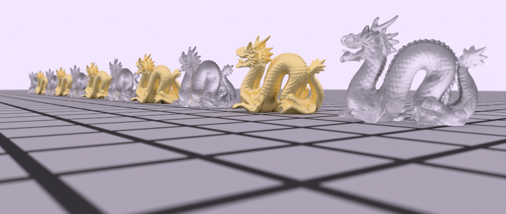
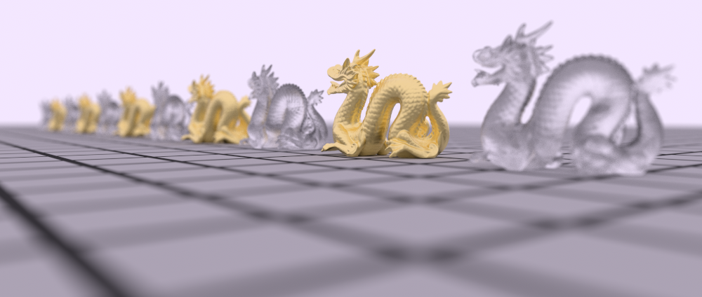
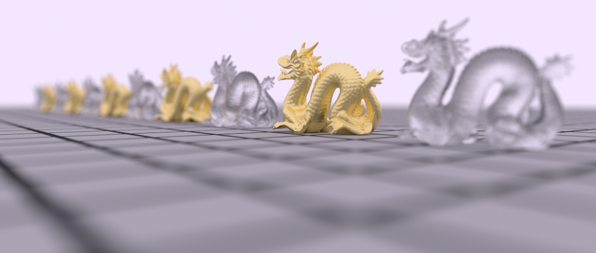
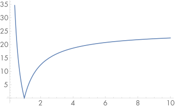
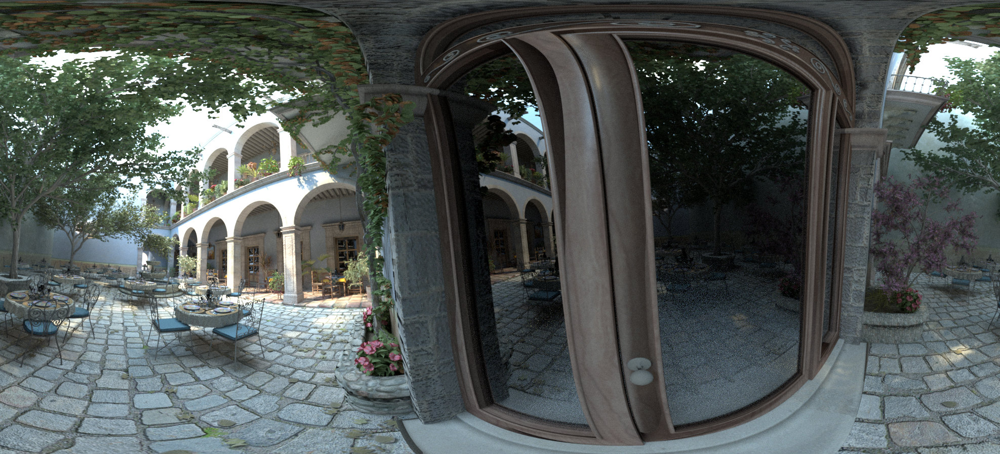
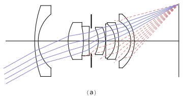
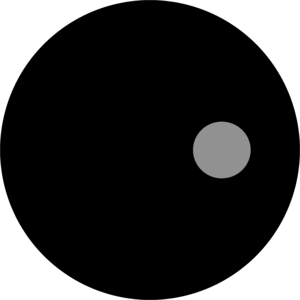
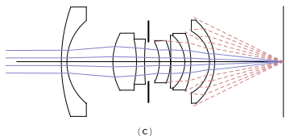

[toc]

# 6 Camera Models / 相机模型

In Chapter 1, we described the pinhole camera model that is commonly used in computer graphics. This model is easy to describe and simulate, but it neglects important effects that lenses have on light passing through them that occur with real cameras. For example, everything rendered with a pinhole camera is in sharp focus—a state of affairs not possible with real lens systems. Such images often look computer generated. More generally, the distribution of radiance leaving a lens system is quite different from the distribution entering it; modeling this effect of lenses is important for accurately simulating the radiometry of image formation.

Camera lens systems also introduce various aberrations that affect the images that they form; for example, vignetting causes a darkening toward the edges of images due to less light making it through to the edges of the film or sensor than to the center. Lenses can also cause pincushion or barrel distortion, which causes straight lines to be imaged as curves. Although lens designers work to minimize aberrations in their designs, they can still have a meaningful effect on images.

Like the Shapes from Chapter 3, cameras in pbrt are represented by an abstract base class. This chapter describes the Camera class and two of its key methods: Camera::GenerateRay() and Camera::GenerateRayDifferential(). The first method computes the world space ray corresponding to a sample position on the film plane. By generating these rays in different ways based on different models of image formation, the cameras in pbrt can create many types of images of the same 3D scene. The second method not only generates this ray but also computes information about the image area that the ray is sampling; this information is used for anti-aliasing computations in Chapter 10, for example. In Section 16.1.1, a few additional Camera methods will be introduced to support bidirectional light transport algorithms.

In this chapter, we will show a few implementations of the Camera interface, starting by implementing the ideal pinhole model with some generalizations and finishing with a fairly realistic model that simulates light passing through a collection of glass lens elements to form an image, similar to real-world cameras.

在第 1 章中，我们描述了计算机图形学中常用的针孔相机模型。这个模型很容易描述和模拟，但它忽略了镜头对通过它们的光线的重要影响，这些影响发生在真实相机上。例如，用针孔相机渲染的所有东西都清晰对焦——这是真实镜头系统无法实现的状态。这些图像通常看起来是计算机生成的。更一般地，离开透镜系统的辐射分布与进入它的分布有很大不同。对透镜的这种效果进行建模对于准确模拟图像形成的辐射度量学非常重要。

相机镜头系统还会引入影响它们形成的图像的各种畸变；例如，渐晕会导致图像边缘变暗，因为进入胶片或传感器边缘的光线少于进入中心的光线。镜头还会导致枕形或桶形失真，从而导致直线被成像为曲线。尽管镜头设计师努力尽量减少设计中的畸变，但他们仍然可以对图像产生有意义的影响。

与第 3 章中的形状一样，pbrt 中的相机由抽象基类表示。本章介绍了 Camera 类及其两个关键方法：Camera::GenerateRay() 和 Camera::GenerateRayDifferential()。第一种方法计算与胶片平面上的采样位置相对应的世界空间光线。通过基于不同的图像形成模型，以不同的方式生成这些光线，pbrt 中的相机可以创建同一 3D 场景的多种类型的图像。第二种方法不仅生成这条光线，而且计算关于光线采样的图像区域的信息；例如，此信息用于第 10 章中的反走样计算。在第 16.1.1 节中，将引入一些额外的 Camera 方法来支持双向光传输算法。

在本章中，我们将展示 Camera 接口的一些实现，从实现具有一些概括的理想针孔模型开始，然后是一个相当逼真的模型，该模型模拟光线穿过一组玻璃透镜元件以形成图像，类似于真实世界的相机。

## 6.1 Camera Model / 相机模型

The abstract Camera base class holds generic camera options and defines the interface that all camera implementations must provide. It is defined in the files core/camera.h and core/camera.cpp.

抽象 Camera 基类包含通用相机选项，并定义所有相机实现必须提供的接口。它在文件 core/camera.h 和 core/camera.cpp 中定义。

```
<<Camera Declarations>>= 
class Camera {
public:
    <<Camera Interface>> 
    <<Camera Public Data>> 
};
```

The base Camera constructor takes several parameters that are appropriate for all camera types. One of the most important is the transformation that places the camera in the scene, which is stored in the CameraToWorld member variable. The Camera stores an AnimatedTransform (rather than just a regular Transform) so that the camera itself can be moving over time.

Real-world cameras have a shutter that opens for a short period of time to expose the film to light. One result of this nonzero exposure time is motion blur: objects that are in motion relative to the camera during the exposure are blurred. All Cameras therefore store a shutter open and shutter close time and are responsible for generating rays with associated times at which to sample the scene. Given an appropriate distribution of ray times between the shutter open time and the shutter close time, it is possible to compute images that exhibit motion blur.

Cameras also contain a pointer to an instance of the Film class to represent the final image (Film is described in Section 7.9), and a pointer to a Medium instance to represent the scattering medium that the camera lies in (Medium is described in Section 11.3).

Camera implementations must pass along parameters that set these values to the Camera constructor. We will only show the constructor’s prototype here because its implementation just copies the parameters to the corresponding member variables.

基础 Camera 构造函数采用适用于所有相机类型的几个参数。其中最重要的一项是将相机放置在场景中的变换，它存储在 CameraToWorld 成员变量中。相机存储一个 AnimatedTransform（而不仅仅是一个常规的 Transform），以便相机本身可以随时间移动。

真实世界的相机有一个快门，它会打开一小段时间，让胶片暴露在光线下。这种非零曝光时间的一个结果是运动模糊：在曝光期间相对于相机运动的物体会变得模糊。因此，所有相机都会存储快门打开和快门关闭时间，并负责生成具有关联时间的光线，以便对场景进行采样。给定快门打开时间和快门关闭时间之间光线时间的适当分布，就可以计算表现出运动模糊的图像。

相机还包含一个指向 Film 类实例的指针来表示最终图像（Film 在第 7.9 节中描述），以及一个指向 Medium 实例的指针来表示相机所在的散射介质（Medium 在第 11.3 节中描述） ）。

相机实现必须将设置这些值的参数传递给相机构造函数。这里我们只会展示构造函数的原型，因为它的实现只是将参数复制到相应的成员变量中。

```
<<Camera Interface>>= 
Camera(const AnimatedTransform &CameraToWorld, Float shutterOpen,
       Float shutterClose, Film *film, const Medium *medium);
<<Camera Public Data>>= 

AnimatedTransform CameraToWorld;
const Float shutterOpen, shutterClose;
Film *film;
const Medium *medium;
```

The first method that camera subclasses need to implement is Camera::GenerateRay(), which should compute the ray corresponding to a given sample. It is important that the direction component of the returned ray be normalized—many other parts of the system will depend on this behavior.

相机子类需要实现的第一个方法是 Camera::GenerateRay()，它应该计算与给定采样对应的光线。归一化返回光线的方向分量很重要——系统的许多其他部分将依赖于这种行为。

```
<<Camera Interface>>+=  
virtual Float GenerateRay(const CameraSample &sample,
                          Ray *ray) const = 0;
```

The CameraSample structure holds all of the sample values needed to specify a camera ray. Its pFilm member gives the point on the film to which the generated ray carries radiance. The point on the lens the ray passes through is in pLens (for cameras that include the notion of lenses), and CameraSample::time gives the time at which the ray should sample the scene; implementations should use this value to linearly interpolate within the shutterOpen–shutterClose time range. (Choosing these various sample values carefully can greatly increase the quality of final images; this is the topic of much of Chapter 7.)

GenerateRay() also returns a floating-point value that affects how much the radiance arriving at the film plane along the generated ray will contribute to the final image. Simple camera models can just return a value of 1, but cameras that simulate real physical lens systems like the one in Section 6.4 set this value to indicate how much light the ray carries through the lenses based on their optical properties. (See Sections 6.4.7 and 13.6.6 for more information about how exactly this weight is computed and used.)

CameraSample 结构包含指定相机光线所需的所有采样值。它的pFilm成员给出了在胶片上生成的光线携带的辐射点。光线穿过的镜头上的点存储在 pLens 中（对于包含镜头概念的相机），CameraSample::time 给出了光线应该对场景进行采样的时间；实现应使用此值在shutterOpen–shutterClose 时间范围内进行线性插值。 （仔细选择这些不同的采样值可以大大提高最终图像的质量；这是第 7 章的大部分内容。）

GenerateRay() 还返回一个浮点值，该值影响沿生成的光线到达胶片平面的辐射对最终图像的贡献程度。简单的相机模型只能返回值 1，但模拟真实物理镜头系统（如第 6.4 节中的那个）的相机会设置此值，以给出光线根据其光学特性穿过镜头的光量。 （有关如何准确计算和使用此权重的更多信息，请参阅第 6.4.7 和 13.6.6 节。）

```
<<Camera Declarations>>+=  
struct CameraSample {
    Point2f pFilm;
    Point2f pLens;
    Float time;
};
```

The GenerateRayDifferential() method computes a main ray like GenerateRay() but also computes the corresponding rays for pixels shifted one pixel in the $x$ and $y$ directions on the film plane. This information about how camera rays change as a function of position on the film helps give other parts of the system a notion of how much of the film area a particular camera ray’s sample represents, which is particularly useful for anti-aliasing texture map lookups.

GenerateRayDifferential() 方法像 GenerateRay() 一样计算主光线，但也计算在胶片平面上在 $x$ 和 $y$ 方向上移动一个像素的像素的相应光线。有关相机光线如何随胶片上的位置而变化的信息，有助于为系统的其他部分提供特定相机光线采样代表多少胶片区域的概念，这对于反走样纹理查找特别有用。

```
<<Camera Method Definitions>>= 
Float Camera::GenerateRayDifferential(const CameraSample &sample, 
        RayDifferential *rd) const {
    Float wt = GenerateRay(sample, rd);
    <<Find camera ray after shifting one pixel in the  direction>> 
    <<Find camera ray after shifting one pixel in the  direction>> 
    rd->hasDifferentials = true;
    return wt;    
}
```

Finding the ray for one pixel over in $x$ is just a matter of initializing a new CameraSample and copying the appropriate values returned by calling GenerateRay() into the RayDifferential structure. The implementation of the fragment <<*Find ray after shifting one pixel in the $y$ direction*>> follows similarly and isn’t included here.

在 $x$ 中找到一个像素的光线的问题，只是初始化一个新的 CameraSample，并将通过调用 GenerateRay() 返回的适当值复制到 RayDifferential 结构中。片段 <<*Find ray after shifting one pixel in the $y$ direction*>> 的实现与此类似，此处不包括在内。

```
<<Find camera ray after shifting one pixel in the $x$ direction>>= 
CameraSample sshift = sample;
sshift.pFilm.x++;
Ray rx;
Float wtx = GenerateRay(sshift, &rx);
if (wtx == 0) return 0;
rd->rxOrigin = rx.o;
rd->rxDirection = rx.d;
```

### 6.1.1 Camera Coordinate Spaces / 相机坐标空间

We have already made use of two important modeling coordinate spaces, object space and world space. We will now introduce an additional coordinate space, camera space, which has the camera at its origin. We have:

- Object space: This is the coordinate system in which geometric primitives are defined. For example, spheres in pbrt are defined to be centered at the origin of their object space.

- World space: While each primitive may have its own object space, all objects in the scene are placed in relation to a single world space. Each primitive has an object-to-world transformation that determines where it is located in world space. World space is the standard frame that all other spaces are defined in terms of.

- Camera space: A camera is placed in the scene at some world space point with a particular viewing direction and orientation. This camera defines a new coordinate system with its origin at the camera's location. The $z$ axis of this coordinate system is mapped to the viewing direction, and the $y$ axis is mapped to the up direction. This is a handy space for reasoning about which objects are potentially visible to the camera. For example, if an object's camera space bounding box is entirely behind the $z=0$ plane (and the camera doesn't have a field of view wider than 180 degrees), the object will not be visible to the camera.

我们已经利用了两个重要的建模坐标空间，对象空间和世界空间。我们现在将引入一个额外的坐标空间，相机空间，它的原点是相机。我们有：

- 对象空间：这是定义几何图元的坐标系。例如，pbrt 中的球体被定义为以其对象空间的原点为中心。

- 世界空间：虽然每个图元可能有自己的对象空间，但场景中的所有对象都相对于单个世界空间放置。每个图元都有一个对象到世界的转换，用于确定它在世界空间中的位置。世界空间是所有其他空间定义的标准框架。

- 相机空间：相机放置在场景中的某个世界空间点，具有特定的观察方向和朝向。该相机定义了一个新坐标系，其原点位于相机位置。这个坐标系的 $z$ 轴映射到观察方向， $y$ 轴映射到向上方向。这是一个方便的空间，用于推理哪些对象可能对相机可见。例如，如果对象的相机空间包围盒完全位于 $z=0$ 平面之后（并且相机的视野不超过 180 度），则该对象将不会被相机看到。

## 6.2 Projective Camera Models / 投影相机模型

One of the fundamental issues in 3D computer graphics is the 3D viewing problem: how to project a 3D scene onto a 2D image for display. Most of the classic approaches can be expressed by a $4 \times 4$ projective transformation matrix. Therefore, we will introduce a projection matrix camera class, ProjectiveCamera, and then define two camera models based on it. The first implements an orthographic projection, and the other implements a perspective projection—two classic and widely used projections.

3D 计算机图形学的基本问题之一是 3D 观察问题：如何将 3D 场景投影到 2D 图像上进行显示。大多数经典方法都可以用 $4 \times 4$ 投影变换矩阵表示。因此，我们将引入一个投影矩阵相机类ProjectiveCamera，然后基于它定义两个相机模型。第一个实现了正交投影，另一个实现了透视投影——两种经典且广泛使用的投影。

```
<<Camera Declarations>>+= 
class ProjectiveCamera : public Camera {
public:
    <<ProjectiveCamera Public Methods>> 
protected:
    <<ProjectiveCamera Protected Data>> 
};
```

Three more coordinate systems (summarized in Figure 6.1) are useful for defining and discussing projective cameras:

- Screen space: Screen space is defined on the film plane. The camera projects objects in camera space onto the film plane; the parts inside the screen window are visible in the image that is generated. Depth $z$ values in screen space range from 0 to 1 , corresponding to points at the near and far clipping planes, respectively. Note that, although this is called "screen" space, it is still a 3D coordinate system, since $z$ values are meaningful.

- Normalized device coordinate (NDC) space: This is the coordinate system for the actual image being rendered. In $x$ and $y$, this space ranges from $(0,0)$ to $(1,1)$, with $(0,0)$ being the upper-left corner of the image. Depth values are the same as in screen space, and a linear transformation converts from screen to NDC space.

- Raster space: This is almost the same as NDC space, except the $x$ and $y$ coordinates range from $(0,0)$ to (resolution. $\mathrm{x}$, resolution. $\mathrm{y})$.

Projective cameras use $4 \times 4$ matrices to transform among all of these spaces, but cameras with unusual imaging characteristics can't necessarily represent all of these transformations with matrices.

另外三个坐标系（总结在图 6.1 中）对于定义和讨论投影相机很有用：

- 屏幕空间：屏幕空间定义在胶片平面上。相机将相机空间中的物体投影到胶片平面上；屏幕窗口内的部分在生成的图像中可见。屏幕空间中的深度 $z$ 值范围从 0 到 1 ，分别对应于近剪裁平面和远剪裁平面上的点。请注意，虽然这被称为“屏幕”空间，但它仍然是一个 3D 坐标系，因为 $z$ 值是有意义的。

- 标准化设备坐标 (NDC) 空间：这是正在渲染的实际图像的坐标系。在 $x$ 和 $y$ 中，此空间的范围从 $(0,0)$ 到 $(1,1)$ ，其中 $(0,0)$ 是图像的左上角。深度值与屏幕空间中的相同，线性变换将屏幕空间变换为 NDC 空间。

- 光栅空间：这与 NDC 空间几乎相同，除了 $x$ 和 $y$ 坐标范围从 $(0,0)$ 到 (resolution. $\mathrm{x}$,resolution. $\mathrm{ y})$ 。

投影相机使用 $4 \times 4$ 矩阵在所有这些空间之间进行变换，但具有不寻常成像特性的相机不一定能用矩阵表示所有这些变换。


Figure 6.1: Several camera-related coordinate spaces are commonly used to simplify the implementation of Cameras. The camera class holds transformations between them. Scene objects in world space are viewed by the camera, which sits at the origin of camera space and points along the $+z$ axis. Objects between the near and far planes are projected onto the film plane at $z=near$ in camera space. The film plane is at $z=0$ in raster space, where $x$ and $y$ range from $(0,0)$ to (resolution.x, resolution.y). Normalized device coordinate (NDC) space normalizes raster space so that $x$ and $y$ range from $(0,0)$ to $(1,1)$.

图 6.1：通常使用几个与相机相关的坐标空间来简化相机的实现。相机类保存它们之间的变换。世界空间中的场景对象由相机查看，相机位于相机空间的原点并沿 $+z$ 轴指向。近平面和远平面之间的对象在相机空间以 $z=near$ 投影到胶片平面上。胶片平面在光栅空间中位于 $z=0$ ，其中 $x$ 和 $y$ 的范围从 $(0,0)$ 到 (resolution.x, resolution.y)。归一化设备坐标 (NDC) 空间将光栅空间归一化，以便 $x$ 和 $y$ 的范围从 $(0,0)$ 到 $(1,1)$ 。

In addition to the parameters required by the Camera base class, the ProjectiveCamera takes the projective transformation matrix, the screen space extent of the image, and additional parameters related to depth of field. Depth of field, which will be described and implemented at the end of this section, simulates the blurriness of out-of-focus objects that occurs in real lens systems.

除了Camera 基类需要的参数外，ProjectiveCamera 还采用了投影变换矩阵、图像的屏幕空间范围以及与景深相关的附加参数。景深（将在本节末尾进行描述和实现）模拟真实镜头系统中出现的离焦物体的模糊度。

```
<<ProjectiveCamera Public Methods>>= 
ProjectiveCamera(const AnimatedTransform &CameraToWorld, 
        const Transform &CameraToScreen, const Bounds2f &screenWindow,
        Float shutterOpen, Float shutterClose, Float lensr, Float focald,
        Film *film, const Medium *medium)
    : Camera(CameraToWorld, shutterOpen, shutterClose, film, medium),
      CameraToScreen(CameraToScreen) {
    <<Initialize depth of field parameters>> 
    <<Compute projective camera transformations>> 
}
```

ProjectiveCamera implementations pass the projective transformation up to the base class constructor shown here. This transformation gives the camera-to-screen projection; from that, the constructor can easily compute the other transformation that will be needed, to go all the way from raster space to camera space.

ProjectiveCamera 实现将投影变换传递给此处显示的基类构造函数。这种变换提供了相机到屏幕的投影；由此，构造函数可以轻松计算所需的其他变换，从光栅空间一直到相机空间。

```
<<Compute projective camera transformations>>= 
<<Compute projective camera screen transformations>> 
RasterToCamera = Inverse(CameraToScreen) * RasterToScreen;
<<ProjectiveCamera Protected Data>>= 
Transform CameraToScreen, RasterToCamera;
```

The only nontrivial transformation to compute in the constructor is the screen-to-raster projection. In the following code, note the composition of transformations where (reading from bottom to top), we start with a point in screen space, translate so that the upper-left corner of the screen is at the origin, and then scale by the reciprocal of the screen width and height, giving us a point with $x$ and $y$ coordinates between 0 and 1 (these are NDC coordinates). Finally, we scale by the raster resolution, so that we end up covering the entire raster range from $(0,0)$ up to the overall raster resolution. An important detail here is that the $y$ coordinate is inverted by this transformation; this is necessary because increasing $y$ values move up the image in screen coordinates but down in raster coordinates.

在构造函数中计算的唯一重要变换是屏幕到光栅的投影。在下面的代码中，请注意变换的组成，其中（从下到上阅读），我们从屏幕空间中的一个点开始，进行平移，使屏幕左上角位于原点，然后按倒数进行缩放屏幕宽度和高度，给我们一个 $x$ 和 $y$ 坐标在 0 和 1 之间的点（这些是 NDC 坐标）。最后，我们按光栅分辨率进行缩放，以便最终覆盖从 $(0,0)$ 到整体光栅分辨率的整个光栅范围。这里的一个重要细节是 $y$ 坐标被这个变换反转了；这是必要的，因为增加 $y$ 值会在屏幕坐标中向上移动图像，但在光栅坐标中向下移动。

```
<<Compute projective camera screen transformations>>= 
ScreenToRaster = Scale(film->fullResolution.x, 
                       film->fullResolution.y, 1) *
    Scale(1 / (screenWindow.pMax.x - screenWindow.pMin.x),
          1 / (screenWindow.pMin.y - screenWindow.pMax.y), 1) *
    Translate(Vector3f(-screenWindow.pMin.x, -screenWindow.pMax.y, 0));
RasterToScreen = Inverse(ScreenToRaster);
<<ProjectiveCamera Protected Data>>+=  
Transform ScreenToRaster, RasterToScreen;
```

### 6.2.1 Orthographic Camera / 正交相机

```
<<OrthographicCamera Declarations>>= 
class OrthographicCamera : public ProjectiveCamera {
public:
    <<OrthographicCamera Public Methods>> 
private:
    <<OrthographicCamera Private Data>> 
};
```

The orthographic camera, defined in the files cameras/orthographic.h and cameras/orthographic.cpp, is based on the orthographic projection transformation. The orthographic transformation takes a rectangular region of the scene and projects it onto the front face of the box that defines the region. It doesn’t give the effect of foreshortening—objects becoming smaller on the image plane as they get farther away—but it does leave parallel lines parallel, and it preserves relative distance between objects. Figure 6.2 shows how this rectangular volume defines the visible region of the scene.

在文件cameras/orthographic.h 和cameras/orthographic.cpp 中定义的正交相机基于正交投影变换。正交变换采用场景的一个矩形区域并将其投影到定义该区域的盒的正面。它不会产生透视效果——物体在图像平面上随着距离变远而变小——但它确实使平行线平行，并且它保持了物体之间的相对距离。图 6.2 显示了这个矩形体积如何定义场景的可见区域。


Figure 6.2: The orthographic view volume is an axis-aligned box in camera space, defined such that objects inside the region are projected onto the $z=near$ face of the box.

图 6.2：正交视图体是相机空间中轴对齐的盒，定义为区域内的对象投影到盒的 $z=near$ 面上。

Figure 6.3 compares the result of using the orthographic projection for rendering to the perspective projection defined in the next section.

图 6.3 比较了使用正交投影进行渲染与下一节中定义的透视投影的结果。


Figure 6.3: Car Model Rendered with Different Camera Models. Car rendered from the same viewpoint with (1) orthographic and (2) perspective cameras. The lack of foreshortening makes the orthographic view feel like it has less depth, although it does preserve parallel lines, which can be a useful property.

图 6.3：使用不同相机模型渲染的汽车模型。使用 (1) 正交和 (2) 透视相机从同一视点渲染的汽车。缺少透视使正交视图感觉深度较小，尽管它确实保留了平行线，这可能是一个有用的属性。

The orthographic camera constructor generates the orthographic transformation matrix with the Orthographic() function, which will be defined shortly.

正交相机构造函数使用 Orthographic() 函数生成正交变换矩阵，稍后将对其进行定义。

```
<<OrthographicCamera Public Methods>>= 
OrthographicCamera(const AnimatedTransform &CameraToWorld,
        const Bounds2f &screenWindow, Float shutterOpen,
        Float shutterClose, Float lensRadius, Float focalDistance,
        Film *film, const Medium *medium)
    : ProjectiveCamera(CameraToWorld, Orthographic(0, 1),
                       screenWindow, shutterOpen, shutterClose,
                       lensRadius, focalDistance, film, medium) {
    <<Compute differential changes in origin for orthographic camera rays>> 
}
```

The orthographic viewing transformation leaves $x$ and $y$ coordinates unchanged but maps $z$ values at the near plane to 0 and $z$ values at the far plane to 1 . To do this, the scene is first translated along the $z$ axis so that the near plane is aligned with $z=0$. Then, the scene is scaled in $z$ so that the far plane maps to $z=1$. The composition of these two transformations gives the overall transformation. (For a ray tracer like pbrt, we'd like the near plane to be at 0 so that rays start at the plane that goes through the camera's position; the far plane offset doesn't particularly matter.)

正交视图变换保持​​ $x$ 和 $y$ 坐标不变，但将近平面的 $z$ 值映射到 0 ，将远平面的 $z$ 值映射到 1 。为此，首先沿 $z$ 轴平移场景，以便近平面与 $z=0$ 对齐。然后，场景以 $z$ 缩放，以便远平面映射到 $z=1$ 。这两个变换的组合给出了整体变换。 （对于像 pbrt 这样的光线追踪器，我们希望近平面为 0，以便光线从穿过相机位置的平面开始；远平面偏移并不特别重要。）

```
<<Transform Method Definitions>>+=  
Transform Orthographic(Float zNear, Float zFar) {
    return Scale(1, 1, 1 / (zFar - zNear)) *
           Translate(Vector3f(0, 0, -zNear));
}
```

Thanks to the simplicity of the orthographic projection, it's easy to directly compute the differential rays in the $x$ and $y$ directions in the GenerateRayDifferential() method. The directions of the differential rays will be the same as the main ray (as they are for all rays generated by an orthographic camera), and the difference in origins will be the same for all rays. Therefore, the constructor here precomputes how much the ray origins shift in camera space coordinates due to a single pixel shift in the $x$ and $y$ directions on the film plane.

由于正交投影的简单性，在 GenerateRayDifferential() 方法中很容易直接计算 $x$ 和 $y$ 方向的微分光线。微分光线的方向将与主光线相同（对于正交相机生成的所有光线也是如此），并且所有光线的原点差异将相同。因此，这里的构造函数预先计算了由于胶片平面上 $x$ 和 $y$ 方向上的单个像素偏移，而导致的光线原点在相机空间坐标中的偏移量。

```
<<Compute differential changes in origin for orthographic camera rays>>= 
dxCamera = RasterToCamera(Vector3f(1, 0, 0));
dyCamera = RasterToCamera(Vector3f(0, 1, 0));
<<OrthographicCamera Private Data>>= 
Vector3f dxCamera, dyCamera;
```

We can now go through the code to take a sample point in raster space and turn it into a camera ray. The process is summarized in Figure 6.4. First, the raster space sample position is transformed into a point in camera space, giving a point located on the near plane, which is the origin of the camera ray. Because the camera space viewing direction points down the $z$ axis, the camera space ray direction is $(0,0,1)$.

我们现在可以通过代码在光栅空间中获取一个采样点并将其转换为相机光线。图 6.4 总结了该过程。首先，将光栅空间采样位置转化为相机空间中的一个点，给出位于近平面上的一个点，即相机光线的原点。因为相机空间观察方向指向 $z$ 轴下方，所以相机空间光线方向为 $(0,0,1)$ 。


Figure 6.4: To create a ray with the orthographic camera, a raster space position on the film plane is transformed to camera space, giving the ray's origin on the near plane. The ray's direction in camera space is $(0,0,1)$, down the $z$ axis.

图 6.4：为了使用正交相机创建光线，胶片平面上的光栅空间位置被变换为相机空间，在近平面上给出光线的原点。光线在相机空间中的方向是 $(0,0,1)$ ，沿 $z$ 轴向下。

If depth of field has been enabled for this scene, the ray's origin and direction are modified so that depth of field is simulated. Depth of field will be explained later in this section. The ray's time value is set by linearly interpolating between the shutter open and shutter close times by the CameraSample::time offset (which is in the range $[0,1)$ ). Finally, the ray is transformed into world space before being returned.

如果已为此场景启用景深，则会修改光线的原点和方向，以便模拟景深。本节稍后将解释景深。光线的时间值是通过 CameraSample::time 偏移（在 $[0,1)$ 范围内）在快门打开和快门关闭时间之间进行线性插值来设置的。最后，光线在返回之前被变换到世界空间。

```
<<OrthographicCamera Definitions>>= 
Float OrthographicCamera::GenerateRay(const CameraSample &sample,
        Ray *ray) const {
    <<Compute raster and camera sample positions>> 
    *ray = Ray(pCamera, Vector3f(0, 0, 1));
    <<Modify ray for depth of field>> 
    ray->time = Lerp(sample.time, shutterOpen, shutterClose);
    ray->medium = medium;
    *ray = CameraToWorld(*ray);
    return 1;
}
```

Once all of the transformation matrices have been set up, it’s easy to transform the raster space sample point to camera space.

一旦设置了所有变换矩阵，就很容易将光栅空间采样点变换到相机空间。

```
<<Compute raster and camera sample positions>>= 
Point3f pFilm = Point3f(sample.pFilm.x, sample.pFilm.y, 0);
Point3f pCamera = RasterToCamera(pFilm);
```

The implementation of GenerateRayDifferential() performs the same computation to generate the main camera ray. The differential ray origins are found using the offsets computed in the OrthographicCamera constructor, and then the full ray differential is transformed to world space.

GenerateRayDifferential() 的实现执行相同的计算来生成主摄像机光线。使用 OrthographicCamera 构造函数中计算出的偏移量找到微分光线原点，然后将完整的光线微分变换到世界空间。

```
<<OrthographicCamera Definitions>>+= 
Float OrthographicCamera::GenerateRayDifferential(
        const CameraSample &sample, RayDifferential *ray) const {
    <<Compute main orthographic viewing ray>> 
    <<Compute ray differentials for OrthographicCamera>> 
    ray->time = Lerp(sample.time, shutterOpen, shutterClose);
    ray->hasDifferentials = true;
    ray->medium = medium;
    *ray = CameraToWorld(*ray);
    return 1;
}

<<Compute ray differentials for OrthographicCamera>>= 
if (lensRadius > 0) {
    <<Compute OrthographicCamera ray differentials accounting for lens>> 
} else {
    ray->rxOrigin = ray->o + dxCamera;
    ray->ryOrigin = ray->o + dyCamera;
    ray->rxDirection = ray->ryDirection = ray->d;
}
```

### 6.2.2 Perspective Camera / 透视相机

The perspective projection is similar to the orthographic projection in that it projects a volume of space onto a 2D film plane. However, it includes the effect of foreshortening: objects that are far away are projected to be smaller than objects of the same size that are closer. Unlike the orthographic projection, the perspective projection doesn’t preserve distances or angles, and parallel lines no longer remain parallel. The perspective projection is a reasonably close match to how an eye or camera lens generates images of the 3D world. The perspective camera is implemented in the files cameras/perspective.h and cameras/perspective.cpp.

透视投影类似于正交投影，因为它将空间体积投影到 2D 胶片平面上。然而，它包括透视效果：远处的物体被投影成比近处的相同尺寸的物体小。与正交投影不同，透视投影不保留距离或角度，并且平行线不再保持平行。透视投影与眼睛或相机镜头生成 3D 世界图像的方式相当接近。透视相机在文件cameras/perspective.h 和cameras/perspective.cpp 中实现。

```
<<PerspectiveCamera Declarations>>= 
class PerspectiveCamera : public ProjectiveCamera {
public:
    <<PerspectiveCamera Public Methods>> 
private:
    <<PerspectiveCamera Private Data>> 
};

<<PerspectiveCamera Method Definitions>>= 
PerspectiveCamera::PerspectiveCamera(
        const AnimatedTransform &CameraToWorld,
        const Bounds2f &screenWindow, Float shutterOpen,
        Float shutterClose, Float lensRadius, Float focalDistance,
        Float fov, Film *film, const Medium *medium)
    : ProjectiveCamera(CameraToWorld, Perspective(fov, 1e-2f, 1000.f),
                       screenWindow, shutterOpen, shutterClose,
                       lensRadius, focalDistance, film, medium) {
    <<Compute differential changes in origin for perspective camera rays>> 
    <<Compute image plane bounds at  for PerspectiveCamera>> 
}
```

The perspective projection describes perspective viewing of the scene. Points in the scene are projected onto a viewing plane perpendicular to the $z$ axis. The Perspective() function computes this transformation; it takes a field-of-view angle in fov and the distances to a near $z$ plane and a far $z$ plane. After the perspective projection, points at the near $z$ plane are mapped to have $z=0$, and points at the far plane have $z=1$ (Figure 6.5). For rendering systems based on rasterization, it's important to set the positions of these planes carefully; they determine the $z$ range of the scene that is rendered, but setting them with too many orders of magnitude variation between their values can lead to numerical precision errors. For ray tracers like pbrt, they can be set arbitrarily as they are here.

透视投影描述了场景的透视图。场景中的点投影到垂直于 $z$ 轴的观察平面上。 Perspective() 函数计算这个变换；它需要 fov 中的视场角以及到近 $z$ 平面和远 $z$ 平面的距离。透视投影后，近 $z$ 平面的点被映射为 $z=0$ ，远平面的点被映射为 $z=1$（图6.5）。对于基于光栅化的渲染系统，仔细设置这些平面的位置很重要；它们决定了渲染场景的 $z$ 范围，但是在它们的值之间设置太多数量级的变化会导致数值精度错误。对于像 pbrt 这样的光线追踪器，它们可以像这里一样任意设置。


Figure 6.5: The perspective transformation matrix projects points in camera space onto the film plane. The $x^{\prime}$ and $y^{\prime}$ coordinates of the projected points are equal to the unprojected $x$ and $y$ coordinates divided by the $z$ coordinate. The projected $z^{\prime}$ coordinate is computed so that points on the near plane map to $z^{\prime}=0$ and points on the far plane map to $z^{\prime}=1$.

图 6.5：透视变换矩阵将相机空间中的点投影到胶片平面上。投影点的 $x^{\prime}$ 和 $y^{\prime}$ 坐标等于未投影的 $x$ 和 $y$ 坐标除以 $z$ 坐标。计算投影的 $z^{\prime}$ 坐标，使得近平面上的点映射到 $z^{\prime}=0$ ，远平面上的点映射到 $z^{\prime}=1$ .

```
<<Transform Method Definitions>>+= 
Transform Perspective(Float fov, Float n, Float f) {
    <<Perform projective divide for perspective projection>> 
    <<Scale canonical perspective view to specified field of view>> 
}
```

The transformation is most easily understood in two steps:

变换最容易理解为两个步骤：

1. Points p in camera space are projected onto the viewing plane. A bit of algebra shows that the projected $x^{\prime}$ and $y^{\prime}$ coordinates on the viewing plane can be computed by dividing $x$ and $y$ by the point's $z$ coordinate value. The projected $z$ depth is remapped so that $z$ values at the near plane are 0 and $z$ values at the far plane are 1 . The computation we'd like to do is

相机空间中的点 p 被投影到观察平面上。一些代数表明，可以通过将 $x$ 和 $y$ 除以点的 $z$ 坐标值来计算在观察平面上投影的 $x^{\prime}$ 和 $y^{\prime}$ 坐标。投影的 $z$ 深度被重新映射，使得近平面的 $z$ 值为 0 ，远平面的 $z$ 值为 1 。我们想要做的计算是

$$
\begin{array}{l}
x^{\prime}=x / z \\
y^{\prime}=y / z \\
z^{\prime}=\frac{f(z-n)}{z(f-n)}
\end{array}
$$

All of this computation can be encoded in a $4 \times 4$ matrix using homogeneous coordinates:

所有这些计算都可以使用齐次坐标在 $4 \times 4$ 矩阵中编码：

$$
\left[\begin{array}{cccc}
1 & 0 & 0 & 0 \\
0 & 1 & 0 & 0 \\
0 & 0 & \frac{f}{f-n} & -\frac{f n}{f-n} \\
0 & 0 & 1 & 0
\end{array}\right]
$$

```
<<Perform projective divide for perspective projection>>= 
Matrix4x4 persp(1, 0,           0,              0,
                0, 1,           0,              0,
                0, 0, f / (f - n), -f*n / (f - n),
                0, 0,           1,              0);
```

2. The angular field of view (fov) specified by the user is accounted for by scaling the $(x, y)$ values on the projection plane so that points inside the field of view project to coordinates between $[-1,1]$ on the view plane. For square images, both $x$ and $y$ lie between $[-1,1]$ in screen space. Otherwise, the direction in which the image is narrower maps to $[-1,1]$, and the wider direction maps to a proportionally larger range of screen space values. Recall that the tangent is equal to the ratio of the opposite side of a right triangle to the adjacent side. Here the adjacent side has length 1 , so the opposite side has the length $\tan (fov / 2)$. Scaling by the reciprocal of this length maps the field of view to range from $[-1,1]$.

用户指定的视场角 (fov) 通过缩放投影平面上的 $(x, y)$ 值来考虑，以便视场内的点投影到在观察平面上 $[-1,1]$ 之间的坐标。对于方形图像， $x$ 和 $y$ 在屏幕空间中都位于 $[-1,1]$ 之间。否则，图像较窄的方向映射到 $[-1,1]$ ，而较宽的方向映射到按比例增大的屏幕空间值范围。回想一下，切线等于直角三角形的对边与相邻边的比值。这里相邻边的长度为 1 ，所以对边的长度为 $\tan (fov / 2)$ 。通过此长度的倒数缩放将视场映射到 $[-1,1]$ 的范围内。

```
<<Scale canonical perspective view to specified field of view>>= 
Float invTanAng = 1 / std::tan(Radians(fov) / 2);
return Scale(invTanAng, invTanAng, 1) * Transform(persp);
```

Similar to the OrthographicCamera, information about how the camera rays generated by the PerspectiveCamera change as we shift pixels on the film plane can be precomputed in the constructor. Here, we compute the change in position on the near perspective plane in camera space with respect to shifts in pixel location.

与 OrthographicCamera 类似，可以在构造函数中预先计算有关在我们移动胶片平面上的像素时，由 PerspectiveCamera 生成的相机光线如何变化的信息。在这里，我们计算相机空间中近透视平面上相对于像素位置偏移的位置变化。

```
<<Compute differential changes in origin for perspective camera rays>>= 
dxCamera = (RasterToCamera(Point3f(1, 0, 0)) -
            RasterToCamera(Point3f(0, 0, 0)));
dyCamera = (RasterToCamera(Point3f(0, 1, 0)) -
            RasterToCamera(Point3f(0, 0, 0)));
<<PerspectiveCamera Private Data>>= 
Vector3f dxCamera, dyCamera;
```

With the perspective projection, all rays originate from the origin, $(0,0,0)$, in camera space. A ray's direction is given by the vector from the origin to the point on the near plane, pCamera, that corresponds to the provided CameraSample's pFilm location. In other words, the ray's vector direction is component-wise equal to this point's position, so rather than doing a useless subtraction to compute the direction, we just initialize the direction directly from the point pCamera.

对于透视投影，所有光线都源自相机空间中的原点 $(0,0,0)$ 。光线的方向由从原点到近平面 pCamera 上的点的向量给出，对应于提供的 CameraSample 的 pFilm 位置。换句话说，光线的向量方向在分量上等于该点的位置，因此与其进行无用的减法来计算方向，不如直接从点 pCamera 初始化方向。

```
<<PerspectiveCamera Method Definitions>>+=  
Float PerspectiveCamera::GenerateRay(const CameraSample &sample,
        Ray *ray) const {
    <<Compute raster and camera sample positions>> 
    *ray = Ray(Point3f(0, 0, 0), Normalize(Vector3f(pCamera)));
    <<Modify ray for depth of field>> 
    ray->time = Lerp(sample.time, shutterOpen, shutterClose);
    ray->medium = medium;
    *ray = CameraToWorld(*ray);
    return 1;
}
```

The GenerateRayDifferential() method follows the implementation of GenerateRay(), except for an additional fragment that computes the differential rays.

GenerateRayDifferential() 方法遵循 GenerateRay() 的实现，除了计算微分光线的附加片段。

```
<<PerspectiveCamera Public Methods>>= 
Float GenerateRayDifferential(const CameraSample &sample,
                              RayDifferential *ray) const;
<<Compute offset rays for PerspectiveCamera ray differentials>>= 
if (lensRadius > 0) {
    <<Compute PerspectiveCamera ray differentials accounting for lens>> 
} else {
    ray->rxOrigin = ray->ryOrigin = ray->o;
    ray->rxDirection = Normalize(Vector3f(pCamera) + dxCamera);
    ray->ryDirection = Normalize(Vector3f(pCamera) + dyCamera);
}
```

### 6.2.3 The Thin Lens Model and Depth of Field / 薄透镜模型和景深

An ideal pinhole camera that only allows rays passing through a single point to reach the film isn’t physically realizable; while it’s possible to make cameras with extremely small apertures that approach this behavior, small apertures allow relatively little light to reach the film sensor. With a small aperture, long exposure times are required to capture enough photons to accurately capture the image, which in turn can lead to blur from objects in the scene moving while the camera shutter is open.

Real cameras have lens systems that focus light through a finite-sized aperture onto the film plane. Camera designers (and photographers using cameras with adjustable apertures) face a trade-off: the larger the aperture, the more light reaches the film and the shorter the exposures that are needed. However, lenses can only focus on a single plane (the focal plane), and the farther objects in the scene are from this plane, the blurrier they are. The larger the aperture, the more pronounced this effect is: objects at depths different from the one the lens system has in focus become increasingly blurry.

The camera model in Section 6.4 implements a fairly accurate simulation of lens systems in realistic cameras. For the simple camera models introduced so far, we can apply a classic approximation from optics, the thin lens approximation, to model the effect of finite apertures with traditional computer graphics projection models. The thin lens approximation models an optical system as a single lens with spherical profiles, where the thickness of the lens is small relative to the radius of curvature of the lens. (The more general thick lens approximation, which doesn’t assume that the lens’s thickness is negligible, is introduced in Section 6.4.3.)

Under the thin lens approximation, incident rays that are parallel to the optical axis and pass through the lens focus at a point behind the lens called the focal point. The distance the focal point is behind the lens, $f$, is the lens's focal length. If the film plane is placed at a distance equal to the focal length behind the lens, then objects infinitely far away will be in focus, as they image to a single point on the film.

Figure 6.6 illustrates the basic setting. Here we've followed the typical lens coordinate system convention of placing the lens perpendicular to the $z$ axis, with the lens at $z=0$ and the scene along $-z$. (Note that this is a different coordinate system from the one we used for camera space, where the viewing direction is $+z$.) Distances on the scene side of the lens are denoted with unprimed variables $z$, and distances on the film side of the lens (positive $z$ ) are primed, $z^{\prime}$.

理想的针孔相机只允许光线通过一个点到达胶片，这在物理上是不可实现的；虽然可以制造接近这种行为的极小光圈相机，但小光圈允许相对较少的光线到达胶片传感器。对于小光圈，需要较长的曝光时间才能捕获足够的光子以准确捕获图像，这反过来会导致在相机快门打开时场景中移动的物体产生模糊。

真正的相机具有镜头系统，可将光线通过有限尺寸的光圈聚焦到胶片平面上。相机设计师（以及使用可调光圈相机的摄影师）面临着一个权衡：光圈越大，到达胶片的光线越多，所需的曝光时间越短。但是，镜头只能聚焦在一个平面（焦平面）上，场景中的物体离这个平面越远，它们就越模糊。光圈越大，这种效果就越明显：深度与镜头系统对焦不同的物体变得越来越模糊。

第 6.4 节中的相机模型实现了对真实相机中镜头系统的相当准确的模拟。对于目前介绍的简单相机模型，我们可以应用光学的经典近似，即薄透镜近似，用传统的计算机图形投影模型对有限光圈的效果进行建模。薄透镜近似将光学系统建模为具有球面轮廓的单个透镜，其中透镜的厚度相对于透镜的曲率半径较小。 （更一般的厚透镜近似，它不假设透镜的厚度可以忽略不计，在第 6.4.3 节中介绍。）

在薄透镜近似下，平行于光轴并穿过透镜的入射光线聚焦在透镜后面的一点，称为焦点。焦点在镜头后面的距离 $f$ 是镜头的焦距。如果将胶片平面放置在与镜头后面焦距相等的距离处，那么无限远的物体将处于对焦状态，因为它们会成像到胶片上的一个点上。

图6.6说明了基本设置。在这里，我们遵循了典型的镜头坐标系约定，将镜头垂直于 $z$ 轴放置，镜头位于 $z=0$ ，场景沿 $-z$ 。 （请注意，这是一个不同于我们用于相机空间的坐标系，其中观察方向为 $+z$ 。）镜头场景侧的距离用未加 $\prime$ 的变量 $z$ 表示，而镜头胶片侧的距离（正 $z$ ）已加 $\prime$ ， $z^{\prime}$ 。


Figure 6.6: A thin lens, located along the $z$ axis at $z=0$. Incident rays that are parallel to the optical axis and pass through a thin lens (dashed lines) all pass through a point $\mathrm{p}$, the focal point. The distance between the lens and the focal point, $f$, is the lens's focal length.

图 6.6：沿 $z$ 轴位于 $z=0$ 处的薄透镜。平行于光轴并通过薄透镜（虚线）的入射光线都通过一个点 $\mathrm{p}$ ，即焦点。镜头与焦点之间的距离 $f$ 是镜头的焦距。

For points in the scene at a depth $z$ from a thin lens with focal length $f$, the Gaussian lens equation relates the distances from the object to the lens and from lens to the image of the point:

对于焦距为 $f$ 的薄透镜在深度 $z$ 处的场景中的点，高斯透镜方程将物体到透镜，以及从透镜到点的图像的距离联系起来：

$$
\frac{1}{z^{\prime}}-\frac{1}{z}=\frac{1}{f}
$$

(6.1)

Note that for $z=-\infty$, we have $z^{\prime}=f$, as expected.

We can use the Gaussian lens equation to solve for the distance between the lens and the film that sets the plane of focus at some $z$, the focal distance (Figure 6.7):

请注意，对于 $z=-\infty$ ，正如预期的那样，我们有 $z^{\prime}=f$ 。

我们可以使用高斯透镜方程来求解镜头和胶片之间的距离，该距离将焦平面设置为某个 $z$ ，即焦距（图 6.7）：

$$
z^{\prime}=\frac{f z}{f+z}
$$

(6.2)


Figure 6.7: To focus a thin lens at a depth $z$ in the scene, Equation (6.2) can be used to compute the distance $z^{\prime}$ on the film side of the lens that points at $z$ focus to. Focusing is performed by adjusting the distance between the lens and the film plane.

图 6.7：为了将薄透镜聚焦在场景中的深度 $z$ ，方程（6.2）可用于计算镜头胶片侧指向 $z$ 焦点的距离 $z^{\prime}$ 。聚焦是通过调整镜头与胶片平面之间的距离来实现的。

A point that doesn’t lie on the plane of focus is imaged to a disk on the film plane, rather than to a single point. The boundary of this disk is called the circle of confusion. The size of the circle of confusion is affected by the diameter of the aperture that light rays pass through, the focal distance, and the distance between the object and the lens. Figure 6.8 shows this effect, depth of field, in a scene with a series of copies of the dragon model. As the size of the lens aperture increases, blurriness increases the farther a point is from the plane of focus. Note that the second dragon from the right remains in focus throughout all of the images, as the plane of focus has been placed at its depth.

不在焦平面上的点被成像到胶片平面上的圆盘上，而不是单个点上。这个圆盘的边界称为弥散圆。弥散圆的大小受光线穿过的光圈直径、焦距以及物体与镜头之间的距离的影响。图 6.8 在具有一系列龙模型副本的场景中显示了这种景深效果。随着镜头光圈尺寸的增加，离焦平面越远的点越模糊。请注意，从右数第二条龙在所有图像中都保持对焦，因为焦点平面已放置在其深度处。








Figure 6.8: (1) Scene rendered with no depth of field, (2) depth of field due to a relatively small lens aperture, which gives only a small amount of blurriness in the out-of-focus regions, (3) and (4) As the size of the lens aperture increases, the size of the circle of confusion in the out-of-focus areas increases, giving a greater amount of blur on the film plane.

图 6.8：(1) 没有景深渲染的场景，(2) 由于镜头光圈相对较小，因此景深在离焦区域只有少量模糊，(3) 和 ( 4) 随着镜头光圈尺寸的增加，离焦区域的弥散圆的尺寸也随之增加，从而在胶片平面上产生更大的模糊量。

Figure 6.9 shows depth of field used to render the landscape scene. Note how the effect draws the viewer’s eye to the in-focus grass in the center of the image.

图 6.9 显示了用于渲染风景场景的景深。请注意效果如何将观察者的视线吸引到图像中心的对焦草丛上。


Figure 6.9: Depth of field gives a greater sense of depth and scale to this part of the landscape scene. (Scene courtesy of Laubwerk.)

图 6.9：景深为景观场景的这一部分提供了更大的深度和比例感。 （场景由 Laubwerk 提供。）

In practice, objects do not have to be exactly on the plane of focus to appear in sharp focus; as long as the circle of confusion is roughly smaller than a pixel on the film sensor, objects appear to be in focus. The range of distances from the lens at which objects appear in focus is called the lens’s depth of field.

The Gaussian lens equation also lets us compute the size of the circle of confusion; given a lens with focal length $f$ that is focused at a distance $z_{\mathrm{f}}$, the film plane is at $z_{\mathrm{f}}^{\prime}$. Given another point at depth $z$, the Gaussian lens equation gives the distance $z^{\prime}$ that the lens focuses the point to. This point is either in front of or behind the film plane; Figure $6.10($ a) shows the case where it is behind.

在实践中，物体不必完全在焦平面上才能出现清晰的焦点；只要弥散圆大致小于胶片传感器上的一个像素，物体就会清晰对焦。物体出现在焦点上时距镜头的距离范围称为镜头的景深。

高斯透镜方程还可以让我们计算弥散圆的大小；给定焦距为 $f$ 的镜头聚焦在距离 $z_{\mathrm{f}}$ 处，胶片平面位于 $z_{\mathrm{f}}^{\prime}$ 。给定深度 $z$ 处的另一个点，高斯透镜方程给出透镜聚焦点的距离 $z^{\prime}$ 。该点在胶片平面的前面或后面；图 $6.10($a) 显示了它在后面的情况。


Figure 6.10: (a) If a thin lens with focal length $f$ is focused at some depth $z_{\mathrm{f}}$, then the distance from the lens to the film plane is $z_{\mathrm{f}}^{\prime}$, given by the Gaussian lens equation. A point in the scene at depth $z \neq z_{\mathrm{f}}$ will be imaged as a circle on the film plane; here $z$ focuses at $z^{\prime}$, which is behind the film plane. (b) To compute the diameter of the circle of confusion, we can apply similar triangles: the ratio of $d_{1}$, the diameter of the lens, to $z^{\prime}$ must be the same as the ratio of $d_{\mathrm{c}}$, the diameter of the circle of confusion, to $z^{\prime}-z_{\mathrm{f}}^{\prime}$

图 6.10：(a) 如果焦距为 $f$ 的薄透镜聚焦在某个深度 $z_{\mathrm{f}}$ ，那么从镜头到胶片平面的距离为 $z_{\mathrm{f }}^{\prime}$ ，由高斯透镜方程给出。场景中深度 $z \neq z_{\mathrm{f}}$ 的一个点将被成像为胶片平面上的一个圆；这里 $z$ 聚焦在 $z^{\prime}$ ，它在胶片平面后面。 (b) 为了计算弥散圆的直径，我们可以应用相似三角形：透镜直径 $d_{1}$ 与 $z^{\prime}$ 的比率必须与 $d_{\mathrm{c}}$（弥散圆的直径）与 $z^{\prime}-z_{\mathrm{f}}^{\prime}$​ 的比率一致

The diameter of the circle of confusion is given by the intersection of the cone between $z^{\prime}$ and the lens with the film plane. If we know the diameter of the lens $d_{1}$, then we can use similar triangles to solve for the diameter of the circle of confusion $d_{\mathrm{c}}$ (Figure 6.10):

弥散圆的直径由 $z^{\prime}$ 和镜头与胶片平面之间锥体的交点给出。如果我们知道透镜的直径 $d_{1}$ ，那么我们可以用相似三角形来求解弥散圆的直径 $d_{\mathrm{c}}$（图6.10):

$$
\frac{d_{\mathrm{l}}}{z^{\prime}}=\frac{d_{\mathrm{c}}}{\left|z^{\prime}-z_{\mathrm{f}}^{\prime}\right|}
$$

Solving for $d_{\mathrm{c}}$, we have

求解 $d_{\mathrm{c}}$ ，我们有

$$
d_{\mathrm{c}}=\left|\frac{d_{\mathrm{l}}\left(z^{\prime}-z_{\mathrm{f}}^{\prime}\right)}{z^{\prime}}\right|
$$

Applying the Gaussian lens equation to express the result in terms of scene depths, we can find that

应用高斯透镜方程用场景深度来表达结果，我们可以发现

$$
d_{\mathrm{c}}=\left|\frac{d_{\mathrm{l}} f\left(z-z_{\mathrm{f}}\right)}{z\left(f+z_{\mathrm{f}}\right)}\right|
$$

Note that the diameter of the circle of confusion is proportional to the diameter of the lens. The lens diameter is often expressed as the lens's $f$ -number $n$, which expresses diameter as a fraction of focal length, $d_{\mathrm{l}}=f / n$

Figure 6.11 shows a graph of this function for a 50-mm focal length lens with a 25-mm aperture, focused at $z_{\mathrm{f}}=1 \mathrm{~m}$. Note that the blur is asymmetric with depth around the focal plane and grows much more quickly for objects in front of the plane of focus than for objects behind it.

请注意，弥散圆的直径与镜头的直径成正比。镜头直径通常表示为镜头的 $f$ -number $n$ ，将直径表示为焦距的分量， $d_{\mathrm{l}}=f / n$

图 6.11 显示了该函数的图表，用于具有 25 毫米光圈的 50 毫米焦距镜头，聚焦在 $z_{\mathrm{f}}=1 \mathrm{~m}$ 。请注意，模糊与焦平面周围的深度不对称，并且焦平面前方的物体比焦平面后面的物体增长得更快。



Figure 6.11: The diameter of the circle of confusion as a function of depth for a 50-mm focal length lens with 25-mm aperture, focused at 1 meter.

Modeling a thin lens in a ray tracer is remarkably straightforward: all that is necessary is to choose a point on the lens and find the appropriate ray that starts on the lens at that point such that objects in the plane of focus are in focus on the film (Figure 6.12). Therefore, projective cameras take two extra parameters for depth of field: one sets the size of the lens aperture, and the other sets the focal distance.

图 6.11：对于 50 毫米焦距、25 毫米光圈、1 米聚焦的镜头，作为深度函数的弥散圆直径。

在光线追踪器中对薄透镜进行建模非常简单：所需要做的就是在透镜上选择一个点，并找到从该点开始在透镜上的合适光线，这样焦平面中的物体就会在胶片上聚焦（图 6.12）。因此，投影相机需要两个额外的景深参数：一个设置镜头光圈的大小，另一个设置焦距。


Figure 6.12: (a) For a pinhole camera model, a single camera ray is associated with each point on the film plane (filled circle), given by the ray that passes through the single point of the pinhole lens (empty circle). (b) For a camera model with a finite aperture, we sample a point (filled circle) on the disk-shaped lens for each ray. We then compute the ray that passes through the center of the lens (corresponding to the pinhole model) and the point where it intersects the plane of focus (solid line). We know that all objects in the plane of focus must be in focus, regardless of the lens sample position. Therefore, the ray corresponding to the lens position sample (dashed line) is given by the ray starting on the lens sample point and passing through the computed intersection point on the plane of focus.

图 6.12：(a) 对于针孔相机模型，单条相机光线与胶片平面上的每个点（实心圆）相关联，由穿过针孔镜头单点（空心圆）的光线给出。 (b) 对于具有有限光圈的相机模型，我们在圆盘形镜头上为每条光线采样一个点（实心圆）。然后我们计算穿过透镜中心的光线（对应于针孔模型）和它与焦平面相交的点（实线）。我们知道，无论镜头采样位置如何，焦平面内的所有物体都必须处于对焦状态。因此，对应于镜头位置采样（虚线）的光线，由从镜头采样点开始，并通过焦平面上计算出的交点的光线给出。

```
<<ProjectiveCamera Protected Data>>+= 
Float lensRadius, focalDistance;

<<Initialize depth of field parameters>>= 
lensRadius = lensr;
focalDistance = focald;
```

It is generally necessary to trace many rays for each image pixel in order to adequately sample the lens for smooth depth of field. Figure 6.13 shows the landscape scene from Figure 6.9 with only four samples per pixel (Figure 6.9 had 2048 samples per pixel).

通常需要为每个图像像素跟踪许多光线，以便对镜头进行充分采样以获得平滑的景深。图 6.13 显示了图 6.9 中的风景场景，每个像素只有四个采样（图 6.9 每个像素有 2048 个采样）。


Figure 6.13: Landscape scene with depth of field and only four samples per pixel: the depth of field is undersampled and the image is grainy. (Scene courtesy of Laubwerk.)

图 6.13：具有景深且每个像素只有四个采样的风景场景：景深欠采样且图像有颗粒感。 （场景由 Laubwerk 提供。）

```
<<Modify ray for depth of field>>= 
if (lensRadius > 0) {
    <<Sample point on lens>> 
    <<Compute point on plane of focus>> 
    <<Update ray for effect of lens>> 
}
```

The ConcentricSampleDisk() function, defined in Chapter 13 , takes a $(u, v)$ sample position in $[0,1)^{2}$ and maps it to a 2D unit disk centered at the origin $(0,0)$. To turn this into a point on the lens, these coordinates are scaled by the lens radius. The CameraSample class provides the $(u, v)$ lens-sampling parameters in the pLens member variable.

ConcentricSampleDisk() 函数，在第 13 章中定义，在 $[0,1)^{2}$ 中获取 $(u, v)$ 采样位置，并将其映射到以原点 $(0, 0)$ 为中心的2D单位圆盘上。要将其转换为镜头上的一个点，这些坐标将按镜头半径进行缩放。 CameraSample 类在 pLens 成员变量中提供 $(u, v)$ 镜头采样参数。

```
<<Sample point on lens>>= 
Point2f pLens = lensRadius * ConcentricSampleDisk(sample.pLens);
```

The ray’s origin is this point on the lens. Now it is necessary to determine the proper direction for the new ray. We know that all rays from the given image sample through the lens must converge at the same point on the plane of focus. Furthermore, we know that rays pass through the center of the lens without a change in direction, so finding the appropriate point of convergence is a matter of intersecting the unperturbed ray from the pinhole model with the plane of focus and then setting the new ray’s direction to be the vector from the point on the lens to the intersection point.

For this simple model, the plane of focus is perpendicular to the $z$ axis and the ray starts at the origin, so intersecting the ray through the lens center with the plane of focus is straightforward. The $t$ value of the intersection is given by

光线的原点是镜头上的这一点。现在有必要确定新光线的正确方向。我们知道来自给定图像采样的所有光线通过镜头必须汇聚在焦平面上的同一点。此外，我们知道光线通过透镜中心而方向不变，因此，找到合适的汇聚点，就是将针孔模型中未受干扰的光线与焦点平面相交，然后将新光线的方向设置为从透镜上的点到相交点的向量。

对于这个简单的模型，焦平面垂直于 $z$ 轴并且光线从原点开始，因此通过镜头中心的光线与焦平面相交是很简单的。交点的 $t$ 值由下式给出

$$
t=\frac{\text { focalDistance }}{\mathbf{d}_{z}}
$$

```
<<Compute point on plane of focus>>= 
Float ft = focalDistance / ray->d.z;
Point3f pFocus = (*ray)(ft);
```

Now the ray can be initialized. The origin is set to the sampled point on the lens, and the direction is set so that the ray passes through the point on the plane of focus, pFocus.

现在可以初始化光线。原点设置为镜头上的采样点，方向设置为使光线穿过焦平面上的点 pFocus。

```
<<Update ray for effect of lens>>= 
ray->o = Point3f(pLens.x, pLens.y, 0);
ray->d = Normalize(pFocus - ray->o);
```

To compute ray differentials with the thin lens, the approach used in the fragment <<*Update ray for effect of lens*>> is applied to rays offset one pixel in the $x$ and $y$ directions on the film plane. The fragments that implement this, <<*Compute OrthographicCamera ray differentials accounting for lens*>> and <<*Compute PerspectiveCamera ray differentials accounting for lens*>>, aren’t included here.

为了计算薄透镜的光线微分，片段 <<*Update ray for effect of lens*>> 中使用的方法应用于在胶片平面上的 $x$ 和 $y$ 方向偏移一个像素的光线。实现这一点的片段，<<*Compute OrthographicCamera ray differentials accounting for lens*>> 和 <<*Compute PerspectiveCamera ray differentials accounting for lens*>>，不包括在此处。

## 6.3 Environment Camera / 环境相机

One advantage of ray tracing compared to scan line or rasterization-based rendering methods is that it’s easy to employ unusual image projections. We have great freedom in how the image sample positions are mapped into ray directions, since the rendering algorithm doesn’t depend on properties such as straight lines in the scene always projecting to straight lines in the image.

In this section, we will describe a camera model that traces rays in all directions around a point in the scene, giving a 2D view of everything that is visible from that point. Consider a sphere around the camera position in the scene; choosing points on that sphere gives directions to trace rays in. If we parameterize the sphere with spherical coordinates, each point on the sphere is associated with a $(\theta, \phi)$ pair, where $\theta \in[0, \pi]$ and $\phi \in[0,2 \pi]$. (See Section 5.5.2 for more details on spherical coordinates.) This type of image is particularly useful because it represents all of the incident light at a point on the scene. (One important use of this image representation is environment lighting-a rendering technique that uses image-based representations of light in a scene.) Figure 6.14 shows this camera in action with the San Miguel model. $\theta$ values range from 0 at the top of the image to $\pi$ at the bottom of the image, and $\phi$ values range from 0 to $2 \pi$ moving from left to right across the image.

与基于扫描线或光栅化的渲染方法相比，光线追踪的优势之一是很容易使用不寻常的图像投影。我们在如何将图像采样位置映射到光线方向上有很大的自由度，因为渲染算法不依赖于场景中的直线总是投影到图像中的直线等属性。

在本节中，我们将描述一个相机模型，它跟踪场景中某个点周围所有方向的光线，给出从该点可见的所有事物的 2D 视图。考虑场景中相机位置周围的球体；选择球体上的点给出了追踪光线的方向。如果我们用球坐标参数化球体，球体上的每个点都与一个 $(\theta, \phi)$ 对相关联，其中 $\theta \in[0, \pi]$ 和 $\phi \in[0,2 \pi]$ 。 （有关球坐标的更多详细信息，请参阅第 5.5.2 节。）这种类型的图像特别有用，因为它代表了场景上某个点的所有入射光。 （此图像表示的一个重要用途是环境照明——一种使用场景中基于图像的光表示的渲染技术。）图 6.14 显示了此相机与 San Miguel 模型的运行情况。 $\theta$ 值的范围从图像顶部的 0 到图像底部的 $\pi$ ， $\phi$ 值的范围从 0 到 $2 \pi$ 从左到右穿过图像。

```
<<EnvironmentCamera Declarations>>= 
class EnvironmentCamera : public Camera {
public:
    <<EnvironmentCamera Public Methods>> 
};
```



Figure 6.14: The San Miguel model rendered with the EnvironmentCamera, which traces rays in all directions from the camera position. The resulting image gives a representation of all light arriving at that point in the scene and can be used for the image-based lighting techniques described in Chapters 12 and 14.

图 6.14：使用 EnvironmentCamera 渲染的 San Miguel 模型，它从相机位置跟踪各个方向的光线。生成的图像给出了所有到达场景中该点的光线的表示，可用于第 12 章和第 14 章中描述的基于图像的照明技术。

The EnvironmentCamera derives directly from the Camera class, not the ProjectiveCamera class. This is because the environmental projection is nonlinear and cannot be captured by a single $4 \times 4$ matrix. This camera is defined in the files cameras/environment.h and cameras/environment.cpp.

EnvironmentCamera 直接派生自 Camera 类，而不是 ProjectiveCamera 类。这是因为环境投影是非线性的，不能被单个 $4 \times 4$ 矩阵捕获。该相机在文件cameras/environment.h 和cameras/environment.cpp 中定义。

```
<<EnvironmentCamera Public Methods>>= 
EnvironmentCamera(const AnimatedTransform &CameraToWorld,
        Float shutterOpen, Float shutterClose, Film *film,
        const Medium *medium)
    : Camera(CameraToWorld, shutterOpen, shutterClose, film, medium) {
}

<<EnvironmentCamera Method Definitions>>= 
Float EnvironmentCamera::GenerateRay(const CameraSample &sample,
        Ray *ray) const {
    <<Compute environment camera ray direction>> 
    *ray = Ray(Point3f(0, 0, 0), dir, Infinity,
               Lerp(sample.time, shutterOpen, shutterClose));
    ray->medium = medium;
    *ray = CameraToWorld(*ray);
    return 1;
}
```

To compute the $(\theta, \phi)$ coordinates for this ray, NDC coordinates are computed from the raster image sample position and then scaled to cover the $(\theta, \phi)$ range. Next, the spherical coordinate formula is used to compute the ray direction, and finally the direction is converted to world space. (Note that because the $y$ direction is "up" in camera space, here the $y$ and $z$ coordinates in the spherical coordinate formula are exchanged in comparison to usage elsewhere in the system.)

为了计算这条光线的 $(\theta, \phi)$ 坐标，从光栅图像采样位置计算 NDC 坐标，然后缩放以覆盖 $(\theta, \phi)$ 范围。接下来使用球坐标公式计算光线方向，最后将方向转换为世界空间。 （请注意，因为 $y$ 方向在相机空间中是“向上”的，因此与系统中其他地方的用法相比，这里球坐标公式中的 $y$ 和 $z$ 坐标是交换的。）

```
<<Compute environment camera ray direction>>= 
Float theta = Pi * sample.pFilm.y / film->fullResolution.y;
Float phi = 2 * Pi * sample.pFilm.x / film->fullResolution.x;
Vector3f dir(std::sin(theta) * std::cos(phi), std::cos(theta),
             std::sin(theta) * std::sin(phi));
```

## 6.4 Realistic Cameras / 逼真相机

The thin lens model makes it possible to render images with blur due to depth of field, but it is a fairly rough approximation of actual camera lens systems, which are comprised of a series of multiple lens elements, each of which modifies the distribution of radiance passing through it. (Figure 6.15 shows a cross section of a 22-mm focal length wide-angle lens with eight elements.) Even basic cell phone cameras tend to have on the order of five individual lens elements, while DSLR lenses may have ten or more. In general, more complex lens systems with larger numbers of lens elements can create higher quality images than simpler lens systems.

薄镜头模型可以渲染因景深而模糊的图像，但它是实际相机镜头系统的相当粗略的近似值，该系统由一系列多个镜头元件组成，每个元件都会修改穿过它的辐射分布。 （图 6.15 显示了具有 8 个元件的 22 毫米焦距广角镜头的横截面。）即使是基本的手机相机也往往有五个单独的镜头元件，而 DSLR 镜头可能有十个或更多。一般来说，具有更多镜头元件的更复杂的镜头系统可以比简单的镜头系统创建更高质量的图像。


Figure 6.15: Cross section of a wide-angle lens system (scenes/lenses/wide.22mm.dat in the pbrt distribution). The lens coordinate system has the film plane perpendicular to the $z$ axis and located at $z=0$. The lenses are to the left, along negative $z$, and then the scene is to the left of the lenses. The aperture stop, indicated by the thick black lines in the middle of the lens system, blocks rays that hit it. In many lens systems, the size of the aperture stop can be adjusted to trade off between shorter exposure times (with larger apertures) and more depth of field (with smaller apertures).

图 6.15：广角镜头系统的横截面（场景/镜头/广角.22mm.dat 在 pbrt 发行版中）。镜头坐标系垂直于 $z$ 轴并位于 $z=0$ 处的胶片平面。镜头在左边，沿着负 $z$ ，然后场景在镜头的左边。光圈光阑（由镜头系统中间的粗黑线表示）会阻挡照射到它的光线。在许多镜头系统中，可以调整光圈光阑的大小以在更短的曝光时间（使用更大的光圈）和更大的景深（使用更小的光圈）之间进行权衡。

This section discusses the implementation of RealisticCamera, which simulates the focusing of light through lens systems like the one in Figure 6.15 to render images like Figure 6.16. Its implementation is based on ray tracing, where the camera follows ray paths through the lens elements, accounting for refraction at the interfaces between media (air, different types of glass) with different indices of refraction, until the ray path either exits the optical system or until it is absorbed by the aperture stop or lens housing. Rays leaving the front lens element represent samples of the camera’s response profile and can be used with integrators that estimate the incident radiance along arbitrary rays, such as the SamplerIntegrator. The RealisticCamera implementation is in the files cameras/realistic.h and cameras/realistic.cpp.

本节讨论 RealisticCamera 的实现，它模拟光线通过如图 6.15 所示的透镜系统聚焦，以渲染如图 6.16 所示的图像。它的实现基于光线追踪，其中相机沿着光线路径穿过镜头元件，考虑具有不同折射率的介质（空气、不同类型的玻璃）之间的界面处的折射，直到光线路径离开光学系统或直到它被光圈光阑或镜头外壳吸收。离开前透镜元件的光线表示相机响应曲线的采样，可以与积分器一起使用，积分器沿任意光线估算入射辐射，例如 SamplerIntegrator。 RealisticCamera 实现位于文件cameras/realistic.h 和cameras/realistic.cpp 中。


Figure 6.16: Image rendered using a fish-eye lens with a very wide field of view. Note the darkening at the edges, which is due to accurate simulation of the radiometry of image formation (Section 6.4.7) and the distortion of straight lines to curves, which is characteristic of many wide-angle lenses but isn’t accounted for when using projection matrices to represent the lens projection model.

图 6.16：使用具有非常宽视野的鱼眼镜头渲染的图像。请注意边缘变暗，这是由于对成像辐射度量学的精确模拟（第 6.4.7 节），以及直线到曲线的失真，这是许多广角镜头的特征，但在使用投影矩阵来表示镜头投影模型时没有考虑到。

```
<<RealisticCamera Declarations>>= 
class RealisticCamera : public Camera {
public:
    <<RealisticCamera Public Methods>> 
private:
    <<RealisticCamera Private Declarations>> 
    <<RealisticCamera Private Data>> 
    <<RealisticCamera Private Methods>> 
};
```

In addition to the usual transformation to place the camera in the scene, the Film, and the shutter open and close times, the RealisticCamera constructor takes a filename for a lens system description file, the distance to the desired plane of focus, and a diameter for the aperture stop. The effect of the simpleWeighting parameter is described later, in Section 13.6.6, after preliminaries related to Monte Carlo integration in Chapter 13 and the radiometry of image formation in Section 6.4.7.

除了将相机放置在场景中的常见变换、胶片和快门打开和关闭时间之外，RealisticCamera 构造函数还接受以下参数，镜头系统描述文件的文件名、到所需焦平面的距离以及光圈光阑的直径。 simpleWeighting 参数的影响在第 13.6.6 节中描述，在第 13 章与Monte Carlo积分相关的预备知识和第 6.4.7 节中成像的辐射度量学之后。

除了将相机放置在场景、胶片和快门打开和关闭时间中的常规变换外，RealisticCamera构造函数还获取镜头系统描述文件的文件名、到所需聚焦平面的距离以及光圈光圈的直径。在第13章Monte Carlo积分和第6.4.7节成像辐射度量学相关的预备工作之后，将在第13.6.6节中描述简单照明参数的影响。

```
<<RealisticCamera Method Definitions>>= 
RealisticCamera::RealisticCamera(const AnimatedTransform &CameraToWorld,
        Float shutterOpen, Float shutterClose, Float apertureDiameter,
        Float focusDistance, bool simpleWeighting, const char *lensFile,
        Film *film, const Medium *medium)
    : Camera(CameraToWorld, shutterOpen, shutterClose, film, medium),
      simpleWeighting(simpleWeighting) {
    <<Load element data from lens description file>> 
    <<Compute lens–film distance for given focus distance>> 
    <<Compute exit pupil bounds at sampled points on the film>> 
}

<<RealisticCamera Private Data>>= 
const bool simpleWeighting;
```

After loading the lens description file from disk, the constructor adjusts the spacing between the lenses and the film so that the plane of focus is at the desired depth, focusDistance, and then precomputes some information about which areas of the lens element closest to the film carry light from the scene to the film, as seen from various points on the film plane. After background material has been introduced, the fragments <<*Compute lens–film distance for given focus distance*>> and <<*Compute exit pupil bounds at sampled points on the film*>> will be defined in Sections 6.4.4 and 6.4.5, respectively.

从磁盘加载镜头描述文件后，构造函数调整镜头和胶片之间的间距，使焦平面处于所需的深度，focusDistance，然后预先计算一些有关镜头元件的哪些区域最靠近胶片，将光从场景传送到胶片，就像从胶片平面上的各个点看到的那样。引入背景材质后，片段 <<*Compute lens–film distance for given focus distance*>> 和 <<*Compute exit pupil bounds at sampled points on the film*>> 将在第 6.4.4 节和6.4.5节中分别定义。

### 6.4.1 Lens System Representation / 镜头系统表示

A lens system is made from a series of lens elements, where each element is generally some form of glass. A lens system designer’s challenge is to design a series of elements that form high-quality images on a film or sensor subject to limitations of space (e.g., the thickness of mobile phone cameras is very limited in order to keep phones thin), cost, and ease of manufacture.

It's easiest to manufacture lenses with cross sections that are spherical, and lens systems are generally symmetric around the optical axis, which is conventionally denoted by $z$. We will assume both of these properties in the remainder of this section. Lens systems are defined using a coordinate system where the film is aligned with the $z=0$ plane and lenses are to the left of the film, along the $-z$ axis.

Lens systems are commonly represented in terms of the series of interfaces between the individual lens elements (or air) rather than having an explicit representation of each element. Table 6.1 shows the quantities that define each interface. The last entry in the table defines the rightmost interface, which is shown in Figure 6.17: it's a section of a sphere with radius equal to the curvature radius. The thickness of an element is the distance along $z$ to the next element to the right (or to the film plane), and the index of refraction is for the medium to the right of the interface. The element's extent above and below the $z$ axis is set by the aperture diameter.

Table 6.1: Tabular description of the lens system in Figure 6.15. Each line describes the interface between two lens elements, the interface between an element and air, or the aperture stop. The first line describes the leftmost interface. The element with radius 0 corresponds to the aperture stop. Distances are measured in mm.

透镜系统由一系列透镜元件制成，其中每个元件通常是某种形式的玻璃。镜头系统设计师面临的挑战是设计一系列元件，在胶片或传感器上形成高质量图像，受空间（例如，为了保持手机的轻薄，手机摄像头的厚度非常有限）、成本、和易于制造等限制。

制造横截面为球面的透镜是最容易的，透镜系统通常围绕光轴对称，通常用 $z$ 表示。在本节的其余部分，我们将假设这两个属性。镜头系统使用坐标系定义，其中胶片与 $z=0$ 平面对齐，镜头位于胶片左侧，沿 $-z$ 轴。

镜头系统通常用单个镜头元件（或空气）之间的一系列界面来表示，而不是每个元件都有明确的表示。表 6.1 显示了定义每个界面的数量。表中的最后一项定义了最右边的界面，如图 6.17 所示：它是半径等于曲率半径的球体的一部分。一个元件的厚度是沿 $z$ 到右边下一个元件（或到胶片平面）的距离，折射率是界面右边介质的折射率。 $z$ 轴上方和下方的元件范围由光圈直径设置。

表 6.1：图 6.15 中镜头系统的表格描述。每条线描述两个镜头元件之间的界面、元件和空气之间的界面或光圈光阑。第一行描述最左边的界面。半径为 0 的元件对应于光圈光阑。距离以毫米为单位。

$$
\begin{array}{llll}
\text { Curvature Radius } & \text { Thickness } & \text { Index of Refraction } & \text { Aperture Diameter } \\
\hline 35.98738 & 1.21638 & 1.54 & 23.716 \\
\hline 11.69718 & 9.9957 & 1 & 17.996 \\
\hline 13.08714 & 5.12622 & 1.772 & 12.364 \\
\hline-22.63294 & 1.76924 & 1.617 & 9.812 \\
\hline 71.05802 & 0.8184 & 1 & 9.152 \\
\hline 0 & 2.27766 & 0 & 8.756 \\
\hline-9.58584 & 2.43254 & 1.617 & 8.184 \\
\hline-11.28864 & 0.11506 & 1 & 9.152 \\
\hline-166.7765 & 3.09606 & 1.713 & 10.648 \\
\hline-7.5911 & 1.32682 & 1.805 & 11.44 \\
\hline-16.7662 & 3.98068 & 1 & 12.276 \\
\hline-7.70286 & 1.21638 & 1.617 & 13.42 \\
\hline-11.97328 & \text { (depends on focus) } & 1 & 17.996 \\
\hline
\end{array}
$$


Figure 6.17: A lens interface (solid curved line) intersecting the optical axis at a position $z$. The interface geometry is described by the interface's aperture radius, which describes its extent above and below the optical axis, and the element's curvature radius $r$. If the element has a spherical cross section, then its profile is given by a sphere with center a distance $r$ away on the optical axis, where the sphere also passes through $z$. If $r$ is negative, the element interface is concave as seen from the scene (as is shown here); otherwise it is convex. The thickness of the lens gives the distance to the next interface to the right, or the distance to the film plane for the rearmost interface.

图 6.17：在位置 $z$ 处与光轴相交的镜头界面（实曲线）。界面几何形状由界面的光圈半径描述，它描述了它在光轴上方和下方的范围，以及元件的曲率半径 $r$ 。如果元件具有球形横截面，则其轮廓由中心距光轴 $r$ 的球体给出，其中该球体也穿过 $z$ 。如果 $r$ 为负，则元件界面从场景中看是凹面的（如图所示）；否则是凸的。镜片的厚度给出了到右边下一个界面的距离，或到最后面界面的胶片平面的距离。

The LensElementInterface structure represents a single lens element interface.

LensElementInterface 结构表示单个镜头元件界面。

```
<<RealisticCamera Private Declarations>>= 
struct LensElementInterface {
    Float curvatureRadius;
    Float thickness;
    Float eta;
    Float apertureRadius;
};
```

The fragment <<*Load element data from lens description file*>>, not included here, reads the lens elements and initializes the RealisticCamera::elementInterfaces array. See comments in the source code for details of the file format, which parallels the structure of Table 6.1, and see the directory scenes/lenses in the pbrt distribution for a number of example lens descriptions.

Two adjustments are made to the values read from the file: first, lens systems are traditionally described in units of millimeters, but pbrt assumes a scene measured in meters. Therefore, the fields other than the index of refraction are scaled by $1 / 1000$. Second, the element's diameter is divided by two; the radius is a more convenient quantity to have at hand in the code to follow.

片段 <<*Load element data from lens description file*>>（此处未包含）读取镜头元件并初始化 RealisticCamera::elementInterfaces 数组。有关文件格式的详细信息，请参阅源代码中的注释，该格式与表 6.1 的结构相似，并请参阅 pbrt 发行版中的目录scenes/lenses以获取许多示例镜头描述。

对从文件中读取的值进行了两项调整：首先，镜头系统传统上以毫米为单位描述，但 pbrt 假设场景以米为单位。因此，除折射率之外的字段按 $1 / 1000$ 缩放。其次，元件的直径除以二；在要遵循的代码中，半径是一个更方便的量。

```
<<RealisticCamera Private Data>>+=  
std::vector<LensElementInterface> elementInterfaces;
```

Once the element interface descriptions have been loaded, it’s useful to have a few values related to the lens system easily at hand. LensRearZ() and LensFrontZ() return the $z$ depths of the rear and front elements of the lens system, respectively. Note that the returned $z$ depths are in camera space, not lens space, and thus have positive values.

加载元件界面描述后，有一些与镜头系统相关的值会很有用。 LensRearZ() 和 LensFrontZ() 分别返回镜头系统后部和前部元件的 $z$ 深度。请注意，返回的 $z$ 深度在相机空间中，而不是镜头空间中，因此具有正值。

```
<<RealisticCamera Private Methods>>= 
Float LensRearZ() const {
    return elementInterfaces.back().thickness;
}
```

Finding the front element’s $z$ position requires summing all of the element thicknesses (see Figure 6.18). This value isn’t needed in any code that is in a performance-sensitive part of the system, so recomputing it when needed is fine. If performance of this method was a concern, it would be better to cache this value in the RealisticCamera.

找到前面元件的 $z$ 位置需要对所有元件厚度求和（见图 6.18）。在系统性能敏感部分的任何代码中都不需要此值，因此在需要时重新计算它是可以的。如果该方法的性能受到关注，最好将此值缓存在 RealisticCamera 中。


Figure 6.18: The Relationship between Element Thickness and Position on the Optical Axis. The film plane is at $z=0$, and the rear element's thickness, $t_{3}$, gives the distance to its interface from the film; the rear interface intersects the axis here at $z=-t_{3} .$ The next element has a thickness $t_{2}$ and is positioned at $z=-t_{3}-t_{2}$, and so forth. The front element intersects the $z$ axis at $\sum_{i}-t_{i}$

图 6.18：元件厚度与光轴位置之间的关系。胶片平面在 $z=0$​ 处，后部元件的厚度 $t_{3}$​ 给出了胶片到其界面的距离；后界面在 $z=-t_{3}$ 处与轴相交。下一个元件的厚度为 $t_{2}$ 并位于 $z=-t_{3}-t_{2}$ 处。前元件在 $\sum_{i}-t_{i}$ 处与 $z$​ 轴相交

```
<<RealisticCamera Private Methods>>+=  
Float LensFrontZ() const {
    Float zSum = 0;
    for (const LensElementInterface &element : elementInterfaces)
        zSum += element.thickness;
    return zSum;
}
```

RearElementRadius() returns the aperture radius of the rear element in meters.

RearElementRadius() 以米为单位返回后方元件的光圈半径。

```
<<RealisticCamera Private Methods>>+=  
Float RearElementRadius() const {
    return elementInterfaces.back().apertureRadius;
}
```

### 6.4.2 Tracing Rays through Lenses / 通过镜头追踪光线

Given a ray starting from the film side of the lens system, TraceLensesFromFilm() computes intersections with each element in turn, terminating the ray and returning false if its path is blocked along the way through the lens system. Otherwise it returns true and initializes *rOut with the exiting ray in camera space. During traversal, elementZ tracks the $z$ intercept of the current lens element. Because the ray is starting from the film, the lenses are traversed in reverse order compared to how they are stored in elementInterfaces.

给定一条从镜头系统的胶片一侧开始的光线，TraceLensesFromFilm() 依次计算与每个元件的交点，如果光线的路径在通过镜头系统的途中被阻挡，则终止光线并返回 false。否则它返回 true 并使用相机空间中的退出光线初始化 *rOut 。在遍历过程中，elementZ 跟踪当前镜头元件​​的 $z$ 截距。因为光线是从胶片开始的，所以与它们在 elementInterfaces 中的存储方式相比，镜头以相反的顺序遍历。

```
<<RealisticCamera Method Definitions>>+=  
bool RealisticCamera::TraceLensesFromFilm(const Ray &rCamera,
        Ray *rOut) const {
    Float elementZ = 0;
    <<Transform rCamera from camera to lens system space>> 
    for (int i = elementInterfaces.size() - 1; i >= 0; --i) {
        const LensElementInterface &element = elementInterfaces[i];
        <<Update ray from film accounting for interaction with element>> 
    }
    <<Transform rLens from lens system space back to camera space>> 
    return true;
}
```

Because the camera points down the $+z$ axis in pbrt's camera space but lenses are along $-z$, the $z$ components of the origin and direction of the ray need to be negated. While this is a simple enough transformation that it could be applied directly, we prefer an explicit Transform to make the intent clear.

因为相机在 pbrt 的相机空间中指向 $+z$ 轴，但镜头沿着 $-z$ ，所以需要对光线的原点和方向的 $z$ 分量取反。虽然这是一个足够简单的转换，可以直接应用，但我们更喜欢显式转换来明确意图。

```
<<Transform rCamera from camera to lens system space>>= 
static const Transform CameraToLens = Scale(1, 1, -1);
Ray rLens = CameraToLens(rCamera);
```

Recall from Figure 6.18 how the $z$ intercept of elements is computed: because we are visiting the elements from back-to-front, the element’s thickness must be subtracted from elementZ to compute its $z$ intercept before the element interaction is accounted for.

回想一下图 6.18 如何计算元件的 $z$ 截距：因为我们是从后到前访问元件，所以在考虑元件交互之前，必须从 elementZ 中减去元件的厚度以计算其 $z$ 截距.

```
<<Update ray from film accounting for interaction with element>>= 
elementZ -= element.thickness;
<<Compute intersection of ray with lens element>> 
<<Test intersection point against element aperture>> 
<<Update ray path for element interface interaction>> 
```

Given the element's $z$ axis intercept, the next step is to compute the parametric $t$ value along the ray where it intersects the element interface (or the plane of the aperture stop). For the aperture stop, a ray-plane test (following Section 3.1.2) is used. For spherical interfaces, IntersectSphericalElement () performs this test and also returns the surface normal if an intersection is found; the normal will be needed for computing the refracted ray direction.

给定元件的 $z$ 轴截距，下一步是沿着与元件界面（或光圈光阑的平面）相交的光线计算参数 $t$ 值。对于光圈光阑，使用光线平面测试（遵循第 3.1.2 节）。对于球面接口，IntersectSphericalElement() 执行此测试，如果找到交点，也会返回表面法线；计算折射光线方向需要法线。

```
<<Compute intersection of ray with lens element>>= 
Float t;
Normal3f n;
bool isStop = (element.curvatureRadius == 0);
if (isStop)
    t = (elementZ - rLens.o.z) / rLens.d.z;
else {
    Float radius = element.curvatureRadius;
    Float zCenter = elementZ + element.curvatureRadius;
    if (!IntersectSphericalElement(radius, zCenter, rLens, &t, &n))
        return false;
}
```

The IntersectSphericalElement() method is generally similar to Sphere::Intersect(), though it’s specialized for the fact that the element’s center is along the $z$ axis (and thus, the center’s $x$ and $y$ components are zero). The fragments <<*Compute t0 and t1 for ray–element intersection*>> and <<*Compute surface normal of element at ray intersection point*>> aren’t included in the text here due to their similarity with the Sphere::Intersect() implementation.

IntersectSphericalElement() 方法通常类似于 Sphere::Intersect()，尽管它专门用于元件的中心沿 $z$ 轴（因此，中心的 $x$ 和 $y$ 分量为零）。片段 <<*Compute t0 and t1 for ray-element cross*>> 和 <<*Compute surface normal of element at ray cross point*>> 未包含在本文中，因为它们与Sphere::Intersect()实现相似。

```
<<RealisticCamera Method Definitions>>+=  
bool RealisticCamera::IntersectSphericalElement(Float radius,
        Float zCenter, const Ray &ray, Float *t, Normal3f *n) {
    <<Compute t0 and t1 for ray–element intersection>> 
    <<Select intersection $t$ based on ray direction and element curvature>> 
    <<Compute surface normal of element at ray intersection point>> 
    return true;
}
```

There is, however, a subtlety in choosing which intersection point to return: the closest intersection with $t>0$ isn't necessarily on the element interface; see Figure 6.19. For example, for a ray approaching from the scene and intersecting a concave lens (with negative curvature radius), the farther of the two intersections should be returned regardless of whether the closer one has $t>0$. Fortunately, simple logic based on the ray direction and the curvature radius indicates which $t$ value to use.

然而，在选择返回哪个交点时有一个微妙之处：与 $t>0$ 最近的交点不一定在元件界面上；见图 6.19。 例如，对于从场景接近并与凹透镜（具有负曲率半径）相交的光线，无论较近的一个是否具有 $t>0$ ，都应返回两个交点中较远的一个。幸运的是，基于光线方向和曲率半径的简单逻辑指示使用哪个 $t$ 值。


Figure 6.19: When computing the intersection of a ray with a spherical lens element, the first intersection of the ray with the full sphere isn’t necessarily the desired one. Here, the second intersection is the one on the actual element interface (thick line) and the first should be ignored.

图 6.19：计算光线与球面透镜元件的交点时，光线与全球面的第一个交点不一定是所需的。这里，第二个交点是实际元件界面（粗线）上的交点，第一个交点应该被忽略。

```
<<Select intersection $t$ based on ray direction and element curvature>>= 
bool useCloserT = (ray.d.z > 0) ^ (radius < 0);
*t = useCloserT ? std::min(t0, t1) : std::max(t0, t1);
if (*t < 0)
    return false;
```

Each lens element extends for some radius around the optical axis; if the intersection point with the element is outside this radius, then the ray will actually intersect the lens housing and terminate. In a similar fashion, if a ray intersects the aperture stop, it also terminates. Therefore, here we test the intersection point against the appropriate limit for the current element, either terminating the ray or updating its origin to the current intersection point if it survives.

每个透镜元件围绕光轴延伸一定半径；如果与元件的交点在此半径之外，则光线实际上将与镜头外壳相交并终止。以类似的方式，如果光线与光圈光阑相交，它也会终止。因此，在这里我们根据当前元件的适当限制来测试交点，如果它继续存在，要么终止光线，要么将其原点更新为当前交点。

```
<<Test intersection point against element aperture>>= 
Point3f pHit = rLens(t);
Float r2 = pHit.x * pHit.x + pHit.y * pHit.y;
if (r2 > element.apertureRadius * element.apertureRadius)
    return false;
rLens.o = pHit;
```

If the current element is the aperture, the ray’s path isn’t affected by traveling through the element’s interface. For glass (or, forbid, plastic) lens elements, the ray’s direction changes at the interface as it goes from a medium with one index of refraction to one with another. (The ray may be passing from air to glass, from glass to air, or from glass with one index of refraction to a different type of glass with a different index of refraction.)

Section 8.2 discusses how a change in index of refraction at the boundary between two media changes the direction of a ray and the amount of radiance carried by the ray. (In this case, we can ignore the change of radiance, as it cancels out if the ray is in the same medium going into the lens system as it is when it exits—here, both are air.) The Refract() function is defined in Section 8.2.3; note that it expects that the incident direction will point away from the surface, so the ray direction is negated before being passed to it. This function returns false in the presence of total internal reflection, in which case the ray path terminates. Otherwise, the refracted direction is returned in w.

In general, some light passing through an interface like this is transmitted and some is reflected. Here we ignore reflection and assume perfect transmission. Though an approximation, it is a reasonable one: lenses are generally manufactured with coatings designed to reduce the reflection to around $0.25\%$ of the radiance carried by the ray. (However, modeling this small amount of reflection can be important for capturing effects like lens flare.)

如果当前元件是光圈，则光线的路径不会受到穿过元件界面的影响。对于玻璃（或塑料）透镜元件，光线在界面处的方向​​在从具有一种折射率的介质变为具有另一种折射率的介质时发生变化。 （光线可能从空气传到玻璃，从玻璃传到空气，或从具有一种折射率的玻璃传到具有不同折射率的不同类型的玻璃。）

8.2 节讨论了两种介质边界处的折射率变化，如何改变光线的方向和光线携带的辐射量。 （在这种情况下，我们可以忽略辐射的变化，因为如果光线在进入透镜系统的介质中与它离开时的介质相同，它就会抵消——这里，两者都是空气。） Refract() 函数是在第 8.2.3 节中定义；请注意，它预计入射方向将指向远离表面，因此光线方向在传递给它之前被否定。在存在全内反射的情况下，此函数返回 false，在这种情况下，光线路径终止。否则，折射方向在 w 中返回。

通常，通过这样的界面的一些光被透射，一些被反射。这里我们忽略反射并假设完美透射。虽然是近似值，但它是合理的：镜头通常带有涂层，旨在将反射减少到光线携带的辐射亮度的 $0.25\%$ 左右。 （但是，对这种少量反射进行建模对于捕捉镜头光晕等效果非常重要。）

```
<<Update ray path for element interface interaction>>= 
if (!isStop) {
    Vector3f w;
    Float etaI = element.eta;
    Float etaT = (i > 0 && elementInterfaces[i - 1].eta != 0) ?
        elementInterfaces[i - 1].eta : 1;
    if (!Refract(Normalize(-rLens.d), n, etaI / etaT, &w))
        return false;
    rLens.d = w;
}
```

If the ray has successfully made it out of the front lens element, it just needs to be transformed from lens space to camera space.

如果光线成功地从前镜头元件出来，它只需要从镜头空间转换到相机空间。

```
<<Transform rLens from lens system space back to camera space>>= 
if (rOut != nullptr) {
    static const Transform LensToCamera = Scale(1, 1, -1);
    *rOut = LensToCamera(rLens);
}
```

The TraceLensesFromScene() method is quite similar to TraceLensesFromFilm() and isn’t included here. The main differences are that it traverses the elements from front-to-back rather than back-to-front. Note that it assumes that the ray passed to it is already in camera space; the caller is responsible for performing the transformation if the ray is starting from world space. The returned ray is in camera space, leaving the rear lens element toward the film.

TraceLensesFromScene() 方法与 TraceLensesFromFilm() 非常相似，此处未包含。主要区别在于它从前到后而不是从后到前遍历元件。请注意，它假定传递给它的光线已经在相机空间中；如果光线从世界空间开始，则调用者负责执行转换。返回的光线在相机空间中，将后镜头元件留在胶片上。

```
<<RealisticCamera Private Methods>>+= 
bool TraceLensesFromScene(const Ray &rCamera, Ray *rOut) const;
```

### 6.4.3 The Thick Lens Approximation / 厚透镜近似

The thin lens approximation used in Section 6.2.3 was based on the simplifying assumption that the lens system had 0 thickness along the optical axis. The thick lens approximation of a lens system is slightly more accurate in that it accounts for the lens system's $z$ extent. After introducing the basic concepts of the thick lenses here, we'll use the thick lens approximation to determine how far to place the lens system from the film in order to focus at the desired focal depth in Section 6.4.4.

The thick lens approximation represents a lens system by two pairs of distances along the optical axis-the focal points and the depths of the principal planes; these are two of the cardinal points of a lens system. If rays parallel to the optical axis are traced through an ideal lens system, all of the rays will intersect the optical axis at the same point-this is the focal point. (In practice, real lens systems aren't perfectly ideal and incident rays at different heights will intersect the optical axis along a small range of $z$ values-this is the spherical aberration.) Given a specific lens system, we can trace rays parallel to the optical axis through it from each side and compute their intersections with the $z$ axis to find the focal points. (See Figure 6.20.)

第 6.2.3 节中使用的薄透镜近似基于透镜系统沿光轴的厚度为 0 的简化假设。透镜系统的厚透镜近似值稍微准确一些，因为它考虑了透镜系统的 $z$ 大小。在这里介绍了厚透镜的基本概念之后，我们将使用厚透镜近似来确定镜头系统离胶片多远，以便在第 6.4.4 节中聚焦到所需的焦深。

厚透镜近似表示透镜系统沿光轴的两对距离——焦点和主平面的深度；这是镜头系统的两个基本点。如果平行于光轴的光线穿过一个理想的透镜系统，所有的光线都会在同一点与光轴相交——这就是焦点。 （在实践中，真实的透镜系统并不是完美的理想状态，不同高度的入射光线将沿着小范围的 $z$ 值与光轴相交——这就是球面畸变。）给定一个特定的透镜系统，我们可以追踪光线平行于光轴从两侧穿过它，并计算它们与 $z$ 轴的交点以找到焦点。 （见图 6.20。）


Figure 6.20: Computing the Cardinal Points of a Lens System. The lens system described in the file lenses / dgauss. dat with an incident ray from the scene parallel to the optical axis (above the axis), and a ray from the film parallel to the optical axis (below). The intersections with the optical axis of the rays leaving the lens system due to these incident rays give the two focal points, $f_{z}^{\prime}$ (on the film side) and $f_{z}$ (on the scene side). The principal planes $z=p_{z}$ and $z=p_{z}^{\prime}$ are given by the intersection of the extension of each pair of incident and exiting rays with the original rays and are shown here as blue lines perpendicular to the optical axis.

图 6.20：计算透镜系统的基点。文件lens / dgauss中描述的镜头系统。来自场景的入射光线平行于光轴（轴上方），以及来自胶片的平行于光轴的光线（下方）。由于这些入射光线而离开透镜系统的光线与光轴相交，形成两个焦点， $f_{z}^{\prime}$（在胶片侧）和 $f_{z}$（在场景侧）。主平面 $z=p_{z}$ 和 $z=p_{z}^{\prime}$ 由每对入射和出射光线的延伸与原始光线的相交给出，此处显示为蓝线垂直于光轴。

Each principal plane is found by extending the incident ray parallel to the optical axis and the ray leaving the lens until they intersect; the $z$ depth of the intersection gives the depth of the corresponding principal plane. Figure 6.20 shows a lens system with its focal points $f_{z}$ and $f_{z}^{\prime}$ and principal planes at $z$ values $p_{z}$ and $p_{z}^{\prime}$. (As in Section 6.2.3, primed variables represent points on the film side of the lens system, and unprimed variables represent points in the scene being imaged.)

Given the ray leaving the lens, finding the focal point requires first computing the $t_{\mathrm{f}}$ value where the ray's $x$ and $y$ components are zero. If the entering ray was offset from the optical axis only along $x$, then we'd like to find $t_{\mathrm{f}}$ such that $\mathrm{o}_{x}+t_{\mathrm{f}} \mathbf{d}_{x}=0$. Thus,

每个主平面是通过平行于光轴延伸入射光线和离开透镜的光线直到它们相交来找到的；交点的 $z$ 深度给出了相应主平面的深度。图 6.20 显示了一个透镜系统，其焦点 $f_{z}$ 和 $f_{z}^{\prime}$ 以及 $z$ 值 $p_{z}$ 和 $p_{z}^{\prime}$ 处的主平面。 （如第 6.2.3 节中所述， $\prime$ 变量表示镜头系统胶片侧的点，而没有 $\prime$ 的变量表示正在成像的场景中的点。）

给定离开镜头的光线，找到焦点需要首先计算 $t_{\mathrm{f}}$ 值，其中光线的 $x$ 和 $y$ 分量为零。如果入射光线仅沿 $x$ 偏离光轴，那么我们希望找到 $t_{\mathrm{f}}$ 使得 $\mathrm{o}_{x}+t_{\mathrm {f}} \mathbf{d}_{x}=0$ 。因此，

$$
t_{\mathrm{f}}=-\mathrm{o}_{x} / \mathbf{d}_{x}
$$

In a similar manner, to find the $t_{\mathrm{p}}$ for the principal plane where the ray leaving the lens has the same $x$ height as the original ray, we have $\mathrm{o}_{x}+t_{\mathrm{p}} \mathbf{d}_{x}=x$, and so

以类似的方式，为了找到离开透镜的光线与原始光线具有相同的 $x$ 高度的主平面的 $t_{\mathrm{p}}$ ，我们有 $\mathrm{o}_{ x}+t_{\mathrm{p}} \mathbf{d}_{x}=x$ ，等等

$$
t_{\mathrm{p}}=\left(x-\mathrm{o}_{x}\right) / \mathbf{d}_{x}
$$

Once these two $t$ values have been computed, the ray equation can be used to find the $z$ coordinates of the corresponding points.

The ComputeCardinalPoints() method computes the $z$ depths of the focal point and the principal plane for the given rays. Note that it assumes that the rays are in camera space but returns $z$ values along the optical axis in lens space.

一旦计算了这两个 $t$ 值，就可以使用光线方程来找到相应点的 $z$ 坐标。

ComputeCardinalPoints() 方法计算给定光线的焦点和主平面的 $z$ 深度。请注意，它假设光线在相机空间中，但在镜头空间中沿光轴返回 $z$ 值。

```
<<RealisticCamera Method Definitions>>+=  
void RealisticCamera::ComputeCardinalPoints(const Ray &rIn,
        const Ray &rOut, Float *pz, Float *fz) {
    Float tf = -rOut.o.x / rOut.d.x;
    *fz = -rOut(tf).z;
    Float tp = (rIn.o.x - rOut.o.x) / rOut.d.x;
    *pz = -rOut(tp).z;
}
```

The ComputeThickLensApproximation() method computes both pairs of cardinal points for the lens system.

ComputeThickLensApproximation() 方法计算透镜系统的两对基点。

```
<<RealisticCamera Method Definitions>>+=  
void RealisticCamera::ComputeThickLensApproximation(Float pz[2],
        Float fz[2]) const {
    <<Find height $x$ from optical axis for parallel rays>> 
    <<Compute cardinal points for film side of lens system>> 
    <<Compute cardinal points for scene side of lens system>> 
}
```

First, we must choose a height along the $x$ axis for the rays to be traced. It should be far enough from $x=0$ so that there is sufficient numeric precision to accurately compute where rays leaving the lens system intersect the $z$ axis, but not so high up the $x$ axis that it hits the aperture stop on the ray through the lens system. Here, we use a small fraction of the film's diagonal extent; this works well unless the aperture stop is extremely small.

首先，我们必须选择沿 $x$ 轴的高度来跟踪光线。它应该离 $x=0$ 足够远，以便有足够的数值精度来准确计算离开镜头系统的光线与 $z$ 轴相交的位置，但在 $x$ 轴上不会太高，以至于光线通过透镜系统碰到光圈光阑。在这里，我们使用胶片对角线范围的一小部分；除非光圈光阑非常小，否则这很有效。

```
<<Find height $x$ from optical axis for parallel rays>>= 
Float x = .001 * film->diagonal;
```

To construct the ray from the scene entering the lens system rScene, we offset a bit from the front of the lens. (Recall that the ray passed to TraceLensesFromScene() should be in camera space.)

为了构建从场景进入镜头系统 rScene 的光线，我们从镜头前部偏移了一点。 （回想一下，传递给 TraceLensesFromScene() 的光线应该在相机空间中。）

```
<<Compute cardinal points for film side of lens system>>= 
Ray rScene(Point3f(x, 0, LensFrontZ() + 1), Vector3f(0, 0, -1));
Ray rFilm;
TraceLensesFromScene(rScene, &rFilm);
ComputeCardinalPoints(rScene, rFilm, &pz[0], &fz[0]);
```

An equivalent process starting from the film side of the lens system gives us the other two cardinal points.

从镜头系统的胶片侧开始的等效过程为我们提供了另外两个基点。

```
<<Compute cardinal points for scene side of lens system>>= 
rFilm = Ray(Point3f(x, 0, LensRearZ() - 1), Vector3f(0, 0, 1));
TraceLensesFromFilm(rFilm, &rScene);
ComputeCardinalPoints(rFilm, rScene, &pz[1], &fz[1]);
```

### 6.4.4 Focusing / 对焦

Lens systems can be focused at a given depth in the scene by moving the system in relation to the film so that a point at the desired focus depth images to a point on the film plane. The Gaussian lens equation, (6.3), gives us a relation that we can solve to focus a thick lens.

For thick lenses, the Gaussian lens equation relates distances from a point in the scene at $z$ and the point it focuses to $z^{\prime}$ by

镜头系统可以通过相对于胶片移动系统，来聚焦在场景中的给定深度，以便所需聚焦深度处的点成像到胶片平面上的点。高斯透镜方程 (6.3) 为我们提供了一个关系，我们可以通过求解该关系来聚焦厚透镜。

对于厚透镜，高斯透镜方程将场景中 $z$ 点的距离和它聚焦的点与 $z^{\prime}$ 相关联

$$
\frac{1}{z^{\prime}-p_{z}^{\prime}}-\frac{1}{z-p_{z}}=\frac{1}{f}
$$

(6.3)

For thin lenses, $p_{z}=p_{z}^{\prime}=0$, and Equation (6.1) follows.

If we know the positions $p_{z}$ and $p_{z}^{\prime}$ of the principal planes and the focal length of the lens $f$ and would like to focus at some depth $z$ along the optical axis, then we need to determine how far to translate the system $\delta$ so that

对于薄透镜， $p_{z}=p_{z}^{\prime}=0$ ，公式（6.1）如下。

如果我们知道主平面的位置 $p_{z}$ 和 $p_{z}^{\prime}$ 以及镜头的焦距 $f$ ，并且希望沿着主平面聚焦在某个深度 $z$ 光轴，那么我们需要确定将系统 $\delta$ 平移多远，以便

$$
\frac{1}{z^{\prime}-p_{z}^{\prime}+\delta}-\frac{1}{z-p_{z}+\delta}=\frac{1}{f}
$$

The focus point on the film side should be at the film, so $z^{\prime}=0$, and $z=z_{\mathrm{f}}$, the given focus depth. The only unknown is $\delta$, and some algebraic manipulation gives us

胶片侧的焦点应该在胶片上，所以 $z^{\prime}=0$ ， $z=z_{\mathrm{f}}$ ，给定的焦深。唯一未知的是 $\delta$ ，一些代数操作给了我们

$$
\delta=\frac{1}{2}\left(p_{z}-z_{\mathrm{f}}+p_{z}^{\prime}-\sqrt{\left(p_{z}-z_{\mathrm{f}}-p_{z}^{\prime}\right)\left(p_{z}-z_{\mathrm{f}}-4 f-p_{z}^{\prime}\right)}\right)
$$

(6.4)

(There are actually two solutions, but this one, which is the closer of the two, gives a small adjustment to the lens position and is thus the appropriate one.)

FocusThickLens( ) focuses the lens system using this approximation. After computing $\delta$, it returns the offset along the $z$ axis from the film where the lens system should be placed.

（实际上有两种解决方案，但这个是两者中较接近的一种，对镜头位置进行了小幅调整，因此是合适的。）

FocusThickLens( ) 使用此近似值聚焦镜头系统。在计算 $\delta$ 后，它返回从应该放置镜头系统的胶片沿 $z$ 轴的偏移量。

```
<<RealisticCamera Method Definitions>>+=  
Float RealisticCamera::FocusThickLens(Float focusDistance) {
    Float pz[2], fz[2];
    ComputeThickLensApproximation(pz, fz);
    <<Compute translation of lens, delta, to focus at focusDistance>> 
    return elementInterfaces.back().thickness + delta;
}
```

Equation (6.4) gives the offset $\delta$. The focal length of the lens $f$ is the distance between the cardinal points $f_{z}^{\prime}$ and $p_{z}^{\prime}$. Note also that the negation of the focus distance is used for $z$, since the optical axis points along negative $z$.

方程 (6.4) 给出了偏移量 $\delta$ 。镜头的焦距 $f$ 是基点 $f_{z}^{\prime}$ 和 $p_{z}^{\prime}$ 之间的距离。还要注意，焦距的负值用于 $z$ ，因为光轴指向负 $z$ 。

```
<<Compute translation of lens, delta, to focus at focusDistance>>= 
Float f = fz[0] - pz[0];
Float z = -focusDistance;
Float delta = 0.5f * (pz[1] - z + pz[0] -
    std::sqrt((pz[1] - z - pz[0]) * (pz[1] - z - 4 * f - pz[0])));
```

We can now finally implement the fragment in the RealisticCamera constructor that focuses the lens system. (Recall that the thickness of the rearmost element interface is the distance from the interface to the film.)

我们现在终于可以在聚焦镜头系统的 RealisticCamera 构造函数中实现片段。 （回想一下，最后面元件界面的厚度是从界面到胶片的距离。）

```
<<Compute lens–film distance for given focus distance>>= 
elementInterfaces.back().thickness = FocusThickLens(focusDistance);
```

### 6.4.5 The Exit Pupil / 出瞳

From a given point on the film plane, not all rays toward the rear lens element will successfully exit the lens system; some will be blocked by the aperture stop or will intersect the lens system enclosure. In turn, not all points on the rear lens element transmit radiance to the point on the film. The set of points on the rear element that do carry light through the lens system is called the exit pupil; its size and position vary across viewpoints on the film plane. (Analogously, the entrance pupil is the area over the front lens element where rays from a given point in the scene will reach the film.)

Figure 6.21 shows the exit pupil as seen from two points on the film plane with a wide angle lens. The exit pupil gets smaller for points toward the edges of the film. An implication of this shrinkage is vignetting.

从胶片平面上的给定点，并非所有朝向后透镜元件的光线都会成功地离开透镜系统；有些会被光圈光阑阻挡，或会与镜头系统外壳相交。反过来，并非后透镜元件上的所有点都将辐射传输到胶片上的点。后部元件上确实携带光线通过镜头系统的一组点称为出瞳；它的大小和位置因胶片平面上的视点而异。 （类似地，入瞳是前透镜元件上方的区域，来自场景中给定点的光线将到达胶片。）

图 6.21 显示了使用广角镜头从胶片平面上的两个点看到的出瞳。对于朝向胶片边缘的点，出瞳变小。这种收缩的一个含义是渐晕。








Figure 6.21: The Exit Pupil for a 22-mm-Wide Angle Lens with a 5.5-mm Aperture (f/4). (a) Rays from a point at the edge of the film plane entering the rear lens element at various points. Dashed lines indicate rays that are blocked and don’t exit the lens system. (b) Image of the exit pupil as seen from the vantage point in (a). The rear lens element is black, while the exit pupil is shown in gray. (c) At the center of the film, a different region of the exit pupil allows rays out into the scene. (d) Image of the exit pupil as seen from the center of the film.

图 6.21：具有 5.5 毫米光圈 (f/4) 的 22 毫米广角镜头的出瞳。 (a) 来自胶片平面边缘一点的光线在各个点进入后透镜元件。虚线表示被阻挡且不会离开镜头系统的光线。 (b) 从 (a) 中的有利位置看到的出瞳图像。后透镜元件为黑色，而出瞳显示为灰色。 (c) 在胶片的中心，出瞳的不同区域允许光线进入场景。 (d) 从胶片中心看到的出瞳图像。

When tracing rays starting from the film, we’d like to avoid tracing too many rays that don’t make it through the lens system; therefore, it’s worth limiting sampling to the exit pupil itself and a small area around it rather than, for example, wastefully sampling the entire area of the rear lens element.

Computing the exit pupil at each point on the film plane before tracing a ray would be prohibitively expensive; instead the RealisticCamera implementation precomputes exit pupil bounds along segments of a line on the film plane. Since we assumed that the lens system is radially symmetric around the optical axis, exit pupil bounds will also be radially symmetric, and bounds for arbitrary points on the film plane can be found by rotating these segment bounds appropriately (Figure 6.22). These bounds are then used to efficiently find exit pupil bounds for specific film sample positions.

当从胶片开始追踪光线时，我们希望避免追踪太多无法通过镜头系统的光线；因此，值得将采样限制在出瞳本身及其周围的一个小区域，而不是浪费地对后透镜元件的整个区域进行采样。

在追踪光线之前计算胶片平面上每个点的出瞳成本会非常高；相反，RealisticCamera 实现会沿着胶片平面上的线段预先计算出瞳边界。由于我们假设镜头系统围绕光轴径向对称，因此出瞳边界也将径向对称，并且可以通过适当旋转这些段边界来找到胶片平面上任意点的边界（图 6.22）。然后使用这些边界有效地找到特定胶片采样位置的出瞳边界。


Figure 6.22: Precomputing Exit Pupil Bounds. (a) The RealisticCamera computes bounds of the exit pupil at a series of segments along the $x$ axis of the film plane, up to the distance $r$ from the center of the film to a corner. (b) Due to the assumption of radial symmetry, we can find exit pupil bounds for an arbitrary point on the film (solid dot) by computing the angle $\theta$ between the point and the $x$ axis. If a point is sampled in the original exit pupil bounds and is then rotated by $\theta$, we have a point in the exit pupil bounds at the original point.

图 6.22：预先计算出瞳边界。 (a) RealisticCamera 计算沿胶片平面 $x$ 轴的一系列段处的出瞳边界，直到从胶片中心到角落的距离 $r$ 。 (b) 由于径向对称的假设，我们可以通过计算该点与 $x$ 轴之间的角度 $\theta$ 来找到胶片上任意点（实心点）的出瞳边界。如果在原始出瞳边界中采样一个点，然后旋转 $\theta$ ，我们在原始点的出瞳边界中有一个点。

One important subtlety to be aware of is that because the lens system is focused by translating it along the optical axis, the shape and position of the exit pupil change when the focus of the lens system is adjusted. Therefore, it’s critical that these bounds be computed after focusing.

需要注意的一个重要细节是，由于镜头系统是通过沿光轴平移来聚焦的，因此在调整镜头系统的焦点时，出瞳的形状和位置会发生变化。因此，在聚焦之后计算这些边界是至关重要的。

```
<<Compute exit pupil bounds at sampled points on the film>>= 
int nSamples = 64;
exitPupilBounds.resize(nSamples);
ParallelFor(
    [&](int i) {
        Float r0 = (Float)i / nSamples * film->diagonal / 2;
        Float r1 = (Float)(i + 1) / nSamples * film->diagonal / 2;
        exitPupilBounds[i] = BoundExitPupil(r0, r1);
    }, nSamples);

<<RealisticCamera Private Data>>+= 
std::vector<Bounds2f> exitPupilBounds;
```

The BoundExitPupil() method computes a 2D bounding box of the exit pupil as seen from a point along a segment on the film plane. The bounding box is computed by attempting to trace rays through the lens system at a set of points on a plane tangent to the rear lens element. The bounding box of the rays that make it through the lens system gives an approximate bound on the exit pupil—see Figure 6.23.

BoundExitPupil() 方法计算出瞳的 2D 包围盒，从沿胶片平面上的线段的一点看。包围盒是通过尝试在与后透镜元件相切的平面上的一组点处追踪穿过透镜系统的光线来计算的。穿过透镜系统的光线的包围盒给出了出瞳的近似边界——见图 6.23。


Figure 6.23: 2D Illustration of How Exit Pupil Bounds Are Computed. BoundExitPupil() takes an interval along the $x$ axis on the film. It samples a series of points along the interval (bottom of the figure). For each point, it also samples a point on the bounding box of the rear lens element’s extent on the plane tangent to its rear. It computes the bounding box on the tangent plane of all of the rays that make it through the lens system from points along the interval.

图 6.23：如何计算出瞳边界的二维图示。 BoundExitPupil() 在film上沿 $x$ 轴取一个间隔。它沿间隔（图底部）对一系列点进行采样。对于每个点，它还在与其后部相切的平面上，对后部镜头元件范围的包围盒上的一个点进行采样。它计算从沿间隔的点穿过透镜系统的所有光线在切平面上的包围盒。

```
<<RealisticCamera Method Definitions>>+=  
Bounds2f RealisticCamera::BoundExitPupil(Float pFilmX0,
        Float pFilmX1) const {
    Bounds2f pupilBounds;
    <<Sample a collection of points on the rear lens to find exit pupil>> 
    <<Return entire element bounds if no rays made it through the lens system>> 
    <<Expand bounds to account for sample spacing>> 
    return pupilBounds;
}
```

The implementation samples the exit pupil fairly densely—at a total of $1024^2$ points for each segment. We’ve found this sampling rate to provide good exit pupil bounds in practice.

该实现对出瞳进行了相当密集的采样——每个段的总点数为 $1024^2$ 。我们发现这个采样率在实践中提供了良好的出瞳边界。

```
<<Sample a collection of points on the rear lens to find exit pupil>>= 
const int nSamples = 1024 * 1024;
int nExitingRays = 0;
<<Compute bounding box of projection of rear element on sampling plane>> 
for (int i = 0; i < nSamples; ++i) {
    <<Find location of sample points on $x$ segment and rear lens element>> 
    <<Expand pupil bounds if ray makes it through the lens system>>  
}
```

The bounding box of the rear element in the plane perpendicular to it is not enough to be a conservative bound of the projection of the exit pupil on that plane; because the element is generally curved, rays that pass through the plane outside of that bound may themselves intersect the valid extent of the rear lens element. Rather than compute a precise bound, we’ll increase the bounds substantially. The result is that many of the samples taken to compute the exit pupil bound will be wasted; in practice, this is a minor price to pay, as these samples are generally quickly terminated during the lens ray-tracing phase.

后部元件在与其垂直的平面中的包围盒，不足以成为出瞳在该平面上的投影的保守边界；因为该元件通常是弯曲的，所以穿过该边界之外的平面的光线本身可能与后透镜元件的有效范围相交。我们不会计算精确的界限，而是大幅增加界限。结果是许多用于计算出瞳界限的采样将被浪费；实际上，这是一个很小的代价，因为这些采样通常会在镜头光线追踪阶段迅速终止。

```
<<Compute bounding box of projection of rear element on sampling plane>>= 
Float rearRadius = RearElementRadius();
Bounds2f projRearBounds(Point2f(-1.5f * rearRadius, -1.5f * rearRadius),
                        Point2f( 1.5f * rearRadius,  1.5f * rearRadius));
```

The $x$ sample point on the film is found by linearly interpolating between the $x$ interval endpoints. The RadicalInverse() function that is used to compute the interpolation offsets for the sample point inside the exit pupil bounding box will be defined later, in Section 7.4.1. There, we will see that the sampling strategy implemented here corresponds to using Hammersley points in 3D; the resulting point set minimizes gaps in the coverage of the overall 3D domain, which in turn ensures an accurate exit pupil bound estimate.

胶片上的 $x$ 采样点是通过在 $x$ 间隔端点之间进行线性插值来找到的。用于计算出瞳包围盒内采样点的插值偏移的 RadicalInverse() 函数，将在稍后的 7.4.1 节中定义。在那里，我们将看到此处实施的采样策略对应于在 3D 中使用 Hammersley 点；生成的点集最大限度地减少了整个 3D 域覆盖范围内的差距，从而确保了准确估计出瞳边界。

```
<<Find location of sample points on $x$ segment and rear lens element>>= 
Point3f pFilm(Lerp((i + 0.5f) / nSamples, pFilmX0, pFilmX1), 0, 0);
Float u[2] = { RadicalInverse(0, i), RadicalInverse(1, i) };
Point3f pRear(Lerp(u[0], projRearBounds.pMin.x, projRearBounds.pMax.x),
              Lerp(u[1], projRearBounds.pMin.y, projRearBounds.pMax.y),
              LensRearZ());
```

Now we can construct a ray from pFilm to pRear and determine if it is within the exit pupil by seeing if it makes it out of the front of the lens system. If so, the exit pupil bounds are expanded to include this point. If the sampled point is already inside the exit pupil’s bounding box as computed so far, then we can skip the lens ray tracing step to save a bit of unnecessary work.

现在我们可以构建一条从 pFilm 到 pRear 的光线，并通过查看它是否离开镜头系统的前部来确定它是否在出瞳内。如果是这样，则出瞳边界将扩大以包括该点。如果采样点已经在到目前为止计算出的出瞳包围盒内，那么我们可以跳过镜头光线跟踪步骤以节省一些不必要的工作。

```
<<Expand pupil bounds if ray makes it through the lens system>>= 
if (Inside(Point2f(pRear.x, pRear.y), pupilBounds) ||
    TraceLensesFromFilm(Ray(pFilm, pRear - pFilm), nullptr)) {
    pupilBounds = Union(pupilBounds, Point2f(pRear.x, pRear.y));
    ++nExitingRays;
}
```

It may be that none of the sample rays makes it through the lens system; this case can legitimately happen with some very wide-angle lenses where the exit pupil vanishes at the edges of the film extent, for example. In this case, the bound doesn’t matter and BoundExitPupil() returns the bound that encompasses the entire rear lens element.

可能没有任何采样光线穿过透镜系统；例如，对于某些超广角镜头，出瞳在胶片范围的边缘消失的情况下，这种情况可能会合情合理地发生。在这种情况下，边界无关紧要，BoundExitPupil() 返回包含整个后镜头元件的边界。

```
<<Return entire element bounds if no rays made it through the lens system>>= 
if (nExitingRays == 0) 
    return projRearBounds;
```

While one sample may have made it through the lens system and one of its neighboring samples didn’t, it may well be that another sample very close to the neighbor actually would have made it out. Therefore, the final bound is expanded by roughly the spacing between samples in each direction in order to account for this uncertainty.

虽然一个采样可能已经通过了镜头系统，而其相邻的另一个采样没有，但很可能另一个非常靠近邻居的采样实际上会通过镜头系统。因此，最终界限大致扩大了每个方向上采样之间的间距，以解决这种不确定性。

```
<<Expand bounds to account for sample spacing>>= 
pupilBounds = Expand(pupilBounds,
                     2 * projRearBounds.Diagonal().Length() /
                     std::sqrt(nSamples));
```

Given the precomputed bounds stored in RealisticCamera::exitPupilBounds, the SampleExitPupil() method can fairly efficiently find the bounds on the exit pupil for a given point on the film plane. It then samples a point inside this bounding box for the ray from the film to pass through. In order to accurately model the radiometry of image formation, the following code will need to know the area of this bounding box, so it is returned via sampleBoundsArea.

鉴于存储在 RealisticCamera::exitPupilBounds 中的预先计算的边界，SampleExitPupil() 方法可以相当有效地找到胶片平面上给定点的出瞳边界。然后它在这个包围盒内采样一个点，让来自胶片的光线通过。为了准确地模拟成像的辐射度量学，下面的代码需要知道这个包围盒的面积，所以它通过 sampleBoundsArea 返回。

```
<<RealisticCamera Method Definitions>>+=  
Point3f RealisticCamera::SampleExitPupil(const Point2f &pFilm,
        const Point2f &lensSample, Float *sampleBoundsArea) const {
    <<Find exit pupil bound for sample distance from film center>> 
    <<Generate sample point inside exit pupil bound>> 
    <<Return sample point rotated by angle of pFilm with $+x$ axis>> 
}
```

```
<<Find exit pupil bound for sample distance from film center>>= 
Float rFilm = std::sqrt(pFilm.x * pFilm.x + pFilm.y * pFilm.y);
int rIndex = rFilm / (film->diagonal / 2) * exitPupilBounds.size();
rIndex = std::min((int)exitPupilBounds.size() - 1, rIndex);
Bounds2f pupilBounds = exitPupilBounds[rIndex];
if (sampleBoundsArea) *sampleBoundsArea = pupilBounds.Area();
```

Given the pupil's bounding box, a point inside it is sampled via linear interpolation with the provided lensSample value, which is in $[0,1)^{2}$.

给定瞳孔的包围盒，其中的一个点通过线性插值使用提供的 lensSample 值进行采样，该值在 $[0,1)^{2}$ 中。

```
<<Generate sample point inside exit pupil bound>>= 
Point2f pLens = pupilBounds.Lerp(lensSample);
```

Because the exit pupil bound was computed from a point on the film along the $+x$ axis but the point pFilm is an arbitrary point on the film, the sample point in the exit pupil bound must be rotated by the same angle as pFilm makes with the $+x$ axis.

因为出瞳边界是从胶片上沿 $+x$ 轴的一点计算的，但是点 pFilm 是胶片上的任意点，所以出瞳边界中的采样点必须绕 $+x$ 轴旋转与 pFilm 相同的角度。

```
<<Return sample point rotated by angle of pFilm with $+x$ axis>>= 
Float sinTheta = (rFilm != 0) ? pFilm.y / rFilm : 0;
Float cosTheta = (rFilm != 0) ? pFilm.x / rFilm : 1;
return Point3f(cosTheta * pLens.x - sinTheta * pLens.y,
               sinTheta * pLens.x + cosTheta * pLens.y,
               LensRearZ());
```

### 6.4.6 Generating Rays / 生成光线

Now that we have the machinery to trace rays through lens systems and to sample points in the exit pupil bound from points on the film plane, transforming a CameraSample into a ray leaving the camera is fairly straightforward: we need to compute the sample’s position on the film plane and generate a ray from this point to the rear lens element, which is then traced through the lens system.

现在我们有了通过镜头系统追踪光线，并从胶片平面上的点对出瞳中的点进行采样的机制，将 CameraSample 转换为离开相机的光线是相当简单的：我们需要计算采样在胶片平面上的位置，并从该点生成一条光线到后透镜元件，然后通过透镜系统进行追踪。

```
<<RealisticCamera Method Definitions>>+= 
Float RealisticCamera::GenerateRay(const CameraSample &sample,
        Ray *ray) const {
    <<Find point on film, pFilm, corresponding to sample.pFilm>> 
    <<Trace ray from pFilm through lens system>> 
    <<Finish initialization of RealisticCamera ray>> 
    <<Return weighting for RealisticCamera ray>> 
}
```

The CameraSample::pFilm value is with respect to the overall resolution of the image in pixels. Here, we're operating with a physical model of a sensor, so we start by converting back to a sample in $[0,1)^{2}$. Next, the corresponding point on the film is found by linearly interpolating with this sample value over its area.

CameraSample::pFilm 值与图像的整体分辨率有关（以像素为单位）。在这里，我们使用传感器的物理模型进行操作，因此我们首先将其转换回 $[0,1)^{2}$ 中的采样。接下来，通过在其区域上使用此采样值进行线性插值，找到胶片上的相应点。

```
<<Find point on film, pFilm, corresponding to sample.pFilm>>= 
Point2f s(sample.pFilm.x / film->fullResolution.x,
          sample.pFilm.y / film->fullResolution.y);
Point2f pFilm2 = film->GetPhysicalExtent().Lerp(s);
Point3f pFilm(-pFilm2.x, pFilm2.y, 0);
```

SampleExitPupil() then gives us a point on the plane tangent to the rear lens element, which in turn lets us determine the ray’s direction. In turn, we can trace this ray through the lens system. If the ray is blocked by the aperture stop or otherwise doesn’t make it through the lens system, GenerateRay() returns a 0 weight. (Callers should be sure to check for this case.)

SampleExitPupil() 然后给我们一个平面上与后透镜元件相切的点，这反过来又让我们确定光线的方向。反过来，我们可以通过镜头系统追踪这条光线。如果光线被光圈光阑阻挡或无法通过镜头系统，GenerateRay() 将返回 0 权重。 （调用者应该确保检查这种情况。）

```
<<Trace ray from pFilm through lens system>>= 
Float exitPupilBoundsArea;
Point3f pRear = SampleExitPupil(Point2f(pFilm.x, pFilm.y), sample.pLens,
                                &exitPupilBoundsArea);
Ray rFilm(pFilm, pRear - pFilm, Infinity,
          Lerp(sample.time, shutterOpen, shutterClose));
if (!TraceLensesFromFilm(rFilm, ray))
    return 0;
```

If the ray does successfully exit the lens system, then the usual details have to be handled to finish its initialization.

如果光线成功退出镜头系统，则必须处理通常的细节以完成其初始化。

```
<<Finish initialization of RealisticCamera ray>>= 
*ray = CameraToWorld(*ray);
ray->d = Normalize(ray->d);
ray->medium = medium;
```

The fragment <<*Return weighting for RealisticCamera ray*>> will be defined later, in Section 13.6.6, after some necessary background from Monte Carlo integration has been introduced.

片段 <<*Return weighting for RealisticCamera ray*>> 将在 13.6.6 节中定义，在介绍了一些来自 Monte Carlo 积分的必要背景之后。

### 6.4.7 The Camera Measurement Equation / 相机测量方程

Given this more accurate simulation of the process of real image formation, it’s also worthwhile to more carefully define the radiometry of the measurement made by a film or a camera sensor. Rays from the exit pupil to the film carry radiance from the scene; as considered from a point on the film plane, there is thus a set of directions from which radiance is incident. The distribution of radiance leaving the exit pupil is affected by the amount of defocus blur seen by the point on the film—Figure 6.24 shows two renderings of the exit pupil’s radiance as seen from two points on the film.

鉴于对真实图像形成过程的这种更准确的模拟，更仔细地定义由胶片或相机传感器进行的测量的辐射度量学也是值得的。从出瞳到胶片的光线携带来自场景的光线；从胶片平面上的一点考虑，因此有一组辐射入射的方向。离开出瞳的辐射分布受胶片上点所看到的散焦模糊量的影响——图 6.24 显示了从胶片上的两个点看到的出瞳辐射的两个渲染图。


Figure 6.24: The Exit Pupil, as Seen from Two Points on the Film Plane in Figure 6.16. (first) The exit pupil as seen from a point where the scene is in sharp focus; the incident radiance is effectively constant over its area. (second) As seen from a pixel in an out-of-focus area, the exit pupil is a small image of part of the scene, with potentially rapidly varying radiance.

图 6.24：出瞳，如图 6.16 中胶片平面上的两点所见。 （一）从场景清晰对焦的点看的出瞳；入射辐射在其区域内实际上是恒定的。 (二) 从离焦区域的像素看，出瞳是场景的一部分的小图像，具有潜在的快速变化的辐射。

Given the incident radiance function, we can define the irradiance at a point on the film plane. If we start with the definition of irradiance in terms of radiance, Equation (5.4), we can then convert from an integral over solid angle to an integral over area (in this case, an area of the plane tangent to the rear lens element that bounds the exit pupil, $A_{\mathrm{e}}$ ) using Equation (5.6). This gives us the irradiance for a point $\mathrm{p}$ on the film plane:

给定入射辐射函数，我们可以定义胶片平面上一点的辐照度。如果我们从辐射度方面的辐照度定义开始，方程（5.4），然后我们可以从立体角积分转换为面积积分（在这种情况下，与后透镜元件相切的平面面积）使用等式 (5.6) 限制出瞳 $A_{\mathrm{e}}$ )。这为我们提供了胶片平面上点 $\mathrm{p}$ 的辐照度：

$$
E(\mathrm{p})=\int_{A_{\mathrm{e}}} L_{\mathrm{i}}\left(\mathrm{p}, \mathrm{p}^{\prime}\right) \frac{\left|\cos \theta \cos \theta^{\prime}\right|}{\left\|\mathrm{p}^{\prime}-\mathrm{p}\right\|^{2}} \mathrm{~d} A_{\mathrm{e}}
$$

Figure 6.25 shows the geometry of the situation.

图 6.25 显示了情况的几何形状。


Figure 6.25: Geometric setting for the irradiance measurement equation, (6.5). Radiance can be measured as it passes through points $\mathrm{p}^{\prime}$ on the plane tangent to the rear lens element to a point on the film plane p. $z$ is the axial distance from the film plane to the rear element tangent plane, RealisticCamera::LensRearz (), and $\theta$ is the angle between the vector from $\mathrm{p}^{\prime}$ to p and the optical axis.

图 6.25：辐照度测量方程的几何设置，(6.5)。当辐射通过与后透镜元件相切的平面上的点 $\mathrm{p}^{\prime}$ 到胶片平面 p 上的点时，可以测量辐射。 $z$ 是胶片平面到后部元件切平面的轴向距离，RealisticCamera::LensRearz()， $\theta$ 是 $\mathrm{p}^{\prime}$ 到向量的夹角p 和光轴。

Because the film plane is perpendicular to the exit pupil plane, $\theta=\theta^{\prime}$. We can further take advantage of the fact that the distance between $\mathrm{p}$ and $\mathrm{p}^{\prime}$ is equal to the axial distance from the film plane to the exit pupil (which we'll denote here by $z$ ) divided by $\cos \theta$. Putting this all together, we have

因为胶片平面垂直于出瞳平面， $\theta=\theta^{\prime}$ 。我们可以进一步利用 $\mathrm{p}$ 和 $\mathrm{p}^{\prime}$ 之间的距离等于从胶片平面到出瞳的轴向距离（我们在这里用 $z$ ) 除以 $\cos \theta$ 表示。把这一切放在一起，我们有

$$
E(\mathrm{p})=\frac{1}{z^{2}} \int_{A_{\mathrm{e}}} L_{\mathrm{i}}\left(\mathrm{p}, \mathrm{p}^{\prime}\right)\left|\cos ^{4} \theta\right| \mathrm{d} A_{\mathrm{e}}
$$

(6.5)

For cameras where the extent of the film is relatively large with respect to the distance $z$, the $\cos ^{4} \theta$ term can meaningfully reduce the incident irradiance-this factor also contributes to vignetting. Most modern digital cameras correct for this effect with preset correction factors that increase pixel values toward the edges of the sensor.

Integrating irradiance at a point on the film over the time that the shutter is open gives fluence, which is the radiometric unit for energy per area, $\mathrm{J} / \mathrm{m}^{2}$.

对于胶片范围相对于距离 $z$ 而言相对较大的相机， $\cos ^{4} \theta$ 项可以有意义地降低入射辐照度 - 这个因素也有助于渐晕。大多数现代数码相机使用预设的校正因子来校正这种影响，这些因子会增加传感器边缘的像素值。

在快门打开的时间内对胶片上某一点的辐照度进行积分，得出通量，这是单位面积能量的辐射单位， $\mathrm{J} / \mathrm{m}^{2}$ 。

$$
H(\mathrm{p})=\frac{1}{z^{2}} \int_{t_{0}}^{t_{1}} \int_{A_{\mathrm{e}}} L_{\mathrm{i}}\left(\mathrm{p}, \mathrm{p}^{\prime}, t^{\prime}\right)\left|\cos ^{4} \theta\right| \mathrm{d} A_{\mathrm{e}} \mathrm{d} t^{\prime}
$$

(6.6)

Measuring fluence at a point captures the effect that the amount of energy received on the film plane is partially related to the length of time the camera shutter is open.

Photographic film (or CCD or CMOS sensors in digital cameras) actually measure radiant energy over a small area. Taking Equation (6.6) and also integrating over sensor pixel area, $A_{\mathrm{p}}$, we have

测量某一点的通量可以捕捉到胶片平面上接收到的能量数量与相机快门打开的时间长度部分相关的效果。

摄影胶片（或数码相机中的 CCD 或 CMOS 传感器）实际上是在小范围内测量辐射能。采用方程 (6.6) 并在传感器像素区域 $A_{\mathrm{p}}$ 上积分，我们有

$$
J=\frac{1}{z^{2}} \int_{A_{\mathrm{p}}} \int_{t_{0}}^{t_{1}} \int_{A_{\mathrm{e}}} L_{\mathrm{i}}\left(\mathrm{p}, \mathrm{p}^{\prime}, t^{\prime}\right)\left|\cos ^{4} \theta\right| \mathrm{d} A_{\mathrm{e}} \mathrm{d} t^{\prime} \mathrm{d} A_{\mathrm{p}}
$$

(6.7)

the Joules arriving at a pixel.

焦耳到达一个像素。

In Section 13.2, we’ll see how Monte Carlo can be applied to estimate the values of these various integrals. Then in Section 13.6.6 we will define the fragment <<*Return weighting for RealisticCamera ray*>> in RealisticCamera::GenerateRay(); various approaches to computing the weight allow us to compute each of these quantities. Section 16.1.1 defines the importance function of a camera model, which characterizes its sensitivity to incident illumination arriving along different rays.

在 13.2 节中，我们将看到如何应用Monte Carlo来估计这些不同积分的值。然后在第 13.6.6 节中，我们将在 RealisticCamera::GenerateRay() 中定义片段 <<*Return weighting for RealisticCamera ray*>>;各种计算权重的方法允许我们计算所有的量。第 16.1.1 节定义了相机模型的重要性函数，它表示了它对沿不同光线到达的入射照明的敏感性。

## Further Reading / 进一步阅读

In his seminal Sketchpad system, Sutherland (1963) was the first to use projection matrices for computer graphics. Akenine-Möller, Haines, and Hoffman (2008) have provided a particularly well-written derivation of the orthographic and perspective projection matrices. Other good references for projections are Rogers and Adams’s Mathematical Elements for Computer Graphics (1990), and Eberly’s book (2001) on game engine design.

An unusual projection method was used by Greene and Heckbert (1986) for generating images for Omnimax® theaters. The EnvironmentCamera in this chapter is similar to the camera model described by Musgrave (1992).

Potmesil and Chakravarty (1981, 1982, 1983) did early work on depth of field and motion blur in computer graphics. Cook and collaborators developed a more accurate model for these effects based on the thin lens model; this is the approach used for the depth of field calculations in Section 6.2.3 (Cook et al. 1984; Cook 1986). See Adams and Levoy (2007) for a broad analysis of the types of radiance measurements that can be taken with cameras that have non-pinhole apertures.

Kolb, Mitchell, and Hanrahan (1995) showed how to simulate complex camera lens systems with ray tracing in order to model the imaging effects of real cameras; the RealisticCamera in Section 6.4 is based on their approach. Steinert et al. (2011) improve a number of details of this simulation, incorporating wavelength-dependent effects and accounting for both diffraction and glare. Our approach for approximating the exit pupil in Section 6.4.5 is similar to theirs. See the books by Hecht (2002) and Smith (2007) for excellent introductions to optics and lens systems.

Hullin et al. (2012) use polynomials to model the effect of lenses on rays passing through them; they are able to construct polynomials that approximate entire lens systems from polynomial approximations of individual lenses. This approach saves the computational expense of tracing rays through lenses, though for complex scenes, this cost is generally negligible in relation to the rest of rendering computations. Hanika and Dachsbacher (2014) improved the accuracy of this approach and showed how to combine the method with bidirectional path tracing.

Chen et al. (2009) describe the implementation of a fairly complete simulation of a digital camera, including the analog-to-digital conversion and noise in the measured pixel values inherent in this process.

在他开创性的 Sketchpad 系统中，Sutherland (1963) 是第一个将投影矩阵用于计算机图形的人。 Akenine-Möller、Haines 和 Hoffman (2008) 提供了对正交和透视投影矩阵特别好的推导。其他很好的投影参考资料是 Rogers 和 Adams 的计算机图形数学元素 (1990) 和 Eberly 的关于游戏引擎设计的书 (2001)。

Greene 和 Heckbert (1986) 使用一种不寻常的投影方法为 Omnimax® 影院生成图像。本章中的 EnvironmentCamera 类似于 Musgrave (1992) 描述的相机模型。

Potmesil 和 Chakravarty (1981, 1982, 1983) 在计算机图形学中的景深和运动模糊方面做了早期的工作。Cook和合作者基于薄透镜模型为这些效应开发了更准确的模型；这是第 6.2.3 节中用于计算景深的方法（Cook 等人，1984 年；Cook 1986 年）。请参阅 Adams 和 Levoy (2007) 对可以使用具有非针孔光圈的相机进行的辐射度量学类型的广泛分析。

Kolb、Mitchell 和 Hanrahan (1995) 展示了如何使用光线追踪模拟复杂的相机镜头系统，以便模拟真实相机的成像效果；第 6.4 节中的 RealisticCamera 基于他们的方法。Steinert等人 (2011) 改进了该模拟的许多细节，结合了波长相关效应并考虑了衍射和眩光。我们在第 6.4.5 节中近似出瞳的方法与他们的类似。有关光学和透镜系统的精彩介绍，请参阅 Hecht (2002) 和 Smith (2007) 的书籍。

Hullin等人 (2012) 使用多项式来模拟透镜对穿过它们的光线的影响；他们能够从单个镜头的多项式近似中构造出近似整个镜头系统的多项式。这种方法节省了通过镜头追踪光线的计算费用，但对于复杂场景，与其余的渲染计算相比，这种费用通常可以忽略不计。 Hanika 和 Dachsbacher (2014) 提高了这种方法的准确性，并展示了如何将该方法与双向路径跟踪相结合。

Chen等人 (2009) 描述了一个相当完整的数码相机模拟的实现，包括模数转换和此过程中固有的测量像素值中的噪声。

## References / 参考

1. Adams, A., and M. Levoy. General linear cameras with finite aperture. In *Proceedings of the 2007 Eurographics Symposium on Rendering*, 121–26.
2. Akenine-Möller, T., E. Haines, and N. Hoffman. 2008. *Real-Time Rendering*. Natick, MA: A. K. Peters.
3. Buhler, J., and D. Wexler. 2002. A phenomenological model for Bokeh rendering. *SIGGRAPH 2002 Sketch*.
4. Chen, J., K. Venkataraman, D. Bakin, B. Rodricks, R. Gravelle, P. Rao, and Y. Ni. Digital camera imaging system simulation. *IEEE Transactions on Electron Devices* *56* (11), 2496–05.
5. Cook, R. L. 1986. Stochastic sampling in computer graphics. *ACM Transactions on Graphics* *5* (1), 51–72.
6. Cook, R. L., T. Porter, and L. Carpenter. 1984. Distributed ray tracing. *Computer Graphics (SIGGRAPH ’84 Proceedings),* *18,* 137–45.
7. Eberly, D. H. 2001. *3D Game Engine Design: A Practical Approach to Real-Time Computer Graphics*. San Francisco: Morgan Kaufmann.
8. Glassner, A. 1999. An open and shut case. *IEEE Computer Graphics and Applications 19*(3), 82–92.
9. Greene, N., and P. S. Heckbert. 1986. Creating raster Omnimax images from multiple perspective views using the elliptical weighted average filter. *IEEE Computer Graphics and Applications* *6* (6), 21–27.
10. Hanika, J., and C. Dachsbacher. Efficient Monte Carlo rendering with realistic lenses. *Computer Graphics Forum (Proceedings of Eurographics 2014)* *33* (2), 323–32.
11. Hasinoff, S. W., and K. N. Kutulakos. Light-efficient photography. *IEEE Transactions on Pattern Analysis and Machine Intelligence* *33* (11), 2203–14.
12. Hecht, E. *Optics*. Reading, Massachusetts: Addison-Wesley.
13. Hullin, M. B., J. Hanika., and W. Heidrich. Polynomial optics: a construction kit for efficient ray-tracing of lens systems. *Computer Graphics Forum (Proceedings of the 2012 Eurographics Symposium on Rendering)* *31* (4), 1375–83.
14. Jacobs, D. E., J. Baek, and M. Levoy. Focal stack compositing for depth of field control. *Stanford Computer Graphics Laboratory Technical Report*, CSTR 2012-1.
15. Kolb, C., D. Mitchell, and P. Hanrahan. 1995. A realistic camera model for computer graphics. *SIGGRAPH ’95 Conference Proceedings,* Annual Conference Series, 317–24.
16. Musgrave, K. 1992. A panoramic virtual screen for ray tracing. In D. Kirk (Ed.), *Graphics Gems III,* 288–94. San Diego: Academic Press.
17. Ng, R., M. Levoy, M. Brédif., G. Duval, M. Horowitz, and P. Hanrahan. Light field photography with a hand-held plenoptic camera. *Stanford University Computer Science Technical Report*, CSTR 2005-02.
18. Potmesil, M., and I. Chakravarty. 1981. A lens and aperture camera model for synthetic image generation. In *Computer Graphics (Proceedings of SIGGRAPH ’81),* Volume 15, 297–305.
19. Potmesil, M., and I. Chakravarty. 1982. Synthetic image generation with a lens and aperture camera model. *ACM Transactions on Graphics* *1* (2), 85–108.
20. Potmesil, M., and I. Chakravarty. 1983. Modeling motion blur in computer-generated images. In *Computer Graphics (Proceedings of SIGGRAPH 83),* Volume 17, Detroit, Michigan, 389–99.
21. Rogers, D. F., and J. A. Adams. 1990. *Mathematical Elements for Computer Graphics*. New York: McGraw-Hill.
22. Smith, W. *Modern Optical Engineering* (4th ed.). New York: McGraw-Hill Professional.
23. Steinert, B., H. Dammertz., J. Hanika, and H. P. A. Lensch. General spectral camera lens simulation. *Computer Graphics Forum* *30* (6), 1643–54.
24. Stephenson, I. 2007. Improving motion blur: shutter efficiency and temporal sampling. *Journal of Graphics Tools* *12* (1), 9–15.
25. Sutherland, I. E. 1963. Sketchpad—a man–machine graphical communication system. In *Proceedings of the Spring Joint Computer Conference (AFIPS),* 328–46.

## Exercises / 练习

1. Some types of cameras expose the film by sliding a rectangular slit across the film. This leads to interesting effects when objects are moving in a different direction from the exposure slit (Glassner 1999; Stephenson 2007). Furthermore, most digital cameras read out pixel values from scanlines in succession over a period of a few milliseconds; this leads to rolling shutter artifacts, which have similar visual characteristics. Modify the way that time samples are generated in one or more of the camera implementations in this chapter to model such effects. Render images with moving objects that clearly show the effect of accounting for this issue.

2. Write an application that loads images rendered by the EnvironmentCamera, and uses texture mapping to apply them to a sphere centered at the eyepoint such that they can be viewed interactively. The user should be able to freely change the viewing direction. If the correct texture-mapping function is used for generating texture coordinates on the sphere, the image generated by the application will appear as if the viewer was at the camera’s location in the scene when it was rendered, thus giving the user the ability to interactively look around the scene.

3. The aperture stop in the RealisticCamera is modeled as a perfect circle; for cameras with adjustable apertures, the aperture is generally formed by movable blades with straight edges and is thus an $n$-gon. Modify the RealisticCamera to model a more realistic aperture shape and render images showing the differences from your model. You may find it useful to render a scene with small, bright, out-of-focus objects (e.g., specular highlights), to show off the differences.

4. The standard model for depth of field in computer graphics models the circle of confusion as imaging a point in the scene to a disk with uniform intensity, although many real lenses produce circles of confusion with nonlinear variation such as a Gaussian distribution. This effect is known as “Bokeh” (Buhler and Wexler 2002). For example, catadioptric (mirror) lenses produce doughnut-shaped highlights when small points of light are viewed out of focus. Modify the implementation of depth of field in the RealisticCamera to produce images with this effect (e.g., by biasing the distribution of lens sample positions). Render images showing the difference between this and the standard model.

5. Focal stack rendering: a focal stack is a series of images of a fixed scene where the camera is focused at a different distance for each image. Hasinoff and Kutulakos (2011) and Jacobs et al. (2012) introduce a number of applications of focal stacks, including freeform depth of field, where the user can specify arbitrary depths that are in focus, achieving effects not possible with traditional optics. Render focal stacks with pbrt and write an interactive tool to control focus effects with them.

6. Light field camera: Ng et al. (2005) discuss the physical design and applications of a camera that captures small images of the exit pupil across the film, rather than averaging the radiance over the entire exit pupil at each pixel, as conventional cameras do. Such a camera captures a representation of the light field—the spatially and directionally varying distribution of radiance arriving at the camera sensor. By capturing the light field, a number of interesting operations are possible, including refocusing photographs after they have been taken. Read Ng et al.’s paper and implement a Camera in pbrt that captures the light field of a scene. Write a tool to allow users to interactively refocus these light fields.

7. The RealisticCamera implementation places the film at the center of and perpendicular to the optical axis. While this is the most common configuration of actual cameras, interesting effects can be achieved by adjusting the film’s placement with respect to the lens system. For example, the plane of focus in the current implementation is always perpendicular to the optical axis; if the film plane (or the lens system) is tilted so that the film isn’t perpendicular to the optical axis, then the plane of focus is no longer perpendicular to the optical axis. (This can be useful for landscape photography, for example, where aligning the plane of focus with the ground plane allows greater depth of field even with larger apertures.) Alternatively, the film plane can be shifted so that it’s not centered on the optical axis; this shift can be used to keep the plane of focus aligned with a very tall object, for example. Modify RealisticCamera to allow one or both of these adjustments and render images showing the result. Note that a number of places in the current implementation (e.g., the exit pupil computation) have assumptions that will be violated by these changes that you will need to address.

[]()

1. 某些类型的相机通过在胶片上滑动矩形狭缝来曝光胶片。当物体以与曝光狭缝不同的方向移动时，这会导致有趣的效果（Glassner 1999；Stephenson 2007）。此外，大多数数码相机在几毫秒的时间内连续从扫描线中读出像素值。这会导致滚动快门伪像，它们具有相似的视觉特征。修改本章中一个或多个相机实现中生成时间采样的方式，以对此类效果进行建模。用移动物体渲染图像，清楚地显示考虑到这个问题的影响。

2. 编写一个应用程序，加载由 EnvironmentCamera 渲染的图像，并使用纹理映射将它们应用到以视点为中心的球体，以便可以交互地查看它们。用户应该能够自由地改变观看方向。如果使用正确的纹理映射函数在球体上生成纹理坐标，则应用程序生成的图像在渲染时看起来就像观察者在场景中的相机位置一样，从而使用户能够交互环顾四周。

3. RealisticCamera 中的光圈光阑被建模为一个完美的圆；对于光圈可调的相机，光圈通常由可移动的直边叶片形成，因此是一个 $n$-gon。修改 RealisticCamera 以模拟更逼真的光圈形状并渲染图像以显示与模型的差异。您可能会发现使用小的、明亮的、散焦的对象（例如，镜面高光）渲染场景以展示差异很有用。

4. 计算机图形学中景深的标准模型，将弥散圆建模为将场景中的一个点以均匀强度成像到一个圆盘上，尽管许多真实镜头会产生具有非线性变化（例如高斯分布）的弥散圆。这种效果被称为“散景”（Buhler and Wexler 2002）。例如，当在焦点之外观察小光点时，折反射（镜面）透镜会产生环形高光。修改 RealisticCamera 中景深的实现以生成具有此效果的图像（例如，通过偏置镜头采样位置的分布）。渲染图像显示此模型与标准模型之间的差异。

5. 焦点堆栈渲染：焦点堆栈是固定场景的一系列图像，其中相机对每张图像聚焦在不同的距离。 Hasinoff 和 Kutulakos (2011) 以及 Jacobs 等人。 (2012) 介绍了焦点堆栈的许多应用，包括自由景深，用户可以在其中指定任意焦点深度，实现传统光学无法实现的效果。使用 pbrt 渲染焦点堆栈并编写一个交互式工具来控制它们的焦点效果。

6. 光场相机：Ng 等人。 (2005) 讨论了一种相机的物理设计和应用，该相机捕捉整个胶片上出瞳的小图像，而不是像传统相机那样对每个像素的整个出瞳上的辐射进行平均。这样的相机捕捉到光场的表现——到达相机传感器的辐射在空间和方向上的变化分布。通过捕获光场，可以进行许多有趣的操作，包括在拍摄后重新对焦照片。阅读 Ng 等人的论文并在 pbrt 中实现一个捕捉场景光场的相机。编写一个工具，允许用户以交互方式重新聚焦这些光场。

7. RealisticCamera 实现将胶片置于光轴的中心并垂直于光轴。虽然这是实际相机最常见的配置，但可以通过调整胶卷相对于镜头系统的位置来实现有趣的效果。例如，当前实现中的焦平面始终垂直于光轴；如果胶片平面（或镜头系统）倾斜，使胶片不垂直于光轴，则焦平面不再垂直于光轴。 （这对于风景摄影很有用，例如，即使使用更大的光圈，将焦平面与地平面对齐也可以实现更大的景深。）或者，可以移动胶片平面，使其不以光轴为中心;例如，这种偏移可用于使焦点平面与非常高的物体对齐。修改 RealisticCamera 以允许这些调整中的一种或两种，并渲染显示结果的图像。请注意，当前实现中的许多地方（例如，出瞳计算）都有一些假设，这些假设将违反您需要解决的这些更改。