[toc]

# 7 Sampling and Reconstruction / 采样和重建

Although the final output of a renderer like pbrt is a 2D grid of colored pixels, incident radiance is actually a continuous function defined over the film plane. The manner in which the discrete pixel values are computed from this continuous function can noticeably affect the quality of the final image generated by the renderer; if this process is not performed carefully, artifacts will be present. Conversely, if it is performed well, a relatively small amount of additional computation to this end can substantially improve the quality of the rendered images.

This chapter starts by introducing sampling theory—the theory of taking discrete sample values from functions defined over continuous domains and then using those samples to reconstruct new functions that are similar to the original. Building on principles of sampling theory as well as ideas from low-discrepancy point sets, which are a particular type of well-distributed sample points, the Samplers defined in this chapter generate $n$-dimensional sample vectors in various ways. Five Sampler implementations are described in this chapter, spanning a variety of approaches to the sampling problem.

This chapter concludes with the Filter class and the Film class. The Filter is used to determine how multiple samples near each pixel are blended together to compute the final pixel value, and the Film class accumulates image sample contributions into pixels of images.

尽管像 pbrt 这样的渲染器的最终输出是彩色像素的 2D 网格，但入射辐射实际上是在胶片平面上定义的连续函数。从这个连续函数计算离散像素值的方式会显著影响渲染器生成的最终图像的质量；如果不小心执行此过程，则会出现伪像。相反，如果执行得好，为此进行相对少量的额外计算就可以显著提高渲染图像的质量。

本章首先介绍采样理论——从定义在连续域上的函数中获取离散采样值，然后使用这些采样重建与原始函数相似的新函数的理论。基于采样理论的原理以及来自低差异点集（一种特殊类型的良好分布的采样点）的思想，本章定义的采样器以各种方式生成 $n$ 维采样向量。本章描述了五种采样器实现，涵盖了解决采样问题的各种方法。

本章以 Filter 类和 Film 类结束。 Filter 用于确定每个像素附近的多个采样如何混合在一起以计算最终像素值，Film 类将图像采样贡献累积到图像的像素中。

## 7.1 Sampling Theory / 采样理论

A digital image is represented as a set of pixel values, typically aligned on a rectangular grid. When a digital image is displayed on a physical device, these values are used to determine the spectral power emitted by pixels on the display. When thinking about digital images, it is important to differentiate between image pixels, which represent the value of a function at a particular sample location, and display pixels, which are physical objects that emit light with some distribution. (For example, in an LCD display, the color and brightness may change substantially when the display is viewed at oblique angles.) Displays use the image pixel values to construct a new image function over the display surface. This function is defined at all points on the display, not just the infinitesimal points of the digital image’s pixels. This process of taking a collection of sample values and converting them back to a continuous function is called reconstruction.

In order to compute the discrete pixel values in the digital image, it is necessary to sample the original continuously defined image function. In pbrt, like most other ray-tracing renderers, the only way to get information about the image function is to sample it by tracing rays. For example, there is no general method that can compute bounds on the variation of the image function between two points on the film plane. While an image could be generated by just sampling the function precisely at the pixel positions, a better result can be obtained by taking more samples at different positions and incorporating this additional information about the image function into the final pixel values. Indeed, for the best quality result, the pixel values should be computed such that the reconstructed image on the display device is as close as possible to the original image of the scene on the virtual camera’s film plane. Note that this is a subtly different goal from expecting the display’s pixels to take on the image function’s actual value at their positions. Handling this difference is the main goal of the algorithms implemented in this chapter.

数字图像表示为一组像素值，通常排列在矩形网格上。当数字图像显示在物理设备上时，这些值用于确定显示器上像素发射的光谱功率。在考虑数字图像时，重要的是要区分图像像素（代表特定采样位置处的函数值）和显示像素（它们是发出具有某种分布的光的物理对象）（例如，在 LCD 显示器中，当以倾斜角度观看显示器时，颜色和亮度可能会发生显著变化。）显示器使用图像像素值在显示表面上构建新的图像函数。该函数定义在显示器上的所有点，而不仅仅是数字图像像素的无穷小点。这种获取采样值集合并将它们转换回连续函数的过程称为重建。

为了计算数字图像中的离散像素值，需要对原始连续定义的图像函数进行采样。在 pbrt 中，与大多数其他光线追踪渲染器一样，获取有关图像函数的信息的唯一方法是通过追踪光线对其进行采样。例如，没有通用的方法可以计算胶片平面上两点之间图像函数的变化范围。虽然可以通过仅在像素位置精确采样函数来生成图像，但通过在不同位置采集更多采样，并将有关图像函数的这些附加信息合并到最终像素值中，可以获得更好的结果。事实上，为了获得最佳质量的结果，像素值的计算应该使显示设备上的重建图像尽可能接近虚相机胶片平面上场景的原始图像。请注意，这与期望显示器的像素在其位置采用图像函数的实际值略有不同。处理这种差异是本章中实现的算法的主要目标。

Because the sampling and reconstruction process involves approximation, it introduces error known as aliasing, which can manifest itself in many ways, including jagged edges or flickering in animations. These errors occur because the sampling process is not able to capture all of the information from the continuously defined image function.

As an example of these ideas, consider a 1D function (which we will interchangeably refer to as a signal), given by $f(x)$, where we can evaluate $f\left(x^{\prime}\right)$ at any desired location $x^{\prime}$ in the function's domain. Each such $x^{\prime}$ is called a sample position, and the value of $f\left(x^{\prime}\right)$ is the sample value. Figure $7.1$ shows a set of samples of a smooth $1 \mathrm{D}$ function, along with a reconstructed signal $\tilde{f}$ that approximates the original function $f$. In this example, $\tilde{f}$ is a piecewise linear function that approximates $f$ by linearly interpolating neighboring sample values (readers already familiar with sampling theory will recognize this as reconstruction with a hat function). Because the only information available about $f$ comes from the sample values at the positions $x^{\prime}, \tilde{f}$ is unlikely to match $f$ perfectly since there is no information about $f$ 's behavior between the samples.

由于采样和重建过程涉及近似，因此会引入称为走样的错误，这可以通过多种方式表现出来，包括走样状边缘或动画中的闪烁。这些错误的发生是因为采样过程无法从连续定义的图像函数中捕获所有信息。

作为这些想法的一个例子，考虑一个由 $f(x)$ 给出的一维函数（我们将互换地称为信号），我们可以在其中计算 $f\left(x^{\prime}\right) $ 在函数域中的任何所需位置 $x^{\prime}$ 。每一个这样的 $x^{\prime}$ 称为一个采样位置， $f\left(x^{\prime}\right)$ 的值就是采样值。图 $7.1$ 显示了平滑 $1 \mathrm{D}$ 函数的一组采样，以及近似原始函数 $f$ 的重建信号 $\tilde{f}$ 。在这个例子中， $\tilde{f}$ 是一个分段线性函数，它通过对相邻采样值进行线性插值来逼近 $f$（已经熟悉采样理论的读者会认为这是用帽子函数重建）。因为关于 $f$ 的唯一可用信息来自 $x^{\prime}$ 位置的采样值， $\tilde{f}$ 不太可能完美匹配 $f$ ，因为没有关于 $f$ 采样之间的行为信息。


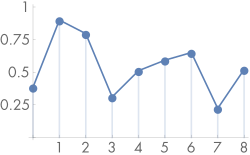

Figure 7.1: (a) By taking a set of point samples of $f(x)$ (indicated by dots), we determine the value of the function at those positions. (b) The sample values can be used to reconstruct a function $\tilde{f}(x)$ that is an approximation to $f(x)$. The sampling theorem, introduced in Section 7.1.3, makes a precise statement about the conditions on $f(x)$, the number of samples taken, and the reconstruction technique used under which $\tilde{f}(x)$ is exactly the same as $f(x)$. The fact that the original function can sometimes be reconstructed exactly from point samples alone is remarkable.

Fourier analysis can be used to evaluate the quality of the match between the reconstructed function and the original. This section will introduce the main ideas of Fourier analysis with enough detail to work through some parts of the sampling and reconstruction processes but will omit proofs of many properties and skip details that aren’t directly relevant to the sampling algorithms used in pbrt. The “Further Reading” section of this chapter has pointers to more detailed information about these topics.

图 7.1：(a) 通过取一组 $f(x)$（由点表示）的点采样，我们确定函数在这些位置的值(b) 采样值可用于重建函数 $\tilde{f}(x)$ ，它是 $f(x)$ 的近似值。 7.1.3 节中介绍的采样定理对 $f(x)$ 上的条件、采样的数量以及 $\tilde{f}(x)$ 与 $f(x)$ 完全相同所使用的重建技术做出了精确的陈述。值得注意的是，可以仅从点采样中准确地重建原始函数。

傅里叶分析可用于计算重建函数与原始函数之间的匹配质量。本节将介绍傅立叶分析的主要思想，详细介绍采样和重建过程的某些部分，但将省略许多属性的证明，并跳过与 pbrt 中使用的采样算法不直接相关的细节。本章的“进一步阅读”部分提供了有关这些主题的更详细信息的提示。

### 7.1.1 The Frequency Domain and the Fourier Transform / 频域和傅立叶变换

One of the foundations of Fourier analysis is the Fourier transform, which represents a function in the frequency domain. (We will say that functions are normally expressed in the spatial domain.) Consider the two functions graphed in Figure 7.2. The function in Figure 7.2(a) varies relatively slowly as a function of $x$, while the function in Figure 7.2(b) varies much more rapidly. The more slowly varying function is said to have lower frequency content.

傅里叶分析的基础之一是傅里叶变换，它表示频域中的函数（我们会说函数通常在空间域中表示。）考虑图 7.2 中绘制的两个函数。图 7.2(a) 中的函数作为 $x$ 的函数变化相对缓慢，而图 7.2(b) 中的函数变化得更快。变化较慢的函数通常具有较低的频率内容。

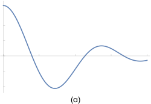

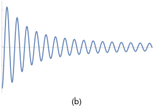

Figure 7.2: (a) Low-frequency function and (b) high-frequency function. Roughly speaking, the higher frequency a function is, the more quickly it varies over a given region.

Figure 7.3 shows the frequency space representations of these two functions; the lower frequency function’s representation goes to 0 more quickly than does the higher frequency function.

图 7.2：(a) 低频函数和 (b) 高频函数。粗略地说，一个函数的频率越高，它在给定区域内的变化就越快。

图 7.3 显示了这两个函数的频率空间表示；低频函数的表示比高频函数更快地变为 0。

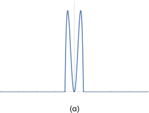

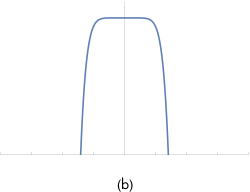

Figure 7.3: Frequency Space Representations of the Functions in Figure 7.2. The graphs show the contribution of each frequency $\omega$ to each of the functions in the spatial domain.

图 7.3：图 7.2 中函数的频率空间表示。这些图显示了每个频率 $\omega$ 对空间域中每个函数的贡献。

Most functions can be decomposed into a weighted sum of shifted sinusoids. This remarkable fact was first described by Joseph Fourier, and the Fourier transform converts a function into this representation. This frequency space representation of a function gives insight into some of its characteristics—the distribution of frequencies in the sine functions corresponds to the distribution of frequencies in the original function. Using this form, it is possible to use Fourier analysis to gain insight into the error that is introduced by the sampling and reconstruction process and how to reduce the perceptual impact of this error.

The Fourier transform of a 1D function $f(x)$ is

大多数函数可以分解为移位正弦曲线的加权和。这个非凡的事实首先由约瑟夫·傅立叶描述，傅立叶变换将函数转换为这种表示。函数的这种频率空间表示可以深入了解它的一些特征——正弦函数中的频率分布对应于原始函数中的频率分布。使用这种形式，可以使用傅立叶分析深入了解采样和重建过程引入的误差，以及如何减少这种误差的感知影响。

一维函数 $f(x)$ 的傅立叶变换是

$$
F(\omega)=\int_{-\infty}^{\infty} f(x) \mathrm{e}^{-i 2 \pi \omega x} \mathrm{~d} x
$$

(7.1)

(Recall that $\mathrm{e}^{\mathrm{i} x}=\cos x+\mathrm{i} \sin x$, where $\mathrm{i}=\sqrt{-1}$.) For simplicity, here we will consider only even functions where $f(-x)=f(x)$, in which case the Fourier transform of $f$ has no imaginary terms. The new function $F$ is a function of frequency, $\omega$. We will denote the Fourier transform operator by $\mathrm{F}$, such that $\mathrm{F}\{f(x)\}=F(\omega) . \mathrm{F}$ is clearly a linear operator-that is, $\mathrm{F}\{a f(x)\}=a \mathrm{~F}\{f(x)\}$ for any scalar $a$, and $\mathrm{F}\{f(x)+g(x)\}=\mathrm{F}\{f(x)\}+\mathrm{F}\{g(x)\}$ .

Equation (7.1) is called the Fourier analysis equation, or sometimes just the Fourier transform. We can also transform from the frequency domain back to the spatial domain using the Fourier synthesis equation, or the inverse Fourier transform:

（回想一下 $\mathrm{e}^{\mathrm{i} x}=\cos x+\mathrm{i} \sin x$ ，其中 $\mathrm{i}=\sqrt{-1}$ 。）为了简单，这里我们将只考虑 $f(-x)=f(x)$ 的偶函数，在这种情况下 $f$ 的傅立叶变换没有虚数项。新函数 $F$ 是频率函数 $\omega$ 。我们将用 $\mathrm{F}$ 表示傅立叶变换算子，使得 $\mathrm{F}\{f (x)\}=F(\omega)$ 。 $\mathrm{F}$ 显然是一个线性运算符——也就是说，对于任何标量 $a$ ， $\mathrm{F}\{a f(x)\}=a \mathrm{~F}\{f(x)\}$ ，和 $\mathrm{F}\{f(x)+g(x)\}=\mathrm{F}\{f(x)\}+\mathrm{F}\{g(x)\}$ 。

方程 (7.1) 称为傅立叶分析方程，有时也称为傅立叶变换。我们还可以使用傅立叶合成方程或傅立叶逆变换从频域转换回空间域：

$$
f(x)=\int_{-\infty}^{\infty} F(\omega) \mathrm{e}^{\mathrm{i} 2 \pi \omega x} \mathrm{~d} \omega
$$

(7.2)

Table $7.1$ shows a number of important functions and their frequency space representations. A number of these functions are based on the Dirac delta distribution, a special function that is defined such that $\int \delta(x) \mathrm{d} x=1$, and for all $x \neq 0, \delta(x)=0$. An important consequence of these properties is that

表 $7.1$ 显示了一些重要的函数及其频率空间表示。其中许多函数基于狄拉克 delta 分布，这是一个特殊的函数，其定义为 $\int \delta(x) \mathrm{d} x=1$ ，并且对于所有 $x \neq 0，\delta (x)=0$ 。这些属性的一个重要结果是

$$
\int f(x) \delta(x) \mathrm{d} x=f(0)
$$

The delta distribution cannot be expressed as a standard mathematical function, but instead is generally thought of as the limit of a unit area box function centered at the origin with width approaching $0$ .

Table 7.1: Fourier Pairs. Functions in the spatial domain and their frequency space representations. Because of the symmetry properties of the Fourier transform, if the left column is instead considered to be frequency space, then the right column is the spatial equivalent of those functions as well.

delta 分布不能表示为标准的数学函数，而是通常被认为是单位面积box函数的极限，以原点为中心，宽度接近 $0$ 。

表 7.1：傅立叶对。空间域中的函数及其频率空间表示。由于傅立叶变换的对称特性，如果左列被视为频率空间，那么右列也是这些函数的空间等效项。

$$
\begin{array}{ll}
\text { Spatial Domain } & \text { Frequency Space Representation } \\
\hline \text { Box: } f(x)=1 \text { if }|x|<1 / 2,0 \text { otherwise } & \text { Sinc: } f(\omega)=\sin c(\omega)=\sin (\pi \omega) /(\pi \omega) \\
\text { Gaussian: } f(x)=\mathrm{e}^{-\pi x^{2}} & \text { Gaussian: } f(\omega)=\mathrm{e}^{-\pi \omega^{2}} \\
\text { Constant: } f(x)=1 & \text { Delta: } f(\omega)=\delta(\omega) \\
\hline \text { Sinusoid: } f(x)=\cos x & \text { Translated delta: } \\
& f(\omega)=\pi(\delta(1-2 \pi \omega)+\delta(1+2 \pi \omega)) \\
\hline \text { Shah: } & \text { Shah: } f(\omega)=I I I_{1 / T}(\omega)=(1 / T) \sum_{i} \delta(\omega-i / T) \\
f(x)={III}_{T}(x)=T \sum_{i} \delta(x-T i) &
\end{array}
$$

### 7.1.2 Ideal Sampling and Reconstruction / 理想的采样和重建

Using frequency space analysis, we can now formally investigate the properties of sampling. Recall that the sampling process requires us to choose a set of equally spaced sample positions and compute the function's value at those positions. Formally, this corresponds to multiplying the function by a "shah," or "impulse train," function, an infinite sum of equally spaced delta functions. The shah ${III}_{T}(x)$ is defined as

使用频率空间分析，我们现在可以正式研究采样的特性。回想一下，采样过程要求我们选择一组等距的采样位置并计算这些位置的函数值。形式上，这对应于将函数乘以“shah”或“脉冲列”函数，即等距 delta 函数的无限和。 shah ${III}_{T}(x)$ 定义为

$$
{III}_{T}(x)=T \sum_{i=-\infty}^{\infty} \delta(x-i T)
$$

where $T$ defines the period, or sampling rate. This formal definition of sampling is illustrated in Figure $7.4$. The multiplication yields an infinite sequence of values of the function at equally spaced points:

其中 $T$ 定义了周期或采样率。采样的正式定义如图 $7.4$ 所示。乘法在等距点处产生函数值的无限序列：

$$
{III}_{T}(x) f(x)=T \sum_{i} \delta(x-i T) f(i T)
$$

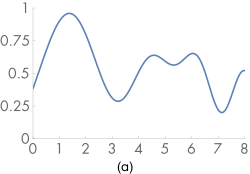

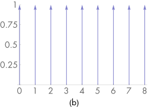


Figure 7.4: Formalizing the Sampling Process. (a) The function $f(x)$ is multiplied by (b) the shah function $I I I_{T}(x)$, giving (c) an infinite sequence of scaled delta functions that represent its value at each sample point.

These sample values can be used to define a reconstructed function $\tilde{f}$ by choosing a reconstruction filter function $r(x)$ and computing the convolution

图 7.4：形式化采样过程(a) 函数 $f(x)$ 乘以 (b) shah 函数 ${III}_{T}(x)$ ，给出 (c) 一个无限序列的缩放 delta 函数，代表其在每个采样点的值.

这些采样值可用于通过选择重建过滤器函数 $r(x)$ 并计算卷积来定义重建函数 $\tilde{f}$

$$
\left({III}_{T}(x) f(x)\right) \otimes r(x)
$$

where the convolution operation $\otimes$ is defined as

其中卷积操作 $\otimes$ 定义为

$$
f(x) \otimes g(x)=\int_{-\infty}^{\infty} f\left(x^{\prime}\right) g\left(x-x^{\prime}\right) \mathrm{d} x^{\prime}
$$

For reconstruction, convolution gives a weighted sum of scaled instances of the reconstruction filter centered at the sample points:

对于重建，卷积给出了以采样点为中心的重建过滤器的缩放实例的加权和：

$$
\tilde{f}(x)=T \sum_{i=-\infty}^{\infty} f(i T) r(x-i T)
$$

For example, in Figure 7.1, the triangle reconstruction filter, $r(x)=\max (0,1-|x|)$, was used. Figure $7.5$ shows the scaled triangle functions used for that example.

例如，在图 7.1 中，使用了三角形重建过滤器 $r(x)=\max (0,1-|x|)$ 。图 $7.5$ 显示了用于该示例的缩放三角形函数。

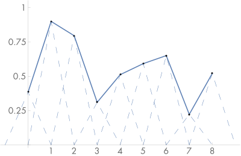

Figure 7.5: The sum of instances of the triangle reconstruction filter, shown with dashed lines, gives the reconstructed approximation to the original function, shown with a solid line.

图 7.5：三角形重建过滤器的实例总和（用虚线表示）给出了对原始函数的重建近似值（用实线表示）。

We have gone through a process that may seem gratuitously complex in order to end up at an intuitive result: the reconstructed function $\tilde{f}(x)$ can be obtained by interpolating among the samples in some manner. By setting up this background carefully, however, Fourier analysis can now be applied to the process more easily.

We can gain a deeper understanding of the sampling process by analyzing the sampled function in the frequency domain. In particular, we will be able to determine the conditions under which the original function can be exactly recovered from its values at the sample locations-a very powerful result. For the discussion here, we will assume for now that the function $f(x)$ is band limited-there exists some frequency $\omega_{0}$ such that $f(x)$ contains no frequencies greater than $\omega_{0}$. By definition, band-limited functions have frequency space representations with compact support, such that $F(\omega)=0$ for all $|\omega|>\omega_{0}$. Both of the spectra in Figure $7.3$ are band limited.

An important idea used in Fourier analysis is the fact that the Fourier transform of the product of two functions $\mathrm{F}\{f(x) g(x)\}$ can be shown to be the convolution of their individual Fourier transforms $F(\omega)$ and $G(\omega)$ :

为了得到一个直观的结果，我们经历了一个看似无缘无故复杂的过程：重建函数 $\tilde{f}(x)$ 可以通过以某种方式在采样之间进行插值来获得。但是，通过仔细设置此背景，现在可以更轻松地将傅立叶分析应用于该过程。

通过分析频域中的采样函数，我们可以更深入地了解采样过程。特别是，我们将能够确定可以从其采样位置的值中准确恢复原始函数的条件——这是一个非常强大的结果。对于此处的讨论，我们暂时假设函数 $f(x)$ 是频带受限的——存在某个频率 $\omega_{0}$ 使得 $f(x)$ 不包含大于 $\omega_{0}$ 的频率。根据定义，对于所有 $|\omega|>\omega_{0}$ ， $F(\omega)=0$ ，频带受限函数具有紧致支持的频率空间表示。图 $7.3$ 中的两个频谱都是频带有限。

傅里叶分析中使用的一个重要思想是，两个函数 $\mathrm{F}\{f(x) g(x)\}$ 的乘积的傅里叶变换可以显示为它们各自傅里叶的卷积变换 $F(\omega)$ 和 $G(\omega)$ ：

$$
\mathrm{F}\{f(x) g(x)\}=F(\omega) \otimes G(\omega)
$$

It is similarly the case that convolution in the spatial domain is equivalent to multiplication in the frequency domain:

同理，空间域的卷积等价于频域的乘法：

$$
\mathrm{F}\{f(x) \otimes g(x)\}=F(\omega) G(\omega)
$$

These properties are derived in the standard references on Fourier analysis. Using these ideas, the original sampling step in the spatial domain, where the product of the shah function and the original function $f(x)$ is found, can be equivalently described by the convolution of $F(\omega)$ with another shah function in frequency space.

We also know the spectrum of the shah function ${III}_{T}(x)$ from Table 7.1; the Fourier transform of a shah function with period $T$ is another shah function with period $1 / T$. This reciprocal relationship between periods is important to keep in mind: it means that if the samples are farther apart in the spatial domain, they are closer together in the frequency domain.

Thus, the frequency domain representation of the sampled signal is given by the convolution of $F(\omega)$ and this new shah function. Convolving a function with a delta function just yields a copy of the function, so convolving with a shah function yields an infinite sequence of copies of the original function, with spacing equal to the period of the shah (Figure 7.6). This is the frequency space representation of the series of samples.

这些属性是在傅立叶分析的标准参考资料中推导出来的。使用这些想法，空间域中的原始采样步骤，其中找到 shah 函数和原始函数 $f(x)$ 的乘积，可以通过 $F(\omega)$ 与另一个的卷积来等效描述频率空间中的 shah 函数。

我们还知道表 7.1 中的 shah 函数 ${III}_{T}(x)$ 的频谱；周期为 $T$ 的 shah 函数的傅立叶变换是另一个周期为 $1 / T$ 的 shah 函数。记住周期之间的这种相互关系很重要：这意味着如果采样在空间域中相距较远，则它们在频域中会更接近。

因此，采样信号的频域表示由 $F(\omega)$ 和这个新的 shah 函数的卷积给出。将函数与 delta 函数卷积只会产生函数的副本，因此与 shah 函数卷积会产生原始函数的无限副本序列，其间距等于 shah 的周期（图 7.6）。这是一系列采样的频率空间表示。

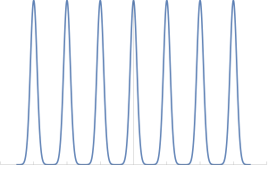

Figure 7.6: The Convolution of $F(\omega)$ and the Shah Function. The result is infinitely many copies of $F$.

Now that we have this infinite set of copies of the function's spectrum, how do we reconstruct the original function? Looking at Figure $7.6$, the answer is obvious: just discard all of the spectrum copies except the one centered at the origin, giving the original $F(\omega)$.

图 7.6： $F(\omega)$ 和 Shah 函数的卷积。结果是 $F$ 的无限多个副本。

现在我们有了函数谱的无限副本集，我们如何重建原始函数？看看图 $7.6$ ，答案很明显：只需丢弃除以原点为中心的光谱副本之外的所有光谱副本，给出原始的 $F(\omega)$ 。

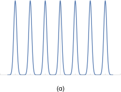

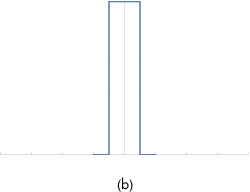

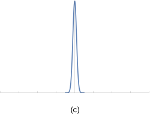

Figure 7.7: Multiplying (a) a series of copies of $F(\omega)$ by (b) the appropriate box function yields (c) the original spectrum.

In order to throw away all but the center copy of the spectrum, we multiply by a box function of the appropriate width (Figure 7.7). The box function $\Pi_{T}(x)$ of width $T$ is defined as

图 7.7：将 (a) $F(\omega)$ 的一系列副本乘以 (b) 适当的box函数产生 (c) 原始光谱。

为了丢弃除光谱中心副本之外的所有内容，我们乘以适当宽度的box函数（图 7.7）。宽度为 $T$ 的盒子函数 $\Pi_{T}(x)$ 定义为

$$
\Pi_{T}(x)=\left\{\begin{array}{ll}
1 / T & |x|<T / 2 \\
0 & \text { otherwise }
\end{array}\right.
$$

This multiplication step corresponds to convolution with the reconstruction filter in the spatial domain. This is the ideal sampling and reconstruction pro

这个乘法步骤对应于在空间域中与重建过滤器的卷积。这是理想的采样和重建过程。总结一下：

$$
\tilde{F}=\left(F(\omega) \otimes {III}_{1 / T}(\omega)\right) \Pi_{1 / T}(\omega)
$$

This is a remarkable result: we have been able to determine the exact frequency space representation of $f(x)$, purely by sampling it at a set of regularly spaced points. Other than knowing that the function was band limited, no additional information about the composition of the function was used.

Applying the equivalent process in the spatial domain will likewise recover $f(x)$ exactly. Because the inverse Fourier transform of the box function is the sinc function, ideal reconstruction in the spatial domain is

这是一个了不起的结果：我们已经能够确定 $f(x)$ 的精确频率空间表示，纯粹是通过在一组规则间隔的点上对其进行采样。除了知道函数是频带受限的，没有使用关于函数组成的附加信息。

在空间域中应用等效过程同样将准确地恢复 $f(x)$ 。由于box函数的傅里叶逆变换是sinc函数，空间域的理想重建为

$$
\tilde{f}=\left(f(x) {III}_{T}(x)\right) \otimes \operatorname{sinc}_{T}(x)
$$

where $\sin c_{T}(x)=\operatorname{sinc}(T x)$, and thus

其中 $\sin c_{T}(x)=\operatorname{sinc}(T x)$ ，因此

$$
\tilde{f}(x)=\sum_{i=-\infty}^{\infty} \operatorname{sinc}(x-T i) f(T i)
$$

Unfortunately, because the sinc function has infinite extent, it is necessary to use all of the sample values $f(T i)$ to compute any particular value of $\tilde{f}(x)$ in the spatial domain. Filters with finite spatial extent are preferable for practical implementations even though they don't reconstruct the original function perfectly.

A commonly used alternative in graphics is to use the box function for reconstruction, effectively averaging all of the sample values within some region around $x$. This is a very poor choice, as can be seen by considering the box filter's behavior in the frequency domain: This technique attempts to isolate the central copy of the function's spectrum by multiplying by a sinc, which not only does a bad job of selecting the central copy of the function's spectrum but includes high-frequency contributions from the infinite series of other copies of it as well.

不幸的是，由于 sinc 函数具有无限范围，因此需要使用所有采样值 $f(T i)$ 来计算空间域中 $\tilde{f}(x)$ 的任何特定值。具有有限空间范围的过滤器对于实际实现更可取，即使它们不能完美地重建原始函数。

图形中一个常用的替代方法是使用 box 函数进行重建，有效地平均 $x$ 周围某个区域内的所有采样值。这是一个非常糟糕的选择，通过考虑box过滤器在频域中的行为可以看出：这种技术试图通过乘以 sinc 来隔离函数频谱的中心副本，这不仅在选择函数频谱的中心副本，也包括来自它的其他副本的无限级数的高频贡献。

### 7.1.3 Aliasing / 反走样

Beyond the issue of the sinc function’s infinite extent, one of the most serious practical problems with the ideal sampling and reconstruction approach is the assumption that the signal is band limited. For signals that are not band limited, or signals that aren’t sampled at a sufficiently high sampling rate for their frequency content, the process described earlier will reconstruct a function that is different from the original signal.

The key to successful reconstruction is the ability to exactly recover the original spectrum $F(\omega)$ by multiplying the sampled spectrum with a box function of the appropriate width. Notice that in Figure $7.6$, the copies of the signal's spectrum are separated by empty space, so perfect reconstruction is possible. Consider what happens, however, if the original function was sampled with a lower sampling rate. Recall that the Fourier transform of a shah function ${III}_{T}$ with period $T$ is a new shah function with period $1 / T$. This means that if the spacing between samples increases in the spatial domain, the sample spacing decreases in the frequency domain, pushing the copies of the spectrum $F(\omega)$ closer together. If the copies get too close together, they start to overlap.

Because the copies are added together, the resulting spectrum no longer looks like many copies of the original (Figure 7.8). When this new spectrum is multiplied by a box function, the result is a spectrum that is similar but not equal to the original $F(\omega)$ : high-frequency details in the original signal leak into lower frequency regions of the spectrum of the reconstructed signal. These new low-frequency artifacts are called aliases (because high frequencies are "masquerading" as low frequencies), and the resulting signal is said to be aliased.

除了 sinc 函数的无限范围问题之外，理想采样和重建方法最严重的实际问题之一是假设信号是频带受限的。对于不受频带受限的信号，或对其频率内容没有以足够高的采样率进行采样的信号，前面描述的过程将重建与原始信号不同的函数。

成功重建的关键是能够通过将采样频谱与适当宽度的box函数相乘来准确恢复原始频谱 $F(ω)$ 。请注意，在图 $7.6$ 中，信号频谱的副本由空白空间分隔，因此可以进行完美的重建。然而，考虑一下如果以较低的采样率对原始函数进行采样会发生什么。回想一下，周期为 $T$ 的 shah 函数 ${III}_{T}$ 的傅立叶变换是一个周期为 $1 / T$ 的新 shah 函数。这意味着，如果采样之间的间距在空间域中增加，则在频域中的采样间距会减小，从而将频谱 $F(ω)$ 的副本推得更近。如果副本靠得太近，它们就会开始重叠。

由于将副本加在一起，生成的光谱看起来不再像原始光谱的许多副本（图 7.8）。当这个新频谱乘以一个box函数时，结果是一个与原始 $F(\omega)$ 相似但不相等的频谱：原始信号中的高频细节泄漏到频谱的较低频率区域重建的信号。这些新的低频伪像被称为走样（因为高频“伪装”为低频），由此产生的信号被称为走样。

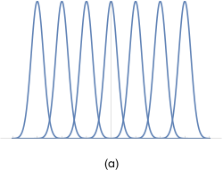

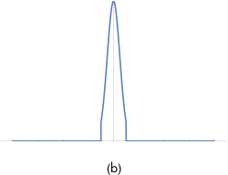

Figure 7.8: (a) When the sampling rate is too low, the copies of the function’s spectrum overlap, resulting in (b) aliasing when reconstruction is performed.

Figure 7.9 shows the effects of aliasing from undersampling and then reconstructing the 1D function $f(x)=1+\cos \left(4 \pi x^{2}\right)$.

图 7.8：(a) 当采样率太低时，函数频谱的副本重叠，导致 (b) 在执行重建时出现走样。

图 7.9 显示了来自欠采样然后重建一维函数 $f(x)=1+\cos \left(4 \pi x^{2}\right)$ 的走样效果。

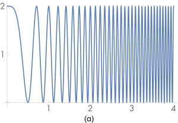

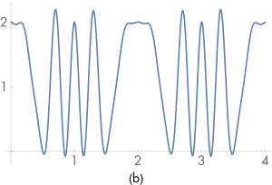

Figure 7.9: Aliasing from Point Sampling the Function $1+\cos \left(4 x^{2}\right)$. (a) The function. (b) The reconstructed function from sampling it with samples spaced $0.125$ units apart and performing perfect reconstruction with the sinc filter. Aliasing causes the high-frequency information in the original function to be lost and to reappear as lower frequency error.

A possible solution to the problem of overlapping spectra is to simply increase the sampling rate until the copies of the spectrum are sufficiently far apart to not overlap, thereby eliminating aliasing completely. In fact, the sampling theorem tells us exactly what rate is required. This theorem says that as long as the frequency of uniform sample points $\omega_{s}$ is greater than twice the maximum frequency present in the signal $\omega_{0}$, it is possible to reconstruct the original signal perfectly from the samples. This minimum sampling frequency is called the Nyquist frequency.

For signals that are not band limited $\left(\omega_{0}=\infty\right)$, it is impossible to sample at a high enough rate to perform perfect reconstruction. Non-band-limited signals have spectra with infinite support, so no matter how far apart the copies of their spectra are (i.e., how high a sampling rate we use), there will always be overlap. Unfortunately, few of the interesting functions in computer graphics are band limited. In particular, any function containing a discontinuity cannot be band limited, and therefore we cannot perfectly sample and reconstruct it. This makes sense because the function's discontinuity will always fall between two samples and the samples provide no information about the location of the discontinuity. Thus, it is necessary to apply different methods besides just increasing the sampling rate in order to counteract the error that aliasing can introduce to the renderer's results.

图 7.9：点采样函数 $1+\cos \left(4 x^{2}\right)$ 的别名(a) 函数(b) 使用相距 $0.125$ 单位的样本对其进行采样并使用 sinc 过滤器执行完美重建的重建函数。走样会导致原函数中的高频信息丢失，并作为低频误差重新出现。

频谱重叠问题的一个可能解决方案是简单地增加采样率，直到频谱的副本相距足够远而不会重叠，从而完全消除走样。事实上，采样定理准确地告诉我们需要什么速率。该定理表明，只要均匀采样点 $\omega_{s}$ 的频率大于信号 $\omega_{0}$ 中存在的最大频率的两倍，就有可能从采样中完美地重建原始信号。这个最小采样频率称为Nyquist频率。

对于不受频带受限 $\left(\omega_{0}=\infty\right)$ 的信号，不可能以足够高的速率进行采样以执行完美的重建。非频带受限信号具有无限支持的频谱，因此无论它们的频谱副本相距多远（即我们使用的采样率有多高），总会有重叠。不幸的是，计算机图形学中我们感兴趣的函数很少是有频带受限的。特别是，任何包含不连续性的函数都不能被频带受限，因此我们无法完美地对其进行采样和重建。这是有道理的，因为函数的不连续性始终位于两个采样之间，并且采样不提供有关不连续性位置的信息。因此，除了仅增加采样率之外，还需要应用不同的方法，以抵消走样可能引入渲染器结果的错误。

### 7.1.4 Antialiasing Techniques / 反走样技术

If one is not careful about sampling and reconstruction, myriad artifacts can appear in the final image. It is sometimes useful to distinguish between artifacts due to sampling and those due to reconstruction; when we wish to be precise we will call sampling artifacts prealiasing and reconstruction artifacts postaliasing. Any attempt to fix these errors is broadly classified as antialiasing. This section reviews a number of antialiasing techniques beyond just increasing the sampling rate everywhere.

如果不注意采样和重建，最终图像中可能会出现无数伪像。有时区分采样造成的伪像和重建造成的伪像很有用；当我们希望精确时，我们将称采样伪像为预走样，而将重建伪像称为后走样。任何修复这些错误的尝试都被广泛归类为反走样。本节回顾了许多反走样技术，而不仅仅是提高各处的采样率。

#### Nonuniform Sampling / 非均匀采样

Although the image functions that we will be sampling are known to have infinite-frequency components and thus can't be perfectly reconstructed from point samples, it is possible to reduce the visual impact of aliasing by varying the spacing between samples in a nonuniform way. If $\xi$ denotes a random number between 0 and 1 , a nonuniform set of samples based on the impulse train is

虽然我们将采样的图像函数已知具有无限频率分量，因此无法从点采样完美重建，但可以通过以非均匀方式改变采样之间的间距来减少走样的视觉影响。如果 $\xi$ 表示 0 到 1 之间的随机数，则基于脉冲串的非均匀采样集为

$$
\sum_{i=-\infty}^{\infty} \delta\left(x-\left(i+\frac{1}{2}-\xi\right) T\right)
$$

For a fixed sampling rate that isn’t sufficient to capture the function, both uniform and nonuniform sampling produce incorrect reconstructed signals. However, nonuniform sampling tends to turn the regular aliasing artifacts into noise, which is less distracting to the human visual system. In frequency space, the copies of the sampled signal end up being randomly shifted as well, so that when reconstruction is performed the result is random error rather than coherent aliasing.

对于不足以捕获函数的固定采样率，均匀和非均匀采样都会产生不正确的重建信号。然而，非均匀采样往往会将规则的走样伪像变成噪声，这对人类视觉系统的干扰较小。在频率空间中，采样信号的副本最终也会随机移位，因此在执行重建时，结果是随机误差而不是相干走样。

#### Adaptive Sampling / 自适应采样

Another approach that has been suggested to combat aliasing is adaptive supersampling: if we can identify the regions of the signal with frequencies higher than the Nyquist limit, we can take additional samples in those regions without needing to incur the computational expense of increasing the sampling frequency everywhere. It can be difficult to get this approach to work well in practice, because finding all of the places where supersampling is needed is difficult. Most techniques for doing so are based on examining adjacent sample values and finding places where there is a significant change in value between the two; the assumption is that the signal has high frequencies in that region.

In general, adjacent sample values cannot tell us with certainty what is really happening between them: even if the values are the same, the functions may have huge variation between them. Alternatively, adjacent samples may have substantially different values without any aliasing actually being present. For example, the texture-filtering algorithms in Chapter 10 work hard to eliminate aliasing due to image maps and procedural textures on surfaces in the scene; we would not want an adaptive sampling routine to needlessly take extra samples in an area where texture values are changing quickly but no excessively high frequencies are actually present.

另一种对反走样的方法是自适应超采样：如果我们可以识别频率高于Nyquist极限的信号区域，我们可以在这些区域中采集额外的采样，而无需到处增加采样频率的计算费用。在实践中很难让这种方法很好地工作，因为找到所有需要超级采样的地方是很困难的。这样做的大多数技术都是基于检查相邻的采样值，并找到两者之间值发生显著变化的地方；假设是该信号在该区域具有高频率。

一般来说，相邻的采样值不能确定地告诉我们它们之间真正发生了什么：即使值相同，它们之间的函数也可能有很大的差异。或者，相邻采样可能具有实质上不同的值而实际上不存在任何走样。例如，第 10 章中的纹理过滤算法努力消除由于图像映射和场景表面上的程序纹理引起的走样；我们不希望自适应采样代码在纹理值快速变化但实际上没有过高频率的区域中不必要地采集额外的采样。

#### Prefiltering / 预过滤

Another approach to eliminating aliasing that sampling theory offers is to filter (i.e., blur) the original function so that no high frequencies remain that can’t be captured accurately at the sampling rate being used. This approach is applied in the texture functions of Chapter 10. While this technique changes the character of the function being sampled by removing information from it, blurring is generally less objectionable than aliasing.

Recall that we would like to multiply the original function’s spectrum with a box filter with width chosen so that frequencies above the Nyquist limit are removed. In the spatial domain, this corresponds to convolving the original function with a sinc filter,

采样理论提供的另一种消除走样的方法是过滤（即模糊）原始函数，这样就不会保留在所使用的采样率下无法准确捕获的高频。这种方法应用于第 10 章的纹理函数。虽然这种技术通过从中删除信息来改变被采样函数的特性，但模糊通常不如走样更令人讨厌。

回想一下，我们想将原始函数的频谱与选择宽度的box过滤器相乘，以便去除Nyquist极限以上的频率。在空间域中，这对应于用正弦过滤器对原始函数进行卷积，

$$
f(x) \otimes \operatorname{sinc}\left(2 \omega_{s} x\right)
$$

In practice, we can use a filter with finite extent that works well. The frequency space representation of this filter can help clarify how well it approximates the behavior of the ideal sinc filter.

Figure $7.10$ shows the function $1+\cos \left(4 x^{2}\right)$ convolved with a variant of the sinc with finite extent that will be introduced in Section $7.8$. Note that the high-frequency details have been eliminated; this function can be sampled and reconstructed at the sampling rate used in Figure $7.9$ without aliasing.

在实践中，我们可以使用一个效果很好的有限范围的过滤器。该过滤器的频率空间表示有助于阐明它与理想 sinc 过滤器行为的近似程度。

图 $7.10$ 显示了函数 $1+\cos \left(4 x^{2}\right)$ 与将在 $7.8$ 节中介绍的有限范围 sinc 的变体卷积。请注意，高频细节已被消除；该函数可以以图 $7.9$ 中使用的采样率进行采样和重建，而不会产生走样。

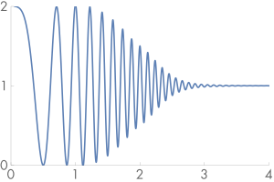

Figure 7.10: Graph of the function $1+\cos \left(4 x^{2}\right)$ convolved with a filter that removes frequencies beyond the Nyquist limit for a sampling rate of $T=0.125$. High-frequency detail has been removed from the function, so that the new function can at least be sampled and reconstructed without aliasing.

图 7.10：函数 $1+\cos \left(4 x^{2}\right)$ 与过滤器卷积的图，该过滤器去除了超过Nyquist极限的频率，采样率为 $T=0.125$ 。高频细节已从函数中移除，因此新函数至少可以在不走样的情况下进行采样和重建。

### 7.1.5 Application to Image Synthesis / 在图像合成中的应用

The application of these ideas to the $2 \mathrm{D}$ case of sampling and reconstructing images of rendered scenes is straightforward: we have an image, which we can think of as a function of $2 \mathrm{D}(x, y)$ image locations to radiance values $L$ :

将这些想法应用于 $2 \mathrm{D}$ 对渲染场景的图像进行采样和重建的情况很简单：我们有一个图像，我们可以将其视为 $2 \mathrm{D}(x, y )$ 图像位置到辐射值 $L$ 的函数：

$$
f(x, y) \rightarrow L
$$

The good news is that, with our ray tracer, we can evaluate this function at any $(x, y)$ point that we choose. The bad news is that it's not generally possible to prefilter $f$ to remove the high frequencies from it before sampling. Therefore, the samplers in this chapter will use both strategies of increasing the sampling rate beyond the basic pixel spacing in the final image as well as nonuniformly distributing the samples to turn aliasing into noise.

It is useful to generalize the definition of the scene function to a higher dimensional function that also depends on the time $t$ and $(u, v)$ lens position at which it is sampled. Because the rays from the camera are based on these five quantities, varying any of them gives a different ray and thus a potentially different value of $f$. For a particular image position, the radiance at that point will generally vary across both time (if there are moving objects in the scene) and position on the lens (if the camera has a finite-aperture lens).

Even more generally, because many of the integrators defined in Chapters 14 through 16 use statistical techniques to estimate the radiance along a given ray, they may return a different radiance value when repeatedly given the same ray. If we further extend the scene radiance function to include sample values used by the integrator (e.g., values used to choose points on area light sources for illumination computations), we have an even higher dimensional image function

好消息是，使用我们的光线追踪器，可以在我们选择的任何 $(x, y)$ 点计算这个函数。坏消息是，在采样之前，通常不可能对 $f$ 进行预过滤以从中去除高频。因此，本章中的采样器将使用两种策略，即在最终图像中将采样率提高到超出基本像素间距，以及非均匀分布采样以将走样转化为噪声。

将场景函数的定义推广到更高维函数是有用的，该函数还取决于时间 $t$ 和 $(u, v)$ 镜头位置，在该位置采样它。因为来自相机的光线是基于这五个量的，改变它们中的任何一个都会产生不同的光线，因此可能会有不同的 $f$ 值。对于特定的图像位置，该点的辐射通常会随着时间（如果场景中有移动物体）和镜头上的位置（如果相机具有有限光圈镜头）而变化。

更一般地说，因为第 14 章到第 16 章中定义的许多积分器使用统计技术来估计沿给定光线的辐射度，当重复给定同一条光线时，它们可能会返回不同的辐射度值。如果我们进一步扩展场景辐射函数以包括积分器使用的采样值（例如，用于选择区域光源上的点以进行照明计算的值），我们将获得更高维的图像函数

$$
f\left(x, y, t, u, v, i_{1}, i_{2}, \ldots\right) \rightarrow L
$$

Sampling all of these dimensions well is an important part of generating high-quality imagery efficiently. For example, if we ensure that nearby $(x, y)$ positions on the image tend to have dissimilar $(u, v)$ positions on the lens, the resulting rendered images will have less error because each sample is more likely to account for information about the scene that its neighboring samples do not. The Sampler classes in the next few sections will address the issue of sampling all of these dimensions effectively.

对所有这些维度进行采样是有效生成高质量图像的重要部分。例如，如果我们确保图像上附近的 $(x, y)$ 位置往往在镜头上具有不同的 $(u, v)$ 位置，则生成的渲染图像将具有较小的误差，因为每个采样更有可能考虑其相邻采样没有的场景信息。接下来几节中的 Sampler 类将解决对所有这些维度进行有效采样的问题。

### 7.1.6 Sources of Aliasing in Rendering / 渲染中的走样来源

Geometry is one of the most common causes of aliasing in rendered images. When projected onto the image plane, an object’s boundary introduces a step function—the image function’s value instantaneously jumps from one value to another. Not only do step functions have infinite frequency content as mentioned earlier, but, even worse, the perfect reconstruction filter causes artifacts when applied to aliased samples: ringing artifacts appear in the reconstructed function, an effect known as the Gibbs phenomenon. Figure 7.11 shows an example of this effect for a 1D function. Choosing an effective reconstruction filter in the face of aliasing requires a mix of science, artistry, and personal taste, as we will see later in this chapter.

几何图形是渲染图像中出现走样的最常见原因之一。当投影到图像平面上时，对象的边界会引入一个阶跃函数——图像函数的值会立即从一个值跳到另一个值。不仅如前所述，阶跃函数具有无限的频率内容，而且更糟糕的是，完美的重建过滤器在应用于走样采样时会导致伪像：在重建函数中出现ringing伪像，这种效应称为Gibbs现象。图 7.11 显示了一维函数的这种效果的示例。在面对走样时选择一个有效的重建过滤器需要科学、艺术和个人品味的结合，我们将在本章后面看到。

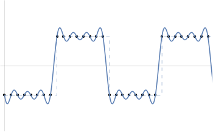

Figure 7.11: Illustration of the Gibbs Phenomenon. When a function hasn't been sampled at the Nyquist rate and the set of aliased samples is reconstructed with the sinc filter, the reconstructed function will have "ringing" artifacts, where it oscillates around the true function. Here a 1D step function (dashed line) has been sampled with a sample spacing of $0.125$ . When reconstructed with the sinc, the ringing appears (solid line).

Very small objects in the scene can also cause geometric aliasing. If the geometry is small enough that it falls between samples on the image plane, it can unpredictably disappear and reappear over multiple frames of an animation.

Another source of aliasing can come from the texture and materials on an object. Shading aliasing can be caused by texture maps that haven’t been filtered correctly (addressing this problem is the topic of much of Chapter 10) or from small highlights on shiny surfaces. If the sampling rate is not high enough to sample these features adequately, aliasing will result. Furthermore, a sharp shadow cast by an object introduces another step function in the final image. While it is possible to identify the position of step functions from geometric edges on the image plane, detecting step functions from shadow boundaries is more difficult.

The key insight about aliasing in rendered images is that we can never remove all of its sources, so we must develop techniques to mitigate its impact on the quality of the final image.

图 7.11：Gibbs现象的图示。当一个函数没有以 Nyquist 速率采样并且使用 sinc 过滤器重建走样采样集时，重建的函数将具有“ringing”伪像，它在真实函数周围振荡。这里以 $0.125$ 的采样间距对一维阶跃函数（虚线）进行了采样。当用 sinc 重建时，出现ringing（实线）。

场景中非常小的对象也会导致几何走样。如果几何体足够小，以至于它落在图像平面上的采样之间，则它可能会不可预测地消失并在动画的多个帧中重新出现。

另一个走样来源可能来自对象的纹理和材质。未正确过滤的纹理（解决此问题是第 10 章的大部分内容）或闪亮表面上的小高光可能会导致阴影走样。如果采样率不足以对这些特征进行充分采样，则会导致走样。此外，物体投射的锐利阴影会在最终图像中引入另一个阶跃函数。虽然可以从图像平面上的几何边缘识别阶跃函数的位置，但从阴影边界检测阶跃函数更加困难。

关于渲染图像中的走样的关键见解是我们永远无法删除其所有来源，因此我们必须开发技术来减轻其对最终图像质量的影响。

### 7.1.7 Understanding Pixels / 了解像素

There are two ideas about pixels that are important to keep in mind throughout the remainder of this chapter. First, it is crucial to remember that the pixels that constitute an image are point samples of the image function at discrete points on the image plane; there is no “area” associated with a pixel. As Alvy Ray Smith (1995) has emphatically pointed out, thinking of pixels as small squares with finite area is an incorrect mental model that leads to a series of errors. By introducing the topics of this chapter with a signal processing approach, we have tried to lay the groundwork for a more accurate mental model.

The second issue is that the pixels in the final image are naturally defined at discrete integer $(x, y)$ coordinates on a pixel grid, but the Samplers in this chapter generate image samples at continuous floating-point $(x, y)$ positions. The natural way to map between these two domains is to round continuous coordinates to the nearest discrete coordinate; this is appealing since it maps continuous coordinates that happen to have the same value as discrete coordinates to that discrete coordinate. However, the result is that given a set of discrete coordinates spanning a range $\left[x_{0}, x_{1}\right]$, the set of continuous coordinates that covers that range is $\left[x_{0}-1 / 2, x_{1}+1 / 2\right)$. Thus, any code that generates continuous sample positions for a given discrete pixel range is littered with $1 / 2$ offsets. It is easy to forget some of these, leading to subtle errors.

If we instead truncate continuous coordinates $c$ to discrete coordinates $d$ by

在本章的其余部分中，有两个关于像素的想法很重要。首先，重要的是要记住构成图像的像素是图像平面上离散点处图像函数的点采样；没有与像素相关联的“区域”。正如 Alvy Ray Smith (1995) 强调指出的那样，将像素视为面积有限的小方块是一种不正确的心理模型，会导致一系列错误。通过使用信号处理方法介绍本章的主题，我们试图为更准确的思想模型奠定基础。

第二个问题是最终图像中的像素自然定义在像素网格上的离散整数 $(x, y)$ 坐标处，但是本章中的采样器以连续浮点位置 $(x, y)$ 生成图像采样。在这两个域之间映射的自然方法是将连续坐标舍入到最近的离散坐标；这很有吸引力，因为它将恰好与离散坐标具有相同值的连续坐标映射到该离散坐标。然而，结果是给定一组跨越范围 $\left[x_{0}, x_{1}\right]$ 的离散坐标，覆盖该范围的一组连续坐标是 $\left[x_{0 }-1 / 2, x_{1}+1 / 2\right)$ 。因此，任何为给定离散像素范围生成连续采样位置的代码都充满了 $1 / 2$ 偏移量。很容易忘记其中的一些，从而导致细微的错误。

如果我们改为将连续坐标 $c$ 截断为离散坐标 $d$

$$
d=\lfloor c\rfloor
$$

and convert from discrete to continuous by

并通过以下方式从离散转换为连续

$$
c=d+1 / 2
$$

then the range of continuous coordinates for the discrete range $\left[x_{0}, x_{1}\right]$ is naturally $\left[x_{0}, x_{1}+1\right)$ and the resulting code is much simpler (Heckbert 1990a). This convention, which we will adopt in pbrt, is shown graphically in Figure 7.12.

那么离散范围 $\left[x_{0}, x_{1}\right]$ 的连续坐标范围自然是 $\left[x_{0}, x_{1}+1\right)$ 并且生成的代码要简单得多（Heckbert 1990a）。我们将在 pbrt 中采用的这个约定如图 7.12 所示。


Figure 7.12: Pixels in an image can be addressed with either discrete or continuous coordinates. A discrete image five pixels wide covers the continuous pixel range $[0,5)$. A particular discrete pixel $d$ 's coordinate in the continuous representation is $d+1 / 2$.

图 7.12：图像中的像素可以用离散坐标或连续坐标寻址。5像素宽的离散图像覆盖了连续像素范围 $[0,5)$ 。特定离散像素 $d$ 在连续表示中的坐标是 $d+1 / 2$ 。

## 7.2 Sampling Interface / 采样接口

As first introduced in Section 7.1.5, the rendering approach implemented in pbrt involves choosing sample points in additional dimensions beyond 2D points on the image plane. Various algorithms will be used to generate these points, but all of their implementations inherit from an abstract Sampler class that defines their interface. The core sampling declarations and functions are in the files core/sampler.h and core/sampler.cpp. Each of the sample generation implementations is in its own source files in the samplers/ directory.

The task of a Sampler is to generate a sequence of $n$ -dimensional samples in $[0,1)^{n}$, where one such sample vector is generated for each image sample and where the number of dimensions $n$ in each sample may vary, depending on the calculations performed by the light transport algorithms. (See Figure 7.13.)

正如第 7.1.5 节中首次介绍的那样，在 pbrt 中实现的渲染方法涉及在图像平面上的 2D 点之外的其他维度中选择采样点。将使用各种算法来生成这些点，但它们的所有实现都继承自定义其接口的抽象 Sampler 类。核心采样声明和函数位于文件 core/sampler.h 和 core/sampler.cpp 中。每个示例生成实现都位于 samplers/ 目录中的自己的源文件中。

Sampler 的任务是在 $[0,1)^{n}$ 中生成一系列 $n$ 维采样，为每个图像采样生成一个这样的采样向量，维数为 $n$ ，每个采样中的内容可能会有所不同，具体取决于光传输算法执行的计算（见图 7.13。）


Figure 7.13: Samplers generate an $n$ -dimensional sample vector for each of the image samples taken to generate the final image. Here, the pixel $(3,8)$ is being sampled, and there are two image samples in the pixel area. The first two dimensions of the sample vector give the $(x, y)$ offset of the sample within the pixel, and the next three dimensions determine the time and lens position of the corresponding camera ray. Subsequent dimensions are used by the Monte Carlo light transport algorithms in Chapters 14,15 , and 16. Here, the light transport algorithm has requested a 2D array of four samples in the sample vector; these values might be used to select four points on an area light source to compute the radiance for the image sample, for example.

Because sample values must be strictly less than 1, it’s useful to define a constant, OneMinusEpsilon, that represents the largest representable floating-point constant that is less than 1. Later, we will clamp sample vector values to be no larger than this value.

图 7.13：采样器为用于生成最终图像的每个图像采样生成一个 $n$ 维采样向量。这里对像素 $(3,8)$ 进行采样，像素区域有两个图像采样。采样向量的前两个维度给出了采样在像素内的 $(x, y)$ 偏移量，接下来的三个维度决定了对应相机光线的时间和镜头位置。后续维度在第 14、15 和 16 章中由蒙特卡罗光传输算法使用。这里，光传输算法要求采样向量中有四个采样的二维数组；例如，这些值可用于选择区域光源上的四个点来计算图像采样的辐射率。

因为采样值必须严格小于 1，所以定义一个常量 OneMinusEpsilon 很有用，它表示小于 1 的最大可表示浮点常量。稍后，我们将限制采样向量值不大于这个值。

```
<<Random Number Declarations>>= 
#ifdef PBRT_FLOAT_IS_DOUBLE
static const Float OneMinusEpsilon = 0x1.fffffffffffffp-1;
#else
static const Float OneMinusEpsilon = 0x1.fffffep-1;
#endif
```

The simplest possible implementation of a Sampler would just return uniform random values in $[0, 1)$ each time an additional component of the sample vector was needed. Such a sampler would produce correct images but would require many more samples (and thus, many more rays traced and much more time) to create images of the same quality achievable with more sophisticated samplers. The run-time expense for using better sampling patterns is approximately the same as that for lower-quality patterns like uniform random numbers; because evaluating the radiance for each image sample is much more expensive than computing the sample’s component values, doing this work pays dividends (Figure 7.14).

采样器的最简单可能的实现只是在每次需要采样向量的附加组件时返回 $[0, 1)$ 中的统一随机值。这样的采样器会产生正确的图像，但需要更多的采样（因此，跟踪更多的光线和更多的时间）来创建可以使用更复杂的采样器实现的相同质量的图像。使用更好的采样模式的运行时间开销与使用均匀随机数等低质量模式的运行时开销大致相同；因为计算每个图像采样的辐射比计算采样的分量值要昂贵得多，所以做这项工作会带来好处（图 7.14）。

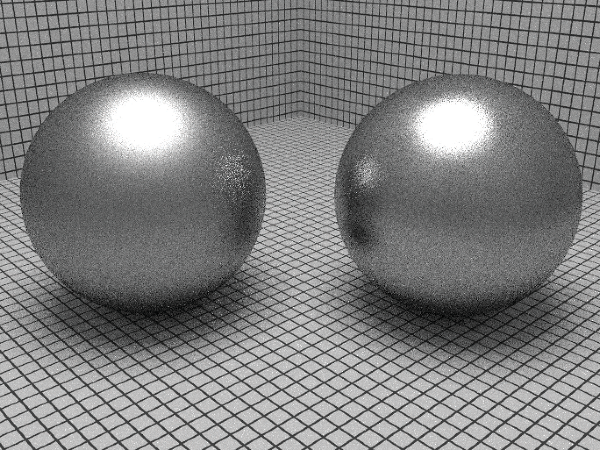

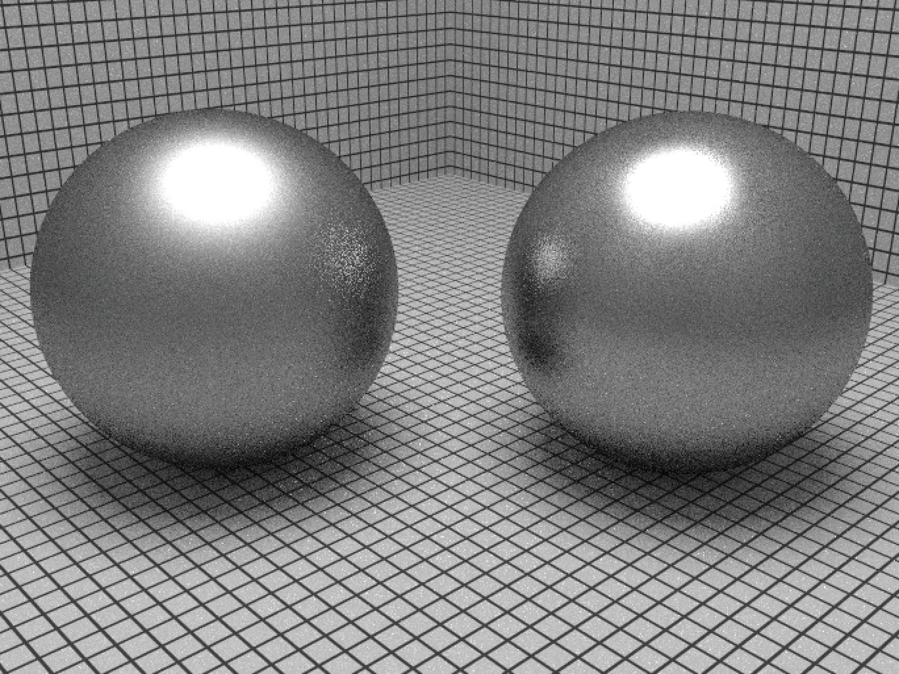

Figure 7.14: Scene rendered with (1) a relatively ineffective sampler and (2) a carefully designed sampler, using the same number of samples for each. The improvement in image quality, ranging from the edges of the highlights to the quality of the glossy reflections, is noticeable.

图 7.14：使用 (1) 相对低效的采样器和 (2) 精心设计的采样器渲染的场景，每个采样器使用相同数量的采样。图像质量的改进，从高光边缘到光泽反射的质量，是显而易见的。

A few characteristics of these sample vectors are assumed in the following:

* The first five dimensions generated by Samplers are generally used by the Camera. In this case, the first two are specifically used to choose a point on the image inside the current pixel area; the third is used to compute the time at which the sample should be taken; and the fourth and fifth dimensions give a $(u, v)$ lens position for depth of field.

* Some sampling algorithms generate better samples in some dimensions of the sample vector than in others. Elsewhere in the system, we assume that in general, the earlier dimensions have the most well-placed sample values.

Note also that the $n$-dimensional samples generated by the Sampler are generally not represented explicitly or stored in their entirety but are often generated incrementally as needed by the light transport algorithm. (However, storing the entire sample vector and making incremental changes to its components is the basis of the MLTSampler in Section 16.4.4, which is used by the MLTIntegrator in Section 16.4.5.)

这些采样向量的一些特征假设如下：

* Sampler 生成的前五个维度通常由 Camera 使用。在这种情况下，前两个专门用于选择图像上当前像素区域内的一个点；第三个用于计算采样的时间；第四和第五维度给出了景深的 $(u, v)$ 镜头位置。

* 一些采样算法在采样向量的某些维度上生成比其他维度更好的采样。在系统的其他地方，我们假设一般来说，较早的维度具有最合适的采样值。

另请注意，采样器生成的 $n$ 维采样通常不会显式表示或全部存储，但通常根据光传输算法的需要增量生成（但是，存储整个采样向量并对其组件进行增量更改是第 16.4.4 节中的 MLTSampler 的基础，它由第 16.4.5 节中的 MLTIntegrator 使用。）

### 7.2.1 Evaluating Sample Patterns: Discrepancy / 计算采样模式：差异

Fourier analysis gave us one way of evaluating the quality of a 2D sampling pattern, but it took us only as far as being able to quantify the improvement from adding more evenly spaced samples in terms of the band-limited frequencies that could be represented. Given the presence of infinite frequency content from edges in images and given the need for $(n>2)$ -dimensional sample vectors for Monte Carlo light transport algorithms, Fourier analysis alone isn't enough for our needs.

Given a renderer and a candidate algorithm for placing samples, one way to evaluate the algorithm’s effectiveness is to use that sampling pattern to render an image and to compute the error in the image compared to a reference image rendered with a large number of samples. We will use this approach to compare sampling algorithms later in this chapter, though it only tells us how well the algorithm did for one specific scene, and it doesn’t give us a sense of the quality of the sample points without going through the rendering process.

Outside of Fourier analysis, mathematicians have developed a concept called discrepancy that can be used to evaluate the quality of a pattern of $n$ -dimensional sample positions. Patterns that are well distributed (in a manner to be formalized shortly) have low discrepancy values, and thus the sample pattern generation problem can be considered to be one of finding a suitable low-discrepancy pattern of points. A number of deterministic techniques have been developed that generate low-discrepancy point sets, even in highdimensional spaces. (Most of the sampling algorithms used later in this chapter use these techniques.)

The basic idea of discrepancy is that the quality of a set of points in an $n$ -dimensional space $[0,1)^{n}$ can be evaluated by looking at regions of the domain $[0,1)^{n}$, counting the number of points inside each region, and comparing the volume of each region to the number of sample points inside. In general, a given fraction of the volume should have roughly the same fraction of the total number of sample points inside of it. While it's not possible for this always to be the case, we can still try to use patterns that minimize the maximum difference between the actual volume and the volume estimated by the points (the discrepancy). Figure $7.15$ shows an example of the idea in two dimensions.

傅立叶分析为我们提供了一种计算 2D 采样模式质量的方法，但它仅使我们能够根据可以表示的带宽限制频率，来量化添加更均匀间隔的采样所带来的改进。考虑到图像边缘存在无限频率内容，并且考虑到蒙特卡罗光传输算法需要 $(n>2)$ 维采样向量，仅靠傅立叶分析不足以满足我们的需求。

给定渲染器和用于放置采样的候选算法，计算算法有效性的一种方法是使用该采样模式来渲染图像，并计算图像与使用大量采样渲染的参考图像相比的误差。我们将在本章后面使用这种方法来比较采样算法，尽管它只告诉我们该算法对一个特定场景的表现如何，并且在不经过渲染的情况下，并不能让我们了解采样点的质量过程。

在傅立叶分析之外，数学家开发了一个称为差异的概念，可用于计算 $n$ 维采样位置模式的质量。分布良好的模式（以很快形式化的方式）具有低差异值，因此采样模式生成问题可以被认为是寻找合适的低差异点模式之一。已经开发了许多确定性技术，即使在高维空间中也可以生成低差异点集（本章后面使用的大多数采样算法都使用这些技术。）

差异的基本思想是 $n$ 维空间 $[0,1)^{n}$ 中一组点的质量可以通过查看域 $[0,1)^{n}$ 的区域来计算，计算每个区域内部的点数，并将每个区域的体积与内部采样点的数量进行比较。通常，给定的体积分数应该与其中的采样点总数大致相同。虽然不可能总是这样，但我们仍然可以尝试使用最小化实际交易量与点估计的交易量之间的最大差异模式（差异）。图 $7.15$ 显示了这个想法的二维示例。


Figure 7.15: The discrepancy of a box (shaded) given a set of 2D sample points in $[0,1)^{2}$. One of the four sample points is inside the box, so this set of points would estimate the box's area to be $1 / 4$. The true area of the box is $0.3 \times 0.3=.09$, so the discrepancy for this particular box is $.25-.09=.16$. In general, we're interested in finding the maximum discrepancy of all possible boxes (or some other shape).

To compute the discrepancy of a set of points, we first pick a family of shapes $B$ that are subsets of $[0,1)^{n}$. For example, boxes with one corner at the origin are often used. This corresponds to

图 7.15：给定 $[0,1)^{2}$ 中的一组 2D 采样点的盒子（阴影）的差异。四个采样点之一在盒子内，因此这组点将估计盒子的面积为 $1 / 4$ 。盒子的真实面积是 $0.3 \times 0.3=.09$ ，所以这个特定盒子的差异是 $.25-.09=.16$ 。一般来说，我们感兴趣的是找到所有可能的盒子（或其他形状）的最大差异。

为了计算一组点的差异，我们首先选择一组形状 $B$ ，它们是 $[0,1)^{n}$ 的子集。例如，经常使用原点有一个角的盒子。这对应于

$$
B=\left\{\left[0, v_{1}\right] \times\left[0, v_{2}\right] \times \cdots \times\left[0, v_{n}\right]\right\}
$$

where $0 \leq v_{i}<1$. Given a sequence of sample points $P=x_{1}, \ldots, x_{N}$, the discrepancy of $P$ with respect to $B$ is 

其中 $0 \leq v_{i}<1$ 。给定一个采样点序列 $P=x_{1}, \ldots, x_{N}$ ， $P$ 相对于 $B$ 的差异是 

$$
D_{N}(B, P)=\sup _{b \in B}\left|\frac{\#\left\{x_{i} \in b\right\}}{N}-V(b)\right|
$$

where $\#\left\{x_{i} \in b\right\}$ is the number of points in $b$ and $V(b)$ is the volume of $b$.

The intuition for why Equation (7.4) is a reasonable measure of quality is that the value $\#\left\{x_{i} \in b\right\} / N$ is an approximation of the volume of the box $b$ given by the particular points $P$. Therefore, the discrepancy is the worst error over all possible boxes from this way of approximating the volume. When the set of shapes $B$ is the set of boxes with a corner at the origin, this value is called the star discrepancy, $D_{N}^{*}(P)$. Another popular option for $B$ is the set of all axis-aligned boxes, where the restriction that one corner be at the origin has been removed.

For a few particular point sets, the discrepancy can be computed analytically. For example, consider the set of points in one dimension

其中 $\#\left\{x_{i} \in b\right\}$ 是 $b$ 中的点数， $V(b)$ 是 $b$ 的体积。

之所以方程（7.4）是一个合理的质量度量，直觉是值 $\#\left\{x_{i} \in b\right\} / N$ 是由特定点 $P$ 给出的盒子 $b$ 体积的近似值。因此，从这种近似体积的方式来看，差异是所有可能盒子的最差错误。当形状集合 $B$ 是原点有角的盒子集合时，这个值称为星形差异 $D_{N}^{*}(P)$ 。 $B$ 的另一个流行选项是所有轴对齐盒子的集合，其中一个角位于原点的限制已被删除。

对于一些特定的点集，可以通过分析计算差异。例如，考虑一维中的点集

$$
x_{i}=\frac{i}{N}
$$

We can see that the star discrepancy of $x_{i}$ is

我们可以看到 $x_{i}$ 的星差为

$$
D_{N}^{*}\left(x_{1}, \ldots, x_{n}\right)=\frac{1}{N}
$$

(7.4)

For example, take the interval $b=[0,1 / N)$. Then $V(b)=1 / N$, but $\#\left\{x_{i} \in b\right\}=0$. This interval (and the intervals $[0,2 / N)$, etc.) is the interval where the largest differences between volume and fraction of points inside the volume are seen.

The star discrepancy of this sequence can be improved by modifying it slightly:

例如，取区间 $b=[0,1 / N)$ 。然后 $V(b)=1 / N$ ，但 $\#\left\{x_{i} \in b\right\}=0$ 。该区间（以及区间 $[0,2 / N)$ 等）是可以看到体积内点的体积和分数之间的最大差异的区间。

这个序列的星差可以通过稍微修改它来改善：

$$
x_{i}=\frac{i-\frac{1}{2}}{N}
$$

(7.5)

Then

然后

$$
D_{N}^{*}\left(x_{i}\right)=\frac{1}{2 N}
$$

The bounds for the star discrepancy of a sequence of points in one dimension have been shown to be

一维中一系列点的星形差异的边界已被证明为

$$
D_{N}^{*}\left(x_{i}\right)=\frac{1}{2 N}+\max _{1 \leq i \leq N}\left|x_{i}-\frac{2 i-1}{2 N}\right| .
$$

Thus, the earlier sequence from Equation (7.5) has the lowest possible discrepancy for a sequence in 1D. In general, it is much easier to analyze and compute bounds for the discrepancy of sequences in 1D than for those in higher dimensions. For less simply constructed point sequences and for sequences in higher dimensions and for more irregular shapes than boxes, the discrepancy often must be estimated numerically by constructing a large number of shapes $b$, computing their discrepancy, and reporting the maximum value found.

The astute reader will notice that according to the low-discrepancy measure, this uniform sequence in 1D is optimal, but earlier in this chapter we claimed that irregular jittered patterns were perceptually superior to uniform patterns for image sampling in 2D since they replaced aliasing error with noise. In that framework, uniform samples are clearly not optimal. Fortunately, low-discrepancy patterns in higher dimensions are much less uniform than they are in one dimension and thus usually work reasonably well as sample patterns in practice. Nevertheless, their underlying uniformity means that low-discrepancy patterns can be more prone to visually objectionable aliasing than patterns with pseudo-random variation.

Discrepancy alone isn’t necessarily a good metric: some low-discrepancy point sets exhibit some clumping of samples, where two or more samples may be quite close together. The Sobol$^{\prime}$ sampler in Section 7.7 particularly suffers from this issue—see Figure 7.36, which shows a plot of its first two dimensions. Intuitively, samples that are too close together aren’t a good use of sampling resources: the closer one sample is to another, the less likely it is to give useful new information about the function being sampled. Therefore, computing the minimum distance between any two samples in a set of points has also proved to be a useful metric of sample pattern quality; the higher the minimum distance, the better.

There are a variety of algorithms for generating Poisson disk sampling patterns that score well by this metric. By construction, no two points in a Poisson disk pattern are closer than some distance $d$. Studies have shown that the rods and cones in the eye are distributed in a similar way, which further validates the idea that this distribution is a good one for imaging. In practice, we have found that Poisson disk patterns work very well for sampling 2D images but are less effective than the better low discrepancy patterns for the higher-dimensional sampling done in more complex rendering situations; see the “Further Reading” section for more information.

因此，方程 (7.5) 中较早的序列对于 1D 中的序列具有最低可能的差异。一般来说，分析和计算一维序列差异的边界比更高维度的序列差异要容易得多。对于不太简单构建的点序列和更高维度的序列以及比盒子更不规则的形状，差异通常必须通过构建大量形状 $b$ 、计算它们的差异并报告找到的最大值来进行数值估计。

精明的读者会注意到，根据低差异度量，1D 中的这种均匀序列是最佳的，但在本章早些时候，我们声称不规则抖动模式在感知上优于 2D 图像采样的均匀模式，因为它们用噪音。在该框架中，统一采样显然不是最佳的。幸运的是，更高维度的低差异模式远不如一维的均匀，因此在实践中通常作为采样模式工作得相当好。然而，它们潜在的一致性意味着低差异模式比具有伪随机变化的模式更容易出现视觉上令人反感的走样。

单独的差异不一定是一个好的度量标准：一些低差异点集表现出一些采样聚集，其中两个或多个采样可能非常接近。 7.7 节中的 Sobol$^{\prime}$ 采样器尤其受到这个问题的影响——见图 7.36，它显示了它的前两个维度的图。直觉上，太靠近的采样不能很好地利用采样资源：一个采样与另一个采样越接近，提供有关被采样函数的有用新信息的可能性就越小。因此，计算一组点中任意两个采样之间的最小距离也被证明是一个有用的采样模式质量度量；最小距离越高越好。

有多种算法用于生成泊松盘采样模式，这些算法在该指标上得分很高。通过构造，泊松盘模式中没有两点比某个距离 $d$ 更近。研究表明，眼睛中的视杆细胞和视锥细胞以类似的方式分布，进一步验证了这种分布对于成像来说是一个很好的想法。在实践中，我们发现泊松圆盘模式对于 2D 图像采样非常有效，但在更复杂的渲染情况下进行高维采样时不如更好的低差异模式有效；有关更多信息，请参阅“进一步阅读”部分。

### 7.2.2 Basic Sampler Interface / 基本采样器接口

The Sampler base class not only defines the interface to samplers but also provides some common functionality for use by Sampler implementations.

Sampler 基类不仅定义了采样器的接口，还提供了一些供采样器实现使用的通用函数。

```
<<Sampler Declarations>>= 
class Sampler {
public:
    <<Sampler Interface>> 
    <<Sampler Public Data>> 
protected:
    <<Sampler Protected Data>> 
private:
    <<Sampler Private Data>> 
};
```

All Sampler implementations must supply the constructor with the number of samples that will be generated for each pixel in the final image. In rare cases, it may be useful for the system to model the film as having only a single “pixel” that covers the entire viewing region. (This overloading of the definition of pixel is something of a stretch, but we allow it to simplify certain implementation aspects.) Since this “pixel” could potentially have billions of samples, we store the sample count using a variable with 64 bits of precision.

所有 Sampler 实现都必须为构造函数提供将为最终图像中的每个像素生成的采样数。在极少数情况下，系统将胶片建模为只有一个“像素”覆盖整个观看区域可能会很有用（像素定义的这种重载有点牵强，但我们允许它简化某些实现方面。）由于这个“像素”可能有数十亿个采样，我们使用一个具有 64 位精度的变量来存储采样计数.

```
<<Sampler Method Definitions>>= 
Sampler::Sampler(int64_t samplesPerPixel)
    : samplesPerPixel(samplesPerPixel) { }
<<Sampler Public Data>>= 
const int64_t samplesPerPixel;
```

When the rendering algorithm is ready to start work on a given pixel, it starts by calling StartPixel(), providing the coordinates of the pixel in the image. Some Sampler implementations use the knowledge of which pixel is being sampled to improve the overall distribution of the samples that they generate for the pixel, while others ignore this information.

当渲染算法准备好开始处理给定像素时，它首先调用 StartPixel()，提供图像中像素的坐标。一些采样器实现使用正在采样哪个像素的信息，来改善它们为像素生成的采样的整体分布，而其他实现则忽略此信息。

```
<<Sampler Interface>>= 
virtual void StartPixel(const Point2i &p);
```

The Get1D() method returns the sample value for the next dimension of the current sample vector, and Get2D() returns the sample values for the next two dimensions. While a 2D sample value could be constructed by using values returned by a pair of calls to Get1D(), some samplers can generate better point distributions if they know that two dimensions will be used together.

Get1D() 方法返回当前采样向量下一个维度的采样值，Get2D() 返回接下来两个维度的采样值。虽然可以通过使用对 Get1D() 调用返回的值来构造 2D 采样值，但如果某些采样器知道将一起使用两个维度，则它们可以生成更好的点分布。

```
<<Sampler Interface>>+=  
virtual Float Get1D() = 0;
virtual Point2f Get2D() = 0;
```

In pbrt, we don’t support requests for 3D or higher dimensional sample values from samplers because these are generally not needed for the types of rendering algorithms implemented here. If necessary, multiple values from lower dimensional components can be used to construct higher dimensional sample points.

A sharp edge of these interfaces is that code that uses sample values must be carefully written so that it always requests sample dimensions in the same order. Consider the following code:

在 pbrt 中，我们不支持来自采样器的 3D 或更高维采样值的请求，因为这里实现的渲染算法类型通常不需要这些值。如有必要，可以使用来自较低维分量的多个值来构建较高维的采样点。

这些接口的一个显著优势是必须仔细编写使用采样值的代码，以便它始终以相同的顺序请求采样维度。考虑以下代码：

```
  sampler->StartPixel(p);
  do {
    Float v = a(sampler->Get1D());
    if (v > 0)
        v += b(sampler->Get1D());
    v += c(sampler->Get1D());
  } while (sampler->StartNextSample());
```

In this case, the first dimension of the sample vector will always be passed to the function a(); when the code path that calls b() is executed, b() will receive the second dimension. However, if the if test isn’t always true or false, then c() will sometimes receive a sample from the second dimension of the sample vector and otherwise receive a sample from the third dimension. Thus, efforts by the sampler to provide well-distributed sample points in each dimension being evaluated have been thwarted. Code that uses Samplers should therefore be carefully written so that it consistently consumes sample vector dimensions to avoid this issue.

For convenience, the Sampler base class provides a method that initializes a CameraSample for a given pixel.

在这种情况下，采样向量的第一维将始终传递给函数 a()；当调用 b() 的代码路径被执行时， b() 将接收到第二维。但是，如果 if 测试并不总是真或假，那么 c() 有时会从采样向量的第二维接收采样，否则会从第三维接收采样。因此，采样器在被计算的每个维度中提供分布良好的采样点的努力受到了阻碍。因此，应仔细编写使用采样器的代码，以便它始终使用采样向量维度来避免此问题。

为方便起见，Sampler 基类提供了一种为给定像素初始化 CameraSample 的方法。

```
<<Sampler Method Definitions>>+=  
CameraSample Sampler::GetCameraSample(const Point2i &pRaster) {
    CameraSample cs;
    cs.pFilm = (Point2f)pRaster + Get2D();
    cs.time = Get1D();
    cs.pLens = Get2D();
    return cs;
}
```

Some rendering algorithms make use of arrays of sample values for some of the dimensions they sample; most sample-generation algorithms can generate higher quality arrays of samples than series of individual samples by accounting for the distribution of sample values across all elements of the array and across the samples in a pixel.

If arrays of samples are needed, they must be requested before rendering begins. The Request[12]DArray() methods should be called for each such dimension’s array before rendering begins—for example, in methods that override the SamplerIntegrator::Preprocess() method. For example, in a scene with two area light sources, where the integrator traces four shadow rays to the first source and eight to the second, the integrator would ask for two 2D sample arrays for each image sample, with four and eight samples each. (A 2D array is required because two dimensions are needed to parameterize the surface of a light.) In Section 13.7, we will see how using arrays of samples corresponds to more densely sampling some of the dimensions of the light transport integral using the Monte Carlo technique of “splitting.”

一些渲染算法对它们采样的某些维度使用采样值数组；大多数采样生成算法可以通过考虑采样值在阵列的所有元素和像素中采样的分布，来生成比单个采样系列更高质量的采样阵列。

如果需要采样数组，则必须在渲染开始之前请求它们。 Request[12]DArray() 方法应该在渲染开始之前为每个这样的维度的数组调用——例如，在覆盖 SamplerIntegrator::Preprocess() 方法的方法中。例如，在具有两个面光源的场景中，积分器跟踪四个阴影光线到第一个光源，八个跟踪到第二个光源，积分器会要求每个图像采样有两个 2D 采样阵列，每个阵列有四个和八个采样（需要二维数组，因为需要二维来参数化光的表面。）在第 13.7 节中，我们将看到使用采样数组如何对应于使用蒙特卡罗对光传输积分的某些维度进行更密集的采样“分裂”的技巧。

```
<<Sampler Interface>>+=  
void Request1DArray(int n);
void Request2DArray(int n);
```

Most Samplers can do a better job of generating some particular sizes of these arrays than others. For example, samples from the ZeroTwoSequenceSampler are much better distributed in quantities that are in powers of 2. The Sampler::RoundCount() method helps communicate this information. Code that needs arrays of samples should call this method with the desired number of samples to be taken, giving the Sampler an opportunity to adjust the number of samples to a better number. The returned value should then be used as the number of samples to actually request from the Sampler. The default implementation returns the given count unchanged.

大多数采样器在生成这些数组的某些特定大小方面比其他采样器做得更好。例如，来自 ZeroTwoSequenceSampler 的采样以 2 的幂的数量分布得更好。 Sampler::RoundCount() 方法有助于传达此信息。需要采样数组的代码应该使用所需的采样数调用此方法，让采样器有机会将采样数调整为更好的数字。然后应将返回值用作实际从采样器请求的采样数。默认实现返回给定的计数不变。

```
<<Sampler Interface>>+=  
virtual int RoundCount(int n) const {
    return n;
}
```

During rendering, the Get[12]DArray() methods can be called to get a pointer to the start of a previously requested array of samples for the current dimension. Along the lines of Get1D() and Get2D(), these return a pointer to an array of samples whose size is given by the parameter n to the corresponding call to Request[12]DArray() during initialization. The caller must also provide the array size to the “get” method, which is used to verify that the returned buffer has the expected size.

在渲染期间，可以调用 Get[12]DArray() 方法以获取指向当前维度的先前请求的采样数组的开头指针。沿着 Get1D() 和 Get2D() 的路线，它们返回一个指向采样数组的指针，其大小由参数 n 给定，以在初始化期间对 Request[12]DArray() 的相应调用。调用者还必须向“get”方法提供数组大小，该方法用于验证返回的缓冲区是否具有预期的大小。

```
<<Sampler Interface>>+=  
const Float *Get1DArray(int n);
const Point2f *Get2DArray(int n);
```

When the work for one sample is complete, the integrator calls StartNextSample(). This call notifies the Sampler that subsequent requests for sample components should return values starting at the first dimension of the next sample for the current pixel. This method returns true until the number of the originally requested samples per pixel have been generated (at which point the caller should either start work on another pixel or stop trying to use more samples.)

当一个采样的工作完成时，积分器调用 StartNextSample()。此调用通知 Sampler 对采样组件的后续请求应返回从当前像素的下一个采样的第一个维度开始的值。此方法返回 true，直到生成每个像素最初请求的采样数（此时调用者应该开始处理另一个像素或停止尝试使用更多采样。）

```
<<Sampler Interface>>+=  
virtual bool StartNextSample();
```

Sampler implementations store a variety of state about the current sample: which pixel is being sampled, how many dimensions of the sample have been used, and so forth. It is therefore natural for it to be unsafe for a single Sampler to be used concurrently by multiple threads. The Clone() method generates a new instance of an initial Sampler for use by a rendering thread; it takes a seed value for the sampler’s random number generator (if any), so that different threads see different sequences of random numbers. Reusing the same pseudo-random number sequence across multiple image tiles can lead to subtle image artifacts, such as repeating noise patterns.

Implementations of the various Clone() methods aren’t generally interesting, so they won’t be included in the text here.

采样器实现存储有关当前采样的各种状态：正在采样哪个像素，使用了多少个采样维度，等等。因此，多个线程同时使用单个 Sampler 是不安全的。 Clone() 方法生成一个初始采样器的新实例，供渲染线程使用；它需要采样器的随机数生成器（如果有）的种子值，以便不同的线程看到不同的随机数序列。跨多个图像块重复使用相同的伪随机数序列会导致细微的图像伪像，例如重复噪声模式。

各种 Clone() 方法的实现通常并不有趣，因此它们不会包含在此处的文本中。

```
<<Sampler Interface>>+=  
virtual std::unique_ptr<Sampler> Clone(int seed) = 0;
```

Some light transport algorithms (notably stochastic progressive photon mapping in Section 16.2) don’t use all of the samples in a pixel before going to the next pixel, but instead jump around pixels, taking one sample at a time in each one. The SetSampleNumber() method allows integrators to set the index of the sample in the current pixel to generate next. This method returns false once sampleNum is greater than or equal to the number of originally requested samples per pixel.

一些光传输算法（特别是第 16.2 节中的随机渐进光子映射）在进入下一个像素之前不会使用像素中的所有采样，而是在像素周围跳跃，在每个像素中依次获取一个采样。 SetSampleNumber() 方法允许积分器设置当前像素中采样的索引以生成下一个。一旦 sampleNum 大于或等于每个像素最初请求的采样数，此方法将返回 false。

```
<<Sampler Interface>>+= 
virtual bool SetSampleNumber(int64_t sampleNum);
```

### 7.2.3 Sampler Implementation / 采样器实现

The Sampler base class provides implementations of some of the methods in its interface. First, the StartPixel() method implementation records the coordinates of the current pixel being sampled and resets currentPixelSampleIndex, the sample number in the pixel currently being generated, to zero. Note that this is a virtual method with an implementation; subclasses that override this method are required to explicitly call Sampler::StartPixel().

Sampler 基类在其接口中提供了一些方法的实现。首先，StartPixel() 方法实现记录正在采样的当前像素的坐标并将 currentPixelSampleIndex（当前正在生成的像素中的采样编号）重置为零。请注意，这是一个具有实现的虚方法；覆盖此方法的子类需要显式调用 Sampler::StartPixel()。

```
<<Sampler Method Definitions>>+=  
void Sampler::StartPixel(const Point2i &p) {
    currentPixel = p;
    currentPixelSampleIndex = 0;
    <<Reset array offsets for next pixel sample>> 
}
```

The current pixel coordinates and sample number within the pixel are made available to Sampler subclasses, though they should treat these as read-only values.

像素内的当前像素坐标和采样数可供 Sampler 子类使用，但它们应将这些视为只读值。

```
<<Sampler Protected Data>>= 
Point2i currentPixel;
int64_t currentPixelSampleIndex;
```

When the pixel sample is advanced or explicitly set, currentPixelSampleIndex is updated accordingly. As with StartPixel(), the methods StartNextSample() and SetSampleNumber() are both virtual implementations; these implementations also must be explicitly called by overridden implementations of them in Sampler subclasses.

当像素采样提前或显式设置时，currentPixelSampleIndex 会相应更新。与 StartPixel() 一样，方法 StartNextSample() 和 SetSampleNumber() 都是虚实现；这些实现还必须由它们在 Sampler 子类中的重写实现显式调用。

```
<<Sampler Method Definitions>>+=  
bool Sampler::StartNextSample() {
    <<Reset array offsets for next pixel sample>> 
    return ++currentPixelSampleIndex < samplesPerPixel;
}

<<Sampler Method Definitions>>+=  
bool Sampler::SetSampleNumber(int64_t sampleNum) {
    <<Reset array offsets for next pixel sample>> 
    currentPixelSampleIndex = sampleNum;
    return currentPixelSampleIndex < samplesPerPixel;
}
```

The base Sampler implementation also takes care of recording requests for arrays of sample components and allocating storage for their values. The sizes of the requested sample arrays are stored in samples1DArraySizes and samples2DArraySizes, and memory for an entire pixel’s worth of array samples is allocated in sampleArray1D and sampleArray2D. The first n values in each allocation are used for the corresponding array for the first sample in the pixel, and so forth.

基本 Sampler 实现还负责记录对采样组件数组的请求并为其值分配存储空间。请求的采样数组的大小存储在 samples1DArraySizes 和 samples2DArraySizes 中，整个像素数组采样的内存分配在 sampleArray1D 和 sampleArray2D 中。每个分配中的前 n 个值用于像素中第一个采样的相应数组，依此类推。

```
<<Sampler Method Definitions>>+=  
void Sampler::Request1DArray(int n) {
    samples1DArraySizes.push_back(n);
    sampleArray1D.push_back(std::vector<Float>(n * samplesPerPixel));
}

<<Sampler Method Definitions>>+=  
void Sampler::Request2DArray(int n) {
    samples2DArraySizes.push_back(n);
    sampleArray2D.push_back(std::vector<Point2f>(n * samplesPerPixel));
}

<<Sampler Protected Data>>+= 
std::vector<int> samples1DArraySizes, samples2DArraySizes;
std::vector<std::vector<Float>> sampleArray1D;
std::vector<std::vector<Point2f>> sampleArray2D;
```

As arrays in the current sample are accessed by the Get[12]DArray() methods, array1DOffset and array2DOffset are updated to hold the index of the next array to return for the sample vector.

由于 Get[12]DArray() 方法访问当前采样中的数组，因此更新 array1DOffset 和 array2DOffset 以保存下一个数组的索引以返回采样向量。

```
<<Sampler Private Data>>= 
size_t array1DOffset, array2DOffset;
```

When a new pixel is started or when the sample number in the current pixel changes, these array offsets must be reset to 0.

当一个新像素开始或当前像素中的采样数量发生变化时，这些阵列偏移必须重置为 0。

```
<<Reset array offsets for next pixel sample>>= 
array1DOffset = array2DOffset = 0;
```

Returning the appropriate array pointer is a matter of first choosing the appropriate array based on how many have been consumed in the current sample vector and then returning the appropriate instance of it based on the current pixel sample index.

返回适当的数组指针是首先根据当前采样向量中消耗了多少来选择适当的数组，然后根据当前像素采样索引返回它的适当实例。

```
<<Sampler Method Definitions>>+=  
const Float *Sampler::Get1DArray(int n) {
    if (array1DOffset == sampleArray1D.size())
        return nullptr;
    return &sampleArray1D[array1DOffset++][currentPixelSampleIndex * n];
}

<<Sampler Method Definitions>>+=  
const Point2f *Sampler::Get2DArray(int n) {
    if (array2DOffset == sampleArray2D.size())
        return nullptr;
    return &sampleArray2D[array2DOffset++][currentPixelSampleIndex * n];
}
```

### 7.2.4 Pixel Sampler / 像素采样器

While some sampling algorithms can easily incrementally generate elements of each sample vector, others more naturally generate all of the dimensions’ sample values for all of the sample vectors for a pixel at the same time. The PixelSampler class implements some functionality that is useful for the implementation of these types of samplers.

虽然一些采样算法可以轻松地增量生成每个采样向量的元素，但其他算法更自然地同时为像素的所有采样向量生成所有维度的采样值。 PixelSampler 类实现了一些对实现这些类型的采样器有用的函数。

```
<<Sampler Declarations>>+=  
class PixelSampler : public Sampler {
public:
    <<PixelSampler Public Methods>> 
protected:
    <<PixelSampler Protected Data>> 
};
```

The number of dimensions of the sample vectors that will be used by the rendering algorithm isn’t known ahead of time. (Indeed, it’s only determined implicitly by the number of Get1D() and Get2D() calls and the requested arrays.) Therefore, the PixelSampler constructor takes a maximum number of dimensions for which non-array sample values will be computed by the Sampler. If all of these dimensions of components are consumed, then the PixelSampler just returns uniform random values for additional dimensions.

For each precomputed dimension, the constructor allocates a vector to store sample values, with one value for each sample in the pixel. These vectors are indexed as sample1D[dim][pixelSample]; while interchanging the order of these indices might seem more sensible, this memory layout—where all of the sample component values for all of the samples for a given dimension are contiguous in memory—turns out to be more convenient for code that generates these values.

渲染算法将使用的采样向量的维数事先未知（实际上，它仅由 Get1D() 和 Get2D() 调用的数量以及请求的数组隐式确定。）因此，PixelSampler 构造函数接受最大数量的维度，采样器将为其计算非数组采样值。如果组件的所有这些维度都被消耗了，那么 PixelSampler 只会返回额外维度的统一随机值。

对于每个预先计算的维度，构造函数分配一个向量来存储采样值，像素中的每个采样都有一个值。这些向量被索引为 sample1D[dim][pixelSample];虽然交换这些索引的顺序似乎更合理，但这种内存布局——给定维度的所有采样的所有采样组件值在内存中都是连续的——结果证明对于生成这些值的代码更方便。

```
<<Sampler Method Definitions>>+=  
PixelSampler::PixelSampler(int64_t samplesPerPixel,
        int nSampledDimensions)
    : Sampler(samplesPerPixel) {
    for (int i = 0; i < nSampledDimensions; ++i) {
        samples1D.push_back(std::vector<Float>(samplesPerPixel));
        samples2D.push_back(std::vector<Point2f>(samplesPerPixel));
    }
}
```

The key responsibility of Sampler implementations that inherit from PixelSampler then is to fill in the samples1D and samples2D arrays (in addition to sampleArray1D and sampleArray2D) in their StartPixel() methods.

current1DDimension and current2DDimension store the offsets into the respective arrays for the current pixel sample. They must be reset to 0 at the start of each new sample.

从 PixelSampler 继承的 Sampler 实现的主要职责是在它们的 StartPixel() 方法中填充 samples1D 和 samples2D 数组（除了 sampleArray1D 和 sampleArray2D）。

current1DDimension 和 current2DDimension 将偏移量存储到当前像素采样的相应数组中。在每个新采样开始时，它们必须重置为 0。

```
<<PixelSampler Protected Data>>= 
std::vector<std::vector<Float>> samples1D;
std::vector<std::vector<Point2f>> samples2D;
int current1DDimension = 0, current2DDimension = 0;
<<Sampler Method Definitions>>+=  
bool PixelSampler::StartNextSample() {
    current1DDimension = current2DDimension = 0;
    return Sampler::StartNextSample();
}

<<Sampler Method Definitions>>+=  
bool PixelSampler::SetSampleNumber(int64_t sampleNum) {
    current1DDimension = current2DDimension = 0;
    return Sampler::SetSampleNumber(sampleNum);
}
```

Given sample values in the arrays computed by the PixelSampler subclass, the implementation of Get1D() is just a matter of returning values for successive dimensions until all of the computed dimensions have been consumed, at which point uniform random values are returned.

给定 PixelSampler 子类计算的数组中的采样值，Get1D() 的实现只是返回连续维度的值，直到所有计算的维度都被消耗掉，此时返回统一的随机值。

```
<<Sampler Method Definitions>>+=  
Float PixelSampler::Get1D() {
    if (current1DDimension < samples1D.size())
        return samples1D[current1DDimension++][currentPixelSampleIndex];
    else
        return rng.UniformFloat();
}
```

The PixelSampler::Get2D() follows similarly, so it won’t be included here.

The random number generator used by the PixelSampler is protected rather than private; this is a convenience for some of its subclasses that also need random numbers when they initialize samples1D and samples2D.

PixelSampler::Get2D() 遵循类似的方法，因此不会包含在此处。

PixelSampler 使用的随机数生成器是受保护的而不是私有的；这对于它的一些子类来说很方便，它们在初始化 samples1D 和 samples2D 时也需要随机数。

```
<<PixelSampler Protected Data>>+= 
RNG rng;
```

### 7.2.5 Global Sampler / 全局采样器

Other algorithms for generating samples are very much not pixel-based but naturally generate consecutive samples that are spread across the entire image, visiting completely different pixels in succession. (Many such samplers are effectively placing each additional sample such that it fills the biggest hole in the $n$ dimensional sample space, which naturally leads to subsequent samples being inside different pixels.) These sampling algorithms are somewhat problematic with the Sampler interface as described so far:

consider, for example, a sampler that generates the series of sample values shown in the middle column of Table $7.2$ for the first two dimensions. These sample values are multiplied by the image resolution in each dimension to get sample positions in the image plane (here we're considering a $2 \times 3$ image for simplicity.) Note that for the sampler here (actually the HaltonSampler), each pixel is visited by each sixth sample. If we are rendering an image with three samples per pixel, then to generate all of the samples for the pixel $(0,0)$, we need to generate the samples with indices 0,6, and 12, and so forth.

Table 7.2: The HaltonSampler generates the coordinates in the middle column for the first two dimensions. Because it is a GlobalSampler, it must define an inverse mapping from the pixel coordinates to sample indices; here, it places samples across a $2 \times 3$ pixel image, by scaling the first coordinate by 2 and the second coordinate by three, giving the pixel sample coordinates in the right column.

其他生成采样的算法不是基于像素的，而是自然地生成分布在整个图像中的连续采样，连续访问完全不同的像素（许多这样的采样器有效地放置每个额外的采样，以便它填充 $n$ 维采样空间中的最大空洞，这自然导致后续采样位于不同的像素内。）这些采样算法对于迄今为止描述的 Sampler 接口有些问题：

例如，考虑一个采样器，它为前两个维度生成表 $7.2$ 中间列中显示的一系列采样值。这些采样值乘以每个维度的图像分辨率以获得图像平面中的采样位置（为了简单起见，这里我们考虑 $2 \times 3$ 图像。）请注意，对于这里的采样器（实际上是 HaltonSampler），每个像素由每六个采样访问。如果我们渲染每像素三个采样的图像，那么要生成像素 $(0,0)$ 的所有采样，我们需要生成索引为 0,6 和 12 的采样，依此类推。

表 7.2：HaltonSampler 在中间列中为前两个维度生成坐标。因为它是一个 GlobalSampler，它必须定义一个从像素坐标到采样索引的逆映射；在这里，它通过将第一个坐标缩放 2 并将第二个坐标缩放 3 将采样放置在 $2 \times 3$ 像素图像上，在右列中给出像素采样坐标。

$$
\begin{array}{lll}
\text { Sample index } & {[0,1)^{2} \text { sample coordinates }} & \text { Pixel sample coordinates } \\
\hline 0 & (0.000000,0.000000) & (0.000000,0.000000) \\
\hline 1 & (0.500000,0.333333) & (1.000000,1.000000) \\
\hline 2 & (0.250000,0.666667) & (0.500000,2.000000) \\
\hline 3 & (0.750000,0.111111) & (1.500000,0.333333) \\
\hline 4 & (0.125000,0.444444) & (0.250000,1.333333) \\
\hline 5 & (0.625000,0.777778) & (1.250000,2.333333) \\
\hline 6 & (0.375000,0.222222) & (0.750000,0.666667) \\
\hline 7 & (0.875000,0.555556) & (1.750000,1.666667) \\
\hline 8 & (0.062500,0.888889) & (0.125000,2.666667) \\
\hline 9 & (0.562500,0.037037) & (1.125000,0.111111) \\
\hline 10 & (0.312500,0.370370) & (0.625000,1.111111) \\
\hline 11 & (0.812500,0.703704) & (1.625000,2.111111) \\
\hline 12 & (0.187500,0.148148) & (0.375000,0.444444) \\
\hline \vdots & & \\
\hline
\end{array}
$$

Given the existence of such samplers, we could have defined the Sampler interface so that it specifies the pixel being rendered for each sample rather than the other way around (i.e., the Sampler being told which pixel to render).

However, there were good reasons to adopt the current design: this approach makes it easy to decompose the film into small image tiles for multi-threaded rendering, where each thread computes pixels in a local region that can be efficiently merged into the final image. Thus, we must require that such samplers generate samples out of order, so that all samples for each pixel are generated in succession.

The GlobalSampler helps bridge between the expectations of the Sampler interface and the natural operation of these types of samplers. It provides implementations of all of the pure virtual Sampler methods, implementing them in terms of two new pure virtual methods that its subclasses must implement instead.

鉴于此类采样器的存在，我们可以定义 Sampler 接口，以便它指定为每个示例渲染的像素，而不是相反（即，告诉 Sampler 渲染哪个像素）。

但是，采用当前设计有充分的理由：这种方法可以轻松地将胶片分解为用于多线程渲染的小图像块，其中每个线程计算局部区域中的像素，这些像素可以有效地合并到最终图像中。因此，我们必须要求这样的采样器无序生成采样，以便每个像素的所有采样都是连续生成的。

GlobalSampler 有助于在 Sampler 接口的期望和这些类型的采样器的自然操作之间架起桥梁。它提供了所有纯虚 Sampler 方法的实现，根据其子类必须实现的两个新的纯虚方法来实现它们。

```
<<Sampler Declarations>>+= 
class GlobalSampler : public Sampler {
public:
    <<GlobalSampler Public Methods>> 
private:
    <<GlobalSampler Private Data>> 
};

<<GlobalSampler Public Methods>>= 
GlobalSampler(int64_t samplesPerPixel) : Sampler(samplesPerPixel) { }
```

There are two methods that implementations must provide. The first one, GetIndexForsample(), performs the inverse mapping from the current pixel and given sample index to a global index into the overall set of sample vectors. For example, for the Sampler that generated the values in Table $7.2$, if currentPixel was $(0,2)$, then GetIndexForSample( $\theta)$ would return 2 , since the corresponding pixel sample coordinates for sample index $2,(0.25,0.666667)$ correspond to the first sample that lands in that pixel's area.

实现必须提供两种方法。第一个 GetIndexForsample() 执行从当前像素和给定采样索引到整个采样向量集的全局索引的逆映射。例如，对于生成表 $7.2$ 中值的采样器，如果 currentPixel 是 $(0,2)$ ，则 GetIndexForSample( $\theta)$ 将返回 2 ，因为采样索引 $2,( 0.25,0.666667)$ 对应于落在该像素区域的第一个采样。

```
<<GlobalSampler Public Methods>>+=  
virtual int64_t GetIndexForSample(int64_t sampleNum) const = 0;
```

Closely related, Sampledimension( ) returns the sample value for the given dimension of the indexth sample vector in the sequence. Because the first two dimensions are used to offset into the current pixel, they are handled specially: the value returned by implementations of this method should be the sample offset within the current pixel, rather than the original $[0,1)^{2}$ sample value. For the example in Table $7.2$, Sampledimension $(4,1)$ would return $0.333333$, since the second dimension of the sample with index 4 is that offset into the pixel $(0,1)$.

密切相关的是，Sampledimension( ) 返回序列中第 index 个采样向量的给定维度的采样值。因为前两个维度是用来偏移到当前像素的，所以经过特殊处理：这个方法的实现返回的值应该是当前像素内的采样偏移，而不是原来的 $[0,1)^{2 }$ 采样值。对于表 $7.2$ 中的示例，Sampledimension $(4,1)$ 将返回 $0.333333$ ，因为索引为 4 的采样的第二个维度是像素 $(0,1)$ 的偏移量。

```
<<GlobalSampler Public Methods>>+= 
virtual Float SampleDimension(int64_t index, int dimension) const = 0;
```

When it’s time to start to generate samples for a pixel, it’s necessary to reset the dimension of the sample and find the index of the first sample in the pixel. As with all samplers, values for sample arrays are all generated next.

当开始为一个像素生成采样时，需要重新设置采样的维度并找到像素中第一个采样的索引。与所有采样器一样，接下来会生成所有采样数组的值。

```
<<Sampler Method Definitions>>+=  
void GlobalSampler::StartPixel(const Point2i &p) {
    Sampler::StartPixel(p);
    dimension = 0;
    intervalSampleIndex = GetIndexForSample(0);
    <<Compute arrayEndDim for dimensions used for array samples>> 
    <<Compute 1D array samples for GlobalSampler>> 
    <<Compute 2D array samples for GlobalSampler>> 
}
```

The dimension member variable tracks the next dimension that the sampler implementation will be asked to generate a sample value for; it’s incremented as Get1D() and Get2D() are called. intervalSampleIndex records the index of the sample that corresponds to the current sample $s_i$ in the current pixel.

维度成员变量跟踪采样器实现将被要求为其生成采样值的下一个维度；它随着 Get1D() 和 Get2D() 的调用而递增。 intervalSampleIndex 记录当前像素中当前采样 $s_i$ 对应的采样索引。

```
<<GlobalSampler Private Data>>= 
int dimension;
int64_t intervalSampleIndex;
```

It’s necessary to decide which dimensions of the sample vector to use for array samples. Under the assumption that the earlier dimensions will be better quality than later dimensions, it’s important to set aside the first few dimensions for the CameraSample, since the quality of those sample values often has a large impact on final image quality.

Therefore, the first dimensions up to arrayStartDim are devoted to regular 1D and 2D samples, and then the subsequent dimensions are devoted to first 1D and then 2D array samples. Finally, higher dimensions starting at arrayEndDim are used for further non-array 1D and 2D samples. It isn’t possible to compute arrayEndDim when the GlobalSampler constructor runs, since array samples haven’t been requested yet by the integrators. Therefore, this value is computed (repeatedly and redundantly) in the StartPixel() method.

有必要决定将采样向量的哪些维度用于数组采样。在假设较早的维度比后面的维度质量更好的情况下，重要的是为 CameraSample 留出前几个维度，因为这些采样值的质量通常对最终图像质量有很大影响。

因此，直到 arrayStartDim 的第一个维度专门用于常规的一维和二维采样，然后后续维度专门用于第一个一维和二维数组采样。最后，从 arrayEndDim 开始的更高维度用于进一步的非阵列一维和二维采样。在 GlobalSampler 构造函数运行时无法计算 arrayEndDim，因为积分器尚未请求数组采样。因此，该值在 StartPixel() 方法中计算（重复和冗余）。

```
<<GlobalSampler Private Data>>+= 
static const int arrayStartDim = 5;
int arrayEndDim;
```

The total number of array samples for all pixel samples is given by the product of the number of pixel samples and the requested sample array size.

所有像素采样的阵列采样总数由像素采样数与请求的采样阵列大小的乘积给出。

```
<<Compute arrayEndDim for dimensions used for array samples>>= 
arrayEndDim = arrayStartDim +
              sampleArray1D.size() + 2 * sampleArray2D.size();
```

Actually generating the array samples is just a matter of computing the number of needed values in the current sample dimension.

实际上生成数组采样只是计算当前采样维度中所需值的数量。

```
<<Compute 1D array samples for GlobalSampler>>= 
for (size_t i = 0; i < samples1DArraySizes.size(); ++i) {
    int nSamples = samples1DArraySizes[i] * samplesPerPixel;
    for (int j = 0; j < nSamples; ++j) {
        int64_t index = GetIndexForSample(j);
        sampleArray1D[i][j] =
            SampleDimension(index, arrayStartDim + i);
    }
}
```

The 2D sample arrays are generated analogously; the <<*Compute 2D array samples for GlobalSampler*>> fragment isn’t included here.

When the pixel sample changes, it’s necessary to reset the current sample dimension counter and to compute the sample index for the next sample inside the pixel.

类似地生成二维采样数组； <<*Compute 2D array samples for GlobalSampler*>> 片段不包括在这里。

当像素采样发生变化时，需要重置当前采样维度计数器并计算像素内下一个采样的采样索引。

```
<<Sampler Method Definitions>>+=  
bool GlobalSampler::StartNextSample() {
    dimension = 0;
    intervalSampleIndex = GetIndexForSample(currentPixelSampleIndex + 1);
    return Sampler::StartNextSample();
}

<<Sampler Method Definitions>>+=  
bool GlobalSampler::SetSampleNumber(int64_t sampleNum) {
    dimension = 0;
    intervalSampleIndex = GetIndexForSample(sampleNum);
    return Sampler::SetSampleNumber(sampleNum);
}
```

Given this machinery, getting regular 1D sample values is just a matter of skipping over the dimensions allocated to array samples and passing the current sample index and dimension to the implementation’s SampleDimension() method.

鉴于这种机制，获取常规一维采样值只是跳过分配给数组采样的维度，并将当前采样索引和维度传递给实现的 SampleDimension() 方法的问题。

```
<<Sampler Method Definitions>>+=  
Float GlobalSampler::Get1D() {
    if (dimension >= arrayStartDim && dimension < arrayEndDim)
        dimension = arrayEndDim;
    return SampleDimension(intervalSampleIndex, dimension++);
}
```

2D samples follow analogously.

2D 采样类似。

```
<<Sampler Method Definitions>>+= 
Point2f GlobalSampler::Get2D() {
    if (dimension + 1 >= arrayStartDim && dimension < arrayEndDim)
        dimension = arrayEndDim;
    Point2f p(SampleDimension(intervalSampleIndex, dimension),
              SampleDimension(intervalSampleIndex, dimension + 1));
    dimension += 2;
    return p;
}
```

### 7.3 Stratified Sampling / 分层采样

The first Sampler implementation that we will introduce subdivides pixel areas into rectangular regions and generates a single sample inside each region. These regions are commonly called strata, and this sampler is called the StratifiedSampler. The key idea behind stratification is that by subdividing the sampling domain into nonoverlapping regions and taking a single sample from each one, we are less likely to miss important features of the image entirely, since the samples are guaranteed not to all be close together. Put another way, it does us no good if many samples are taken from nearby points in the sample space, since each new sample doesn’t add much new information about the behavior of the image function. From a signal processing viewpoint, we are implicitly defining an overall sampling rate such that the smaller the strata are, the more of them we have, and thus the higher the sampling rate.

The stratified sampler places each sample at a random point inside each stratum by jittering the center point of the stratum by a random amount up to half the stratum’s width and height. The nonuniformity that results from this jittering helps turn aliasing into noise, as discussed in Section 7.1. The sampler also offers an unjittered mode, which gives uniform sampling in the strata; this mode is mostly useful for comparisons between different sampling techniques rather than for rendering high quality images.

Direct application of stratification to high-dimensional sampling quickly leads to an intractable number of samples. For example, if we divided the 5D image, lens, and time sample space into four strata in each dimension, the total number of samples per pixel would be $4^5=1024$. We could reduce this impact by taking fewer samples in some dimensions (or not stratifying some dimensions, effectively using a single stratum), but we would then lose the benefit of having well-stratified samples in those dimensions. This problem with stratification is known as the curse of dimensionality.

We can reap most of the benefits of stratification without paying the price in excessive total sampling by computing lower dimensional stratified patterns for subsets of the domain’s dimensions and then randomly associating samples from each set of dimensions. (This process is sometimes called padding.) Figure 7.16 shows the basic idea: we might want to take just four samples per pixel but still have the samples be stratified over all dimensions. We independently generate four 2D stratified image samples, four 1D stratified time samples, and four 2D stratified lens samples. Then we randomly associate a time and lens sample value with each image sample. The result is that each pixel has samples that together have good coverage of the sample space.

我们将引入的第一个 Sampler 实现将像素区域细分为矩形区域，并在每个区域内生成单个采样。这些区域通常称为层，此采样器称为 StratifiedSampler。分层背后的关键思想是，通过将采样域细分为不重叠的区域并从每个区域中抽取一个采样，我们不太可能完全错过图像的重要特征，因为保证采样不会全部靠在一起。换句话说，从采样空间中的附近点获取许多采样对我们没有好处，因为每个新采样不会添加很多关于图像函数行为的新信息。从信号处理的角度来看，我们隐含地定义了一个整体采样率，使得层越小，我们拥有的层越多，因此采样率越高。

分层采样器通过将层的中心点随机抖动到层宽度和高度的一半，将每个采样放置在每个层内的随机点。这种抖动导致的非均匀性有助于将走样转化为噪声，如第 7.1 节所述。采样器还提供无抖动模式，可在地层中进行均匀采样；此模式主要用于比较不同采样技术而不是渲染高质量图像。

直接将分层应用于高维采样会很快导致难以处理的采样数量。例如，如果我们将 5D 图像、镜头和时间采样空间在每个维度上分成四个层，那么每个像素的采样总数将为 $4^5=1024$ 。我们可以通过在某些维度上减少采样（或不对某些维度进行分层，有效地使用单个层）来减少这种影响，但是我们将失去在这些维度中具有良好分层采样的好处。这个分层问题被称为维度灾难。

通过计算域维度子集的低维分层模式，然后从每组维度随机关联采样，我们可以获得分层的大部分好处，而无需为过度的总采样付出代价（这个过程有时称为填充。）图 7.16 显示了基本思想：我们可能希望每个像素只取四个采样，但仍然要在所有维度上对采样进行分层。我们独立生成四个二维分层图像采样、四个一维分层时间采样和四个二维分层镜头采样。然后我们随机将时间和镜头采样值与每个图像采样相关联。结果是每个像素都有采样，这些采样一起具有良好的采样空间覆盖。


Figure 7.16: We can generate a good sample pattern that reaps the benefits of stratification without requiring that all of the sampling dimensions be stratified simultaneously. Here, we have split $(x, y)$ image position, time $t$, and $(u, v)$ lens position into independent strata with four regions each. Each is sampled independently, then a time sample and a lens sample are randomly associated with each image sample. We retain the benefits of stratification in each of the individual dimensions without having to exponentially increase the total number of samples.

Figure 7.17 shows the improvement in image quality from using stratified lens samples versus using unstratified random samples when rendering depth of field.

图 7.16：我们可以生成一个良好的采样模式，该模式可以获得分层的好处，而无需同时对所有采样维度进行分层。在这里，我们将 $(x, y)$ 图像位置、时间 $t$ 和 $(u, v)$ 镜头位置拆分为具有四个区域的独立层。每一个都是独立采样的，然后一个时间采样和一个镜头采样随机与每个图像采样相关联。我们保留了在每个单独维度中分层的好处，而不必以指数方式增加采样总数。

图 7.17 显示了在渲染景深时使用分层镜头采样与使用未分层随机采样相比在图像质量方面的改进。


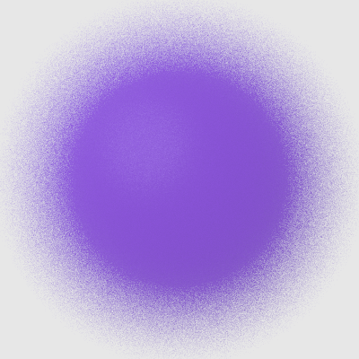

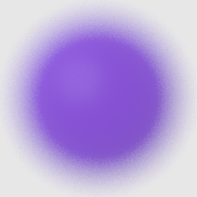

Figure 7.17: Effect of Sampling Patterns in Rendering a Purple Sphere with Depth of Field. (1) A high-quality reference image of a blurry sphere. (2) An image generated with random sampling in each pixel without stratification. (3) An image generated with the same number of samples, but with the StratifiedSampler, which stratified both the image and, more importantly for this image, the lens samples. Stratification makes a substantial improvement for this situation.

Figure 7.18 shows a comparison of a few sampling patterns. The first is a completely random pattern: we generated a number of samples without using the strata at all. The result is terrible; some regions have few samples and other areas have clumps of many samples. The second is a uniform stratified pattern. In the last, the uniform pattern has been jittered, with a random offset added to each sample’s location, keeping it inside its cell. This gives a better overall distribution than the purely random pattern while preserving the benefits of stratification, though there are still some clumps of samples and some regions that are undersampled.

图 7.17：采样模式在渲染具有景深的紫色球体时的效果(1) 模糊球体的高质量参考图像(2) 在每个像素中随机采样生成的没有分层的图像(3) 使用相同数量的采样生成的图像，但使用 StratifiedSampler 生成的图像，该图像对图像进行分层，对于该图像更重要的是对镜头采样进行分层。分层使这种情况得到了实质性的改善。

图 7.18 显示了几种采样模式的比较。第一个是完全随机的模式：我们在完全不使用层的情况下生成了大量采样。结果很糟糕；一些地区的采样很少，而另一些地区的采样很多。二是统一的分层格局。最后，均匀模式被抖动，随机偏移添加到每个采样的位置，使其保持在其单元内。这提供了比纯随机模式更好的整体分布，同时保留了分层的好处，尽管仍有一些采样团和一些未充分采样的区域。

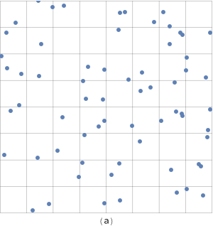

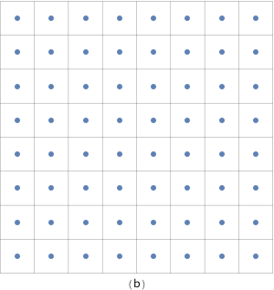

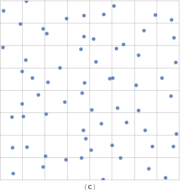

Figure 7.18: Three 2D Sampling Patterns. (a) The random pattern is an ineffective pattern, with many clumps of samples that leave large sections of the image poorly sampled. (b) A uniform stratified pattern is better distributed but can exacerbate aliasing artifacts. (c) A stratified jittered pattern turns aliasing from the uniform pattern into high-frequency noise while still maintaining the benefits of stratification.

Figure 7.19 shows images rendered using the StratifiedSampler and shows how jittered sample positions turn aliasing artifacts into less objectionable noise.

图 7.18：三个 2D 采样模式(a) 随机模式是一种无效模式，有许多采样块导致图像的大部分采样不佳(b) 均匀分层模式分布更佳，但会加剧走样伪像(c) 分层抖动模式将走样从均匀模式转变为高频噪声，同时仍保持分层的好处。

图 7.19 显示了使用 StratifiedSampler 渲染的图像，并显示了抖动的采样位置如何将走样伪像变成不太令人讨厌的噪声。


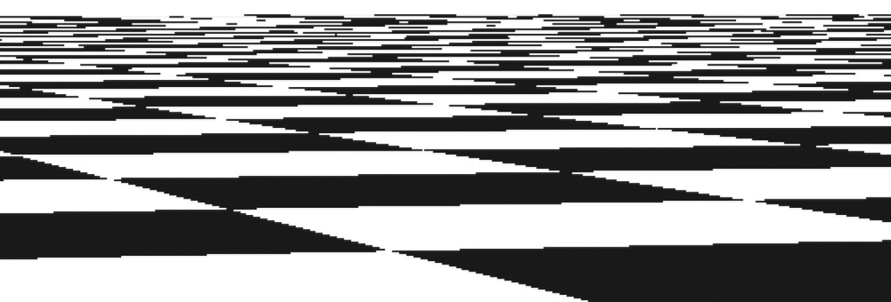

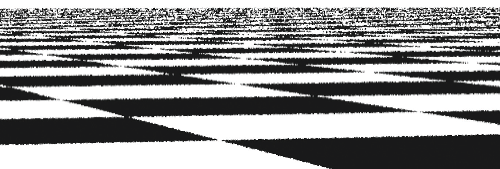


Figure 7.19: Comparison of Image Sampling Methods with a Checkerboard Texture. This is a difficult image to render well, since the checkerboard’s frequency with respect to the pixel spacing tends toward infinity as we approach the horizon. (1) A reference image, rendered with 256 samples per pixel, showing something close to an ideal result. (2) An image rendered with one sample per pixel, with no jittering. Note the jaggy artifacts at the edges of checks in the foreground. Notice also the artifacts in the distance where the checker function goes through many cycles between samples; as expected from the signal processing theory presented earlier, that detail reappears incorrectly as lower frequency aliasing. (3) The result of jittering the image samples, still with just one sample per pixel. The regular aliasing of the second image has been replaced by less objectionable noise artifacts. (4) The result of four jittered samples per pixel is still inferior to the reference image but is substantially better than the previous result.

图 7.19：图像采样方法与棋盘格纹理的比较。这是一张很难渲染的图像，因为当我们接近地平线时，棋盘格相对于像素间距的频率趋于无穷大(1) 参考图像，每像素渲染 256 个采样，显示接近理想的结果(2) 每像素一个采样渲染的图像，没有抖动。注意前景中检查边缘的走样状伪像。还要注意检查器函数在采样之间经历多次循环的距离中的伪像；正如前面介绍的信号处理理论所预期的那样，该细节错误地重新出现为低频走样(3) 抖动图像采样的结果，仍然每个像素只有一个采样。第二张图像的常规走样已被不太令人讨厌的噪声伪像所取代(4)每像素四个抖动采样的结果仍然不如参考图像，但比之前的结果要好得多。

```
<<StratifiedSampler Declarations>>= 
class StratifiedSampler : public PixelSampler {
public:
    <<StratifiedSampler Public Methods>> 
private:
    <<StratifiedSampler Private Data>> 
};

<<StratifiedSampler Public Methods>>= 
StratifiedSampler(int xPixelSamples, int yPixelSamples,
        bool jitterSamples, int nSampledDimensions)
    : PixelSampler(xPixelSamples * yPixelSamples, nSampledDimensions),
      xPixelSamples(xPixelSamples), yPixelSamples(yPixelSamples),
      jitterSamples(jitterSamples) { }
<<StratifiedSampler Private Data>>= 
const int xPixelSamples, yPixelSamples;
const bool jitterSamples;
```

As a PixelSampler subclass, the implementation of StartPixel() must both generate 1D and 2D samples for the number of dimensions nSampledDimensions passed to the PixelSampler constructor as well as samples for the requested arrays.

作为 PixelSampler 子类，StartPixel() 的实现必须为传递给 PixelSampler 构造函数的维数 nSampledDimensions 以及所请求数组的采样生成一维和二维采样。

```
<<StratifiedSampler Method Definitions>>= 
void StratifiedSampler::StartPixel(const Point2i &p) {
    <<Generate single stratified samples for the pixel>> 
    <<Generate arrays of stratified samples for the pixel>> 
    PixelSampler::StartPixel(p);
}
```

After the initial stratified samples are generated, they are randomly shuffled; this is the padding approach described at the start of the section. If this shuffling wasn’t done, then the sample dimensions’ values would be correlated in a way that would lead to errors in images—for example, both the first 2D sample used to choose the film location as well as the first 2D lens sample would always both be in the lower left stratum adjacent to the origin.

初始分层采样生成后，随机打乱；这是本节开头描述的填充方法。如果不进行这种打乱，则采样尺寸的值将以某种方式关联，从而导致图像出现错误——例如，用于选择胶片位置的第一个 2D 采样和第一个 2D 镜头采样将始终位于与原点相邻的左下层。

```
<<Generate single stratified samples for the pixel>>= 
for (size_t i = 0; i < samples1D.size(); ++i) {
    StratifiedSample1D(&samples1D[i][0], xPixelSamples * yPixelSamples,
                       rng, jitterSamples);
    Shuffle(&samples1D[i][0], xPixelSamples * yPixelSamples, 1, rng);
}

for (size_t i = 0; i < samples2D.size(); ++i) {
    StratifiedSample2D(&samples2D[i][0], xPixelSamples, yPixelSamples,
                       rng, jitterSamples);
    Shuffle(&samples2D[i][0], xPixelSamples * yPixelSamples, 1, rng);
}
```

The 1D and 2D stratified sampling routines are implemented as utility functions. Both loop over the given number of strata in the domain and place a sample point in each one.

一维和二维分层采样代码作为工具函数实现。两者都在域中给定数量的层上循环，并在每个层中放置一个采样点。

```
<<Sampling Function Definitions>>= 
void StratifiedSample1D(Float *samp, int nSamples, RNG &rng,
        bool jitter) {
    Float invNSamples = (Float)1 / nSamples;
    for (int i = 0; i < nSamples; ++i) {
        Float delta = jitter ? rng.UniformFloat() : 0.5f;
        samp[i] = std::min((i + delta) * invNSamples, OneMinusEpsilon);
    }
}
```

StratifiedSample2D() similarly generates samples in the range $[0, 1)^2$.

StratifiedSample2D() 类似地生成 $[0, 1)^2$ 范围内的采样。

```
<<Sampling Function Definitions>>+=  
void StratifiedSample2D(Point2f *samp, int nx, int ny, RNG &rng,
        bool jitter) {
    Float dx = (Float)1 / nx, dy = (Float)1 / ny;
    for (int y = 0; y < ny; ++y)
        for (int x = 0; x < nx; ++x) {
            Float jx = jitter ? rng.UniformFloat() : 0.5f;
            Float jy = jitter ? rng.UniformFloat() : 0.5f;
            samp->x = std::min((x + jx) * dx, OneMinusEpsilon);
            samp->y = std::min((y + jy) * dy, OneMinusEpsilon);
            ++samp;
        }
}
```

The Shuffle() function randomly permutes an array of count sample values, each of which has nDimensions dimensions. (In other words, blocks of values of size nDimensions are permuted.)

Shuffle() 函数随机排列计数采样值数组，每个采样值具有 nDimensions 维（换句话说，大小为 nDimensions 的值块被置换。）

```
<<Sampling Inline Functions>>= 
template <typename T>
void Shuffle(T *samp, int count, int nDimensions, RNG &rng) {
    for (int i = 0; i < count; ++i) {
        int other = i + rng.UniformUInt32(count - i);
        for (int j = 0; j < nDimensions; ++j)
            std::swap(samp[nDimensions * i + j],
                      samp[nDimensions * other + j]);
    }
}
```

Arrays of samples present us with a quandary: for example, if an integrator asks for an array of 64 2D sample values in the sample vector for each sample in a pixel, the sampler has two different goals to try to fulfill:

1. It’s desirable that the samples in the array themselves be well distributed in 2D (e.g., by using an $8 \times 8$ stratified grid). Stratification here will improve the quality of the computed results for each individual sample vector.

2. It’s desirable to ensure that each of the samples in the array for one image sample isn’t too similar to any of the sample values for samples nearby in the image. Rather, we’d like the points to be well distributed with respect to their neighbors, so that over the region around a single pixel, there is good coverage of the entire sample space.

采样数组给我们带来了两难：例如，如果积分器要求像素中每个采样的采样向量中有 64 个 2D 采样值的数组，则采样器有两个不同的目标要尝试实现：

1. 数组中的采样本身最好在 2D 中分布良好（例如，通过使用 $8 \times 8$ 分层网格）。这里的分层将提高每个单独采样向量的计算结果的质量。

2. 最好确保一个图像采样的数组中的每个采样与图像中附近采样的任何采样值不太相似。相反，我们希望这些点相对于它们的邻居分布得很好，这样在单个像素周围的区域上，整个采样空间都有很好的覆盖。

Rather than trying to solve both of these problems simultaneously here, the StratifiedSampler only addresses the first one. The other samplers later in this chapter will revisit this issue with more sophisticated techniques and solve both of them simultaneously to various degrees.

A second complication comes from the fact that the caller may have asked for an arbitrary number of samples per image sample, so stratification may not be easily applied. (For example, how do we generate a stratified 2D pattern of seven samples?) We could just generate an $n \times 1$ or $1 \times n$ stratified pattern, but this only gives us the benefit of stratification in one dimension and no guarantee of a good pattern in the other dimension. A StratifiedSampler::RoundSize() method could round requests up to the next number that's the square of integers, but instead we will use an approach called Latin hypercube sampling (LHS), which can generate any number of samples in any number of dimensions with a reasonably good distribution.

LHS uniformly divides each dimension's axis into $n$ regions and generates a jittered sample in each of the $n$ regions along the diagonal, as shown on the left in Figure $7.20$. These samples are then randomly shuffled in each dimension, creating a pattern with good distribution.

StratifiedSampler 并没有试图在这里同时解决这两个问题，而是只解决第一个问题。本章后面的其他采样器将使用更复杂的技术重新审视这个问题，并在不同程度上同时解决这两个问题。

第二个复杂因素是调用者可能要求每个图像采样有任意数量的采样，因此分层可能不容易应用（例如，我们如何生成 7 个采样的分层 2D 模式？）我们可以只生成 $n \times 1$ 或 $1 \times n$ 分层模式，但这只会给我们带来一维分层的好处，并且不能保证另一个维度的良好模式。 StratifiedSampler::RoundSize() 方法可以将请求四舍五入到下一个整数的平方，但我们将使用一种称为拉丁超立方体采样 (LHS) 的方法，该方法可以生成任意数量的任意数量维度的采样，并具有相当好的分布。

LHS 将每个维度的轴均匀划分为 $n$ 个区域，并在每个 $n$ 区域沿对角线生成抖动采样，如图 $7.20$ 左侧所示。然后这些采样在每个维度上随机打乱，创建一个分布良好的模式。


Figure 7.20: Latin hypercube sampling (sometimes called $n$ -rooks sampling) chooses samples such that only a single sample is present in each row and each column of a grid. This can be done by generating random samples in the cells along the diagonal and then randomly permuting their coordinates. One advantage of LHS is that it can generate any number of samples with a good distribution, not just $m \times n$ samples, as with stratified patterns.

An advantage of LHS is that it minimizes clumping of the samples when they are projected onto any of the axes of the sampling dimensions. This property is in contrast to stratified sampling, where $2 n$ of the $n \times n$ samples in a 2D pattern may project to essentially the same point on each of the axes. Figure $7.21$ shows this worst-case situation for a stratified sampling pattern.

图7.20：拉丁超立方采样（有时称为 $ N-rooks $ 采样）选择的采样，使得网格的每行和每列中仅存在一个样本。这可以通过沿对角线在单元格中生成随机采样，然后随机排列它们的坐标来完成。 LHS的一个优点是，它可以产生任何数目具有良好的分配的采样，而不仅仅是 $m \times n$ 采样，像分层模式。

LHS的一个优点是，当样本投影到采样尺寸的任何轴上时，它可以最大限度地减少样本的聚集。该属性是相对于分层采样，其中 $2 n$ 个 $n \times n$ 采样在2D图案可以投影到每个轴上基本相同的点。图 $ 7.21 $ 显示了这种分层采样模式最坏的情况。

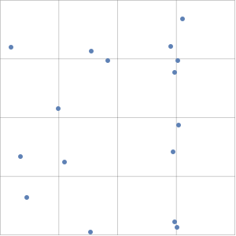

Figure 7.21: A Worst-Case Situation for Stratified Sampling. In an $n \times n 2 \mathrm{D}$ pattern, up to $2 n$ of the points may project to essentially the same point on one of the axes. When "unlucky" patterns like this are generated, the quality of the results computed with them usually suffers. (Here, 8 of the samples have nearly the same $x$ value.)

In spite of addressing the clumping problem, LHS isn’t necessarily an improvement to stratified sampling; it’s easy to construct cases where the sample positions are essentially colinear and large areas of the sampling domain have no samples near them (e.g., when the permutation of the original samples is the identity, leaving them all where they started). In particular, as $n$ increases, Latin hypercube patterns are less and less effective compared to stratified patterns.

The general-purpose LatinHypercube() function generates an arbitrary number of LHS samples in an arbitrary dimension. The number of elements in the samples array should thus be nSamples*nDim.

图 7.21：分层采样的最坏情况。在 $n \times n 2 \mathrm{D}$ 模式中，多达 $2 n$ 的点可以投影到一个轴上的基本相同的点。当生成这样的“不幸”模式时，用它们计算的结果的质量通常会受到影响（这里，8 个采样的 $x$ 值几乎相同。）

尽管解决了聚集问题，但 LHS 不一定是对分层采样的改进；很容易构建采样位置基本上共线，且采样域的大面积区域附近没有采样的情况（例如，当原始采样的排列是唯一时，将它们全部留在它们开始的地方）。特别是，随着 $n$ 的增加，与分层模式相比，拉丁超立方体模式的效果越来越差。

通用的 LatinHypercube() 函数在任意维度生成任意数量的 LHS 采样。因此，采样数组中的元素数应为 nSamples*nDim。

```
<<Sampling Function Definitions>>+=  
void LatinHypercube(Float *samples, int nSamples, int nDim, RNG &rng) {
    <<Generate LHS samples along diagonal>> 
    <<Permute LHS samples in each dimension>> 
}

<<Generate LHS samples along diagonal>>= 
Float invNSamples = (Float)1 / nSamples;
for (int i = 0; i < nSamples; ++i)
    for (int j = 0; j < nDim; ++j) {
        Float sj = (i + (rng.UniformFloat())) * invNSamples;
        samples[nDim * i + j] = std::min(sj, OneMinusEpsilon);
    }
```

To do the permutation, this function loops over the samples, randomly permuting the sample points in one dimension at a time. Note that this is a different permutation than the earlier Shuffle() routine: that routine does one permutation, keeping all nDim sample points in each sample together, while here nDim separate permutations of a single dimension at a time are done (Figure 7.22).

为了进行置换，该函数循环遍历采样，同时随机地在一维中依次置换采样点。请注意，这是与早期的 Shuffle() 代码不同的排列：该代码进行一次排列，将每个采样中的所有 nDim 采样点保持在一起，而这里依次完成单个维度的 nDim 单独排列（图 7.22）。


Figure 7.22: (a) The permutation done by the Shuffle() routine moves entire blocks of elements around. (b) The permutation for Latin hypercube sampling permutes each dimension’s samples independently. Here, the shuffling of the second dimension’s samples from a four-element pattern of three dimensions is shown.

图 7.22：(a) Shuffle() 代码完成的置换移动整个元素块(b) 拉丁超立方体采样的置换独立地置换每个维度的采样。在这里，显示了从三个维度的四元素模式对第二个维度的采样进行改组。

```
<<Permute LHS samples in each dimension>>= 
for (int i = 0; i < nDim; ++i) {
    for (int j = 0; j < nSamples; ++j) {
        int other = j + rng.UniformUInt32(nSamples - j);
        std::swap(samples[nDim * j + i], samples[nDim * other + i]);
    }
}
```

Given the LatinHypercube() function, we can now write the code to compute sample arrays for the current pixel. 1D samples are stratified and then randomly shuffled, while 2D samples are generated using Latin hypercube sampling.

给定 LatinHypercube() 函数，我们现在可以编写代码来计算当前像素的采样数组。一维采样被分层，然后随机打乱，而二维采样是使用拉丁超立方体采样生成的。

```
<<Generate arrays of stratified samples for the pixel>>= 
for (size_t i = 0; i < samples1DArraySizes.size(); ++i)
    for (int64_t j = 0; j < samplesPerPixel; ++j) {
        int count = samples1DArraySizes[i];
        StratifiedSample1D(&sampleArray1D[i][j * count], count, rng,
                           jitterSamples);
        Shuffle(&sampleArray1D[i][j * count], count, 1, rng);
    }
for (size_t i = 0; i < samples2DArraySizes.size(); ++i)
    for (int64_t j = 0; j < samplesPerPixel; ++j) {
        int count = samples2DArraySizes[i];
        LatinHypercube(&sampleArray2D[i][j * count].x, count, 2, rng);
    }
```

We’ll use the scene in Figure 7.23 to demonstrate properties of some of the Sampler implementations.

我们将使用图 7.23 中的场景来演示一些 Sampler 实现的属性。

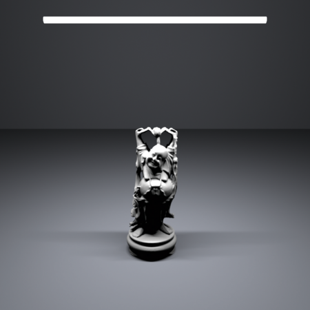

Figure 7.24 shows the improvement from good samples for the DirectLightingIntegrator. The first image was computed with 1 image sample per pixel, each with 16 shadow samples. The second was computed with 16 image samples per pixel, each with 1 shadow sample. Because the StratifiedSampler could generate a good LHS pattern for the first case, the quality of the shadow is much better, even with the same total number of shadow samples taken.

图 7.24 显示了 DirectLightingIntegrator 的良好示例的改进。第一张图像是用每个像素 1 个图像采样计算的，每个图像有 16 个阴影采样。第二个是用每个像素 16 个图像采样计算的，每个采样有 1 个阴影采样。因为 StratifiedSampler 可以为第一种情况生成良好的 LHS 模式，所以即使采用相同的阴影采样总数，阴影的质量也要好得多。

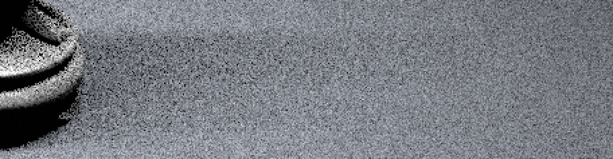

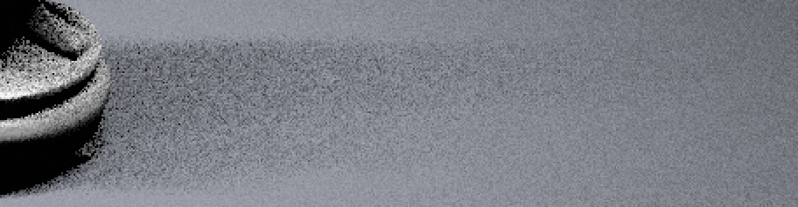

Figure 7.24: Sampling an Area Light with Samples from the Stratified Sampler. (1) shows the result of using 1 image sample per pixel and 16 shadow samples, and (2) shows the result of 16 image samples, each with just 1 shadow sample. The total number of shadow samples is the same in both cases, but because the version with 16 shadow samples per image sample is able to use an LHS pattern, all of the shadow samples in a pixel’s area are well distributed, while in the second image the implementation here has no way to prevent them from being poorly distributed. The difference is striking.

图 7.24：使用来自分层采样器的采样对区域光进行采样(1) 显示了每个像素使用 1 个图像采样和 16 个阴影采样的结果，(2) 显示了 16 个图像采样的结果，每个采样只有 1 个阴影采样。两种情况下阴影采样的总数相同，但由于每个图像采样具有 16 个阴影采样的版本能够使用 LHS 模式，因此像素区域中的所有阴影采样均分布良好，而在第二个图像中这里的实现无法防止它们分布不均。差异是惊人的。

## 7.4 The Halton Sampler / Halton采样器

The underlying goal of the StratifiedSampler is to generate a well-distributed but non-uniform set of sample points, with no two sample points too close together and no excessively large regions of the sample space that have no samples. As Figure 7.18 showed, a jittered pattern does this much better than a random pattern does, although its quality can suffer when samples in adjacent strata happen to be close to the shared boundary of their two strata.

This section introduces the HaltonSampler, which is based on algorithms that directly generate low-discrepancy point sets. Unlike the points generated by the StratifiedSampler, the HaltonSampler not only generates points that are guaranteed to not clump too closely together, but it also generates points that are simultaneously well distributed over all of the dimensions of the sample vector—not just one or two dimensions at a time, as the StratifiedSampler did.

StratifiedSampler 的基本目标是生成一组分布良好但不均匀的采样点，没有两个采样点靠得太近，也没有采样空间中没有采样的过大区域。如图 7.18 所示，抖动模式在这方面的表现比随机模式好得多，尽管当相邻层中的采样碰巧靠近其两个层的共享边界时，其质量会受到影响。

本节介绍 HaltonSampler，它基于直接生成低差异点集的算法。与 StratifiedSampler 生成的点不同，HaltonSampler 不仅保证生成的点不会聚集在一起太近，而且生成同时在采样向量的所有维度上分布良好的点——不仅仅是依次一维或二维，就像 StratifiedSampler 所做的那样。

### 7.4.1 Hammersley and Halton Sequences / Hammersley 和 Halton 序列

The Halton and Hammersley sequences are two closely related low-discrepancy point sets. Both are based on a construction called the radical inverse, which is based on the fact that a positive integer value $a$ can be expressed in a base $b$ with a sequence of digits $d_{m}(a) \ldots d_{2}(a) d_{1}(a)$ uniquely determined by

Halton 和 Hammersley 序列是两个密切相关的低差异点集。两者都基于称为radical inverses的构造，它基于这样一个事实，即正整数值 $a$ 可以表示为带有数字序列 $d_{m}(a) \ldots d_{2}(a) d_{1}(a)$ 的基数 $b$ ，有公式

$$
a=\sum_{i=1}^{m} d_{i}(a) b^{i-1}
$$

(7.6)

where all digits $d_{i}(a)$ are between 0 and $b-1$.

The radical inverse function $\Phi_{b}$ in base $b$ converts a nonnegative integer $a$ to a fractional value in $[0,1)$ by reflecting these digits about the radix point:

其中所有数字 $d_{i}(a)$ 都在 0 到 $b-1$ 之间。

基数 $b$ 中的radical inverses函数 $\Phi_{b}$ 通过反映关于小数点的这些数字，将非负整数 $a$ 转换为 $[0,1)$ 中的小数：

$$
\Phi_{b}(a)=0 . d_{1}(a) d_{2}(a) \ldots d_{m}(a)
$$

(7.7)

Thus, the contribution of the digit $d_{i}(a)$ to the radical inverse is $d_{i}(a) / b^{i}$.

One of the simplest low-discrepancy sequences is the van der Corput sequence, which is a 1D sequence given by the radical inverse function in base 2 :

因此，数字 $d_{i}(a)$ 对radical inverses的贡献是 $d_{i}(a) / b^{i}$ 。

van der Corput 序列是最简单的低差异序列之一，它是由基数为 2 的radical inverses函数给出的一维序列：

$$
x_{a}=\Phi_{2}(a)
$$

Table $7.3$ shows the first few values of the van der Corput sequence. Notice how it recursively splits the intervals of the $1 \mathrm{D}$ line in half, generating a sample point at the center of each interval.

Table 7.3: The radical inverse $\Phi_{2}(a)$ of the first few non-negative integers, computed in base $2 .$ Notice how successive values of $\Phi_{2}(a)$ are not close to any of the previous values of $\Phi_{2}(a)$. As more and more values of the sequence are generated, samples are necessarily closer to previous samples, although with a minimum distance that is guaranteed to be reasonably good.

表 $7.3$ 显示了 van der Corput 序列的前几个值。注意它如何递归地将 $1 \mathrm{D}$ 行的间隔分成两半，在每个间隔的中心生成一个采样点。

表 7.3：前几个非负整数的radical inverses $\Phi_{2}(a)$ ，以 $2$ 为底计算。 注意 $\Phi_{2}(a)$ 的连续值是如何不接近 $\Phi_{2}(a)$ 的任何先前值。随着序列的越来越多的值被生成，采样必然更接近先前的采样，尽管保证合理良好的最小距离。

$$
\begin{array}{lll}
\hline a & \text { Base } 2 & \Phi_{2}(a) \\
\hline 0 & 0 & 0 \\
\hline 1 & 1 & 0.1=1 / 2 \\
\hline 2 & 10 & 0.01=1 / 4 \\
\hline 3 & 11 & 0.11=3 / 4 \\
\hline 4 & 100 & 0.001=1 / 8 \\
\hline 5 & 101 & 0.101=5 / 8 \\
\hline \vdots & & \\
\hline
\end{array}
$$

The discrepancy of this sequence is

这个序列的差异是

$$
D_{N}^{*}(P)=O\left(\frac{\log N}{N}\right)
$$

which matches the best discrepancy that has been attained for infinite sequences in $n$ dimensions,

它与 $n$ 维中的无限序列获得的最佳差异相匹配，

$$
D_{N}^{*}(P)=O\left(\frac{(\log N)^{n}}{N}\right)
$$

To generate points in an $n$ -dimensional Halton sequence, we use the radical inverse base $b$, with a different base for each dimension of the pattern. The bases used must all be relatively prime to each other, so a natural choice is to use the first $n$ prime numbers $\left(p_{1}, \ldots, p_{n}\right)$ :

为了在 $n$ 维 Halton 序列中生成点，我们使用radical inverses基 $b$ ，对于模式的每个维度都有不同的基。使用的基必须彼此互质，因此自然的选择是使用前 $n$ 个质数 $\left(p_{1}, \ldots, p_{n}\right)$ ：

$$
x_{a}=\left(\Phi_{2}(a), \Phi_{3}(a), \Phi_{5}(a), \ldots, \Phi_{p_{n}}(a)\right)
$$

One of the most useful characteristics of the Halton sequence is that it can be used even if the total number of samples needed isn't known in advance; all prefixes of the sequence are well distributed, so as additional samples are added to the sequence low discrepancy will be maintained. (However, its distribution is best when the total number of samples is the product of powers of the bases $\Pi\left(p_{i}\right)^{k_{j}}$ for exponents $k_{i}$. $)$

The discrepancy of an $n$ -dimensional Halton sequence is

Halton 序列最有用的特性之一是，即使事先不知道所需的采样总数，也可以使用它；序列的所有前缀均分布良好，因此在向序列中添加额外采样时，将保持低差异（然而，当采样总数是指数 $\Pi\left(p_{i}\right)^{k_{j}}$ 的幂的乘积时，它的分布是最好的.$)$

$n$ 维Halton序列的差异是

$$
D_{N}^{*}\left(x_{a}\right)=O\left(\frac{(\log N)^{n}}{N}\right)
$$

which is asymptotically optimal.

If the number of samples $N$ is fixed, the Hammersley point set can be used, giving slightly lower discrepancy. Hammersley point sets are defined by

这是渐近最优的。

如果采样数 $N$ 是固定的，则可以使用 Hammersley 点集，从而使差异稍微降低。 Hammersley 点集定义为

$$
x_{a}=\left(\frac{a}{N}, \Phi_{b_{1}}(a), \Phi_{b_{2}}(a), \ldots, \Phi_{b_{n}}(a)\right)
$$

where $N$ is the total number of samples to be taken and as before all of the bases $b_{i}$ are relatively prime. Figure 7.25(a) shows a plot of the first 216 points of the 2D Halton sequence. Figure $7.25$ (b) shows the first 256 points of the Hammersley sequence.

其中 $N$ 是要采集的采样总数，并且所有的基 $b_{i}$ 都是素数。图 7.25(a) 显示了 2D Halton 序列的前 216 个点的图。图 $7.25$ (b) 显示了 Hammersley 序列的前 256 个点。

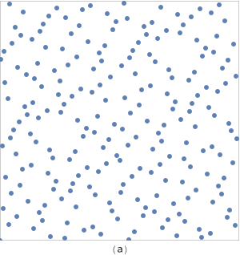

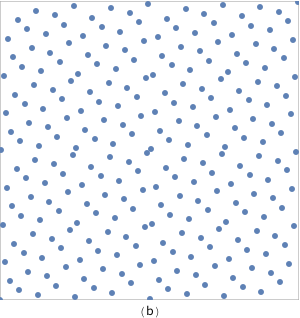

Figure 7.25: The First Points of Two Low-Discrepancy Sequences in 2D. (a) Halton (216 points), (b) Hammersley (256 points).

The function RadicalInverse() computes the radical inverse for a given number a using the baseIndexth prime number as the base. The function is implemented using an enormous switch statement, where baseIndex is mapped to the appropriate prime number and then a separate RadicalInverseSpecialized() template function actually computes the radical inverse. (The reason for the curious switch-based structure will be explained shortly.)

图 7.25：二维中两个低差异序列的第一个点(a) Halton (216 分)，(b) Hammersley (256 分)。

函数 RadicalInverse() 使用 baseIndexth 素数作为基数，计算给定数 a 的radical inverses。该函数是使用一个巨大的 switch 语句实现的，其中 baseIndex 被映射到适当的素数，然后一个单独的 RadicalInverseSpecialized() 模板函数实际计算radical inverses（将很快解释这种奇怪的基于开关的结构的原因。）

```
<<Low Discrepancy Function Definitions>>= 
Float RadicalInverse(int baseIndex, uint64_t a) {
    switch (baseIndex) {
        case 0:
            <<Compute base-2 radical inverse>>  
        case 1: return RadicalInverseSpecialized<3>(a);
        case 2: return RadicalInverseSpecialized<5>(a);
        case 3: return RadicalInverseSpecialized<7>(a);
        <<Remainder of cases for RadicalInverse()>> 
    }
}
```

For the base-2 radical inverse, we can take advantage of the fact that numbers in digital computers are already represented in base 2 to compute the radical inverse more efficiently. For a 64 -bit value $a$, we have from Equation (7.6)

对于基数为 2 的根倒数，我们可以利用数字计算机中的数字已经以 2 为基数的事实来更有效地计算radical inverses。对于 64 位值 $a$ ，我们从公式 (7.6) 得到

$$
a=\sum_{i=1}^{64} d_{i}(a) 2^{i-1}
$$

First consider the result of reversing the bits of $a$, still considering it as an integer value, which gives

首先考虑将 $a$ 的位取反的结果，仍将其视为整数值，由此得出

$$
\sum_{i=1}^{64} d_{i}(a) 2^{64-i}
$$

If we then divide this value by $2^{64}$, we have

如果我们将这个值除以 $2^{64}$ ，我们有

$$
\sum_{i=1}^{64} d_{i}(a) 2^{-i}
$$

which is $\Phi_{2}(a)$. Thus, the base-2 radical inverse can equivalently be computed with a bit reverse and a power-of-two division.

The bits of an integer quantity can be efficiently reversed with a series of logical bit operations. The first line of the ReverseBits32() function, which reverses the bits of a 32-bit integer, swaps the lower 16 bits with the upper 16 bits of the value. The next line simultaneously swaps the first 8 bits of the result with the second 8 bits and the third 8 bits with the fourth. This process continues until the last line, which swaps adjacent bits. To understand this code, it's helpful to write out the binary values of the various hexadecimal constants. For example, 0xff00ff00 is 11111111000000001111111100000000 in binary; it's easy to see that a bitwise OR with this value masks off the first and third 8 -bit quantities.

结果是 $\Phi_{2}(a)$ 。因此，基数为 2 的radical inverses可以等价地通过位反转和二次除法来计算。

整数量的位可以通过一系列逻辑位操作有效地反转。 ReverseBits32() 函数的第一行反转 32 位整数的位，将低 16 位与值的高 16 位交换。下一行同时将结果的前 8 位与第二个 8 位，第三个 8 位与第四位交换。这个过程一直持续到最后一行，它交换了相邻的位。要理解此代码，写出各种十六进制常量的二进制值会很有帮助。例如 0xff00ff00 是 11111111000000001111111100000000 二进制；很容易看出，与此值的按位 OR 屏蔽掉了第一个和第三个 8 位量。

```
<<Low Discrepancy Inline Functions>>= 
inline uint32_t ReverseBits32(uint32_t n) {
    n = (n << 16) | (n >> 16);
    n = ((n & 0x00ff00ff) << 8) | ((n & 0xff00ff00) >> 8);
    n = ((n & 0x0f0f0f0f) << 4) | ((n & 0xf0f0f0f0) >> 4);
    n = ((n & 0x33333333) << 2) | ((n & 0xcccccccc) >> 2);
    n = ((n & 0x55555555) << 1) | ((n & 0xaaaaaaaa) >> 1);
    return n;
}
```

The bits of a 64-bit value can then be reversed by reversing the two 32-bit components individually and then interchanging them.

然后可以通过分别反转两个 32 位元素然后交换它们来反转 64 位值的位。

```
<<Low Discrepancy Inline Functions>>+=  
inline uint64_t ReverseBits64(uint64_t n) {
    uint64_t n0 = ReverseBits32((uint32_t)n);
    uint64_t n1 = ReverseBits32((uint32_t)(n >> 32));
    return (n0 << 32) | n1;
}
```

To compute the base-2 radical inverse, then, we reverse the bits and multiply by $1 / 2^{64}$, where the hexadecimal floating-point constant 0x1p-64 is used for the value $2^{-64}$. As explained in Section 3.9.1, implementing a power-of-two division via the corresponding power-of-two multiplication gives the same result with IEEE floating point. (And floating-point multiplication is generally more efficient than floatingpoint division.)

为了计算基数为 2 的radical inverses，我们将位取反并乘以 $1 / 2^{64}$ ，其中十六进制浮点常数 0x1p-64 用于值 $2^{-64}$ 。如第 3.9.1 节所述，通过相应的 2 次幂乘法实现 2 次幂除法与 IEEE 浮点运算结果相同（而且浮点乘法通常比浮点除法更有效。）

```
<<Compute base-2 radical inverse>>= 
return ReverseBits64(a) * 0x1p-64;
```

For other bases, the RadicalInversespecialized() template function computes the radical inverse by computing the digits $d_{i}$ starting with $d_{1}$ and computing a series $v_{i}$ where $v_{1}=d_{1}, v_{2}=b d_{1}+d_{2}$ such that

对于其他基数，RadicalInversespecialized() 模板函数通过计算以 $d_{1}$ 开头的数字 $d_{i}$ 并计算一系列 $v_{i}$ ，其中 $v_{1}=d_{1}, v_{2}=b d_{1}+d_{2}$ 来计算radical inverses使得

$$
v_{n}=b^{n-1} d_{1}+b^{n-2} d_{2}+\cdots+d_{n}
$$

(For example, in base 10, it would convert the value 1234 to 4321 .) This value can be found entirely using integer arithmetic, without accumulating any round-off error.

The final value of the radical inverse is then found by converting to floating-point and multiplying by $1 / b^{n}$, where $n$ is the number of digits in the value, to get the value in Equation (7.7). The term for this multiplication is built up in invBaseN as the digits are processed.

（例如，在基数 10 中，它会将值 1234 转换为 4321 。）可以完全使用整数算法找到该值，而不会累积任何舍入误差。

然后通过转换为浮点数并乘以 $1 / b^{n}$ 找到radical inverses的最终值，其中 $n$ 是值中的位数，得到公式（7.7）中的值。在处理数字时，该乘法项在 invBaseN 中建立。

```
<<Low Discrepancy Static Functions>>= 
template <int base>
static Float RadicalInverseSpecialized(uint64_t a) {
    const Float invBase = (Float)1 / (Float)base;
    uint64_t reversedDigits = 0;
    Float invBaseN = 1;
    while (a) {
        uint64_t next  = a / base;
        uint64_t digit = a - next * base;
        reversedDigits = reversedDigits * base + digit;
        invBaseN *= invBase;
        a = next;
    }
    return std::min(reversedDigits * invBaseN, OneMinusEpsilon);
}
```

A natural question to ask would be why a template function parameterized on the base is used here (rather than, say, a regular function call that took the base as a parameter, which would avoid the generation of a separate code path for each base). The motivation is that integer division is shockingly slow on modern CPUs, and much more efficient approaches are possible for division by a compile-time constant.

For example, integer division of a 32-bit value by 3 can be computed exactly by multiplying this value by 2863311531 to get a 64-bit intermediate and then shifting the result right by 33 bits; these are both fairly efficient operations. (A similar approach can be used for dividing 64-bit values by 3, but the magic constant is much larger; see Warren (2006) for more about these techniques.) Thus, using a template function here allows the compiler to see that the division to compute the value of next in the while loop is actually a division by a constant and gives it a chance to apply this optimization. The code with this optimization runs 5.9 times faster on a 2015-era laptop than an implementation based on integer division instructions.

Another optimization is that we avoid computing a running sum over reversed digits multiplied by the reciprocal base; instead, this multiplication is postponed all the way until the end when the loop terminates. The main issue here is that floating-point and integer units on current processors operate fairly independently from each other. Referencing an integer variable within a floating computation in a tight loop would introduce pipeline bubbles related to the amount of time that is needed to convert and move the values from one unit to the other.

It will be useful to be able to compute the inverse of the radical inverse function; the InverseRadicalinverse( ) function takes the reversed integer digits in some base, corresponding to reversedDigits in the RadicalInversespecialized() template function immediately before being multiplied by the $1 / b^{n}$ factor to convert to a floating-point value in $[0,1)$. Note that in order to be able to compute the inverse correctly, the total number of digits in the original value must be known: for example, both 1234 and 123400 are converted to 4321 after the integer-only part of the radical inverse algorithm; trailing zeros become leading zeros, which are lost.

一个自然要问的问题是为什么这里使用了在基数上参数化的模板函数（而不是将基数作为参数的常规函数​​调用，这将避免为每个基数生成单独的代码路径）。其动机是整数除法在现代 CPU 上慢得惊人，而且通过编译时常量进行除法可以使用更有效的方法。

例如，将 32 位值除以 3 的整数除法可以通过将此值乘以 2863311531 得到 64 位中间值，然后将结果右移 33 位来精确计算；这些都是相当有效的操作（类似的方法可用于将 64 位值除以 3，但魔术常数要大得多；有关这些技术的更多信息，请参阅 Warren (2006)。）因此，此处使用模板函数可以让编译器看到在 while 循环中计算 next 值的除法实际上是除以常数，并使其有机会应用此优化。与基于整数除法指令的实现相比，具有此优化的代码在 2015 年时代的笔记本电脑上运行速度快 5.9 倍。

另一个优化是我们避免计算倒数乘以倒数基数的运行总和；相反，这种乘法一直推迟到循环终止时的末尾。这里的主要问题是当前处理器上的浮点和整数单元彼此相当独立地运行。在紧循环的浮点计算中引用整数变量将引入管道气泡，该气泡与将值从一个单位转换和移动到另一个单位所需的时间有关。

能够计算radical inverses函数的反函数会很有用； InverseRadicalinverse( ) 函数采用某些基数中的反转整数数字，对应于 RadicalInversespecialized() 模板函数中的 reversedDigits，然后乘以 $1 / b^{n}$ 因子以转换为 $[0,1)$ 中的浮点值。请注意，为了能够正确计算逆，必须知道原始值的总位数：例如，1234 和 123400 在部首逆算法的纯整数部分都转换为 4321；尾随零变成前导零，它们会丢失。

```
<<Low Discrepancy Inline Functions>>+=  
template <int base> inline uint64_t
InverseRadicalInverse(uint64_t inverse, int nDigits) {
    uint64_t index = 0;
    for (int i = 0; i < nDigits; ++i) {
        uint64_t digit = inverse % base;
        inverse /= base;
        index = index * base + digit;
    }
    return index;
}
```

The Hammersley and Halton sequences have the shortcoming that as the base $b$ increases, sample values can exhibit surprisingly regular patterns. This issue can be addressed with scrambled Halton and Hammersley sequences, where a permutation is applied to the digits when computing the radical inverse:

Hammersley 和 Halton 序列的缺点是，随着基数 $b$ 的增加，采样值会表现出令人惊讶的规律模式。这个问题可以用加扰的 Halton 和 Hammersley 序列来解决，其中在计算radical inverses时对数字应用置换：

$$
\Psi_{b}(a)=0 . p\left(d_{1}(a)\right) p\left(d_{2}(a)\right) \ldots p\left(d_{m}(a)\right)
$$

(7.8)

where $p$ is a permutation of the digits $(0,1, \ldots, b-1)$. Note that the same permutation is used for each digit, and the same permutation is used for generating all of the sample points in a given base $b$. Figure $7.26$ shows the effect of scrambling with the Halton sequence.

其中 $p$ 是数字 $(0,1, \ldots, b-1)$ 的排列。请注意，每个数字使用相同的排列，并且相同的排列用于生成给定基数 $b$ 中的所有采样点。图 $7.26$ 显示了使用 Halton 序列进行加扰的效果。

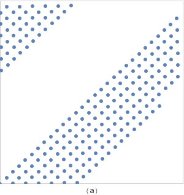

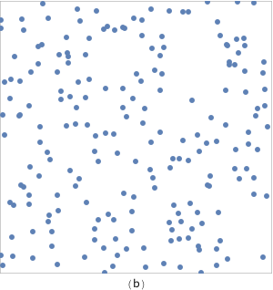

Figure 7.26: Plot of Halton Sample Values with and without Scrambling. (a) In higher dimensions of the sample vector, projections of sample values start to exhibit regular structure. Here, points from the dimensions $\left(\Phi_{29}(a), \Phi_{31}(a)\right)$ are shown. (b) Scrambled sequences, Equation (7.8), break up this structure by randomly permuting the digits of sample indices.

In the following, we will use random permutations, though specific constructions of permutations can give slightly better results; see the "Further Reading" section for more details.

The ComputeRadicalInversePermutations() function computes these random permutation tables. It initializes a single contiguous array for all of the permutations, where the first two values are a permutation of the integers zero and one for $b=2$, the next three values are a permutation of $0,1,2$ for $b=3$, and so forth for successive prime bases. At entry to the for loop below, p points to the start of the permutation array to initialize for the current prime base.

图 7.26：加扰和不加扰的 Halton 采样值图(a) 在采样向量的更高维度中，采样值的投影开始表现出规则结构。这里，显示了来自维度 $\left(\Phi_{29}(a), \Phi_{31}(a)\right)$ 的点(b) 加扰序列，方程（7.8），通过随机排列采样索引的数字来打破这种结构。

在下文中，我们将使用随机排列，尽管排列的特定结构可以得到稍微好一点的结果；有关更多详细信息，请参阅“进一步阅读”部分。

ComputeRadicalInversePermutations() 函数计算这些随机排列表。它为所有排列初始化一个连续的数组，其中前两个值是整数零的排列，一个是 $b=2$ 的排列，接下来的三个值是 $b=3$ 的 $0,1,2$ 的排列，对于连续素数基也是如此。在下面 for 循环的入口处，p 指向要为当前素数基数初始化的置换数组的开头。

```
<<Low Discrepancy Function Definitions>>+=  
std::vector<uint16_t> ComputeRadicalInversePermutations(RNG &rng) {
    std::vector<uint16_t> perms;
    <<Allocate space in perms for radical inverse permutations>> 
    uint16_t *p = &perms[0];
    for (int i = 0; i < PrimeTableSize; ++i) {
        <<Generate random permutation for th prime base>> 
        p += Primes[i];
    }
    return perms;
}
```

The total size of the permutation array is given by the sum of the prime numbers up to the end of a precomputed table of prime numbers.

置换数组的总大小由素数之和给出，直到预先计算的素数表的末尾。

```
<<Allocate space in perms for radical inverse permutations>>= 
int permArraySize = 0;
for (int i = 0; i < PrimeTableSize; ++i)
    permArraySize += Primes[i];
perms.resize(permArraySize);

<<Low Discrepancy Declarations>>= 
static constexpr int PrimeTableSize = 1000;
extern const int Primes[PrimeTableSize];
<<Low Discrepancy Data Definitions>>= 
const int Primes[PrimeTableSize] = {
    2, 3, 5, 7, 11,
    <<Subsequent prime numbers>>  
};
```

Generating each permutation is easy: we just initialize p to the identity permutation for the current prime length and then randomly shuffle its values.

生成每个排列很容易：我们只需将 p 初始化为当前素数长度的恒等排列，然后随机打乱其值。

```
<<Generate random permutation for $i$th prime base>>= 
for (int j = 0; j < Primes[i]; ++j)
    p[j] = j;
Shuffle(p, Primes[i], 1, rng);
```

The ScrambledRadicalInverse() function is essentially the same as RadicalInverse() except that it puts each digit through the permutation table for the given base. See Exercise 7.9.3 for discussion of a more efficient implementation for the base-2 case, following RadicalInverse().

ScrambledRadicalInverse() 函数本质上与 RadicalInverse() 相同，除了它将每个数字放入给定基数的置换表中。请参阅练习 7.9.3 以讨论在 RadicalInverse() 之后的 base-2 情况下更有效的实现。

```
<<Low Discrepancy Function Definitions>>+= 
Float ScrambledRadicalInverse(int baseIndex, uint64_t a,
        const uint16_t *perm) {
    switch (baseIndex) {
        case 0: return ScrambledRadicalInverseSpecialized<2>(perm, a);
        case 1: return ScrambledRadicalInverseSpecialized<3>(perm, a);
        case 2: return ScrambledRadicalInverseSpecialized<5>(perm, a);
        case 3: return ScrambledRadicalInverseSpecialized<7>(perm, a);
        <<Remainder of cases for ScrambledRadicalInverse()>> 
    }
}
```

The implementation below also accounts for a special case that can arise when perm maps the digit 0 to a nonzero value. In this case, the iteration stops prematurely once a reaches 0, incorrectly missing an infinitely long suffix of digits with value perm[0]. Fortunately, this is a geometric series with a simple analytic solution whose value is added in the last line.

下面的实现还说明了当 perm 将数字 0 映射到非零值时可能出现的特殊情况。在这种情况下，一旦 a 达到 0，迭代就会过早停止，从而错误地丢失了值为 perm[0] 的无限长数字后缀。幸运的是，这是一个具有简单解析解的几何级数，其值添加在最后一行。

```
<<Low Discrepancy Static Functions>>+= 
template <int base>
static Float ScrambledRadicalInverseSpecialized(const uint16_t *perm,
        uint64_t a) {
    const Float invBase = (Float)1 / (Float)base;
    uint64_t reversedDigits = 0;
    Float invBaseN = 1;
    while (a) {
        uint64_t next  = a / base;
        uint64_t digit = a - next * base;
        reversedDigits = reversedDigits * base + perm[digit];
        invBaseN *= invBase;
        a = next;
    }
    return std::min(invBaseN * (reversedDigits +
                    invBase * perm[0] / (1 - invBase)), OneMinusEpsilon);
}
```

### 7.4.2 Halton Sampler Implementation / Halton 采样器实现

The HaltonSampler generates sample vectors using the Halton sequence. Unlike the StratifiedSampler, it is fully deterministic; it uses no pseudo-random numbers in its operation. However, Halton samples can lead to aliasing if the image isn’t sufficiently well sampled. Figure 7.27 compares the results of sampling a checkerboard texture using a Halton-based sampler to using the stratified sampler from the previous section. Note the unpleasant pattern along edges in the foreground and toward the horizon.

HaltonSampler 使用 Halton 序列生成采样向量。与 StratifiedSampler 不同，它是完全确定的；它在操作中不使用伪随机数。但是，如果图像采样不充分，Halton 采样可能会导致走样。图 7.27 比较了使用基于 Halton 的采样器和使用上一节中的分层采样器对棋盘格纹理进行采样的结果。注意沿着前景边缘和朝向地平线的令人不快的图案。


Figure 7.27: Comparison of the Stratified Sampler to a Low-Discrepancy Sampler Based on Halton Points on the Image Plane. (1) The jittered stratified sampler with a single sample per pixel and (2) the HaltonSampler sampler with a single sample per pixel. Note that although the Halton pattern is able to reproduce the checker pattern farther toward the horizon than the stratified pattern, there is a regular structure to the error in the low-discrepancy pattern that is visually distracting; it doesn’t turn aliasing into less objectionable noise as well as the jittered approach.

图 7.27：分层采样器与基于图像平面上 Halton 点的低差异采样器的比较(1) 每个像素有一个采样的抖动分层采样器和 (2) 每个像素有一个采样的 HaltonSampler 采样器。请注意，尽管 Halton 模式能够重现比分层模式更接近地平线的棋盘格模式，但在视觉上分散注意力的低差异模式中的错误存在规则结构；它不会像抖动方法一样将走样变成不那么令人讨厌的噪声。

```
<<HaltonSampler Declarations>>= 
class HaltonSampler : public GlobalSampler {
public:
    <<HaltonSampler Public Methods>> 
private:
    <<HaltonSampler Private Data>> 
    <<HaltonSampler Private Methods>> 
};

<<HaltonSampler Method Definitions>>= 
HaltonSampler::HaltonSampler(int samplesPerPixel,
        const Bounds2i &sampleBounds)
    : GlobalSampler(samplesPerPixel) {
    <<Generate random digit permutations for Halton sampler>> 
    <<Find radical inverse base scales and exponents that cover sampling area>> 
    <<Compute stride in samples for visiting each pixel area>> 
    <<Compute multiplicative inverses for baseScales>> 
}
```

The permutation tables for the scrambled radical inverses are shared across all HaltonSampler instances and are computed the first time the constructor runs. For pbrt’s requirements, this approach is fine: the current implementation only uses different sampler instances for different tiles of the image, where we’d like to always use the same permutations anyway. For other uses, it could be worthwhile to have more control over when different permutations are used.

加扰radical inverses的置换表在所有 HaltonSampler 实例之间共享，并在构造函数第一次运行时计算。对于 pbrt 的要求，这种方法很好：当前的实现仅对图像的不同tile使用不同的采样器实例，无论如何我们希望始终使用相同的排列。对于其他用途，对何时使用不同排列进行更多控制可能是值得的。

```
<<Generate random digit permutations for Halton sampler>>= 
if (radicalInversePermutations.size() == 0) {
    RNG rng;
    radicalInversePermutations = ComputeRadicalInversePermutations(rng);
}

<<HaltonSampler Private Data>>= 
static std::vector<uint16_t> radicalInversePermutations;
```

The utility method PermutationForDimension() returns a pointer to the start of the permutation array for the given dimension.

实用方法 PermutationForDimension() 返回一个指向给定维度的排列数组开头的指针。

```
<<HaltonSampler Private Methods>>= 
const uint16_t *PermutationForDimension(int dim) const {
    if (dim >= PrimeTableSize)
        Severe("HaltonSampler can only sample %d dimensions.",
               PrimeTableSize);
    return &radicalInversePermutations[PrimeSums[dim]];
}
```

To be able to quickly find the offset for a given dimension, it’s helpful to have the sums of the prime numbers preceding each prime.

为了能够快速找到给定维度的偏移量，在每个素数之前获取素数的总和会很有帮助。

```
<<Low Discrepancy Data Definitions>>+= 
const int PrimeSums[PrimeTableSize] = {
    0, 2, 5, 10, 17, 
    <<Subsequent prime sums>> 
};
```

To map the first two dimensions of samples from $[0,1)^{2}$ to pixel coordinates, the HaltonSampler finds the smallest scale factor $\left(2^{j}, 3^{k}\right)$ that is larger than the lower of either the image resolution or kMaxResolution in each dimension. (We will see shortly how this specific choice of scales makes it easy to see which pixel a sample lands in.) After scaling, any samples outside the image extent will be simply ignored.

For images with resolution greater than kMaxResolution in one or both dimensions, a tile of Halton points is repeated across the image. This resolution limit helps maintain sufficient floating-point precision in the computed sample values.

为了将采样的前两个维度从 $[0,1)^{2}$ 映射到像素坐标，HaltonSampler 找到最小的比例因子 $\left(2^{j}, 3^{k}\right)$ 在每个维度上都大于图像分辨率或 kMaxResolution 中的较低者（我们很快就会看到这种特定的比例选择如何让我们很容易看到采样落在哪个像素上。）缩放后，图像范围之外的任何采样都将被忽略。

对于在一个或两个维度上分辨率大于 kMaxResolution 的图像，在整个图像上重复 Halton 点的tile。此分辨率限制有助于在计算的采样值中保持足够的浮点精度。

```
<<Find radical inverse base scales and exponents that cover sampling area>>= 
Vector2i res = sampleBounds.pMax - sampleBounds.pMin;
for (int i = 0; i < 2; ++i) {
    int base = (i == 0) ? 2 : 3;
    int scale = 1, exp = 0;
    while (scale < std::min(res[i], kMaxResolution)) {
        scale *= base;
        ++exp;
    }
    baseScales[i] = scale;
    baseExponents[i] = exp;
}
```

For each dimension, basescales holds the scale factor, $2^{j}$ or $3^{k}$, and baseExponents holds the exponents $j$ and $k$.

对于每个维度，basescales 保存比例因子， $2^{j}$ 或 $3^{k}$ ，baseExponents 保存指数 $j$ 和 $k$ 。

```
<<HaltonSampler Private Data>>+=  
Point2i baseScales, baseExponents;

<<HaltonSampler Local Constants>>= 
static constexpr int kMaxResolution = 128;
```

To see why the HaltonSampler uses this scheme to map samples to pixel coordinates, consider the effect of scaling a value computed with the radical inverse base $b$ by a factor $b^{n} .$ If the digits of $a$ expressed in base $b$ are $d_{i}(a)$, then recall that the radical inverse is the value $0 . d_{1}(a) d_{2}(a) \ldots$, base $b$. If we multiply this value by $b^{2}$, for example, we have $d_{1}(a) d_{2}(a) \cdot d_{3}(a) \ldots ;$ the first two digits have moved to the left of the radix point, and the fractional component of the value starts with $d_{3}(a)$.

This operation-scaling by $b^{n}-$ forms the core of being able to determine which sample indices land in which pixels. Considering the first two digits in the above example, we can see that the integer component of the scaled value ranges from 0 to $b^{2}-1$ and that as $a$ increases, its last two digits in base $b$ take on any particular value once in every $b^{2}$ values in this range.

Given a value $x, 0 \leq x \leq b^{2}-1$, we can find the first value $a$ that gives the value $x$ in the integer components. By definition, the digits of $x$ in base $b$ are $d_{2}(x) d_{1}(x)$. Thus, if $d_{1}(a)=d_{2}(x)$ and $d_{2}(a)=d_{1}(x)$, then the scaled value of $a$ 's radical inverse will have an integer component equal to $x$.

Because the bases $b=2$ and $b=3$ used in the HaltonSampler for pixel samples are relatively prime, it follows that if the sample values are scaled by some $\left(2^{j}, 3^{k}\right)$, then any particular pixel in the range $(0,0) \rightarrow\left(2^{j}-1,3^{k}-1\right)$ will be visited once every $2^{j} 3^{k}$ samples. This product is stored in samplestride.

要了解为什么 HaltonSampler 使用此方案将采样映射到像素坐标，请考虑将用radical inverses底 $b$ 计算的值缩放一个因子 $b^{n}$ 的效果。如果 $a$ 的数字表示在基数 $b$ 中是 $d_{i}(a)$ ，然后回想一下radical inverses是值 $0 。 d_{1}(a) d_{2}(a) \ldots$ ，以 $b$ 为底。如果我们将此值乘以 $b^{2}$ ，例如，我们有 $d_{1}(a) d_{2}(a) \cdot d_{3}(a) \ldots ;$ 前两个数字已移到小数点的左侧，并且值的小数部分以 $d_{3}(a)$ 开头。

这种由 $b^{n}-$ 进行的操作缩放形成了能够确定哪些采样索引落在哪些像素中的核心。考虑上例中的前两位数字，我们可以看到缩放值的整数部分的范围是从 0 到 $b^{2}-1$ 并且随着 $a$ 的增加，其以 $b$ 为基数的最后两位数字，在此范围内的每个 $b^{2}$ 值中取任何特定值一次。

给定一个值 $x, 0 \leq x \leq b^{2}-1$ ，我们可以找到第一个值 $a$ 在整数分量中给出 $x$ 的值。根据定义， $b$ 基数中 $x$ 的数字是 $d_{2}(x) d_{1}(x)$ 。因此，如果 $d_{1}(a)=d_{2}(x)$ 和 $d_{2}(a)=d_{1}(x)$ ，则 $a$ 的radical inverse的缩放值将有一个等于 $x$ 的整数分量。

因为 HaltonSampler 中用于像素采样的基数 $b=2$ 和 $b=3$ 是相对质数的，所以如果采样值按 $\left(2^{j}, 3^{k }\right)$ 缩放，那么 $(0,0) \rightarrow\left(2^{j}-1,3^{k}-1\right)$ 范围内的任何特定像素将每 $2^{j} 3^{k}$ 访问一次采样。该乘积存储在samplestride中。

```
<<Compute stride in samples for visiting each pixel area>>= 
sampleStride = baseScales[0] * baseScales[1];
<<HaltonSampler Private Data>>+=  
int sampleStride;
<<HaltonSampler Private Data>>+=  
int multInverse[2];
```

The sample index for the first Halton sample that lands in currentPixel is stored in offsetForCurrentPixel. After this offset has first been computed for the first sample in the current pixel, subsequent samples in the pixel are found at increments of sampleStride samples in the Halton sequence.

落在 currentPixel 中的第一个 Halton 采样的采样索引存储在 offsetForCurrentPixel 中。在为当前像素中的第一个采样首先计算此偏移后，像素中的后续采样在 Halton 序列中以 sampleStride 采样的增量找到。

```
<<HaltonSampler Method Definitions>>+=  
int64_t HaltonSampler::GetIndexForSample(int64_t sampleNum) const {
    if (currentPixel != pixelForOffset) {
        <<Compute Halton sample offset for currentPixel>> 
        pixelForOffset = currentPixel;
    }
    return offsetForCurrentPixel + sampleNum * sampleStride;
}

<<HaltonSampler Private Data>>+= 
mutable Point2i pixelForOffset = Point2i(std::numeric_limits<int>::max(),
                                         std::numeric_limits<int>::max());
mutable int64_t offsetForCurrentPixel;
```

Computing the index of the first sample in a given pixel $(x, y)$ where the samples have been scaled by $\left(2^{j}, 3^{k}\right)$ involves computing the inverse radical inverse of the last $j$ digits of $x$ in base 2 , which we'll denote by $x_{r}$, and of the last $k$ digits of $y$ in base $3, y_{r}$. This gives us a system of equations

计算给定像素 $(x, y)$ 中第一个采样的索引，其中采样已按 $\left(2^{j}, 3^{k}\right)$ 缩放，涉及计算逆radical inverses在以 2 为底的 $x$ 的最后 $j$ 位中，我们将用 $x_{r}$ 表示，在以 $3$ 为基数的 $y$ 的最后 $k$ 位中， $y_{r}$ 。这给了我们一个方程组

$$
\begin{array}{l}
x_{r} \equiv\left(i \bmod 2^{j}\right) \\
y_{r} \equiv\left(i \bmod 3^{k}\right)
\end{array}
$$

where the index $i$ that satisfies these equations is the index of a sample that lies within the given pixel, after scaling. We don't include the code that solves for $i$ <<*Compute Halton sample offset for currentPixel*>> here in the book; see Grünschloß et al. (2012) for details of the algorithm used to find $i$.

The computation of sample offsets doesn’t account for random digit permutations, so those aren’t included in the sample values computed here. Also, because the low baseExponents[i] digits of the first two dimensions are used to select which pixel is sampled, these digits must be discarded before computing the radical inverse for the first two dimensions of the sample vector, since the SampleDimension() method is supposed to return the fractional offset within the pixel being sampled. Higher dimensions are just sampled directly, including the random permutations.

其中满足这些等式的索引 $i$ 是缩放后位于给定像素内的采样的索引。我们没有在书中包含解决 $i$ <<*Compute Halton sample offset for currentPixel*>> 的代码；见 Grünschloß 等人(2012) 有关用于查找 $i$ 的算法的详细信息。

采样偏移的计算不考虑随机数字排列，因此这些不包括在此处计算的采样值中。此外，由于前两个维度的低 baseExponents[i] 数字用于选择采样哪个像素，因此在计算采样向量前两个维度的radical inverses之前必须丢弃这些数字，因为 SampleDimension() 方法应该返回被采样像素内的小数偏移量。更高维度只是直接采样，包括随机排列。

```
<<HaltonSampler Method Definitions>>+= 
Float HaltonSampler::SampleDimension(int64_t index, int dim) const {
    if (dim == 0)
        return RadicalInverse(dim, index >> baseExponents[0]);
    else if (dim == 1)
        return RadicalInverse(dim, index / baseScales[1]);
    else
        return ScrambledRadicalInverse(dim, index,
            PermutationForDimension(dim));
}
```

## 7.5 (0, 2)-Sequence Sampler / (0, 2)-序列采样器

Another approach for generating high-quality samples takes advantage of a remarkable property of certain low-discrepancy sequences that allows us to satisfy two desirable properties of samples (only one of which was satisfied with the StratifiedSampler): they generate sample vectors for a pixel’s worth of image samples such that the sample values for each pixel sample are well distributed with respect to each other, and simultaneously such that the aggregate collection of sample values for all of the pixel samples in the pixel are collectively well distributed.

This sequence uses the first two dimensions of a low-discrepancy sequence derived by Sobol $^{\prime}$ .This sequence is a special type of low-discrepancy sequence known as a $(0,2)$ -sequence. $(0,2)$ -sequences are stratified in a very general way. For example, the first 16 samples in a $(0,2)$ -sequence satisfy the stratification constraint from stratified sampling in Section $7.3$, meaning there is just one sample in each of the boxes of extent $\left(\frac{1}{4}, \frac{1}{4}\right)$. However, they also satisfy the Latin hypercube constraint, as only one of them is in each of the boxes of extent $\left(\frac{1}{16}, 1\right)$ and $\left(1, \frac{1}{16}\right)$. Furthermore, there is only one sample in each of the boxes of extent $\left(\frac{1}{2}, \frac{1}{8}\right)$ and $\left(\frac{1}{8}, \frac{1}{2}\right)$.

Figure $7.28$ shows all of the possibilities for dividing the domain into regions where the first 16 samples of a $(0,2)$ -sequence satisfy the stratification properties. Each succeeding sequence of 16 samples from this pattern also satisfies these distribution properties.

另一种生成高质量采样的方法利用了某些低差异序列的显著特性，它使我们能够满足采样的两个理想特性（StratifiedSampler 仅满足其中一个特性）：它们为像素值的图像样本生成样本向量，使得每个像素采样的采样值相对于彼此良好分布，并且同时使得像素中所有像素采样的采样值的集合整体良好分布。

该序列使用由 Sobol $^{\prime}$ 导出的低差异序列的前两个维度。该序列是一种特殊类型的低差异序列，称为 $(0,2)$ -序列。 $(0,2)$ - 序列以非常通用的方式分层。例如， $(0,2)$ 序列中的前 16 个采样满足第 7.3 节中分层采样的分层约束，这意味着每个范围 $\left(\frac{ 1}{4}, \frac{1}{4}\right)$ 。然而，它们也满足拉丁超立方体约束，因为只有一个在每个区间 $\left(\frac{1}{16}, 1\right)$ 和 $\left(1, \frac {1}{16}\right)$ 的盒子中。此外，在区间 $\left(\frac{1}{2}, \frac{1}{8}\right)$ 和 $\left(\frac{1}{8}, \frac{1}{2}\right)$ 的每个盒子中只有一个样本。

图 $7.28$ 显示了将域划分为 $(0,2)$ 序列的前 16 个采样，满足分层属性的区域的所有可能性。来自该模式的 16 个采样的每个后续序列也满足这些分布特性。

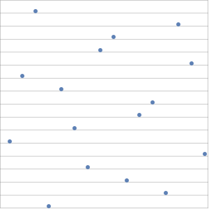

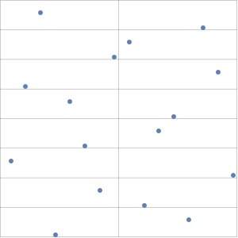

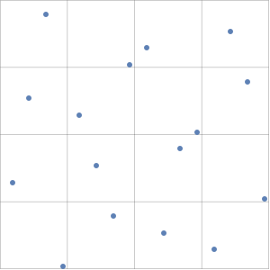

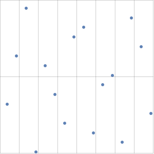

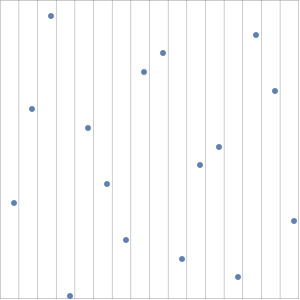

Figure 7.28: A sampling pattern that has a single sample in all of the base 2 elementary intervals. It satisfies both the $4 \times 4$ stratification and Latin hypercube constraints as well as the other two stratification constraints shown.

In general, any sequence of length $2^{l_{1}+l_{2}}$ (where $l_{i}$ is a nonnegative integer) from a $(0,2)$ -sequence satisfies this general stratification constraint. The set of elementary intervals in two dimensions, base 2, is defined as

图 7.28：在所有基数为 2 的基本区间中具有单个采样的采样模式。它满足 $4 \times 4$ 分层和拉丁超立方体约束以及所示的其他两个分层约束。

通常，来自 $(0,2)$ 序列的任何长度为 $2^{l_{1}+l_{2}}$（其中 $l_{i}$ 是非负整数）的序列都满足此一般分层约束。以 2 为底的二维基本区间集定义为

$$
E=\left\{\left[\frac{a_{1}}{2^{l_{1}}}, \frac{a_{1}+1}{2^{l_{1}}}\right) \times\left[\frac{a_{2}}{2^{l_{2}}}, \frac{a_{2}+1}{2^{l_{2}}}\right)\right\}
$$

where the integer $a_{i}=0,1,2,3, \ldots, 2^{l_{i}}-1$. One sample from each of the first $2^{l_{1}+l_{2}}$ values in the sequence will be in each of the elementary intervals. Furthermore, the same property is true for each subsequent set of $2^{l_{1}+l_{2}}$ values.

To understand now how $(0,2)$ -sequences can be applied to generating 2D samples, consider a pixel with $2 \times 2$ image samples, each with an array of $4 \times 4$ 2D samples. The first $(2 \times 2) \times(4 \times 4)=2^{6}$ values of a $(0,2)$ -sequence are well distributed with respect to each other according to the corresponding set of elementary intervals. Furthermore, the first $4 \times 4=2^{4}$ samples are themselves well distributed according to their corresponding elementary intervals, as are the next $2^{4}$ of them, and the subsequent ones, and so on. Therefore, we can use the first $16(0,2)$ -sequence samples for the samples for the $4 \times 4$ array for the first image sample for a pixel, then the next 16 for the next image sample, and so forth. The result is an extremely well-distributed set of sample points.

其中整数 $a_{i}=0,1,2,3, \ldots, 2^{l_{i}}-1$ 。来自序列中前 $2^{l_{1}+l_{2}}$ 值中的一个采样将在每个基本间隔中。此外，对于每个后续的 $2^{l_{1}+l_{2}}$ 值集，相同的属性都是正确的。

现在要了解如何将 $(0,2)$ -序列应用于生成 2D 采样，请考虑具有 $2 \times 2$ 个图像采样的像素，每个采样具有 $4 \times 4$ 2D 采样的数组。 $(0,2)$ 序列的第一个 $(2 \times 2) \times(4 \times 4)=2^{6}$ 值根据相应的基本区间集彼此均匀分布。此外，前 $4 \times 4=2^{4}$ 采样本身根据其相应的基本区间分布良好，接下来的 $2^{4}$ 以及随后的采样也是如此，依此类推。因此，我们可以将第一个 $16(0,2)$ -sequence 采样用于 $4 \times 4$ 数组的采样作为像素的第一个图像采样，然后使用接下来的 16 个作为下一个图像采样，依此类推。结果是一组分布极好的采样点。

### 7.5.1 Sampling with Generator Matrices / 使用生成器矩阵进行采样

The Sobol$^{\prime}$ sequence is based on a different mechanism for generating sample points than the HaltonSampler, which used the radical inverse in various dimensions. Even with the integer divides in the radical inverse function converted to multiplies and shifts, the amount of computation needed to compute the billions of samples that can be needed for high-quality, high-resolution renderings can still be significant. Most of the computational expense comes from the cost of performing non-base-2 computation on computers that natively operate in base 2. (Consider the contrast between the <<*Compute base-2 radical inverse*>> fragment and the RadicalInverseSpecialized() template function.)

Given the high cost of non-base-2 operations, it's natural to try to develop sample generation algorithms that operate entirely in base $2 .$ One such approach that has been effective has been to use generator matrices that allow all computation to be done in the same base. Instead of using a different base in each dimension, as the Halton sampler did, a different generator matrix is used in each dimension. With wellchosen matrices for each sampled dimension, it's possible to generate very good low-discrepancy distributions of points. For example, $(0,2)$ -sequences can be defined using two specific generator matrices in base 2 .

To see how generator matrices are used, consider an $n$ -digit number $a$ in base $b$, where the $i$ th digit of $a$ is $d_{i}(a)$ and where we have an $n \times n$ generator matrix $\mathbf{C}$. Then the corresponding sample point $x_{a} \in[0,1)$ is defined by

Sobol$^{\prime}$ 序列基于与 HaltonSampler 不同的生成采样点的机制，后者在各个维度使用radical inverse。即使将radical inverse函数中的整数除法转换为乘法和移位，计算高质量、高分辨率渲染所需的数十亿个采样所需的计算量仍然很大。大部分计算费用来自在本机以 2 为基数运行的计算机上执行非基数 2 计算的成本。（考虑 <<*Compute base-2 radical inverse*>> 片段和 RadicalInverseSpecialized() 之间的对比模板函数。）

鉴于非基数 2 运算的高成本，尝试开发完全以 $2$ 基数运行的采样生成算法是很自然的。一种有效的方法是使用生成矩阵，允许所有计算在相同的基。不像 Halton 采样器那样在每个维度中使用不同的基数，而是在每个维度中使用不同的生成器矩阵。通过为每个采样维度精心选择矩阵，可以生成非常好的低差异点分布。例如， $(0,2)$ -sequences 可以使用基数为 2 的两个特定生成器矩阵来定义。

要了解如何使用生成器矩阵，请考虑以 $b$ 为基数的 $n$ - 位数字 $a$ ，其中 $a$ 的第 $i$ 位是 $d_{i}(a)$ 并且我们有一个 $n \times n$ 生成器矩阵 $\mathbf{C}$ 。那么对应的采样点 $x_{a} \in[0,1)$ 定义为

$$
x_{a}=\left[b^{-1} b^{-2} \ldots b^{-n}\right]\left[\begin{array}{cccc}
c_{1,1} & c_{1,2} & \cdots & c_{1, n} \\
c_{2,1} & \ddots & & c_{2, n} \\
\vdots & & \ddots & \vdots \\
c_{n, 1} & \cdots & \cdots & c_{n, n}
\end{array}\right]\left[\begin{array}{c}
d_{1}(a) \\
d_{2}(a) \\
\vdots \\
d_{n}(a)
\end{array}\right]
$$

(7.9)

where all arithmetic is performed in the ring $\mathbf{Z}_{b}$ (in other words, when all operations are performed modulo $b$ ). This construction gives a total of $b^{n}$ points as $a$ ranges from 0 to $b^{n}-1$. If the generator matrix is the identity matrix, then this definition corresponds to the regular radical inverse, base $b$. (It's worth pausing to make sure you see this connection between Equations (7.7) and (7.9) before continuing.)

In this section, we will exclusively use $b=2$ and $n=32$. While introducing a $32 \times 32$ matrix to the sample generation algorithm may not seem like a step toward better performance, we'll see that in the end the sampling code can be mapped to an implementation that uses a small number of bit operations to perform this computation in an extremely efficient manner.

The first step toward high performance comes from the fact that we're working in base 2 ; as such, all entries of $\mathbf{C}$ are either 0 or 1 and thus we can represent either each row or each column of the matrix with a single unsigned 32 -bit integer. We'll choose to represent columns of the matrix as uint32_ts; this choice leads to a very efficient algorithm for multiplying the $d_{i}$ column vector by $\mathbf{C}$.

Now consider the task of computing the $\mathbf{C}\left[d_{i}(a)\right]^{T}$ matrix-vector product; using the definition of matrixvector multiplication, we have:

其中所有算术都在环 $\mathbf{Z}_{b}$ 中执行（换句话说，当所有运算都以 $b$ 为模执行时）。由于 $a$ 的范围是从 0 到 $b^{n}-1$ ，所以这种构造总共给出了 $b^{n}$ 点。如果生成矩阵是单位矩阵，则此定义对应于正则radical inverse，基数 $b$（在继续之前，值得暂停以确保您看到方程（7.7）和（7.9）之间的这种联系。）

在本节中，我们将专门使用 $b=2$ 和 $n=32$ 。虽然在采样生成算法中引入 $32 \times 32$ 矩阵似乎不是迈向更好性能的一步，但我们会看到最终采样代码可以映射到使用少量位操作的实现以极其有效的方式执行此计算。

迈向高性能的第一步来自我们在 base 2 中工作的事实；因此， $\mathbf{C}$ 的所有条目都是 0 或 1，因此我们可以用单个无符号 32 位整数表示矩阵的每一行或每一列。我们将选择将矩阵的列表示为 uint32_ts；这个选择导致了一个非常有效的算法，用于将 $d_{i}$ 列向量乘以 $\mathbf{C}$ 。

现在考虑计算 $\mathbf{C}\left[d_{i}(a)\right]^{T}$ 矩阵向量乘积的任务；使用矩阵向量乘法的定义，我们有：

$$
\left[\begin{array}{cccc}
c_{1,1} & c_{1,2} & \cdots & c_{1, n} \\
c_{2,1} & \ddots & & c_{2, n} \\
\vdots & & \ddots & \vdots \\
c_{n, 1} & \cdots & \cdots & c_{n, n}
\end{array}\right]\left[\begin{array}{c}
d_{1}(a) \\
d_{2}(a) \\
\vdots \\
d_{n}(a)
\end{array}\right]=d_{1}\left[\begin{array}{c}
c_{1,1} \\
c_{2,1} \\
\vdots \\
c_{n, 1}
\end{array}\right]+\cdots+d_{n}\left[\begin{array}{c}
c_{1, n} \\
c_{2, n} \\
\vdots \\
c_{n, n}
\end{array}\right]
$$

(7.10)

In other words, for each digit of $d_{i}$ that has a value of 1 , the corresponding column of $\mathbf{C}$ should be summed. This addition can in turn be performed very efficiently in $\mathbf{Z}_{2}$ : in that setting, addition corresponds to the exclusive OR operation. (Consider the combinations of the two possible operand values -0 and 1 -and the result of adding them $\bmod 2$, and compare to the values computed by exclusive OR with the same operand values.) Thus, the multiplication $\mathbf{C}\left[d_{i}(a)\right]^{T}$ is just a matter of exclusive ORing together the columns $i$ of $\mathbf{C}$ where $d_{i}(a)$ 's bit is 1 . This computation is implemented in the MultiplyGenerator () function.

换句话说，对于 $d_{i}$ 的每个值为 1 的数字，应该对 $\mathbf{C}$ 的对应列求和。这种加法又可以在 $\mathbf{Z}_{2}$ 中非常有效地执行：在该设置中，加法对应于异或运算（考虑两个可能的操作数值 -0 和 1 的组合以及将它们相加的结果 $\bmod 2$ ，并与具有相同操作数值的异或计算的值进行比较。）因此，乘法 $ \mathbf{C}\left[d_{i}(a)\right]^{T}$ 只是将 $\mathbf{C}$ 的 $i$ 列进行异或运算，其中 $d_{i} (a)$ 的位是 1 。这个计算是在 MultiplyGenerator() 函数中实现的。

```
<<Low Discrepancy Inline Functions>>+=  
inline uint32_t MultiplyGenerator(const uint32_t *C, uint32_t a) {
    uint32_t v = 0;
    for (int i = 0; a != 0; ++i, a >>= 1)
        if (a & 1)
            v ^= C[i];
    return v;
}
```

Going back to Equation (7.9) now, if we denote the column vector from the product $v=\mathbf{C}\left[d_{i}(a)\right]^{T}$, then consider the vector product

现在回到方程（7.9），如果我们表示乘积 $v=\mathbf{C}\left[d_{i}(a)\right]^{T}$ 的列向量，那么考虑向量积

$$
x_{a}=\left[2^{-1} 2^{-2} \ldots 2^{-n}\right]\left[\begin{array}{c}
v_{1} \\
v_{2} \\
\vdots \\
v_{n}
\end{array}\right]=\sum_{i=1}^{32} 2^{-i} v_{i}
$$

(7.11)

Because the entries of $v$ are stored in a single uint32_t, their value interpreted as a uint32_t is

由于 $v$ 的条目存储在单个 uint32_t 中，因此它们的值被解释为 uint32_t 是

$$
v=v_{1}+2 v_{2}+\cdots=\sum_{i=1}^{32} 2^{i-1} v_{i}
$$

If we were to reverse the order of the bits in the uint32_t, then we would have the value

如果我们颠倒 uint32_t 中位的顺序，那么我们将得到值

$$
v^{\prime}=\sum_{i=1}^{32} 2^{32-i} v_{i}
$$

This is a more useful value: if we divide this value by $2^{32}$, we get Equation (7.11), which is $x_{a}$, the value we're trying to compute.

Thus, if we take the result of the MultiplyGenerator () function, reverse the order of the bits in the returned value (e.g., by using ReverseBits32( )), and then divide that integer value by $2^{32}$ to compute a floating-point value in $[0,1$ ), we've computed our sample value.

To save the small cost of reversing the bits, we can equivalently reverse the bits in all of the columns of the generator matrix C before passing it to MultiplyGenerator(). We will use that convention in the following.

To make $(0,2)$ -sequences useful in practice, we also need to be able to generate multiple different sets of 2D sample values for each image sample, and we would like to generate different sample values for each pixel. One approach to this problem would be to use carefully chosen nonoverlapping subsequences of the $(0,2)$ -sequence for each pixel. Another approach is to randomly scramble the $(0,2)$ -sequence, giving a new $(0,2)$ -sequence built by applying a random permutation to the base- $b$ digits of the values in the original sequence.

The scrambling approach we will use is due to Kollig and Keller (2002). It repeatedly partitions and shuffles the unit square $[0,1)^{2}$. In each of the two dimensions, it first divides the square in half and then swaps the two halves with $50 \%$ probability. Then it splits each of the intervals $[0,0.5)$ and $[0.5,1)$ in half and randomly exchanges each of those two halves. This process continues recursively until all of the bits of the base-2 representation have been processed. This process was carefully designed so that it preserves the low-discrepancy properties of the set of points; otherwise, the advantages of the $(0,2)$ -sequence would be lost from the scrambling. Figure $7.29$ shows an unscrambled $(0,2)$ -sequence and two randomly scrambled variations of it.

这是一个更有用的值：如果我们将这个值除以 $2^{32}$ ，我们得到方程（7.11），即 $x_{a}$ ，我们试图计算的值。

因此，如果我们取 MultiplyGenerator() 函数的结果，反转返回值中位的顺序（例如，通过使用 ReverseBits32( )），然后将该整数值除以 $2^{32}$ 来计算 $[0,1$ ) 中的浮点值，我们已经计算了我们的采样值。

为了节省反转位的小成本，我们可以在将生成器矩阵 C 传递给 MultiplyGenerator() 之前等效地反转生成器矩阵 C 的所有列中的位。我们将在下面使用该约定。

为了使 $(0,2)$ -序列 在实践中有用，我们还需要能够为每个图像样本生成多组不同的 2D 样本值，并且我们希望为每个像素生成不同的样本值。解决此问题的一种方法是为每个像素使用精心选择的 $(0,2)$ - 序列的非重叠子序列。另一种方法是随机打乱 $(0,2)$ -序列，给出一个新的 $(0,2)$ -序列，它通过对原始序列中值的 base-$b$ 数字应用随机排列来构建.

我们将使用的加扰方法归功于 Kollig 和 Keller (2002)。它反复对单位平方 $[0,1)^{2}$ 进行分区和打乱。在两个维度的每一个中，它首先将正方形分成两半，然后以 $50\%$ 的概率交换两半。然后它将每个区间 $[0,0.5)$ 和 $[0.5,1)$ 分成两半，并随机交换这两半。这个过程递归地继续，直到处理完基数为 2 表示的所有位。这个过程经过精心设计，以保持点集的低差异性；否则， $(0,2)$ - 序列的优势将因加扰而丢失。图 $7.29$ 显示了一个未加扰的 $(0,2)$ 序列和它的两个随机加扰变体。

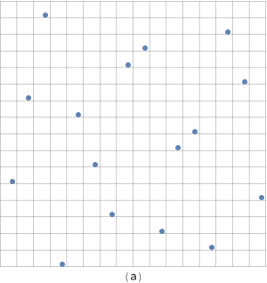

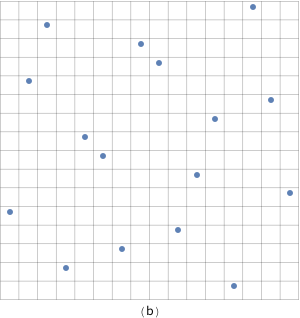

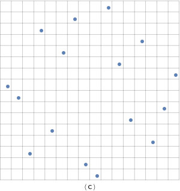

Figure 7.29: (a) A low-discrepancy $(0,2)$ -sequence-based sampling pattern and $(\mathrm{b}, \mathrm{c})$ two randomly scrambled instances of it. Random scrambling of low-discrepancy patterns is an effective way to eliminate the artifacts that would be present in images if we used the same sampling pattern in every pixel, while still preserving the low-discrepancy properties of the point set being used.

Two things make the scrambling process efficient: first, because we are scrambling two sequences that are computed in base 2, the digits $d_{i}$ of the sequences are all 0 or 1 , and scrambling a particular digit is equivalent to exclusive-ORing it with 0 or 1. Second, the simplification is made such that at each level $l$ of the recursive scrambling, the same decision will be made as to whether to swap each of the $2^{l-1}$ pairs of subintervals or not. The result of these two design choices is that the scrambling can be encoded as a set of bits stored in a uint32_t and can be applied to the original digits via exclusive-OR operations.

The SampleGeneratorMatrix() function pulls these pieces together to generate sample values.

图 7.29：(a) 一个低差异 $(0,2)$ -基于序列的采样模式和 $(\mathrm{b}, \mathrm{c})$ 两个随机打乱的实例。如果我们在每个像素中使用相同的采样模式，低差异模式的随机加扰是消除图像中可能出现的伪像的有效方法，同时仍然保留所用点集的低差异属性。

两件事使加扰过程有效：首先，因为我们正在加扰以 2 为基数计算的两个序列，序列的数字 $d_{i}$ 都是 0 或 1 ，并且对特定数字进行加扰等效于排他-将其与 0 或 1 进行或运算。 其次，进行简化，使得在递归加扰的每一级 $l$ ，将做出相同的决定，即是否交换 $2^{l-1}$ 对中的每一个子区间与否。这两种设计选择的结果是，加扰可以被编码为一组存储在 uint32_t 中的位，并且可以通过异或运算应用于原始数字。

SampleGeneratorMatrix() 函数将这些部分组合在一起以生成采样值。

```
<<Low Discrepancy Inline Functions>>+=  
inline Float SampleGeneratorMatrix(const uint32_t *C, uint32_t a,
        uint32_t scramble = 0) {
    return (MultiplyGenerator(C, a) ^ scramble) * 0x1p-32f;
}
```

The SampleGeneratorMatrix() function is already fairly efficient, performing a handful of arithmetic operations each time through the loop in MultiplyGenerator() that runs for a number of iterations equal to the base-2 logarithm of the value a. Remarkably, it’s possible to do even better by changing the order in which samples are generated, enumerating them in Gray code order.

With Gray codes, successive binary values differ in only a single bit; the third column of Table $7.4$ shows the first eight integers in Gray code order. Note that not only does only a single bit change between any pair of values but also that in any power-of-two-sized number of values $n$ starting from 0, the Gray code enumerates all of the values from 0 to $n-1$, just in a different order than usual.

Table 7.4: The First Eight Integers, in Gray Code Order. Each Gray code value $g(n)$ differs by just a single bit from the previous one, $g(n-1)$. The index of the bit that changes is given by the number of trailing zeros in the binary value $n$. Note that within any power-of-two-sized set of $n$ values starting from 0 , all of the integers between 0 and $n-1$ are represented, just in a different order than usual.

SampleGeneratorMatrix() 函数已经相当高效，每次通过 MultiplyGenerator() 中的循环执行一些算术运算，该循环运行的迭代次数等于值 a 的以 2 为底的对数。值得注意的是，通过更改生成采样的顺序，以格雷码顺序枚举它们，可以做得更好。

使用格雷码，连续的二进制值只有一个位不同；表 $7.4$ 的第三列显示了按格雷码顺序排列的前八个整数。请注意，不仅在任何一对值之间只有一位发生变化，而且在从 0 开始的任何 2 次方大小的值 $n$ 中，格雷码枚举了从 0 到 $n-1$ 的所有值，只是与平时不同的顺序。

表 7.4：前八个整数，按格雷码顺序。每个格雷码值 $g(n)$ 与前一个值 $g(n-1)$ 仅相差一位。更改位的索引由二进制值 $n$ 中尾随零的数量给出。请注意，在从 0 开始的任何 2 次方大小的 $n$ 值集合中，表示 0 和 $n-1$ 之间的所有整数，只是以与通常不同的顺序表示。

$$
\begin{array}{llll}
\hline n(\text { base 10) } & n \text { (binary) } & g(n) & \text { Changed Bit Index } \\
\hline 0 & 000 & 000 & n / a \\
\hline 1 & 001 & 001 & 0 \\
\hline 2 & 010 & 011 & 1 \\
\hline 3 & 011 & 010 & 0 \\
\hline 4 & 100 & 110 & 2 \\
\hline 5 & 101 & 111 & 0 \\
\hline 6 & 110 & 101 & 1 \\
\hline 7 & 111 & 100 & 0 \\
\hline
\end{array}
$$

Computing the $n$th Gray code value can be done very efficiently.

可以非常有效地计算第 $n$ 个格雷码值。

```
<<Low Discrepancy Inline Functions>>+=  
inline uint32_t GrayCode(uint32_t n) {
    return (n >> 1) ^ n;
}
```

By enumerating samples in Gray code order, we can take great advantage of the fact that only a single bit of $g(n)$ changes between subsequent samples. Assume that we have computed the product $\mathbf{C}\left[d_{i}(a)\right]^{T}=v$ for some index $a$ : if another value $a^{\prime}$ differs by just one bit from $a$, then we only need to add or subtract one column of $\mathbf{C}$ from $v$ to find $v^{\prime}=\mathbf{C}\left[d_{I}\left(a^{\prime}\right)\right]^{T}$ (recall Equation (7.10)). Even better, both addition and subtraction mod 2 can be performed with exclusive OR, so it doesn't matter which operation is needed; we only need to know which bit changed. As can be seen from Table 7.4, the index of the bit that changes going from $g(i)$ to $g(i+1)$ is given by the number of trailing 0 s in the binary representation of $i+1$. Most CPU instruction sets can count trailing 0 bits in a single instruction.

Putting this all together, we can very efficiently generate a series of samples using a generator matrix in Gray code order. GrayCodeSample() takes a generator matrix C, a number of samples to generate n, and stores the corresponding samples in memory at the location pointed to by p.

通过以格雷码顺序枚举采样，我们可以充分利用以下事实，即在后续采样之间只有一位 $g(n)$ 发生变化。假设我们已经为某个索引 $a$ 计算了乘积 $\mathbf{C}\left[d_{i}(a)\right]^{T}=v$ ：如果另一个值 $a^{\prime} $ 与 $a$ 仅相差一位，那么我们只需将 $\mathbf{C}$ 与 $v$ 相加或减去一列即可找到 $v^{\prime}=\mathbf{C}\left [d_{I}\left(a^{\prime}\right)\right]^{T}$（回忆方程（7.10））。更好的是，加法和减法mod 2都可以用异或来执行，因此需要哪种操作并不重要；我们只需要知道哪个位发生了变化。从表 7.4 可以看出，从 $g(i)$ 变为 $g(i+1)$ 的位的索引由 $i+1$ 的二进制表示中尾 0 的数量给出。大多数 CPU 指令集可以计算单个指令中的尾 0 位。

将所有这些放在一起，我们可以使用格雷码顺序的生成器矩阵非常有效地生成一系列采样。 GrayCodeSample() 取一个生成矩阵C，若干个采样生成n，并将对应的采样存储在内存中p所指向的位置。

```
<<Low Discrepancy Inline Functions>>+=  
inline void GrayCodeSample(const uint32_t *C, uint32_t n,
        uint32_t scramble, Float *p) {
    uint32_t v = scramble;
    for (uint32_t i = 0; i < n; ++i) {
        p[i] = v * 0x1p-32f;  /* 1/2^32 */
        v ^= C[CountTrailingZeros(i + 1)];
    }
}
```

The x86 assembly code for the heart of the inner loop (with the loop control logic elided) is wonderfully brief:

内循环核心的 x86 汇编代码（省略了循环控制逻辑）非常简短：

```
    xorps      %xmm1, %xmm1
    cvtsi2ssq  %rax, %xmm1
    mulss      %xmm0, %xmm1
    movss      %xmm1, (%rcx,%rdx,4)
    incq       %rdx
    bsfl       %edx, %eax
    xorl       $31, %eax
    xorl       (%rdi,%rax,4), %esi
```

Even if one isn’t an x86 assembly language aficionado, one can appreciate that it’s an incredibly short sequence of instructions to generate each sample value.

There is a second version of GrayCodeSample() (not included here) for generating 2D samples; it takes a generator matrix for each dimension and fills in an array of Point2f values with the samples.

即使一个人不是 x86 汇编语言爱好者，也可以理解生成每个采样值的指令序列非常短。

有第二个版本的 GrayCodeSample()（此处未包含）用于生成 2D 采样；它为每个维度采用一个生成器矩阵，并用采样填充 Point2f 值的数组。

### 7.5.2 Sampler Implementation / 采样器实现

The ZeroTwoSequenceSampler generates samples for positions on the film plane, lens, and other 2D samples using scrambled $(0, 2)$-sequences, and generates 1D samples with scrambled van der Corput sequences.

ZeroTwoSequenceSampler 使用加扰的 $(0, 2)$ 序列为胶片平面、镜头和其他 2D 采样上的位置生成采样，并使用加扰的 van der Corput 序列生成一维采样。

```
<<ZeroTwoSequenceSampler Declarations>>= 
class ZeroTwoSequenceSampler : public PixelSampler {
public:
    <<ZeroTwoSequenceSampler Public Methods>> 
};
```

Figure 7.30 compares the result of using a $(0, 2)$-sequence for sampling the lens for the depth of field to using a stratified pattern.

图 7.30 比较了使用 $(0, 2)$ 序列对镜头进行景深采样与使用分层模式的结果。


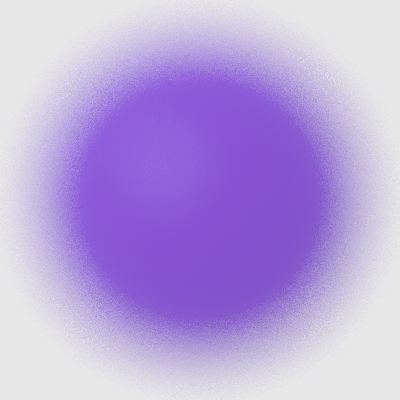

Figure 7.30: Comparisons of the Stratified and $(0, 2)$-Sequence Samplers for Rendering Depth of Field. (1) A reference image of the blurred edge of an out-of-focus sphere, (2) an image rendered using the StratifiedSampler, and (3) an image using the ZeroTwoSequenceSampler. The ZeroTwoSequenceSampler’s results are better than the stratified image, although the difference is smaller than the difference between stratified and random sampling.

The constructor rounds the number of samples per pixel up to a power of 2 if necessary, since subsets of $(0,2)$ -sequences that are not a power of 2 in size are much less well distributed over $[0,1)^{2}$ than those that are.

图 7.30：用于渲染景深的分层采样器和 $(0, 2)$-序列 采样器的比较(1) 离焦球体模糊边缘的参考图像，(2) 使用 StratifiedSampler 渲染的图像，以及 (3) 使用 ZeroTwoSequenceSampler 的图像。 ZeroTwoSequenceSampler 的结果优于分层图像，尽管差异小于分层和随机采样之间的差异。

如有必要，构造函数将每个像素的采样数四舍五入到 2 的幂，因为 $(0,2)$ - 大小不是 2 的幂的序列的子集在 $[0,1)^{2}$ 上的分布比那些要差得多。

```
<<ZeroTwoSequenceSampler Method Definitions>>= 
ZeroTwoSequenceSampler::ZeroTwoSequenceSampler(int64_t samplesPerPixel,
        int nSampledDimensions)
    : PixelSampler(RoundUpPow2(samplesPerPixel), nSampledDimensions) {
}

<<ZeroTwoSequenceSampler Public Methods>>= 
int RoundCount(int count) const { return RoundUpPow2(count); }
```

Since the ZeroTwoSequenceSampler is a PixelSampler, its StartPixel() method must not only generate array sample values for the samples in the pixel but must also generate samples for a number of dimensions of non-array samples.

由于 ZeroTwoSequenceSampler 是一个 PixelSampler，它的 StartPixel() 方法不仅必须为像素中的采样生成数组采样值，还必须为非数组采样的多个维度生成采样。

```
<<ZeroTwoSequenceSampler Method Definitions>>+= 
void ZeroTwoSequenceSampler::StartPixel(const Point2i &p) {
    <<Generate 1D and 2D pixel sample components using $(0, 2)$-sequence>> 
    <<Generate 1D and 2D array samples using $(0, 2)$-sequence>> 
    PixelSampler::StartPixel(p);
}
```

Generating the samples for the non-array dimensions expected by the PixelSampler is a matter of filling in the appropriate vectors with the appropriate number of sample values.

为 PixelSampler 预期的非数组维度生成采样是用适当数量的采样值填充适当的向量的问题。

```
<<Generate 1D and 2D pixel sample components using $(0, 2)$-sequence>>= 
for (size_t i = 0; i < samples1D.size(); ++i)
    VanDerCorput(1, samplesPerPixel, &samples1D[i][0], rng);
for (size_t i = 0; i < samples2D.size(); ++i)
    Sobol2D(1, samplesPerPixel, &samples2D[i][0], rng);
```

The sample vector dimensions with array samples are similar, though with multiple sample values in each dimension.

数组采样的采样向量维度相似，但每个维度有多个采样值。

```
<<Generate 1D and 2D array samples using $(0, 2)$-sequence>>= 
for (size_t i = 0; i < samples1DArraySizes.size(); ++i)
    VanDerCorput(samples1DArraySizes[i], samplesPerPixel,
                 &sampleArray1D[i][0], rng);
for (size_t i = 0; i < samples2DArraySizes.size(); ++i)
    Sobol2D(samples2DArraySizes[i], samplesPerPixel,
            &sampleArray2D[i][0], rng);
```

The VanDerCorput() function generates a number of scrambled 1D sample values using the Gray code-based sampling machinery. Although a specialized implementation of this function that took advantage of the structure of the identity matrix could be written, here we use the existing Gray code implementation, which is more than sufficiently efficient.

VanDerCorput() 函数使用基于格雷码的采样机制生成许多加扰的一维采样值。尽管可以编写利用单位矩阵结构的此函数的专门实现，但这里我们使用现有的格雷码实现，这已经足够高效了。

```
<<Low Discrepancy Inline Functions>>+=  
inline void VanDerCorput(int nSamplesPerPixelSample, int nPixelSamples,
        Float *samples, RNG &rng) {
    uint32_t scramble = rng.UniformUInt32();
    <<Define CVanDerCorput Generator Matrix>> 
    int totalSamples = nSamplesPerPixelSample * nPixelSamples;
    GrayCodeSample(CVanDerCorput, totalSamples, scramble, samples);
    <<Randomly shuffle 1D sample points>> 
}
```

The generator matrix for the 1D van der Corput sequence is just the identity matrix but with each column’s bits reversed, as per the earlier convention.

一维 van der Corput 序列的生成器矩阵只是单位矩阵，但按照之前的约定，每一列的位都颠倒了。

```
<<Define CVanDerCorput Generator Matrix>>= 
const uint32_t CVanDerCorput[] = {
    0b10000000000000000000000000000000,
    0b1000000000000000000000000000000,
    0b100000000000000000000000000000,
    0b10000000000000000000000000000,
    <<Remainder of Van Der Corput generator matrix entries>> 
};
```

There is a subtle implementation detail that must be accounted for when using scrambled $(0,2)$ sequences. Often, integrators will use samples from more than one of the sampling patterns that the sampler creates in the process of computing the values of particular integrals. For example, they might use a sample from a 1D pattern to select one of the $N$ light sources in the scene to sample illumination from and then might use a sample from a 2D pattern to select a sample point on that light source, if it is an area light.

Even if these two patterns are computed with random scrambling with different random scramble values for each one, some correlation can still remain between elements of these patterns, such that the $i$ th element of the 1D pattern and the $i$ th element of the 2D pattern are related. As such, in the earlier area lighting example, the distribution of sample points on each light source would not in general cover the entire light due to this correlation, leading to unusual rendering errors.

This problem can be solved easily enough by randomly shuffling the various dimensions individually after they are generated. After generating a scrambled 1D low-discrepancy sampling pattern, giving a well-distributed set of samples across all of the image samples for this pixel, this function shuffles these samples in two ways. Consider, for example, a pixel with 8 image samples, each of which has 4 1D samples for the integrator (giving a total of 32 integrator samples). First, it shuffles samples within each of the 8 groups of 4 samples, putting each set of 4 into a random order. Next, it shuffles each of the 8 groups of 4 samples as a block, with respect to the other blocks of 4 samples.

在使用加扰的 $(0,2)$ 序列时，必须考虑一个微妙的实现细节。通常，积分器将使用采样器在计算特定积分值的过程中创建的多个采样模式中的采样。例如，他们可能会使用 1D 图案中的采样来选择场景中的 $N$ 个光源之一来对照明进行采样，然后可能会使用 2D 图案中的采样来选择该光源上的采样点，如果这是一个区域灯。

即使这两个模式是通过随机加扰计算的，每个模式都有不同的随机加扰值，这些模式的元素之间仍然存在一些相关性，例如一维模式的第 $i$ 个元素和2D 模式是相关的。因此，在前面的区域照明示例中，由于这种相关性，每个光源上的采样点分布通常不会覆盖整个灯光，从而导致异常渲染错误。

这个问题可以很容易地通过在生成后分别随机打乱各个维度来解决。在生成加扰的 1D 低差异采样模式后，在该像素的所有图像采样中提供一组分布良好的采样，该函数以两种方式对这些采样进行打乱。例如，考虑一个具有 8 个图像采样的像素，每个图像采样具有 4 个用于积分器的 1D 采样（总共提供 32 个积分器采样）。首先，它在每组 4 个采样的 8 个采样组中打乱采样，将每组 4 个采样放入随机顺序。接下来，它将 8 组 4 个采样中的每一个作为一个块打乱，相对于其他 4 个采样的块。

```
<<Randomly shuffle 1D sample points>>= 
for (int i = 0; i < nPixelSamples; ++i)
    Shuffle(samples + i * nSamplesPerPixelSample,
            nSamplesPerPixelSample, 1, rng);
Shuffle(samples, nPixelSamples, nSamplesPerPixelSample, rng);
```

The Sobol2D() function follows a similar structure to VanDerCorput() but uses two generator matrices to generate the first two dimensions of Sobol$^{\prime}$ points. Its implementation isn’t included here.

Sobol2D() 函数遵循与 VanDerCorput() 类似的结构，但使用两个生成器矩阵来生成 Sobol$^{\prime}$ 点的前两个维度。它的实现不包括在这里。

```
<<Low Discrepancy Declarations>>+=  
inline void Sobol2D(int nSamplesPerPixelSample, int nPixelSamples,
        Point2f *samples, RNG &rng);
```

Figure 7.31 shows the result of using the $(0, 2)$-sequence for the area lighting example scene. Note that not only does it give a visibly better image than stratified patterns, but it also does well with one light sample per image sample, unlike the stratified sampler.

图 7.31 显示了对区域照明示例场景使用 $(0, 2)$-sequence 的结果。请注意，与分层采样器不同，它不仅可以提供比分层模式明显更好的图像，而且对于每个图像采样一个光采样也表现良好。


Figure 7.31: When the ZeroTwoSequenceSampler is used for the area light sampling example, similar results are generated (1) with both 1 image sample and 16 light samples as well as (2) with 16 image samples and 1 light sample, thanks to the $(0,2)$ -sequence sampling pattern that ensures good distribution of samples over the pixel area in both cases. Compare these images to Figure 7.24, where the stratified pattern generates a much worse set of light samples when only 1 light sample is taken for each of the 16 image samples.

图 7.31：当 ZeroTwoSequenceSampler 用于区域光采样示例时，由于 $ (0,2)$ - 序列采样模式，确保在两种情况下采样在像素区域上的良好分布。将这些图像与图 7.24 进行比较，其中当对 16 个图像采样中的每一个仅获取 1 个光采样时，分层模式会生成一组更差的光采样。

## 7.6 Maximized Minimal Distance Sampler / 最大化最小距离采样器

The $(0, 2)$-sequence sampler is more effective than the stratified sampler, thanks to being stratified over all elementary intervals. However, it still sometimes generates sample points that are close together. An alternative is to use a different pair of generator matrices that not only generate $(0, 2)$-sequences but that are also specially designed to maximize the distance between samples; this approach is implemented by the MaxMinDistSampler. (See the “Further Reading” section for more details about the origin of these generator matrices.)

由于在所有基本区间上分层， $(0, 2)$-序列 采样器比分层采样器更有效。但是，它有时仍然会生成靠近在一起的采样点。另一种方法是使用一对不同的生成器矩阵，它们不仅生成 $(0, 2)$-序列，而且还专门设计用于最大化采样之间的距离；此方法由 MaxMinDistSampler 实现（更多有关这些生成器矩阵起源的详细信息，请参阅“进一步阅读”部分。）

```
<<MaxMinDistSampler Declarations>>= 
class MaxMinDistSampler : public PixelSampler {
public:
    <<MaxMinDistSampler Public Methods>> 
private:
    <<MaxMinDistSampler Private Data>> 
};
```

There are 17 of these specialized matrices, one for each power-of-two number of samples up to  samples; a pointer to the appropriate one is stored in CPixel in the constructor.

有 17 个专门矩阵，用于每个采样数的 2 次幂直至采样数；指向适当矩阵的指针存储在构造函数中的 CPixel 中。

```
<<MaxMinDistSampler Public Methods>>= 
MaxMinDistSampler(int64_t samplesPerPixel, int nSampledDimensions)
    : PixelSampler(RoundUpPow2(samplesPerPixel), nSampledDimensions) {
    CPixel = CMaxMinDist[Log2Int(samplesPerPixel)];
}

<<MaxMinDistSampler Private Data>>= 
const uint32_t *CPixel;
```

Figure 7.32 shows a few of these matrices.

图 7.32 显示了其中一些矩阵。


Figure 7.32: Generator matrices for $n=8,16$, and 64 sample patterns for the MaxMinDistSampler. As before, all matrix elements are either 0 or 1 , and 1 elements are shown as filled squares here.

Figure $7.33$ shows the points that one of the matrices generates. Note that the same sampling pattern is used in each of the $2 \times 2$ pixels shown there; when the matrices were found, distance between sample points was evaluated using toroidal topology-as if the unit square was rolled into a torus-to allow for high-quality sample tiling.

图 7.32： $n=8,16$ 的生成器矩阵，以及 MaxMinDistSampler 的 64 个采样模式。和以前一样，所有矩阵元素都是 0 或 1 ，此处 1 元素显示为实心方块。

图 $7.33$ 显示了矩阵之一生成的点。请注意，此处显示的每个 $2 \times 2$ 像素都使用相同的采样模式；找到矩阵后，使用环形拓扑结构计算采样点之间的距离 - 就像将单位正方形卷成圆环一样 - 以实现高质量的采样平铺。

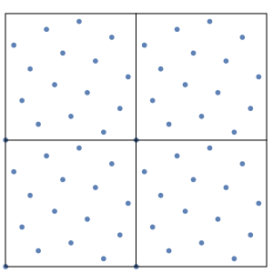

Figure 7.33: A grid of $2 \times 2$ pixels, each sampled with 16 samples from the MaxMinDistSampler. Though the same sample points are used in each pixel, their placement has been optimized so that not only are they well distributed within each pixel, but when they are tiled across pixels, sample points also aren’t too close to those in neighboring pixels.

图 7.33： $2 \times 2$ 像素的网格，每个像素使用来自 MaxMinDistSampler 的 16 个样本进行采样。虽然在每个像素中使用相同的采样点，但它们的位置已经过优化，因此它们不仅在每个像素内分布良好，而且当它们跨像素平铺时，采样点也不会太靠近相邻像素中的采样点。

```
<<Low Discrepancy Declarations>>+=  
extern uint32_t CMaxMinDist[17][32];
```

The MaxMinDistSampler uses the generator matrix to compute the pixel samples. The first 2D sample dimension’s value is set by uniformly stepping in the first dimension and the second comes from the generator matrix.

MaxMinDistSampler 使用生成器矩阵来计算像素采样。第一个二维采样维度的值是通过在第一维中均匀步进来设置的，第二个来自生成器矩阵。

```
<<MaxMinDistSampler Method Definitions>>= 
void MaxMinDistSampler::StartPixel(const Point2i &p) {
    Float invSPP = (Float)1 / samplesPerPixel;
    for (int i = 0; i < samplesPerPixel; ++i)
        samples2D[0][i] = Point2f(i * invSPP, 
                                  SampleGeneratorMatrix(CPixel, i));
    Shuffle(&samples2D[0][0], samplesPerPixel, 1, rng);
    <<Generate remaining samples for MaxMinDistSampler>> 
    PixelSampler::StartPixel(p);
}
```

The remaining dimensions are sampled using the first two Sobol $^{\prime}$ matrices, like the ZeroTwoSequenceSampler. We have found slightly better results with this approach (versus using the CMaxMinDist matrices) for samples in non-image dimensions of the sample vector. Therefore, the corresponding fragment <<*Generate remaining samples for MaxMinDistSampler*>> isn’t included here.

其余维度使用前两个 Sobol $^{\prime}$ 矩阵进行采样，例如 ZeroTwoSequenceSampler。对于采样向量的非图像维度中的采样，我们发现使用这种方法（与使用 CMaxMinDist 矩阵相比）的结果稍好一些。因此，此处不包括相应的片段 <<*Generate remaining samples for MaxMinDistSampler*>>。

## 7.7 Sobol’ Sampler / Sobol 采样器

The last Sampler in this chapter is based on a series of generator matrices due to Sobol $^{\prime}$. The samples from the sequence that these matrices generate are distinguished by both being very efficient to implementthanks to being entirely based on base-2 computations-while also being extremely well distributed over all $n$ dimensions of the sample vector. Figure $7.34$ shows the first few Sobol $^{\prime}$ generator matrices.

本章的最后一个采样器基于 Sobol $^{\prime}$ 的一系列生成器矩阵。这些矩阵生成的序列中的采样的区别在于，由于完全基于基数 2 计算，实现非常高效，同时在采样向量的所有 $n$ 个维度上分布非常好。图 $7.34$ 显示了前几个 Sobol $^{\prime}$ 生成器矩阵。

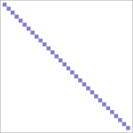

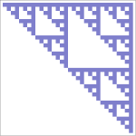

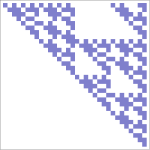

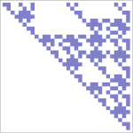

Figure 7.34: Generator matrices for the first four dimensions of the Sobol $^{\prime}$ sequence. Note their regular structure.

Figure 7.35 compares Sobol $^{\prime}$ samples to stratified and Halton points with the depth of field test scene.

图 7.34：Sobol $^{\prime}$ 序列前四个维度的生成矩阵。注意它们的规则结构。

图 7.35 将 Sobol $^{\prime}$ 采样与具有景深测试场景的分层点和 Halton 点进行了比较。


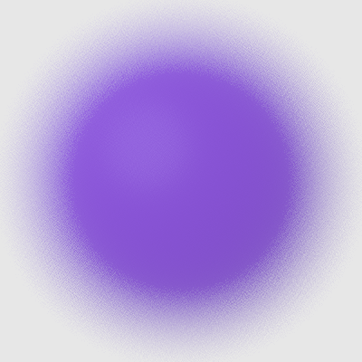


Figure 7.35: Comparisons of the Stratified, Halton, and Sobol' Samplers for Rendering Depth of Field.
(1) An image rendered using the StratifiedSampler, (2) an image rendered using the HaltonSampler, and (3) an image using the SobolSampler. Both low-discrepancy samplers are better than the stratified sampler. In spite of the structured grid artifacts visible with this undersampled image with the SobolSampler, the Sobol $^{\prime}$ sequence often provides a faster rate of convergence than the Halton sequence.

The weakness of the Sobol $^{\prime}$ points is that they are prone to structural grid artifacts before convergence; a sense of this issue can be seen in the image sample points shown in Figure 7.36.

图 7.35：分层、Halton 和 Sobol 采样器渲染景深的比较。
(1) 使用 StratifiedSampler 渲染的图像，(2) 使用 HaltonSampler 渲染的图像，以及 (3) 使用 SobolSampler 渲染的图像。两个低差异采样器都优于分层采样器。尽管在使用 SobolSampler 的这个欠采样图像中可以看到结构化网格伪像，但 Sobol $^{\prime}$ 序列通常比 Halton 序列提供更快的收敛速度。

Sobol $^{\prime}$ 点的弱点是它们在收敛之前容易出现结构网格伪像；从图 7.36 所示的图像采样点中可以看出这个问题的意义。


Figure 7.36: A grid of $2 \times 2$ pixels, sampled with 16 Sobol $^{\prime}$ samples each. Note that there is a fair amount of structure as well as many samples close to others. The very good distribution properties of the sequence over all $n$ dimensions of the sample vector generally make up for these shortcomings.

This structure is visible in the images in Figure 7.37. In exchange for this weakness, Sobol $^{\prime}$ sequences are extremely well distributed over all $n$ dimensions of the sample vector.

图 7.36： $2 \times 2$ 像素的网格，每个采样 16 个 Sobol $^{\prime}$ 采样。请注意，有相当数量的结构以及许多与其他采样接近的采样。序列在采样向量的所有 $n$ 维上的非常好的分布特性通常弥补了这些缺点。

该结构在图 7.37 中的图像中可见。作为这个弱点的交换，Sobol $^{\prime}$ 序列在采样向量的所有 $n$ 维度上分布得非常好。


Figure 7.37: Undersampled images rendered with (1) the Halton sampler and (2) the Sobol $^{\prime}$ sampler. Both exhibit visible structure, though with different visual characteristics. The Sobol $^{\prime}$ sequence in particular exhibits a clearly visible checkerboard structure.

图 7.37：使用 (1) Halton 采样器和 (2) Sobol $^{\prime}$ 采样器渲染的欠采样图像。两者都表现出可见的结构，尽管具有不同的视觉特征。 Sobol $^{\prime}$ 序列尤其表现出清晰可见的棋盘结构。

```
<<SobolSampler Declarations>>= 
class SobolSampler : public GlobalSampler {
public:
    <<SobolSampler Public Methods>> 
private:
    <<SobolSampler Private Data>> 
};
```

The SobolSampler uniformly scales the first two dimensions by the smallest power of 2 that causes the $[0,1)^{2}$ sample domain to cover the image area to be sampled. As with the HaltonSampler, this specific scaling scheme is chosen in order to make it easier to compute the reverse mapping from pixel coordinates to the sample indices that land in each pixel.

SobolSampler 以最小的 2 次幂统一缩放前两个维度，从而使 $[0,1)^{2}$ 采样域覆盖要采样的图像区域。与 HaltonSampler 一样，选择这种特定的缩放方案是为了更容易计算从像素坐标到落在每个像素中的采样索引的反向映射。

```
<<SobolSampler Public Methods>>= 
SobolSampler(int64_t samplesPerPixel, const Bounds2i &sampleBounds)
    : GlobalSampler(RoundUpPow2(samplesPerPixel)),
      sampleBounds(sampleBounds) {
    resolution = RoundUpPow2(std::max(sampleBounds.Diagonal().x,
                                      sampleBounds.Diagonal().y));
    log2Resolution = Log2Int(resolution);
}

<<SobolSampler Private Data>>= 
const Bounds2i sampleBounds;
int resolution, log2Resolution;
```

The SobolintervalToIndex () function returns the index of the samplenumth sample in the pixel p, if the $[0,1)^{2}$ sampling domain has been scaled by $2^{\log 2Resolution}$ to cover the pixel sampling area.

SobolintervalToIndex()函数返回像素p中samplenumth采样的索引，如果 $[0,1)^{2}$ 采样域已经缩放了 $2^{\log 2Resolution}$ 覆盖像素采样区域.

```
<<Low Discrepancy Declarations>>+= 
inline uint64_t SobolIntervalToIndex(const uint32_t log2Resolution,
    uint64_t sampleNum, const Point2i &p);
```

The general approach used to derive the algorithm it implements is similar to that used by the Halton sampler in its GetIndexForSample() method. Here, scaling by a power of two means that the base-2 logarithm of the scale gives the number of digits of the $\mathbf{C}\left[d_{i}(a)\right]^{T}$ product that form the scaled sample's integer component. To find the values of $a$ that give a particular integer value after scaling, we can compute the inverse of $\mathbf{C}$ : given

用于推导它实现的算法的一般方法类似于 Halton 采样器在其 GetIndexForSample() 方法中使用的方法。这里，以 2 的幂进行缩放意味着以 2 为底的对数给出了 $\mathbf{C}\left[d_{i}(a)\right]^{T}$ 乘积的位数形成缩放采样的整数分量。要找到在缩放后给出特定整数值的 $a$ 值，我们可以计算 $\mathbf{C}$ 的倒数：

$$
v=\mathbf{C}\left[d_{i}(a)\right]^{T}
$$

then equivalently

那么等效地

$$
\mathbf{C}^{-1} v=\left[d_{i}(a)\right]^{T}
$$

We won’t include the implementation of this method here.

我们不会在这里包含这个方法的实现。

```
<<SobolSampler Method Definitions>>= 
int64_t SobolSampler::GetIndexForSample(int64_t sampleNum) const {
    return SobolIntervalToIndex(log2Resolution, sampleNum,
        Point2i(currentPixel - sampleBounds.pMin));
}
```

Computing the sample value for a given sample index and dimension is straightforward given the SobolSample() function.

鉴于 SobolSample() 函数，计算给定采样索引和维度的采样值很简单。

```
<<SobolSampler Method Definitions>>+= 
Float SobolSampler::SampleDimension(int64_t index, int dim) const {
    Float s = SobolSample(index, dim);
    <<Remap Sobol dimensions used for pixel samples>> 
    return s;
}
```

The code for computing Sobol $^{\prime}$ sample values takes different paths for 32 - and 64 -bit floating-point values. Different generator matrices are used for these two cases, giving more bits of precision for 64 -bit doubles.

用于计算 Sobol $^{\prime}$ 采样值的代码对 32 位和 64 位浮点值采用不同的路径。这两种情况使用不同的生成器矩阵，为 64 位双精度提供更多位精度。

```
<<Low Discrepancy Inline Functions>>+=  
inline Float SobolSample(int64_t index, int dimension,
                         uint64_t scramble = 0) {
#ifdef PBRT_FLOAT_AS_DOUBLE
    return SobolSampleDouble(index, dimension, scramble);
#else
    return SobolSampleFloat(index, dimension, scramble);
#endif
}
```

The implementation of the SobolSampleFloat () function is quite similar to that of MultiplyGenerator () , with the differences that it takes a 64 -bit index and that the matrices it uses have size $32 \times 52$. These larger matrices allow it to generate distinct sample values up to $a=2^{52}-1$, rather than $2^{32}-1$, as with the $32 \times 32$ matrices used previously.

用于计算 Sobol $^{\prime}$ 采样值的代码对 32 位和 64 位浮点值采用不同的路径。这两种情况使用不同的生成器矩阵，为 64 位双精度提供更多位精度。

```
<<Low Discrepancy Inline Functions>>+= 
inline float SobolSampleFloat(int64_t a, int dimension,
                              uint32_t scramble) {
    uint32_t v = scramble;
    for (int i = dimension * SobolMatrixSize; a != 0; a >>= 1, ++i)
        if (a & 1)
            v ^= SobolMatrices32[i];
    return v * 0x1p-32f; /* 1/2^32 */
}

<<Sobol Matrix Declarations>>= 
static constexpr int NumSobolDimensions = 1024;
static constexpr int SobolMatrixSize = 52;
extern const uint32_t SobolMatrices32[NumSobolDimensions *
                                      SobolMatrixSize];
```

The SobolSampleDouble () function is similar, except that it uses 64 -bit Sobol $^{\prime}$ matrices. It is not included in the text here.

Because the SobolSampler is a GlobalSampler, the values returned for the first two dimensions need to be adjusted so that they are offsets from the current pixel. Here, the sample value is scaled up by the power-of-two scale computed in the constructor and then offset by the lower corner of the sample bounds to find the corresponding raster sample location. The current integer pixel coordinate is subtracted to get a result in $[0,1)$.

SobolSampleDouble () 函数与此类似，只是它使用 64 位 Sobol $^{\prime}$ 矩阵。此处不包括在正文中。

因为 SobolSampler 是一个 GlobalSampler，所以需要调整前两个维度的返回值，使它们与当前像素有偏移。在这里，采样值按构造函数中计算的二次幂比例放大，然后偏移采样边界的下角以找到相应的栅格采样位置。减去当前整数像素坐标以获得 $[0,1)$ 中的结果。

```
<<Remap Sobol $^{\prime}$ dimensions used for pixel samples>>= 
if (dim == 0 || dim == 1)  {
    s = s * resolution + sampleBounds.pMin[dim];
    s = Clamp(s - currentPixel[dim], (Float)0, OneMinusEpsilon);
}
```

## 7.8 Image Reconstruction / 图像重建

Given carefully chosen image samples, we need to convert the samples and their computed radiance values into pixel values for display or storage. According to signal processing theory, we need to do three things to compute final values for each of the pixels in the output image:

1. Reconstruct a continuous image function $\tilde{L}$ from the set of image samples.

2. Prefilter the function $\tilde{L}$ to remove any frequencies past the Nyquist limit for the pixel spacing.

3. Sample $\tilde{L}$ at the pixel locations to compute the final pixel values.

给定精心选择的图像采样，我们需要将采样及其计算出的辐射值转换为像素值以供显示或存储。根据信号处理理论，我们需要做三件事来计算输出图像中每个像素的最终值：

1. 从图像采样集重建一个连续的图像函数 $\tilde{L}$ 。

2. 对函数 $\tilde{L}$ 进行预过滤，以去除像素间距超过Nyquist极限的任何频率。

3. 在像素位置采样 $\tilde{L}$ 以计算最终像素值。

Because we know that we will be resampling the function $\tilde{L}$ at only the pixel locations, it's not necessary to construct an explicit representation of the function. Instead, we can combine the first two steps using a single filter function.

Recall that if the original function had been uniformly sampled at a frequency greater than the Nyquist frequency and reconstructed with the sinc filter, then the reconstructed function in the first step would match the original image function perfectly—quite a feat since we only have point samples. But because the image function almost always will have higher frequencies than could be accounted for by the sampling rate (due to edges, etc.), we chose to sample it nonuniformly, trading off noise for aliasing.

The theory behind ideal reconstruction depends on the samples being uniformly spaced. While a number of attempts have been made to extend the theory to nonuniform sampling, there is not yet an accepted approach to this problem. Furthermore, because the sampling rate is known to be insufficient to capture the function, perfect reconstruction isn’t possible. Recent research in the field of sampling theory has revisited the issue of reconstruction with the explicit acknowledgment that perfect reconstruction is not generally attainable in practice. This slight shift in perspective has led to powerful new reconstruction techniques. See, for example, Unser (2000) for a survey of these developments. In particular, the goal of research in reconstruction theory has shifted from perfect reconstruction to developing reconstruction techniques that can be shown to minimize error between the reconstructed function and the original function, regardless of whether the original was band limited.

While the reconstruction techniques used in pbrt are not directly built on these new approaches, they serve to explain the experience of practitioners that applying perfect reconstruction techniques to samples taken for image synthesis generally does not result in the highest quality images.

因为我们知道我们将仅在像素位置对函数 $\tilde{L}$ 进行重采样，所以没有必要构造函数的显式表示。相反，我们可以使用单个过滤器函数组合前两个步骤。

回想一下，如果原始函数以大于 Nyquist 频率的频率均匀采样并使用 sinc 过滤器重建，那么第一步中重建的函数将与原始图像函数完美匹配——这是一项壮举，因为我们只有点采样。但是因为图像函数几乎总是具有比采样率更高的频率（由于边缘等原因），因此我们选择对它进行非均匀采样，用噪声来换取走样。

理想重建背后的理论取决于均匀间隔的采样。虽然已经进行了许多尝试将该理论扩展到非均匀采样，但目前还没有一种公认的方法来解决这个问题。此外，由于已知采样率不足以捕获函数，因此不可能进行完美的重建。采样理论领域的最新研究重新审视了重建问题，明确承认在实践中通常无法实现完美的重建。这种观点的轻微转变导致了强大的新重建技术。例如，有关这些发展的调查，请参见 Unser (2000)。特别是，重建理论的研究目标已经从完美重建转向开发重建技术，无论原始函数是否受频带限制，都可以最小化重建函数与原始函数之间的误差。

虽然 pbrt 中使用的重建技术不是直接建立在这些新方法的基础上，但它们有助于解释从业者的经验，即将完美的重建技术应用于图像合成所采集的采样通常不会产生最高质量的图像。


Figure 7.38: 2D Image Filtering. To compute a filtered pixel value for the pixel marked with a filled circle located at $(x, y)$, all of the image samples inside the box around $(x, y)$ with extent radius. $x$ and radius.y need to be considered. Each of the image samples $\left(x_{i}, y_{i}\right)$, denoted by open circles, is weighted by a 2D filter function, $f\left(x-x_{i}, y-y_{i}\right)$. The weighted average of all samples is the final pixel value.

To reconstruct pixel values, we will consider the problem of interpolating the samples near a particular pixel. To compute a final value for a pixel $I(x, y)$, interpolation results in computing a weighted average

图 7.38：2D 图像过滤。为了计算用位于 $(x, y)$ 处的实心圆圈标记的像素的过滤像素值，box内所有图像采样围绕 $(x, y)$ 和范围半径。需要考虑 $x$ 和 radius.y。每个图像采样 $\left(x_{i}, y_{i}\right)$ ，由空心圆表示，由一个 2D 过滤函数 $f\left(x-x_{i}, y- y_{i}\right)$ 。所有采样的加权平均值就是最终的像素值。

为了重建像素值，我们将考虑在特定像素附近插入采样的问题。为了计算像素 $I(x, y)$ 的最终值，插值会导致计算加权平均值

$$
I(x, y)=\frac{\sum_{i} f\left(x-x_{i}, y-y_{i}\right) w\left(x_{i}, y_{i}\right) L\left(x_{i}, y_{i}\right)}{\sum_{i} f\left(x-x_{i}, y-y_{i}\right)}
$$

where

* $L\left(x_{i}, y_{i}\right)$ is the radiance value of the $i$ th sample located at $\left(x_{i}, y_{i}\right)$ 

* $w\left(x_{i}, y_{i}\right)$ is the sample contribution weight returned by the Camera. As described in Sections 6.4.7 and 13.6.6, the manner in which these weights are computed determines which radiometric quantity the film measures. 

* $f$ is the filter function.

其中

* $L\left(x_{i}, y_{i}\right)$ 是位于 $\left(x_{i}, y_{i}\right)$ 的第 $i$ 个采样的辐射值

* $w\left(x_{i}, y_{i}\right)$ 是Camera返回的采样贡献权重。如第 6.4.7 节 和 13.6.6 节所述，计算这些权重的方式决定了胶片测量的辐射量。

* $f$ 是过滤函数。

Figure 7.38 shows a pixel at location $(x, y)$ that has a pixel filter with extent radius. $\mathrm{x}$ in the $x$ direction and radius.y in the $y$ direction. All of the samples inside the box given by the filter extent may contribute to the pixel's value, depending on the filter function's value for $f\left(x-x_{i}, y-y_{i}\right)$.

The sinc filter is not an appropriate choice here: recall that the ideal sinc filter is prone to ringing when the underlying function has frequencies beyond the Nyquist limit (Gibbs phenomenon), meaning edges in the image have faint replicated copies of the edge in nearby pixels. Furthermore, the sinc filter has infinite support: it doesn’t fall off to zero at a finite distance from its center, so all of the image samples would need to be filtered for each output pixel. In practice, there is no single best filter function. Choosing the best one for a particular scene takes a mixture of quantitative evaluation and qualitative judgment.

图 7.38 显示了位置 $(x, y)$ 处的像素，该像素具有范围半径的像素过滤器。 $\mathrm{x}$ 在 $x$ 方向上，radius.y 在 $y$ 方向上。过滤器范围给定的box内的所有采样都可能对像素值有贡献，具体取决于过滤器函数的 $f\left(x-x_{i}, y-y_{i}\right)$ 值。

sinc 过滤器在这里不是一个合适的选择：回想一下，当基础函数的频率超过Nyquist极限（Gibbs现象）时，理想的正弦过滤器容易出现ringing，这意味着图像边缘附近的像素中，容易出现边缘的微弱复制副本。此外，sinc 过滤器具有无限support：它不会在距其中心有限距离处降至零，因此需要为每个输出像素过滤所有图像采样。在实践中，没有单一的最佳过滤函数。为特定场景选择最佳的一个，需要定量计算和定性判断的混合。

### 7.8.1 Filter Functions / 过滤函数

All filter implementations in pbrt are derived from an abstract Filter class, which provides the interface for the $f(x, y)$ functions used in filtering; see Equation (7.12). The Film class (described in the Section 7.9) stores a pointer to a Filter and uses it to filter image sample contributions when accumulating them into the final image. (Figure 7.39 shows comparisons of zoomed-in regions of images rendered using a variety of the filters from this section to reconstruct pixel values.) The Filter base class is defined in the files core/filter.h and core/filter.cpp.

pbrt 中的所有过滤器实现都派生自一个抽象的 Filter 类，该类为过滤中使用的 $f(x, y)$ 函数提供了接口；见公式（7.12）。 Film 类（在第 7.9 节中描述）存储一个指向 Filter 的指针，并在将它们累积到最终图像中时使用它来过滤图像采样贡献（图 7.39 显示了使用本节中的各种过滤器渲染图像的放大区域以重建像素值的比较。）过滤器基类在文件 core/filter.h 和 core/filter.cpp 中定义。


Figure 7.39: The pixel reconstruction filter used to convert the image samples into pixel values can have a noticeable effect on the character of the final image. Here, we see blowups of a region of the imperial crown model, filtered with (1) the box filter, (2) Gaussian, and (3) Mitchell–Netravali filter. Note that the Mitchell filter gives the sharpest image, while the Gaussian blurs it. The box is the least desirable, since it allows high-frequency aliasing to leak into the final image. (Note the stair-step pattern along bright gold edges, for example.)

图 7.39：用于将图像采样转换为像素值的像素重建过滤器，会对最终图像的特征产生显著影响。在这里，我们看到了皇冠模型区域的放大，使用 (1) box过滤器、(2) Gaussian过滤器和 (3) Mitchell-Netravali 过滤器进行了过滤。请注意，Mitchell过滤器给出了最清晰的图像，而Gaussian过滤器则模糊了它。box是最不理想的，因为它允许高频走样泄漏到最终图像中（例如，请注意沿亮金色边缘的阶梯图案。）

```
<<Filter Declarations>>= 
class Filter {
public:
    <<Filter Interface>> 
    <<Filter Public Data>> 
};
```


Figure 7.40: The extent of filters in pbrt is specified in terms of their radius from the origin to its cutoff point. The support of a filter is its total non-zero extent, here equal to twice its radius.

All filters are centered at the origin $(0,0)$ and define a radius beyond which they have a value of 0 ; this width may be different in the $x$ and $y$ directions. The constructor takes the radius values and stores them along with their reciprocals, for use by the filter implementations. The filter's overall extent in each direction (its support) is twice the value of its corresponding radius (Figure 7.40).

图 7.40：pbrt 中过滤器的范围是根据它们从原点到截止点的半径来指定的。过滤器的support是其总的非零范围，此处等于其半径的两倍。

所有过滤器都以原点 $(0,0)$ 为中心，并定义一个半径，超过该半径时，它们的值为 0 ；这个宽度在 $x$ 和 $y$ 方向上可能不同。构造函数获取半径值并将它们与它们的倒数一起存储，以供过滤器实现使用。过滤器在每个方向上的整体范围（其support）是其相应半径值的两倍（图 7.40）。

```
<<Filter Interface>>= 
Filter(const Vector2f &radius)
    : radius(radius),
      invRadius(Vector2f(1 / radius.x, 1 / radius.y)) { }

<<Filter Public Data>>= 
const Vector2f radius, invRadius;
```

The sole method that Filter implementations need to provide is Evaluate(). It takes as a parameter a 2D point that gives the position of the sample point relative to the center of the filter. The filter’s value at that point is returned. Code elsewhere in the system will never call the filter function with points outside of the filter’s extent, so filter implementations don’t need to check for this case.

Filter 实现需要提供的唯一方法是 Evaluate()。它将一个 2D 点作为参数，该点给出了采样点相对于过滤器中心的位置。返回过滤器在该点的值。系统中其他地方的代码永远不会使用过滤器范围之外的点调用过滤器函数，因此过滤器实现不需要检查这种情况。

```
<<Filter Interface>>+= 
virtual Float Evaluate(const Point2f &p) const = 0;
```

#### Box Filter / Box过滤器

One of the most commonly used filters in graphics is the box filter (and, in fact, when filtering and reconstruction aren’t addressed explicitly, the box filter is the de facto result). The box filter equally weights all samples within a square region of the image. Although computationally efficient, it’s just about the worst filter possible. Recall from the discussion in Section 7.1.2 that the box filter allows high-frequency sample data to leak into the reconstructed values. This causes postaliasing—even if the original sample values were at a high enough frequency to avoid aliasing, errors are introduced by poor filtering.

Figure 7.41(a) shows a graph of the box filter, and Figure 7.42 shows the result of using the box filter to reconstruct two 1D functions.

图形中最常用的过滤器之一是box过滤器（事实上，当过滤和重建没有明确解决时，box过滤器是事实上的结果）。box过滤器对图像正方形区域内的所有采样进行同等加权。尽管计算效率很高，但它可能是最差的过滤器。回想一下 7.1.2 节中的讨论，box过滤器允许高频采样数据泄漏到重建值中。这会导致后走样——即使原始采样值的频率足够高以避免走样，错误的过滤也会引入错误。

图 7.41(a) 显示了box过滤器的图形，图 7.42 显示了使用box过滤器重建两个一维函数的结果。


Figure 7.41: Graphs of the (a) box filter and (b) triangle filter. Although neither of these is a particularly good filter, they are both computationally efficient, easy to implement, and good baselines for evaluating other filters.

图 7.41：(a) box过滤器和 (b) 三角过滤器的图形。尽管这两种过滤器都不是特别好的过滤器，但它们都具有计算效率、易于实现和计算其他过滤器的良好基线。


Figure 7.42: The box filter reconstructing (a) a step function and (b) a sinusoidal function with increasing frequency as $x$ increases. This filter does well with the step function, as expected, but does an extremely poor job with the sinusoidal function.

For the step function we used previously to illustrate the Gibbs phenomenon, the box does reasonably well. However, the results are much worse for a sinusoidal function that has increasing frequency along the $x$ axis. Not only does the box filter do a poor job of reconstructing the function when the frequency is low, giving a discontinuous result even though the original function was smooth, but it also does an extremely poor job of reconstruction as the function’s frequency approaches and passes the Nyquist limit.

图 7.42：box过滤器重建 (a) 阶跃函数和 (b) 正弦函数，频率随着 $x$ 的增加而增加。正如预期的那样，该过滤器在阶跃函数方面表现良好，但在正弦函数方面表现极差。

对于我们之前用来说明 Gibbs 现象的阶跃函数，box表现得相当好。然而，对于频率沿 $x$ 轴增加的正弦函数，结​​果要糟糕得多。box过滤器不仅在频率较低时重建函数的工作做得很差，即使原始函数是平滑的，也会给出不连续的结果，而且当函数的频率接近并通过Nyquist极限时，它的重建工作也非常糟糕。

```
<<BoxFilter Declarations>>= 
class BoxFilter : public Filter {
public:
    BoxFilter(const Vector2f &radius) : Filter(radius) { }
    Float Evaluate(const Point2f &p) const;
};
```

Because the evaluation function won’t be called with $(x, y)$ values outside of the filter’s extent, it can always return 1 for the filter function’s value.

由于不会使用过滤器范围之外的 $(x, y)$ 值调用计算函数，因此它始终可以为过滤器函数的值返回 1。

```
<<BoxFilter Method Definitions>>= 
Float BoxFilter::Evaluate(const Point2f &p) const {
    return 1.;
}
```

#### Triangle Filter / 三角过滤器

The triangle filter gives slightly better results than the box: the weight falls off linearly from the filter center over the square extent of the filter. See Figure 7.41(b) for a graph of the triangle filter.

三角形过滤器的结果略好于box：权重在过滤器的方形范围内从过滤器中心线性下降。有关三角形过滤器的图形，请参见图 7.41(b)。

```
<<TriangleFilter Declarations>>= 
class TriangleFilter : public Filter {
public:
    TriangleFilter(const Vector2f &radius) : Filter(radius) { }
    Float Evaluate(const Point2f &p) const;
};
```

Evaluating the triangle filter is simple: the implementation just computes a linear function based on the width of the filter in both the $x$ and $y$ directions.

计算三角形过滤器很简单：实现只是根据过滤器在 $x$ 和 $y$ 方向上的宽度计算线性函数。

```
<<TriangleFilter Method Definitions>>= 
Float TriangleFilter::Evaluate(const Point2f &p) const {
    return std::max((Float)0, radius.x - std::abs(p.x)) *
           std::max((Float)0, radius.y - std::abs(p.y));
}
```

#### Gaussian Filter / Gaussian过滤器

Unlike the box and triangle filters, the Gaussian filter gives a reasonably good result in practice. This filter applies a Gaussian bump that is centered at the pixel and radially symmetric around it. The Gaussian’s value at the end of its extent is subtracted from the filter value, in order to make the filter go to 0 at its limit (Figure 7.43). The Gaussian does tend to cause slight blurring of the final image compared to some of the other filters, but this blurring can actually help mask any remaining aliasing in the image.

与box和三角形过滤器不同，Gaussian过滤器在实践中给出了相当好的结果。此过滤器应用以像素为中心并围绕其径向对称的高斯凹凸。从过滤器值中减去其范围末尾的高斯值，以使过滤器在其极限处变为 0（图 7.43）。与其他一些过滤器相比，高斯确实会导致最终图像的轻微模糊，但这种模糊实际上可以帮助掩盖图像中任何剩余的走样。


Figure 7.43: Graphs of (a) the Gaussian filter and (b) the Mitchell filter with $B=\frac{1}{3}$ and $C=\frac{1}{3}$, each with a width of 2 . The Gaussian gives images that tend to be a bit blurry, while the negative lobes of the Mitchell filter help to accentuate and sharpen edges in final images.

图 7.43：(a) Gaussian过滤器和 (b) 带有 $B=\frac{1}{3}$ 和 $C=\frac{1}{3}$ 的 Mitchell 过滤器的图，每个过滤器的宽度为2。高斯给出的图像往往有点模糊，而Mitchell过滤器的负瓣有助于突出和锐化最终图像的边缘。

```
<<GaussianFilter Declarations>>= 
class GaussianFilter : public Filter {
public:
    <<GaussianFilter Public Methods>> 
private:
    <<GaussianFilter Private Data>> 
    <<GaussianFilter Utility Functions>> 
};
```

The 1D Gaussian filter function of radius $r$ is

半径 $r$ 的一维高斯滤波函数为

$$
f(x)=\mathrm{e}^{-\alpha x^{2}}-\mathrm{e}^{-\alpha r^{2}}
$$

where $\alpha$ controls the rate of falloff of the filter. Smaller values cause a slower falloff, giving a blurrier image. The second term here ensures that the Gaussian goes to 0 at the end of its extent rather than having an abrupt cliff. For efficiency, the constructor precomputes the constant term for $\mathrm{e}^{-\alpha r^{2}}$ in each direction.

其中 $\alpha$ 控制过滤器的衰减率。值越小，衰减越慢，图像越模糊。这里的第二项确保高斯在其范围结束时变为 0，而不是突然出现下降。为了效率，构造函数预先计算了 $\mathrm{e}^{-\alpha r^{2}}$ 在每个方向上的常数项。

```
<<GaussianFilter Public Methods>>= 
GaussianFilter(const Vector2f &radius, Float alpha)
    : Filter(radius), alpha(alpha),
      expX(std::exp(-alpha * radius.x * radius.x)),
      expY(std::exp(-alpha * radius.y * radius.y)) { }

<<GaussianFilter Private Data>>= 
const Float alpha;
const Float expX, expY;
```

Since a 2D Gaussian function is separable into the product of two 1D Gaussians, the implementation calls the Gaussian() function twice and multiplies the results.

由于二维高斯函数可分离为两个一维高斯函数的乘积，因此实现调用 Gaussian() 函数两次并将结果相乘。

```
<<GaussianFilter Method Definitions>>= 
Float GaussianFilter::Evaluate(const Point2f &p) const {
    return Gaussian(p.x, expX) * Gaussian(p.y, expY);
}

<<GaussianFilter Utility Functions>>= 
Float Gaussian(Float d, Float expv) const {
    return std::max((Float)0, Float(std::exp(-alpha * d * d) - expv));
}
```

#### Mitchell Filter / Mitchell过滤器

Filter design is notoriously difficult, mixing mathematical analysis and perceptual experiments. Mitchell and Netravali (1988) have developed a family of parameterized filter functions in order to be able to explore this space in a systematic manner. After analyzing test subjects’ subjective responses to images filtered with a variety of parameter values, they developed a filter that tends to do a good job of trading off between ringing (phantom edges next to actual edges in the image) and blurring (excessively blurred results)—two common artifacts from poor reconstruction filters.

Note from the graph in Figure 7.43(b) that this filter function takes on negative values out by its edges; it has negative lobes. In practice these negative regions improve the sharpness of edges, giving crisper images (reduced blurring). If they become too large, however, ringing tends to start to enter the image. Also, because the final pixel values can therefore become negative, they will eventually need to be clamped to a legal output range.

Figure 7.44 shows this filter reconstructing the two test functions. It does extremely well with both of them: there is minimal ringing with the step function, and it does a very good job with the sinusoidal function, up until the point where the sampling rate isn’t sufficient to capture the function’s detail.

过滤器设计是出了名的困难，混合了数学分析和感知实验。 Mitchell 和 Netravali (1988) 开发了一系列参数化过滤器函数，以便能够以系统的方式探索这个空间。在分析了测试对象对使用各种参数值过滤的图像的主观反应后，他们开发了一种过滤器，该过滤器倾向于在ringing（图像中实际边缘旁边的幻影边缘）和模糊（过度模糊的结果）之间进行权衡)——来自较差重建过滤器的两个常见伪像。

请注意，从图 7.43(b) 中的图形可以看出，该过滤器函数的边取负值；它有负瓣。在实践中，这些负区域提高了边缘的清晰度，提供了更清晰的图像（减少了模糊）。然而，如果它们变得太大，ringing往往开始进入图像。此外，由于最终像素值可能因此变为负值，因此最终需要将其限制在合法的输出范围内。

图 7.44 显示了这个过滤器重建了两个测试函数。它对两者都非常好：阶跃函数的ringing最小，并且在正弦函数方面做得非常好，直到采样率不足以捕获函数的细节为止。


Figure 7.44: The Mitchell–Netravali Filter Used to Reconstruct the Example Functions. It does a good job with both of these functions, (a) introducing minimal ringing with the step function and (b) accurately representing the sinusoid until aliasing from undersampling starts to dominate.

图 7.44：用于重建示例函数的 Mitchell-Netravali 过滤器。它在这两个函数上都做得很好，(a) 用阶跃函数引入最小ringing，(b) 准确地表示正弦曲线，直到欠采样引起的走样开始占主导地位。

```
<<MitchellFilter Declarations>>= 
class MitchellFilter : public Filter {
public:
    <<MitchellFilter Public Methods>> 
private:
    const Float B, C;
};
```

The Mitchell filter has two parameters called $B$ and $C$. Although any values can be used for these parameters, Mitchell and Netravali recommend that they lie along the line $B+2 C=1$.

Mitchell 过滤器有两个参数，称为 $B$ 和 $C$ 。尽管这些参数可以使用任何值，但 Mitchell 和 Netravali 建议它们沿着 $B+2 C=1$ 线放置。

```
<<MitchellFilter Public Methods>>= 
MitchellFilter(const Vector2f &radius, Float B, Float C)
    : Filter(radius), B(B), C(C) {
}
```

The Mitchell-Netravali filter is the product of 1D filter functions in the $x$ and $y$ directions and is therefore separable, like the Gaussian filter. (In fact, all of the provided filters in pbrt are separable.) Nevertheless, the Filter::Evaluate() interface does not enforce this requirement, giving more flexibility in implementing new filters in the future

Mitchell-Netravali 过滤器是 $x$ 和 $y$ 方向上的一维过滤器函数的乘积，因此是可分离的，就像Gaussian过滤器一样（实际上，pbrt 中提供的所有过滤器都是可分离的。）不过，Filter::Evaluate() 接口并没有强制执行此要求，从而为将来实现新过滤器提供了更大的灵活性

```
<<MitchellFilter Method Definitions>>= 
Float MitchellFilter::Evaluate(const Point2f &p) const {
    return Mitchell1D(p.x * invRadius.x) * Mitchell1D(p.y * invRadius.y);
}
```

The 1D function used in the Mitchell filter is an even function defined over the range $[-2,2]$. This function is made by joining a cubic polynomial defined over $[0,1]$ with another cubic polynomial defined over $[1,2]$. This combined polynomial is also reflected around the $x=0$ plane to give the complete function. These polynomials are controlled by the $B$ and $C$ parameters and are chosen carefully to guarantee $C^{0}$ and $C^{1}$ continuity at $x=0, x=1$, and $x=2$. The polynomials are

Mitchell 过滤器中使用的一维函数是在 $[-2,2]$ 范围内定义的偶函数。该函数是通过将 $[0,1]$ 上定义的三次多项式与 $[1,2]$ 上定义的另一个三次多项式连接起来而实现的。这个组合多项式也反映在 $x=0$ 平面周围，以给出完整的函数。这些多项式由 $B$ 和 $C$ 参数控制并经过仔细选择以保证 $C^{0}$ 和 $C^{1}$ 在 $x=0、x=1$ 和 $x=2$ 处的连续性。多项式是

$$
\begin{array}{l}
f(x) \\
\quad=\frac{1}{6}\left\{\begin{array}{ll}
(12-9 B-6 C)|x|^{3}+(-18+12 B+6 C)|x|^{2}+(6-2 B) & |x|<1 \\
(-B-6 C)|x|^{3}+(6 B+30 C)|x|^{2}+(-12 B-48 C)|x| & & 1 \leq|x|<2 \\
+(8 B+24 C) & \\
0 & \text { otherwise. }
\end{array}\right.
\end{array}
$$

```
<<MitchellFilter Public Methods>>+= 
Float Mitchell1D(Float x) const {
    x = std::abs(2 * x);
    if (x > 1)
        return ((-B - 6*C) * x*x*x + (6*B + 30*C) * x*x +
                (-12*B - 48*C) * x + (8*B + 24*C)) * (1.f/6.f);
    else
        return ((12 - 9*B - 6*C) * x*x*x + 
                (-18 + 12*B + 6*C) * x*x +
                (6 - 2*B)) * (1.f/6.f);
}
```

#### Windowed Sinc Filter / 窗口正弦过滤器

Finally, the LanczosSincFilter class implements a filter based on the sinc function. In practice, the sinc filter is often multiplied by another function that goes to 0 after some distance. This gives a filter function with finite extent, which is necessary for an implementation with reasonable performance. An additional parameter $\tau$ controls how many cycles the sinc function passes through before it is clamped to a value of $0 .$ Figure $7.45$ shows a graph of three cycles of the sinc function, along with a graph of the windowing function we use, which was developed by Lanczos. The Lanczos window is just the central lobe of the sinc function, scaled to cover the $\tau$ cycles:

最后，LanczosSincFilter 类实现了一个基于 sinc 函数的过滤器。在实践中，sinc 过滤器经常乘以另一个在一段距离后变为 0 的函数。这给出了具有有限范围的过滤器函数，这对于具有合理性能的实现是必要的。附加参数 $\tau$ 控制 sinc 函数在被clamp到 $0$ 值之前经过的循环数。图 $7.45$ 显示了 sinc 函数的三个循环图，以及我们的窗口函数图使用，这是由 Lanczos 开发的。 Lanczos 窗口只是 sinc 函数的中心瓣，缩放以覆盖 $\tau$ 循环：

$$
w(x)=\frac{\sin (\pi x / \tau)}{\pi x / \tau}
$$

Figure 7.45 also shows the filter that we will implement here, which is the product of the sinc function and the windowing function.

图 7.45 还显示了我们将在这里实现的过滤器，它是 sinc 函数和窗口函数的乘积。


Figure 7.45: Graphs of the Sinc Filter. (a) The sinc function, truncated after three cycles (blue line) and the Lanczos windowing function (orange line). (b) The product of these two functions, as implemented in the LanczosSincFilter.

Figure 7.46 shows the windowed sinc’s reconstruction results for uniform 1D samples. Thanks to the windowing, the reconstructed step function exhibits far less ringing than the reconstruction using the infinite-extent sinc function (compare to Figure 7.11). The windowed sinc filter also does extremely well at reconstructing the sinusoidal function until prealiasing begins.

图 7.45：Sinc 过滤器的图形(a) 三个循环后截断的 sinc 函数（蓝线）和 Lanczos 窗口函数（橙线）(b) 在 LanczosSincFilter 中实现的这两个函数的乘积。

图 7.46 显示了均匀 1D 采样的加窗 sinc 重建结果。由于加窗，重建的阶跃函数比使用无限范围 sinc 函数的重建表现出更少的ringing（与图 7.11 相比）。在预走样开始之前，加窗正弦过滤器在重建正弦函数方面也做得非常好。


Figure 7.46: Results of Using the Windowed Sinc Filter to Reconstruct the Example Functions. Here, $\tau=3$. (a) Like the infinite sinc, it suffers from ringing with the step function, although there is much less ringing in the windowed version. (b) The filter does quite well with the sinusoid, however.

图 7.46：使用加窗 Sinc 过滤器重建示例函数的结果。这里， $\tau=3$(a) 与无限 sinc 一样，它也受到阶跃函数ringing的影响，尽管在窗口版本中ringing要少得多(b) 然而，过滤器对正弦波的处理效果很好。

```
<<Sinc Filter Declarations>>= 
class LanczosSincFilter : public Filter {
public:
    <<LanczosSincFilter Public Methods>> 
private:
    const Float tau;
};

<<LanczosSincFilter Public Methods>>= 
LanczosSincFilter(const Vector2f &radius, Float tau)
    : Filter(radius), tau(tau) { }
<<Sinc Filter Method Definitions>>= 
Float LanczosSincFilter::Evaluate(const Point2f &p) const {
    return WindowedSinc(p.x, radius.x) * WindowedSinc(p.y, radius.y);
}
```

The implementation computes the value of the sinc function and then multiplies it by the value of the Lanczos windowing function.

该实现计算 sinc 函数的值，然后将其乘以 Lanczos 窗口函数的值。

```
<<LanczosSincFilter Public Methods>>+=  
Float Sinc(Float x) const {
    x = std::abs(x);
    if (x < 1e-5)  return 1;
    return std::sin(Pi * x) / (Pi * x);
}

<<LanczosSincFilter Public Methods>>+= 
Float WindowedSinc(Float x, Float radius) const {
    x = std::abs(x);
    if (x > radius) return 0;
    Float lanczos = Sinc(x / tau);
    return Sinc(x) * lanczos;
}
```

## 7.9 Film and the Imaging Pipeline / 胶片和成像管道

The type of film or sensor in a camera has a dramatic effect on the way that incident light is transformed into colors in an image. In pbrt, the Film class models the sensing device in the simulated camera. After the radiance is found for each camera ray, the Film implementation determines the sample’s contribution to the pixels around the point on the film plane where the camera ray began and updates its representation of the image. When the main rendering loop exits, the Film writes the final image to a file.

For realistic camera models, Section 6.4.7 introduced the measurement equation, which describes how a sensor in a camera measures the amount of energy arriving over the sensor area over a period of time. For simpler camera models, we can consider the sensor to be measuring the average radiance over a small area over some period of time. The effect of the choice of which measurement to take is encapsulated in the weight for the ray returned by Camera::GenerateRayDifferential(). Therefore, the Film implementation can proceed without having to account for these variations, as long as it scales the provided radiance values by these weights.

This section introduces a single Film implementation that applies the pixel reconstruction equation to compute final pixel values. For a physically based renderer, it’s generally best for the resulting images to be stored in a floating-point image format. Doing so provides more flexibility in how the output can be used than if a traditional image format with 8-bit unsigned integer values is used; floating-point formats avoid the substantial loss of information that comes from quantizing images to 8 bits.

In order to display such images on modern display devices, it is necessary to map these floating-point pixel values to discrete values for display. For example, computer monitors generally expect the color of each pixel to be described by an RGB color triple, not an arbitrary spectral power distribution. Spectra described by general basis function coefficients must therefore be converted to an RGB representation before they can be displayed. A related problem is that displays have a substantially smaller range of displayable radiance values than the range present in many real-world scenes. Therefore, pixel values must be mapped to the displayable range in a way that causes the final displayed image to appear as close as possible to the way it would appear on an ideal display device without this limitation. These issues are addressed by research into tone mapping; the “Further Reading” section has more information about this topic.

相机中的胶片或传感器的类型对入射光在图像中转换为颜色的方式有显著影响。在 pbrt 中，Film 类对模拟相机中的传感设备进行建模。在为每条摄影机光线找到辐射后，Film 实现确定采样对摄影机光线开始的胶片平面上点周围像素的贡献，并更新其对图像的表示。当主渲染循环退出时，Film 将最终图像写入文件。

对于真实的相机模型，第 6.4.7 节介绍了测量方程，它描述了相机中的传感器如何测量一段时间内到达传感器区域的能量。对于更简单的相机模型，我们可以将传感器视为在一段时间内测量小区域的平均辐射。选择进行哪种测量的效果封装在由 Camera::GenerateRayDifferential() 返回的光线的权重中。因此，Film 实现可以继续进行而不必考虑这些变化，只要它按这些权重缩放提供的辐射值。

本节介绍了一个单一的 Film 实现，它应用像素重建方程来计算最终像素值。对于基于物理的渲染器，通常最好将生成的图像以浮点图像格式存储。与使用具有 8 位无符号整数值的传统图像格式相比，这样做在如何使用输出方面提供了更大的灵活性；浮点格式避免了将图像量化为 8 位而造成的大量信息丢失。

为了在现代显示设备上显示这样的图像，需要将这些浮点像素值映射到离散值进行显示。例如，计算机显示器通常期望每个像素的颜色由 RGB 颜色三元组描述，而不是任意的光谱功率分布。因此，由一般基函数系数描述的光谱在显示之前必须转换为 RGB 表示。一个相关的问题是显示器的可显示辐射值范围比许多现实场景中的范围小得多。因此，像素值必须以某种方式映射到可显示范围，使最终显示的图像尽可能接近理想显示设备上的显示方式，而不受此限制。这些问题通过对色调映射的研究得到解决； “进一步阅读”部分提供了有关此主题的更多信息。

### 7.9.1 The Film Class / 胶片类

Film is defined in the files core/film.h and core/film.cpp.

film在文件 core/film.h 和 core/film.cpp 中定义。

```
<<Film Declarations>>= 
class Film {
public:
    <<Film Public Methods>> 
    <<Film Public Data>> 
private:
    <<Film Private Data>> 
    <<Film Private Methods>> 
};
```

A number of values are passed to the constructor: the overall resolution of the image in pixels; a crop window that may specify a subset of the image to render; the length of the diagonal of the film’s physical area, which is specified to the constructor in millimeters but is converted to meters here; a filter function; the filename for the output image and parameters that control how the image pixel values are stored in files.

许多值被传递给构造函数：图像的整体分辨率（以像素为单位）；一个裁剪窗口，可以指定要渲染的图像子集；film物理区域的对角线长度，以毫米为单位指定给构造者，但在此处转换为米；过滤函数；输出图像的文件名和控制图像像素值如何存储在文件中的参数。

```
<<Film Method Definitions>>= 
Film::Film(const Point2i &resolution, const Bounds2f &cropWindow,
        std::unique_ptr<Filter> filt, Float diagonal,
        const std::string &filename, Float scale)
    : fullResolution(resolution), diagonal(diagonal * .001),
      filter(std::move(filt)), filename(filename), scale(scale) {
    <<Compute film image bounds>> 
    <<Allocate film image storage>> 
    <<Precompute filter weight table>> 
}

<<Film Public Data>>= 
const Point2i fullResolution;
const Float diagonal;
std::unique_ptr<Filter> filter;
const std::string filename;
```

In conjunction with the overall image resolution, the crop window gives the bounds of pixels that need to be actually stored and written out. Crop windows are useful for debugging or for breaking a large image into small pieces that can be rendered on different computers and reassembled later. The crop window is specified in NDC space, with each coordinate ranging from 0 to 1 (Figure 7.47).

结合整体图像分辨率，裁剪窗口给出了需要实际存储和写出的像素范围。裁剪窗口可用于调试或将大图像分解成可以在不同计算机上渲染并稍后重新组装的小块。裁剪窗口在 NDC 空间中指定，每个坐标范围从 0 到 1（图 7.47）。


Figure 7.47: The image crop window specifies a subset of the image to be rendered. It is given in NDC space, with coordinates ranging from $(0,0)$ to $(1,1)$. The Film class only allocates space for and stores pixel values in the region inside the crop window.

Film::croppedPixelBounds stores the pixel bounds from the upper-left to the lower-right corners of the crop window. Fractional pixel coordinates are rounded up; this ensures that if an image is rendered in pieces with abutting crop windows, each final pixel will be present in only one of the subimages.

图 7.47：图像裁剪窗口指定要渲染的图像子集。它在 NDC 空间中给出，坐标范围从 $(0,0)$ 到 $(1,1)$ 。 Film 类只为裁剪窗口内的区域分配空间和存储像素值。

Film::croppedPixelBounds 存储从裁剪窗口左上角到右下角的像素边界。分数像素坐标四舍五入；这可确保如果图像以相邻的裁剪窗口分块呈现，则每个最终像素将仅出现在其中一个子图像中。

```
<<Compute film image bounds>>= 
croppedPixelBounds =
    Bounds2i(Point2i(std::ceil(fullResolution.x * cropWindow.pMin.x),
                     std::ceil(fullResolution.y * cropWindow.pMin.y)),
             Point2i(std::ceil(fullResolution.x * cropWindow.pMax.x),
                     std::ceil(fullResolution.y * cropWindow.pMax.y)));
<<Film Public Data>>+= 
Bounds2i croppedPixelBounds;
```

Given the pixel resolution of the (possibly cropped) image, the constructor allocates an array of Pixel structures, one for each pixel. The running weighted sums of spectral pixel contributions are represented using XYZ colors (Section 5.2.1) and are stored in the xyz member variable. filterWeightSum holds the sum of filter weight values for the sample contributions to the pixel. splatXYZ holds an (unweighted) sum of sample splats. The pad member is unused; its sole purpose is to ensure that the Pixel structure is 32 bytes in size, rather than 28 as it would be otherwise (assuming 4-byte Floats; otherwise, it ensures a 64-byte structure). This padding ensures that a Pixel won’t straddle a cache line, so that no more than one cache miss will be incurred when a Pixel is accessed (as long as the first Pixel in the array is allocated at the start of a cache line).

给定（可能被裁剪的）图像的像素分辨率，构造函数分配一个 Pixel 结构数组，每个像素一个。光谱像素贡献的运行加权总和使用 XYZ 颜色（第 5.2.1 节）表示，并存储在 xyz 成员变量中。 filterWeightSum 保存采样对像素的贡献的过滤器权重值的总和。 splatXYZ 保存采样 splats 的（未加权）总和。pad未使用；它的唯一目的是确保 Pixel 结构的大小为 32 字节，而不是其他情况下的 28 字节（假设 4 字节浮点数；否则，它确保 64 字节结构）。这种填充可确保 Pixel 不会跨越缓存线，因此在访问 Pixel 时不会发生超过一次缓存未命中（只要在缓存线的开头分配了数组中的第一个 Pixel） .

```
<<Film Private Data>>= 
struct Pixel {
    Float xyz[3] = { 0, 0, 0 };
    Float filterWeightSum = 0;
    AtomicFloat splatXYZ[3];
    Float pad;
};

std::unique_ptr<Pixel[]> pixels;
<<Allocate film image storage>>= 
pixels = std::unique_ptr<Pixel[]>(new Pixel[croppedPixelBounds.Area()]);
```

Two natural alternatives to using XYZ colors to store pixel values would be to use Spectrum values or to store RGB color. Here, it isn’t worthwhile to store complete Spectrum values, even when doing full spectral rendering. Because the final colors written to the output file don’t include the full set of Spectrum samples, converting to a tristimulus value here doesn’t represent a loss of information versus storing Spectrums and converting to a tristimulus value on image output. Not storing complete Spectrum values in this case can save a substantial amount of memory if the Spectrum has a large number of samples. (If pbrt supported saving SampledSpectrum values to files, then this design choice would need to be revisited.)

We have chosen to use XYZ color rather than RGB to emphasize that XYZ is a display-independent representation of color, while RGB requires assuming a particular set of display response curves (Section 5.2.2). (In the end, we will, however, have to convert to RGB, since few image file formats store XYZ color.)

With typical filter settings, every image sample may contribute to 16 or more pixels in the final image. Particularly for simple scenes, where relatively little time is spent on ray intersection testing and shading computations, the time spent updating the image for each sample can be significant. Therefore, the Film precomputes a table of filter values so that we can avoid the expense of virtual function calls to the Filter::Evaluate() method as well as the expense of evaluating the filter and can instead use values from the table for filtering. The error introduced by not evaluating the filter at each sample’s precise location isn’t noticeable in practice.

The implementation here makes the reasonable assumption that the filter is defined such that $f(x, y)=f(|x|,|y|)$, so the table needs to hold values for only the positive quadrant of filter offsets. This assumption is true for all of the Filters currently available in pbrt and is true for most filters used in practice. This makes the table one-fourth the size and improves the coherence of memory accesses, leading to better cache performance.

使用 XYZ 颜色存储像素值的两种自然替代方法是使用光谱值或存储 RGB 颜色。在这里，即使在进行全光谱渲染时，也不值得存储完整的光谱值。由于写入输出文件的最终颜色不包括完整的光谱采样集，因此在此处转换为三色值并不表示与存储光谱并在图像输出上转换为三色值相比信息丢失。如果 Spectrum 有大量采样，则在这种情况下不存储完整的 Spectrum 值可以节省大量内存（如果 pbrt 支持将 SampledSpectrum 值保存到文件，则需要重新考虑此设计选择。）

我们选择使用 XYZ 颜色而不是 RGB 来强调 XYZ 是与显示无关的颜色表示，而 RGB 需要假设一组特定的显示响应曲线（第 5.2.2 节）（然而，最后，我们将不得不转换为 RGB，因为很少有图像文件格式存储 XYZ 颜色。）

使用典型的过滤器设置，每个图像采样可能会在最终图像中产生 16 个或更多像素。特别是对于简单的场景，在光线相交测试和着色计算上花费的时间相对较少，更新每个采样的图像所花费的时间可能很重要。因此，Film 预先计算了一个过滤器值表，这样我们就可以避免虚函数调用 Filter::Evaluate() 方法的开销以及计算过滤器的开销，而是可以使用表中的值进行过滤。由于不在每个采样的精确位置计算过滤器而引入的错误在实践中并不明显。

这里的实现做出了合理的假设，即过滤器定义为 $f(x, y)=f(|x|,|y|)$ ，因此该表只需要保存过滤器偏移量的正象限的值。该假设适用于 pbrt 中当前可用的所有过滤器，并且适用于实践中使用的大多数过滤器。这使表的大小减少了四分之一，并提高了内存访问的一致性，从而获得更好的缓存性能。

```
<<Precompute filter weight table>>= 
int offset = 0;
for (int y = 0; y < filterTableWidth; ++y) {
    for (int x = 0; x < filterTableWidth; ++x, ++offset) {
        Point2f p;
        p.x = (x + 0.5f) * filter->radius.x / filterTableWidth;
        p.y = (y + 0.5f) * filter->radius.y / filterTableWidth;
        filterTable[offset] = filter->Evaluate(p);
    }
}

<<Film Private Data>>+=  
static constexpr int filterTableWidth = 16;
Float filterTable[filterTableWidth * filterTableWidth];
```

The Film implementation is responsible for determining the range of integer pixel values that the Sampler is responsible for generating samples for. The area to be sampled is returned by the GetSampleBounds() method. Because the pixel reconstruction filter generally spans a number of pixels, the Sampler must generate image samples a bit outside of the range of pixels that will actually be output. This way, even pixels at the boundary of the image will have an equal density of samples around them in all directions and won’t be biased with only values from toward the interior of the image. This detail is also important when rendering images in pieces with crop windows, since it eliminates artifacts at the edges of the subimages.

Computing the sample bounds involves accounting for the half-pixel offsets when converting from discrete to continuous pixel coordinates, expanding by the filter radius, and then rounding outward.

Film 实现负责确定 Sampler 负责为其生成采样的整数像素值的范围。要采样的区域由 GetSampleBounds() 方法返回。因为像素重建过滤器通常跨越多个像素，所以采样器必须生成稍微超出实际输出像素范围的图像采样。这样，即使图像边界处的像素在所有方向上都将具有相同的采样密度，并且不会仅使用朝向图像内部的值进行偏置。在使用裁剪窗口逐块渲染图像时，此细节也很重要，因为它消除了子图像边缘的伪像。

计算采样边界涉及在从离散像素坐标转换为连续像素坐标时考虑半像素偏移，按过滤器半径扩展，然后向外舍入。

```
<<Film Method Definitions>>+=  
Bounds2i Film::GetSampleBounds() const {
    Bounds2f floatBounds(
        Floor(Point2f(croppedPixelBounds.pMin) + Vector2f(0.5f, 0.5f) -
              filter->radius),
        Ceil( Point2f(croppedPixelBounds.pMax) - Vector2f(0.5f, 0.5f) +
              filter->radius));
    return (Bounds2i)floatBounds;
}
```

GetPhysicalExtent () returns the actual extent of the film in the scene. This information is specifically needed by the RealisticCamera. Given the length of the film diagonal and the aspect ratio of the image, we can compute the size of the sensor in the $x$ and $y$ directions. If we denote the diagonal length by $d$ and the width and height of the film sensor by $x$ and $y$, then we know that $x^{2}+y^{2}=d^{2}$. We can define the aspect ratio $a$ of the image by $a=y / x$, so $y=a x$, which gives $x^{2}+\left(a^{2} x^{2}\right)=d^{2}$. Solving for $x$ gives

GetPhysicalExtent() 返回film在场景中的实际范围。 RealisticCamera 特别需要此信息。给定胶片对角线的长度和图像的纵横比，我们可以计算传感器在 $x$ 和 $y$ 方向上的大小。如果我们用 $d$ 表示对角线长度，用 $x$ 和 $y$ 表示胶片传感器的宽度和高度，那么我们知道 $x^{2}+y^{2}=d^{2} $ 。我们可以通过 $a=y / x$ 来定义图像的长宽比 $a$ ，所以 $y=ax$ ，即 $x^{2}+\left(a^{2} x^{2} \right)=d^{2}$ 。求解 $x$ 给出

$$
x=\sqrt{\frac{d^{2}}{1+a^{2}}}
$$

The implementation of GetPhysicalExtent() follows directly. The returned extent is centered around $(0,0)$ .

GetPhysicalExtent() 的实现紧随其后。返回的范围以 $(0,0)$ 为中心。

```
<<Film Method Definitions>>+=  
Bounds2f Film::GetPhysicalExtent() const {
    Float aspect = (Float)fullResolution.y / (Float)fullResolution.x;
    Float x = std::sqrt(diagonal * diagonal / (1 + aspect * aspect));
    Float y = aspect * x;
    return Bounds2f(Point2f(-x / 2, -y / 2), Point2f(x / 2, y / 2));
}
```

### 7.9.2 Supplying Pixel Values to the Film / 为film提供像素值

There are three ways that the sample contributions can be provided to the film. The first is driven by samples generated by the Sampler over tiles of the image. While the most straightforward interface would be to allow renderers to provide a film pixel location and a Spectrum with the contribution of the corresponding ray directly to the Film, it’s not easy to provide a high-performance implementation of such a method in the presence of multithreading, where multiple threads may end up trying to update the same portion of the image concurrently.

Therefore, Film defines an interface where threads can specify that they’re generating samples in some extent of pixels with respect to the overall image. Given the sample bounds, GetFilmTile() in turn returns a pointer to a FilmTile object that stores contributions for the pixels in the corresponding region of the image. Ownership of the FilmTile and the data it stores is exclusive to the caller, so that thread can provide sample values to the FilmTile without worrying about contention with other threads. When it has finished work on the tile, the thread passes the completed tile back to the Film, which safely merges it into the final image.

可以通过三种方式将样本贡献提供给胶片。第一个是由采样器在图像的切片上生成的样本驱动的。虽然最直接的接口是允许渲染器提供胶片像素位置和光谱，以及相应光线直接对胶片的贡献，但在存在多线程的情况下提供这种方法的高性能实现并不容易，其中多个线程最终可能会尝试同时更新图像的同一部分。

因此，Film 定义了一个接口，线程可以在该接口中指定它们在相对于整个图像的某种程度的像素中生成采样。给定采样边界，GetFilmTile() 依次返回一个指向 FilmTile 对象的指针，该对象存储图像相应区域中像素的贡献。 FilmTile 及其存储的数据的所有权是调用者专有的，因此线程可以向 FilmTile 提供采样值，而不必担心与其他线程的争用。当它完成tile上的工作后，线程将完成的tile传递回胶片，胶片将其安全地合并到最终图像中。

```
<<Film Method Definitions>>+=  
std::unique_ptr<FilmTile> Film::GetFilmTile(
        const Bounds2i &sampleBounds) {
    <<Bound image pixels that samples in sampleBounds contribute to>> 
    return std::unique_ptr<FilmTile>(new FilmTile(tilePixelBounds,
        filter->radius, filterTable, filterTableWidth));
}
```

Given a bounding box of the pixel area that samples will be generated in, there are two steps to compute the bounding box of image pixels that the sample values will contribute to. First, the effects of the discrete-to-continuous pixel coordinate transformation and the radius of the filter must be accounted for. Second, the resulting bound must be clipped to the overall image pixel bounds; pixels outside the image by definition don’t need to be accounted for.

给定将在其中生成采样的像素区域的包围盒，有两个步骤来计算采样值将贡献的图像像素的包围盒。首先，必须考虑离散到连续像素坐标变换和过滤器半径的影响。其次，结果边界必须剪裁到整个图像像素边界；根据定义，不需要考虑图像外的像素。

```
<<Bound image pixels that samples in sampleBounds contribute to>>= 
Vector2f halfPixel = Vector2f(0.5f, 0.5f);
Bounds2f floatBounds = (Bounds2f)sampleBounds;
Point2i p0 = (Point2i)Ceil(floatBounds.pMin - halfPixel -
                           filter->radius);
Point2i p1 = (Point2i)Floor(floatBounds.pMax - halfPixel +
                            filter->radius) + Point2i(1, 1);
Bounds2i tilePixelBounds =
    Intersect(Bounds2i(p0, p1), croppedPixelBounds);
<<Film Declarations>>+= 
class FilmTile {
public:
    <<FilmTile Public Methods>> 
private:
    <<FilmTile Private Data>> 
};
```

The FilmTile constructor takes a 2D bounding box that gives the bounds of the pixels in the final image that it must provide storage for as well as additional information about the reconstruction filter being used, including a pointer to the filter function values tabulated in <<*Precompute filter weight table*>>.

FilmTile 构造函数采用一个 2D 包围盒，它给出了最终图像中像素的边界，它必须提供存储以及有关正在使用的重建过滤器的附加信息，包括指向在 <<* Precompute filter weight table*>>列表中的过滤器函数值的指针。

```
<<FilmTile Public Methods>>= 
FilmTile(const Bounds2i &pixelBounds, const Vector2f &filterRadius,
         const Float *filterTable, int filterTableSize)
    : pixelBounds(pixelBounds), filterRadius(filterRadius),
      invFilterRadius(1 / filterRadius.x, 1 / filterRadius.y),
      filterTable(filterTable), filterTableSize(filterTableSize) {
    pixels = std::vector<FilmTilePixel>(std::max(0, pixelBounds.Area()));
}

<<FilmTile Private Data>>= 
const Bounds2i pixelBounds;
const Vector2f filterRadius, invFilterRadius;
const Float *filterTable;
const int filterTableSize;
std::vector<FilmTilePixel> pixels;
```

For each pixel, both a sum of the weighted contributions from the pixel samples (according to the reconstruction filter weights) and a sum of the filter weights is maintained.

对于每个像素，来自像素采样的加权贡献的总和（根据重建过滤器权重）和过滤器权重的总和都被保持。

```
<<FilmTilePixel Declarations>>= 
struct FilmTilePixel {
    Spectrum contribSum = 0.f;
    Float filterWeightSum = 0.f;
};
```

Once the radiance carried by a ray for a sample has been computed, the Integrator calls FilmTile::AddSample(). It takes a sample and corresponding radiance value as well as the weight for the sample’s contribution originally returned by Camera::GenerateRayDifferential(). It updates the stored image using the reconstruction filter with the pixel filtering equation.

一旦计算了采样的光线携带的辐射，积分器就会调用 FilmTile::AddSample()。它需要一个采样和相应的辐射值，以及最初由 Camera::GenerateRayDifferential() 返回的采样贡献的权重。它使用具有像素过滤方程的重建过滤器更新存储的图像。

```
<<FilmTile Public Methods>>+=  
void AddSample(const Point2f &pFilm, const Spectrum &L,
        Float sampleWeight = 1.) {
    <<Compute sample’s raster bounds>> 
    <<Loop over filter support and add sample to pixel arrays>> 
}
```

To understand the operation of FilmTile::AddSample(), first recall the pixel filtering equation:

要理解 FilmTile::AddSample() 的操作，首先回忆一下像素过滤方程：

$$
I(x, y)=\frac{\sum_{i} f\left(x-x_{i}, y-y_{i}\right) w\left(x_{i}, y_{i}\right) L\left(x_{i}, y_{i}\right)}{\sum_{i} f\left(x-x_{i}, y-y_{i}\right)} .
$$

It computes each pixel's value $I(x, y)$ as the weighted sum of nearby samples' radiance values, using both a filter function $f$ and the sample weight returned by the Camera $w\left(x_{i}, y_{i}\right)$ to compute the contribution of the radiance value to the final pixel value. Because all of the Filters in pbrt have finite extent, this method starts by computing which pixels will be affected by the current sample. Then, turning the pixel filtering equation inside out, it updates two running sums for each pixel $(x, y)$ that is affected by the sample. One sum accumulates the numerator of the pixel filtering equation, and the other accumulates the denominator. At the end of rendering, the final pixel values are computed by performing the division.

To find which pixels a sample potentially contributes to, FilmTile::AddSample() converts the continuous sample coordinates to discrete coordinates by subtracting $0.5$ from $x$ and $y$. It then offsets this value by the filter radius in each direction (Figure 7.48), transforms it to the tile coordinate space, and takes the ceiling of the minimum coordinates and the floor of the maximum, since pixels outside the bound of the extent are unaffected by the sample. Finally, the pixel bounds are clipped to the bounds of the pixels in the tile. While the sample may theoretically contribute to pixels outside the tile, any such pixels must be outside the image extent.

它使用过滤函数 $f$ 和相机返回的采样权重 $w\left(x_{i}, y_{i}\right)$ 计算辐射值对最终像素值的贡献。因为 pbrt 中的所有 Filters 都有有限的范围，所以这个方法首先计算哪些像素会受到当前采样的影响。然后，将像素过滤方程颠倒过来，它为受采样影响的每个像素 $(x, y)$ 更新两个运行总和。一个和累加像素滤波方程的分子，另一个累加分母。在渲染结束时，通过执行除法计算最终像素值。

为了找出采样可能贡献的像素，FilmTile::AddSample() 通过从 $x$ 和 $y$ 中减去 $0.5$ 将连续采样坐标转换为离散坐标。然后它在每个方向上用过滤器半径偏移这个值（图 7.48），将它转换到tile坐标空间，并取最小坐标的ceil和最大值的floor，因为范围边界之外的像素不受采样影响。最后，像素边界被裁剪到tile中像素的边界。虽然采样理论上可能对tile外的像素有贡献，但任何此类像素都必须在图像范围之外。


Figure 7.48: Given an image sample at some position on the image plane (solid dot), it is necessary to determine which pixel values (empty dots) are affected by the sample’s contribution. This is done by taking the offsets in the $x$ and $y$ directions according to the pixel reconstruction filter’s radius (solid lines) and finding the pixels inside this region.

图 7.48：给定图像平面上某个位置的图像采样（实心点），有必要确定哪些像素值（空点）受采样贡献的影响。这是通过根据像素重建过滤器的半径（实线）获取 $x$ 和 $y$ 方向上的偏移量并找到该区域内的像素来完成的。

```
<<Compute sample’s raster bounds>>= 
Point2f pFilmDiscrete = pFilm - Vector2f(0.5f, 0.5f);
Point2i p0 = (Point2i)Ceil(pFilmDiscrete - filterRadius);
Point2i p1 = (Point2i)Floor(pFilmDiscrete + filterRadius) + Point2i(1, 1);
p0 = Max(p0, pixelBounds.pMin);
p1 = Min(p1, pixelBounds.pMax);
```

Given the bounds of pixels that are affected by this sample, it’s now possible to loop over all of those pixels and accumulate the filtered sample weights at each of them.

给定受此采样影响的像素边界，现在可以遍历所有这些像素并在每个像素上累积过滤后的采样权重。

```
<<Loop over filter support and add sample to pixel arrays>>= 
<<Precompute $x$ and $y$ filter table offsets>> 
for (int y = p0.y; y < p1.y; ++y) {
    for (int x = p0.x; x < p1.x; ++x) {
        <<Evaluate filter value at $(x, y)$ pixel>> 
        <<Update pixel values with filtered sample contribution>> 
    }
}
```

Each discrete integer pixel $(x, y)$ has an instance of the filter function centered around it. To compute the filter weight for a particular sample, it’s necessary to find the offset from the pixel to the sample’s position in discrete coordinates and evaluate the filter function. If we were evaluating the filter explicitly, the appropriate computation would be

每个离散整数像素 $(x, y)$ 都有一个以它为中心的过滤函数实例。要计算特定采样的过滤器权重，需要在离散坐标中找到从像素到采样位置的偏移量并计算过滤器函数。如果我们明确地计算过滤器，适当的计算将是

```
    filterWeight = filter->Evaluate(Point2i(x - pFilmDiscrete.x,
                                            y - pFilmDiscrete.y));
```

Instead, the implementation retrieves the appropriate filter weight from the table.

To find the filter weight for a pixel $\left(x^{\prime}, y^{\prime}\right)$ given the sample position $(x, y)$, this routine computes the offset $\left(x^{\prime}-x, y^{\prime}-y\right)$ and converts it into coordinates for the filter weights lookup table. This can be done directly by dividing each component of the sample offset by the filter radius in that direction, giving a value between 0 and 1 , and then multiplying by the table size. This process can be further optimized by noting that along each row of pixels in the $x$ direction, the difference in $y$, and thus the $y$ offset into the filter table, is constant. Analogously, for each column of pixels, the $x$ offset is constant. Therefore, before looping over the pixels here it's possible to precompute these indices and store them in two $1 \mathrm{D}$ arrays, saving repeated work in the loop.

相反，实现从表中检索适当的过滤器权重。

为了找到给定采样位置 $(x, y)$ 的像素 $\left(x^{\prime}, y^{\prime}\right)$ 的过滤器权重，该代码计算偏移量 $\left( x^{\prime}-x, y^{\prime}-y\right)$ 并将其转换为过滤器权重查找表的坐标。这可以通过将采样偏移的每个分量除以该方向上的过滤器半径，给出一个介于 0 和 1 之间的值，然后乘以表格大小来直接完成。这个过程可以进一步优化，注意到沿着 $x$ 方向的每一行像素， $y$ 的差异，以及过滤表中的 $y$ 偏移量是恒定的。类似地，对于每一列像素， $x$ 偏移量是恒定的。因此，在这里循环遍历像素之前，可以预先计算这些索引并将它们存储在两个 $1 \mathrm{D}$ 数组中，从而节省循环中的重复工作。

```
<<Precompute $x$ and $y$ filter table offsets>>= 
int *ifx = ALLOCA(int, p1.x - p0.x);
for (int x = p0.x; x < p1.x; ++x) {
    Float fx = std::abs((x - pFilmDiscrete.x) * 
                        invFilterRadius.x * filterTableSize);
    ifx[x - p0.x] = std::min((int)std::floor(fx), filterTableSize - 1);
}
int *ify = ALLOCA(int, p1.y - p0.y);
for (int y = p0.y; y < p1.y; ++y) {
    Float fy = std::abs((y - pFilmDiscrete.y) * 
                        invFilterRadius.y * filterTableSize);
    ify[y - p0.y] = std::min((int)std::floor(fy), filterTableSize - 1);
}
```

Now at each pixel, the $x$ and $y$ offsets into the filter table can be found for the pixel, leading to the offset into the array and thus the filter value.

现在，在每个像素处，可以为像素找到过滤器表中的 $x$ 和 $y$ 偏移量，从而导致数组中的偏移量以及过滤器值。

```
<<Evaluate filter value at $(x, y)$ pixel>>= 
int offset = ify[y - p0.y] * filterTableSize + ifx[x - p0.x];
Float filterWeight = filterTable[offset];
```

For each affected pixel, we can now add its weighted spectral contribution and the filter weight to the appropriate value in the pixels array.

对于每个受影响的像素，我们现在可以将其加权光谱贡献和过滤器权重添加到像素数组中的适当值。

```
<<Update pixel values with filtered sample contribution>>= 
FilmTilePixel &pixel = GetPixel(Point2i(x, y));
pixel.contribSum += L * sampleWeight * filterWeight;
pixel.filterWeightSum += filterWeight;
```

The GetPixel() method takes pixel coordinates with respect to the overall image and converts them to coordinates in the film tile before indexing into the pixels array. In addition to the version here, there is also a const variant of the method that returns a const FilmTilePixel &.

GetPixel() 方法获取相对于整个图像的像素坐标，并在索引到像素数组之前将它们转换为胶片tile中的坐标。除了这里的版本之外，还有一个返回 const FilmTilePixel & 的方法的 const 变体。

```
<<FilmTile Public Methods>>+=  
FilmTilePixel &GetPixel(const Point2i &p) {
    int width = pixelBounds.pMax.x - pixelBounds.pMin.x;
    int offset = (p.x - pixelBounds.pMin.x) +
                 (p.y - pixelBounds.pMin.y) * width;
    return pixels[offset];
}
```

Rendering threads present FilmTiles to be merged into the image stored by Film using the MergeFilmTile() method. Its implementation starts by acquiring a lock to a mutex in order to ensure that multiple threads aren’t simultaneously modifying image pixel values. Note that because MergeFilmTile() takes a std::unique_ptr to the tile, ownership of the tile’s memory is transferred when this method is called. Calling code should therefore no longer attempt to add contributions to a tile after calling this method. Storage for the FilmTile is freed automatically at the end of the execution of MergeFilmTile() when the tile parameter goes out of scope.

渲染线程使用 MergeFilmTile() 方法将 FilmTiles 合并到 Film 存储的图像中。它的实现首先获取互斥锁的锁，以确保多个线程不会同时修改图像像素值。请注意，因为 MergeFilmTile() 将 std::unique_ptr 带到 tile，因此调用此方法时，tile 内存的所有权将被转移。因此，在调用此方法后，调用代码不应再尝试向tile添加贡献。当 tile 参数超出范围时，会在 MergeFilmTile() 执行结束时自动释放 FilmTile 的存储空间。

```
<<Film Method Definitions>>+=  
void Film::MergeFilmTile(std::unique_ptr<FilmTile> tile) {
    std::lock_guard<std::mutex> lock(mutex);
    for (Point2i pixel : tile->GetPixelBounds()) {
        <<Merge pixel into Film::pixels>> 
    }
}

<<Film Private Data>>+=  
std::mutex mutex;
```

When merging a tile’s contributions in the final image, it’s necessary for calling code to be able to find the bound of pixels that the tile has contributions for.

在最终图像中合并 tile 的贡献时，调用代码必须能够找到 tile 对其贡献的像素边界。

```
<<FilmTile Public Methods>>+= 
Bounds2i GetPixelBounds() const { return pixelBounds; }
```

For each pixel in the tile, it’s just necessary to merge its contribution into the values stored in Film::pixels.

对于 tile 中的每个像素，只需将其贡献合并到存储在 Film::pixels 中的值中。

```
<<Merge pixel into Film::pixels>>= 
const FilmTilePixel &tilePixel = tile->GetPixel(pixel);
Pixel &mergePixel = GetPixel(pixel);
Float xyz[3];
tilePixel.contribSum.ToXYZ(xyz);
for (int i = 0; i < 3; ++i)
    mergePixel.xyz[i] += xyz[i];
mergePixel.filterWeightSum += tilePixel.filterWeightSum;

<<Film Private Methods>>= 
Pixel &GetPixel(const Point2i &p) {
    int width = croppedPixelBounds.pMax.x - croppedPixelBounds.pMin.x;
    int offset = (p.x - croppedPixelBounds.pMin.x) +
        (p.y - croppedPixelBounds.pMin.y) * width;
    return pixels[offset];
}
```

It’s also useful for some Integrator implementations to be able to just provide values for all of the pixels in the entire image all at once. The SetImage() method allows this mode of operation. Note that the number of elements in the array pointed to by the image parameter should be equal to croppedPixelBounds.Area(). The implementation of SetImage() is a straightforward matter of copying the given values after converting them to XYZ color.

对于某些 Integrator 实现来说，能够一次性为整个图像中的所有像素提供值也很有用。 SetImage() 方法允许这种操作模式。请注意，图像参数指向的数组中的元素数应等于croppedPixelBounds.Area()。 SetImage() 的实现是在将给定值转换为 XYZ 颜色后复制给定值的简单问题。

```
<<Film Method Definitions>>+=  
void Film::SetImage(const Spectrum *img) const {
    int nPixels = croppedPixelBounds.Area();
    for (int i = 0; i < nPixels; ++i) {
        Pixel &p = pixels[i];
        img[i].ToXYZ(p.xyz);
        p.filterWeightSum = 1;
        p.splatXYZ[0] = p.splatXYZ[1] = p.splatXYZ[2] = 0;
    }
}
```

Some light transport algorithms (notably bidirectional path tracing, which is introduced in Section 16.3) require the ability to “splat” contributions to arbitrary pixels. Rather than computing the final pixel value as a weighted average of contributing splats, splats are simply summed. Generally, the more splats that are around a given pixel, the brighter the pixel will be. The Pixel::splatXYZ member variable is declared to be of AtomicFloat type, which allows multiple threads to concurrently update pixel values via the AddSplat() method without additional synchronization.

一些光传输算法（特别是双向路径追踪，在 16.3 节中介绍）需要能够对任意像素进行“splat”贡献。不是将最终像素值计算为贡献 splats 的加权平均值，而是简单地将 splats 相加。通常，给定像素周围的碎片越多，像素就越亮。 Pixel::splatXYZ 成员变量被声明为 AtomicFloat 类型，它允许多个线程通过 AddSplat() 方法同时更新像素值，而无需额外同步。

```
<<Film Method Definitions>>+=  
void Film::AddSplat(const Point2f &p, const Spectrum &v) {
    if (!InsideExclusive((Point2i)p, croppedPixelBounds))
        return;
    Float xyz[3];
    v.ToXYZ(xyz);
    Pixel &pixel = GetPixel((Point2i)p);
    for (int i = 0; i < 3; ++i)
        pixel.splatXYZ[i].Add(xyz[i]);
}
```

### 7.9.3 Image Output / 图像输出

After the main rendering loop exits, the Integrator’s Render() method generally calls the Film::WriteImage() method, which directs the film to do the processing necessary to generate the final image and store it in a file. This method takes a scale factor that is applied to the samples provided to the AddSplat() method. (See the end of Section 16.4.5 for further discussion of this scale factor’s use with the MLTIntegrator.)

在主渲染循环退出后，Integrator 的 Render() 方法通常会调用 Film::WriteImage() 方法，该方法指示胶片进行必要的处理以生成最终图像并将其存储在文件中。此方法采用应用于提供给 AddSplat() 方法的采样的比例因子（有关此比例因子与 MLTIntegrator 一起使用的进一步讨论，请参见第 16.4.5 节末尾。）

```
<<Film Method Definitions>>+= 
void Film::WriteImage(Float splatScale) {
    <<Convert image to RGB and compute final pixel values>> 
    <<Write RGB image>> 
}
```

This method starts by allocating an array to store the final RGB pixel values. It then loops over all of the pixels in the image to fill in this array.

此方法首先分配一个数组来存储最终的 RGB 像素值。然后它遍历图像中的所有像素以填充这个数组。

```
<<Convert image to RGB and compute final pixel values>>= 
std::unique_ptr<Float[]> rgb(new Float[3 * croppedPixelBounds.Area()]);
int offset = 0;
for (Point2i p : croppedPixelBounds) {
    <<Convert pixel XYZ color to RGB>> 
    <<Normalize pixel with weight sum>> 
    <<Add splat value at pixel>> 
    <<Scale pixel value by scale>> 
    ++offset;
}
```

Given information about the response characteristics of the display device being used, the pixel values can be converted to device-dependent RGB values from the device-independent XYZ tristimulus values. This conversion is another change of spectral basis, where the new basis is determined by the spectral response curves of the red, green, and blue elements of the display device. Here, weights to convert from XYZ to the device RGB based on the sRGB primaries are used; sRGB is a standardized color space that is supported by virtually all 2015-era displays and printers.

给定有关正在使用的显示设备的响应特性的信息，可以将像素值从与设备无关的 XYZ 三色值转换为与设备相关的 RGB 值。这种转换是光谱基础的另一种变化，其中新的基础由显示设备的红、绿、蓝元素的光谱响应曲线决定。这里，使用了基于 sRGB 原色从 XYZ 转换为设备 RGB 的权重； sRGB 是一种标准化的色彩空间，几乎所有 2015 年时代的显示器和打印机都支持。

```
<<Convert pixel XYZ color to RGB>>= 
Pixel &pixel = GetPixel(p);
XYZToRGB(pixel.xyz, &rgb[3 * offset]);
```

As the RGB output values are being initialized, their final values from the pixel filtering equation are computed by dividing each pixel sample value by Pixel::filterWeightSum. This conversion can lead to RGB values where some components are negative; these are out-of-gamut colors that can’t be represented with the chosen display primaries. Various approaches have been suggested to deal with this issue, ranging from clamping to 0, offsetting all components to lie within the gamut, or even performing a global optimization based on all of the pixels in the image. Reconstructed pixels may also end up with negative values due to negative lobes in the reconstruction filter function. Color components are clamped to 0 here to handle both of these cases.

在初始化 RGB 输出值时，通过将每个像素采样值除以 Pixel::filterWeightSum 来计算像素过滤方程的最终值。这种转换可能导致 RGB 值，其中某些分量为负；这些是无法用所选显示原色表示的色域外颜色。已经提出了各种方法来处理这个问题，从clamp到 0，偏移所有组件以位于色域内，甚至基于图像中的所有像素执行全局优化。由于重建过滤器函数中的负瓣，重建的像素也可能以负值结束。颜色分量在这里被限制为 0 以处理这两种情况。

```
<<Normalize pixel with weight sum>>= 
Float filterWeightSum = pixel.filterWeightSum;
if (filterWeightSum != 0) {
    Float invWt = (Float)1 / filterWeightSum;
    rgb[3 * offset  ] = std::max((Float)0, rgb[3 * offset    ] * invWt);
    rgb[3 * offset+1] = std::max((Float)0, rgb[3 * offset + 1] * invWt);
    rgb[3 * offset+2] = std::max((Float)0, rgb[3 * offset + 2] * invWt);
}
```

It’s also necessary to add in the contributions of splatted values for this pixel to the final value.

还需要将此像素的 splatted 值添加到最终值中。

```
<<Add splat value at pixel>>= 
Float splatRGB[3];
Float splatXYZ[3] = { pixel.splatXYZ[0], pixel.splatXYZ[1],
                      pixel.splatXYZ[2] };
XYZToRGB(splatXYZ, splatRGB);
rgb[3 * offset    ] += splatScale * splatRGB[0];
rgb[3 * offset + 1] += splatScale * splatRGB[1];
rgb[3 * offset + 2] += splatScale * splatRGB[2];
```

The final pixel value is scaled by a user-supplied factor (or by 1, if none was specified); this can be useful when writing images to 8-bit integer image formats to make the most of the limited dynamic range.

最终像素值按用户提供的因子缩放（如果未指定，则按 1）；这在将图像写入 8 位整数图像格式以充分利用有限的动态范围时非常有用。

```
<<Scale pixel value by scale>>= 
rgb[3 * offset    ] *= scale;
rgb[3 * offset + 1] *= scale;
rgb[3 * offset + 2] *= scale;
<<Film Private Data>>+= 
const Float scale;
```

The WriteImage() function, defined in Section A.2, handles the details of writing the image to a file. If writing to an 8-bit integer format, it applies gamma correction to the floating-point pixel values according to the sRGB standard before converting them to integers. (See the “Further Reading” section at the end of Chapter 10 for more information about gamma correction.)

在 A.2 节中定义的 WriteImage() 函数处理将图像写入文件的细节。如果写入 8 位整数格式，它会根据 sRGB 标准对浮点像素值应用伽马校正，然后再将它们转换为整数（有关伽马校正的更多信息，请参阅第 10 章末尾的“进一步阅读”部分。）

```
<<Write RGB image>>= 
::WriteImage(filename, &rgb[0], croppedPixelBounds, fullResolution);
```

## Further Reading / 进一步阅读

### Sampling Theory and Aliasing / 采样理论和走样

One of the best books on signal processing, sampling, reconstruction, and the Fourier transform is Bracewell’s The Fourier Transform and Its Applications (2000). Glassner’s Principles of Digital Image Synthesis (1995) has a series of chapters on the theory and application of uniform and nonuniform sampling and reconstruction to computer graphics. For an extensive survey of the history of and techniques for interpolation of sampled data, including the sampling theorem, see Meijering (2002). Unser (2000) also surveyed recent developments in sampling and reconstruction theory including the recent move away from focusing purely on band-limited functions. For more recent work in this area, see Eldar and Michaeli (2009).

Crow (1977) first identified aliasing as a major source of artifacts in computer-generated images. Using nonuniform sampling to turn aliasing into noise was introduced by Cook (1986) and Dippé and Wold (1985); their work was based on experiments by Yellot (1983), who investigated the distribution of photoreceptors in the eyes of monkeys. Dippé and Wold also first introduced the pixel filtering equation to graphics and developed a Poisson sample pattern with a minimum distance between samples. Lee, Redner, and Uselton (1985) developed a technique for adaptive sampling based on statistical tests that computed images to a given error tolerance. Mitchell investigated sampling patterns for ray tracing extensively. His 1987 and 1991 SIGGRAPH papers on this topic have many key insights.

Heckbert (1990a) wrote an article that explains possible pitfalls when using floating-point coordinates for pixels and develops the conventions used here.

Bracewell 的 The Fourier Transform and Its Applications (2000) 是关于信号处理、采样、重建和傅立叶变换的最好的书籍之一。 Glassner 的《数字图像合成原理》（1995 年）有一系列关于均匀和非均匀采样和重建在计算机图形学中的理论和应用的章节。有关采样数据插值的历史和技术的广泛调查，包括采样定理，请参阅 Meijering (2002)。 Unser (2000) 还调查了采样和重建理论的最新发展，包括最近不再纯粹关注带限函数。有关该领域的最新工作，请参阅 Eldar 和 Michaeli (2009)。

Crow (1977) 首次将走样确定为计算机生成图像中伪像的主要来源。 Cook (1986) 和 Dippé and Wold (1985) 引入了使用非均匀采样将走样转化为噪声；他们的工作基于 Yellot (1983) 的实验，该实验研究了猴子眼中光感受器的分布。 Dippé 和 Wold 还首先将像素过滤方程引入到图形中，并开发了一种采样之间距离最小的泊松采样模式。 Lee、Redner 和 Uselton (1985) 开发了一种基于统计测试的自适应采样技术，该技术将图像计算为给定的容错。 Mitchell 广泛研究了光线追踪的采样模式。他 1987 年和 1991 年关于这个主题的 SIGGRAPH 论文有很多关键的见解。

Heckbert (1990a) 写了一篇文章，解释了对像素使用浮点坐标时可能存在的缺陷，并开发了此处使用的约定。

Mitchell (1996b) investigated how much better stratified sampling patterns are than random patterns in practice. In general, the smoother the function being sampled, the more effective they are. For very quickly changing functions (e.g., pixel regions overlapped by complex geometry), sophisticated stratified patterns perform no better than unstratified random patterns. Therefore, for scenes with complex variation in the high-dimensional image function, the advantages of fancy sampling schemes compared to a simple stratified pattern are reduced.

Chiu, Shirley, and Wang (1994) suggested a multijittered 2D sampling technique based on randomly shuffling the $x$ and $y$ coordinates of a canonical jittered pattern that combines the properties of stratified and Latin hypercube approaches. More recently, Kensler (2013) showed that using the same permutation for both dimensions with their method gives much better results than independent permutations; he showed that this approach gives lower discrepancy than the Sobol $^{\prime}$ pattern while also maintaining the perceptual advantages of turning aliasing into noise due to using jittered samples.

Lagae and Dutré (2008c) surveyed the state of the art in generating Poisson disk sample patterns and compared the quality of the point sets that various algorithms generated. Of recent work in this area, see in particular the papers by Jones (2005), Dunbar and Humphreys (2006), Wei (2008), Li et al. (2010), and Ebeida et al. (2011, 2012). We note, however, the importance of Mitchell's (1991) observations that an $n$ dimensional Poisson disk distribution is not the ideal one for general integration problems in graphics; while it's useful for the projection of the first two dimensions on the image plane to have the Poisson-disk property, it's important that the other dimensions be more widely distributed than the Poisson-disk quality alone guarantees. Recently, Reinert et al. (2015) proposed a construction for $n$ -dimensional Poisson disk samples that retain their characteristic sample separation under projection onto lower dimensional subsets.

Mitchell (1996b) 调查了在实践中分层采样模式比随机模式好多少。一般来说，被采样的函数越平滑，它们就越有效。对于变化非常快的函数（例如，复杂几何图形重叠的像素区域），复杂的分层模式的表现并不比未分层的随机模式好。因此，对于高维图像函数变化复杂的场景，花式采样方案相对于简单的分层模式的优势就减弱了。

Chiu、Shirley 和 Wang (1994) 提出了一种基于随机打乱规范抖动模式的 $x$ 和 $y$ 坐标的多抖动 2D 采样技术，该模式结合了分层和拉丁超立方体方法的特性。最近，Kensler (2013) 表明，在他们的方法中对两个维度使用相同的排列比独立排列会得到更好的结果；他表明，与 Sobol $^{\prime}$ 模式相比，这种方法提供的差异更低，同时由于使用抖动采样，还保持了将走样转化为噪声的感知优势。

Lagae 和 Dutré (2008c) 调查了生成泊松盘采样模式的最新技术，并比较了各种算法生成的点集的质量。关于该领域的近期工作，请特别参阅 Jones (2005)、Dunbar 和 Humphreys (2006)、Wei (2008)、Li 等人的论文(2010) 和 Ebeida 等人（2011 年，2012 年）。然而，我们注意到 Mitchell (1991) 观察的重要性，即 $n$ 维泊松盘分布对于图形中的一般积分问题并不是理想的分布；虽然前两个维度在图像平面上的投影具有泊松盘属性很有用，但重要的是其他维度的分布比单独保证泊松盘质量更广泛。最近，Reinert 等人(2015) 提出了一种用于 $n$ 维泊松盘采样的构造，在投影到较低维子集的情况下保留其特征采样分离。

pbrt doesn’t include samplers that perform adaptive sampling—taking more samples in parts of the image with large variation. Though adaptive sampling has been an active area of research, our experience with the resulting algorithms has been that while most work well in some cases, few are robust across a wide range of scenes. Since initial work in adaptive sampling by Lee et al. (1985), Kajiya (1986), and Purgathofer (1987), a number of sophisticated and effective adaptive sampling methods have been developed in recent years. Notable work includes Hachisuka et al. (2008a), who adaptively sampled in the 5D domain of image location, time, and lens position, rather than just in image location, and introduced a novel multidimensional filtering method; Shinya (1993) and Egan et al. (2009), who developed adaptive sampling and reconstruction methods focused on rendering motion blur; and Overbeck et al. (2009), who developed adaptive sampling algorithms based on wavelets for image reconstruction. Recently, Belcour et al. (2013) computed covariance of 5D imaging (image, time, and lens defocus) and applied adaptive sampling and high-quality reconstruction and Moon et al. (2014) have applied local regression theory to this problem.

Kirk and Arvo (1991) identified a subtle problem with adaptive sampling algorithms: in short, if a set of samples is both used to decide if more samples should be taken and is also added to the image, the end result is biased and doesn’t converge to the correct result in the limit. Mitchell (1987) observed that standard image reconstruction techniques fail in the presence of adaptive sampling: the contribution of a dense clump of samples in part of the filter’s extent may incorrectly have a large effect on the final value purely due to the number of samples taken in that region. He described a multi-stage box filter that addresses this issue.

Compressed sensing is a recent approach to sampling where the required sampling rate depends on the sparsity of the signal, not its frequency content. Sen and Darabi (2011) applied compressed sensing to rendering, allowing them to generate high-quality images at very low sampling rates.

pbrt 不包括执行自适应采样的采样器——在变化较大的图像部分采集更多采样。尽管自适应采样一直是一个活跃的研究领域，但我们对由此产生的算法的经验表明，虽然大多数算法在某些情况下运行良好，但很少有人在广泛的场景中具有健壮性。由于 Lee 等人在自适应采样方面的初步工作(1985)、Kajiya (1986) 和 Purgathofer (1987)，近年来开发了许多复杂而有效的自适应采样方法。值得注意的工作包括 Hachisuka 等人(2008a)，他在图像位置、时间和镜头位置的 5D 域中进行自适应采样，而不仅仅是在图像位置，并引入了一种新颖的多维滤波方法； Shinya (1993) 和 Egan 等人(2009)，他开发了专注于渲染运动模糊的自适应采样和重建方法；和Overbeck等人(2009)，他开发了基于小波的自适应采样算法，用于图像重建。最近，Belcour 等人(2013) 计算 5D 成像（图像、时间和镜头散焦）的协方差并应用自适应采样和高质量重建，Moon 等人(2014) 已经将局部回归理论应用于这个问题。

Kirk 和 Arvo (1991) 发现了自适应采样算法的一个微妙问题：简而言之，如果一组采样既被用来决定是否应该采集更多采样，又被添加到图像中，最终结果是有偏差的，并没有收敛到极限中的正确结果。 Mitchell (1987) 观察到标准图像重建技术在自适应采样的情况下会失败：在过滤器范围的一部分中，密集的采样块的贡献可能会错误地对最终值产生很大的影响，纯粹是由于所采取的采样数量在那个地区。他描述了解决这个问题的多级box过滤器。

压缩感知是一种最新的采样方法，其中所需的采样率取决于信号的稀疏性，而不是其频率内容。 Sen 和 Darabi (2011) 将压缩感知应用于渲染，使他们能够以非常低的采样率生成高质量的图像。

### Low-Discrepancy Sampling / 低差异采样

Shirley (1991) first introduced the use of discrepancy to evaluate the quality of sample patterns in computer graphics. This work was built upon by Mitchell (1992), Dobkin and Mitchell (1993), and Dobkin, Eppstein, and Mitchell (1996). One important observation in Dobkin et al.’s paper is that the box discrepancy measure used in this chapter and in other work that applies discrepancy to pixel sampling patterns isn’t particularly appropriate for measuring a sampling pattern’s accuracy at randomly oriented edges through a pixel and that a discrepancy measure based on random edges should be used instead. This observation explains why some theoretically good low-discrepancy patterns do not perform as well as expected when used for image sampling.

Mitchell’s first paper on discrepancy introduced the idea of using deterministic low-discrepancy sequences for sampling, removing all randomness in the interest of lower discrepancy (Mitchell 1992). Such quasi-random sequences are the basis of quasi–Monte Carlo methods, which will be described in Chapter 13. The seminal book on quasi-random sampling and algorithms for generating low-discrepancy patterns was written by Niederreiter (1992). For a more recent treatment, see Dick and Pillichshammer’s excellent book (2010).

Faure (1992) described a deterministic approach for computing permutations for scrambled radical inverses. The implementation of the ComputeRadicalInversePermutations() function in this chapter uses random permutations, which are simpler to implement and work nearly as well in practice. The algorithms used for computing sample indices within given pixels in Sections 7.4 and 7.7 were introduced by Grünschloß et al. (2012).

Shirley (1991) 首次介绍了使用差异来计算计算机图形中采样模式的质量。这项工作是由 Mitchell (1992)、Dobkin 和 Mitchell (1993) 以及 Dobkin、Eppstein 和 Mitchell (1996) 建立的。 Dobkin 等人的论文中的一个重要观察结果是，本章和其他将差异应用于像素采样模式的工作中使用的box差异度量，并不特别适用于通过像素在随机方向的边缘测量采样模式的准确性，并且应该使用基于随机边缘的差异度量。这一观察结果解释了为什么一些理论上良好的低差异模式，在用于图像采样时表现不如预期。

Mitchell 关于差异的第一篇论文介绍了使用确定性低差异序列进行采样的想法，为了降低差异而消除所有随机性（Mitchell 1992）。这种准随机序列是准蒙特卡罗方法的基础，这将在第 13 章中描述。关于准随机采样和生成低差异模式的算法的开创性著作由 Niederreiter (1992) 编写。有关更新的处理方法，请参阅 Dick 和 Pillichshammer 的优秀著作（2010 年）。

Faure (1992) 描述了一种计算加扰根逆的排列的确定性方法。本章中 ComputeRadicalInversePermutations() 函数的实现使用随机排列，它更容易实现并且在实践中几乎同样有效。 Grünschloß 等人介绍了第 7.4 节和第 7.7 节中用于计算给定像素内采样索引的算法(2012)。

Keller and collaborators have investigated quasi-random sampling patterns for a variety of applications in graphics (Keller 1996, Keller 1997, 2001). The $(0,2)$ -sequence sampling techniques used in the ZeroTwoSequenceSampler are based on a paper by Kollig and Keller (2002). (0,2)-sequences are one instance of a general type of low-discrepancy sequence known as $(t, s)$ -sequences and $(t, m, s)$ -nets. These are discussed further by Niederreiter (1992) and Dick and Pillichshammer (2010). Some of Kollig and Keller's techniques are based on algorithms developed by Friedel and Keller (2000). Keller (2001, 2006) argued that because low-discrepancy patterns tend to converge more quickly than others, they are the most efficient sampling approach for generating high-quality imagery.

The MaxMindistSampler in Section $7.6$ is based on generator matrices found by Grünschlo $\beta$ and collaborators $(2008,2009)$ . Sobol $^{\prime}(1967)$ introduced the family of generator matrices used in Section 7.7; Wächter's Ph.D. dissertation discusses high-performance implementation of base-2 generator matrix operations (Wächter 2008). The Sobol' generator matrices our implementation uses are improved versions derived by Joe and Kuo (2008).

Keller 及其合作者研究了用于图形中各种应用的准随机采样模式（Keller 1996、Keller 1997、2001）。 ZeroTwoSequenceSampler 中使用的 $(0,2)$ - 序列采样技术基于 Kollig 和 Keller (2002) 的一篇论文(0,2)-序列是一种一般类型的低差异序列，称为 $(t, s)$ -sequences 和 $(t, m, s)$ -nets。 Niederreiter (1992) 和 Dick 和 Pillichshammer (2010) 进一步讨论了这些问题。 Kollig 和 Keller 的一些技术基于 Friedel 和 Keller (2000) 开发的算法。 Keller (2001, 2006) 认为，因为低差异模式往往比其他模式收敛得更快，所以它们是生成高质量图像的最有效的采样方法。

$7.6$ 部分中的 MaxMindistSampler 基于 Grünschlo $\beta$ 和合作者 $(2008,2009)$ 发现的生成器矩阵。 Sobol $^{\prime}(1967)$ 介绍了第 7.7 节中使用的生成器矩阵族； Wächter 博士论文讨论了 base-2 生成器矩阵运算的高性能实现（Wächter 2008）。我们的实现使用的 Sobol 生成器矩阵是 Joe 和 Kuo (2008) 派生的改进版本。

### Filtering and Reconstruction / 过滤和重建

Cook (1986) first introduced the Gaussian filter to graphics. Mitchell and Netravali (1988) investigated a family of filters using experiments with human observers to find the most effective ones; the MitchellFilter in this chapter is the one they chose as the best. Kajiya and Ullner (1981) investigated image filtering methods that account for the effect of the reconstruction characteristics of Gaussian falloff from pixels in CRTs, and, more recently, Betrisey et al. (2000) described Microsoft’s ClearType technology for display of text on LCDs. Alim (2013) has recently applied reconstruction techniques that attempt to minimize the error between the reconstructed image and the original continuous image, even in the presence of discontinuities.

There has been quite a bit of research into reconstruction filters for image resampling applications. Although this application is not the same as reconstructing nonuniform samples for image synthesis, much of this experience is applicable. Turkowski (1990a) reported that the Lanczos windowed sinc filter gives the best results of a number of filters for image resampling. Meijering et al. (1999) tested a variety of filters for image resampling by applying a series of transformations to images such that if perfect resampling had been done the final image would be the same as the original. They also found that the Lanczos window performed well (as did a few others) and that truncating the sinc without a window gave some of the worst results. Other work in this area includes papers by Möller et al. (1997) and Machiraju and Yagel (1996).

Cook (1986) 首次将高斯过滤器引入图形。 Mitchell 和 Netravali (1988) 使用人类观察者的实验研究了一系列过滤器，以找到最有效的过滤器；本章中的 MitchellFilter 是他们选择的最佳过滤器。 Kajiya 和 Ullner (1981) 研究了图像滤波方法，这些方法解释了 CRT 中像素的高斯衰减重建特征的影响，最近，Betrisey 等人(2000) 描述了微软用于在 LCD 上显示文本的 ClearType 技术。 Alim (2013) 最近应用了重建技术，试图最小化重建图像和原始连续图像之间的误差，即使存在不连续性也是如此。

对用于图像重采样应用的重建过滤器进行了大量研究。尽管此应用程序与重建用于图像合成的非均匀采样不同，但大部分经验都是适用的。 Turkowski (1990a) 报告说，Lanczos 加窗正弦过滤器提供了许多用于图像重采样的过滤器的最佳结果。Meijering等人(1999) 通过对图像应用一系列变换来测试用于图像重采样的各种过滤器，这样如果完成了完美的重采样，最终图像将与原始图像相同。他们还发现 Lanczos 窗口表现良好（和其他一些窗口一样）并且在没有窗口的情况下截断 sinc 会产生一些最差的结果。该领域的其他工作包括 Möller 等人的论文(1997) 和 Machiraju 和 Yagel (1996)。

Even with a fixed sampling rate, clever reconstruction algorithms can be useful to improve image quality. See, for example, Reshetov (2009), who used image gradients to find edges across multiple pixels to estimate pixel coverage for antialiasing and Guertin et al. (2014), who developed a filtering approach for motion blur.

Lee and Redner (1990) first suggested using a median filter, where the median of a set of samples is used to find each pixel’s value, as a noise reduction technique. More recently, Lehtinen et al. (2011, 2012), Kalantari and Sen (2013), Rousselle et al. (2012, 2013), Delbracio et al. (2014), Munkberg et al. (2014), and Bauszat et al. (2015) have developed filtering techniques to reduce noise in images rendered using Monte Carlo algorithms. Kalantari et al. (2015) applied machine learning to the problem of finding effective denoising filters and demonstrated impressive results.

即使采用固定采样率，巧妙的重建算法也可用于提高图像质量。例如，参见 Reshetov (2009)，他使用图像梯度来寻找跨多个像素的边缘，以估计反走样的像素覆盖率，和 Guertin 等人(2014)开发了一种运动模糊过滤方法。

Lee 和 Redner (1990) 首先建议使用中值过滤器，其中使用一组采样的中值来查找每个像素的值，作为一种降噪技术。最近，Lehtinen 等人(2011, 2012)、Kalantari 和 Sen (2013)、Rousselle 等(2012, 2013)，Delbracio 等人(2014)，Munkberg等人(2014) 和 Bauszat 等人(2015) 开发了过滤技术来减少使用蒙特卡罗算法渲染的图像中的噪声。Kalantari等人(2015) 将机器学习应用于寻找有效去噪过滤器的问题，并展示了令人印象深刻的结果。

Jensen and Christensen (1995) observed that it can be more effective to separate out the contributions to pixel values based on the type of illumination they represent; low-frequency indirect illumination can be filtered differently from high-frequency direct illumination, thus reducing noise in the final image. They developed an effective filtering technique based on this observation. An improvement to this approach was developed by Keller and collaborators with the discontinuity buffer (Keller 1998; Wald et al. 2002). In addition to filtering slowly varying quantities like indirect illumination separately from more quickly varying quantities like surface reflectance, the discontinuity buffer uses geometric quantities like the surface normal at nearby pixels to determine whether their corresponding values can be reasonably included at the current pixel. Kontkanen et al. (2004) built on these approaches to build a filtering approach for indirect illumination when using the irradiance caching algorithm.

Lessig et al. (2014) proposed a general framework for constructing quadrature rules tailored to specific integration problems such as stochastic ray tracing, spherical harmonics projection, and scattering by surfaces. When targeting band-limited functions, their approach subsumes the frequency-space approach presented in this chapter. An excellent tutorial about the underlying theory of reproducing kernel bases is provided in the article’s supplemental material.

Jensen 和 Christensen (1995) 观察到，根据像素值所代表的照明类型，分离出对像素值的贡献会更有效；低频间接照明可以与高频直接照明不同地过滤，从而减少最终图像中的噪声。他们基于这一观察开发了一种有效的过滤技术。 Keller 及其合作者使用不连续性缓冲区开发了对这种方法的改进（Keller 1998 年；Wald 等人 2002 年）。除了过滤缓慢变化的量（如间接照明）与更快速变化的量（如表面反射率）之外，不连续性缓冲区还使用几何量（如附近像素的表面法线）来确定它们的相应值是否可以合理地包含在当前像素中。Kontkanen等人(2004) 建立在这些方法的基础上，在使用辐照度缓存算法时为间接照明构建过滤方法。

Lessig等人(2014) 提出了一个通用框架，用于构建针对特定积分问题（如随机光线追踪、球谐投影和表面散射）定制的正交规则。当以带限函数为目标时，他们的方法包含了本章中介绍的频率空间方法。文章的补充材料中提供了关于复制内核基础理论的优秀教程。

### Perceptual Issues / 感知问题

A number of different approaches have been developed for mapping out-of-gamut colors to the displayable range; see Rougeron and Péroche’s survey article for discussion of this issue and references to various approaches (Rougeron and Péroche 1998). This topic was also covered by Hall (1989).

Tone reproduction—algorithms for displaying high-dynamic-range images on low-dynamic-range display devices—became an active area of research starting with the work of Tumblin and Rushmeier (1993). The survey article of Devlin et al. (2002) summarizes most of the work in this area through 2002, giving pointers to the original papers. See Reinhard et al.’s book (2010) on high dynamic range imaging, which includes comprehensive coverage of this topic through 2010. More recently, Reinhard et al. (2012) have developed tone reproduction algorithms that consider both accurate brightness and color reproduction together, also accounting for the display and viewing environment.

已经开发了许多不同的方法来将色域外颜色映射到可显示范围；请参阅 Rougeron 和 Péroche 的调查文章，了解有关该问题的讨论以及对各种方法的引用（Rougeron 和 Péroche，1998 年）。 Hall (1989) 也涵盖了这个主题。

从 Tumblin 和 Rushmeier (1993) 的工作开始，色调再现——在低动态范围显示设备上显示高动态范围图像的算法——成为一个活跃的研究领域。 Devlin 等人的调查文章(2002) 总结了截至 2002 年该领域的大部分工作，并提供了原始论文的参考。参见 Reinhard 等人关于高动态范围成像的书 (2010)，其中包括到 2010 年对该主题的全面覆盖。最近，Reinhard 等人(2012) 开发了色调再现算法，将准确的亮度和色彩再现结合在一起，同时考虑了显示和观看环境。

The human visual system generally causes the brain to perceive that surfaces have the color of the underlying surface, regardless of the illumination spectrum—for example, white paper is perceived to be white, even under the yellow-ish illumination of an incandescent lightbulb. A number of methods have been developed to process photographs to perform white balancing to eliminate the tinge of light source colors; see Gijsenij et al. (2011) for a survey. White balancing is challenging, since the only information available to white balancing algorithms is the final pixel values. In a renderer, the problem is easier, as information is available directly about the light sources and the surface reflection properties; Wilkie and Weidlich (2009) developed an efficient method to perform accurate white balancing in a renderer with limited computational overhead.

For background information on properties of the human visual system, Wandell’s book on vision is an excellent starting point (Wandell 1995). Ferwerda (2001) presented an overview of the human visual system for applications in graphics, and Malacara (2002) gave a concise overview of color theory and basic properties of how the human visual system processes color.

无论照明光谱如何，人类视觉系统通常都会使大脑感知表面具有下表面的颜色 - 例如，即使在白炽灯泡的黄色照明下，白纸也被感知为白色。已经开发了许多方法来处理照片以执行白平衡以消除光源颜色的色调；见 Gijsenij 等人(2011) 进行一项调查。白平衡具有挑战性，因为白平衡算法唯一可用的信息是最终像素值。在渲染器中，这个问题更容易，因为关于光源和表面反射属性的信息是直接可用的； Wilkie 和 Weidlich (2009) 开发了一种有效的方法，以有限的计算开销在渲染器中执行准确的白平衡。

关于人类视觉系统特性的背景信息，Wandell 的视觉书籍是一个很好的起点（Wandell 1995）。 Ferwerda (2001) 概述了人类视觉系统在图形中的应用，Malacara (2002) 简要概述了颜色理论和人类视觉系统如何处理颜色的基本特性。

## References

1. Alim, U. R. Rendering in shift-invariant spaces. In *Proceedings of Graphics Interface 2013*, 189–96.
2. Bauszat, P., M. Eisemann, E. Eisemann, and M. Magnor. General and robust error estimation and reconstruction for Monte Carlo rendering. *Computer Graphics Forum (Procedings of Eurographics 2015)* *34* (2), 597–608.
3. Belcour, L., C. Soler, K. Subr, N. Holzschuch, and F. Durand. 5D covariance tracing for efficient defocus and motion blur. *ACM Transactions on Graphics* *32* (3), 31:1–31:18.
4. Betrisey, C., J. F. Blinn, B. Dresevic, B. Hill, G. Hitchcock, B. Keely, D. P. Mitchell, J. C. Platt, and T. Whitted. 2000. Displaced filtering for patterned displays. *Society for Information Display International Symposium. Digest of Technical Papers* *31,* 296–99.
5. Bracewell, R. N. 2000. *The Fourier Transform and Its Applications*. New York: McGraw-Hill.
6. Chiu, K., P. Shirley, and C. Wang. 1994. Multi-jittered sampling. In P. Heckbert (Ed.), *Graphics Gems IV,* 370–74. San Diego: Academic Press.
7. Cook, R. L. 1986. Stochastic sampling in computer graphics. *ACM Transactions on Graphics* *5* (1), 51–72.
8. Crow, F. C. 1977. The aliasing problem in computer-generated shaded images. *Communications of the ACM* *20* (11), 799–805.
9. Dammertz, S., and A. Keller. Image synthesis by rank-1 lattices. *Monte Carlo and Quasi-Monte Carlo Methods 2006*, 217–36.
10. Delbracio, M., P. Musé, A. Buades, J. Chauvier, N. Phelps, and J.-M. Morel. Boosting Monte Carlo rendering by ray histogram fusion. *ACM Transactions on Graphics* *33* (1), 8:1–8:15.
11. Devlin, K., A. Chalmers, A. Wilkie, and W. Purgathofer. 2002. Tone reproduction and physically based spectral rendering. In D. Fellner and R. Scopignio (Eds.), *Proceedings of Eurographics 2002,* 101–23. The Eurographics Association.
12. Dick, J., and F. Pillichshammer. *Digital Nets and Sequences: Discrepancy Theory and Quasi-Monte Carlo Integration*. Cambridge: Cambridge University Press.
13. Dippé, M. A. Z., and E. H. Wold. 1985. Antialiasing through stochastic sampling. *Computer Graphics (SIGGRAPH ’85 Proceedings),* *19,* 69–78.
14. Dobkin, D. P., and D. P. Mitchell. 1993. Random-edge discrepancy of supersampling patterns. In *Proceedings of Graphics Interface 1993*, Toronto, Ontario, 62–69. Canadian Information Processing Society.
15. Dobkin, D. P., D. Eppstein, and D. P. Mitchell. 1996. Computing the discrepancy with applications to supersampling patterns. *ACM Transactions on Graphics* *15* (4), 354–76.
16. Dorsey, J. O., F. X. Sillion, and D. P. Greenberg. 1991. Design and simulation of opera lighting and projection effects. In *Computer Graphics (Proceedings of SIGGRAPH ’91),* *25,* 41–50.
17. Dunbar, D., and G. Humphreys. 2006. A spatial data structure for fast Poisson-disk sample generation. *ACM Transactions on Graphics (Proceedings of SIGGRAPH 2006)* *25* (3), 503–08.
18. Ebeida, M., A. Davidson, A. Patney, P. Knupp, S. Mitchell, and J. D. Owens. Efficient maximal Poisson-disk sampling. *ACM Transactions on Graphics* *30* (4), 49:1–49:12.
19. Ebeida, M., S. Mitchell, A. Patney, A. Davidson, and J. D. Owens. A simple algorithm for maximal Poisson-disk sampling in high dimensions. *Computer Graphics Forum (Proceedings of Eurographics 2012)* *31* (2), 785–94.
20. Egan, K., Y.-T. Tseng, N. Holzschuch, F. Durand, and R. Ramamoorthi. 2009. Frequency analysis and sheared reconstruction for rendering motion blur. *ACM Transactions on Graphics (Proceedings of SIGGRAPH 2009)* *28* (3), 93:1–93:13.
21. Eldar, Y. C., and T. Michaeli. Beyond bandlimited sampling. *IEEE Signal Processing Magazine* *26* (3), 48–68.
22. Faure, H. Good permutations for extreme discrepancy. *Journal of Number Theory* *42*, 47–56.
23. Ferwerda, J. A. 2001. Elements of early vision for computer graphics. *IEEE Computer Graphics and Applications* *21* (5), 22–33.
24. Friedel, I., and A. Keller. 2000. Fast generation of randomized low discrepancy point sets. In *Monte Carlo and Quasi-Monte Carlo Methods 2000*, 257–73. Berlin: Springer-Verlag.
25. Gershbein, R., and P. M. Hanrahan. 2000. A fast relighting engine for interactive cinematic lighting design. In *Proceedings of ACM SIGGRAPH 2000,* Computer Graphics Proceedings, Annual Conference Series, 353–58.
26. Gijsenij, A., T. Gevers, J. van de Weijer. Computational color constancy: survey and experiments. *IEEE Transactions on Image Processing* *20* (9), 2475–89.
27. Glassner, A. 1995. *Principles of Digital Image Synthesis*. San Francisco: Morgan Kaufmann.
28. Gortler, S. J., R. Grzeszczuk, R. Szeliski, and M. F. Cohen. 1996. The lumigraph. In *Proceedings of SIGGRAPH ’96,* Computer Graphics Proceedings, Annual Conference Series, 43–54.
29. Grünschloß, L., and A. Keller. 2009. (t, m, s)-nets and maximized minimum distance, Part II. In P. L’Ecuyer and A. Owen (Eds.), *Monte Carlo and Quasi-Monte Carlo Methods 2008*.
30. Grünschloß, L., J. Hanika, R. Schwede, and A. Keller. 2008. (t, m, s)-nets and maximized minimum distance. In A. Keller, S. Heinrich, and H. Niederreiter (eds.), *Monte Carlo and Quasi-Monte Carlo Methods 2006*. Berlin: Springer Verlag.
31. Grünschloß, L., M. Raab, and A. Keller. Enumerating quasi-Monte Carlo point sequences in elementary intervals. In H. Wozniakowski and L. Plaskota (Eds.), *Monte Carlo and Quasi-Monte Carlo Methods 2010*.
32. Guertin, J.-P., M. McGuire, and D. Nowrouzezahrai. A fast and stable feature-aware motion blur filter. In *Proceedings of High Performance Graphics 2014*.
33. Hachisuka, T., W. Jarosz, R. P. Weistroffer, K. Dale, G. Humphreys, M. Zwicker, and H. W. Jensen. 2008a. Multidimensional adaptive sampling and reconstruction for ray tracing. *ACM Transactions on Graphics (Proceedings of SIGGRAPH 2008)* *27* (3), 33:1–33:10.
34. Hall, R. 1989. *Illumination and Color in Computer Generated Imagery*. New York: Springer-Verlag.
35. Heckbert, P. S. 1990a. What are the coordinates of a pixel? In A. S. Glassner (Ed.), *Graphics Gems I,* 246–48. San Diego: Academic Press.
36. Jensen, H. W., and N. Christensen. 1995. Optimizing path tracing using noise reduction filters. In *Proceedings of WSCG,* 134–42.
37. Joe, S., and F.-Y. Kuo. Constructing Sobol sequences with better two-dimensional projections. *SIAM J. Sci. Comput.* *30*, 2635–54.
38. Jones, T. 2005. Efficient generation of Poisson-disk sampling patterns. *Journal of Graphics Tools* *11* (2), 27–36.
39. Kajiya, J. T. 1986. The rendering equation. In *Computer Graphics (SIGGRAPH ’86 Proceedings),* *20,* 143–50.
40. Kajiya, J., and M. Ullner. 1981. Filtering high quality text for display on raster scan devices. In *Computer Graphics (Proceedings of SIGGRAPH ’81),* 7–15.
41. Kalantari, N. K., and P. Sen. Removing the noise in Monte Carlo rendering with general image denoising algorithms. *Computer Graphics Forum (Proceedings of Eurographics 2013)* *32* (2), 93–102.
42. Kalantari, N. K., S. Bako, and P. Sen. A machine learning approach for filtering Monte Carlo noise. *ACM Transactions on Graphics (Proceedings of SIGGRAPH 2015)* *34* (4), 122:1–122:12.
43. Keller, A. Myths of computer graphics. In *Monte Carlo and Quasi-Monte Carlo Methods 2004,* Berlin: Springer-Verlag, 217–43.
44. Keller, A. Stratification by rank-1 lattices. *Monte Carlo and Quasi-Monte Carlo Methods 2002*. Berlin: Springer-Verlag.
45. Keller, A. 1998. Quasi-Monte Carlo methods for photorealistic image synthesis. Ph.D. thesis, Shaker Verlag Aachen.
46. Keller, A. 1996. Quasi-Monte Carlo radiosity. In X. Pueyo and P. Schröder (Eds.), *Eurographics Rendering Workshop 1996,* 101–10.
47. Keller, A. 1997. Instant radiosity. In *Proceedings of SIGGRAPH ’97,* Computer Graphics Proceedings, Annual Conference Series, Los Angeles, 49–56.
48. Keller, A. 2001. Strictly deterministic sampling methods in computer graphics. *mental images Technical Report.* Also in *SIGGRAPH 2003 Monte Carlo Course Notes.*
49. Kensler, A. Correlated multi-jittered sampling. *Pixar Technical Memo 13-01*.
50. Kirk, D. B., and J. Arvo. 1991. Unbiased sampling techniques for image synthesis. *Computer Graphics (SIGGRAPH ’91 Proceedings),* Volume 25, 153–56.
51. Kollig, T., and A. Keller. 2002. Efficient multidimensional sampling. *Computer Graphics Forum (Proceedings of Eurographics 2002),* Volume 21, 557–63.
52. Kontkanen, J., J. Räsänen, and A. Keller. 2004. Irradiance filtering for Monte Carlo ray tracing. *Monte Carlo and Quasi-Monte Carlo Methods*, 259–72.
53. Lagae, E., and P. Dutré. 2008c. A comparison of methods for generating Poisson disk distributions. *Computer Graphics Forum* *27* (1), 114–29.
54. Lee, M. E., R. A. Redner, and S. P. Uselton. 1985. Statistically optimized sampling for distributed ray tracing. In *Computer Graphics (Proceedings of SIGGRAPH ’85),* Volume 19, 61–67.
55. Lee, M., and R. Redner. 1990. A note on the use of nonlinear filtering in computer graphics. *IEEE Computer Graphics and Applications* *10* (3), 23–29.
56. Lehtinen, J., T. Aila, J. Chen, S. Laine, and F. Durand. Temporal light field reconstruction for rendering distribution effects. *ACM SIGGRAPH 2011 Papers*. 55:1–55:12.
57. Lehtinen, J., T. Aila, S. Laine, and F. Durand. Reconstructing the indirect light field for global illumination. *ACM Transactions on Graphics* *31* (4). 51:1–51:10.
58. Lessig, C., M. Desbrun, and E. Fiume. A constructive theory of sampling for image synthesis using reproducing kernel bases. *ACM Transactions on Graphics (Proceedings of SIGGRAPH 2014)* *33* (4), 55:1–55:14.
59. Levoy, M., and P. M. Hanrahan. 1996. Light field rendering. In *Proceedings of SIGGRAPH ’96,* Computer Graphics Proceedings, Annual Conference Series, 31–42.
60. Li, H., L.-Y. Wei, P. Sander, and C.-W. Fu. Anisotropic blue noise sampling. *ACM Transactions on Graphics (Proceedings of SIGGRAPH Asia 2010)* *29* (6), 167:1–167:12.
61. Möller, T., R. Machiraju, K. Mueller, and R. Yagel. 1997. Evaluation and design of filters using a Taylor series expansion. *IEEE Transactions on Visualization and Computer Graphics* *3* (2), 184–99.
62. Machiraju, R., and R. Yagel. 1996. Reconstruction error characterization and control: a sampling theory approach. *IEEE Transactions on Visualization and Computer Graphics* *2* (4).
63. Malacara, D. 2002. *Color Vision and Colorimetry: Theory and Applications*. SPIE—The International Society for Optical Engineering.
64. Meijering, E. 2002. A chronology of interpolation: from ancient astronomy to modern signal and image processing. In *Proceedings of the IEEE* *90* (3), 319–42.
65. Meijering, E. H. W., W. J. Niessen, J. P. W. Pluim, and M. A. Viergever. 1999. Quantitative comparison of sinc-approximating kernels for medical image interpolation. In C. Taylor and A. Colchester (Eds.), *Medical Image Computing and Computer-Assisted Intervention—MICCAI 1999,* 210–17. Berlin: Springer-Verlag.
66. Mitchell, D. P. 1987. Generating antialiased images at low sampling densities. *Computer Graphics (SIGGRAPH ’87 Proceedings),* Volume 21, 65–72.
67. Mitchell, D. P. 1991. Spectrally optimal sampling for distributed ray tracing. *Computer Graphics (SIGGRAPH ’91 Proceedings),* Volume 25, 157–64.
68. Mitchell, D. P. 1992. Ray tracing and irregularities of distribution. In *Third Eurographics Workshop on Rendering,* Bristol, United Kingdom, 61–69.
69. Mitchell, D. P. 1996b. Consequences of stratified sampling in graphics. In *Proceedings of SIGGRAPH ’96,* Computer Graphics Proceedings, Annual Conference Series, New Orleans, Louisiana, 277–80.
70. Mitchell, D. P., and A. N. Netravali. 1988. Reconstruction filters in computer graphics. *Computer Graphics (SIGGRAPH ’88 Proceedings),* Volume 22, 221–28.
71. Moon, B., N. Carr, and S.-E. Yoon. Adaptive rendering based on weighted local regression. *ACM Transactions on Graphics* *33* (5), 170:1–170:14.
72. Munkberg, J., K. Vaidyanathan, J. Hasselgren, P. Clarberg, and T. Akenine-Möller. Layered reconstruction for defocus and motion blur. *Computer Graphics Forum* *33*, 81–92.
73. Niederreiter, H. 1992. *Random Number Generation and Quasi–Monte Carlo Methods*. Philadelphia: Society for Industrial and Applied Mathematics.
74. Overbeck, R., C. Donner, and R. Ramamoorthi. 2009. Adaptive wavelet rendering. *ACM Transactions on Graphics (Proceedings of ACM SIGGRAPH Asia 2009)* *28* (5), 140:1–140:12.
75. Perlin, K. 1985a. An image synthesizer. In *Computer Graphics (SIGGRAPH ’85 Proceedings),* Volume 19, 287–96.
76. Purgathofer, W. 1987. A statistical mothod for adaptive stochastic sampling. *Computers & Graphics* *11* (2), 157–62.
77. Reinert, B., T. Ritschel, H.-P. Seidel, and I. Georgiev. Projective blue-noise sampling. In *Computer Graphics Forum*.
78. Reinhard, E., G. Ward, P. Debevec, S. Pattanaik, W. Heidrich, and K. Myszkowski. 2010. *High Dynamic Range Imaging: Acquisition, Display, and Image-Based Lighting*. San Francisco: Morgan Kaufmann.
79. Reinhard, E., T. Pouli, T. Kunkel, B. Long, A. Ballestad, and G. Damberg. Calibrated image appearance reproduction. *ACM Transactions on Graphics (Proceedings of SIGGRAPH Asia 2012)* *31* (6), 201:1–201:11.
80. Reshetov, A. Morphological antialiasing. In *Proceedings of High Performance Graphics 2009*.
81. Rougeron, G., and B. Péroche. 1998. Color fidelity in computer graphics: a survey. *Computer Graphics Forum* *17* (1), 3–16.
82. Rousselle, F., C. Knaus, and M. Zwicker. Adaptive rendering with non-local means filtering. *ACM Transactions on Graphics* *31* (6), 195:1–195:11.
83. Rousselle, F., M. Manzi, and M. Zwicker. Robust denoising using feature and color information. *Computer Graphics Forum (Proceedings of Pacific Graphics)* *32* (7), 121–30.
84. Saito, T., and T. Takahashi. 1990. Comprehensible rendering of 3-D shapes. In *Computer Graphics (Proceedings of SIGGRAPH ’90),* Volume 24, 197–206.
85. Sen, P., and S. Darabi. Compressive rendering: a rendering application of compressed sensing. *IEEE Transactions on Visualization and Computer Graphics* *17* (4), 487–99.
86. Shade, J., S. J. Gortler, L. W. He, and R. Szeliski. 1998. Layered depth images. In *Proceedings of SIGGRAPH 98,* Computer Graphics Proceedings, Annual Conference Series, 231–42.
87. Shinya, M. 1993. Spatial anti-aliasing for animation sequences with spatio-temporal filtering. In *Proceedings of SIGGRAPH ’93,* Computer Graphics Proceedings, Annual Conference Series, 289–96.
88. Shirley, P. 1991. Discrepancy as a quality measure for sample distributions. *Eurographics ’91,* 183–94.
89. Smith, A. R. 1995. A pixel is not a little square, a pixel is not a little square, a pixel is not a little square! (and a voxel is not a little cube). *Microsoft Technical Memo 6*.
90. Sobol, I. 1967. On the distribution of points in a cube and the approximate evaluation of integrals. *Zh. vychisl. Mat. mat. Fiz.* *7* (4), 784–802.
91. Tumblin, J., and H. E. Rushmeier. 1993. Tone reproduction for realistic images. *IEEE Computer Graphics and Applications* *13* (6), 42–48.
92. Turkowski, K. 1990a. Filters for common resampling tasks. In A. S. Glassner (Ed.), *Graphics Gems I,* 147–65. San Diego: Academic Press.
93. Unser, M. 2000. Sampling—50 years after Shannon. In *Proceedings of the IEEE* *88* (4), 569–87.
94. Wächter, C. A. Quasi Monte Carlo light transport simulation by efficient ray tracing. Ph.D. thesis, University of Ulm.
95. Wald, I., T. Kollig, C. Benthin, A. Keller, and P. Slusallek. 2002. Interactive global illumination using fast ray tracing. In *Rendering Techniques 2002: 13th Eurographics Workshop on Rendering,* 15–24.
96. Wandell, B. 1995. *Foundations of Vision*. Sunderland, Massachusetts: Sinauer Associates.
97. Warren, H. 2006. *Hacker’s Delight*. Reading, Massachusetts: Addison-Wesley.
98. Wei, L.-Y. 2008. Parallel Poisson disk sampling. *ACM Transactions on Graphics (Proceedings of SIGGRAPH 2008)* *27* (3), 20:1–20:10.
99. Wilkie, A., and A. Weidlich. A robust illumination estimate for chromatic adaptation in rendered images. *Computer Graphics Forum (Proceedings of the 2009 Eurographics Symposium on Rendering)* *28* (4), 1101–09.
100. Yellot, J. I. 1983. Spectral consequences of photoreceptor sampling in the Rhesus retina. *Science* *221,* 382–85.

## Exercises / 练习

1. It’s possible to implement a specialized version of ScrambledRadicalInverse() for base 2, along the lines of the implementation in RadicalInverse(). Determine how to map the random digit permutation to a single bitwise operation and implement this approach. Compare the values computed to those generated by the current implementation to ensure your method is correct and measure how much faster yours is by writing a small benchmark program.

2. Currently, the third through fifth dimensions of each sample vector are consumed for time and lens samples, even though not all scenes need these sample values. Because lower dimensions in the sample vector are often better distributed than later ones, this can cause an unnecessary reduction in image quality. Modify pbrt so that the camera can report its sample requirements and then use this information when samples are requested to initialize CameraSamples. Don’t forget to update the value of GlobalSampler::arrayStartDim. Render images with the DirectLightingIntegrator and compare results to the current implementation. Do you see an improvement? How do results differ with different samplers? How do you explain any differences you see across samplers?

3. Implement the improved multi-jittered sampling method introduced by Kensler (2013) as a new Sampler in pbrt. Compare image quality and rendering time to rendering with the StratifiedSampler, the HaltonSampler, and the SobolSampler.

4. Keller (2004) and Dammertz and Keller (2008b) described the application of rank-1 lattices to image synthesis. Rank-1 lattices are another way of efficiently generating high-quality low-discrepancy sequences of sample points. Read their papers and implement a Sampler based on this approach. Compare results to the other samplers in pbrt.

5. With pbrt's current FilmTile implementation, the pixel values in an image may change by small amounts if an image is rerendered, due to threads finishing tiles in different orders over subsequent runs. For example, a pixel that had a final value that came from samples from three different image sampling tiles, $v_{1}+v_{2}+v_{3}$, may sometimes have its value computed as $\left(v_{1}+v_{2}\right)+v_{3}$ and sometimes as $v_{1}+\left(v_{2}+v_{3}\right)$. Due to floating-point round-off, these two values may be different. While these differences aren't normally a problem, they wreak havoc with automated testing scripts that might want to verify that a believed-to-be-innocuous change to the system didn't actually cause any differences in rendered images. Modify Film::MergeFilmTile( ) so that it merges tiles in a consistent order so that final pixel values don't suffer from this inconsistency. (For example, your implementation might buffer up FilmTiles and only merge a tile when all neighboring tiles above and to its left have already been merged.) Ensure that your implementation doesn't introduce any meaningful performance regression. Measure the additional memory usage due to longer lived FilmTiles; how does it relate to total memory usage?

6. As mentioned in Section 7.9, the Film::AddSplat() method doesn’t use a filter function but instead just splats the sample to the single pixel it’s closest to, effectively using a box filter. In order to apply an arbitrary filter, the filter must be normalized so that it integrates to one over its domain; this constraint isn’t currently required of Filters by pbrt. Modify the computation of filterTable in the Film constructor so that the tabulated function is normalized. (Don’t forget that the table only stores one-quarter of the function’s extent when computing the normalization factor.) Then modify the implementation of the AddSplat() method to use this filter. Investigate the execution time and image quality differences that result.

7. Modify pbrt to create images where the value stored in the Film for each camera ray is proportional to the time taken to compute the ray’s radiance. (A 1-pixel-wide box filter is probably the most useful filter for this exercise.) Render images of a variety of scenes with this technique. What insight about the system’s performance do the resulting images bring? You may need to scale pixel values or take their logarithm to see meaningful variation when you view them.

8. One of the advantages of the linearity assumption in radiometry is that the final image of a scene is the same as the sum of individual images that account for each light source’s contribution (assuming a floating-point image file format is used that doesn’t clip pixel radiance values). An implication of this property is that if a renderer creates a separate image for each light source, it is possible to write interactive lighting design tools that make it possible to quickly see the effects of scaling the contributions of individual lights in the scene without needing to rerender it from scratch. Instead, a light’s individual image can be scaled and the final image regenerated by summing all of the light images again. (This technique was first applied for opera lighting design by Dorsey, Sillion, and Greenberg (1991).) Modify pbrt to output a separate image for each of the lights in the scene, and write an interactive lighting design tool that uses them in this manner.

9. Mitchell and Netravali (1988) noted that there is a family of reconstruction filters that use both the value of a function and its derivative at the point to do substantially better reconstruction than if just the value of the function is known. Furthermore, they report that they have derived closed-form expressions for the screen space derivatives of Lambertian and Phong reflection models, although they do not include these expressions in their paper. Investigate derivative-based reconstruction, and extend pbrt to support this technique. Because it will likely be difficult to derive expressions for the screen space derivatives for general shapes and BSDF models, investigate approximations based on finite differencing. Techniques built on the ideas behind the ray differentials of Section 10.1 may be fruitful for this effort.

10. Image-based rendering is the general name for a set of techniques that use one or more images of a scene to synthesize new images from viewpoints different from the original ones. One such approach is light field rendering, where a set of images from a densely spaced set of positions is used (Levoy and Hanrahan 1996; Gortler et al. 1996). Read these two papers on light fields, and modify pbrt to directly generate light fields of scenes, without requiring that the renderer be run multiple times, once for each camera position. It will probably be necessary to write a specialized Camera, Sampler, and Film to do this. Also, write an interactive light field viewer that loads light fields generated by your implementation and generates new views of the scene.

11. Rather than just storing spectral values in an image, it’s often useful to store additional information about the objects in the scene that were visible at each pixel. See, for example, the SIGGRAPH papers by Perlin (1985a) and Saito and Takahashi (1990). For example, if the 3D position, surface normal, and BRDF of the object at each pixel are stored, then the scene can be efficiently rerendered after moving the light sources (Gershbein and Hanrahan 2000). Alternatively, if each sample stores information about all of the objects visible along its camera ray, rather than just the first one, new images from shifted viewpoints can be rerendered (Shade et al. 1998). Investigate representations for deep frame buffers and algorithms that use them; extend pbrt to support the creation of images like these, and develop tools that operate on them.

12. Implement a median filter for image reconstruction: for each pixel, store the median of all of the samples within a filter extent around it. This task is complicated by the fact that filters in the current Film implementation must be linear—the value of the filter function is determined solely by the position of the sample with respect to the pixel position, and the value of the sample has no impact on the value of the filter function. Because the implementation assumes that filters are linear, and because it doesn’t store sample values after adding their contribution to the image, implementing the median filter will require generalizing the Film or developing a new Film implementation. Render images using integrators like the PathIntegrator that have objectionable image noise with regular image filters. How successful is the median filter at reducing noise? Are there visual shortcomings to using the median filter? Can you implement this approach without needing to store all of the image sample values before computing final pixel values?

13. An alternative to the median filter is to discard the sample with the lowest contribution and the sample with the largest contribution in a pixel’s filter region. This approach uses more of the information gathered during sampling. Implement this approach and compare the results to the median filter.

14. Implement the discontinuity buffer, as described by Keller and collaborators (Keller 1998; Wald et al. 2002). You will probably need to modify the interface to the Integrators so that they can separately return direct and indirect illumination contributions and then pass these separately to the Film. Render images showing its effectiveness when rendering images with indirect illumination.

15. Implement one of the recent adaptive sampling and reconstruction techniques such as the ones described by Hachisuka et al. (2008a), Egan et al. (2009), Overbeck et al. (2009), or Moon et al. (2014). How much more efficiently do they generate images of equal quality than just uniformly sampling at a high rate? How do they affect running time for simple scenes where adaptive sampling isn’t needed?

16. Investigate current research in tone reproduction algorithms (see, e.g., Reinhard et al. 2010; 2012), and implement one or more of these algorithms. Use your implementation with a number of scenes rendered by pbrt, and discuss the improvements you see compared to viewing the images without tone reproduction.

[]()

1. 可以按照 RadicalInverse() 中的实现方式为基数 2 实现专门版本的 ScrambledRadicalInverse()。确定如何将随机数字排列映射到单个按位运算并实现此方法。将计算出的值与当前实现生成的值进行比较，以确保您的方法是正确的，并通过编写一个小型基准程序来测量您的方法有多快。

2. 目前，每个采样向量的第三到第五维用于时间和镜头采样，尽管并非所有场景都需要这些采样值。因为采样向量中较低的维度通常比后面的维度分布得更好，这会导致图像质量不必要的降低。修改 pbrt 以便相机可以报告其采样要求，然后在请求采样时使用此信息来初始化 CameraSamples。不要忘记更新 GlobalSampler::arrayStartDim 的值。使用 DirectLightingIntegrator 渲染图像并将结果与​​当前实现进行比较。你看到改善了吗？不同采样器的结果有何不同？您如何解释您在采样器之间看到的任何差异？

3. 将Kensler（2013）引入的改进的多抖动采样方法作为pbrt中的新采样器实现。使用 StratifiedSampler、HaltonSampler 和 SobolSampler 比较图像质量和渲染时间。

4. Keller (2004) 和 Dammertz 和 Keller (2008b) 描述了Rank-1 格在图像合成中的应用。 Rank-1 格是另一种有效生成高质量低差异采样点序列的方法。阅读他们的论文并基于这种方法实现一个采样器。将结果与 pbrt 中的其他采样器进行比较。

5. 使用 pbrt 当前的 FilmTile 实现，如果重新渲染图像，图像中的像素值可能会发生少量变化，这是由于线程在后续运行中以不同的顺序完成tile。例如，具有来自三个不同图像采样tile的采样的最终值的像素， $v_{1}+v_{2}+v_{3}$ ，有时可能会将其值计算为 $\left(v_ {1}+v_{2}\right)+v_{3}$ 有时为 $v_{1}+\left(v_{2}+v_{3}\right)$ 。由于浮点舍入，这两个值可能不同。虽然这些差异通常不是问题，但它们对自动化测试脚本造成了严重破坏，这些脚本可能想要验证对系统进行的被认为无害的更改实际上并未导致渲染图像的任何差异。修改 Film::MergeFilmTile( ) 使其以一致的顺序合并tile，从而使最终像素值不会受到这种不一致的影响（例如，您的实现可能会缓冲 FilmTiles，并且仅在其上方和左侧的所有相邻tile均已合并时才合并该tile。）确保您的实现不会引入任何有意义的性能回归。测量由于使用更长时间的 FilmTiles 而增加的内存使用量；它与总内存使用量有何关系？

6. 如第 7.9 节所述，Film::AddSplat() 方法不使用过滤器函数，而是仅将采样与它最接近的单个像素进行拼接，有效地使用了box过滤器。为了应用任意过滤器，过滤器必须被归一化，以便它在其域上积分；目前 pbrt 的过滤器不需要此约束。在 Film 构造函数中修改 filterTable 的计算，以便对列表函数进行归一化（不要忘记，在计算归一化因子时，该表仅存储函数范围的四分之一。）然后修改 AddSplat() 方法的实现以使用此过滤器。调查由此产生的执行时间和图像质量差异。

7. 修改 pbrt 以创建图像，其中存储在胶片中的每条相机光线的值与计算光线辐射所用的时间成正比（1 像素宽的box过滤器可能是本练习中最有用的过滤器。）使用此技术渲染各种场景的图像。生成的图像对系统性能有什么见解？在查看像素值时，您可能需要缩放像素值或取其对数才能看到有意义的变化。

8. 辐射测量中线性假设的优点之一是场景的最终图像与解释每个光源贡献的单个图像的总和相同（假设使用不裁剪像素辐射值的浮点图像文件格式）。此属性的一个含义是，如果渲染器为每个光源创建一个单独的图像，则可以编写交互式照明设计工具，从而可以快速查看场景中单个灯光的贡献的缩放效果，而无需从头开始重新渲染它。相反，可以缩放光的单个图像，并通过再次汇总所有光图像来重新生成最终图像（该技术首先被 Dorsey、Sillion 和 Greenberg (1991) 应用于歌剧灯光设计。）修改 pbrt 为场景中的每个灯光输出单独的图像，并编写一个交互式灯光设计工具，在此使用它们方式。

9. Mitchell 和 Netravali (1988) 指出，有一系列重建过滤器使用函数的值及其在该点的导数来进行比仅知道函数值的情况要好得多的重建。此外，他们报告说他们已经为 Lambertian 和 Phong 反射模型的屏幕空间导数推导出了封闭形式的表达式，尽管他们没有在他们的论文中包含这些表达式。研究基于导数的重建，并扩展 pbrt 以支持该技术。由于可能难以推导出一般形状和 BSDF 模型的屏幕空间导数的表达式，因此请研究基于有限微分的近似值。建立在第 10.1 节中光线微分背后的思想基础上的技术可能对这项工作很有成效。

10. 基于图像的渲染是一组技术的总称，这些技术使用场景的一个或多个图像从不同于原始视点的视点合成新图像。一种这样的方法是光场渲染，其中使用来自一组密集位置的一组图像（Levoy 和 Hanrahan 1996；Gortler 等人 1996）。阅读这两篇关于光场的论文，修改pbrt直接生成场景的光场，不需要渲染器多次运行，每个相机位置一次。可能需要编写专门的相机、采样器和胶片来执行此操作。此外，编写一个交互式光场查看器，加载由您的实现生成的光场并生成场景的新视图。

11. 不只是在图像中存储光谱值，存储关于场景中每个像素可见的对象的附加信息通常很有用。例如，参见 Perlin (1985a) 和 Saito 和 Takahashi (1990) 的 SIGGRAPH 论文。例如，如果存储了对象在每个像素的 3D 位置、表面法线和 BRDF，则可以在移动光源后有效地重新渲染场景（Gershbein 和 Hanrahan 2000）。或者，如果每个采样存储有关沿其相机光线可见的所有对象的信息，而不仅仅是第一个，则可以重新渲染来自移动视点的新图像（Shade 等人，1998 年）。研究深度帧缓冲区的表示和使用它们的算法；扩展 pbrt 以支持创建此类图像，并开发对它们进行操作的工具。

12. 实现图像重建的中值过滤器：对于每个像素，将所有采样的中值存储在它周围的过滤器范围内。由于当前 Film 实现中的过滤器必须是线性的，因此该任务很复杂——过滤器函数的值仅由采样相对于像素位置的位置决定，采样的值对过滤函数的值。因为该实现假设过滤器是线性的，并且在将它们的贡献添加到图像后它不存储采样值，所以实现中值过滤器将需要泛化 Film 或开发新的 Film 实现。使用 PathIntegrator 等积分器渲染图像，这些积分器具有带有常规图像过滤器的令人反感的图像噪声。中值过滤器在降噪方面有多成功？使用中值过滤器是否存在视觉缺陷？在计算最终像素值之前，您能否在不需要存储所有图像采样值的情况下实现这种方法？

13. 中值过滤器的替代方法是丢弃像素过滤区域中贡献最低的采样和贡献最大的采样。这种方法使用了更多在采样期间收集的信息。实现此方法并将结果与​​中值过滤器进行比较。

14. 实现不连续性缓冲区，如 Keller 及其合作者所述（Keller 1998；Wald 等人 2002）。您可能需要修改积分器的接口，以便它们可以分别返回直接和间接照明贡献，然后将它们分别传递给胶片。渲染图像显示其在使用间接照明渲染图像时的有效性。

15. 实现最近的自适应采样和重建技术之一，例如 Hachisuka 等人描述的技术(2008a)，Egan等人(2009)，Overbeck等人(2009) 或 Moon 等人(2014)。与仅以高速率均匀采样相比，它们生成相同质量的图像的效率高多少？它们如何影响不需要自适应采样的简单场景的运行时间？

16. 调查当前色调再现算法的研究（参见 Reinhard et al. 2010; 2012），并实现这些算法中的一种或多种。将您的实现与 pbrt 渲染的许多场景一起使用，并讨论与查看没有色调再现的图像相比您看到的改进。