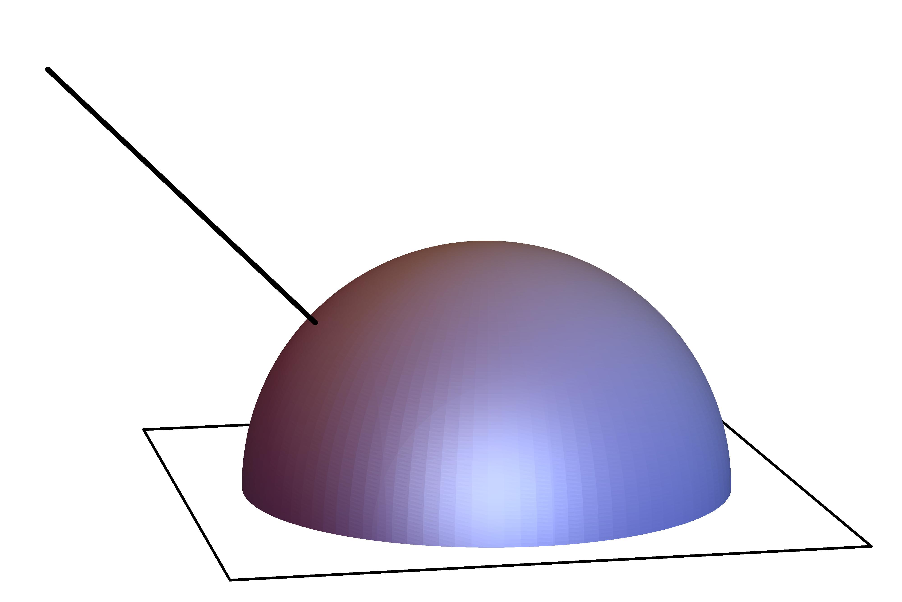
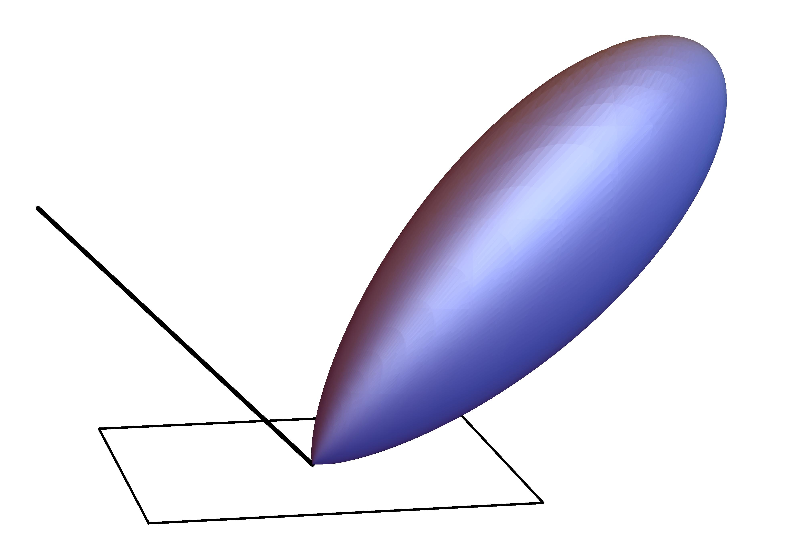
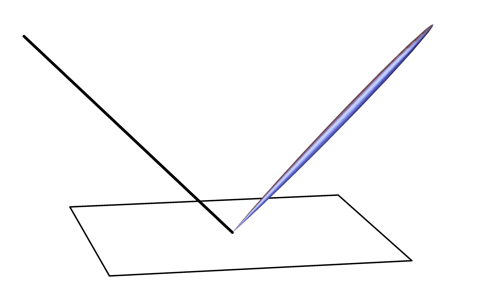
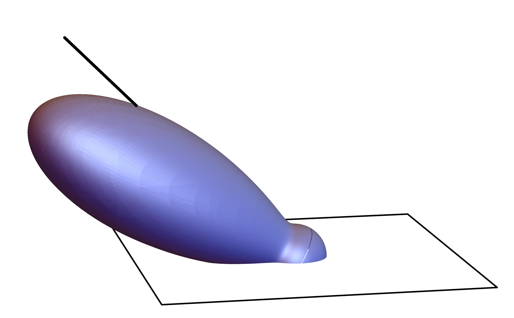
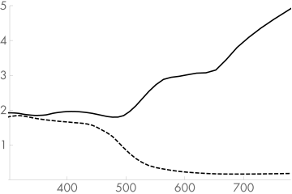
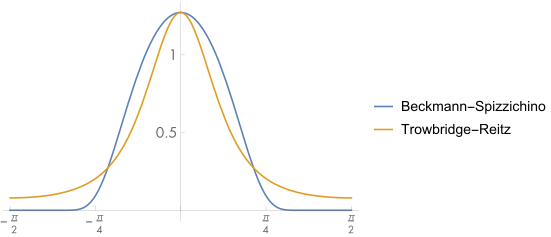
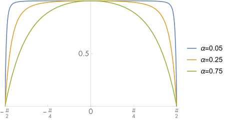
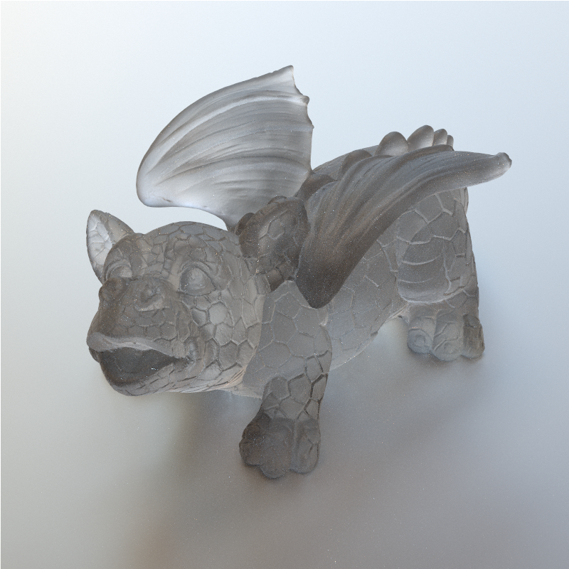

[toc]

# 8 Reflection Models / 反射模型

This chapter defines a set of classes for describing the way that light scatters at surfaces. Recall that in Section 5.6.1 we introduced the bidirectional reflectance distribution function (BRDF) abstraction to describe light reflection at a surface, the BTDF to describe transmission at a surface, and the BSDF to encompass both of these effects. In this chapter, we will start by defining a generic interface to these surface reflection and transmission functions.

Scattering from many surfaces is often best described as a spatially varying mixture of multiple BRDFs and BTDFs; in Chapter 9, we will introduce a BSDF object that combines multiple BRDFs and BTDFs to represent overall scattering from the surface. The current chapter sidesteps the issue of reflection and transmission properties that vary over the surface; the texture classes of Chapter 10 will address that problem. BRDFs and BTDFs explicitly only model scattering from light that enters and exits a surface at a single point. For surfaces that exhibit meaningful subsurface light transport, we will introduce the BSSRDF class, which models subsurface scattering, in Section 11.4 after some of the related theory is introduced in Chapter 11.

本章定义了一组类来描述光在表面散射的方式。回想一下，在第 5.6.1 节中，我们引入了双向反射分布函数 (BRDF) 抽象来描述表面上的光反射，BTDF 来描述表面上的透射，以及 BSDF 来包含这两种效果。在本章中，我们将从定义这些表面反射和传输函数的通用接口开始。

多个表面散射通常最好描述为多个 BRDF 和 BTDF 的空间变化混合；在第 9 章中，我们将介绍一个 BSDF 对象，它结合了多个 BRDF 和 BTDF 来表示来自表面的整体散射。本章回避了在表面上变化的反射和透射特性的问题；第 10 章的纹理类将解决这个问题。 BRDFs 和 BTDFs 明确地只模拟从单个点进入和离开表面的光的散射。对于表现出有意义的次表面光传输的表面，在第 11 章介绍了一些相关理论之后，我们将在第 11.4 节中介绍 BSSRDF 类，该类模拟次表面散射。

Surface reflection models come from a number of sources:

- Measured data: Reflection distribution properties of many real-world surfaces have been measured in laboratories. Such data may be used directly in tabular form or to compute coefficients for a set of basis functions.

- Phenomenological models: Equations that attempt to describe the qualitative properties of real-world surfaces can be remarkably effective at mimicking them. These types of BSDFs can be particularly easy to use, since they tend to have intuitive parameters that modify their behavior (e.g., “roughness”).

- Simulation: Sometimes, low-level information is known about the composition of a surface. For example, we might know that a paint is comprised of colored particles of some average size suspended in a medium or that a particular fabric is comprised of two types of threads, each with known reflectance properties. In these cases, light scattering from the microgeometry can be simulated to generate reflection data. This simulation can be done either during rendering or as a preprocess, after which it may be fit to a set of basis functions for use during rendering.

- Physical (wave) optics: Some reflection models have been derived using a detailed model of light, treating it as a wave and computing the solution to Maxwell’s equations to find how it scatters from a surface with known properties. These models tend to be computationally expensive, however, and usually aren’t appreciably more accurate than models based on geometric optics are for rendering applications.

- Geometric optics: As with simulation approaches, if the surface’s low-level scattering and geometric properties are known, then closed-form reflection models can sometimes be derived directly from these descriptions. Geometric optics makes modeling light’s interaction with the surface more tractable, since complex wave effects like polarization can be ignored.

表面反射模型有多种来源：

- 测量数据：实验室测量了许多真实世界表面的反射分布特性。此类数据可以直接以表格形式使用或用于计算一组基函数的系数。

- 现象学模型：试图描述真实世界表面定性特性的方程可以非常有效地模仿它们。这些类型的 BSDF 可能特别容易使用，因为它们往往具有修改其行为的直观参数（例如，“粗糙度”）。

- 模拟：有时，有关表面组成的低级信息是已知的。例如，我们可能知道油漆由悬浮在介质中的某种平均尺寸的有色颗粒组成，或者特定织物由两种类型的线组成，每一种都具有已知的反射特性。在这些情况下，可以模拟来自微观几何的光散射以生成反射数据。这种模拟可以在渲染期间完成，也可以作为预处理完成，之后它可能适合一组在渲染期间使用的基函数。

- 物理（波）光学：一些反射模型是使用光的详细模型推导出来的，将其视为波并计算麦克斯韦方程组的解，以找出它如何从具有已知属性的表面散射。然而，这些模型的计算成本往往很高，而且通常不会比基于几何光学的渲染应用模型更精确。

- 几何光学：与模拟方法一样，如果已知表面的低级散射和几何特性，则有时可以直接从这些描述中导出封闭形式的反射模型。几何光学使建模光与表面的相互作用更容易处理，因为可以忽略偏振等复杂的波效应。

The “Further Reading” section at the end of this chapter gives pointers to a variety of such reflection models.

Before we define the relevant interfaces, a brief review of how they fit into the overall system is in order. If a SamplerIntegrator is used, the SamplerIntegrator::Li() method implementation is called for each ray. After finding the closest intersection with a geometric primitive, it calls the surface shader that is associated with the primitive. The surface shader is implemented as a method of Material subclasses and is responsible for deciding what the BSDF is at a particular point on the surface; it returns a BSDF object that holds BRDFs and BTDFs that it has allocated and initialized to represent scattering at that point. The integrator then uses the BSDF to compute the scattered light at the point, based on the incoming illumination at the point. (The process where a BDPTIntegrator, MLTIntegrator, or SPPMIntegrator is used rather than a SamplerIntegrator is broadly similar.)

本章末尾的“进一步阅读”部分提供了各种此类反射模型的指示。

在我们定义相关接口之前，有必要简要回顾一下它们如何适应整个系统。如果使用 SamplerIntegrator，则为每条光线调用 SamplerIntegrator::Li() 方法实现。在找到与几何图元最近的交点后，它会调用与该图元关联的表面着色器。表面着色器作为 Material 子类的一个方法来实现，负责决定表面上特定点的 BSDF 是什么；它返回一个 BSDF 对象，其中包含它已分配并初始化的 BRDF 和 BTDF，以表示该点的散射。然后，积分器使用 BSDF 根据该点的入射光照计算该点的散射光。 （使用 BDPTIntegrator、MLTIntegrator 或 SPPMIntegrator 而不是 SamplerIntegrator 的过程大致相似。）

## Basic Terminology / 基本术语

In order to be able to compare the visual appearance of different reflection models, we will introduce some basic terminology for describing reflection from surfaces.

Reflection from surfaces can be split into four broad categories: diffuse, glossy specular, perfect specular, and retro-reflective (Figure 8.1). Most real surfaces exhibit reflection that is a mixture of these four types. Diffuse surfaces scatter light equally in all directions. Although a perfectly diffuse surface isn’t physically realizable, examples of near-diffuse surfaces include dull chalkboards and matte paint. Glossy specular surfaces such as plastic or high-gloss paint scatter light preferentially in a set of reflected directions—they show blurry reflections of other objects. Perfect specular surfaces scatter incident light in a single outgoing direction. Mirrors and glass are examples of perfect specular surfaces. Finally, retro-reflective surfaces like velvet or the Earth’s moon scatter light primarily back along the incident direction. Images throughout this chapter will show the differences between these various types of reflection when used in rendered scenes.

为了能够比较不同反射模型的视觉外观，我们将介绍一些描述表面反射的基本术语。

来自表面的反射可以分为四大类：漫反射、光泽镜面反射、完美镜面反射和逆反射(retro-reflective, is a device or surface that reflects radiation (usually light) back to its source with minimum scattering. 是一种以最小散射将辐射（通常是光）反射回其源的装置或表面。)（图 8.1）。大多数真实表面都表现出这四种类型的混合反射。漫反射表面在所有方向上均等地散射光。虽然完美的漫反射表面在物理上是不可实现的，但接近漫反射表面的例子包括暗淡的黑板和哑光油漆。有光泽的镜面表面（例如塑料或高光涂料）优先在一组反射方向上散射光 - 它们显示其他对象的模糊反射。完美的镜面将入射光散射到一个单一的出射方向。镜子和玻璃是完美镜面的例子。最后，像天鹅绒或地球月球这样的逆反射表面主要沿入射方向散射光。本章中的图像将显示在渲染场景中使用时这些不同类型的反射之间的差异。









Figure 8.1: Reflection from a surface can be generally categorized by the distribution of reflected light from an incident direction (heavy lines): (1) diffuse, (2) glossy specular, (3) nearly-perfect specular, and (4) retro-reflective distributions.

图 8.1：表面的反射一般可以根据入射方向（粗线）的反射光分布进行分类：(1) 漫反射，(2) 光泽镜面反射，(3) 近乎完美的镜面反射，以及 (4) 逆反射分布。

Given a particular category of reflection, the reflectance distribution function may be isotropic or anisotropic. Most objects are isotropic: if you choose a point on the surface and rotate it around its normal axis at that point, the distribution of light reflected doesn’t change. In contrast, anisotropic materials reflect different amounts of light as you rotate them in this way. Examples of anisotropic surfaces include brushed metal, many types of cloth, and compact disks.

给定特定类别的反射，反射分布函数可以是各向同性的或各向异性的。大多数对象是各向同性的：如果您选择表面上的一个点并在该点绕其法线轴旋转它，则反射光的分布不会改变。相比之下，当您以这种方式旋转时，各向异性材质会反射不同数量的光。各向异性表面的例子包括拉丝金属、许多类型的布和光盘。

## Geometric Setting / 几何设置

Reflection computations in pbrt are evaluated in a reflection coordinate system where the two tangent vectors and the normal vector at the point being shaded are aligned with the $x$, $y$, and $z$ axes, respectively (Figure 8.2). All direction vectors passed to and returned from the BRDF and BTDF routines will be defined with respect to this coordinate system. It is important to understand this coordinate system in order to understand the BRDF and BTDF implementations in this chapter.

pbrt 中的反射在反射坐标系中进行计算，其中两个切向量和被着色点的法向量分别与 $x$ 、 $y$ 和 $z$ 轴对齐（图 8.2）。 BRDF 和 BTDF 代码传递和返回的所有方向向量都将相对于该坐标系进行定义。为了理解本章中的 BRDF 和 BTDF 实现，理解这个坐标系很重要。


Figure 8.2: The Basic BSDF Interface Setting. The shading coordinate system is defined by the orthonormal basis vectors $(\mathbf{s}, \mathbf{t}, \mathbf{n})$. We will orient these vectors such that they lie along the $x, y$, and $z$ axes in this coordinate system. Direction vectors $\omega$ in world space are transformed into the shading coordinate system before any of the BRDF or BTDF methods are called.

图 8.2：基本 BSDF 接口设置。着色坐标系由正交基向量 $(\mathbf{s}, \mathbf{t}, \mathbf{n})$ 定义。我们将旋转这些向量，使它们位于此坐标系中的 $x、y$ 和 $z$ 轴上。在调用任何 BRDF 或 BTDF 方法之前，世界空间中的方向向量 $\omega$ 被转换为着色坐标系。

The shading coordinate system also gives a frame for expressing directions in spherical coordinates $(\theta, \phi)$; the angle $\theta$ is measured from the given direction to the $z$ axis, and $\phi$ is the angle formed with the $x$ axis after projection of the direction onto the $x y$ plane. Given a direction vector $\omega$ in this coordinate system, it is easy to compute quantities like the cosine of the angle that it forms with the normal direction:

阴影坐标系也给出了一个用球坐标 $(\theta,\phi)$ 表示方向的框架；角度 $\theta$ 是从给定方向到 $z$ 轴测量的， $\phi$ 是该方向投影到 $x y$ 平面后与 $x$ 轴形成的角度。给定这个坐标系中的方向向量 $\omega$ ，很容易计算出诸如它与法线方向形成的角度的余弦之类的量：

$$
\cos \theta=(\mathbf{n} \cdot \omega)=((0,0,1) \cdot \omega)=\omega_{z}
$$

We will provide utility functions to compute this value and some useful variations; their use helps clarify BRDF and BTDF implementations.

我们将提供工具函数来计算这个值和一些有用的变量；它们的使用有助于阐明 BRDF 和 BTDF 的实现。

```
<<BSDF Inline Functions>>= 
inline Float CosTheta(const Vector3f &w) { return w.z; }
inline Float Cos2Theta(const Vector3f &w) { return w.z * w.z; }
inline Float AbsCosTheta(const Vector3f &w) { return std::abs(w.z); }
```

The value of $\sin ^{2} \theta$ can be computed using the trigonometric identity $\sin ^{2} \theta+\cos ^{2} \theta=1$, though we need to be careful to avoid taking the square root of a negative number in the rare case that $1-\cos\theta^2$ is less than zero due to floating-point round-off error.

$\sin ^{2} \theta$ 的值可以使用三角恒等式 $\sin ^{2} \theta+\cos ^{2} \theta=1$ 计算，我们需要小心避免在极少数情况下，由于浮点舍入误差导致 $1-\cos\theta^2$ 小于零，进而计算负数的平方根。

```
<<BSDF Inline Functions>>+=  
inline Float Sin2Theta(const Vector3f &w) {
    return std::max((Float)0, (Float)1 - Cos2Theta(w));
}

inline Float SinTheta(const Vector3f &w) {
    return std::sqrt(Sin2Theta(w));
}
```

The tangent of the angle $\theta$ can be computed via the identity $\tan \theta=\sin \theta / \cos \theta$.

角度 $\theta$ 的切线可以通过恒等式 $\tan \theta=\sin \theta / \cos \theta$ 计算。

```
<<BSDF Inline Functions>>+=  
inline Float TanTheta(const Vector3f &w) {
    return SinTheta(w) / CosTheta(w);
}

inline Float Tan2Theta(const Vector3f &w) {
    return Sin2Theta(w) / Cos2Theta(w);
}
```

We can similarly use the shading coordinate system to simplify the calculations for the sine and cosine of the $\phi$ angle (Figure 8.3). In the plane of the point being shaded, the vector $\omega$ has coordinates $(x, y)$, which are given by $r \cos \phi$ and $r \sin \phi$, respectively. The radius $r$ is $\sin \theta$, so

我们可以类似地使用阴影坐标系来简化 $\phi$ 角的正弦和余弦计算（图 8.3）。在被着色的点所在的平面上，向量 $\omega$ 具有坐标 $(x, y)$ ，分别由 $r \cos \phi$ 和 $r \sin \phi$ 给出。半径 $r$ 是 $\sin \theta$ ，所以

$$
\begin{aligned}
\cos \phi &=\frac{x}{r}=\frac{x}{\sin \theta} \\
\sin \phi &=\frac{y}{r}=\frac{y}{\sin \theta} .
\end{aligned}
$$


Figure 8.3: The values of $\sin \phi$ and $\cos \phi$ can be computed using the circular coordinate equations $x=r \cos \phi$ and $y=r \sin \phi$, where $r$, the length of the dashed line, is equal to $\sin \theta$.

图 8.3： $\sin \phi$ 和 $\cos \phi$ 的值可以使用圆坐标方程 $x=r \cos \phi$ 和 $y=r \sin \phi$ 计算，其中 $r $ ，虚线的长度，等于 $\sin \theta$ 。

```
<<BSDF Inline Functions>>+=  
inline Float CosPhi(const Vector3f &w) {
    Float sinTheta = SinTheta(w);
    return (sinTheta == 0) ? 1 : Clamp(w.x / sinTheta, -1, 1);
}

inline Float SinPhi(const Vector3f &w) {
    Float sinTheta = SinTheta(w);
    return (sinTheta == 0) ? 0 : Clamp(w.y / sinTheta, -1, 1);
}

<<BSDF Inline Functions>>+=  
inline Float Cos2Phi(const Vector3f &w) {
    return CosPhi(w) * CosPhi(w);
}

inline Float Sin2Phi(const Vector3f &w) {
    return SinPhi(w) * SinPhi(w);
}
```

The cosine of the angle $\Delta \phi$ between two vectors' $\phi$ values in the shading coordinate system can be found by zeroing the $z$ coordinate of the two vectors to get $2 \mathrm{D}$ vectors and then normalizing them. The dot product of these two vectors gives the cosine of the angle between them. The implementation below rearranges the terms a bit for efficiency so that only a single square root operation needs to be performed.

阴影坐标系中两个向量的 $\phi$ 值之间的角度 $\Delta\phi$ 的余弦，可以通过将两个向量的 $z$ 坐标归零得到 $2 \mathrm{D}$ 向量和然后归一化它们。这两个向量的点积给出了它们之间夹角的余弦值。为了提高效率，下面的实现稍微重新排列了这些项，以便只需要执行一个平方根运算。

```
<<BSDF Inline Functions>>+=  
inline Float CosDPhi(const Vector3f &wa, const Vector3f &wb) {
    return Clamp((wa.x * wb.x + wa.y * wb.y) /
                 std::sqrt((wa.x * wa.x + wa.y * wa.y) *
                           (wb.x * wb.x + wb.y * wb.y)), -1, 1);
}
```

There are important conventions and implementation details to keep in mind when reading the code in this chapter and when adding BRDFs and BTDFs to pbrt:

- The incident light direction $\omega_{\mathrm{i}}$ and the outgoing viewing direction $\omega_{o}$ will both be normalized and outward facing after being transformed into the local coordinate system at the surface.

- By convention in pbrt, the surface normal $\mathbf{n}$ always points to the "outside" of the object, which makes it easy to determine if light is entering or exiting transmissive objects: if the incident light direction $\omega_{\mathrm{i}}$ is in the same hemisphere as $\mathbf{n}$, then light is entering; otherwise, it is exiting. Therefore, one detail to keep in mind is that the normal may be on the opposite side of the surface than one or both of the $\omega_{\mathrm{i}}$ and $\omega_{\mathrm{o}}$ direction vectors. Unlike many other renderers, pbrt does not flip the normal to lie on the same side as $\omega_{o}$.

- The local coordinate system used for shading may not be exactly the same as the coordinate system returned by the Shape : : Intersect() routines from Chapter 3; they can be modified between intersection and shading to achieve effects like bump mapping. See Chapter 9 for examples of this kind of modification.

- Finally, BRDF and BTDF implementations should not concern themselves with whether $\omega_{\mathrm{i}}$ and $\omega_{\mathrm{o}}$ lie in the same hemisphere. For example, although a reflective BRDF should in principle detect if the incident direction is above the surface and the outgoing direction is below and always return no reflection in this case, here we will expect the reflection function to instead compute and return the amount of light reflected using the appropriate formulas for their reflection model, ignoring the detail that they are not in the same hemisphere. Higher level code in pbrt will ensure that only reflective or transmissive scattering routines are evaluated as appropriate. The value of this convention will be explained in Section 9.1.

在阅读本章中的代码以及将 BRDF 和 BTDF 添加到 pbrt 时，需要记住一些重要的约定和实现细节：

- 入射光方向 $\omega_{\mathrm{i}}$ 和出射观察方向 $\omega_{o}$ 在转换到表面的局部坐标系后都将被归一化并面向外。

- 按照 pbrt 中的约定，表面法线 $\mathbf{n}$ 总是指向物体的“外部”，这使得很容易确定光是进入还是离开透射物体：如果入射光方向 $\omega_ {\mathrm{i}}$ 与 $\mathbf{n}$ 在同一个半球，则光进入；否则，光离开。因此，要记住的一个细节是，法线可能位于表面的另一侧，而不是 $\omega_{\mathrm{i}}$ 和 $\omega_{\mathrm{o}}$ 之一或两者方向向量。与许多其他渲染器不同，pbrt 不会翻转法线以与 $\omega_{o}$ 位于同一侧。

- 用于着色的局部坐标系可能与第 3 章中 Shape::Intersect() 代码返回的坐标系不完全相同；它们可以在相交和着色之间进行修改，以实现凹凸纹理等效果。有关此类修改的示例，请参见第 9 章。

- 最后，BRDF 和 BTDF 实现不应该关心 $\omega_{\mathrm{i}}$ 和 $\omega_{\mathrm{o}}$ 是否位于同一个半球。例如，虽然反射 BRDF 原则上应该检测入射方向是否高于表面，而出射方向是否低于表面，并且在这种情况下始终不返回任何反射，但在这里我们期望反射函数使用反射模型的适当公式，计算并返回反射的光量，忽略它们不在同一半球的细节。 pbrt 中的高级代码将确保仅对反射或透射散射代码进行适当计算。这个约定的价值将在第 9.1 节中解释。

## 8.1 Basic Interface / 基本接口

We will first define the interface for the individual BRDF and BTDF functions. BRDFs and BTDFs share a common base class, BxDF. Because both have the exact same interface, sharing the same base class reduces repeated code and allows some parts of the system to work with BxDFs generically without distinguishing between BRDFs and BTDFs.

我们将首先为各个 BRDF 和 BTDF 函数定义接口。 BRDF 和 BTDF 共享一个公共基类 BxDF。由于两者具有完全相同的接口，因此共享相同的基类可以减少重复代码并允许系统的某些部分通用地使用 BxDF，而无需区分 BRDF 和 BTDF。

```
<<BxDF Declarations>>= 
class BxDF {
public:
    <<BxDF Interface>> 
    <<BxDF Public Data>> 
};
```

The BSDF class, which will be introduced in Section 9.1, holds a collection of BxDF objects that together describe the scattering at a point on a surface. Although we are hiding the implementation details of the BxDF behind a common interface for reflective and transmissive materials, some of the light transport algorithms in Chapters 14 through 16 will need to distinguish between these two types. Therefore, all BxDFs have a BxDF::type member that holds flags from BxDFType. For each BxDF, the flags should have at least one of BSDF_REFLECTION or BSDF_TRANSMISSION set and exactly one of the diffuse, glossy, and specular flags. Note that there is no retro-reflective flag; retro-reflection is treated as glossy reflection in this categorization.

将在第 9.1 节中介绍的 BSDF 类拥有 BxDF 对象的集合，这些对象共同描述了表面上某个点的散射。尽管我们将 BxDF 的实现细节隐藏在反射和透射材质的通用接口后面，但第 14 章到第 16 章中的一些光传输算法需要区分这两种类型。因此，所有 BxDF 都有一个 BxDF::type 成员，该成员保存来自 BxDFType 的标志。对于每个 BxDF，标志应该至少设置 BSDF_REFLECTION 或 BSDF_TRANSMISSION 之一，并且恰好是漫反射、光泽和镜面反射标志之一。请注意，没有逆反射标志；在此分类中，逆反射被视为光泽反射。

```
<<BSDF Declarations>>= 
enum BxDFType {
    BSDF_REFLECTION   = 1 << 0,
    BSDF_TRANSMISSION = 1 << 1,
    BSDF_DIFFUSE      = 1 << 2,
    BSDF_GLOSSY       = 1 << 3,
    BSDF_SPECULAR     = 1 << 4,
    BSDF_ALL          = BSDF_DIFFUSE | BSDF_GLOSSY | BSDF_SPECULAR |
                        BSDF_REFLECTION | BSDF_TRANSMISSION,
};

<<BxDF Interface>>= 
BxDF(BxDFType type) : type(type) { }
<<BxDF Public Data>>= 
const BxDFType type;
```

The MatchesFlags() utility method determines if the BxDF matches the user-supplied type flags:

MatchesFlags() 工具函数确定 BxDF 是否与用户提供的类型标志匹配：

```
<<BxDF Interface>>+=  
bool MatchesFlags(BxDFType t) const {
    return (type & t) == type;
}
```

The key method that BxDFs provide is BxDF::f(). It returns the value of the distribution function for the given pair of directions. This interface implicitly assumes that light in different wavelengths is decoupledenergy at one wavelength will not be reflected at a different wavelength. By making this assumption, the effect of the reflection function can be represented directly with a Spectrum. Supporting fluorescent materials where this assumption is not true would require that this method return an $n \times n$ matrix that encoded the transfer of energy between spectral samples (where $n$ is the number of samples in the Spectrum representation).

BxDFs 提供的关键方法是 BxDF::f()。它返回给定方向对的分布函数值。这个接口隐含地假设不同波长的光是去耦的，一个波长的能量不会在不同的波长反射。通过做出这个假设，反射函数的效果可以直接用光谱来表示。如果要支持荧光材质，则此假设不成立，这种情况下将要求此方法返回一个 $n \times n$ 矩阵，该矩阵对光谱采样之间的能量转移进行编码（其中 $n$ 是光谱表示中的采样数）。

```
<<BxDF Interface>>+=  
virtual Spectrum f(const Vector3f &wo, const Vector3f &wi) const = 0;
```

Not all BxDFs can be evaluated with the f() method. For example, perfectly specular objects like a mirror, glass, or water only scatter light from a single incident direction into a single outgoing direction. Such BxDFs are best described with delta distributions that are zero except for the single direction where light is scattered. These BxDFs need special handling in pbrt, so we will also provide the method BxDF::Sample_f(). This method is used both for handling scattering that is described by delta distributions as well as for randomly sampling directions from BxDFs that scatter light along multiple directions; this second application will be explained in the discussion of Monte Carlo BSDF sampling in Section 14.1.

BxDF::Sample_f() computes the direction of incident light $\omega_{\text {i }}$ given an outgoing direction $\omega_{o}$ and returns the value of the BxDF for the pair of directions. For delta distributions, it is necessary for the BxDF to choose the incident light direction in this way, since the caller has no chance of generating the appropriate $\omega_{\mathrm{i}}$ direction. The sample and pdf parameters aren't needed for delta distribution BxDFs, so they will be explained later, in Section 14.1, when we provide implementations of this method for nonspecular reflection functions.

并非所有 BxDF 都可以使用 f() 方法进行计算。例如，完美的镜面反射物体，如镜子、玻璃或水，只会将光从单个入射方向散射到单个出射方向。这种 BxDF 最好用 delta 分布来描述，除了光散射的单个方向外，这些分布为零。这些 BxDF 需要在 pbrt 中进行特殊处理，因此我们还将提供方法 BxDF::Sample_f()。这种方法既用于处理由 delta 分布描述的散射，也用于从沿多个方向散射光的 BxDF 随机采样方向；第二个应用将在第 14.1 节Monte Carlo BSDF 采样的讨论中解释。

BxDF::Sample_f() 计算入射光的方向 $\omega_{\text {i }}$ 和给定出射方向 $\omega_{o}$ ，并返回这对方向的 BxDF 值。对于 delta 分布，BxDF 有必要以这种方式选择入射光方向，因为调用者没有机会生成合适的 $\omega_{\mathrm{i}}$ 方向。 delta 分布 BxDF 不需要 sample 和 pdf 参数，因此稍后将在第 14.1 节中解释，当我们为非镜面反射函数提供此方法的实现时。

```
<<BxDF Interface>>+=  
virtual Spectrum Sample_f(const Vector3f &wo, Vector3f *wi,
    const Point2f &sample, Float *pdf,
    BxDFType *sampledType = nullptr) const;
```

### 8.1.1 Reflectance / 反射率

It can be useful to take the aggregate behavior of the 4D BRDF or BTDF, defined as a function over pairs of directions, and reduce it to a 2D function over a single direction, or even to a constant value that describes its overall scattering behavior.

The hemispherical-directional reflectance is a 2D function that gives the total reflection in a given direction due to constant illumination over the hemisphere, or, equivalently, total reflection over the hemisphere due to light from a given direction. It is defined as

将 4D BRDF 或 BTDF 的聚合行为（定义为方向对上的函数）简化为单个方向上的 2D 函数，甚至是描述其整体散射行为的常数值，这可能很有用。

半球方向反射率是一个 2D 函数，它在给定方向上由于在半球上的恒定照明而产生全反射，或者等效地，由于来自给定方向的光而在半球上产生全反射。它被定义为

$$
\rho_{\mathrm{hd}}\left(\omega_{\mathrm{o}}\right)=\int_{\mathrm{H}^{2}(\mathbf{n})} f_{\mathrm{r}}\left(\mathrm{p}, \omega_{\mathrm{o}}, \omega_{\mathrm{i}}\right)\left|\cos \theta_{\mathrm{i}}\right| \mathrm{d} \omega_{\mathrm{i}}
$$

(8.1)

The BxDF::rho() method computes the reflectance function $\rho_{\text {hd }}$. Some BxDFs can compute this value in closed form, although most use Monte Carlo integration to compute an approximation to it. For those BxDFs, the nSamples and samples parameters are used by the implementation of the Monte Carlo algorithm; they are explained in Section 14.1.5.

BxDF::rho() 方法计算反射函数 $\rho_{\text {hd }}$ 。一些 BxDF 可以以封闭形式计算这个值，尽管大多数使用Monte Carlo积分来计算它的近似值。对于那些 BxDF，nSamples 和 samples 参数由 Monte Carlo 算法的实现使用；它们在第 14.1.5 节中解释。

```
<<BxDF Interface>>+=  
virtual Spectrum rho(const Vector3f &wo, int nSamples,
                     const Point2f *samples) const;
```

The hemispherical-hemispherical reflectance of a surface, denoted by $\rho_{\mathrm{hh}}$, is a spectral value that gives the fraction of incident light reflected by a surface when the incident light is the same from all directions. It is

表面的半球-半球反射率，用 $\rho_{\mathrm{hh}}$ 表示，是一个光谱值，当入射光从各个方向相同时，它给出了表面反射的入射光的分量。是

$$
\rho_{\mathrm{hh}}=\frac{1}{\pi} \int_{\mathrm{H}^{2}(\mathrm{n})} \int_{\mathrm{H}^{2}(\mathbf{n})} f_{\mathrm{r}}\left(\mathrm{p}, \omega_{\mathrm{o}}, \omega_{\mathrm{i}}\right)\left|\cos \theta_{\mathrm{o}} \cos \theta_{\mathrm{i}}\right| \mathrm{d} \omega_{\mathrm{o}} \mathrm{d} \omega_{\mathrm{i}}
$$

The BxDF::rho( ) method computes $\rho_{\text {hh }}$ if no direction $\omega_{o}$ is provided. The remaining parameters are again used when computing a Monte Carlo estimate of the value of $\rho_{\mathrm{hh}}$, if needed.

如果没有提供方向 $\omega_{o}$ ，则 BxDF::rho( ) 方法计算 $\rho_{\text {hh }}$ 。如果需要，在计算 $\rho_{\mathrm{hh}}$ 值的Monte Carlo估值时，将再次使用其余参数。

```
<<BxDF Interface>>+= 
virtual Spectrum rho(int nSamples, const Point2f *samples1,
                     const Point2f *samples2) const;
```

### 8.1.2 BxDF Scaling Adapter / BxDF 缩放适配器

It is also useful to take a given BxDF and scale its contribution with a Spectrum value. The ScaledBxDF wrapper holds a BxDF * and a Spectrum and implements this functionality. This class is used by the MixMaterial (defined in Section 9.2.3), which creates BSDFs based on a weighted combination of two other materials.

使用给定的 BxDF 并使用 Spectrum 值缩放其贡献也很有用。 ScaledBxDF 包装器包含一个 BxDF * 和一个 Spectrum 并实现此功能。此类由 MixMaterial（在第 9.2.3 节中定义）使用，它基于其他两种材质的加权组合创建 BSDF。

```
<<BxDF Declarations>>+=  
class ScaledBxDF : public BxDF {
public:
    <<ScaledBxDF Public Methods>> 
private:
    BxDF *bxdf;
    Spectrum scale;
};

<<ScaledBxDF Public Methods>>= 
ScaledBxDF(BxDF *bxdf, const Spectrum &scale) 
    : BxDF(BxDFType(bxdf->type)), bxdf(bxdf), scale(scale) {
}
```

The implementations of the ScaledBxDF methods are straightforward; we’ll only include f() here.

ScaledBxDF 方法的实现很简单；我们将在这里只包含 f()。

```
<<BxDF Method Definitions>>= 
Spectrum ScaledBxDF::f(const Vector3f &wo, const Vector3f &wi) const {
    return scale * bxdf->f(wo, wi);
}
```

## 8.2 Specular Reflection and Transmission / 镜面反射和透射

The behavior of light at perfectly smooth surfaces is relatively easy to characterize analytically using both the physical and geometric optics models. These surfaces exhibit perfect specular reflection and transmission of incident light; for a given $\omega_{\mathrm{i}}$ direction, all light is scattered in a single outgoing direction $\omega_{\mathrm{o}}$. For specular reflection, this direction is the outgoing direction that makes the same angle with the normal as the incoming direction:

使用物理和几何光学模型，对光在完美光滑表面上的行为进行分析相对容易。这些表面表现出完美的镜面反射和入射光透射；对于给定的 $\omega_{\mathrm{i}}$ 方向，所有光都在单个出射方向 $\omega_{\mathrm{o}}$ 上散射。 对于镜面反射，出射方向与入射方向两者相对法线的夹角相同：

$$
\theta_{\mathrm{i}}=\theta_{\mathrm{o}}
$$

and where $\phi_{\mathrm{o}}=\phi_{\mathrm{i}}+\pi$. For transmission, we again have $\phi_{\mathrm{o}}=\phi_{\mathrm{i}}+\pi$, and the outgoing direction $\theta_{t}$ is given by Snell's law, which relates the angle $\theta_{\mathrm{t}}$ between the transmitted direction and the surface normal $\mathbf{n}$ to the angle $\theta_{\mathrm{i}}$ between the incident ray and the surface normal $\mathbf{n}$. (One of the exercises at the end of this chapter is to derive Snell's law using Fermat's principle from optics.) Snell's law is based on the index of refraction for the medium that the incident ray is in and the index of refraction for the medium it is entering. The index of refraction describes how much more slowly light travels in a particular medium than in a vacuum. We will use the Greek letter $\eta$, pronounced "eta," to denote the index of refraction. Snell's law is

其中 $\phi_{\mathrm{o}}=\phi_{\mathrm{i}}+\pi$ 。对于传输，我们再次有 $\phi_{\mathrm{o}}=\phi_{\mathrm{i}}+\pi$ ，并且输出方向 $\theta_{t}$ 由斯涅尔定律给出，它涉及透射方向和表面法线之间的角度 $\theta_{\mathrm{t}}$ ，与入射光线和表面法线 $\mathbf{n}$ 之间的角度 $\theta_{\mathrm{i}}$ 。（本章末尾的练习之一是使用费马原理从光学中推导出斯涅耳定律。）斯涅耳定律基于入射光线所在介质的折射率和它正在进入介质的折射率。折射率描述了光在特定介质中的传播速度比在真空中慢多少。我们将使用希腊字母 $\eta$（发音为“eta”）来表示折射率。斯内尔定律是

$$
\eta_{\mathrm{i}} \sin \theta_{\mathrm{i}}=\eta_{\mathrm{t}} \sin \theta_{\mathrm{t}}
$$

(8.2)

In general, the index of refraction varies with the wavelength of light. Thus, incident light generally scatters in multiple directions at the boundary between two different media, an effect known as dispersion. This effect can be seen when incident white light is split into spectral components by a prism. Common practice in graphics is to ignore this wavelength dependence, since this effect is generally not crucial for visual accuracy and ignoring it simplifies light transport calculations substantially. Alternatively, the paths of multiple beams of light (e.g., at a series of discrete wavelengths) can be tracked through the environment in which a dispersive object is found. The “Further Reading” section at the end of Chapter 14 has pointers to more information on this topic.

一般来说，折射率随光的波长而变化。因此，入射光通常在两种不同介质之间的边界处向多个方向散射，这种效应称为色散。当入射白光被棱镜分成光谱分量时，可以看到这种效果。图形中的常见做法是忽略这种波长相关性，因为这种影响通常对视觉准确性并不重要，而忽略它会大大简化光传输计算。或者，可以在发现色散物体的环境中跟踪多束光的路径（例如，在一系列离散波长下）。第 14 章末尾的“进一步阅读”部分提供了有关此主题的更多信息的提示。


Figure 8.4: Dragon model rendered with (1) perfect specular reflection and (2) perfect specular refraction. Image (2) excludes the effects of external and internal reflection; the resulting energy loss produces conspicuous dark regions. (Model courtesy of Christian Schüller.)

图 8.4：使用 (1) 完美镜面反射和 (2) 完美镜面折射渲染的龙模型。图像（2）排除了外部和内部反射的影响；由此产生的能量损失会产生明显的暗区。 （模型由 Christian Schüller 提供。）

Figure 8.4 shows the effect of perfect specular reflection and transmission.

图 8.4 显示了完美的镜面反射和透射效果。

### 8.2.1 Fresnel Reflectance / 菲涅尔反射率

In addition to the reflected and transmitted directions, it is also necessary to compute the fraction of incoming light that is reflected or transmitted. For physically accurate reflection or refraction, these terms are directionally dependent and cannot be captured by constant per-surface scaling amounts. The Fresnel equations describe the amount of light reflected from a surface; they are the solution to Maxwell’s equations at smooth surfaces.

Given the index of refraction and the angle which the incident ray makes with the surface normal, the Fresnel equations specify the material’s corresponding reflectance for two different polarization states of the incident illumination. Because the visual effect of polarization is limited in most environments, in pbrt we will make the common assumption that light is unpolarized; that is, it is randomly oriented with respect to the light wave. With this simplifying assumption, the Fresnel reflectance is the average of the squares of the parallel and perpendicular polarization terms.

除了反射和透射方向之外，还需要计算反射或透射的入射光的比例。对于物理上准确的反射或折射，这些项是方向相关的，无法通过恒定的每个表面缩放量来捕获。菲涅耳方程描述了从表面反射的光量；它们是光滑表面上麦克斯韦方程组的解。

给定折射率和入射光线与表面法线的夹角，菲涅耳方程指定了材质对入射照明的两种不同偏振态的相应反射率。因为在大多数环境下偏振的视觉效果是有限的，所以在 pbrt 中我们会做一个共同的假设，即光是非偏振的；也就是说，它相对于光波是随机定向的。有了这个简化的假设，菲涅耳反射率是平行和垂直偏振项的平方的平均值。

At this point, it is necessary to draw a distinction among several important classes of materials:

1. The first class is dielectrics, which are materials that don't conduct electricity. They have real-valued indices of refraction (usually in the range 1-3) and transmit a portion of the incident illumination. Examples of dielectrics are glass, mineral oil, water, and air.

2. The second class consists of conductors such as metals. Valence electrons can freely move within the their atomic lattice, allowing electric currents to flow from one place to another. This fundamental atomic property translates into a profoundly different behavior when a conductor is subjected to electromagnetic radiation such as visible light: the material is opaque and reflects back a significant portion of the illumination. A portion of the light is also transmitted into the interior of the conductor, where it is rapidly absorbed: total absorption typically occurs within the top $0.1 \mu \mathrm{m}$ of the material, hence only extremely thin metal films are capable of transmitting appreciable amounts of light. We ignore this effect in pbrt and only model the reflection component of conductors. In contrast to dielectrics, conductors have a complex-valued index of refraction $\bar{\eta}=\eta+\mathrm{i} k$.

3. Semiconductors such as silicon or germanium are the third class though we will not consider them in this book.

在这一点上，有必要区分几个重要的材质类别：

1. 第一类是电介质，是不导电的材质。它们具有实值折射率（通常在 1-3 范围内）并透射一部分入射光。电介质的例子是玻璃、矿物油、水和空气。

2. 第二类由金属等导体组成。价电子可以在其原子晶格内自由移动，从而允许电流从一处流向另一处。当导体受到电磁辐射（如可见光）时，这种基本的原子特性会转化为完全不同的行为：材质是不透明的，并反射回大部分照明。一部分光也传输到导体内部，在那里被迅速吸收：总吸收通常发生在材质的顶部 $0.1 \mu \mathrm{m}$ 内，因此只有极薄的金属膜能够传输可观的光量。我们在 pbrt 中忽略了这种效应，只对导体的反射分量进行建模。与电介质相反，导体具有复数值的折射率 $\bar{\eta}=\eta+\mathrm{i} k$ 。

3. 硅或锗等半导体是第三类，尽管我们不会在本书中考虑它们。

Both conductors and dielectrics are governed by the same set of Fresnel equations. Despite this, we prefer to create a special evaluation function for dielectrics to benefit from the particularly simple form that these equations take on when the indices of refraction are guaranteed to be real-valued.

导体和电介质都由同一组菲涅耳方程控制。尽管如此，我们更愿意为电介质创建一个特殊的计算函数，以便在保证折射率为实值时，从这些方程所采用的特别简单的形式中受益。

Table 8.1: Indices of refraction for a variety of objects, giving the ratio of the speed of light in a vacuum to the speed of light in the medium. These are generally wavelength-dependent quantities; these values are averages over the visible wavelengths.

表 8.1：各种物体的折射指数，给出真空中的光速与介质中的光速之比。这些通常是与波长相关的量；这些值是可见光波长的平均值。

$$
\begin{array}{ll}
\text { Medium } & \text { Index of refraction } \eta \\
\hline \text { Vacuum } & 1.0 \\
\hline \text { Air at sea level } & 1.00029 \\
\hline \text { Ice } & 1.31 \\
\hline \text { Water }\left(20^{\circ} \mathrm{C}\right) & 1.333 \\
\hline \text { Fused quartz } & 1.46 \\
\hline \text { Glass } & 1.5-1.6 \\
\hline \text { Sapphire } & 1.77 \\
\hline \text { Diamond } & 2.42 \\
\hline
\end{array}
$$

To compute the Fresnel reflectance at the interface of two dielectric media, we need to know the indices of refraction for the two media. Table 8.1 has the indices of refraction for a number of dielectric materials. The Fresnel reflectance formulae for dielectrics are

要计算两种电介质界面处的菲涅耳反射率，我们需要知道两种介质的折射率。表 8.1 列出了多种电介质的折射率。电介质的菲涅耳反射率公式为

$$
\begin{aligned}
r_{\|} &=\frac{\eta_{\mathrm{t}} \cos \theta_{\mathrm{i}}-\eta_{\mathrm{i}} \cos \theta_{\mathrm{t}}}{\eta_{\mathrm{t}} \cos \theta_{\mathrm{i}}+\eta_{\mathrm{i}} \cos \theta_{\mathrm{t}}} \\
r_{\perp} &=\frac{\eta_{\mathrm{i}} \cos \theta_{\mathrm{i}}-\eta_{\mathrm{t}} \cos \theta_{\mathrm{t}}}{\eta_{\mathrm{i}} \cos \theta_{\mathrm{i}}+\eta_{\mathrm{t}} \cos \theta_{\mathrm{t}}}
\end{aligned}
$$

where $r_{\|}$ is the Fresnel reflectance for parallel polarized light and $r_{\perp}$ is the reflectance for perpendicular polarized light, $\eta_{\mathrm{i}}$ and $\eta_{\mathrm{t}}$ are the indices of refraction for the incident and transmitted media, and $\omega_{\mathrm{i}}$ and $\omega_{\mathrm{t}}$ are the incident and transmitted directions. $\omega_{\mathrm{t}}$ can be computed with Snell's law (see Section 8.2.3).

The cosine terms should all be greater than or equal to zero; for the purposes of computing these values, the geometric normal should be flipped to be on the same side as $\omega_{\mathrm{i}}$ and $\omega_{\mathrm{t}}$ when computing $\cos \theta_{\mathrm{i}}$ and $\cos \theta_{\mathrm{t}}$, respectively.

For unpolarized light, the Fresnel reflectance is

其中 $r_{\|}$ 是平行偏振光的菲涅耳反射率， $r_{\perp}$ 是垂直偏振光的反射率， $\eta_{\mathrm{i}}$ 和 $\eta_{\mathrm {t}}$ 是入射和传输介质的折射率， $\omega_{\mathrm{i}}$ 和 $\omega_{\mathrm{t}}$ 是入射和传输方向。 $\omega_{\mathrm{t}}$ 可以用斯涅尔定律计算（见第 8.2.3 节）。

余弦项应全部大于或等于零；为了计算这些值，当计算 $\cos \theta_{\mathrm{i}}$ 和 $\cos \theta_{\mathrm{t}}$ 时，几何法线应分别翻转到与 $\omega_{\mathrm{i}}$ 和 $\omega_{\mathrm{t}}$ 在同一侧。

对于非偏振光，菲涅耳反射率为

$$
F_{\mathrm{r}}=\frac{1}{2}\left(r_{\|}^{2}+r_{\perp}^{2}\right)
$$

Due to conservation of energy, the energy transmitted by a dielectric is $1-F_{\mathrm{r}}$.

The function FrDielectric() computes the Fresnel reflection formula for dielectric materials and unpolarized light. The quantity $\cos \theta_{\mathrm{i}}$ is passed in with the parameter cosThetaI.

由于能量守恒，电介质传输的能量为 $1-F_{\mathrm{r}}$ 。

函数 FrDielectric() 计算电介质和非偏振光的菲涅耳反射公式。数量 $\cos \theta_{\mathrm{i}}$ 与参数 cosThetaI 一起传入。

```
<<BxDF Utility Functions>>= 
Float FrDielectric(Float cosThetaI, Float etaI, Float etaT) {
    cosThetaI = Clamp(cosThetaI, -1, 1);
    <<Potentially swap indices of refraction>> 
    <<Compute cosThetaT using Snell’s law>> 
    Float Rparl = ((etaT * cosThetaI) - (etaI * cosThetaT)) /
                  ((etaT * cosThetaI) + (etaI * cosThetaT));
    Float Rperp = ((etaI * cosThetaI) - (etaT * cosThetaT)) /
                  ((etaI * cosThetaI) + (etaT * cosThetaT));
    return (Rparl * Rparl + Rperp * Rperp) / 2;
}
```

To find the cosine of the transmitted angle, cosThetaT, it is first necessary to determine if the incident direction is on the outside of the medium or inside it, so that the two indices of refraction can be interpreted appropriately.

The sign of the cosine of the incident angle indicates on which side of the medium the incident ray lies (Figure 8.5). If the cosine is between $0$ and $1$ , the ray is on the outside, and if the cosine is between $-1$ and $0$ , the ray is on the inside. The parameters etaI and etaT are adjusted such that etaI has the index of refraction of the incident medium, and thus it is ensured that cosThetaI is nonnegative.

要找到透射角的余弦 cosThetaT，首先需要确定入射方向是在介质的外部还是内部，以便可以适当地解释这两个折射率。

入射角的余弦符号表示入射光线位于介质的哪一侧（图 8.5）。如果余弦在 $0$ 和 $1$ 之间，光线在外面，如果余弦在 $-1$ 和 $0$ 之间，光线在里面。参数 etaI 和 etaT 被调整为使得 etaI 具有入射介质的折射率，从而确保 cosThetaI 是非负的。


Figure 8.5: The cosine of the angle $\theta$ between a direction $\omega$ and the geometric surface normal indicates whether the direction is pointing outside the surface (in the same hemisphere as the normal) or inside the surface. In the standard reflection coordinate system, this test just requires checking the $z$ component of the direction vector. Here, $\omega$ is in the upper hemisphere, with a positivevalued cosine, while $\omega^{\prime}$ is in the lower hemisphere.

图 8.5：方向 $\omega$ 与几何表面法线之间的夹角 $\theta$ 的余弦，表示该方向是指向表面外（与法线在同一半球）还是指向表面内。在标准反射坐标系中，这个测试只需要检查方向向量的 $z$ 分量。这里， $\omega$ 位于上半球，余弦值为正，而 $\omega^{\prime}$ 位于下半球。

```
<<Potentially swap indices of refraction>>= 
bool entering = cosThetaI > 0.f;
if (!entering) {
    std::swap(etaI, etaT);
    cosThetaI = std::abs(cosThetaI);
}
```

Once the indices of refraction are determined, we can compute the sine of the angle between the transmitted direction and the surface normal, $\sin \theta_{\mathrm{t}}$, using Snell's law (Equation (8.2)). Finally, the cosine of this angle is found using the identity $\sin ^{2} \theta+\cos ^{2} \theta=1$.

一旦确定了折射率，我们就可以使用斯涅尔定律（方程（8.2））计算透射方向和表面法线之间的角度的正弦 $\sin \theta_{\mathrm{t}}$ 。最后，使用恒等式 $\sin ^{2} \theta+\cos ^{2} \theta=1$ 找到该角度的余弦。

```
<<Compute cosThetaT using Snell’s law>>= 
Float sinThetaI = std::sqrt(std::max((Float)0,
                                     1 - cosThetaI * cosThetaI));
Float sinThetaT = etaI / etaT * sinThetaI;

<<Handle total internal reflection>> 
Float cosThetaT = std::sqrt(std::max((Float)0,
                                     1 - sinThetaT * sinThetaT));
```

When light is traveling from one medium to another medium with a lower index of refraction, none of the light at incident angles near grazing passes into the other medium. The largest angle at which this happens is called the critical angle; when $\theta_{\mathrm{i}}$ is greater than the critical angle, total internal reflection occurs, and all of the light is reflected. That case is detected here by a value of $\sin \theta_{\mathrm{t}}$ greater than one; in that case, the Fresnel equations are unnecessary.

当光从一种介质传播到另一种折射率较低的介质时，入射角接近掠射的光都不会进入另一种介质。发生这种情况的最大角度称为临界角；当 $\theta_{\mathrm{i}}$ 大于临界角时，发生全内反射，所有光都被反射。这种情况在这里通过 $\sin \theta_{\mathrm{t}}$ 大于 1 的值来检测；在这种情况下，不需要菲涅耳方程。

```
<<Handle total internal reflection>>= 
if (sinThetaT >= 1)
    return 1;
```

We now focus on the general case of a complex index of refraction $\bar{\eta}=\eta+\mathrm{i} k$, where some of the incident light is potentially absorbed by the material and turned into heat. In addition to the real part, the general Fresnel formula now also depends on the imaginary part $k$ that is referred to as the absorption coefficient.

Figure $8.6$ shows a plot of the index of refraction and absorption coefficient for gold; both of these are wavelength-dependent quantities. The directory scenes/spds/metals in the pbrt distribution has wavelength-dependent data for $\eta$ and $k$ for a variety of metals. Figure $9.4$ in the next chapter shows a model rendered with a metal material.

我们现在关注复折射率 $\bar{\eta}=\eta+\mathrm{i} k$ 的一般情况，其中一些入射光可能被材质吸收并转化为热量。除了实部，一般菲涅耳公式现在还取决于虚部 $k$ ，称为吸收系数。

图 $8.6$ 显示了黄金的折射指数和吸收系数图；这两个都是与波长相关的量。 pbrt 发行版中的目录scenes/spds/metals 具有各种金属的 $\eta$ 和 $k$ 的波长相关数据。下一章的图 $9.4$ 显示了一个用金属材质渲染的模型。



Figure 8.6: Absorption Coefficient and Index of Refraction of Gold. This plot shows the spectrally varying values of the absorption coefficient $k$ (solid line) and the index of refraction $\eta$ (dashed line) for gold, where the horizontal axis is wavelength in $\mathrm{nm}$.

图 8.6：黄金的吸收系数和折射率。该图显示了金的吸收系数 $k$（实线）和折射率 $\eta$（虚线）的光谱变化值，其中横轴是以 $\mathrm{nm}$ 为单位的波长。

The Fresnel reflectance at the boundary between a conductor and a dielectric medium is given by

导体和电介质之间边界处的菲涅耳反射率由下式给出

$$
\begin{aligned}
r_{\perp} &=\frac{a^{2}+b^{2}-2 a \cos \theta+\cos ^{2} \theta}{a^{2}+b^{2}+2 a \cos \theta+\cos ^{2} \theta} \\
r_{\|} &=r_{\perp} \frac{\cos ^{2} \theta\left(a^{2}+b^{2}\right)-2 a \cos \theta \sin ^{2} \theta+\sin ^{4} \theta}{\cos ^{2} \theta\left(a^{2}+b^{2}\right)+2 a \cos \theta \sin ^{2} \theta+\sin ^{4} \theta}
\end{aligned}
$$

(8.3)

where

$$
a^{2}+b^{2}=\sqrt{\left(\eta^{2}-k^{2}-\sin ^{2} \theta\right)^{2}+4 \eta^{2} k^{2}}
$$

and $\eta+\mathrm{i} k=\bar{\eta}_{\mathrm{t}} / \bar{\eta}_{\mathrm{i}}$ is the relative index of refraction computed using a complex division operation. However, generally $\bar{\eta}_{\mathrm{i}}$ will be a dielectric so that a normal real division can be used instead.

This computation is implemented by the FrConductor() function ; its implementation corresponds directly to Equation (8.3) and so isn’t included here.

$\eta+\mathrm{i} k=\bar{\eta}_{\mathrm{t}} / \bar{\eta}_{\mathrm{i}}$ 是复数除法运算计算的相对折射率。但是，通常 $\bar{\eta}_{\mathrm{i}}$ 将是电介质，因此可以使用正常的实部划分。

这个计算是由 FrConductor() 函数实现的；它的实现直接对应于方程（8.3），因此不包括在此处。

```
<<Reflection Declarations>>= 
Spectrum FrConductor(Float cosThetaI, const Spectrum &etaI,
    const Spectrum &etaT, const Spectrum &k);
```

For convenience, we will define an abstract Fresnel class that provides an interface for computing Fresnel reflection coefficients. Using implementations of this interface helps simplify the implementation of subsequent BRDFs that may need to support both forms.

为方便起见，我们将定义一个抽象的 Fresnel 类，该类提供计算 Fresnel 反射系数的接口。使用此接口的实现有助于简化可能需要支持两种形式的后续 BRDF 的实现。

```
<<BxDF Declarations>>+=  
class Fresnel {
public:
    <<Fresnel Interface>> 
};
```

The only method provided by the Fresnel interface is Fresnel::Evaluate(). Given the cosine of the angle made by the incoming direction and the surface normal, it returns the amount of light reflected by the surface.

Fresnel 接口提供的唯一方法是 Fresnel::Evaluate()。给定入射方向和表面法线所成角度的余弦，它返回表面反射的光量。

```
<<Fresnel Interface>>= 
virtual Spectrum Evaluate(Float cosI) const = 0;
```

#### Fresnel Conductors / 菲涅尔导体

FresnelConductor implements this interface for conductors.

FresnelConductor 为导体实现了这个接口。

```
<<BxDF Declarations>>+=  
class FresnelConductor : public Fresnel {
public:
    <<FresnelConductor Public Methods>> 
private:
    Spectrum etaI, etaT, k;
};
```

Its constructor stores the given index of refraction $\eta$ and absorption coefficient $k$.

它的构造函数存储给定的折射率 $\eta$ 和吸收系数 $k$ 。

```
<<FresnelConductor Public Methods>>= 
FresnelConductor(const Spectrum &etaI, const Spectrum &etaT,
    const Spectrum &k) : etaI(etaI), etaT(etaT), k(k) { }
```

The evaluation routine for FresnelConductor is also simple; it just calls the Frconductor () function defined earlier. Note that it takes the absolute value of cosThetaI before calling FrConductor ( ), since FrConductor () expects that the cosine will be measured with respect to the normal on the same side of the surface as $\omega_{i}$, or, equivalently, that the absolute value of $\cos \theta_{i}$ should be used.

FresnelConductor 的计算代码也很简单；它只是调用前面定义的 Frconductor() 函数。请注意，在调用 FrConductor ( ) 之前，它取 cosThetaI 的绝对值，因为 FrConductor () 期望余弦将在与 $\omega_{i}$ 表面同一侧的法线进行测量，或者等效地，应该使用 $\cos \theta_{i}$ 的绝对值。

```
<<BxDF Method Definitions>>+=  
Spectrum FresnelConductor::Evaluate(Float cosThetaI) const {
    return FrConductor(std::abs(cosThetaI), etaI, etaT, k);
}
```

#### Fresnel Dielectrics / 菲涅尔电介质

FresnelDielectric similarly implements the Fresnel interface for dielectric materials.

FresnelDielectric 类似地实现了电介质材质的 Fresnel 接口。

```
<<BxDF Declarations>>+=  
class FresnelDielectric : public Fresnel {
public:
    <<FresnelDielectric Public Methods>> 
private:
    Float etaI, etaT;
};
```

Its constructor stores the indices of refraction on the exterior and interior sides of the surface.

它的构造函数存储表面外侧和内侧的折射率。

```
<<FresnelDielectric Public Methods>>= 
FresnelDielectric(Float etaI, Float etaT) : etaI(etaI), etaT(etaT) { }
```

The evaluation routine for FresnelDielectric analogously calls FrDielectric().

FresnelDielectric 的计算代码类似地调用 FrDielectric()。

```
<<BxDF Method Definitions>>+=  
Spectrum FresnelDielectric::Evaluate(Float cosThetaI) const {
    return FrDielectric(cosThetaI, etaI, etaT);
}
```

#### A Special Fresnel Interface / 特殊的菲涅耳接口

The FresnelNoOp implementation of the Fresnel interface returns 100% reflection for all incoming directions. Although this is physically implausible, it is a convenient capability to have available.

Fresnel 接口的 FresnelNoOp 实现为所有传入方向返回 100% 反射。尽管这在物理上是不可信的，但它是一种方便的可用功能。

```
<<BxDF Declarations>>+=  
class FresnelNoOp : public Fresnel {
public:
    Spectrum Evaluate(Float) const { return Spectrum(1.); }
};
```

### 8.2.2 Specular Reflection / 镜面反射

We can now implement the SpecularReflection class, which describes physically plausible specular reflection, using the Fresnel interface to compute the fraction of light that is reflected. First, we will derive the BRDF that describes specular reflection. Since the Fresnel equations give the fraction of light reflected, $F_{\mathrm{r}}(\omega)$, then we need a BRDF such that

我们现在可以实现 SpecularReflection 类，它描述了物理上似是而非的镜面反射，使用菲涅耳接口来计算被反射的光的分量。首先，我们将推导出描述镜面反射的 BRDF。由于菲涅耳方程给出了反射光的分量， $F_{\mathrm{r}}(\omega)$ ，那么我们需要一个 BRDF 使得

$$
L_{\mathrm{o}}\left(\omega_{\mathrm{o}}\right)=\int f_{\mathrm{r}}\left(\omega_{\mathrm{o}}, \omega_{\mathrm{i}}\right) L_{\mathrm{i}}\left(\omega_{\mathrm{i}}\right)\left|\cos \theta_{i}\right| \mathrm{d} \omega_{\mathrm{i}}=F_{\mathrm{r}}\left(\omega_{\mathrm{r}}\right) L_{\mathrm{i}}\left(\omega_{\mathrm{r}}\right)
$$

where $\omega_{\mathrm{r}}=\mathrm{R}\left(\omega_{\mathrm{o}}, \mathbf{n}\right)$ is the specular reflection vector for $\omega_{\mathrm{o}}$ reflected about the surface normal $\mathbf{n}$. (Recall that $\theta_{\mathrm{r}}=\theta_{\mathrm{o}}$ for specular reflection, and therefore $\left.F_{\mathrm{r}}\left(\omega_{\mathrm{o}}\right)=F_{\mathrm{r}}\left(\omega_{\mathrm{r}}\right) .\right)$

Such a BRDF can be constructed using the Dirac delta distribution. Recall from Section 7.1 that the delta distribution has the useful property that

其中 $\omega_{\mathrm{r}}=\mathrm{R}\left(\omega_{\mathrm{o}}, \mathbf{n}\right)$ 是 $\omega_{\mathrm{o}}$ 关于表面法线 $\mathbf{n}$ 反射的镜面反射向量。（回想一下 $\theta_{\mathrm{r}}=\theta_{\mathrm{o}}$ 用于镜面反射，因此 $\left.F_{\mathrm{r}}\left(\omega_{\mathrm {o}}\right)=F_{\mathrm{r}}\left(\omega_{\mathrm{r}}\right) .\right)$

这样的 BRDF 可以使用 Dirac delta 分布构建。回想一下 7.1 部分，delta 分布具有以下有用的特性：

$$
\int f(x) \delta\left(x-x_{0}\right) \mathrm{d} x=f\left(x_{0}\right)
$$

(8.4)

The delta distribution requires special handling compared to standard functions, however. In particular, numerical integration of integrals with delta distributions must explicitly account for the delta distribution. Consider the integral in Equation (8.4): if we tried to evaluate it using the trapezoid rule or some other numerical integration technique, by definition of the delta distribution there would be zero probability that any of the evaluation points $x_{i}$ would have a nonzero value of $\delta\left(x_{i}\right)$. Rather, we must allow the delta distribution to determine the evaluation point itself. We will encounter delta distributions in light transport integrals both from specular BxDFs as well as from some of the light sources in Chapter 12.

Intuitively, we want the specular reflection BRDF to be zero everywhere except at the perfect reflection direction, which suggests the use of the delta distribution. A first guess might be to use delta functions to restrict the incident direction to the specular reflection direction $\omega_{\mathrm{r}}$. This would yield a BRDF of

然而，与标准函数相比，delta 分布需要特殊处理。特别是，delta 分布积分的数值积分必须明确说明 delta 分布。考虑方程 (8.4) 中的积分：如果我们尝试使用梯形规则或其他一些数值积分技术对其进行计算，根据 delta 分布的定义，任何计算点 $x_{i}$ 有一个非零值 $\delta\left(x_{i}\right)$ 的概率为零。相反，我们必须让 delta 分布来确定计算点本身。我们将在来自镜面反射 BxDF 以及来自第 12 章中的一些光源的光传输积分中遇到 delta 分布。

直观地说，我们希望镜面反射 BRDF 在除完美反射方向外的任何地方都为零，这表明 delta 分布的作用 。第一个猜测可能是使用 delta 函数将入射方向限制为镜面反射方向 $\omega_{\mathrm{r}}$ 。这将产生一个 BRDF

$$
f_{\mathrm{r}}\left(\omega_{o}, \omega_{\mathrm{i}}\right)=\delta\left(\omega_{\mathrm{i}}-\omega_{\mathrm{r}}\right) F_{\mathrm{r}}\left(\omega_{\mathrm{i}}\right)
$$

Although this seems appealing, plugging it into the scattering equation, Equation (5.9), reveals a problem:

虽然这看起来很吸引人，但将其代入散射方程，方程（5.9），揭示了一个问题：

$$
\begin{aligned}
L_{\mathrm{o}}\left(\omega_{\mathrm{o}}\right) &=\int \delta\left(\omega_{\mathrm{i}}-\omega_{\mathrm{r}}\right) F_{\mathrm{r}}\left(\omega_{\mathrm{i}}\right) L_{\mathrm{i}}\left(\omega_{\mathrm{i}}\right)\left|\cos \theta_{\mathrm{i}}\right| \mathrm{d} \omega_{\mathrm{i}} \\
&=F_{\mathrm{r}}\left(\omega_{\mathrm{r}}\right) L_{\mathrm{i}}\left(\omega_{\mathrm{r}}\right)\left|\cos \theta_{\mathrm{r}}\right|
\end{aligned}
$$

This is not correct because it contains an extra factor of $\cos \theta_{\mathrm{r}}$. However, we can divide out this factor to find the correct BRDF for perfect specular reflection:

这是不正确的，因为它包含一个额外的因子 $\cos \theta_{\mathrm{r}}$ 。但是，我们可以除掉这个因素来找到完美镜面反射的正确 BRDF：

$$
f_{\mathrm{r}}\left(\mathrm{p}, \omega_{\mathrm{o}}, \omega_{\mathrm{i}}\right)=F_{\mathrm{r}}\left(\omega_{\mathrm{r}}\right) \frac{\delta\left(\omega_{\mathrm{i}}-\omega_{\mathrm{r}}\right)}{\left|\cos \theta_{\mathrm{r}}\right|}
$$

```
<<BxDF Declarations>>+=  
class SpecularReflection : public BxDF {
public:
    <<SpecularReflection Public Methods>> 
private:
    <<SpecularReflection Private Data>> 
};
```

The SpecularReflection constructor takes a Spectrum that is used to scale the reflected color and a Fresnel object pointer that describes dielectric or conductor Fresnel properties.

SpecularReflection 构造函数采用用于缩放反射颜色的 Spectrum 和描述电介质或导体菲涅耳属性的菲涅耳对象指针。

```
<<SpecularReflection Public Methods>>= 
SpecularReflection(const Spectrum &R, Fresnel *fresnel) 
    : BxDF(BxDFType(BSDF_REFLECTION | BSDF_SPECULAR)), R(R),
      fresnel(fresnel) { }

<<SpecularReflection Private Data>>= 
const Spectrum R;
const Fresnel *fresnel;
```

The rest of the implementation is straightforward. No scattering is returned from SpecularReflection::f(), since for an arbitrary pair of directions the delta function returns no scattering.

其余的实现很简单。 SpecularReflection::f() 不会返回任何散射，因为对于任意一对方向，delta 函数不会返回任何散射。

```
<<SpecularReflection Public Methods>>+=  
Spectrum f(const Vector3f &wo, const Vector3f &wi) const { 
    return Spectrum(0.f); 
}
```

However, we do implement the Sample_f() method, which selects an appropriate direction according to the delta distribution. It sets the output variable wi to be the reflection of the supplied direction wo about the surface normal. The *pdf value is set to be one; Section 14.1.3 discusses some subtleties about the mathematical quantity that this value of one represents.

但是，我们确实实现了 Sample_f() 方法，该方法根据 delta 分布选择合适的方向。它将输出变量 wi 设置为所提供的方向 wo 相对表面法线的反射。 *pdf 值设置为 1；第 14.1.3 节讨论了这个值代表的数学量的一些微妙之处。

```
<<BxDF Method Definitions>>+=  
Spectrum SpecularReflection::Sample_f(const Vector3f &wo,
        Vector3f *wi, const Point2f &sample, Float *pdf,
        BxDFType *sampledType) const {
    <<Compute perfect specular reflection direction>> 
    *pdf = 1;
    return fresnel->Evaluate(CosTheta(*wi)) * R / AbsCosTheta(*wi);
}
```

The desired incident direction is the reflection of $\omega_{\mathrm{o}}$ around the surface normal, $\mathrm{R}\left(\omega_{\mathrm{o}}, \mathbf{n}\right)$. This direction can be computed fairly easily using vector geometry. First, note that the incoming direction, the reflection direction, and the surface normal all lie in the same plane. We can decompose vectors $\omega$ that lie in a plane into a sum of two components: one parallel to $\mathbf{n}$, which we'll denote by $\omega_{\|}$, and one perpendicular, $\omega_{\perp}$.

These vectors are easily computed: if $\mathbf{n}$ and $\omega$ are normalized, then $\omega_{\|}$ is $(\cos \theta) \mathbf{n}=(\mathbf{n} \cdot \omega) \mathbf{n}$ (Figure 8.7). Because $\omega_{\|}+\omega_{\perp}=\omega$

所需的入射方向是 $\omega_{\mathrm{o}}$ 相对表面法线的反射， $\mathrm{R}\left(\omega_{\mathrm{o}}, \mathbf{n}\right )$ 。使用向量几何可以很容易地计算这个方向。首先，请注意入射方向、反射方向和表面法线都位于同一平面内。我们可以将平面中的向量 $\omega$ 分解为两个分量的总和：一个平行于 $\mathbf{n}$ ，我们将用 $\omega_{\|}$ 表示，另一个垂直， $\omega_{\perp}$ 。

这些向量很容易计算：如果 $\mathbf{n}$ 和 $\omega$ 被归一化，那么 $\omega_{\|}$ 是 $(\cos \theta) \mathbf{n}=(\mathbf{n } \cdot \omega) \mathbf{n}$（图 8.7）。因为 $\omega_{\|}+\omega_{\perp}=\omega$

$$
\omega_{\perp}=\omega-\omega_{\|}=\omega-(\mathbf{n} \cdot \omega) \mathbf{n}
$$


Figure 8.7: The parallel projection of a vector $\omega$ on to the normal $\mathbf{n}$ is given by $\omega_{\|}=(\cos \theta) \mathbf{n}=(\mathbf{n} \cdot \omega) \mathbf{n}$. The perpendicular component is given by $\omega_{\perp}=(\sin \theta) \mathbf{n}$ but is more easily computed by $\omega_{\perp}=\omega-\omega_{\|}$

图 8.7：向量 $\omega$ 到法线 $\mathbf{n}$ 的平行投影由 $\omega_{\|}=(\cos \theta) \mathbf{n}=(\mathbf {n} \cdot \omega) \mathbf{n}$ 。垂直分量由 $\omega_{\perp}=(\sin \theta) \mathbf{n}$ 给出，但更容易通过 $\omega_{\perp}=\omega-\omega_{\|}$ 计算

Figure $8.8$ shows the setting for computing the reflected direction $\omega_{\mathrm{r}}$. We can see that both vectors have the same $\omega_{\|}$ component, and the value of $\omega_{\mathrm{r} \perp}$ is the negation of $\omega_{\mathrm{o} \perp} .$ Therefore, we have

图 $8.8$ 显示了计算反射方向 $\omega_{\mathrm{r}}$ 的设置。我们可以看到两个向量都有相同的 $\omega_{\|}$ 分量， $\omega_{\mathrm{r} \perp}$ 的值是 $\omega_{\mathrm{o} \perp}$ 。因此，我们有

$$
\begin{aligned}
\omega_{\mathrm{r}}=\omega_{\mathrm{r} \perp}+\omega_{\mathrm{r} \|} &=-\omega_{\mathrm{o} \perp}+\omega_{\mathrm{o} \|} \\
&=-\left(\omega_{\mathrm{o}}-\left(\mathbf{n} \cdot \omega_{\mathrm{o}}\right) \mathbf{n}\right)+\left(\mathbf{n} \cdot \omega_{\mathrm{o}}\right) \mathbf{n} \\
&=-\omega_{\mathrm{o}}+2\left(\mathbf{n} \cdot \omega_{\mathrm{o}}\right) \mathbf{n}
\end{aligned}
$$

(8.5)


Figure 8.8: Because the angles $\theta_{o}$ and $\theta_{\mathrm{r}}$ are equal, the parallel component of the perfect reflection direction $\omega_{\mathrm{r} \|}$ is the same as the incident direction's: $\omega_{\mathrm{r} \|}=\omega_{\mathrm{o} \|}$. Its perpendicular component is just the incident direction's perpendicular component, negated.

图 8.8：因为角度 $\theta_{o}$ 和 $\theta_{\mathrm{r}}$ 相等，完美反射方向 $\omega_{\mathrm{r} \|}$ 的平行分量是与入射方向相同： $\omega_{\mathrm{r} \|}=\omega_{\mathrm{o} \|}$ 。它的垂直分量只是入射方向的垂直分量，取反。

The Reflect() function implements this computation.

Reflect() 函数实现了这个计算。

```
<<BSDF Inline Functions>>+=  
inline Vector3f Reflect(const Vector3f &wo, const Vector3f &n) {
    return -wo + 2 * Dot(wo, n) * n;
}
```

In the BRDF coordinate system, $\mathbf{n}=(0,0,1)$, and this expression is substantially simpler.

在BRDF坐标系中， $\mathbf{n}=(0,0,1)$ ，这个表达式要简单得多。

```
<<Compute perfect specular reflection direction>>= 
*wi = Vector3f(-wo.x, -wo.y, wo.z);
```

### 8.2.3 Specular Transmission / 镜面透射

We will now derive the BTDF for specular transmission. Snell’s law is the basis of the derivation. Not only does Snell’s law give the direction for the transmitted ray, but it can also be used to show that radiance along a ray changes as the ray goes between media with different indices of refraction.

Consider incident radiance arriving at the boundary between two media, with indices of refraction $\eta_{\mathrm{i}}$ and $\eta_{\mathrm{o}}$ for the incoming and outgoing media, respectively (Figure 8.9).

我们现在将推导出镜面透射的 BTDF。斯涅尔定律是推导的基础。斯涅尔定律不仅给出了透射光线的方向，而且还可以用来表明随着光线在具有不同折射率的介质之间移动，沿光线的辐射会发生变化。

考虑到达两种介质边界的入射辐射，传入和传出介质的折射率分别为 $\eta_{\mathrm{i}}$ 和 $\eta_{\mathrm{o}}$（图 8.9） .


Figure 8.9: The amount of transmitted radiance at the boundary between media with different indices of refraction is scaled by the squared ratio of the two indices of refraction. Intuitively, this can be understood as the result of the radiance’s differential solid angle being compressed or expanded as a result of transmission.

图 8.9：具有不同折射率的介质之间边界处的透射辐射量按两个折射率的平方比进行缩放。直观地，这可以理解为辐射的微分立体角由于传输而被压缩或扩展的结果。

We use $\tau$ to denote the fraction of incident energy that is transmitted to the outgoing direction as given by the Fresnel equations, so $\tau=1-F_{\mathrm{r}}\left(\omega_{\mathrm{i}}\right) .$ The amount of transmitted differential flux, then, is

我们使用 $\tau$ 表示由菲涅尔方程给出的传输到出射方向的入射能量的分量，所以 $\tau=1-F_{\mathrm{r}}\left(\omega_{\mathrm {i}}\right)$ 。传输的微分通量为

$$
\mathrm{d} \Phi_{\mathrm{o}}=\tau \mathrm{d} \Phi_{\mathrm{i}}
$$

If we use the definition of radiance, Equation (5.2), we have

如果我们使用辐射度的定义，方程（5.2），我们有

$$
L_{\mathrm{o}} \cos \theta_{\mathrm{o}} \mathrm{d} A \mathrm{~d} \omega_{\mathrm{o}}=\tau\left(L_{\mathrm{i}} \cos \theta_{\mathrm{i}} \mathrm{d} A \mathrm{~d} \omega_{\mathrm{i}}\right)
$$

Expanding the solid angles to spherical angles, we have

将立体角扩展为球面角，我们有

$$
L_{\mathrm{o}} \cos \theta_{\mathrm{o}} \mathrm{d} A \sin \theta_{\mathrm{o}} \mathrm{d} \theta_{\mathrm{o}} \mathrm{d} \phi_{\mathrm{o}}=\tau L_{\mathrm{i}} \cos \theta_{\mathrm{i}} \mathrm{d} A \sin \theta_{\mathrm{i}} \mathrm{d} \theta_{\mathrm{i}} \mathrm{d} \phi_{\mathrm{i}}
$$

(8.6)

We can now differentiate Snell's law with respect to $\theta$, which gives the relation

我们现在可以微分关于 $\theta$ 的斯涅尔定律，它给出了关系

$$
\eta_{\mathrm{o}} \cos \theta_{\mathrm{o}} \mathrm{d} \theta_{\mathrm{o}}=\eta_{\mathrm{i}} \cos \theta_{\mathrm{i}} \mathrm{d} \theta_{\mathrm{i}}
$$

Rearranging terms, we have

重新排列项，我们有

$$
\frac{\cos \theta_{o} \mathrm{~d} \theta_{o}}{\cos \theta_{\mathrm{i}} \mathrm{d} \theta_{\mathrm{i}}}=\frac{\eta_{\mathrm{i}}}{\eta_{\mathrm{o}}}
$$

Substituting this relationship and Snell's law into Equation (8.6) and then simplifying, we have

将这种关系和斯涅尔定律代入方程（8.6），然后简化，我们有

$$
L_{\mathrm{o}} \eta_{\mathrm{i}}^{2} \mathrm{~d} \phi_{\mathrm{o}}=\tau L_{\mathrm{i}} \eta_{\mathrm{o}}^{2} \mathrm{~d} \phi_{\mathrm{i}}
$$

Because $\phi_{\mathrm{i}}=\phi_{\mathrm{o}}+\pi$ and therefore $\mathrm{d} \phi_{\mathrm{i}}=\mathrm{d} \phi_{\mathrm{o}}$, we have the final relationship:

因为 $\phi_{\mathrm{i}}=\phi_{\mathrm{o}}+\pi$ 因此 $\mathrm{d} \phi_{\mathrm{i}}=\mathrm{d} \phi_ {\mathrm{o}}$ ，我们有最终的关系：

$$
L_{\mathrm{o}}=\tau L_{\mathrm{i}} \frac{\eta_{\mathrm{o}}^{2}}{\eta_{\mathrm{i}}^{2}}
$$

(8.7)

As with the BRDF for specular reflection, we need to divide out a $\cos \theta_{\mathrm{i}}$ term to get the right BTDF for specular transmission:

与用于镜面反射的 BRDF 一样，我们需要划分 $\cos \theta_{\mathrm{i}}$ 项以获得正确的镜面传输 BTDF：

$$
f_{\mathrm{r}}\left(\omega_{o}, \omega_{\mathrm{i}}\right)=\frac{\eta_{\mathrm{o}}^{2}}{\eta_{\mathrm{i}}^{2}}\left(1-F_{\mathrm{r}}\left(\omega_{\mathrm{i}}\right)\right) \frac{\delta\left(\omega_{\mathrm{i}}-\mathrm{T}\left(\omega_{\mathrm{o}}, \mathbf{n}\right)\right)}{\left|\cos \theta_{\mathrm{i}}\right|}
$$

where $\mathrm{T}\left(\omega_{\mathrm{o}}, \mathbf{n}\right)$ is the specular transmission vector that results from specular transmission of $\omega_{\mathrm{o}}$ through an interface with surface normal $\mathbf{n}$.

The $1-F_{\mathrm{r}}\left(\omega_{\mathrm{i}}\right)$ term in this equation corresponds to an easily observed effect: transmission is stronger at near-perpendicular angles. For example, if you look straight down into a clear lake, you can see far into the water, but at grazing angles most of the light is reflected as if from a mirror.

The SpecularTransmission class is almost exactly the same as SpecularReflection except that the sampled direction is the direction for perfect specular transmission. Figure 8.10 shows an image of the dragon model using specular reflection and transmission BRDF and BTDF to model glass.

其中 $\mathrm{T}\left(\omega_{\mathrm{o}}, \mathbf{n}\right)$ 是镜面传输向量，是通过将镜面传输 $\omega_{\mathrm{o}}$ 和 表面法线 $\mathbf{n}$ 传入接口获得的。

该方程中的 $1-F_{\mathrm{r}}\left(\omega_{\mathrm{i}}\right)$ 项对应于一个容易观察到的效果：在接近垂直的角度处传输更强。例如，如果您直视清澈的湖水，您可以看到远处的水，但是在掠射角，大部分光线会像镜子一样反射。

SpecularTransmission 类与 SpecularReflection 几乎完全相同，只是采样方向是完美镜面透射的方向。图 8.10 显示了使用镜面反射和透射 BRDF 和 BTDF 来模拟玻璃的龙模型图像。


Figure 8.10: When the BRDF for specular reflection and the BTDF for specular transmission are modulated with the Fresnel formula for dielectrics, the realistic angle-dependent variation of the amount of reflection and transmission gives a visually accurate representation of the glass. (Model courtesy of Christian Schüller.)

图 8.10：当镜面反射的 BRDF 和镜面透射的 BTDF 用电介质的菲涅耳公式控制时，反射和透射量的真实角度相关变化提供了玻璃的视觉准确表示。 （模型由 Christian Schüller 提供。）

```
<<BxDF Declarations>>+=  
class SpecularTransmission : public BxDF {
public:
    <<SpecularTransmission Public Methods>> 
private:
    <<SpecularTransmission Private Data>> 
};
```

The SpecularTransmission constructor stores the indices of refraction on both sides of the surface, where etaA is the index of refraction above the surface (where the side the surface normal lies in is “above”), etaB is the index of refraction below the surface, and T gives a transmission scale factor. The TransportMode parameter indicates whether the incident ray that intersected the point where the BxDF was computed started from a light source or whether it was started from the camera. This distinction has implications for how the BxDF’s contribution is computed.

SpecularTransmission 构造函数存储表面两侧的折射率，其中 etaA 是表面上方的折射率（表面法线所在的一侧是“上方”），etaB 是表面下方的折射率， T 给出传输比例因子。 TransportMode 参数指示与计算 BxDF 的点相交的入射光线，是从光源开始还是从相机开始。这种区别对如何计算 BxDF 的贡献有影响。

```
<<SpecularTransmission Public Methods>>= 
SpecularTransmission(const Spectrum &T, Float etaA, Float etaB,
        TransportMode mode) 
    : BxDF(BxDFType(BSDF_TRANSMISSION | BSDF_SPECULAR)), T(T), etaA(etaA),
      etaB(etaB), fresnel(etaA, etaB), mode(mode) {
}
```

Because conductors do not transmit light, a FresnelDielectric object is always used for the Fresnel computations.

由于导体不传输光，因此 FresnelDielectric 对象始终用于 Fresnel 计算。

```
<<SpecularTransmission Private Data>>= 
const Spectrum T;
const Float etaA, etaB;
const FresnelDielectric fresnel;
const TransportMode mode;
```

As with SpecularReflection, zero is always returned from SpecularTransmission::f(), since the BTDF is a scaled delta distribution.

与 SpecularReflection 一样，SpecularTransmission::f() 总是返回零，因为 BTDF 是一个缩放的 delta 分布。

```
<<SpecularTransmission Public Methods>>+=  
Spectrum f(const Vector3f &wo, const Vector3f &wi) const { 
    return Spectrum(0.f); 
}
```

Equation (8.7) describes how radiance changes as a ray passes from one medium to another. However, it turns out that while this scaling should be applied for rays starting at light sources, it must not be applied for rays starting from the camera. This issue is discussed in more detail in Section 16.1, and the fragment that applies this scaling, <<*Account for non-symmetry with transmission to different medium*>>, is defined there.

方程 (8.7) 描述了当光线从一种介质传递到另一种介质时辐射度如何变化。然而，事实证明，虽然这种缩放应该应用于从光源开始的光线，但它不能应用于从相机开始的光线。这个问题在第 16.1 节中有更详细的讨论，应用这种缩放的片段 <<*Account for non-symmetry with transmission to different media*>>，在那里定义。

```
<<BxDF Method Definitions>>+=  
Spectrum SpecularTransmission::Sample_f(const Vector3f &wo,
        Vector3f *wi, const Point2f &sample, Float *pdf,
        BxDFType *sampledType) const {
    <<Figure out which n is incident and which is transmitted>> 
    <<Compute ray direction for specular transmission>> 
    *pdf = 1;
    Spectrum ft = T * (Spectrum(1.) - fresnel.Evaluate(CosTheta(*wi)));
    <<Account for non-symmetry with transmission to different medium>> 
    return ft / AbsCosTheta(*wi);
}
```

The method first determines whether the incident ray is entering or exiting the refractive medium. pbrt uses the convention that the surface normal, and thus the $(0,0,1)$ direction in local reflection space, is oriented such that it points toward the outside of the object. Therefore, if the $z$ component of the $\omega_{o}$ direction is greater than zero, the incident ray is coming from outside of the object.

该方法首先确定入射光线是进入还是离开折射介质。 pbrt 使用的约定是表面法线以及局部反射空间中的 $(0,0,1)$ 方向被定向为指向对象的外部。因此，如果 $\omega_{o}$ 方向的 $z$ 分量大于零，则入射光线来自物体外部。

```
<<Figure out which n is incident and which is transmitted>>= 
bool entering = CosTheta(wo) > 0;
Float etaI = entering ? etaA : etaB;
Float etaT = entering ? etaB : etaA;

<<Compute ray direction for specular transmission>>= 
if (!Refract(wo, Faceforward(Normal3f(0, 0, 1), wo), etaI / etaT, wi))
    return 0;
```

To derive the expression that gives the transmitted direction vector, we can follow a similar approach to the one we used earlier for specular reflection. Figure 8.11 shows the setting.

为了推导出给出透射方向向量的表达式，我们可以采用与我们之前用于镜面反射的方法类似的方法。图 8.11 显示了设置。


Figure 8.11: The Geometry of Specular Transmission. Given an incident direction $\omega_{\mathrm{i}}$ and surface normal $\mathbf{n}$ with angle $\theta_{\mathrm{i}}$ between them, the specularly transmitted direction makes an angle $\theta_{\mathrm{t}}$ with the surface normal. This direction, $\omega_{\mathrm{t}}$, can be computed by using Snell's law to find its perpendicular component $\omega_{\mathrm{t} \perp}$ and then computing the $\omega_{\mathrm{t} \|}$ that gives a normalized result $\omega_{\mathrm{t}}$.

图 8.11：镜面透射的几何形状。给定入射方向 $\omega_{\mathrm{i}}$ 和表面法线 $\mathbf{n}$ 之间的角度 $\theta_{\mathrm{i}}$ ，镜面透射方向与表面法线形成一个角度 $\theta_{\mathrm{t}}$ 。这个方向 $\omega_{\mathrm{t}}$ 可以通过使用斯涅尔定律找到它的垂直分量 $\omega_{\mathrm{t} \perp}$ 然后计算 $\omega_{\mathrm {t} \|}$ 给出归一化结果 $\omega_{\mathrm{t}}$ 。

This time, however, we'll start with the perpendicular component: if the incident vector is normalized and has perpendicular component $\omega_{i \perp}$, then we know from trigonometry and the definition of $\omega_{\perp}$ that the length of $\omega_{\mathrm{i} \perp}$ is equal to $\sin \theta_{\mathrm{i}}$. Snell's law tells us that $\sin \theta_{\mathrm{t}}=\eta_{\mathrm{i}} / \eta_{\mathrm{t}} \sin \theta_{\mathrm{i}}$. Negating the direction of $\omega_{\mathrm{i} \perp}$ and adjusting the length accordingly, we have

然而，这一次，我们将从垂直分量开始：如果入射向量被归一化并且具有垂直分量 $\omega_{i \perp}$ ，那么我们可以从三角学和 $\omega_{\perp}$ 的定义中知道 $\omega_{\mathrm{i} \perp}$ 的长度等于 $\sin \theta_{\mathrm{i}}$ 。斯涅尔定律告诉我们 $\sin \theta_{\mathrm{t}}=\eta_{\mathrm{i}} / \eta_{\mathrm{t}} \sin \theta_{\mathrm{i}}$ 。取反 $\omega_{\mathrm{i} \perp}$ 的方向并相应地调整长度，我们有

$$
\omega_{\mathrm{t} \perp}=\frac{\eta_{\mathrm{i}}}{\eta_{\mathrm{t}}}\left(-\omega_{\mathrm{i} \perp}\right)
$$

Equivalently, because $\omega_{\perp}=\omega-\omega_{\|}$

等价地，因为 $\omega_{\perp}=\omega-\omega_{\|}$

$$
\omega_{\mathrm{t} \perp}=\frac{\eta_{\mathrm{i}}}{\eta_{\mathrm{t}}}\left(-\omega_{\mathrm{i}}+\left(\omega_{\mathrm{i}} \cdot \mathbf{n}\right) \mathbf{n}\right)
$$

Now for $\omega_{\mathrm{t} \|}:$ we know that $\omega_{\mathrm{t} \|}$ is parallel to $\mathbf{n}$ but facing in the opposite direction, and we also know that $\omega_{\mathrm{t}}$ should be normalized. Putting these together,

现在对于 $\omega_{\mathrm{t} \|}:$ 我们知道 $\omega_{\mathrm{t} \|}$ 平行于 $\mathbf{n}$ 但面向相反的方向，并且我们也知道 $\omega_{\mathrm{t}}$ 应该被归一化。把这些放在一起，

$$
\omega_{\mathrm{t} \|}=-\left(\sqrt{1-\left\|\omega_{\mathrm{t} \perp}\right\|^{2}}\right) \mathbf{n}
$$

The full vector $\omega_{\mathrm{t}}$, then, is

那么全向量 $\omega_{\mathrm{t}}$ 是

$$
\omega_{\mathrm{t}}=\omega_{\mathrm{t} \perp}+\omega_{\mathrm{t} \|}=\frac{\eta_{\mathrm{i}}}{\eta_{\mathrm{t}}}\left(-\omega_{\mathrm{i}}\right)+\left[\frac{\eta_{\mathrm{i}}}{\eta_{\mathrm{t}}}\left(\omega_{\mathrm{i}} \cdot \mathbf{n}\right)-\sqrt{1-\left\|\omega_{\mathrm{t} \perp}\right\|^{2}}\right] \mathbf{n}
$$

Because $\left\|\omega_{t \perp}\right\|=\sin \theta_{\mathrm{t}}$, the term under the square root is $1-\sin ^{2} \theta_{\mathrm{t}}=\cos ^{2} \theta_{\mathrm{t}}$, which gives the final result:

因为 $\left\|\omega_{t \perp}\right\|=\sin \theta_{\mathrm{t}}$ ，所以平方根下的项是 $1-\sin ^{2} \theta_{\mathrm{t}}=\cos ^{2} \theta_{\mathrm{t}}$ ，得到最终结果：

$$
\omega_{\mathrm{t}}=\frac{\eta_{\mathrm{i}}}{\eta_{\mathrm{t}}}\left(-\omega_{\mathrm{i}}\right)+\left[\frac{\eta_{\mathrm{i}}}{\eta_{\mathrm{t}}}\left(\omega_{\mathrm{i}} \cdot \mathbf{n}\right)-\cos \theta_{\mathrm{t}}\right] \mathbf{n}
$$

(8.8)

The Refract() function computes the refracted direction wt given an incident direction wi, surface normal n in the same hemisphere as wi, and eta, the ratio of indices of refraction in the incident and transmitted media, respectively. The Boolean return value indicates whether a valid refracted ray was returned in *wt; it is false in the case of total internal reflection.

Refract() 函数计算折射方向 wt，给定入射方向 wi，与 wi 位于同一半球的表面法线 n 和 eta，分别为入射和透射介质中的折射率比。布尔返回值指示是否在 *wt 中返回了有效的折射光线；在全内反射的情况下是错误的。

```
<<BSDF Inline Functions>>+=  
inline bool Refract(const Vector3f &wi, const Normal3f &n, Float eta,
        Vector3f *wt) {
    <<Compute $\cos \theta_{\mathrm{t}}$ using Snell’s law>> 
    *wt = eta * -wi + (eta * cosThetaI - cosThetaT) * Vector3f(n);
    return true;
}
```

Squaring both sides of Snell's law lets us compute $\cos \theta_{\mathrm{t}}$ :

将斯涅尔定律的两边平方让我们计算 $\cos \theta_{\mathrm{t}}$ ：

$$
\begin{aligned}
\eta_{\mathrm{i}}^{2} \sin ^{2} \theta_{\mathrm{i}} &=\eta_{\mathrm{t}}^{2} \sin ^{2} \theta_{\mathrm{t}} & \sin ^{2} \theta_{\mathrm{t}} &=\frac{\eta_{\mathrm{i}}^{2}}{\eta_{\mathrm{t}}^{2}} \sin ^{2} \theta_{\mathrm{i}} \\
1-\cos ^{2} \theta_{\mathrm{t}} &=\frac{\eta_{\mathrm{i}}^{2}}{\eta_{\mathrm{t}}^{2}} \sin ^{2} \theta_{\mathrm{i}} & \cos \theta_{\mathrm{t}} &=\sqrt{1-\frac{\eta_{\mathrm{i}}^{2}}{\eta_{\mathrm{t}}^{2}} \sin ^{2} \theta_{\mathrm{i}}}
\end{aligned}
$$

```
<<Compute $\cos \theta_{\mathrm{t}}$ using Snell’s law>>= 
Float cosThetaI = Dot(n, wi);
Float sin2ThetaI = std::max(0.f, 1.f - cosThetaI * cosThetaI);
Float sin2ThetaT = eta * eta * sin2ThetaI;

<<Handle total internal reflection for transmission>> 
Float cosThetaT = std::sqrt(1 - sin2ThetaT);
```

We need to handle the case of total internal reflection here as well. If the squared value of $\sin \theta_{\mathrm{t}}$ is greater than or equal to one, total internal reflection has occurred, so false is returned.

这里我们也需要处理全内反射的情况。如果 $\sin \theta_{\mathrm{t}}$ 的平方值大于或等于 1，则发生了全内反射，因此返回 false。

```
<<Handle total internal reflection for transmission>>= 
if (sin2ThetaT >= 1) return false;
```

### 8.2.4 Fresnel-Modulated Specular Reflection and Transmission / 菲涅尔调制镜面反射和透射

For better efficiency in some of the Monte Carlo light transport algorithms to come in Chapters 14, 15, and 16, it’s useful to have a single BxDF that represents both specular reflection and specular transmission together, where the relative weightings of the types of scattering are modulated by the dielectric Fresnel equations. Such a BxDF is provided in FresnelSpecular.

为了在第 14、15 和 16 章中介绍的某些 Monte Carlo 光传输算法中获得更高的效率，使用一个 BxDF 来同时表示镜面反射和镜面透射，其中散射类型的相对权重为由电介质菲涅耳方程调制。 FresnelSpecular 中提供了这样的 BxDF。

```
<<BxDF Declarations>>+=  
class FresnelSpecular : public BxDF {
public:
    <<FresnelSpecular Public Methods>> 
private:
    <<FresnelSpecular Private Data>> 
};

<<FresnelSpecular Public Methods>>= 
FresnelSpecular(const Spectrum &R, const Spectrum &T, Float etaA,
        Float etaB, TransportMode mode) 
    : BxDF(BxDFType(BSDF_REFLECTION | BSDF_TRANSMISSION | BSDF_SPECULAR)),
      R(R), T(T), etaA(etaA), etaB(etaB), fresnel(etaA, etaB),
      mode(mode) { }
```

Since we only focus on the dielectric case, a FresnelDielectric object is always used for the Fresnel computations.

由于我们只关注电介质情况，因此 FresnelDielectric 对象始终用于 Fresnel 计算。

```
<<FresnelSpecular Private Data>>= 
const Spectrum R, T;
const Float etaA, etaB;
const FresnelDielectric fresnel;
const TransportMode mode;

<<FresnelSpecular Public Methods>>+= 
Spectrum f(const Vector3f &wo, const Vector3f &wi) const { 
    return Spectrum(0.f); 
}
```

Because some of the implementation details depend on principles of Monte Carlo integration that are introduced in Chapter 13, the implementation of the Sample_f() method is in Section 14.1.3.

因为一些实现细节取决于第 13 章介绍的Monte Carlo积分原理，所以 Sample_f() 方法的实现在第 14.1.3 节。

## 8.3 Lambertian Reflection / Lambertian反射

One of the simplest BRDFs is the Lambertian model. It models a perfect diffuse surface that scatters incident illumination equally in all directions. Although this reflection model is not physically plausible, it is a reasonable approximation to many real-world surfaces such as matte paint.

最简单的 BRDF 之一是Lambertian模型。它模拟了一个完美的漫反射表面，该表面在所有方向上均等地散射入射照明。尽管此反射模型在物理上不合理，但它是对许多真实世界表面（例如哑光涂料）的合理近似。

```
<<BxDF Declarations>>+=  
class LambertianReflection : public BxDF {
public:
    <<LambertianReflection Public Methods>> 
private:
    <<LambertianReflection Private Data>> 
};
```

The LambertianReflection constructor takes a reflectance spectrum $R$, which gives the fraction of incident light that is scattered.

LambertianReflection 构造函数采用反射光谱 $R$ ，它给出了散射的入射光的分量。

```
<<LambertianReflection Public Methods>>= 
LambertianReflection(const Spectrum &R) 
    : BxDF(BxDFType(BSDF_REFLECTION | BSDF_DIFFUSE)), R(R) { }
<<LambertianReflection Private Data>>= 
const Spectrum R;
```

The reflection distribution function for LambertianReflection is quite straightforward, since its value is constant. However, the value $R / \pi$ must be returned, rather than the reflectance $R$ supplied to the constructor. This can be seen by equating $R$ to Equation (8.1), which defined $\rho_{\mathrm{hd}}$, and solving for the BRDF's value.

LambertianReflection 的反射分布函数非常简单，因为它的值是常数。但是，必须返回值 $R / \pi$ ，而不是提供给构造函数的反射率 $R$ 。这可以通过将 $R$ 等同于定义 $\rho_{\mathrm{hd}}$ 的方程 (8.1) 并求解 BRDF 的值来看出。

```
<<BxDF Method Definitions>>+=  
Spectrum LambertianReflection::f(const Vector3f &wo,
                                 const Vector3f &wi) const {
    return R * InvPi;
}
```

The directional-hemispherical and hemispherical-hemispherical reflectance values for a Lambertian BRDF are trivial to compute analytically, so the derivations are omitted in the text.

Lambertian BRDF 的方向-半球和半球-半球反射率值在分析计算时很简单，因此文中省略了推导。

```
<<LambertianReflection Public Methods>>+= 
Spectrum rho(const Vector3f &, int, const Point2f *) const { return R; }
Spectrum rho(int, const Point2f *, const Point2f *) const { return R; }
```

It’s also useful to be able to represent perfect Lambertian transmission through a surface; this BTDF is implemented in LambertianTransmission. Its implementation closely follows LambertianReflection and thus isn’t included here.

能够通过表面表示完美的Lambertian传输也很有用；这个 BTDF 在 LambertianTransmission 中实现。它的实现紧跟 LambertianReflection，因此不包括在此处。

## 8.4 Microfacet Models / 微表面模型

Many geometric-optics-based approaches to modeling surface reflection and transmission are based on the idea that rough surfaces can be modeled as a collection of small microfacets. Surfaces comprised of microfacets are often modeled as heightfields, where the distribution of facet orientations is described statistically. Figure 8.12 shows cross sections of a relatively rough surface and a much smoother microfacet surface. When the distinction isn’t clear, we’ll use the term microsurface to describe microfacet surfaces and macrosurface to describe the underlying smooth surface (e.g., as represented by a Shape).

许多基于几何光学的表面反射和透射建模方法都基于这样的想法，即粗糙表面可以建模为小的微表面的集合。由微表面组成的表面通常被建模为高度场，其中在统计上描述平面方向的分布。图 8.12 显示了一个相对粗糙的表面和一个更光滑的微表面的横截面。当区别不明确时，我们将使用术语 microsurface 来描述 microfacet 表面，macrosurface 来描述底层的平滑表面（例如，由 Shape 表示）。


Figure 8.12: Microfacet surface models are often described by a function that gives the distribution of microfacet normals $\mathbf{n}_{\mathbf{f}}$ with respect to the surface normal $\mathbf{n}$. (a) The greater the variation of microfacet normals, the rougher the surface is. (b) Smooth surfaces have relatively little variation of microfacet normals.

图 8.12：微表面表面模型通常由一个函数来描述，该函数给出了微表面法线 $\mathbf{n}_{\mathbf{f}}$ 相对于表面法线 $\mathbf{n}$ 的分布 (a) 微表面法线的变化越大，表面越粗糙 (b) 光滑表面的微表面法线变化相对较小。

Microfacet-based BRDF models work by statistically modeling the scattering of light from a large collection of microfacets. If we assume that the differential area being illuminated, $\mathrm{d} A$, is relatively large compared to the size of individual microfacets, then a large number of microfacets are illuminated and it's their aggregate behavior that determines the observed scattering.

The two main components of microfacet models are a representation of the distribution of facets and a BRDF that describes how light scatters from individual microfacets. Given these, the task is to derive a closed-form expression giving the BRDF that describes scattering from such a surface. Perfect mirror reflection is most commonly used for the microfacet BRDF, though specular transmission is useful for modeling many translucent materials, and the Oren–Nayar model (described in the next section) treats microfacets as Lambertian reflectors.

To compute reflection from such a model, local lighting effects at the microfacet level need to be considered (Figure 8.13). Microfacets may be occluded by another facet, may lie in the shadow of a neighboring microfacet, or interreflection may cause a microfacet to reflect more light than predicted by the amount of direct illumination and the low-level microfacet BRDF. Particular microfacet-based BRDF models consider each of these effects with varying degrees of accuracy. The general approach is to make the best approximations possible, while still obtaining an easily evaluated expression.

基于微表面的 BRDF 模型通过对来自大量微表面的光散射进行统计建模来工作。如果我们假设被照亮的微分区域 $\mathrm{d} A$ 与单个微表面的大小相比相对较大，那么大量微表面被照亮，并且它们的聚合行为决定了观察到的散射。

微表面模型的两个主要组成部分是面分布的表示和描述光如何从单个微表面散射的 BRDF。鉴于这些，我们的任务是推导出一个封闭形式的表达式，给出描述从这种表面散射的 BRDF。完美镜面反射最常用于微表面 BRDF，尽管镜面透射可用于建模许多半透明材质，并且 Oren-Nayar 模型（在下一节中描述）将微表面视为Lambertian反射器。

为了计算这种模型的反射，需要考虑微表面级别的局部照明效果（图 8.13）。微表面可能被另一个面遮挡，可能位于相邻微表面的阴影中，或者相互反射，导致微表面反射的光，比直接光照和低级微表面 BRDF 预测的更多。基于 microfacet 的 特定 BRDF 模型以不同的准确度考虑这些的影响。一般的方法是尽可能进行最佳近似，同时仍然获得易于计算的表达式。


Figure 8.13: Three Important Geometric Effects to Consider with Microfacet Reflection Models. (a) Masking: the microfacet of interest isn’t visible to the viewer due to occlusion by another microfacet. (b) Shadowing: analogously, light doesn’t reach the microfacet. (c) Interreflection: light bounces among the microfacets before reaching the viewer.

图 8.13：微表面反射模型需要考虑的三个重要几何效应 (a) 遮蔽：由于被另一个微表面遮挡，观察者看不到感兴趣的微表面 (b) 阴影：类似地，光不会到达微表面 (c) 相互反射：光在到达观察者之前在微表面之间反弹。

### 8.4.1 Oren–Nayar Diffuse Reflection / Oren-Nayar 漫反射

Oren and Nayar (1994) observed that real-world objects do not exhibit perfect Lambertian reflection. Specifically, rough surfaces generally appear brighter as the illumination direction approaches the viewing direction. They developed a reflection model that describes rough surfaces by V-shaped microfacets described by a spherical Gaussian distribution with a single parameter $\sigma$, the standard deviation of the microfacet orientation angle.

Under the V-shape assumption, interreflection can be accounted for by only considering the neighboring microfacet; Oren and Nayar took advantage of this to derive a BRDF that models the aggregate reflection of the collection of grooves.

The resulting model, which accounts for shadowing, masking, and interreflection among the microfacets, does not have a closed-form solution, so they found the following approximation that fit it well:

Oren 和 Nayar (1994) 观察到现实世界的物体不会表现出完美的Lambertian反射。具体而言，粗糙表面通常随着照明方向接近观察方向而显得更亮。他们开发了一种反射模型，该模型通过 V 形微表面描述粗糙表面，该微表面由球形高斯分布描述，具有单个参数 $\sigma$ ，即微表面方向角的标准偏差。

在 V 形假设下，可以通过仅考虑相邻的微表面来解释相互反射； Oren 和 Nayar 利用这一点推导出了一个 BRDF，它对凹槽集合的聚合反射进行建模。

结果模型考虑了微表面之间的阴影、遮蔽和相互反射，没有封闭形式的解决方案，因此他们找到了以下近似值：

$$
f_{\mathrm{r}}\left(\omega_{\mathrm{i}}, \omega_{\mathrm{o}}\right)=\frac{R}{\pi}\left(A+B \max \left(0, \cos \left(\phi_{\mathrm{i}}-\phi_{\mathrm{o}}\right)\right) \sin \alpha \tan \beta\right)
$$

where if $\sigma$ is in radians,

如果 $\sigma$ 以弧度表示，

$$
\begin{aligned}
A &=1-\frac{\sigma^{2}}{2\left(\sigma^{2}+0.33\right)} \\
B &=\frac{0.45 \sigma^{2}}{\sigma^{2}+0.09} \\
\alpha &=\max \left(\theta_{\mathrm{i}}, \theta_{\mathrm{o}}\right) \\
\beta &=\min \left(\theta_{\mathrm{i}}, \theta_{\mathrm{o}}\right)
\end{aligned}
$$


Figure 8.14: Dragon model rendered (a) with standard diffuse reflection from the LambertianReflection model and (b) with the OrenNayar model with a $\sigma$ parameter of 20 degrees. Note the increase in reflection at the silhouette edges and the generally less-drawn-out transitions at light terminator edges with the Oren-Nayar model. (Model courtesy of Christian Schüller.)

图 8.14：龙模型渲染（a）来自 LambertianReflection 模型的标准漫反射和（b）OrenNayar 模型的 $\sigma$ 参数为 20 度。请注意轮廓边缘处的反射增加，以及使用 Oren-Nayar 模型的光终端边缘处的过渡通常较少。 （模型由 Christian Schüller 提供。）

The implementation here precomputes and stores the values of the $A$ and $B$ parameters in the constructor to save work in evaluating the BRDF later. Figure 8.14 compares the difference between rendering with ideal diffuse reflection and with the Oren–Nayar model.

这里的实现预先计算并在构造函数中存储 $A$ 和 $B$ 参数的值，以节省以后计算 BRDF 的工作。图 8.14 比较了理想漫反射渲染和 Oren-Nayar 模型渲染之间的差异。

```
<<OrenNayar Public Methods>>= 
OrenNayar(const Spectrum &R, Float sigma) 
    : BxDF(BxDFType(BSDF_REFLECTION | BSDF_DIFFUSE)), R(R) {
    sigma = Radians(sigma);
    Float sigma2 = sigma * sigma;
    A = 1.f - (sigma2 / (2.f * (sigma2 + 0.33f)));
    B = 0.45f * sigma2 / (sigma2 + 0.09f);
}

<<OrenNayar Private Data>>= 
const Spectrum R;
Float A, B;
```

Application of trigonometric identities can substantially improve the efficiency of the evaluation routine compared to a direct translation of the underlying equations. The implementation starts by computing the values of $\sin \theta_{\mathrm{i}}$ and $\sin \theta_{\mathrm{o}}$.

与基础方程的直接转换相比，三角恒等式的应用可以显著提高计算程序的效率。该实现首先计算 $\sin \theta_{\mathrm{i}}$ 和 $\sin \theta_{\mathrm{o}}$ 的值。

```
<<BxDF Method Definitions>>+=  
Spectrum OrenNayar::f(const Vector3f &wo, const Vector3f &wi) const {
    Float sinThetaI = SinTheta(wi);
    Float sinThetaO = SinTheta(wo);
    <<Compute cosine term of Oren–Nayar model>> 
    <<Compute sine and tangent terms of Oren–Nayar model>> 
    return R * InvPi * (A + B * maxCos * sinAlpha * tanBeta);
}
```

To compute the $\max \left(0, \cos \left(\phi_{\mathrm{i}}-\phi_{\mathrm{o}}\right)\right)$ term, we can apply the trigonometric identity

为了计算 $\max \left(0, \cos \left(\phi_{\mathrm{i}}-\phi_{\mathrm{o}}\right)\right)$ 项，我们可以应用三角恒等式

$$
\cos (a-b)=\cos a \cos b+\sin a \sin b
$$

such that we just need to compute the sines and cosines of $\phi_{\mathrm{i}}$ and $\phi_{\mathrm{o}}$.

这样我们只需要计算 $\phi_{\mathrm{i}}$ 和 $\phi_{\mathrm{o}}$ 的正弦和余弦。

```
<<Compute cosine term of Oren–Nayar model>>= 
Float maxCos = 0;
if (sinThetaI > 1e-4 && sinThetaO > 1e-4) {
    Float sinPhiI = SinPhi(wi), cosPhiI = CosPhi(wi);
    Float sinPhiO = SinPhi(wo), cosPhiO = CosPhi(wo);
    Float dCos = cosPhiI * cosPhiO + sinPhiI * sinPhiO;
    maxCos = std::max((Float)0, dCos);
}
```

Finally, the $\sin \alpha$ and $\tan \beta$ terms are found. Note that whichever of $\omega_{\mathrm{i}}$ or $\omega_{\mathrm{o}}$ has a larger value for $\cos \theta$ (i.e., a larger $z$ component) has a smaller value for $\theta$. We can set $\sin \alpha$ using the appropriate sine value computed at the beginning of the method. The tangent can then be computed using the identity $\tan \theta=\sin \theta / \cos \theta$

最后，找到 $\sin \alpha$ 和 $\tan \beta$ 项。请注意， $\omega_{\mathrm{i}}$ 或 $\omega_{\mathrm{o}}$ 中的任何一个对于 $\cos \theta$ 值越大（即更大的 $z$ 分量），则 $\theta$ 的越小。我们可以使用在方法开始时计算的适当正弦值来设置 $\sin \alpha$ 。然后可以使用恒等式 $\tan \theta=\sin \theta / \cos \theta$ 计算切线

```
<<Compute sine and tangent terms of Oren–Nayar model>>= 
Float sinAlpha, tanBeta;
if (AbsCosTheta(wi) > AbsCosTheta(wo)) {
    sinAlpha = sinThetaO;
    tanBeta = sinThetaI / AbsCosTheta(wi);
} else {
    sinAlpha = sinThetaI;
    tanBeta = sinThetaO / AbsCosTheta(wo);
}
```

### 8.4.2 Microfacet Distribution Functions / 微表面分布函数

Reflection models based on microfacets that exhibit perfect specular reflection and transmission have been effective at modeling light scattering from a variety of glossy materials, including metals, plastic, and frosted glass. Before we discuss the radiometric details of these models, we’ll first introduce abstractions that encapsulate their geometric properties. The code here includes implementations of two widely used microfacet models. All of this code is in the files core/microfacet.h and core/microfacet.cpp.

MicrofacetDistribution defines the interface provided by microfacet implementations as well as some common functionality for them.

基于微表面的反射模型表现出完美的镜面反射和透射，在模拟来自各种光泽材质（包括金属、塑料和磨砂玻璃）的光散射方面非常有效。在我们讨论这些模型的辐射细节之前，我们将首先介绍封装其几何特性的抽象。此处的代码包括两个广泛使用的微表面模型的实现。所有这些代码都在文件 core/microfacet.h 和 core/microfacet.cpp 中。

MicrofacetDistribution 定义了 microfacet 实现提供的接口以及它们的一些通用功能。

```
<<MicrofacetDistribution Declarations>>= 
class MicrofacetDistribution {
public:
    <<MicrofacetDistribution Public Methods>> 
protected:
    <<MicrofacetDistribution Protected Methods>> 
    <<MicrofacetDistribution Protected Data>> 
};
```

One important characteristic of a microfacet surface is represented by the distribution function $D\left(\omega_{\mathrm{h}}\right)$, which gives the differential area of microfacets with the surface normal $\omega_{\mathrm{h}}$ (recall Figure $8.12$, which shows how surface roughness and the microfacet normal distribution function are related). In pbrt, microfacet distribution functions are defined in the same BSDF coordinate system as BxDFs; as such, a perfectly smooth surface could be described by a delta distribution that was non-zero only when $\omega_{\mathrm{h}}$ was equal to the surface normal: $D\left(\omega_{\mathrm{h}}\right)=\delta\left(\omega_{\mathrm{h}}-(0,0,1)\right)$.

Microfacet distribution functions must be normalized to ensure that they are physically plausible. Intuitively, if we consider incident rays on the microsurface along the normal direction $\mathbf{n}$, then each ray must intersect the microfacet surface exactly once. More formally, given a differential area of the microsurface, $\mathrm{d} A$, then the projected area of the microfacet faces above that area must be equal to $\mathrm{d} A$ (Figure 8.15). Mathematically, this corresponds to the following requirement:

微表面surface的一个重要特征由分布函数 $D\left(\omega_{\mathrm{h}}\right)$ 表示，它给出了具有表面法线 $\omega_{\mathrm{ h}}$ 的微表面的微分面积（回想一下图 $8.12$ ，它显示了表面粗糙度和微表面法线分布函数之间的关系）。在 pbrt 中，microfacet 分布函数定义在与 BxDF 相同的 BSDF 坐标系中；因此，只有当 $\omega_{\mathrm{h}}$ 等于表面法线时，才可以用非零的 delta 分布来描述完美光滑的表面： $D\left(\omega_{\mathrm{ h}}\right)=\delta\left(\omega_{\mathrm{h}}-(0,0,1)\right)$ 。

微表面分布函数必须归一化以确保它们在物理上是合理的。直观地说，如果我们考虑沿法线方向 $\mathbf{n}$ 在微表面上的入射光线，那么每条光线必须恰好与微表面相交一次。更正式地，给定微表面的微分面积 $\mathrm{d} A$ ，那么该区域上方的微表面的投影面积必须等于 $\mathrm{d} A$（图 8.15）。在数学上，这对应于以下要求：

$$
\int_{\mathrm{H}^{2}(\mathbf{n})} D\left(\omega_{\mathrm{h}}\right) \cos \theta_{\mathrm{h}} \mathrm{d} \omega_{\mathrm{h}}=1
$$


Figure 8.15: Given a differential area on a surface $\mathrm{d} A$, then the microfacet normal distribution function $D\left(\omega_{\mathrm{h}}\right)$ must be normalized such that the projected surface area of the microfacets above the area is equal to $\mathrm{d} A$.

图 8.15：给定表面 $\mathrm{d} A$ 上的微分区域，那么微表面法线分布函数 $D\left(\omega_{\mathrm{h}}\right)$ 必须被归一化，使得投影面积上方微表面的表面积等于 $\mathrm{d} A$ 。

The method MicrofacetDistribution:: D() corresponds to the function $D\left(\omega_{\mathrm{h}}\right) ;$ implementations return the differential area of microfacets oriented with the given normal vector $\omega$.

方法 MicrofacetDistribution:: D() 对应于函数 $D\left(\omega_{\mathrm{h}}\right) ;$ 实现返回以给定法向量 $\omega$ 定向的微表面的微分面积。

```
<<MicrofacetDistribution Public Methods>>= 
virtual Float D(const Vector3f &wh) const = 0;
```

A widely used microfacet distribution function based on a Gaussian distribution of microfacet slopes is due to Beckmann and Spizzichino (1963); our implementation is in the BeckmannDistribution class.

Beckmann 和 Spizzichino (1963) 提出了一种广泛使用的基于微表面斜率高斯分布的微表面分布函数；我们的实现是在 BeckmannDistribution 类中。

```
<<MicrofacetDistribution Declarations>>+=  
class BeckmannDistribution : public MicrofacetDistribution {
public:
    <<BeckmannDistribution Public Methods>> 
private:
    <<BeckmannDistribution Private Methods>> 
    <<BeckmannDistribution Private Data>> 
};
```

The traditional definition of the Beckmann–Spizzichino model is

Beckmann-Spizzichino 模型的传统定义是

$$
D\left(\omega_{\mathrm{h}}\right)=\frac{\mathrm{e}^{-\tan ^{2} \theta_{\mathrm{h}} / \alpha^{2}}}{\pi \alpha^{2} \cos ^{4} \theta_{\mathrm{h}}}
$$

(8.9)

where if $\sigma$ is the RMS slope of the microfacets, then $\alpha=\sqrt{2} \sigma$.

It's useful to define an anisotropic distribution, where the normal distribution also varies depending on the azimuthal orientation of $\omega_{\mathrm{h}}$. For example, given a $\alpha_{x}$ for microfacets oriented perpendicular to the $x$ axis and $\alpha_{y}$ for the $y$ axis, then $\alpha$​ values for intermediate orientations can be interpolated by constructing an ellipse through these values.

The corresponding anisotropic microfacet distribution function is

如果 $\sigma$ 是微表面的均方根 (RMS) 斜率，则 $\alpha=\sqrt{2} \sigma$ 。

定义各向异性分布很有用，其中法线分布也随 $\omega_{\mathrm{h}}$ 的方位角方向而变化。例如，给定垂直于 $x$ 轴的微表面的 $\alpha_{x}$ 和 $y$ 轴的 $\alpha_{y}$ ，则中间方向的 $\alpha$​ 值可以通过通过这些值构造一个椭圆。

相应的各向异性微表面分布函数为

$$
D\left(\omega_{\mathrm{h}}\right)=\frac{\mathrm{e}^{-\tan ^{2} \theta_{\mathrm{h}}\left(\cos ^{2} \phi_{\mathrm{h}} / \alpha_{x}^{2}+\sin ^{2} \phi_{\mathrm{h}} / \alpha_{y}^{2}\right)}}{\pi \alpha_{x} \alpha_{y} \cos ^{4} \theta_{\mathrm{h}}}
$$

(8.10)

Note that the original isotropic variant of the Beckmann-Spizzichino model falls out when $\alpha_{x}=\alpha_{y}$.

The alphax and alphay member variables are set in the BeckmannDistribution constructor, which is straightforward and therefore not included here.

请注意，当 $\alpha_{x}=\alpha_{y}$ 时，Beckmann-Spizzichino 模型的原始各向同性变体就会失效。

alphax 和 alphay 成员变量在 BeckmannDistribution 构造函数中设置，这很简单，因此不包括在此处。

```
<<BeckmannDistribution Private Data>>= 
const Float alphax, alphay;
```

The BeckmannDistribution:: D() method is a direct translation of Equation (8.10). The only additional implementation detail is that infinite values of $\tan ^{2} \theta$ must be handled specially. This case is actually valid - it happens at perfectly grazing directions. In this case, the code below ends up attempting to compute $0 / 0$, which results in a "not a number" (NaN) value, which would eventually lead to a NaN value returned for the current pixel sample's radiance. Therefore, zero is explicitly returned for this case, as that is the value that $D\left(\omega_{\mathrm{h}}\right)$ converges to as $\tan \theta_{\mathrm{h}}$ goes to infinity.

BeckmannDistribution:: D() 方法是方程 (8.10) 的直接转换。唯一额外的实现细节是 $\tan ^{2} \theta$ 的无限值必须特别处理。这种情况实际上是有效的 - 它发生在完美的掠射方向。在这种情况下，下面的代码最终会尝试计算 $0 / 0$ ，这会导致“非数字”(NaN) 值，这最终会导致为当前像素采样的辐射度返回 NaN 值。因此，对于这种情况，明确返回零，因为这是 $D\left(\omega_{\mathrm{h}}\right)$ 收敛为 $\tan \theta_{\mathrm{h}}$ 的值趋于无穷。

```
<<MicrofacetDistribution Method Definitions>>= 
Float BeckmannDistribution::D(const Vector3f &wh) const {
    Float tan2Theta = Tan2Theta(wh);
    if (std::isinf(tan2Theta)) return 0.;
    Float cos4Theta = Cos2Theta(wh) * Cos2Theta(wh);
    return std::exp(-tan2Theta * (Cos2Phi(wh) / (alphax * alphax) +
                                  Sin2Phi(wh) / (alphay * alphay))) /
        (Pi * alphax * alphay * cos4Theta);
}
```

Another useful microfacet distribution function is due to Trowbridge and Reitz (1975). Its anisotropic variant is given by

另一个有用的微表面分布函数归功于 Trowbridge 和 Reitz (1975)。其各向异性变体由下式给出

$$
D\left(\omega_{\mathrm{h}}\right)=\frac{1}{\pi \alpha_{x} \alpha_{y} \cos ^{4} \theta_{\mathrm{h}}\left(1+\tan ^{2} \theta_{\mathrm{h}}\left(\cos ^{2} \phi_{\mathrm{h}} / \alpha_{x}^{2}+\sin ^{2} \phi_{\mathrm{h}} / \alpha_{y}^{2}\right)\right)^{2}}
$$

(8.11)

In comparison to the Beckmann–Spizzichino model, Trowbridge–Reitz has higher tails—it falls off to zero more slowly for directions far from the surface normal. This characteristic matches the properties of many real-world surfaces well. See Figure 8.16 for a graph of these two microfacet distribution functions.

与 Beckmann-Spizzichino 模型相比，Trowbridge-Reitz 具有更高的尾部——对于远离表面法线的方向，它更慢地下降到零。此特性与许多真实世界表面的特性非常匹配。有关这两个微表面分布函数的图表，请参见图 8.16。



Figure 8.16: Graphs of isotropic Beckmann-Spizzichino and Trowbridge-Reitz microfacet distribution functions as a function of $\theta$ for $\alpha=0.5$. Note that Trowbridge-Reitz has higher tails for values of $\theta$ with larger magnitudes.

图 8.16：当 $\alpha=0.5$ 时，各向同性 Beckmann-Spizzichino 和 Trowbridge-Reitz 微表面分布函数图作为 $\theta$ 的函数。请注意，对于具有较大量级的 $\theta$ 值，Trowbridge-Reitz 具有更高的尾部。

```
<<MicrofacetDistribution Declarations>>+= 
class TrowbridgeReitzDistribution : public MicrofacetDistribution {
public:
    <<TrowbridgeReitzDistribution Public Methods>> 
private:
    <<TrowbridgeReitzDistribution Private Methods>> 
    <<TrowbridgeReitzDistribution Private Data>> 
};
```

It can be convenient to specify the BRDF's roughness with a scalar parameter in $[0,1]$, where values close to zero correspond to near-perfect specular reflection, rather than by specifying $\alpha$ values directly. The RoughnessToAlpha( ) method, not included here, performs a mapping from such roughness values to $\alpha$ values.

使用 $[0,1]$ 中的标量参数指定 BRDF 的粗糙度会很方便，其中接近零的值对应于近乎完美的镜面反射，而不是直接指定 $\alpha$ 值。此处未包含的 RoughnessToAlpha( ) 方法执行从此类粗糙度值到 $\alpha$ 值的映射。

```
<<TrowbridgeReitzDistribution Public Methods>>= 
static inline Float RoughnessToAlpha(Float roughness);

<<TrowbridgeReitzDistribution Private Data>>= 
const Float alphax, alphay;
```

The D() method is a fairly direct transcription of Equation (8.11).

D() 方法是方程（8.11）的相当直接的转录。

```
<<MicrofacetDistribution Method Definitions>>+=  
Float TrowbridgeReitzDistribution::D(const Vector3f &wh) const {
    Float tan2Theta = Tan2Theta(wh);
    if (std::isinf(tan2Theta)) return 0.;
    const Float cos4Theta = Cos2Theta(wh) * Cos2Theta(wh);
    Float e = (Cos2Phi(wh) / (alphax * alphax) +
               Sin2Phi(wh) / (alphay * alphay)) * tan2Theta;
    return 1 / (Pi * alphax * alphay * cos4Theta * (1 + e) * (1 + e));
}
```

### 8.4.3 Masking and Shadowing / 遮蔽和阴影

The distribution of microfacet normals alone isn't enough to fully characterize the microsurface for rendering. It's also important to account for the fact that some microfacets will be invisible from a given viewing or illumination direction because they are back-facing (and thus, other microfacets are in front of them) and also for the fact that some of the forward-facing microfacet area will be hidden since it's shadowed by back-facing microfacets. These effects are accounted for by Smith's masking-shadowing function $G_{1}\left(\omega, \omega_{\mathrm{h}}\right)$, which gives the fraction of microfacets with normal $\omega_{\mathrm{h}}$ that are visible from direction $\omega$. (Note that $0 \leq G_{1}\left(\omega, \omega_{\mathrm{h}}\right) \leq 1 .$ ) In the usual case where the probability a microfacet is visible is independent of its orientation $\omega_{\mathrm{h}}$, we can write this function as $G_{1}(\omega)$.

As shown in Figure 8.17, a differential area $\mathrm{d} A$ on the surface has area $\mathrm{d} A \cos \theta$ when viewed from a direction $\omega$ that makes an angle $\theta$ with the surface normal. The area of visible microfacets seen from this direction must also be equal to $\mathrm{d} A \cos \theta$, which leads to a normalization constraint for $G_{1}$ :

仅微表面法线的分布不足以完全表征用于渲染的微表面。同样重要的是，要考虑这样一个事实，即某些微表面在给定的观察或照明方向上是不可见的，因为它们是背面的（因此，其他微表面在它们的前面），以及前面微表面区域将被隐藏，因为它被背面微表面遮蔽。这些影响由Smith的遮蔽-阴影函数 $G_{1}\left(\omega, \omega_{\mathrm{h}}\right)$ 解释，它给出了具有法线 $\omega_{\mathrm {h}}$ 的微表面将从 $\omega$ 方向可见的分量。 （注意 $0 \leq G_{1}\left(\omega, \omega_{\mathrm{h}}\right) \leq 1 .$ ）在通常情况下，微表面可见的概率与其方向 $\omega_{\mathrm{h}}$ 无关，我们可以把这个函数写成 $G_{1}(\omega)$ 。

如图 8.17 所示，当从表面法线与成角度 $\theta$ 的方向 $\omega$ 观察时，表面上的微分区域 $\mathrm{d} A$ 的面积为 $\mathrm{d} A \cos \theta$ 。从这个方向看到的可见微表面的面积也必须等于 $\mathrm{d} A \cos \theta$ ，这导致 $G_{1}$ 的归一化约束：

$$
\cos \theta=\int_{\mathrm{H}^{2}(\mathbf{n})} G_{1}\left(\omega, \omega_{\mathrm{h}}\right) \max \left(0, \omega \cdot \omega_{\mathrm{h}}\right) D\left(\omega_{\mathrm{h}}\right) \mathrm{d} \omega_{\mathrm{h}}
$$

(8.12)

In other words, the projected area of visible microfacets for a given direction $\omega$ must be equal to $(\omega \cdot \mathbf{n})=\cos \theta$ times the differential area of the macrosurface $\mathrm{d} A$.

换句话说，给定方向 $\omega$ 的可见微表面的投影面积必须等于 $(\omega \cdot \mathbf{n})=\cos \theta$ 乘以宏观表面的微分面积 $\mathrm {d} A$ 。


Figure 8.17: As seen from a viewer or a light source, a differential area on the surface has area $\mathrm{d} A \cos \theta$, where $\cos \theta$ is the angle of the incident direction with the surface normal. The projected surface area of visible microfacets (thick lines) must be equal to $\mathrm{d} A \cos \theta$ as well; the maskingshadowing function $G_{1}$ gives the fraction of the total microfacet area over $\mathrm{d} A$ that is visible in the given direction.

图 8.17：从观察者或光源看，表面上的微分区域有面积 $\mathrm{d} A \cos \theta$ ，其中 $\cos \theta$ 是入射方向与表面法线夹角。可见微表面（粗线）的投影表面积也必须等于 $\mathrm{d} A \cos \theta$； maskingshadowing 函数 $G_{1}$ 给出了在给定方向可见的 $\mathrm{d} A$ 上总微表面面积的比例。

Because the microfacets form a heightfield, every backfacing microfacet shadows a forward-facing microfacet of equal projected area in the direction $\omega$. If $A^{+}(\omega)$ is the projected area of forward-facing microfacets as seen from the direction $\omega$ and $A^{-}(\omega)$ is the projected area of backward-facing microfacets from Equation (8.12), then $\cos \theta=A^{+}(\omega)-A^{-}(\omega)$. We can thus alternatively write the maskingshadowing function as the ratio of visible microfacet area to total forward-facing microfacet area:

因为微表面形成了一个高度场，所以每个背面的微表面都会在 $\omega$ 方向上投影面积相等的前向微表面。由方程（8.12），如果 $A^{+}(\omega)$ 是从 $\omega$ 方向看到的前向微表面的投影面积，而 $A^{-}(\omega)$ 是后向微表面的投影面积，则 $\cos \theta=A^{+}(\omega)-A^{-}(\omega)$ 。因此，我们可以将遮蔽阴影函数写为可见微表面面积与总前向微表面面积的比率：

$$
G_{1}(\omega)=\frac{A^{+}(\omega)-A^{-}(\omega)}{A^{+}(\omega)}
$$

Shadowing-masking functions are traditionally expressed in terms of an auxiliary function $\Lambda(\omega)$, which measures invisible masked microfacet area per visible microfacet area.

阴影遮蔽函数传统上用辅助函数 $\Lambda(\omega)$ 表示，它测量每个可见微表面区域的不可见遮蔽微表面面积。

$$
\Lambda(\omega)=\frac{A^{-}(\omega)}{A^{+}(\omega)-A^{-}(\omega)}=\frac{A^{-}(\omega)}{\cos \theta}
$$

(8.13)

The Lambda() method computes this function. Its implementation is specific to each microfacet distribution.

Lambda() 方法计算此函数。它的实现特定于每个微表面分布。

```
<<MicrofacetDistribution Public Methods>>+=  
virtual Float Lambda(const Vector3f &w) const = 0;
```

Some algebra lets us express $G_{1}(\omega)$ in terms of $\Lambda(\omega)$ :

一些代数让我们用 $\Lambda(\omega)$ 表示 $G_{1}(\omega)$ ：

$$
G_{1}(\omega)=\frac{1}{1+\Lambda(\omega)}
$$

and therefore we can provide a G1() method in terms of Lambda().

因此我们可以根据 Lambda() 提供 G1() 方法。

```
<<MicrofacetDistribution Public Methods>>+=  
Float G1(const Vector3f &w) const {
    return 1 / (1 + Lambda(w));
}
```

The microfacet distribution alone doesn't impose enough conditions to imply a specific $\Lambda(\omega)$ function; many functions can fulfill the constraint in Equation (8.12). If we assume that there is no correlation between the heights of nearby points on the microsurface, for example, then it's possible to find a unique $\Lambda(\omega)$ given $D\left(\omega_{\mathrm{h}}\right)$. (For many microfacet models, a closed-form expression can be found.) Although the underlying assumption isn't true in reality-for actual microsurfaces, the height at a point is generally close to the heights of nearby points-the resulting $\Lambda(\omega)$ functions turn out to be fairly accurate when compared to measured reflection from actual surfaces.

Under the assumption of no correlation of the heights of nearby points, $\Lambda(\omega)$ for the isotropic BeckmannSpizzichino distribution is

单独的微表面分布并没有强加足够的条件来暗示特定的 $\Lambda(\omega)$ 函数；许多函数可以满足方程（8.12）中的约束。例如，如果我们假设微表面上附近点的高度之间没有相关性，那么就有可能找到唯一的 $\Lambda(\omega)$ 给定 $D\left(\omega_{\mathrm{h}}\right)$ 。 （对于许多微表面模型，可以找到一个封闭形式的表达式。）虽然潜在的假设在现实中并不成立——对于实际的微表面，一个点的高度通常接近附近点的高度——结果 与实际表面的测量反射相比， $\Lambda(\omega)$ 函数被证明是相当准确的。

在附近点高度不相关的假设下，各向同性 BeckmannSpizzichino 分布的 $\Lambda(\omega)$ 为

$$
\Lambda(\omega)=\frac{1}{2}\left(\operatorname{erf}(a)-1+\frac{\mathrm{e}^{-a^{2}}}{a \sqrt{\pi}}\right)
$$

(8.14)

where $a=1 /(\alpha \tan \theta)$ and erf is the error function, $\operatorname{erf}(x)=2 / \sqrt{\pi} \int_{0}^{x} \mathrm{e}^{-x^{\prime 2}} \mathrm{~d} x^{\prime}$.

pbrt's computation of the Beckmann-Spizzichino $\Lambda(\omega)$ function is based on a rational polynomial approximation of Equation (8.14) that is much more efficient to evaluate because it avoids calling std::erf and std::exp (), both of which are fairly expensive to evaluate.

其中 $a=1 /(\alpha \tan \theta)$ 和 erf 是误差函数， $\operatorname{erf}(x)=2 / \sqrt{\pi} \int_{0}^{x} \mathrm{e}^{-x^{\prime 2}} \mathrm{~d} x^{\prime}$ 。

pbrt 对 Beckmann-Spizzichino $\Lambda(\omega)$ 函数的计算基于方程 (8.14) 的有理多项式逼近，它的计算效率要高得多，因为它避免调用 std::erf () 和 std::exp ()，这两者的计算成本都相当高。

```
<<MicrofacetDistribution Method Definitions>>+=  
Float BeckmannDistribution::Lambda(const Vector3f &w) const {
    Float absTanTheta = std::abs(TanTheta(w));
    if (std::isinf(absTanTheta)) return 0.;
    <<Compute alpha for direction w>> 
    Float a = 1 / (alpha * absTanTheta);
    if (a >= 1.6f)
        return 0;
    return (1 - 1.259f * a + 0.396f * a * a) /
           (3.535f * a + 2.181f * a * a);
}
```

Masking-shadowing functions for anisotropic distributions are most easily computed by taking their corresponding isotropic function and stretching the underlying microsurface according to the $\alpha_{x}$ and $\alpha_{y}$ values. Equivalently, one can compute an interpolated $\alpha$ value for the direction of interest and use that with the isotropic function; see the "Further Reading" section at the end of this chapter for more details.

通过取其相应的各向同性函数并根据 $\alpha_{x}$ 和 $\alpha_{y}$ 值拉伸底层微表面，最容易计算各向异性分布的遮蔽-阴影函数。等效地，可以为感兴趣的方向计算一个插值的 $\alpha$ 值，并将其与各向同性函数一起使用；有关详细信息，请参阅本章末尾的“进一步阅读”部分。

```
<<Compute alpha for direction w>>= 
Float alpha = std::sqrt(Cos2Phi(w) * alphax * alphax +
                        Sin2Phi(w) * alphay * alphay);
```

Under the uncorrelated height assumption, the form of $\Lambda(\omega)$ for the Trowbridge-Reitz distribution is quite simple:

在不相关高度假设下，Trowbridge-Reitz 分布的 $\Lambda(\omega)$ 形式非常简单：

$$
\Lambda(\omega)=\frac{-1+\sqrt{1+\alpha^{2} \tan ^{2} \theta}}{2}
$$

```
<<MicrofacetDistribution Method Definitions>>+=  
Float TrowbridgeReitzDistribution::Lambda(const Vector3f &w) const {
    Float absTanTheta = std::abs(TanTheta(w));
    if (std::isinf(absTanTheta)) return 0.;
    <<Compute alpha for direction w>> 
    Float alpha2Tan2Theta = (alpha * absTanTheta) * (alpha * absTanTheta);
    return (-1 + std::sqrt(1.f + alpha2Tan2Theta)) / 2;
}
```

Figure $8.18$ shows a plot of the Trowbridge-Reitz $G_{1}(\omega)$ function for a few values of $\alpha$. Note that the function is close to one over much of the domain but falls to zero at grazing angles. Note also that increasing surface roughness (i.e., higher values of $\alpha$ ) causes the function to fall off more quickly.

图 $8.18$ 显示了 Trowbridge-Reitz $G_{1}(\omega)$ 函数对于 $\alpha$ 的几个值的图。请注意，该函数在域的大部分区域都接近于 1，但在掠射角处下降到0。另请注意，增加表面粗糙度（即更高的 $\alpha$ 值）会导致函数更快地下降。



Figure 8.18: The Masking-Shadowing Function $G_{1}(\omega)$ for the Trowbridge-Reitz Distribution. Increasing surface roughness (higher $\alpha$ values) cause the function to fall off to zero more quickly.

图 8.18：Trowbridge-Reitz 分布的遮蔽-阴影函数 $G_{1}(\omega)$ 。增加表面粗糙度（更高的 $\alpha$ 值）会导致函数更快地下降到零。

One last useful function related to the geometric properties of a microfacet distribution is $G\left(\omega_{o}, \omega_{\mathrm{i}}\right)$, which gives the fraction of microfacets in a differential area that are visible from both directions $\omega_{\mathrm{o}}$ and $\omega_{\mathrm{i}}$. Defining $G$ requires some additional assumptions. For starters, we know that $G_{1}\left(\omega_{\mathrm{o}}\right)$ gives the fraction of microfacets that are visible from the direction $\omega_{o}$ and $G_{1}\left(\omega_{\mathrm{i}}\right)$ gives the fraction for $\omega_{\mathrm{i}}$. If we assume that the probability of a microfacet being visible from both directions is the probability that it is visible from each direction independently, then we have

与微表面分布的几何特性相关的最后一个有用函数是 $G\left(\omega_{o}, \omega_{\mathrm{i}}\right)$ ，它给出了微分区域中从 $\omega_{\mathrm{o}}$ 和 $\omega_{\mathrm{i}}$ 两个方向都可以看到的微表面的比例。定义 $G$ 需要一些额外的假设。首先，我们知道 $G_{1}\left(\omega_{\mathrm{o}}\right)$ 给出了从 $\omega_{o}$ 方向可见的微表面的比例， $G_{1}\left(\omega_{\mathrm{i}}\right)$ 给出 $\omega_{\mathrm{i}}$ 对应的分量。如果我们假设一个 microfacet 从两个方向都可见的概率，等于它从每个方向独立可见的概率之积，那么我们有

$$
G\left(\omega_{o}, \omega_{\mathrm{i}}\right)=G_{1}\left(\omega_{\mathrm{o}}\right) G_{1}\left(\omega_{\mathrm{i}}\right)
$$

In practice, however, these probabilities aren't independent, and this formulation underestimates $G$. To see why, consider the case where $\omega_{\mathrm{o}}=\omega_{\mathrm{i}}$; in this case any microfacet that is visible from $\omega_{\mathrm{o}}$ is also visible from $\omega_{i}$, and so $G\left(\omega_{o}, \omega_{i}\right)=G_{1}\left(\omega_{o}\right)=G_{1}\left(\omega_{i}\right)$. Because $G_{1}(\omega) \leq 1$, their product in this case will cause $G\left(\omega_{o}, \omega_{\mathrm{i}}\right)$ to be too small (unless $G_{1}(\omega)=1$, which is usually only true if $\omega=(0,0,1)$ ). More generally, the closer together the two directions are, the more correlation there is between $G_{1}\left(\omega_{o}\right)$ and $G_{1}\left(\omega_{\mathrm{i}}\right)$.

A more accurate model can be derived assuming that microfacet visibility is more likely the higher up a given point on a microfacet is. This assumption leads to the model

然而，在实践中，这些概率并不是独立的，而且这个公式低估了 $G$ 。要了解原因，请考虑以下情况 $\omega_{\mathrm{o}}=\omega_{\mathrm{i}}$;在这种情况下，从 $\omega_{\mathrm{o}}$ 可见的任何微表面也从 $\omega_{i}$ 可见，因此 $G\left(\omega_{o}, \omega_{i} \right)=G_{1}\left(\omega_{o}\right)=G_{1}\left(\omega_{i}\right)$ 。因为 $G_{1}(\omega) \leq 1$ ，他们在这种情况下的乘积会导致 $G\left(\omega_{o}, \omega_{\mathrm{i}}\right)$ 太小（除非 $G_{1}(\omega)=1$ ，通常只有在 $\omega=(0,0,1)$ 时才为真）。更一般地，两个方向越靠近， $G_{1}\left(\omega_{o}\right)$ 和 $G_{1}\left(\omega_{\mathrm{i}}\right)$ 越准确。

假设微表面上的给定点越靠上，微表面的可见性就越有可能，则可以推导出更准确的模型。这个假设导致模型

$$
G\left(\omega_{\mathrm{o}}, \omega_{\mathrm{i}}\right)=\frac{1}{1+\Lambda\left(\omega_{\mathrm{o}}\right)+\Lambda\left(\omega_{\mathrm{i}}\right)}
$$

This approximation is fairly accurate in practice and is the one we'll use in pbrt. See the "Further Reading" section at the end of this chapter for pointers to information about this function's derivation as well as more sophisticated approaches to defining $G\left(\omega_{\mathrm{o}}, \omega_{\mathrm{i}}\right)$ functions.

这种近似在实践中相当准确，也是我们将在 pbrt 中使用的近似。有关此函数推导的信息以及定义 $G\left(\omega_{\mathrm{o}}, \omega_{\mathrm{i}}\right)$ 函数的更复杂方法的指引，请参阅本章末尾的“进一步阅读”部分。

```
<<MicrofacetDistribution Public Methods>>+=  
Float G(const Vector3f &wo, const Vector3f &wi) const {
    return 1 / (1 + Lambda(wo) + Lambda(wi));
}
```

### 8.4.4 The Torrance–Sparrow Model

An early microfacet model was developed by Torrance and Sparrow (1967) to model metallic surfaces. They modeled surfaces as collections of perfectly smooth mirrored microfacets. Because the microfacets are perfectly specular, only those with a normal equal to the half-angle vector,

Torrance 和 Sparrow (1967) 开发了一个早期的微表面模型来模拟金属表面。他们将表面建模为完美光滑的镜面微表面的集合。因为微表面是完美的镜面反射，只有那些法线等于半角向量的微表面，

$$
\omega_{\mathrm{h}}=normalize(\omega_{\mathrm{i}}+\omega_{\mathrm{o}})
$$

cause perfect specular reflection from $\omega_{\mathrm{i}}$ to $\omega_{\mathrm{o}}$ (Figure 8.19).

导致从 $\omega_{\mathrm{i}}$ 到 $\omega_{\mathrm{o}}$ 的完美镜面反射（图 8.19）。


Figure 8.19: For perfectly specular microfacets and a given pair of directions $\omega_{\mathrm{i}}$ and $\omega_{\mathrm{o}}$, only those microfacets with normal $\omega_{\mathrm{h}}=normalize(\omega_{\mathrm{i}}+\omega_{o})$ reflect light from $\omega_{\mathrm{i}}$ to $\omega_{\mathrm{o}}$.

图 8.19：对于完美镜面微表面和给定的一对方向 $\omega_{\mathrm{i}}$ 和 $\omega_{\mathrm{o}}$ ，只有那些具有法线 $\omega_{\mathrm{h}}=normalize(\omega_{\mathrm{i}}+\omega_{o})$ 的微表面将光从 $\omega_{\mathrm{i}}$ 反射到 $\omega_{\mathrm{o}}$

The derivation of the Torrance-Sparrow model has a number of interesting steps; we'll go through it in detail here. First, consider the differential flux $\mathrm{d} \Phi_{\mathrm{h}}$ incident on the microfacets oriented with half-angle $\omega_{\mathrm{h}}$ for directions $\omega_{i}$ and $\omega_{o}$. From the definition of radiance, Equation (5.2), it is

Torrance-Sparrow 模型的推导有许多有趣的步骤；我们将在这里详细介绍。首先，考虑微分通量 $\mathrm{d} \Phi_{\mathrm{h}}$ 入射在以方向 $\omega_{i} $ 和 $\omega_{o}$ 定义的半角向量 $\omega_{\mathrm{h}}$ 的微表面上。从辐射度的定义，方程（5.2），它是

$$
\mathrm{d} \Phi_{\mathrm{h}}=L_{\mathrm{i}}\left(\omega_{\mathrm{i}}\right) \mathrm{d} \omega \mathrm{d} A^{\perp}\left(\omega_{\mathrm{h}}\right)=L_{\mathrm{i}}\left(\omega_{\mathrm{i}}\right) \mathrm{d} \omega \cos \theta_{\mathrm{h}} \mathrm{d} A\left(\omega_{\mathrm{h}}\right)
$$

where we have written $\mathrm{d} A\left(\omega_{\mathrm{h}}\right)$ for the area measure of the microfacets with orientation $\omega_{\mathrm{h}}$ and $\cos \theta_{\mathrm{h}}$ for the cosine of the angle between $\omega_{\mathrm{i}}$ and $\omega_{\mathrm{h}}$ (Figure 8.20).

其中我们用 $\mathrm{d} A\left(\omega_{\mathrm{h}}\right)$ 表示具有方向 $\omega_{\mathrm{h}}$ 的微表面面积， $\cos \theta_{\mathrm{h}}$ 表示 $\omega_{\mathrm{i}}$ 和 $\omega_{\mathrm{h}}$ 之间夹角的余弦（图 8.20）。


Figure 8.20: Setting for the Derivation of the Torrance-Sparrow Model. For directions $\omega_{\mathrm{i}}$ and $\omega_{\mathrm{o}}$, only microfacets with normal $\omega_{\mathrm{h}}$ reflect light. The angle between $\omega_{\mathrm{h}}$ and $\mathbf{n}$ is denoted by $\theta$, and the angle between $\omega_{\mathrm{h}}$ and $\omega_{\mathrm{o}}$ is denoted by $\theta_{\mathrm{h}}$. (The angle between $\omega_{\mathrm{h}}$ and $\omega_{\mathrm{i}}$ is also necessarily $\theta_{\mathrm{h}}$.)

图 8.20：Torrance-Sparrow 模型的推导设置。对于方向 $\omega_{\mathrm{i}}$ 和 $\omega_{\mathrm{o}}$ ，只有具有法线 $\omega_{\mathrm{h}}$ 的微表面反射光。 $\omega_{\mathrm{h}}$ 和 $\mathbf{n}$ 之间的夹角用 $\theta$ 表示， $\omega_{\mathrm{h}}$ 和 $\omega_{\mathrm{o}}$ 之间的夹角表示为 $\theta_{\mathrm{h}}$ 。 （ $\omega_{\mathrm{h}}$ 和 $\omega_{\mathrm{i}}$ 之间的夹角也必然是 $\theta_{\mathrm{h}}$ 。）

The differential area of microfacets with orientation $\omega_{\mathrm{h}}$ is

方向为 $\omega_{\mathrm{h}}$ 的微表面的微分面积为

$$
\mathrm{d} A\left(\omega_{\mathrm{h}}\right)=D\left(\omega_{\mathrm{h}}\right) \mathrm{d} \omega_{\mathrm{h}} \mathrm{d} A
$$

The first two terms of this product describe the differential area of facets per unit area that have the proper orientation, and the $\mathrm{d} A$ term converts this to differential area.

Therefore,

该乘积的前两项描述了每单位面积具有正确取向的平面的微分面积， $\mathrm{d} A$ 项将其转换为微分面积。

因此，

$$
\mathrm{d} \Phi_{\mathrm{h}}=L_{\mathrm{i}}\left(\omega_{\mathrm{i}}\right) \mathrm{d} \omega \cos \theta_{\mathrm{h}} D\left(\omega_{\mathrm{h}}\right) \mathrm{d} \omega_{\mathrm{h}} \mathrm{d} A
$$

(8.15)

If we assume that the microfacets individually reflect light according to Fresnel's law, the outgoing flux is

如果我们假设微表面根据菲涅耳定律单独反射光，则出射通量为

$$
\mathrm{d} \Phi_{\mathrm{o}}=F_{\mathrm{r}}\left(\omega_{\mathrm{o}}\right) \mathrm{d} \Phi_{\mathrm{h}}
$$

(8.16)

Again using the definition of radiance, the reflected outgoing radiance is

再次使用辐射度的定义，反射出的辐射度为

$$
L\left(\omega_{\mathrm{o}}\right)=\frac{\mathrm{d} \Phi_{\mathrm{o}}}{\mathrm{d} \omega_{\mathrm{o}} \cos \theta_{\mathrm{o}} \mathrm{d} A}
$$

If we substitute Equation (8.16) into this and then Equation (8.15) into the result, we have

如果我们将等式（8.16）代入这个，然后将等式（8.15）代入结果，我们有

$$
L\left(\omega_{o}\right)=\frac{F_{\mathrm{r}}\left(\omega_{\mathrm{o}}\right) L_{\mathrm{i}}\left(\omega_{\mathrm{i}}\right) \mathrm{d} \omega_{\mathrm{i}} D\left(\omega_{\mathrm{h}}\right) \mathrm{d} \omega_{\mathrm{h}} \mathrm{d} A \cos \theta_{\mathrm{h}}}{\mathrm{d} \omega_{\mathrm{o}} \mathrm{d} A \cos \theta_{\mathrm{o}}}
$$

In Section 14.1.1, we will derive an important relationship between $\mathrm{d} \omega_{\mathrm{h}}$ and $\mathrm{d} \omega_{\mathrm{o}}$ under specular reflection:

在 14.1.1 节中，我们将推导出镜面反射下 $\mathrm{d} \omega_{\mathrm{h}}$ 和 $\mathrm{d} \omega_{\mathrm{o}}$ 之间的重要关系：

$$
\mathrm{d} \omega_{\mathrm{h}}=\frac{\mathrm{d} \omega_{\mathrm{o}}}{4 \cos \theta_{\mathrm{h}}}
$$

(8.17)

We can substitute this relationship into the previous equation and simplify, giving

我们可以将这种关系代入前面的方程并简化，给出

$$
L\left(\omega_{\mathrm{o}}\right)=\frac{F_{\mathrm{r}}\left(\omega_{\mathrm{o}}\right) L_{\mathrm{i}}\left(\omega_{\mathrm{i}}\right) D\left(\omega_{\mathrm{h}}\right) \mathrm{d} \omega_{\mathrm{i}}}{4 \cos \theta_{\mathrm{o}}}
$$

We can now apply the definition of the BRDF, Equation (5.8) and add the geometric attenuation term $G\left(\omega_{\mathrm{o}}, \omega_{\mathrm{i}}\right)$, which gives us the Torrance-Sparrow BRDF:

我们现在可以应用 BRDF 的定义，方程（5.8）并添加几何衰减项 $G\left(\omega_{\mathrm{o}}, \omega_{\mathrm{i}}\right)$ ，即给我们 Torrance-Sparrow BRDF：

$$
f_{\mathrm{r}}\left(\omega_{\mathrm{o}}, \omega_{\mathrm{i}}\right)=\frac{D\left(\omega_{\mathrm{h}}\right) G\left(\omega_{\mathrm{o}}, \omega_{\mathrm{i}}\right) F_{\mathrm{r}}\left(\omega_{\mathrm{o}}\right)}{4 \cos \theta_{\mathrm{o}} \cos \theta_{\mathrm{i}}}
$$

(8.18)

One of the nice things about the Torrance-Sparrow model is that the derivation doesn't depend on the particular microfacet distribution being used. Furthermore, it doesn't depend on a particular Fresnel function, so it can be used for both conductors and dielectrics. However, the relationship between $\mathrm{d} \omega_{\mathrm{h}}$ and $\mathrm{d} \omega_{\mathrm{o}}$ used in the derivation does depend on the assumption of specular reflection from microfacets.

MicrofacetReflection uses the Torrance–Sparrow model to implement a general microfacet-based BRDF.

Torrance-Sparrow 模型的优点之一是其推导不依赖于所使用的特定微表面分布。此外，它不依赖于特定的菲涅耳函数，因此它可以用于导体和电介质。然而，推导中使用的 $\mathrm{d} \omega_{\mathrm{h}}$ 和 $\mathrm{d} \omega_{\mathrm{o}}$ 之间的关系确实取决于微表面镜面反射的假设。

MicrofacetReflection 使用 Torrance-Sparrow 模型来实现一个通用的基于 microfacet 的 BRDF。

```
<<BxDF Declarations>>+=  
class MicrofacetReflection : public BxDF {
public:
    <<MicrofacetReflection Public Methods>> 
private:
    <<MicrofacetReflection Private Data>> 
};
```

Its constructor takes the reflectance, a pointer to a MicrofacetDistribution implementation, and a Fresnel function.

它的构造函数接受反射率、一个指向 MicrofacetDistribution 实现的指针和一个 Fresnel 函数作为参数。

```
<<MicrofacetReflection Public Methods>>= 
MicrofacetReflection(const Spectrum &R,
        MicrofacetDistribution *distribution, Fresnel *fresnel)
    : BxDF(BxDFType(BSDF_REFLECTION | BSDF_GLOSSY)), R(R), 
      distribution(distribution), fresnel(fresnel) { }
<<MicrofacetReflection Private Data>>= 
const Spectrum R;
const MicrofacetDistribution *distribution;
const Fresnel *fresnel;
```

Evaluating the terms of the Torrance-Sparrow BRDF is straightforward. For the Fresnel term, recall that given specular reflection, the angle $\theta_{\mathrm{h}}$ is the same between $\omega_{\mathrm{h}}$ and both $\omega_{\mathrm{i}}$ and $\omega_{\mathrm{o}}$, so it doesn't matter which vector we use to compute the cosine of $\theta_{\mathrm{h}}$. We arbitrarily choose $\omega_{\mathrm{i}}$.

计算 Torrance-Sparrow BRDF 的项很简单。对于菲涅尔项，回忆给定镜面反射，角度 $\theta_{\mathrm{h}}$ 在 $\omega_{\mathrm{h}}$ 和 $\omega_{\mathrm{i}}$ ， $\omega_{\mathrm{h}}$ 和 $\omega_{\mathrm{o}} $ 之间是相同的，所以我们使用哪个向量来计算 $\theta_{\mathrm{h}}$ 的余弦并不重要。我们任意选择 $\omega_{\mathrm{i}}$ 。

```
<<BxDF Method Definitions>>+=  
Spectrum MicrofacetReflection::f(const Vector3f &wo,
        const Vector3f &wi) const {
    Float cosThetaO = AbsCosTheta(wo), cosThetaI = AbsCosTheta(wi);
    Vector3f wh = wi + wo;
    <<Handle degenerate cases for microfacet reflection>> 
    wh = Normalize(wh);
    Spectrum F = fresnel->Evaluate(Dot(wi, wh));
    return R * distribution->D(wh) * distribution->G(wo, wi) * F /
           (4 * cosThetaI * cosThetaO);
}
```

Two edge cases that come up with incident and outgoing directions at glancing angles need to be handled explicitly to avoid NaN values being generated from the evaluation of the BRDF.

需要明确处理以掠射角为入射和出射方向的边缘情况，以避免从 BRDF 的计算中生成 NaN 值。

```
<<Handle degenerate cases for microfacet reflection>>= 
if (cosThetaI == 0 || cosThetaO == 0) return Spectrum(0.);
if (wh.x == 0 && wh.y == 0 && wh.z == 0) return Spectrum(0.);
```

It's also possible to define a BTDF for transmission through microfacets that exhibit perfect specular transmission. In that setting, with transmission from a medium with index of refraction $\eta_{\mathrm{i}}$ to a medium with index of refraction $\eta_{\mathrm{t}}$, then $\mathrm{d} \omega_{\mathrm{h}}$ and $\mathrm{d} \omega_{\mathrm{o}}$ are related by:

也可以定义 BTDF 以通过表现出完美镜面透射的微表面进行传输。在这种情况下，从折射率为 $\eta_{\mathrm{i}}$ 的介质传输到折射率为 $\eta_{\mathrm{t}}$ 的介质，然后 $\mathrm{d} \omega_{\mathrm{h}}$ 和 $\mathrm{d} \omega_{\mathrm{o}}$ 的关系如下：

$$
\mathrm{d} \omega_{\mathrm{h}}=\frac{\eta_{\mathrm{o}}^{2}\left|\omega_{\mathrm{o}} \cdot \omega_{\mathrm{h}}\right| \mathrm{d} \omega_{\mathrm{o}}}{\left(\eta_{\mathrm{i}}\left(\omega_{\mathrm{i}} \cdot \omega_{\mathrm{h}}\right)+\eta_{\mathrm{o}}\left(\omega_{\mathrm{o}} \cdot \omega_{\mathrm{h}}\right)\right)^{2}}
$$

This relationship can be used in place of Equation (8.17) in the derivation of the Torrance-Sparrow BRDF. The result is

在推导 Torrance-Sparrow BRDF 时，可以使用这种关系代替方程 (8.17)。结果是

$$
f_{\mathrm{r}}\left(\omega_{\mathrm{o}}, \omega_{\mathrm{i}}\right)=\frac{D\left(\omega_{\mathrm{h}}\right) G\left(\omega_{\mathrm{o}}, \omega_{\mathrm{i}}\right)\left(1-F_{\mathrm{r}}\left(\omega_{\mathrm{o}}\right)\right)}{\left(\left(\omega_{\mathrm{o}} \cdot \omega_{\mathrm{h}}\right)+\eta\left(\omega_{\mathrm{i}} \cdot \omega_{\mathrm{h}}\right)\right)^{2}} \frac{\left|\omega_{\mathrm{i}} \cdot \omega_{\mathrm{h}} \| \omega_{\mathrm{o}} \cdot \omega_{\mathrm{h}}\right|}{\cos \theta_{\mathrm{o}} \cos \theta_{\mathrm{i}}}
$$

(8.19)

where $\eta=\eta_{\mathrm{i}} / \eta_{\mathrm{o}}$. For specular transmission, the half-angle vector is

其中 $\eta=\eta_{\mathrm{i}} / \eta_{\mathrm{o}}$ 。对于镜面透射，半角向量为

$$
\omega_{\mathrm{h}}=\omega_{\mathrm{o}}+\eta \omega_{\mathrm{i}}
$$

(You may want to verify that this normal vector causes $\omega_{o}$ to be refracted in the direction $\omega_{i}$, via Equation (8.8).)

The MicrofacetTransmission class implements this BTDF.

（您可能想通过方程（8.8）验证该法向向量是否导致 $\omega_{o}$ 在 $\omega_{i}$ 方向上发生折射。）

MicrofacetTransmission 类实现了这个 BTDF。

```
<<BxDF Declarations>>+=  
class MicrofacetTransmission : public BxDF {
public:
    <<MicrofacetTransmission Public Methods>> 
private:
    <<MicrofacetTransmission Private Data>> 
};

<<MicrofacetTransmission Public Methods>>= 
MicrofacetTransmission(const Spectrum &T,
        MicrofacetDistribution *distribution, Float etaA, Float etaB,
        TransportMode mode)
    : BxDF(BxDFType(BSDF_TRANSMISSION | BSDF_GLOSSY)),
      T(T), distribution(distribution), etaA(etaA), etaB(etaB),
      fresnel(etaA, etaB), mode(mode) { }

<<MicrofacetTransmission Private Data>>= 
const Spectrum T;
const MicrofacetDistribution *distribution;
const Float etaA, etaB;
const FresnelDielectric fresnel;
const TransportMode mode;
```

Its f() method is a direct transcription of Equation (8.19). Its implementation is therefore not included here.

它的 f() 方法是方程（8.19）的直接转录。因此，这里不包括它的实现。

```
<<MicrofacetTransmission Public Methods>>+= 
Spectrum f(const Vector3f &wo, const Vector3f &wi) const;
Figure 8.21 shows the dragon rendered with the Torrance–Sparrow model and both reflection and transmission.
```




Figure 8.21: Dragon models rendered with the Torrance–Sparrow microfacet model featuring both reflection (a) and transmission (b). (Model courtesy of Christian Schüller.)

Figure 8.22 compares the appearance of two spheres with an isotropic and anisotropic microfacet model lit by a light source simulating a distant environment.

图 8.21：使用具有反射 (a) 和透射 (b) 的 Torrance-Sparrow 微表面模型渲染的 Dragon 模型。 （模型由 Christian Schüller 提供。）

图 8.22 比较了两个具有各向同性和各向异性微表面模型的球体，该模型由模拟远处环境的光源照亮。


Figure 8.22: Spheres rendered with an isotropic microfacet distribution (left) and an anisotropic distribution (right). Note the different specular highlight shapes from the anisotropic model. We have used spheres here instead of the dragon, since anisotropic models like these depend on a globally consistent set of tangent vectors over the surface to orient the direction of anisotropy in a reasonable way.

图 8.22：使用各向同性微表面分布（左）和各向异性分布（右）渲染的球体。请注意各向异性模型中不同的镜面高光形状。我们在这里使用了球体而不是龙，因为像这样的各向异性模型依赖于表面上一组全局一致的切向量，以合理的方式确定各向异性的方向。

## 8.5 Fresnel Incidence Effects / 菲涅尔入射效应

Many BRDF models in graphics do not account for the fact that Fresnel reflection reduces the amount of light that reaches the bottom level of layered objects. Consider a polished wood table or a wall with glossy paint: if you look at their surfaces head-on, you primarily see the wood or the paint pigment color. As you move your viewpoint toward a glancing angle, you see less of the underlying color as it is overwhelmed by increasing glossy reflection due to Fresnel effects.

In this section, we will implement a BRDF model developed by Ashikhmin and Shirley (2000, 2002) that models a diffuse underlying surface with a glossy specular surface above it. The effect of reflection from the diffuse surface is modulated by the amount of energy left after Fresnel effects have been considered. Figure 8.23 shows this idea: when the incident direction is close to the normal, most light is transmitted to the diffuse layer and the diffuse term dominates. When the incident direction is close to glancing, glossy reflection is the primary mode of reflection. The car model in Figure 12.19 uses this BRDF for its paint.

图形中的许多 BRDF 模型没有考虑到，菲涅耳反射会减少到达分层对象底层的光量这一事实。考虑一张抛光的木桌或涂有光泽油漆的墙壁：如果您正面看它们的表面，您主要会看到木材或油漆颜料的颜色。当您将视点移向一个掠过角度时，您会看到较少的底层颜色，因为它被菲涅耳效应引起的增加光泽反射所淹没。

在本节中，我们将实现由 Ashikhmin 和 Shirley (2000, 2002) 开发的 BRDF 模型，该模型模拟漫反射底层表面，其上方有光滑的镜面反射表面。漫反射表面的反射效果通过考虑菲涅耳效应后剩余的能量进行调制。图 8.23 展示了这个想法：当入射方向接近法线时，大部分光线会透射到漫射层，漫反射项占主导地位。当入射方向接近掠射时，光泽反射是主要的反射模式。图 12.19 中的汽车模型使用此 BRDF 进行绘制。

```
<<BxDF Declarations>>+=  
class FresnelBlend : public BxDF {
public:
    <<FresnelBlend Public Methods>> 
private:
    <<FresnelBlend Private Data>> 
};
```


Figure 8.23: The FresnelBlend BRDF models the effect of a surface with a glossy layer on top of a diffuse substrate. As the angle of incidence of the vectors $\omega_{\mathrm{i}}$ and $\omega_{\mathrm{o}}$ heads toward glancing (right), the amount of light that reaches the diffuse substrate is reduced by Fresnel effects, and the diffuse layer becomes less visibly apparent.

图 8.23：FresnelBlend BRDF 模拟了在漫反射底层顶部具有光泽层的表面效果。随着向量 $\omega_{\mathrm{i}}$ 和 $\omega_{\mathrm{o}}$ 的入射角朝向扫视（右），到达漫射底层的光量减少了菲涅耳效应，并且漫反射层变得不那么明显。

The model takes two spectra, representing diffuse and specular reflectance, and a microfacet distribution for the glossy layer.

该模型采用两个光谱，代表漫反射和镜面反射，以及光泽层的微表面分布。

```
<<BxDF Method Definitions>>+=  
FresnelBlend::FresnelBlend(const Spectrum &Rd, const Spectrum &Rs,
                           MicrofacetDistribution *distribution) 
    : BxDF(BxDFType(BSDF_REFLECTION | BSDF_GLOSSY)),
      Rd(Rd), Rs(Rs), distribution(distribution) { }

<<FresnelBlend Private Data>>= 
const Spectrum Rd, Rs;
MicrofacetDistribution *distribution;
```

This model is based on the weighted sum of a glossy specular term and a diffuse term. Accounting for reciprocity and energy conservation, the glossy specular term is derived as

该模型基于光泽镜面反射项和漫反射项的加权和。考虑到交换性和能量守恒，光泽镜面项导出为

$$
f_{\mathrm{r}}\left(\mathrm{p}, \omega_{\mathrm{o}}, \omega_{\mathrm{i}}\right)=\frac{D\left(\omega_{\mathrm{h}}\right) F\left(\omega_{\mathrm{o}}\right)}{4\left(\omega_{\mathrm{h}} \cdot \omega_{\mathrm{i}}\right)\left(\max \left(\left(\mathbf{n} \cdot \omega_{\mathrm{o}}\right),\left(\mathbf{n} \cdot \omega_{\mathrm{i}}\right)\right)\right)}
$$

where $D\left(\omega_{\mathrm{h}}\right)$ is a microfacet distribution term and $F\left(\omega_{o}\right)$ represents Fresnel reflectance. Note that this is quite similar to the Torrance-Sparrow model.

The key to Ashikhmin and Shirley's model is the derivation of a diffuse term such that the model still obeys reciprocity and conserves energy. The derivation is dependent on an approximation to the Fresnel reflection equations due to Schlick (1993), who approximated Fresnel reflection as

其中 $D\left(\omega_{\mathrm{h}}\right)$ 是微表面分布项， $F\left(\omega_{o}\right)$ 代表菲涅耳反射率。请注意，这与 Torrance-Sparrow 模型非常相似。

Ashikhmin 和 Shirley 模型的关键是漫反射项的推导，使得模型仍然遵循交换性和能量守恒。由于 Schlick (1993) 将 Fresnel 反射近似为

$$
F_{\mathrm{r}}(\cos \theta)=R+(1-R)(1-\cos \theta)^{5}
$$

where $R$ is the reflectance of the surface at normal incidence.

Given this Fresnel term, the diffuse term in the following equation successfully models Fresnel-based reduced diffuse reflection in a physically plausible manner:

其中 $R$ 是表面在法向入射时的反射率。

鉴于此菲涅尔项，以下等式中的漫反射项以物理上合理的方式成功模拟了基于菲涅尔的减少漫反射：

$$
f_{\mathrm{r}}\left(\mathrm{p}, \omega_{\mathrm{i}}, \omega_{\mathrm{o}}\right)=\frac{28 R_{\mathrm{d}}}{23 \pi}\left(1-R_{\mathrm{s}}\right)\left(1-\left(1-\frac{\left(\mathbf{n} \cdot \omega_{\mathrm{i}}\right)}{2}\right)^{5}\right)\left(1-\left(1-\frac{\left(\mathbf{n} \cdot \omega_{\mathrm{o}}\right)}{2}\right)^{5}\right)
$$

We will not include the derivation of this result here.

我们不会在这里包括这个结果的推导。

```
<<FresnelBlend Public Methods>>= 
Spectrum SchlickFresnel(Float cosTheta) const {
    auto pow5 = [](Float v) { return (v * v) * (v * v) * v; };
    return Rs + pow5(1 - cosTheta) * (Spectrum(1.) - Rs);
}

<<BxDF Method Definitions>>+=  
Spectrum FresnelBlend::f(const Vector3f &wo, const Vector3f &wi) const {
    auto pow5 = [](Float v) { return (v * v) * (v * v) * v; };
    Spectrum diffuse = (28.f/(23.f*Pi)) * Rd *
        (Spectrum(1.f) - Rs) * 
        (1 - pow5(1 - .5f * AbsCosTheta(wi))) *
        (1 - pow5(1 - .5f * AbsCosTheta(wo)));
    Vector3f wh = wi + wo;
    if (wh.x == 0 && wh.y == 0 && wh.z == 0) return Spectrum(0);
    wh = Normalize(wh);
    Spectrum specular = distribution->D(wh) /
        (4 * AbsDot(wi, wh) *
         std::max(AbsCosTheta(wi), AbsCosTheta(wo))) *
         SchlickFresnel(Dot(wi, wh));
    return diffuse + specular;
}
```

## 8.6 Fourier Basis BSDFs / 傅里叶基 BSDF

While reflection models like Torrance-Sparrow and Oren-Nayar can accurately represent many materials, some materials have BRDF shapes that don't match these models well. (Examples include layered materials like metals with smooth or rough coatings or fabrics, which are often partially retro-reflective.) One option for materials like these is to store their BSDF values in a large 3D or 4D lookup table, though this approach can require an unacceptable amount of storage-for example, if $\omega_{i}$ and $\omega_{o}$ are sampled in spherical angles with 1-degree spacing, then over one billion sample points are needed to represent the corresponding anisotropic BSDF in the form of a 4D lookup table.

Therefore, having a more compact representation that still represents the BSDF accurately is highly desirable. This section introduces the FourierBSDF, which represents BSDFs with sums of scaled cosine terms using the Fourier basis. This representation is accurate, space-efficient, and works well with Monte Carlo integration (see Section 14.1.4.) Figure 8.24 shows two instances of the dragon model rendered using this representation.

虽然像 Torrance-Sparrow 和 Oren-Nayar 这样的反射模型可以准确地表示许多材质，但有些材质的 BRDF 形状与这些模型不太匹配。（示例包括具有光滑或粗糙涂层的金属或织物等分层材质，这些材质通常具有部分逆反射性。）此类材质的一种选择是将其 BSDF 值存储在大型 3D 或 4D 查找表中，尽管这种方法可能需要不可接受的存储量——例如，如果 $\omega_{i}$ 和 $\omega_{o}$ 以 1 度间距的球角采样，那么需要超过 10 亿个采样点以 4D 查找表的形式来表示相应的各向异性 BSDF。

因此，非常需要具有仍然准确表示 BSDF 的更紧凑的表示。本节介绍 FourierBSDF，它使用傅里叶基表示具有缩放余弦项和的 BSDF。这种表示准确、节省空间，并且与 Monte Carlo 积分配合得很好（参见第 14.1.4 节。）图 8.24 显示了使用这种表示渲染的龙模型的两个实例。


Figure 8.24: Dragon models rendered using the FourierBSDF model. The surface of the dragon on the left has a BSDF that models the appearence of rough gold; the one on the right is coated copper. (Model courtesy of Christian Schüller.)

图 8.24：使用 FourierBSDF 模型渲染的 Dragon 模型。左边龙的表面有一个BSDF，模拟了粗糙的金色外观；右边的那个是镀铜的。 （模型由 Christian Schüller 提供。）

Here, we won’t discuss how BSDFs are transformed into this representation, but we will focus on its use in rendering. See the “Further Reading” section at the end of this chapter for pointers to more details on those issues and the brdfs/ directory in the pbrt distribution for a variety of BSDFs represented in this format.

The FourierBSDF represents isotropic BSDFs by parameterizing the BSDF by a pair of spherical coordinates for the incident and outgoing directions, where $\mu_{\mathrm{i}}$ and $\mu_{\mathrm{o}}$ denote the cosines of the incident and outgoing zenith angles, respectively, and $\phi_{\mathrm{i}}$ and $\phi_{\mathrm{o}}$ are the azimuth angles:

在这里，我们不会讨论如何将 BSDF 转换为这种表示，但我们将专注于它在渲染中的使用。有关这些问题的更多详细信息，请参阅本章末尾的“进一步阅读”部分，以及 pbrt 发行版中的 brdfs/ 目录，用于以这种格式表示的各种 BSDF。

FourierBSDF 通过一对入射和出射方向的球坐标参数化 BSDF 来表示各向同性 BSDF，其中 $\mu_{\mathrm{i}}$ 和 $\mu_{\mathrm{o}}$ 表示分别是入射角和出射天顶角， $\phi_{\mathrm{i}}$ 和 $\phi_{\mathrm{o}}$ 是方位角：

$$
f\left(\omega_{\mathrm{i}}, \omega_{\mathrm{o}}\right)=f\left(\mu_{\mathrm{i}}, \phi_{\mathrm{i}}, \mu_{\mathrm{o}}, \phi_{\mathrm{o}}\right)
$$

The assumption of isotropy means that the function can be rewritten with a simpler dependence on the zenith angle cosines and the azimuth difference angle $\phi=\phi_{\mathrm{i}}-\phi_{\mathrm{o}}$ :

各向同性的假设意味着可以用更简单的对天顶角余弦和方位角差角 $\phi=\phi_{\mathrm{i}}-\phi_{\mathrm{o}}$ 的依赖来重写函数：

$$
f\left(\omega_{\mathrm{i}}, \omega_{\mathrm{o}}\right)=f\left(\mu_{\mathrm{i}}, \mu_{\mathrm{o}}, \phi_{\mathrm{i}}-\phi_{\mathrm{o}}\right)=f\left(\mu_{\mathrm{i}}, \mu_{\mathrm{o}}, \phi\right)
$$

Isotropic BSDFs are generally also even functions of the azimuth difference, i.e.:

各向同性 BSDF 通常也是方位角差的偶函数，即：

$$
f\left(\mu_{\mathrm{i}}, \mu_{\mathrm{o}}, \phi\right)=f\left(\mu_{\mathrm{i}}, \mu_{\mathrm{o}},-\phi\right)
$$

(8.20)

Given these properties, the product of the BSDF with the cosine falloff is then represented as a Fourier series in the azimuth angle difference.

给定这些特性，BSDF 与余弦衰减的乘积然后表示为方位角差的傅立叶级数。

$$
f\left(\mu_{\mathrm{i}}, \mu_{\mathrm{o}}, \phi_{\mathrm{i}}-\phi_{\mathrm{o}}\right)\left|\mu_{\mathrm{i}}\right|=\sum_{k=0}^{m-1} a_{k}\left(\mu_{\mathrm{i}}, \mu_{\mathrm{o}}\right) \cos \left(k\left(\phi_{\mathrm{i}}-\phi_{\mathrm{o}}\right)\right)
$$

(8.21)

Note how only cosine terms and no sine terms are needed due to Equation (8.20). The function evaluations $a_{0}\left(\mu_{\mathrm{i}}, \mu_{\mathrm{o}}\right), \ldots, a_{m-1}\left(\mu_{\mathrm{i}}, \mu_{\mathrm{o}}\right)$ denote the Fourier coefficients for a specific pair of zenith angle cosines.

Next, the functions $a_{k}$ are discretized over their input arguments. We choose a set of zenith angle cosines $\bar{\mu}=\left\{\mu_{o}, \ldots, \mu_{n-1}\right\}$ and store the values of $a_{k}\left(\mu_{i}, \mu_{j}\right)$ for every pair $0 \leq i, j<n$. Thus, we can think of each $a_{k}$ as a $n \times n$ matrix, and the entire BRDF representation then consists of a set of $m$ such matrices. Each describes a different azimuthal oscillation frequency in the material's response to incident illumination.

The maximum order $m$ needed to evaluate Equation (8.21) to satisfactory accuracy varies: it depends on the particular zenith angles, so it's worth adapting the number of coefficients $a_{k}$ to the complexity of the BSDF for a given pair of directions. Doing this is very important for the compactness of this representation.

请注意，由于等式（8.20），只需要余弦项而不需要正弦项。函数求值 $a_{0}\left(\mu_{\mathrm{i}}, \mu_{\mathrm{o}}\right), \ldots, a_{m-1}\left(\mu_{\mathrm{i}}, \mu_{\mathrm{o}}\right)$ 表示一对特定天顶角余弦的傅立叶系数。

接下来，函数 $a_{k}$ 在它们的输入参数上被离散化。我们选择一组天顶角余弦 $\bar{\mu}=\left\{\mu_{o}, \ldots, \mu_{n-1}\right\}$ 并存储 $a_{k}\left(\mu_{i}, \mu_{j}\right)$ 的值，对于每对 $0 \leq i, j<n$ 。因此，我们可以将每个 $a_{k}$ 视为一个 $n \times n$ 矩阵，然后整个 BRDF 表示由一组 $m$ 这样的矩阵组成。每个都描述了材质对入射照明的响应中不同的方位角振荡频率。

计算方程 (8.21) 以达到令人满意的精度所需的最大阶数 $m$ 会有所不同：它取决于特定的天顶角，因此值得根据给定对的 BSDF 的复杂性调整系数 $a_{k}$ 的数量的方向。这样做对于这种表示的紧凑性非常重要。

To see the value of being able to vary the number of coefficients, consider nearly perfect specular reflection: when $\mu_{\mathrm{i}} \approx \mu_{\mathrm{o}}$, many coefficients are necessary to accurately represent the specular lobe, which is zero for almost all azimuth angle differences $\phi=\phi_{\mathrm{i}}-\phi_{\mathrm{o}}$ and then very large for a small set of directions around $\phi=\pi$, where the incident and outgoing directions are nearly opposite. However, when $\mu_{\mathrm{i}}$ and $\mu_{\mathrm{o}}$ aren't aligned, only a single term is needed to represent that the BSDF is zero (or has negligible value). For smoother BSDFs, most or all pairs of $\mu_{\mathrm{i}}$ and $\mu_{\mathrm{o}}$ angles require multiple coefficients $a_{k}$ to represent their $\phi$ distribution accurately, but their smoothness means that not too many coefficients are generally needed for each $a_{k}$. The FourierBSDF representation exploits this property and only stores the sparse set of coefficients that is needed to achieve a desired accuracy. Thus, for most types of realistic BSDF data, the representation of Equation (8.21) is fairly compact; a few megabytes is typical.

FourierBSDFTable is a helper structure that holds all of the data for a BSDF represented in this manner. It’s mostly a simple struct that collects data that’s directly accessible to calling code, though it does provide a few utility methods.

要查看能够改变系数数量的值，请考虑近乎完美的镜面反射：当 $\mu_{\mathrm{i}} \approx \mu_{\mathrm{o}}$ 时，需要许多系数才能准确表示镜面反射瓣，对于几乎所有方位角差 $\phi=\phi_{\mathrm{i}}-\phi_{\mathrm{o}}$ 都为零，然后对于 $\phi=\pi$ 附近的一小组方向非常大，入射方向和出射方向几乎相反。然而，当 $\mu_{\mathrm{i}}$ 和 $\mu_{\mathrm{o}}$ 不对齐时，只需要一个项来表示 BSDF 为零（或具有可忽略的值）。对于更平滑的 BSDF，大多数或所有 $\mu_{\mathrm{i}}$ 和 $\mu_{\mathrm{o}}$ 角对需要多个系数 $a_{k}$ 来准确地表示它们的 $\phi$ 分布，但它们的平滑性意味着每个 $a_{k}$ 通常不需要太多系数。 FourierBSDF 表示利用了这一特性，并且只存储了实现所需精度所需的稀疏系数集。因此，对于大多数类型的真实 BSDF 数据，方程（8.21）的表示相当紧凑；几兆字节是典型的。

FourierBSDFTable 是一个辅助结构，它保存以这种方式表示的 BSDF 的所有数据。它主要是一个简单的结构，用于收集调用代码可直接访问的数据，尽管它确实提供了一些实用方法。

```
<<BSDF Declarations>>+=  
struct FourierBSDFTable {
    <<FourierBSDFTable Public Data>> 
    <<FourierBSDFTable Public Methods>> 
};
```

The Read() method initializes the structure for the BSDF stored in the given file. It returns true on success or false if an error was encountered while reading the file.

Read() 方法初始化存储在给定文件中的 BSDF 的结构。如果在读取文件时遇到错误，则成功返回 true 或 false 。

```
<<FourierBSDFTable Public Methods>>= 
static bool Read(const std::string &filename, FourierBSDFTable *table);
```

If the BSDF represents scattering at the boundary between two different media, then the FourierBSDFTable::eta member variable gives the relative index of refraction over the surface boundary (Section 8.2.3), mMax gives the maximum order $m$ for any pair of $\mu_{\mathrm{i}}, \mu_{\mathrm{o}}$ directions; this upper limit is useful when allocating temporary buffers to store $a_{k}$ coefficients, for example.

如果 BSDF 表示两种不同介质之间边界处的散射，则 FourierBSDFTable::eta 成员变量给出表面边界上的相对折射率（第 8.2.3 节），mMax 给出任何对的 $\mu_{\mathrm{i}}, \mu_{\mathrm{o}}$ 方向最大阶数 $m$；例如，当分配临时缓冲区来存储 $a_{k}$ 系数时，此上限很有用。

```
<<FourierBSDFTable Public Data>>= 
Float eta;
int mMax;
```

nChannels gives the number of spectral channels available; in this implementation, it is either 1, representing a monochromatic BSDF, or 3, representing a BSDF with RGB colors. Here, the three-channel variant actually stores luminance, red, and blue, rather than red, green, and blue—representing luminance directly turns out to be useful for the Monte Carlo sampling routines defined in Section 14.1.4, since it provides aggregate information about the function over all color channels. The corresponding green color is easily computed from luminance, red, and blue, as we’ll see shortly.

nChannels 给出了可用的光谱通道数；在这个实现中，它要么是 1，代表单色 BSDF，要么是 3，代表具有 RGB 颜色的 BSDF。在这里，三通道变量实际上存储了亮度、红色和蓝色，而不是红色、绿色和蓝色——直接表示亮度对第 14.1.4 节中定义的Monte Carlo采样程序很有用，因为它提供了聚合有关所有颜色通道的函数的信息。相应的绿色很容易从亮度、红色和蓝色中计算出来，我们很快就会看到。

```
<<FourierBSDFTable Public Data>>+=  
int nChannels;
```

The zenith angles are discretized into nMu directions, which are stored in the mu array. mu is sorted from low to high, so that binary search can be used to find the entry that's closest to a given $\mu_{\mathrm{i}}$ or $\mu_{\mathrm{o}}$ angle.

天顶角被离散化为 nMu 方向，这些方向存储在 mu 阵列中。 mu 从低到高排序，因此可以使用二分搜索找到最接近给定 $\mu_{\mathrm{i}}$ 或 $\mu_{\mathrm{o}}$ 角度的条目。

```
<<FourierBSDFTable Public Data>>+=  
int nMu;
Float *mu;
```

To evaluate Equation (8.21), we need to know the target Fourier order $m$ and all coefficients $a_{0}, \ldots, a_{m-1}$ corresponding to the directions $\omega_{\mathrm{i}}$ and $\omega_{\mathrm{o}} .$ For simplicity now, we'll present the basic ideas as if only the coefficients for the closest mu directions less than or equal to $\mu_{\mathrm{i}}$ and $\mu_{\mathrm{o}}$ are used, though the implementation to follow interpolates between coefficients from multiple mu values around the directions.

The order $m$ of the Fourier representation is always bounded by mMax but varies with respect to the incident and outgoing zenith angle cosine $\mu_{\mathrm{i}}$ and $\mu_{\mathrm{o}}$ : how many orders are needed can be determined by querying an $\mathrm{nMu} \times$ nMu integer matrix $\mathrm{m}$.

为了计算方程（8.21），我们需要知道目标傅立叶阶数 $m$ 和所有系数 $a_{0}, \ldots, a_{m-1}$ 对应于方向 $\omega_{\mathrm{i} }$ 和 $\omega_{\mathrm{o}} 。 $ 现在为了简单起见，我们将提出基本思想，就好像只有最近的 mu 方向的系数小于或等于 $\mu_{\mathrm{i} }$ 和 $\mu_{\mathrm{o}}$ 被使用，尽管遵循的实现是在来自方向周围多个 mu 值的系数之间进行插值。

傅立叶表示的阶数 $m$ 总是以 mMax 为界，但随着入射角和出射天顶角余弦 $\mu_{\mathrm{i}}$ 和 $\mu_{\mathrm{o}}$ 的变化而变化：可以通过查询 $\mathrm{nMu} \times$ nMu 整数矩阵 $\mathrm{m}$ 来确定需要多少个顺序。

```
<<FourierBSDFTable Public Data>>+=  
int *m;
```

To find $m$ for a particular set of angles, we first perform two binary searches in the discretized directions $\mathrm{mu}$ to give the offsets oi and oo such that

为了找到一组特定角度的 $m$ ，我们首先在离散化方向 $\mathrm{mu}$ 上执行两次二分搜索，以给出偏移量 oi 和 oo，使得

$$
\begin{array}{l}
\mathrm{mu}[\mathrm{oi}] \leq \mu_{\mathrm{i}}<\mathrm{mu}[0 i+1] \\
\mathrm{mu}[\mathrm{oo}] \leq \mu_{\mathrm{o}}<\mathrm{mu}[00+1]
\end{array}
$$

Using these indices, the requisite order can be fetched from $\mathrm{m}[00 * \mathrm{nMu}+\mathrm{oi}]$.

All of the $a_{k}$ coefficients for all of the pairs of discretized directions mu are packed into the a array. Because the maximum order (and thus, number of coefficients) varies and can even be zero depending on the characteristics of the BSDF for a given pair of directions, finding the offset into the a array is a two-step process:

1. First, the offsets oi and oo are used to index into the a0ffset array to get an offset into a: offset = a0ffset $[00 * \mathrm{nMu}+$ oi $]$. (The a0ffset array thus has a total of $\mathrm{nMu} *$ nMu entries.)

2. Next, the $m$ coefficients starting at a [ offset ] give the $a_{k}$ values for the corresponding pair of directions. For the three color channel case, the first $m$ coefficients after a [offset] encode coefficients for luminance, the next $m$ correspond to the red channel, and then blue follows.

使用这些索引，可以从 $\mathrm{m}[00 * \mathrm{nMu}+\mathrm{oi}]$ 中获取必要的阶数。

所有离散化方向 mu 对的所有 $a_{k}$ 系数都打包到 a 数组中。由于最大阶数（系数的数量）根据给定方向对的 BSDF 特性而变化，甚至可能为零，因此找到 a 数组中的偏移量是一个两步过程：

1. 首先，偏移量 oi 和 oo 用于索引到 a0ffset 数组中以获取到 a 中的偏移量：offset = a0ffset $[00 * \mathrm{nMu}+$ oi $]$ 。 （因此 a0ffset 数组总共有 $\mathrm{nMu} *$ nMu 条目。）

2. 接下来，从 [ offset ] 开始的 $m$ 系数给出对应方向对的 $a_{k}$ 值。对于三色通道的情况，[offset] 后的第一个 $m$ 系数编码亮度系数，下一个 $m$ 对应于红色通道，然后是蓝色。

```
<<FourierBSDFTable Public Data>>+=  
int *aOffset;
Float *a;
```

GetAk() is a small convenience method that, given offsets into the mu array for the incident and outgoing direction cosines, returns the order $m$ of coefficients for the directions and a pointer to their coefficients.

GetAk() 是一个方便的小方法，在给定入射和出射方向余弦的 mu 数组的偏移量后，返回方向系数的阶数 $m$ 和指向它们的系数的指针。

```
<<FourierBSDFTable Public Methods>>+= 
const Float *GetAk(int offsetI, int offsetO, int *mptr) const {
    *mptr = m[offsetO * nMu + offsetI];
    return a + aOffset[offsetO * nMu + offsetI];
}
```

The FourierBSDF class provides a bridge between the FourierBSDFTable representation and the BxDF interface. Instances of this class are created by the FourierMaterial class.

FourierBSDF 类提供了 FourierBSDFTable 表示和 BxDF 接口之间的桥梁。此类的实例由 FourierMaterial 类创建。

```
<<BxDF Declarations>>+= 
class FourierBSDF : public BxDF {
public:
    <<FourierBSDF Public Methods>> 
private:
    <<FourierBSDF Private Data>> 
};

<<FourierBSDF Public Methods>>= 
FourierBSDF(const FourierBSDFTable &bsdfTable, TransportMode mode)
    : BxDF(BxDFType(BSDF_REFLECTION | BSDF_TRANSMISSION | BSDF_GLOSSY)),
      bsdfTable(bsdfTable), mode(mode) { }
```

The FourierBSDF class stores only a const reference to the table; the table is large enough that we definitely don’t want to make a separate copy of it for each FourierBSDF instance. Only read-access is needed here, so this approach doesn’t cause any problems. (FourierMaterial is responsible for the FourierBSDFTable storage.)

FourierBSDF 类只存储对表的常量引用；该表足够大，我们绝对不想为每个 FourierBSDF 实例制作单独的副本。这里只需要读访问，所以这种方法不会引起任何问题。 （FourierMaterial 负责 FourierBSDFTable 的存储。）

```
<<FourierBSDF Private Data>>= 
const FourierBSDFTable &bsdfTable;
const TransportMode mode;
```

Evaluating the BSDF is a matter of computing the cosines $\mu_{\mathrm{i}}$ and $\mu_{\mathrm{o}}$, finding the corresponding coefficients $a_{k}$ and maximum order, and then evaluating Equation (8.21).

计算 BSDF 就是计算余弦 $\mu_{\mathrm{i}}$ 和 $\mu_{\mathrm{o}}$ ，找到相应的系数 $a_{k}$ 和最大阶数，然后计算方程（8.21）。

```
<<BxDF Method Definitions>>+=  
Spectrum FourierBSDF::f(const Vector3f &wo, const Vector3f &wi) const { 
    <<Find the zenith angle cosines and azimuth difference angle>> 
    <<Compute Fourier coefficients $a_k$ for $(\mu_i, \mu_o)$>> 
    <<Evaluate Fourier expansion for angle >> 
}
```

There is an important difference of convention in how directions are represented within the FourierBSDF:

the incident direction $\omega_{\mathrm{i}}$ is negated compared to the usual approach in pbrt. This difference is helpful when performing other computations such as computing BSDFs for layered materials using this representation.

在 FourierBSDF 中方向的表示方式有一个重要的约定差异：

与 pbrt 中的通常方法相比，入射方向 $\omega_{\mathrm{i}}$ 被否定。这种差异在执行其他计算时很有帮助，例如使用这种表示计算分层材质的 BSDF。

```
<<Find the zenith angle cosines and azimuth difference angle>>= 
Float muI = CosTheta(-wi), muO = CosTheta(wo);
Float cosPhi = CosDPhi(-wi, wo);
```

So that the reconstructed BSDF is fairly smooth, the implementation here interpolates $a_{k}$ coefficients over the product of the four quantized mu directions that surround $\mu_{\mathrm{i}}$ and the four that surround $\mu_{\mathrm{o}} .$ The interpolation is performed with a tensor-product spline, where weights for the sampled function values are computed separately for each parameter and then multiplied together. Each final Fourier coefficient $a_{k}$ is thus computed by

为了使重建的 BSDF 相当平滑，这里的实现在围绕 $\mu_{\mathrm{i}}$ 的四个量化 mu 方向的乘积上插入 $a_{k}$ 系数和围绕 $\mu_{\mathrm{o}}$ 的四个。使用张量积样条进行插值，其中采样函数值的权重为每个参数单独计算，然后相乘。因此，每个最终傅立叶系数 $a_{k}$ 由

$$
a_{k}=\sum_{a=0}^{3} \sum_{b=0}^{3} a_{k}\left(o_{\mathrm{i}}+a, o_{\mathrm{o}}+b\right) w_{\mathrm{i}}(a) w_{\mathrm{o}}(b)
$$

(8.22)

where $a_{k}(i, j)$ gives the $k$ th Fourier coefficient for the quantized directions $\mu_{i}, \mu_{j}$ and $w_{\mathrm{i}}$ and $w_{\mathrm{o}}$ are the spline weights. This interpolation ensures sufficient smoothness even when the discretization of directions $\mu_{i}$ is relatively coarse; the details of how these weights are computed will be explained in a few pages.

其中 $a_{k}(i, j)$ 给出了量化方向 $\mu_{i}, \mu_{j}$ 和 $w_{\mathrm{i}}$ 和 $w_{\mathrm{o}}$ 的第 $k$ 个傅立叶系数是样条权重。即使方向 $\mu_{i}$ 的离散化相对粗糙，这种插值也能确保足够的平滑度；如何计算这些权重的细节将在几页中解释。

```
<<Compute Fourier coefficients $a_k$ for $(\mu_i, \mu_o)$>>= 
<<Determine offsets and weights for $\mu_i$ and $\mu_o$>> 
<<Allocate storage to accumulate ak coefficients>> 
<<Accumulate weighted sums of nearby $a_k$ coefficients>> 
```

For each direction $\mu_{\mathrm{i}}$ and $\mu_{\mathrm{o}}$, GetWeightsAndoffset $($ ) gives the offset of the first of the four mu values to be interpolated over and an array of four floating-point weights.

对于每个方向 $\mu_{\mathrm{i}}$ 和 $\mu_{\mathrm{o}}$ ，GetWeightsAndoffset $($) 给出要插值的四个 mu 值中第一个的偏移量和一个数组四个浮点权重。

```
<<Determine offsets and weights for $\mu_i$ and $\mu_o$>>= 
int offsetI, offsetO;
Float weightsI[4], weightsO[4];
if (!bsdfTable.GetWeightsAndOffset(muI, &offsetI, weightsI) ||
    !bsdfTable.GetWeightsAndOffset(muO, &offsetO, weightsO))
    return Spectrum(0.f);
```

The various $a_{k}$ vectors in the $4 \times 4$ extent of the directions being interpolated over may have different orders $m$. Therefore, the implementation here allocates storage for the $a_{k}$ values using the maximum possible order $m$ times the number of channels for the size. For the multiple-channel case, the first bsdfTable .mMax entries of the ak array allocated here will be used for the first channel, the next mMax are for the second channel, and so forth. (Thus there is generally some unused space in the ak array for the usual case that the maximum order over the sixteen directions is less than mMax.) All of this storage is initialized to zero, so that subsequent code can add terms of Equation (8.22) to the corresponding entry in ak directly.

在被插值的方向的 $4 \times 4$ 范围内的各种 $a_{k}$ 向量可能具有不同的阶数 $m$ 。因此，这里的实现使用最大可能阶数 $m$ 乘以通道数来为 $a_{k}$ 值分配存储空间。对于多通道情况，这里分配的 ak 数组的第一个 bsdfTable.mMax 条目将用于第一个通道，下一个 mMax 用于第二个通道，依此类推。 （因此通常情况下，在 ak 数组中通常会有一些未使用的空间，即十六个方向上的最大阶数小于 mMax。）所有这些存储都被初始化为零，以便后续代码可以添加方程（8.22 ) 到 ak 中的相应条目。

```
<<Allocate storage to accumulate ak coefficients>>= 
Float *ak = ALLOCA(Float, bsdfTable.mMax * bsdfTable.nChannels);
memset(ak, 0, bsdfTable.mMax * bsdfTable.nChannels * sizeof(Float));
```

Given weights, offsets, and storage for the result, the interpolation can now be performed.

给定结果的权重、偏移和存储，现在可以执行插值。

```
<<Accumulate weighted sums of nearby  coefficients>>= 
int mMax = 0;
for (int b = 0; b < 4; ++b) {
    for (int a = 0; a < 4; ++a) {
        <<Add contribution of (a, b) to  values>> 
    }
}
```

Given the weights and the starting offsets, adding each term of the sum in Equation (8.22) is a matter of getting the corresponding coefficients from the table for the offset and adding them to the running sum in ak.

给定权重和起始偏移量，在方程（8.22）中添加和的每一项，是从表中获取偏移量的相应系数并将它们添加到 ak 中的运行总和的问题。

```
<<Add contribution of (a, b) to $a_k$ values>>= 
Float weight = weightsI[a] * weightsO[b];
if (weight != 0) {
    int m;
    const Float *ap = bsdfTable.GetAk(offsetI + a, offsetO + b, &m);
    mMax = std::max(mMax, m);
    for (int c = 0; c < bsdfTable.nChannels; ++c)
        for (int k = 0; k < m; ++k)
            ak[c * bsdfTable.mMax + k] += weight * ap[c * m + k];
}
```

Given the final weighted coefficients in ak, a call to Fourier() computes the BSDF value for the first color channel. Error in Fourier reconstruction can manifest itself as negative values, so the returned value must be clamped to zero.

Recall from Equation (8.21) that the $a_k$ coefficients represent the cosine-weighted BSDF. This cosine factor must be removed from the value returned from the f() method; the scale term encodes this factor.

给定 ak 中的最终加权系数，调用 Fourier() 计算第一个颜色通道的 BSDF 值。傅立叶重建中的误差可以表现为负值，因此必须将返回值clamp为零。

回想一下方程（8.21）， $a_k$ 系数代表余弦加权 BSDF。这个余弦因子必须从 f() 方法返回的值中删除；缩放项对这个因素进行编码。

```
<<Evaluate Fourier expansion for angle $\phi$>>= 
Float Y = std::max((Float)0, Fourier(ak, mMax, cosPhi));
Float scale = muI != 0 ? (1 / std::abs(muI)) : (Float)0;
<<Update scale to account for adjoint light transport>> 
if (bsdfTable.nChannels == 1)
    return Spectrum(Y * scale);
else {
    <<Compute and return RGB colors for tabulated BSDF>> 
}
```

As with specular transmission, radiance is scaled as it passes from a medium with one index of refraction to another, but this scaling isn’t applied to rays starting from the camera. A definition and discussion of the fragment <<*Update scale to account for adjoint light transport*>>, which handles this adjustment, is provided in Section 16.1.

As mentioned earlier, when there are three color channels, the first channel encodes luminance and the next two are red and blue, respectively. To see how to compute a green channel value, consider the implementation of the function RGBToXYZ(), which uses the following equation to compute $y_\lambda$ from red, green, and blue color components assuming the color primaries from the sRGB standard:

与镜面透射一样，当辐射从具有一种折射率的介质传递到另一种介质时，会对其进行缩放，但这种缩放不适用于从相机开始的光线。第 16.1 节提供了对处理此调整的片段 <<*Update scale to account for adjoint light transport*>> 的定义和讨论。

如前所述，当有三个颜色通道时，第一个通道编码亮度，接下来的两个通道分别是红色和蓝色。要了解如何计算绿色通道值，请考虑函数 RGBToXYZ() 的实现，该函数使用以下等式从红色、绿色和蓝色颜色分量计算 $y_\lambda$ ，假设来自 sRGB 标准的颜色原色：

$$
y_{\lambda}=0.212671 r+0.715160 g+0.072169 b
$$

In this case, we know $y_{\lambda}, r$, and $b$. Solving for $g$, we can find:

在这种情况下，我们知道 $y_{\lambda}、r$ 和 $b$ 。求解 $g$ ，我们可以找到：

$$
g=1.39829 y_{\lambda}-0.100913 b-0.297375 r
$$

As before, any color coefficients with negative values due to error in Fourier reconstruction must be clamped to zero.

和以前一样，由于傅立叶重建中的错误，任何具有负值的颜色系数都必须clamp为零。

```
<<Compute and return RGB colors for tabulated BSDF>>= 
Float R = Fourier(ak + 1 * bsdfTable.mMax, mMax, cosPhi);
Float B = Fourier(ak + 2 * bsdfTable.mMax, mMax, cosPhi);
Float G = 1.39829f * Y - 0.100913f * B - 0.297375f * R;
Float rgb[3] = { R * scale, G * scale, B * scale };
return Spectrum::FromRGB(rgb).Clamp();
```

We'll now define the Fourier () function, which takes an array of coefficients $a_{k}$, the maximum order $m$, and the cosine of the angle $\phi$. It evaluates the weighted sum of cosines in Equation (8.21), which can be written in the simpler form with $a_{k}$ now known:

我们现在将定义傅立叶 () 函数，该函数采用系数数组 $a_{k}$ 、最大阶数 $m$ 和角的余弦 $\phi$ 。它计算方程（8.21）中余弦的加权和，它可以用现在已知的 $a_{k}$ 写成更简单的形式：

$$
f(\phi)=\sum_{k=0}^{m-1} a_{k} \cos (k \phi)
$$

(8.23)

The implementation of this function uses double precision for the sum of terms in order to minimize the impact of floating-point round-off error in computing the sum.

此函数的实现对项的总和使用双精度，以尽量减少计算总和时浮点舍入误差的影响。

```
<<Fourier Interpolation Definitions>>= 
Float Fourier(const Float *a, int m, double cosPhi) {
    double value = 0.0;
    <<Initialize cosine iterates>> 
    for (int k = 0; k < m; ++k) {
        <<Add the current summand and update the cosine iterates>> 
    }
    return value;
}
```

As the number of coefficients increases, a naïve evaluation of Equation (8.23) involves a correspondingly large number of trigonometric function calls. This can lead to severe performance issues: current CPU architectures require a few hundred processor cycles for a single invocation of std::cos(). Therefore, it pays to use the multiple angle formula for cosines:

随着系数数量的增加，对方程（8.23）的简单计算涉及相应大量的三角函数调用。这会导致严重的性能问题：当前的 CPU 架构需要几百个处理器周期才能调用一次 std::cos()。因此，使用余弦的多角公式是值得的：

$$
\cos (k \phi)=(2 \cos \phi) \cos ((k-1) \phi)-\cos ((k-2) \phi)
$$

(8.24)

This expression expresses cosine of summand $k$ in Equation (8.23) in terms of those used for the summands $k-1$ and $k-2$.

The implementation starts with the declaration of two variables for the current and preceding cosine variables, corresponding to values for the indices $k=-1$ and $k=0 .$ Here, it's important to also use double precision to compute the $\cos (k \phi)$ values; once $\mathrm{m}$ has values in the thousands, accumulated floating-point rounding error with 32 -bit floats can become noticeable when using the multiple angle formula.

该表达式根据用于被加数 $k-1$ 和 $k-2$ 的那些来表达方程 (8.23) 中被加数 $k$ 的余弦。

实现首先为当前和前面的余弦变量声明两个变量，对应于索引 $k=-1$ 和 $k=0$ 的值。在这里，使用双精度来计算 $\cos (k \phi)$ 值；一旦 $\mathrm{m}$ 具有数千个值，使用多角度公式时，累积的 32 位浮点数的浮点舍入误差就会变得明显。

```
<<Initialize cosine iterates>>= 
double cosKMinusOnePhi = cosPhi;
double cosKPhi = 1;
```

The body of the loop then adds the product of the current coefficient and cosine value to a running sum and computes the cosine values for the next iteration.

循环体然后将当前系数和余弦值的乘积添加到运行总和并计算下一次迭代的余弦值。

```
<<Add the current summand and update the cosine iterates>>= 
value += a[k] * cosKPhi;
double cosKPlusOnePhi = 2 * cosPhi * cosKPhi - cosKMinusOnePhi;
cosKMinusOnePhi = cosKPhi;
cosKPhi = cosKPlusOnePhi;
```

### 8.6.1 Spline Interpolation / 样条插值

The last detail to explain is how the spline-based interpolation used to reconstruct the $a_{k}$ coefficients works. The implementation here uses the Catmull-Rom spline, which can be expressed in $1 \mathrm{D}$ as a weighted sum over four control points, where the weight and the particular control points used depend on the parametric location along the curve's path where its value is being computed. The spline passes through the given control points and follows a fairly smooth curve along the way.

To understand how these weights are computed, first suppose we are given a set of values of a function $f$ and its derivative $f^{\prime}$ at positions $x_{0}, x_{1}, \ldots, x_{k} .$ For each interval $\left[x_{i}, x_{i+1}\right]$, we would like to approximate the function using a cubic polynomial

最后要解释的细节是用于重建 $a_{k}$ 系数的基于样条的插值是如何工作的。这里的实现使用 Catmull-Rom 样条，它可以用 $1 \mathrm{D}$ 表示为四个控制点的加权和，其中使用的权重和特定控制点取决于沿曲线路径的参数位置，其中它的值正在计算中。样条通过给定的控制点并沿途遵循相当平滑的曲线。

为了理解这些权重是如何计算的，首先假设我们有一组函数 $f$ 及其在位置 $x_{0}, x_{1}, \ldots, x_{k}$ 导数 $f^{\prime}$ ，对于每个区间 $\left[x_{i}, x_{i+1}\right]$ ，我们想使用三次多项式来近似函数

$$
p_{i}(x)=a x^{3}+b x^{2}+c x+d
$$

(8.25)

which is chosen so that it matches the function and its derivative at the sample locations, i.e., $p_{i}\left(x_{i}\right)=f\left(x_{i}\right), p_{i}\left(x_{i+1}\right)=f\left(x_{i+1}\right), p_{i}^{\prime}\left(x_{i}\right)=f^{\prime}\left(x_{i}\right)$, and $p_{i}^{\prime}\left(x_{i+1}\right)=f^{\prime}\left(x_{i+1}\right) .$ For simplicity, let us just focus on the first interval and furthermore suppose that $\left[x_{0}, x_{1}\right]=[0,1]$. Solving for the coefficients $a, b, c$, and $d$ yields

选择它是为了匹配函数及其在样本位置的导数，即 $p_{i}\left(x_{i}\right)=f\left(x_{i}\right), p_{i }\left(x_{i+1}\right)=f\left(x_{i+1}\right), p_{i}^{\prime}\left(x_{i}\right)=f^ {\prime}\left(x_{i}\right)$ 和 $p_{i}^{\prime}\left(x_{i+1}\right)=f^{\prime}\left(x_ {i+1}\right)$ 。为简单起见，让我们只关注第一个区间，并进一步假设 $\left[x_{0}, x_{1}\right]=[0,1]$ 。求解系数 $a、b、c$ 和 $d$ 得出

$$
\begin{array}{l}
a=f^{\prime}\left(x_{0}\right)+f^{\prime}\left(x_{1}\right)+2 f\left(x_{0}\right)-2 f\left(x_{1}\right) \\
b=3 f\left(x_{1}\right)-3 f\left(x_{0}\right)-2 f^{\prime}\left(x_{0}\right)-f^{\prime}\left(x_{1}\right) \\
c=f^{\prime}\left(x_{0}\right) \\
d=f\left(x_{0}\right)
\end{array}
$$

Note how all of the coefficients are linear in the function and derivative values, which lets us rewrite Equation (8.25) as

注意所有系数在函数和导数值中是如何线性的，这让我们将方程（8.25）重写为

$$
\begin{aligned}
p(x)=&\left(2 x^{3}-3 x^{2}+1\right) f\left(x_{0}\right) \\
&+\left(-2 x^{3}+3 x^{2}\right) f\left(x_{1}\right) \\
&+\left(x^{3}-2 x^{2}+x\right) f^{\prime}\left(x_{0}\right) \\
&+\left(x^{3}-x^{2}\right) f^{\prime}\left(x_{1}\right)
\end{aligned}
$$

(8.26)

This kind of interpolant is convenient but unfortunately still too restrictive, since we cannot generally expect derivative information to be available: analytic derivatives of reflectance models are often cumbersome, and measured data does not provide them at all. We therefore estimate the derivatives at each $f\left(x_{i}\right)$ using central differences based on the two adjacent function values $f\left(x_{i-1}\right)$ and $f\left(x_{i+1}\right)$. The estimated derivative is then

这种插值很方便，但遗憾的是仍然过于严格，因为我们通常不能期望获得导数信息：反射率模型的解析导数通常很麻烦，而测量数据根本无法提供。因此，我们使用基于两个相邻函数值 $f\left(x_{i-1}\right)$ 和 $f\left(x_{i}\right)$ 的导数的中心差来估计每个 $f\left(x_{i+1}\right)$ 。那么估计的导数是

$$
f^{\prime}\left(x_{0}\right) \approx \frac{f\left(x_{1}\right)-f\left(x_{-1}\right)}{x_{1}-x_{-1}}=\frac{f\left(x_{1}\right)-f\left(x_{-1}\right)}{1-x_{-1}}
$$

Similarly, the derivative at $f\left(x_{1}\right)$ can be estimated using the two adjacent function values:

类似地，可以使用两个相邻的函数值来估计 $f\left(x_{1}\right)$ 处的导数：

$$
f^{\prime}\left(x_{1}\right) \approx \frac{f\left(x_{2}\right)-f\left(x_{0}\right)}{x_{2}-x_{0}}=\frac{f\left(x_{2}\right)-f\left(x_{0}\right)}{x_{2}} \text { . }
$$

If we substitute these two expressions into Equation (8.26) and again collect $f$ terms, we have:

如果我们将这两个表达式代入方程（8.26）并再次收集 $f$ 项，我们有：

$$
\begin{aligned}
p(x)=& \frac{x^{3}-2 x^{2}+x}{x_{-1}-1} f\left(x_{-1}\right) \\
&+\left(2 x^{3}-3 x^{2}+1-\frac{x^{3}-x^{2}}{x_{2}}\right) f\left(x_{0}\right) \\
&+\left(-2 x^{3}+3 x^{2}+\frac{x^{3}-2 x^{2}+x}{1-x_{-1}}\right) f\left(x_{1}\right) \\
&+\frac{x^{3}-x^{2}}{x_{2}} f\left(x_{2}\right)
\end{aligned}
$$

Note that the weights are independent of the function values: we can therefore also express this interpolation as

请注意，权重与函数值无关：因此我们也可以将这种插值表示为

$$
p(x)=w_{0} f\left(x_{-1}\right)+w_{1} f\left(x_{0}\right)+w_{2} f\left(x_{1}\right)+w_{3} f\left(x_{2}\right)
$$

(8.27)

with

$$
\begin{array}{l}
w_{0}=\frac{x^{3}-2 x^{2}+x}{x_{-1}-1} \\
w_{1}=2 x^{3}-3 x^{2}+1-\frac{x^{3}-x^{2}}{x_{2}}=\left(2 x^{3}-3 x^{2}+1\right)-w_{3} \\
w_{2}=-2 x^{3}+3 x^{2}+\frac{x^{3}-2 x^{2}+x}{1-x_{-1}}=\left(-2 x^{3}+3 x^{2}\right)-w_{0} \\
w_{3}=\frac{x^{3}-x^{2}}{x_{2}}
\end{array}
$$

(8.28)

The CatmullRomWeights() function takes the variable x and the number of interpolation nodes and their positions as arguments. It does not use the function values in any way but instead computes the index offset and an array with four weights corresponding to the expressions in Equation (8.28).

The code that computes these weights is useful beyond the task of BSDF reconstruction and is thus defined in the files core/interpolation.h and core/interpolation.cpp.

CatmullRomWeights() 函数将变量 x 和插值节点的数量及其位置作为参数。它不以任何方式使用函数值，而是计算索引偏移量和具有四个权重的数组，对应于等式（8.28）中的表达式。

计算这些权重的代码在 BSDF 重建任务之外非常有用，因此在文件 core/interpolation.h 和 core/interpolation.cpp 中定义。

```
<<Spline Interpolation Definitions>>= 
bool CatmullRomWeights(int size, const Float *nodes, Float x,
                       int *offset, Float *weights) {
    <<Return false if x is out of bounds>> 
    <<Search for the interval idx containing x>> 
    <<Compute the $t$ parameter and powers>> 
    <<Compute initial node weights $\omega_1$ and $\omega_2$>> 
    <<Compute first node weight $\omega_0$>> 
    <<Compute last node weight $\omega_3$>> 
    return true;
}
```

The first statement returns a failure when $x$ is outside the domain of the function. Note the somewhat peculiar way of writing the conditional logic in negated form: this way, we can also catch NaN arguments, which by convention cause comparisons to evaluate to false.

当 $x$ 超出函数域时，第一条语句返回失败。请注意以否定形式编写条件逻辑的有些奇特的方式：通过这种方式，我们还可以捕获 NaN 参数，按照惯例，这些参数会导致比较结果为假。

```
<<Return false if x is out of bounds>>= 
if (!(x >= nodes[0] && x <= nodes[size-1]))
    return false;
```

The FindInterval() helper function efficiently locates the index of the interval containing $x$ via binary search. With its result, we can now set the *offset return value to the index of the node $x_{i-1}$ and set variables $x \theta$ and $\times 1$ that delimit the extent of the domain of the corresponding spline segment.

Note that it’s possible that this offset would cause an out-of-bounds array access when Equation (8.27) is evaluated. (Specifically, in the case where the offset is one element before the start of the nodes array, when idx == 0, or if idx equals the size of the array minus one.) In these cases, the corresponding interpolation weights will always be set to zero for any out-of-bounds entries. Code that uses these weights in pbrt is therefore carefully written to never access the function values array for any indices where the weight is zero.

FindInterval() 辅助函数通过二进制搜索有效地定位包含 $x$ 的区间的索引。有了它的结果，我们现在可以将 *offset 返回值设置为节点 $x_{i-1}$ 的索引，并设置变量 $x \theta$ 和 $\times 1$ 来分隔域的范围对应的样条线段。

请注意，在计算公式 (8.27) 时，此偏移量可能会导致越界数组访问。 （具体来说，当 idx == 0 时，或者 idx 等于数组大小减一时，偏移量是节点数组开始前一个元素的情况下。）在这些情况下，相应的插值权重将始终为对于任何越界条目，设置为零。因此，在 pbrt 中使用这些权重的代码被仔细编写，永远不要访问权重为零的任何索引的函数值数组。

```
<<Search for the interval idx containing x>>= 
int idx = FindInterval(size, [&](int i) { return nodes[i] <= x; });
*offset = idx - 1;
Float x0 = nodes[idx], x1 = nodes[idx+1];
```

Because our derivation of the spline assumed the unit interval, we’ll define a scaled variable t in $[0, 1]$ in the code here. It’s also useful to precompute some integer powers of t.

因为我们对样条的推导假设了单位区间，我们将在此处的代码中在 $[0, 1]$ 中定义一个缩放变量 t。预先计算 t 的一些整数幂也很有用。

```
<<Compute the $t$ parameter and powers>>= 
Float t = (x - x0) / (x1 - x0), t2 = t * t, t3 = t2 * t;
```

The implementation starts by initializing the second and third weights $w_{1}$ and $w_{2}$ using the results from Equation (8.28). For starters, only the terms in parenthesis are included.

该实现首先使用公式（8.28）的结果初始化第二个和第三个权重 $w_{1}$ 和 $w_{2}$ 。首先，只包括括号中的术语。

```
<<Compute initial node weights $\omega_1$ and $\omega_2$>>= 
weights[1] =  2 * t3 - 3 * t2 + 1;
weights[2] = -2 * t3 + 3 * t2;
```

There are two important details involved in computing the weights $w_{0}$ and $w_{3}$ from Equation (8.28). First, we need to introduce a scale factor of $\times 1-x 0$, which corrects for the fact that the $t$ values used in the code here incorporate a rescaling to the unit interval, while we actually want derivatives with respect to the original parameterization of the function.

Second, it's necessary to handle an edge condition: the usual case is that idx $>0$ and a previous neighbor exists; in this case, weights [ 0 ] can be initialized directly and the $w_{0}$ term can be added to weights [ 2 ], completing its initialization. If there is no previous neighbor, then the derivative $f^{\prime}\left(x_{0}\right)$ is instead approximated with the forward difference $f\left(x_{1}\right)-f\left(x_{0}\right)$. In this case, a similar algebraic process can be followed as was used to find the weights in Equation (8.28); the result is used here.

从公式 (8.28) 计算权重 $w_{0}$ 和 $w_{3}$ 涉及两个重要细节。首先，我们需要引入一个 $\times 1-x 0$ 的比例因子，它纠正了这样一个事实，即此处代码中使用的 $t$ 值包含对单位间隔的重新缩放，而我们实际上想要关于相关的导数到函数的原始参数化。

其次，需要处理一个边缘条件：通常的情况是 idx $>0$ 并且存在前一个邻居；在这种情况下，权重 [0] 可以直接初始化， $w_{0}$ 项可以添加到权重 [2] 中，完成其初始化。如果没有前一个邻居，那么导数 $f^{\prime}\left(x_{0}\right)$ 用前向差值 $f\left(x_{1}\right)-f\left(x_{0}\right)$ 来近似。在这种情况下，可以遵循类似的代数过程，用于在方程（8.28）中找到权重；结果在这里使用。

```
<<Compute first node weight $\omega_0$>>= 
if (idx > 0) {
    Float w0 = (t3 - 2 * t2 + t) * (x1 - x0) / (x1 - nodes[idx - 1]);
    weights[0]  = -w0;
    weights[2] +=  w0;
} else {
    Float w0 = t3 - 2 * t2 + t;
    weights[0]  = 0;
    weights[1] -= w0;
    weights[2] += w0;
}
```

The computation for $w_{3}$ follows similarly and so the fragment that implements this part of the function, <<*Compute last node weight $w_{3}$*>>, isn't included here.

Given this machinery, we can now define the implementation of the FourierBDFTable:: GetWeightsAndOffsets() method, which just calls into CatmullRomWeights(), passing it the sampled mu array.

$w_{3}$ 的计算类似，因此实现这部分函数的片段 <<*Compute last node weight $w_{3}$*>> 不包括在此处。

鉴于这种机制，我们现在可以定义 FourierBDFTable::GetWeightsAndOffsets() 方法的实现，该方法只是调用 CatmullRomWeights()，将采样的 mu 数组传递给它。

```
<<BxDF Method Definitions>>+=  
bool FourierBSDFTable::GetWeightsAndOffset(Float cosTheta, int *offset,
                                           Float weights[4]) const {
    return CatmullRomWeights(nMu, mu, cosTheta, offset, weights);
}
```

## Further Reading / 进一步阅读

Phong (1975) developed an early empirical reflection model for glossy surfaces in computer graphics. Although neither reciprocal nor energy conserving, it was a cornerstone of the first synthetic images of non-Lambertian objects. The Torrance–Sparrow microfacet model is described in Torrance and Sparrow (1967); it was first introduced to graphics by Blinn (1977), and a variant of it was used by Cook and Torrance (1981, 1982). The Oren–Nayar Lambertian model is described in their 1994 paper (Oren and Nayar 1994).

Hall’s (1989) book collected and described the state of the art in physically based surface reflection models for graphics; it remains a seminal reference. It discusses the physics of surface reflection in detail, with many pointers to the original literature and with many tables of useful measured data about reflection from real surfaces. Burley’s (2012) more recent paper includes a thorough annotated bibliography of more recent work on reflection models for computer graphics.

Phong (1975) 为计算机图形学中的光滑表面开发了一个早期的经验反射模型。尽管它既不是可交换的，也不是能量守恒的，但它是第一个非Lambertian合成图像的基石。 Torrance-Sparrow 微表面模型在 Torrance 和 Sparrow (1967) 中有描述；它首先由 Blinn (1977) 引入图形，Cook 和 Torrance (1981, 1982) 使用了它的一个变体。 Oren-Nayar Lambertian 模型在他们 1994 年的论文中有所描述（Oren 和 Nayar 1994）。

Hall (1989) 的书收集并描述了基于物理的图形表面反射模型的最新技术；它仍然是一个开创性的参考。它详细讨论了表面反射的物理学，提供了许多指向原始文献的索引以及许多关于真实表面反射的有用测量数据的表格。 Burley (2012) 的最新论文包括详细的带注释的参考书目，其中包含有关计算机图形反射模型的最新工作。

Heitz’s paper on microfacet shadowing-masking functions (2014a) provides a very well-written introduction to microfacet BSDF models in general, with many useful figures and explanations about details of the topic. See the papers by Beckmann and Spizzichino (1963) and Trowbridge and Reitz (1975) for the introduction of their respective microfacet distribution functions. Kurt et al. (2010) developed an anisotropic Beckmann–Spizzichino distribution function; see Heitz (2014a) for anisotropic variants of many other microfacet distribution functions. Early anisotropic BRDF models for computer graphics were developed by Kajiya (1985) and Poulin and Fournier (1990).

The microfacet masking-shadowing function in Equation (8.14) was introduced by Smith (1967), who used the assumption of no correlation between the height of the microsurface at nearby points to derive this result. Smith also first derived the normalization constraint in Equation (8.12). (This result was derived independently by Ashikhmin, Premoze, and Shirley (2000).) See Heitz (2014a) for further discussion of derivations of these functions. A more accurate $G\left(\omega_{\mathrm{i}}, \omega_{\mathrm{o}}\right)$ function for Gaussian microfacet surfaces that better accounts for the effects of correlation between the two directions was developed by Heitz et al. (2013), and the rational approximation to the Beckmann-Spizzichino $\Lambda(\omega)$ function used in this chapter is due to Heitz (2014a), which is derived from an approximation developed by Walter et al. (2007). Our derivation of the $\Lambda(\omega)$ function, Equation (8.13), is also due to Heitz (2015).

Heitz 的关于 microfacet shadowing-masking 函数的论文 (2014a) 提供了对 microfacet BSDF 模型的非常好的介绍，其中包含许多有用的图表和有关该主题细节的解释。请参阅 Beckmann 和 Spizzichino (1963) 以及 Trowbridge 和 Reitz (1975) 的论文，了解他们各自的微表面分布函数的介绍。Kurt等人 (2010) 开发了一个各向异性的 Beckmann-Spizzichino 分布函数；有关许多其他微表面分布函数的各向异性变体，请参见 Heitz (2014a)。早期的计算机图形各向异性 BRDF 模型是由 Kajiya（1985）和 Poulin 和 Fournier（1990）开发的。

方程 (8.14) 中的微表面掩蔽-阴影函数是由 Smith (1967) 引入的，他使用附近点的微表面高度之间没有相关性的假设来推导出这个结果。 Smith 还首先导出了方程（8.12）中的归一化约束。 （该结果由 Ashikhmin、Premoze 和 Shirley（2000 年）独立推导出。）有关这些函数推导的进一步讨论，请参见 Heitz (2014a)。一个更准确的 $G\left(\omega_{\mathrm{i}}, \omega_{\mathrm{o}}\right)$ 函数用于高斯微平面表面，可以更好地解释两个方向之间相关性的影响，由 Heitz 等人撰写 (2013)，本章中使用的 Beckmann-Spizzichino $\Lambda(\omega)$ 函数的有理逼近归功于 Heitz (2014a)，它源自 Walter 等人开发的逼近 (2007)。我们对 $\Lambda(\omega)$ 函数的推导，方程 (8.13)，也归功于 Heitz (2015)。

Stam (2001) developed a generalization of the Cook–Torrance model for transmission, and more recently Walter et al. (2007) revisited this problem. Weyrich et al. (2009) have developed methods to infer a microfacet distribution that matches a measured or desired reflection distribution. Remarkably, they show that it’s possible to manufacture actual physical surfaces that match a desired reflection distribution fairly accurately. Simonot (2009) has developed a model that spans Oren–Nayar and Torrance–Sparrow: microfacets are modeled as Lambertian reflectors with a layer above them that ranges from perfectly transmissive to a perfect specular reflector. However, this model doesn’t account for masking-shadowing effects and can’t be evaluated in closed form.

The microfacet reflection models in this chapter are all based on the assumption that so many microfacets are visible in a pixel that they can be accurately described by their aggregate statistical behavior. This assumption isn’t true for many real-world surfaces, where a relatively small number of microfacets may be visible in each pixel; examples of such surfaces include car paint and glittery plastics. Both Yan et al. (2014) and Jakob et al. (2014b) have developed techniques that model these cases well.

Stam (2001) 开发了用于传输的 Cook-Torrance 模型的泛化，以及最近的 Walter 等人 (2007) 重新审视了这个问题。韦里希等人 (2009) 开发了一些方法来推断与测量所需反射分布相匹配的微表面分布。值得注意的是，它们表明制造与所需反射分布相当准确的实际物理表面是可能的。 Simonot (2009) 开发了一个跨越 Oren-Nayar 和 Torrance-Sparrow 的模型：微表面被建模为Lambertian反射器，在它们上面有一层，范围从完美透射到完美镜面反射。但是，此模型未考虑遮罩阴影效应，因此无法以封闭形式进行计算。

本章中的微表面反射模型都基于这样一个假设，即在一个像素中可以看到如此多的微表面，以至于它们可以通过它们的聚合统计行为来准确描述。对于许多真实世界的表面，这种假设并不成立，其中每个像素中可见的微表面数量相对较少；这种表面的例子包括汽车油漆和闪光塑料。 Yan等人 (2014) 和 Jakob 等人 (2014b) 开发了可以很好地模拟这些案例的技术。

It can be useful to be able to find BSDFs for layered materials, such as a metal base surface tarnished with patina, or wood with a varnish coating. Hanrahan and Krueger (1993) modeled the layers of skin accounting for just a single scattering event in each layer, and Dorsey and Hanrahan (1996) rendered layered materials using the Kubelka–Munk theory, which accounts for multiple scattering within layers but assumes that radiance distribution doesn’t vary as a function of direction.

Pharr and Hanrahan (2000) showed that Monte Carlo integration could be used to solve the adding equations to efficiently compute BSDFs for layered materials without needing either of these simplifications. The adding equations are integral equations that accurately describe the effect of multiple scattering in layered media that were derived by van De Hulst (1980) and Twomey et al. (1966). Weidlich and Wilkie (2007) rendered layered materials more efficiently by making a number of simplifying assumptions, and Jakob et al. (2014a) efficiently computed scattering in layered materials using the Fourier basis representation implemented here as the FourierBSDF.

能够为分层材质找到 BSDF 会很有用，例如被古色玷污的金属基底表面，或带有清漆涂层的木材。 Hanrahan 和 Krueger (1993) 对皮肤层进行建模，每层中只考虑一个散射事件，Dorsey 和 Hanrahan (1996) 使用 Kubelka-Munk 理论渲染分层材质，该理论考虑了层内的多次散射，但假设辐射分布不随方向变化。

Pharr 和 Hanrahan (2000) 表明，Monte Carlo积分可用于求解加法方程，从而有效地计算分层材质的 BSDF，而无需进行任何这些简化。加法方程是积分方程，可以准确描述由 van De Hulst (1980) 和 Twomey 等人推导出的层状介质中多次散射的影响 (1966)。 Weidlich 和 Wilkie (2007) 通过做出一些简化假设，更有效地渲染分层材质，而 Jakob 等人 (2014a) 使用此处作为 FourierBSDF 实现的傅立叶基表示有效地计算了分层材质中的散射。

A number of researchers have investigated BRDFs based on modeling the small-scale geometric features of a reflective surface. This work includes the computation of BRDFs from bump maps by Cabral, Max, and Springmeyer (1987), Fournier’s normal distribution functions (Fournier 1992), and Westin, Arvo, and Torrance (1992), who applied Monte Carlo ray tracing to statistically model reflection from microgeometry and represented the resulting BRDFs with spherical harmonics. More recently, Wu et al. (2011) developed a system that made it possible to model microgeometry and specify its underlying BRDF while interactively previewing the resulting macro-scale BRDF.

Improvements in data-acquisition technology have led to increasing amounts of detailed real-world BRDF data, even including BRDFs that are spatially varying (sometimes called “bidirectional texture functions,” BTFs) (Dana et al. 1999). Matusik et al. (2003a, 2003b) assembled an early database of measured isotropic BRDF data. See Müller et al. (2005) for a survey of work in BRDF measurement until the year 2005. Sun et al. (2007) measured BRDFs as they change over time—for example, due to paint drying, a wet surface becoming dry, or dust accumulating. While most BRDF measurement has been based on measuring reflected radiance due to a given amount of incident irradiance, Zhao et al. (2011) showed that CT imaging of the structure of fabrics led to very accurate reflection models.

许多研究人员已经研究了基于对反射表面的小尺度几何特征进行建模的 BRDF。这项工作包括由 Cabral、Max 和 Springmeyer (1987)、Fournier 的正态分布函数 (Fournier 1992) 和 Westin、Arvo 和 Torrance (1992) 从凹凸纹理计算 BRDF，他们将Monte Carlo光线追踪应用于统计模型来自微观几何的反射，并用球谐函数表示所得的 BRDF。最近，Wu等人 (2011) 开发了一个系统，可以对微观几何进行建模并指定其基础 BRDF，同时以交互方式预览生成的宏观尺度 BRDF。

数据采集​​技术的改进导致越来越多的详细现实世界 BRDF 数据，甚至包括空间变化的 BRDF（有时称为“双向纹理函数”，BTF）（Dana 等，1999）。Matusik等人 (2003a, 2003b) 组装了一个测量各向同性 BRDF 数据的早期数据库。见Müller等人 (2005) 对 BRDF 测量工作进行调查，直到 2005 年。Sun 等人 (2007) 测量了 BRDF 随着时间的推移而变化——例如，由于油漆干燥、潮湿的表面变干或灰尘堆积。虽然大多数 BRDF 测量都是基于测量由于给定的入射辐照度引起的反射辐射，但Zhao等人 (2011) 表明，织物结构的 CT 成像导致非常准确的反射模型。

Fitting measured BRDF data to parametric reflection models is a difficult problem. Rusinkiewicz (1998) made the influential observation that reparameterizing the measured data can make it substantially easier to compress or fit to models; this topic has been further investigated by Stark et al. (2005) and in Marscher’s Ph.D. dissertation (1998). Ngan et al. (2005) analyzed the effectiveness of a variety of BRDF models for fitting measured data and showed that models based on the half-angle vector, rather than a reflection vector, tended to be more effective. See also the paper on this topic by Edwards et al. (2005).

Zickler et al. (2005) developed a method for representing BRDFs based on radial basis functions (RBFs)—they use them to interpolate irregularly sampled 5D spatially varying BRDFs. Weistroffer et al. (2007) have shown how to efficiently represent scattered reflectance data with RBFs without needing to resample them to have regular spacing. Wang et al. (2008a) demonstrated a successful approach for acquiring spatially varying anisotropic BRDFs. Pacanowski et al. (2012) developed a representation that could guarantee a given error bound between measured and fit data, and Bagher et al. (2012) introduced a parametric BRDF that accurately fit a wide variety of reflection function distributions using just six coefficients per color channel. More recently, Brady et al. (2014) found new analytic BRDF models that fit measured BRDFs well using genetic programming. Dupuy et al. (2015) developed an efficient and easily implemented approach for fitting measured BRDFs to microfacet distributions based on using power iterations to compute eigenvectors.

将测量的 BRDF 数据拟合到参数反射模型是一个难题。 Rusinkiewicz (1998) 做出了有影响力的观察，即重新参数化测量数据可以使压缩或拟合模型变得更加容易； Stark 等人对此主题进行了进一步研究 (2005) 和 Marscher 的博士论文（1998 年）。Ngan等 (2005) 分析了各种 BRDF 模型拟合测量数据的有效性，并表明基于半角矢量而不是反射矢量的模型往往更有效。另请参阅 Edwards 等人关于该主题的论文 (2005)。

Zickler等人 (2005) 开发了一种基于径向基函数 (RBF) 来表示 BRDF 的方法——他们使用它们来插入不规则采样的 5D 空间变化 BRDF。Weistroffer等人 (2007) 已经展示了如何使用 RBF 有效地表示散射反射数据，而无需对其重新采样以获得规则间距。Wang等人 (2008a) 展示了一种获取空间变化各向异性 BRDF 的成功方法。Pacanowski等人 (2012) 开发了一种表示方法，可以保证测量数据和拟合数据之间的给定误差范围，而 Bagher 等人 (2012) 介绍了一种参数化 BRDF，它可以准确地拟合各种反射函数分布，每个颜色通道仅使用六个系数。最近，Brady等人 (2014) 发现新的分析 BRDF 模型可以很好地拟合使用遗传编程测量的 BRDF。Dupuy等人 (2015) 基于使用幂迭代计算特征向量，开发了一种高效且易于实现的方法，用于将测量的 BRDF 拟合到微表面分布。

Kajiya and Kay (1989) developed an early reflection model for hair based on a model of individual hairs as cylinders with diffuse and glossy reflection properties. Their model determines the overall reflection from these cylinders, accounting for the effect of variation in surface normal over the hemisphere along the cylinder. For related work, see also the paper by Banks (1994), which discusses shading models for 1D primitives like hair. Goldman (1997) developed a probabilistic shading model that models reflection from collections of short hairs. Marschner et al. (2003) developed an accurate model of light scattering from human hair fibers that decomposes the reflected light into three components with distinct directional profiles based on the number of internal refraction events. Sadeghi et al. (2010) developed intuitive controls for physically based hair reflection models that made it easier to achieve a desired visual appearence. Further improvements to hair scattering models were introduced by d’Eon et al. (2011). Finally, see Ward et al.’s survey (2007) for extensive coverage of research in modeling, animating, and rendering hair.

Modeling reflection from a variety of specific types of surfaces has received attention from researchers, leading to specialized reflection models. Examples include Marschner et al.’s (2005) work on rendering wood, Günther et al.’s (2005) investigation of car paint, and Papas et al.’s (2014) model for paper.

Cloth remains particularly challenging material to render. Work in this area includes papers by Sattler et al. (2003), Irawan (2008), Schröder et al. (2011), Irawan and Marschner (2012), Zhao et al. (2012), and Sadeghi et al. (2013).

Kajiya 和 Kay (1989) 开发了一种早期的头发反射模型，该模型基于将单个头发作为具有漫反射和光泽反射特性的圆柱体的模型。他们的模型确定了这些圆柱体的整体反射，考虑了沿圆柱体的半球表面法线变化的影响。有关相关工作，另请参阅 Banks (1994) 的论文，该论文讨论了头发等一维图元的着色模型。 Goldman (1997) 开发了一种概率着色模型，该模型对短发集合的反射进行建模。Marschner等人 (2003) 开发了一种精确的人发纤维光散射模型，该模型根据内部折射事件的数量将反射光分解为具有不同方向分布的三个分量。Sadeghi等人 (2010) 为基于物理的头发反射模型开发了直观的控件，可以更轻松地实现所需的视觉外观。 d’Eon 等人对头发散射模型进行了进一步改进 (2011)。最后，请参阅 Ward 等人的调查 (2007)，了解对头发建模、动画和渲染方面的广泛研究。

对来自各种特定类型表面的反射建模已受到研究人员的关注，从而产生了专门的反射模型。示例包括 Marschner 等人 (2005) 的木材渲染工作、Günther 等人 (2005) 对汽车油漆的调查以及 Papas 等人 (2014) 的纸张模型。

布料仍然是特别具有挑战性的渲染材质。该领域的工作包括 Sattler 等人的论文 (2003)、Irawan (2008)、Schröder等人 (2011)、Irawan 和 Marschner (2012)、Zhao 等人 (2012) 和 Sadeghi 等人 (2013)。

Nayar, Ikeuchi, and Kanade (1991) have shown that some reflection models based on physical (wave) optics have substantially similar characteristics to those based on geometric optics. The geometric optics approximations don’t seem to cause too much error in practice, except on very smooth surfaces. This is a helpful result, giving experimental basis to the general belief that wave optics models aren’t usually worth their computational expense for computer graphics applications.

The effect of the polarization of light is not modeled in pbrt, although for some scenes it can be an important effect; see, for example, the paper by Tannenbaum, Tannenbaum, and Wozny (1994) for information about how to extend a renderer to account for this effect. Similarly, the fact that indices of refraction of real-world objects usually vary as a function of wavelength is also not modeled here; see both Section 11.8 of Glassner’s book (1995) and Devlin et al.’s survey article for information about these issues and references to previous work (Devlin et al. 2002). Fluorescence, where light is reflected at different wavelengths than the incident illumination, is also not modeled by pbrt; see Glassner (1994) and Wilkie et al. (2006) for more information on this topic.

Moravec (1981) was the first to apply a wave optics model to graphics. This area has also been investigated by Bahar and Chakrabarti (1987) and Stam (1999), who applied wave optics to model diffraction effects. For more recent work in this area, see the papers by Cuypers et al. (2012) and Musbach et al. (2013), who also provide extensive references to previous work on this topic.

Nayar、Ikeuchi 和 Kanade (1991) 表明，一些基于物理（波）光学的反射模型与基于几何光学的反射模型具有基本相似的特性。除了非常光滑的表面外，几何光学近似值在实践中似乎不会引起太大的误差。这是一个有用的结果，为普遍的信念提供了实验基础，即波动光学模型通常不值得为计算机图形应用程序进行计算。

光的偏振效应没有在 pbrt 中建模，尽管对于某些场景它可能是一个重要的效果；例如，请参阅 Tannenbaum、Tannenbaum 和 Wozny (1994) 的论文，了解有关如何扩展渲染器以解决此影响的信息。类似地，现实世界物体的折射率通常随波长而变化的事实也没有在这里建模；有关这些问题的信息和对以前工作的参考（Devlin 等人，2002 年），请参见 Glassner 的书（1995 年）的第 11.8 节和 Devlin 等人的调查文章。荧光，其中光以与入射照明不同的波长反射，也不是由 pbrt 建模的；参见 Glassner (1994) 和 Wilkie 等人 (2006) 有关此主题的更多信息。

Moravec (1981) 是第一个将波动光学模型应用于图形的人。 Bahar 和 Chakrabarti（1987 年）以及 Stam（1999 年）也对这一领域进行了研究，他们应用波动光学来模拟衍射效应。有关该领域的最新工作，请参阅 Cuypers 等人的论文 (2012) 和 Musbach 等人。 （2013 年），他们还提供了对该主题以前工作的广泛参考。

## References

1. Ashikhmin, M., and P. Shirley 2000. An anisotropic Phong light reflection model. *Technical Report UUCS-00-014*. University of Utah.
2. Ashikhmin, M., and P. Shirley 2002. An anisotropic Phong BRDF model. *Journal of Graphics Tools* *5* (2), 25–32.
3. Ashikhmin, M., S. Premoze, and P. S. Shirley. 2000. A microfacet-based BRDF generator. In *Proceedings of ACM SIGGRAPH 2000*, 65–74.
4. Bagher, M., C. Soler, N. Holzschuch. Accurate fitting of measured reflectances using a shifted gamma micro-facet distribution. *Computer Graphics Forum* *31* (4), 1509–18.
5. Bahar, E., and S. Chakrabarti. 1987. Full-wave theory applied to computer-aided graphics for 3D objects. *IEEE Computer Graphics and Applications* *7* (7), 46–60.
6. Banks, D. C. 1994. Illumination in diverse codimensions. In *Proceedings of SIGGRAPH ’94,* Computer Graphics Proceedings, Annual Conference Series, 327–34.
7. Beckmann, P., and A. Spizzichino. 1963. *The Scattering of Electromagnetic Waves from Rough Surfaces*. New York: Pergamon.
8. Blinn, J. F. 1977. Models of light reflection for computer synthesized pictures. *Computer Graphics (SIGGRAPH ’77 Proceedings),* *11,* 192–98.
9. Brady, A., J. Lawrence, P. Peers, and W. Weimer. genBRDF: discovering new analytic BRDFs with genetic programming. *ACM Transactions on Graphics (Proceedings of SIGGRAPH 2014)* *33* (4), 114:1–114:11.
10. Burley, B. Physically-based shading at Disney. *Physically Based Shading in Film and Game Production, SIGGRAPH 2012 Course Notes*.
11. Cabral, B., N. Max, and R. Springmeyer. 1987. Bidirectional reflection functions from surface bump maps. *Computer Graphics (SIGGRAPH ’87 Proceedings),* *21,* 273–81.
12. Cook, R. L., and K. E. Torrance. 1981. A reflectance model for computer graphics. *Computer Graphics (SIGGRAPH ’81 Proceedings),* *15,* 307–16.
13. Cook, R. L., and K. E. Torrance. 1982. A reflectance model for computer graphics. *ACM Transactions on Graphics* *1* (1), 7–24.
14. Cuypers, T., T. Haber, P. Bekaert, S. B. Oh, and R. Raskar. Reflectance model for diffraction. *ACM Transactions on Graphics* *31* (5), 122:1–122:11.
15. d’Eon, E., G. Francois., M. Hill, J. Letteri, and J.-M. Aubry. An energy-conserving hair reflectance model. *Computer Graphics Forum* *30* (4), 1181–87.
16. Dana, K. J., B. van Ginneken, S. K. Nayar, and J. J. Koenderink. 1999. Reflectance and texture of real-world surfaces. *ACM Transactions on Graphics* *18* (1), 1–34.
17. Devlin, K., A. Chalmers, A. Wilkie, and W. Purgathofer. 2002. Tone reproduction and physically based spectral rendering. In D. Fellner and R. Scopignio (Eds.), *Proceedings of Eurographics 2002,* 101–23. The Eurographics Association.
18. Dorsey, J., and P. Hanrahan. Modeling and rendering of metallic patinas. In *Proceedings of SIGGRAPH ’96*, 387–96.
19. Dupuy, J., E. Heitz, J.-C. Iehl, P. Poulin, and V. Ostromoukhov. Extracting microfacet-based BRDF parameters from arbitrary materials with power iterations. *Computer Graphics Forum (Proceedings of the 2015 Eurographics Symposium on Rendering)* *34* (4), 21–30.
20. Edwards, D., S. Boulos, J. Johnson, P. Shirley, M. Ashikhmin, M. Stark, and C. Wyman. 2005. The halfway vector disk for BRDF modeling. *ACM Transactions on Graphics* *25* (1), 1–18.
21. Fournier, A. 1992. Normal distribution functions and multiple surfaces. In *Graphics Interface ’92 Workshop on Local Illumination,* 45–52.
22. Günther, J., T. Chen, M. Goesele, I. Wald, and H.-P. Seidel. 2005. Efficient acquisition and realistic rendering of car paint. In *Proceedings of Vision, Modeling, and Visualization (VMV),* 487–94.
23. Glassner, A. 1994. A model for fluorescence and phosphorescence. In *Proceedings of the Fifth Eurographics Workshop on Rendering*, 57–68.
24. Glassner, A. 1995. *Principles of Digital Image Synthesis*. San Francisco: Morgan Kaufmann.
25. Goldman, D. B. 1997. Fake fur rendering. In *Proceedings of SIGGRAPH ’97,* Computer Graphics Proceedings, Annual Conference Series, 127–34.
26. Hall, R. 1989. *Illumination and Color in Computer Generated Imagery*. New York: Springer-Verlag.
27. Hanrahan, P., and W. Krueger. 1993. Reflection from layered surfaces due to subsurface scattering. In *Computer Graphics (SIGGRAPH ’93 Proceedings),* 165–74.
28. Heitz, E. Derivation of the microfacet $\Lambda(\omega)$ function. Personal communication.
29. Heitz, E. Understanding the masking-shadowing function in microfacet-based BRDFs *Journal of Computer Graphics Techniques (JCGT)* *3* (2), 32–91.
30. Heitz, E., C. Bourlier, and N. Pinel. Correlation effect between transmitter and receiver azimuthal directions on the illumination function from a random rough surface. *Waves in Random and Complex Media* *23* (3), 318–35.
31. Irawan, P. 2008. Appearance of woven cloth. Ph.D. thesis, Cornell University.
32. Irawan, P., and S. Marschner. Specular reflection from woven cloth. *ACM Transactions on Graphics* *31* (1).
33. Jakob, W., E. d’Eon, O. Jakob, and S. Marschner. A comprehensive framework for rendering layered materials. *ACM Transactions on Graphics* *33* (4), 118:1–118:14.
34. Jakob, W., M. Hašan, L.-Q. Yan, J. Lawrence, R. Ramamoorthi, and S. Marschner. Discrete stochastic microfacet models. *ACM Transactions on Graphics* *33* (4), 115:1–115:10.
35. Kajiya, J. T. 1985. Anisotropic reflection models. *Computer Graphics (Proceedings of SIGGRAPH ’85),* *19,* 15–21.
36. Kajiya, J. T., and T. L. Kay. 1989. Rendering fur with three dimensional textures. *Computer Graphics (Proceedings of SIGGRAPH ’89),* *23,* 271–80.
37. Kurt, M., L. Szirmay-Kalos, and J. Křivánek. An anisotropic BRDF model for fitting and Monte Carlo rendering. *SIGGRAPH Computer Graphics* *44* (1), 3:1–3:15.
38. Müller, G., J. Meseth, M. Sattler, R. Sarlette, and R. Klein. 2005. Acquisition, synthesis and rendering of bidirectional texture functions. *Computer Graphics Forum (Eurographics State of the Art Report)* *24* (1), 83–109.
39. Marschner, S. 1998. Inverse rendering for computer graphics. Ph.D. thesis, Cornell University.
40. Marschner, S. R., H. W. Jensen, M. Cammarano, S. Worley, and P. Hanrahan. 2003. Light scattering from human hair fibers. *ACM Transactions on Graphics* *22* (3), 780–91.
41. Marschner, S., S. Westin, A. Arbree, and J. Moon. 2005. Measuring and modeling the appearance of finished wood. In *ACM Transactions on Graphics (Proceedings of SIGGRAPH 2005)* *24* (3), 727–34.
42. Matusik, W., H. Pfister, M. Brand, and L. McMillan. 2003a. Efficient isotropic BRDF measurement. In *Proceedings of the 14th Eurographics Workshop on Rendering*, 241–47.
43. Matusik, W., H. Pfister, M. Brand, and L. McMillan. 2003b. A data-driven reflectance model. *ACM Transactions on Graphics (Proceedings of SIGGRAPH 2003)* *22* (3), 759–69.
44. Moravec, H. 1981. 3D graphics and the wave theory. In *Computer Graphics,* Volume 15, 289–96.
45. Musbach, A., G. W. Meyer, F. Reitich, and S. H. Oh. Full wave modelling of light propagation and reflection. *Computer Graphics Forum* *32* (6), 24–37.
46. Nayar, S. K., K. Ikeuchi, and T. Kanade. 1991. Surface reflection: physical and geometrical perspectives. *IEEE Transactions on Pattern Analysis and Machine Intelligence* *17* (7), 611–34.
47. Ngan, A., F. Durand, and W. Matusik. 2005. Experimental analysis of BRDF models. *Rendering Techniques 2005: 16th Eurographics Workshop on Rendering,* 117–26.
48. Oren, M., and S. K. Nayar. 1994. Generalization of Lambert’s reflectance model. In *Proceedings of SIGGRAPH ’94, Computer Graphics Proceedings, Annual Conference Series,* 239–46. New York: ACM Press.
49. Pacanowski, R., O. Salazar-Celis, C. Schlick, X. Granier, P. Poulin, and A. Cuyt. Rational BRDF. *IEEE Transactions on Visualization and Computer Graphics* *18* (11), 1824–35.
50. Papas, M., K. de Mesa, and H. W. Jensen. A physically-pased BSDF for modeling the appearance of paper. *Computer Graphics Forum (Proceedings of the 2014 Eurographics Symposium on Rendering)* *33* (4), 133–42.
51. Pharr, M., and P. M. Hanrahan. 2000. Monte Carlo evaluation of non-linear scattering equations for subsurface reflection. In *Proceedings of ACM SIGGRAPH 2000,* Computer Graphics Proceedings, Annual Conference Series, 75–84.
52. Phong, B.-T. 1975. Illumination for computer generated pictures. *Communications of the ACM* *18* (6), 311–17.
53. Poulin, P., and A. Fournier. 1990. A model for anisotropic reflection. In *Computer Graphics (Proceedings of SIGGRAPH ’90),* Volume 24, 273–82.
54. Rusinkiewicz, S. 1998. A new change of variables for efficient BRDF representation. In *Proceedings of the Eurographics Rendering Workshop,* 11–23.
55. Sadeghi, I., H. Pritchett, H. W. Jensen, and R. Tamstorf. An artist friendly hair shading system. *ACM Transactions on Graphics (Proceedings of SIGGRAPH 2010)* *29* (4), 56:1–56:10.
56. Sadeghi, I., O. Bisker, J. De Deken, and H. W. Jensen. A practical microcylinder appearance model for cloth rendering. *ACM Transactions on Graphics* *32* (2), 14:1–14:12.
57. Sattler, M., R. Sarlette, and R. Klein. 2003. Efficient and realistic visualization of cloth. *Eurographics Symposium on Rendering: 14th Eurographics Workshop on Rendering,* 167–78.
58. Schlick, C. 1993. A customizable reflectance model for everyday rendering. In *Fourth Eurographics Workshop on Rendering,* Paris, France, 73–84.
59. Schröder, K., R. Klein, and A. Zinke. 2011. A volumetric approach to predictive rendering of fabrics. *Computer Graphics Forum (Proceedings of the 2011 Eurographics Symposium on Rendering)* *30* (4), 1277–86.
60. Simonot, L. Photometric model of diffuse surfaces described as a distribution of interfaced Lambertian facets *Applied Optics* *48* (30), 5793–801.
61. Smith, B. Geometrical shadowing of a random rough surface. *IEEE Transactions on Antennas and Propagation* *15* (5), 668–71.
62. Stam, J. 1999. Diffraction shaders. In *Proceedings of SIGGRAPH ’99,* Computer Graphics Proceedings, Annual Conference Series, 101–10.
63. Stam, J. 2001. An illumination model for a skin layer bounded by rough surfaces. In *Rendering Techniques 2001: 12th Eurographics Workshop on Rendering,* 39–52.
64. Stark, M., J. Arvo, and B. Smits. 2005. Barycentric parameterizations for isotropic BRDFs. *IEEE Transactions on Visualization and Computer Graphics* *11* (2), 126–38.
65. Sun, B., K. Sunkavalli, R. Ramamoorthi, P. Belhumeur, and S. Nayar. 2007. Time-varying BRDFs. *IEEE Transactions on Visualization and Computer Graphics* *13* (3), 595–609.
66. Tannenbaum, D. C., P. Tannenbaum, and M. J. Wozny. 1994. Polarization and birefringency considerations in rendering. In *Proceedings of SIGGRAPH ’94,* Computer Graphics Proceedings, Annual Conference Series, 221–22.
67. Torrance, K. E., and E. M. Sparrow. 1967. Theory for off-specular reflection from roughened surfaces. *Journal of the Optical Society of America* *57* (9), 1105–14.
68. Trowbridge, S., and K. P. Reitz. Average irregularity representation of a rough ray reflection. *Journal of the Optical Society of America* *65* (5), 531–36.
69. Twomey, S., H. Jacobowitz, and H. B. Howell. Matrix methods for multiple-scattering problems. *Journal of the Atmospheric Sciences* *32*, 289–96.
70. van de Hulst, H. C. 1980. *Multiple Light Scattering*. New York: Academic Press.
71. Walter, B., S. Marschner, H. Li, and K. Torrance. 2007. Microfacet models for refraction through rough surfaces. In *Rendering Techniques 2007 (Proc. Eurographics Symposium on Rendering),* 195–206.
72. Wang, J., S. Zhao, X. Tong, J. Snyder, and B. Guo. 2008a. Modeling anisotropic surface reflectance with example-based microfacet synthesis. *ACM Transactions on Graphics (Proceedings of SIGGRAPH 2008)* *27* (3), 41:1–41:9.
73. Ward, K., F. Bertails, T.-Y. Kim, S. R. Marschner, M.-P. Cani, and M. Lin. 2007. A survey on hair modeling: styling, simulation, and rendering. *IEEE Transactions on Visualization and Computer Graphics* *13* (2), 213–34.
74. Weidlich, A., A. Wilkie. Arbitrarily layered micro-facet surfaces. In *Proceedings of the 5th International Conference on Computer Graphics and Interactive Techniques in Australia and Southeast Asia (GRAPHITE ’07)*, 171–78.
75. Weistroffer, R. P., K. Walcott, G. Humphreys, and J. Lawrence. 2007. Efficient basis decomposition for scattered reflectance data. *Eurographics Symposium on Rendering,* 207–18.
76. Westin, S., J. Arvo, and K. Torrance. 1992. Predicting reflectance functions from complex surfaces. *Computer Graphics* *26* (2), 255–64.
77. Weyrich, T., P. Peers, W. Matusik, and S. Rusinkiewicz. 2009. Fabricating microgeometry for custom surface reflectance *ACM Transactions on Graphics (Proceedings of SIGGRAPH 2008)* *28* (3), 32:1–32:6.
78. Wilkie, A., A. Weidlich, C. Larboulette, and W. Purgathofer. 2006. A reflectance model for diffuse fluorescent surfaces. In *Proceedings of GRAPHITE,* 321–31.
79. Wolff, L. B., and D. J. Kurlander. 1990. Ray tracing with polarization parameters. *IEEE Computer Graphics and Applications* *10* (6), 44–55.
80. Wu, H., J. Dorsey, and H. Rushmeier. Physically-based interactive bi-scale material design. *ACM Transactions on Graphics (Proceedings of SIGGRAPH Asia 2011)* *30* (6), 145:1–145:10.
81. Yan, L.-Q., M. Hašan, W. Jakob, J. Lawrence, S. Marschner, and R. Ramamoorthi. Rendering glints on high-resolution normal-mapped specular surfaces. *ACM Transactions on Graphics (Proceedings of SIGGRAPH 2014)* *33* (4), 116:1–116:9.
82. Zhao, S., W. Jakob, S. Marschner, and K. Bala. Building volumetric appearance models of fabric using micro CT imaging. *ACM Transactions on Graphics* *30* (4), 44:1–44:10.
83. Zhao, S., W. Jakob, S. Marschner, and K. Bala. Structure-aware synthesis for predictive woven fabric appearance. *ACM Transactions on Graphics* *31* (4), 75:1–75:10.
84. Zickler, T., S. Enrique, R. Ramamoorthi, and P. Belhumeur. 2005. Reflectance sharing: image-based rendering from a sparse set of images. *Rendering Techniques 2005 (Proceedings of the Eurographics Symposium on Rendering),* 253–65.

## Exercises / 练习

1. A consequence of Fermat's principle from optics is that light traveling from a point $\mathrm{p}_{1}$ in a medium with index of refraction $\eta_{1}$ to a point $\mathrm{p}_{2}$ in a medium with index of refraction $\eta_{2}$ will follow a path that minimizes the time to get from the first point to the second point. Snell's law can be shown to follow from this fact directly. Consider light traveling between two points $\mathrm{p}_{1}$ and $\mathrm{p}_{2}$ separated by a planar boundary. The light could potentially pass through the boundary while traveling from $\mathrm{p}_{1}$ to $\mathrm{p}_{2}$ at any point on the boundary (see Figure $8.25$, which shows two such possible points $\mathrm{p}^{\prime}$ and $\mathrm{p}^{\prime \prime}$ ). Recall that the time it takes light to travel between two points in a medium with a constant index of refraction is proportional to the distance between them times the index of refraction in the medium. Using this fact, show that the point $\mathrm{p}^{\prime}$ on the boundary that minimizes the total time to travel from $\mathrm{p}_{1}$ to $\mathrm{p}_{2}$ is the point where $\eta_{1} \sin \theta_{1}=\eta_{2} \sin \theta_{2}$.


Figure 8.25: Derivation of Snell's Law. Snell's law can be derived using Fermat's principle, which says that light will follow the path that takes the least amount of time to pass between two points. The angle of refraction $\theta$ at the boundary between two media can thus be shown to be the one that minimizes the time spent going from $\mathrm{p}_{1}$ to a point $\mathrm{p}$ on the boundary plus the time spent traveling the distance from that point to $\mathrm{p}_{2}$.

2. Read the papers of Wolff and Kurlander (1990) and Tannenbaum, Tannenbaum, and Wozny (1994), and apply some of the techniques described to modify pbrt to model the effect of light polarization. Set up scenes and render images of them that demonstrate a significant difference when polarization is accurately modeled.

3. Construct a scene with an actual geometric model of a rough plane with a large number of mirrored microfacets, and illuminate it with an area light source. Place the camera in the scene such that a very large number of microfacets are in each pixel’s area, and render images of this scene using hundreds or thousands of pixel samples. Compare the result to using a flat surface with a microfacet-based BRDF model. How well can you get the two approaches to match if you try to tune the microfacet BRDF parameters? Can you construct examples where images rendered with the true microfacets are actually visibly more realistic due to better modeling the effects of masking, self-shadowing, and interreflection between microfacets?

4. Extend pbrt to be able to more accurately render interesting surfaces like wood (Marschner et al. 2005), cloth (Sattler et al. 2003), or car paint (Günther et al. 2005). Render images showing better visual results than when existing reflection functions in pbrt are used for these effects.

5. Implement a simulation-based approach to modeling reflection from complex microsurfaces, such as the one described by Westin, Arvo, and Torrance (1992). Modify pbrt so that you can provide a description of the microgeometry of a complex surface (like cloth, velvet, etc.), fire rays at the geometry from a variety of incident directions, and record the distribution and throughput for the rays that leave the surface. (You will likely need to modify the PathIntegrator from Chapter 14 to determine the distribution of outgoing light.) Record the distribution in a 3D table if the surface is isotropic or a 4D table if it is anisotropic, and use the table to compute BRDF values for rendering images. Demonstrate interesting reflection effects from complex surfaces using this approach. Investigate how the size of the table and the number of samples taken to compute entries in the table affect the accuracy of the final result.

6. Although pbrt features a Curve shape that provides fairly efficient intersection tests between rays and parametric curves (Section 3.7), it lacks a reflection model for hair. Choose one of the models described in the “Further Reading” section such as Marschner et al.’s (2003) or d’Eon et al.’s (2011), and implement it in pbrt. Either find a geometric model of hair or generate hair procedurally, and render images using your implementation.

[]()

1. 费马原理从光学中得出的结论是，光从折射率为 $\eta_{1}$ 的介质中的点 $\mathrm{p}_{1}$ 传播到具有折射率 $\eta_{2}$ 的介质中点 $\mathrm{p} _{2}$ 将遵循一条路径，该路径可以最小化从第一个点到第二个点的时间。可以证明斯涅尔定律可以直接从这个事实得出。考虑光在由平面边界分隔的两点 $\mathrm{p}_{1}$ 和 $\mathrm{p}_{2}$ 之间传播。光在边界上的任何点从 $\mathrm{p}_{1}$ 传播到 $\mathrm{p}_{2}$ 时可能会穿过边界（见图 $8.25$ ，其中显示了两个这样的可能的点 $\mathrm{p}^{\prime}$ 和 $\mathrm{p}^{\prime \prime}$ ）。回想一下，光在具有恒定折射率的介质中的两点之间传播所需的时间与它们之间的距离乘以介质中的折射率成正比。使用这个事实，证明边界上的点 $\mathrm{p}^{\prime}$ 使从 $\mathrm{p}_{1}$ 到 $\mathrm{p}_{2}$ 的最小化总时间是 $\eta_{1} \sin \theta_{1}=\eta_{2} \sin \theta_{2}$ 的点。


图 8.25：斯涅耳定律的推导。可以使用费马原理推导出斯涅尔定律，该定律表示光将沿着在两点之间经过的时间最短的路径。因此，在两个介质之间的边界处的折射角 $\theta$ ，可以表示为最小化从 $\mathrm{p}_{1}$ 到边界上点 $\mathrm{p}$ 所花费的时间，加上从该点到 $\mathrm{p}_{2}$ 的距离所花费的时间。

2. 阅读 Wolff 和 Kurlander (1990) 以及 Tannenbaum、Tannenbaum 和 Wozny (1994) 的论文，并应用所描述的一些技术来修改 pbrt 以模拟光偏振效应。设置场景并渲染它们的图像，在精确建模极化时显示出显着差异。

3. 用具有大量镜像微表面的粗糙平面的实际几何模型构建场景，并用面光源对其进行照明。将相机放置在场景中，使得每个像素区域中都有大量微表面，并使用数百或数千个像素样本渲染该场景的图像。将结果与使用平面与基于微表面的 BRDF 模型进行比较。如果您尝试调整 microfacet BRDF 参数，您能在多大程度上匹配这两种方法？您能否构建一些示例，其中由于对遮罩、自阴影和微平面之间的相互反射的效果进行了更好的建模，因此使用真实微平面渲染的图像实际上明显更逼真？

4. 扩展 pbrt 以能够更准确地渲染有趣的表面，如木材（Marschner 等人，2005 年）、布料（Sattler 等人，2003 年）或汽车油漆（Günther 等人，2005 年）。渲染图像显示比 pbrt 中现有的反射函数用于这些效果时更好的视觉效果。

5. 实现一种基于模拟的方法来模拟来自复杂微表面的反射，例如 Westin、Arvo 和 Torrance (1992) 描述的方法。修改 pbrt 以便您可以提供复杂表面（如布料、天鹅绒等）的微观几何形状的描述，从各种入射方向向几何形状发射光线，并记录离开表面的光线的分布和吞吐量表面。 （您可能需要修改第 14 章中的 PathIntegrator 以确定出射光的分布。）如果表面是各向同性的，则在 3D 表中记录分布，如果是各向异性，则在 4D 表中记录分布，并使用该表来计算 BRDF 值用于渲染图像。使用这种方法展示来自复杂表面的有趣反射效果。调查表的大小和用于计算表中条目的样本数量如何影响最终结果的准确性。

6. 尽管 pbrt 具有曲线形状，可以在光线和参数曲线之间提供相当有效的相交测试（第 3.7 节），但它缺少头发的反射模型。选择“进一步阅读”部分中描述的模型之一，例如 Marschner 等人 (2003) 或 d'Eon 等人 (2011)，并在 pbrt 中实现它。找到头发的几何模型或程序生成头发，然后使用您的实现渲染图像。