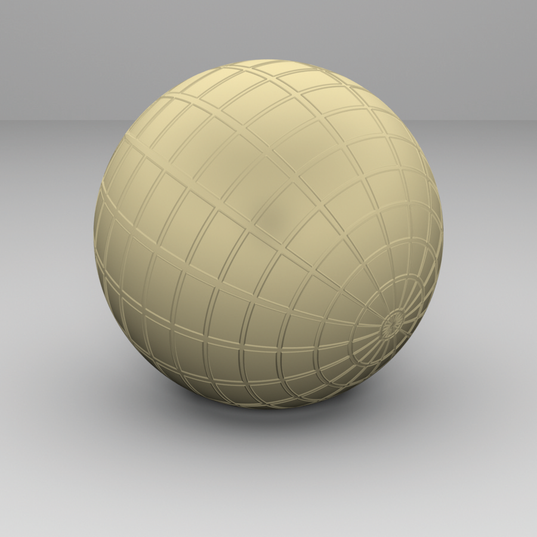
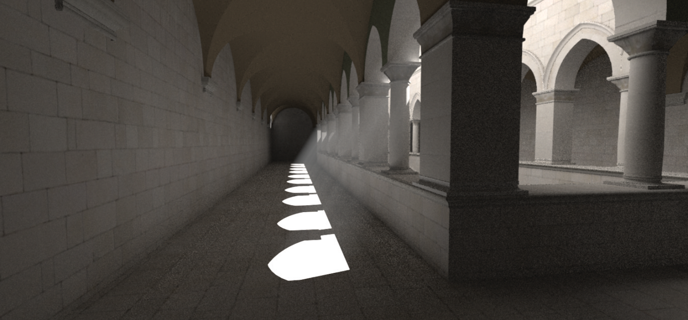
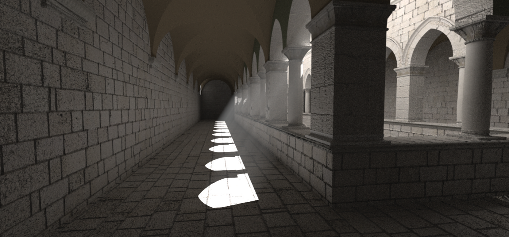
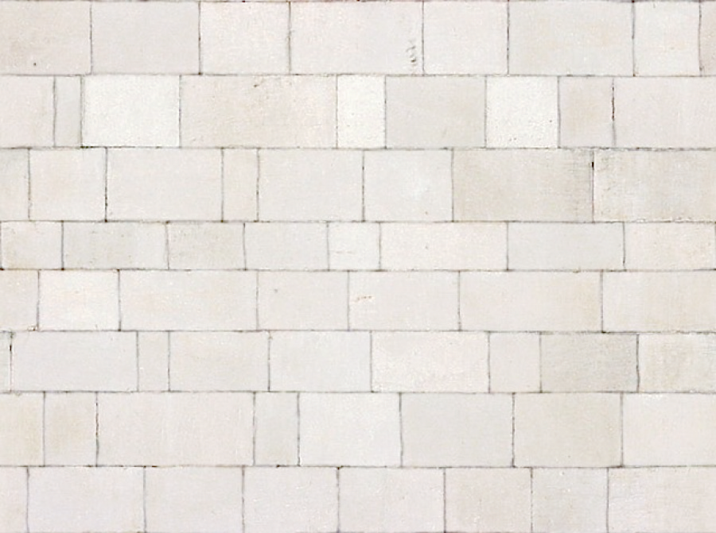

[toc]

# 9 Materials / 材质

The BRDFs and BTDFs introduced in the previous chapter address only part of the problem of describing how a surface scatters light. Although they describe how light is scattered at a particular point on a surface, the renderer needs to determine which BRDFs and BTDFs are present at a point on a surface and what their parameters are. In this chapter, we describe a procedural shading mechanism that addresses this issue.

The basic idea behind pbrt’s approach is that a surface shader is bound to each primitive in the scene. The surface shader is represented by an instance of the Material interface class, which has a method that takes a point on a surface and creates a BSDF object (and possibly a BSSRDF) that represents scattering at the point. The BSDF class holds a set of BxDFs whose contributions are summed to give the full scattering function. Materials, in turn, use instances of the Texture class (to be defined in the next chapter) to determine the material properties at particular points on surfaces. For example, an ImageTexture might be used to modulate the color of diffuse reflection across a surface. This is a somewhat different shading paradigm from the one that many rendering systems use; it is common practice to combine the function of the surface shader and the lighting integrator (see Chapter 14) into a single module and have the shader return the color of reflected light at the point. However, by separating these two components and having the Material return a BSDF, pbrt is better able to handle a variety of light transport algorithms.

上一章介绍的 BRDF 和 BTDF 仅解决了描述表面如何散射光的部分问题。尽管它们描述了光是如何在表面上的特定点散射的，但渲染器需要确定哪些 BRDF 和 BTDF 存在于表面上的某个点以及它们的参数是什么。在本章中，我们描述了解决这个问题的程序着色机制。

pbrt 方法背后的基本思想是表面着色器绑定到场景中的每个图元。表面着色器由 Material 接口类的一个实例表示，该实例具有一个方法，该方法获取表面上的一个点并创建一个表示该点散射的 BSDF 对象（可能还有一个 BSSRDF）。 BSDF 类包含一组 BxDF，它们的贡献被求和以给出完整的散射函数。反过来，材质使用 Texture 类的实例（将在下一章中定义）来确定表面上特定点的材质属性。例如，ImageTexture 可用于调制表面上漫反射的颜色。这是一种不同于许多渲染系统使用的着色范例。通常的做法是将表面着色器和光照积分器（参见第 14 章）的功能组合到一个模块中，并让着色器返回该点反射光的颜色。然而，通过分离这两个组件并让 Material 返回一个 BSDF，pbrt 能够更好地处理各种光传输算法。

## 9.1 BSDFs

The BSDF class represents a collection of BRDFs and BTDFs. Grouping them in this manner allows the rest of the system to work with composite BSDFs directly, rather than having to consider all of the components they may have been built from. Equally important, the BSDF class hides some of the details of shading normals from the rest of the system. Shading normals, either from per-vertex normals in triangle meshes or from bump mapping, can substantially improve the visual richness of rendered scenes, but because they are an ad hoc construct, they are tricky to incorporate into a physically based renderer. The issues that they introduce are handled in the BSDF implementation.

BSDF 类表示 BRDF 和 BTDF 的集合。以这种方式对它们进行分组允许系统的其余部分直接使用复合 BSDF，而不必考虑可能构建它们的所有组件。同样重要的是，BSDF 类对系统的其余部分隐藏了一些着色法线的细节。着色法线，无论是来自三角形网格中的每个顶点法线还是来自凹凸纹理，都可以显着提高渲染场景的视觉丰富度，但由于它们是一种特殊构造，因此很难将它们合并到基于物理的渲染器中。他们引入的问题在 BSDF 实现中得到处理。

```
<<BSDF Declarations>>+= 
class BSDF {
public:
    <<BSDF Public Methods>> 
    <<BSDF Public Data>> 
private:
    <<BSDF Private Methods>> 
    <<BSDF Private Data>> 
};
```

The BSDF constructor takes a SurfaceInteraction object that contains information about the differential geometry at the point on a surface as well as a parameter eta that gives the relative index of refraction over the boundary. For opaque surfaces, eta isn't used, and a value of one should be provided by the caller. (The default value of one for eta is for just this case.) The constructor computes an orthonormal coordinate system with the shading normal as one of the axes; this coordinate system will be useful for transforming directions to and from the BxDF coordinate system that is described in Figure 8.2. Throughout this section, we will use the convention that $\mathbf{n}_{\mathrm{s}}$ denotes the shading normal and $\mathbf{n}_{\mathrm{g}}$ the geometric normal (Figure 9.1).

BSDF 构造函数采用 SurfaceInteraction 对象，该对象包含有关表面上点处的微分几何信息以及给出边界上相对折射率的参数 eta。对于不透明表面，不使用 eta，调用者应提供值 1。 （eta 的默认值 1 仅适用于这种情况。）构造函数计算正交坐标系，其中着色法线作为轴之一；这个坐标系统对于图 8.2 中描述的 BxDF 坐标系统方向转换很有用。在本节中，我们约定使用 $\mathbf{n}_{\mathrm{s}}$ 表示着色法线和 $\mathbf{n}_{\mathrm{g}}$ 表示几何法线（图9.1)。


Figure 9.1: The geometric normal, $\mathbf{n}_{\mathrm{g}}$, defined by the surface geometry, and the shading normal, $\mathbf{n}_{\mathrm{s}}$, given by per-vertex normals and/or bump mapping, will generally define different hemispheres for integrating incident illumination to compute surface reflection. This inconsistency is important to handle carefully since it can otherwise lead to artifacts in images.

图 9.1：由表面几何定义的几何法线 $\mathbf{n}_{\mathrm{g}}$ 和着色法线 $\mathbf{n}_{\mathrm{s}}$ ，由每个顶点法线和/或凹凸映射给出，通常会定义不同的半球，用于积分入射照明以计算表面反射。小心处理这种不一致很重要，否则会导致图像中出现伪影。

```
<<BSDF Public Methods>>= 
BSDF(const SurfaceInteraction &si, Float eta = 1)
    : eta(eta), ns(si.shading.n), ng(si.n),
      ss(Normalize(si.shading.dpdu)), ts(Cross(ns, ss)) { }

<<BSDF Public Data>>= 
const Float eta;

<<BSDF Private Data>>= 
const Normal3f ns, ng;
const Vector3f ss, ts;
```

The BSDF implementation stores only a limited number of individual BxDF components. It could easily be extended to allocate more space if more components were given to it, although this isn’t necessary for any of the Material implementations in pbrt thus far, and the current limit of eight is plenty for almost all practical applications.

BSDF 实现仅存储有限数量的单个 BxDF 组件。如果给它更多的组件，它可以很容易地扩展以分配更多的空间，尽管到目前为止这对于 pbrt 中的任何 Material 实现都不是必需的，并且当前的 8 个限制对于几乎所有实际应用来说已经足够了。

```
<<BSDF Public Methods>>+=  
void Add(BxDF *b) {
    Assert(nBxDFs < MaxBxDFs);
    bxdfs[nBxDFs++] = b;
}

<<BSDF Private Data>>+=  
int nBxDFs = 0;
static constexpr int MaxBxDFs = 8;
BxDF *bxdfs[MaxBxDFs];
```

For other parts of the system that need additional information about the particular BRDFs and BTDFs that are present, a method returns the number of BxDFs stored by the BSDF that match a particular set of BxDFType flags.

对于系统需要特定 BRDF 和 BTDF 的附加信息的其他部分，一个方法返回由 BSDF 存储的与一组特定 BxDFType 标志匹配的 BxDF 的数量。

```
<<BSDF Public Methods>>+=  
int NumComponents(BxDFType flags = BSDF_ALL) const;
```

The BSDF also has methods that perform transformations to and from the local coordinate system used by BxDFs. Recall that, in this coordinate system, the surface normal is along the $z$ axis $(0,0,1)$, the primary tangent is $(1,0,0)$, and the secondary tangent is $(0,1,0)$. The transformation of directions into "shading space" simplifies many of the BxDF implementations in Chapter 8. Given three orthonormal vectors $\mathbf{s}, \mathbf{t}$, and $\mathbf{n}$ in world space, the matrix $\mathbf{M}$ that transforms vectors in world space to the local reflection space is

BSDF 还具有执行 与 BxDF 所在的局部坐标系之间转换的方法。回想一下，在这个坐标系中，表面法线沿着 $z$ 轴 $(0,0,1)$ ，主切线是 $(1,0,0)$ ，次切线是 $(0,1,0)$ 。将方向转换为“阴影空间”简化了第 8 章中的许多 BxDF 实现。给定世界空间中的三个正交向量 $\mathbf{s}$ 、 $\mathbf{t}$ 和 $\mathbf{n}$ ，将世界空间中的向量转换到局部反射空间的矩阵 $\mathbf{M}$ 如下

$$
\mathbf{M}=\left(\begin{array}{ccc}
\mathbf{s}_{x} & \mathbf{s}_{y} & \mathbf{s}_{z} \\
\mathbf{t}_{x} & \mathbf{t}_{y} & \mathbf{t}_{z} \\
\mathbf{n}_{x} & \mathbf{n}_{y} & \mathbf{n}_{z}
\end{array}\right)=\left(\begin{array}{c}
\mathbf{s} \\
\mathbf{t} \\
\mathbf{n}
\end{array}\right)
$$

To confirm this yourself, consider, for example, the value of $\mathbf{M}$ times the surface normal $\mathbf{n}$, $\mathbf{M n}=(\mathbf{s} \cdot \mathbf{n}, \mathbf{t} \cdot \mathbf{n}, \mathbf{n} \cdot \mathbf{n}) .$ Since $\mathbf{s}, \mathbf{t}$, and $\mathbf{n}$ are all orthonormal, the $x$ and $y$ components of $\mathbf{M n}$ are zero. Since $\mathbf{n}$ is normalized, $\mathbf{n} \cdot \mathbf{n}=1$. Thus, $\mathbf{M n}=(0,0,1)$, as expected.

In this case, we don't need to compute the inverse transpose of $\mathbf{M}$ to transform normals (recall the discussion of transforming normals in Section 2.8.3). Because $\mathbf{M}$ is an orthonormal matrix (its rows and columns are mutually orthogonal and unit length), its inverse is equal to its transpose, so it is its own inverse transpose already.

为了自己确认这一点，例如，考虑 $\mathbf{M}$ 乘以表面法线 $\mathbf{n}$ 的值， $\mathbf{M n}=(\mathbf{s} \cdot \mathbf {n}, \mathbf{t} \cdot \mathbf{n}, \mathbf{n} \cdot \mathbf{n})$ 。因为 $\mathbf{s}, \mathbf{t}$, 和 $\mathbf{n}$ 都是正交的， $\mathbf{M n}$ 的 $x$ 和 $y$ 分量为零。由于 $\mathbf{n}$ 是标准化的， $\mathbf{n} \cdot \mathbf{n}=1$ 。因此，如预期的那样， $\mathbf{M n}=(0,0,1)$ 。

在这种情况下，我们不需要计算 $\mathbf{M}$ 的逆转置来变换法线（回想第 2.8.3 节中关于变换法线的讨论）。因为 $\mathbf{M}$ 是一个正交矩阵（它的行和列相互正交且单位长度），它的逆等于它的转置，所以它已经是它自己的逆转置了。

```
<<BSDF Public Methods>>+=  
Vector3f WorldToLocal(const Vector3f &v) const {
    return Vector3f(Dot(v, ss), Dot(v, ts), Dot(v, ns));
}
```

The method that takes vectors back from local space to world space transposes $M$ to find its inverse before doing the appropriate dot products.

将向量从局部空间带回世界空间的方法在进行适当的点积之前转置 $M$ 以找到它的逆。

```
<<BSDF Public Methods>>+=  
Vector3f LocalToWorld(const Vector3f &v) const {
    return Vector3f(ss.x * v.x + ts.x * v.y + ns.x * v.z,
                    ss.y * v.x + ts.y * v.y + ns.y * v.z,
                    ss.z * v.x + ts.z * v.y + ns.z * v.z);
}
```

Shading normals can cause a variety of undesirable artifacts in practice (Figure 9.2). Figure $9.2($ a) shows a light leak: the geometric normal indicates that $\omega_{\mathrm{i}}$ and $\omega_{\mathrm{o}}$ lie on opposite sides of the surface, so if the surface is not transmissive, the light should have no contribution. However, if we directly evaluate the scattering equation, Equation (5.9), about the hemisphere centered around the shading normal, we will incorrectly incorporate the light from $\omega_{\mathrm{i}}$. This case demonstrates that $\mathbf{n}_{\mathrm{s}}$ can't just be used as a direct replacement for $\mathbf{n}_{\mathbf{g}}$ in rendering computations.

在实践中，着色法线会导致各种不良伪影（图 9.2）。图 $9.2($a) 显示了漏光：几何法线表明 $\omega_{\mathrm{i}}$ 和 $\omega_{\mathrm{o}}$ 位于表面的相对两侧，所以如果表面不透光，光应该没有贡献。然而，如果我们直接计算关于以阴影法线为中心的半球的散射方程，方程（5.9），我们将错误地合并来自 $\omega_{\mathrm{i}}$ 的光。这个案例表明 $\mathbf{n}_{\mathrm{s}}$ 不能直接用作渲染计算中 $\mathbf{n}_{\mathbf{g}}$ 的替代品。


Figure 9.2: The Two Types of Errors That Result from Using Shading Normals. (a) A light leak: the geometric normal indicates that the light is on the back side of the surface, but the shading normal indicates the light is visible (assuming a reflective and not transmissive surface). (b) A dark spot: the geometric normal indicates that the surface is illuminated, but the shading normal indicates that the viewer is behind the lit side of the surface.

图 9.2：使用着色法线导致的两种错误。 (a) 漏光：几何法线表示光在表面的背面，但阴影法线表示光是可见的（假设是反射表面而不是透射表面）。 (b) 暗点：几何法线表示表面被照亮，但阴影法线表示观察者位于表面被照亮的一侧后面。

Figure $9.2(\mathrm{~b})$ shows a similar tricky situation: the shading normal indicates that no light should be reflected to the viewer, since it is not in the same hemisphere as the illumination, while the geometric normal indicates that they are in the same hemisphere. Direct use of $\mathbf{n}_{\mathbf{s}}$ would cause ugly black spots on the surface where this situation happens.

Fortunately, there is an elegant solution to these problems. When evaluating the BSDF, we can use the geometric normal to decide if we should be evaluating reflection or transmission: if $\omega_{\mathrm{i}}$ and $\omega_{\mathrm{o}}$ lie in the same hemisphere with respect to $\mathbf{n}_{\mathrm{g}}$, we evaluate the BRDFs, and otherwise we evaluate the BTDFs. In evaluating the scattering equation, however, the dot product of the normal and the incident direction is still taken with the shading normal rather than the geometric normal.

Now it should be clear why pbrt requires BxDFs to evaluate their values without regard to whether $\omega_{i}$ and $\omega_{o}$ are in the same or different hemispheres. This convention means that light leaks are avoided, since we will only evaluate the BTDFs for the situation in Figure $9.2(\mathrm{a})$, giving no reflection for a purely reflective surface. Similarly, black spots are avoided since we will evaluate the BRDFs for the situation in Figure $9.2(\mathrm{~b})$, even though the shading normal would suggest that the directions are in different hemispheres.

Given these conventions, the method that evaluates the BSDF for a given pair of directions follows directly. It starts by transforming the world space direction vectors to local BSDF space and then determines whether it should use the BRDFs or the BTDFs. It then loops over the appropriate set and evaluates the sum of their contributions.

图 $9.2(\mathrm{~b})$ 显示了类似的棘手情况：着色法线表示不应将光反射到观察者，因为它与照明不在同一个半球，而几何法线表示它们都在同一个半球。直接使用 $\mathbf{n}_{\mathbf{s}}$ 会在发生这种情况的表面上产生难看的黑点。

幸运的是，这些问题有一个优雅的解决方案。在计算 BSDF 时，我们可以使用几何法线来决定我们应该计算反射还是透射：如果 $\omega_{\mathrm{i}}$ 和 $\omega_{\mathrm{o}}$ 位于同一个对于 $\mathbf{n}_{\mathrm{g}}$ ，我们计算 BRDF，否则我们计算 BTDF。然而，在计算散射方程时，法线和入射方向的点积仍然采用着色法线而不是几何法线。

现在应该清楚为什么 pbrt 要求 BxDF 计算它们的值，而不考虑 $\omega_{i}$ 和 $\omega_{o}$ 是否在相同或不同的半球。这种约定意味着避免了漏光，因为我们将仅针对图 $9.2(\mathrm{a})$ 中的情况计算 BTDF，对于纯反射表面没有反射。类似地，避免了黑点，因为我们将针对图 $9.2(\mathrm{~b})$ 中的情况计算 BRDF，即使着色法线表明方向位于不同的半球。

鉴于这些约定，直接遵循为给定方向对计算 BSDF 的方法。它首先将世界空间方向向量转换为局部 BSDF 空间，然后确定是否应该使用 BRDF 或 BTDF。然后它遍历适当的集合并计算它们的贡献之和。

```
<<BSDF Method Definitions>>= 
Spectrum BSDF::f(const Vector3f &woW, const Vector3f &wiW, 
                 BxDFType flags) const {
    Vector3f wi = WorldToLocal(wiW), wo = WorldToLocal(woW);
    bool reflect = Dot(wiW, ng) * Dot(woW, ng) > 0;
    Spectrum f(0.f);
    for (int i = 0; i < nBxDFs; ++i)
        if (bxdfs[i]->MatchesFlags(flags) &&
            ((reflect && (bxdfs[i]->type & BSDF_REFLECTION)) ||
            (!reflect && (bxdfs[i]->type & BSDF_TRANSMISSION))))
            f += bxdfs[i]->f(wo, wi);
    return f;
}
```

pbrt also provides BSDF methods that return the BSDF’s reflectances. (Recall the definition of reflectance in Section 8.1.1.) The two corresponding methods just loop over the BxDFs and sum the values returned by their BxDF::rho() methods; their straightforward implementations aren’t included here. These methods take arrays of samples for BxDFs for use in Monte Carlo sampling algorithms if needed (recall the BxDF::rho() interface defined in Section 8.1.1, which takes such samples as well.)

pbrt 还提供了返回 BSDF 反射率的 BSDF 方法。 （回忆第 8.1.1 节中反射率的定义。）两个对应的方法只是循环 BxDF 并将它们的 BxDF::rho() 方法返回的值相加；他们的简单实现不包括在这里。如果需要，这些方法为 BxDF 获取样本数组，以用于 Monte Carlo 采样算法（回想一下第 8.1.1 节中定义的 BxDF::rho() 接口，它也获取此类样本。）

```
<<BSDF Public Methods>>+=  
Spectrum rho(int nSamples, const Point2f *samples1,
             const Point2f *samples2, BxDFType flags = BSDF_ALL) const;
Spectrum rho(const Vector3f &wo, int nSamples, const Point2f *samples,
             BxDFType flags = BSDF_ALL) const;
```

### 9.1.1 BSDF Memory Management / BSDF 内存管理

For each ray that intersects geometry in the scene, one or more BSDF objects will be created by the Integrator in the process of computing the radiance carried along the ray. (Integrators that account for multiple interreflections of light will generally create a number of BSDFs along the way.) Each of these BSDFs in turn has a number of BxDFs stored inside it, as created by the Materials at the intersection points.

A naïve implementation would use new and delete to dynamically allocate storage for both the BSDF as well as each of the BxDFs that it holds. Unfortunately, such an approach would be unacceptably inefficient—too much time would be spent in the dynamic memory management routines for a series of small memory allocations. Instead, the implementation here uses a specialized allocation scheme based on the MemoryArena class described in Section A.4.3. A MemoryArena is passed into methods that allocate memory for BSDFs. For example, the SamplerIntegrator::Render() method creates a MemoryArena for each image tile and passes it to the integrators, which in turn pass it to the Material.

For the convenience of code that allocates BSDFs and BxDFs (e.g., the Materials in this chapter), there is a macro that hides some of the messiness of using the memory arena. Instead of using the new operator to allocate those objects like this:

对于场景中与几何体相交的每条射线，积分器将在计算沿射线携带的辐射度的过程中创建一个或多个 BSDF 对象。 （考虑到光的多次相互反射的积分器通常会在此过程中创建许多 BSDF。）这些 BSDF 中的每一个又存储了许多 BxDF，这些 BxDF 由交点处的材质创建。

一个简单的实现会使用 new 和 delete 为 BSDF 以及它所拥有的每个 BxDF 动态分配存储空间。不幸的是，这种方法的效率低得令人无法接受——在动态内存管理程序中会花费太多时间来分配一系列小内存。相反，这里的实现使用了一种基于第 A.4.3 节中描述的 MemoryArena 类的专用分配方案。 MemoryArena 被传递到为 BSDF 分配内存的方法中。例如，SamplerIntegrator::Render() 方法为每个图像块创建一个 MemoryArena 并将其传递给积分器，积分器又将其传递给材质。

为了方便分配 BSDF 和 BxDF 的代码（例如本章中的材质），有一个宏隐藏了使用内存的一些混乱。而不是使用 new 运算符来分配这些对象，如下所示：

```
    BSDF *b = new BSDF;
    BxDF *lam = new LambertianReflection(Spectrum(0.5f));
```

code should instead be written with the ARENA_ALLOC() macro, like this:

代码应改为使用 ARENA_ALLOC() 宏编写，如下所示：

```
    BSDF *b = ARENA_ALLOC(arena, BSDF);
    BxDF *lam = ARENA_ALLOC(arena, LambertianReflection)(Spectrum(0.5f));
```

where arena is a MemoryArena.

The ARENA_ALLOC() macro uses the placement operator new to run the constructor for the object at the returned memory location.

其中 arena 是一个 MemoryArena。

ARENA_ALLOC() 宏使用放置运算符 new 在返回的内存位置运行对象的构造函数。

```
<<Memory Declarations>>= 
#define ARENA_ALLOC(arena, Type) new (arena.Alloc(sizeof(Type))) Type
```

The BSDF destructor is a private method in order to ensure that it isn’t inadvertently called (e.g., due to an attempt to delete a BSDF). Making the destructor private ensures a compile time error if it is called. Trying to delete memory allocated by the MemoryArena could lead to errors or crashes, since a pointer to the middle of memory managed by the MemoryArena would be passed to the system’s dynamic memory freeing routine.

In turn, an implication of the allocation scheme here is that BSDF and BxDF destructors are never executed. This isn’t a problem for the ones currently implemented in the system.

BSDF 析构函数是一个私有方法，以确保它不会被无意调用（例如，由于尝试删除 BSDF）。将析构函数设为私有可确保在调用它时出现编译时错误。尝试删除 MemoryArena 分配的内存可能会导致错误或崩溃，因为指向 MemoryArena 管理的内存中间的指针将被传递给系统的动态内存释放程序。

反过来，这里分配方案的含义是 BSDF 和 BxDF 析构函数永远不会执行。对于当前在系统中实现的那些来说，这不是问题。

```
<<BSDF Private Methods>>= 
~BSDF() { }
```

## 9.2 Material Interface and Implementations / 材质接口和实现

The abstract Material class defines the interface that material implementations must provide. The Material class is defined in the files core/material.h and core/material.cpp.

抽象 Material 类定义了 Material 实现必须提供的接口。 Material 类在文件 core/material.h 和 core/material.cpp 中定义。

```
<<Material Declarations>>= 
class Material {
public:
    <<Material Interface>> 
};
```

A single method must be implemented by Materials: ComputeScatteringFunctions(). This method is given a SurfaceInteraction object that contains geometric properties at an intersection point on the surface of a shape. The method’s implementation is responsible for determining the reflective properties at the point and initializing the SurfaceInteraction::bsdf member variable with a corresponding BSDF class instance. If the material includes subsurface scattering, then the SurfaceInteraction::bssrdf member should be initialized as well. (It should otherwise be left unchanged from its default nullptr value.) The BSSRDF class that represents subsurface scattering functions is defined later, in Section 11.4, after the foundations of volumetric scattering have been introduced.

材质必须实现一个方法：ComputeScatteringFunctions()。该方法被赋予一个 SurfaceInteraction 对象，该对象包含形状表面上交点处的几何属性。该方法的实现负责确定该点的反射属性并使用相应的 BSDF 类实例初始化 SurfaceInteraction::bsdf 成员变量。如果材质包含次表面散射，则 SurfaceInteraction::bssrdf 成员也应该被初始化。 （否则它应该与其默认的 nullptr 值保持不变。）表示次表面散射函数的 BSSRDF 类稍后在第 11.4 节中定义，在介绍了体积散射的基础之后。

Three additional parameters are passed to this method:

* A MemoryArena, which should be used to allocate memory for BSDFs and BSSRDFs.
  
* The TransportMode parameter, which indicates whether the surface intersection was found along a path starting from the camera or one starting from a light source; this detail has implications for how BSDFs and BSSRDFs are evaluated—see Section 16.1.

* Finally, the allowMultipleLobes parameter indicates whether the material should use BxDFs that aggregate multiple types of scattering into a single BxDF when such BxDFs are available. (An example of such a BxDF is FresnelSpecular, which includes both specular reflection and transmission.) These BxDFs can improve the quality of final results when used with Monte Carlo light transport algorithms but can introduce noise in images when used with the DirectLightingIntegrator and WhittedIntegrator. Therefore, the Integrator is allowed to control whether such BxDFs are used via this parameter.

三个附加参数传递给此方法：

* 一个 MemoryArena，用于为 BSDF 和 BSSRDF 分配内存。
  
* TransportMode 参数，指示是否沿着从相机开始的路径或从光源开始的路径找到表面交叉点；这个细节对如何计算 BSDF 和 BSSRDF 有影响——参见第 16.1 节。

* 最后，allowMultipleLobes 参数指示材质是否应使用将多种类型的散射聚合到单个 BxDF 中的 BxDF（当此类 BxDF 可用时）。 （这种 BxDF 的一个例子是 FresnelSpecular，它包括镜面反射和透射。）这些 BxDF 在与 Monte Carlo 光传输算法一起使用时可以提高最终结果的质量，但在与 DirectLightingIntegrator 和 WhittedIntegrator 一起使用时会在图像中引入噪声。因此，允许积分器通过此参数控制是否使用此类 BxDF。

```
<<Material Interface>>= 
virtual void ComputeScatteringFunctions(SurfaceInteraction *si,
    MemoryArena &arena, TransportMode mode,
    bool allowMultipleLobes) const = 0;
```

Since the usual interface to the intersection point used by Integrators is through an instance of the SurfaceInteraction class, we will add a convenience method ComputeScatteringFunctions() to that class. Its implementation first calls the SurfaceInteraction’s ComputeDifferentials() method to compute information about the projected size of the surface area around the intersection on the image plane for use in texture antialiasing. Next, it forwards the request to the Primitive, which in turn will call the corresponding ComputeScatteringFunctions() method of its Material. (See, for example, the GeometricPrimitive::ComputeScatteringFunctions() implementation.)

由于 Integrators 使用的交点的常用接口是通过 SurfaceInteraction 类的实例，我们将向该类添加一个方便的方法 ComputeScatteringFunctions()。它的实现首先调用 SurfaceInteraction 的 ComputeDifferentials() 方法来计算有关图像平面上交叉点周围表面区域的投影大小的信息，以用于纹理反走样。接下来，它将请求转发给 Primitive，Primitive 又会调用其 Material 对应的 ComputeScatteringFunctions() 方法。 （例如，参见 GeometricPrimitive::ComputeScatteringFunctions() 实现。）

```
<<SurfaceInteraction Method Definitions>>+=  
void SurfaceInteraction::ComputeScatteringFunctions(
        const RayDifferential &ray, MemoryArena &arena,
        bool allowMultipleLobes, TransportMode mode) {
    ComputeDifferentials(ray);
    primitive->ComputeScatteringFunctions(this, arena, mode,
        allowMultipleLobes);
}
```

### 9.2.1 Matte Material / 哑光材质

The MatteMaterial material is defined in materials/matte.h and materials/matte.cpp. It is the simplest material in pbrt and describes a purely diffuse surface.

MatteMaterial 材质在materials/matte.h 和materials/matte.cpp 中定义。它是 pbrt 中最简单的材质，描述了一个纯粹的漫反射表面。

```
<<MatteMaterial Declarations>>= 
class MatteMaterial : public Material {
public:
    <<MatteMaterial Public Methods>> 
private:
    <<MatteMaterial Private Data>> 
};
```

This material is parameterized by a spectral diffuse reflection value, Kd, and a scalar roughness value, sigma. If sigma has the value zero at the point on a surface, MatteMaterial creates a LambertianReflection BRDF; otherwise, the OrenNayar model is used. Like all of the other Material implementations in this chapter, it also takes an optional scalar texture that defines an offset function over the surface. If its value is not nullptr, this texture is used to compute a shading normal at each point based on the function it defines. (Section 9.3 discusses the implementation of this computation.) Figure 8.14 in the previous chapter shows the MatteMaterial material with the dragon model.

该材质由光谱漫反射值 Kd 和标量粗糙度值 sigma 参数化。如果 sigma 在曲面上的点处为零，则 MatteMaterial 创建一个 LambertianReflection BRDF；否则，使用 OrenNayar 模型。与本章中的所有其他材质实现一样，它也采用一个可选的标量纹理，该纹理定义了表面上的偏移函数。如果其值不是 nullptr，则此纹理用于根据其定义的函数计算每个点的着色法线。 （第 9.3 节讨论了这种计算的实现。）上一章中的图 8.14 显示了带有龙模型的 MatteMaterial 材质。

```
<<MatteMaterial Public Methods>>= 
MatteMaterial(const std::shared_ptr<Texture<Spectrum>> &Kd,
              const std::shared_ptr<Texture<Float>> &sigma,
              const std::shared_ptr<Texture<Float>> &bumpMap)
    : Kd(Kd), sigma(sigma), bumpMap(bumpMap) { }
<<MatteMaterial Private Data>>= 
std::shared_ptr<Texture<Spectrum>> Kd;
std::shared_ptr<Texture<Float>> sigma, bumpMap;
```

The ComputeScatteringFunctions() method puts the pieces together, determining the bump map’s effect on the shading geometry, evaluating the textures, and allocating and returning the appropriate BSDF.

ComputeScatteringFunctions() 方法将各个部分组合在一起，确定凹凸纹理对着色几何图形的影响，计算纹理，并分配和返回适当的 BSDF。

```
<<MatteMaterial Method Definitions>>= 
void MatteMaterial::ComputeScatteringFunctions(SurfaceInteraction *si,
        MemoryArena &arena, TransportMode mode,
        bool allowMultipleLobes) const {
    <<Perform bump mapping with bumpMap, if present>> 
    <<Evaluate textures for MatteMaterial material and allocate BRDF>> 
}
```

If a bump map was provided to the MatteMaterial constructor, the Material::Bump() method is called to calculate the shading normal at the point. This method will be defined in the next section.

如果为 MatteMaterial 构造函数提供了凹凸纹理，则调用 Material::Bump() 方法来计算该点的着色法线。该方法将在下一节中定义。

```
<<Perform bump mapping with bumpMap, if present>>= 
if (bumpMap)
    Bump(bumpMap, si);
```

Next, the Textures that give the values of the diffuse reflection spectrum and the roughness are evaluated; texture implementations may return constant values, look up values from image maps, or do complex procedural shading calculations to compute these values (the texture evaluation process is the subject of Chapter 10). Given these values, all that needs to be done is to allocate a BSDF and then allocate the appropriate type of Lambertian BRDF and provide it to the BSDF. Because Textures may return negative values or values otherwise outside of the expected range, these values are clamped to valid ranges before they are passed to the BRDF constructor.

接下来，计算给出漫反射光谱和粗糙度值的纹理；纹理实现可以返回常量值，从图像映射中查找值，或者进行复杂的程序着色计算来计算这些值（纹理计算过程是第 10 章的主题）。给定这些值，需要做的就是分配一个 BSDF，然后分配适当类型的 Lambertian BRDF 并将其提供给 BSDF。因为纹理可能会返回负值或超出预期范围的值，所以这些值在传递给 BRDF 构造函数之前会被限制在有效范围内。

```
<<Evaluate textures for MatteMaterial material and allocate BRDF>>= 
si->bsdf = ARENA_ALLOC(arena, BSDF)(*si);
Spectrum r = Kd->Evaluate(*si).Clamp();
Float sig = Clamp(sigma->Evaluate(*si), 0, 90);
if (!r.IsBlack()) {
    if (sig == 0)
        si->bsdf->Add(ARENA_ALLOC(arena, LambertianReflection)(r));
    else
        si->bsdf->Add(ARENA_ALLOC(arena, OrenNayar)(r, sig));
}
```

### 9.2.2 Plastic Material / 塑料材质

Plastic can be modeled as a mixture of a diffuse and glossy scattering function with parameters controlling the particular colors and specular highlight size. The parameters to PlasticMaterial are two reflectivities, Kd and Ks, which respectively control the amounts of diffuse reflection and glossy specular reflection.

Next is a roughness parameter that determines the size of the specular highlight. It can be specified in two ways. First, if the remapRoughness parameter is true, then the given roughness should vary from zero to one, where the higher the roughness value, the larger the highlight. (This variant is intended to be fairly user-friendly.) Alternatively, if the parameter is false, then the roughness is used to directly initialize the microfacet distribution’s $\alpha$ parameter (recall Section 8.4.2).

Figure 9.3 shows a plastic dragon. PlasticMaterial is defined in materials/plastic.h and materials/plastic.cpp.

塑料可以建模为漫反射和光泽散射函数的混合，参数控制特定颜色和镜面高光大小。 PlasticMaterial 的参数是两个反射率，Kd 和 Ks，分别控制漫反射和光泽镜面反射的量。

接下来是一个粗糙度参数，它决定了镜面高光的大小。可以通过两种方式指定。首先，如果 remapRoughness 参数为真，那么给定的粗糙度应该从零变化到一，其中粗糙度值越高，高光越大。 （此变体旨在对用户非常友好。）或者，如果参数为 false，则使用粗糙度直接初始化微面分布的 $\alpha$ 参数（回忆第 8.4.2 节）。

图 9.3 显示了一条塑料龙。 PlasticMaterial 在materials/plastic.h 和materials/plastic.cpp 中定义。


Figure 9.3: Dragon Rendered with a Plastic Material. Note the combination of diffuse and glossy specular reflection. (Model courtesy of Christian Schüller.)

图 9.3：用塑料材质渲染的龙。注意漫反射和光泽镜面反射的组合。 （模型由 Christian Schüller 提供。）

```
<<PlasticMaterial Declarations>>= 
class PlasticMaterial : public Material {
public:
    <<PlasticMaterial Public Methods>> 
private:
    <<PlasticMaterial Private Data>> 
};
<<PlasticMaterial Public Methods>>= 
PlasticMaterial(const std::shared_ptr<Texture<Spectrum>> &Kd,
                const std::shared_ptr<Texture<Spectrum>> &Ks,
                const std::shared_ptr<Texture<Float>> &roughness,
                const std::shared_ptr<Texture<Float>> &bumpMap,
                bool remapRoughness)
    : Kd(Kd), Ks(Ks), roughness(roughness), bumpMap(bumpMap),
      remapRoughness(remapRoughness) { }
<<PlasticMaterial Private Data>>= 
std::shared_ptr<Texture<Spectrum>> Kd, Ks;
std::shared_ptr<Texture<Float>> roughness, bumpMap;
const bool remapRoughness;
```

The PlasticMaterial::ComputeScatteringFunctions() method follows the same basic structure as MatteMaterial::ComputeScatteringFunctions(): it calls the bump-mapping function, evaluates textures, and then allocates BxDFs to use to initialize the BSDF.

PlasticMaterial::ComputeScatteringFunctions() 方法遵循与 MatteMaterial::ComputeScatteringFunctions() 相同的基本结构：它调用凹凸映射函数，计算纹理，然后分配 BxDF 用于初始化 BSDF。

```
<<PlasticMaterial Method Definitions>>= 
void PlasticMaterial::ComputeScatteringFunctions(
        SurfaceInteraction *si, MemoryArena &arena, TransportMode mode,
        bool allowMultipleLobes) const {
    <<Perform bump mapping with bumpMap, if present>> 
    si->bsdf = ARENA_ALLOC(arena, BSDF)(*si);
    <<Initialize diffuse component of plastic material>> 
    <<Initialize specular component of plastic material>> 
}
```

In Material implementations, it’s worthwhile to skip creation of BxDF components that do not contribute to the scattering at a point. Doing so saves the renderer unnecessary work later when it’s computing reflected radiance at the point. Therefore, the Lambertian component is only created if kd is non-zero.

在 Material 实现中，跳过创建对某个点的散射没有贡献的 BxDF 组件是值得的。这样做可以节省渲染器稍后在计算该点的反射辐射时不必要的工作。因此，仅当 kd 不为零时才会创建Lambertian分量。

```
<<Initialize diffuse component of plastic material>>= 
Spectrum kd = Kd->Evaluate(*si).Clamp();
if (!kd.IsBlack())
    si->bsdf->Add(ARENA_ALLOC(arena, LambertianReflection)(kd));
```

As with the diffuse component, the glossy specular component is skipped if it’s not going to make a contribution to the overall BSDF.

与漫反射组件一样，如果光泽镜面反射组件不会对整体 BSDF 做出贡献，则会跳过它。

```
<<Initialize specular component of plastic material>>= 
Spectrum ks = Ks->Evaluate(*si).Clamp();
if (!ks.IsBlack()) {
    Fresnel *fresnel = ARENA_ALLOC(arena, FresnelDielectric)(1.f, 1.5f);
    <<Create microfacet distribution distrib for plastic material>> 
    BxDF *spec =
        ARENA_ALLOC(arena, MicrofacetReflection)(ks, distrib, fresnel);
    si->bsdf->Add(spec);
}

<<Create microfacet distribution distrib for plastic material>>= 
Float rough = roughness->Evaluate(*si);
if (remapRoughness)
    rough = TrowbridgeReitzDistribution::RoughnessToAlpha(rough);
MicrofacetDistribution *distrib =
    ARENA_ALLOC(arena, TrowbridgeReitzDistribution)(rough, rough);
```

### 9.2.3 Mix Material / 混合材质

It’s useful to be able to combine two Materials with varying weights. The MixMaterial takes two other Materials and a Spectrum-valued texture and uses the Spectrum returned by the texture to blend between the two materials at the point being shaded. It is defined in the files materials/mixmat.h and materials/mixmat.cpp.

能够将两种具有不同权重的材质组合在一起是很有用的。 MixMaterial 采用其他两种材质和一个具有 Spectrum 值的纹理，并使用纹理返回的 Spectrum 在着色点处混合两种材质。它在文件materials/mixmat.h 和materials/mixmat.cpp 中定义。

```
<<MixMaterial Declarations>>= 
class MixMaterial : public Material {
public:
    <<MixMaterial Public Methods>> 
private:
    <<MixMaterial Private Data>> 
};

<<MixMaterial Public Methods>>= 
MixMaterial(const std::shared_ptr<Material> &m1,
            const std::shared_ptr<Material> &m2,
            const std::shared_ptr<Texture<Spectrum>> &scale)
    : m1(m1), m2(m2), scale(scale) { }

<<MixMaterial Private Data>>= 
std::shared_ptr<Material> m1, m2;
std::shared_ptr<Texture<Spectrum>> scale;

<<MixMaterial Method Definitions>>= 
void MixMaterial::ComputeScatteringFunctions(SurfaceInteraction *si,
        MemoryArena &arena, TransportMode mode,
        bool allowMultipleLobes) const {
    <<Compute weights and original BxDFs for mix material>> 
    <<Initialize si->bsdf with weighted mixture of BxDFs>> 
}
```

MixMaterial::ComputeScatteringFunctions() starts with its two constituent Materials initializing their respective BSDFs.

MixMaterial::ComputeScatteringFunctions() 从它的两个组成材质初始化它们各自的 BSDF 开始。

```
<<Compute weights and original BxDFs for mix material>>= 
Spectrum s1 = scale->Evaluate(*si).Clamp();
Spectrum s2 = (Spectrum(1.f) - s1).Clamp();
SurfaceInteraction si2 = *si;
m1->ComputeScatteringFunctions(si, arena, mode, allowMultipleLobes);
m2->ComputeScatteringFunctions(&si2, arena, mode, allowMultipleLobes);
```

It then scales BxDFs in the BSDF from the first material, m1, using the ScaledBxDF adapter class, and then scales the BxDFs from the second BSDF, adding all of these BxDF components to si->bsdf.

It may appear that there’s a lurking memory leak in this code, in that the BxDF *s in si->bxdfs are clobbered by newly allocated ScaledBxDFs. However, recall that those BxDFs, like the new ones here, were allocated through a MemoryArena and thus their memory will be freed when the MemoryArena frees its entire block of memory.

然后，它使用 ScaledBxDF 适配器类从第一个材质 m1 缩放 BSDF 中的 BxDF，然后从第二个 BSDF 缩放 BxDF，将所有这些 BxDF 组件添加到 si->bsdf。

在这段代码中似乎存在潜在的内存泄漏，因为 si->bxdfs 中的 BxDF *s 被新分配的 ScaledBxDFs 破坏了。然而，回想一下那些 BxDF，就像这里的新的一样，是通过 MemoryArena 分配的，因此当 MemoryArena 释放其整个内存块时，它们的内存将被释放。

```
<<Initialize si->bsdf with weighted mixture of BxDFs>>= 
int n1 = si->bsdf->NumComponents(), n2 = si2.bsdf->NumComponents();
for (int i = 0; i < n1; ++i)
    si->bsdf->bxdfs[i] =
        ARENA_ALLOC(arena, ScaledBxDF)(si->bsdf->bxdfs[i], s1);
for (int i = 0; i < n2; ++i)
    si->bsdf->Add(ARENA_ALLOC(arena, ScaledBxDF)(si2.bsdf->bxdfs[i], s2));
```

The implementation of MixMaterial::ComputeScatteringFunctions() needs direct access to the bxdfs member variables of the BSDF class. Because this is the only class that needs this access, we’ve just made MixMaterial a friend of BSDF rather than adding a number of accessor and setting methods.

MixMaterial::ComputeScatteringFunctions() 的实现需要直接访问 BSDF 类的 bxdfs 成员变量。因为这是唯一需要此访问权限的类，所以我们只是让 MixMaterial 成为 BSDF 的朋友，而不是添加许多访问器和设置方法。

```
<<BSDF Private Data>>+= 
friend class MixMaterial;
```

### 9.2.4 Fourier Material / 傅立叶材质

The FourierMaterial class supports measured or synthetic BSDF data that has been tabulated into the directional basis that was introduced in Section 8.6. It is defined in the files materials/fourier.h and materials/fourier.cpp.

FourierMaterial 类支持测量的或合成的 BSDF 数据，这些数据已列在第 8.6 节中介绍的方向基础中。它在文件materials/fourier.h 和materials/fourier.cpp 中定义。

```
<<FourierMaterial Declarations>>= 
class FourierMaterial : public Material {
public:
    <<FourierMaterial Public Methods>> 
private:
    <<FourierMaterial Private Data>> 
};
```

The constructor is responsible for reading the BSDF from a file and initializing the FourierBSDFTable.

构造函数负责从文件中读取 BSDF 并初始化 FourierBSDFTable。

```
<<FourierMaterial Method Definitions>>= 
FourierMaterial::FourierMaterial(const std::string &filename,
        const std::shared_ptr<Texture<Float>> &bumpMap)
    : bumpMap(bumpMap) {
    FourierBSDFTable::Read(filename, &bsdfTable);
}

<<FourierMaterial Private Data>>= 
FourierBSDFTable bsdfTable;
std::shared_ptr<Texture<Float>> bumpMap;
```

Once the data is in memory, the ComputeScatteringFunctions() method’s task is straightforward. After the usual bump-mapping computation, it just has to allocate a FourierBSDF and provide it access to the data in the table.

一旦数据进入内存，ComputeScatteringFunctions() 方法的任务就很简单了。在通常的凹凸映射计算之后，它只需要分配一个 FourierBSDF 并为其提供对表中数据的访问。

```
<<FourierMaterial Method Definitions>>+= 
void FourierMaterial::ComputeScatteringFunctions(SurfaceInteraction *si,
        MemoryArena &arena, TransportMode mode,
        bool allowMultipleLobes) const {
    <<Perform bump mapping with bumpMap, if present>> 
    si->bsdf = ARENA_ALLOC(arena, BSDF)(*si);
    si->bsdf->Add(ARENA_ALLOC(arena, FourierBSDF)(bsdfTable, mode));
}
```

### 9.2.5 Additional Materials / 附加材质

Beyond these materials, there are eight more Material implementations available in pbrt, all in the materials/ directory. We will not show all of their implementations here, since they are all just variations on the basic themes introduced in the material implementations above. All take Textures that define scattering parameters, these textures are evaluated in the materials’ respective ComputeScatteringFunctions() methods, and appropriate BxDFs are created and returned in a BSDF. See the documentation on pbrt’s file format for a summary of the parameters that these materials take.

除了这些材质之外，pbrt 中还有八种材质实现，都在materials/目录中。我们不会在这里展示它们的所有实现，因为它们都只是上面材质实现中介绍的基本主题的变体。所有这些都采用定义散射参数的纹理，这些纹理在材质各自的 ComputeScatteringFunctions() 方法中进行计算，并在 BSDF 中创建和返回适当的 BxDF。有关这些材质采用的参数的摘要，请参阅 pbrt 文件格式的文档。

These materials include:

* GlassMaterial: Perfect or glossy specular reflection and transmission, weighted by Fresnel terms for accurate angular-dependent variation.

* MetalMaterial: Metal, based on the Fresnel equations for conductors and the Torrance–Sparrow model. Unlike plastic, metal includes no diffuse component. See the files in the directory scenes/spds/metals/ for measured spectral data for the indices of refraction $\eta$ and absorption coefficients $k$ for a variety of metals.

* MirrorMaterial: A simple mirror, modeled with perfect specular reflection.

* SubstrateMaterial: A layered model that varies between glossy specular and diffuse reflection depending on the viewing angle (based on the FresnelBlend BRDF).

* SubsurfaceMaterial and KdSubsurfaceMaterial: Materials that return BSSRDFs that describe materials that exhibit subsurface scattering.

* TranslucentMaterial: A material that describes diffuse and glossy specular reflection and transmission through the surface.

* UberMaterial: A “kitchen sink” material representing the union of many of the preceding materials. This is a highly parameterized material that is particularly useful when converting scenes from other file formats into pbrt’s.

这些材质包括：

* GlassMaterial：完美或有光泽的镜面反射和透射，由菲涅耳项加权以获得准确的角度相关变化。

* MetalMaterial：金属，基于导体的菲涅耳方程和 Torrance-Sparrow 模型。与塑料不同，金属不包括漫射成分。有关各种金属的折射率 $\eta$ 和吸收系数 $k$ 的测量光谱数据，请参见目录 scene/spds/metals/ 中的文件。

* MirrorMaterial：一个简单的镜子，以完美的镜面反射为模型。

* SubstrateMaterial：分层模型，根据视角在光泽镜面反射和漫反射之间变化（基于 FresnelBlend BRDF）。

* SubsurfaceMaterial 和 KdSubsurfaceMaterial：返回 BSSRDF 的材质，描述表现出次表面散射的材质。

* TranslucentMaterial：一种描述漫反射和光泽镜面反射和透过表面的材质。

* UberMaterial：一种“厨房水槽”材质，代表了许多前述材质的结合。这是一种高度参数化的材质，在将场景从其他文件格式转换为 pbrt 时特别有用。

Figure 8.10 in the previous chapter shows the dragon model rendered with GlassMaterial, and Figure 9.4 shows it with the MetalMaterial.

上一章图 8.10 显示了使用 GlassMaterial 渲染的龙模型，图 9.4 显示了使用 MetalMaterial 渲染的龙模型。


Figure 9.4: Dragon rendered with the MetalMaterial, based on realistic measured gold scattering data. (Model courtesy of Christian Schüller.)

图 9.4：使用 MetalMaterial 渲染的 Dragon，基于真实测量的黄金散射数据。 （模型由 Christian Schüller 提供。）

Figure 9.5 demonstrates the KdSubsurfaceMaterial.

图 9.5 演示了 KdSubsurfaceMaterial。


Figure 9.5: Head model rendered with the KdSubsurfaceMaterial, which models subsurface scattering (in conjunction with the subsurface scattering light transport techniques from Section 15.5). (Model courtesy of Infinite Realities, Inc.)

图 9.5：使用 KdSubsurfaceMaterial 渲染的头部模型，它模拟次表面散射（结合第 15.5 节中的次表面散射光传输技术）。 （模型由 Infinite Realities, Inc. 提供）

## 9.3 Bump Mapping / 凹凸纹理

All of the Materials defined in the previous section take an optional floating-point texture that defines a displacement at each point on the surface: each point $p$ has a displaced point $p^{\prime}$ associated with it, defined by $\mathrm{p}^{\prime}=\mathrm{p}+d(\mathrm{p}) \mathbf{n}(\mathrm{p})$, where $d(\mathrm{p})$ is the offset returned by the displacement texture at $\mathrm{p}$ and $\mathbf{n}(\mathrm{p})$ is the surface normal at $\mathrm{p}$ (Figure 9.6). We would like to use this texture to compute shading normals so that the surface appears as if it actually had been offset by the displacement function, without modifying its geometry. This process is called bump mapping. For relatively small displacement functions, the visual effect of bump mapping can be quite convincing. This idea and the specific technique to compute these shading normals in a way that gives a plausible appearance of the actual displaced surface were developed by Blinn (1978).

上一节中定义的所有材质都采用一个可选的浮点纹理，该纹理定义了表面上每个点的位移：每个点 $p$ 都有一个与之关联的位移点 $p^{\prime}$ ，定义为 $\mathrm{p}^{\prime}=\mathrm{p}+d(\mathrm{p}) \mathbf{n}(\mathrm{p})$ ，其中 $d(\mathrm{p}) $ 是置换纹理在 $\mathrm{p}$ 处返回的偏移量， $\mathbf{n}(\mathrm{p})$ 是 $\mathrm{p}$ 处的表面法线（图 9.6）。我们想使用这个纹理来计算着色法线，这样表面就好像它实际上已经被置换函数偏移了一样，而不修改它的几何形状。这个过程称为凹凸映射。对于相对较小的位移函数，凹凸纹理的视觉效果可以相当有说服力。 Blinn (1978) 提出了这个想法和计算这些着色法线的特定技术，以给出实际置换表面的合理外观。


Figure 9.6: A displacement function associated with a material defines a new surface based on the old one, offset by the displacement amount along the normal at each point. pbrt doesn’t compute a geometric representation of this displaced surface, but instead uses it to compute shading normals for bump mapping.

图 9.6：与材质相关的位移函数在旧曲面的基础上定义了一个新曲面，偏移量为沿法线在每个点的位移量。 pbrt 不计算这个置换表面的几何表示，而是使用它来计算凹凸纹理的着色法线。

Figure 9.7 shows the effect of applying bump mapping defined by an image map of a grid of lines to a sphere.

图 9.7 显示了将由线网格的图像映射定义的凹凸映射应用于球体的效果。



Figure 9.7: Using bump mapping to compute the shading normals for a sphere gives it the appearance of having much more geometric detail than is actually present.

图 9.7：使用凹凸纹理计算球体的着色法线使其看起来比实际存在的几何细节多得多。

A more complex example is shown in Figure 9.8, which shows a scene rendered with and without bump mapping. There, the bump map gives the appearance of a substantial amount of detail in the walls and floors that isn’t actually present in the geometric model.

图 9.8 显示了一个更复杂的示例，它显示了使用和不使用凹凸纹理渲染的场景。在那里，凹凸纹理显示了墙壁和地板上的大量细节，而这些细节实际上并不存在于几何模型中。



Without bump mapping / 没有凹凸纹理



With bump mapping / 有凹凸纹理

Figure 9.8: The Sponza atrium model, rendered (1) without bump mapping and (2) with bump mapping. Bump mapping substantially increases the apparent geometric complexity of the model, without the increased rendering time and memory use that would result from a geometric representation with the equivalent amount of small-scale detail.

图 9.8：Sponza 中庭模型，渲染 (1) 没有凹凸纹理和 (2) 使用凹凸纹理。凹凸映射显着增加了模型的明显几何复杂性，而不会增加渲染时间和内存使用，与具有等量小尺度细节的几何表示效果等价。

Figure 9.9 shows one of the image maps used to define the bump function in Figure 9.8.

图 9.9 显示了用于定义图 9.8 中的凹凸函数的图像映射之一。



Figure 9.9: One of the image maps used as a bump map for the Sponza atrium rendering in Figure 9.8.

图 9.9：用作图 9.8 中 Sponza 中庭渲染的凹凸纹理的图像纹理之一。

The Material::Bump() method is a utility routine for use by Material implementations. It is responsible for computing the effect of bump mapping at the point being shaded given a particular displacement Texture. So that future Material implementations aren’t required to support bump mapping with this particular mechanism (or at all), we’ve placed this method outside of the hard-coded material evaluation pipeline and left it as a function that particular material implementations can call on their own.

The implementation of Material: : Bump ( ) is based on finding an approximation to the partial derivatives $\partial \mathrm{p} / \partial u$ and $\partial \mathrm{p} / \partial v$ of the displaced surface and using them in place of the surface's actual partial derivatives to compute the shading normal. (Recall that the surface normal is given by the cross product of these vectors, $\mathbf{n}=\partial \mathrm{p} / \partial u \times \partial \mathrm{p} / \partial v$.) Assume that the original surface is defined by a parametric function $p(u, v)$, and the bump offset function is a scalar function $d(u, v)$. Then the displaced surface is given by

Material::Bump() 方法是一个供 Material 实现使用的工具函数。它负责在给定特定置换纹理的情况下计算被着色点的凹凸纹理效果。因此，未来的材质实现不需要使用这种特定机制（或根本不需要）支持凹凸纹理，我们已将此方法置于硬编码材质计算管道之外，并将其保留为特定材质可以调用他们自己的函数实现。

Material: : Bump ( ) 的实现是基于找到位移表面的偏导数 $\partial \mathrm{p} / \partial u$ 和 $\partial \mathrm{p} / \partial v$ 的近似值并使用它们代替表面的实际偏导数来计算着色法线。 （回想一下，表面法线由这些向量的叉积给出， $\mathbf{n}=\partial \mathrm{p} / \partial u \times \partial \mathrm{p} / \partial v$ 。）假设原始曲面由参数函数 $p(u, v)$ 定义，凹凸偏移函数是标量函数 $d(u, v)$ 。然后位移表面由下式给出

$$
p^{\prime}(u, v)=p(u, v)+d(u, v) \mathbf{n}(u, v)
$$

where $\mathbf{n}(u, v)$ is the surface normal at $(u, v)$.

The partial derivatives of this function can be found using the chain rule. For example, the partial derivative in $u$ is

其中 $\mathbf{n}(u, v)$ 是 $(u, v)$ 处的表面法线。

该函数的偏导数可以使用链式法则求出。例如， $u$ 的偏导数是

$$
\frac{\partial p^{\prime}}{\partial u}=\frac{\partial p(u, v)}{\partial u}+\frac{\partial d(u, v)}{\partial u} \mathbf{n}(u, v)+d(u, v) \frac{\partial \mathbf{n}(u, v)}{\partial u}
$$

(9.1)

We already have computed the value of $\partial p(u, v) / \partial u$; it's $\partial \mathrm{p} / \partial u$ and is available in the SurfaceInteraction structure, which also stores the surface normal $\mathbf{n}(u, v)$ and the partial derivative $\partial \mathbf{n}(u, v) / \partial u=\partial \mathbf{n} / \partial u$. The displacement function $d(u, v)$ can be evaluated as needed, which leaves $\partial d(u, v) / \partial u$ as the only remaining term.

There are two possible approaches to finding the values of $\partial d(u, v) / \partial u$ and $\partial d(u, v) / \partial v$. One option would be to augment the Texture interface with a method to compute partial derivatives of the underlying texture function. For example, for image map textures mapped to the surface directly using its $(u, v)$ parameterization, these partial derivatives can be computed by subtracting adjacent texels in the $u$ and $v$ directions. However, this approach is difficult to extend to complex procedural textures like some of the ones defined in Chapter 10. Therefore, pbrt directly computes these values with forward differencing in the Material : : Bump ( ) method, without modifying the Texture interface.

Recall the definition of the partial derivative:

我们已经计算了 $\partial p(u, v) / \partial u$ 的值；它是 $\partial \mathrm{p} / \partial u$ 并且在 SurfaceInteraction 结构中可用，该结构还存储表面法线 $\mathbf{n}(u, v)$ 和偏导数 $\partial \mathbf{ n}(u, v) / \partial u=\partial \mathbf{n} / \partial u$ 。位移函数 $d(u, v)$ 可以根据需要进行计算，这使得 $\partial d(u, v) / \partial u$ 作为唯一剩余的项。

有两种可能的方法可以找到 $\partial d(u, v) / \partial u$ 和 $\partial d(u, v) / \partial v$ 的值。一种选择是使用一种计算底层纹理函数的偏导数的方法来扩充 Texture 接口。例如，对于直接使用其 $(u, v)$ 参数化映射到表面的图像纹理，可以通过减去 $u$ 和 $v$ 方向上的相邻纹素来计算这些偏导数。然而，这种方法很难扩展到像第 10 章中定义的一些复杂的程序纹理。因此，pbrt 直接在 Material :: Bump ( ) 方法中使用前向差分计算这些值，而无需修改 Texture 接口。

回想一下偏导数的定义：

$$
\frac{\partial d(u, v)}{\partial u}=\lim _{\Delta_{u} \rightarrow 0} \frac{d\left(u+\Delta_{u}, v\right)-d(u, v)}{\Delta_{u}} .
$$

Forward differencing approximates the value using a finite value of $\Delta_{u}$ and evaluating $d(u, v)$ at two positions. Thus, the final expression for $\partial p^{\prime} / \partial u$ is the following (for simplicity, we have dropped the explicit dependence on $(u, v)$ for some of the terms):

前向差分使用 $\Delta_{u}$ 的有限值和在两个位置计算 $d(u, v)$ 来逼近该值。因此， $\partial p^{\prime} / \partial u$ 的最终表达式如下（为简单起见，我们放弃了对某些项的显式依赖 $(u, v)$ ）：

$$
\frac{\partial p^{\prime}}{\partial u} \approx \frac{\partial p}{\partial u}+\frac{d\left(u+\Delta_{u}, v\right)-d(u, v)}{\Delta_{u}} \mathbf{n}+d(u, v) \frac{\partial \mathbf{n}}{\partial u}
$$

Interestingly enough, most bump-mapping implementations ignore the final term under the assumption that $d(u, v)$ is expected to be relatively small. (Since bump mapping is mostly useful for approximating small perturbations, this is a reasonable assumption.) The fact that many renderers do not compute the values $\partial \mathbf{n} / \partial u$ and $\partial \mathbf{n} / \partial v$ may also have something to do with this simplification. An implication of ignoring the last term is that the magnitude of the displacement function then does not affect the bumpmapped partial derivatives; adding a constant value to it globally doesn't affect the final result, since only differences of the bump function affect it. pbrt computes all three terms since it has $\partial \mathbf{n} / \partial u$ and $\partial \mathbf{n} / \partial v$ readily available, although in practice this final term rarely makes a visually noticeable difference.

One important detail in the definition of Bump() is that the d parameter is declared to be of type const shared_ptr<Texture<Float>> &, rather than, for example, shared_ptr<Texture<Float>>. This difference is very important for performance, but the reason is subtle. If a C++ reference was not used here, then the shared_ptr implementation would need to increment the reference count for the temporary value passed to the method, and the reference count would need to be decremented when the method returned. This is an efficient operation with serial code, but with multiple threads of execution, it leads to a situation where multiple processing cores end up modifying the same memory location whenever different rendering tasks run this method with the same displacement texture. This state of affairs in turn leads to the expensive “read for ownership” operation described in Section A.6.1.

有趣的是，大多数凹凸映射实现在假设 $d(u, v)$ 预计相对较小的情况下忽略了最后一项。 （由于凹凸纹理主要用于近似小扰动，这是一个合理的假设。）事实上，许多渲染器不计算值 $\partial \mathbf{n} / \partial u$ 和 $\partial \mathbf{n } / \partial v$ 也可能与这种简化有关。忽略最后一项的含义是位移函数的大小不会影响凹凸纹理的偏导数；全局添加一个常数值不会影响最终结果，因为只有凹凸函数的差异会影响它。 pbrt 计算所有三个术语，因为它有 $\partial \mathbf{n} / \partial u$ 和 $\partial \mathbf{n} / \partial v$ 随时可用，尽管在实践中这个最后一个术语很少产生视觉上明显的差异.

Bump() 定义中的一个重要细节是 d 参数被声明为 const shared_ptr<Texture<Float>> & 类型，而不是例如 shared_ptr<Texture<Float>>。这种差异对性能非常重要，但原因很微妙。如果此处未使用 C++ 引用，则 shared_ptr 实现需要增加传递给方法的临时值的引用计数，并且在方法返回时需要减少引用计数。这是串行代码的高效操作，但在多线程执行的情况下，当不同的渲染任务以相同的位移纹理运行此方法时，它会导致多个处理内核最终修改相同的内存位置。这种情况反过来会导致第 A.6.1 节中描述的昂贵的“读取所有权”操作。

```
<<Material Method Definitions>>= 
void Material::Bump(const std::shared_ptr<Texture<Float>> &d,
                    SurfaceInteraction *si) {
    <<Compute offset positions and evaluate displacement texture>> 
    <<Compute bump-mapped differential geometry>> 
}

<<Compute offset positions and evaluate displacement texture>>= 
SurfaceInteraction siEval = *si;
<<Shift siEval du in the u direction>> 
Float uDisplace = d->Evaluate(siEval);
<<Shift siEval dv in the v direction>> 
Float vDisplace = d->Evaluate(siEval);
Float displace = d->Evaluate(*si);
```

One remaining issue is how to choose the offsets $\Delta_{u}$ and $\Delta_{v}$ for the finite differencing computations. They should be small enough that fine changes in $d(u, v)$ are captured but large enough so that available floating-point precision is sufficient to give a good result. Here, we will choose $\Delta_{u}$ and $\Delta_{v}$ values that lead to an offset that is about half the image space pixel sample spacing and use them to update the appropriate member variables in the SurfaceInteraction to reflect a shift to the offset position. (See Section 10.1.1 for an explanation of how the image space distances are computed.)

Another detail to note in the following code: we recompute the surface normal $\mathbf{n}$ as the cross product of $\partial \mathrm{p} / \partial u$ and $\partial \mathrm{p} / \partial v$ rather than using si->shading .n directly. The reason for this is that the orientation of $\mathbf{n}$ may have been flipped (recall the fragment <<*Adjust normal based on orientation and handedness*>> in Section 2.10.1). However, we need the original normal here. Later, when the results of the computation are passed to SurfaceInteraction: :SetShadingGeometry ( ), the normal we compute will itself be flipped if necessary.

剩下的一个问题是如何为有限差分计算选择偏移量 $\Delta_{u}$ 和 $\Delta_{v}$ 。它们应该足够小，以便捕获 $d(u, v)$ 中的细微变化，但又足够大，以便可用的浮点精度足以产生良好的结果。在这里，我们将选择导致偏移量约为图像空间像素样本间距一半的 $\Delta_{u}$ 和 $\Delta_{v}$ 值，并使用它们更新 SurfaceInteraction 中的适当成员变量以反映转移到偏移位置。 （有关如何计算图像空间距离的说明，请参见第 10.1.1 节。）

下面代码中需要注意的另一个细节：我们将表面法线 $\mathbf{n}$ 重新计算为 $\partial \mathrm{p} / \partial u$ 和 $\partial \mathrm{p} / \partial v$ 的叉积部分，而不是直接使用 si->shading .n。这样做的原因是 $\mathbf{n}$ 的方向可能已经被翻转（回想一下 2.10.1 节中的片段<<*Adjust normal based on orientation and handedness*>>）。但是，我们需要这里的原始法线。稍后，当计算结果传递给 SurfaceInteraction: :SetShadingGeometry ( ) 时，如果需要，我们计算的法线本身将被翻转。

```
<<Shift siEval du in the u direction>>= 
Float du = .5f * (std::abs(si->dudx) + std::abs(si->dudy));
if (du == 0) du = .01f;
siEval.p = si->p + du * si->shading.dpdu;
siEval.uv = si->uv + Vector2f(du, 0.f);
siEval.n = Normalize((Normal3f)Cross(si->shading.dpdu,
                                     si->shading.dpdv) +
                      du * si->dndu);
```

The <<*Shift siEval dv in the u direction*>> fragment is nearly the same as the fragment that shifts du, so it isn’t included here.

Given the new positions and the displacement texture’s values at them, the partial derivatives can be computed directly using Equation (9.1):

<<*Shift siEval dv in the u direction*>> 片段与移动 du 的片段几乎相同，因此此处不包括在内。

给定新位置和新位置处的置换纹理值，可以使用公式 (9.1) 直接计算偏导数：

```
<<Compute bump-mapped differential geometry>>= 
Vector3f dpdu = si->shading.dpdu +
    (uDisplace - displace) / du * Vector3f(si->shading.n) +
    displace * Vector3f(si->shading.dndu);
Vector3f dpdv = si->shading.dpdv +
    (vDisplace - displace) / dv * Vector3f(si->shading.n) +
    displace * Vector3f(si->shading.dndv);
si->SetShadingGeometry(dpdu, dpdv, si->shading.dndu, si->shading.dndv,
                       false);
```

## Further Reading / 进一步阅读

Burley’s article (2012) on a material model developed at Disney for feature films is an excellent read. It includes extensive discussion of features of real-world reflection functions that can be observed in Matusik et al.’s (2003b) measurements of one hundred BRDFs and analyzes the ways that existing BRDF models do and do not fit these features well. These insights are then used to develop an “artist-friendly” material model that can express a wide range of surface appearances. The model describes reflection with a single color and ten scalar parameters, all of which are in the range $[0, 1]$ and have fairly predictable effects on the appearance of the resulting material.

Blinn (1978) invented the bump-mapping technique. Kajiya (1985) generalized the idea of bump mapping the normal to frame mapping, which also perturbs the surface’s primary tangent vector and is useful for controlling the appearance of anisotropic reflection models. Mikkelsen’s thesis (2008) carefully investigates a number of the assumptions underlying bump mapping, proposes generalizations, and addresses a number of subtleties with respect to its application to real-time rendering.

Snyder and Barr (1987) noted the light leak problem from per-vertex shading normals and proposed a number of work-arounds. The method we have used in this chapter is from Section 5.3 of Veach’s thesis (1997); it is a more robust solution than those of Snyder and Barr.

Burley 关于迪士尼为故事片开发的材质模型的文章（2012 年）是一本极好的读物。它包括对真实世界反射函数特征的广泛讨论，这些特征可以在 Matusik 等人 (2003b) 对一百个 BRDF 的测量中观察到，并分析现有 BRDF 模型适合和不适合这些特征的方式。然后将这些见解用于开发“对艺术家友好”的材质模型，该模型可以表达各种表面外观。该模型使用单一颜色和十个标量参数来描述反射，所有这些参数都在 $[0, 1]$ 范围内，并且对最终材质的外观具有相当可预测的影响。

Blinn (1978) 发明了凹凸映射技术。 Kajiya (1985) 推广了凹凸纹理的概念，即法线到帧的纹理，这也会扰动曲面的主切线向量，并有助于控制各向异性反射模型的外观。 Mikkelsen 的论文（2008 年）仔细研究了凹凸纹理的一些假设，提出了概括，并解决了与实时渲染应用相关的一些微妙之处。

Snyder 和 Barr (1987) 注意到每个顶点着色法线的漏光问题，并提出了一些解决方法。我们在本章中使用的方法来自 Veach 的论文（1997）的第 5.3 节；它是比 Snyder 和 Barr 的解决方案更强大的解决方案。

Shading normals introduce a number of subtle problems for physically based light transport algorithms that we have not addressed in this chapter. For example, they can easily lead to surfaces that reflect more energy than was incident upon them, which can wreak havoc with light transport algorithms that are designed under the assumption of energy conservation. Veach (1996) investigated this issue in depth and developed a number of solutions. Section 16.1 of this book will return to this issue.

One visual shortcoming of bump mapping is that it doesn’t naturally account for self-shadowing, where bumps cast shadows on the surface and prevent light from reaching nearby points. These shadows can have a significant impact on the appearance of rough surfaces. Max (1988) developed the horizon mapping technique, which performs a preprocess on bump maps stored in image maps to compute a term to account for this effect. This approach isn’t directly applicable to procedural textures, however. Dana et al. (1999) measured spatially varying reflection properties from real-world surfaces, including these self-shadowing effects; they convincingly demonstrate this effect’s importance for accurate image synthesis.

着色法线为基于物理的光传输算法引入了一些我们在本章中没有解决的微妙问题。例如，它们很容易导致表面反射的能量多于入射在其上的能量，这会对在能量守恒假设下设计的光传输算法造成严重破坏。 Veach (1996) 深入研究了这个问题并开发了许多解决方案。本书第 16.1 节将回到这个问题。

凹凸纹理的一个视觉缺陷是它不能自然地考虑自阴影，其中凹凸在表面上投射阴影并阻止光线到达附近的点。这些阴影会对粗糙表面的外观产生重大影响。 Max (1988) 开发了水平映射技术，它对存储在图像映射中的凹凸映射执行预处理，以计算一个项来解释这种影响。然而，这种方法并不直接适用于程序纹理。Dana等人 (1999) 测量了真实世界表面的空间变化反射特性，包括这些自阴影效应；他们令人信服地证明了这种效果对于准确的图像合成的重要性。

Another difficult issue related to bump mapping is that antialiasing bump maps that have higher frequency detail than can be represented in the image is quite difficult. In particular, it is not enough to remove high-frequency detail from the bump map function, but in general the BSDF needs to be modified to account for this detail. Fournier (1992) applied normal distribution functions to this problem, where the surface normal was generalized to represent a distribution of normal directions. Becker and Max (1993) developed algorithms for blending between bump maps and BRDFs that represented higher-frequency details. Schilling (1997, 2001) investigated this issue particularly for application to graphics hardware. More recently, effective approaches to filtering bump maps were developed by Han et al. (2007) and Olano and Baker (2010). Recent work by Dupuy et al. (2013) and Hery et al. (2014) addressed this issue by developing techniques that convert displacements into anisotropic distributions of Beckmann microfacets.

An alternative to bump mapping is displacement mapping, where the bump function is used to actually modify the surface geometry, rather than just perturbing the normal (Cook 1984; Cook et al. 1987). Advantages of displacement mapping include geometric detail on object silhouettes and the possibility of accounting for self-shadowing. Patterson and collaborators described an innovative algorithm for displacement mapping with ray tracing where the geometry is unperturbed but the ray’s direction is modified such that the intersections that are found are the same as would be found with the displaced geometry (Patterson et al. 1991; Logie and Patterson 1994). Heidrich and Seidel (1998) developed a technique for computing direct intersections with procedurally defined displacement functions.

与凹凸纹理相关的另一个难题是，反走样凹凸纹理的频率细节比图像中可以表示的要高，这是非常困难的。特别是，从凹凸纹理函数中去除高频细节是不够的，但通常需要修改 BSDF 以考虑这个细节。 Fournier (1992) 将正态分布函数应用于这个问题，其中表面法线被概括为表示法线方向的分布。 Becker 和 Max (1993) 开发了用于在凹凸纹理和代表高频细节的 BRDF 之间混合的算法。 Schilling (1997, 2001) 研究了这个问题，特别是针对图形硬件的应用。最近，Han 等人(2007 年）和Olano 和Baker（2010 年）开发了过滤凹凸纹理的有效方法 。 Dupuy 等人最近的工作 (2013）和Hery等人 (2014 年）通过开发将位移转换为Beckmann 微表面各向异性分布的技术来解决这个问题。

凹凸纹理的替代方法是置换纹理，其中凹凸功能用于实际修改表面几何形状，而不仅仅是扰乱法线（Cook 1984; Cook et al. 1987）。置换纹理的优点包括对象轮廓的几何细节和考虑自阴影的可能性。 Patterson 及其合作者描述了一种创新的置换映射算法，该算法使用光线追踪进行置换映射，其中几何不受干扰，但光线的方向被修改，以便找到的交点与置换几何所发现的相同（Patterson et al. 1991; Logie和Patterson 1994 年）。 Heidrich 和 Seidel (1998) 开发了一种使用程序定义的位移函数计算直接交叉点的技术。

As computers have become faster, another viable approach for displacement mapping has been to use an implicit function to define the displaced surface and to then take steps along rays until they find a zero crossing with the implicit function. At this point, an intersection has been found. This approach was first introduced by Hart (1996); see Donnelly (2005) for information about using this approach for displacement mapping on the GPU. This approach was recently popularized by Quilez on the shadertoy Web site (Quilez 2015).

With the advent of increased memory on computers and caching algorithms, the option of finely tessellating geometry and displacing its vertices for ray tracing has become feasible. Pharr and Hanrahan (1996) described an approach to this problem based on geometry caching, and Wang et al. (2000) described an adaptive tessellation algorithm that reduces memory requirements. Smits, Shirley, and Stark (2000) lazily tessellate individual triangles, saving a substantial amount of memory.

Measuring fine-scale surface geometry of real surfaces to acquire bump or displacement maps can be challenging. Johnson et al. (2011) developed a novel hand-held system that can measure detail down to a few microns, which more than suffices for these uses.

随着计算机变得越来越快，另一种可行的置换映射方法是使用隐式函数来定义置换表面，然后沿着射线采取步骤，直到找到与隐式函数的零交叉点。此时，已经找到了一个交叉点。这种方法首先由 Hart (1996) 提出；有关在 GPU 上使用这种方法进行置换纹理的信息，请参阅 Donnelly (2005)。 Quilez 最近在 shadertoy 网站上推广了这种方法（Quilez 2015）。

随着计算机内存增加和缓存算法的出现，精细镶嵌几何体和置换其顶点以进行光线追踪的选项已变得可行。 Pharr 和 Hanrahan（1996）描述了一种基于几何缓存的方法来解决这个问题，Wang 等人 (2000) 描述了一种降低内存需求的自适应曲面细分算法。 Smits、Shirley 和 Stark (2000) 懒细分各个三角形，从而节省大量内存。

测量真实表面的精细表面几何形状以获取凹凸或位移图可能具有挑战性。Johnson等人 (2011) 开发了一种新颖的手持系统，可以测量低至几微米的细节，这足以满足这些用途。

## References

1. Amanatides, J. 1992. Algorithms for the detection and elimination of specular aliasing. In Proceedings of Graphics Interface 1992, 86–93.

2. Becker, B. G., and N. L. Max. 1993. Smooth transitions between bump rendering algorithms. In Proceedings of SIGGRAPH ’93, Computer Graphics Proceedings, Annual Conference Series, 183–90.

3. Blinn, J. F. 1978. Simulation of wrinkled surfaces. In Computer Graphics (SIGGRAPH ’78 Proceedings), 12, 286–92.

4. Burley, B. Physically-based shading at Disney. Physically Based Shading in Film and Game Production, SIGGRAPH 2012 Course Notes.

5. Cook, R. L. 1984. Shade trees. Computer Graphics (SIGGRAPH ’84 Proceedings), 18, 223–31.

6. Cook, R. L., L. Carpenter, and E. Catmull. 1987. The Reyes image rendering architecture. Computer Graphics (Proceedings of SIGGRAPH ’87), 95–102.

7. Dana, K. J., B. van Ginneken, S. K. Nayar, and J. J. Koenderink. 1999. Reflectance and texture of real-world surfaces. ACM Transactions on Graphics 18 (1), 1–34.

8. Donnelly, W. Per-pixel displacement mapping with distance functions. In M. Pharr (Ed.), GPU Gems 2. Reading, Massachusetts: Addison-Wesley.

9. Dupuy, J., E. Heitz, J.-C. Iehl, P. Poulin, F. Neyret, and V. Ostromoukhov. Linear efficient antialiased displacement and reflectance mapping. ACM Transactions on Graphics 32 (6).

10. Fisher, M., K. Fatahalian, S. Boulos, K. Akeley, W. R. Mark, and P. Hanrahan. DiagSplit: parallel, crack-free, adaptive tessellation for micropolygon rendering. ACM Transactions on Graphics (Proceedings of ACM SIGGRAPH Asia 2009) 28 (5), 150:1–150:10.

11. Fournier, A. 1992. Normal distribution functions and multiple surfaces. In Graphics Interface ’92 Workshop on Local Illumination, 45–52.

12. Han, C., B. Sun, R. Ramamoorthi, and E. Grinspun. 2007. Frequency domain normal map filtering. ACM Transactions on Graphics (Proceedings of SIGGRAPH 2007) 26 (3), 28:1–28:11.

13. Hart, J. C. 1996. Sphere tracing: a geometric method for the antialiased ray tracing of implicit surfaces. The Visual Computer 12 (9), 527–45.

14. Heidrich, W., and H.-P. Seidel. 1998. Ray-tracing procedural displacement shaders. In Proceedings of Graphics Interface 1998, 8–16.

15. Heitz, E., and F. Neyret. Representing appearance and pre-filtering subpixel data in sparse voxel octrees. In Proceedings of High Performance Graphics 2012, 125–34.

16. Heitz, E., J. Dupuy, C. Crassin, and C. Dachsbacher. The SGGX microflake distribution. ACM Transactions on Graphics (Proceedings of SIGGRAPH 2015) 34 (4), 48:1–48:11.

17. Hery, C., M. Kass, and J. Ling. Geometry into shading. Pixar Technical Memo 14-04.

18. Johnson, M. K., F. Cole, A. Raj, and E. H. Adelson. Microgeometry capture using an elastomeric sensor. ACM Transactions on Graphics (Proceedings of SIGGRAPH 2011) 30 (4), 46:1–46:8.

19. Kajiya, J. T. 1985. Anisotropic reflection models. Computer Graphics (Proceedings of SIGGRAPH ’85), 19, 15–21.

20. Logie, J. R., and J. W. Patterson. 1994. Inverse displacement mapping in the general case. Computer Graphics Forum 14 (5), 261–73.

21. Matusik, W., H. Pfister, M. Brand, and L. McMillan. 2003b. A data-driven reflectance model. ACM Transactions on Graphics (Proceedings of SIGGRAPH 2003) 22 (3), 759–69.

22. Max, N. L. 1988. Horizon mapping: shadows for bump-mapped surfaces. The Visual Computer 4 (2), 109–17.

23. Mikkelsen, M. 2008. Simulation of wrinkled surfaces revisited. M.S. thesis, University of Copenhagen.

24. Neyret, F. 1996. Synthesizing verdant landscapes using volumetric textures. In Eurographics Rendering Workshop 1996, 215–24.

25. Neyret, F. 1998. Modeling, animating, and rendering complex scenes using volumetric textures. IEEE Transactions on Visualization and Computer Graphics 4 (1), 55–70.

26. Olano, M., and D. Baker. LEAN mapping. In Proceedings of the 2010 ACM SIGGRAPH symposium on Interactive 3D Graphics and Games, 181–88.

27. Patney, A., M. S. Ebeida, and J. D. Owens. Parallel view-dependent tessellation of Catmull–Clark subdivision surfaces. In Proceedings of High Performance Graphics 2009, 99–108.

28. Patterson, J. W., S. G. Hoggar, and J. R. Logie. 1991. Inverse displacement mapping. Computer Graphics Forum 10 (2), 129–39.

29. Pharr, M., and P. Hanrahan. 1996. Geometry caching for ray-tracing displacement maps. In Eurographics Rendering Workshop 1996, 31–40.

30. Quilez, I. Distance estimation. http://iquilezles.org/www/articles/distance/distance.htm.

31. Schilling, A. 1997. Toward real-time photorealistic rendering: challenges and solutions. In 1997 SIGGRAPH/Eurographics Workshop on Graphics Hardware, 7–16.

32. Schilling, A. 2001. Antialiasing of environment maps. Computer Graphics Forum 20 (1), 5–11.

33. Smits, B., P. S. Shirley, and M. M. Stark. 2000. Direct ray tracing of displacement mapped triangles. In Rendering Techniques 2000: 11th Eurographics Workshop on Rendering, 307–18.

34. Snyder, J. M., and A. H. Barr. 1987. Ray tracing complex models containing surface tessellations. Computer Graphics (SIGGRAPH ’87 Proceedings), Volume 21, 119–28.

35. Veach, E. 1996. Non-symmetric scattering in light transport algorithms. In X. Pueyo and P. Schröder (Eds.), Eurographics Rendering Workshop 1996. Wien: Springer.

36. Veach, E. 1997. Robust Monte Carlo methods for light transport simulation. Ph.D. thesis, Stanford University.

37. Wang, X. C., J. Maillot, E. L. Fiume, V. Ng-Thow-Hing, A. Woo, and S. Bakshi. 2000. Feature-based displacement mapping. In Rendering Techniques 2000: 11th Eurographics Workshop on Rendering, 257–68.

## Exercises / 练习

1. If the same Texture is bound to more than one component of a Material (e.g., to both PlasticMaterial::Kd and PlasticMaterial::Ks), the texture will be evaluated twice. This unnecessarily duplicated work may lead to a noticeable increase in rendering time if the Texture is itself computationally expensive. Modify the materials in pbrt to eliminate this problem. Measure the change in the system’s performance, both for standard scenes as well as for contrived scenes that exhibit this redundancy.

2. Implement the artist-friendly “Disney BRDF” described by Burley (2012). You will need both a new Material implementation as well as a few new BxDFs. Render a variety of scenes using your implementation. How easy do you find it to match the visual appearance of existing pbrt scenes when replacing Materials in them with this one? How quickly can you dial in the parameters of this material to achieve a given desired appearance?

3. One form of aliasing that pbrt doesn't try to eliminate is specular highlight aliasing. Glossy specular surfaces with high specular exponents, particularly if they have high curvature, are susceptible to aliasing as small changes in incident direction or surface position (and thus surface normal) may cause the highlight's contribution to change substantially. Read Amanatides's paper on this topic (Amanatides 1992) and extend pbrt to reduce specular aliasing, either using his technique or by developing your own. Most of the quantities needed to do the appropriate computations are already available $-\partial \mathbf{n} / \partial x$ and $\partial \mathbf{n} / \partial y$ in the SurfaceInteraction, and so on-although it will probably be necessary to extend the BxDF interface to provide more information about the roughness of any Mic rofacetDistributions they have.

4. Another approach to addressing specular highlight aliasing is to supersample the BSDF, evaluating it multiple times around the point being shaded. After reading the discussion of supersampling texture functions in Section 10.1, modify the BSDF::f() method to shift to a set of positions around the intersection point but within the pixel sampling rate around the intersection point and evaluate the BSDF at each one of them when the BSDF evaluation routines are called. (Be sure to account for the change in normal using its partial derivatives.) How well does this approach combat specular highlight aliasing?

5. Read some of the papers on filtering bump maps referenced in the “Further Reading” section of this chapter, choose one of the techniques described there, and implement it in pbrt. Show both the visual artifacts from bump map aliasing without the technique you implement as well as examples of how well your implementation addresses them.

6. Neyret (1996, 1998), Heitz and Neyret (2012), and Heitz et al. (2015) developed algorithms that take descriptions of complex shapes and their reflective properties and turn them into generalized reflection models at different resolutions, each with limited frequency content. The advantage of this representation is that it makes it easy to select an appropriate level of detail for an object based on its size on the screen, thus reducing aliasing. Read these papers and implement the algorithms described in them in pbrt. Show how they can be used to reduce geometric aliasing from detailed geometry, and extend them to address bump map aliasing.

7. Use the triangular face refinement infrastructure from the Loop subdivision surface implementation in Section 3.8 to implement displacement mapping in pbrt. The usual approach to displacement mapping is to finely tessellate the geometric shape and then to evaluate the displacement function at its vertices, moving each vertex the given distance along its normal. Refine each face of the mesh until, when projected onto the image, it is roughly the size of the separation between pixels. To do this, you will need to be able to estimate the image pixel-based length of an edge in the scene when it is projected onto the screen. Use the texturing infrastructure in Chapter 10 to evaluate displacement functions. See Patney et al. (2009) and Fisher et al. (2009) for discussion of issues related to avoiding cracks in the mesh due to adaptive tessellation.

[]()

1. 如果同一纹理绑定到材质的多个组件（例如同时绑定到 PlasticMaterial::Kd 和 PlasticMaterial::Ks），则纹理将被计算两次。如果纹理本身的计算成本很高，这种不必要的重复工作可能会导致渲染时间显着增加。修改 pbrt 中的材质可以消除这个问题。测量系统性能的变化，包括标准场景和表现出这种冗余的人为场景。

2. 实现 Burley (2012) 描述的对艺术家友好的“Disney BRDF”。您将需要一个新的 Material 实现以及一些新的 BxDF。使用您的实现渲染各种场景。当用这个替换现有 pbrt 场景中的材质时，您发现匹配现有 pbrt 场景的视觉外观有多容易？你能多快修改这种材质的参数以达到给定的所需外观？

3. pbrt 没有尝试消除的一种走样形式是镜面高光走样。具有高镜面反射指数的光滑镜面反射表面，特别是当它们具有高曲率时，容易出现走样，因为入射方向或表面位置（表面法线）的微小变化可能会导致高光的贡献发生显着变化。阅读 Amanatides 关于该主题的论文 (Amanatides 1992) 并扩展 pbrt 以减少镜面反射走样，无论是使用他的技术还是通过开发您自己的技术。进行适当计算所需的大部分数量在 SurfaceInteraction 中已经可用 $-\partial \mathbf{n} / \partial x$ 和 $\partial \mathbf{n} / \partial y$ 等等——尽管可能有必要扩展 BxDF 接口以提供有关它们拥有的任何 Mic rofacetDistributions 的粗糙度的更多信息。

4. 解决镜面高光走样的另一种方法是对 BSDF 进行超采样，在被着色的点周围多次计算它。在阅读了第 10.1 节中关于超采样纹理函数的讨论后，修改 BSDF::f() 方法以移动到交叉点周围但在交叉点周​​围像素采样率范围内的一组位置，并在当调用 BSDF 计算程序时每个位置计算 BSDF (一定要考虑使用偏导数的法线变化。）这种方法在对抗镜面高光走样方面的效果如何？

5. 阅读本章“进一步阅读”部分中引用的一些关于过滤凹凸纹理的论文，选择其中描述的一种技术，并在 pbrt 中实现它。显示没有您实现的技术的凹凸纹理走样的视觉伪影，以及您的实现如何解决这些问题的示例。

6. Neyret (1996, 1998)、Heitz 和 Neyret (2012) 以及 Heitz 等人 (2015) 开发的算法可以描述复杂的形状及其反射特性，并将它们转化为不同分辨率的广义反射模型，每个模型的频率内容都有限。这种表示的优点是可以根据对象在屏幕上的大小轻松选择适当的细节级别，从而减少走样。阅读这些论文并在 pbrt 中实现其中描述的算法。展示如何使用它们来减少详细几何图形的几何走样，并扩展它们以解决凹凸纹理走样问题。

7. 使用第 3.8 节中 Loop 细分曲面实现中的三角形面细化基类来实现 pbrt 中的位移映射。置换映射的常用方法是对几何形状进行精细细分，然后在其顶点计算置换函数，将每个顶点沿其法线移动给定距离。细化网格的每个面，直到投影到图像上时，它大致是像素之间分离的大小。为此，您需要能够在将场景投影到屏幕上时估计场景中边缘的基于图像像素的长度。使用第 10 章中的纹理基础结构来计算位移函数。见Patney等人 (2009）和Fisher等人 (2009 年）讨论，避免由于自适应细分导致的网格裂缝有关的问题。