[toc]

# 10 Texture / 纹理

We will now describe a set of interfaces and classes that allow us to incorporate texture into our material models. Recall that the materials in Chapter 9 are all based on various parameters that describe their characteristics (diffuse reflectance, glossiness, etc.). Because real-world material properties typically vary over surfaces, it is necessary to be able to represent this spatial variation. In pbrt, the texture abstractions serve this purpose. They are defined in a way that separates the pattern generation methods from the reflection model implementations, making it easy to combine them in arbitrary ways, thereby making it easier to create a wide variety of appearances.

In pbrt, a texture is a fairly general concept: it is a function that maps points in some domain (e.g., a surface's $(u, v)$ parametric space or $(x, y, z)$ object space) to values in some other domain (e.g., spectra or the real numbers). A variety of implementations of texture classes are available in the system. For example, pbrt has textures that represent zero-dimensional functions that return a constant in order to accommodate surfaces that have the same parameter value everywhere. Image map textures are twodimensional functions of $(s, t)$ parameter values that use a $2 \mathrm{D}$ array of pixel values to compute texture values at particular points (they are described in Section 10.4). There are even texture functions that compute values based on the values computed by other texture functions.

Textures may be a source of high-frequency variation in the final image. Figure 10.1 shows an image with severe aliasing due to a texture. Although the visual impact of this aliasing can be reduced with the nonuniform sampling techniques from Chapter 7, a better solution to this problem is to implement texture functions that adjust their frequency content based on the rate at which they are being sampled. For many texture functions, computing a reasonable approximation to the frequency content and antialiasing in this manner aren’t too difficult and are substantially more efficient than reducing aliasing by increasing the image sampling rate.

我们现在将描述一组接口和类，它们允许我们将纹理合并到我们的材质模型中。回想一下，第 9 章中的材质都是基于描述其特性（漫反射率、光泽度等）的各种参数。由于现实世界的材质属性通常会随表面而变化，因此有必要能够表示这种空间变化。在 pbrt 中，纹理抽象用于此目的。它们以将模式生成方法与反射模型实现分开的方式定义，使其易于以任意方式组合，从而更容易创建各种外观。

在 pbrt 中，纹理是一个相当普遍的概念：它是将某个域（例如，表面的 $(u, v)$ 参数空间或 $(x, y, z)$ 对象空间）中的点映射到其他一些域的值（例如，光谱或实数）的函数。系统中有多种纹理类的实现。例如，pbrt 具有表示零维函数的纹理，这些函数返回一个常数，以适应在任何地方都具有相同参数值的表面。图像纹理是 $(s, t)$ 参数值的二维函数，它使用 $2 \mathrm{D}$ 像素值数组来计算特定点的纹理值（它们在第 10.4 节中描述）。甚至还有一些纹理函数可以根据其他纹理函数计算的值来计算值。

纹理可能是最终图像中高频变化的来源。图 10.1 显示了由于纹理而具有严重走样的图像。尽管使用第 7 章中的非均匀采样技术可以减少这种走样的视觉影响，但解决此问题的更好方法是实现纹理函数，根据采样率调整其频率内容。对于许多纹理函数，以这种方式计算频率内容的合理近似值和反走样并不太难，并且比通过增加图像采样率来减少走样效率要高得多。

Aliased texture / 走样纹理

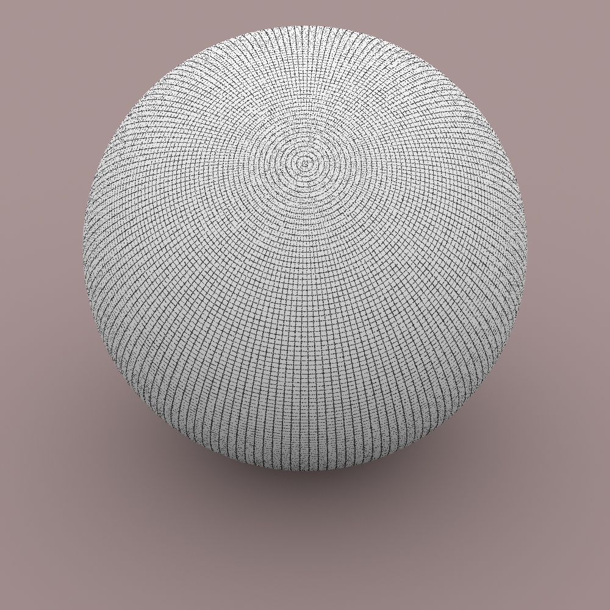

Anti-aliased texture / 反走样纹理

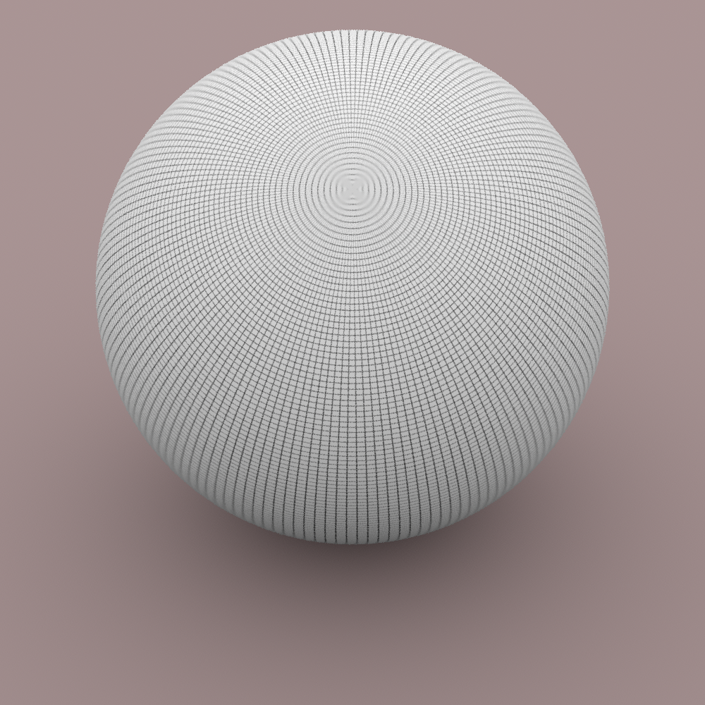

Figure 10.1: Texture Aliasing. (1) An image of a grid texture on a sphere with one sample per pixel has severe aliasing artifacts. (2) The texture function has taken into account the image sampling rate to prefilter its function and remove high-frequency detail, resulting in an antialiased image, even with a single sample per pixel.

图 10.1：纹理走样。 (1) 每像素一个样本的球体上的网格纹理图像具有严重的走样伪影。 (2) 纹理函数考虑了图像采样率来对其函数进行预过滤并去除高频细节，从而产生反走样图像，即使每个像素只有一个样本。

The first section of this chapter will discuss the problem of texture aliasing and general approaches to solving it. We will then describe the basic texture interface and illustrate its use with a few simple texture functions. Throughout the remainder of the chapter, we will present a variety of more complex texture implementations, demonstrating the use of a number of different texture antialiasing techniques along the way.

本章的第一部分将讨论纹理走样问题和解决它的一般方法。然后我们将描述基本的纹理接口，并用一些简单的纹理函数来说明它的使用。在本章的其余部分，我们将介绍各种更复杂的纹理实现，并在此过程中演示许多不同纹理反走样技术的使用。

## 10.1 Sampling and Antialiasing / 采样和反走样

The sampling task from Chapter 7 was a frustrating one since the aliasing problem was known to be unsolvable from the start. The infinite frequency content of geometric edges and hard shadows guarantees aliasing in the final images, no matter how high the image sampling rate. (Our only consolation is that the visual impact of this remaining aliasing can be reduced to unobjectionable levels with a sufficient number of well-placed samples.)

Fortunately, for textures things are not this difficult from the start: either there is often a convenient analytic form of the texture function available, which makes it possible to remove excessively high frequencies before sampling it, or it is possible to be careful when evaluating the function so as not to introduce high frequencies in the first place. When this problem is carefully addressed in texture implementations, as is done through the rest of this chapter, there is usually no need for more than one sample per pixel in order to render an image without texture aliasing.

第 7 章中的采样任务令人沮丧，因为从一开始就知道走样问题是无法解决的。几何边缘和硬阴影的无限频率内容导致了最终图像中的走样，无论图像采样率有多高。 （我们唯一的安慰是，如果有足够数量的放置良好的样本，这种剩余走样的视觉影响可以降低到无异议的水平。）

幸运的是，对于纹理，事情从一开始就没有那么困难：要么通常有一种方便的纹理函数分析形式可用，它可以在采样之前去除过高的频率，要么在计算函数时小心，以免首先引入高频。当在纹理实现中仔细解决这个问题时，正如本章其余部分所做的那样，通常每个像素不需要超过一个样本来渲染没有纹理走样的图像。

Two problems must be addressed in order to remove aliasing from texture functions:

1. The sampling rate in texture space must be computed. The screen space sampling rate is known from the image resolution and pixel sampling rate, but here we need to determine the resulting sampling rate on a surface in the scene in order to find the rate at which the texture function is being sampled.

2. Given the texture sampling rate, sampling theory must be applied to guide the computation of a texture value that doesn’t have higher frequency variation than can be represented by the sampling rate (e.g., by removing excess frequencies beyond the Nyquist limit from the texture function).

为了消除纹理函数的走样，必须解决两个问题：

1. 必须计算纹理空间中的采样率。屏幕空间的采样率可以从图像分辨率和像素采样率中得知，但这里我们需要确定场景中表面的采样率，以便找到纹理函数的采样率。

2. 给定纹理采样率，必须应用采样理论来指导纹理值的计算，该纹理值的频率变化不超过采样率可以表示的频率变化（例如，通过从纹理函数中去除超出 Nyquist 极限的多余频率）。

These two issues will be addressed in turn throughout the rest of this section.

这两个问题将在本节的其余部分依次解决。

### 10.1.1 Finding the Texture Sampling Rate / 查找纹理采样率

Consider an arbitrary texture function that is a function of position, $T(\mathrm{p})$, defined on a surface in the scene. If we ignore the complications introduced by visibility issues-the possibility that another object may occlude the surface at nearby image samples or that the surface may have a limited extent on the image plane-this texture function can also be expressed as a function over points $(x, y)$ on the image plane, $T(f(x, y))$, where $f(x, y)$ is the function that maps image points to points on the surface. Thus, $T(f(x, y))$ gives the value of the texture function as seen at image position $(x, y)$.

As a simple example of this idea, consider a $2 \mathrm{D}$ texture function $T(s, t)$ applied to a quadrilateral that is perpendicular to the $z$ axis and has corners at the world space points $(0,0,0),(1,0,0),(1,1,0)$, and $(0,1,0)$. If an orthographic camera is placed looking down the $z$ axis such that the quadrilateral precisely fills the image plane and if points $\mathrm{p}$ on the quadrilateral are mapped to $2 \mathrm{D}(s, t)$ texture coordinates by

考虑一个任意的纹理函数，它是定义在场景表面上的位置函数 $T(\mathrm{p})$ 。如果我们忽略可见性问题带来的复杂性——另一个物体可能会遮挡附近图像样本的表面，或者表面在图像平面上的范围有限——这个纹理函数也可以表示为点 $(x, y)$ 在图像平面上的函数，$T(f(x, y))$ ，其中 $f(x, y)$ 是将图像点映射到表面上的点的函数。因此，$T(f(x, y))$ 给出了在图像位置 $(x, y)$ 处看到的纹理函数的值。

作为这个想法的一个简单例子，考虑一个 $2 \mathrm{D}$ 纹理函数 $T(s, t)$ 应用于垂直于 $z$ 轴并且四角在世界空间点 $(0,0,0)$ 、 $(1,0,0)$ 、 $(1,1,0)$ 和 $(0,1,0)$ 。如果将正交相机放置在 $z$ 轴下方，使得四边形精确地填充图像平面，并且如果四边形上的点 $\mathrm{p}$ 映射到 $2 \mathrm{D}(s, t)$ 纹理坐标由

$$
s=\mathrm{p}_{x} \quad t=\mathrm{p}_{y}
$$

then the relationship between $(s, t)$ and screen $(x, y)$ pixels is straightforward:

那么 $(s, t)$ 和屏幕 $(x, y)$ 像素之间的关系很简单：

$$
s=\frac{x}{x_{\mathrm{r}}} \quad t=\frac{y}{y_{\mathrm{r}}}
$$

where the overall image resolution is $\left(x_{\mathrm{r}}, y_{\mathrm{r}}\right)$ (Figure 10.2). Thus, given a sample spacing of one pixel in the image plane, the sample spacing in $(s, t)$ texture parameter space is $\left(1 / x_{\mathrm{r}}, 1 / y_{\mathrm{r}}\right)$, and the texture function must remove any detail at a higher frequency than can be represented at that sampling rate.

其中整体图像分辨率为 $\left(x_{\mathrm{r}}, y_{\mathrm{r}}\right)$（图 10.2）。因此，给定图像平面中一个像素的样本间距，$(s, t)$ 纹理参数空间中的样本间距为 $\left(1 / x_{\mathrm{r}}, 1 / y_{\mathrm {r}}\right)$ ，并且纹理函数必须以高于该采样率可以表示的频率移除任何细节。


Figure 10.2: If a quadrilateral is viewed with an orthographic perspective such that the quadrilateral precisely fills the image plane, it's easy to compute the relationship between the sampling rate in $(x, y)$ pixel coordinates and the texture sampling rate.

图 10.2：如果用正交透视法观察四边形，使得四边形精确地填充图像平面，则很容易计算 $(x, y)$ 像素坐标中的采样率与纹理采样率之间的关系。

This relationship between pixel coordinates and texture coordinates, and thus the relationship between their sampling rates, is the key bit of information that determines the maximum frequency content allowable in the texture function. As a slightly more complex example, given a triangle with $(s, t)$ texture coordinates at the vertices and viewed with a perspective projection, it's possible to analytically find the differences in $s$ and $t$ across the sample points on the image plane. This is the basis of basic texture map antialiasing in graphics processors.

For more complex scene geometry, camera projections, and mappings to texture coordinates, it is much more difficult to precisely determine the relationship between image positions and texture parameter values. Fortunately, for texture antialiasing, we don't need to be able to evaluate $f(x, y)$ for arbitrary $(x, y)$ but just need to find the relationship between changes in pixel sample position and the resulting change in texture sample position at a particular point on the image. This relationship is given by the partial derivatives of this function, $\partial f / \partial x$ and $\partial f / \partial y$. For example, these can be used to find a first-order approximation to the value of $f$,

像素坐标和纹理坐标之间的这种关系，以及它们的采样率之间的关系，是决定纹理函数中允许的最大频率内容的关键信息位。作为一个稍微复杂一点的例子，给定一个在顶点处具有 $(s, t)$ 纹理坐标并使用透视投影查看的三角形，可以通过分析找到样本点上 $s$ 和 $t$ 的差异图像平面。这是图形处理器中基本纹理反走样的基础。

对于更复杂的场景几何、相机投影和纹理坐标映射，精确确定图像位置和纹理参数值之间的关系要困难得多。幸运的是，对于纹理反走样，我们不需要能够计算任意 $(x, y)$ 的 $f(x, y)$ ，而只需要找到像素样本位置的变化，与由此在图像上特定点的纹理样本位置产生的变化之间的关系。这种关系由该函数的偏导数 $\partial f / \partial x$ 和 $\partial f / \partial y$ 给出。例如，这些可用于找到 $f$ 值的一阶近似值，

$$
f\left(x^{\prime}, y^{\prime}\right) \approx f(x, y)+\left(x^{\prime}-x\right) \frac{\partial f}{\partial x}+\left(y^{\prime}-y\right) \frac{\partial f}{\partial y}
$$

If these partial derivatives are changing slowly with respect to the distances $x^{\prime}-x$ and $y^{\prime}-y$, this is a reasonable approximation. More importantly, the values of these partial derivatives give an approximation to the change in texture sample position for a shift of one pixel in the $x$ and $y$ directions, respectively, and thus directly yield the texture sampling rate. For example, in the previous quadrilateral example, $\partial s / \partial x=1 / x_{\mathrm{r}}, \partial s / \partial y=0, \partial t / \partial x=0$, and $\partial t / \partial y=1 / y_{\mathrm{r}}$.

The key to finding the values of these partial derivatives in the general case lies in the RayDifferential structure, which was defined in Section 2.5.1. This structure is initialized for each camera ray by the Camera::GenerateRayDifferential() method; it contains not only the ray actually being traced through the scene but also two additional rays, one offset horizontally one pixel sample from the camera ray and the other offset vertically by one pixel sample. All of the geometric ray intersection routines use only the main camera ray for their computations; the auxiliary rays are ignored (this is easy to do because RayDifferential is a subclass of Ray).

Here we will use the offset rays to estimate the partial derivatives of the mapping $\mathrm{p}(x, y)$ from image position to world space position and the partial derivatives of the mappings $u(x, y)$ and $v(x, y)$ from $(x, y)$ to $(u, v)$ parametric coordinates, giving the partial derivatives of world space positions $\partial \mathrm{p} / \partial x$ and $\partial \mathrm{p} / \partial y$ and the partial derivatives of $(u, v)$ parametric coordinates $\partial u / \partial x, \partial v / \partial x, \partial u / \partial y$, and $\partial v / \partial y$. In Section 10.2, we will see how these can be used to compute the screen space derivatives of arbitrary quantities based on p or $(u, v)$ and consequently the sampling rates of these quantities. The values of these partial derivatives at the intersection point are stored in the SurfaceInteraction structure. They are declared as mutable, since they are set in a method that takes a const instance of that object.

如果这些偏导数相对于 $x^{\prime}-x$ 和 $y^{\prime}-y$ 的距离变化缓慢，这是一个合理的近似值。更重要的是，这些偏导数的值分别给出了一个像素在 x 和 y 方向上移动一个像素时纹理样本位置变化的近似值，从而直接产生纹理采样率。例如，在前面的四边形例子中，$\partial s / \partial x=1 / x_{\mathrm{r}}, \partial s / \partial y=0, \partial t / \partial x=0$,和 $\partial t / \partial y=1 / y_{\mathrm{r}}$ 。

在一般情况下找到这些偏导数的值的关键在于 RayDifferential 结构，该结构在 2.5.1 节中定义。这个结构是通过 Camera::GenerateRayDifferential() 方法为每条相机光线初始化的；它不仅包含实际通过场景追踪的光线，还包含两条额外的光线，一条与相机光线水平偏移一个像素样本，另一条垂直偏移一个像素样本。所有几何射线相交程序仅使用主摄像机射线进行计算；辅助射线被忽略（这很容易做到，因为 RayDifferential 是 Ray 的子类）。

这里我们将使用偏移射线来估计映射 $\mathrm{p}(x, y)$ 从图像位置到世界空间位置的偏导数，以及映射 $u(x, y)$ 和 $v(x, y)$ 从 $(x, y)$ 到 $(u, v)$ 参数坐标，给出世界空间位置 $\partial \mathrm{p} / \partial x$ 和 $ \partial \mathrm{p} / \partial y$ 和 $(u, v)$ 参数坐标的偏导数 $\partial u / \partial x, \partial v / \partial x, \partial u / \partial y $, 和 $\partial v / \partial y$ 。在 10.2 节中，我们将看到如何使用这些计算基于 p 或 $(u, v)$ 的任意数量的屏幕空间导数，以及这些数量的采样率。这些偏导数在交点处的值存储在 SurfaceInteraction 结构中。它们被声明为mutable，因为它们被设置在一个采用该对象的 const 实例的方法中。

```
<<SurfaceInteraction Public Data>>+= 
mutable Vector3f dpdx, dpdy;
mutable Float dudx = 0, dvdx = 0, dudy = 0, dvdy = 0;
```

The SurfaceInteraction::ComputeDifferentials() method computes these values. It is called by SurfaceInteraction::ComputeScatteringFunctions() before the Material’s ComputeScatteringFunctions() method is called so that these values will be available for any texture evaluation routines that are called by the material. Because ray differentials aren’t available for all rays traced by the system (e.g., rays starting from light sources traced for photon mapping or bidirectional path tracing), the hasDifferentials field of the RayDifferential must be checked before these computations are performed. If the differentials are not present, then the derivatives are all set to zero (which will eventually lead to unfiltered point sampling of textures).

SurfaceInteraction::ComputeDifferentials() 方法计算这些值。在调用材质的 ComputeScatteringFunctions() 方法之前，它由 SurfaceInteraction::ComputeScatteringFunctions() 调用，以便这些值可用于材质调用的任何纹理计算程序。因为光线微分不适用于系统跟踪的所有光线（例如，从跟踪的光源开始的光线以进行光子映射或双向路径跟踪），所以在执行这些计算之前必须检查 RayDifferential 的 hasDifferentials 字段。如果不存在微分，则导数都设置为零（这最终将导致未过滤的纹理点采样）。

```
<<SurfaceInteraction Method Definitions>>+=  
void SurfaceInteraction::ComputeDifferentials( 
        const RayDifferential &ray) const {
    if (ray.hasDifferentials) {
        <<Estimate screen space change in p and (u,v) >> 
    } else {
        dudx = dvdx = 0;
        dudy = dvdy = 0;
        dpdx = dpdy = Vector3f(0, 0, 0);
    }
}
```

The key to computing these estimates is the assumption that the surface is locally flat with respect to the sampling rate at the point being shaded. This is a reasonable approximation in practice, and it is hard to do much better. Because ray tracing is a point-sampling technique, we have no additional information about the scene in between the rays we have traced. For highly curved surfaces or at silhouette edges, this approximation can break down, though this is rarely a source of noticeable error in practice.

For this approximation, we need the plane through the point p intersected by the main ray that is tangent to the surface. This plane is given by the implicit equation

计算这些估计值的关键是假设表面相对于被着色点的采样率是局部平坦的。这在实践中是一个合理的近似值，很难做得更好。因为光线追踪是一种点采样技术，所以我们没有关于我们所追踪的光线之间的场景的额外信息。对于高度弯曲的表面或轮廓边缘，这种近似可能会失效，尽管这在实践中很少会引起明显的错误。

对于这种近似，我们需要通过与表面相切的主射线相交的点 p 的平面。该平面由隐式方程给出

$$
a x+b y+c z+d=0
$$

where $a=\mathbf{n}_{x}, b=\mathbf{n}_{y}, c=\mathbf{n}_{z}$, and $d=-(\mathbf{n} \cdot \mathrm{p})$. We can then compute the intersection points $\mathrm{p}_{x}$ and $\mathrm{p}_{y}$ between the auxiliary rays $r_{x}$ and $r_{y}$ and this plane (Figure 10.3). These new points give an approximation to the partial derivatives of position on the surface $\partial \mathrm{p} / \partial x$ and $\partial \mathrm{p} / \partial y$, based on forward differences:

其中 $a=\mathbf{n}_{x}, b=\mathbf{n}_{y}, c=\mathbf{n}_{z}$, 和 $d=-(\mathbf{n} \cdot \mathrm{p})$ 。然后我们可以计算辅助射线 $r_{x}$ 和 $r_{y}$ 与该平面之间的交点 $\mathrm{p}_{x}$ 和 $\mathrm{p}_{y}$ （图 10.3）。这些新点基于前向差分给出了表面 $\partial \mathrm{p} / \partial x$ 和 $\partial \mathrm{p} / \partial y$ 上位置的偏导数的近似值：

$$
\frac{\partial \mathrm{p}}{\partial x} \approx \mathrm{p}_{x}-\mathrm{p}, \quad \frac{\partial \mathrm{p}}{\partial y} \approx \mathrm{p}_{y}-\mathrm{p}
$$


Figure 10.3: By approximating the local surface geometry at the intersection point with the tangent plane through p, approximations to the points at which the auxiliary rays $r_{x}$ and $r_{y}$ would intersect the surface can be found by finding their intersection points with the tangent plane $\mathrm{p}_{x}$ and $\mathrm{p}_{y}$.

图 10.3：通过 p 近似与切平面相交点处的局部表面几何形状，辅助射线 $r_{x}$ 和 $r_{y}$ 与表面相交的点的近似值，可以通过下式找到它们与切平面 $\mathrm{p}_{x}$ 和 $\mathrm{p}_{y}$ 的交点。

Because the differential rays are offset one pixel sample in each direction, there's no need to divide these differences by a $\Delta$ value, since $\Delta=1$.

由于微分光线在每个方向上偏移一个像素样本，因此无需将这些差异除以 $\Delta$ 值，因为 $\Delta=1$ 。

```
<<Estimate screen space change in p and (u,v) >>= 
<<Compute auxiliary intersection points with plane>> 
dpdx = px - p;
dpdy = py - p;
<<Compute (u,v) offsets at auxiliary points>> 
```

The ray-plane intersection algorithm described in Section 3.1.2 gives the $t$ value where a ray described by origin o and direction $d$ intersects a plane described by $a x+b y+c z+d=0$ :

第 3.1.2 节中描述的射线-平面相交算法给出了 $t$ 值，其中原点 o 和方向 $d$ 描述的射线与 $a x+b y+c z+d=0$ 描述的平面相交：

$$
t=\frac{-((a, b, c) \cdot \mathrm{o})-d}{(a, b, c) \cdot \mathbf{d}} .
$$

To compute this value for the two auxiliary rays, the plane's $d$ coefficient is computed first. It isn't necessary to compute the $a, b$, and $c$ coefficients, since they're available in n. We can then apply the formula directly.

为了计算两个辅助射线的这个值，首先计算平面的 $d$ 系数。不必计算 $a、b$ 和 $c$ 系数，因为它们在 n 中可用。然后我们可以直接应用公式。

```
<<Compute auxiliary intersection points with plane>>= 
Float d = -Dot(n, Vector3f(p.x, p.y, p.z));
Float tx = (-Dot(n, Vector3f(ray.rxOrigin)) - d) /
    Dot(n, ray.rxDirection);
Point3f px = ray.rxOrigin + tx * ray.rxDirection;
Float ty = (-Dot(n, Vector3f(ray.ryOrigin)) - d) /
    Dot(n, ray.ryDirection);
Point3f py = ray.ryOrigin + ty * ray.ryDirection;
```

Using the positions $\mathrm{p}_{x}$ and $\mathrm{p}_{y}$, an approximation to their respective $(u, v)$ coordinates can be found by taking advantage of the fact that the surface's partial derivatives $\partial \mathrm{p} / \partial u$ and $\partial \mathrm{p} / \partial v$ form a (not necessarily orthogonal) coordinate system on the plane and that the coordinates of the auxiliary intersection points in terms of this coordinate system are their coordinates with respect to the $(u, v)$ parameterization (Figure 10.4).

使用位置 $\mathrm{p}_{x}$ 和 $\mathrm{p}_{y}$ ，可以利用以下事实找到它们各自 $(u, v)$ 坐标的近似值：曲面的偏导数 $\partial \mathrm{p} / \partial u$ 和 $\partial \mathrm{p} / \partial v$ 在平面上形成一个（不一定正交的）坐标系，根据该坐标系，辅助交点的坐标是它们相对于 $(u, v)$ 参数化的坐标（图 10.4）。


Figure 10.4: An estimate of the difference in $(u, v)$ parametric coordinates from $\mathrm{p}$ to $\mathrm{p}^{\prime}$ can be found by finding the coordinates of $\mathrm{p}^{\prime}$ with respect to the coordinate system defined by $\mathrm{p}, \partial \mathrm{p} / \partial u$, and $\partial \mathrm{p} / \partial v$

Given a position $p^{\prime}$ on the plane, we can compute its position with respect to the coordinate system by

图 10.4： $(u, v)$ 参数坐标从 $\mathrm{p}$ 到 $\mathrm{p}^{\prime}$ 的差异的估计，可以通过找到的坐标来找到 $\mathrm{p}^{\prime}$ 相对于由 $\mathrm{p}、\partial \mathrm{p} / \partial u$ 和 $\partial \mathrm{p} / \partial v$ 定义的坐标系

给定平面上的位置 $p^{\prime}$ ，我们可以计算它相对于坐标系的位置：

$$
\mathrm{p}^{\prime}=\mathrm{p}+\Delta_{u} \frac{\partial \mathrm{p}}{\partial u}+\Delta_{v} \frac{\partial \mathrm{p}}{\partial v}
$$

or, equivalently,

或者，等效地，

$$
\left(\begin{array}{c}
\mathrm{p}_{\mathrm{x}}^{\prime}-\mathrm{p}_{x} \\
\mathrm{p}_{\mathrm{y}}^{\prime}-\mathrm{p}_{y} \\
\mathrm{p}_{\mathrm{z}}^{\prime}-\mathrm{p}_{z}
\end{array}\right)=\left(\begin{array}{cc}
\partial \mathrm{p}_{x} / \partial u & \partial \mathrm{p}_{x} / \partial v \\
\partial \mathrm{p}_{y} / \partial u & \partial \mathrm{p}_{y} / \partial v \\
\partial \mathrm{p}_{z} / \partial u & \partial \mathrm{p}_{z} / \partial v
\end{array}\right)\left(\begin{array}{c}
\Delta_{u} \\
\Delta_{v}
\end{array}\right)
$$

A solution to this linear system of equations for one of the auxiliary points $\mathrm{p}^{\prime}=\mathrm{p}_{\mathrm{x}}$ or $\mathrm{p}^{\prime}=\mathrm{p}_{\mathrm{y}}$ gives the corresponding screen space partial derivatives $(\partial u / \partial x, \partial v / \partial x)$ or $(\partial u / \partial y, \partial v / \partial y)$, respectively.

This linear system has three equations with two unknowns-that is, it's overconstrained. We need to be careful since one of the equations may be degenerate-for example, if $\partial \mathrm{p} / \partial u$ and $\partial \mathrm{p} / \partial v$ are in the $x y$ plane such that their $z$ components are both zero, then the third equation will be degenerate. Therefore, we'd like to solve the system of equations using two equations that don't give a degenerate system. An easy way to do this is to take the cross product of $\partial \mathrm{p} / \partial u$ and $\partial \mathrm{p} / \partial v$, see which coordinate of the result has the largest magnitude, and use the other two. Their cross product is already available in $n$, so using this approach is straightforward. Even after all this, it may happen that the linear system has no solution (usually due to the partial derivatives not forming a coordinate system on the plane). In that case, all that can be done is to return arbitrary values.

一个辅助点 $\mathrm{p}^{\prime}=\mathrm{p}_{\mathrm{x}}$ 或 $\mathrm{p}^{\prime}=\mathrm{p}_{\mathrm{y}}$ 的线性方程组的解，分别给出相应的屏幕空间偏导数 $(\partial u / \partial x, \partial v / \partial x)$ 或 $(\partial u / \partial y，\partial v / \partial y)$ 。

这个线性系统有三个方程和两个未知数——也就是说，它是过度约束的。我们需要小心，因为其中一个方程可能是退化的——例如，如果 $\partial \mathrm{p} / \partial u$ 和 $\partial \mathrm{p} / \partial v$ 在 $x y$ 平面使得它们的 $z$ 分量都为零，那么第三个方程将是退化的。因此，我们想用两个不给出简并系统的方程来求解方程组。一个简单的方法是取 $\partial \mathrm{p} / \partial u$ 和 $\partial \mathrm{p} / \partial v$ 的叉积，看看哪个坐标的结果最大长度，并使用其他两个。他们的叉积已经在 $n$ 中可用，因此使用这种方法很简单。即使在这一切之后，线性系统也可能没有解（通常是由于偏导数没有在平面上形成坐标系）。在这种情况下，所能做的就是返回任意值。

```
<<Compute (u,v) offsets at auxiliary points>>= 
<<Choose two dimensions to use for ray offset computation>> 
<<Initialize A, Bx, and By matrices for offset computation>> 
if (!SolveLinearSystem2x2(A, Bx, &dudx, &dvdx))
    dudx = dvdx = 0;
if (!SolveLinearSystem2x2(A, By, &dudy, &dvdy))
    dudy = dvdy = 0;

<<Choose two dimensions to use for ray offset computation>>= 
int dim[2];
if (std::abs(n.x) > std::abs(n.y) && std::abs(n.x) > std::abs(n.z)) {
    dim[0] = 1; dim[1] = 2;    
} else if (std::abs(n.y) > std::abs(n.z)) {
    dim[0] = 0; dim[1] = 2;    
} else {
    dim[0] = 0; dim[1] = 1;
}

<<Initialize A, Bx, and By matrices for offset computation>>= 
Float A[2][2] = { { dpdu[dim[0]], dpdv[dim[0]] },
                  { dpdu[dim[1]], dpdv[dim[1]] } };
Float Bx[2] = { px[dim[0]] - p[dim[0]], px[dim[1]] - p[dim[1]] };
Float By[2] = { py[dim[0]] - p[dim[0]], py[dim[1]] - p[dim[1]] };
```

### 10.1.2 Filtering Texture Functions / 过滤纹理函数

It is necessary to remove frequencies in texture functions that are past the Nyquist limit for the texture sampling rate. The goal is to compute, with as few approximations as possible, the result of the ideal texture resampling process, which says that in order to evaluate $T(f(x, y))$ without aliasing, we must first band-limit it, removing frequencies beyond the Nyquist limit by convolving it with the sinc filter:

有必要去除纹理函数中超过纹理采样率的Nyquist极限的频率。目标是用尽可能少的近似值计算理想纹理重采样过程的结果，即为了在没有走样的情况下计算 $T(f(x, y))$ ，我们必须首先对其进行频带限制，通过与 sinc 过滤器进行卷积来去除超出 Nyquist 限制的频率：

$$
T_{b}^{\prime}(x, y)=\int_{-\infty}^{\infty} \int_{-\infty}^{\infty} \operatorname{sinc}\left(x^{\prime}\right) \operatorname{sinc}\left(y^{\prime}\right) T^{\prime}\left(f\left(x-x^{\prime}, y-y^{\prime}\right)\right) \mathrm{d} x^{\prime} \mathrm{d} y^{\prime}
$$

The band-limited function in turn should then be convolved with the pixel filter $g(x, y)$ centered at the $(x, y)$ point on the screen at which we want to evaluate the texture function:

然后，带限函数应与像素过滤器 $g(x, y)$ 卷积，该像素过滤器位于屏幕上我们要计算纹理函数的 $(x, y)$ 点的中心：

$$
T_{f}^{\prime}(x, y)=\int_{-y \text { Width } / 2}^{\mathrm{yWidth} / 2} \int_{-\mathrm{xWidth} / 2}^{\mathrm{xWidth} / 2} g\left(x^{\prime}, y^{\prime}\right) T_{b}^{\prime}\left(x-x^{\prime}, y-y^{\prime}\right) \mathrm{d} x^{\prime} \mathrm{d} y^{\prime}
$$

This gives the theoretically perfect value for the texture as projected onto the screen.

In practice, there are many simplifications that can be made to this process, with little reduction in visual quality. For example, a box filter may be used for the band-limiting step, and the second step is usually ignored completely, effectively acting as if the pixel filter were a box filter, which makes it possible to do the antialiasing work completely in texture space and simplifies the implementation significantly. The EWA filtering algorithm in Section 10.4.5 is a notable exception in that it assumes a Gaussian pixel filter.

The box filter is easy to use, since it can be applied analytically by computing the average of the texture function over the appropriate region. Intuitively, this is a reasonable approach to the texture filtering problem, and it can be computed directly for many texture functions. Indeed, through the rest of this chapter, we will often use a box filter to average texture function values between samples and informally use the term filter region to describe the area being averaged over. This is the most common approach when filtering texture functions.

这为投影到屏幕上的纹理提供了理论上的完美值。

在实践中，可以对该过程进行许多简化，而视觉质量几乎不会降低。例如，box filter 可以用于带限步骤，而第二步通常会被完全忽略，有效地将pixel filter 当作box filter，这使得在纹理空间中完全做反走样工作成为可能，并显著简化了实现。第 10.4.5 节中的 EWA 过滤算法是一个值得注意的例外，因为它假设一个高斯像素过滤器。

box filter易于使用，因为它可以通过计算适当区域上的纹理函数的平均值来分析应用。直观地说，这是解决纹理过滤问题的一种合理方法，并且可以直接针对许多纹理函数进行计算。实际上，在本章的其余部分中，我们将经常使用box filter来平均样本之间的纹理函数值，并非正式地使用术语过滤器区域来描述被平均的区域。这是过滤纹理函数时最常用的方法。

Even the box filter, with all of its shortcomings, gives acceptable results for texture filtering in many cases. One factor that helps is the fact that a number of samples are usually taken in each pixel. Thus, even if the filtered texture values used in each one are sub-optimal, once they are filtered by the pixel reconstruction filter, the end result generally doesn’t suffer too much.

An alternative to using the box filter to filter texture functions is to use the observation that the effect of the ideal sinc filter is to let frequency components below the Nyquist limit pass through unchanged but to remove frequencies past it. Therefore, if we know the frequency content of the texture function (e.g., if it is a sum of terms, each one with known frequency content), then if we replace the high-frequency terms with their average values, we are effectively doing the work of the sinc prefilter. This approach is known as clamping and is the basis for antialiasing in the textures based on the noise function in Section 10.6.

Finally, for texture functions where none of these techniques is easily applied, a final option is supersampling—the function is evaluated and filtered at multiple locations near the main evaluation point, thus increasing the sampling rate in texture space. If a box filter is used to filter these sample values, this is equivalent to averaging the value of the function. This approach can be expensive if the texture function is complex to evaluate, and as with image sampling a very large number of samples may be needed to remove aliasing. Although this is a brute-force solution, it is still more efficient than increasing the image sampling rate, since it doesn’t incur the cost of tracing more rays through the scene.

即使是box filter，尽管有其所有缺点，但在许多情况下，纹理过滤也能提供可接受的结果。一个有帮助的因素是，通常在每个像素中获取多个样本。因此，即使每一个中使用的过滤纹理值都是次优的，一旦它们被像素重建过滤器过滤，最终结果通常不会受到太大影响。

使用box filters过滤纹理函数的另一种方法是使用观察结果，即理想 sinc 过滤器的效果是让低于 Nyquist 极限的频率分量不变地通过，但去除超过它的频率。因此，如果我们知道纹理函数的频率内容（例如，如果它是项的总和，每个项都具有已知的频率内容），那么如果我们用它们的平均值替换高频项，我们实际上是在做sinc 前置过滤器的工作。这种方法称为Clamping，是基于 10.6 节中的噪声函数在纹理中进行反走样的基础。

最后，对于这些技术都不容易应用的纹理函数，最后一个选项是超级采样——在主要计算点附近的多个位置对函数进行计算和过滤，从而提高纹理空间中的采样率。如果使用box filter来过滤这些样本值，这相当于对函数的值进行平均。如果纹理函数计算起来很复杂，这种方法可能会很昂贵，并且与图像采样一样，可能需要非常大量的样本来消除走样。尽管这是一种蛮力解决方案，但它仍然比提高图像采样率更有效，因为它不会产生在场景中追踪更多光线的成本。

### 10.1.3 Ray Differentials for Specular Reflection and Transmission / 镜面反射和透射的光线微分

Given the effectiveness of ray differentials for finding filter regions for texture antialiasing for camera rays, it is useful to extend the method to make it possible to determine texture space sampling rates for objects that are seen indirectly via specular reflection or refraction; objects seen in mirrors, for example, should also no more have texture aliasing than directly visible objects. Igehy (1999) developed an elegant solution to the problem of how to find the appropriate differential rays for specular reflection and refraction, which is the approach used in pbrt.

Figure 10.5 illustrates the difference that proper texture filtering for specular reflection and transmission can make: it shows a glass ball and a mirrored ball on a plane with a texture map containing high-frequency components. Ray differentials ensure that the images of the texture seen via reflection and refraction from the balls are free of aliasing artifacts. Here, ray differentials eliminate aliasing without excessively blurring the texture.

鉴于光线微分在为相机光线的纹理反走样寻找过滤器区域方面的有效性，扩展该方法，以使其能够确定通过镜面反射或折射间接看到的对象的纹理空间采样率是有用的；例如，在镜子中看到的对象也不应该比直接可见的对象更具有纹理走样。 Igehy (1999) 为如何为镜面反射和折射找到合适的微分光线问题开发了一个优雅的解决方案，这是 pbrt 中使用的方法。

图 10.5 说明了对镜面反射和透射进行适当的纹理过滤可以产生的差异：它显示了一个平面上的玻璃球和一个镜面球，其纹理包含高频分量。光线微分确保通过球的反射和折射看到的纹理图像没有走样伪影。在这里，光线微分消除了走样，而不会过度模糊纹理。

With ray differentials / 有光线微分


Without ray differentials / 没有光线微分

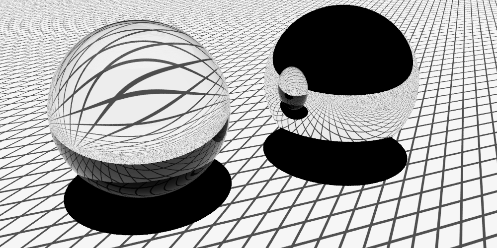

Figure 10.5: (1) Tracking ray differentials for reflected and refracted rays ensures that the image map texture seen in the balls is filtered to avoid aliasing. The left ball is glass, exhibiting reflection and refraction, and the right ball is a mirror, just showing reflection. Note that the texture is well filtered over both of the balls. (2) shows the aliasing artifacts that are present if ray differentials aren’t used.

图 10.5: (1) 跟踪反射光线和折射光线的光线微分可确保过滤球中看到的图像纹理以避免走样。左边的球是玻璃，表现出反射和折射，右边的球是镜子，只是表现出反射。请注意，纹理在两个球上都被很好地过滤了。 (2) 显示了不使用光线微分时出现的走样伪影。

In order to compute the reflected or transmitted ray differentials at a surface intersection point, we need an approximation to the rays that would have been traced at the intersection points for the two offset rays in the ray differential that hit the surface (Figure 10.6). The new ray for the main ray is computed by the BSDF, so here we only need to compute the outgoing rays for the $r_{x}$ and $r_{y}$ differentials.

为了计算表面交点处的反射或透射光线微分，我们需要一个近似值，即在撞击表面的光线微分中的两条偏移光线的交点处追踪的光线（图 10.6）。主光线的新光线由 BSDF 计算，所以这里我们只需要计算 $r_{x}$ 和 $r_{y}$ 微分的出射光线。


Figure 10.6: The specular reflection formula gives the direction of the reflected ray at a point on a surface. An offset ray for a ray differential $r^{\prime}$ (dashed line) will generally intersect the surface at a different point and be reflected in a different direction. The new direction is affected by both the different surface normal at the point as well as the offset ray's different incident direction. The computation to find the reflected direction for the offset ray in pbrt estimates the change in reflected direction as a function of image space position and approximates the ray differential's direction with the main ray's direction added to the estimated change in direction.

图 10.6：镜面反射公式给出了反射光线在表面上一点的方向。光线微分 $r^{\prime}$（虚线）的偏移光线通常会在不同的点与表面相交并在不同的方向上反射。新方向受该点不同表面法线以及偏移光线不同入射方向的影响。在 pbrt 中找到偏移光线的反射方向的计算，将反射方向的变化估计为图像空间位置的函数，并通过将主光线的方向添加到估计的方向变化来近似光线微分的方向。

For both reflection and refraction, the origin of each differential ray is easily found. The SurfaceInteraction: :ComputeDifferentials ( ) method previously computed approximations for how much the surface position changes with respect to $(x, y)$ position on the image plane $\partial \mathrm{p} / \partial x$ and $\partial \mathrm{p} / \partial y$. Adding these offsets to the intersection point of the main ray gives approximate origins for the new rays. If the incident ray doesn't have differentials, then it's impossible to compute reflected ray differentials and this step is skipped.

对于反射和折射，很容易找到每条微分光线的起源。 SurfaceInteraction: :ComputeDifferentials ( ) 方法先前计算了表面位置相对于图像平面 $\partial \mathrm{p} / \partial x$ 和 $\partial\mathrm{p} / \partial y$ 上的 $(x, y)$ 位置变化的近似值。将这些偏移量添加到主光线的交点会给出新光线的近似原点。如果入射光线没有微分，则无法计算反射光线微分，因此跳过此步骤。

```
<<Compute ray differential rd for specular reflection>>= 
RayDifferential rd = isect.SpawnRay(wi);
if (ray.hasDifferentials) {
    rd.hasDifferentials = true;
    rd.rxOrigin = isect.p + isect.dpdx;
    rd.ryOrigin = isect.p + isect.dpdy;
    <<Compute differential reflected directions>> 
}
```

Finding the directions of these rays is slightly trickier. Igehy (1999) observed that if we know how much the reflected direction $\omega_{\mathrm{i}}$ changes with respect to a shift of a pixel sample in the $x$ and $y$ directions on the image plane, we can use this information to approximate the direction of the offset rays. For example, the direction for the ray offset in $x$ is

找到这些射线的方向稍微有点棘手。 Igehy (1999) 观察到，如果我们知道反射方向 $\omega_{\mathrm{i}}$ 相对于像素样本在图像平面上 $x$ 和 $y$ 方向上的移动发生了多大变化，我们可以使用这些信息来近似偏移光线的方向。例如，$x$ 中光线偏移的方向是

$$
\omega \approx \omega_{\mathrm{i}}+\frac{\partial \omega_{\mathrm{i}}}{\partial x}
$$

Recall from Equation (8.5) that for a general world space surface normal and outgoing direction, the direction for perfect specular reflection is

回想一下公式（8.5），对于一般的世界空间表面法线和出射方向，完美镜面反射的方向是

$$
\omega_{\mathrm{i}}=-\omega_{\mathrm{o}}+2\left(\omega_{\mathrm{o}} \cdot \mathbf{n}\right) \mathbf{n}
$$

Fortunately, the partial derivatives of this expression are easily computed:

幸运的是，这个表达式的偏导数很容易计算：

$$
\begin{aligned}
\frac{\partial \omega_{\mathrm{i}}}{\partial x} &=\frac{\partial}{\partial x}\left(-\omega_{\mathrm{o}}+2\left(\omega_{\mathrm{o}} \cdot \mathbf{n}\right) \mathbf{n}\right) \\
&=-\frac{\partial \omega_{\mathrm{o}}}{\partial x}+2\left(\left(\omega_{\mathrm{o}} \cdot \mathbf{n}\right) \frac{\partial \mathbf{n}}{\partial x}+\frac{\partial\left(\omega_{\mathrm{o}} \cdot \mathbf{n}\right)}{\partial x} \mathbf{n}\right)
\end{aligned}
$$

Using the properties of the dot product, it can be shown that

利用点积的性质，可以证明

$$
\frac{\partial\left(\omega_{\mathrm{o}} \cdot \mathbf{n}\right)}{\partial x}=\frac{\partial \omega_{\mathrm{o}}}{\partial x} \cdot \mathbf{n}+\omega_{\mathrm{o}} \cdot \frac{\partial \mathbf{n}}{\partial x}
$$

The value of $\partial \omega_{0} / \partial x$ can be found from the difference between the direction of the ray differential's main ray and the direction of the $r_{x}$ offset ray, and all of the other necessary quantities are readily available from the SurfaceInteraction, so the implementation of this computation for the partial derivatives in $x$ and $y$ is straightforward.

$\partial \omega_{0} / \partial x$ 的值可以从光线微分主光线的方向与 $r_{x}$ 偏移光线的方向之差得到，其他的必要的量可以从 SurfaceInteraction 轻松获得，因此对 $x$ 和 $y$ 中的偏导数的计算的实现很简单。

```
<<Compute differential reflected directions>>= 
Normal3f dndx = isect.shading.dndu * isect.dudx +
                isect.shading.dndv * isect.dvdx;
Normal3f dndy = isect.shading.dndu * isect.dudy +
                isect.shading.dndv * isect.dvdy;
Vector3f dwodx = -ray.rxDirection - wo, dwody = -ray.ryDirection - wo;
Float dDNdx = Dot(dwodx, ns) + Dot(wo, dndx);
Float dDNdy = Dot(dwody, ns) + Dot(wo, dndy);
rd.rxDirection = wi - dwodx +
    2.f * Vector3f(Dot(wo, ns) * dndx + dDNdx * ns);
rd.ryDirection = wi - dwody +
    2.f * Vector3f(Dot(wo, ns) * dndy + dDNdy * ns);
```

A similar process of differentiating the equation for the direction of a specularly transmitted ray, Equation (8.8), gives the equation to find the differential change in the transmitted direction. We won’t include the derivation or our implementation here, but refer the interested reader to the original paper and to the pbrt source code, respectively.

对镜面透射光线方向的方程进行微分的类似过程，即方程 (8.8)，给出了求解透射方向微分变化的方程。我们不会在这里包含推导或我们的实现，但请感兴趣的读者分别参考原始论文和 pbrt 源代码。

## 10.2 Texture Coordinate Generation / 纹理坐标生成

Almost all of the textures in this chapter are functions that take a $2 \mathrm{D}$ or $3 \mathrm{D}$ coordinate and return a texture value. Sometimes there are obvious ways to choose these texture coordinates; for parametric surfaces, such as the quadrics in Chapter 3 , there is a natural $2 \mathrm{D}(u, v)$ parameterization of the surface, and for all surfaces the shading point $\mathrm{p}$ is a natural choice for a $3 \mathrm{D}$ coordinate.

In other cases, there is no natural parameterization, or the natural parameterization may be undesirable. For instance, the $(u, v)$ values near the poles of spheres are severely distorted. Also, for an arbitrary subdivision surface, there is no simple, general-purpose way to assign texture values so that the entire $[0,1]^{2}$ space is covered continuously and without distortion. In fact, creating smooth parameterizations of complex meshes with low distortion is an active area of research in computer graphics.

This section starts by introducing two abstract base classes—TextureMapping2D and TextureMapping3D—that provide an interface for computing these 2D and 3D texture coordinates. We will then implement a number of standard mappings using this interface (Figure 10.7 shows a number of them).

本章中几乎所有的纹理都是采用 $2 \mathrm{D}$ 或 $3 \mathrm{D}$ 坐标并返回纹理值的函数。有时有明显的方法来选择这些纹理坐标；对于参数化曲面，例如第 3 章中的二次曲面，曲面有一个自然的 $2 \mathrm{D}(u, v)$ 参数化，并且对于所有曲面，着色点 $\mathrm{p}$ 是一个自然的 $3 \mathrm{D}$ 坐标的选择。

在其他情况下，没有自然参数化，或者自然参数化可能是不可取的。例如，球体两极附近的 $(u, v)$ 值严重失真。此外，对于任意细分曲面，没有简单、通用的方法来分配纹理值，以便连续覆盖整个 $[0,1]^{2}$ 空间而不会失真。事实上，创建具有低失真的复杂网格的平滑参数化是计算机图形学研究的一个活跃领域。

本节首先介绍两个抽象基类——TextureMapping2D 和 TextureMapping3D——它们提供了计算这些 2D 和 3D 纹理坐标的接口。然后我们将使用这个接口实现一些标准映射（图 10.7 显示了其中的一些）。

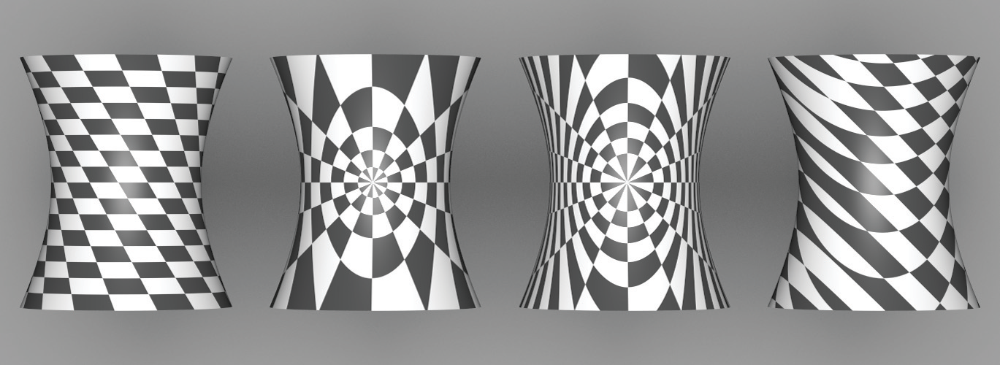

Figure 10.7: A checkerboard texture, applied to a hyperboloid with different texture coordinate generation techniques. From left to right, $(u, v)$ mapping, spherical mapping, cylindrical mapping, and planar mapping.

图 10.7：棋盘纹理，用不同的纹理坐标生成技术应用于双曲面。从左到右，$(u, v)$ 映射、球面映射、柱面映射和平面映射。

Texture implementations store a pointer to a $2 \mathrm{D}$ or $3 \mathrm{D}$ mapping function as appropriate and use it to compute the texture coordinates at each point. Thus, it's easy to add new mappings to the system without having to modify all of the Texture implementations, and different mappings can be used for different textures associated with the same surface. In pbrt, we will use the convention that 2D texture coordinates are denoted by $(s, t)$; this helps make clear the distinction between the intrinsic $(u, v)$ parameterization of the underlying surface and the (possibly different) coordinate values used for texturing.

The TextureMapping2D base class has a single method, TextureMapping2D: :Map( ), which is given the SurfaceInteraction at the shading point and returns the $(s, t)$ texture coordinates via a Point2f. It also returns estimates for the change in $(s, t)$ with respect to pixel $x$ and $y$ coordinates in the dstdx and dstdy parameters so that textures that use the mapping can determine the $(s, t)$ sampling rate and filter accordingly.

纹理实现存储一个指向 $2 \mathrm{D}$ 或 $3 \mathrm{D}$ 映射函数的指针，并使用它来计算每个点的纹理坐标。因此，很容易向系统添加新的映射，而无需修改所有纹理实现，并且可以将不同的映射用于与同一表面关联的不同纹理。在 pbrt 中，我们将使用 2D 纹理坐标由 $(s, t)$ 表示的约定；这有助于清楚区分底层表面的内在 $(u, v)$ 参数化和用于纹理的（可能不同的）坐标值。

TextureMapping2D 基类有一个方法，TextureMapping2D: :Map( )，它在着色点被赋予 SurfaceInteraction 并通过 Point2f 返回 $(s, t)$ 纹理坐标。它还返回关于 dstdx 和 dstdy 参数中像素 $x$ 和 $y$ 坐标的 $(s, t)$ 变化的估计值，以便使用映射的纹理可以确定 $(s, t)$ 采样率并相应地过滤。

```
<<Texture Declarations>>= 
class TextureMapping2D {
public:
    <<TextureMapping2D Interface>> 
};
<<TextureMapping2D Interface>>= 
virtual Point2f Map(const SurfaceInteraction &si,
                    Vector2f *dstdx, Vector2f *dstdy) const = 0;
```

### 10.2.1 2D (u,v) Mapping / 2D (u,v) 映射

The simplest mapping uses the $(u, v)$ coordinates in the SurfaceInteraction to compute the texture coordinates. Their values can be offset and scaled with user-supplied values in each dimension.

最简单的映射使用 SurfaceInteraction 中的 $(u, v)$ 坐标来计算纹理坐标。它们的值可以在每个维度中使用用户提供的值进行偏移和缩放。

```
<<Texture Declarations>>+=  
class UVMapping2D : public TextureMapping2D {
public:
    <<UVMapping2D Public Methods>> 
private:
    const Float su, sv, du, dv;
};

<<Texture Method Definitions>>= 
UVMapping2D::UVMapping2D(Float su, Float sv, Float du, Float dv) 
    : su(su), sv(sv), du(du), dv(dv) { }
```

The scale-and-shift computation to compute (s,t) coordinates is straightforward:

计算 (s,t) 坐标的缩放和移位计算很简单：

```
<<Texture Method Definitions>>+=  
Point2f UVMapping2D::Map(const SurfaceInteraction &si,
                         Vector2f *dstdx, Vector2f *dstdy) const {
    <<Compute texture differentials for 2D (u,v) mapping>> 
    return Point2f(su * si.uv[0] + du,
                   sv * si.uv[1] + dv);
}
```

Computing the differential change in $s$ and $t$ in terms of the original change in $u$ and $v$ and the scale amounts is also easy. Using the chain rule,

根据 $u$ 和 $v$ 的原始变化和比例量计算 $s$ 和 $t$ 的微分变化也很容易。使用链式法则，

$$
\frac{\partial s}{\partial x}=\frac{\partial u}{\partial x} \frac{\partial s}{\partial u}+\frac{\partial v}{\partial x} \frac{\partial s}{\partial v}
$$

and similarly for the three other partial derivatives. From the mapping method,

对于其他三个偏导数也是如此。从映射方法来看，

$$
s=s_{u} u+d_{u}
$$

so

$$
\frac{\partial s}{\partial u}=s_{u}, \quad \frac{\partial s}{\partial v}=0
$$

and thus

$$
\frac{\partial s}{\partial x}=s_{u} \frac{\partial u}{\partial x}
$$

and so forth.

```
<<Compute texture differentials for 2D (u,v) mapping>>= 
*dstdx = Vector2f(su * si.dudx, sv * si.dvdx);
*dstdy = Vector2f(su * si.dudy, sv * si.dvdy);
```

### 10.2.2 Spherical Mapping / 球面映射

Another useful mapping effectively wraps a sphere around the object. Each point is projected along the vector from the sphere’s center through the point, up to the sphere’s surface. There, the (u,v) mapping for the sphere shape is used. The SphericalMapping2D stores a transformation that is applied to points before this mapping is performed; this effectively allows the mapping sphere to be arbitrarily positioned and oriented with respect to the object.

另一个有用的映射有效地将球体包裹在对象周围。每个点都沿向量从球体中心通过该点投影到球体表面。在那里，使用了球体形状的 (u,v) 映射。 SphericalMapping2D 存储在执行此映射之前应用于点的转换；这有效地允许映射球体相对于对象任意定位和定向。

```
<<Texture Declarations>>+=  
class SphericalMapping2D : public TextureMapping2D {
public:
    <<SphericalMapping2D Public Methods>> 
private:
    Point2f sphere(const Point3f &p) const;
    const Transform WorldToTexture;
};

<<Texture Method Definitions>>+=  
Point2f SphericalMapping2D::Map(const SurfaceInteraction &si,
        Vector2f *dstdx, Vector2f *dstdy) const {
    Point2f st = sphere(si.p);
    <<Compute texture coordinate differentials for sphere (u,v) mapping>> 
    <<Handle sphere mapping discontinuity for coordinate differentials>> 
    return st;
}
```

A short utility function computes the mapping for a single point. It will be useful to have this logic separated out for computing texture coordinate differentials.

一个简短的工具函数计算单个点的映射。将这个逻辑分离出来以计算纹理坐标微分将很有用。

```
<<Texture Method Definitions>>+=  
Point2f SphericalMapping2D::sphere(const Point3f &p) const {
    Vector3f vec = Normalize(WorldToTexture(p) - Point3f(0,0,0));
    Float theta = SphericalTheta(vec), phi = SphericalPhi(vec);
    return Point2f(theta * InvPi, phi * Inv2Pi);
}
```

We could use the chain rule again to compute the texture coordinate differentials but will instead use a forward differencing approximation to demonstrate another way to compute these values that is useful for more complex mapping functions. Recall that the SurfaceInteraction stores the screen space partial derivatives $\partial \mathrm{p} / \partial x$ and $\partial \mathrm{p} / \partial y$ that give the change in position as a function of change in image sample position. Therefore, if the $s$ coordinate is computed by some function $f_{s}(\mathrm{p})$, it's easy to compute approximations like

我们可以再次使用链式法则来计算纹理坐标微分，但将使用前向差分近似来演示另一种计算这些值的方法，该方法对于更复杂的映射函数很有用。回想一下，SurfaceInteraction 存储了屏幕空间偏导数 $\partial \mathrm{p} / \partial x$ 和 $\partial \mathrm{p} / \partial y$ ，它们将位置变化作为图像变化的函数样品位置。因此，如果 $s$ 坐标由某个函数 $f_{s}(\mathrm{p})$ 计算，则很容易计算出近似值，例如

$$
\frac{\partial s}{\partial x} \approx \frac{f_{s}(\mathrm{p}+\Delta \partial \mathrm{p} / \partial x)-f_{s}(\mathrm{p})}{\Delta}
$$

As the distance $\Delta$ approaches 0 , this gives the actual partial derivative at $\mathrm{p}$.

随着距离 $\Delta$ 接近 0，这给出了 $\mathrm{p}$ 处的实际偏导数。

```
<<Compute texture coordinate differentials for sphere (u,v) mapping>>= 
const Float delta = .1f;
Point2f stDeltaX = sphere(si.p + delta * si.dpdx);
*dstdx = (stDeltaX - st) / delta;
Point2f stDeltaY = sphere(si.p + delta * si.dpdy);
*dstdy = (stDeltaY - st) / delta;
```

One other detail is that the sphere mapping has a discontinuity in the mapping formula; there is a seam at $t=1$, where the $t$ texture coordinate discontinuously jumps back to zero. We can detect this case by checking to see if the absolute value of the estimated derivative computed with forward differencing is greater than $0.5$ and then adjusting it appropriately.

另一个细节是球体映射在映射公式中存在不连续性；在 $t=1$ 处有一个接缝，其中 $t$ 纹理坐标不连续地跳回零。我们可以通过检查使用前向差分计算的估计导数的绝对值是否大于 0.5，然后适当地调整它来检测这种情况。

```
<<Handle sphere mapping discontinuity for coordinate differentials>>= 
if ((*dstdx)[1] > .5)        (*dstdx)[1] = 1 - (*dstdx)[1];
else if ((*dstdx)[1] < -.5f) (*dstdx)[1] = -((*dstdx)[1] + 1);
if ((*dstdy)[1] > .5)        (*dstdy)[1] = 1 - (*dstdy)[1];
else if ((*dstdy)[1] < -.5f) (*dstdy)[1] = -((*dstdy)[1] + 1);
```

### 10.2.3 Cylindrical Mapping / 圆柱映射

The cylindrical mapping effectively wraps a cylinder around the object. It also supports a transformation to orient the mapping cylinder.

圆柱映射有效地将圆柱包裹在对象周围。它还支持用于定位映射圆柱体的转换。

```
<<Texture Declarations>>+=  
class CylindricalMapping2D : public TextureMapping2D {
public:
    <<CylindricalMapping2D Public Methods>> 
private:
    <<CylindricalMapping2D Private Methods>> 
    const Transform WorldToTexture;
};
```

The cylindrical mapping has the same basic structure as the sphere mapping; just the mapping function is different. Therefore, we will omit the fragment that computes texture coordinate differentials, since it is essentially the same as the spherical version.

圆柱映射与球映射具有相同的基本结构；只是映射函数不同。因此，我们将省略计算纹理坐标微分的片段，因为它与球形版本基本相同。

```
<<Texture Method Definitions>>+=  
Point2f CylindricalMapping2D::Map(const SurfaceInteraction &si,
        Vector2f *dstdx, Vector2f *dstdy) const {
    Point2f st = cylinder(si.p);
    <<Compute texture coordinate differentials for cylinder (u,v) mapping>> 
    return st;
}

<<CylindricalMapping2D Private Methods>>= 
Point2f cylinder(const Point3f &p) const {
    Vector3f vec = Normalize(WorldToTexture(p) - Point3f(0,0,0));
    return Point2f((Pi + std::atan2(vec.y, vec.x)) * Inv2Pi,
                   vec.z);
}
```

### 10.2.4 Planar Mapping / 平面映射

Another classic mapping method is planar mapping. The point is effectively projected onto a plane; a $2 \mathrm{D}$ parameterization of the plane then gives texture coordinates for the point. For example, a point $p$ might be projected onto the $z=0$ plane to yield texture coordinates given by $s=\mathrm{p}_{x}$ and $t=\mathrm{p}_{y}$.

In general, we can define such a parameterized plane with two nonparallel vectors $\mathbf{v}_{s}$ and $\mathbf{v}_{t}$ and offsets $d_{s}$ and $d_{t}$. The texture coordinates are given by the coordinates of the point with respect to the plane's coordinate system, which are computed by taking the dot product of the vector from the point to the origin with each vector $\mathbf{v}_{s}$ and $\mathbf{v}_{t}$ and then adding the offset. For the example in the previous paragraph, we'd have $\mathbf{v}_{s}=(1,0,0), \mathbf{v}_{t}=(0,1,0)$, and $d_{s}=d_{t}=0$.

另一种经典的映射方法是平面映射。该点被有效地投影到一个平面上；平面的 $2 \mathrm{D}$ 参数化然后给出该点的纹理坐标。例如，一个点 $p$ 可能被投影到 $z=0$ 平面上以产生由 $s=\mathrm{p}_{x}$ 和 $t=\mathrm{p}_{y}$ 给出的纹理坐标。

一般来说，我们可以用两个非平行向量 $\mathbf{v}_{s}$ 和 $\mathbf{v}_{t}$ 以及偏移量 $d_{s}$ 和 $d_{t}$ 来定义这样一个参数化平面。纹理坐标由点相对于平面坐标系的坐标给出，其计算方法是从点到原点的向量与每个向量 $\mathbf{v}_{s}$ 和 $\mathbf{v}_{t}$ 的点积然后添加偏移量。对于上一段中的例子，我们有 $\mathbf{v}_{s}=(1,0,0), \mathbf{v}_{t}=(0,1,0)$, $d_{s}=d_{t}=0$ 。

```
<<Texture Declarations>>+=  
class PlanarMapping2D : public TextureMapping2D {
public:
    <<PlanarMapping2D Public Methods>> 
private:
    const Vector3f vs, vt;
    const Float ds, dt;
};

<<PlanarMapping2D Public Methods>>= 
PlanarMapping2D(const Vector3f &vs, const Vector3f &vt,
                Float ds = 0, Float dt = 0) 
    : vs(vs), vt(vt), ds(ds), dt(dt) { }
```

The planar mapping differentials can be computed directly by finding the differentials of the point p in texture coordinate space.

平面映射微分可以通过在纹理坐标空间中找到点 p 的微分来直接计算。

```
<<Texture Method Definitions>>+=  
Point2f PlanarMapping2D::Map(const SurfaceInteraction &si,
        Vector2f *dstdx, Vector2f *dstdy) const {
    Vector3f vec(si.p);
    *dstdx = Vector2f(Dot(si.dpdx, vs), Dot(si.dpdx, vt));
    *dstdy = Vector2f(Dot(si.dpdy, vs), Dot(si.dpdy, vt));
    return Point2f(ds + Dot(vec, vs), dt + Dot(vec, vt));
}
```

### 10.2.5 3D Mapping / 3D 映射

We will also define a TextureMapping3D class that defines the interface for generating 3D texture coordinates.

我们还将定义一个 TextureMapping3D 类，它定义了用于生成 3D 纹理坐标的接口。

```
<<Texture Declarations>>+=  
class TextureMapping3D {
public:
    <<TextureMapping3D Interface>> 
};

<<TextureMapping3D Interface>>= 
virtual Point3f Map(const SurfaceInteraction &si,
                    Vector3f *dpdx, Vector3f *dpdy) const = 0;
```

The natural 3D mapping just takes the world space coordinate of the point and applies a linear transformation to it. This will often be a transformation that takes the point back to the primitive’s object space.

自然的 3D 映射只取点的世界空间坐标并对其应用线性变换。这通常是将点带回到几何体的对象空间的转换。

```
<<Texture Declarations>>+=  
class TransformMapping3D : public TextureMapping3D {
public:
    <<TransformMapping3D Public Methods>> 
private:
    const Transform WorldToTexture;
};
```

Because a linear mapping is used, the differential change in texture coordinates can be found by applying the same mapping to the partial derivatives of position.

因为使用了线性映射，所以可以通过将相同的映射应用于位置的偏导数来找到纹理坐标的微分变化。

```
<<Texture Method Definitions>>+=  
Point3f TransformMapping3D::Map(const SurfaceInteraction &si,
        Vector3f *dpdx, Vector3f *dpdy) const {
    *dpdx = WorldToTexture(si.dpdx);
    *dpdy = WorldToTexture(si.dpdy);
    return WorldToTexture(si.p);
}
```

## 10.3 Texture Interface and Basic Textures / 纹理接口和基本纹理

Texture is a template class parameterized by the return type of its evaluation function. This design makes it possible to reuse almost all of the code among textures that return different types. pbrt currently uses only Float and Spectrum textures.

Texture 是一个模板类，由其计算函数的返回类型参数化。这种设计使得在返回不同类型的纹理之间重用几乎所有代码成为可能。 pbrt 当前仅使用 Float 和 Spectrum 纹理。

```
<<Texture Declarations>>+=  
template <typename T> class Texture {
public:
    <<Texture Interface>> 
};
```

The key to Texture’s interface is its evaluation function; it returns a value of the template type T. The only information it has access to in order to evaluate its value is the SurfaceInteraction at the point being shaded. Different textures in this chapter will use different parts of this structure to drive their evaluation.

Texture 接口的关键是它的求值函数；它返回模板类型 T 的值。为了计算其值，它可以访问的唯一信息是着色点处的SurfaceInteraction。本章中的不同纹理将使用该结构的不同部分来驱动它们的计算。

```
<<Texture Interface>>= 
virtual T Evaluate(const SurfaceInteraction &) const = 0;
```

### 10.3.1 Constant Texture / 常数纹理

ConstantTexture returns the same value no matter where it is evaluated. Because it represents a constant function, it can be accurately reconstructed with any sampling rate and therefore needs no antialiasing. Although this texture is trivial, it is actually quite useful. By providing this class, all parameters to all Materials can be represented as Textures, whether they are spatially varying or not. For example, a red diffuse object will have a ConstantTexture that always returns red as the diffuse color of the material. This way, the shading system always evaluates a texture to get the surface properties at a point, avoiding the need for separate textured and nontextured versions of materials. This texture’s implementation is in the files textures/constant.h and textures/constant.cpp.

无论在何处计算，ConstantTexture 都会返回相同的值。因为它代表一个常数函数，它可以用任何采样率准确地重建，因此不需要反走样。虽然这个纹理是微不足道的，但它实际上是非常有用的。通过提供此类，所有材质的所有参数都可以表示为纹理，无论它们是否在空间上变化。例如，红色漫反射对象将具有始终返回红色作为材质漫反射颜色的 ConstantTexture。这样，着色系统总是计算纹理以获取某个点的表面属性，从而避免需要单独的纹理和非纹理版本的材质。这个纹理的实现在文件 textures/constant.h 和 textures/constant.cpp 中。


```
<<ConstantTexture Declarations>>= 
template <typename T> class ConstantTexture : public Texture<T> {
public:
    <<ConstantTexture Public Methods>> 
private:
    T value;
};

<<ConstantTexture Public Methods>>= 
ConstantTexture(const T &value) : value(value) { }
T Evaluate(const SurfaceInteraction &) const {
    return value;
}
```

### 10.3.2 Scale Texture / 缩放纹理

We have defined the texture interface in a way that makes it easy to use the output of one texture function when computing another. This is useful since it lets us define generic texture operations using any of the other texture types. The ScaleTexture takes two textures and returns the product of their values when evaluated. It is defined in textures/scale.h and textures/scale.cpp.

我们已经定义了纹理接口，使得在计算另一个纹理函数时可以轻松使用一个纹理函数的输出。这很有用，因为它允许我们使用任何其他纹理类型定义通用纹理操作。 ScaleTexture 采用两个纹理并在计算时返回它们的值的乘积。它在textures/scale.h 和textures/scale.cpp 中定义。

```
<<ScaleTexture Declarations>>= 
template <typename T1, typename T2>
class ScaleTexture : public Texture<T2> {
public:
    <<ScaleTexture Public Methods>> 
private:
    <<ScaleTexture Private Data>> 
};
```

The attentive reader may notice that the shared_ptr parameters to the constructor are stored in member variables and wonder if there is a performance issue from this approach along the lines of the one described in Section 9.3 with regard to the Bump() method. In this case we’re fine: Textures are only created at scene creation time, rather than at rendering time for each ray. Therefore, there are no issues with contention at the memory location that stores the reference count for each shared_ptr.

细心的读者可能会注意到构造函数的 shared_ptr 参数存储在成员变量中，并想知道这种方法是否存在性能问题，类似于第 9.3 节中描述的关于 Bump() 方法的方法。在这种情况下，没有问题：纹理仅在场景创建时创建，而不是在每条光线的渲染时创建。因此，在存储每个 shared_ptr 的引用计数的内存位置不存在竞争问题。

```
<<ScaleTexture Public Methods>>= 
ScaleTexture(const std::shared_ptr<Texture<T1>> &tex1,
             const std::shared_ptr<Texture<T2>> &tex2)
    : tex1(tex1), tex2(tex2) { }
```

Note that the return types of the two textures can be different; the implementation here just requires that it be possible to multiply their values together. Thus, a Float texture can be used to scale a Spectrum texture.

请注意，两个纹理的返回类型可以不同；这里的实现只要求可以将它们的值相乘。因此，可以使用 Float 纹理来缩放 Spectrum 纹理。

```
<<ScaleTexture Private Data>>= 
std::shared_ptr<Texture<T1>> tex1;
std::shared_ptr<Texture<T2>> tex2;
```

ScaleTexture ignores antialiasing, leaving it to its two subtextures to antialias themselves but not making an effort to antialias their product. While it is easy to show that the product of two band-limited functions is also band limited, the maximum frequency present in the product may be greater than that of either of the two terms individually. Thus, even if the scale and value textures are perfectly antialiased, the result might not be. Fortunately, the most common use of this texture is to scale another texture by a constant, in which case the other texture’s antialiasing is sufficient.

ScaleTexture 忽略反走样，将其留给它的两个子纹理本身进行反走样，但不努力对其乘积进行反走样。虽然很容易证明两个带限函数的乘积也是带限的，但乘积中存在的最大频率可能单独大于这两项中的任何一项。因此，即使缩放和赋值纹理完全反走样，结果也可能不是。幸运的是，此纹理最常见的用途是按常数缩放另一个纹理，在这种情况下，另一个纹理的反走样就足够了。

```
<<ScaleTexture Public Methods>>+= 
T2 Evaluate(const SurfaceInteraction &si) const {
    return tex1->Evaluate(si) * tex2->Evaluate(si);
}
```

### 10.3.3 Mix Textures / 混合纹理

The MixTexture class is a more general variation of ScaleTexture. It takes three textures as input: two may be of any single type, and the third must return a floating-point value. The floating-point texture is then used to linearly interpolate between the two other textures. Note that a ConstantTexture could be used for the floating-point value to achieve a uniform blend, or a more complex Texture could be used to blend in a spatially nonuniform way. This texture is defined in textures/mix.h and textures/mix.cpp.

MixTexture 类是 ScaleTexture 的更一般的变体。它需要三个纹理作为输入：两个可以是任何单一类型，第三个必须返回一个浮点值。然后使用浮点纹理在其他两个纹理之间进行线性插值。请注意，ConstantTexture 可用于浮点值以实现均匀混合，或者更复杂的纹理可用于以空间非均匀方式混合。这个纹理在textures/mix.h 和textures/mix.cpp 中定义。

```
<<MixTexture Declarations>>= 
template <typename T> class MixTexture : public Texture<T> {
public:
    <<MixTexture Public Methods>> 
private:
    std::shared_ptr<Texture<T>> tex1, tex2;
    std::shared_ptr<Texture<Float>> amount;
};

<<MixTexture Public Methods>>= 
MixTexture(const std::shared_ptr<Texture<T>> &tex1,
           const std::shared_ptr<Texture<T>> &tex2,
           const std::shared_ptr<Texture<Float>> &amount)
    : tex1(tex1), tex2(tex2), amount(amount) { }
```

To evaluate the mixture, the three textures are evaluated and the floating-point value is used to linearly interpolate between the two. When the blend amount amt is zero, the first texture’s value is returned, and when it is one the second one’s value is returned. We will generally assume that amt will be between zero and one, but this behavior is not enforced, so extrapolation is possible as well. As with the ScaleTexture, antialiasing is ignored, so the introduction of aliasing here is a possibility.

为了计算混合，计算三个纹理，并使用浮点值在两者之间进行线性插值。当混合量 amt 为 0 时，返回第一个纹理的值，为 1 时返回第二个纹理的值。我们通常会假设 amt 介于 0 和 1 之间，但这种行为不是强制执行的，因此也可以进行外推。与 ScaleTexture 一样，反走样被忽略，因此这里引入走样是可能的。

```
<<MixTexture Public Methods>>+= 
T Evaluate(const SurfaceInteraction &si) const { 
    T t1 = tex1->Evaluate(si), t2 = tex2->Evaluate(si);
    Float amt = amount->Evaluate(si);
    return (1 - amt) * t1 + amt * t2;
}
```

### 10.3.4 Bilinear Interpolation / 双线性插值

```
<<BilerpTexture Declarations>>= 
template <typename T> class BilerpTexture : public Texture<T> {
public:
    <<BilerpTexture Public Methods>> 
private:
    <<BilerpTexture Private Data>> 
};
```

The BilerpTexture class provides bilinear interpolation among four constant values. Values are defined at $(0,0),(1,0),(0,1)$, and $(1,1)$ in $(s, t)$ parameter space. The value at a particular $(s, t)$ position is found by interpolating between them. It is defined in the files textures/bilerp. h and textures/bilerp.cpp.

BilerpTexture 类在四个常数值之间提供双线性插值。值在 $(s, t)$ 参数空间中的 $(0,0)、(1,0)、(0,1)$ 和 $(1,1)$ 处定义。通过在它们之间进行插值，可以找到特定 $(s, t)$ 位置的值。它在文件textures/bilerp.h 和 textures/bilerp.cpp 中定义。

```
<<BilerpTexture Public Methods>>= 
BilerpTexture(std::unique_ptr<TextureMapping2D> mapping, const T &v00,
              const T &v01, const T &v10, const T &v11) 
    : mapping(std::move(mapping)), v00(v00), v01(v01), v10(v10),
      v11(v11) { }
<<BilerpTexture Private Data>>= 
std::unique_ptr<TextureMapping2D> mapping;
const T v00, v01, v10, v11;
```

The interpolated value of the four values at an $(s, t)$ position can be computed by three linear interpolations. For example, we can first use $s$ to interpolate between the values at $(0,0)$ and $(1,0)$ and store that in a temporary tmp1. We can then do the same for the $(0,1)$ and $(1,1)$ values and store the result in tmp2. Finally, we use $t$ to interpolate between tmp1 and tmp2 and obtain the final result. Mathematically, this is

$(s, t)$ 位置的四个值的插值可以通过三个线性插值计算。例如，我们可以首先使用 $s$ 在 $(0,0)$ 和 $(1,0)$ 的值之间进行插值，并将其存储在临时 tmp1 中。然后我们可以对 $(0,1)$ 和 $(1,1)$ 值执行相同的操作，并将结果存储在 tmp2 中。最后，我们使用 $t$ 在 tmp1 和 tmp2 之间进行插值，得到最终结果。从数学上讲，这是

$$
\begin{aligned}
\operatorname{tmp}_{1} &=(1-s) \mathrm{v}_{00}+s \mathrm{v}_{10} \\
\operatorname{tmp} \mathrm{p}_{2} &=(1-s) \mathrm{v}_{01}+s \mathrm{v}_{11} \\
\text { result } &=(1-t) \operatorname{tmp}_{1}+t \operatorname{tmp}_{2}
\end{aligned}
$$

Rather than storing the intermediate values explicitly, we can perform some algebraic rearrangement to give us the same result from an appropriately weighted average of the four corner values:

我们可以执行一些代数重排，而不是显式地存储中间值，从而从四个角值的适当加权平均值中得到相同的结果：

$$
\text { result }=(1-s)(1-t) \mathrm{v}_{00}+(1-s) t \mathrm{v}_{01}+s(1-t) \mathrm{v}_{10}+s t \mathrm{v}_{11}
$$


```
<<BilerpTexture Public Methods>>+= 
T Evaluate(const SurfaceInteraction &si) const { 
    Vector2f dstdx, dstdy;
    Point2f st = mapping->Map(si, &dstdx, &dstdy);
    return (1-st[0]) * (1-st[1]) * v00 + (1-st[0]) * (st[1]) * v01 +
           (  st[0]) * (1-st[1]) * v10 + (  st[0]) * (st[1]) * v11;
}
```

## 10.4 Image Texture / 图像纹理

The ImageTexture class stores a 2D array of point-sampled values of a texture function. It uses these samples to reconstruct a continuous image function that can be evaluated at an arbitrary $(s, t)$ position. These sample values are often called texels, since they are similar to pixels in an image but are used in the context of a texture. Image textures are the most widely used type of texture in computer graphics; digital photographs, scanned artwork, images created with image-editing programs, and images generated by renderers are all extremely useful sources of data for this particular texture representation (Figure 10.8).

ImageTexture 类存储纹理函数的点采样值的二维数组。它使用这些样本来重建可以在任意 $(s, t)$ 位置计算的连续图像函数。这些样本值通常称为纹素，因为它们类似于图像中的像素，但用于纹理的上下文中。图像纹理是计算机图形学中使用最广泛的纹理类型；数码照片、扫描的艺术品、使用图像编辑程序创建的图像以及渲染器生成的图像都是这种特定纹理表示的非常有用的数据源（图 10.8）。

with texture 
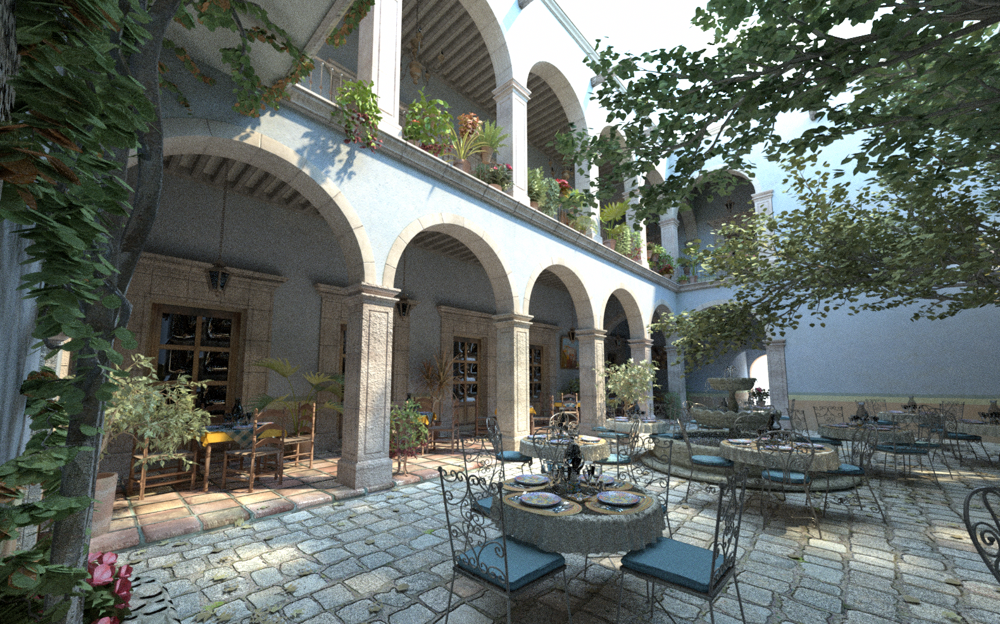

without texture
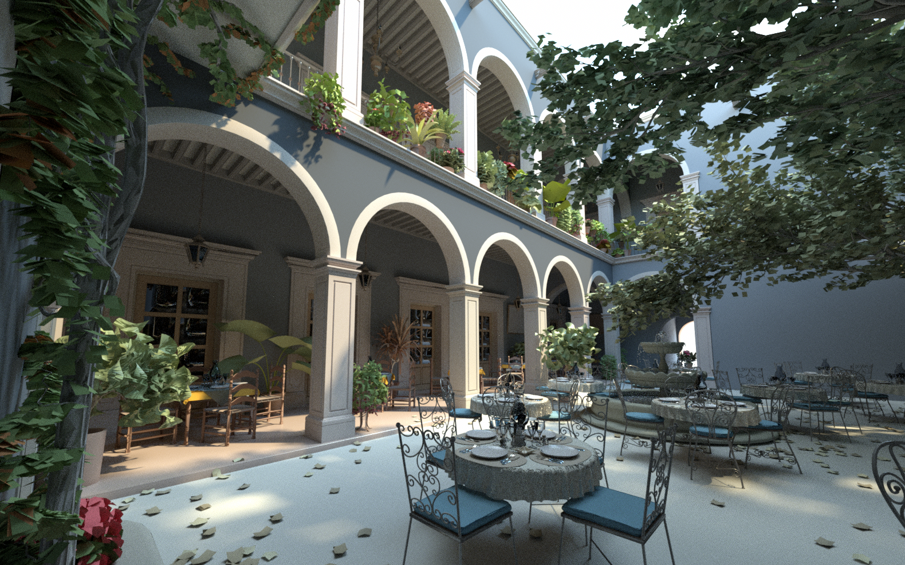

Figure 10.8: An Example of Image Textures. Image textures are used throughout the San Miguel scene to represent spatially varying surface appearance properties. (1) Scene rendered with image textures. (2) Each image texture has been replaced with its average value. Note how much visual richness is lost.

图 10.8：图像纹理示例。整个 San Miguel 场景都使用图像纹理来表示空间变化的表面外观属性。 (1) 用图像纹理渲染的场景。 (2) 每个图像纹理都被替换为其平均值。请注意损失了多少视觉丰富性。

The term texture map is often used to refer to this type of texture, although this usage blurs the distinction between the mapping that computes texture coordinates and the texture function itself. The implementation of this texture is in the files textures/imagemap.h and textures/imagemap.cpp.

The ImageTexture class is different from other textures in the system in that it is parameterized on both the data type of the texels it stores in memory as well as the data type of the value that it returns. Making this distinction allows us to create, for example, ImageTextures that store RGBSpectrum values in memory, but always return Spectrum values. In this way, when the system is compiled with full-spectral rendering enabled, the memory cost to store full SampledSpectrum texels doesn’t need to be paid for source images that only have RGB components.

术语texture map通常用于指代这种类型的纹理，尽管这种用法模糊了计算纹理坐标的映射和纹理函数本身之间的区别。这个纹理的实现在文件textures/imagemap.h 和textures/imagemap.cpp 中。

ImageTexture 类与系统中的其他纹理不同，因为它根据存储在内存中的纹素的数据类型以及它返回的值的数据类型进行参数化。通过这种区分，我们可以创建，例如，将 RGBSpectrum 值存储在内存中但始终返回 Spectrum 值的 ImageTexture。这样，当系统在启用全光谱渲染的情况下编译时，无需为仅具有 RGB 分量的源图像支付存储完整 SampledSpectrum 纹素的内存成本。

```
<<ImageTexture Declarations>>= 
template <typename Tmemory, typename Treturn>
    class ImageTexture : public Texture<Treturn> {
public:
    <<ImageTexture Public Methods>> 
private:
    <<ImageTexture Private Methods>> 
    <<ImageTexture Private Data>> 
};
```

The caller provides the ImageTexture with the filename of an image map, parameters that control the filtering of the map for antialiasing, and parameters that make it possible to scale and gamma-correct the texture values. The scale parameter will be explained later in this section, and the texture filtering parameters will be explained in Section 10.4.3. The contents of the file are used to create an instance of the MIPMap class that stores the texels in memory and handles the details of reconstruction and filtering to reduce aliasing.

For an ImageTexture that stores RGBSpectrum values in memory, its MIPMap stores the image data using three floating-point values for each sample. This is a somewhat wasteful representation, since a single image map may have millions of texels and may not need the full 32 bits of accuracy from the Floats used to store RGB values for each of them. Exercise 10.1 at the end of this chapter discusses this issue further.

调用者向 ImageTexture 提供图像纹理的文件名、控制纹理过滤以进行反走样的参数，以及可以对纹理值进行缩放和伽马校正的参数。缩放参数将在本节后面解释，纹理过滤参数将在 10.4.3 节中解释。该文件的内容用于创建 MIPMap 类的实例，该实例将纹素存储在内存中，并处理重建和过滤的细节以减少走样。

对于将 RGBSpectrum 值存储在内存中的 ImageTexture，其 MIPMap 使用每个样本的三个浮点值存储图像数据。这是一种有点浪费的表示，因为单个图像映射可能有数百万个纹理像素，并且可能不需要用于存储每个图像的 RGB 值的浮点数的完整 32 位精度。本章末尾的练习 10.1 进一步讨论了这个问题。

```
<<ImageTexture Method Definitions>>= 
template <typename Tmemory, typename Treturn> 
ImageTexture<Tmemory, Treturn>::ImageTexture(
        std::unique_ptr<TextureMapping2D> mapping,
        const std::string &filename, bool doTrilinear, Float maxAniso,
        ImageWrap wrapMode, Float scale, bool gamma)
    : mapping(std::move(mapping)) {
    mipmap = GetTexture(filename, doTrilinear, maxAniso,
                        wrapMode, scale, gamma);
}
<<ImageTexture Private Data>>= 
std::unique_ptr<TextureMapping2D> mapping;
MIPMap<Tmemory> *mipmap;
```

### 10.4.1 Texture Memory Management / 纹理内存管理

Each image map may require a meaningful amount of memory, and a complex scene may have thousands of image maps. Because each image texture may be reused many times within a scene, pbrt maintains a table of image maps that have been loaded so far, so that they are only loaded into memory once even if they are used in more than one ImageTexture. The ImageTexture constructor calls the static ImageTexture::GetTexture() method to get a MIPMap representation of the desired texture.

每个图像映射可能需要大量的内存，一个复杂的场景可能有数千个图像映射。因为每个图像纹理在一个场景中可能会被多次重复使用，所以 pbrt 维护了一张到目前为止已经加载的图像映射表，这样即使在多个 ImageTexture 中使用它们，它们也只会加载到内存中一次。 ImageTexture 构造函数调用静态 ImageTexture::GetTexture() 方法来获取所需纹理的 MIPMap 表示。

```
<<ImageTexture Method Definitions>>+= 
template <typename Tmemory, typename Treturn> MIPMap<Tmemory> *
ImageTexture<Tmemory, Treturn>::GetTexture(const std::string &filename, 
        bool doTrilinear, Float maxAniso, ImageWrap wrap, Float scale,
        bool gamma) {
    <<Return MIPMap from texture cache if present>> 
    <<Create MIPMap for filename>> 
    return mipmap;
}
```

TexInfo is a simple structure that holds the image map’s filename and filtering parameters; all of these must match for a MIPMap to be reused in another ImageTexture. Its definition is straightforward (its members exactly correspond to the parameters of the GetTexture() method) and won’t be included here.

TexInfo 是一个简单的结构，它保存了图像映射的文件名和过滤参数；所有这些都必须匹配 MIPMap 才能在另一个 ImageTexture 中重用。它的定义很简单（它的成员与 GetTexture() 方法的参数完全对应），此处不再赘述。

```
<<ImageTexture Private Data>>+= 
static std::map<TexInfo, std::unique_ptr<MIPMap<Tmemory>>> textures;
<<Return MIPMap from texture cache if present>>= 
TexInfo texInfo(filename, doTrilinear, maxAniso, wrap, scale, gamma);
if (textures.find(texInfo) != textures.end())
    return textures[texInfo].get();
If the texture hasn’t been loaded yet, a call to ReadImage() yields the image contents.

<<Create MIPMap for filename>>= 
Point2i resolution;
std::unique_ptr<RGBSpectrum[]> texels = ReadImage(filename, &resolution);
MIPMap<Tmemory> *mipmap = nullptr;
if (texels) {
    <<Convert texels to type Tmemory and create MIPMap>> 
} else {
    <<Create one-valued MIPMap>> 
}
textures[texInfo].reset(mipmap);
```

Because ReadImage() returns an array of RGBSpectrum values for the texels, it is necessary to convert these values to the particular type Tmemory of texel that this MIPMap is storing (e.g., Float) if the type of Tmemory isn’t RGBSpectrum. The per-texel conversion is handled by the utility routine ImageTexture::convertIn().

因为 ReadImage() 返回纹素的 RGBSpectrum 值数组，所以如果 Tmemory 的类型不是 RGBSpectrum，则有必要将这些值转换为该 MIPMap 正在存储的纹素的特定类型 Tmemory（例如，Float）。每个纹素的转换由工具函数 ImageTexture::convertIn() 处理。

```
<<Convert texels to type Tmemory and create MIPMap>>= 
std::unique_ptr<Tmemory[]> convertedTexels(new Tmemory[resolution.x *
                                                       resolution.y]);
for (int i = 0; i < resolution.x * resolution.y; ++i)
    convertIn(texels[i], &convertedTexels[i], scale, gamma);
mipmap = new MIPMap<Tmemory>(resolution, convertedTexels.get(),
                             doTrilinear, maxAniso, wrap);
```

Per-texel conversion is done using C++ function overloading. For every type to which we would like to be able to convert these values, a separate ImageTexture::convertIn() function must be provided. In the loop over texels earlier, C++’s function overloading mechanism will select the appropriate instance of ImageTexture::convertIn() based on the destination type. Unfortunately, it is not possible to return the converted value from the function, since C++ doesn’t support overloading by return type.

In addition to converting types, these functions optionally scale and gamma correct the texel values to map them to a desired range. Gamma correction is particularly important to handle carefully: computer displays generally don’t exhibit a linear relationship between the pixel values to be displayed and the radiance that they emit. Thus, an artist may create a texture map where, as seen on an LCD display, one part of the image appears twice as bright as another. However, the corresponding pixel values won’t in fact have a 2:1 relationship. (Conversely, pixels whose values have a 2:1 relationship don’t lead to a 2:1 brightness ratio.) This discrepancy is a problem for a renderer using such an image as a texture map, since the renderer usually expects a linear relationship between texel values and the quantity that they represent.

pbrt follows the sRGB standard, which prescribes a specific transfer curve matching the typical behavior of CRT displays. This standard is widely supported on 2015-era devices; other (non-CRT) devices such as LCDs or inkjet printers typically accept sRGB gamma-corrected values as input and then re-map them internally to match the device-specific behavior.

The sRGB gamma curve is a piecewise function with a linear term for low values and a power law for medium to large values.

每个纹理元素的转换是使用 C++ 函数重载完成的。对于我们希望能够将这些值转换为的每种类型，必须提供一个单独的 ImageTexture::convertIn() 函数。在前面的纹素循环中，C++ 的函数重载机制将根据目标类型选择合适的 ImageTexture::convertIn() 实例。不幸的是，不可能从函数返回转换后的值，因为 C++ 不支持按返回类型重载。

除了转换类型之外，这些函数还可以选择缩放和伽玛校正纹素值以将它们映射到所需范围。小心处理伽玛校正尤为重要：计算机显示器通常不会在要显示的像素值和它们发出的辐射之间表现出线性关系。因此，艺术家可以创建纹理，如在 LCD 显示器上所见，图像的一部分看起来比另一部分亮两倍。但是，相应的像素值实际上不会有 2:1 的关系。 （相反，值具有 2:1 关系的像素不会导致 2:1 亮度比。）这种差异对于使用这种图像作为纹理的渲染器来说是一个问题，因为渲染器通常期望纹素值和它们所代表的数量之间有线性关系。

pbrt 遵循 sRGB 标准，该标准规定了与 CRT 显示器的典型行为相匹配的特定传输曲线。该标准在 2015 年的设备上得到广泛支持；其他（非 CRT）设备（例如 LCD 或喷墨打印机）通常接受 sRGB 伽马校正值作为输入，然后在内部重新映射它们以匹配特定于设备的行为。

sRGB 伽马曲线是一个分段函数，对于低值具有线性项，对于中值到大值具有幂律。

$$
\gamma(x)= \begin{cases}12.92 x, & x \leq 0.0031308 \\ (1.055) x^{1 / 2.4}-0.055, & x>0.0031308\end{cases}
$$

```
<<Global Inline Functions>>+=  
inline Float GammaCorrect(Float value) {
    if (value <= 0.0031308f)
        return 12.92f * value;
    return 1.055f * std::pow(value, (Float)(1.f / 2.4f)) - 0.055f;
}
```

The GammaCorrect() will be used to write sRGB-compatible 8-bit image files in the WriteImage() function. To import textures into pbrt, we are interested in the opposite direction: removing an existing gamma correction to reestablish a linear relationship between brightness and pixel values.

GammaCorrect() 将用于在 WriteImage() 函数中写入与 sRGB 兼容的 8 位图像文件。要将纹理导入 pbrt，我们对相反的方向感兴趣：移除现有的 gamma 校正以重新建立亮度和像素值之间的线性关系。

```
<<Global Inline Functions>>+=  
inline Float InverseGammaCorrect(Float value) {
    if (value <= 0.04045f)
        return value * 1.f / 12.92f;
    return std::pow((value + 0.055f) * 1.f / 1.055f, (Float)2.4f);
}
```

Refer to the “Further Reading” section for a more detailed discussion of gamma correction.

InverseGammaCorrect() is only applied when indicated via the gamma argument of convertIn(). By default, this is the case when the input image has an 8-bit color depth.

有关伽马校正的更详细讨论，请参阅“进一步阅读”部分。

InverseGammaCorrect() 仅在通过 convertIn() 的 gamma 参数指示时应用。默认情况下，这是输入图像具有 8 位色深的情况。

```
<<ImageTexture Private Methods>>= 
static void convertIn(const RGBSpectrum &from, RGBSpectrum *to,
                      Float scale, bool gamma) { 
    for (int i = 0; i < RGBSpectrum::nSamples; ++i)
        (*to)[i] = scale * (gamma ? InverseGammaCorrect(from[i])
                                  : from[i]);
}

static void convertIn(const RGBSpectrum &from, Float *to,
                      Float scale, bool gamma) { 
    *to = scale * (gamma ? InverseGammaCorrect(from.y())
                         : from.y());
}
```

If the texture file wasn’t found or was unreadable, an image map with a single sample with a value of one is created so that the renderer can continue to generate an image of the scene without needing to abort execution. The ReadImage() function will issue a warning message in this case.

如果未找到纹理文件或无法读取纹理文件，则会创建一个具有值为 1 的单个样本的图像映射，以便渲染器可以继续生成场景图像而无需中止执行。在这种情况下，ReadImage() 函数将发出警告消息。

```
<<Create one-valued MIPMap>>= 
Tmemory oneVal = scale;
mipmap = new MIPMap<Tmemory>(Point2i(1, 1), &oneVal);
```

After the image is rendered and the system is cleaning up, the ClearCache() method is called to free the memory for the entries in the texture cache.

在图像被渲染并且系统正在清理之后，调用 ClearCache() 方法来释放纹理缓存中的条目的内存。

```
<<ImageTexture Public Methods>>= 
static void ClearCache() {
    textures.erase(textures.begin(), textures.end());
}
```

### 10.4.2 ImageTexture Evaluation / 图像纹理计算

The ImageTexture::Evaluate() routine does the usual texture coordinate computation and then hands the image map lookup to the MIPMap, which does the image filtering work for antialiasing. The returned value is still of type Tmemory; another conversion step similar to ImageTexture::convertIn() above converts to the returned type Treturn.

ImageTexture::Evaluate() 程序执行通常的纹理坐标计算，然后将图像映射查找交给 MIPMap，MIPMap 为反走样执行图像过滤工作。返回的值仍然是 Tmemory 类型；另一个类似于上述 ImageTexture::convertIn() 的转换步骤转换为返回类型 Treturn。

```
<<ImageTexture Public Methods>>+= 
Treturn Evaluate(const SurfaceInteraction &si) const { 
    Vector2f dstdx, dstdy;
    Point2f st = mapping->Map(si, &dstdx, &dstdy);
    Tmemory mem = mipmap->Lookup(st, dstdx, dstdy);
    Treturn ret;
    convertOut(mem, &ret);
    return ret;
}
<<ImageTexture Private Methods>>+= 
static void convertOut(const RGBSpectrum &from, Spectrum *to) { 
    Float rgb[3];
    from.ToRGB(rgb);
    *to = Spectrum::FromRGB(rgb);
}
static void convertOut(Float from, Float *to) { 
    *to = from;
}
```

### 10.4.3 MIP Maps

As always, if the image function has higher frequency detail than can be represented by the texture sampling rate, aliasing will be present in the final image. Any frequencies higher than the Nyquist limit must be removed by prefiltering before the function is evaluated. Figure $10.9$ shows the basic problem we face: an image texture has texels that are samples of some image function at a fixed frequency. The filter region for the lookup is given by its $(s, t)$ center point and offsets to the estimated texture coordinate locations for the adjacent image samples. Because these offsets are estimates of the texture sampling rate, we must remove any frequencies higher than twice the distance to the adjacent samples in order to satisfy the Nyquist criterion.

与往常一样，如果图像函数的频率细节高于纹理采样率可以表示的频率，则最终图像中将出现走样。任何高于 Nyquist 限制的频率都必须在计算函数之前通过预过滤去除。图 $10.9$ 显示了我们面临的基本问题：图像纹理中的纹素是某些图像函数在固定频率下的样本。查找的过滤器区域由其 $(s, t)$ 中心点和到相邻图像样本的估计纹理坐标位置的偏移量给出。因为这些偏移量是纹理采样率的估计，我们必须去除任何高于相邻样本距离两倍的频率，以满足Nyquist标准。


Figure 10.9: Given a point at which to perform an image map lookup (denoted by the solid point in the center) and estimates of the texture space sampling rate (denoted by adjacent solid points), it may be necessary to filter the contributions of a large number of texels in the image map (denoted by open points).

图 10.9：给定一个执行图像映射查找的点（由中心的纯色点表示）和纹理空间采样率的估计（由相邻的纯色点表示），可能需要过滤图像映射中的大量纹素（由开放点表示）。

The texture sampling and reconstruction process has a few key differences from the image sampling process discussed in Chapter 7. These differences make it possible to address the antialiasing problem with more effective and less computationally expensive techniques. For example, here it is inexpensive to get the value of a sample—only an array lookup is necessary (as opposed to having to trace a number of rays to compute radiance). Further, because the texture image function is fully defined by the set of samples and there is no mystery about what its highest frequency could be, there is no uncertainty related to the function’s behavior between samples. These differences make it possible to remove detail from the texture before sampling, thus eliminating aliasing.

However, the texture sampling rate will typically change from pixel to pixel. The sampling rate is determined by scene geometry and its orientation, the texture coordinate mapping function, and the camera projection and image sampling rate. Because the texture sampling rate is not fixed, texture filtering algorithms need to be able to filter over arbitrary regions of texture samples efficiently.

The MIPMap class implements two methods for efficient texture filtering with spatially varying filter widths. The first, trilinear interpolation, is fast and easy to implement and was widely used for texture filtering in early graphics hardware. The second, elliptically weighted averaging, is slower and more complex but returns extremely high-quality results. Figure 10.10 compares the result of texture filtering using trilinear interpolation and the EWA algorithm.

纹理采样和重建过程与第 7 章中讨论的图像采样过程有一些关键的区别。这些区别使得使用更有效且计算成本更低的技术来解决反走样问题成为可能。例如，这里获取样本值的成本很低——只需要进行数组查找（而不是必须跟踪许多光线来计算辐射度）。此外，由于纹理图像函数完全由样本集定义，并且其最高频率可能是多少并不神秘，因此样本之间的函数行为不存在不确定性。这些差异使得可以在采样之前从纹理中移除细节，从而消除走样。

然而，纹理采样率通常会随着像素的变化而变化。采样率由场景几何及其方向、纹理坐标映射函数以及相机投影和图像采样率决定。因为纹理采样率不是固定的，所以纹理过滤算法需要能够有效地过滤纹理样本的任意区域。

MIPMap 类实现了两种使用空间变化的过滤器宽度进行高效纹理过滤的方法。第一个是三线性插值，它快速且易于实现，并在早期图形硬件中广泛用于纹理过滤。第二种是椭圆加权平均，速度较慢且更复杂，但会返回极高质量的结果。图 10.10 比较了使用三线性插值和 EWA 算法进行纹理过滤的结果。

Trilinear interpolation


EWA filtering


Figure 10.10: Filtering the image map properly substantially improves the image. (1) trilinear interpolation, and (2) the EWA algorithm. Both of these approaches give a much better image than the unfiltered image map in Figure 10.1. Trilinear interpolation is inferior at handling strongly anisotropic filter footprints than EWA, which is why the edges and pole of the first sphere are a uniform gray color (the overall average value of the texture). With EWA, details from the image map are visible longer in those areas before they turn to gray.

图 10.10：正确过滤图像映射可以显着改善图像。 (1) 三线性插值，(2) EWA 算法。这两种方法都提供了比图 10.1 中未过滤的图像映射更好的图像。三线性插值在处理强各向异性过滤器区域方面不如 EWA，这就是为什么第一个球体的边缘和极点是均匀的灰色（纹理的整体平均值）。使用 EWA，图像映射中的细节在这些区域变为灰色之前可见的时间更长。

To limit the potential number of texels that need to be accessed, both of these filtering methods use an image pyramid of increasingly lower resolution prefiltered versions of the original image to accelerate their operation.  The original image texels are at the bottom level of the pyramid, and the image at each level is half the resolution of the previous level, up to the top level, which has a single texel representing the average of all of the texels in the original image. This collection of images needs at most $1 / 3$ more memory than storing the most detailed level alone and can be used to quickly find filtered values over large regions of the original image. The basic idea behind the pyramid is that if a large area of texels needs to be filtered a reasonable approximation is to use a higher level of the pyramid and do the filtering over the same area there, accessing many fewer texels.

为了限制需要访问的潜在纹素数量，这两种过滤方法都使用原始图像的分辨率越来越低的预过滤版本的图像锥体来加速它们的操作。原始图像texel在锥体的最底层，每一层的图像都是上一层分辨率的一半，直到顶层，它有一个单独的texel代表原始图像中所有纹素的平均值。与单独存储最详细的级别相比，此图像集合最多需要多 $1 / 3$ 的内存，并且可用于在原始图像的大区域上快速查找过滤值。锥体背后的基本思想是，如果需要过滤大面积的纹素，一个合理的近似是使用更高级别的锥体并在那里对相同区域进行过滤，访问更少的纹素。

```
<<MIPMap Declarations>>= 
template <typename T> class MIPMap {
public:
    <<MIPMap Public Methods>> 
private:
    <<MIPMap Private Methods>> 
    <<MIPMap Private Data>> 
};
```

In the constructor, the MIPMap copies the image data provided by the caller, resizes the image if necessary to ensure that its resolution is a power of two in each direction, and initializes a lookup table used by the elliptically weighted average filtering method in Section 10.4.5. It also records the desired behavior for texture coordinates that fall outside of the legal range in the wrapMode argument.

在构造函数中，MIPMap 复制调用者提供的图像数据，必要时调整图像大小以确保其分辨率在每个方向上都是 2 的幂，并初始化 10.4.5 节中椭圆加权平均过滤器方法使用的查找表。它还记录了超出 wrapMode 参数合法范围的纹理坐标的期望行为。

```
<<MIPMap Method Definitions>>= 
template <typename T>
MIPMap<T>::MIPMap(const Point2i &res, const T *img, bool doTrilinear,
                  Float maxAnisotropy, ImageWrap wrapMode)
    : doTrilinear(doTrilinear), maxAnisotropy(maxAnisotropy),
      wrapMode(wrapMode), resolution(res) {
    std::unique_ptr<T[]> resampledImage = nullptr;
    if (!IsPowerOf2(resolution[0]) || !IsPowerOf2(resolution[1])) {
        <<Resample image to power-of-two resolution>> 
    }
    <<Initialize levels of MIPMap from image>> 
    <<Initialize EWA filter weights if needed>> 
}
<<MIPMap Private Data>>= 
const bool doTrilinear;
const Float maxAnisotropy;
const ImageWrap wrapMode;
Point2i resolution;
```

MIPMap is a template class that is parameterized by the data type of the image texels. pbrt creates MIPMaps of both RGBSpectrum and Float images; Float MIP maps are used for representing directional distributions of intensity from goniometric light sources (Section 12.3.3), for example. The MIPMap implementation requires that the type T support just a few basic operations, including addition and multiplication by a scalar.

The ImageWrap enumerant, passed to the MIPMap constructor, specifies the desired behavior when the supplied texture coordinates are not in the legal $[0,1]$ range.

MIPMap 是一个模板类，由图像纹素的数据类型参数化。 pbrt 创建 RGBSpectrum 和 Float 图像的 MIPMap；例如，Float MIPMap用于表示来自测角光源的强度方向分布（第 12.3.3 节）。 MIPMap 实现要求类型 T 只需支持一些基本操作，包括标量的加法和乘法。

当提供的纹理坐标不在合法的 $[0,1]$ 范围内时，传递给 MIPMap 构造函数的 ImageWrap 枚举数指定所需的行为。

```
<<MIPMap Helper Declarations>>= 
enum class ImageWrap { Repeat, Black, Clamp };
```

Implementation of an image pyramid is somewhat easier if the resolution of the original image is an exact power of two in each direction; this ensures that there is a straightforward relationship between the level of the pyramid and the number of texels at that level. If the user has provided an image where the resolution in one or both of the dimensions is not a power of two, then the MIPMap constructor starts by resizing the image up to the next power-of-two resolution greater than the original resolution before constructing the pyramid. Exercise 10.5 at the end of the chapter describes an approach to building image pyramids with non-power-of-two resolutions.

Image resizing here involves more application of the sampling and reconstruction theory from Chapter 7: we have an image function that has been sampled at one sampling rate, and we’d like to reconstruct a continuous image function from the original samples to resample at a new set of sample positions. Because this represents an increase in the sampling rate from the original rate, we don’t have to worry about introducing aliasing due to undersampling high-frequency components in this step; we only need to reconstruct and directly resample the new function. Figure 10.11 illustrates this task in 1D.

如果原始图像的分辨率在每个方向上都是精确的 2 的幂，则图像锥体的实现会稍微容易一些；这确保了锥体的级别和该级别的纹素数量之间存在直接的关系。如果用户提供了一个图像，其中一个或两个维度的分辨率不是 2 的幂，则 MIPMap 构造函数首先将图像的大小调整为大于原始分辨率的下一个 2 的幂分辨率，然后再构造锥体。本章末尾的练习 10.5 描述了一种构建具有非二次幂分辨率的图像锥体的方法。

此处的图像调整大小涉及到更多应用第 7 章中的采样和重建理论：我们有一个以一个采样率采样的图像函数，我们想从原始样本重建一个连续的图像函数，以新的采样率重新采样一组样本位置。因为这代表了采样率从原始速率的增加，所以我们不必担心由于在这一步中对高频分量进行欠采样而引入走样；我们只需要重构并直接重新采样新函数。图 10.11 以 1D 形式说明了此任务。

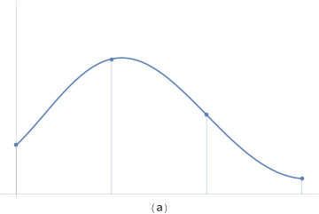

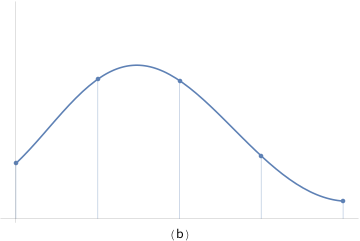

Figure 10.11: To increase an image’s resolution to be a power of two, the MIPMap performs two 1D resampling steps with a separable reconstruction filter. (a) A 1D function reconstructed from four samples, denoted by dots. (b) To represent the same image function with more samples, we just need to reconstruct the continuous function and evaluate it at the new positions.

图 10.11：为了将图像的分辨率提高到 2 的幂，MIPMap 使用可分离的重建过滤器执行两个 1D 重采样步骤。 (a) 从四个样本重建的一维函数，用点表示。 (b) 为了用更多的样本来表示相同的图像函数，我们只需要重建连续函数并在新的位置对其进行计算。

The MIPMap uses a separable reconstruction filter for this task; recall from Section $7.8$ that separable filters can be written as the product of 1D filters: $f(x, y)=f(x) f(y)$. One advantage of using a separable filter is that if we are using one to resample an image from one resolution $(s, t)$ to another $\left(s^{\prime}, t^{\prime}\right)$, then we can implement the resampling as two 1D resampling steps, first resampling in $s$ to create an image of resolution $\left(s^{\prime}, t\right)$ and then resampling that image to create the final image of resolution $\left(s^{\prime}, t^{\prime}\right)$. Resampling the image via two 1D steps in this manner simplifies implementation and makes the number of texels accessed for each texel in the final image a linear function of the filter width, rather than a quadratic one.

MIPMap 为此任务使用了可分离的重建过滤器；回想一下第 7.8 节，可分离过滤器可以写成一维过滤器的乘积： $f(x, y)=f(x) f(y)$ 。使用可分离过滤器的一个优点是，如果我们使用一个将图像从一个分辨率 $(s, t)$ 重新采样到另一个 $\left(s^{\prime}, t^{\prime}\right) $ ，然后我们可以将重采样实现为两个 1D 重采样步骤，首先在 $s$ 中重采样以创建分辨率为 $\left(s^{\prime}, t\right)$ 的图像，然后对该图像进行重采样以创建分辨率 $\left(s^{\prime}, t^{\prime}\right)$ 的最终图像。以这种方式通过两个 1D 步骤重新采样图像简化了实现，并使最终图像中每个纹素访问的纹素数量成为过滤器宽度的线性函数，而不是二次函数。

```
<<Resample image to power-of-two resolution>>= 
Point2i resPow2(RoundUpPow2(resolution[0]), RoundUpPow2(resolution[1]));
<<Resample image in s direction>> 
<<Resample image in t direction>> 
resolution = resPow2;
```

Reconstructing the original image function and sampling it at a new texel’s position are mathematically equivalent to centering the reconstruction filter kernel at the new texel’s position and weighting the nearby texels in the original image appropriately. Thus, each new texel is a weighted average of a small number of texels in the original image.

The MIPMap: : resampleWeights ( ) method determines which original texels contribute to each new texel and what the values are of the contribution weights for each new texel. It returns the values in an array of ResampleWeight structures for all of the texels in a $1 \mathrm{D}$ row or column of the image. Because this information is the same for all rows of the image when resampling in $s$ and all columns when resampling in $t$, it's more efficient to compute it once for each of the two passes and then reuse it many times for each one. Given these weights, the image is first magnified in the $s$ direction, turning the original image with resolution $resolution$ into an image with resolution (resPow2 [0], resolution[1]), which is stored in resampledImage. The implementation here allocates enough space in resampledImage to hold the final zoomed image with resolution (resPow2 [0] , resPow2 [1]), so two large allocations can be avoided.

重建原始图像函数并在新的纹素位置对其进行采样，在数学上等价于将重建过滤器核集中在新纹素的位置，并适当地加权原始图像中附近的纹素。因此，每个新的纹素是原始图像中少量纹素的加权平均值。

MIPMap::resampleWeights () 方法确定哪些原始纹素对每个新纹素有贡献，以及每个新纹素的贡献权重的值是多少。它返回图像的 $1 \mathrm{D}$ 行或列中所有纹素的 ResampleWeight 结构数组中的值。因为在 $s$ 中重采样时图像的所有行和在 $t$ 中重采样时的所有列，此信息都是相同的，所以对于两次遍历中的每一次计算一次，然后在每次遍历中多次重复使用它会更有效。给定这些权重后，首先将图像在 $s$ 方向放大，将具有分辨率 $resolution$ 的原始图像变成具有分辨率（resPow2[0]，resPow2[1]）的图像，存储在resampledImage中。这里的实现在 resampledImage 中分配了足够的空间来保存具有分辨率（resPow2 [0] ， resPow2 [1]）的最终缩放图像，因此可以避免两次大分配。

```
<<Resample image in s direction>>= 
std::unique_ptr<ResampleWeight[]> sWeights =
    resampleWeights(resolution[0], resPow2[0]);
resampledImage.reset(new T[resPow2[0] * resPow2[1]]);
<<Apply sWeights to zoom in s direction>> 
```

For the reconstruction filter used here, no more than four of the original texels will contribute to each new texel after zooming, so ResampleWeight only needs to hold four weights. Because the four texels are contiguous, we only store the offset to the first one.

对于这里使用的重建过滤器，不超过四个原始纹素会在缩放后对每个新纹素做出贡献，因此 ResampleWeight 只需要保持四个权重。因为四个纹素是连续的，所以我们只存储第一个的偏移量。

```
<<MIPMap Helper Declarations>>+= 
struct ResampleWeight {
    int firstTexel;
    Float weight[4]; 
};
<<MIPMap Private Methods>>= 
std::unique_ptr<ResampleWeight[]> resampleWeights(int oldRes,
        int newRes) {
    Assert(newRes >= oldRes);
    std::unique_ptr<ResampleWeight[]> wt(new ResampleWeight[newRes]);
    Float filterwidth = 2.f;
    for (int i = 0; i < newRes; ++i) {
        <<Compute image resampling weights for ith texel>> 
    }
    return wt;
}
```

Just as it was important to distinguish between discrete and continuous pixel coordinates in Chapter 7, the same issues need to be addressed with texel coordinates here. We will use the same conventions as described in Section 7.1.7. For each new texel, this function starts by computing its continuous coordinates in terms of the old texel coordinates. This value is stored in center, because it is the center of the reconstruction filter for the new texel. Next, it is necessary to find the offset to the first texel that contributes to the new texel. This is a slightly tricky calculation—after subtracting the filter width to find the start of the filter’s nonzero range, it is necessary to add an extra 0.5 offset to the continuous coordinate before taking the floor to find the discrete coordinate. Figure 10.12 illustrates why this offset is needed.

正如在第 7 章中区分离散像素坐标和连续像素坐标很重要一样，这里的纹素坐标也需要解决同样的问题。我们将使用与第 7.1.7 节中描述的相同的约定。对于每个新的纹素，此函数首先根据旧纹素坐标计算其连续坐标。该值存储在中心，因为它是新纹素的重建过滤器的中心。接下来，有必要找到对新纹素有贡献的第一个纹素的偏移量。这是一个稍微棘手的计算——在减去过滤器宽度以找到过滤器的非零范围的起点之后，需要在连续坐标上增加一个额外的 0.5 偏移量，然后才能找到离散坐标。图 10.12 说明了为什么需要这个偏移量。


Figure 10.12: The computation to find the first texel inside a reconstruction filter's support is slightly tricky. Consider a filter centered around continuous coordinate $2.75$ with radius 2 , as shown here. The filter's support covers the range $[0.75,4.75]$, although texel zero is outside the filter's support: adding $0.5$ to the lower end before taking the floor to find the discrete texel gives the correct starting texel, number one.

Starting from this first contributing texel, this function loops over four texels, computing each one’s offset to the center of the filter kernel and the corresponding filter weight.

图 10.12：在重建过滤器的支持中找到第一个纹素的计算有点棘手。考虑一个以半径为 2 的连续坐标 $2.75$ 为中心的过滤器，如下所示。过滤器的支持覆盖范围 $[0.75,4.75]$ ，尽管 texel 0超出了过滤器的支持：在下限之前添加 $0.5$ 以找到离散的 texel 给出正确的起始 texel，1。

从第一个贡献的纹素开始，这个函数循环四个纹素，计算每个纹素到过滤器内核中心的偏移量和相应的过滤器权重。

```
<<Compute image resampling weights for ith texel>>= 
Float center = (i + .5f) * oldRes / newRes;
wt[i].firstTexel = std::floor((center - filterwidth) + 0.5f);
for (int j = 0; j < 4; ++j) {
    Float pos = wt[i].firstTexel + j + .5f;
    wt[i].weight[j] = Lanczos((pos - center) / filterwidth);
}
<<Normalize filter weights for texel resampling>> 
```

The reconstruction filter function used to compute the weights, Lanczos(), is the same as the one in LanczosSincFilter::Sinc().

用于计算权重的重构过滤器函数 Lanczos() 与 LanczosSincFilter::Sinc() 中的函数相同。

```
<<Texture Declarations>>+= 
Float Lanczos(Float, Float tau = 2);
```

Depending on the filter function used, the four filter weights may not sum to one. Therefore, to ensure that the resampled image won’t be any brighter or darker than the original image, the weights are normalized here.

根据所使用的过滤器函数，四个过滤器权重之和可能不等于一。因此，为了确保重新采样的图像不会比原始图像更亮或更暗，这里的权重被归一化。

```
<<Normalize filter weights for texel resampling>>= 
Float invSumWts = 1 / (wt[i].weight[0] + wt[i].weight[1] + 
                       wt[i].weight[2] + wt[i].weight[3]);
for (int j = 0; j < 4; ++j)
    wt[i].weight[j] *= invSumWts;
```

Once the weights have been computed, it’s easy to apply them to compute the zoomed texels. For each of the resolution[1] horizontal scan lines in the original image, a pass is made across the resPow2[0] texels in the s-zoomed image using the precomputed weights to compute their values. Because the computation for each texel is completely independent of the computation for every other texel, and because this computation requires a bit of processing, it’s worthwhile to split the image into sections and work on them in parallel with multiple threads.

一旦计算了权重，就很容易应用它们来计算缩放的纹素。对于原始图像中的每个resolution[1] 水平扫描线，使用预先计算的权重在 s 缩放图像中的 resPow2[0] 纹素上进行传递以计算它们的值。因为每个 texel 的计算完全独立于其他每个 texel 的计算，并且因为这种计算需要一些处理，所以值得将图像分割成多个部分并在多个线程并行处理它们。

```
<<Apply sWeights to zoom in s direction>>= 
ParallelFor(
    [&](int t) {
        for (int s = 0; s < resPow2[0]; ++s) {
            <<Compute texel (s,t) in s-zoomed image>> 
        }
    }, resolution[1], 16);
```

The ImageWrap parameter to the MIPMap constructor determines the convention to be used for out-of-bounds texel coordinates. It either remaps them to valid values with a modulus or clamp calculation or uses a black texel value.

MIPMap 构造函数的 ImageWrap 参数确定用于越界纹素坐标的约定。它要么通过取模或clamp计算将它们重新映射为有效值，要么使用黑色纹素值。

```
<<Compute texel (s,t) in -zoomed image>>= 
resampledImage[t * resPow2[0] + s] = 0.f;
for (int j = 0; j < 4; ++j) {
    int origS = sWeights[s].firstTexel + j;
    if (wrapMode == ImageWrap::Repeat) 
        origS = Mod(origS, resolution[0]);
    else if (wrapMode == ImageWrap::Clamp) 
        origS = Clamp(origS, 0, resolution[0] - 1);
    if (origS >= 0 && origS < (int)resolution[0])
        resampledImage[t * resPow2[0] + s] +=
            sWeights[s].weight[j] * img[t * resolution[0] + origS];
}
```

The process for resampling in the t direction is almost the same as for s, so we won’t include the implementation here.

Once we have an image with resolutions that are powers of two, the levels of the MIP map can be initialized, starting from the bottom (finest) level. Each higher level is found by filtering the texels from the previous level.

Because image maps use a fair amount of memory, and because 8 to 20 texels are typically used per image texture lookup to compute a filtered value, it’s worth carefully considering how the texels are laid out in memory, since reducing cache misses while accessing the texture map can noticeably improve the renderer’s performance. Because both of the texture filtering methods implemented in this section access a set of texels in a rectangular region of the image map each time a lookup is performed, the MIPMap uses the BlockedArray template class to store the 2D arrays of texel values, rather than a standard C++ array. The BlockedArray reorders the array values in memory in a way that improves cache coherence when the values are accessed with these kinds of rectangular patterns; it is described in Section A.4.4 in Appendix A.

在 t 方向重采样的过程与 s 几乎相同，因此我们不会在此处包含实现。

一旦我们有了一个分辨率为 2 次方的图像，MIP map的层级就可以被初始化，从底部（最好的）层开始。每个更高的级别是通过过滤来自前一个级别的纹素来找到的。

因为图像映射使用相当多的内存，并且因为每个图像纹理查找通常使用 8 到 20 个纹素来计算过滤值，所以值得仔细考虑纹素在内存中的布局方式，因为在访问纹理时会减少缓存未命中map 可以显着提高渲染器的性能。因为本节中实现的两种纹理过滤方法在每次执行查找时都会访问图像映射的矩形区域中的一组纹素，所以 MIPMap 使用 BlockedArray 模板类来存储纹素值的 2D 数组，而不是标准 C++ 数组。 BlockedArray 对内存中的数组值进行重新排序，从而在使用这些类型的矩形模式访问值时提高缓存的一致性；它在附录 A 的第 A.4.4 节中进行了描述。

```
<<Initialize levels of MIPMap from image>>= 
int nLevels = 1 + Log2Int(std::max(resolution[0], resolution[1]));
pyramid.resize(nLevels);
<<Initialize most detailed level of MIPMap>> 
for (int i = 1; i < nLevels; ++i) {
    <<Initialize i th MIPMap level from i-1 st level>> 
}
<<MIPMap Private Data>>+=  
std::vector<std::unique_ptr<BlockedArray<T>>> pyramid;
<<MIPMap Public Methods>>= 
int Width() const { return resolution[0]; }
int Height() const { return resolution[1]; }
int Levels() const { return pyramid.size(); }
```

The base level of the MIP map, which holds the original data (or the resampled data, if it didn’t originally have power-of-two resolutions), is initialized by the default BlockedArray constructor.

保存原始数据（或重采样数据，如果它最初没有二次方分辨率）的 MIP map的基本级别由默认的 BlockedArray 构造函数初始化。

```
<<Initialize most detailed level of MIPMap>>= 
pyramid[0].reset(new BlockedArray<T>(resolution[0], resolution[1],
    resampledImage ? resampledImage.get() : img));
```

Before showing how the rest of the levels are initialized, we will first define a texel access function that will be used during that process. MIPMap::Texel() returns a reference to the texel value for the given discrete integer-valued texel position. As described earlier, if an out-of-range texel coordinate is passed in, then based on the value of wrapMode, this method effectively repeats the texture over the entire 2D texture coordinate domain by taking the modulus of the coordinate with respect to the texture size, clamps the coordinates to the valid range so that the border pixels are used, or returns a black texel for out-of-bounds coordinates.

在展示其余级别如何初始化之前，我们将首先定义一个将在该过程中使用的纹素访问函数。 MIPMap::Texel() 返回对给定离散整数值纹素位置的纹素值的引用。如前所述，如果传入了超出范围的纹理坐标，则基于 wrapMode 的值，该方法通过取坐标相对于纹理的模数，有效地在整个 2D 纹理坐标域上重复纹理大小，将坐标Clamping在有效范围内，以便使用边缘像素，或为越界坐标返回黑色纹素。

```
<<MIPMap Method Definitions>>+=  
template <typename T>
const T &MIPMap<T>::Texel(int level, int s, int t) const {
    const BlockedArray<T> &l = *pyramid[level];
    <<Compute texel (s,t) accounting for boundary conditions>> 
    return l(s, t);
}
<<Compute texel (s,t) accounting for boundary conditions>>= 
switch (wrapMode) {
    case ImageWrap::Repeat:
        s = Mod(s, l.uSize());
        t = Mod(t, l.vSize());
        break;
    case ImageWrap::Clamp:
        s = Clamp(s, 0, l.uSize() - 1);
        t = Clamp(t, 0, l.vSize() - 1);
        break;
    case ImageWrap::Black: {
        static const T black = 0.f;
        if (s < 0 || s >= (int)l.uSize() || 
            t < 0 || t >= (int)l.vSize())
            return black;
        break;
    }
}
```

For non-square images, the resolution in one direction must be clamped to one for the upper levels of the image pyramid, where there is still downsampling to do in the larger of the two resolutions. This is handled by the following std::max() calls:

对于非方形图像，对于图像锥体的上层，必须将一个方向的分辨率限制为 1，在这两个分辨率中的较大者中仍然需要进行下采样。这由以下 std::max() 调用处理：

```
<<Initialize i th MIPMap level from i-1 st level>>= 
int sRes = std::max(1, pyramid[i - 1]->uSize() / 2);
int tRes = std::max(1, pyramid[i - 1]->vSize() / 2);
pyramid[i].reset(new BlockedArray<T>(sRes, tRes));
<<Filter four texels from finer level of pyramid>> 
```

The MIPMap uses a simple box filter to average four texels from the previous level to find the value at the current texel. Using the Lanczos filter here would give a slightly better result for this computation, although this modification is left for Exercise 10.4 at the end of the chapter. As with resampling to power-of-two resolutions, doing this downfiltering using multiple threads rather than with a regular for loop is worthwhile here.

MIPMap 使用一个简单的box filter对上一层的四个纹素进行平均，以找到当前纹素的值。在这里使用 Lanczos 过滤器会为这个计算提供一个稍微好一点的结果，尽管这个修改留给本章末尾的练习 10.4。与重采样到二次幂分辨率一样，在这里使用多线程而不是使用常规 for 循环进行这种下过滤是值得的。

```
<<Filter four texels from finer level of pyramid>>= 
ParallelFor(
    [&](int t) {
        for (int s = 0; s < sRes; ++s)
            (*pyramid[i])(s, t) = .25f *
               (Texel(i-1, 2*s, 2*t)   + Texel(i-1, 2*s+1, 2*t) + 
                Texel(i-1, 2*s, 2*t+1) + Texel(i-1, 2*s+1, 2*t+1));
    }, tRes, 16);
```

### 10.4.4 Isotropic Triangle Filter / 各向同性三角形过滤器

The first of the two MIPMap::Lookup() methods uses a triangle filter over the texture samples to remove high frequencies. Although this filter function does not give high-quality results, it can be implemented very efficiently. In addition to the (s,t) coordinates of the evaluation point, the caller passes this method a filter width for the lookup, giving the extent of the region of the texture to filter across. This method filters over a square region in texture space, so the width should be conservatively chosen to avoid aliasing in both the s and t directions. Filtering techniques like this one that do not support a filter extent that is non-square or non-axis-aligned are known as isotropic. The primary disadvantage of isotropic filtering algorithms is that textures viewed at an oblique angle will appear blurry, since the required sampling rate along one axis will be very different from the sampling rate along the other in this case.

Because filtering over many texels for wide filter widths would be inefficient, this method chooses a MIP map level from the pyramid such that the filter region at that level would cover four texels at that level. Figure 10.13 illustrates this idea.

两个 MIPMap::Lookup() 方法中的第一个在纹理样本上使用三角形过滤器来去除高频。尽管此过滤器函数不能提供高质量的结果，但它可以非常有效地实现。除了计算点的 (s,t) 坐标之外，调用者还向该方法传递了一个过滤器宽度以供查找，给出要过滤的纹理区域的范围。此方法过滤纹理空间中的正方形区域，因此应保守选择宽度以避免在 s 和 t 方向上出现走样。像这种不支持非方形或非轴对齐的过滤器范围的过滤技术称为各向同性。各向同性过滤算法的主要缺点是从倾斜角度观察​​的纹理会显得模糊，因为在这种情况下，沿一个轴所需的采样率将与沿另一个轴的采样率非常不同。

因为对宽过滤器宽度的许多纹素进行过滤效率低下，所以该方法从锥体中选择一个 MIP map级别，以便该级别的过滤区域将覆盖该级别的四个纹素。图 10.13 说明了这个想法。


Figure 10.13: Choosing a MIP Map Level for the Triangle Filter. The MIPMap chooses a level such that the filter covers four texels.

图 10.13：为三角形过滤器选择 MIP map级别。 MIPMap 选择一个级别，使过滤器覆盖四个纹素。

```
<<MIPMap Method Definitions>>+=  
template <typename T>
T MIPMap<T>::Lookup(const Point2f &st, Float width) const {
    <<Compute MIPMap level for trilinear filtering>> 
    <<Perform trilinear interpolation at appropriate MIPMap level>> 
}
```

Since the resolutions of the levels of the pyramid are all powers of two, the resolution of level $l$ is $2^{\text {nLevels-1-l }}$. Therefore, to find the level with a texel spacing width $w$ requires solving

由于锥体层级的分辨率都是 2 的幂，所以层级 $l$ 的分辨率是 $2^{\text {nLevels-1-l }}$ 。因此，要找到具有纹素间距宽度 $w$ 的层级需要求解

$$
\frac{1}{w}=2^{\text {nLevels }-1-l}
$$

for $l$. In general, this will be a floating-point value between two MIP map levels.

$l$ 。通常，这将是两个 MIP map级别之间的浮点值。

```
<<Compute MIPMap level for trilinear filtering>>= 
Float level = Levels() - 1 + Log2(std::max(width, (Float)1e-8));
```

As shown by Figure 10.13, applying a triangle filter to the four texels around the sample point will either filter over too small a region or too large a region (except for very carefully selected filter widths). The implementation here applies the triangle filter at both of these levels and blends between them according to how close level is to each of them. This helps hide the transitions from one MIP map level to the next at nearby pixels in the final image. While applying a triangle filter to four texels at two levels in this manner doesn’t give exactly the same result as applying it to the original highest resolution texels, the difference isn’t too bad in practice, and the efficiency of this approach is worth this penalty. In any case, the elliptically weighted average filtering in the next section should be used when texture quality is important.

如图 10.13 所示，对采样点周围的四个纹素应用三角形过滤器将过滤过小的区域或过大的区域（除了非常仔细选择的过滤器宽度）。这里的实现在这两个级别上都应用了三角形过滤器，并根据级别与每个级别的接近程度在它们之间进行混合。这有助于在最终图像的附近像素处隐藏从一个 MIP map级别到下一个 MIP map级别的过渡。虽然以这种方式将三角形过滤器应用于两个级别的四个纹理像素并不会给出与将其应用于原始最高分辨率纹理像素完全相同的结果，但实际上差异并不算太差，并且这种方法的效率值得这个惩罚。无论如何，当纹理质量很重要时，应该使用下一节中的椭圆加权平均滤波。

```
<<Perform trilinear interpolation at appropriate MIPMap level>>= 
if (level < 0)
    return triangle(0, st);
else if (level >= Levels() - 1)
    return Texel(Levels() - 1, 0, 0);
else {
    int iLevel = std::floor(level);
    Float delta = level - iLevel;
    return Lerp(delta, triangle(iLevel, st), triangle(iLevel + 1, st));
}
```

Given floating-point texture coordinates in $[0,1]^{2}$, the MIPMap: :triangle ( ) routine uses a triangle filter to interpolate between the four texels that surround the sample point, as shown in Figure 10.14. This method first scales the coordinates by the texture resolution at the given MIP map level in each direction, turning them into continuous texel coordinates. Because these are continuous coordinates, but the texels in the image map are defined at discrete texture coordinates, it's important to carefully convert into a common representation. Here, we will do all of our work in discrete coordinates, mapping the continuous texture coordinates to discrete space.

给定 $[0,1]^{2}$ 中的浮点纹理坐标，MIPMap: :triangle ( ) 程序使用三角形过滤器在围绕采样点的四个纹理像素之间进行插值，如图 10.14 所示。此方法首先在每个方向上按给定 MIP map级别的纹理分辨率缩放坐标，将它们转换为连续的纹理坐标。因为这些是连续坐标，但图像映射中的纹素是在离散的纹理坐标中定义的，所以仔细转换为通用表示非常重要。在这里，我们将在离散坐标中完成所有工作，将连续纹理坐标映射到离散空间。


Figure 10.14: To compute the value of the image texture function at an arbitrary $(s, t)$ position, MIPMap : : triangle ( ) finds the four texels around $(s, t)$ and weights them according to a triangle filter based on their distance to $(s, t)$. One way to implement this is as a series of linear interpolations, as shown here: First, the two texels below $(s, t)$ are linearly interpolated to find a value at $(s, 0)$, and the two texels above it are interpolated to find $(s, 1)$. Then, $(s, 0)$ and $(s, 1)$ are linearly interpolated again to find the value at $(s, t)$.

图 10.14：为了计算任意 $(s, t)$ 位置的图像纹理函数的值，MIPMap :: triangle ( ) 找到 $(s, t)$ 周围的四个纹理像素，并根据三角形过滤器对它们进行加权基于它们与 $(s, t)$ 的距离。实现这一点的一种方法是一系列线性插值，如下所示：首先，对 $(s, t)$ 下面的两个纹素进行线性插值以找到 $(s, 0)$ 处的值，然后将两个纹素在它上面进行插值以找到 $(s, 1)$ 。然后，$(s, 0)$ 和 $(s, 1)$ 再次线性插值以找到 $(s, t)$ 处的值。

For example, consider the 1D case with a continuous texture coordinate of $2.4$ : this coordinate is a distance of $0.1$ below the discrete texel coordinate 2 (which corresponds to a continuous coordinate of $2.5$ ) and is $0.9$ above the discrete coordinate 1 (continuous coordinate $1.5$ ). Thus, if we subtract $0.5$ from the continuous coordinate $2.4$, giving $1.9$, we can correctly compute the correct distances to the discrete coordinates 1 and 2 by subtracting coordinates.

After computing the distances in $s$ and $t$ to the texel at the lower left of the given coordinates, $\mathrm{ds}$ and $\mathrm{dt}$, MIPMap::triangle( ) determines weights for the four texels and computes the filtered value. Recall that the triangle filter is

例如，考虑具有连续纹理坐标 $2.4$ 的 1D 情况：此坐标是离散纹理坐标 2 下方 $0.1$ 的距离（对应于 $2.5$ 的连续坐标），并且是离散坐标 1 上方 $0.9$ 的距离（连续坐标 $1.5$ ）。因此，如果我们从连续坐标 $2.4$ 中减去 $0.5$ ，得到 $1.9$ ，我们可以通过减去坐标来正确计算到离散坐标 1 和 2 的正确距离。

在计算 $s$ 和 $t$ 到给定坐标左下角纹素的距离后，$\mathrm{ds}$ 和 $\mathrm{dt}$ ，MIPMap::triangle( ) 确定权重四个纹素并计算过滤值。回想一下，三角形过滤器是

$$
f(x, y)=(1-|x|)(1-|y|)
$$

the appropriate weights follow directly. Notice the similarity between this computation and BilerpTexture::Evaluate( ).

适当的权重直接跟随。注意这个计算和 BilerpTexture::Evaluate() 之间的相似性。

```
<<MIPMap Method Definitions>>+=  
template <typename T>
T MIPMap<T>::triangle(int level, const Point2f &st) const {
    level = Clamp(level, 0, Levels() - 1);
    Float s = st[0] * pyramid[level]->uSize() - 0.5f;
    Float t = st[1] * pyramid[level]->vSize() - 0.5f;
    int s0 = std::floor(s), t0 = std::floor(t);
    Float ds = s - s0, dt = t - t0;
    return (1 - ds) * (1 - dt) * Texel(level, s0,   t0) +
           (1 - ds) * dt       * Texel(level, s0,   t0+1) +
           ds       * (1 - dt) * Texel(level, s0+1, t0) +
           ds       * dt       * Texel(level, s0+1, t0+1);
}
```

### 10.4.5 Elliptically Weighted Average / 椭圆加权平均

The elliptically weighted average (EWA) algorithm fits an ellipse to the two axes in texture space given by the texture coordinate differentials and then filters the texture with a Gaussian filter function (Figure 10.15). It is widely regarded as one of the best texture filtering algorithms in graphics and has been carefully derived from the basic principles of sampling theory. Unlike the triangle filter in the previous section, it can filter over arbitrarily oriented regions of the texture, with some flexibility of having different filter extents in different directions. This type of filter is known as anisotropic. This capability greatly improves the quality of its results, since it can properly adapt to different sampling rates along the two image axes.

椭圆加权平均 (EWA) 算法将一个椭圆拟合到由纹理坐标差分给出的纹理空间中的两个轴上，然后使用高斯过滤器函数过滤纹理（图 10.15）。它被广泛认为是图形中最好的纹理过滤算法之一，并且是从采样理论的基本原理中精心推导出来的。与上一节中的三角形过滤器不同，它可以过滤纹理的任意方向区域，具有一定的灵活性，可以在不同方向具有不同的过滤器范围。这种类型的过滤器被称为各向异性。这种能力极大地提高了其结果的质量，因为它可以正确地适应沿两个图像轴的不同采样率。


Figure 10.15: The EWA filter applies a Gaussian filter to the texels in an elliptical area around the evaluation point. The extent of the ellipse is such that its edge passes through the positions of the adjacent texture samples as estimated by the texture coordinate partial derivatives.

图 10.15：EWA 过滤器对计算点周围椭圆区域中的纹素应用高斯过滤器。椭圆的范围使得它的边缘通过纹理坐标偏导数估计的相邻纹理样本的位置。

We won’t show the full derivation of this filter here, although we do note that it is distinguished by being a unified resampling filter: it simultaneously computes the result of a Gaussian filtered texture function convolved with a Gaussian reconstruction filter in image space. This is in contrast to many other texture filtering methods that ignore the effect of the image space filter or equivalently assume that it is a box. Even if a Gaussian isn’t being used for filtering the samples for the image being rendered, taking some account of the spatial variation of the image filter improves the results, assuming that the filter being used is somewhat similar in shape to the Gaussian, as the Mitchell and windowed sinc filters are.

我们不会在这里展示这个过滤器的完整推导，尽管我们确实注意到它的区别在于它是一个统一的重采样过滤器：它同时计算高斯滤波纹理函数与图像空间中的高斯重建过滤器卷积的结果。这与许多其他忽略图像空间过滤器效果或等效地假设它是一个盒子的纹理过滤方法形成对比。即使没有使用高斯来过滤正在渲染的图像的样本，考虑到图像过滤器的空间变化也会改善结果，假设所使用的过滤器在形状上与高斯有些相似，如Mitchell 和windowed sinc 过滤器。

```
<<MIPMap Method Definitions>>+=  
template <typename T> 
T MIPMap<T>::Lookup(const Point2f &st, Vector2f dst0,
                    Vector2f dst1) const {
    if (doTrilinear) {
        Float width = std::max(std::max(std::abs(dst0[0]),
                                        std::abs(dst0[1])),
                               std::max(std::abs(dst1[0]),
                                        std::abs(dst1[1])));
        return Lookup(st, 2 * width);
    }
    <<Compute ellipse minor and major axes>> 
    <<Clamp ellipse eccentricity if too large>> 
    <<Choose level of detail for EWA lookup and perform EWA filtering>> 
}
```

The screen space partial derivatives of the texture coordinates define the axes of the ellipse. The lookup method starts out by determining which of the two axes is the major axis (the longer of the two) and which is the minor, swapping them if needed so that dst0 is the major axis. The length of the minor axis will be used shortly to select a MIP map level.

纹理坐标的屏幕空间偏导数定义了椭圆的轴。查找方法首先确定两个轴中的哪一个是主轴（两者中较长的一个），哪个是次轴，如果需要交换它们以便 dst0 是主轴。短轴的长度将很快用于选择 MIP map级别。

```
<<Compute ellipse minor and major axes>>= 
if (dst0.LengthSquared() < dst1.LengthSquared())
    std::swap(dst0, dst1);
Float majorLength = dst0.Length();
Float minorLength = dst1.Length();
```

Next the eccentricity of the ellipse is computed—the ratio of the length of the major axis to the length of the minor axis. A large eccentricity indicates a very long and skinny ellipse. Because this method filters texels from a MIP map level chosen based on the length of the minor axis, highly eccentric ellipses mean that a large number of texels need to be filtered. To avoid this expense (and to ensure that any EWA lookup takes a bounded amount of time), the length of the minor axis may be increased to limit the eccentricity. The result may be an increase in blurring, although this effect usually isn’t noticeable in practice.

接下来计算椭圆的偏心率——长轴长度与短轴长度之比。较大的偏心率表示椭圆很长且很窄。因为此方法从基于短轴长度选择的 MIP map级别过滤纹素，所以高度偏心的椭圆意味着需要过滤大量纹素。为避免此消耗（并确保任何 EWA 查找花费有限的时间），可增加短轴的长度以限制偏心率。结果可能会增加模糊，尽管这种效果在实践中通常并不明显。

```
<<Clamp ellipse eccentricity if too large>>= 
if (minorLength * maxAnisotropy < majorLength && minorLength > 0) {
    Float scale = majorLength / (minorLength * maxAnisotropy);
    dst1 *= scale;
    minorLength *= scale;
}
if (minorLength == 0)
    return triangle(0, st);
```

Like the triangle filter, the EWA filter uses the image pyramid to reduce the number of texels to be filtered for a particular texture lookup, choosing a MIP map level based on the length of the minor axis. Given the limited eccentricity of the ellipse due to the clamping above, the total number of texels used is thus bounded. Given the length of the minor axis, the computation to find the appropriate pyramid level is the same as was used for the triangle filter. Similarly, the implementation here blends between the filtered results at the two levels around the computed level of detail, again to reduce artifacts from transitions from one level to another.

与三角形过滤器一样，EWA 过滤器使用图像锥体来减少特定纹理查找要过滤的纹素数量，根据短轴的长度选择 MIP map级别。由于上面的clamping，椭圆的离心率有限，因此使用的纹理像素的总数是有限的。给定短轴的长度，找到适当锥体级别的计算与用于三角形过滤器的计算相同。类似地，这里的实现混合了围绕计算的细节级别的两个级别的过滤结果，再次减少了从一个级别到另一个级别的过渡的伪影。

```
<<Choose level of detail for EWA lookup and perform EWA filtering>>= 
Float lod = std::max((Float)0, Levels() - (Float)1 + Log2(minorLength));
int ilod = std::floor(lod);
return Lerp(lod - ilod, EWA(ilod, st, dst0, dst1),
                        EWA(ilod + 1, st, dst0, dst1));
```

The MIPMap::EWA() method actually applies the filter at a particular level.

MIPMap::EWA() 方法实际上在特定级别应用过滤器。

```
<<MIPMap Method Definitions>>+= 
template <typename T>
T MIPMap<T>::EWA(int level, Point2f st, Vector2f dst0,
                 Vector2f dst1) const {
    if (level >= Levels()) return Texel(Levels() - 1, 0, 0);
    <<Convert EWA coordinates to appropriate scale for level>> 
    <<Compute ellipse coefficients to bound EWA filter region>> 
    <<Compute the ellipse’s (s,t) bounding box in texture space>> 
    <<Scan over ellipse bound and compute quadratic equation>> 
}
```

This method first converts from texture coordinates in $[0,1]$ to coordinates and differentials in terms of the resolution of the chosen MIP map level. It also subtracts $0.5$ from the continuous position coordinate to align the sample point with the discrete texel coordinates, as was done in MIPMap : :triangle( ).

此方法首先将 $[0,1]$ 中的纹理坐标转换为所选 MIP map级别分辨率的坐标和差分。它还从连续位置坐标中减去 $0.5$ ，以将样本点与离散纹理坐标对齐，就像在 MIPMap::triangle() 中所做的那样。

```
<<Convert EWA coordinates to appropriate scale for level>>= 
st[0] = st[0] * pyramid[level]->uSize() - 0.5f;
st[1] = st[1] * pyramid[level]->vSize() - 0.5f;
dst0[0] *= pyramid[level]->uSize();
dst0[1] *= pyramid[level]->vSize();
dst1[0] *= pyramid[level]->uSize();
dst1[1] *= pyramid[level]->vSize();
```

It next computes the coefficients of the implicit equation for the ellipse with axes (ds 0 , dt $\theta)$ and ( ds1, dt1) and centered at the origin. Placing the ellipse at the origin rather than at $(s, t)$ simplifies the implicit equation and the computation of its coefficients and can be easily corrected for when the equation is evaluated later. The general form of the implicit equation for all points $(s, t)$ inside such an ellipse is

接下来计算具有轴 (ds 0 , dt $\theta)$ 和 (ds1, dt1) 并以原点为中心的椭圆的隐式方程的系数。将椭圆放置在原点而不是 $(s, t)$ 可以简化隐式方程及其系数的计算，并且可以很容易地在稍后计算方程时进行校正。在这样一个椭圆内的所有点 $(s, t)$ 的隐式方程的一般形式是

$$
e(s, t)=A s^{2}+B s t+C t^{2}<F
$$

although it is more computationally efficient to divide through by $F$ and express this as

尽管除以 $F$ 并将其表示为计算效率更高

$$
e(s, t)=\frac{A}{F} s^{2}+\frac{B}{F} s t+\frac{C}{F} t^{2}=A^{\prime} s^{2}+B^{\prime} s t+C^{\prime} t^{2}<1
$$

We will not derive the equations that give the values of the coefficients, although the interested reader can easily verify their correctness. 

我们不会推导出给出系数值的方程，尽管感兴趣的读者可以很容易地验证它们的正确性。 

```
<<Compute ellipse coefficients to bound EWA filter region>>= 
Float A = dst0[1] * dst0[1] + dst1[1] * dst1[1] + 1;
Float B = -2 * (dst0[0] * dst0[1] + dst1[0] * dst1[1]);
Float C = dst0[0] * dst0[0] + dst1[0] * dst1[0] + 1;
Float invF = 1 / (A * C - B * B * 0.25f);
A *= invF;
B *= invF;
C *= invF;
```

The next step is to find the axis-aligned bounding box in discrete integer texel coordinates of the texels that are potentially inside the ellipse. The EWA algorithm loops over all of these candidate texels, filtering the contributions of those that are in fact inside the ellipse. The bounding box is found by determining the minimum and maximum values that the ellipse takes in the $s$ and $t$ directions. These extrema can be calculated by finding the partial derivatives $\partial e / \partial s$ and $\partial e / \partial t$, finding their solutions for $s=0$ and $t=0$, and adding the offset to the ellipse center. For brevity, we will not include the derivation for these expressions here.

下一步是在可能位于椭圆内的纹素的离散整数纹素坐标中找到轴对齐的边界框。 EWA 算法循环遍历所有这些候选纹素，过滤那些实际上在椭圆内的纹素的贡献。通过确定椭圆在 $s$ 和 $t$ 方向上的最小值和最大值来找到边界框。这些极值可以通过求偏导数 $\partial e / \partial s$ 和 $\partial e / \partial t$ ，找到 $s=0$ 和 $t=0$ 的解，并添加偏移量来计算到椭圆中心。为简洁起见，我们将不包括这些表达式的推导。

```
<<Compute the ellipse’s (s,t) bounding box in texture space>>= 
Float det = -B * B + 4 * A * C;
Float invDet = 1 / det;
Float uSqrt = std::sqrt(det * C), vSqrt = std::sqrt(A * det);
int s0 = std::ceil (st[0] - 2 * invDet * uSqrt);
int s1 = std::floor(st[0] + 2 * invDet * uSqrt);
int t0 = std::ceil (st[1] - 2 * invDet * vSqrt);
int t1 = std::floor(st[1] + 2 * invDet * vSqrt);
```


Now that the bounding box is known, the EWA algorithm loops over the texels, transforming each one to the coordinate system where the texture lookup point $(s, t)$ is at the origin with a translation. It then evaluates the ellipse equation to see if the texel is inside the ellipse (Figure 10.16) and computes the filter weight for the texel if so. The final filtered value returned is a weighted sum over texels $T\left(s^{\prime}, t^{\prime}\right)$ inside the ellipse, where $f$ is the Gaussian filter function:

现在边界框是已知的，EWA 算法在纹素上循环，将每个纹素转换到纹理查找点 $(s, t)$ 位于原点的坐标系，并进行平移。然后它计算椭圆方程以查看纹素是否在椭圆内（图 10.16），如果是，则计算纹素的过滤器权重。返回的最终过滤值是椭圆内纹素 $T\left(s^{\prime}, t^{\prime}\right)$ 的加权和，其中 $f$ 是高斯过滤函数：

$$
\frac{\sum f\left(s^{\prime}-s, t^{\prime}-t\right) T\left(s^{\prime}, t^{\prime}\right)}{\sum f\left(s^{\prime}-s, t^{\prime}-t\right)} .
$$

```
<<Scan over ellipse bound and compute quadratic equation>>= 
T sum(0.f);
Float sumWts = 0;
for (int it = t0; it <= t1; ++it) {
    Float tt = it - st[1];
    for (int is = s0; is <= s1; ++is) {
        Float ss = is - st[0];
        <<Compute squared radius and filter texel if inside ellipse>> 
    }
}
return sum / sumWts;
```

A nice feature of the implicit equation $e(s, t)$ is that its value at a particular texel is the squared ratio of the distance from the center of the ellipse to the texel to the distance from the center of the ellipse to the ellipse boundary along the line through that texel (Figure 10.16). This value can be used to index into a precomputed lookup table of Gaussian filter function values.

隐式方程 $e(s, t)$ 的一个很好的特点是它在特定纹素处的值是椭圆中心到纹素的距离与椭圆中心到椭圆中心的距离的平方比。沿着穿过该纹素的线的椭圆边界（图 10.16）。该值可用于索引到预先计算的高斯过滤器函数值查找表。

```
<<Compute squared radius and filter texel if inside ellipse>>= 
Float r2 = A * ss * ss + B * ss * tt + C * tt * tt;
if (r2 < 1) {
    int index = std::min((int)(r2 * WeightLUTSize),
                               WeightLUTSize - 1);
    Float weight = weightLut[index];
    sum += Texel(level, is, it) * weight;
    sumWts += weight;
}
```

The lookup table is initialized the first time a MIPMap is constructed. Because it will be indexed with squared distances from the filter center $r^{2}$, each entry stores a value $\mathrm{e}^{-\alpha r}$, rather than $\mathrm{e}^{-\alpha r^{2}}$.

查找表在第一次构造 MIPMap 时被初始化。因为它将使用距过滤器中心 $r^{2}$ 的平方距离进行索引，所以每个条目存储一个值 $\mathrm{e}^{-\alpha r}$ ，而不是 $\mathrm{e}^{ -\alpha r^{2}}$ 。

```
<<MIPMap Private Data>>+= 
static constexpr int WeightLUTSize = 128;
static Float weightLut[WeightLUTSize];
```

So that the filter function goes to zero at the end of its extent rather than having an abrupt step, std::exp(-alpha) is subtracted from the filter values here.

为了使过滤器函数在其范围结束时变为零而不是有一个突然的过程，在这里从过滤器值中减去 std::exp(-alpha)。

```
<<Initialize EWA filter weights if needed>>= 
if (weightLut[0] == 0.) {
    for (int i = 0; i < WeightLUTSize; ++i) {
        Float alpha = 2;
        Float r2 = Float(i) / Float(WeightLUTSize - 1);
        weightLut[i] = std::exp(-alpha * r2) - std::exp(-alpha);
    }
}
```

## 10.5 Solid and Procedural Texturing / 纯色和程序纹理

Once one starts to think of the (s,t) texture coordinates used by 2D texture functions as quantities that can be computed by arbitrary functions and not just from the parametric coordinates of the surface, it is natural to generalize texture functions to be defined over 3D domains (often called solid textures) rather than just 2D (s,t). One reason solid textures are particularly convenient is that all objects have a natural 3D texture mapping—object space position. This is a substantial advantage for texturing objects that don’t have a natural 2D parameterization (e.g., triangle meshes and implicit surfaces) and for objects that have a distorted parameterization (e.g., near the poles of a sphere). In preparation for this idea, Section 10.2.5 defined a general TextureMapping3D interface to compute 3D texture coordinates as well as a TransformMapping3D implementation.

Solid textures introduce a new problem, however: texture representation. A 3D image map takes up a fair amount of storage space and is much harder to acquire than a 2D texture map, which can be extracted from photographs or painted by an artist. Therefore, procedural texturing—the idea that programs could be executed to generate texture values at arbitrary positions on surfaces in the scene—came into use at the same time that solid texturing was developed. A simple example of procedural texturing is a procedural sine wave. If we wanted to use a sine wave for bump mapping (for example, to simulate waves in water), it would be inefficient and potentially inaccurate to precompute values of the function at a grid of points and then store them in an image map. Instead, it makes much more sense to evaluate the sin() function at points on the surface as needed.

一旦人们开始将 2D 纹理函数使用的 (s,t) 纹理坐标视为可以由任意函数计算的量，而不仅仅是从表面的参数坐标中计算，那么很自然地将要定义的纹理函数概括为3D 域（通常称为纯色纹理）而不仅仅是 2D (s,t)。纯色纹理特别方便的一个原因是所有对象都具有自然的 3D 纹理映射——对象空间位置。对于没有自然 2D 参数化的纹理对象（例如，三角形网格和隐式曲面）和具有扭曲参数化的对象（例如，球体的两极附近），这是一个很大的优势。为了准备这个想法，第 10.2.5 节定义了一个通用的 TextureMapping3D 接口来计算 3D 纹理坐标以及一个 TransformMapping3D 实现。

然而，纯色纹理引入了一个新问题：纹理表示。 3D 图像纹理占用了相当多的存储空间，并且比 2D 纹理更难获取，后者可以从照片中提取或由艺术家绘制。因此，程序纹理——可以执行程序以在场景中表面上的任意位置生成纹理值的想法——在纯色纹理被开发的同时开始使用。程序纹理的一个简单示例是程序正弦波。如果我们想使用正弦波进行凹凸映射（例如，模拟水中的波浪），那么在点网格中预先计算函数的值然后将它们存储在图像映射中将是低效且可能不准确的。相反，根据需要在表面上的点处计算 sin() 函数会更有意义。

If we can find a 3D function that describes the colors of the grain in a solid block of wood, for instance, then we can generate images of complex objects that appear to be carved from wood. Over the years, procedural texturing has grown in application considerably as techniques have been developed to describe more and more complex surfaces procedurally.

Procedural texturing has a number of interesting implications. First, it can be used to reduce memory requirements for rendering, by reducing the need for the storage of large, high-resolution texture maps. In addition, procedural shading gives the promise of potentially infinite detail; as the viewer approaches an object, the texturing function is evaluated at the points being shaded, which naturally leads to the right amount of detail being visible. In contrast, image texture maps become blurry when the viewer is too close to them. On the other hand, subtle details of the appearance of procedural textures can be much more difficult to control than when image maps are used.

Another challenge with procedural textures is antialiasing. Procedural textures are often expensive to evaluate, and sets of point samples that fully characterize their behavior aren’t available as they are for image maps. Because we would like to remove high-frequency information in the texture function before we take samples from it, we need to be aware of the frequency content of the various steps we take along the way so we can avoid introducing high frequencies. Although this sounds daunting, there are a handful of techniques that work well to handle this issue.

例如，如果我们能找到一个描述纯色木块中纹理颜色的 3D 函数，那么我们就可以生成看似由木头雕刻而成的复杂物体的图像。多年来，随着技术的发展，越来越多的复杂表面被程序化描述，程序化纹理的应用也有了很大的发展。

程序纹理具有许多有趣的含义。首先，它可以通过减少对大型高分辨率纹理的存储需求来减少渲染的内存需求。此外，程序着色提供了潜在无限细节的承诺；当观察者接近一个物体时，纹理函数会在被着色的点上进行计算，这自然会导致适量的细节可见。相反，当观看者离它们太近时，图像纹理会变得模糊。另一方面，程序纹理外观的细微细节可能比使用图像纹理时更难控制。

程序纹理的另一个挑战是反走样。程序纹理的计算通常很昂贵，并且完全表征其行为的点样本集不可用，因为它们可用于图像映射。因为我们想在采样之前去除纹理函数中的高频信息，所以我们需要了解我们在此过程中采取的各个步骤的频率内容，以避免引入高频。虽然这听起来令人生畏，但有一些技术可以很好地处理这个问题。

### 10.5.1 UV Texture / UV纹理

Our first procedural texture converts the surface’s (u,v) coordinates into the red and green components of a Spectrum (Figure 10.17). It is especially useful when debugging the parameterization of a new Shape, for example. It is defined in textures/uv.h and textures/uv.cpp.

我们的第一个程序纹理将表面的 (u,v) 坐标转换为光谱的红色和绿色分量（图 10.17）。例如，在调试新形状的参数化时，它特别有用。它在textures/uv.h 和textures/uv.cpp 中定义。

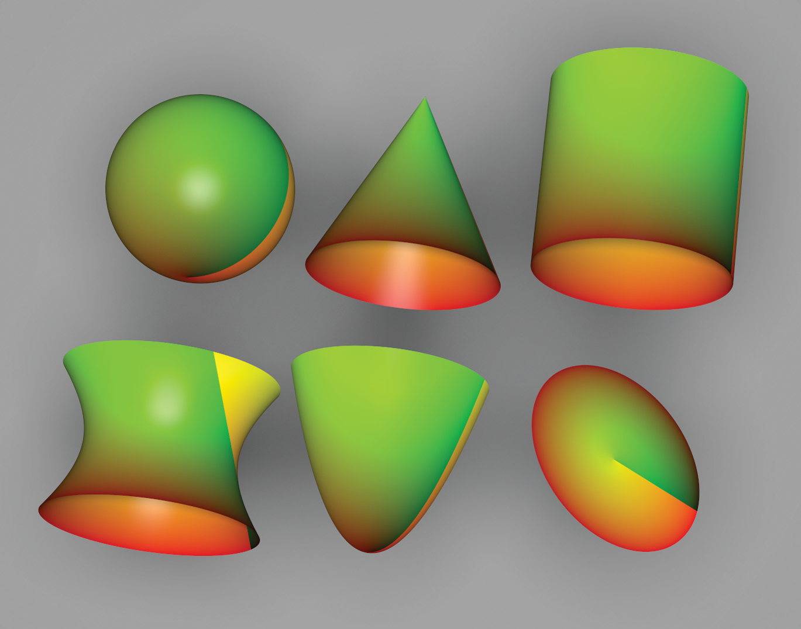

Figure 10.17: The UV Texture Applied to All of pbrt’s Quadric Shapes. The u parameter is mapped to the red channel, and the v parameter is mapped to green.

图 10.17：应用于 pbrt 的所有二次形状的 UV 纹理。 u 参数映射到红色通道，v 参数映射到绿色通道。

```
<<UVTexture Declarations>>= 
class UVTexture : public Texture<Spectrum> {
public:
    <<UVTexture Public Methods>> 
private:
    std::unique_ptr<TextureMapping2D> mapping;
};
<<UVTexture Public Methods>>= 
Spectrum Evaluate(const SurfaceInteraction &si) const {
    Vector2f dstdx, dstdy;
    Point2f st = mapping->Map(si, &dstdx, &dstdy);
    Float rgb[3] =
        { st[0] - std::floor(st[0]), st[1] - std::floor(st[1]), 0 };
    return Spectrum::FromRGB(rgb);
}
```

### 10.5.2 Checkerboard / 棋盘

The checkerboard is the canonical procedural texture (Figure 10.18). The (s,t) texture coordinates are used to break up parameter space into square regions that are shaded with alternating patterns. Rather than just supporting checkerboards that switch between two fixed colors, the implementation here allows the user to pass in two textures to color the alternating regions. The traditional black-and-white checkerboard is obtained by passing two ConstantTextures. Its implementation is in the files textures/checkerboard.h and textures/checkerboard.cpp.

棋盘是规范的程序纹理（图 10.18）。 (s,t) 纹理坐标用于将参数空间分解为用交替图案着色的正方形区域。这里的实现不仅支持在两种固定颜色之间切换的棋盘格，还允许用户传入两个纹理来为交替区域着色。传统的黑白棋盘是通过两个ConstantTexture得到的。它的实现在文件textures/checkerboard.h 和textures/checkerboard.cpp 中。

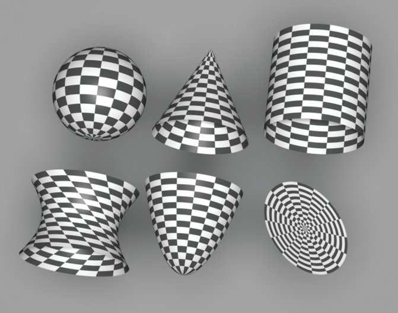

Figure 10.18: The Checkerboard Texture Applied to All of pbrt’s Quadric Shapes.

图 10.18：棋盘纹理应用于 pbrt 的所有二次形状。

```
<<CheckerboardTexture Declarations>>= 
template <typename T> class Checkerboard2DTexture : public Texture<T> {
public:
    <<Checkerboard2DTexture Public Methods>> 
private:
    <<Checkerboard2DTexture Private Data>> 
};
```

For simplicity, the frequency of the check function is 1 in (s,t) space: checks are one unit wide in each direction. The effective frequency can always be changed by the TextureMapping2D class with an appropriate scale of the (s,t) coordinates.

为简单起见，棋盘函数在 (s,t) 空间中的频率为 1：格子在每个方向上是一个单位宽。有效频率总是可以通过 TextureMapping2D 类以适当的 (s,t) 坐标比例来更改。

```
<<Checkerboard2DTexture Public Methods>>= 
Checkerboard2DTexture(std::unique_ptr<TextureMapping2D> mapping,
        const std::shared_ptr<Texture<T>> &tex1,
        const std::shared_ptr<Texture<T>> &tex2, AAMethod aaMethod)
    : mapping(std::move(mapping)), tex1(tex1), tex2(tex2),
      aaMethod(aaMethod) { }
<<Checkerboard2DTexture Private Data>>= 
std::unique_ptr<TextureMapping2D> mapping;
const std::shared_ptr<Texture<T>> tex1, tex2;
const AAMethod aaMethod;
```

The checkerboard is good for demonstrating trade-offs between various antialiasing approaches for procedural textures. The implementation here supports both simple point sampling (no antialiasing) and a closed-form box filter evaluated over the filter region. The image sequence in Figure 10.22 at the end of this section shows the results of these approaches. The aaMethod enumerant selects which approach is used.

棋盘非常适合演示程序纹理的各种反走样方法之间的权衡。这里的实现支持简单的点采样（无反走样）和在过滤器区域上计算的封闭式box filter。本节末尾的图 10.22 中的图像序列显示了这些方法的结果。 aaMethod 枚举数选择使用哪种方法。

```
<<AAMethod Declaration>>= 
enum class AAMethod { None, ClosedForm };
```

The evaluation routine does the usual texture coordinate and differential computation and then uses the appropriate fragment to compute an antialiased checkerboard value (or not antialiased, if point sampling has been selected).

计算程序执行通常的纹理坐标和微分计算，然后使用适当的片段来计算反走样棋盘值（或不反走样，如果已选择点采样）。

```
<<Checkerboard2DTexture Public Methods>>+= 
T Evaluate(const SurfaceInteraction &si) const {
    Vector2f dstdx, dstdy;
    Point2f st = mapping->Map(si, &dstdx, &dstdy);
    if (aaMethod == AAMethod::None) {
        <<Point sample Checkerboard2DTexture>> 
    } else {
        <<Compute closed-form box-filtered Checkerboard2DTexture value>> 
    }
}
```

The simplest case is to ignore antialiasing and just point-sample the checkerboard texture at the point. For this case, after getting the (s,t) texture coordinates from the TextureMapping2D, the integer checkerboard coordinates for that (s,t) position are computed, added together, and checked for odd or even parity to determine which of the two textures to evaluate.

最简单的情况是忽略反走样，只在该点对棋盘纹理进行点采样。对于这种情况，在从 TextureMapping2D 获得 (s,t) 纹理坐标后，计算该 (s,t) 位置的整数棋盘坐标，将它们相加，并检查奇偶校验以确定两个纹理中的哪一个计算。

```
<<Point sample Checkerboard2DTexture>>= 
if (((int)std::floor(st[0]) + (int)std::floor(st[1])) % 2 == 0)
    return tex1->Evaluate(si);
return tex2->Evaluate(si);
```

Given how bad aliasing can be in a point-sampled checkerboard texture, we will invest some effort to antialias it properly. The easiest case happens when the entire filter region lies inside a single check (Figure 10.19). In this case, we simply need to determine which of the check types we are inside and evaluate that one. As long as the Texture inside that check does appropriate antialiasing itself, the result for this case will be properly antialiased.

考虑到点采样棋盘纹理中走样的严重程度，我们将投入一些努力来正确地消除走样。最简单的情况发生在整个过滤器区域位于单个格子内（图 10.19）。在这种情况下，我们只需要确定我们在里面的棋盘类型并计算那个。只要该棋盘中的纹理本身进行了适当的反走样处理，这种情况下的结果就会得到正确的反走样处理。


Figure 10.19: The Easy Case for Filtering the Checkerboard. If the filter region around the lookup point is entirely in one check, the checkerboard texture doesn’t need to worry about antialiasing and can just evaluate the texture for that check.

图 10.19：过滤棋盘格的简单案例。如果查找点周围的过滤器区域完全在一个格子中，则棋盘纹理无需担心反走样，只需计算该格子的纹理即可。

```
<<Compute closed-form box-filtered Checkerboard2DTexture value>>= 
<<Evaluate single check if filter is entirely inside one of them>> 
<<Apply box filter to checkerboard region>> 
```

It's straightforward to check if the entire filter region is inside a single check by computing its bounding box and seeing if its extent lies inside the same check. For the remainder of this section, we will use the axis-aligned bounding box of the filter region given by the partial derivatives $\partial s / \partial x, \partial s / \partial y$, and so on, as the area to filter over, rather than trying to filter over the ellipse defined by the partial derivatives as the EWA filter did (Figure 10.20).

通过计算其边界框并查看其范围是否位于同一格子内，可以直接检查整个过滤器区域是否在单个格子内。对于本节的其余部分，我们将使用由偏导数 $\partial s / \partial x、\partial s / \partial y$ 等给出的过滤器区域的轴对齐边界框作为区域过滤，而不是像 EWA 过滤器那样尝试过滤由偏导数定义的椭圆（图 10.20）。


Figure 10.20: It is often convenient to use the axis-aligned bounding box around the texture evaluation point and the offsets from its partial derivatives as the region to filter over. Here, it's easy to see that the lengths of sides of the box are $2 \max (|\partial s / \partial x|,|\partial s / \partial y|)$ and $2 \max (|\partial t / \partial x|,|\partial t / \partial y|)$.

图 10.20：使用围绕纹理计算点的轴对齐边界框及其偏导数的偏移量作为过滤区域通常很方便。在这里，很容易看出，盒子的边长分别为 $2 \max (|\partial s / \partial x|,|\partial s / \partial y|)$ 和 $2 \max (|\partial t / \partial x|,|\partial t / \partial y|)$ 。

Filtering over the bounding box simplifies the implementation here, although somewhat increases the blurriness of the filtered values. The variables ds and $\mathrm{dt}$ in the following hold half the filter width in each direction, so the total area filtered over ranges from $(s-d s, t-d t)$ to $(s+d s, t+d t)$.

对边界框进行过滤简化了此处的实现，尽管在一定程度上增加了过滤值的模糊度。下面的变量 ds 和 $\mathrm{dt}$ 在每个方向上保持过滤器宽度的一半，因此过滤的总面积范围从 $(s-d s, t-d t)$ 到 $(s+d s, t+d t )$ 。

```
<<Evaluate single check if filter is entirely inside one of them>>= 
Float ds = std::max(std::abs(dstdx[0]), std::abs(dstdy[0]));
Float dt = std::max(std::abs(dstdx[1]), std::abs(dstdy[1]));
Float s0 = st[0] - ds, s1 = st[0] + ds;
Float t0 = st[1] - dt, t1 = st[1] + dt;
if (std::floor(s0) == std::floor(s1) &&
    std::floor(t0) == std::floor(t1)) {
    <<Point sample Checkerboard2DTexture>> 
}
```

Otherwise, the lookup method approximates the filtered value by first computing a floating-point value that indicates what fraction of the filter region covers each of the two check types. This is equivalent to computing the average of the $2 \mathrm{D}$ step function that takes on the value 0 when we are in tex1 and 1 when we are in tex2, over the filter region. Figure 10.21(a) shows a graph of the checkerboard function $c(x)$, defined as

否则，查找方法通过首先计算一个浮点值来近似过滤值，该浮点值指示过滤区域的哪一部分覆盖了两种格子类型中的每一种。这相当于计算过滤区域上 $2 \mathrm{D}$ 阶跃函数的平均值，当我们在 tex1 时取值为 0，当我们在 tex2 时取值为 1。图 10.21(a) 显示了棋盘函数 $c(x)$ 的图形，定义为

$$
c(x)= \begin{cases}0 & \lfloor x\rfloor \text { is even } \\ 1 & \text { otherwise }\end{cases}
$$

Given the average value, we can blend between the two subtextures, according to what fraction of the filter region each one is visible for.

给定平均值，我们可以在两个子纹理之间混合，根据每个子纹理可见的过滤区域的比例。

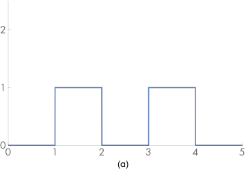

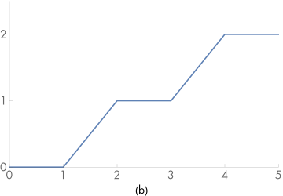

Figure 10.21: Integrating the Checkerboard Step Function. (a) The 1D step function that defines the checkerboard texture function, $c(x)$. (b) A graph of the value of the integral $\int_{0}^{x} c(x) \mathrm{d} x .$

图 10.21：积分棋盘步骤函数。 (a) 定义棋盘纹理函数的一维阶跃函数 $c(x)$ 。 (b) 积分 $\int_{0}^{x} c(x) \mathrm{d} x$ 的值的图

The integral of the 1D checkerboard function $c(x)$ can be used to compute the average value of the function over some extent. Inspection of the graph reveals that

一维棋盘函数 $c(x)$ 的积分可以用来计算函数在一定程度上的平均值。对图表的检查表明

$$
\int_{0}^{x} c(x) \mathrm{d} x=\lfloor x / 2\rfloor+2 \max (x / 2-\lfloor x / 2\rfloor-.5,0) .
$$

To compute the average value of the step function in two dimensions, we separately compute the integral of the checkerboard in each 1D direction in order to compute its average value over the filter region.

为了计算二维阶梯函数的平均值，我们分别计算棋盘格在每个 1D 方向上的积分，以计算其在过滤区域上的平均值。

```
<<Apply box filter to checkerboard region>>= 
auto bumpInt = [](Float x) {
    return (int)std::floor(x / 2) +
           2 * std::max(x / 2 - (int)std::floor(x / 2) - (Float)0.5,
                        (Float)0); };
Float sint = (bumpInt(s1) - bumpInt(s0)) / (2 * ds);
Float tint = (bumpInt(t1) - bumpInt(t0)) / (2 * dt);
Float area2 = sint + tint - 2 * sint * tint;
if (ds > 1 || dt > 1) 
    area2 = .5f;
return (1 - area2) * tex1->Evaluate(si) +
       area2       * tex2->Evaluate(si);
```

Figure 10.22 shows a comparison of these filtering techniques.

图 10.22 显示了这些过滤技术的比较。

No texture filtering

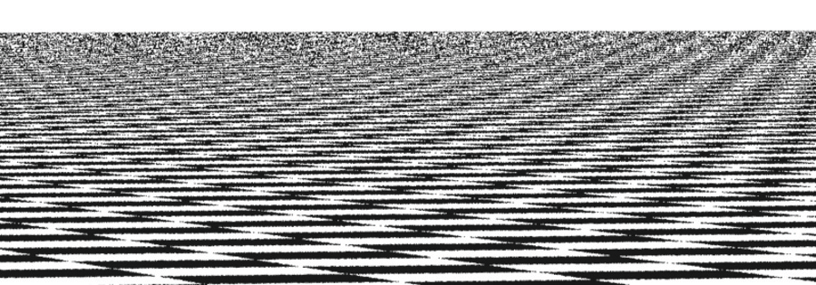

Filter-region average

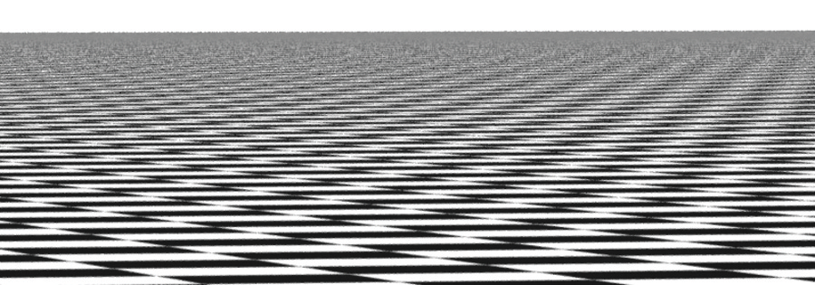

Supersampling

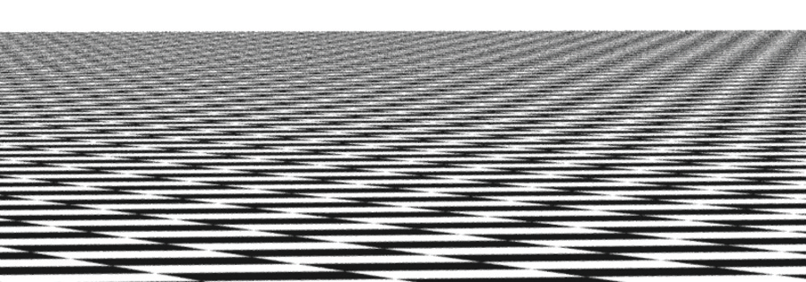

Figure 10.22: Comparisons of three approaches for antialiasing procedural textures, applied to the checkerboard texture. (1) No effort has been made to remove high-frequency variation from the texture function, so there are severe artifacts in the image, rendered with one sample per pixel. (2) This image shows the approach based on computing the filter region in texture space and averaging the texture function over that area, also rendered with one sample per pixel. (3) Here the checkerboard function was effectively supersampled by taking 16 samples per pixel and then point-sampling the texture. Both the area-averaging and the supersampling approaches give substantially better results than the first approach. In this example, supersampling gives the best results, since the averaging approach has blurred out the checkerboard pattern sooner than was needed because it approximates the filter region with its axis-aligned box.

图 10.22：三种反走样程序纹理方法的比较，应用于棋盘纹理。 (1) 没有努力从纹理函数中去除高频变化，因此图像中存在严重的伪影，每像素一个样本进行渲染。 (2) 此图像显示了基于计算纹理空间中的过滤器区域并在该区域上平均纹理函数的方法，也使用每个像素一个样本进行渲染。 (3) 这里棋盘函数通过每像素 16 个样本然后对纹理进行点采样来有效地进行超采样。面积平均和超级采样方法都比第一种方法提供了更好的结果。在这个例子中，超级采样给出了最好的结果，因为平均方法比需要的更快地模糊了棋盘图案，因为它用轴对齐的框来近似过滤器区域。

### 10.5.3 Solid Checkerboard / 纯色棋盘

The Checkerboard2DTexture class from the previous section wraps a checkerboard pattern around the object in parameter space. We can also define a solid checkerboard pattern based on 3D texture coordinates so that the object appears carved out of 3D checker cubes (Figure 10.23). Like the 2D variant, this implementation chooses between texture functions based on the lookup position. Note that these two textures need not be solid textures themselves; the Checkerboard3DTexture merely chooses between them based on the 3D position of the point.

上一节中的 Checkerboard2DTexture 类在参数空间中的对象周围包裹了一个棋盘图案。我们还可以根据 3D 纹理坐标定义实体棋盘图案，使对象看起来像是从 3D 棋盘格立方体中雕刻出来的（图 10.23）。与 2D 变体一样，此实现根据查找位置在纹理函数之间进行选择。请注意，这两个纹理本身不必是纯色纹理； Checkerboard3DTexture 仅根据点的 3D 位置在它们之间进行选择。

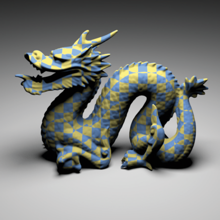

Figure 10.23: Dragon Model, Textured with the Checkerboard3DTexture Procedural Texture. Notice how the model appears to be carved out of 3D checks, rather than having them pasted on its surface.

图 10.23：Dragon 模型，使用 Checkerboard3DTexture 程序纹理进行纹理处理。请注意模型看起来是如何从 3D 格子中雕刻出来的，而不是粘贴在其表面上。

```
<<CheckerboardTexture Declarations>>+= 
template <typename T> class Checkerboard3DTexture : public Texture<T> {
public:
    <<Checkerboard3DTexture Public Methods>> 
private:
    <<Checkerboard3DTexture Private Data>> 
};
<<Checkerboard3DTexture Public Methods>>= 
Checkerboard3DTexture(std::unique_ptr<TextureMapping3D> mapping,
        const std::shared_ptr<Texture<T>> &tex1,
        const std::shared_ptr<Texture<T>> &tex2)
    : mapping(std::move(mapping)), tex1(tex1), tex2(tex2) { }
<<Checkerboard3DTexture Private Data>>= 
std::unique_ptr<TextureMapping3D> mapping;
std::shared_ptr<Texture<T>> tex1, tex2;
```

Ignoring antialiasing, the basic computation to see if a point p is inside a 3D checker region is

忽略反走样，查看点 p 是否在 3D 棋盘格区域内的基本计算是

$$
\left(\left\lfloor\mathrm{p}_{x}\right\rfloor+\left\lfloor\mathrm{p}_{y}\right\rfloor+\left\lfloor\mathrm{p}_{z}\right\rfloor\right) \bmod 2=0
$$

The Checkerboard3DTexture doesn’t have any built-in support for antialiasing, so its implementation is fairly short.

Checkerboard3DTexture 没有任何内置的反走样支持，因此它的实现相当短。

```
<<Checkerboard3DTexture Public Methods>>+= 
T Evaluate(const SurfaceInteraction &si) const {
    Vector3f dpdx, dpdy;
    Point3f p = mapping->Map(si, &dpdx, &dpdy);
    if (((int)std::floor(p.x) + (int)std::floor(p.y) +
         (int)std::floor(p.z)) % 2 == 0)
        return tex1->Evaluate(si);
    else
        return tex2->Evaluate(si);
}
```

## 10.6 Noise / 噪声

In order to write solid textures that describe complex surface appearances, it is helpful to be able to introduce some controlled variation to the process. Consider a wood floor made of individual planks; each plank’s color is likely to be slightly different from the others. Or consider a windswept lake; we might want to have waves of similar amplitude across the entire lake, but we don’t want them to be homogeneous over all parts of the lake (as they might be if they were constructed from a sum of sine waves, for example). Modeling this sort of variation in a texture helps make the final result look more realistic.

One difficulty in developing textures like these is that the renderer evaluates the surface’s texture functions at an irregularly distributed set of points, where each evaluation is completely independent of the others. As such, procedural textures must implicitly define a complex pattern by answering queries about what the pattern’s value is at all of these points. In contrast, the explicit pattern description approach is embodied by the PostScript® language, for example, which describes graphics on a page with a series of drawing commands. One difficulty that the implicit approach introduces is that the texture can’t just call RNG::UniformFloat() at each point at which it is evaluated to introduce randomness: because each point would have a completely different random value from its neighbors, no coherence would be possible in the generated pattern.

An elegant way to address this issue of introducing controlled randomness to procedural textures in graphics is the application of what is known as a noise function. In general, noise functions used in graphics are smoothly varying functions taking $\mathbf{R}^{n} \rightarrow[-1,1]$, for at least $n=1,2,3$, without obvious repetition. One of the most crucial properties of a practical noise function is that it be band limited with a known maximum frequency. This makes it possible to control the frequency content added to a texture due to the noise function so that frequencies higher than those allowed by the Nyquist limit aren't introduced.

为了编写描述复杂表面外观的纯色纹理，能够在过程中引入一些受控变化是有帮助的。考虑由单块木板制成的木地板；每块木板的颜色可能与其他木板略有不同。或者考虑一个被风吹过的湖；我们可能希望在整个湖中具有相似幅度的波，但我们不希望它们在湖的所有部分都是均匀的（例如，如果它们是由正弦波的总和构成的，它们可能是这样的）。对纹理中的这种变化进行建模有助于使最终结果看起来更逼真。

开发此类纹理的一个困难是渲染器在一组不规则分布的点上计算表面的纹理函数，其中每个计算完全独立于其他计算。因此，程序纹理必须通过回答关于模式在所有这些点的值的查询来隐式定义复杂模式。相比之下，显式模式描述方法体现在 PostScript® 语言中，例如，该语言使用一系列绘图命令来描述页面上的图形。隐式方法引入的一个困难是纹理不能只在计算它的每个点调用 RNG::UniformFloat() 以引入随机性：因为每个点将具有与其邻居完全不同的随机值，没有连贯性在生成的模式中是可能的。

解决将受控随机性引入图形中的程序纹理的问题的一种优雅方法是应用所谓的噪声函数。一般来说，图形中使用的噪声函数是平滑变化的函数，采用 $\mathbf{R}^{n} \rightarrow[-1,1]$ ，至少 $n=1,2,3$ ，没有明显的重复。实际噪声函数最重要的特性之一是它是具有已知最大频率的频带限制的。这使得可以控制由于噪声函数而添加到纹理的频率内容，从而不会引入高于Nyquist限制所允许的频率。

Many of the noise functions that have been developed are built on the idea of an integer lattice over $\mathbf{R}^{3}$. First, a value is associated with each integer $(x, y, z)$ position in space. Then, given an arbitrary position in space, the eight surrounding lattice values are found. These lattice values are then interpolated to compute the noise value at the particular point. This idea can be generalized or restricted to more or fewer dimensions $d$, where the number of lattice points is $2^{d}$. A simple example of this approach is value noise, where pseudo-random numbers between $-1$ and 1 are associated with each lattice point, and actual noise values are computed with trilinear interpolation or with a more complex spline interpolant, which can give a smoother result by avoiding derivative discontinuities when moving from one lattice cell to another.

For such a noise function, given an integer $(x, y, z)$ lattice point, it must be possible to efficiently compute its parameter value in a way that always associates the same value with each lattice point. Because it is infeasible to store values for all possible $(x, y, z)$ points, some compact representation is needed. One option is to use a hash function, where the coordinates are hashed and then used to look up parameters from a fixed-size table of precomputed pseudo-random parameter values.

许多已经开发的噪声函数都是建立在 $\mathbf{R}^{3}$ 上的整数格的思想之上的。首先，一个值与空间中的每个整数 $(x, y, z)$ 位置相关联。然后，给定空间中的任意位置，找到周围的八个晶格值。然后对这些晶格值进行插值，以计算特定点的噪声值。这个想法可以推广或限制到更多或更少的维度 $d$ ，其中格点的数量为 $2^{d}$ 。这种方法的一个简单示例是值噪声，其中 $-1$ 和 1 之间的伪随机数与每个格点相关联，并且使用三线性插值或更复杂的样条插值计算实际噪声值，这可以给出通过在从一个晶格单元移动到另一个晶格单元时避免导数不连续性，获得更平滑的结果。

对于这样的噪声函数，给定一个整数 $(x, y, z)$ 格点，必须能够以始终将相同值与每个格点相关联的方式有效地计算其参数值。因为存储所有可能的 $(x, y, z)$ 点的值是不可行的，所以需要一些紧凑的表示。一种选择是使用散列函数，其中坐标被散列，然后用于从预先计算的伪随机参数值的固定大小表中查找参数。

### 10.6.1 Perlin Noise / Perlin噪声

In pbrt we will implement a noise function introduced by Ken Perlin (1985a, 2002); as such, it is known as Perlin noise. It has a value of zero at all $(x, y, z)$ integer lattice points. Its variation comes from gradient vectors at each lattice point that guide the interpolation of a smooth function in between the points (Figure 10.24). This noise function has many of the desired characteristics of a noise function described above, is computationally efficient, and is easy to implement.

在 pbrt 中，我们将实现由 Ken Perlin (1985a, 2002) 介绍的噪声函数；因此，它被称为 Perlin 噪声。它在所有 $(x, y, z)$ 整数格点处的值为零。它的变化来自每个格点处的梯度向量，这些向量指导点之间的平滑函数的插值（图 10.24）。该噪声函数具有上述噪声函数的许多所需特性，计算效率高，并且易于实现。

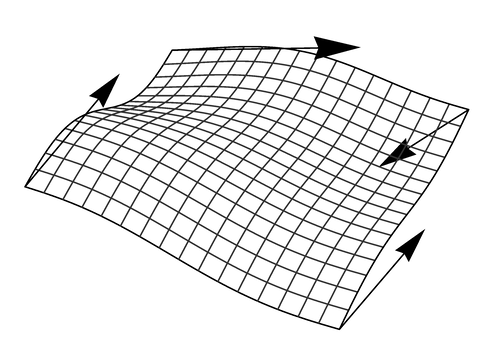

Figure 10.24: The Perlin noise function is computed by generating a smooth function that is zero but with a given derivative at integer lattice points. The derivatives are used to compute a smooth interpolating surface. Here, a 2D slice of the noise function is shown with four gradient vectors.

图 10.24：Perlin 噪声函数是通过生成一个平滑函数来计算的，该函数为零但在整数格点处具有给定导数。导数用于计算平滑的插值表面。在这里，噪声函数的 2D 切片显示为具有四个梯度向量。

Figure 10.25 shows the value of the noise function rendered on a sphere.

图 10.25 显示了在球体上渲染的噪声函数的值。

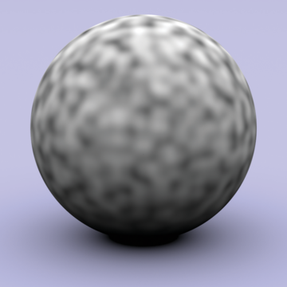

Figure 10.25: Perlin’s Noise Function Modulating the Diffuse Color of a Sphere.

图 10.25：Perlin 的噪声函数调制球体的漫反射颜色。

```
<<Texture Method Definitions>>+=  
Float Noise(Float x, Float y, Float z) {
    <<Compute noise cell coordinates and offsets>> 
    <<Compute gradient weights>> 
    <<Compute trilinear interpolation of weights>> 
}
```

For convenience, there is also a variant of Noise() that takes a Point3f directly:

为方便起见，还有一个 Noise() 的变体，它直接采用 Point3f：

```
<<Texture Method Definitions>>+=  
Float Noise(const Point3f &p) { return Noise(p.x, p.y, p.z); }
```

The implementation first computes the integer coordinates of the cell that contains the given point and the fractional offsets of the point from the lower cell corner:

该实现首先计算包含给定点的单元格的整数坐标以及该点距单元格下角的小数偏移量：

```
<<Compute noise cell coordinates and offsets>>= 
int ix = std::floor(x), iy = std::floor(y), iz = std::floor(z);
Float dx = x - ix, dy = y - iy, dz = z - iz;
```

It next calls Grad() to get eight weight values, one for each corner of the cell that the point lies inside. Grad() uses the cell indices to index into a table; for efficiency we ensure that all of the indices are within the range of the table here by zeroing any high bits that would put a component past the table’s size. (The table size must be a power of two for this trick to work—otherwise an expensive integer modulus operation would be needed in place of the bitwise “and.”)

它接下来调用 Grad() 来获得八个权重值，一个对应于该点所在的单元格的每个角。 Grad() 使用单元格索引来索引表；为了提高效率，我们通过将任何会使组件超出表格大小的高位归零来确保所有索引都在此处的表格范围内。 （表大小必须是 2 的幂才能使这个技巧起作用——否则需要一个昂贵的整数模运算来代替按位的“and”。）

```
<<Compute gradient weights>>= 
ix &= NoisePermSize - 1;
iy &= NoisePermSize - 1;
iz &= NoisePermSize - 1;
Float w000 = Grad(ix,   iy,   iz,   dx,   dy,   dz);
Float w100 = Grad(ix+1, iy,   iz,   dx-1, dy,   dz);
Float w010 = Grad(ix,   iy+1, iz,   dx,   dy-1, dz);
Float w110 = Grad(ix+1, iy+1, iz,   dx-1, dy-1, dz);
Float w001 = Grad(ix,   iy,   iz+1, dx,   dy,   dz-1);
Float w101 = Grad(ix+1, iy,   iz+1, dx-1, dy,   dz-1);
Float w011 = Grad(ix,   iy+1, iz+1, dx,   dy-1, dz-1);
Float w111 = Grad(ix+1, iy+1, iz+1, dx-1, dy-1, dz-1);
```

Each integer lattice point has a gradient vector associated with it. The influence of the gradient vector for any point inside the cell is obtained by computing the dot product of the vector from the gradient’s corner to the lookup point and the gradient vector (Figure 10.26); this is handled by the Grad() function. Note that the vectors to the corners other than the lower left one can be easily computed incrementally based on that vector.

每个整数格点都有一个与之关联的梯度向量。梯度向量对单元格内任意点的影响是通过计算梯度角到查找点的向量与梯度向量的点积得到的（图 10.26）；这是由 Grad() 函数处理的。请注意，除左下角以外的角的向量可以很容易地基于该向量增量计算。


Figure 10.26: The dot product of the vector from the corners of the cell to the lookup point (dotted lines) with each of the gradient vectors (blue lines) gives the influence of each gradient to the noise value at the point.

图 10.26：从单元格的角到查找点的向量（虚线）与每个梯度向量（蓝线）的点积给出了每个梯度对点处噪声值的影响。

The gradient vector for a particular integer lattice point is found by indexing into a precomputed table of integer values, NoisePerm. The four low-order bits of the table’s value for the lattice point determine which of 16 gradient vectors is associated with it. In a preprocessing step, this table of size NoisePermSize was filled with numbers from 0 to NoisePermSize-1 and then randomly permuted. These values were then duplicated, making an array of size 2*NoisePermSize that holds the table twice in succession. The second copy of the table makes lookups in the following code slightly more efficient.

Given a particular (ix,iy,iz) lattice point, a series of table lookups gives a value from the random-number table:

通过对预先计算的整数值表 NoisePerm 进行索引，可以找到特定整数格点的梯度向量。表格中格点值的四个低位决定了 16 个梯度向量中的哪一个与其相关联。在预处理步骤中，这个大小为 NoisePermSize 的表填充了从 0 到 NoisePermSize-1 的数字，然后随机排列。然后复制这些值，形成一个大小为 2*NoisePermSize 的数组，该数组连续两次保存该表。该表的第二个副本使以下代码中的查找更加高效。

给定一个特定的 (ix,iy,iz) 格点，一系列表查找会从随机数表中给出一个值：

```
NoisePerm[NoisePerm[NoisePerm[ix] + iy] + iz];
```

By doing three nested permutations in this way, rather than NoisePerm[ix+iy+iz], for example, the final result is more irregular. The first approach doesn’t usually return the same value if ix and iy are interchanged, as the second does. Furthermore, since the table was replicated to be twice the original length, the lookups can be done as described above, eliminating the need for modulus operations in code along the lines of

通过以这种方式进行三个嵌套排列，而不是 NoisePerm[ix+iy+iz]，例如，最终结果更加不规则。如果 ix 和 iy 互换，第一种方法通常不会返回相同的值，就像第二种方法一样。此外，由于该表被复制为原始长度的两倍，因此可以如上所述进行查找，从而无需在代码中进行模运算，如下所示

```
(NoisePerm[ix] + iy) % NoisePermSize
```

Given a final value from the permutation table that determines the gradient number, the dot product with the corresponding gradient vector must be computed. However, the gradient vectors do not need to be represented explicitly. All of the gradients use only -1, 0, or 1 in their coordinates, so that the dot products reduce to addition of some (possibly negated) components of the vector. The final implementation is the following:

给定置换表中确定梯度数的最终值，必须计算与相应梯度向量的点积。然而，梯度向量不需要明确表示。所有梯度在它们的坐标中仅使用 -1、0 或 1，因此点积减少为添加向量的一些（可能是负的）分量。最终实现如下：

```
<<Texture Method Definitions>>+=  
inline Float Grad(int x, int y, int z, Float dx, Float dy, Float dz) {
    int h = NoisePerm[NoisePerm[NoisePerm[x] + y] + z];
    h &= 15;
    Float u = h < 8 || h == 12 || h == 13 ? dx : dy;
    Float v = h < 4 || h == 12 || h == 13 ? dy : dz;
    return ((h & 1) ? -u : u) + ((h & 2) ? -v : v);
}
<<Perlin Noise Data>>= 
static constexpr int NoisePermSize = 256;
static int NoisePerm[2 * NoisePermSize] = {
    151, 160, 137, 91, 90, 15, 131, 13, 201, 95, 96, 
    53, 194, 233, 7, 225, 140, 36, 103, 30, 69, 142,
    <<Remainder of the noise permutation table>> 
};
```

Given these eight contributions from the gradients, the next step is to trilinearly interpolate between them at the point. Rather than interpolating with dx, dy, and dz directly, though, each of these values is passed through a smoothing function. This ensures that the noise function has first- and second-derivative continuity as lookup points move between lattice cells.

鉴于梯度的这八个贡献，下一步是在它们之间进行三线性插值。但是，不是直接使用 dx、dy 和 dz 进行插值，而是将这些值中的每一个都传递给平滑函数。这确保了噪声函数在查找点在晶格单元之间移动时具有一阶和二阶导数的连续性。

```
<<Texture Method Definitions>>+=  
inline Float NoiseWeight(Float t) {
    Float t3 = t * t * t;
    Float t4 = t3 * t;
    return 6 * t4 * t - 15 * t4 + 10 * t3;
}
<<Compute trilinear interpolation of weights>>= 
Float wx = NoiseWeight(dx), wy = NoiseWeight(dy), wz = NoiseWeight(dz);
Float x00 = Lerp(wx, w000, w100);
Float x10 = Lerp(wx, w010, w110);
Float x01 = Lerp(wx, w001, w101);
Float x11 = Lerp(wx, w011, w111);
Float y0 = Lerp(wy, x00, x10);
Float y1 = Lerp(wy, x01, x11);
return Lerp(wz, y0, y1);
```

### 10.6.2 Random Polka Dots / 随机Polka圆点

A basic use of the noise function is as part of a polka dot texture that divides (s,t) texture space into rectangular cells (Figure 10.27). Each cell has a 50% chance of having a dot inside of it, and the dots are randomly placed inside their cells. DotsTexture takes the usual 2D mapping function, as well as two Textures, one for the regions of the surface outside of the dots and one for the regions inside. It is defined in the files textures/dots.h and textures/dots.cpp.

噪声函数的基本用途是作为圆点纹理的一部分，将 (s,t) 纹理空间划分为矩形单元（图 10.27）。每个单元格有 50% 的机会在其中有一个点，并且这些点随机放置在其单元格内。 DotsTexture 采用通常的 2D 映射函数，以及两个纹理，一个用于点外部的表面区域，一个用于内部区域。它在文件textures/dots.h 和textures/dots.cpp 中定义。

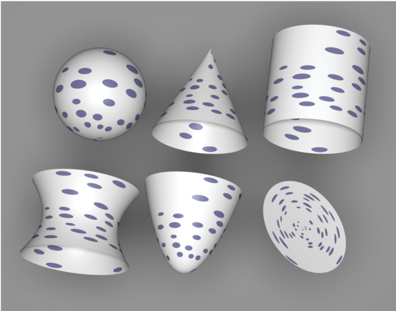

Figure 10.27: The Polka Dot Texture Applied to All of pbrt’s Quadric Shapes.

图 10.27：应用于 pbrt 的所有二次图形的圆点纹理。

```
<<DotsTexture Declarations>>= 
template <typename T> class DotsTexture : public Texture<T> {
public:
    <<DotsTexture Public Methods>> 
private:
    <<DotsTexture Private Data>> 
};
<<DotsTexture Public Methods>>= 
DotsTexture(std::unique_ptr<TextureMapping2D> mapping,
        const std::shared_ptr<Texture<T>> &outsideDot,
        const std::shared_ptr<Texture<T>> &insideDot)
    : mapping(std::move(mapping)), outsideDot(outsideDot),
      insideDot(insideDot) { }
<<DotsTexture Private Data>>= 
std::unique_ptr<TextureMapping2D> mapping;
std::shared_ptr<Texture<T>> outsideDot, insideDot;
```

The evaluation function starts by taking the (s,t) texture coordinates and computing integer sCell and tCell values, which give the coordinates of the cell they are inside. We will not consider antialiasing of the polka dots texture here; an exercise at the end of the chapter outlines how this might be done.

计算函数首先获取 (s,t) 纹理坐标并计算整数 sCell 和 tCell 值，它们给出了它们所在的单元格的坐标。我们不会在这里考虑Polka圆点纹理的反走样；本章末尾的练习概述了如何做到这一点。

```
<<DotsTexture Public Methods>>+= 
T Evaluate(const SurfaceInteraction &si) const {
    <<Compute cell indices for dots>> 
    <<Return insideDot result if point is inside dot>> 
    return outsideDot->Evaluate(si);
}
<<Compute cell indices for dots>>= 
Vector2f dstdx, dstdy;
Point2f st = mapping->Map(si, &dstdx, &dstdy);
int sCell = std::floor(st[0] + .5f), tCell = std::floor(st[1] + .5f);
```

Once the cell coordinate is known, it’s necessary to decide if there is a polka dot in the cell. Obviously, this computation needs to be consistent so that for each time this routine runs for points in a particular cell it returns the same result. Yet we’d like the result not to be completely regular (e.g., with a dot in every other cell). Noise solves this problem: by evaluating the noise function at a position that is the same for all points inside this cell—(sCell+.5, tCell+.5)—we can compute an irregularly varying but consistent value for each cell. If this value is greater than zero, a dot is placed in the cell.

If there is a dot in the cell, the noise function is used again to randomly shift the center of the dot within the cell. The points at which the noise function is evaluated for the center shift are offset by arbitrary constant amounts, however, so that noise values from different noise cells are used from them, eliminating a possible source of correlation with the noise value used to determine the presence of a dot in the first place. (Note that the dot’s radius must be small enough so that it doesn’t spill over the cell’s boundary after being shifted; in that case, points where the texture was being evaluated would also need to consider the dots based in neighboring cells as potentially affecting their texture value.)

Given the dot center and radius, the texture needs to decide if the (s,t) coordinates are within the radius of the shifted center. It does this by computing their squared distance to the center and comparing it to the squared radius.

一旦知道单元格坐标，就需要确定单元格中是否有圆点。显然，此计算需要保持一致，以便每次针对特定单元格中的点运行此程序时，它都会返回相同的结果。然而，我们希望结果不是完全规则的（例如，在每个其他单元格中都有一个点）。噪声解决了这个问题：通过在该单元格内的所有点（sCell+.5，tCell+.5）相同的位置计算噪声函数，我们可以为每个单元格计算一个不规则变化但一致的值。如果该值大于零，则在单元格中放置一个点。

如果单元格中有一个点，则再次使用噪声函数来随机移动单元格内的点的中心。然而，为中心偏移计算噪声函数的点被任意常数偏移，以便使用来自不同噪声单元的噪声值，消除与用于确定存在的噪声值相关的可能来源首先是一个点。 （请注意，点的半径必须足够小，以便在移动后不会溢出单元格的边界；在这种情况下，正在计算纹理的点还需要考虑基于相邻单元格的点可能会影响它们的纹理值。）

给定点中心和半径，纹理需要确定 (s,t) 坐标是否在偏移中心的半径内。它通过计算它们到中心的平方距离并将其与平方半径进行比较来做到这一点。

```
<<Return insideDot result if point is inside dot>>= 
if (Noise(sCell + .5f, tCell + .5f) > 0) {
    Float radius = .35f;
    Float maxShift = 0.5f - radius;
    Float sCenter = sCell +
        maxShift * Noise(sCell + 1.5f, tCell + 2.8f);
    Float tCenter = tCell +
        maxShift * Noise(sCell + 4.5f, tCell + 9.8f);
    Vector2f dst = st - Point2f(sCenter, tCenter);
    if (dst.LengthSquared() < radius*radius)
        return insideDot->Evaluate(si);
}
```

### 10.6.3 Noise Idioms and Spectral Synthesis / 噪声习语和频谱合成

The fact that noise is a band-limited function means that its frequency content can be adjusted by scaling the domain over which it is evaluated. For example, if Noise $(p)$ has some known frequency content, then the frequency content of Noise $(2 * p)$ will be twice as high. This is just like the relationship between the frequency content of $\sin (x)$ and $\sin (2 x)$. This technique can be used to create a noise function with a desired rate of variation.

For many applications in procedural texturing, it's useful to have variation over multiple scalesfor example, to add finer variations to the base noise function. One effective way to do this with noise is to compute patterns via spectral synthesis, where a complex function $f_{s}(x)$ is defined by a sum of contributions from another function $f(x)$ :

噪声是一个带限函数这一事实意味着它的频率内容可以通过缩放它所计算的域来调整。例如，如果噪声 $(p)$ 具有一些已知的频率内容，则噪声 $(2 * p)$ 的频率内容将是两倍高。这就像 $\sin(x)$ 和 $\sin(2x)$ 的频率内容之间的关系。该技术可用于创建具有所需变化率的噪声函数。

对于程序纹理中的许多应用程序，在多个尺度上进行变化很有用，例如，为基本噪声函数添加更精细的变化。用噪声做到这一点的一种有效方法是通过频谱合成计算模式，其中复杂函数 $f_{s}(x)$ 由另一个函数 $f(x)$ 的贡献之和定义：

$$
f_{s}(x)=\sum_{i} w_{i} f\left(s_{i} x\right),
$$

for a set of weight values $w_{i}$ and parameter scale values $s_{i}$. If the base function $f(x)$ has a welldefined frequency content (e.g., is a sine or cosine function or a noise function), then each term $f\left(s_{i} x\right)$ also has a well-defined frequency content as described earlier. Because each term of the sum is weighted by a weight value $w_{i}$, the result is a sum of contributions of various frequencies, with different frequency ranges weighted differently.

Typically, the scales $s_{i}$ are chosen in a geometric progression such that $s_{i}=2 s_{i-1}$ and the weights are $w_{i}=w_{i-1} / 2$. The result is that as higher frequency variation is added to the function, it has relatively less influence on the overall shape of $f_{s}(x)$. Each additional term is called an octave of noise, since it has twice the frequency content of the previous one. When this scheme is used with Perlin noise, the result is often referred to as fractional Brownian motion (fBm), after a particular type of random process that varies in a similar manner.

Fractional Brownian motion is a useful building block for procedural textures because it gives a function with more complex variation than plain noise, while still being easy to compute and still having well-defined frequency content. The utility function FBm() implements the fractional Brownian motion function. Figure 10.28 shows two graphs of it.

对于一组权重值 $w_{i}$ 和参数比例值 $s_{i}$ 。如果基函数 $f(x)$ 具有明确定义的频率内容（例如，是正弦或余弦函数或噪声函数），则每个项 $f\left(s_{i} x\right)$ 也有如前所述，定义明确的频率内容。因为总和的每一项都由权重值 $w_{i}$ 加权，所以结果是各种频率的贡献的总和，不同的频率范围加权不同。

通常，尺度 $s_{i}$ 以几何级数选择，使得 $s_{i}=2 s_{i-1}$ 并且权重为 $w_{i}=w_{i-1} / 2$ 。结果是随着更高的频率变化被添加到函数中，它对 $f_{s}(x)$ 的整体形状的影响相对较小。每个附加项称为八度噪声，因为它的频率内容是前一项的两倍。当此方案与 Perlin 噪声一起使用时，在以类似方式变化的特定类型的随机过程之后，结果通常被称为分数布朗运动 (fBm)。

分数布朗运动是程序纹理的有用构建块，因为它提供了一个比普通噪声具有更复杂变化的函数，同时仍然易于计算并且仍然具有明确定义的频率内容。工具函数 FBm() 实现了分数布朗运动函数。图 10.28 显示了它的两个图表。

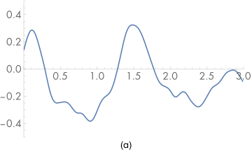

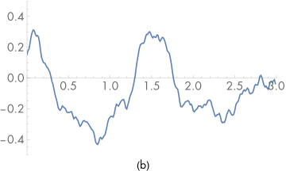

Figure 10.28: Graphs of the FBm() Function. (a) 3 and (b) 6 octaves of noise. Notice how as more levels of noise are added, the graph has progressively more detail, although its overall shape remains roughly the same.

图 10.28：FBm() 函数的图表。 (a) 3 和 (b) 6 个八度的噪声。请注意，随着噪声级别的增加，图形的细节逐渐增多，尽管其整体形状大致保持不变。

In addition to the point at which to evaluate the function and the function’s partial derivatives at that point, the function takes an omega parameter, which ranges from zero to one and affects the smoothness of the pattern by controlling the falloff of contributions at higher frequencies (values around 0.5 work well), and maxOctaves, which gives the maximum number of octaves of noise that should be used in computing the sum.

除了计算函数的点和函数在该点的偏导数之外，该函数还采用一个 omega 参数，该参数的范围从零到一，并通过控制高频贡献的衰减来影响图案的平滑度 ( 0.5 左右的值效果很好）和 maxOctaves，它给出了在计算总和时应该使用的最大噪声八度数。

```
<<Texture Method Definitions>>+=  
Float FBm(const Point3f &p, const Vector3f &dpdx, const Vector3f &dpdy,
          Float omega, int maxOctaves) {
    <<Compute number of octaves for antialiased FBm>> 
    <<Compute sum of octaves of noise for FBm>> 
    return sum;
}
```

The implementation here uses a technique called clamping to antialias the fBm function. The idea is that when we are computing a value based on a sum of components, each with known frequency content, we should stop adding in components that would have frequencies beyond the Nyquist limit and instead add their average values to the sum. Because the average value of Noise() is zero, all that needs to be done is to compute the number of octaves such that none of the terms has excessively high frequencies and not evaluate the noise function for any higher octaves.

Noise () (and thus the first term of $f_{s}(x)$ as well) has a maximum frequency content of roughly $\omega=1$. Each subsequent term represents a doubling of frequency content. Therefore, we would like to find the appropriate number of terms $n$ such that if the sampling rate in noise space is $s$, then

这里的实现使用一种称为clamping的技术来消除 fBm 函数的走样。这个想法是，当我们基于分量总和计算一个值时，每个分量都具有已知的频率内容，我们应该停止添加频率超出Nyquist极限的分量，而是将它们的平均值添加到总和中。因为 Noise() 的平均值为零，所以需要做的就是计算八度的数量，使得没有一个项具有过高的频率，并且不对任何更高八度的噪声函数进行计算。

Noise ()（因此 $f_{s}(x)$ 的第一项也是如此）具有大约 $\omega=1$ 的最大频率内容。每个后续项代表频率内容的两倍。因此，我们希望找到适当数量的术语 $n$ ，使得如果噪声空间中的采样率为 $s$ ，那么

$$
\frac{s}{2^{n}}=2
$$

which ensures that there are frequencies right up to the Nyquist frequency but not past it. Equivalently,

这确保有频率达到Nyquist频率但不会超过它。等效地，

$$
\begin{aligned}
2^{n+1} &=s \\
n+1 &=\log _{2} s \\
n &=-1+\log _{2} s \\
n &=-1+\frac{1}{2} \log _{2} s^{2}
\end{aligned}
$$

where we've used the identity $\log _{2} x=1 / n \log _{2} x^{n}$ to write the last expression in a more convenient form for the following.

The squared sampling rate $s^{2}$ can be computed with one over the maximum of the squared length of the differentials $\partial \mathrm{p} / \partial x$ and $\partial \mathrm{p} / \partial y$, which we'll denote by $l^{2}$. We can turn this inversion into a negation of the logarithm, and equivalently write this as:

其中我们使用了恒等式 $\log _{2} x=1 / n \log _{2} x^{n}$ 以更方便的形式编写最后一个表达式，用于以下内容。

平方采样率 $s^{2}$ 可以用差分 $\partial \mathrm{p} / \partial x$ 和 $\partial \mathrm{p} / \partial y$ 的平方长度的最大值加一来计算，我们将用 $l^{2}$ 表示。我们可以把这个反转变成对数的取反，等效地写成：

$$
n=-1-\frac{1}{2} \log _{2} l^{2} .
$$

```
<<Compute number of octaves for antialiased FBm>>= 
Float len2 = std::max(dpdx.LengthSquared(), dpdy.LengthSquared());
Float n = Clamp(-1 - .5f * Log2(len2), 0, maxOctaves);
int nInt = std::floor(n);
```

Finally, the integral number of octaves up to the Nyquist limit are added together and the last octave is faded in, according to the fractional part of n. This ensures that successive octaves of noise fade in gradually, rather than appearing abruptly, which can cause visually noticeable artifacts at the transitions. The implementation here actually increases the frequency between octaves by 1.99, rather than by a factor of 2, in order to reduce the impact of the fact that the noise function is zero at integer lattice points. This breaks up that regularity across sums of octaves of noise, which can also lead to subtle visual artifacts.

最后，根据 n 的小数部分，将直到 Nyquist 极限的整数个八度相加，最后一个八度淡入。这确保了连续八度的噪声逐渐淡入，而不是突然出现，这会在过渡处导致视觉上明显的伪影。这里的实现实际上将倍八度之间的频率增加了 1.99，而不是 2 倍，以减少噪声函数在整数格点处为零这一事实的影响。这打破了八度噪声总和的规律性，这也可能导致细微的视觉伪影。

```
<<Compute sum of octaves of noise for FBm>>= 
Float sum = 0, lambda = 1, o = 1;
for (int i = 0; i < nInt; ++i) {
    sum += o * Noise(lambda * p);
    lambda *= 1.99f;
    o *= omega;
}
Float nPartial = n - nInt;
sum += o * SmoothStep(.3f, .7f, nPartial) * Noise(lambda * p);
```

The SmoothStep() function takes a minimum and maximum value and a point at which to evaluate a smooth interpolating function. If the point is below the minimum zero is returned, and if it’s above the maximum one is returned. Otherwise, it smoothly interpolates between zero and one using a cubic Hermite spline.

SmoothStep() 函数采用最小值和最大值以及计算平滑插值函数的点。如果该点低于最小值，则返回零，如果高于最大值，则返回一。否则，它会使用三次 Hermite 样条在 0 和 1 之间平滑插值。

```
<<Texture Inline Functions>>= 
inline Float SmoothStep(Float min, Float max, Float value) {
    Float v = Clamp((value - min) / (max - min), 0, 1);
    return v * v * (-2 * v  + 3);
}
```

Closely related to the FBm() function is the Turbulence() function. It also computes a sum of terms of the noise function but takes the absolute value of each one:

与 FBm() 函数密切相关的是 Turbulence() 函数。它还计算噪声函数项的总和，但取每一项的绝对值：

$$
f_{s}(x)=\sum_{i} w_{i}\left|f\left(s_{i} x\right)\right|
$$

Taking the absolute value introduces first-derivative discontinuities in the synthesized function, and thus the turbulence function has infinite frequency content. Nevertheless, the visual characteristics of this function can be quite useful for procedural textures. Figure 10.29 shows two graphs of the turbulence function.

取绝对值会在合成函数中引入一阶导数不连续性，因此扰动函数具有无限的频率成分。然而，这个函数的视觉特征对于程序纹理非常有用。图 10.29 显示了两个扰动函数图。

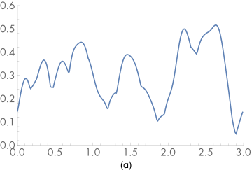

!p[](./10.Texture.assets/turb6.svg)

Figure 10.29: Graphs of the Turbulence() function for (a) 3 and (b) 6 octaves of noise. Note that the first derivative discontinuities introduced by taking the absolute value of the noise function make this function substantially rougher than FBm.

图 10.29：（a）3 和（b）6 倍八度噪声的 Turbulence() 函数图。请注意，通过取噪声函数的绝对值引入的一阶导数不连续性使得该函数明显比 FBm 更粗糙。

The Turbulence() implementation here tries to antialias itself in the same way that FBm() did. As described earlier, however, the first-derivative discontinuities in the function introduce infinitely high-frequency content, so these efforts can’t hope to be perfectly successful. The Turbulence() antialiasing here at least eliminates some of the worst of the artifacts; otherwise, increasing the pixel sampling rate is the best recourse. In practice, this function doesn’t alias too terribly when used in procedural textures, particularly compared to the aliasing from infinitely high frequencies from geometric and shadow edges.

此处的 Turbulence() 实现尝试以与 FBm() 相同的方式对自身进行反走样。然而，如前所述，函数中的一阶导数不连续性引入了无限的高频内容，因此这些努力不可能完全成功。此处的 Turbulence() 反走样至少消除了一些最严重的伪影；否则，提高像素采样率是最好的办法。在实践中，这个函数在程序纹理中使用时不会产生太严重的走样，特别是与几何和阴影边缘的无限高频走样相比。

```
<<Texture Method Definitions>>+= 
Float Turbulence(const Point3f &p, const Vector3f &dpdx,
        const Vector3f &dpdy, Float omega, int maxOctaves) {
    <<Compute number of octaves for antialiased FBm>> 
    <<Compute sum of octaves of noise for turbulence>> 
    <<Account for contributions of clamped octaves in turbulence>> 
    return sum;
}
<<Compute sum of octaves of noise for turbulence>>= 
Float sum = 0, lambda = 1, o = 1;
for (int i = 0; i < nInt; ++i) {
    sum += o * std::abs(Noise(lambda * p));
    lambda *= 1.99f;
    o *= omega;
}
```

The average value of the absolute value of the noise function is roughly 0.2; this value should be added to the sum for the octaves where the noise function’s estimated frequency would be higher than the sampling rate.

噪声函数绝对值的平均值大致为0.2；该值应添加到噪声函数的估计频率高于采样率的八度的总和中。

```
<<Account for contributions of clamped octaves in turbulence>>= 
Float nPartial = n - nInt;
sum += o * Lerp(SmoothStep(.3f, .7f, nPartial),
                0.2, std::abs(Noise(lambda * p)));
for (int i = nInt; i < maxOctaves; ++i) {
    sum += o * 0.2f;
    o *= omega;
}
```

### 10.6.4 Bumpy and Wrinkled Textures / 凹凸和褶皱纹理

The fBm and turbulence functions are particularly useful as a source of random variation for bump mapping. The FBmTexture is a Float-valued texture that uses FBm() to compute offsets, and WrinkledTexture uses Turbulence() to do so. They are demonstrated in Figures 10.30 and 10.31 and are implemented in textures/fbm.h, textures/fbm.cpp, textures/wrinkled.h, and textures/wrinkled.cpp.

fBm 和扰动函数作为凹凸纹理的随机变化源特别有用。 FBmTexture 是一个浮点值纹理，它使用 FBm() 来计算偏移量，而 WrinkledTexture 使用 Turbulence() 来计算。它们在图 10.30 和 10.31 中演示，并在 textures/fbm.h、textures/fbm.cpp、textures/wrinkled.h 和 textures/wrinkled.cpp 中实现。

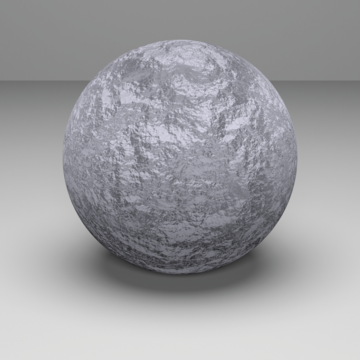

Figure 10.30: Sphere with FBmTexture Used for Bump Mapping.

图 10.30：带有用于凹凸纹理的 FBmTexture 的球体。

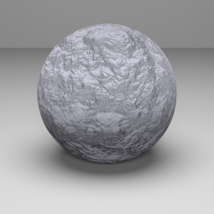

Figure 10.31: WrinkledTexture Used as Bump Mapping Function for Sphere.

图 10.31：WrinkledTexture 用作球体的凹凸纹理函数。

```
<<FBmTexture Declarations>>= 
template <typename T> class FBmTexture : public Texture<T> {
public:
    <<FBmTexture Public Methods>> 
private:
    std::unique_ptr<TextureMapping3D> mapping;
    const Float omega;
    const int octaves;
};
<<FBmTexture Public Methods>>= 
FBmTexture(std::unique_ptr<TextureMapping3D> mapping, int octaves,
           Float omega)
    : mapping(std::move(mapping)), omega(omega), octaves(octaves) { }
<<FBmTexture Public Methods>>+= 
T Evaluate(const SurfaceInteraction &si) const {
    Vector3f dpdx, dpdy;
    Point3f P = mapping->Map(si, &dpdx, &dpdy);
    return FBm(P, dpdx, dpdy, omega, octaves);
}
```

The implementation of WrinkledTexture is almost identical to FBmTexture, save for a call to Turbulence() instead of FBm(). As such, it isn’t included here.

WrinkledTexture 的实现几乎与 FBmTexture 相同，只是调用了 Turbulence() 而不是 FBm()。因此，这里不包括在内。

### 10.6.5 Windy Waves / 风浪

Application of fBm can give a reasonably convincing representation of waves (Ebert et al. 2003). Figures 1.11 and 4.1 use this texture for the water in those scenes. This Texture is based on two observations. First, across the surface of a wind-swept lake (for example), some areas are relatively smooth and some are more choppy; this effect comes from the natural variation of the wind’s strength from area to area. Second, the overall form of individual waves on the surface can be described well by the fBm-based wave pattern scaled by the wind strength. This texture is implemented in textures/windy.h and textures/windy.cpp.

fBm 的应用可以给出一个相当有说服力的波表示（Ebert et al. 2003）。图 1.11 和 4.1 在这些场景中为水使用了这种纹理。此纹理基于两个观察结果。首先，在被风吹过的湖面上（例如），有些区域相对平滑，有些则波涛汹涌；这种影响来自不同地区的风强度的自然变化。其次，表面上单个波浪的整体形式可以通过风强度缩放的基于 fBm 的波浪模式很好地描述。这个纹理在textures/windy.h 和textures/windy.cpp 中实现。

```
<<WindyTexture Declarations>>= 
template <typename T> class WindyTexture : public Texture<T> {
public:
    <<WindyTexture Public Methods>> 
private:
    std::unique_ptr<TextureMapping3D> mapping;
};
<<WindyTexture Public Methods>>= 
WindyTexture(std::unique_ptr<TextureMapping3D> mapping)
    : mapping(std::move(mapping)) { }
```

The evaluation function uses two calls to the FBm() function. The first scales down the point P by a factor of 10; as a result, the first call to FBm() returns relatively low-frequency variation over the surface of the object being shaded. This value is used to determine the local strength of the wind. The second call determines the amplitude of the wave at the particular point, independent of the amount of wind there. The product of these two values gives the actual wave offset for the particular location.

计算函数使用两次对 FBm() 函数的调用。第一个将点 P 缩小 10 倍；因此，对 FBm() 的第一次调用会在被着色对象的表面上返回相对低频的变化。该值用于确定当地风的强度。第二个调用决定了特定点的波幅，与那里的风量无关。这两个值的乘积给出了特定位置的实际波偏移。

```
<<WindyTexture Public Methods>>+= 
T Evaluate(const SurfaceInteraction &si) const {
    Vector3f dpdx, dpdy;
    Point3f P = mapping->Map(si, &dpdx, &dpdy);
    Float windStrength = FBm(.1f * P, .1f * dpdx, .1f * dpdy, .5, 3);
    Float waveHeight = FBm(P, dpdx, dpdy, .5, 6);
    return std::abs(windStrength) * waveHeight;
}
```

### 10.6.6 Marble / 大理石

Another classic use of the noise function is to perturb texture coordinates before using another texture or lookup table. For example, a facsimile of marble can be made by modeling the marble material as a series of layered strata and then using noise to perturb the coordinate used for finding a value among the strata. The MarbleTexture in this section implements this approach. Figure 10.32 illustrates the idea behind this texture. On the left, the layers of marble are indexed directly using the y coordinate of the point on the sphere. On the right, fBm has been used to perturb the y value, introducing variation. This texture is implemented in textures/marble.h and textures/marble.cpp.

噪声函数的另一个经典用途是在使用另一个纹理或查找表之前扰动纹理坐标。例如，可以通过将大理石材质建模为一系列分层地层，然后使用噪声来扰动用于在地层中寻找值的坐标来制作大理石的复制品。本节中的 MarbleTexture 实现了这种方法。图 10.32 说明了这个纹理背后的想法。在左侧，大理石层直接使用球体上点的 y 坐标进行索引。在右侧，fBm 已用于扰动 y 值，从而引入变化。这个纹理在textures/marble.h 和textures/marble.cpp 中实现。

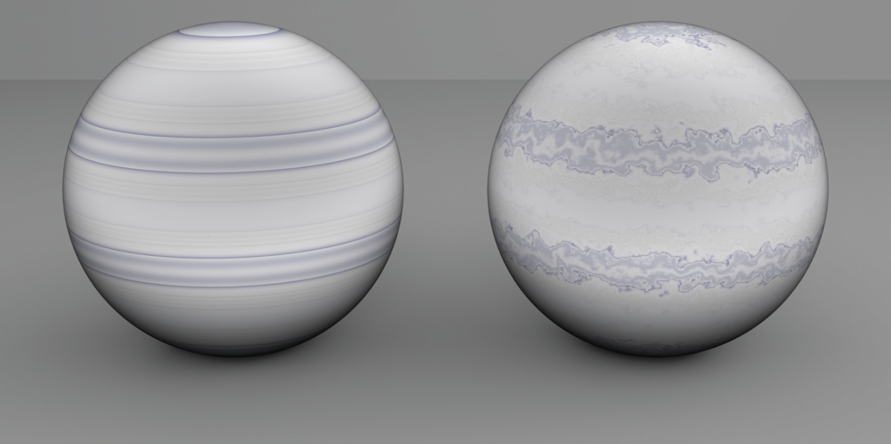

Figure 10.32: Marble. The MarbleTexture perturbs the coordinate used to index into a 1D table of colors using FBm, giving a plausible marble appearance.

图 10.32：大理石。 MarbleTexture 会扰乱用于使用 FBm 索引到 1D 颜色表中的坐标，从而提供合理的大理石外观。

```
<<MarbleTexture Declarations>>= 
class MarbleTexture : public Texture<Spectrum> {
public:
    <<MarbleTexture Public Methods>> 
private:
    <<MarbleTexture Private Data>> 
};
```

The texture takes the usual set of parameters to control the FBm() function that will be used to perturb the lookup coordinate. The variation parameter modulates the magnitude of the perturbation.

纹理采用通常的参数集来控制 FBm() 函数，该函数将用于扰动查找坐标。变化参数调制扰动的幅度。

```
<<MarbleTexture Public Methods>>= 
MarbleTexture(std::unique_ptr<TextureMapping3D> mapping, int octaves,
        Float omega, Float scale, Float variation)
    : mapping(std::move(mapping)), octaves(octaves), omega(omega),
      scale(scale), variation(variation) { }
<<MarbleTexture Private Data>>= 
std::unique_ptr<TextureMapping3D> mapping;
const int octaves;
const Float omega, scale, variation;
```

An offset into the marble layers is computed by adding the variation to the point’s y component and using the sine function to remap its value into the range [0,1]. The <<*Evaluate marble spline at t*>> fragment uses the t value as the evaluation point for a cubic spline through a series of colors that are similar to those of real marble.

通过将变化添加到点的 y 分量并使用正弦函数将其值重新映射到范围 [0,1] 来计算大理石层的偏移量。 <<*Evaluate marble spline at t*>> 片段使用 t 值作为三次样条的计算点，通过一系列与真实大理石相似的颜色。

```
<<MarbleTexture Public Methods>>+= 
Spectrum Evaluate(const SurfaceInteraction &si) const {
    Vector3f dpdx, dpdy;
    Point3f p = mapping->Map(si, &dpdx, &dpdy);
    p *= scale;
    Float marble = p.y + variation * 
                   FBm(p, scale * dpdx, scale * dpdy, omega, octaves);
    Float t = .5f + .5f * std::sin(marble);
    <<Evaluate marble spline at t>> 
}
```

## Further Reading / 进一步阅读

The cone-tracing method of Amanatides (1984) was one of the first techniques for automatically estimating filter footprints for ray tracing. The beam-tracing algorithm of Heckbert and Hanrahan (1984) was another early extension of ray tracing to incorporate an area associated with each image sample rather than just an infinitesimal ray. The pencil-tracing method of Shinya, Takahashi, and Naito (1987) is another approach to this problem. Other related work on the topic of associating areas or footprints with rays includes Mitchell and Hanrahan’s paper (1992) on rendering caustics and Turkowski’s technical report (1993).

Collins (1994) estimated the ray footprint by keeping a tree of all rays traced from a given camera ray, examining corresponding rays at the same level and position. The ray differentials used in pbrt are based on Igehy’s (1999) formulation, which was extended by Suykens and Willems (2001) to handle glossy reflection in addition to perfect specular reflection. Worley’s chapter in Texturing and Modeling (Ebert et al. 2003) on computing differentials for filter regions presents an approach similar to ours. See Elek et al. (2014) for an extension of ray differentials to include wavelength, which can improve results with full-spectral rendering.

Two-dimensional texture mapping with images was first introduced to graphics by Blinn and Newell (1976). Ever since Crow (1977) identified aliasing as the source of many errors in images in graphics, quite a bit of work has been done to find efficient and effective ways of antialiasing image maps. Dungan, Stenger, and Sutty (1978) were the first to suggest creating a pyramid of prefiltered texture images; they used the nearest texture sample at the appropriate level when looking up texture values, using supersampling in screen space to antialias the result. Feibush, Levoy, and Cook (1980) investigated a spatially varying filter function, rather than a simple box filter. (Blinn and Newell were aware of Crow’s results and used a box filter for their textures.)

Amanatides (1984) 的锥形追踪方法是用于自动估计用于光线追踪的过滤器足迹的首批技术之一。 Heckbert 和 Hanrahan (1984) 的光线追踪算法是光线追踪的另一个早期扩展，它包含与每个图像样本相关的区域，而不仅仅是一条无穷小的光线。 Shinya、Takahashi 和 Naito (1987) 的铅笔追踪法是解决这个问题的另一种方法。关于将区域或足迹与光线相关联的其他相关工作包括 Mitchell 和 Hanrahan 关于渲染焦散的论文 (1992) 和 Turkowski 的技术报告 (1993)。
Collins (1994) 通过保留从给定相机光线追踪的所有光线树来估计光线足迹，检查相同水平和位置的相应光线。 pbrt 中使用的光线微分基于 Igehy (1999) 的公式，Suykens 和 Willems (2001) 对其进行了扩展，以处理除了完美镜面反射之外的光泽反射。 Worley 在纹理和建模 (Ebert et al. 2003) 中关于计算过滤器区域差异的章节提出了一种类似于我们的方法。见 Elek 等人 (2014) 将光线微分扩展到包括波长，这可以通过全光谱渲染来改善结果。

Blinn 和 Newell (1976) 首次将带有图像的二维纹理映射引入图形。自从 Crow (1977) 将走样确定为图形图像中许多错误的根源以来，已经进行了大量工作来寻找有效的反走样图像映射方法。 Dungan、Stenger 和 Sutty (1978) 是第一个建议创建预过滤纹理图像锥体的人。他们在查找纹理值时使用了适当级别的最近纹理样本，并在屏幕空间中使用超级采样对结果进行反走样处理。 Feibush、Levoy 和 Cook (1980) 研究了空间变化的过滤器函数，而不是简单的box filter。 （Blinn 和 Newell 知道 Crow 的结果，并为他们的纹理使用了box filter。）

Williams (1983) used a MIP map image pyramid for texture filtering with trilinear interpolation. Shortly thereafter, Crow (1984) introduced summed area tables, which make it possible to efficiently filter over axis-aligned rectangular regions of texture space. Summed area tables handle anisotropy better than Williams’s method, although only for primarily axis-aligned filter regions. Heckbert (1986) wrote a good general survey of texture mapping algorithms through the mid-1980s.

Greene and Heckbert (1986) originally developed the elliptically weighted average technique, and Heckbert’s master’s thesis (1989) put the method on a solid theoretical footing. Fournier and Fiume (1988) developed an even higher quality texture filtering method that focuses on using a bounded amount of computation per lookup. Nonetheless, their method appears to be less efficient than EWA overall. Lansdale’s master’s thesis (1991) has an extensive description of EWA and Fournier and Fiume’s method, including implementation details.

More recently, a number of researchers have investigated generalizing Williams’s original method using a series of trilinear MIP map samples in an effort to increase quality without having to pay the price for the general EWA algorithm. By taking multiple samples from the MIP map, anisotropy is handled well while preserving the computational efficiency. Examples include Barkans’s (1997) description of texture filtering in the Talisman architecture, McCormack et al.’s (1999) Feline method, and Cant and Shrubsole’s (2000) technique. Manson and Schaefer (2013, 2014) have recently shown how to accurately approximate a variety of filter functions with a fixed small number of bilinearly interpolated sample values. This approach is particularly useful on GPUs, where hardware-accelerated bilinear interpolation is available.

Williams (1983) 使用 MIP map图像锥体进行具有三线性插值的纹理过滤。此后不久，Crow (1984) 引入了求和面积表，它可以有效地过滤纹理空间的轴对齐矩形区域。总面积表比 Williams 的方法更好地处理各向异性，尽管仅适用于主要轴对齐的过滤器区域。 Heckbert (1986) 对 1980 年代中期的纹理映射算法进行了很好的综合调查。

Greene 和 Heckbert (1986) 最初开发了椭圆加权平均技术，Heckbert 的硕士论文 (1989) 将该方法置于坚实的理论基础上。 Fournier 和 Fiume (1988) 开发了一种更高质量的纹理过滤方法，专注于每次查找使用有限的计算量。尽管如此，他们的方法似乎总体上不如 EWA 有效。 Lansdale 的硕士论文 (1991) 对 EWA 和 Fournier 和 Fiume 的方法进行了广泛的描述，包括实现细节。

最近，许多研究人员研究了使用一系列三线性 MIP map样本来推广Williams的原始方法，以提高质量，而不必为通用 EWA 算法付出代价。通过从 MIP map中获取多个样本，可以很好地处理各向异性，同时保持计算效率。示例包括 Barkans (1997) 对 Talisman 架构中纹理过滤的描述、McCormack 等人 (1999) 的 Feline 方法以及 Cant 和 Shrubsole (2000) 的技术。 Manson 和 Schaefer (2013, 2014) 最近展示了如何使用固定的少量双线性插值样本值准确逼近各种过滤器函数。这种方法在可以使用硬件加速双线性插值的 GPU 上特别有用。

Gamma correction has a long history in computer graphics. Poynton (2002a, 2002b) has written comprehensive FAQs on issues related to color representation and gamma correction. Most modern displays are based on the sRGB color space, which has a gamma of roughly 2.2 (International Electrotechnical Commission (IEC) 1999). See Gritz and d’Eon (2008) for a detailed discussion of the implications of gamma correction for rendering and how to correctly account for it in rendering systems.

Smith’s (2002) Web site and document on audio resampling gives a good overview of resampling signals in one dimension. Heckbert’s (1989) zoom source code is the canonical reference for image resampling. His implementation carefully avoids feedback without using auxiliary storage, unlike ours in this chapter, which allocates additional temporary buffer space to do so.

Three-dimensional solid texturing was originally developed by Gardner (1984, 1985), Perlin (1985a), and Peachey (1985). Norton, Rockwood, and Skolmoski (1982) developed the clamping method that is widely used for antialiasing textures based on solid texturing. The general idea of procedural texturing was introduced by Cook (1984), Perlin (1985a), and Peachey (1985).

伽玛校正在计算机图形学中有着悠久的历史。 Poynton (2002a, 2002b) 撰写了有关颜色表示和伽马校正问题的综合常见问题解答。大多数现代显示器基于 sRGB 色彩空间，其伽玛值大约为 2.2（国际电工委员会 (IEC) 1999）。有关伽马校正对渲染的影响以及如何在渲染系统中正确解释它的详细讨论，请参见 Gritz 和 d'Eon (2008)。

Smith (2002) 的网站和关于音频重采样的文档很好地概述了一维重采样信号。 Heckbert (1989) 的缩放源代码是图像重采样的规范参考。他的实现在不使用辅助存储的情况下小心地避免了反馈，这与我们在本章中的实现不同，后者为此分配了额外的临时缓冲区空间。

三维纯色纹理最初由 Gardner (1984, 1985)、Perlin (1985a) 和 Peachey (1985) 开发。 Norton、Rockwood 和 Skolmoski (1982) 开发了广泛用于基于纯色纹理的反走样纹理的clamping方法。 Cook (1984)、Perlin (1985a) 和 Peachey (1985) 介绍了程序纹理的一般概念。

Peachey’s chapter in Texturing and Modeling (Ebert et al. 2003) has a thorough summary of approaches to noise functions. After Perlin’s original noise function, both Lewis (1989) and van Wijk (1991) developed alternatives that made different time/quality trade-offs. Worley (1996) has developed a quite different noise function for procedural texturing that is well suited for cellular and organic patterns. Perlin (2002) revised his noise function to correct a number of subtle shortcomings.

Noise functions have received additional attention from the research community in recent years. (Lagae et al. (2010) have a good survey of work up to that year.) Building on Lewis’s observation that individual bands of Perlin’s noise function actually have frequency content over a fairly wide range (Lewis 1989), Cook and DeRose (2005) also identified the problem that 2D slices through 3D noise functions aren’t in general band limited, even if the original 3D noise function is. They proposed a new noise function that addresses both of these issues. Goldberg et al. (2008) developed a noise function that makes efficient anisotropic filtering possible, leading to higher quality results than just applying the clamping approach for antialiasing. Their method is also well suited to programmable graphics hardware. Kensler et al. (2008) suggested a number of improvements to Perlin’s revised noise function.

Lagae et al. (2009) have developed a noise function that has good frequency control and can be mapped well to surfaces even without a surface parameterization. Lagae and Drettakis (2011) showed how to compute high quality anisotropically filtered values of this noise function. More recently, Galerne et al. (2012) showed how to automatically determine parameters to this noise function so that the result matches example images. Further work on this topic was done by Du et al. (2013) and Gilet et al. (2014).

Peachey 在纹理和建模（Ebert 等人，2003 年）一章中对噪声函数的方法进行了全面总结。在 Perlin 的原始噪声函数之后，Lewis (1989) 和 van Wijk (1991) 都开发了替代方案，它们做出了不同的时间/质量权衡。 Worley (1996) 为程序纹理开发了一种完全不同的噪声函数，非常适合网状和分子模式。 Perlin (2002) 修改了他的噪声函数以纠正一些细微的缺点。

近年来，噪声函数受到了研究界的更多关注。 （Lagae 等人（2010 年）对当年的工作进行了很好的调查。）基于 Lewis 的观察，Perlin 噪声函数的各个频带实际上具有相当宽范围内的频率内容（Lewis 1989），Cook 和 DeRose（2005 年） ) 还发现了通过 3D 噪声函数的 2D 切片通常不受频带限制的问题，即使原始 3D 噪声函数是。他们提出了一种新的噪声函数来解决这两个问题。Goldberg等人 (2008) 开发了一种噪声函数，可以使有效的各向异性过滤成为可能，从而获得比仅应用clamping方法进行反走样更高质量的结果。他们的方法也非常适合可编程图形硬件。Kensler等人 (2008) 建议对 Perlin 的修正噪声函数进行一些改进。

Lagae等人 (2009) 开发了一种噪声函数，该函数具有良好的频率控制，即使没有表面参数化也可以很好地映射到表面。 Lagae 和 Drettakis (2011) 展示了如何计算此噪声函数的高质量各向异性滤波值。最近，Galerne 等人 (2012) 展示了如何自动确定该噪声函数的参数，以使结果与示例图像匹配。 Du 等人对这个主题进行了进一步的工作 (2013) 和 Gilet 等人（2014）。

The first languages and systems that supported the idea of user-supplied procedural shaders were developed by Cook (1984) and Perlin (1985a). (The texture composition model in this chapter is similar to Cook’s shade trees.) The RenderMan shading language, described in a paper by Hanrahan and Lawson (1990), remains the classic shading language in graphics, though a more modern shading language is available in Open Shading Language (OSL) (Gritz et al. 2010), which is open source and increasingly used for production rendering. It follows the model of the shader returning a representation of the material rather than a final color value, like the approach introduced in Chapter 9. See also Karrenberg et al. (2010), who introduced the AnySL shading language, which was designed for both high performance as well as portability across multiple rendering systems (including pbrt).

See Ebert et al. (2003) and Apodaca and Gritz (2000) for techniques for writing procedural shaders; both of those have excellent discussions of issues related to antialiasing in procedural shaders.

Cook (1984) 和 Perlin (1985a) 开发了支持用户提供的程序着色器思想的第一批语言和系统。 （本章中的纹理合成模型类似于 Cook 的shade树。）在 Hanrahan 和 Lawson（1990）的一篇论文中描述的 RenderMan 着色语言仍然是图形中的经典着色语言，尽管更现代的着色语言在开放着色语言 (OSL) (Gritz et al. 2010)，它是开源的，越来越多地用于生产渲染。它遵循着色器的模型，返回材质的表示而不是最终的颜色值，就像第 9 章中介绍的方法一样。另见 Karrenberg 等人 (2010)，他介绍了 AnySL 着色语言，该语言旨在实现高性能以及跨多个渲染系统（包括 pbrt）的可移植性。
参见 Ebert 等人 (2003) 和 Apodaca 和 Gritz (2000) 编写程序着色器的技术；两者都对与程序着色器中的反走样相关的问题进行了很好的讨论。

The “Further Reading” section in Chapter 9 described approaches for anti-aliasing bump maps; a number of researchers have looked at the closely related issue of antialiasing surface reflection functions. Van Horn and Turk (2008) developed an approach to automatically generate MIP maps of reflection functions that represent the characteristics of shaders over finite areas in order to antialias them. Bruneton and Neyret (2012) surveyed the state of the art in this area, and Jarabo et al. (2014b) also considered perceptual issues related to filtering inputs to these functions. See also Heitz et al. (2014) for recent work on this topic.

Many creative methods for computing texture on surfaces have been developed. A sampling of our favorites includes reaction diffusion, which simulates growth processes based on a model of chemical interactions over surfaces and was simultaneously introduced by Turk (1991) and Witkin and Kass (1991); Sims’s (1991) genetic algorithm-based approach, which finds programs that generate interesting textures through random mutations from which users select their favorites; Fleischer et al.’s (1995) cellular texturing algorithms that generate geometrically accurate scales and spike features on surfaces; and Dorsey et al.’s (1996) flow simulations that model the effect of weathering on buildings and encode the results in image maps that stored the relative wetness, dirtiness, and so on, at points on the surfaces of structures. Porumbescu et al. (2005) developed shell maps, which make it possible to map geometric objects onto a surface in the manner of texture mapping.

A variety of texture synthesis algorithms have been developed in the past decade; these approaches take an example texture image and then synthesize larger texture maps that appear similar to the original texture while not being exactly the same. The survey article by Wei et al. (2009) describes work in this area through 2009 as well as the main approaches that have been developed so far. For more recent work in this area, see Kim et al. (2012), who developed an effective approach based on finding symmetries in textures, and Lefebvre et al. (2010), who attacked the specialized (but useful) problem of synthesizing textures for building facades.

第 9 章中的“进一步阅读”部分描述了反走样凹凸纹理的方法；许多研究人员已经研究了与反走样表面反射函数密切相关的问题。 Van Horn 和 Turk (2008) 开发了一种自动生成反射函数的 MIP map的方法，这些映射表示着色器在有限区域上的特性，以便对它们进行反走样处理。 Bruneton 和 Neyret (2012) 调查了该领域的最新技术，Jarabo 等人 (2014b) 还考虑了与过滤这些函数的输入相关的感知问题。另见 Heitz 等人（2014）最近关于这个主题的工作。

已经开发了许多用于计算表面纹理的创造性方法。我们最喜欢的一个样本包括反应扩散，它基于表面化学相互作用模型模拟生长过程，同时由 Turk (1991) 和 Witkin 和 Kass (1991) 引入； Sims (1991) 的基于遗传算法的方法，该方法通过随机突变找到生成有趣纹理的程序，用户从中选择他们的最爱； Fleischer 等人 (1995) 的细胞纹理算法，可在表面上生成几何精确的尺度和尖峰特征；和 Dorsey 等人 (1996) 的流动模拟，该模拟模拟了风化对建筑物的影响，并将结果编码在图像地图中，图像地图存储了结构表面上的点的相对湿度、脏度等。Porumbescu等人 (2005) 开发了壳纹理，这使得以纹理映射的方式将几何对象映射到表面上成为可能。

在过去的十年中，已经开发了多种纹理合成算法；这些方法采用示例纹理图像，然后合成看起来与原始纹理相似但不完全相同的较大纹理图。 Wei等人的调查文章。 (2009) 描述了到 2009 年该领域的工作以及迄今为止开发的主要方法。有关该领域的最新工作，请参阅 Kim 等人 (2012)，他开发了一种基于在纹理中寻找对称性的有效方法，以及 Lefebvre 等人 (2010)，他攻克了为建筑立面合成纹理的专门（但有用的）问题。

## References

1. Amanatides, J. 1984. Ray tracing with cones. Computer Graphics (SIGGRAPH ’84 Proceedings), 18, 129–35.

2. Apodaca, A. A., and L. Gritz. 2000. Advanced RenderMan: Creating CGI for Motion Pictures. San Francisco: Morgan Kaufmann.

3. Barkans, A. C. 1997. High-quality rendering using the Talisman architecture. In 1997 SIGGRAPH/Eurographics Workshop on Graphics Hardware, 79–88.

4. Blinn, J. F., and M. E. Newell. 1976. Texture and reflection in computer generated images. Communications of the ACM 19, 542–46.

5. Bruneton, E., and F. Neyret. A survey of nonlinear prefiltering methods for efficient and accurate surface shading. IEEE Transactions on Visualization and Computer Graphics 18 (2), 242–60.

6. Cant, R. J., and P. A. Shrubsole 2000. Texture potential MIP mapping, a new high-quality texture antialiasing algorithm. ACM Transactions on Graphics 19 (3), 164–84.

7. Collins, S. 1994. Adaptive splatting for specular to diffuse light transport. In Fifth Eurographics Workshop on Rendering, Darmstadt, Germany, 119–35.

8. Cook, R. L. 1984. Shade trees. Computer Graphics (SIGGRAPH ’84 Proceedings), 18, 223–31.

9. Cook, R., and T. DeRose. 2005. Wavelet noise. ACM Transactions on Graphics (Proceedings of SIGGRAPH 2005) 24 (3), 803–11.

10. Crow, F. C. 1977. The aliasing problem in computer-generated shaded images. Communications of the ACM 20 (11), 799–805.

11. Crow, F. C. 1984. Summed-area tables for texture mapping. Computer Graphics (Proceedings of SIGGRAPH ’84), 18, 207–12.

12. Dorsey, J., H. K. Pedersen, and P. M. Hanrahan. 1996. Flow and changes in appearance. In Proceedings of SIGGRAPH ’96, Computer Graphics Proceedings, Annual Conference Series, 411–20.

13. Du, S.-P., S.-M. Hu, and R. R. Martin. Semiregular solid texturing from 2D image exemplars. IEEE Transactions on Visualization and Computer Graphics 19 (3), 460–69.

14. Dungan, W. Jr., A. Stenger, and G. Sutty. 1978. Texture tile considerations for raster graphics. Computer Graphics (Proceedings of SIGGRAPH ’78), 12, 130–34.

15. Ebert, D., F. K. Musgrave, D. Peachey, K. Perlin, and S. Worley. 2003. Texturing and Modeling: A Procedural Approach. San Francisco: Morgan Kaufmann.

16. Elek, O., P. Bauszat, T. Ritschel, M. Magnor, and H.-P. Seidel. Spectral ray differentials. Computer Graphics Forum (Proceedings of the 2014 Eurographics Symposium on Rendering) 33 (4), 113–22.

17. Feibush, E. A., M. Levoy, and R. L. Cook. 1980. Synthetic texturing using digital filters. Computer Graphics (Proceedings of SIGGRAPH ’80), 14, 294–301.

18. Fleischer, K., D. Laidlaw, B. Currin, and A. H. Barr. 1995. Cellular texture generation. In Proceedings of SIGGRAPH ’95, Computer Graphics Proceedings, Annual Conference Series, 239–48.

19. Fournier, A., and E. Fiume. 1988. Constant-time filtering with space-variant kernels. Computer Graphics (SIGGRAPH ’88 Proceedings), 22, 229–38.

20. Galerne, B., A. Lagae, S. Lefebvre, and G. Drettakis. Gabor noise by example. ACM Transactions on Graphics (Processings of SIGGRAPH 2012) 31 (4), 73:1–73:9.

21. Gardner, G. Y. 1984. Simulation of natural scenes using textured quadric surfaces. Computer Graphics (SIGGRAPH ’84 Proceedings), 18, 11–20.

22. Gardner, G. Y. 1985. Visual simulation of clouds. Computer Graphics (Proceedings of SIGGRAPH ’85), 19, 297–303.

23. Gilet, G., B. Sauvage, K. Vanhoey, J.-M. Dischler, and D. Ghazanfarpour. Local random-phase noise for procedural texturing. ACM Transactions on Graphics (Proceedings of SIGGRAPH Asia 2014) 33 (6), 195:1–195:11.

24. Goldberg, A., M. Zwicker, and F. Durand. 2008. Anisotropic noise. ACM Transactions on Graphics (Proceedings of SIGGRAPH 2008) 27 (3), 54:1–54:8.

25. Gritz, L., and E. d’Eon. 2008. The importance of being linear. In H. Nguyen (Ed.), GPU Gems 3. Boston, Massachusetts: Addison-Wesley.

26. Gritz, L., C. Stein, C. Kulla, and A. Conty. Open Shading Language. SIGGRAPH 2010 Talks.

27. Guthe, S., and P. Heckbert 2005. Non-power-of-two mipmapping. NVIDIA Technical Report, https://www.nvidia.com/object/np2_mipmapping.html.

28. Hakura, Z. S., and A. Gupta. 1997. The design and analysis of a cache architecture for texture mapping. In Proceedings of the 24th International Symposium on Computer Architecture, Denver, Colorado, 108–20.

29. Hanrahan, P., and J. Lawson. 1990. A language for shading and lighting calculations. Computer Graphics (SIGGRAPH ’90 Proceedings), 24, 289–98.

30. Heckbert, P. S. 1986. Survey of texture mapping. IEEE Computer Graphics and Applications 6 (11), 56–67.

31. Heckbert, P. S. 1989a. Image zooming source code. www-2.cs.cmu.edu/~ph/src/zoom/.

32. Heckbert, P. S. 1989b. Fundamentals of texture mapping and image warping. M.S. thesis, Department of Electrical Engineering and Computer Science, University of California, Berkeley.

33. Heckbert, P. S., and P. Hanrahan. 1984. Beam tracing polygonal objects. In Computer Graphics (Proceedings of SIGGRAPH ’84), 18, 119–27.

34. Heitz, E., D. Nowrouzezahrai, P. Poulin, and F. Neyret. Filtering non-linear transfer functions on surfaces. IEEE Transactions on Visualization and Computer Graphics 20 (7), 996–1008.

35. Igehy, H. 1999. Tracing ray differentials. In Proceedings of SIGGRAPH ’99, Computer Graphics Proceedings, Annual Conference Series, 179–86.

36. Igehy, H., M. Eldridge, and K. Proudfoot. 1998. Prefetching in a texture cache architecture. In 1998 SIGGRAPH/Eurographics Workshop on Graphics Hardware, 133–42.

37. Igehy, H., M. Eldridge, and P. Hanrahan. 1999. Parallel texture caching. In 1999 SIGGRAPH/Eurographics Workshop on Graphics Hardware, 95–106.

38. International Electrotechnical Commission (IEC). 1999. Multimedia systems and equipment—Colour measurement and management—Part 2-1: Colour management—Default RGB colour space—sRGB. IEC Standard 61966-2-1.

39. Jarabo, A., H. Wu, J. Dorsey, H. Rushmeier, and D. Gutierrez. Effects of approximate filtering on the appearance of bidirectional texture functions. IEEE Transactions on Visualization and Computer Graphics 20 (6), 880–92.

40. Karrenberg, R., D. Rubinstein, P. Slusallek, and S. Hack. AnySL: efficient and portable shading for ray tracing. In Proceedings of High Performance Graphics 2010, 97–105.

41. Kensler, A., A. Knoll, and P. Shirley. 2008. Better gradient noise. Technical Report UUSCI-2008-001, SCI Institute, University of Utah.

42. Kim, V. G., Y. Lipman, and T. Funkhouser. Symmetry-guided texture synthesis and manipulation. ACM Transactions on Graphics 31 (3), 22:1–22:14.

43. Lagae, A., and G. Drettakis. Filtering solid Gabor noise. ACM Transactions on Graphics (Proceedings of ACM SIGGRAPH 2011) 30 (4), 51:1–51:6.

44. Lagae, A., S. Lefebvre, G. Drettakis, and P. Dutré. 2009. Procedural noise using sparse Gabor convolution. ACM Transactions on Graphics (Proceedings of SIGGRAPH 2009) 28 (3), 54:1–54:10.

45. Lagae, A., S. Lefebvre, R. Cook, T. DeRose, G. Drettakis, D. S. Ebert, J. P. Lewis, K. Perlin, and M. Zwicker. A survey of procedural noise functions. Computer Graphics Forum 29 (8), 2579–2600.

46. Lansdale, R. C. 1991. Texture mapping and resampling for computer graphics. M.S. thesis, Department of Electrical Engineering, University of Toronto.

47. Lefebvre, S., S. Hornus, and A. Lasram. By-example synthesis of architectural textures. ACM Transactions on Graphics (Proceedings of SIGGRAPH 2010) 29 (4), 84:1–84:8.

48. Lewis, J.-P. 1989. Algorithms for solid noise synthesis. In Computer Graphics (Proceedings of SIGGRAPH ’89), Volume 23, 263–70.

49. Manson, J., and S. Schaefer. Bilinear accelerated filter approximation. Computer Graphics Forum (Proceedings of the 2014 Eurographics Symposium on Rendering) 33 (4), 33–40.

50. Manson, J., and S. Schaefer. Cardinality-constrained texture filtering. ACM Transactions on Graphics (Proceedings of SIGGRAPH 2013) 32 (4), 140:1–140:8.

51. McCormack, J., R. Perry, K. I. Farkas, and N. P. Jouppi. 1999. Feline: fast elliptical lines for anisotropic texture mapping. In Proceedings of SIGGRAPH ’99, Computer Graphics Proceedings, Annual Conference Series, Los Angeles, 243–250.

52. Mitchell, D. P., and P. Hanrahan. 1992. Illumination from curved reflectors. In Computer Graphics (Proceedings of SIGGRAPH ’92), Volume 26, 283–91.

53. Norton, A., A. P. Rockwood, and P. T. Skolmoski. 1982. Clamping: a method of antialiasing textured surfaces by bandwidth limiting in object space. In Computer Graphics (Proceedings of SIGGRAPH ’82), Volume 16, 1–8.

54. Peachey, D. R. 1985. Solid texturing of complex surfaces. Computer Graphics (SIGGRAPH ’85 Proceedings), Volume 19, 279–86.

55. Peachey, D. R. 1990. Texture on demand. Pixar Technical Memo #217.

56. Perlin, K. 1985a. An image synthesizer. In Computer Graphics (SIGGRAPH ’85 Proceedings), Volume 19, 287–96.

57. Perlin, K. 2002. Improving noise. ACM Transactions on Graphics 21 (3), 681–82.

58. Porumbescu, S., B. Budge, L. Feng, and K. Joy. 2005. Shell maps. In ACM Transactions on Graphics (Proceedings of SIGGRAPH 2005) 24 (3), 626–33.

59. Poynton, C. 2002a. Frequently-asked questions about color. www.poynton.com/ColorFAQ.html.

60. Poynton, C. 2002b. Frequently-asked questions about gamma. www.poynton.com/GammaFAQ.html.

61. Shinya, M., T. Takahashi, and S. Naito. 1987. Principles and applications of pencil tracing. In Computer Graphics (Proceedings of SIGGRAPH ’87), Volume 21, 45–54.

62. Sims, K. 1991. Artificial evolution for computer graphics. In Computer Graphics (Proceedings of SIGGRAPH ’91), Volume 25, 319–28.

63. Smith, J. O. 2002. Digital audio resampling home page. http://ccrma.stanford.edu/~jos/resample/.

64. Suykens, F., and Y. Willems. 2001. Path differentials and applications. In Rendering Techniques 2001: 12th Eurographics Workshop on Rendering, 257–68.

65. Turk, G. 1991. Generating textures for arbitrary surfaces using reaction-diffusion. In Computer Graphics (Proceedings of SIGGRAPH ’91), Volume 25, 289–98.

66. Turkowski, K. 1993. The differential geometry of texture-mapping and shading. Technical Note, Advanced Technology Group, Apple Computer.

67. Van Horn, B., and G. Turk. 2008. Antialiasing procedural shaders with reduction maps. IEEE Transactions on Visualization and Computer Graphics 14 (3), 539–50.

68. van Wijk, J. J. 1991. Spot noise-texture synthesis for data visualization. In Computer Graphics (Proceedings of SIGGRAPH ’91), Volume 25, 309–18.

69. Wei, L.-Y., S. Lefebvre, V. Kwatra, and G. Turk. 2009. State of the art in example-based texture synthesis. In Eurographics 2009, State of the Art Report.

70. Williams, L. 1983. Pyramidal parametrics. In Computer Graphics (SIGGRAPH ’83 Proceedings), Volume 17, 1–11.

71. Witkin, A., and M. Kass. 1991. Reaction-diffusion textures. In Computer Graphics (Proceedings of SIGGRAPH ’91), Volume 25, 299–308.

72. Worley, S. P. 1996. A cellular texture basis function. In Proceedings of SIGGRAPH ’96, Computer Graphics Proceedings, Annual Conference Series, New Orleans, Louisiana, 291–94.

## Exercises

1. Many image file formats don’t store floating-point color values but instead use 8 bits for each color component, mapping the values to the range [0,1]. (For example, the TGA format that is supported by ReadImage() is such a format.) For images originally stored in this format, the ImageTexture uses four times more memory than strictly necessary by using floats in RGBSpectrum objects to store these colors. Modify the image reading routines to directly return 8-bit values when an image is read from such a file. Then modify the ImageTexture so that it keeps the data for such textures in an 8-bit representation, and modify the MIPMap so that it can filter data stored in this format. How much memory is saved for image texture-heavy scenes? How is pbrt’s performance affected? Can you explain the causes of any performance differences?

2. For scenes with many image textures where reading them all into memory simultaneously has a prohibitive memory cost, an effective approach can be to allocate a fixed amount of memory for image maps (a texture cache), load textures into that memory on demand, and discard the image maps that haven’t been accessed recently when the memory fills up (Peachey 1990). To enable good performance with small texture caches, image maps should be stored in a tiled format that makes it possible to load in small square regions of the texture independently of each other. Tiling techniques like these are used in graphics hardware to improve the performance of their texture memory caches (Hakura and Gupta 1997; Igehy et al. 1998, 1999). Implement a texture cache in pbrt. Write a conversion program that converts images in other formats to a tiled format. (You may want to investigate OpenEXR’s tiled image support.) How small can you make the texture cache and still see good performance?

3. Read the papers by Manson and Schaefer (2013, 2014) on approximating high-quality filters with MIP maps and a small number of bilinear samples. Add an option to use their method for texture filtering in place of the EWA implementation currently in pbrt. Compare image quality for a number of scenes that use textures. How does running time compare? You may also find it useful to use a profiler to compare the amount of time running texture filtering code for each of the two approaches.

4. Improve the filtering algorithm used for resampling image maps to initialize the MIP map levels using the Lanczos filter instead of the box filter. How do the sphere test images in the file scenes/sphere-ewa-vs-trilerp.pbrt and Figure 10.10 change after your improvements?

5. It is possible to use MIP mapping with textures that have non-power-of-two resolutions—the details are explained by Guthe and Heckbert (2005). Implementing this approach can save a substantial amount of memory: in the worst case, the resampling that pbrt’s MIPMap implementation performs can increase memory requirements by a factor of four. (Consider a 513x513 texture that is resampled to be 1024x1024.) Implement this approach in pbrt, and compare the amount of memory used to store texture data for a variety of texture-heavy scenes.

6. Some of the light transport algorithms in Chapters 14, 15, and 16 require a large number of samples to be taken per pixel for good results. (Examples of such algorithms include path tracing as implemented by the PathIntegrator.) If hundreds or thousands of samples are taken in each pixel, then the computational expense of high-quality texture filtering isn’t worthwhile; the high pixel sampling rate serves well to antialias texture functions with high frequencies. Modify the MIPMap implementation so that it optionally just returns a bilinearly interpolated value from the finest level of the pyramid, even if a filter footprint is provided. Compare rendering time and image quality with this approach when rendering an image using many samples per pixel and a scene that has image maps that would otherwise exhibit aliasing at lower pixel sampling rates.

7. An additional advantage of properly antialiased image map lookups is that they improve cache performance. Consider, for example, the situation of undersampling a high-resolution image map: nearby samples on the screen will access widely separated parts of the image map, such that there is low probability that texels fetched from main memory for one texture lookup will already be in the cache for texture lookups at adjacent pixel samples. Modify pbrt so that it always does image texture lookups from the finest level of the MIPMap, being careful to ensure that the same number of texels are still being accessed. How does performance change? What do cache-profiling tools report about the overall change in effectiveness of the CPU cache?

8. Read Worley’s paper that describes a new noise function with substantially different visual characteristics than Perlin noise (Worley 1996). Implement this cellular noise function, and add Textures to pbrt that are based on it.

9. Implement one of the improved noise functions, such as the ones introduced by Cook and DeRose (2005), Goldberg et al. (2008), or Lagae et al. (2009). Compare image quality and rendering time for scenes that make substantial use of noise functions to the current implementation in pbrt.

10. The implementation of the DotsTexture texture in this chapter does not make any effort to avoid aliasing in the results that it computes. Modify this texture to do some form of antialiasing. The Checkerboard2DTexture offers a guide as to how this might be done, although this case is more complicated, both because the polka dots are not present in every grid cell and because they are irregularly positioned. At the two extremes of a filter region that is within a single cell and a filter region that spans a large number of cells, the task is easier. If the filter is entirely within a single cell and is entirely inside or outside the polka dot in that cell (if present), then it is only necessary to evaluate one of the two subtextures as appropriate. If the filter is within a single cell but overlaps both the dot and the base texture, then it is possible to compute how much of the filter area is inside the dot and how much is outside and blend between the two. At the other extreme, if the filter area is extremely large, it is possible to blend between the two textures according to the overall average of how much area is covered by dots and how much is not. (Note that this approach potentially makes the same error as was made in the checkerboard, where the subtextures aren’t aware that part of their area is occluded by another texture. Ignore this issue for this exercise.) Implement these approaches and then consider the intermediate cases, where the filter region spans a small number of cells. What approaches work well for antialiasing in this case?

11. Write a general-purpose Texture that stores a reference to another texture and supersamples that texture when the evaluation method is called, thus making it possible to apply supersampling to any Texture. Use your implementation to compare the effectiveness and quality of the built-in antialiasing done by various procedural textures. Also compare the run-time efficiency of texture supersampling versus increased pixel sampling.

12. Modify pbrt to support a shading language to allow user-written programs to compute texture values. Unless you’re also interested in writing your own compiler, OSL (Gritz et al. 2010) is a good choice.

[]()

1. 许多图像文件格式不存储浮点颜色值，而是为每个颜色分量使用 8 位，将值映射到范围 [0,1]。 （例如，ReadImage() 支持的 TGA 格式就是这样一种格式。）对于最初以这种格式存储的图像，ImageTexture 使用的内存是通过在 RGBSpectrum 对象中使用浮点数来存储这些颜色所严格需要的内存的四倍。修改图像读取程序以在从此类文件中读取图像时直接返回 8 位值。然后修改 ImageTexture 使其以 8 位表示形式保存此类纹理的数据，并修改 MIPMap 使其能够过滤以这种格式存储的数据。为图像纹理密集的场景节省了多少内存？ pbrt 的性能如何受到影响？你能解释任何性能差异的原因吗？

2. 对于具有许多图像纹理的场景，同时将它们全部读取到内存中会导致内存成本过高，一种有效的方法是为图像映射分配固定数量的内存（纹理缓存），按需将纹理加载到该内存中，并在内存填满时丢弃最近未访问的图像映射（Peachey 1990）。为了在小的纹理缓存中实现良好的性能，图像纹理应该以平铺格式存储，这样就可以在纹理的小方形区域中相互独立地加载。像这样的平铺技术用于图形硬件以提高其纹理内存缓存的性能（Hakura 和 Gupta 1997；Igehy 等人 1998、1999）。在 pbrt 中实现纹理缓存。编写一个转换程序，将其他格式的图像转换为平铺格式。 （您可能想研究 OpenEXR 的平铺图像支持。）您可以将纹理缓存设置到多小，并且仍然可以看到良好的性能？

3. 阅读 Manson 和 Schaefer (2013, 2014) 关于使用 MIP map和少量双线性样本逼近高质量过滤器的论文。添加一个选项以使用他们的纹理过滤方法代替 pbrt 中当前的 EWA 实现。比较许多使用纹理的场景的图像质量。运行时间如何比较？您可能还会发现使用分析器比较两种方法中的每一种方法运行纹理过滤代码的时间量很有用。

4. 改进用于重采样图像映射的过滤算法，以使用 Lanczos 过滤器而不是box filter来初始化 MIP map级别。在您改进后，文件场景/sphere-ewa-vs-trilerp.pbrt 和图 10.10 中的球体测试图像如何变化？

5. 可以将 MIP map与具有非二次幂分辨率的纹理一起使用 — Guthe 和 Heckbert (2005) 解释了详细信息。实现这种方法可以节省大量内存：在最坏的情况下，pbrt 的 MIPMap 实现执行的重采样可以将内存需求增加四倍。 （考虑重新采样为 1024x1024 的 513x513 纹理。）在 pbrt 中实现此方法，并比较用于存储各种纹理密集场景的纹理数据的内存量。

6. 第 14 章、第 15 章和第 16 章中的一些光传输算法需要每个像素采集大量样本才能获得良好的结果。 （此类算法的示例包括由 PathIntegrator 实现的路径跟踪。）如果在每个像素中获取数百或数千个样本，那么高质量纹理过滤的计算成本就不值得了；高像素采样率非常适合高频的反走样纹理函数。修改 MIPMap 实现，使其可选地仅从锥体的最精细级别返回双线性插值，即使提供了过滤器足迹。在使用每个像素的多个样本渲染图像以及具有图像纹理的场景（否则会在较低像素采样率下出现走样）时，将渲染时间和图像质量与此方法进行比较。

7. 正确反走样图像映射查找的另一个优点是它们提高了缓存性能。例如，考虑对高分辨率图像地图进行欠采样的情况：屏幕上的附近样本将访问图像地图中相距较远的部分，因此从主内存中获取的纹理元素用于一次纹理查找的概率很低。在缓存中查找相邻像素样本的纹理。修改 pbrt 使其始终从 MIPMap 的最精细级别进行图像纹理查找，注意确保仍在访问相同数量的纹素。性能如何变化？缓存分析工具报告 CPU 缓存有效性的总体变化是什么？

8. 阅读 Worley 的论文，该论文描述了一种新的噪声函数，其视觉特征与 Perlin 噪声有很大不同（Worley 1996）。实现这个网格噪声函数，并在基于它的 pbrt 中添加纹理。

9. 实现一种改进的噪声函数，例如 Cook 和 DeRose (2005)、Goldberg 等人介绍的噪声函数（2008 年），或 Lagae 等人（2009 年）。将大量使用噪声函数的场景的图像质量和渲染时间与 pbrt 中的当前实现进行比较。

10. 本章中 DotsTexture 纹理的实现没有做任何努力来避免它计算的结果中的走样。修改此纹理以执行某种形式的反走样。 Checkerboard2DTexture 提供了如何完成此操作的指南，尽管这种情况更复杂，因为polka圆点并非出现在每个网格单元中，而且它们的位置不规则。在单个单元内的过滤区域和跨越大量单元的过滤区域这两个极端，任务更容易。如果过滤器完全在单个单元格内并且完全在该单元格中的圆点内部或外部（如果存在），则只需酌情计算两个子纹理之一。如果过滤器在单个单元格内，但与点和基础纹理重叠，则可以计算过滤器区域有多少在点内部，有多少在外部，并在两者之间混合。在另一个极端，如果过滤器区域非常大，则可以根据点覆盖的区域的总体平均值和不覆盖的区域的总体平均值在两个纹理之间进行混合。 （请注意，这种方法可能会产生与棋盘格中相同的错误，其中子纹理不知道其部分区域被另一个纹理遮挡。在本练习中忽略此问题。）实现这些方法，然后考虑中间情况，其中过滤器区域跨越少量单元格。在这种情况下，哪些方法对反走样效果很好？

11. 编写一个通用纹理，存储对另一个纹理的引用，并在调用计算方法时对该纹理进行超级采样，从而可以将超级采样应用于任何纹理。使用您的实现来比较各种程序纹理完成的内置反走样的有效性和质量。还比较纹理超级采样与增加像素采样的运行时效率。

12. 修改 pbrt 以支持着色语言，以允许用户编写的程序计算纹理值。除非您也对编写自己的编译器感兴趣，否则 OSL (Gritz et al. 2010) 是一个不错的选择。

