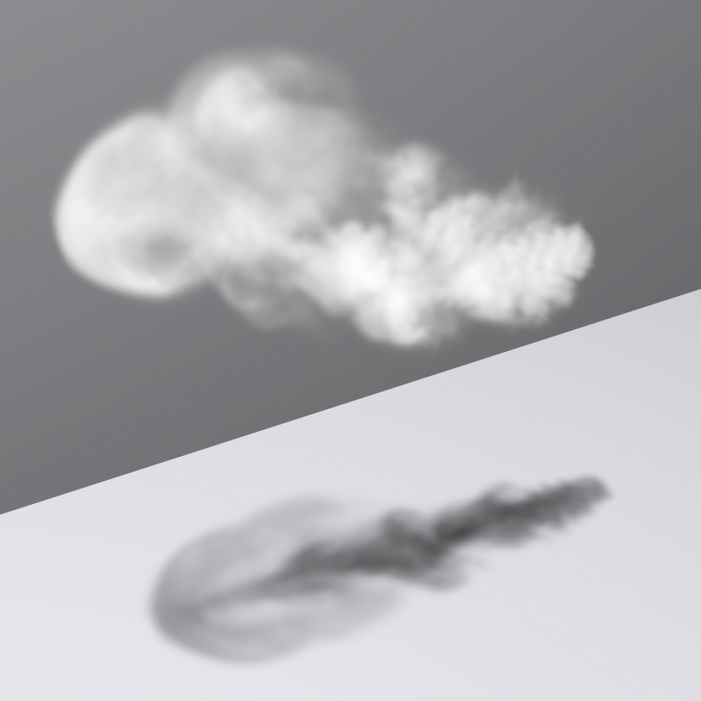
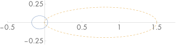
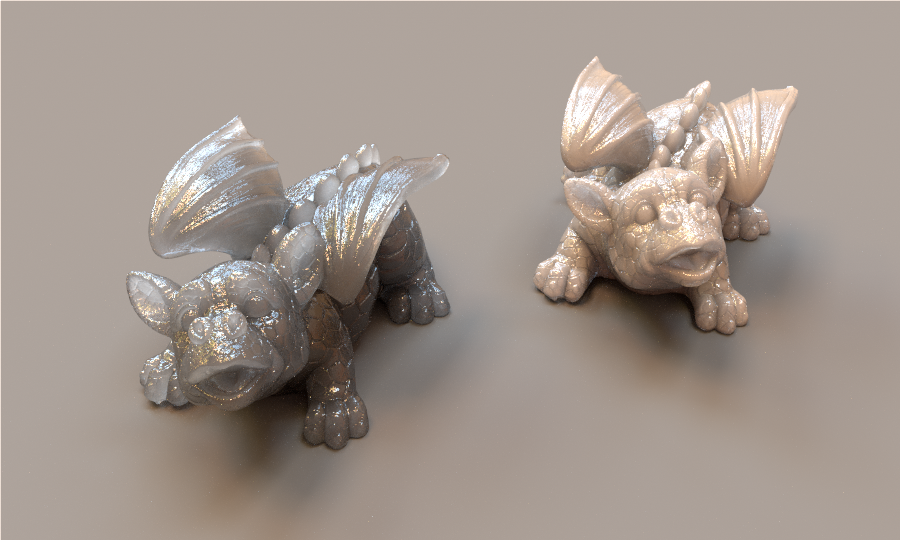

[toc]

# 11 Volume Scattering / 体积散射

So far, we have assumed that scenes are made up of collections of surfaces in a vacuum, which means that radiance is constant along rays between surfaces. However, there are many real-world situations where this assumption is inaccurate: fog and smoke attenuate and scatter light, and scattering from particles in the atmosphere makes the sky blue and sunsets red. This chapter introduces the mathematics to describe how light is affected as it passes through participating media—large numbers of very small particles distributed throughout a region of 3D space. Volume scattering models are based on the assumption that there are so many particles that scattering is best modeled as a probabilistic process, rather than directly accounting for individual interactions with particles. Simulating the effect of participating media makes it possible to render images with atmospheric haze, beams of light through clouds, light passing through cloudy water, and subsurface scattering, where light exits a solid object at a different place than where it entered.

This chapter first describes the basic physical processes that affect the radiance along rays passing through participating media. It then introduces the Medium base class, which provides interfaces for describing participating media in a region of space. Medium implementations return information about the scattering properties at points in their extent, including a phase function, which characterizes how light is scattered at a point in space. (It’s the volumetric analog to the BSDF, which describes scattering at a point on a surface.) In order to determine the effect of participating media on the distribution of radiance in the scene, Integrators that handle volumetric effects are necessary; this is the topic of Chapter 15.

In highly scattering participating media, light can undergo many scattering events without any appreciable reduction in its energy. The cost of finding a light path in an Integrator is generally proportional to its length, and tracking paths with hundreds or thousands of scattering interactions quickly becomes impractical. In such cases, it is preferable to aggregate the overall effect of the underlying scattering process in a function that relates scattering between points where light enters and leaves the medium. The chapter therefore concludes with the BSSRDF base class, which is an abstraction that makes it possible to implement this type of approach. BSSRDF implementations describe the internal scattering in a medium bounded by refractive surfaces.


到目前为止，我们假设场景是由真空中的表面集合组成的，这意味着辐射率沿着表面之间的光线是恒定的。然而，在许多现实世界的情况下，这种假设是不准确的：雾和烟会衰减和散射光，大气中粒子的散射使天空变蓝，日落变红。本章介绍了描述光在穿过参与介质时如何受到影响的数学——大量非常小的粒子分布在整个 3D 空间区域中。体积散射模型基于这样的假设，即存在如此多的粒子，以至于最好将散射建模为概率过程，而不是直接考虑与粒子的个体相互作用。模拟参与介质的效果使得渲染出具有大气雾霾、穿过云层的光束、穿过浑浊水体的光线、以及次表面散射的图像成为可能。在次表面散射中，光线从固体物体中的一个位置射出，而在另一个位置进入该物体。

本章首先描述影响光线穿过参与介质的辐射的基本物理过程。然后介绍了 Medium 基类，它提供了用于描述空间区域中参与介质的接口。介质实现返回有关其范围内各点的散射属性的信息，包括相位函数，它描述了光在空间中一个点的散射方式。（它是 BSDF 的体积模拟，它描述了表面上一点的散射。）为了确定参与介质对场景中辐射分布的影响，需要处理体积效应的积分器；这是第 15 章的主题。

在高度散射的参与介质中，光可以经历许多散射事件而其能量没有任何明显的减少。在积分器中寻找光路的成本通常与其长度成正比，跟踪具有成百上千个散射相互作用的路径很快就变得不切实际。在这种情况下，最好将基础散射过程的整体效果聚集在一个函数中，该函数与光进入和离开介质的点之间的散射相关。因此，本章以 BSSRDF 基类结束，它是一种抽象，可以实现这种类型的方法。 BSSRDF 实现描述了以折射面为边界的介质中的内部散射。

## 11.1 Volume Scattering Processes / 体积散射过程

There are three main processes that affect the distribution of radiance in an environment with participating media:

* Absorption: the reduction in radiance due to the conversion of light to another form of energy, such as heat

* Emission: radiance that is added to the environment from luminous particles

* Scattering: radiance heading in one direction that is scattered to other directions due to collisions with particles

The characteristics of all of these properties may be homogeneous or inhomogeneous. Homogeneous properties are constant throughout some region of space, while inhomogeneous properties vary throughout space. Figure 11.1 shows a simple example of volume scattering, where a spotlight shining through a participating medium illuminates particles in the medium and casts a volumetric shadow.

在有参与介质的环境中，影响辐射分布的主要过程有三个：

* 吸收：由于光转化为另一种形式的能量（例如热能）而导致的辐射减少

* 发射：从发光粒子添加到环境中的辐射

* 散射：由于与粒子碰撞而散射到其他方向的一个方向的辐射

所有这些属性的特征可能是均匀的或不均匀的。同质属性在整个空间区域中是恒定的，而不均匀属性在整个空间中变化。图 11.1 显示了体积散射的一个简单示例，其中穿过参与介质的聚光灯照亮了介质中的粒子并投射了体积阴影。


Figure 11.1: Spotlight through Fog. Light scattering from particles in the medium back toward the camera makes the spotlight’s illumination visible even in pixels where there are no visible surfaces that reflect it. The sphere blocks light, casting a volumetric shadow in the region beneath it.

图11.1：透过雾的聚光灯。光线从介质中的粒子散射回相机，使得聚光灯的照明即使在没有可见表面反射的像素中也可见。球体阻挡了光线，在其下方区域投下了体积阴影。

### 11.1.1 Absorption / 吸收

Consider thick black smoke from a fire: the smoke obscures the objects behind it because its particles absorb light traveling from the object to the viewer. The thicker the smoke, the more light is absorbed. Figure 11.2 shows this effect with a spatial distribution of absorption that was created with an accurate physical simulation of smoke formation. Note the shadow on the ground: the participating medium has also absorbed light between the light source to the ground plane, casting a shadow.

想一想从火中冒出的浓浓黑烟：烟雾遮住了它后面的物体，因为它的粒子吸收了从物体传播到观察者的光。烟雾越浓，吸收的光就越多。图 11.2 通过对烟雾形成的精确物理模拟创建的吸收空间分布显示了这种效应。注意地面上的阴影：参与介质也吸收了光源与地平面之间的光，投射出阴影。


Figure 11.2: If a participating medium primarily absorbs light passing through it, it will have a dark and smoky appearance, as shown here. (Smoke simulation data courtesy of Duc Nguyen and Ron Fedkiw.)

图 11.2：如果参与介质主要吸收穿过它的光，它将呈现出黑色和烟雾状的外观，如图所示。 （烟雾模拟数据由 Duc Nguyen 和 Ron Fedkiw 提供。）

Absorption is described by the medium's absorption cross section, $\sigma_{\mathrm{a}}$, which is the probability density that light is absorbed per unit distance traveled in the medium. In general, the absorption cross section may vary with both position $\mathrm{p}$ and direction $\omega$, although it is normally just a function of position. It is usually also a spectrally varying quantity. The units of $\sigma_{\mathrm{a}}$ are reciprocal distance $\left(\mathrm{m}^{-1}\right)$. This means that $\sigma_{\mathrm{a}}$ can take on any positive value; it is not required to be between 0 and 1 , for instance.

Figure $11.3$ shows the effect of absorption along a very short segment of a ray. Some amount of radiance $L_{\mathrm{i}}(\mathrm{p},-\omega)$ is arriving at point $\mathrm{p}$, and we'd like to find the exitant radiance $L_{\mathrm{o}}(\mathrm{p}, \omega)$ after absorption in the differential volume. This change in radiance along the differential ray length $\mathrm{d} t$ is described by the differential equation

吸收由介质的吸收截面 $\sigma_{\mathrm{a}}$ 描述，它是光在介质中传播的每单位距离被吸收的概率密度。一般来说，吸收截面可能随位置 $\mathrm{p}$ 和方向 $\omega$ 而变化，尽管它通常只是位置的函数。它通常也是一个光谱变化量。 $\sigma_{\mathrm{a}}$ 的单位是距离的倒数 $\left(\mathrm{m}^{-1}\right)$ 。这意味着 $\sigma_{\mathrm{a}}$ 可以取任何正值；例如，它不需要介于 0 和 1 之间。

图 $11.3$ 显示了沿非常短的射线段的吸收效应。一些辐射 $L_{\mathrm{i}}(\mathrm{p},-\omega)$ 到达点 $\mathrm{p}$ ，我们希望找到在微分体积中吸收后的出射辐亮度 $L_{\mathrm{o}}(\mathrm{p},\omega)$ 。这种沿差分光线长度 $\mathrm{d} t$ 的辐射变化由微分方程描述

$$
L_{0}(\mathrm{p}, \omega)-L_{\mathrm{i}}(\mathrm{p},-\omega)=\mathrm{d} L_{\mathrm{o}}(\mathrm{p}, \omega)=-\sigma_{\mathrm{a}}(\mathrm{p}, \omega) L_{\mathrm{i}}(\mathrm{p},-\omega) \mathrm{d} t
$$

which says that the differential reduction in radiance along the beam is a linear function of its initial radiance.

这表示沿光束的辐射率的差异减少是其初始辐射率的线性函数。


Figure 11.3: Absorption reduces the amount of radiance along a ray through a participating medium. Consider a ray carrying incident radiance at a point $\mathrm{p}$ from direction $-\omega$. If the ray passes through a differential cylinder filled with absorbing particles, the change in radiance due to absorption by those particles is $\mathrm{d} L_{\mathrm{o}}(\mathrm{p}, \omega)=-\sigma_{\mathrm{a}}(\mathrm{p}, \omega) L_{\mathrm{i}}(\mathrm{p},-\omega) \mathrm{d} t$

图 11.3：吸收减少了沿光线穿过参与介质的辐射量。考虑从方向 $-\omega$ 在点 $\mathrm{p}$ 携带入射辐射的光线。如果光线穿过充满吸收粒子的微分圆柱体，则由于这些粒子的吸收而导致的辐射变化为 $\mathrm{d} L_{\mathrm{o}}(\mathrm{p}, \omega)=- \sigma_{\mathrm{a}}(\mathrm{p}, \omega) L_{\mathrm{i}}(\mathrm{p},-\omega) \mathrm{d} t$

This differential equation can be solved to give the integral equation describing the total fraction of light absorbed for a ray. If we assume that the ray travels a distance $d$ in direction $\omega$ through the medium starting at point $\mathrm{p}$, the remaining portion of the original radiance is given by

这个微分方程可以求解，得到描述光线被吸收总比例的积分方程。如果我们假设光线从点 $\mathrm{p}$ 开始，以方向 $\omega$ 穿过介质走过距离 $d$ ，则原始辐射的剩余部分可以表示为：

$$
\mathrm{e}^{-\int_{0}^{d} \sigma_{\mathrm{a}}\left(\mathrm{p}+t_{\omega}, \omega\right) \mathrm{d} t}
$$

### 11.1.2 Emission / 发射

While absorption reduces the amount of radiance along a ray as it passes through a medium, emission increases it, due to chemical, thermal, or nuclear processes that convert energy into visible light. Figure $11.4$ shows emission in a differential volume, where we denote emitted radiance added to a ray per unit distance at a point $\mathrm{p}$ in direction $\omega$ by $L_{\mathrm{e}}(\mathrm{p}, \omega)$

当光线穿过介质时，吸收会减少沿光线的辐射量，而发射会增加它，这是由于将能量转化为可见光的化学、热或核过程。图 $11.4$ 显示了微分体积中的发射，其中我们表示在方向 $\omega$ 的点 $\mathrm{p}$ 处每单位距离添加的发射辐射率 $L_{\mathrm{e}}(\mathrm{p}, \omega)$


Figure 11.4: The volume emission function $L_{\mathrm{e}}(\mathrm{p}, \omega)$ gives the change in radiance along a ray as it passes through a differential volume of emissive particles. The change in radiance per differential distance is $\mathrm{d} L=L_{\mathrm{e}} \mathrm{d} t$.

图 11.4：体积发射函数 $L_{\mathrm{e}}(\mathrm{p}, \omega)$ 给出了当光线穿过不同体积的发射粒子时沿光线的辐射度变化。每个差分距离的辐射变化是 $\mathrm{d} L=L_{\mathrm{e}} \mathrm{d} t$ 。

Figure 11.5 shows the effect of emission with the smoke data set. In that figure the absorption coefficient is much lower than in Figure 11.2, giving a very different appearance.

图 11.5 显示了烟雾数据集的排放效果。在该图中，吸收系数比图 11.2 低得多，呈现出截然不同的外观。



Figure 11.5: A Participating Medium Where the Dominant Volumetric Effect Is Emission. Although the medium still absorbs light, still casting a shadow on the ground and obscuring the wall behind it, emission in the volume increases radiance along rays passing through it, making the cloud brighter than the wall behind it.

图 11.5：主要体积效应为排放的参与介质。尽管介质仍然吸收光，仍然在地面上投下阴影并遮挡它后面的墙壁，但是体积中的发射增加了穿过它的光线的辐射，使云比它后面的墙壁更亮。

The differential equation that gives the change in radiance due to emission is

给出由于发射引起的辐射变化的微分方程是

$$
\mathrm{d} L_{\mathrm{o}}(\mathrm{p}, \omega)=L_{\mathrm{e}}(\mathrm{p}, \omega) \mathrm{d} t .
$$

This equation incorporates the assumption that the emitted light $L_{\mathrm{e}}$ is not dependent on the incoming light $L_{\mathrm{i}}$. This is always true under the linear optics assumptions that pbrt is based on.

该等式假设发射光 $L_{\mathrm{e}}$ 不依赖于入射光 $L_{\mathrm{i}}$ 。在 pbrt 所基于的线性光学假设下，这始终是正确的。

### 11.1.3 Out-Scattering and Attenuation / 外散射和衰减

The third basic light interaction in participating media is scattering. As a ray passes through a medium, it may collide with particles and be scattered in different directions. This has two effects on the total radiance that the beam carries. It reduces the radiance exiting a differential region of the beam because some of it is deflected to different directions. This effect is called out-scattering (Figure 11.6) and is the topic of this section. However, radiance from other rays may be scattered into the path of the current ray; this in-scattering process is the subject of the next section.

参与介质中的第三种基本光相互作用是散射。当光线穿过介质时，它可能会与粒子碰撞并向不同方向散射。这对光束携带的总辐射率有两个影响。它减少了离开光束微分区域的辐射，因为其中一些辐射偏转到不同的方向。这种效应称为外散射（图 11.6），是本节的主题。然而，来自其他光线的辐射可能会散射到当前光线的路径中；这个内散射过程是下一节的主题。


Figure 11.6: Like absorption, out-scattering also reduces the radiance along a ray. Light that hits particles may be scattered in another direction such that the radiance exiting the region in the original direction is reduced.

图 11.6：像吸收一样，外散射也会降低沿射线的辐射。撞击粒子的光可能会在另一个方向上散射，使得在原始方向上离开该区域的辐射减少。

The probability of an out-scattering event occurring per unit distance is given by the scattering coefficient, $\sigma_{\mathrm{s}}$. As with absorption, the reduction in radiance along a differential length $\mathrm{d} t$ due to out-scattering is given by

每单位距离发生外散射事件的概率由散射系数 $\sigma_{\mathrm{s}}$ 给出。与吸收一样，由于外散射导致的沿差分长度 $\mathrm{d} t$ 的辐射减少由下式给出

$$
\mathrm{d} L_{\mathrm{o}}(\mathrm{p}, \omega)=-\sigma_{\mathrm{s}}(\mathrm{p}, \omega) L_{\mathrm{i}}(\mathrm{p},-\omega) \mathrm{d} t
$$

The total reduction in radiance due to absorption and out-scattering is given by the sum $\sigma_{\mathrm{a}}+\sigma_{\mathrm{s}}$. This combined effect of absorption and out-scattering is called attenuation or extinction. For convenience the sum of these two coefficients is denoted by the attenuation coefficient $\sigma_{\mathrm{t}}$ :

由于吸收和外散射而导致的辐射总减少量由总和 $\sigma_{\mathrm{a}}+\sigma_{\mathrm{s}}$ 给出。这种吸收和外散射的综合效应称为衰减或消光。为方便起见，这两个系数的总和用衰减系数 $\sigma_{\mathrm{t}}$ 表示：

$$
\sigma_{\mathrm{t}}(\mathrm{p}, \omega)=\sigma_{\mathrm{a}}(\mathrm{p}, \omega)+\sigma_{\mathrm{s}}(\mathrm{p}, \omega) .
$$

Two values related to the attenuation coefficient will be useful in the following. The first is the albedo, which is defined as

与衰减系数相关的两个值将在下文中有用。第一个是反照率，定义为

$$
\rho=\frac{\sigma_{\mathrm{s}}}{\sigma_{\mathrm{t}}} .
$$

The albedo is always between 0 and 1; it describes the probability of scattering (versus absorption) at a scattering event. The second is the mean free path, $1 / \sigma_{\mathrm{t}}$, which gives the average distance that a ray travels in the medium before interacting with a particle. Given the attenuation coefficient $\sigma_{\mathrm{t}}$, the differential equation describing overall attenuation,

反照率始终在 0 和 1 之间；它描述了散射事件中散射（相对于吸收）的概率。第二个是平均自由路径 $1 / \sigma_{\mathrm{t}}$ ，它给出了光线在与粒子相互作用之前在介质中传播的平均距离。给定衰减系数 $\sigma_{\mathrm{t}}$ ，描述整体衰减的微分方程，

$$
\frac{\mathrm{d} L_{\mathrm{o}}(\mathrm{p}, \omega)}{\mathrm{d} t}=-\sigma_{\mathrm{t}}(\mathrm{p}, \omega) L_{\mathrm{i}}(\mathrm{p},-\omega),
$$

can be solved to find the beam transmittance, which gives the fraction of radiance that is transmitted between two points:

可以求解以找到光束透射率，它给出了两点之间传输的辐射率的分数：

(11.1)

$$
T_{r}\left(\mathrm{p} \rightarrow \mathrm{p}^{\prime}\right)=\mathrm{e}^{-\int_{0}^{d} \sigma_{\mathrm{t}}(\mathrm{p}+t \omega, \omega) d t}
$$

where $d=\left\|\mathrm{p}-\mathrm{p}^{\prime}\right\|$ is the distance between $\mathrm{p}$ and $\mathrm{p}^{\prime}, \omega$ is the normalized direction vector between them, and $T_{r}$ denotes the beam transmittance between $\mathrm{p}$ and $\mathrm{p}^{\prime}$. Note that the transmittance is always between 0 and 1 . Thus, if exitant radiance from a point $\mathrm{p}$ on a surface in a given direction $\omega$ is given by $L_{\mathrm{o}}(\mathrm{p}, \omega)$, after accounting for extinction, the incident radiance at another point $\mathrm{p}^{\prime}$ in direction $-\omega$ is

其中 $d=\left\|\mathrm{p}-\mathrm{p}^{\prime}\right\|$ 是 $\mathrm{p}$ 和 $\mathrm{p}^{\prime}$ 之间的距离， $\omega$ 是它们之间的归一化方向向量， $T_{r}$ 表示 $\mathrm{p}$ 和 $\mathrm{p}^{\prime}$ 之间的光束透射率。请注意，透射率始终介于 0 和 1 之间。因此，如果表面上一个点 $\mathrm{p}$ 在给定方向 $\omega$ 上的出射辐射度由 $L_{\mathrm{o}}(\mathrm{p}, \omega)$ 给出，考虑到消光后， $-\omega$ 方向上另一点 $\mathrm{p}^{\prime}$ 的入射辐射为

$$
T_{r}\left(\mathrm{p} \rightarrow \mathrm{p}^{\prime}\right) L_{\mathrm{o}}(\mathrm{p}, \omega) .
$$

This idea is illustrated in Figure 11.7.

这个想法如图 11.7 所示。


Figure 11.7: The beam transmittance $T_{r}\left(\mathrm{p} \rightarrow \mathrm{p}^{\prime}\right)$ gives the fraction of light transmitted from one point to another, accounting for absorption and outscattering, but ignoring emission and in-scattering. Given exitant radiance at a point $\mathrm{p}$ in direction $\omega$ (e.g., reflected radiance from a surface), the radiance visible at another point $\mathrm{p}^{\prime}$ along the ray is $T_{r}\left(\mathrm{p} \rightarrow \mathrm{p}^{\prime}\right) L_{0}(\mathrm{p}, \omega)$.

图 11.7：光束透射率 $T_{r}\left(\mathrm{p} \rightarrow \mathrm{p}^{\prime}\right)$ 给出了光从一个点传输到另一个点的比例，考虑了吸收和外散射，但忽略发射和内散射。给定点 $\mathrm{p}$ 在方向 $\omega$ 处的出射辐射（例如，从表面反射的辐射），在另一点 $\mathrm{p}^{\prime}$ 沿射线可见的辐射是 $T_{r}\left(\mathrm{p} \rightarrow \mathrm{p}^{\prime}\right) L_{0}(\mathrm{p}, \omega)$ 。

Two useful properties of beam transmittance are that transmittance from a point to itself is $1, T_{r}(\mathrm{p} \rightarrow \mathrm{p})=1$, and in a vacuum $\sigma_{\mathrm{t}}=0$ and so $T_{r}\left(\mathrm{p} \rightarrow \mathrm{p}^{\prime}\right)=1$ for all $\mathrm{p}^{\prime}$. Furthermore, if the attenuation coefficient satisfies the directional symmetry $\sigma_{\mathrm{t}}(\omega)=\sigma_{\mathrm{t}}(-\omega)$ or does not vary with direction $\omega$ and only varies as function of position (this is generally the case), then the transmittance between two points is the same in both directions:

光束透射率的两个有用特性是从一个点到自身的透射率为 $1，T_{r}(\mathrm{p} \rightarrow \mathrm{p})=1$ ，在真空中为 $\sigma_{\mathrm{ t}}=0$ 所以 $T_{r}\left(\mathrm{p} \rightarrow \mathrm{p}^{\prime}\right)=1$ 对于所有 $\mathrm{p}^{\prime}$ 。此外，如果衰减系数满足方向对称 $\sigma_{\mathrm{t}}(\omega)=\sigma_{\mathrm{t}}(-\omega)$ 或不随方向 $\omega$ 并且仅随位置变化（通常是这种情况），则两点之间的透射率在两个方向上都相同：

$$
T_{r}\left(\mathrm{p} \rightarrow \mathrm{p}^{\prime}\right)=T_{r}\left(\mathrm{p}^{\prime} \rightarrow \mathrm{p}\right)
$$

This property follows directly from Equation (11.1).

Another important property, true in all media, is that transmittance is multiplicative along points on a ray:

该属性直接来自方程 (11.1)。

另一个在所有介质中都适用的重要属性是，透射率沿射线上的点是乘法的：

$$
T_{r}\left(\mathrm{p} \rightarrow \mathrm{p}^{\prime \prime}\right)=T_{r}\left(\mathrm{p} \rightarrow \mathrm{p}^{\prime}\right) T_{r}\left(\mathrm{p}^{\prime} \rightarrow \mathrm{p}^{\prime \prime}\right)
$$

(11.2)

for all points $\mathrm{p}^{\prime}$ between $\mathrm{p}$ and $\mathrm{p}^{\prime \prime}$ (Figure 11.8). This property is useful for volume scattering implementations, since it makes it possible to incrementally compute transmittance at multiple points along a ray: transmittance from the origin to a point $T_{r}(\mathrm{o} \rightarrow \mathrm{p})$ can be computed by taking the product of transmittance to a previous point $T_{r}\left(\circ \rightarrow \mathrm{p}^{\prime}\right)$ and the transmittance of the segment between the previous and the current point $T_{r}\left(\mathrm{p}^{\prime} \rightarrow \mathrm{p}\right)$.

对于 $\mathrm{p}$ 和 $\mathrm{p}^{\prime \prime}$ 之间的所有点 $\mathrm{p}^{\prime}$（见图11.8），中间点的透射率具有可加性。这种特性对于体积散射的实现非常有用，因为它使得可以在光线上多个点上逐步计算透射率：从起点到点 $\mathrm{p}$ 的透射率 $T_{r}(\mathrm{o} \rightarrow \mathrm{p})$ 可以通过先计算到先前点的透射率 $T_{r}\left(\circ \rightarrow \mathrm{p}^{\prime}\right)$ ，再乘以先前点和当前点之间段的透射率 $T_{r}\left(\mathrm{p}^{\prime} \rightarrow \mathrm{p}\right)$ 来计算。


Figure 11.8: A useful property of beam transmittance is that it is multiplicative: the transmittance between points $\mathrm{p}$ and $\mathrm{p}^{\prime \prime}$ on a ray like the one shown here is equal to the transmittance from $\mathrm{p}$ to $\mathrm{p}^{\prime}$ times the transmittance from $\mathrm{p}^{\prime}$ to $\mathrm{p}^{\prime \prime}$ for all points $\mathrm{p}^{\prime}$ between $\mathrm{p}$ and $\mathrm{p}^{\prime \prime}$.

图11.8：光线透射率的一个有用特性是它的可乘性：像这里所示的光线上，点 $\mathrm{p}$ 和 $\mathrm{p}^{\prime \prime}$ 之间的透射率等于从 $\mathrm{p}$ 到 $\mathrm{p}^{\prime}$ 的透射率乘以从 $\mathrm{p}^{\prime}$ 到 $\mathrm{p}^{\prime \prime}$ 的透射率，对于 $\mathrm{p}$ 和 $\mathrm{p}^{\prime \prime}$ 之间的所有点 $\mathrm{p}^{\prime}$ 都成立。

The negated exponent in the definition of $T_{r}$ in Equation (11.1) is called the optical thickness between the two points. It is denoted by the symbol $\tau$ :

方程(11.1)中 $T_{r}$ 定义中的负指数称为两点之间的光学厚度。它由符号 $\tau$ 表示：

$$
\tau\left(\mathrm{p} \rightarrow \mathrm{p}^{\prime}\right)=\int_{0}^{d} \sigma_{\mathrm{t}}(\mathrm{p}+t \omega,-\omega) \mathrm{d} t
$$

In a homogeneous medium, $\sigma_{\mathrm{t}}$ is a constant, so the integral that defines $\tau$ is trivially evaluated, giving Beer's law:

在均匀介质中， $\sigma_{\mathrm{t}}$ 是一个常数，因此定义 $\tau$ 的积分被简单地求值，给出Beer定律：

$$
T_{r}\left(\mathrm{p} \rightarrow \mathrm{p}^{\prime}\right)=\mathrm{e}^{-\sigma_{\mathrm{t}} d}
$$

(11.3)

### 11.1.4 In-scattering / 内散射

While out-scattering reduces radiance along a ray due to scattering in different directions, in-scattering accounts for increased radiance due to scattering from other directions (Figure 11.9).

外散射会由于不同方向的散射而降低沿射线的辐射率，而内散射会导致其他方向的散射导致辐射率增加（图 11.9）。


Figure 11.9: In-scattering accounts for the increase in radiance along a ray due to scattering of light from other directions. Radiance from outside the differential volume is scattered along the direction of the ray and added to the incoming radiance.

图 11.9：内散射解释了由于来自其他方向的光散射而导致沿光线的辐射率增加。来自微分体积外部的辐射沿光线方向散射并添加到入射辐射中。

Figure 11.10 shows the effect of in-scattering with the smoke data set. Note that the smoke appears much thicker than when absorption or emission was the dominant volumetric effect.

图 11.10 显示了烟雾数据集内散射的效果。请注意，与吸收或发射是主要体积效应时相比，烟雾看起来浓得多。


Figure 11.10: In-Scattering with the Smoke Data Set. Note the substantially different appearance compared to the other two smoke images.

图 11.10：使用烟雾数据集进行内散射。请注意，与其他两个烟雾图像相比，外观有很大不同。

Assuming that the separation between particles is at least a few times the lengths of their radii, it is possible to ignore inter-particle interactions when describing scattering at a particular location. Under this assumption, the phase function $p\left(\omega, \omega^{\prime}\right)$ describes the angular distribution of scattered radiation at a point; it is the volumetric analog to the BSDF. The BSDF analogy is not exact, however. For example, phase functions have a normalization constraint: for all $\omega$, the condition

假设粒子之间的间隔至少是其半径长度的几倍，则在描述特定位置处的散射时可以忽略粒子间的相互作用。在这个假设下，相位函数 $p\left(\omega, \omega^{\prime}\right)$ 描述了一个点散射辐射的角分布；它是 BSDF 的体积模拟。然而，BSDF 类比并不准确。例如，相函数有一个归一化约束：对于所有 $\omega$ ，条件

$$
\int_{\mathrm{S}^{2}} p\left(\omega, \omega^{\prime}\right) \mathrm{d} \omega^{\prime}=1
$$

(11.4)

must hold. This constraint means that phase functions actually define probability distributions for scattering in a particular direction.

必须保持。此约束意味着相函数实际上定义了特定方向散射的概率分布。

The total added radiance per unit distance due to in-scattering is given by the source $\operatorname{term} L_{\mathrm{s}}$ :

由于内散射，每单位距离增加的总辐射度由来源 $\operatorname{term} L_{\mathrm{s}}$ 给出：

$$
\mathrm{d} L_{\mathrm{o}}(\mathrm{p}, \omega)=L_{\mathrm{s}}(\mathrm{p}, \omega) \mathrm{d} t
$$

It accounts for both volume emission and in-scattering:

它考虑了体积发射和内散射：

$$
L_{\mathrm{s}}(\mathrm{p}, \omega)=L_{\mathrm{e}}(\mathrm{p}, \omega)+\sigma_{\mathrm{s}}(\mathrm{p}, \omega) \int_{\mathrm{S}^{2}} p\left(\mathrm{p}, \omega_{\mathrm{i}}, \omega\right) L_{\mathrm{i}}\left(\mathrm{p}, \omega_{\mathrm{i}}\right) \mathrm{d} \omega_{\mathrm{i}} .
$$

The in-scattering portion of the source term is the product of the scattering probability per unit distance, $\sigma_{\mathrm{s}}$, and the amount of added radiance at a point, which is given by the spherical integral of the product of incident radiance and the phase function. Note that the source term is very similar to the scattering equation, Equation (5.9); the main difference is that there is no cosine term since the phase function operates on radiance rather than differential irradiance.

源项的内散射部分是每单位距离的散射概率 $\sigma_{\mathrm{s}}$ 与点处增加的辐射量的乘积，由以下球面积分给出入射辐射和相位函数的乘积。请注意，源项与散射方程式（5.9）非常相似；主要区别在于没有余弦项，因为相位函数对辐射而不是微分辐照度起作用。

## 11.2 Phase Functions / 相位函数

Just as there is a wide variety of BSDF models that describe scattering from surfaces, many phase functions have also been developed. These range from parameterized models (which can be used to fit a function with a small number of parameters to measured data) to analytic models that are based on deriving the scattered radiance distribution that results from particles with known shape and material (e.g., spherical water droplets).

In most naturally occurring media, the phase function is a $1 \mathrm{D}$ function of the angle $\theta$ between the two directions $\omega_{0}$ and $\omega_{i}$; these phase functions are often written as $p(\cos \theta)$. Media with this type of phase function are called isotropic because their response to incident illumination is (locally) invariant under rotations. In addition to being normalized, an important property of naturally occurring phase functions is that they are reciprocal: the two directions can be interchanged and the phase function's value remains unchanged. Note that isotropic phase functions are trivially reciprocal because $\cos (-\theta)=\cos (\theta)$.

正如存在着广泛的描述表面散射的 BSDF 模型，许多相位函数也已经被开发出来。这些函数从参数化模型（可用于用少量参数拟合测量数据的函数）到基于已知形状和材质的粒子所产生的散射辐射分布的解析模型（例如，球形水滴）不等。

在大多数自然介质中，相位函数是一个关于两个方向 $\omega_{0}$ 和 $\omega_{i}$ 之间的角度 $\theta$ 的 $1 \mathrm{D}$ 函数；这些相位函数通常写作 $p(\cos \theta)$ 。具有这种相位函数的介质被称为各向同性介质，因为它们对入射光的响应在旋转下是（局部）不变的。除了被归一化之外，自然相位函数的一个重要特性是它们是可逆的：两个方向可以互换，并且相位函数的值保持不变。请注意，各向同性相位函数是显然可逆的，因为 $\cos (-\theta)=\cos (\theta)$ 。

In anisotropic media that consist of particles arranged in a coherent structure, the phase function can be a 4D function of the two directions, which satisfies a more involved kind of reciprocity relation. Examples of this are crystals or media made of coherently oriented fibers; the "Further Reading" discusses these types of media further.

In a slightly confusing overloading of terminology, phase functions themselves can be isotropic or anisotropic as well. Thus, we might have an anisotropic phase function in an isotropic medium. An isotropic phase function describes equal scattering in all directions and is thus independent of either of the two directions. Because phase functions are normalized, there is only one such function:

在由以相干结构排列的粒子组成的各向异性介质中，相位函数可以是两个方向的 4D 函数，满足更复杂的可逆关系。这方面的例子是晶体或由连续定向纤维制成的介质； “进一步阅读”进一步讨论了这些类型的介质。

在一个稍微混乱的术语重载中，相位函数本身也可以是各向同性的或各向异性的。因此，我们可能在各向同性介质中具有各向异性相位函数。各向同性相位函数描述了所有方向上的相等散射，因此独立于两个方向中的任何一个。因为相位函数是归一化的，所以只有一个这样的函数：

$$
p\left(\omega_{\mathrm{o}}, \omega_{\mathrm{i}}\right)=\frac{1}{4 \pi} .
$$

The PhaseFunction abstract base class defines the interface for phase functions in pbrt.

PhaseFunction 抽象基类定义了 pbrt 中相位函数的接口。

```
<<Media Declarations>>= 
class PhaseFunction {
public:
    <<PhaseFunction Interface>> 
};
```

The p() method returns the value of the phase function for the given pair of directions. As with BSDFs, pbrt uses the convention that the two directions both point away from the point where scattering occurs; this is a different convention from what is usually used in the scattering literature (Figure 11.11).

p() 方法返回给定方向对的相位函数值。与 BSDF 一样，pbrt 约定两个方向都指向远离散射发生点；这与散射文献中通常使用的约定不同（图 11.11）。

```
<<PhaseFunction Interface>>= 
virtual Float p(const Vector3f &wo, const Vector3f &wi) const = 0;
```


Figure 11.11: Phase functions in pbrt are implemented with the convention that both the incident direction and the outgoing direction point away from the point where scattering happens. This is the same convention that is used for BSDFs in pbrt but is different from the convention in the scattering literature, where the incident direction generally points toward the scattering point. The angle between the two directions is denoted by $\theta$.

A widely used phase function was developed by Henyey and Greenstein (1941). This phase function was specifically designed to be easy to fit to measured scattering data. A single parameter $g$ (called the asymmetry parameter) controls the distribution of scattered light:

图 11.11：pbrt 中的相位函数是按照入射方向和出射方向都指向远离散射发生点的约定来实现的。这与 pbrt 中用于 BSDF 的约定相同，但不同于散射文献中的约定，在散射文献中，入射方向通常指向散射点。两个方向之间的角度用 $\theta$ 表示。

Henyey 和 Greenstein (1941) 开发了一种广泛使用的相位函数。该相位函数经过专门设计，易于拟合测量的散射数据。单个参数 $g$（称为不对称参数）控制散射光的分布：

$$
p_{\mathrm{HG}}(\cos \theta)=\frac{1}{4 \pi} \frac{1-g^{2}}{\left(1+g^{2}+2 g(\cos \theta)\right)^{3 / 2}}
$$

The PhaseHG( ) function implements this computation.

PhaseHG( ) 函数执行此计算。

```
<<Media Inline Functions>>= 
inline Float PhaseHG(Float cosTheta, Float g) {
    Float denom = 1 + g * g + 2 * g * cosTheta;
    return Inv4Pi * (1 - g * g) / (denom * std::sqrt(denom));
}
```

Figure $11.12$ shows plots of the Henyey-Greenstein phase function with varying asymmetry parameters. The value of $g$ for this model must be in the range $(-1,1)$. Negative values of $g$ correspond to back-scattering, where light is mostly scattered back toward the incident direction, and positive values correspond to forward-scattering. The greater the magnitude of $g$, the more scattering occurs close to the $\omega$ or $-\omega$ directions (for back-scattering and forward-scattering, respectively).

图 $11.12$ 显示了具有不同不对称参数的 Henyey-Greenstein 相位函数图。此模型的 $g$ 值必须在 $(-1,1)$ 范围内。 $g$ 的负值对应于后向散射，其中光大部分散射回入射方向，正值对应于前向散射。 $g$ 的幅度越大，越靠近 $\omega$ 或 $-\omega$ 方向发生散射（分别用于后向散射和前向散射）。



Figure 11.12: Plots of the Henyey-Greenstein Phase Function for Asymmetry $g$ Parameters $-0.35$ and $0.67$. Negative $g$ values (solid line) describe phase functions that primarily scatter light back in the incident direction, and positive $g$ values (dashed line) describe phase functions that primarily scatter light forward in the direction it was already traveling.

See Figure 11.13 to compare the visual effect of forward- and back-scattering.

图 11.12：不对称 $g$ 参数 $-0.35$ 和 $0.67$ 的 Henyey-Greenstein 相位函数图。负 $g$ 值（实线）描述了主要将光沿入射方向向后散射的相位函数，而正 $g$ 值（虚线）描述了主要将光沿其已经行进的方向向前散射的相位函数。

参见图 11.13 比较前向和后向散射的视觉效果。



Figure 11.13: Objects filled with participating media rendered with (left) strong backward scattering $(g=-0.7)$ and (right) strong forward scattering $(g=0.7)$. Because the light source is behind the object with respect to the viewer, forward scattering leads to more light reaching the camera in this case.

HenyeyGreenstein provides a PhaseFunction implementation of the Henyey–Greenstein model.

图 11.13：充满参与介质的对象使用（左）强后向散射 $(g=-0.7)$ 和（右）强前向散射 $(g=0.7)$ 渲染。由于光源相对于观察者位于物体后面，因此在这种情况下，前向散射会导致更多光线到达相机。

HenyeyGreenstein 提供了 Henyey–Greenstein 模型的 PhaseFunction 实现。

```
<<HenyeyGreenstein Declarations>>= 
class HenyeyGreenstein : public PhaseFunction {
public:
    <<HenyeyGreenstein Public Methods>> 
private:
    const Float g;
};

<<HenyeyGreenstein Public Methods>>= 
HenyeyGreenstein(Float g) : g(g) { }
<<HenyeyGreenstein Method Definitions>>= 
Float HenyeyGreenstein::p(const Vector3f &wo, const Vector3f &wi) const {
    return PhaseHG(Dot(wo, wi), g);
}
```

The asymmetry parameter $g$ in the Henyey-Greenstein model has a precise meaning. It is the average value of the product of the phase function being approximated and the cosine of the angle between $\omega^{\prime}$ and $\omega$. Given an arbitrary phase function $p$, the value of $g$ can be computed as

Henyey-Greenstein 模型中的不对称参数 $g$ 具有精确的含义。它是被逼近的相位函数与 $\omega^{\prime}$ 和 $\omega$ 之间夹角的余弦乘积的平均值。给定任意相位函数 $p$ ， $g$ 的值可以计算为

$$
g=\int_{\mathrm{S}^{2}} p\left(-\omega, \omega^{\prime}\right)\left(\omega \cdot \omega^{\prime}\right) \mathrm{d} \omega^{\prime}=2 \pi \int_{0}^{\pi} p(-\cos \theta) \cos \theta \sin \theta \mathrm{d} \theta
$$

(11.5)

Thus, an isotropic phase function gives $g=0$, as expected.
Any number of phase functions can satisfy this equation; the $g$ value alone is not enough to uniquely describe a scattering distribution. Nevertheless, the convenience of being able to easily convert a complex scattering distribution into a simple parameterized model is often more important than this potential loss in accuracy.

More complex phase functions that aren't described well with a single asymmetry parameter can often be modeled by a weighted sum of phase functions like HenyeyGreenstein, each with different parameter values:

因此，正如预期的那样，各向同性相位函数给出 $g=0$ 。
任意数量的相位函数都可以满足这个方程； $g$ 值本身不足以唯一地描述散射分布。然而，能够轻松地将复杂的散射分布转换为简单的参数化模型的便利性通常比这种潜在的精度损失更重要。

不太能够用单一的不对称参数描述的更为复杂的相位函数，通常可以通过类似于HenyeyGreenstein的相位函数加权和来建模，每个相位函数具有不同的参数值：

$$
p\left(\omega, \omega^{\prime}\right)=\sum_{i=1}^{n} w_{i} p_{i}\left(\omega \rightarrow \omega^{\prime}\right)
$$

where the weights $w_{i}$ sum to one to maintain normalization. This generalization isn't provided in pbrt but would be easy to add.

其中权重 $w_{i}$ 总和为 1 以保持归一化。 pbrt 中没有提供这种概括，但很容易添加。

## 11.3 Media / 介质

Implementations of the Medium base class provide various representations of volumetric scattering properties in a region of space. In a complex scene, there may be multiple Medium instances, each representing a different scattering effect. For example, an outdoor lake scene might have one Medium to model atmospheric scattering, another to model mist rising from the lake, and a third to model particles suspended in the water of the lake.

Medium 基类的实现提供了空间区域中体积散射属性的各种表示。在一个复杂的场景中，可能有多个 Medium 实例，每个实例代表不同的散射效果。例如，室外湖泊场景可能有一种介质用于模拟大气散射，另一种用于模拟从湖中升起的薄雾，第三种用于模拟悬浮在湖水中的粒子。

```
<<Medium Declarations>>= 
class Medium {
public:
    <<Medium Interface>> 
};
```

A key operation that Medium implementations must perform is to compute the beam transmittance, Equation (11.1), along a given ray passed to its Tr() method. Specifically, the method should return an estimate of the transmittance on the interval between the ray origin and the point at a distance of Ray::tMax from the origin.

Medium-aware Integrators using this interface are responsible for accounting for interactions with surfaces in the scene as well as the spatial extent of the Medium; hence we will assume that the ray passed to the Tr() method is both unoccluded and fully contained within the current Medium. Some implementations of this method use Monte Carlo integration to compute the transmittance; a Sampler is provided for this case. (See Section 15.2.)

Medium 实现必须执行的一个关键操作是计算光束透射率，公式 (11.1)，沿着传递给它的 Tr() 方法的给定光线。具体来说，该方法应返回射线原点与距离原点 Ray::tMax 的点之间间隔的透射率估计值。

使用此接口的介质感知积分器负责解释与场景中表面的相交以及介质的空间范围；因此我们假设传递给 Tr() 方法的光线既未被遮挡又完全包含在当前介质中。该方法的一些实现使用蒙特卡洛积分来计算透射率；为这种情况提供了采样器。 （参见第 15.2 节。）

```
<<Medium Interface>>= 
virtual Spectrum Tr(const Ray &ray, Sampler &sampler) const = 0;
```

The spatial distribution and extent of media in a scene is defined by associating Medium instances with the camera, lights, and primitives in the scene. For example, Cameras store a Medium pointer that gives the medium for rays leaving the camera and similarly for Lights.

In pbrt, the boundary between two different types of scattering media is always represented by the surface of a GeometricPrimitive. Rather than storing a single Medium pointer like lights and cameras, GeometricPrimitives hold a MediumInterface, which in turn holds pointers to one Medium for the interior of the primitive and one for the exterior. For all of these cases, a nullptr can be used to indicate a vacuum (where no volumetric scattering occurs.)

场景中介质的空间分布和范围是通过将介质实例与场景中的相机、灯光和图元相关联来定义的。例如，Camera 存储一个 Medium 指针，它为离开相机的光线提供介质，Lights 也类似。

在 pbrt 中，两种不同类型的散射介质之间的边界始终由 GeometricPrimitive 的表面表示。 GeometricPrimitives 不是像灯光和相机那样存储单个 Medium 指针，而是保存一个 MediumInterface，后者又保存指向一个用于图元内部的 Medium 和一个用于外部的 Medium 的指针。对于所有这些情况，nullptr 可用于指示真空（没有体积散射发生的地方。）

```
<<MediumInterface Declarations>>= 
struct MediumInterface {
    <<MediumInterface Public Methods>> 
    const Medium *inside, *outside;
};
```

This approach to specifying the extent of participating media does allow the user to specify impossible or inconsistent configurations. For example, a primitive could be specified as having one medium outside of it, and the camera could be specified as being in a different medium without a MediumInterface between the camera and the surface of the primitive. In this case, a ray leaving the primitive toward the camera would be treated as being in a different medium from a ray leaving the camera toward the primitive. In turn, light transport algorithms would be unable to compute consistent results. For pbrt’s purposes, we think it’s reasonable to expect that the user will be able to specify a consistent configuration of media in the scene and that the added complexity of code to check this isn’t worthwhile.

A MediumInterface can be initialized with either one or two Medium pointers. If only one is provided, then it represents an interface with the same medium on both sides.

这种指定参与介质范围的方法确实允许用户指定不可能或不一致的配置。例如，可以将图元指定为在其外部具有一种介质，并且可以将相机指定为在不同的介质中，而相机和图元表面之间没有 MediumInterface。在这种情况下，离开图元朝向相机的光线将被视为与离开相机朝向图元的光线处于不同的介质中。反过来，光传输算法将无法计算出一致的结果。出于 pbrt 的目的，我们认为期望用户能够在场景中指定一致的介质配置是合理的，并且增加代码的复杂性来检查这一点是不值得的。

MediumInterface 可以用一个或两个 Medium 指针初始化。如果只提供一个，那么它代表一个接口，两边的介质相同。

```
<<MediumInterface Public Methods>>= 
MediumInterface(const Medium *medium)
    : inside(medium), outside(medium) { }
MediumInterface(const Medium *inside, const Medium *outside)
    : inside(inside), outside(outside) { }
```

The function MediumInterface::IsMediumTransition() checks whether a particular MediumInterface instance marks a transition between two distinct media.

函数 MediumInterface::IsMediumTransition() 检查特定的 MediumInterface 实例是否标记了两个不同介质之间的转换。

```
<<MediumInterface Public Methods>>+= 
bool IsMediumTransition() const { return inside != outside; }
```

We can now provide a missing piece in the implementation of the GeometricPrimitive::Intersect() method. The code in this fragment is executed whenever an intersection with a geometric primitive has been found; its job is to set the medium interface at the intersection point.

Instead of simply copying the value of the GeometricPrimitive::mediumInterface field, we will follow a slightly different approach and only use this information when this MediumInterface specifies a proper transition between participating media. Otherwise, the Ray::medium field takes precedence.

Setting the SurfaceInteraction’s mediumInterface field in this way greatly simplifies the specification of scenes containing media: in particular, it is not necessary to tag every scene surface that is in contact with a medium. Instead, only non-opaque surfaces that have different media on each side require an explicit medium reference in their GeometricPrimitive::mediumInterface field. In the simplest case where a scene containing opaque objects is filled with a participating medium (e.g., haze), it is enough to tag the camera and light sources.

我们现在可以在 GeometricPrimitive::Intersect() 方法的实现中提供缺失的部分。只要找到与几何图元的交集，就会执行此片段中的代码；它的工作是在交点处设置介质接口。

我们不是简单地复制 GeometricPrimitive::mediumInterface 字段的值，而是采用稍微不同的方法，并且仅当此 MediumInterface 指定参与介质之间的适当转换时才使用此信息。否则，Ray::medium 字段优先。

以这种方式设置 SurfaceInteraction 的 mediumInterface 字段极大地简化了包含介质的场景的规范：特别是，没有必要标记与介质接触的每个场景表面。相反，只有每侧具有不同介质的非不透明表面才需要在其 GeometricPrimitive::mediumInterface 字段中有明确的介质引用。在最简单的情况下，包含不透明物体的场景充满了参与介质（例如雾霾），标记相机和光源就足够了。

```
<<Initialize SurfaceInteraction::mediumInterface after Shape intersection>>= 
if (mediumInterface.IsMediumTransition())
    isect->mediumInterface = mediumInterface;
else
    isect->mediumInterface = MediumInterface(r.medium);
```

Primitives associated with shapes that represent medium boundaries generally have a Material associated with them. For example, the surface of a lake might use an instance of GlassMaterial to describe scattering at the lake surface, which also acts as the boundary between the rising mist’s Medium and the lake water’s Medium. However, sometimes we only need the shape for the boundary surface it provides to delimit a participating medium boundary and we don’t want to see the surface itself. For example, the medium representing a cloud might be bounded by a box made of triangles where the triangles are only there to delimit the cloud’s extent and shouldn’t otherwise affect light passing through them.

While such a surface that disappears and doesn’t affect ray paths could be perfectly accurately described by a BTDF that represented perfect specular transmission with the same index of refraction on both sides, dealing with such surfaces places extra burden on the Integrators (not all of which handle this type of specular light transport well). Therefore, pbrt allows such surfaces to have a Material * that is nullptr, indicating that they do not affect light passing through them; in turn, SurfaceInteraction::bsdf will also be nullptr, and the light transport routines don’t worry about light scattering from such surfaces and only account for changes in the current medium at them. Figure 11.14 has two instances of the dragon model filled with scattering media; one has a scattering surface at the boundary and the other does not.

与表示介质边界的形状相关联的图元通常具有与其相关联的材质。例如，湖面可能会使用 GlassMaterial 的实例来描述湖面的散射，这也是上升雾气的介质和湖水的介质之间的边界。然而，有时我们只需要它提供的边界表面的形状来界定参与的介质边界，我们不想看到表面本身。例如，表示云的介质可能由一个由三角形组成的盒子包围，其中三角形仅用于界定云的范围，否则不应影响穿过它们的光。

虽然这样一个消失并不影响光线路径的表面可以被完美准确地描述为具有相同折射率的完美镜面透射的BTDF，但是处理这样的表面会给积分器带来额外的负担（并非所有的积分器都能很好地处理这种类型的镜面光传输）。因此，pbrt允许这样的表面具有指向nullptr的Material*，表示它们不会影响穿过它们的光；反过来，SurfaceInteraction::bsdf也将为nullptr，光传输代码不会担心光从这样的表面散射，只会考虑它们当前介质的变化。图11.14有两个用散射介质填充的龙模型实例；一个在边界处有散射表面，另一个没有。


Figure 11.14: Scattering Media inside the Dragon. Both dragon models have the same homogeneous scattering media inside of them. On the left, the dragon’s surface has a glass material. On the right, the dragon’s Material * is nullptr, which indicates that the surface should be ignored by rays and is only used to delineate a participating medium’s extent.

Given these conventions for how Medium implementations are associated with rays passing through regions of space, we will implement a Scene::IntersectTr() method, which is a generalization of Scene::Intersect() that returns the first intersection with a light-scattering surface along the given ray as well as the beam transmittance up to that point. (If no intersection is found, this method returns false and doesn’t initialize the provided SurfaceInteraction.)

图 11.14：龙体内的散射介质。两种龙模型内部都具有相同的均匀散射介质。左边，巨龙的表面是玻璃材质。右边龙的Material *为nullptr，表示该表面应该被射线忽略，仅用于划定参与介质的范围。

鉴于这些关于 Medium 实现如何与穿过空间区域的光线相关联的约定，我们将实现 Scene::IntersectTr() 方法，它是 Scene::Intersect() 的泛化，它返回与光散射的第一个交点沿给定光线的表面以及到该点的光束透射率。 （如果未找到交集，则此方法返回 false 并且不初始化提供的 SurfaceInteraction。）

```
<<Scene Method Definitions>>+= 
bool Scene::IntersectTr(Ray ray, Sampler &sampler,
        SurfaceInteraction *isect, Spectrum *Tr) const {
    *Tr = Spectrum(1.f);
    while (true) {
        bool hitSurface = Intersect(ray, isect);
        <<Accumulate beam transmittance for ray segment>> 
        <<Initialize next ray segment or terminate transmittance computation>> 
    }
}
```

Each time through the loop, the transmittance along the ray is accumulated into the overall beam transmittance *Tr. Recall that Scene::Intersect() will have updated the ray’s tMax member variable to the intersection point if it did intersect a surface. The Tr() implementation will use this value to find the segment over which to compute transmittance.

每次通过循环，沿光线的透射率被累加成总光束透射率*Tr。回想一下 Scene::Intersect() 会将光线的 tMax 成员变量更新为交点（如果它确实与表面相交）。 Tr() 实现将使用此值来查找要计算透射率的段。

```
<<Accumulate beam transmittance for ray segment>>= 
if (ray.medium)
    *Tr *= ray.medium->Tr(ray, sampler);
```

The loop ends when no intersection is found or when a scattering surface is intersected. If an optically inactive surface with its bsdf equal to nullptr is intersected, a new ray is spawned in the same direction from the intersection point, though potentially in a different medium, based on the intersection’s MediumInterface field.

当找不到交点或散射表面相交时，循环结束。如果与一个光学不活性表面相交，其bsdf等于nullptr，则根据交点的 MediumInterface 字段，从交点沿相同方向产生一条新光线，尽管可能在不同的介质中。

```
<<Initialize next ray segment or terminate transmittance computation>>= 
if (!hitSurface)
    return false;
if (isect->primitive->GetMaterial() != nullptr)
    return true;
ray = isect->SpawnRay(ray.d);
```

### 11.3.1 Medium Interactions / 介质相交

Section 2.10 introduced the general Interaction class as well as the SurfaceInteraction specialization to represent interactions at surfaces. Now that we have some machinery for describing scattering in volumes, it’s worth generalizing these representations. First, we’ll add two more Interaction constructors for interactions at points in scattering media.

第2.10节介绍了通用的Interaction类，以及SurfaceInteraction特化类来表示表面上的相互作用。现在我们已经有了描述体积中散射的一些机制，值得将这些表示进行概括。首先，我们将再添加两个Interaction构造函数，用于描述散射介质中点处的相互作用。

```
<<Interaction Public Methods>>+=  
Interaction(const Point3f &p, const Vector3f &wo, Float time,
            const MediumInterface &mediumInterface)
    : p(p), time(time), wo(wo), mediumInterface(mediumInterface) { }

<<Interaction Public Methods>>+=  
Interaction(const Point3f &p, Float time,
            const MediumInterface &mediumInterface)
    : p(p), time(time), mediumInterface(mediumInterface) { }

<<Interaction Public Methods>>+=  
bool IsMediumInteraction() const { return !IsSurfaceInteraction(); }
```

For surface interactions where Interaction::n has been set, the Medium * for a ray leaving the surface in the direction w is returned by the GetMedium() method.

对于已设置 Interaction::n 的表面相交，GetMedium() 方法返回沿 w 方向离开表面的光线的介质 *。

```
<<Interaction Public Methods>>+=  
const Medium *GetMedium(const Vector3f &w) const {
    return Dot(w, n) > 0 ? mediumInterface.outside :
                           mediumInterface.inside;
}
```

For interactions that are known to be inside participating media, another variant of GetMedium() that doesn’t take the unnecessary outgoing direction vector returns the Medium *.

对于已知在参与介质内部的相交，不采用不必要的传出方向向量的 GetMedium() 的另一个变体返回 Medium *。

```
<<Interaction Public Methods>>+= 
const Medium *GetMedium() const {
    Assert(mediumInterface.inside == mediumInterface.outside);
    return mediumInterface.inside;
}
```

Just as the SurfaceInteraction class represents an interaction obtained by intersecting a ray against the scene geometry, MediumInteraction represents an interaction at a point in a scattering medium that is obtained using a similar kind of operation.

正如 SurfaceInteraction 类表示通过光线与场景几何体相交获得的相交，MediumInteraction 表示使用类似操作获得的散射介质中某个点的相交。

```
<<Interaction Declarations>>+= 
class MediumInteraction : public Interaction {
public:
    <<MediumInteraction Public Methods>> 
    <<MediumInteraction Public Data>> 
};

<<MediumInteraction Public Methods>>= 
MediumInteraction(const Point3f &p, const Vector3f &wo, Float time,
                  const Medium *medium, const PhaseFunction *phase)
    : Interaction(p, wo, time, medium), phase(phase) { }
```

MediumInteraction adds a new PhaseFunction member variable to store the phase function associated with its position.

MediumInteraction 添加了一个新的 PhaseFunction 成员变量来存储与其位置关联的相位函数。

```
<<MediumInteraction Public Data>>= 
const PhaseFunction *phase;
```

### 11.3.2 Homogeneous Medium / 均匀介质

The HomogeneousMedium is the simplest possible medium; it represents a region of space with constant $\sigma_{\mathrm{a}}$ and $\sigma_{\mathrm{s}}$ values throughout its extent. It uses the HenyeyGreenstein phase function to represent scattering in the medium, also with a constant $g$ value. This medium was used for the images in Figure $11.13$ and $11.14 .$

HomogeneousMedium 是最简单的介质；它表示一个空间区域，在其整个范围内具有恒定的 $\sigma_{\mathrm{a}}$ 和 $\sigma_{\mathrm{s}}$ 值。它使用 HenyeyGreenstein 相位函数来表示介质中的散射，也具有恒定的 $g$ 值。该介质用于图 $11.13$ 和 $11.14.$ 中的图像。

```
<<HomogeneousMedium Declarations>>= 
class HomogeneousMedium : public Medium {
public:
    <<HomogeneousMedium Public Methods>> 
private:
    <<HomogeneousMedium Private Data>> 
};

<<HomogeneousMedium Public Methods>>= 
HomogeneousMedium(const Spectrum &sigma_a, const Spectrum &sigma_s,
        Float g)
    : sigma_a(sigma_a), sigma_s(sigma_s), sigma_t(sigma_s + sigma_a),
      g(g) { }

<<HomogeneousMedium Private Data>>= 
const Spectrum sigma_a, sigma_s, sigma_t;
const Float g;
```

Because $\sigma_{\mathrm{t}}$ is constant throughout the medium, Beer's law, Equation (11.3), can be used to compute transmittance along the ray. However, implementation of the $\operatorname{Tr}$ ( ) method is complicated by some subtleties of floating-point arithmetic. As discussed in Section 3.9.1, IEEE floating point provides a representation for infinity; in pbrt, this value, Infinity, is used to initialize Ray::tMax for rays leaving cameras and lights, which is useful for ray-intersection tests in that it ensures that any actual intersection, even if far along the ray, is detected as an intersection for a ray that hasn't intersected anything yet.

However, the use of Infinity for Ray::tMax creates a small problem when applying Beer's law. In principle, we just need to compute the parametric $t$ range that the ray spans, multiply by the ray direction's length, and then multiply by $\sigma_{\mathrm{t}}$ :

因为介质中的 $\sigma_{\mathrm{t}}$ 是恒定的，所以可以使用Beer定律（公式（11.3））来计算沿着射线的透射率。然而，由于浮点运算的一些微妙之处，实现 $\operatorname{Tr}$()方法是复杂的。正如第3.9.1节所讨论的，IEEE浮点提供了无限大的表示方式；在pbrt中，这个值Infinity被用来初始化离开相机和光源的光线的Ray::tMax，这对于光线-交点测试非常有用，因为它确保即使远离光线，任何实际的交点都会被检测为尚未与任何物体相交的光线的交点。

但是，在应用Beer定律时，对 Ray::tMax 使用 Infinity 会产生一个小问题。原则上，我们只需要计算光线跨越的参数 $t$ 范围，乘以光线方向的长度，然后乘以 $\sigma_{\mathrm{t}}$ ：

```
    Float d = ray.tMax * ray.Length();
    Spectrum tau = sigma_t * d;
    return Exp(-tau);
```

The problem is that multiplying Infinity by zero results in the floating-point “not a number” (NaN) value, which propagates throughout all computations that use it. For a ray that passes infinitely far through a medium with zero absorption for a given spectral channel, the above code would attempt to perform the multiplication 0 * Infinity and would produce a NaN value rather than the expected transmittance of zero. The implementation here resolves this issue by clamping the ray segment length to the largest representable non-infinite floating-point value.

问题在于将无限大（Infinity）乘以零会导致浮点数值“非数字”（NaN），并在所有使用它的计算中传播。对于通过具有给定光谱通道的介质而无限远传播的光线，上述代码将尝试执行0 * Infinity乘法运算，从而产生NaN值，而不是预期的透射率为零。这里的实现通过将射线段长度限制为最大可表示的非无限浮点值来解决这个问题。

```
<<HomogeneousMedium Method Definitions>>= 
Spectrum HomogeneousMedium::Tr(const Ray &ray, Sampler &sampler) const {
    return Exp(-sigma_t * std::min(ray.tMax * ray.d.Length(), MaxFloat));
}
```

### 11.3.3 3D Grids / 3D 网格

The GridDensityMedium class stores medium densities at a regular 3D grid of positions, similar to the way that the ImageTexture represents images with a 2D grid of samples. These samples are interpolated to compute the density at positions between the sample points. The implementation of the GridDensityMedium is in media/grid.h and media/grid.cpp.

GridDensityMedium 类在规则的 3D 位置网格中存储介质密度，类似于 ImageTexture 用 2D 样本网格表示图像的方式。这些样本被插值以计算样本点之间位置处的密度。 GridDensityMedium 的实现在 media/grid.h 和 media/grid.cpp 中。

```
<<GridDensityMedium Declarations>>= 
class GridDensityMedium : public Medium {
public:
    <<GridDensityMedium Public Methods>> 
private:
    <<GridDensityMedium Private Data>> 
};
```

The constructor takes a 3D array of user-supplied density values, thus allowing a variety of sources of data (physical simulation, CT scan, etc.). The smoke data set rendered in Figures 11.2, 11.5, and $11.10$ is represented with a GridDensityMedium. The caller also supplies baseline values of $\sigma_{\mathrm{a}}, \sigma_{\mathrm{s}}$, and $g$ to the constructor, which does the usual initialization of the basic scattering properties and makes a local copy of the density values.

构造函数采用用户提供的密度值的 3D 数组，因此允许各种数据源（物理模拟、CT 扫描等）。图 11.2、11.5 和 $11.10$ 中呈现的烟雾数据集使用 GridDensityMedium 表示。调用者还向构造函数提供 $\sigma_{\mathrm{a}}、\sigma_{\mathrm{s}}$ 和 $g$ 的基线值，构造函数执行基本散射属性的通常初始化并生成密度值的本地副本。

```
<<GridDensityMedium Public Methods>>= 
GridDensityMedium(const Spectrum &sigma_a, const Spectrum &sigma_s,
        Float g, int nx, int ny, int nz, const Transform &mediumToWorld,
        const Float *d)
    : sigma_a(sigma_a), sigma_s(sigma_s), g(g), nx(nx), ny(ny), nz(nz),
      WorldToMedium(Inverse(mediumToWorld)),
      density(new Float[nx * ny * nz]) {
    memcpy((Float *)density.get(), d, sizeof(Float) * nx * ny * nz);
    <<Precompute values for Monte Carlo sampling of GridDensityMedium>> 
}

<<GridDensityMedium Private Data>>= 
const Spectrum sigma_a, sigma_s;
const Float g;
const int nx, ny, nz;
const Transform WorldToMedium;
std::unique_ptr<Float[]> density;
```

The Density() method of GridDensityMedium is called by GridDensityMedium::Tr(); it uses the provided samples to reconstruct the volume density function at the given point, which will already have been transformed into local coordinates using WorldToMedium. In turn, $\sigma_{\mathrm{a}}$ and $\sigma_{\mathrm{s}}$ will be scaled by the interpolated density at the point.

GridDensityMedium的Density()方法由GridDensityMedium::Tr()调用；它使用提供的样本重建给定点的体积密度函数，该点已经使用 WorldToMedium 转换为局部坐标。反过来， $\sigma_{\mathrm{a}}$ 和 $\sigma_{\mathrm{s}}$ 将按该点的插值密度进行缩放。

```
<<GridDensityMedium Method Definitions>>= 
Float GridDensityMedium::Density(const Point3f &p) const {
    <<Compute voxel coordinates and offsets for p>> 
    <<Trilinearly interpolate density values to compute local density>> 
}
```

The grid samples are assumed to be over a canonical $[0,1]^{3}$ domain. (The WorldToMedium transformation should be used to place the GridDensityMedium in the scene.) To interpolate the samples around a point, the Density() method first computes the coordinates of the point with respect to the sample coordinates and the distances from the point to the samples below it (along the lines of what was done in the Film and MIPMap-see also Section 7.1.7).

网格样本被假定在一个规范化的 $[0,1]^{3}$ 域上。 （应使用WorldToMedium变换将GridDensityMedium放置在场景中。）为了插值点周围的样本，Density()方法首先计算点相对于样本坐标的坐标以及点到下方样本的距离（类似于Film和MIPMap中所做的工作-也可以参见第7.1.7节）。

```
<<Compute voxel coordinates and offsets for p>>= 
Point3f pSamples(p.x * nx - .5f, p.y * ny - .5f, p.z * nz - .5f);
Point3i pi = (Point3i)Floor(pSamples);
Vector3f d = pSamples - (Point3f)pi;
```

The distances d can be used directly in a series of invocations of Lerp() to trilinearly interpolate the density at the sample point:

距离 d 可以直接用于 Lerp() 的一系列调用中，以三线性插值采样点处的密度：

```
<<Trilinearly interpolate density values to compute local density>>= 
Float d00 = Lerp(d.x, D(pi),                 D(pi+Vector3i(1,0,0)));
Float d10 = Lerp(d.x, D(pi+Vector3i(0,1,0)), D(pi+Vector3i(1,1,0)));
Float d01 = Lerp(d.x, D(pi+Vector3i(0,0,1)), D(pi+Vector3i(1,0,1)));
Float d11 = Lerp(d.x, D(pi+Vector3i(0,1,1)), D(pi+Vector3i(1,1,1)));
Float d0 = Lerp(d.y, d00, d10);
Float d1 = Lerp(d.y, d01, d11);
return Lerp(d.z, d0, d1);
```

The D() utility method returns the density at the given integer sample position. Its only tasks are to handle out-of-bounds sample positions and to compute the appropriate array offset for the given sample. Unlike MIPMaps, where a variety of behavior is useful in the case of out-of-bounds coordinates, here it’s reasonable to always return a zero density for them: the density is defined over a particular domain, and it’s reasonable that points outside of it should have zero density.

D()工具函数方法返回给定整数样本位置处的密度。它的唯一任务是处理越界的样本位置，并计算给定样本的适当数组偏移量。与MIPMap不同，在坐标越界的情况下需要各种行为，这里总是返回零密度是合理的：密度定义在特定的域上，域外的点应该具有零密度。

```
<<GridDensityMedium Public Methods>>+= 
Float D(const Point3i &p) const {
    Bounds3i sampleBounds(Point3i(0, 0, 0), Point3i(nx, ny, nz));
    if (!InsideExclusive(p, sampleBounds))
        return 0;
    return density[(p.z * ny + p.y) * nx + p.x];
}
```

### 11.4 The BSSRDF

The bidirectional scattering surface reflectance distribution function (BSSRDF) was introduced in Section 5.6.2; it gives exitant radiance at a point on a surface $\mathrm{p}_{\mathrm{o}}$ given incident differential irradiance at another point $\mathrm{p}_{\mathrm{i}}$ : $S\left(\mathrm{p}_{\mathrm{o}}, \omega_{\mathrm{o}}, \mathrm{p}_{\mathrm{i}}, \omega_{\mathrm{i}}\right)$. Accurately rendering translucent surfaces with subsurface scattering requires integrating over both area-points on the surface of the object being rendered-and incident direction, evaluating the BSSRDF and computing reflection with the subsurface scattering equation

5.6.2节介绍了双向散射表面反射分布函数（BSSRDF）；它给出表面上一点的出射辐射度 $\left(\mathrm{p}_{\mathrm{o}}, \omega_{\mathrm{o}}, \mathrm{p}_{\mathrm{i}}, \omega_{\mathrm{i}} \right)$ 。准确渲染具有次表面散射的半透明表面需要对被渲染对象表面上的区域点和入射方向进行积分，计算 BSSRDF 并使用次表面散射方程计算反射

$$
L_{\mathrm{o}}\left(\mathrm{p}_{0}, \omega_{\mathrm{o}}\right)=\int_{A} \int_{\mathrm{H}^{2}(\mathbf{n})} S\left(\mathrm{p}_{\mathrm{o}}, \omega_{\mathrm{o}}, \mathrm{p}_{\mathrm{i}}, \omega_{\mathrm{i}}\right) L_{\mathrm{i}}\left(\mathrm{p}_{\mathrm{i}}, \omega_{\mathrm{i}}\right)\left|\cos \theta_{\mathrm{i}}\right| \mathrm{d} \omega_{\mathrm{i}} \mathrm{d} A
$$

Subsurface light transport is described by the volumetric scattering processes introduced in Sections $11.1$ and $11.2$ as well as the volume light transport equation that will be introduced in Section 15.1. The BSSRDF $S$ is a summarized representation modeling the outcome of these scattering processes between a given pair of points and directions on the boundary.

A variety of BSSRDF models have been developed to model subsurface reflection; they generally include some simplifications to the underlying scattering processes to make them tractable. One such model will be introduced in Section 15.5. Here, we will begin by specifying a fairly abstract interface analogous to BSDF. All of the code related to BSSRDFs is in the files core/bssrdf.h and core/bssrdf.cpp.

次表面光传输由第 11.1 节和第 11.2 节中介绍的体积散射过程以及将在第 15.1 节中介绍的体积光传输方程描述。 BSSRDF $S$ 是对边界上给定点和方向之间的这些散射过程的结果进行建模的汇总表示。

已经开发了多种 BSSRDF 模型来模拟次表面反射；它们通常包括对底层散射过程的一些简化，以使其易于处理。一个这样的模型将在 15.5 节中介绍。在这里，我们将首先指定一个类似于 BSDF 的相当抽象的接口。所有与 BSSRDF 相关的代码都在文件 core/bssrdf.h 和 core/bssrdf.cpp 中。

```
<<BSSRDF Declarations>>= 
class BSSRDF {
public:
    <<BSSRDF Public Methods>> 
    <<BSSRDF Interface>> 
protected:
    <<BSSRDF Protected Data>> 
};
```

BSSRDF implementations must pass the current (outgoing) surface interaction as well as the index of refraction of the scattering medium to the base class constructor. There is thus an implicit assumption that the index of refraction is constant throughout the medium, which is a widely used assumption in BSSRDF models.

BSSRDF 实现必须将当前（传出）表面交互以及散射介质的折射率传递给基类构造函数。因此，存在一个隐含的假设，即折射率在整个介质中是恒定的，这是 BSSRDF 模型中广泛使用的假设。

```
<<BSSRDF Public Methods>>= 
BSSRDF(const SurfaceInteraction &po, Float eta) 
    : po(po), eta(eta) { }

<<BSSRDF Protected Data>>= 
const SurfaceInteraction &po;
Float eta;
```

The key method that BSSRDF implementations must provide is one that evaluates the eight-dimensional distribution function $S()$, which quantifies the ratio of differential radiance at point $\mathrm{p}_{\mathrm{o}}$ in direction $\omega_{0}$ to the incident differential flux at $\mathrm{p}_{\mathrm{i}}$ from direction $\omega_{\mathrm{i}}$ (Section 5.6.2). Since the $\mathrm{p}_{0}$ and $\omega_{0}$ arguments are already available via the BSSRDF: :po and Interaction::wo fields, they aren't included in the method signature.

BSSRDF 实现必须提供一个关键方法，该方法计算八维分布函数 $S()$ ，它量化了在点 $\mathrm{p}{\mathrm{o}}$ 方向 $\omega{0}$ 上微分辐射与来自方向 $\omega_{\mathrm{i}}$ 在点 $\mathrm{p}{\mathrm{i}}$ 处入射微分通量之比（第 5.6.2 节）。由于 $\mathrm{p}{0}$ 和 $\omega_{0}$ 参数已经通过 BSSRDF: :po 和 Interaction::wo 字段可用，它们没有包含在方法签名中。

```
<<BSSRDF Interface>>= 
virtual Spectrum S(const SurfaceInteraction &pi, const Vector3f &wi) = 0;
```

Like the BSDF, the BSSRDF interface also defines functions to sample the distribution and to evaluate the probability density of the implemented sampling scheme. The specifics of this part of the interface are discussed in Section 15.4.

During the shading process, the current Material’s ComputeScatteringFunctions() method initializes the SurfaceInteraction::bssrdf member variable with an appropriate BSSRDF if the material exhibits subsurface scattering. (Section 11.4.3 will define two materials for subsurface scattering.)

与 BSDF 一样，BSSRDF 接口也定义了对分布进行采样和计算已实施采样方案的概率密度的函数。这部分接口的细节在 15.4 节中讨论。

在着色过程中，如果材质表现出次表面散射，则当前材质的 ComputeScatteringFunctions() 方法会使用适当的 BSSRDF 初始化 SurfaceInteraction::bssrdf 成员变量。 （第 11.4.3 节将为次表面散射定义两种材质。）

### 11.4.1 Separable BSSRDFs / 可分离的 BSSRDF

One issue with the BSSRDF interface as defined above is its extreme generality. Finding solutions to the subsurface light transport even in simple planar or spherical geometries is already a fairly challenging problem, and the fact that BSSRDF implementations can be attached to arbitrary and considerably more complex Shapes leads to an impracticably difficult context. To retain the ability to support general Shapes, we’ll introduce a simpler BSSRDF representation in SeparableBSSRDF.

上面定义的 BSSRDF 接口的一个问题是它的极端通用性。即使在简单的平面或球形几何中找到次表面光传输的解决方案也是一个相当具有挑战性的问题，而BSSRDF实现可以附加到任意的、更为复杂的形状中，这导致了一个不切实际地困难的上下文。为了保留支持一般形状的能力，我们将在SeparableBSSRDF中引入一个更简单的BSSRDF表示形式。

```
<<BSSRDF Declarations>>+=  
class SeparableBSSRDF : public BSSRDF {
public:
    <<SeparableBSSRDF Public Methods>> 
    <<SeparableBSSRDF Interface>> 
private:
    <<SeparableBSSRDF Private Data>> 
};
```

The constructor of SeparableBSSRDF initializes a local coordinate frame defined by ss, ts, and ns, records the current light transport mode mode, and keeps a pointer to the underlying Material. The need for these values will be clarified in Section 15.4.

SeparableBSSRDF的构造函数初始化了一个由ss、ts、ns定义的局部坐标系，记录了当前的光传输模式mode，并保留了一个指向底层Material的指针。对这些值的需求将在第 15.4 节中阐明。

```
<<SeparableBSSRDF Public Methods>>= 
SeparableBSSRDF(const SurfaceInteraction &po, Float eta,
                const Material *material, TransportMode mode) 
    : BSSRDF(po, eta), ns(po.shading.n), ss(Normalize(po.shading.dpdu)),
      ts(Cross(ns, ss)), material(material), mode(mode) { }

<<SeparableBSSRDF Private Data>>= 
const Normal3f ns;
const Vector3f ss, ts;
const Material *material;
const TransportMode mode;
```

The simplified SeparableBSSRDF interface casts the BSSRDF into a separable form with three independent components (one spatial and two directional):

简化的 SeparableBSSRDF 接口将 BSSRDF 转换为具有三个独立组件（一个空间和两个方向）的可分离形式：

$$
S\left(\mathrm{p}_{0}, \omega_{0}, \mathrm{p}_{\mathrm{i}}, \omega_{\mathrm{i}}\right) \approx\left(1-F_{\mathrm{r}}\left(\cos \theta_{\mathrm{o}}\right)\right) S_{\mathrm{p}}\left(\mathrm{p}_{\mathrm{o}}, \mathrm{p}_{\mathrm{i}}\right) S_{\omega}\left(\omega_{\mathrm{i}}\right)
$$

(11.6)

The Fresnel term at the beginning models the fraction of the light that is transmitted into direction $\omega_{0}$ after exiting the material. A second Fresnel term contained inside $S_{\omega}\left(\omega_{\mathrm{i}}\right)$ accounts for the influence of the boundary on the directional distribution of light entering the object from direction $\omega_{\mathrm{i}}$. The profile term $S_{\mathrm{p}}$ is a spatial distribution characterizing how far light travels after entering the material.

For high-albedo media, the scattered radiance distribution is generally fairly isotropic and the Fresnel transmittance is the most important factor for defining the final directional distribution. However, directional variation can be meaningful for low-albedo media; in that case, this approximation is less accurate.

开头的Fresnel项模拟了材质离开后传输到方向 $\omega_{0}$ 的光线比例。 $S_{\omega}\left(\omega_{\mathrm{i}}\right)$ 中包含的第二个Fresnel项解释了边界对从方向 $\omega_{\mathrm{i}}$ 进入物体的光线方向分布的影响。轮廓项 $S_{\mathrm{p}}$ 是一个空间分布，表示光线进入材质后的传播距离。

对于高反照率介质，散射辐射分布通常相当各向同性，菲涅耳透射率是定义最终方向分布的最重要因素。然而，方向变化对于低反照率介质可能是有意义的；在那种情况下，这种近似不太准确。

```
<<SeparableBSSRDF Public Methods>>+=  
Spectrum S(const SurfaceInteraction &pi, const Vector3f &wi) {
    Float Ft = 1 - FrDielectric(Dot(po.wo, po.shading.n), 1, eta);
    return Ft * Sp(pi) * Sw(wi);
}
```

Given the separable expression in Equation (11.6), the integral for determining the outgoing illumination due to subsurface scattering (Section 15.5) simplifies to

鉴于等式 (11.6) 中的可分离表达式，用于确定由于次表面散射（第 15.5 节）引起的出射照明的积分简化为

$$
\begin{aligned}
L_{\mathrm{o}}\left(\mathrm{p}_{\mathrm{o}}, \omega_{\mathrm{o}}\right) &=\int_{A} \int_{\mathrm{H}^{2}(\mathbf{n})} S\left(\mathrm{p}_{\mathrm{o}}, \omega_{\mathrm{o}}, \mathrm{p}_{\mathrm{i}}, \omega_{\mathrm{i}}\right) L_{\mathrm{i}}\left(\mathrm{p}_{\mathrm{i}}, \omega_{\mathrm{i}}\right)\left|\cos \theta_{\mathrm{i}}\right| \mathrm{d} \omega_{\mathrm{i}} \mathrm{d} A\left(\mathrm{p}_{\mathrm{i}}\right) \\
&=\left(1-F_{\mathrm{r}}\left(\cos \theta_{o}\right)\right) \int_{A} S_{\mathrm{p}}\left(\mathrm{p}_{\mathrm{o}}, \mathrm{p}_{\mathrm{i}}\right) \int_{\mathrm{H}^{2}(\mathbf{n})} S_{\omega}\left(\omega_{\mathrm{i}}\right) L_{\mathrm{i}}\left(\mathrm{p}_{\mathrm{i}}, \omega_{\mathrm{i}}\right)\left|\cos \theta_{\mathrm{i}}\right| \mathrm{d} \omega_{\mathrm{i}} \mathrm{d} A\left(\mathrm{p}_{\mathrm{i}}\right) .
\end{aligned}
$$

We define the directional term $S_{\omega}\left(\omega_{\mathrm{i}}\right)$ as a scaled version of the Fresnel transmittance (Section 8.2):

我们将方向项 $S_{\omega}\left(\omega_{\mathrm{i}}\right)$ 定义为菲涅耳透射率的缩放版本（第 8.2 节）：

$$
S_{\omega}\left(\omega_{\mathrm{i}}\right)=\frac{1-F_{\mathrm{r}}\left(\cos \theta_{\mathrm{i}}\right)}{c \pi} .
$$

(11.7)

The normalization factor $c$ is chosen so that $S_{\omega}$ integrates to one over the cosineweighted hemisphere:

选择归一化因子 $c$ 以便 $S_{\omega}$ 在余弦加权半球上积分为一个：

$$
\int_{\mathrm{H}^{2}} S_{\omega}(\omega) \cos \theta \mathrm{d} \omega=1
$$

In other words,

换句话说，

$$
\begin{aligned}
c &=\int_{0}^{2 \pi} \int_{0}^{\frac{\pi}{2}} \frac{1-F_{\mathrm{r}}(\eta, \cos \theta)}{\pi} \sin \theta \cos \theta \mathrm{d} \theta \mathrm{d} \phi \\
&=1-2 \int_{0}^{\frac{\pi}{2}} F_{\mathrm{r}}(\eta, \cos \theta) \sin \theta \cos \theta \mathrm{d} \theta .
\end{aligned}
$$

This integral is referred to as the first moment of the Fresnel reflectance function. Other moments involving higher powers of the cosine function also exist and frequently occur in subsurface scattering-related computations; the general definition of the $i$ th Fresnel moment is

该积分称为菲涅尔反射函数的一阶矩。其他涉及余弦函数更高次幂的矩也存在并且经常出现在与次表面散射相关的计算中；第 $i$ 个菲涅耳矩的一般定义是

$$
\bar{F}_{\mathrm{r}, i}(\eta)=\int_{0}^{\frac{\pi}{2}} F_{\mathrm{r}}(\eta, \cos \theta) \sin \theta \cos ^{i} \theta \mathrm{d} \theta
$$

(11.8)

pbrt provides two functions FresnelMoment1( ) and FresnelMoment2( ) that evaluate the corresponding moments based on polynomial fits to these functions. (We won't include their implementations in the book here.) One subtlety is that these functions follow a convention that is slightly different from the above definition-they are actually called with the reciprocal of $\eta$. This is due to their main application in Section 15.5, where they account for the effect of light that is reflected back into the material due to a reflection at the internal boundary with a relative index of refraction of $1 / \eta$.

pbrt 提供了两个函数 FresnelMoment1( ) 和 FresnelMoment2( )，它们根据对这些函数的多项式拟合来计算相应的力矩。 （我们不会在这里将它们的实现包含在本书中。）一个微妙之处是这些函数遵循与上述定义略有不同的约定——它们实际上是用 $\eta$ 的倒数调用的。这是由于它们在第 15.5 节中的主要应用，其中它们考虑了由于内部边界反射而反射回材质的光的影响，相对折射率为 $1 / \eta$ 。

```
<<BSSRDF Utility Declarations>>= 
Float FresnelMoment1(Float invEta);
Float FresnelMoment2(Float invEta);
```

Using FresnelMoment1(), the definition of SeparableBSSRDF::Sw() based on Equation (11.7) can be easily implemented.

使用 FresnelMoment1()，可以轻松实现基于等式 (11.7) 的 SeparableBSSRDF::Sw() 的定义。

```
<<SeparableBSSRDF Public Methods>>+=  
Spectrum Sw(const Vector3f &w) const {
    Float c = 1 - 2 * FresnelMoment1(1 / eta);
    return (1 - FrDielectric(CosTheta(w), 1, eta)) / (c * Pi);
}
```

Decoupling the spatial and directional arguments considerably reduces the dimension of $S$ but does not address the fundamental difficulty with regard to supporting general Shape implementations. We introduce a second approximation, which assumes that the surface is not only locally planar but that it is the distance between the points rather than their actual locations that affects the value of the BSSRDF. This reduces $S_{\mathrm{p}}$ to a function $S_{\mathrm{r}}$ that only involves distance of the two points $\mathrm{p}_{\mathrm{o}}$ and $\mathrm{p}_{\mathrm{i}}$ :

空间和方向参数的解耦大大减少了 $S$ 的维度，但没有解决支持一般 Shape 实现的基本困难。我们引入了第二个近似值，它假设表面不仅是局部平面，而且是点之间的距离而不是它们的实际位置影响 BSSRDF 的值。这将 $S_{\mathrm{p}}$ 简化为函数 $S_{\mathrm{r}}$ ，它只涉及两点 $\mathrm{p}_{\mathrm{o}}$ 和 $ \mathrm{p}_{\mathrm{i}}$ :

$$
S_{\mathrm{p}}\left(\mathrm{p}_{0}, \mathrm{p}_{\mathrm{i}}\right) \approx S_{\mathrm{r}}\left(\left\|\mathrm{p}_{\mathrm{o}}-\mathrm{p}_{\mathrm{i}}\right\|\right) .
$$

As before, the actual implementation of the spatial term $S_{\mathrm{p}}$ doesn't take $\mathrm{p}_{0}$ as an argument, since it is already available in BSSRDF::po.

和以前一样，空间项 $S_{\mathrm{p}}$ 的实际实现不将 $\mathrm{p}_{0}$ 作为参数，因为它已经在 BSSRDF::po 中可用。

```
<<SeparableBSSRDF Public Methods>>+= 
Spectrum Sp(const SurfaceInteraction &pi) const {
    return Sr(Distance(po.p, pi.p));
}
```

The SeparableBSSRDF::Sr() method remains virtual—it is overridden in subclasses that implement specific 1D subsurface scattering profiles. Note that the dependence on the distance introduces an implicit assumption that the scattering medium is relatively homogeneous and does not strongly vary as a function of position—any variation should be larger than the mean free path length.

SeparableBSSRDF::Sr() 方法仍然是虚的——它在实现特定 1D 次表面散射剖面的子类中被覆盖。请注意，对距离的依赖性引入了一个隐含的假设，即散射介质相对均匀并且不会随位置发生强烈变化——任何变化都应大于平均自由程长度。

```
<<SeparableBSSRDF Interface>>= 
virtual Spectrum Sr(Float d) const = 0;
```

BSSRDF models are usually models of the function Sr() derived through a careful analysis of the light transport within a homogeneous slab. This means models such as the SeparableBSSRDF will yield good approximations in the planar setting, but with increasing error as the underlying geometry deviates from this assumption.

BSSRDF模型通常是通过对均质平板内光传输的仔细分析推导出函数Sr()的模型。这意味着像SeparableBSSRDF这样的模型在平面设置中会产生很好的近似，但随着底层几何形状偏离这一假设，误差会逐渐增加。

### 11.4.2 Tabulated BSSRDF / 表格 BSSRDF

```
<<BSSRDF Declarations>>+=  
class TabulatedBSSRDF : public SeparableBSSRDF {
public:
    <<TabulatedBSSRDF Public Methods>> 
private:
    <<TabulatedBSSRDF Private Data>> 
};
```

The single current implementation of the SeparableBSSRDF interface in pbrt is the TabulatedBSSRDF class. It provides access to a tabulated BSSRDF representation that can handle a wide range of scattering profiles including measured real-world BSSRDFs. TabulatedBSSRDF uses the same type of adaptive spline-based interpolation method that was also used by the FourierBSDF reflectance model (Section 8.6); in this case, we are interpolating the distance-dependent scattering profile function $S_{\mathrm{r}}$ from Equation (11.9). The FourierBSDF's second stage of capturing directional variation using Fourier series is not needed. Figure $11.15$ shows spheres rendered using the TabulatedBSSRDF.

pbrt 中 SeparableBSSRDF 接口的当前唯一实现是 TabulatedBSSRDF 类。它提供对表格 BSSRDF 表示的访问，该表示可以处理各种散射分布，包括测量的真实世界 BSSRDF。 TabulatedBSSRDF 使用 FourierBSDF 反射率模型（第 8.6 节）也使用的相同类型的基于自适应样条的插值方法；在这种情况下，我们从等式 (11.9) 中插值依赖于距离的散射分布函数 $S_{\mathrm{r}}$ 。不需要 FourierBSDF 使用傅里叶级数捕获方向变化的第二阶段。图 $11.15$ 显示了使用 TabulatedBSSRDF 渲染的球体。


Figure 11.15: Objects rendered using the TabulatedBSSRDF using a variety of measured BSSRDFs. From left to right: cola, apple, skin, and ketchup.

图11.15：使用各种测量得到的BSSRDF渲染的对象。从左到右依次是可乐、苹果、皮肤和番茄酱。

It is important to note that the radial profile $S_{\mathrm{r}}$ is only a 1D function when all BSSRDF material properties are fixed. More generally, it depends on four additional parameters: the index of refraction $\eta$, the scattering anisotropy $g$, the albedo $\rho$, and the extinction coefficient $\sigma_{\mathrm{t}}$, leading to a complete function signature $S_{\mathrm{r}}\left(\eta, g, \rho, \sigma_{\mathrm{t}}, r\right)$ that is unfortunately too high-dimensional for discretization. We must thus either remove or fix some of the parameters.

Consider that the only parameter with physical units (apart from $r$ ) is $\sigma_{\mathrm{t}}$. This parameter quantifies the rate of scattering or absorption interactions per unit distance. The effect of $\sigma_{\mathrm{t}}$ is simple: it only controls the spatial scale of the BSSRDF profile. To reduce the dimension of the necessary tables, we thus fix $\sigma_{\mathrm{t}}=1$ and tabulate a unitless version of the BSSRDF profile.

When a lookup for a given extinction coefficient $\sigma_{\mathrm{t}}$ and radius $r$ occurs at run time we find the corresponding unitless optical radius $r_{\mathrm{optical}}=\sigma_{\mathrm{t}} r$ and evaluate the lowerdimensional tabulation as follows:

需要注意的是，当所有的BSSRDF材质属性都固定时，径向分布 $S_r$ 只是一个一维函数。更一般地，它取决于另外四个参数：折射率 $\eta$ 、散射各向异性 $g$ 、反照率 $\rho$ 和消光系数 $\sigma_t$ ，导致完整的函数签名 $S_r(\eta,g,\rho,\sigma_t,r)$ 的维度太高而无法离散化。因此，我们必须要移除或固定一些参数。

考虑到除了 $r$ 以外的物理单位， $\sigma_{\mathrm{t}}$ 是唯一的参数。该参数量化了单位距离内的散射或吸收相互作用的速率。 $\sigma_{\mathrm{t}}$ 的影响很简单：它仅控制BSSRDF剖面的空间尺度。为了减少所需表格的维度，因此我们固定 $\sigma_{\mathrm{t}}=1$ ，并制表单位化的BSSRDF剖面。

当在运行时查找给定的消光系数 $\sigma_{\mathrm{t}}$ 和半径 $r$ 时，我们找到相应的无单位光学半径 $r_{\mathrm{optical}}=\sigma_{\mathrm {t}} r$ 并计算低维列表如下：

$$
S_{\mathrm{r}}\left(\eta, g, \rho, \sigma_{\mathrm{t}}, r\right)=\sigma_{\mathrm{t}}^{2} S_{\mathrm{r}}\left(\eta, g, \rho, 1, r_{\text {optical }}\right)
$$

(11.10)

Since $S_{\mathrm{r}}$ is a $2 \mathrm{D}$ density function in polar coordinates $(r, \phi)$, a corresponding scale factor of $\sigma_{\mathrm{t}}{ }^{2}$ is needed to account for this change of variables (see also Section 13.5.2).

We will also fix the index of refraction $\eta$ and scattering anisotropy parameter $g$-in practice, this means that these parameters cannot be textured over an object that has a material that uses a TabulatedBSSRDF. These simplifications leave us with a fairly manageable $2 \mathrm{D}$ function that is only discretized over albedos $\rho$ and optical radii $r$.

The TabulatedBSSRDF constructor takes all parameters of the BSSRDF constructor in addition to spectrally varying absorption and scattering coefficients $\sigma_{\mathrm{a}}$ and $\sigma_{\mathrm{s}}$. It precomputes the extinction coefficient $\sigma_{\mathrm{t}}=\sigma_{\mathrm{a}}+\sigma_{\mathrm{s}}$ and albedo $\rho=\sigma_{\mathrm{s}} / \sigma_{\mathrm{t}}$ for the current surface location, avoiding issues with a division by zero when there is no extinction for a given spectral channel.

由于 $S_{\mathrm{r}}$ 是极坐标 $(r, \phi)$ 中的 $2 \mathrm{D}$ 密度函数，相应的比例因子为 $\sigma_{\mathrm{t}}{ }^{2}$ 需要来说明变量的这种变化（另见第 13.5.2 节）。

我们还将修复折射率 $\eta$ 和散射各向异性参数 $g$ - 实际上，这意味着这些参数不能在具有使用 TabulatedBSSRDF 的材质的对象上进行纹理化。这些简化为我们留下了一个相当易于管理的 $2 \mathrm{D}$ 函数，该函数仅在反照率 $\rho$ 和光半径 $r$ 上离散化。

除了光谱变化的吸收和散射系数 $\sigma_{\mathrm{a}}$ 和 $\sigma_{\mathrm{s}}$ 之外，TabulatedBSSRDF 构造函数采用 BSSRDF 构造函数的所有参数。它预先计算消光系数 $\sigma_{\mathrm{t}}=\sigma_{\mathrm{a}}+\sigma_{\mathrm{s}}$ 和反照率 $\rho=\sigma_{\mathrm{s} } / \sigma_{\mathrm{t}}$ 用于当前表面位置，避免在给定光谱通道没有消光时被零除的问题。

```
<<TabulatedBSSRDF Public Methods>>= 
TabulatedBSSRDF(const SurfaceInteraction &po,
        const Material *material, TransportMode mode, Float eta, 
        const Spectrum &sigma_a, const Spectrum &sigma_s,
        const BSSRDFTable &table)
    : SeparableBSSRDF(po, eta, material, mode), table(table) {
    sigma_t = sigma_a + sigma_s;
    for (int c = 0; c < Spectrum::nSamples; ++c)
        rho[c] = sigma_t[c] != 0 ? (sigma_s[c] / sigma_t[c]) : 0;
}

<<TabulatedBSSRDF Private Data>>= 
const BSSRDFTable &table;
Spectrum sigma_t, rho;
```

Detailed information about the scattering profile $S_{\mathrm{r}}$ is supplied via the table parameter, which is an instance of the BSSRDFTable data structure:

关于散射剖面 $S_{\mathrm{r}}$ 的详细信息通过表参数提供，它是 BSSRDFTable 数据结构的一个实例：

```
<<BSSRDF Declarations>>+=  
struct BSSRDFTable {
    <<BSSRDFTable Public Data>> 
    <<BSSRDFTable Public Methods>> 
};
```

Instances of BSSRDFTable record samples of the function $S_{\mathrm{r}}$ taken at a set of single scattering albedos $\left(\rho_{1}, \rho_{2}, \ldots, \rho_{n}\right)$ and radii $\left(r_{1}, r_{2}, \ldots, r_{m}\right)$. The spacing between radius and albedo samples will generally be non-uniform in order to more accurately represent the underlying function. Section $15.5 .8$ will show how to initialize the BSSRDFTable for a specific BSSRDF model.

We omit the constructor implementation, which takes the desired resolution and allocates memory for the representation.

BSSRDFTable的实例记录了在一组单次散射反照率 $\left(\rho_{1}, \rho_{2}, \ldots, \rho_{n}\right)$ 和半径 $\left(r_{1}, r_{2}, \ldots, r_{m}\right)$ 处取样的函数 $S_{\mathrm{r}}$ 。半径和反照率样本之间的间距通常是非均匀的，以更准确地表示基础函数。第 $15.5 .8$ 节将展示如何为特定的BSSRDF模型初始化BSSRDFTable。

我们省略了构造函数实现，它采用所需的分辨率并为演示分配内存。

```
<<BSSRDFTable Public Methods>>= 
BSSRDFTable(int nRhoSamples, int nRadiusSamples);
The sample locations and counts are exposed as public member variables.

<<BSSRDFTable Public Data>>= 
const int nRhoSamples, nRadiusSamples;
std::unique_ptr<Float[]> rhoSamples, radiusSamples;
```

A sample value is stored in the profile member variable for each of the $m \times n$ pairs $\left(\rho_{i}, r_{j}\right)$

每个 $m \times n$ 对 $\left(\rho_{i}, r_{j}\right)$ 的样本值存储在配置文件成员变量中

```
<<BSSRDFTable Public Data>>+=  
std::unique_ptr<Float[]> profile;
```

Note that the TabulatedBSSRDF : : rho member variable gives the reduction in energy after a single scattering event; this is different from the material's overall albedo, which takes all orders of scattering into account. To stress the difference, we will refer to these different types of albedos as the single scattering albedo $\rho$ and the effective albedo $\rho_{\text {eff }}$.
We define the effective albedo as the following integral of the profile $S_{\mathrm{r}}$ in polar coordinates.

请注意，TabulatedBSSRDF :: rho 成员变量给出了单个散射事件后能量的减少；这与材质的整体反照率不同，后者考虑了所有的散射阶数。为了强调差异，我们将这些不同类型的反照率称为单一散射反照率 $\rho$ 和有效反照率 $\rho_{\text {eff }}$ 。
我们将有效反照率定义为轮廓 $S_{\mathrm{r}}$ 在极坐标中的以下积分。

$$
\rho_{\mathrm{eff}}=\int_{0}^{2 \pi} \int_{0}^{\infty} r S_{\mathrm{r}}(r) \mathrm{d} r \mathrm{~d} \phi=2 \pi \int_{0}^{\infty} r S_{\mathrm{r}}(r) \mathrm{d} r
$$

(11.11)

The value of $\rho_{\text {eff }}$ will frequently be accessed both by the profile sampling code and by the KdSubsurfaceMaterial. We introduce an array rhoEff of length BSSRDFTable: :nRhoSamples, which maps every albedo sample to its corresponding effective albedo.

这个值rhoEff将经常被BSSRDF表采样代码和KdSubsurfaceMaterial访问。我们引入一个长度为BSSRDFTable::nRhoSamples的数组rhoEff，将每个反照率样本映射到其对应的有效反照率。

```
<<BSSRDFTable Public Data>>+=  
std::unique_ptr<Float[]> rhoEff;
```

Computation of $\rho_{\text {eff }}$ will be discussed in Section 15.5. For now, we only note that it is a nonlinear and strictly monotonically increasing function of the single scattering albedo $\rho$

Given radius value $r$ and single scattering albedo, the function $\operatorname{Sr}$ () implements a spline-interpolated lookup into the tabulated profile. The albedo parameter is taken to be the TabulatedBSSRDF : : rho value. There is thus an implicit assumption that the albedo does not vary within the support of the BSSRDF profile centered around $p_{0}$.

Since the albedo is of type Spectrum, the function performs a separate profile lookup for each spectral channel and returns a Spectrum as a result. The return value must be clamped in case the interpolation produces slightly negative values.

$\rho_{\text {eff }}$ 的计算将在第 15.5 节中讨论。现在，我们只注意到它是单个散射反照率 $\rho$ 的非线性且严格单调递增的函数

给定半径值 $r$ 和单次散射反照率，函数 $\operatorname{Sr}$ () 实现对表格配置文件的样条插值查找。反照率参数被视为 TabulatedBSSRDF :: rho 值。因此有一个隐含的假设，即反照率在以 $p_{0}$ 为中心的 BSSRDF 剖面的支持范围内不变。

由于反照率是 Spectrum 类型，该函数对每个光谱通道执行单独的剖面查找，并返回一个 Spectrum 作为结果。返回值必须被限制以防插值产生轻微的负值。

```
<<BSSRDF Method Definitions>>= 
Spectrum TabulatedBSSRDF::Sr(Float r) const {
    Spectrum Sr(0.f);
    for (int ch = 0; ch < Spectrum::nSamples; ++ch) {
        <<Convert r into unitless optical radius $r_optical$>> 
        <<Compute spline weights to interpolate BSSRDF on channel ch>> 
        <<Set BSSRDF value Sr[ch] using tensor spline interpolation>> 
    }
    <<Transform BSSRDF value into world space units>> 
    return Sr.Clamp();
}
```

The first line in the loop applies the scaling identity from Equation (11.10) to obtain an optical radius for the current channel ch.

循环中的第一行应用公式 (11.10) 中的缩放恒等式来获得当前通道 ch 的光学半径。

```
<<Convert r into unitless optical radius $r_optical$>>= 
Float rOptical = r * sigma_t[ch];
```

Given the adjusted radius rOptical and the albedo TabulatedBSSRDF::rho[ch] at location BSSRDF::po, we next call CatmullRomWeights() to obtain offsets and cubic spline weights to interpolate the profile values. This step is identical to the FourierBSDF interpolation in Section 8.6.

给定调整后的半径 rOptical 和位置 BSSRDF::po 处的反照率 TabulatedBSSRDF::rho[ch]，我们接下来调用 CatmullRomWeights() 以获得偏移量和三次样条权重以插入剖面值。这一步与 8.6 节中的 FourierBSDF 插值相同。

```
<<Compute spline weights to interpolate BSSRDF on channel ch>>= 
int rhoOffset, radiusOffset;
Float rhoWeights[4], radiusWeights[4];
if (!CatmullRomWeights(table.nRhoSamples, table.rhoSamples.get(),
                       rho[ch], &rhoOffset, rhoWeights) ||
    !CatmullRomWeights(table.nRadiusSamples, table.radiusSamples.get(),
                       rOptical, &radiusOffset, radiusWeights))
    continue;
```

We can now sum over the product of the spline weights and the profile values.

我们现在可以对样条权重和配置文件值的乘积求和。

```
<<Set BSSRDF value Sr[ch] using tensor spline interpolation>>= 
Float sr = 0;
for (int i = 0; i < 4; ++i) {
    for (int j = 0; j < 4; ++j) {
        Float weight = rhoWeights[i] * radiusWeights[j];
        if (weight != 0)
            sr += weight * table.EvalProfile(rhoOffset + i,
                                             radiusOffset + j);
    }
}

<<Cancel marginal PDF factor from tabulated BSSRDF profile>> 
Sr[ch] = sr;
```

A convenience method in BSSRDFTable helps with finding profile values.

BSSRDFTable 中的一种便捷方法有助于查找配置文件值。

```
<<BSSRDFTable Public Methods>>+= 
inline Float EvalProfile(int rhoIndex, int radiusIndex) const {
    return profile[rhoIndex * nRadiusSamples + radiusIndex];
}
```

It's necessary to cancel a multiplicative factor of $2 \pi r_{\text {optical }}$ that came from the entries of BSSRDFTable::profile related to Equation (11.11). This factor is present in the tabularized values to facilitate importance sampling (more about this in Section 15.4). Since it is not part of the definition of the BSSRDF, the term must be removed here.

有必要消除与方程 (11.11) 相关的 BSSRDFTable::profile 条目中的 $2 \pi r_{\text {optical }}$ 的乘法因子。这个因素出现在表格化的值中以促进重要性采样（第 15.4 节中有更多相关信息）。由于它不是 BSSRDF 定义的一部分，因此必须在此处删除该术语。

```
<<Cancel marginal PDF factor from tabulated BSSRDF profile>>= 
if (rOptical != 0)
    sr /= 2 * Pi * rOptical;
```

Finally, we apply the change of variables factor from Equation (11.10) to convert the interpolated unitless BSSRDF value in Sr into world space units.

最后，我们应用等式（11.10）中的变量因子变化将 Sr 中的插值无单位 BSSRDF 值转换为世界空间单位。

```
<<Transform BSSRDF value into world space units>>= 
Sr *= sigma_t * sigma_t;
```

### 11.4.3 Subsurface Scattering Materials / 次表面散射材质

There are two Materials for translucent objects: SubsurfaceMaterial, which is defined in materials/subsurface.h and materials/subsurface.cpp, and KdSubsurfaceMaterial, defined in materials/kdsubsurface.h and materials/kdsubsurface.cpp. The only difference between these two materials is how the scattering properties of the medium are specified.

半透明物体有两种材质：SubsurfaceMaterial，定义在materials/subsurface.h和materials/subsurface.cpp，以及KdSubsurfaceMaterial，定义在materials/kdsubsurface.h和materials/kdsubsurface.cpp。这两种材质之间的唯一区别是如何指定介质的散射特性。

```
<<SubsurfaceMaterial Declarations>>= 
class SubsurfaceMaterial : public Material {
public:
    <<SubsurfaceMaterial Public Methods>> 
private:
    <<SubsurfaceMaterial Private Data>> 
};
```

SubsurfaceMaterial stores textures that allow the scattering properties to vary as a function of the position on the surface. Note that this isn’t the same as scattering properties that vary as a function of 3D inside the scattering medium, but it can give a reasonable approximation to heterogeneous media in some cases. (Note, however, that if used with spatially varying textures, this feature destroys reciprocity of the BSSRDF, since these textures are evaluated at just one of the two scattering points, and so interchanging them will generally result in different values from the texture. )

In addition to the volumetric scattering properties, a number of textures allow the user to specify coefficients for a BSDF that represents perfect or glossy specular reflection and transmission at the surface.

SubsurfaceMaterial 存储允许散射属性随表面位置的函数而变化的纹理。请注意，这与散射介质内随 3D 函数变化的散射特性不同，但在某些情况下它可以对异质介质提供合理的近似值。 （但是请注意，如果与空间变化的纹理一起使用，此功能会破坏 BSSRDF 的互逆性，因为这些纹理仅在两个散射点之一进行计算，因此交换它们通常会导致纹理的不同值。）

除了体积散射属性外，许多纹理还允许用户指定 BSDF 的系数，以表示表面上完美或光滑的镜面反射和透射。

```
<<SubsurfaceMaterial Private Data>>= 
const Float scale;
std::shared_ptr<Texture<Spectrum>> Kr, Kt, sigma_a, sigma_s;
std::shared_ptr<Texture<Float>> uRoughness, vRoughness;
std::shared_ptr<Texture<Float>> bumpMap;
const Float eta;
const bool remapRoughness;
BSSRDFTable table;
```

The ComputeScatteringFunctions() method uses the textures to compute the values of the scattering properties at the point. The absorption and scattering coefficients are then scaled by the scale member variable, which provides an easy way to change the units of the scattering properties. (Recall that they’re expected to be specified in terms of inverse meters.) Finally, the method creates a TabulatedBSSRDF with these parameters.

ComputeScatteringFunctions()方法使用纹理计算点处的散射属性值。然后通过scale成员变量缩放吸收和散射系数，这提供了一种简单的方法来更改散射属性的单位。（回想一下，它们应该以每米的倒数来指定。）最后，该方法使用这些参数创建一个TabulatedBSSRDF。

```
<<SubsurfaceMaterial Method Definitions>>= 
void SubsurfaceMaterial::ComputeScatteringFunctions(
        SurfaceInteraction *si, MemoryArena &arena, TransportMode mode,
        bool allowMultipleLobes) const {
    <<Perform bump mapping with bumpMap, if present>> 
    <<Initialize BSDF for SubsurfaceMaterial>> 
    Spectrum sig_a = scale * sigma_a->Evaluate(*si).Clamp();
    Spectrum sig_s = scale * sigma_s->Evaluate(*si).Clamp();
    si->bssrdf = ARENA_ALLOC(arena, TabulatedBSSRDF)(
        *si, this, mode, eta, sig_a, sig_s, table);
}
```

The fragment <<*Initialize BSDF for SubsurfaceMaterial*>> won’t be included here; it follows the now familiar approach of allocating appropriate BxDF components for the BSDF according to which textures have nonzero SPDs.

Directly setting the absorption and scattering coefficients to achieve a desired visual look is difficult. The parameters have a nonlinear and unintuitive effect on the result. The KdSubsurfaceMaterial allows the user to specify the subsurface scattering properties in terms of the diffuse reflectance of the surface and the mean free path $1 / \sigma_{\mathrm{t}}$. It then uses the subsurfaceFromDiffuse() utility function, which will be defined in Section $15.5$, to compute the corresponding intrinsic scattering properties.

Being able to specify translucent materials in this manner is particularly useful in that it makes it possible to use standard texture maps that might otherwise be used for diffuse reflection to define scattering properties (again with the caveat that varying properties on the surface don’t properly correspond to varying properties in the medium).

We won’t include the definition of KdSubsurfaceMaterial here since its implementation just evaluates Textures to compute the diffuse reflection and mean free path values and calls SubsurfaceFromDiffuse() to compute the scattering properties needed by the BSSRDF.

Finally, GetMediumScatteringProperties() is a utility function that has a small library of measured scattering data for translucent materials; it returns the corresponding scattering properties if it has an entry for the given name. (For a list of the valid names, see the implementation in core/medium.cpp.) The data provided by this function is from papers by Jensen et al. (2001b) and Narasimhan et al. (2006).

片段 <<*Initialize BSDF for SubsurfaceMaterial*>> 不会包含在这里；它遵循现在熟悉的方法，即根据具有非零 SPD 的纹理为 BSDF 分配适当的 BxDF 组件。

直接设置吸收和散射系数以实现所需的视觉效果是很困难的。这些参数对结果具有非线性和不直观的影响。 KdSubsurfaceMaterial 允许用户根据表面的漫反射率和平均自由程 $1 / \sigma_{\mathrm{t}}$ 指定次表面散射属性。然后它使用 subsurfaceFromDiffuse() 工具函数（将在第 $15.5$ 节中定义）来计算相应的固有散射属性。

能够以这种方式指定半透明材质在使用标准纹理映射定义散射特性时特别有用（但要注意表面上的变化特性不一定与介质中的变化特性相对应）。

我们不会在这里包含 KdSubsurfaceMaterial 的定义，因为它的实现只是计算纹理以计算漫反射和平均自由路径值，并调用 SubsurfaceFromDiffuse() 来计算 BSSRDF 所需的散射属性。

最后，GetMediumScatteringProperties() 是一个工具函数，它有一个小型的半透明材质散射测量数据库；如果它有给定名称的条目，它会返回相应的散射属性。 （有关有效名称的列表，请参阅 core/medium.cpp 中的实现。）此函数提供的数据来自 Jensen 等人的论文(2001b) 和 Narasimhan 等人(2006)。

```
<<Media Declarations>>+= 
bool GetMediumScatteringProperties(const std::string &name,
    Spectrum *sigma_a, Spectrum *sigma_s);
```

## Further Reading / 进一步阅读

The books written by van de Hulst (1980) and Preisendorfer (1965, 1976) are excellent introductions to volume light transport. The seminal book by Chandrasekhar (1960) is another excellent resource, although it is mathematically challenging. See also the “Further Reading” section of Chapter 15 for more references on this topic.

The Henyey–Greenstein phase function was originally described by Henyey and Greenstein (1941). Detailed discussion of scattering and phase functions, along with derivations of phase functions that describe scattering from independent spheres, cylinders, and other simple shapes, can be found in van de Hulst’s book (1981). Extensive discussion of the Mie and Rayleigh scattering models is also available there. Hansen and Travis’s survey article is also a good introduction to the variety of commonly used phase functions (Hansen and Travis 1974).

van de Hulst (1980) 和 Preisendorfer (1965, 1976) 所著的书籍是对体积光传输的出色介绍。 Chandrasekhar（1960 年）的开创性著作是另一个极好的资源，尽管它在数学上具有挑战性。有关此主题的更多参考资料，另请参阅第 15 章的“进一步阅读”部分。

Henyey-Greenstein 相位函数最初由 Henyey 和 Greenstein (1941) 描述。关于散射和相位函数的详细讨论，以及描述独立球体、圆柱体和其他简单形状散射的相位函数的推导，可以在 van de Hulst 的书（1981 年）中找到。那里还提供了对 Mie 和 Rayleigh 散射模型的广泛讨论。 Hansen 和 Travis 的调查文章也很好地介绍了各种常用的相位函数（Hansen 和 Travis 1974）。

While the Henyey–Greenstein model often works well, there are many materials that it can’t represent accurately. Gkioulekas et al. (2013b) showed that sums of Henyey–Greenstein and von Mises-Fisher lobes are more accurate for many materials than Henyey–Greenstein alone and derived a 2D parameter space that allows for intuitive control of translucent appearence.

Just as procedural modeling of textures is an effective technique for shading surfaces, procedural modeling of volume densities can be used to describe realistic-looking volumetric objects like clouds and smoke. Perlin and Hoffert (1989) described early work in this area, and the book by Ebert et al. (2003) has a number of sections devoted to this topic, including further references. More recently, accurate physical simulation of the dynamics of smoke and fire has led to extremely realistic volume data sets, including the ones used in this chapter; see, for example, Fedkiw, Stam, and Jensen (2001). See the book by Wrenninge (2012) for further information about modeling participating media, with particular focus on techniques used in modern feature film production.

虽然Henyey-Greenstein模型通常表现良好，但有许多材质无法准确表示。Gkioulekas等人（2013b）证明了Henyey-Greenstein和von Mises-Fisher lobes的总和对于许多材质比单独使用Henyey-Greenstein更准确，并导出了一个二维参数空间，可以直观地控制半透明外观。

正如纹理的程序建模是一种对表面进行着色的有效技术，体积密度的程序建模可用于描述逼真的体积对象，如云和烟。 Perlin 和 Hoffert (1989) 描述了该领域的早期工作，以及 Ebert 等人的书(2003) 有许多章节专门讨论这个主题，包括更多参考资料。最近，对烟雾和火灾动力学的精确物理模拟产生了极其逼真的体积数据集，包括本章中使用的数据集；例如，参见 Fedkiw、Stam 和 Jensen (2001)。有关建模参与介质的更多信息，请参阅 Wrenninge (2012) 的书，特别关注现代故事片制作中使用的技术。

In this chapter, we have ignored all issues related to sampling and antialiasing of volume density functions that are represented by samples in a 3D grid, although these issues should be considered, especially in the case of a volume that occupies just a few pixels on the screen. Furthermore, we have used a simple triangle filter to reconstruct densities at intermediate positions, which is suboptimal for the same reasons as the triangle filter is not a high-quality image reconstruction filter. Marschner and Lobb (1994) presented the theory and practice of sampling and reconstruction for 3D data sets, applying ideas similar to those in Chapter 7. See also the paper by Theußl, Hauser, and Gröller (2000) for a comparison of a variety of windowing functions for volume reconstruction with the sinc function and a discussion of how to derive optimal parameters for volume reconstruction filter functions.

Acquiring volumetric scattering properties of real-world objects is particularly difficult, requiring solving the inverse problem of determining the values that lead to the measured result. See Jensen et al. (2001b), Goesele et al. (2004), Narasimhan et al. (2006), and Peers et al. (2006) for recent work on acquiring scattering properties for subsurface scattering. More recently, Gkioulekas et al. (2013a) produced accurate measurements of a variety of media. Hawkins et al. (2005) have developed techniques to measure properties of media like smoke, acquiring measurements in real time. Another interesting approach to this problem was introduced by Frisvad et al. (2007), who developed methods to compute these properties from a lower-level characterization of the scattering properties of the medium.

在本章中，我们忽略了与在3D网格中表示为样本的体密度函数的采样和抗锯齿相关的所有问题，尽管这些问题应该被考虑，特别是在体积只占屏幕上少数几个像素的情况下。此外，我们使用了简单的三角形滤波器来重建中间位置的密度，这是次优的，原因与三角形滤波器不是高质量图像重建滤波器的原因相同。Marschner和Lobb（1994）提出了3D数据集采样和重建的理论和实践，应用了与第7章类似的思想。此外，Theußl、Hauser和Gröller（2000）的论文对使用sinc函数进行体积重建的各种窗口函数进行了比较，并讨论了如何为体积重建滤波器函数导出最佳参数。

获取真实物体的体积散射特性特别困难，需要解决确定导致测量结果的值的反问题。有关获取次表面散射的散射特性的最新研究，请参见Jensen等人（2001b）、Goesele等人（2004）、Narasimhan等人（2006）和Peers等人（2006）。最近，Gkioulekas等人（2013a）对各种介质进行了准确的测量。Hawkins等人（2005）开发了技术来测量诸如烟雾之类的介质的特性，并实时获取测量值。Frisvad等人（2007）介绍了解决这个问题的另一种有趣方法，他们开发了从介质的散射特性的较低级别表征计算这些特性的方法。

Acquiring the volumetric density variation of participating media is also challenging. See work by Fuchs et al. (2007), Atcheson et al. (2008), and Gu et al. (2013a) for a variety of approaches to this problem, generally based on illuminating the medium in particular ways while photographing it from one or more viewpoints.

The medium representation used by GridDensityMedium doesn’t adapt its spatial sampling rate as the amount of local detail in the underlying medium changes. Furthermore, its on-disk representation is a fairly inefficient string of floating-point values encoded as text. See Museth’s VDB format (2013), or the Field3D system, which is described by Wrenninge (2015), for industrial-strength volume representation formats and libraries.

获取参与介质的体积密度变化也具有挑战性。参见 Fuchs 等人的作品(2007)，Atcheson等人(2008），和Gu等人(2013a) 针对解决此问题的多种方法，通常基于在从一个或多个视点拍摄时以特定方式照亮介质。

GridDensityMedium 使用的介质表示不会随着底层介质中局部细节数量的变化而调整其空间采样率。此外，它在磁盘上的表示是一个效率相当低的浮点值字符串，编码为文本。有关工业强度的体积表示格式和库，请参阅 Museth 的 VDB 格式 (2013) 或 Wrenninge (2015) 描述的 Field3D 系统。

## References / 参考文献

1. Atcheson, B., I. Ihrke, W. Heidrich, A. Tevs, D. Bradley, M. Magnor, and H.-P. Seidel. Time-resolved 3d capture of non-stationary gas flows. ACM Transactions on Graphics (Proceedings of SIGGRAPH Asia) 27 (5), 132:1–132:9.

2. Chandrasekhar, S. 1960. Radiative Transfer. New York: Dover Publications. Originally published by Oxford University Press, 1950.

3. Ebert, D., F. K. Musgrave, D. Peachey, K. Perlin, and S. Worley. 2003. Texturing and Modeling: A Procedural Approach. San Francisco: Morgan Kaufmann.

4. Fedkiw, R., J. Stam, and H. W. Jensen. 2001. Visual simulation of smoke. In Proceedings of ACM SIGGRAPH 2001, Computer Graphics Proceedings, Annual Conference Series, 15–22.

5. Frisvad, J., N. Christensen, and H. W. Jensen. 2007. Computing the scattering properties of participating media using Lorenz-Mie theory. ACM Transactions on Graphics (Proceedings of SIGGRAPH 2007) 26 (3), 60:1–60:10.

6. Fuchs, C., T. Chen, M. Goesele, H. Theisel, and H.-P. Seidel. Density estimation for dynamic volumes. Computers and Graphics 31 (2), 205–11.

7. Gkioulekas, I., B. Xiao, S. Zhao, E. H. Adelson, T. Zickler, and K. Bala. Understanding the role of phase function in translucent appearance. ACM Transactions on Graphics 32 (5), 147:1–147:19.

8. Gkioulekas, I., S. Zhao, K. Bala, T. Zickler, and A. Levin. Inverse volume rendering with material dictionaries. ACM Transactions on Graphics (Proceedings of SIGGRAPH Asia 2013) 32 (6), 162:1–162:13.

9. Goesele, M. H. Lensch, J. Lang, C. Fuchs, and H.-P. Seidel. 2004. DISCO–Acquisition of translucent objects. ACM Transactions on Graphics (Proceedings of SIGGRAPH 2004) 23 (3), 844–53.

10. Gu, J., S. K. Nayar, E. Grinspun, P. N. Belhumeur, and R. Ramamoorthi. Compressive structured light for recovering inhomogeneous participating media. IEEE Transactions on Pattern Analysis and Machine Intelligence 35 (3).

11. Hansen, J. E., and L. D. Travis. 1974. Light scattering in planetary atmospheres. Space Science Reviews 16, 527–610.

12. Hawkins, T., P. Einarsson, and P. Debevec. 2005. Acquisition of time-varying participating media. ACM Transactions on Graphics (Proceedings of SIGGRAPH 2005) 24 (3), 812–15.

13. Henyey, L. G., and J. L. Greenstein. 1941. Diffuse radiation in the galaxy. Astrophysical Journal 93, 70–83.

14. Jensen, H. W., S. R. Marschner, M. Levoy, and P. Hanrahan. 2001b. A practical model for subsurface light transport. In Proceedings of ACM SIGGRAPH 2001, Computer Graphics Proceedings, Annual Conference Series, 511–18.

15. Marschner, S. R., and R. J. Lobb. 1994. An evaluation of reconstruction filters for volume rendering. In Proceedings of Visualization ’94, Washington, D.C., 100–07.

16. Max, N. L. 1986. Atmospheric illumination and shadows. In Computer Graphics (Proceedings of SIGGRAPH ’86), Volume 20, 117–24.

17. Museth, K. 2013. VDB: high-resolution sparse volumes with dynamic topology. ACM Transactions on Graphics 32 (3), 27:1–27:22.

18. Narasimhan, S., M. Gupta, C. Donner, R. Ramamoorthi, S. Nayar, and H. W. Jensen. 2006. Acquiring scattering properties of participating media by dilution. ACM Transactions on Graphics 25 (3), 1003–12.

19. Peers, P., K. vom Berge, W. Matusik, R. Ramamoorthi, J. Lawrence, S. Rusinkiewicz, and P. Dutré. 2006. A compact factored representation of heterogeneous subsurface scattering. ACM Transactions on Graphics 25 (3), 746–53.

20. Perlin, K. 1985b. State of the art in image synthesis. SIGGRAPH Course Notes 11.

21. Perlin, K., and E. M. Hoffert. 1989. Hypertexture. In Computer Graphics (Proceedings of SIGGRAPH ’89), Volume 23, 253–62.

22. Preisendorfer, R. W. 1965. Radiative Transfer on Discrete Spaces. Oxford: Pergamon Press.

23. Preisendorfer, R. W. 1976. Hydrologic Optics. Honolulu, Hawaii: U.S. Department of Commerce, National Oceanic and Atmospheric Administration.

24. Theußl, T., H. Hauser, and E. Gröller. 2000. Mastering windows: improving reconstruction. In Proceedings of the 2000 IEEE Symposium on Volume Visualization, 101–8. New York: ACM Press.

25. van de Hulst, H. C. 1980. Multiple Light Scattering. New York: Academic Press.

26. van de Hulst, H. C. 1981. Light Scattering by Small Particles. New York: Dover Publications. Originally published by John Wiley & Sons, 1957.

27. Wrenninge, M. Production Volume Rendering: Design and Implementation. Boca Raton, Florida: A. K. Peters/CRC Press.

28. Wrenninge, M. Field3D. http://magnuswrenninge.com/field3d.

## Exercises / 练习

1. Given a $1 \mathrm{D}$ volume density that is an arbitrary function of height $f(h)$, the optical distance between any two 3D points can be computed very efficiently if the integral $\int_{0}^{h^{\prime}} f(h) \mathrm{d} h$ is precomputed and stored in a table for a set of $h^{\prime}$ values (Perlin 1985b; Max 1986). Work through the mathematics to show the derivation for this approach, and implement it in pbrt by implementing a new Medium that takes an arbitrary function or a 1D table of density values. Compare the efficiency and accuracy of this approach to the default implementation of Medium : : $\operatorname{Tr}()$, which uses Monte Carlo integration.

2. The GridDensityMedium class uses a relatively large amount of memory for complex volume densities. Determine its memory requirements when used for the smoke images in this chapter, and modify its implementation to reduce memory use. One approach is to detect regions of space with constant (or relatively constant) density values using an octree data structure and to only refine the octree in regions where the densities are changing. Another possibility is to use less memory to record each density value, for example, by computing the minimum and maximum densities and then using 8 or 16 bits per density value to interpolate between them. What sorts of errors appear when either of these approaches is pushed too far?

3. Implement a new Medium that computes the scattering density at points in the medium procedurally—for example, by using procedural noise functions like those discussed in Section 10.6. You may find useful inspiration for procedural volume modeling primitives in Wrenninge’s book (2012).

4. A shortcoming of a fully-procedural Medium like the one in Exercise 11.3 can be the inefficiency of evaluating the medium’s procedural functions repeatedly. Add a caching layer to a procedural medium that, for example, maintains a set of small regular voxel grids over regions of space. When a density lookup is performed, first check the cache to see if a value can be interpolated from one of the grids; otherwise update the cache to store the density function over a region of space that includes the lookup point. Study how many cache entries (and how much memory is consequently required) are needed for good performance. How do the cache size requirements change with volumetric path tracing that only accounts for direct lighting versus full global illumination? How do you explain this difference?

[]()

1. 给定一个高度 $h$ 的任意函数 $f(h)$ ，如果在一组 $h^{\prime}$ 值的表格中预先计算并存储积分 $\int_{0}^{h^{\prime}} f(h) \mathrm{d} h$ ，则可以非常高效地计算任意两个 3D 点之间的光学距离（Perlin 1985b；Max 1986）。通过推导这种方法的数学表达式，并在 pbrt 中实现一个新的介质，该介质采用任意函数或 1D 密度值表格。将这种方法的效率和准确性与介质的默认实现 Medium :: Tr()，即使用 Monte Carlo 积分进行比较。

2. GridDensityMedium 类对于复杂的体积密度使用相对大量的内存。确定其用于本章烟雾图像时的内存需求，并修改其实现以减少内存使用。一种方法是使用八叉树数据结构来检测具有恒定（或相对恒定）密度值的空间区域，并且仅在密度发生变化的区域中改进八叉树。另一种可能性是使用较少的内存来记录每个密度值，例如，通过计算最小和最大密度，然后使用每个密度值 8 或 16 位在它们之间进行插值。当这些方法中的任何一种被推得太远时会出现什么样的错误？

3. 实现一个新的介质，它以程序的方式计算介质中各点的散射密度——例如，通过使用 10.6 节中讨论的程序噪声函数。您可能会在 Wrenninge 的书 (2012) 中找到有关程序体积建模图元的有用灵感。

4. 完全过程化的介质，例如练习11.3中的介质，其缺点在于反复计算介质的过程式函数可能效率低下。在过程化介质中添加一个缓存层，例如在空间的区域上维护一组小的常规体素网格，当进行密度查找时，首先检查缓存，看是否可以从其中一个网格进行插值，否则更新缓存以存储包括查找点的空间区域上的密度函数。研究需要多少缓存条目（以及因此需要多少内存）才能实现良好的性能。对于仅考虑直接照明的体积路径追踪和全局照明的情况下，缓存大小要求如何变化？你如何解释这种差异？

